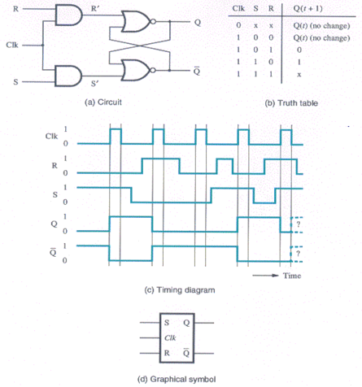
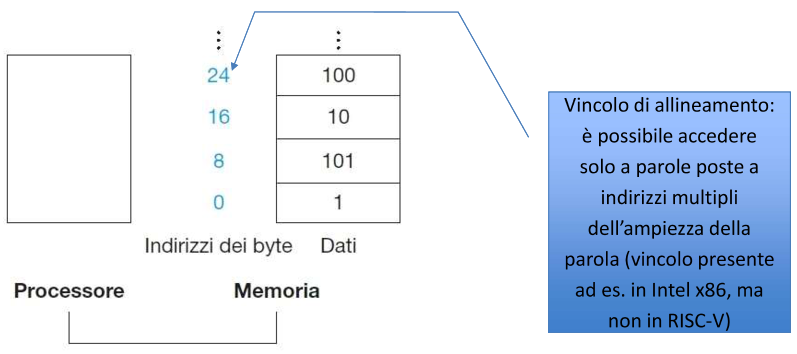
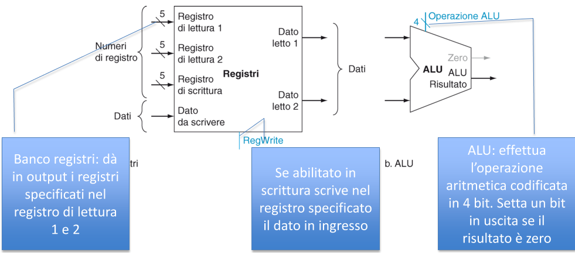
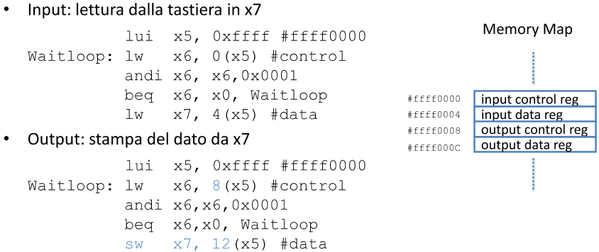

# [↓](#↑)


[TOC]


# ~~[1.][slide1] Introduzione~~

## ~~Software di sistema~~

- ~~**Sistema operativo**~~
  - ~~Gestisce le operazioni di I/O~~
  - ~~Alloca la memoria~~
  - ~~Consente il multitasking~~
- ~~**Compilatore**~~
  - ~~Traduce da linguaggio ad alto livello a linguaggio macchina~~


## ~~Linguaggio macchina~~

> ~~**Porta logica**: *componente base del calcolatore*~~

> ~~**Bit**: *unità base di informazione*~~

> ~~**Assembly**: *linguaggio mnemonico tradotto in sequenze di bit da un traduttore (assembler)*~~


## ~~Processore~~

~~**Parte attiva** del calcolatore, composto da~~

- ~~**Datapath**: esegue le operazioni aritmetiche sui dati~~

- ~~**Parte di controllo**: indica a datapath, RAM e componenti IO cosa fare in base di quanto stabilito dal programma~~


## ~~Memoria~~

- ~~**Volatile**~~
  - ~~**Memoria principale**~~
  - ~~Memorizza dati e programmi durante la loro esecuzione~~
- ~~**Non volatile / persistente**~~
  - ~~**Memoria di massa**~~
  - ~~Memorizza dati e programmi tra esecuzioni diverse~~


## ~~Astrazioni~~

Permettono di gestire un progetto complesso ==**nascondendone i dettagli**==

> **Instruction Set Architecture (ISA)**: *interfaccia dell'insieme delle istruzioni macchina che il processore (nascosto nei sui dettagli) offre al software*

> **Application Binary Interface (ABI)**: *interfaccia binaria delle applicazioni costituita dall'ISA e dall'interfaccia del SO*

Una volta definita una ABI, lo ==sviluppatore è **svincolato** da== come ==dettagli HW== sottostanti l'applicazione sono implementati


## ~~Prestazioni~~

==Compiti del **programmatore**==

- ==Comprendere la **gerarchia di memoria**==

- ==Fare uso efficiente del **parallelismo**==
  - Multithreading
  - GPU
  - Distributed computing

Per **valutare** le prestazioni di un computer si misura il ==**tempo necessario per l'esecuzione di un programma**==, che è il ==risultato di tre fattori== non trascurabili e con impatti differenti

- ==Numero di istruzioni==
- ==Cicli di clock per istruzione (CPI)==
- ==Frequenza di clock==

|      Componente HW / SW       |                      Cosa influenza                       |
| :---------------------------: | :-------------------------------------------------------: |
|           Algoritmo           |     #istruzioni di alto livello e di operazioni di IO     |
| Linguaggio, compilatore e ISA | #istruzioni macchina per ogni istruzione di basso livello |
|     Processore e memoria      |       Velocità di esecuzione di ciascuna istruzione       |
|         I/O (HW e SO)         |         Velocità di esecuzione fra le istruzioni          |

|   Componente    |                     Numero di istruzioni                     |                 CPI                  | f di clock |
| :-------------: | :----------------------------------------------------------: | :----------------------------------: | :--------: |
|  **Algoritmo**  |                    Risparmiare istruzioni                    | Istruzioni efficienti  con basso CPI |     -      |
| **Linguaggio**  |                       Traduzione in LM                       |     Numero di chiamate indirette     |     -      |
| **Compilatore** |           Istruzioni macchina per ogni istruzione            | Effetti complessi per ottimizzazione |     -      |
|     **ISA**     | Istruzioni di alto o basso livello (istruzioni per operazione) | Influenzato dalla sua progettazione  | Più spinte |


## ~~Barriera dell'energia~~

Le ==porte logiche== delle CPU ==**dissipano energia in fase di conduzione**== (commutazione tra 0 e 1)

C'è un ==**limite** alla capacità **di estrarre potenza e calore**== prodotti dalle CPU tramite dissipatori

> $$
> \text{Potenza = capacità}\cdot\text{tensione}^2\cdot\text{frequenza di commutazione}
> $$

La **frequenza di commutazione** è legata alla frequenza di clock

Dagli anni ’80 si è ==**aumentata la frequenza**== di 1000 volte a spese di un aumento di consumi di un fattore di 30, grazie all'==**abbassamento della tensione** da 5V a 1.2V==

Nell'impossibilità di scendere sotto 1V si è giunti a una **saturazione** delle prestazioni, quindi ora si punta ad ==aumentare il **parallelismo**==

Questo crea molte difficoltà al ==**programmatore**==

- ==**Correttezza**: difficoltà di debug==
- ==**Efficienza**: bilanciare il carico sulle CPU==


# [2][slide2][.][slide3] Aritmetica dei calcolatori

## ~~Informazione~~

~~Un computer è un insieme di **circuiti elettronici** in cui la corrente può **passare** (1) o **non passare** (0)~~

> **Bit**: *BInary digiT, minima informazione manipolabile*

> **Byte**: *sequenza di 8 bit*

> **Word**: *gruppo di bit (32 o 64) che determina la dimensione nativa dei dati usati da un computer*

~~Un computer memorizza e manipola solo **sequenze di bit**, che devono rappresentare **tutti i tipi di informazione**~~


## ~~Codifica delle informazioni~~

> **Codifica**: *funzione che associa una sequenza di bit ad un oggetto*/*entità*/*simbolo*

~~È la **rappresentazione digitale** di sequenze di bit per interpretarle come **informazioni utili**~~

> **Codifica su n bit**: *funzione che associa una sequenza di n bit ad ogni entità da codificare*

~~Permette di codificare **2^n^ entità distinte**~~


## Basi di numerazione

> **Base di numerazione $\boldsymbol B$**: *numero $B$ di cifre utilizzato nel sistema di numerazione*

> **Numero naturale**: *sequenza di $B$ possibili cifre (da $0$ a $B-1$)*

>  **Sistema posizionale**: *il valore di una sequenza di cifre si calcola sommando i prodotti di ogni cifra per una potenza di $B$ che dipende dalla posizione della cifra*
> $$
> N_B=\{c_k,c_{k-1},...,c_0\}=c_kB^k+c_{k-1}B^{k-1}+...+c_0B^0 = \sum_{i=0}^k c_i\cdot B^i
> $$


### Conversioni fra basi

- ==**Bin ↔ Hex**:  si converte una **terna di bit in una cifra esadecimale**== e viceversa (ogni cifra esadecimale corrisponde a 4 cifre binarie)
- ==**$\boldsymbol B$ → Dec**:  si **moltiplica** ogni cifra $c_i$ per $B^i$==
- ==**Dec → $\boldsymbol B$**:  si **divide iterativamente** $x_{10}$ per $B$==
  1. Divisione intera fra $x$ e $B$
  2. Il resto è la cifra da inserire a sinistra nel numero convertito
  3. Il quoziente viene assegnato ad $x$
  4. Ripeti


## ~~Codifica dei numeri naturali~~

~~Un numero binario su $k$ cifre può assumere valori fra $0$ e $2^k-1$~~

- ~~Valori comuni per $k$:  $8,16,32,64$~~

### ~~Operazioni~~

- ==**Moltiplicazione o divisione per potenze di due (shifting)**==

  ==$A \cdot 2^n \ \ \ \ \ A / 2^n$==

  Si aggiungo o tolgono $n$ cifre $0$ a destra di $A$

- ==**Somma**==

  ==$A+B+\text{Carry}=2\cdot\text{Carry}'+C$==

  ```c
  A B  c  |  c C
  0 0  0  |  0 0
  1 0  0  |  0 1
  0 1  0  |  0 1
  1 1  0  |  1 0
  0 0  1  |  0 1
  1 0  1  |  1 0
  0 1  1  |  1 0
  1 1  1  |  1 1
  ```

- ==**Sottrazione**==

  ==$2\cdot\text{Carry}+A-B=C$==

  ```c
  c A  B  |  C
  0 0  0  |  0
  0 1  0  |  1
  0 1  1  |  0
  1 0  1  |  1
  ```

  **Prestito**: nel caso $0-1$ si scorre a sinistra il minuendo fino a che non si trova un $1$ e si invertono tutte le cifre a destra di esso (compreso)

- ==**Moltiplicazione**==

  ==$A \cdot B = A \cdot b_1 + A \cdot b_2 +...+ A \cdot b_k$==

  Somma di shifting multipli


## Codifica dei numeri interi

- #### **Modulo e segno**

  - $k-1$ bit per il modulo e $1$ bit (il più significativo a sinistra) per il segno
  
    - Positivo:   $0\ + $ valore assoluto
    - ==Negativo:  $1\ +$ valore assoluto==
  
  - $2^k-1$ valori: due codifiche per lo $0$
  
  - Non facile da sommare
  
    
  
- #### **Complemento a 1**

  - Negativi si rappresentano tramite il complemento a 1 del valore assoluto
    - Positivo:	valore assoluto
    - ==Negativo:  inversione di $0$ e $1$==  ($-x=(2^k-1)-x$)
  - $2^k-1$ valori: due codifiche per lo $0$  ($0...0, \ 1...1$)
  - Più facile da sommare
    1. Sommare le rappresentazioni dei due numeri
    
    2. Sommare il riporto del bit più significativo al risultato
    
    3. Se i riporti delle due cifre più significative sono uguali il risultato è attendibile, altrimenti non è rappresentabile su $k$ bit
       
       

- #### **Complemento a 2**

  - Negativi si rappresentano tramite il complemento a 2 del valore assoluto
    - Positivo:    valore assoluto
    - ==Negativo:  complemento a 1 e somma di $1$==  ($-x=2^k-x$)
  - $2^k$ valori nel range $[-2^{k-1};\ 2^{k-1}-1)$: unica codifica per lo $0$
  - Facile da sommare:  $x+(-y)=x+(2^k-y)=2^k+x-y$


## ~~Aritmetica modulare~~

> **Aritmetica modulare**: *classi di equivalenza di modulo $n$*

> **Relazione di equivalenza**:  $a \equiv b \ \leftrightarrow \ a\%n=b\%n$

~~Un computer può utilizzare solo un **numero finito** $k$ di bit, quindi può rappresentare solo un **sottoinsieme** di $n=2^k$ numeri interi, tale che dopo il più grande si torni al più piccolo~~

- $[\ 0\ ;\ 2^k)$             →  $2^k\equiv0$
- $[-2^{k-1}\ ;\ 2^{k-1})$  →  $2^{k-1}\equiv-2^{k-1}$


### ~~Overflow~~

È possibile che su $k$ bit il valore $a*b$ ($* := \{+,-\}$) **non sia codificabile**

SO e applicazioni hanno il compito di segnalare e gestire un **errore di overflow**

- **Naturali con aritmetica modulo $2^k$**
  - <u>Operandi</u>:  $0\le a,b < 2^k$
  - <u>Overflow</u>:  $a*b \ge 2^k$
  - <u>Risultato</u>:  $a*b=(a*b)\%2^k$
- **Interi in complemento 2**
  - <u>Operandi</u>:  $-2^{k-1} \le a,b < 2^{k-1}$
  - <u>Overflow</u>:  $a*b\ge2^{k-1} \ \ \or \ \ a*b<-2^{k-1} \ \ \leftrightarrow \ \ a\cdot b >0$


## Codifica dei numeri reali

Necessitano **approssimazione** per rappresentarli con un numero finito $k$ di bit

- #### **Virgola fissa**
  
  - ==$k-f$  bit per la parte **intera**==
  - ==$f$  bit per la parte **frazionaria**==

**Conversione bin-dec**

==$x_{10}=\sum_{i=0}^kc_iB^{i-f}=B^{-f}\sum_{i=0}^kc_iB^i$==

Si converte il numero senza virgola in base 10 e si moltiplica per $B^{-f}$

**Conversione dec-bin**

  1. ==Si converte la parte intera== che occupa i primi $k-f$ bit
  2. ==Il bit nella posizione $f-i$ corrisponde a $c_{f-i}=\text{Int}(2\cdot M_i)$==
3. Si prende la mantissa ==$M_{i+1}=2\cdot M_i-\text{Int}(2\cdot M_i)$== e si ripete da 2

**Vantaggi**

  - Operazioni **semplici da implementare** e minori requisiti per la CPU

  - **Minori errori** di rappresentazione (quando possibile)
  
    
  
- #### **Virgola mobile**

  ==$f$ non è fisso==

  ==$x=M\cdot B^E \ \ \ \ \ \ M:\text{mantissa}, \ \ E:\text{esponente}$==

  - ==$m$  bit per la **mantissa** $M$==
  - ==$e=k-m$  bit per l'**esponente** $E$==

  ==$M$ e $E$ sono rappresentati in complemento 2 e possono essere negativi==

  **Vantaggi**

  - **Stessa gestione** per numeri grandi e piccoli


### Standard IEEE 754

==TUTTO==

[esempi slide 16, 17, 19][slide3]


- **Esponente**: $-(2^{e-1}-1)<E\le(2^{e-1}-1)$ range simmetrico, rappresentato come $E'=E+2^{e-1}-1\ge0$ (sommo ad $E$ il valore minimo così da renderlo positivo per semplificare i conti)
- **Mantissa**: modulo e segno (1 bit $s$ e $m$ bit per $M$)

Codifica a **32 bit**

- $s=1\rm\ bit$
- $e=8\rm\ bit$
- $m=23\rm\ bit$


Analisi dei casi di $E'$

- $E'>0$ → numeri **normalizzati**
  - $E = E'-(2^{e-1}-1)$
  - $1.M$  ($M\ge0$)
- $E'=0$ → numeri **denormalizzati**
  - $E = -(2^{e-1}-2)$
  - $0.M$  ($M>0$)

> $$
> x=(-1)^s\cdot2^E\cdot M
> $$

#### ~~Casi particolari~~

- **Numeri denormalizzati**:   $E=0, \ \ M>0, \ \ s\in\{0,1\}$
  - permettono di raggiungere valori ancora più vicini allo zero, infatti sono compresi fra zero e il minimo numero normalizzato rappresentabile
    ($0<|x_d|<\min(|x_n|)$)
  - Si verificano in caso di **underflow** (perdita di precisione in allontanamento dallo zero)
- **Due zeri** ($\pm0$):   $E=0, \ \ M=0, \ \ s\in\{0,1\}$
- **Due infiniti** ($\pm \infin$):   $E=\max(E)=2^{e-1}-1, \ \ M=0, \ \ s\in\{0,1\}$
- **Not a Number** (NaN):   $E=\max(E)=2^{e-1}-1, \ \ M>0, \ \ s\in\{0,1\}$


|   Categoria    |   $E'$    |      $M$      |    $s$    |
| :------------: | :-------: | :-----------: | :-------: |
|  Normalizzati  | $[1;254)$ | $[0;\max(M)]$ | $\{0,1\}$ |
| Denormalizzati |    $0$    |    $\ne0$     | $\{0,1\}$ |
|   $\pm$ Zero   |    $0$    |      $0$      | $\{0,1\}$ |
| $\pm$ Infinito |   $255$   |      $0$      | $\{0,1\}$ |
|  Not a Number  |   $255$   |    $\ne0$     | $\{0,1\}$ |


#### ~~Tipi floating point~~

|                 | `float` | `double` | `long double` | `long double` |
| :-------------: | :-----: | :------: | :-----------: | :-----------: |
| **Precisione**  | singola |  doppia  |    estesa     |   quadrupla   |
| $\boldsymbol k$ |   32    |    64    |      80       |      128      |
| $\boldsymbol e$ |    8    |    11    |      15       |      15       |
| $\boldsymbol s$ |    1    |    1     |       1       |       1       |
| $\boldsymbol m$ |   23    |    52    |      64       |      112      |


# [3.][slide4] Reti logiche

## ~~Porte logiche~~

I **computer** sono realizzati tramite **circuiti elettronici**, che possiedono due livelli di tensione:

- **Alto / assertito (1)**: associato alla tensione di alimentazione Vdd
- **Basso / negato (0)**: associato alla massa ($V=0$)

> **Porte logiche**: *circuiti che trasformano valori logici in input in altri valori logici in output*

- ==**Combinatorie**==
  - ==L'output dipende solo dal **valore di input**==
  - ==**Relazione funzionale** tra I/O== (ad uno stesso input corrisponde sempre lo stesso output)
  - Non hanno memoria (l'output dipende solamente dagli input nell'istante considerato)
- ==**Sequenziali**==
  - ==L'output dipende dalla **storia degli input** passati==
  - ==Hanno **memoria** (stato della rete)==


## Reti combinatorie

Una rete logica combinatoria è ==specificata tramite==

- ==Espressioni algebriche definite con l'**algebra di Boole**==
  - $\text {true} = 1; \ \ \text {false} = 0$
    
  - ${\bf not} (A) = 1 - A$
  - $A\ {\bf and}\ B = A \cdot B$
  - $A\ {\bf or}\ B = A + B$

  - ==**Leggi di De Morgan**:   $\overline{A\cdot B} = \overline A + \overline B; \ \ \ \overline{A+B} = \overline A \cdot \overline B$==

- ==**Tabelle di verità**: elencano i valori di output in corrispondenza delle combinazioni di input==

Gli **operatori booleani** fondamentali sono implementati da circuiti elettronici (**porte logiche**) che si possono combinare fra loro


### Programmable Logic Array

> **Forma canonica SP**: *espressione logica di somme (OR) di prodotti (AND)*

Permette di semplificare una ==tabella di verità in forma di **espressioni**, come somma delle configurazioni di input che corrispondono a un output asserito==

> **Programmable Logic Array (PLA)**: *struttura composta da due stadi (una barriera di AND seguita da una barriera di OR) che implementa una SP*

La **dimensione** del PLA è data dalla somma del piano AND (numero di minitermini) e del piano OR (numero di uscite)

~~Caratteristiche importanti~~

- ~~Ci sono porte logiche solo per le configurazioni di ingressi che producono 1~~
- ~~Se un minitermine  è condiviso fra varie uscite, può essere riutilizzato inserendolo una sola volta nel piano AND~~

> **Bus**: *insieme di fili gestito come un singolo segnale logico*


### ~~Decoder~~

Possiede ==$n$ ingressi e $2^n$ uscite==, in modo che ognuna delle $2^n$ possibili sequenze di bit in ingresso ==apre **una e una sola linea di uscita**==, diversa per ciascuna combinazione


### ~~Multiplexer~~

Possiede ==due ingressi $A$ e $B$== (collegati rispettivamente alle porte 0 e 1), ==un ingresso di controllo $S$ e un'uscita $C$==. Il Mux riversa sull'uscita $C$ il valore di della porta d'ingresso corrispondente al valore di $S$  (==$S=0→C=A$ , $S=1→C=B$==). Funziona come uno **scambio dei binari**


### ~~Multiplexer a N vie~~

Permette di mandare ==in uscita il **valore di una fra N linee**==, selezionata da un ==decoder==


### ~~Multiplexer a N bit~~

Permette di ==selezionare uno fra due bus a N​ bit da trasmettere in uscita==. In pratica è un ==**array di multiplexer**== che gestiscono singolarmente ogni cavo dei due bus, con un ==unico segnale di controllo== cortocircuitato fra tutti


## ~~Costo~~

> **Costo**: *somma del numero di porte e del numero di ingressi della rete*

Nella realtà è lo spazio occupato sul **silicio**

Possono esistere **diverse implementazioni** della stessa rete con costi diversi

> **Sintesi logica**: *minimizzazione di funzioni logiche*

- **Metodi sistematici**: applicazione iterativa di regole algebriche
- **Metodi grafici**: mappe di Karnaugh


## Reti sequenziali

==La **memoria** si ottiene con una **retroazione**== (o reazione) in modo da formare un ==anello in cui gli ingressi dipendono dalle uscite e viceversa== (gli ingressi memorizzano il passato della rete attraverso il valore delle uscite passate)

> **Reazione / Retroazione**: *ridirezionamento dell'output di alcune porte, in ingresso ad altre porte del medesimo stadio*


### ~~Elemento bistabile~~

La ==**retroazione fra due porte NOT**== porta a ==due configurazioni stabili== in cui gli ==output sono diversi== (output uguali sono transitori)


### ~~RS Latch~~

La ==**retroazione fra due porte NOR**== con ingressi $R$ e $S$ e uscite $Q^+$ e $Q^-$ può possedere ==tre configurazioni stabili== in cui ==almeno uno degli ingressi sia $0$==

- $R=1$  **reset** del valore di $Q^+$ a $0$
- $S=1$  **set** del valore di $Q^+$ a $1$
- $R=S=0$  ciclo che **memorizza** (mantiene invariato) il valore di $Q^+$


### Stati indecidibili e temporizzazione

==L'effetto del cambio di ingresso si propaga in un **tempo finito** sulle uscite==

In caso di uscite reazionate ciò può causare ==problemi di **indecidibilità**== dello stato della rete ($R=S=1 \ → \ Q^+=Q^-=\ ?$)

Per risolvere questo problema ==gli elementi di memoria sono **temporizzati** (**gated latch**), cioè governati da un **segnale di clock**==


### ~~SR Gated Latch~~

Il **==clock==** viene inserito come ==**ingresso di abilitazione** attraverso porte AND==

- $\rm Clk = 0$  forza gli ingressi $R$ e $S$ a $0$, quindi la rete non può cambiare stato
- $\rm Clk = 1$  lascia gli ingressi $R$ e $S$ invariati

Hanno sempre uno stato **indecidibile** ($R=S=1 \ → \ Q^+=Q^-=\ ?$)




### Latch-D

Gli ==ingressi== al circuito base dipendono da ==**una sola variabile** $\rm Data$==, perciò ==non può esserci ambiguità== per definizione ($S=D, \ \ R=\overline D, \ \ Q=D$)

Il circuito è sempre abilitato quando $\rm Clk=1$ e memorizza solo quando $\rm Clk=0$


### Flip-Flop master-slave

==L'uscita del circuito $Q$ commuta al valore di $D$ esattamente al termine dell'impulso di clock (**latch sensibile al fronte in discesa** (o salita) / **latch edge-triggered**)==


### Registri

==**Array di $N$ flip-flop** che registrano **word** di dati di $N$ bit==

- Caricano e memorizzano gli input sul **fronte in salita** del clock
- Memorizzano **informazioni di stato**
- Operano come **barriera** fra input e output


### Edge triggered

==Lo **stato successivo** è aggiornato e registrato dalla logica combinatoria solamente nei fronti di clock, a partire dallo stato attuale e da eventuali input esterni==

==Questo porta alla creazione di **macchine a stati**==


# [4.][slide5] ~~Codifica del testo~~

### ~~ASCII~~

 “American Standard Code for Information Interchange”

Rappresenta i caratteri come ==sequenze di **7 bit**== ($2^7=128$ caratteri diversi)

In un byte il bit **più significativo è sempre $\bf0$**

**Problemi**

- Rappresenta solo i ==caratteri dell'alfabeto **anglosassone**==


### ~~Extended ASCII~~

Usa ==**8 bit** per codificare caratteri addizionali== ($2^8=256$ caratteri diversi)

==**Varie estensioni**== per supportare vari alfabeti

- Un byte con il ==bit più significativo 0== è interpretato ==univocamente==
- Un byte con il ==bit più significativo 1​== è interpretato in base a ==diversi standard== (ISO 8859-x)

**Problemi**

- Codifica non univoca di caratteri non standard
- Problemi di compatibilità nella condivisione di documenti
- Non comprende alfabeti non anglosassoni


### ~~Unicode~~

==Codifica **univoca** di tutti i possibili caratteri su **4 byte**== (fino a $2^{32}$ simboli)

**Diversi tipi** di codifica a lunghezza variabile UTF-x

- UTF-8 è compatibile con ASCII a 8 bit


# [5.][slide6] Linguaggio Assembly

## Assembly

Per permettere al programmatore di utilizzare il **linguaggio macchina** e alla CPU di comprendere i **linguaggi ad alto livello** si utilizza un ==**linguaggio intermedio**==

> **Assembly**: *interfaccia della CPU composta da codici mnemonici in stretta corrispondenza (~ biunivoca) al LM*

È un linguaggio che rappresenta i ==**servizi** resi disponibili dalla CPU==

Ad ogni istruzione Assembly **corrisponde** una (sola) istruzione LM

> **Programma Assembly**: *file ASCII contenente la descrizione testuale delle istruzioni*

 ==Necessita di essere **compilato**== per essere eseguito dalla CPU

> **Assembler**: *compilatore da Assembly a linguaggio macchina*

Effettua una brutale ==**analisi lessicale**== del file di testo e una brutale ==**traduzione** da LA a LM==

Le istruzioni dipendo dalla CPU, quindi i programmi **non sono portabili**


## Instruction Set Architecture

> **ISA**: *insieme delle istruzione riconosciute dalla CPU*

L'ISA non fornisce solo un linguaggio ma una ==**specifica delle funzionalità** del processore==

Non è una semplice lista perché **per ogni istruzione** sono specificate

-  ==**Sintassi e semantica**==
- ==**Accesso ai dati**==
  - Registri (tipo e numero)
  - Indirizzamento (modalità di accesso alla memoria)

==L'ISA di una CPU **definisce** il suo **LM** e il suo **LA**== 

Per una **singola CPU** sono possibili più ISA e diversi LA

Uno **stesso ISA** può essere implementato in architetture diverse


## ~~Funzionamento di una CPU~~

La struttura di un programma in LA deriva direttamente dal **meccanismo di funzionamento** della CPU

1. ==**Fetch**: prelievo dell'istruzione dalla memoria, il cui indirizzo è memorizzato nel registro PC (Program Counter)==
   - ==**Spostamento** del puntatore **PC** all'indirizzo di memoria dell'istruzione immediatamente successiva==
2. ==**Decode**: decodifica dell'istruzione==
3. ==**Execute**: esecuzione dell'istruzione==

> **Programma**: *lista di istruzioni macchina eseguite prevalentemente in ordine sequenziale*

- **Istruzioni sequenziali**
  - Operazioni **aritmetico / logiche** (ALU)
  - Operazioni di **movimento dati**
- **Istruzioni non sequenziali**

  - Operazioni di **controllo del flusso** (salti che modificano il valore del PC)


## ~~Istruzioni Assembly~~

> **Istruzione Assembly**: *codice mnemonico seguito da eventuali operandi*

Le istruzioni in LA hanno un ==formato rigido==, composto da ==**istruzioni** e **operandi**==

> **Operandi**: *dati su cui opera un'istruzione*

I ==**dati**== su cui operano le IA possono essere

- ==**Immediati** (costanti)==
- ==Contenuti in **registri**==
- ==Contenuti in **memoria**==


### ~~Tipi di istruzioni~~

- ==**Aritmetiche e logiche**==
  - <u>Operandi</u>: generalmente ==due sorgenti e una destinazione== (talvolta implicita)
  - <u>Operazioni</u>: ==calcoli== che operano su operandi sorgente e producono un operando destinazione
  - Implementate dalla ==ALU==
- ==**Movimento di dati**==
  - <u>Operandi</u>: ==indirizzi da/a cui muovere==
  - <u>Operazioni</u>:
    - ==Spostamento== di dati fra registri
    - ==Caricamento== di costanti in registri o memoria
    - Caricamento di dati da memoria a registri o viceversa
- ==**Controllo del flusso / Salto**==
  - <u>Operandi</u>: ==nuovi valori per il PC==
  - <u>Operazioni</u>: ==manipolano il contenuto del PC==
  - Invocazione di ==subroutine== e ritorno da subroutine
  - Necessita di ==esecuzione condizionale e salvataggio== del valore del PC


## Registri

==Batterie di flip-flop-D **interni alla CPU**, reperibili in **un ciclo** di clock==

==Il **banco di registri** utilizzabili è definito dall'ISA== e varia in numero e tipo a seconda della **CPU**

- Numero variabile da 4 a 64
- General-purpose e registri specializzati

==La **sintassi** varia a seconda dell'**Assembly**==

- Nomi simbolici o numeri


## Esecuzione condizionale

> **Esecuzione condizionale**: *istruzioni eseguite solo se si verificano determinate condizioni*

Necessaria per implementare ==**selezioni** e **cicli** con istruzioni di **salto**== (in ARM tutte le istruzioni possono essere condizionate)

- ==**Predicati / Condizioni**==
  - ==**Confronto** fra valori di registri generici==
    Implementato da ==istruzioni di confronto==
  - ==Tramite valori di **flag**== contenuti in uno speciale registro
    Costantemente aggiornati e ==settati da istruzioni aritmetiche e logiche==
- ==**Istruzioni di confronto**==
  - ==**Set if ***: confronta due registri general-purpose e setta un terzo registro in base al risultato==
  - ==**`cmp`**: esegue sottrazione fra registri settando flag, ma scarta il risultato e lascia inalterati i contenuti==


## ~~ISA RISC e CISC~~

~~Esistono due tipologie differenti di **ISA** per gestire operandi e destinazioni, che possono variare in numero e locazione~~


### ~~Reduced Instruction Set Computer~~

- <u>Obiettivo</u>: ==semplificare al massimo== struttura e implementazione della ==**CPU**==

- <u>Caratteristiche</u>: ==efficiente, **regolare**== (==poche istruzioni poco potenti==, espresse sempre nella stessa maniera)

- <u>Operandi</u>: ==istruzioni A/L== hanno tutti i ==dati nei **registri**==; solo ==load e store== possono accedere alla ==memoria==

  - **Conseguenze**: ==molti registri per limitare i load/store==

- <u>Istruzioni A/L</u>:

  - ```assembly
    opcode dst, arg1, arg2
    ```

  -  tutti e tre registri, ma `arg2` può essere anche un ==valore immediato==

- <u>Accessi alla memoria</u>:

  - ```assembly
    ldsd reg, memory_location
    ```

- <u>Codifica istruzioni</u>: ==sintassi regolare e numero fisso di bit== (32 o 64)


### ~~Complex Instruction Set Computer~~

- <u>Obiettivo</u>: ==semplificare== la scrittura di ==**programmi Assembly**==
- <u>Caratteristiche</u>: ==maggiore **espressività**== (risparmia lo spostamento nei registri), maggior numero di ==**istruzioni**, potenti, flessibili, performanti== e con comportamenti più complessi
- <u>Operandi</u>: tutte le istruzioni possono avere ==operandi sorgente o destinazione in **memoria**==
- <u>Istruzioni A/L</u>: possono avere operandi sorgente e/o destinazione in ==memoria==, anche se spesso ci sono ==limiti / vincoli==
- <u>Accessi alla memoria</u>: ==istruzioni generiche==
- <u>Codifica istruzioni</u>: ==sintassi meno regolare e numero variabile di bit==


### ~~ISA a confronto~~

- **RISC-V**: RISC moderna e open source
  - Ha successo nella sperimentazione di architetture innovative e in applicazioni specifiche
- **ARM**: RISC “pragmatica”, via di mezzo con il CISC
  - Usata in moltissimi sistemi embedded
  - Modalità di indirizzamento complesse, molte istruzioni (complesse e potenti), meno registri (16)
- **Intel**: CISC con caratteristiche del RISC
  - Usata da milioni di PC
  - Esempio paradigmatico di architettura CISC


## Accessi alla memoria

Entrambe le ISA hanno l'argomento **`<memory_location>`** (indirizzo)

Varie ==modalità di **indirizzamento**==

1. ==**Assoluto**==: indirizzo costante codificato nell'IA (come ==valore immediato==)
   <u>Problematico</u> per indirizzi troppo grandi con RISC a n bit
2. ==**Indiretto**==: ==registro== contenente l'indirizzo codificato nell'IA
   <u>Utile</u> per implementare ==puntatori==
3. ==**Base + spiazzamento** (2+1)==: indirizzo ottenuto sommando ==valore immediato a registro (shift)==
   <u>Utile</u> per implementare ==array==
4. ==**Base + indice** (2+3)==: indirizzo ottenuto sommando ==registro a registro scalato / shiftato==
   <u>Utile</u> per implementare ==array== con elementi di dimensione $> 1$
5. ==**Base + indice + spiazzamento** (2+3+1)==: indirizzo ottenuto sommando ==registro, registro scalato / shiftato e valore immediato==

**ISA a confronto**

- ==**RISC**==: utilizza le modalità ==più semplici (1-3)==
- ==**CISC**==: anche con ==indice shiftato== (risparmia istruzioni nell'accesso ad array)
- ==**ARM**==: con ==indice shiftato== e pre/post-==incremento==


## ~~Memorizzazione di word~~

Un ==**byte**== viene rappresentato da ==**due cifre esadecimali**== (ciascuna corrispondente a 4 bit)

Una ==**word**== è memorizzata in una ==sequenza di byte posti a indirizzi progressivi==

```assembly
0xDC420DEA   # DC: byte più significativo
		     # EA: byte meno significativo
```

Due ==**convenzioni**== per la memorizzazione di una word

- ==**Little Endian**: byte meno significativo nell'indirizzo più basso==
  ==Intel e RISC-V==
- ==**Big Endian**==: byte più significativo nell'indirizzo più basso
  Motorola e protocolli Internet


## ISA e ABI

> **Instruction Set Architecture (ISA)**: *interfaccia dell'insieme delle istruzioni macchina che il processore (nascosto nei sui dettagli) offre al software*

> **Application Binary Interface (ABI)**: *interfaccia binaria delle applicazioni costituita dall'ISA e dall'interfaccia del SO*

- ==**ISA**: definisce **caratteristiche strutturali e istruzioni** di CPU e registri==
- ==**ABI**: insieme di **convenzioni software** che definiscono l'utilizzo dei registri==

==La **ABI** è un'**interfaccia software**, non propriamente parte dell'architettura==

- Data una ==CPU / ISA==, si possono avere ==**diverse ABI**==
- Permette di ==**interoperare** software diversi== (compilatori, librerie, parti SO)
- ==Specifica **convenzioni / protocollo di chiamata**==


## Instruction Set

> **Instruction Set (IS)**: *vocabolario di istruzioni di cui si compone il linguaggio di un computer, che ne precisa lessico, sintassi e semantica*

==Ogni tipo di **CPU / ISA** ha il proprio IS==, tuttavia senza eccessive differenze

**Von Neumann** nel 1947 osservò che *“certi [insiemi di istruzioni] in linea di principio si prestano a controllare l'hardware”*

Suggeriva tre **considerazioni** decisive di natura pratica

- **Semplicità** dei dispositivi richiesti
- **Chiarezza** delle applicazioni
- **Velocità** di esecuzione

All'interno di un IS devono necessariamente essere previste ==istruzioni per il calcolo delle **operazioni aritmetiche fondamentali**==

> **Programma memorizzato**: *istruzioni e dati sono memorizzati come numeri*


## ~~Procedure~~

~~**Scatola nera** che esegue un certo task senza che ne conosciamo i dettagli~~

==Pezzi di programma== che quando chiamati ==interrompono l'**esecuzione**== del programma attuale per poi ==ripristinarla nel punto immediatamente successivo==

==Il modo in cui il protocollo viene messo in pratica dipende da **ISA**, **ABI** e dalle convenzioni di chiamata del **compilatore**==

### ~~Protocollo / convenzioni di chiamata~~

Sono ==specificate nell'**ABI**== e non fanno propriamente parte dell'ISA

1. ==Come e dove **passare i parametri** di input==
   - Posti noti a priori
   - Stack o registri
2. ==**Trasferire il controllo** alla procedura==
   1. Acquisire le risorse necessarie
   2. Quali registri preservare
   3. Eseguire il compito
   4. Caricare i valori di ritorno in posti noti
   5. Restituire il controllo al chiamante
3. ==Prendere il **valore di ritorno** della procedura e **ripulire le tracce**==


# [6.][slide7] Assembly RISC-V

## Assembler

- ==**Destinazione**: primo operando== dell'istruzione
- ==**Operandi**==: vincolati ad essere (contenuti nei) ==registri==
- ==**Indirizzo**==: specificato tramite ==base (registro) + spiazzamento (costante)==
- **Commenti**: da `#` a fine riga


## ~~Principi ispiratori~~

> ~~**Principi~~ di progettazione**
>
> 1. La semplicità favorisce la regolarità
> 2. Minori sono le dimensioni, maggiore è la velocità
> 3. Un buon progetto richiede buoni compromessi

4. ==Ottimizzare le situazioni più comuni==


## ~~Operazioni aritmetiche~~

<u>Principio 1</u>: ==solamente istruzioni a **tre operandi**== (il modo più semplice di immaginare un'istruzione aritmetica)

```assembly
add a, b, c   # a = b + c
sub d, a, e   # d = a - e
```

Istruzioni complesse si ottengono a partire da **combinazione** di istruzioni semplici

```assembly
# a = b + c + d - e
add a, b, c
add a, a, d
sub a, a, e
```

```assembly
# f = (g + h) - (i + j)
add t0, g, h
add t1, i, j
sub f, t0, t1
```


## ~~Registri~~

<u>Principio 2</u>: ==**pochi registri**== (averne molti obbligherebbe i segnali a muoversi su distanze fisiche più lunghe, perciò sarebbe necessario rallentare il clock)

==Contiene **32 registri a 64 bit**==

- ==**Word**: gruppi di 32 bit==
- ==**Double word**: gruppi di 64 bit==

Sono necessari ==32 registri== perché così ciascuno può essere ==codificato in **5 bit**==

```assembly
# f = (g + h) - (i + j)
add x5, x20, x21
add x5, x22, x23
sub x19, x5, x6
```

Il ==vincolo di **operare solo fra registri**== per le operazioni A/L

- ==**Semplifica**== notevolmente il progetto del==l'**hardware**==
- Necessita di ==istruzioni di **trasferimento**==


### ~~Convenzioni di chiamata~~

- `x0`  registro read-only dedicato alla costante 0
- `x1 (ra)`  return address
- `x2 (sp)`  stack pointer
- `x3 (gp)`  global pointer
- `x4 (tp)`  thread pointer
- `x8 (fp)`  frame pointer
- `x5-x7, x28-x31`  registri temporanei
- `x8-x9, x18-x27`  registri da preservare
- `x10-x17`  parametri di ingresso e valori di ritorno
- `x10`  valore di ritorno


[↓](###Protocollo di chiamata)

## Memoria

==**Locazioni** di memoria **successive** strutturate in sequenze di byte, associate a indirizzi consecutivi==

Nonostante sia spesso permesso l'accesso a un singolo byte, la maggior parte delle volte ==si utilizzano multipli di 4 o 8 byte, chiamati **word** e **double word**==

> **Locazione allineata**: *accesso a parole poste a indirizzi multipli dell'ampiezza della parola*

==RISC-V **non vincola** l'allineamento==, a differenza di Intel x86 





### ~~Trasferimento~~

~~Per accedere / caricare una word, double word o un byte è necessario specificarne l'**indirizzo**~~

Nell'assembler di RISC-V l'==indirizzo== è specificato tramite una ==**base** (in un registro) e un **offset** (spiazzamento costante)==

**Load double word** contenuta in memoria in un registro

```assembly
ld x9, 8(x22)   # ld: 'l' = "load", 'd' = "double word"
# <op_load> <reg_dst>, <const_offset>(<reg_base>)
# carica in x9 la double word all'indirizzo dato da x22 + 8
```

**Load** e **store** in un array

```assembly
# A[12] = h + A[8]
ld x9, 64(x22)   # x9 = x22 + 8*8 (ottava dw in x22+8*8)
add x9, x9, x21  # x9 = x9 + x21  (h è in x21)
sd x9, 96(x22)   # &A[12] = x22 + 12*8
				 #  A[12] = x9
```


### ~~Register spilling~~

~~Tipicamente i programmi contengono **più variabili** che registri~~

> **Register spilling**: *caricamento delle variabili in uso in un dato momento nei registri e scaricamento di quelle inutilizzate*

==Operazione eseguita dal **compilatore** che stima il **working set** ed inserisce nel codice Assembly le operazioni di load/unload appropriate==


## ~~Operandi immediati o costanti~~

```assembly
# f = f + 4
```

- <u>Approccio 1</u>: tutti gli operandi costanti delle operazioni aritmetiche sono memorizzati in una **zona di memoria predefinita**

	```assembly
	ld x9, IndCost4(x3)  # costante 4 all'indirizzo x3 + IndCost4
	add x22, x22, x9
	```
	
	**Inefficiente**: necessita ogni volta di **load** (<u>principio 4</u>)
	
- <u>Approccio 2</u>: ==**meccanismo linguistico** (istruzione) che gestisce operazioni immediate in modo efficiente senza dover accedere alla memoria==

  ```assembly
  addi x22, x22, 4   # 'i' = "immediate"
  ```


### ~~Costante 0 (zero)~~

<u>Principio 4</u>: ==**registro ad hoc** read-only `x0` dedicato alla costante 0==

Lo zero è utile per **semplificare operazioni**

- ==**Spostamento** di un registro in un altro==

  ```assembly
  add x21, x20, x0   # x21 = x20
  ```


## Rappresentazione delle istruzioni

Per rappresentare un'==istruzione== tramite un ==**codice numerico univoco**== occorre

- Un codice che indichi l'==**operazione**== da eseguire
- Altri codici che indichino gli ==**operandi**==

==Ogni istruzione è codificata in una **word** a 32 bit==

I ==**registri**== sono numerati da 0 a 31, quindi possono essere specificati come operandi a ==**5 bit**== nel codice dell'istruzione

- ==**Formato R**: istruzioni fra registri==

  ```assembly
  add x9, x20, x21
  ```

  |   Campi    |  funz7  |  rs2  |  rs1  | funz3 |  rd   |  codop  |
  | :--------: | :-----: | :---: | :---: | :---: | :---: | :-----: |
  |  **Bit**   |    7    |   5   |   5   |   3   |   5   |    7    |
  | **Es bin** | 0000000 | 10101 | 10100 |  000  | 01001 | 0110011 |
  | **Es dec** |    0    |  21   |  20   |   0   |   9   |   51    |

- ==**Formato I**: istrzioni immediate== (con un operando immediato)
  ```assembly
  ld x9, 64(x22)
  ```

  |   Campi    | const or addr |  rs1  | funz3 |  rd   |  codop  |
  | :--------: | :-----------: | :---: | :---: | :---: | :-----: |
  |  **Bit**   |      12       |   5   |   3   |   5   |    7    |
  | **Es bin** | 000001000000  | 10110 |  011  | 01001 | 0000011 |
  | **Es dec** |      64       |  22   |   3   |   9   |    3    |

==**Campi** dell'istruzione==

- ==**codop**: codice operativo dell'istruzione==
- ==**funz7** e **funz3**: codici operativi aggiuntivi (tipo istruzione)==
- ==**rs1** e **rs2**: primo e secondo operando sorgente (reg src)==
- ==**rd**: operando destinazione (reg dst)==


```assembly
# A[30] = h + A[30] + 1
ld x9, 240(x10)
add x9, x9, x21
addi x9, x9, 1
sd x9, 240(x10)
```


## ~~Trade-off~~

<u>Principio 3</u>: ==**compromesso per regolarità** delle istruzioni è la codifica in 32 bit==

Questa scelta costa in termini di ==**limiti**==

- ==Numero di **istruzioni**==
- ==Numero di **registri**==
- ==Modalità di **indirizzamento**==

Ma permette di ==guadagnare in **efficienza**==


## ~~Sintesi~~

- ==Ciascuna **istruzione** viene espressa come **codice binario di 32 bit**==
- ==Un **programma** consiste in una **sequenza di numeri binari**==
- ==Tale **sequenza** è scritta in **locazioni consecutive di RAM**==
- ==In **momenti diversi** possono essere rappresentati **programmi diversi**==


## ~~Codici delle istruzioni~~


[slide8][] prime due immagini


## ~~Operazioni logiche~~

I calcolatori odierni possono ==operare su **porzioni di word**, fino al singolo **bit**==

RISC-V fornisce **istruzioni** che fanno ciò in maniera **semplificata** e **efficace**


### ~~Shift~~

==Opera su **n bit**==

- ==**Logico**: trasla l'intera word di n posizioni a sx o dx, inserendo bit uguali a 0== ad un estremo e eliminando quelli in eccesso all'estremo opposto

  - **A sinistra**: inserisce zeri nella posizione meno significativa e trasla a sx

    ```assembly
    slli x11, x19, 4   # x11 = x9 * 2^4
    ```

    

    <u>Corretto</u> nel **range di rappresentabilità** con interi senza segno o comp 2

    <u>Problema</u>: numeri non correttamente rappresentabili per **overflow**

  - **A destra**: inserisce zeri nella posizione più significativa e trasla a dx

    ```assembly
    srli x11, x19, 4   # x11 = x9 / 2^4
    ```

    <u>Corretto</u> con interi **positivi** o senza segno

    <u>Problema</u>: strutturale, intrinseco all'operazione, con numeri negativi

- ==**Aritmetico a destra**: come il logico ma inserendo bit uguali al bit del segno (estensione di segno)==

  <u>Risolve</u> il problema dello shift logico a destra


### ~~Operazioni bit a bit~~

==Operano su **ciascun bit**==

- ==**AND**==

  ==Resetta alcuni **bit a 0** usando come operando una **maschera**==, i cui bit corrispondenti a quelli che si vogliono annullare sono settati a 0

  ```assembly
  and x9, x10, x11
  ```

- ==**OR**==

  ==Setta alcuni **bit a 1** usando come operando una **maschera**==, i cui bit corrispondenti a quelli che si vogliono settare sono settati a 1

  ```assembly
  addi x10, x0, 0x000F  # x10 = 00...001111
  slli x10, x10, 60     # x10 = 111100...00
  or x9, x9, x10        # x9  = 1111xx...xx
  ```

- ==**XOR**==

  ==Setta a 1 i bit quando **uno solo** dei corrispondenti bit degli operandi è 1==

  ```assembly
  xor x11, x9, x10
  ```

  ```assembly
  xor x9, x9, x9    # resetta l'intero registro
  ```

- ==**NOT**==

  È un ==operando **unario**==, quindi ==non è fornito nativamente== nel RISC-V

  Si può ottenere dallo XOR come ==${\rm not}(A) = {\rm xor}(A,1)$==

  ```assembly
  addi x10, x0, 0xFFFFFFFF
  xor x9, x9, x10
  ```

- ==**Rotazione**==

  ==**Sposta** gli n bit più significativi sui bit meno significativi== (o viceversa)

  ```assembly
  srli x10, x9, 60   # x10 = 00...00xxxx
  slli x9, x9, 4     # x9  = yy...yy0000
  or x9, x9, x10     # x9  = yy...yyxxxx
  ```

  

## Salto condizionato

Il calcolatore può ==**alterare il flusso** del programma (salto condizionato) al verificarsi di certe **condizioni** sui registri== (costrutto if nelle varie forme)

Diverse **istruzioni** di salto per le condizioni, con ==sintassi==

```assembly
branch_on_cond rs1, rs2, L1
```

- ==**branch_on_cond**: istruzione condizionale==
- ==**rs1** e **rs2**: registri da confrontare==
- ==**L1**: label simbolica o indice di incremento per il PC==

| Branch on        | RISC-V            | Pseudo code `if ... goto` |
| ---------------- | ----------------- | ------------------------- |
| equal            | `beq x5, x6, 10`  | `(x5 == x6) PC + 10`      |
| not equal        | `bne x5, x6, 10`  | `(x5 != x6) PC + 10`      |
| lower than       | `blt x5, x6, 10`  | `(x5 < x6) PC + 10`       |
| greater or equal | `bge x5, x6, L1`  | `(x5 >= x6) L1`           |
| lt unsigned      | `bltu x5, x6, L1` | `(x5 < abs(x6)) L1`       |
| ge unsigned      | `bgeu x5, x6, L1` | `(x5 >= abs(x6)) L1`      |

==L'**assembler** risolve alla fine le **label simboliche** traducendola in un **indirizzo**==


### Costrutto if

```assembly
# if (i == j) f = g + h; else f = g - h;
	  bne x22, x23, ELSE  # salto a ELSE se x22 != x23
	  add x19, x20, x21
	  beq x0, x0, ESCI    # salto incondizionato a ESCI
ELSE: sub x19, x20, x21
ESCI: ...
```

Sintassi **identica** per gli altri costrutti condizionali


### Cicli

```assembly
# while (salva[i] == k) i += 1;
Ciclo: slli x10, x22, 3    # x10 = 8 * i
	   add x10, x10, x25   # x10 = salva + x10 = & salva[i]
	   ld x9, 0(x10)	   # x9 = salva[i]
	   bne x9, x24, Esci   # if (salva[i] != k) Esci
	   addi x22, x22, 1    # i += 1
	   beq x0, x0, Ciclo
Esci:  ...
```


### Blocchi di base

> **Blocco di base**: *sequenza di istruzioni che non contiene né istruzioni di salto, né etichette di destinazione* (con l'eccezione rispettivamente dull'ultima e della prima)

Sequenze di istruzioni tra due salti condizionali (conditional branch), estrmamente importanti per il **compilatore**

Una delle prime fasi della **compilazione** è individuare i blocchi base

Tutti i cicli ad **alto livello** sono implementati con blocchi di base


### Range di un array

Verificare se un indice (`x20`) è fuori dal ==limite di un array== (`[0,x11]`)

```assembly
bgeu x20, x11, OutOfRange
```

==Il **salto** a `OutOfRange` avviene sia quando `x20>=x11`, che quando `x10<0`==


### Costrutto switch / case

In caso di ==**case consecutivi**==

1. ==Memorizzare in un **array** i vari indirizzi== dei codici da eseguire (rami)
2. ==Caricare in un **registro** l'indirizzo a cui saltare==
3. ==**Saltare** all'indirizzo puntato dal registro== tramite l'istruzione **`jalr`** (jump and link register)

```assembly
# switch (a) { case 1: ... ;  case 2: ... ; }
slli x9, x10, 3   # a == x10;  x9 = 8 * a
add x9, x9, x11   # x11 == & TABLE;  x9 = & TABLE[a]
ld x12, 0(x9)     # x12 = TABLE[a]
jalr x1, x12      # salto all'indirizzo contenuto in x12
```


### Jump and link

Le istruzioni `jal` (jump and link) e `jalr` (jump and link register)

1. ==Memorizzano l'istruzione successiva `PC+4` in un registro==
2. ==Effettuano il salto==

```assembly
jal  x1, 8       # x1 = PC + 4;  goto PC + 8
jalr x1, 4(x5)   # x1 = PC + 4;  goto x5 + 4
```


## Procedure

### Protocollo di chiamata

L'idea di base è cercare di ==usare i [registri](###Convenzioni di chiamata) quando possibile==

Il ==**valore di ritorno**== per la chiamante è memorizzato ==in `x10`==

L'==**indirizzo di ritorno** in `x1`== viene usato nelle istruzioni **jump and link register**

Alla ==**fine della procedura**== è sufficiente fare un ==salto a `x1`== senza salvare il PC

```assembly
jalr x0, 0(x1)   # macro ret
```


### Stack

Zona di memoria con una struttura LIFO utilizzata ==quando i **registri** sono **insufficienti**==

- ==Più di 8 parametri di chiamata==
- ==Parametri troppo grandi per un registro (struct)==

- ==Variabili locali in eccesso==
- ==Valori di registri che dovranno essere ripristinati==

==La cima è puntata dallo **stack pointer** `sp` memorizzato nel registro `x2`==

I parametri in eccesso vengono caricati nello stack (**push**) a partire da `sp`

==Lo stack cresce **verso il basso**: `addi sp, sp, -8`==

==Al termine di una procedura vengono effettuate operazioni di **pop** per ripulire lo stack alla situazione precedente==


### Fasi della procedura

0. ==**Linking**: l'assembler traduce e collega le lables a indirizzi== 

1. ==**Prologo**: la procedura salva in memoria tutte le risorse (registri) che utilizzerà, in modo da poterle ripristinare al termine==

   Può essere necessario allocare nello stack lo spazio per le variabili locali

2. ==**Esecuzione**: operazioni della procedura==

3. ==**Epilogo**: set del valore di ritorno e ripristino dei registri utilizzati (salvati)==


#### ~~Esempio foglia~~

```c++
int esempio_foglia (int g, int h, int i, int j) {
    int f;
    f = (g+h) - (i+j);
    return f;
} // tutti long long int
```

<u>Parametri in input</u>: `g=x10; h=x11; i=x12; j=x13`

<u>Variabile locale</u>: `f=x20`

<u>Registri temporanei</u>: `x5, x6`

<u>Registri utilizzati / da salvare</u>: `x5, x6, x20`

```assembly
# LINKING
esempio_foglia:
# PROLOGO
	addi sp, sp, -24   # allocare spazio per 3 dw
	sd x5, 16(sp)      # salvataggio dei registri
	sd x6, 8(sp)
	sd x20, 0(sp)
# ESECUZIONE
    add x5, x10, x11   # operazioni aritmetiche
    add x6, x12, x13
    sub x20, x5, x6
# EPILOGO
    addi x10, x20, 0   # copia di x20 in x10 in ra
    ld x20, 0(sp)      # ripristino dei registri
    ld x6, 8(sp)	   # utilizzati (top)
    ld x5, 0(sp)
    addi sp, sp, 24    # ripristino dello stack (pop)
    jalr x0, 0(x1)     # salto al chiamante
```

**In realtà** nessun compilatore farebbe questo

- I registri temporanei `x5-x7,x28-x31` non sono salvati in caso di chiamata
- ==Solo il contenuto dei registri `x8-x9,x18-x27` deve essere preservato==

```assembly
esempio_foglia:  # ottimizzato f = (g+h) - (i+j);
	add x5, x10, x11
	add x6, x12, x13
	sub x10, x5, x6
	jalr x0, 0(x1)
```


### Complicazioni

- ==Variabili locali e di input che **eccedono il numero di registri**==
- ==**Procedure annidate**==
  - Sovrascrittura di `x1`, che rende impossibile il ritorno alle chiamanti
  - Sovrascrittura di `x10`, utilizzato per parametri di input e valore di ritorno

==<u>Soluzione</u>: allocare le variabili e salvaguardare i valori `x1` e `x10` nello **stack**==

#### ~~Esempio ricorsivo - fattoriale~~

```c++
int fact (int n) {
    if (n < 1) return 1;
    else return n * fact(n-1);
}
```

```assembly
fact:
#1 Creare spazio nello stack e salvare x1 e x10
	addi sp, sp, -16    # allocare spazio per 2 registri
	sd x1, 8(sp)        # salvataggio dei registri
	sd x10, 0(sp)
#2 Testare se n < 1
	addi x5, x10, -1    # calcolo x5 = n-1
	bge x5, x0, L1      # salto a L1 se n-1 >= 0
#3 Se n < 1, terminare la procedura e ritornare 1
	addi x10, x0, 1     # caricare il valore di ritorno
	addi sp, sp, 16     # ripulire lo stack
	jalr x0, 0(x1)      # ritornare al programma chiamante
L1:
#4 Se n >= 1, decrementare n e richiamare fact
	addi x10, x10, -1   # x10 = n-1
	jal x1, fact		# chiamata a fact(n-1) e salvataggio x1
#5 Ripristinare x1 e x10 e ripulire lo stack
	addi x6, x10, 0		# caricare fact(n-1) in x6
	ld x10, 0(sp)		# ripristinare x10
    ld x1, 8(sp)		# ripristinare x1
	addi sp, sp, 16		# ripulire lo stack
#6 Moltiplicare fact(n-1) in x6 per n in x10
	mul x10, x10, x6	# return n*fact(n-1)
	jalr x0, 0(x1)		# salto al programma chiamante
```

#### ~~Tail recursion~~

```c++
int sum (int n, int acc) {
    if (n > 0) return sum (n-1, acc+n);
    else return acc;
}
```

```assembly
# Compilazione base
sum:
	addi sp, sp, -16 	# convenzione del gcc per il fp
	sd x1, 8(sp)
	addi x5, x0, 1
	blt x10, x5, .LBBO_2
	addi x5, x10, -1
	add x11, x11, x10
	add x10, x5, x0
	call sum			# macro per jal x1, fact
	add x11, x0, x10
.LBBO_2:
	add x10, x0, x11	# caricare il rv in x10
	ld x1, 8(sp)		# ripristinare x1
	addi sp, sp, 16		# ripristinare lo stack
	ret					# macro per jalr x0, 0(x1)
```

```assembly
# Compilazione ottimizzata (tail recursion)
sum:
	addi x5, x0, 1
	blt x10, x5, .LBBO_2
	addi x5, x10, -1
	add x11, x11, x10
	add x10, x5, x0
	beq x0, x0, sum 	# salto incondizionato
	add x11, x0, x10
.LBBO_2:
	add x10, x0, x11
	ret
```


## Storage class

### Variabili statiche

Le **variabili statiche** sono memorizzate in una ==zona di memoria specifica==

- ==Allocata e inizializzata all'inizio del codice e deallocata solo alla fine==
- ==Accessibile attraverso il registro `x3`, chiamato `gp` (**global pointer**)==


### Variabili locali

> **Record di attivazione / Stack frame**: *segmento di stack che contiene registri salvati e variabili locali relativi a una procedura*

Le variabili vengono individuate tramite un **offset** a partire da un puntatore

Alcuni programmi utilizzano il ==registro `x8`, chiamato `fp` (**frame pointer**)==

- ==Punta alla **prima double word** del frame di una procedura==
- ==Usato come **base** perché mantenuto costante durante la procedura==


### Variabili dinamiche

Le variabili dinamiche sono ==memorizzate nello **heap**==

- ==Situato nella stessa zona di **memoria dello stack**==
- ==Procede per **indirizzi crescenti** (cresce verso l'alto)==


[Esempi RISC-V][slide10]

https://godbolt.org


# [7.][slide11] Assembly Intel

Architettura **CISC** largamente utilizzata da computer e in costante evoluzione, con ==attenzione alla **retrocompatibilità**==

Ha cercato di estrarre le ==**best practices** dal RISC==


## Registri

### General purpose

Numero relativamente elevato derivante dal **RISC**

==**16** registri a **64 bit**, con nomi numerici o mnemonici preceduti dal prefisso `%`== 

==I registri a 64 bit **estendono** registri a 32, che a loro volta ne estendono 16 e 8==, per questioni evolutive e di retrocompatibilità

==È possibile utilizzare tutti i registri a 64, 32, 16 o 8 bit (**meno significativi**)==


### ~~Registri speciali~~

- ==`%rip`  instruction pointer “visible” (PC)==
- ==`%rflags`  flag register==
  - ==Bit di stato settati da istruzioni **logico aritmetiche** e di **confronto**==
    Usati da istruzioni di ==**salto condizionale**==
    - ==`CF`  carry flag== (1 se unsigned overflow o carry-out)
    - ==`ZF`  zero flag== (1 se zero)
    - ==`SF`  sign flag== (1 se negativo)
    - ==`OF`  2's overflow flag== (1 se overflow)
  - Altri ==monitorano la CPU== e ne controllano il funzionamento  (`IF`)
- Registri di segmento della memoria


### ~~Convenzioni di chiamata~~

==TUTTO==

- Primi 6 argomenti: `%rcx %rdx %rsi %rdi %r8 %r9`
- Altri argomenti (7 o più, fat interface): `stack`
- Valori di ritorno: `%rax`
- Registri preservati: `%rbp %rbx %r12-%r15`
- Registri non preservati: `%rax %r10 %r11` + argomenti

**Note**

- `%rsp`  stack pointer
- `%rbp`  base pointer (fp)
- `%rsi %rdi`  copia di array (src e dst index)


## Modalità di inditizzamento

- ==Istruzioni prevalentemente a **2 operandi**==
  - ==**Secondo operando** sia sorgente che **destinazione implicita**==
  - **Limitazione** rispetto a RISC-V: impossibile specificare 2 operandi e una destinazione diversa
- ==**Sorgente** (primo operando)==
  - ==Immediato== (costante preceduta da `$`, eg `$420`)
  - ==In registro== (valore di un registro, eg `%rax`)
  - ==In memoria== (valore in locazione di memoria, eg `0x0100A8`, `420`)
- ==**Destinazione** (secondo operando)==
  - ==In registro== (registro come destinazione, eg `%rdx`)
  - ==In memoria== (locazione di memoria specificata da un indirizzo)
- Ammesse operazioni che consentono di **scrivere su registri e memoria**
  - ==<u>Vincolo</u>: **massimo un operando** in memoria==


### Indirizzamento in memoria

==**Accesso indiretto** a locazione di memoria==

==<u>Sintassi</u>:  `displacement (base, index, scale)`==

==<u>Indirizzo</u>:  `displacement + base + index * scale`==

- ==`displacement`: costante a 8, 16 o 32 bit (offset)==
- ==`base`: valore in registro==
- ==`index`: valore in registro==
- ==`scale`: costante 1, 2, 4, 8 (dimensione in byte degli elementi)==

**Casi speciali** con argomenti nulli (uguali a 0)

- Niente scala:  `displacement (base, index)`
- Niente scala e indice:  `displacement (base)`
- Niente scala, indice e spiazzamento:  `(base)`
- Niente spiazzamento:  `(base, index, scale)`


### Limitazioni

==Non è consentito avere **entrambi** gli operandi **in memoria**==

```assembly
movl 345, (%eax)
```

==<u>Soluzione</u>: utilizzare un **registro d'appoggio**==

```assembly
movl 345, %ebx
movl %ebx, (%eax)
```

**Combinazioni valide**

- Imm → Reg / Mem
- Reg  → Reg / Mem
- Mem → Reg
  


## Istruzioni

==<u>Sintassi</u> (in genere): `opcode src, dst`==

- ==Il carattere finale di **opcode** indica la dimensione in bit degli operandi==
  ==(`b`: 8 bit, `w`: 16 bit, `l`: 32 bit, `q`: 64 bit)==
- ==I nomi dei **registri** iniziano con `%`==
- ==I valori **immediati** iniziano con `$`==
- ==Gli **indirizzi diretti** (costanti) sono semplici numeri==


### ~~Istruzioni più comuni~~

==TUTTO==

- **Aritmetiche**

  - `add sub`  senza carry
  - `adc sbc`  con carry
  - `mul div`  signed
  - `imul idiv`  unsigned
  - `inc dec`  somma / sottrae 1 (non richiede di codificare `$1`)

- **Logiche**

  - `and or xor not`  booleane bit a bit
  - `neg`  complemento a 2
  - `rcl rcr rol ror`  rotate
  - `sal sar shl shr`  shift aritmetico e logico
  - `clc stc cld cmc`  modificano i flag

- **Dati**

  - `mov`  copia dati da src a dst
    
    - `movsx`  con estensione del segno
    - `movzx`  con estensione con 0
    - `cmov<cond>`  copia se `<cond>` è verificata
    
  - `push`  inserisce dati sullo stack

    - Sintassi: `pushq %reg`
    - Equivale a: `subq $8, %rsp;  movq %reg, (%rsp)`
  
  - `pop`  rimuove dati dallo stack

    - Sintassi: `popq %reg`
- Equivale a: `movq (%rsp), %reg;  addq $8, %rsp`
  

### Istruzioni condizionali

- **Confronto**

  - `cmp a, b`
    - Effettua `b - a` e setta flag (`b<a`→`SF`, `b=a`→`ZF`)
  - `test a, b`
    - Effettua `b & a` e setta flag
    - Spesso usato con `a = b`  (`a=a=0`→`ZF`, `a<0`→`SF`)
  - Il risultato non è memorizzato e gli argomenti non sono modificati
  - Da usare prima di salti condizionali

- **Salti**

  - `jmp`  salto incondizionato

  - `j<cond>`  salti condizionati

    

  - Varie istruzioni condizionali (derivate da ARM)

- **Procedure**

  - `call`  chiamata a procedura
    - Fa push sullo stack del RA della prossima istruzione (PC)
    - Modifica il PC per andare all'inizio della procedura desiderata
    - Implicitamente esegue: `subq $8, %rsp;  movq %rip, (%rsp)`
  - `ret`  ritorno da procedura
    - Fa pop dallo stack del RA e lo memorizza in `%rip`
    - Modifica il PC per andare alla prossima istruzione del chiamante
    - Implicitamente esegue: `movq (%rsp), %rip;  addq $8, %rsp`

- **Load effective address**

  - `lea`  **calcola indirizzi** (con indirizzamento indiretto) senza fare accessi

  - Usa hardware di calcolo di indirizzamento per le **operazioni aritmetiche**

    - **Copia l'indirizzo** di sorgente nel registro di destinazione

      ```assembly
      lea 80(%rdx, %rcx, 2), %rax  # %rax = %rdx + 2*%rcx + 80
      ```

    - Spesso usata come **istruzione aritmetica** di somma con tre registri

      ```assembly
      lea (%rdx, %rcx), %rax  # %rax = %rdx + %rcx
      ```

- `nop`  no operation

[Esempi sulle slides 20-23, 26-40][slide11]


# [8.][slide12] Assembly ARM

==TUTTO==

Usata dalla maggior parte di dispositivi **mobili** e **embedded**

Nasce a 32 e solo di recente è passata a **64 bit**, senza molta retrocompatibilià

È una **famiglia** di CPU con ISA leggermente differenti

Architettura **RISC pragmatica**: il meglio di RISC e Intel, in forma ottimizzata

- Molte modalità di **indirizzamento** anche potenti
- Sviluppato per ovviare ai **problemi** di RISC
- Punta al **risparmio energetico**


## ~~Registri~~

- 15 registri **general purpose** a 32 bit (`r0-r14`)
  - `r13 (sp)`  stack pointer
  - `r14 (lr)`  link register (return address)

- Registri **speciali**
  - `r15 (pc)`  PC e flags (bit 28-31 per esecuzione condizionale)
  - Flag registers
    - `apsr`  application program status register
      - `Z`  zero
      - `C`  carry
      - `N`  negative
      - `V`  overflow
    - `cpsr`  current program status register

L'utilizzo dei registri non è forzato dall'ISA, ma **convenzione** dell'ABI (!= Intel)


### ~~Convenzioni di chiamata~~

- Primi 4 argomenti: `r0-r3`
- Altri argomenti (più di 4): `stack`
- Valori di ritorno: `r0 r1`
- Registri preservati: `r4-r11`
  - In alcune ABI `r9` non è preservato
- Registri non preservati: `r0-r3 r12 (r9)`


## Istruzioni condizionali

Lista dei suffissi delle istruzioni che vengono eseguite in base ai **flags** di `apsr` settati dall'**operazione precedente** (con suffisso `s`)

| Suffisso |        Significato         |      Flags       |
| :------: | :------------------------: | :--------------: |
|   `eq`   |           equal            |     `Z = 1`      |
|   `ne`   |         not equal          |     `Z = 0`      |
| `hs/cs`  | higher or same / carry set |     `C = 1`      |
| `lo/cc`  |    lower / carry clear     |     `C = 0`      |
|   `mi`   |           minus            |     `N = 1`      |
|   `pl`   |            plus            |     `N = 0`      |
|   `vs`   |          overflow          |     `V = 1`      |
|   `vc`   |       overflow clear       |     `V = 0`      |
|   `hi`   |     higher (unsigned)      | `C = 1 & Z = 0`  |
|   `ls`   |  lower or same (unsigned)  | `C = 0 & Z = 1`  |
|   `ge`   |      greater or equal      |     `N = V`      |
|   `le`   |       less or equal        |     `N != V`     |
|   `gt`   |        grater than         | `N = V & Z = 0`  |
|   `lt`   |         less than          | `N != V & Z = 0` |


## Modalità di indirizzamento

Istruzioni prevalentemente a **3 argomenti** (`mov` ne ha 2)

**Operandi** (non in memoria)

- **Sinistro**: registro
- **Destro**: immediato o registro (eventualmente shiftato)

Uniche operazioni che accedono alla **memoria**: `load store`

- `ldr str`  load / store register
- `ldm stm`  load / store multiple


### Indirizzamento in memoria

Due modalità di indirizzamento

- **Base + offset**
- **Base + indice**

```
adr = <base> + { <offset> | <indice (shiftato)> }
```

- `<base>`  valore in registro
- `<offset>`  costante su 12 bit
- `<indice>`  valore in registro (eventualmente scalato o ruotato)

Due modalità di **calcolo** di offset / indice con o senza **aggiornamento**

- **Pre indexed**  `[rb, <off/ind>](!)`

  L'indirizzo è calcolato prima dell'accesso (`adr = rb + <off/ind>`)

  - **Senza writeback**  `[rb, <off/ind>]`

    `rb` non modificato

  - **Con writeback**  `[rb, <off/ind>]!`

    `rb = rb + <off/ind>`

- **Post indexed**  `[rb], <off/ind>`

  L'indirizzo è calcolato dopo l'accesso (`adr = rb`)

  - **Sempre con writeback**

    `rb = rb + <off/ind>`

    Utile per condensare operazioni e scorrere **array**

**Offset** e **indice** (`<off/ind>`) possono essere

- non specificati, offset = 0
- `#i`  costante
- `±ro`  registro
- `±ro, <shift>`  registro shiftato

Se specificato, `<shift>` può indicare shift aritmetici / logici o rotazioni su `ro`

```assembly
@  Pre indexed senza writeback
ldr r0, [r1]					@  r0 = mem[r1]
ldr r0, [r1, "#4"]				@  r0 = mem[r1 + 4]
ldr r0, [r1, r2]				@  r0 = mem[r1 + r2]
ldr r0, [r1, -r2, lsl "#8"]		@  r0 = mem[r1 - r2 << 8]
								@  r1 non modificato

@  Pre indexed con writeback
ldr r0, [r1, r2]!				@  r0 = mem[r1 + r2]
								@  r1 = r1 + r2

@  Post indexed (sempre con writeback)
ldr r0, [r1], -r2, lsl "#8"		@  r0 = mem[r1]
								@  r1 = r1 - r2 << 8

@  !!!!  LE "VIRGOLETTE" NON SERVONO  !!!!
```


### ~~Sintesi~~

- Rispetto a RISC-V
  - Più potente
  - Registro indice (scalato)
  - Aggiornamento automatico del registro base
- Rispetto a Intel
  - $+$  aggiornamento automatico
  - $-$  possibilità di usare offset e indice contemporaneamente


## Istruzioni

ISA RISC con **molte istruzioni** (non proprio “reduced”)

<u>Sintassi</u>: `<opcode>[<cond>][s] rd, rl, <rr>` 
	  			`<rr> := #const  |  <reg> [, <sor> #const  |  <reg>]`

- **Tutte** le istruzioni (`<opcode>`) permettono **esecuzione condizionale** con i suffissi sopra elencati (`<cond>`)
- I **flag** `N Z C V` di `apsr` sono aggiornati da
  - Istruzioni aritmetico logiche con suffisso `s` (opzionale)
  - Apposite istruzioni di confronto (`cmp test`)
- I nomi dei **registri** non hanno prefisso (`r0-r15`)
- I valori **immediati** iniziano con `#`
- **Operandi**
  - `rd`  dst
  - `rl`  left
  - `<rr>`  right (immediato o registro)
    - Rispetto a RISC-V non c'è differenza fra istruzioni immediate e non
    - Registro può essere shiftato/rotato


### ~~Istruzioni più comuni~~

- **Aritmetiche**

  - `add sub`  senza carry

  - `adc sbc`  con carry (bit `C` di `cpsr`)

  - `rsb rsc`  reverse sub / with carry (serve per il terzo argomento)

  - `mul mla`  mul / mul with add (`mla r0,r1,r2,r3  @ r0=r1*r2+r3`)

  - Molti ARM non forniscono istruzioni di **divisione** fra interi

    ```c
    int divide (int A, int B) {
        int Q = 0; int R = A;
        while (R >= B) {
            Q = Q + 1;
            R = R - B;
        }
        return Q;
    }
    ```

- **Logiche**

  - `and orr eor`  booleane bit a bit (and, or, xor)
  - `bic`  bit clear (`rl and not <r>`)
  -  `lsl asl lsr asr ror rrx`  shift e rotazioni

- **Dati**

  - `mov`  copia dati da src a dst
  - `mvn`  move not (muove il complemento ad 1)
  - `ldr str`  load / store register
    -  senza suffisso: 32 bit, `h`: 16 bit, `b`: 8 bit
  - `ldm stm` load / store multiple register

- **Confronto**

  - `cmp cmn tst teq`
    - Effettuano operazioni `sub add and eor` e settano flag
    - Il risultato non è memorizzato e gli argomenti non sono modificati
    - Da usare prima di salti condizionali

- **Salti**

  - `b b<cond>`  branch (salto incondizionato / condizionato)

  - `bl`  branch and link (RA in `r14`)

  - `bx`  solo in alcune CPU (`mov r15, r`)


### Load e store multiple

Trasferiscono **grandi quantità** di dati in modo efficiente

- **prologo** e **epilogo**
- **Salvataggio** in memoria di più registri
- Copia di **blocchi di memoria**

<u>Sintassi</u>: `ldm<mode> r[!], {<register list>} ` 
  				`stm<mode> r,    {<register list>}`

`<mode>` può essere

- `ia` (increment after):    `r, r+4, r+8 ...`
- `ib` (increment before): `r+4, r+8, r+12 ...`
- `da` (decrement after):   `r, r-4, r-8 ...`
- `db` (decrement before): `r-4, r-8, r-12 ...`

Se `!` è specificato, `r` viene aggiornato

Suffissi alternativi: `ea ed fa fd` (empty/full ascending/descending)

```assembly
ldmdb r0!, {r1 - r3}	@  r1 = mem[r0-4]
						@  r2 = mem[r0-8]
						@  r3 = mem[r0-12]
						@  r0 = r0 - 12
```

```assembly
stmia r0, {r1, r2, r4}	@  mem[r0]   = r1
						@  mem[r0+4] = r2
						@  mem[r0+8] = r4
```

[Esempi sulle slides 36-46][slide12]


# [9.][slide15] Tool chain

## ~~Gerarchia dei linguaggi~~

- Linguaggio **macchina**
  - L'unico comprensibile e eseguibile dalla **CPU**
  - Di estremamente basso livello
  - Sequenza di **0 e 1**
- Linguaggio **assembly**
  - Codici **mnemonici** invece di cifre binarie
- Linguaggio ad **alto livello**
  - Convertito in Assembly dal **compilatore**


## Compilazione

Esempio di conversione da C a LM

1. ==**Preprocessore**: gestisce le direttive con `#` (macro, sostituzione di codice)==
2. ==**Compilatore**: da C a Assembly (file `.s`)==
3. ==**Assembler**: da Assembly a LM (file `.o`)==
4. ==**Linker**: collega codice in LM e librerie e genera un eseguibile (`.out`)==
5. ==**Loader**: carica in memoria l'eseguibile con una system call (`exec()`)==

Normalmente è ==gestito in automatico da un **driver**==

- Invoca sequenzialmente i vari passi


## Allocazione della memoria (RISC-V)


## File oggetto

Composti da ==**segmenti** distinti==

- ==**Header**==
  - Specifica ==dimensione e posizione degli altri segmenti==
  - Descrive la ==sintassi del file== che ne consente l'interpretazione
- ==**Segmenti**==
  - ==**Text segment**: contiene il codice del LM==
  - ==**Static data segment**: contiene i dati (statici e dinamici) allocati per la durata del programma==
- ==**Symbol table**==
  - Raggruppa le ==associazioni di simboli ad indirizzi== (relativi) 
  - Enumera ==simboli non definiti== (presenti in altri moduli)
- ==**Relocation table**==
  - Enumera ==istruzioni che fanno riferimento a istruzioni e dati che dipendono da indirizzi assoluti== (da “patchare” / assegnare), quando il programma è messo in memoria
  - Raggruppa le ==istruzioni che utilizzano i simboli==, i lori indirizzi e i simboli
- Altre informazioni (debugging, etc)


## Gnu Compiler Collection

`gcc` può compilare vari HLL generando LM per varie CPU

Non è il più ottimizzante ma è facile da riconfiguare per le varie ISA

Invoca ==diversi **comandi** a seconda dei **parametri**== specificati

- **Default**: invoca tutti i programmi necessari (`cpp cc as ld`)
- `gcc -S` si ferma dopo aver invocato `cc` (genera file assembly `.s`)
- `gcc -c` si ferma dopo aver invocato `as` (genera file assembly `.o`)

### Da C a Assembly

```bash
$ gcc -S <file>.c	 # invoca cc
[output] <file>.s	 # genera file Assembly
$ gcc -S <file>.c -o <nomefile>	
[output] <nomefile>	 # salva il risultato della compilazione
```

==`cc` è il **compilatore** propriamente detto==

- ==Conosce l'**architettura target**== (meglio di un programmatore)
- ==Possibili livelli di **ottimizzazione** (`-O<N>`)==
  - ~~`<N>` indica il livello di ottimizzazione (`0` nessuna, `>0` crescente)~~
  - ~~`gcc -Q -ON --help=optimizer` mostra le ottimizzazioni abilitate a livello `N`~~

### Da Assembly a oggetto

```bash
$ gcc -c <file>.c	 # invoca cc e as
[output] <file>.o	 # genera file oggetto (LM)
$ gcc -c <file>.s	 # invoca as
[output] <file>.o	 # genera file oggetto (LM)
$ gcc -c <file>.{c|s} -o <nomefile>
[output] <nomefile>  # salva il risultato della compilazione
```

==`as` è l'**Assembler**==

- ==Sostituisce codici mnemonici con **sequenze di bit**==
- Spesso fa anche qualcosa in più 
  - Converte ==**pseudo istruzioni**== (macro) in istruzioni riconosciute da CPU
    - Non corrispondono a vere e proprie istruzioni in LM
    - Utili per programmatore e compilatore
  - Converte ==**numeri in binario**==
  - Gestisce ==**lables**==
  - Gestisce ==**salti**== e **salti lunghi**
  - Genera ==**metadati**==

### Da oggetto a eseguibile

```bash
$ gcc <file>.{c|s|o}  # invoca anche ld
[output] a.out		  # genera file eseguibile
$ gcc -S <file>.{c|s|o} -o <nomefile>
[output] <nomefile>  # salva l'eseguibile
```

==`ld` è il **linker**==

- ==Mette assieme uno o più **file oggetto** eseguendo le necessarie **rilocazioni**==
  - Decide la ==**disposizione in memoria**== di codice e dati
  - Associa ==**indirizzi assoluti**== a tutti i simboli
  - Risolve i ==**simboli indefiniti**== nei file oggetto
  - ==**Patcha**== le istruzioni macchina citate nella relocation table
- ==Genera codice macchina con i **giusti riferimenti**==
  - **Elimina tabelle** dei simboli e di rilocazione


## Linking

Un linker gestisce ==vari tipi di **simboli**==

- ==**Definiti**: associati a un indirizzo relativo nella ST==
- ==**Non definiti**: usati in un file (presenti nella ST) ma definiti in un altro==
  - Errore di linking se non trovati
- ==**Locali** (non esportati): definiti e usati in un file, ma non usabili in altri==

In tutti i casi si ==associa un **indirizzo assoluto** a ogni simbolo==

Linking in tre passi

1. ==Dispone i vari **segmenti in memoria** (`.text .data` etc) dei file `.o`==
   - Disposizione ==sequenziale== (un blocco) per ciascun tipo di segmento
2. ==Assegna un **indirizzo assoluto** a ogni simbolo contenuto nelle varie ST==
3. ==In base alle RT corregge le varie **istruzioni** con gli indirizzi calcolati==

Il ==risultato== viene incapsulato in un ==unico file **eseguibile**==

- Segmenti (testo, dati)
- Informazioni per il caricamento in memoria (segmenti)
- Altre informazioni (debugging)


## Librerie

==Esistono **funzioni predefinite** fornite dal compilatore / SO==

- ==**Definite in file `.o`** inclusi in ogni eseguibile==
- **Poco pratico**: tanti file `.o` linkati di default

> **Libreria**: *collezione di file oggetto*

==Si linka un'**unica libreria**== invece di tanti `.o`

Due tipi di librerie

- ==**Statiche** (`.a`): semplici collezioni di `.o` (caricate da `ld` in compilazione)==
  - `ld` inserisce ==nell'eseguibile **tutto il codice**== utilizzato dal programma
    - La libreria serve solo durante il linking (==codice autocontenuto==)
    - Le dimensioni dell'eseguibile aumentano
  - Semplice caricamento del programma da parte del SO
- ==**Dinamiche** (`.so`): linking a runtime (caricamento dinamico)==
  - `ld` inserisce ==nell'eseguibile i **riferimenti** a librerie e a funzioni== usate
    - Il codice non autocontenuto
    - Le dimensioni dell'eseguibile sono piccole
    - Possibilità di aggiornare le librerie senza ricompilazione
    - ==Disaccoppiamento== del ciclo di vita del programma dalle librerie
  - ==Eseguibile contiene riferimento a **linker dinamico** `/lib/ld-linux.so`==
    - All'esecuzione viene caricato e eseguito `/lib/ld-linux.so` passandogli il programma stesso come argomento
    - `ld-linux.so` carica l'eseguibile e le librerie `.so` da cui dipende e fa il linking
  - Complesso caricamento del programma da parte del SO
    - Linking giusti nei momenti giusti

==**Lazy linking**== invece di fare il linking a tempo di caricamento

- ==**Posporre** il più possibile le operazioni di caricamento==
- Invece di chiamare la vera funzione ==si chiama uno **stub** (funzione finta)==
  - Esegue caricamento, rilocazione e linking quando necessario
- Lento alla prima chiamata alla librerie, più veloce dalla seconda

[Esempio da slide 18][slide15]


# [10.][slide17] Struttura del processore

## Panoramica

Tre classi di istruzioni in analisi

- **Accesso alla memoria** (`ld sd`)
- **Aritmetiche e logiche** (`add sub and or`)
- **Salto** (`beq`)

==**Tratti comuni** nell'esecuzione delle istruzioni (per ciascuna ISA)==

- ==Prime due fasi **per ogni istruzione**==
  - ==**Prelievo**== dell'istruzione dalla memoria
  - ==**Lettura**== del valore di uno o più registri ==**operandi**== (campi dell'istruzione)
- ==Passi successivi simili per ciscuna **classe**==
  - Tutte e tre usano la ==rete logica **ALU**==
    - <u>Accesso</u>: calcolare indirizzi
    - <u>A/L</u>: eseguire l'istruzione
    - <u>Salti</u>: effettuare il confronto
  - ==**Comportamento diverso** dopo la ALU==
    - <u>Accesso</u>: richiedono / salvano il dato in memoria
    - <u>A/L</u>: memorizzano il risultato nel registro target
    - <u>Salti</u>: cambiano il valore del PC


## Datapath


==Struttura del **datapath** (parte operativa)==

I dati nel datapath **non** seguono sempre lo **stesso percorso**

- ==**Punto di decisione**: punto in cui bisogna scegliere una sorgente dei dati==
  - ==L'hardware segue tutti i **flussi in parallelo**==
  - La ==**selezione** del flusso== da seguire avviene ==**a valle** con un **multiplexer**==
    - ==**Bit di controllo** che selezionano il flusso== nei punti di incertezza
    - **Linee di controllo** impostate sulla base del tipo di istruzione
  - ==Il flusso selezionato viene **innestato nel flusso di esecuzione**==


## Reti logiche

==<u>Assunzione semplificativa</u>: il processore lavora in sincrono con i cicli di clock==
==(tutte le istruzioni si svolgono in un singolo ciclo di clock abbastanza lungo)==

- ==**Combinatoria** (funzionale): l'output è una **funzione statica** dell'input==
  - Multiplexer
- ==**Sequenziale** (di stato): l'output dipende dalla **storia** degli ingressi==
  - Salvare il valore degli elementi di stato e ricaricarlo in seguito riporta il computer allo **stato precedente**
  - ==Almeno **due ingressi**==
    - ==**Valore** da immettere nello stato==
    - ==**Clock** con cui sincronizzare le transizioni di stato==
  - ==Ogni elemento di stato sblocca un **flusso I/O**==
  - Latch, registri, memoria dati, memoria istruzioni


## Temporizzazione

==Specifica **quando leggere o scrivere** i dati in relazione al clock==

La tecnica di temporizzazione più usata è quella ==**sensibile ai fronti**==

I ==dati== presi da elementi di stato sono relativi al ==**fronte di clock precedente**==

==I **latch** fungono da **barriera** fra il dato precedente e il successivo==

==Il **tempo di clock** T deve essere abbastanza lungo da dare tempo ai dati di attraversare tutte le **reti combinatorie** (raggiungere il valore di regime)==

La temporizzazione permette la ==**retroazione** con un'evoluzione determinata==

- Senza temporizzazione:	$s=f(s)$ → indecidibile
- Con temporizzazione:		$s(t)=f(s(t-T))$ → ben determinato


# Realizzazione del datapath

==TUTTO==

## Prelievo dell'istruzione

Al k-esimo fronte di clock

- **Lettura** del valore k-esimo del **PC**
- **Prelievo** della rispettiva **istruzione** dalla memoria e **propagazione**
- **Incremento** del PC


## Istruzioni di tipo R

Istruzioni **A/L** che operano **fra registri** e memorizzano il risultato in un registro

```assembly
add x9, x20, x21   # tipo R
```

|   Campi    |  funz7  |  rs2  |  rs1  | funz3 |  rd   |  codop  |
| :--------: | :-----: | :---: | :---: | :---: | :---: | :-----: |
|  **Bit**   |    7    |   5   |   5   |   3   |   5   |    7    |
| **Es bin** | 0000000 | 10101 | 10100 |  000  | 01001 | 0110011 |

**Blocco dei registri**

- <u>Bus ingresso</u> (routing elettrico)
  - 2 da 5 bit per registri **operandi**
  - 1 da 5 bit per registro **destinazione**
  - 1 da 64 bit per il **dato immediato**
  - 1 bit di controllo **RegWrite** (registro dst abilitato alla scrittura)
- <u>Bus uscita</u>
  - 2 da 64 bit per i **dati letti** dai registri

**ALU**

- <u>Bus ingresso</u>
  - 2 da 64 bit per i **dati** letti dai **registri**
  - 4 bit di controllo di **codop** (meno significativi)
- <u>Bus uscita</u>
  - 1 da 64 bit per il **risultato**
  - 1 bit se il risultato è **zero**




## Istruzioni load / store

Entrambe le istruzioni

- **Estendono l'offset** (da 12 bit a 64 bit con segno)
- **Calcolano l'indirizzo di memoria** (somma di registro e offset)
- **Leggono dal register file**


```assembly
ld x9, 64(x22)   # tipo I
```

|   Campi    |    offset    |  rs1  | funz3 |  rd   |  codop  |
| :--------: | :----------: | :---: | :---: | :---: | :-----: |
|  **Bit**   |      12      |   5   |   3   |   5   |    7    |
| **Es bin** | 000001000000 | 10110 |  011  | 01001 | 0000011 |

```assembly
sd x5, 64(x6)   # tipo S
```

|   Campi    | offset  |  rs2  |  rs1  | funz3 | offset |  codop  |
| :--------: | :-----: | :---: | :---: | :---: | :----: | :-----: |
|  **Bit**   |    7    |   5   |   5   |   3   |   5    |    7    |
| **Es bin** | 0000010 | 10101 | 10100 |  000  | 00000  | 0100011 |

La **disposizione** dei bit è tale per cui i gli **stessi campi** si trovino negli **stessi bit**

**Memoria dati**

- <u>Bus ingresso</u>
  - 1 da k bit per l'**indirizzo** del dato
  - 1 da 64 bit per il **dato scritto**
- <u>Bus uscita</u>
  - 1 da 64 bit per il **dato letto**

**Unità di estensione del segno**

- <u>Bus ingresso</u>
  - 1 da n (32) bit per il **dato**
- <u>Bus uscita</u>
  - 1 da m>n (64) bit per il **dato**


## Salto condizionato

- **Estende l'offset** (da 12 bit a 64 bit con segno)
- **Shift dell'offset** (di 1 a sinista)
- **Somma l'attuale PC all'offset** (a 16 bit)

```assembly
beq x5, x6, 64   # tipo SB
```

|   Campi    | offset  |  rs2  |  rs1  | funz3 | offset |  codop  |
| :--------: | :-----: | :---: | :---: | :---: | :----: | :-----: |
|  **Bit**   |    7    |   5   |   5   |   3   |   5    |    7    |
| **Es bin** | 0000010 | 10101 | 10100 |  000  | 00000  | 0110011 |

<u>Note</u>

- L'indirizzo di base del PC è quello dell'istruzione di salto
- L'offset è shiftato di 1 a sinistra per codificare in numero di mezze parole

**Unità di shift**

- <u>Bus ingresso</u>
  - 1 da **64 bit** per l'**offset** (dopo l'estensione di segno)
- <u>Bus uscita</u>
  - 1 da **63 bit** per i **meno significativi dell'offset** (bit meno significativo 0)

**Addizionatore**

- <u>Bus ingresso</u>
  - 1 da **64 bit** per l'**offset shiftato**
  - 1 da k bit per il **PC** dall'unità di elaborazione
- <u>Bus uscita</u>
  - 1 da k bit per l'**indirizzo di salto** (se verificata la condizione)


## ~~Progetto di un'unità di elaborazione~~

Ogni istruzione deve essere eseguita in un **ciclo di clock**

- Non è possibile utilizzare un'**unità funzionale** più di una volta a ciclo
- Bisogna **distinguere memoria** dati e memoria istruzioni

Occorre **condividere** il più possibile le stesse unità

- Necessaria un'adeguata disposizione dei **multiplexer**


# Prima implementazione completa

## Controllo del datapath

Necessario aggiungere la ==**parte di controllo** al datapath==

==Sistema di **decodifica**== e generazione dei comandi ==a **due livelli**==

1. ==**UdC principale**: genera i segnali di controllo ALUop== (tipo dell'istruzione)
2. ==**UdC della ALU**: riceve ALUop e comandi== più astratti / di livello più alto e ==genera i segnali di controllo per la ALU==


### Unità di controllo principale

==**Rete logica combinatoria** che==

- ==Prende in <u>input</u> il **codop** dell'istruzione==
- ==<u>Genera</u> i **segnali di controllo del datapath** corrispondenti==

**Tabella di verità**


### Unità di controllo della ALU

La **ALU** è un insieme di **reti logiche combinatorie**

- Esegue tutte le operazioni logico / aritmetiche in **parallelo**
- L'**input di controllo** seleziona a valle il risultato da propagare
- Diverse configurazioni (**linea di controllo ALU**) per ciascuna operazione

==La UdC della ALU è una **rete logica combinatoria** che==

-  ==Prende in <u>input</u>==
  - ==I campi **funz7** e **funz3**==
  - ==I due bit **ALUop**== 
    - `00`  somma per istruzioni `sd` e `ld`
    - `01`  sottrazione per `beq`
    - `10`  operazioni di tipo R
- ==<u>Genera</u> i **segnali (bit) di controllo della ALU**==

**Tabelle di verità**


## ~~Istruzioni~~

### ~~Add~~

Per istruzioni di ==**tipo R**== occorre in ==un solo ciclo==

1. ==**Fetch**==: prelevare l'istruzione dalla memoria e incrementare il PC di 4
2. ==**Leggere i registri**== dal register file ==mentre la UdC principale calcola il valore da attribuire alle **linee di controllo**==
3. ==**Attivare la ALU** usando alcuni bit del codop== per selezionare l'operazione da eseguire, con in input i dati dal register file
4. ==**Memorizzare** il risultato nel registro destinazione==


### ~~Load~~

1. **Fetch**
2. **Lettura register file**
3. ==**Operazioni della ALU**: somma valore e 12 bit di offset (estesi 32 segno)==
4. ==Il risultato della somma è usato come **indirizzo per la memoria dati**==
5. ==Il dato prelevato viene **memorizzato nel registro destinazione**==


### ~~Beq~~

1. **Fetch**
2. **Lettura register file**
3. ==**Operazioni della ALU**==
   - ==Sottrazione fra i valori letti e set del bit Zero== (1 se i valori sono uguali)
   - ==Calcolo dell'indirizzo di destinazione del salto==
4. ==La **linea Zero** seleziona da quale sommatore prendere l'**indirizzo per il PC**==


## Implementazione

==Per ciascun **codop** vengono generati degli **output**==, specificati nella tabella


Le X rappresentano delle posizioni ==“**don't care**” della rete logica==

- ==Il valore di quel segnale è **irrilevante**== perché non utilizzato in nessun mux
- Permettono ==maggiore **libertà** di progettazione==
  - Possibilità di **raggruppare termini** per fare implementazioni ottimizzate


# [11.][slide17] Pipeline

## Ciclo singolo e pipeline

~~**Fasi di esecuzione**~~

1. ~~Fetch~~
2. ~~Lettura registri e decodifica istruzione~~
3. ~~Esecuzione di operazione (R) o calcolo indirizzo~~
4. ~~Accesso a operando in memoria dati (se richiesto)~~
5. ~~Scrittura del risultato in registro (se richiesto)~~

==**Ciclo songolo**==

- ==Il tempo di clock è dettato dalle **istruzioni più lente e complesse**==
- Non si riescono a fare forti **ottimizzazioni** sulle operazioni più frequenti

==**Pipeline**==

- ==Il **tempo di elaborazione** tra input e output rimane lo stesso==
- ==Il **throughput** (volume di produzione) aumenta==
- ==**5 stadi** che si combinano== (fasi di esecuzione)


## Tempi e prestazioni

L'==**istruzione più lenta** è la `ld`==, quindi il clock deve adattarsi ad essa


==**Confronto di prestazioni**:  $T_p> {T_s}/{N}$==

> $$
> \text {Tempo fra due istr. con pipeline} = 
> \frac {\text{Tempo fra due istr. senza pipeline}}
> {\text{Numero di stati della pipeline}}
> $$
>
> $$
> \text{Incremento di prestazioni con pipeline}=\dfrac{\text{Tempo totale senza pipeline}}{\text{Tempo della fase più lunga}}
> $$

- ==Diminuzione di $T_p$== di massimo $1/5$ solo ==quando si **riempie la pipeline**==
- Si impiega del ==**tempo fisso** a riempire la pipeline== (op. iniziali e finali)

Il **tempo fra due istruzioni** è l'inverso del throughput


## Vantaggi del RISC

La pipeline richiede ==**estrema regolarità** (fasi di stessa durata)==

- Istruzioni della **stessa lunghezza**: ==facilita il **prelievo**==
- **Posizione fissa** dei codici degli operandi: ==lettura del register file in **parallelo** alla decodifica dell'istruzione==
- **Operandi in memoria** accessibili sono con load e store: ==**ALU** per calcolare gli indirizzi== (impossibile usare la ALU in due fasi della stessa istruzione)
- **Accessi allineati**: ==accessi in memoria in un **unico ciclo di trasferimento**== (un solo stadio della pipeline)


## Hazard

In ==condizioni normali== la pipeline permette di eseguire ==**un'istruzione per ciclo**==

A volte non è possibile per il verificarsi di ==condizioni critiche (**hazard**)==

- ==Impediscono all'unità funzionale di svolgere il **lavoro in tempo**==
- ==Vincoli nella parallelizzazione che creano **condizioni di stallo**==


### Hazard strutturali

==Condizione per la quale l'**architettura** rende impossibile la esecuzione di certe istruzioni in pipeline (utilizzo simultaneo di una stessa unità)==


### Hazard sui dati

==La pipeline deve essere messa in **stallo** per ottenere informazioni dagli **stadi precedenti** (dipendenze in memoria nei diversi stadi)==

```assembly
add x1, x2, x3  # la pipeline deve attendere che x1 venga
sub x4, x1, x5  # memorizzato dalla add prima di fare la sub
# l'hazard blocca il completamento della sub per tre cicli
```

<u>Soluzioni</u>

- ==Inversione delle istruzioni a livello di **compilazione**== (solo alcuni casi)
- ==Rendere disponibile il **buffer** in cui è presente il dato== in attesa di memorizzazione (==**operand forwarding**==)

#### Operand forwarding

==**Rende disponibile** il risultato bypassando l'operazione di storage== (propagazione / bypass)


In caso di istruzioni di ==**load**== l'operando è disponibile ==solo dopo il **quarto stadio**==

- **Troppo tardi** per essere usato come input nell'istruzione successiva
- Necessario imporre uno ==**stallo**== della pipeline ==della durata di un ciclo==


### Hazard sul controllo

Hazard su ==flusso e salti condizionati== causato dalla ==non conoscenza della **successiva istruzione**== di cui fare il fetch (stallo per 1 o 2 cicli)

Per evitare riduzioni di prestazioni si usano dei ==circuiti che effettuano una **predizione del salto / branch prediction**==

- ==Si **ipotizza** che non si verifichi la condzione e si corregge in caso contrario==
- Guadagno se la predizione è corretta, nessun cambiamento se errata

==**Circuiteria**== di branch prediction

- ==<u>Semplice</u>: funziona meglio se il branch non viene effettuato== (si procede alla istruzione successiva)
- ==<u>Sofisticata</u>: **memorizza l'esito** del branch precedente e assume che il comportamento **rimanga coerente**== (condizione di permanenza nel ciclo)

Un'ulteriore soluzione a livello di ==**compilatore**== è quella di ==replicare il codice di un ciclo quando il numero di ripetizioni è staticamente definito==


# [1][slide18][2.][slide19] Gerarchia di memoria

## Terminologia

Per permette ==grandi **capacità** e alte **velocità di accessso**==, la memoria è stata suddivvisa secondo una gerarchia

- ==**Indirizzata direttamente**==
  - ==Informazioni accessibili al processore in qualsiasi momento==
  - ==Principale e cache==
  - ==Volatile==
  - ==Limitata== dallo spazio di indirizzamento del processore
- ==**Indirizzata indirettamente**==
  - ==Trasferimento delle informazioni in memoria principale (da parte di SO)==
  - ==Periferica==
  - ==Permanente==
  - Spazio di indirizzamento software non limitato dal processore

> **Tempo di accesso**: *tempo richiesto per una operazione di lettura / scrittura nella memoria*

> **Tempo di ciclo**: *tempo che intercorre fra l'inizio di due operazioni consecutive tra due locazioni diverse ( $T_c > T_a$)*


### Tipi di accesso e di memorie

> **Accesso casuale**: *accesso senza relazione o ordine nei dati memorizzati*

- Tipico delle ==memorie a **semiconduttori**==
- ==**Tempo di accesso** indipendente dalla **posizione** del dato==
  - **Nessuna restrizione o penalizzazione** delle prestazioni

> **Accesso sequenziale**: *accesso ordinato o semi-ordinato*

- Tipico dei ==**dischi** e dei **nastri**==
- ==**Tempo di accesso** dipendente dalla **posizione** del dato==

> **RAM (Random Access Memory)**: *memoria R/W a semiconduttori*

> **ROM (Read Only Memory)**: *memoria a semiconduttori in sola lettura con accesso casuale o sequenziale*


## Memoria principale

==**Connessione logica** tra memoria e processore tramite **tre bus**==

==<u>Registri</u>==

- ==**MAR**: invisibile e non indirizzabile direttamente, usato dal processore per scrivere l'indirizzo del dato ($k$ bit)==
- ==**MDR**: contiene il dato da scrivere o letto ($n$ bit)==

I due registri fungono da ==**interfaccia** e **buffer** tra processore e memoria==

==<u>Memoria</u>==

- ==Array di **$\boldsymbol {2^k}$ locazioni**, con $k$ numero di bit del MAR==
- ==Ciascuna locazione contiene **una parola** di $n$ bit==


## RAM a semiconduttori

Memorizzano un **singolo bit** in ogni cella, spesso organizzate in **byte o word**

==Due tipologie di **celle**==

- ==**SRAM** (statiche)==
- ==**DRAM** (dinamiche)==

==Data una capacità $N = 2^k\ \rm bit$, la RAM può essere organizzata diversamente a seconda del **parallelismo** $P=\{1,4,8\}\ \rm bit$==

- L'organizzazione ==influenza il **numero di pin I/O**== del banco
- Il parallelismo ==definisce **dimensione e numero delle locazioni** accessibili==
- ==Sia $D=P$ il numero di fili del **data bus** e $A=N/P$ il numero di fili del **address bus**, allora $A \cdot D = N$==

==<u>Esempio</u>==: banco di memoria 16 x 8 (16 byte = 16 x 8 bit)

- **Address bus**:	4 fili (codificano 2^4^ = 16 indirizzi)
- **Data bus**:		  8 fili (uno per ciascun byte dei 16 indirizzi)
- ==**Decoder**: prende in input i 4 fili dell'indirizzo e illumina la linea (fra le 16) corrispondente all'indirizzo codificato, attivandone le celle== 
- ==**Sense / write circuit**: 8 circuiti, ciascuno associato ad una colonna==, usati per ==misurare o imporre una tensione alla cella== corrispondente alla stessa colonna e alla linea illuminata
- ==**Bit di controllo**==
  - ==**R/!W**: lettura se asserito, scrittura se non==
  - ==**CS**: bit di abilitazione che abilita la lettura== (in caso di più di un banco)


### Memorie statiche SRAM

- ==I **bit** sono mantenuti **indefinitamente**== (sempre se alimentati)
- ==Estremamente **veloci**== (pochi ns)
- ==Consumano **poca corrente**== (solo in fase di commutazione, non si scaldano)
- ==Molto **care**== (contengono molti componenti per ciascuna cella)
- Usate come ==**cache** nel processore==

Ogni **cella** è composta da

- ==2 porte **NOT** in retroazione==
  - 2 possibili valori di equilibrio (0 = 01, 1 = 10)
    - Informazione ridondante come protezione da errori
- ==2 **transistor**==
  - Interruttori a 3 pin, i cui 2 estremi sono messi in conduzione da un ==pin di controllo collegato alla **linea degli indirizzi**==
    - Quando è **bassa** le relative celle di memoria sono **scollegate**
    - Quando è **alta** si può leggere o scrivere una delle due configurazioni
- ==2 **bit line**== (linee di pilotaggio)
  - **b' = NOT(b)**: i ==circuiti di terminazione della linea di bit== (SWC) interfacciano il mondo esterno che non accede direttamente alle celle
    - La presenza di b e b' permette **meno errori**
- ==1 **word line**==
  - ==**Alta**==: chiude T~1~ e T~2~
    - ==**Scrittura**==: il valore su b e b' è memorizzato nel latch a doppio NOT
    - ==**Lettura**==: le linee b e b' sono tenute in stato di alta indipendenza
      (il valore nei punti X e Y viene “copiato” su b e b')
  - ==**Bassa**==: apre T~1~ e T~2~ e ==memorizza== con consumo praticamente nullo


### Memorie dinamiche DRAM

- ==**Economiche** e a **densità** elevatissima== (1 solo componente per cella)
- Memoria sotto forma di ==carica di un **condensatore**==
- ==Necessitano di **refresh**== continuo (il contenuto dissipa per correnti parassite)
- ==**Consumi elevati**== a causa del refresh

Ogni **cella** è composta da

- ==1 **condensatore**== con capacità ridotta

- ==1 **transistor**==

- ==1 **bit line**==

- ==1 **word line**==
- **Bassa**: apre T
    - Il condensatore non rimane completamente isolato perché nel ramo di destra rimane una ==corrente parassita lo fa scaricare o caricare==
    - Si ha ==dissipazione di corrente anche in condizioni di memorizzazione==
  
- **Alta**: chiude T
    - ==**Scrittura**==
      - ==**1**: riempie la carica== del condensatore collegandolo alla ==bit line==
      - ==**0**: svuota la carica== del condensatore collegandolo alla ==terra==
      - I ==tempi== di commutazione hanno ==andamento esponenziale== dovuto alla carica / scarica del circuito RC
    - **Lettura**
      - L'informazione è data dalla ==tensione del condensatore misurata da un **sense amplifier**== (sopra o sotto un valore di soglia)
      - ==**Ripristina** la tensione al valore letto== (tempo dipende da RC)
      - ==Necessarie **letture periodiche** di tutta la memoria (**refresh**)== per ripristinare i valori elettrici quando non si fanno letture da troppo tempo (effettuate automaticamente da un chip)


#### Ottimizzazioni

L'elevata dimensione richiede un altrettanto ==**elevato numero di pin** I/O (pod)==

- ==Si utilizza un **array bidimensionale**==

- ==**Multiplexing temporale** dell'uso di address bus==

  - ==Idirizzi di row e col dati in **cicli di clock del bus diversi** con lo stesso bus==
  - ==**Memoria asincrona**: accesso determinato dai segnali RAS e CAS==

  

- ==**Modo di accesso veloce**: trasferimenti a blocchi / pagine (righe intere)==

  - ==**Fast page mode** (FMP): si incrementa la riga per posizioni consecutive==

- ==**SDRAM** (sincrone)==

  - ==Si aggiunge un **buffer** (**latch**) di memorizzazione di ingressi e uscite==
  - ==Si disaccoppiano lettura e scrittura dal refresh==
  - Si ottiene automaticamente un ==accesso FPM pilotato dal clock==

  

- ==**DDR-SDRAM** (double data rate)==

  - Consentono il trasferimento dei dati in ==FPM su **entrambi i fronti di clock**==
  - ==**Latenza uguale**== a una SDRAM
  - ==**Banda doppia**==
  - Ottenute organizzando la ==memoria in **due banchi separati**==
    - Uno contiene le ==posizioni pari (fronte positivo)==
    - L'altro quelle ==dispari (fronte negativo)==
  - ==**Accesso interlacciato**== (locazioni contigue in banchi sepatati)

> **Latenza**: *tempo di accesso a una singola parola*

- Misura fondamentale delle prestazioni di una memoria
- Indica quanto il processore deve attendete un dato nel caso peggiore

> **Velocità / banda**: *velocità di traferimento massima in FPM*

- Importante per le operazioni FPM legate a memorie cache
- Importante per le operazioni in Direct Memory Access
  (con dispositivo periferico veloce)


## Principi di località

È possibile dare a processore e programmi l'==**illusione** di avere uno spazio di memoria molto grande e con grande velocità==

Possibile grazie a ==due **paradigmi**==

> - **Principio di località temporale**
>
>   Quando si fa uso di una locazione, la si riutilizzerà presto con elevata probabilità
>
> - **Principio di località spaziale**
>
>   Quando si fa riferimento a una locazione, si farà riferimento a locazioni vicine nei passi successivi

Entrambi valgono sia per ==**dati** (array)== che per ==**istruzioni** (salti) contigui==

==In **intervalli di tempo tempo ridotti** si opera su porzioni di memoria limitate e contigue e vengono riutilizzate spesso==


## Gerarchia di memoria

==Cache e RAM sono partizionate in **blocchi** della **stessa dimensione**==

==Quando serve un dato si trasferisce da RAM a cache tutto il **blocco che lo contiene** (FPM, località spaziale e temporale)==

- Il dato viene ==mantenuto in cache **più tempo possibile**==
- Viene ricopiato in RAM quando **non è più necessario** o la cache è **satura**


## Terminologia

> **Blocco**: *unità minima di informazione che può essere presente / assente in ciascun livello*

> **Hit rate**: *frequenza di successo (frazione degli accessi in cui si trova il dato nel livello superiore)*

> **Miss rate**: *complementare di hit rate (frazione degli accessi in cui non si trova il dato nel livello superiore)*

> **Tempo di hit**: *tempo che occorre per accedere al dato quando si trova nel livello superiore*

> **Penalità di miss**: *tempo che occorre per accedere al dato quando non si trova nel livello superiore*


## Cache

==Memoria **nascosta** con uso interamente **trasparente**==

Diversi meccanismi per

- Verificare la **presenza** di un dato nella cache
- **Cercare** il dato nella posizione corretta


## Cache a mappatura diretta

==A ogni indirizzo di memoria corrisponde una **precisa locazione** della cache==

> $$
> \text {indirizzo cache = (indirizzo RAM) % (#blocchi cache)}
> $$

==Se il **numero di blocchi** della cache è una **potenza di due**==

> $$
> \text{indirizzo cache = }n\text{ bit meno significativi indirizzo RAM} \\
> n=\log_2\text{(#blocchi cache)}
> $$


==<u>Problema</u>==: molte ==parole== possono essere ==mappate sullo stesso blocco== cache

==<u>Soluzione</u>==

- Si ricorre a un ==campo **tag** (strutturato in array) che contiene informazioni sufficienti a risalire al blocco correntemente mappato in memoria== (==bit più significativi== non utilizzati per la mappatura)
- ==**Bit di validità**== che specifica se il dato memorizzato in un certo blocco in cache è valido o meno in un certo momento (settati a ==0 al boot==)


### Esempi

[Esempio slide 28][slide19]

==<u>Esempio</u>==: RISC-V a 64 bit

- **Indirizzo**: k = 64 bit
- Dimensioni della **cache**: 2^n^ blocchi
  - n bit usati per l'indice
- Dimensioni del **blocco di cache**: 2^m^ parole = 2^m+2^ byte
  - m bit usati per individuare una parola nel blocco
  - 2 bit per individuare un byte in una parola
- Dimensione del **tag**: k-(n+m+2)​


==<u>Esempio</u>==: calcolo del numero del blocco corrispondente a un indirizzo in byte

- <u>Dati</u>: cache con 64 blocchi di 16 byte, indirizzo RAM = 1200 in byte

- indirizzo blocco RAM = indirizzo RAM del dato in byte / byte per blocco = 75

- blocco cache = indirizzo blocco RAM % #blocchi cache = 11

  


### Trade off

- ==Blocchi di cache **grandi** esaltano la località **spaziale** (diminuiscono i miss)==
  - ==**Miss** con blocchi grandi portano a un **costo** di gestione **alto**==
- ==A parità di dimensioni, **tanti blocchi** aumentano la località **temporale**==


### Gestione delle miss

La presenza di cache **non modifica** il funzionamento del **processore** con pipeline quando si verificano delle **hit**

==In caso di **miss** bisogna generare uno **stallo** nella pipeline e gestire il **trasferimento** da memoria principale a cache (circuiteria di controllo)==

Miss su **memoria istruzioni**

1. Inviare il valore ==PC - 4== alla memoria (dove è avvenuta a miss)
2. Comandare alla memoria di fare una ==lettura== e attendere completamento
3. ==Scrivere il blocco provieniente dalla MP nella cache e aggiornare il tag==
4. Far ripartire l'istruzione dal ==fetch==

È essenziale ridurre al **minimo il numero di miss** (es. evitare salti lontani)

Miss in **memoria dati** gestite con la stessa logica


### Scritture

Accessi in scrittura possono generare ==**problemi di consistenza** (miss)==

Due politiche

- ==**Write-through**==
  - ==Ogni scrittura è **propagata in memoria** principale== (sia hit che miss)
  - Non si hanno problemi di consistenza, ma ==scritture **molto costose**==
  - Si può utilizzare un ==**buffer** di scrittura==
- ==**Write-back**==
  - ==In caso di hit scritture in **cache** e update al prossimo rimpiazzo (miss)==
  - Conveniente con **molte scritture** e memoria lenta


## Cache associativa

**Mappatura diretta**

- **Semplici** da realizzare
- Numerose **miss** per locazioni che si mappano sullo stesso blocco

### Completamente associativa

- ==Qualsiasi blocco in MP può essere mappato in **qualsiasi blocco** in cache==
- ==**Nessun binding** fra indirizzi==
- ==**Ricerca in parallelo** dell'indirizzo== richiesto ==su tutti i blocchi== cache
- Si hanno ==**miss** solo in caso di **saturazione**== della cache
- Molto ==**care** in termini di hardware==

### Set-associativa

- ==Un blocco MP può essere mappato in una **linea di n blocchi** cache diversi==
- ==Cache a **n vie**: binding tra blocchi MP a insiemi di n blocchi cache==
- ==**Ricerca parallela** all'interno della singola **linea**==
  - ==Confronto del tag== con gli n tag della linea
- ==#linea = indirizzo blocco MP % #linee cache==
- ==**Trade off**: aumentando l'associatività, meno miss ma più complessità==
- Varie politiche per ==svuotare== i blocchi in caso di ==**linee sature**==
  - ==FIFO==
  - ==Least recently used== (richiede una serie di bit per contare l'accesso)


# [13.][slide20] I/O

## ~~Comunicazione~~

Permette di ==**caricare/salvare dati**== e la ==**comunicazione con l'esterno**==

==**Dispositivi** di IO==

- ==**Espandibili**==
- ==**Eterogenei**==
  - Tipologia
  - Prestazioni
    - **Latenza**: tempo di accesso (tastiere e mouse)
    - **Throughput**: volume di produzione (dischi e interfacce di rete)


## ~~Terminologia~~

> **Transazione I/O**: *invio di un indirizzo o spedizione / ricezione dei dati*

> **Input**: *trasferimento di dati da una periferica verso la memoria, da cui il processore può leggerli*

> **Output**: *trasferimento da memoria a dispositivo*


## ~~Schema~~

==I **dispositivi** sono collegati==

- ==Al processore con un unico **bus**==
- ==Ciascun tipo al suo **controllore** corrispondente==
- ==Ad un **indirizzo**==


## ~~Classificazione~~

- ==**Comportamento**: operazioni R/W che possono essere effettuare==
- ==**Partner**: uomo o macchina==
- ==**Velocità di trasferimento**==


## Connessione

Connesstioni tra processore e periferiche tramite ==**bus**==

- ==**Processore - memoria/GPU**==
  - ==Specializzati, corti, veloci e ad altissima frequenza==
    - Evitano ritardi dovuti a capacità parassite e fenomeni di riflessione
- ==**I/O**==
  - ==Eterogenei, lunghi==
  - ==Non direttamente collegati alla memoria==
    - Richiedono bus processore / memoria o di sistema

Per problemi di clock e frequenze si utilizzano architetture di comunicazione composte da bus **paralleli condivisi** e bus **seriali punto/punto**


### Bus sincrono

==Le **linee di controllo** sono governate da un **clock**==

==Le **comunicazioni** avvengono con un **protocollo** collegato al **ciclo di clock**==

- ==Ci sono tempi prefissati che devono rispettare rigorosamente==

**Protocollo sincrono**

- Permette di ==scambiare dati sapendo in anticipo quando saranno disponibili==
- ==Evita== lo scambio di ==segnali di comando== (handshake)
- Deve essere ==rispettato da scrittore e lettore==

<u>Pro</u>

- ==Semplice da implementare== (piccola macchina a stati finiti)
- ==Molto veloce== (pochi handshake)

<u>Contro</u>

- ==Poca robustezza al drift del clock==
  - Ritardi dovuti a capacità parassite
- ==Tutte le periferiche devono andare alla velocità del clock==
  - Il clock è dettato dalla periferica più lenta


### Bus asincrono

==Risolve i problemi dei bus sincroni==

==Transazioni governate da **segnali di handshake**==

- Richiedono apposite ==**linee di controllo** per segnalare inizio e fine==

<u>Pro</u>

- ==**Robusto** rispetto ai ritardi (drift)==
- Permette ==comunicazioni con **periferiche eterogenee** e con velocità diverse==

<u>Contro</u>

- ==**Lento nelle interazioni**== (richiedono diversi segnali di controllo)
- ==**Circuiteria complessa** per il protocollo di gestione==

==<u>Soluzione</u>==

- ==Tecnologie **ibride**: prevalentemente asincrone ma con clock==


### ~~Esempio x86~~

==**Architettura gerarchica** nella gestione dei bus, integrata nel processore==


## Implicazioni software

==Ruolo centrale svolto dal **sistema operativo**==

- Gestore di tutte le risorse del sistema
- Programmi che condivisono la CPU condividono anche il sistema di I/O
- La gestione di I/O impatta in pronfondità le funzionalità di base di calcolatori e SO
  - Trasferimenti dati spesso effettuati usando interrupt
    - Eseguiti in modalità supervisor (CPU)
    - Accessibile solo al codice del kernel
  - Il controllo I/O si interseca con problematiche di concorrenza


### Funzionalità richieste al SO

- Garantire i ==**permessi**== di accesso ai dispositivi I/O ==ai vari utenti==
- Fornire ==**comandi di alto livello** per gestire le operazioni di basso livello==
- ==Gestire le **interruzioni**== generate dai dispositivi di I/O
  - Simile alle exceptions generate nei programmi
- ==**Ripartire l'accesso** a ciascun dispositivo== in maniera equa tra i programmi


### Requisiti

Per implementare le funzionalità occorrre consentire

- Al ==SO di **inviare comandi** alle periferiche==
- Ai ==dispositivi di **notificare** la corretta esecuzione di un'operazione==

> **Direct Memory Access (DMA)**: *trasferimenti diretti fra device e memoria*


### Come impartire i comandi ai dispositivi

==I **microcontrollori** delle periferiche possiedono dei registri di controllo in cui vengono scritti comandi da eseguire e dati da scrivere / leggere==

Si forniscono alcune ==**parole di controllo** nei registri delle relative linee di bus==

- ==Scrivendo / leggendo in particolari locazioni (**memory mapped I/O**)==
- ==Tramite alcune **istruzioni speciali**== (dedicate all'I/O)

==<u>Esempio</u>: scrittura in una locazione di memoria associata al dispositivo==

- ==Il **SO** ignora la scrittura==
- ==Il **controllore di I/O** intercetta l'indirizzo particolare e trasmette il dato al dispositivo sotto forma di comando==

Le particolari ==**locazioni di memoria**==

- Sono ==**inaccessibili ai programmi** utente==
- ==Accessibili solo al **SO**==
  - Occorre una ==chiamata di sistema== che faccia commutare il processore in ==modalità **supervisor**==
- Possono essere utilizzate dal ==**dispositivo**== per
  - ==Trasmettere **dati**==
  - ==Pre-segnalare il suo **stato**==


## Trasferimento di dati

### Organizzazione della memoria SPIM


### Controllo del terminale (input)

==L'area di **memoria** riservata all'I/O== mappato in memoria contiene

- ==**Received**: **buffer** in ricezione dei dati== 
- ==**Ready**: bit di **controllo**== (testata per vedere se il dato è pronto)
- ==**Interrupt**: un bit che abilita l'**interruzione**==


### Polling

> **Polling**: *verifica dello stato di una periferica*

La modalità più semplice è l'==**attesa attiva**==

- ==Si manda un **comando** di lettura / scrittura alla periferica==
- ==Si continua a testare il **bit di stato** finché il dato non è pronto==



#### Costo

==<u>Esempio</u>==: CPU a 500MHz e 400 cicli per un'operazione di polling

- **Mouse** (30 load al secondo)
  - Cicli di clock al secondo per il polling:  $30\cdot400=12000\ {\rm clocks/s}$
  - % utilizzo processore per polling:  $(12\cdot10^3)/(500\cdot10^6)=0.002\%$
  - ==Overhead trascurabile ma costante==
- **Hard disk** (blocchi di 16 byte a 8 MB/s)
  - Polling al sec per non perdere dati:  $8\text{ MB s}^{-1}/16\text{ B}=500\cdot10^3\text{ polls/s}$
  - Cicli di clock al sec per il polling:  $500\cdot10^3\cdot400=200\cdot10^6\ {\rm clocks/s}$
  - % utilizzo processore per polling:  $200\cdot10^6/500\cdot10^6=40\%$
  - ==Overhead inaccettabile perché pagato sempre==

#### Considerazioni

- Il processore dedica ==cicli macchina a **letture inutili**==
- Può essere ==**utile**== 
  - ==Trasferimento di dati a **elevati bitrate**== (il ciclo di attesa dura poco)
  - Operazioni di I/O con ==**velocità di trasferimento predeterminata**== (applicazioni di controllo)
  - ==**Dispositivi dedicati** all'I/O== (router)


### Interrupt driven I/O

> **Interruzione I/O**: *segnale usato per indicare al processore che la periferica è pronta ad eseguire il trasferimento richiesto*

- Possono avere ==diverso grado di **urgenza**== / priorità
- Occorre un modo per ==segnalare al processore la **periferica** che le richiede==

==Sempre **asincrone** rispetto all'esecuzione delle istruzioni==

- Non esistono istruzioni Assembly apposite
- Possono arrivare **durante** l'esecuzione di **qualsiasi istruzione**
- Lasciano comunque modo di **terminare l'istruzione** corrente
  - Il programmatore può differire l'esecuzione dell'interruzione a un momento più conveniente

==Quando un **dispositivo** I/O è **pronto** a trasmettere dati==

1. ==Attiva il bit di **interrupt enable**==

==Quando il **processore** riceve il segnale di **interruzione**==

1. ==**Termina** l'esecuzione dell'istruzione==
2. ==**Interrompe** l'esecuzione della successiva==
3. ==**Identifica la periferica** che ha sollevaro l'interruzione==
4. ==Salta ad una **subroutine di gestione** dell'interruzione==
   - **Interrupt Service Routine (ISR)**: routine di servizio del kernel
5. ==Effettua il **trasferimento** del dato==
6. ==**Torna ad operare** al punto dov'era stato interrotto==

<u>Vantaggi</u>

- ==L'esecuzione del programma viene **interrotta** solo quando il **dato** può essere effettivamente **riferito in memoria**==

<u>Svantaggi</u>

- ==Occorrono **harware e metodi speciali** per eseguire le operazioni== 


#### Costo

**Overhead maggiore** rispetto al polling

==<u>Esempio</u>==: CPU a 500MHz e 500 cicli per gestire interrupt

- **Hard disk** (blocchi di 16 byte a 8 MB/s, attivo per il 5% del tempo)
  - Disk interrupt/sec:  $8\text{ MB s}^{-1}/16\text{ B}=500\cdot10^3\text{ polls/s}$
  - Disk interrupt clocks/sec:  $500\cdot10^3\cdot500=250\cdot10^6\ {\rm clocks/s}$
  - % utilizzo processore per interrupt:  $250\cdot10^6/500\cdot10^6=50\%$
  - % utilizzo relativa agli interrupt effettivi:  $5\%\cdot50\%=2.5\%$
  - ==Overhead pagato solo quando vengono generate richieste==


# [14.][slide21] Eccezioni

## Operazioni

> **Eccezione**: *trasferimento non programmato del controllo del programma*

==Il **SO** effettua delle azioni per gestire le eccezioni==

- ==**Salva** il punto di interruzione e lo stato==
- ==**Interrompe** l'esecuzione del programma utente==
- ==**Chiama il gestore** delle eccezioni==
- ==**Riprende** al punto immediatamente successivo== al punto di interruzione


## Tipologie

- ==**Interrupts**==
  - ==Causate da **eventi esterni**== (periferiche I/O)
  - ==**Asincrone**==
  - Possono essere ==gestite nello spazio fra due istruzioni==
  - ==Sospendono== il programma e ==riprendono== dal punto in cui era interrotto
- ==**Traps**==
  - Causate da ==**eventi interni** al programma==
    - ==Condizioni eccezionali== (eg arithmetic overflow, undefined instr)
    -  ==Errori== (hardware malfunction, memory parity error, seg fault)
    - ==Fault== (non-resident page – page fault)
  - ==**Sincrone**== all'esecuzione del programma
  - Gestite da un ==trap handler==
  - È possibile ==riprovare ad eseguire l'istruzione== che ha causato l'eccezione o ==abortire== il programma
- ==**Environment call / break**==
  - ==Istruzione ecall causata da un'esplicita richiesta di un servizio di sistema attraverso esplicita ecall== (stampa di carattere / intero)
  - ==Istruzione ebreak causata da una esplicita chiamata ebreak per motivi diagnostici o di debug== (break nel GDB)


## Exception handler

### Salto diretto all'indirizzo della routine

- ==Salto diretto all'**unico indirizzo** della routine di gestione==
- `PC <- ind_proc_gest`
- ==**RISC-V**==
  - ==**STVEC**: registro speciale contenente `ind_proc_gest`==
  - ==**SCAUSE**==: registro speciale che memorizza la ==causa dell'eccezione==
- <u>Vantaggi</u>
  - ==Non è necessario accedere in memoria== per prelevare STVEC
  - ==Utile con pochi exception handler==
- <u>Svantaggi</u>
  - ==Nella routine== di gestione ==occorre analizzare la causa==


### Vettore di interruzione

- ==**Indirizzi** delle routine per **ogni possibile causa** memorizzati in una tabella==
- `PC <- Mem[base+causa*4]`
- ~~RISC-V~~
  - ~~STVEC: indirizzo base delle routine di gestione delle eccezioni~~
  - ~~SCAUSE: causa dell'eccezione~~
- <u>Vantaggi</u>
  - La ==causa== è nota e ==identifica la routine== relativa
  - ==Flessibile e espandibile==
- <u>Svantaggi</u>
  - ==Accesso alla memoria per prelevare l'indirizzo della routine==
  - ==Overhead maggiore==


## Salvataggio dello stato

In entrambi i casi lo ==**stato**== della macchina deve essere ==**preservato**==

- ==Sullo **stack**==
- ==In **registri ausiliari** (visibili o non)==
- ==In **registri speciali**==


### ~~RISC-V~~

- ==**Stack**: tutti i registri da ripristinare==
- ==**Registri speciali** a 64 bit==
  - **SEPC**: indirizzo dell'istruzione che ha generato l'eccezione
  - **STVEC** (Supervisor Trap Vector): indirizzo base della lista dei vettori
  - **SCAUSE**: codifica le possibili sorgenti di eccezione
    - **Int** (bit 63): 1 interrupt, 0 eccezione
    - **Code** (bits 0-3): ragione dell'eccezione
  - **SSTATUS**: bit di abilitazione globale degli interrupt
  - **STVAL** (Supervisor Trap Value): indirizzo al quale si è verificato un riferimento errato alla memoria
  - **SIE** (Supervisor Interrupt Enable): abilitazioni fini degli interr in attesa
  - **SIP** (Supervisor Pending Interrupt): monitoraggio degli interr in attesa
  - **SSCRATCH**: salvataggi temporanei

==**Control Status Register** (CSR): banco interno al processore per registri speciali==

==Al verificarsi di un'eccezione la **parte di controllo** della CPU modifica i registri==

<u>Note</u>

- L'indirizzo dell'istruzione colpevole da memorizzare in **SEPC** è `PC-4`
- In **PC** viene sovrascritto direttamente il nuovo valore `PC <- STVEC`


#### ~~Status register (SSTATUS)~~

Diversi ==**livelli di privilegio**: S- supervisor, U- user==

- Rispettivamente ==**codificati** con 1 e 0==
- ==Ciascun livello vede in **SSTATUS** quali sono le proprie **abilitazioni**==
- Informazioni ai livelli **superiori non** sono **accessibili** 

==Bit di **abilitazione**==

- ==**SIE** (S- Interrupt Enable): abilita globalmente interrupt a quel dato livello==
  - Per evitare **concorrenze** è ==disabilitato (0) appena parte un gestore==
- ==**SPIE** (S- Previous Interrupt Enable)==: indica lo stato precedente del bit SIE al momento dell'eccezione
- ==**SPP** (S- Previous Privilege mode)==: indica il livello di privilegio precedente al momento dell’eccezione


#### ~~Controllo più fine degli interrupt (SIE e SIP)~~

==**Gestione specifica**== / più fine delle eccezioni (abilitazioni non globali)

- ==**SxIE**==: bit di ==abilitazione più fine== degli interrupt
- ==**SxIP**==: bit di indicazione di ==interrupt pendenti==

**x** si riferisce alla possibile ==**sorgente dell'eccezione**==

- **E**: esterno
- **S**: software
- **T**: timer


### Ingresso ed uscita in modalità supervisor


### ~~Modificare registri speciali CSR~~

==Istruzioni **Assembly** particolari==

- ==`CSRRW[I]`  read + write==
- ==`CSRRS[I]`  read + set==
- ==`CSRRC[I]`  read + clear==

```assembly
CSRRW  t0, stvec, t1 # carica in t0 stvec e lo aggiorna con t1 
CSRRSI t0, sie, 32   # t0 -> sie, 1 -> bit-5 di sie (int timer) 
CSSRSI t0, sie, 512  # NON possibile (immediato su 5 bit) 
CSSRC  x0, sie, t1   # (t1=29+25=544) azzera i bit 9 e 5 di sie
				     # (disabilita interrupt esterni e timer) 
CSRRS t0, sstatus, x0  # carica in t0 il contenuto di sstatus
					   # (caso particolare in quanto rs1=x0) 
CSSRW x0, sscratch, a0 # salva a0 in sscratch
```


## Supporto del RISC-V

I soli ==**tipi di eccezioni** generabili== sono

- ==Esecuzione di una **istruzione non valida**==
- ==**Malfunzionamenti** hardware==

In caso di eccezioni il ==**processore** deve==

1. ==Salvare l'indirizzo dell'**istruzione** che le ha generate in **SEPC**==
2. ==Salvare la **causa** in **SCAUSE**==
3. ==**Trasferire il controllo** all'handler==
4. ==**Ripristinare** lo stato del processore e ritornare all'esecuzione== precedente, se possibile quando terminata la gestione

==Le eccezioni sono trattate come **hazard sul controllo**==

1. ==**Caricare** le istruzioni in un punto diverso==
2. ==Fare il **flush** della pipeline==
3. ==**Ricaricare** la pipeline dal gestore==


# [↑](#↓)

