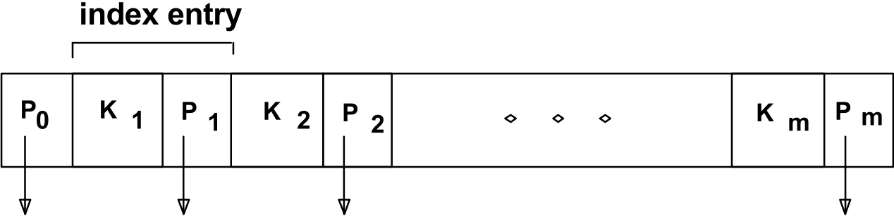

# Database

|           |           |
| --------- | --------: |
| Database | [🗀][root] [🗍 🖭](https://didatticaonline.unitn.it/dol/course/view.php?id=23152) |

[TOC]


# [2.][pdf-2] Introduction

## Basic concepts

### ==Definitions==

> **Database**: *a very large, integrated collection of data*

~~Models real-world **enterprise**~~

- ~~Entities~~
- ~~Relationships~~

> **Database Management System (DBMS)**: *software package designed to store and manage databases*


### Files

- Application must stage datasets between ==main and secondary **memory**==
- ~~Special code for different **queries**~~
- ~~Must protect data from inconsistency due to multiple **concurrent users**~~
- ~~**Crash recovery**~~
- ~~Security and access **control**~~


### DBMS

- ~~Data independence, integrity and security~~
- ~~Efficient access~~
- ~~Reduced application development time~~
- ~~Uniform data administration~~
- ~~Concurrent access~~
- ~~Recovery from crashes~~


### ==Data models==

> **Data model**: *collection of concepts for describing data*

> **Schema**: *description of a collection of data, using a given data model*

The ==**relational model of data**== is the most widely used model today

- Based on ==**relations** (tables)==
- Every relation has a ==**schema** which describes the **fields** (columns)==


## Design concepts

### ==Levels of abstraction==

- Many **views**
  - How users see the data
- ==**Single schema**==
  - ==**Conceptual**==
    - ==Logical structure==
  -  ==**Physical**==
    - ==Files and indexes used==
- Different **data languages**
  - Schema are defined using DDL (**definition**)
  - Data is modified/queried using DML (**manipulation**)


### Data independence

**Applications insulated** from how data is structured and stored

> **Logical/physical data independence**: *protection from changes in logical/physical structure of data*


### Concurrency control

**Concurrent execution** of user programs is essential for good performance

- Is important to keep the CPU working on several **user programs** concurrently because disk accesses are frequent and slow
- Interleaving actions of different user programs can lead to **inconsistency**
- Users can pretend they are using a **single-user system**


### Consistency

> **Transaction**: *an atomic sequence of database actions (execution of reads and writes)*

It must leave the DB in a **consistent state** if it is when the transaction begins

- Users can specify some **integrity constraints** on the data
- DBMS **don't understand the semantics** of the data
- Consistency preservation is **user's responsibility**


### Scheduling concurrent transactions

DBMS ensures that execution of $\{T_1,\ ...\ , T_n\}$ is equivalent to some **serial execution** $T_1',\ ...\ , T_n'$

- **Before reading/writing** an object, a transaction
  - **Requests a lock** on the object
  - **Waits** till the DBMS gives it the lock
- **At the end** of the transaction
  - All locks are **released**

This effectively **orders the transactions**

<p></p>

#### Example

- If an action of $T_i$ (writing $X$) affects $T_j$ (reads $X$)
  - $T_i$ will **obtain the lock** on $X$ first
  - $T_j$ is **forced to wait** until $T_i$ completes
- If $T_j$ already has a lock on $Y$ and $T_i$ later requests a lock on $Y$
  - A **deadlock** occurs: $T_i$ or $T_j$ is **aborted** and **restarted**


### Ensuring atomicity

> **Atomicity**: *all-or-nothing property*

DBMS **ensures atomicity** even if system **crashes** in the middle of a $X$act

- Keep a **log** of actions carried out by DBMS while executing a set of $X$acts
  - **Before a change**, the corresponding log entry is forced to a **safe location**
    - WAL protocol
  - **After a crash**, the effects of partially executed transactions are **undone** using the log
    - Thanks to **WAL**, if log entry wasn't saved before the crash, corresponding change is **not applied** to database)


### Log

- Log **records** these actions
  - $T_i$ **writes an object**
    - Old and new **values**
    - Log record must go **to disk before** the changed page
  - $T_i$ **commits/aborts**
    -  A log record indicating this action
- Log records are **chained by $X$act id**
  - It's easy to undo a specific $X$act
- Log is often **duplexed** and **archived** on stable storage
- All log related activities are **handled transparently** by the DBMS


### Structure of a DBMS

A typical DBMS has a **layered architecture**


## Summary

- DBMS used to maintain and query large datasets
- Benefits include
  - Recovery from system crashes
  - Concurrent access
  - Quick application development
  - Data integrity and security
- Levels of abstraction give data independence
- A DBMS typically has a layered architecture


# [3.][pdf-3] Entity-Relationship model

[<u>Cheat-sheet</u>][pdf-3b]

## ==Basic concepts==

### ==Entities==

> **Entity**: *real-world object distinguishable from other objects* (<u>**rectangle**</u>)

- ==Described using a set of **attributes**== (<u>**ellipses**</u>)

> **Entity set**: *collection of similar entities*

- ==All entities in an entity set have the **same set of attributes**==
- ==Each entity set has a **key**==
- ==Each attribute has a **domain**==


### ==Relationships==

> **Relationship**: *connection between two or more entity sets* (<u>**diamond**</u>)

- ==Could have **attributes**==

==Think of the 'value' of a **relationship set** as a table==

- ==One column for each of the connected **entity sets**==
- ==One row for each **list of entities**==
  - One from each set, that are connected by the relationship


### ==Multiplicity==

- Many - many (<u>**line**</u>)
- One - one
- Many - one
  - At most one (<u>**arrow**</u>)
  - At least one (<u>**thick line**</u>)
  - Exactly one (<u>**thick arrow**</u>)


### Roles

The **multiple participation** of the same ES in a relationship needs the edges to be **labeled with roles** to be distinguish

- This relationship could be **symmetric**


### Multi-way relationships

**Conversion to 2-way** is necessary in certain object-oriented models

- Create a **new ES** to represent **rows of a RS**
- **Add many-one relationships** from the new ES to the ES's that participated in the original relationship


## ==Design elements==

### ==Aggregation==

> **Aggregation**: *permits the treatment of a RS as an ES for purposes of participation in (other) relationships* (<u>**dashed rectangle**</u>)

Used in order to ==model a **relationship involving** (ESs and) **a RS**==


### ==Subclasses==

Subclass ↔ special case ↔ fewer entities ↔ **more properties**

- Subclasses form a **tree**
  - No multiple inheritance
- ==**ISA relationships** indicate the subclass relation (one-one, <u>**triangle**</u>)==

~~Different subclass **viewpoints**~~

- ~~**E/R viewpoint**~~
  - ~~Entities in the higher entity set includes **all entities**, even the subclasses (which might have more attributes)~~
- ~~**OO viewpoint**~~
  - ~~An object (entity) belongs to **exactly one class**~~
  - ~~It **inherits** properties of its superclasses~~


### ==Keys==

> **Key**: *set of attributes $K$ of an ES $E$ such that, given two entities $e_1$ and $e_2$ of $E$, they cannot have identical values in $K$*

> **Candidate key**: *minimal set of attributes that uniquely identify an entity in an ES*

==In E/R model, **every ES must have** (at least) **a key**==

- ==One and only one set of attributes is the **designated key** (<u>**underlined**</u>)==

==Key **hierarchy**==

- ==**Super key:** a key in general==
- ==**Candidate key**: a minimal super key==
- ==**Primary key**: the candidate key we chose to use==

==**Root key** could be used as key for all **subclasses**==


### ==Weak entity sets==

> **Weak ES**: *an ES $E$ which key comes not (completely) from its own attributes, but also from the keys of one or more ES to which $E$ is linked*

$E$ is linked to these ES through a **supporting many-one relationship**

- **Many-one-ness** and **exactly one** is essential
- (<u>**double rectangle**</u> on $E$, <u>**double diamond**</u> on supporting relationships)


## ==Design principles==

- ==**Avoid redundancy**==
  - Wastes space and encourages **inconsistency**
- ==Use schema to **enforce constraints**==
  - Don't rely on future data to follow **assumptions**
- ==**Use entity sets** instead of attribute only if it is (either)==
  - ==**More than a name** of something==
    - It has **non-key attributes**
    - It has **relationships** with different entity sets
  - ==The '**many**' in a many-one relationship==
- ==**Don't overuse weak ES**==
  - It is better to **create ID**
  - **Necessary** only when
    - We can't easily create such ID
    - There is no global authority to create them


## Summary

###  Conceptual design

- Conceptual design follows requirements analysis
  - High-level description of data to be stored
- E/R model popular for conceptual design
  - High-level and expressive constructs


### E/R model

- **Basic constructs**
  - Entities
  - Relationships
  - Attributes
- **Additional constructs**
  - Weak entities
  - ISA hierarchies
  - Aggregation
- **Integrity constraints**
  - Key
  - Foreign key (implicit in the definition of a RS)
  - Participation
  - Overlap/covering for ISA
- **Subjective design**
  - Entity vs attribute
  - Entity vs relationship
  - Binary vs $n$-ary relationship
  - ISA hierarchies
  - Aggregation


# [4.][pdf-4] Relational model

## ==Definitions==

> **Relational database**: *set of relations*

> **Relation**: *set of rows or tuples*

==A **relation** is made up of 2 parts==

- ==**Instance**: a table with row (all distinct) and columns==
  - **Cardinality**: #rows
  - **Degree**: #fields
- ==**Schema**: specifies==
  - ==Name of relation==
  - ==Name and type/domain of each field==


## Relational query languages (SQL)

==<u>Key point</u>: **precise semantics** for relational queries==

Allows the **optimizer** to

- Extensively **reorder** operations
- Ensure that the answer does **not change**


### Querying in SQL

Instance of `Students` relation

| <u>sid</u> | name  | login      | age  | gpa  |
| ---------- | ----- | ---------- | ---- | ---- |
| 53666      | Jones | jones@cs   | 18   | 3.4  |
| 53688      | Smith | smith@eecs | 18   | 3.2  |
| 53650      | Smith | smith@math | 19   | 3.8  |

- Cardinality = 3
- Degree = 5
- All rows distinct

<p></p>

1. To find all 18 year old students

```MYsql
SELECT *
FROM Students S
WHERE S.age = 18
```

| <u>sid</u> | name  | login      | age  | gpa  |
| ---------- | ----- | ---------- | ---- | ---- |
| 53666      | Jones | jones@cs   | 18   | 3.4  |
| 53688      | Smith | smith@eecs | 18   | 3.2  |

2. To find just names and logins

```MYsql
SELECT S.name, S.login
FROM Students S
WHERE S.age = 18
```

| name  | login      |
| ----- | ---------- |
| Jones | jones@cs   |
| Smith | smith@eecs |


### Querying multiple relations

Instances of `Students` (above) and `Enrolled`

| <u>sid</u> | cid         | grade |
| ---------- | ----------- | ----- |
| 53831      | Carnatic101 | C     |
| 53831      | Reggae203   | B     |
| 53650      | Topology112 | A     |
| 53666      | History105  | B     |

```MYsql
SELECT S.name, E.cid
FROM Students S, Enrolled E
WHERE S.sid = E.sid AND E.grade = "A"
```

| S.name | E.cid       |
| ------ | ----------- |
| Smith  | Topology112 |


### Creating relations

==The **type/domain** of each field is **specified** and **enforced** by DBMS== whenever tuples are added or modified

```MYsql
CREATE TABLE Students (
    sid   CHAR(20),
    name  CHAR(20),
    login CHAR(20),
    age   INTEGER,
    gpa   REAL
)
```

```MYsql
CREATE TABLE Enrolled (
    sid   CHAR(20),
    cid   CHAR(20),
    grade CHAR(2)
)
```


### Destroying and altering relations

- **Destroying a relation**

  ```MYsql
  DROP TABLE Students
  ```

  The **schema information** and the **tuples** are deleted

- **Altering a schema** adding a ==new field==

  ```MYsql
  ALTER TABLE Students ADD COLUMN firstYear: INT
  ```
  

==Every tuple in the instance is extended with a **null** value in the new field==


### Adding and deleting tuples

- **Adding a single tuple**

  ```MYsql
  INSERT INTO Students
  VALUES (55688, 'Smith', 'smith@ee', 18, 3.2)
  ```

  ```MYsql
  INSERT INTO Students (name, sid, login, age, gpa)
  VALUES ('Smith', 55688, 'smith@ee', 18, 3.2)
  ```

- **Deleting all tuples** satisfying some conditions

  ```MYsql
  DELETE
  FROM Students S
  WHERE S.name = 'Smith'
  ```


## ==Integrity constraints==

### ==Definitions==

> **Integrity constraint**: *condition that any instance of the DB must satisfy*

- ==ICs are **specified** when schema is **defined**==
- ==ICs are **checked** when relations are **modified**==

> **Legal instance**: *instance of a relation that satisfies all specified ICs*

- ==DBMS should not allow illegal instances==

==When DBMS **checks** ICs==

- ==Avoids data **entry errors**==
- Stored data is more faithful to **real-world** meaning


### Basic idea

ICs are based upon the **semantics of the real world enterprise** that is being described in the DB relations

==An IC is a **statement about all possible instances**==

- We can check a DB instance to see if an **IC is violated**
- We can never infer that an **IC is true** by looking at an instance

**Key and foreign key** constraints are the most common


### ==Primary key==

A set of fields is a **key** for a relation if

1. ==Two distinct values cannot have **same values** in all key fields==
2. This is not true for any **subset** of the key
   - Could be a **superkey**
   - If there are more than one key for a relation, one of theme is chosen by DBA to be the **primary key**


### ==Primary and candidate keys==

- Possibly many **candidate keys** (specified using `UNIQUE` )
- One of which is chosen as the **primary key**

```MYsql
CREATE TABLE Enrolled (
	sid   CHAR(20),
    cid   CHAR(20),
    grade CHAR(2),
    PRIMARY KEY (sid, cid)  -- <<<
)
-- For a given student and course there is a single grade
```

```MYsql
CREATE TABLE Enrolled (
	sid   CHAR(20),
    cid   CHAR(20),
    grade CHAR(2),
    PRIMARY KEY (sid),   -- <<<
    UNIQUE (cid, grade)  -- <<<
)
-- Students can take only one course, and receive a single
-- grade for that course; further, two students in a course
-- can't receive the same grade
```

Used **carelessly**, **ICs** can prevent the storage of instances that arise in practice


### ==Foreign key==

> **Foreign key**: *set of fields in one relation $A$ that is used to refer to a tuple in another relation $B$*

- ==It must correspond to **primary key** of the second relation $B$==
  - Like a 'logical pointer'


#### Referential integrity

Referential integrity is achieved if all **foreign key constraints** are enforced

- **Reject** non valid insertions
  - Tuples with a non existent primary key in $B$
- No **dangling references**

```MYsql
CREATE TABLE Enrolled (
	sid   CHAR(20),
    cid   CHAR(20),
    grade CHAR(2),
    PRIMARY KEY (sid, cid),
    FOREIGN KEY (sid) REFERENCES Sudents  -- <<<
)
-- Only students listed in the Students relation should be
-- allowed to enroll for courses
```


#### ==Delete and update==

**Delete/update** a referenced tuple in $B$ (either)

- **Disallow deletion/update** of a $B$ tuple that is referred to
- **Delete/update all tuples** in $A$ that refer to it
- Set FKs in $A$ tuples that refers to it to a **default value** (even `null`)

==**SQL standards** `ON DELETE/UPDATE`==

- ==`NO ACTION`: delete/update is rejected (**default**)==
- ==`CASCADE`: delete all tuples that refer to deleted/updated tuple==
- ==`SET NULL/DEFAULT`: sets foreign key value of referencing tuple==

```MYsql
CREATE TABLE Enrolled (
	...
    FOREIGN KEY (sid) REFERENCES Sudents,
        ON DELETE CASCADE,
        ON UPDATE SET DEFAULT
)
```


## ==Logical DB design: ER to Relational==

### ==ES to tables==


```mysql
CREATE TABLE Employees (
	ssn  CHAR(11),
    name CHAR(20),
    lot  INTEGER,
    PRIMARY KEY (ssn)
)
```


### ==RS to tables==

==**Attributes** of the relation must include==

- ==**Keys** for each participating ES (as **foreign keys**)==
  - ==This set of attributes forms a **superkey** for the relation==
- ==All descriptive **attributes**==


```MYSQL
CREATE TABLE Works (
	ssn   CHAR(11),
    did   CHAR(11),
    since DATE,
    PRIMARY KEY (ssn, did),  -- superkey
    FOREIGN KEY (did) REFERENCES Departments,
    FOREIGN KEY (ssn) REFERENCES Employees
)
```


### ==Key constraints==


Two options

- ==Map relationship to a **table**== (`Manages`)

  - ==**Primary key** must be that of the 'many' part== (`Departments`)

  ```mysql
  CREATE TABLE Manages (
  	did   INTEGER,
      ssn   CHAR(11),
      since DATE,
      PRIMARY KEY (did),                         -- <<<
      FOREIGN KEY (did) REFERENCES Departments,  -- <<<
      FOREIGN KEY (ssn) REFERENCES Employees     -- <<<
  )
  ```

- ==**Combine** relationship and instance== (`Manages` and `Departments`)

  - ==**Allow nulls** in foreign key for the 'at most' part== (`ssn`)

  ```MYsql
  CREATE TABLE Dept_Mng (
  	did    INTEGER,
  	dname  CHAR(20),
      budget REAL,
  	since  DATE,
      ssn    CHAR(11),                        -- <<<
      PRIMARY KEY (did),                      -- <<<
      FOREIGN KEY (ssn) REFERENCES Employees  -- <<<
  )
  ```


### ==Participation constraints==

**Participation** of an instance in a relationship could be

- ==**Partial** if it isn't necessary==
- ==**Total** if it is necessary==


```mysql
CREATE TABLE Dept_Mng (
	did    INTEGER,
    dname  CHAR(20),
    budget REAL,
    ssn    CHAR(11) NOT NULL,  -- <<<
    since  DATE
    PRIMARY KEY (did),
    FOREIGN KEY (ssn) REFERENCES Employees,
    	ON DELETE NO ACTION    -- <<<
)
```

==Capture PC involving one entity set in a **binary relationship**==


### ==Weak Entities==

Can be uniquely identified only by another **owner ES**

- Owner ES and weak ES must participate in a **one-to-many** relationship set
  - One owner, many weak
- Weak ES must have **total participation** in the **identifying RS**


```mysql
CREATE TABLE Dep_Policy (
	pname CHAR(20),
    age INTEGER,
    cost REAL,
    ssn CHAR(11) NOT NULL,
    PRIMARY KEY (pname, ssn),
    FOREIGN KEY (ssn) REFERENCES Employees,
		ON DELETE CASCADE  -- <<<
)
```

- ==Weak ES and identifying relationship set are translated into a **single table**==
- ==When the owner is deleted, **all owned** weak entities must also be **deleted**==


### ==ISA hierarchies==

==Given $B\ {\rm isa}\ A$ and $C\ {\rm isa}\ A$==

- ==Each $B$ and $C$ entity is also a $A$ entity==
- ==**Overlap constraints**: allow/disallow $B$ entities to be also $C$ entities==
- ==**Covering constraints**: each $A$ entity must/mustn't be $B$ or $C$ entity==

Translating ISA hierarchies to **relations**

-  ==**General approach**: 3 relations ($A$, $B\_A$, $C\_A$)==
  - Each $A$ entity is recorded in $A$
  - For $B\_A$ entities, **extra info** recorded in $B\_A$
  - Must delete $B\_A$ tuples if referenced $A$ tuple is deleted
  - Queries involving all $A$ entities are easy, those involving just $B\_A$ require a **join** to get some attributes
- ==**Covering constraints approach**: just 2 relations ($B\_A$ and $C \_A$)==
  - $B\_A$ and $C \_A$ stores **all attributes**
  - Each $A$ entity must be in one of these two subclasses


### ==Aggregation==

==Relationships involving an aggregation follow the same approach of the relationships as if the **aggregated relationships** was an **entity set**==


## Views

==A view is just a **relation**, but we **store a definition** rather than a set of tuples==

- Can be dropped using `DROP VIEW` command
  - `DROP TABLE` command has options to let the user specify how to handle it if there's a view on the table
- ==Show **necessary information** while **hiding details** in underlying relations==

```mysql
CREATE VIEW YoungActiveStudents (name, grade)
	AS SELECT S.name, E.grade
	FROM Students S, Enrolled E
	WHERE S.sid = E.sid AND S.age < 21
-- we can find students who have are enrolled, but not the
-- cid of the courses they are enrolled in
```


## Summary of relational model

- A tabular representation of data
- Simple and intuitive
  - Currently the most widely used
- Integrity constraints can be specified by the DBA
  - Based on application semantics and DBMS checks for violations
  - Two important ICs: primary and foreign keys
  - Always have domain constraints
- Powerful and natural query languages
- Rules to translate ER to relational model


# [5.][pdf-5] Relational algebra

## Relational query languages

### Query languages

==Allow **manipulation** and **retrieval of data** from a DB==

Relational model supports simple and powerful QLs

- Strong formal foundation based on **logic**
- Allows for much **optimization**
- **Efficient access** to large data sets


### Formal RQLs

Two mathematical QLs form the **basis for 'real' languages** (SQL)

- ==**Relational algebra**==
  - ==More operational==
  - ==Representation of execution plans==
- **Relational calculus**
  - Descriptive rather then computational
  - Non operational, declarative


### ==Preliminaries==

A **query** is applied to **relation instances**, and the result of a query is also a RI
$$
\colorbox{#ffe480}{$Q\ : \ RI\ →\ RI$}
$$

==**Fixed schema** for==

- ==**Input relations** for a query==
  - Query will **run regardless** of instance
- ==**Output** of a given query==
  - Determined by definition of **QL constructs**

**Notations** (both used in SQL)

- ==**Positional** notation==
  - Easier for **formal definitions**
- ==**Named-field** notation==
  - More **readable**
  - **Names** of fields in query results are '**inherited**' from names of fields in query input relations


## ==Algebraic operations==

### ==Basic operations==

==Basic operations on **relations**==

- ==**Selection**           $(\,σ\,)\,$   selects a subset of rows from relation==
- ==**Projection**         $(\,π\,)$   deletes unwanted columns from relations==
- ==**Union**                $\,(\,\cup\,)$   tuples in $R_1$ or in $R_2$==
- ==**Intersection**     $\;(\,\cap\,)$   tuples in $R_1$ and in $R_2$==
- ==**Set-difference**  $\:(-)\:$   tuples in $R_1$ but not in $R_2$==
- ==**Renaming**        $\,\,(\,ρ\,)\:$   renames fields==
- ==**Cross-product**  $\,(\times)\:$   combines two relations==
- ==**Join**                  $\,\,(\bowtie)\,$   compose a cross-product with a selection==
- ==**Division**             $(\, /\, )$    tuples in $R_1$ with a relationship with all tuples in $R_2$==

==Each operation **returns a relation**==

- ==Operations can be **composed**==
- ==Algebra is **closed**==


### ~~Example instances~~

$R_1$

| <u>sid</u> | <u>bid</u> | day      |
| ---------- | ---------- | -------- |
| 22         | 101        | 10/10/96 |
| 58         | 103        | 11/12/96 |

$S_1$

| <u>sid</u> | sname  | rating | age  |
| ---------- | ------ | ------ | ---- |
| 22         | dustin | 7      | 45.0 |
| 31         | lubber | 8      | 55.5 |
| 58         | rusty  | 10     | 35.0 |

$S_2$

| <u>sid</u> | sname  | rating | age  |
| ---------- | ------ | ------ | ---- |
| 28         | yuppy  | 9      | 35.0 |
| 31         | lubber | 8      | 55.5 |
| 44         | guppy  | 5      | 35.0 |
| 58         | rusty  | 10     | 35.0 |


### ==Selection==

> **Selection**: *selects rows that satisfy selection condition*
> $$
> σ_c(R)
> $$

- ==**One input** relation==
- ==**No duplicates** in result==
- ==**Result schema identical** to input schema==

$σ_{\rm rating\, >\, 8}(S_2)$

| <u>sid</u> | sname | rating | age  |
| ---------- | ----- | ------ | ---- |
| 28         | yuppy | 9      | 35.0 |
| 58         | rusty | 10     | 35.0 |


### ==Projection==

> **Projection**: *deletes attributes that are not in projection list*
> $$
> π_{f_1,...,f_n}(R)
> $$

- ==**One input** relation==
- ==**Eliminate duplicates** by default==
- ==**Result schema** contains only the **fields specified** in the projection list==
  - ==**Same names** of the input relation==

$π_{\rm sname,\ rating} (S_2)$

| sname  | rating |
| ------ | ------ |
| yuppy  | 9      |
| lubber | 8      |
| guppy  | 5      |
| rusty  | 10     |

$π_{\rm age}(S_2)$

| age  |
| ---- |
| 35.0 |
| 55.0 |


### ==Set operations==

> **Union-compatible**: *relations with the same number of fields, of which the corresponding ones have the same type*

> **Set operations**: *perform set operations on sets of tuples of two relations*
> $$
> R\ {\lang\cup,\cap,-\rang}\ S
> $$

- ==**Two input** relations==
- ==**Result schema identical** to input schema==

$S_1\cup S_2$

| <u>sid</u> | sname  | rating | age  |
| ---------- | ------ | ------ | ---- |
| 22         | dustin | 7      | 45.0 |
| 31         | lubber | 8      | 55.5 |
| 58         | rusty  | 10     | 35.0 |
| 44         | guppy  | 5      | 35.0 |
| 28         | yuppy  | 9      | 35.0 |

$S_1\cap S_2$

| <u>sid</u> | sname  | rating | age  |
| ---------- | ------ | ------ | ---- |
| 31         | lubber | 8      | 55.5 |
| 58         | rusty  | 10     | 35.0 |

$S_1-S_2$

| <u>sid</u> | sname  | rating | age  |
| ---------- | ------ | ------ | ---- |
| 22         | dustin | 7      | 45.0 |


### ==Rename==

> **Rename**: *rename the output of relation $R$ with name of $x$*
> $$
> \begin{align}
> \text{Relation:}\ \ & ρ(x,R) \\[2px]
> & x:={\rm Rel\_name} \\[10px]
> \text{Named-field:}\ \ & ρ_x(R) \\[2px]
> & x:={\rm [Rel\_name]({\rm field\_name\_list})} \\[2px]
> & x:= \text{new_field_name ← old_field_name} \\[10px]
> \text{Positional:}\ \ & ρ(C(x),R)\\[2px]
> & x:=m→\text{field_name}_m,···,n→\text{field_name}_n
> \end{align}
> $$

- ==**One input** relation==
- ==**Result instance identical** to input instance==
- ==**Result schema** with **different names**==


### ==Cross-product==

> **Cross-product**: *each row of $R$ is paired with each row of $S$*
> $$
> R×S
> $$

- ==**Result schema** has **one field per each field** of $A$ and $B$==
- ==Field **names inherited** if possible==
- ==**Conflicts** need to be **renamed**==

$ρ\big(C(1→{\rm sid1},\ 5→{\rm sid2}),\ S_1×R_1\big)$

| sid1 | sname  | rating | age  | sid2 | bid  | day      |
| ---- | ------ | ------ | ---- | ---- | ---- | -------- |
| 22   | dustin | 7      | 45.0 | 22   | 101  | 10/10/96 |
| 22   | dustin | 7      | 45.0 | 58   | 103  | 11/12/96 |
| 31   | lubber | 8      | 55.5 | 22   | 101  | 10/10/96 |
| 31   | lubber | 8      | 55.5 | 58   | 103  | 11/12/96 |
| 58   | rusty  | 10     | 35.0 | 22   | 101  | 10/10/96 |
| 58   | rusty  | 10     | 35.0 | 58   | 103  | 11/12/96 |


### ==Joins==

> **Condition (theta) join**: *applies a selection on a cross-product*
> $$
> R\bowtie_c S\ =\ σ_c (R×S)
> $$

- ==**Result schema** same as **cross-product**==
- ==**Fewer tuples** than cross-product==
  - Could be more efficient

$S_1\bowtie_{S_1.{\rm sid}<R_1.{\rm sid}} R_1$

| (sid) | sname  | rating | age  | (sid) | bid  | day      |
| ----- | ------ | ------ | ---- | ----- | ---- | -------- |
| 22    | dustin | 7      | 45.0 | 58    | 103  | 11/12/96 |
| 31    | lubber | 8      | 55.5 | 58    | 103  | 11/12/96 |

<p></p>

> **Equi-join**: *theta-join where the condition contains only equalities*
> $$
> R\bowtie_{f_1,...,f_n} S\ =\ σ_{\bigwedge_{i=1}^n R.f_i=S.f_i} (R×S)
> $$

- ==**Result schema** similar to **cross-product**==
  - ==**Only one copy of fields** for which equality is specified==

$S_1\bowtie_{\rm sid} R_1$

| sid  | sname  | rating | age  | bid  | day      |
| ---- | ------ | ------ | ---- | ---- | -------- |
| 22   | dustin | 7      | 45.0 | 101  | 10/10/96 |
| 58   | rusty  | 10     | 35.0 | 103  | 11/12/96 |

<p></p>

> **Natural join**: *equi-join on all common fields*
> $$
> R\bowtie S
> $$


### ==Division==

> **Division**: *tuples of $R(x,y)$ that have a relationship with all tuples of $S(y)$*
> $$
> R/S = \{\ \lang x\rang\ \,|\ \ \forall\, \lang y\rang\in S,\, \ \exist\, \lang x,y\rang\in R\ \}
> $$
>

- ==$x$ and $y$ can be **any list** of fields==

  - $y$ is the list of fields in $S$
  - $x\cup y$ is the list of fields of $R$

- **Not** supported as a **primitive operator**

  - ==Compute all $x$ values that are **not disqualified** by some $y$ value in $S$==

    $\begin{align}
    &\text{Disqualified }x\text{ values:}
    && D=π_x\big((π_xR×S)-R\big) \\
    &\text{Division:} && R/S=π_xR-D
    \end{align}$


### Examples

[See examples (from slide 16)][pdf-5]


## Summary

- RM has rigorously defined QLs
  - Simple and powerful
- RA is more operational
  - Useful as internal representation for query evaluation plans
- Several ways of expressing a given query
  - A query optimizer should choose the most efficient version


# [6.][pdf-6] PgSQL

## Utility

### ~~Command line~~

```sh
# UniTN VPN access
$ sudo openconnect --protocol=gp --user=name.surname@unitn.it vpn.icts.unitn.it
# Command
$ psql -h <server> -U <user> <database>
# Remote server
$ psql -h sci-didattica.unitn.it -U db_001 db_001
# Local server
$ psql db_001
```


### PgSQL notation

```plsql
-- Quotation marks
"names of schemas/tables/columns..."
'string constant'

-- Cast
CAST(expression AS type)  -- SQL standard
expression::type          -- Old style PG
```


### ==Case sensitivity==

- ==**Names** either==
  - ==Unsensitive without `""`  (transformed to lowercase)==
  - ==Sensitive with `""`==
- ==**Strings**: sensitive, always with `''`==


### ~~Hierarchy~~

Database cluster → Databases → Schemas → Tables

- **Database cluster**: software/server - user & groups
- **Databases**: name space


# [7.][pdf-7] SQL

## ==Introduction==

### ==Basic queries==

```mssql
SELECT [DISTINCT] target-list
FROM   relation-list
WHERE  qualification
```

<p></p>

#### ==Targets==

- ==`target-list`: list of attributes of relations in relation-list==
  - `name1 = trg1` and `trg2 AS name2` name fields in result
  - `*`: all attributes
- ==`DISTINCT`: answer should not contain duplicates ("dupplicati")==
  - By default duplicates are not eliminated

<p></p>

#### ==Relations==

- ==`relation-list`: list of relation names==
  - Possibly with a `range-variable` after each name

<p></p>

#### ==Qualifications==

==`qualification`: comparisons, combined using `AND`, `OR` and `NOT`==

-  ==`Attr op const` or `Attr1 op Attr2`==
  - ==`op` one of `= , != , < , > , <= , >=`==
- ==`Attr LIKE 'string'`: string matching that can interpret wildcards==
  - `_`: any single character
  - `%`: 0 or more arbitrary characters
-  ==Set-comparison operators==
  - ==`Attr [NOT] IN Set`: membership==
  - ==`Attr op [ANY, ALL] Set`: comparison with any/all members==
  - ==`[NOT] EXISTS [[NOT] UNIQUE] Set`: existence==


### ==Conceptual evaluation strategy==

- ==**Semantics** of an SQL query== defined in terms of CES
  - ==Compute the **cross-product** of `relation-list`==
  - ==**Discard resulting tuples** if they fail `qualifications`==
  - ==**Delete attributes** that are not in `target-list`==
  - ==Eliminate **duplicate rows** if `DISTINCT` is specified==
- ~~This strategy is probably the least efficient way to compute a query~~
  - ~~An optimizer will find efficient strategies to compute the **same answers**~~


## ==Queries==

### ==Range variables==

```mysql
SELECT S.sname
FROM   Sailors S, Reserves R
WHERE  S.sid = R.sid AND bid = 103
-- Equivalent --
SELECT sname
FROM   Sailors, Reserves
WHERE  Sailors.sid = Reserves.sid AND bid = 103
```

- ==It is good style to use **range variables always**==
- Really needed only if the same relation **appears twice** in the `FROM` clause


### ==Set operators==

Compute set operations of any **union-compatible** sets of tuples

- Sets of tuples are themselves the **result of SQL queries**

```mysql
SELECT * FROM T1
  UNION [ALL]
SELECT * FROM T2
  EXCEPT | MINUS
SELECT * FROM T3
  INTERSECT
SELECT * FROM T4
```

- ==`UNION ALL`: preserves all the rows==
- ==`EXCEPT` and `MINUS` are aliases==
- ==`INTERSECT` has the precedence==
  - ($T_1\cup T_2-(T_3\cap T_4)$)


### ==Nested queries==

==`FROM`, `WHERE` and `HAVING` clauses can contain an **SQL query**==

```mysql
-- Find names of sailors who've reserved boat #103
SELECT S.sname
FROM   Sailors S
WHERE  S.sid IN (
    SELECT R.sid
    FROM   Reserves R
    WHERE  R.bid = 103
)
```

<p></p>

#### Correlation

```mysql
-- Find names of sailors ...
-- ... who've reserved boat #103
SELECT S.sname
FROM   Sailors S
WHERE EXISTS (
    SELECT *
    FROM   Reserves R
    WHERE  R.bid = 103 AND S.sid = R.sid
)
-- ... with at most one reservation on boat #103
SELECT S.sname
FROM   Sailors S
WHERE EXISTS UNIQUE (
    SELECT R.bid
    FROM   Reserves R
    WHERE  R.bid = 103 AND S.sid = R.sid
)
```


### ==Set-comparison operators==

```mysql
-- Find sailors whose rating is greater than that of some
-- sailor called 'Horatio'
SELECT *
FROM   Sailors S
WHERE  S.rating > ANY (
    SELECT S2.rating
    FROM   Sailors S2
    WHERE  S2.sname = 'Horatio'
)
```


### ==Division==

```mysql
-- Find sailors who've reserved all boats
SELECT S.sname
FROM   Sailors S
WHERE NOT EXISTS
    ( ( SELECT B.bid
        FROM   Boats B )
      EXCEPT
      ( SELECT R.bid
        FROM   Reserves R
        WHERE  R.sid = S.sid ) )
```


### ==Aggregate operators==

```mysql
SELECT  -- single column
  COUNT (*)
  COUNT ([DISTINCT] A)
  SUM   ([DISTINCT] A)
  AVG   ([DISTINCT] A)
  MAX   (A)
  MIN   (A)
```

- Significant extension of relational algebra
- ==Aggregate operations can **not be nested**==


### ==Grouping==

> **Group**: *set of tuples that have the same value for all attributes in* `grouping-list`

```sql
SELECT   [DISTINCT] target-list
FROM     relation-list
WHERE    qualification
GROUP BY grouping-list
HAVING   grοup-qualification
```

==`target-list` contains==

- ==**Attribute list**==
  - ==Subset of `grouping-list`==
- ==Terms with **aggregate operations**==

==Each **answer tuple** corresponds to a **group**==

- ==Attributes must have a **single value** per group==


#### Conceptual evaluation

1. ==Compute **cross-product** of `relation-list`==
   - Tuples that fail **qualification** are discarded
   - Unnecessary **fields** are deleted
2. ==Remaining tuples are partitioned into **groups**==
   - By the value of attributes in `grouping-list`
3. ==`group-qualification` is applied to **eliminate** some groups==
   - Expressions must have a **single value** per group
   - An attribute that is not an argument of an aggregate operation also appears in grouping-list
     - SQL does not exploit primary key semantics here
4. ==**One answer tuple** is generated per qualifying group==


#### Examples

```mysql
-- Find age of the youngest sailor with age ≥ 18,
-- for each rating with at least 2 such sailors
SELECT   S.rating, MIN(S.age) AS minage
FROM     Sailors S
WHERE    S.age >= 18
GROUP BY S.rating
HAVING   COUNT(*) > 1
```

[Tables and examples (slides 21-24)][pdf-7]

<p></p>

```mysql
-- Find age of the youngest sailor with age > 18,
-- for each rating with at least 2 sailors (of any age)
SELECT   S.rating, MIN(S.age)
FROM     Sailors S
WHERE    S.age > 18
GROUP BY S.rating
HAVING   1 < ( SELECT COUNT(*)
               FROM   Sailors S2
               WHERE  S.rating = S2.rating )
```

<p></p>

```mysql
-- For each red boat, find the number of reservations
SELECT   B.bid, COUNT(*) AS scount
FROM     Sailors S, Boats B, Reserves R
WHERE    S.sid = R.sid AND R.bid = B.bid AND B.color = 'red'
GROUP BY B.bid
```

<p></p>

```mysql
-- Find those ratings for which the average age
-- is the minimum over all ratings
SELECT temp.rating, temp.avgage
FROM   ( SELECT   S.rating, AVG(S.age) AS avgage
         FROM     Sailors S
         GROUP BY S.rating ) AS temp
WHERE  temp.avgage = ( SELECT MIN(temp.avgage)
                       FROM   temp )
```


## ==Null values==

- ==Field values in a tuple could be **unknown** (not assigned) or **inapplicable**==
  - ==SQL provides a special value `NULL`==
- The presence of `NULL` complicates many **issues**
  - ==**Special operators** needed==
    - ==To **check** if value is (not) null==
    - E.g. for outer **joins**
  - ==**Evaluation of expressions** with null values==
  - ==**3-valued logic** needed (true, false and **unknown**)==
  - ==**Meaning of constructs** must be defined carefully==
    - E.g. `WHERE` clause eliminates rows that don't evaluate to true


## Constraints

### Integrity constraints

- Ensure application **semantics**
  - Definition of **keys**
- Prevent **inconsistencies**
  - **Type** and **range** of values of fields
- **Disallow** illegal inserts/deletes/updates

**Types** of constraints

- **Domain**
  - Field values must be of right type
  - Always enforced
- **Primary key**
- **Foreign key**
- **General**


### ==General constraints==

- Useful when ==more **general ICs** than keys== are involved
- ==Can use **queries** to express constraint==
- Constraints can be **named**

```mysql
CREATE TABLE Sailors (
    sid    INTEGER,
    sname  CHAR(10),
    rating INTEGER,
    age    REAL,
    PRIMARY KEY (sid),
    CHECK (rating >= 1 AND rating <= 10)
)
CREATE TABLE Reserves (
    sname CHAR(10),
    bid   INTEGER,
    day   DATE,
    PRIMARY KEY (bid,day),
    CONSTRAINT  noInterlakeRes
    CHECK ( 'Interlake' <> ( SELECT B.bname
                             FROM   Boats B
                             WHERE  B.bid = bid ) )
)
```


### Constraints over multiple relations

==**Assertions** are not associated with tables==

```mysql
CREATE ASSERTION smallClub
CHECK ( (SELECT COUNT (S.sid) FROM Sailors S) +
        (SELECT COUNT (B.bid) FROM Boats B) < 100 )
```


## Triggers

> **Trigger**: *procedure that starts automatically if specified changes occur to the DBMS*

Three parts

- **Event**: activates the trigger
- **Condition**: tests whether the triggers should run
- **Action**: what happens if the trigger runs

```mysql
CREATE TRIGGER youngSailorUpdate
    AFTER INSERT ON SAILORS
REFERENCING NEW TABLE NewSailors
FOR EACH STATEMENT
    INSERT INTO YoungSailors(sid, name, age, rating)
        SELECT sid, name, age, rating
        FROM   NewSailors N
        WHERE  N.age <= 18
```


## Summary

- SQL was an important factor in the early acceptance of the relational model
  - More natural than earlier
  - Procedural query languages
- Relational complete
  - More expressive power than relational algebra
- Queries expressible in RA can often be expressed more naturally in SQL
- Many alternative ways to write a query
  - Optimizer should look for most efficient evaluation plan
  - In practice, users need to be aware of how queries are optimized and evaluated for best results
- Null values for unknown field values brings many complications
- SQL allows specification of rich integrity constraints
- Triggers respond to changes in the database


# [8.][pdf-8] Storage and indexing

## ==Storage==

### ==Data on external storage==

- **Disks**: can retrieve random page at **fixed cost**
  - Reading **consecutive pages is cheaper** than in random order
- **Tapes**: can only read pages in **sequence**
  - **Cheaper** than disks
  - Used for **archival** storage

- ==**File organization**: method of **arranging** a file of records on external storage==
  - ==**Record id** (**rid**) is sufficient to physically **locate** record==
  - ==**Indexes**: data structures that allow to find the record ids of records with given values in **index 'search key' fields**==
- ==**Architecture**: **buffer manager** stages pages from external storage to **main memory** buffer pool==
  - ==File and index layers make calls to the buffer manager==


### ==Alternative file organizations==

- ==**Heap files**: suitable when typical access is a file **scan** retrieving **all records**==
- ==**Sorted files**: best if==
  - ==Records must be retrieved in some **order**==
  - ==Only a '**range**' of records is needed==
- ==**Indexes**: data structures to organize records via trees or hashing==
  - ==**Speed up searches** for a subset of records, based on values in certain **search key fields**==
  - ==Much **faster updates** than in sorted files==


## ==Indexing techniques==

### ==Indexes==

> **Index**: *auxiliary data structure built in base of the values of a specific attribute of the DB; it helps in identifying the location (pages) of the records that have a value in that attribute that satisfies some specific condition*

==An **index** on a file==

- ==Speeds up selections on **search key fields** for the index==
  - ==**Any subset of the fields** of a relation can be the search key for an index on that relation==
- ==Contains a collection of **data entries**==
- ==Supports **efficient retrieval** of all data entries $k^*$ with a **given key value** $k$==
  - ==Given $k^*$, a record can be found with key $k$ in **at most one disk I/O**==


#### ==Types of queries==

- ==**Equality query**: every field value is equal to a constant value==
- ==**Range query**: some field value is not a constant==


### ==Hash index==

Helps in ==finding records that satisfy **equality conditions**== in the form $A=\rm val$, where $A$ is the attribute on which the hash index has been constructed

- ==Good for **equality selections**==
- Index is a **collection of buckets**
  - **Primary page** plus zero or more **overflow pages**
  - Contain **data entries**
- **Hashing function $\boldsymbol h$**
  - **$h(r)$ returns the bucket** in which (data entry for) record $r$ belongs
  - $h$ looks at the **search key fields** of $r$
- ==No need for 'index entries'==

<p></p>

#### Operations

- <u>Search</u>

  - **Directory** is array of size $n$

  - To find bucket for $r$, take last **global depth** #bits of $h(r)$

    $\text{#bits} = \text{global depth} = \log_2 n$

  - $r$ is denoted by $h(r)$

- <u>Insert</u>

  - If bucket is **full**, **split** it
    - Allocate new page
    - Redistribute
  - If necessary, **double the directory**
    - Compare global depth with local depth for the split bucket

<p></p>

#### Example


- If $h(r) = 5 = 101_{\rm bin}$, it is in bucket pointed to by $01$


### ==B+ tree index==

Helps in ==finding records that satisfy either **equality** and **range** conditions==

- ==**Leaf pages** contain **data entries**== 
  - ==**Chained**== (prev and next)
  - ==**Sorted**== (by search key)
- ==**Non-leaf pages** have **index entries**==
  - Only used to **direct searches**




<p></p>

#### Operations

<u>Insert/delete</u>: **find** data entry in leaf, then **change** it

- Need to **adjust parent** (sometimes)
- Change **bubbles up** the tree (sometimes)

<p></p>

#### Example


### ==Comparison==

- ==Hash is much **faster** than B+ tree==
- ==B+ tree can answer **range queries**==


## ==Indexing options==

### Alternatives for $\boldsymbol k^*$ in Index

A **data entry** $k^*$ can **store** alternatively

1. **Data records** with key value $k$
2. $\lang\ k\,,$  **rid** of data record with search key value $k\ \rang$
3. $\lang\ k\,,$  **list of rids** of data records with search key $k\ \rang$

**Choice** of alternative for data entries is **orthogonal to the indexing technique** used to locate data entries with a given key value $k$

- Typically, index contains auxiliary information that **directs searches** to the desired data entries


### ==Index classification==

- **Primary** / **Secondary**: search key contains primary key or not
  - **Unique**: search key contains a candidate key
- ==**Clustered** / **Unclustered**: order of data records is the same as, or 'close to', order of data entries, or not==
  - ==A file can be clustered on **at most one search key**==
  - Alternative (1) implies clustering
    - In practice also vice versa
  - Cost of retrieving data records varies greatly based on choice


### ==Clustering==

==**Clustered**: records that satisfy a specific condition stored **next to each other**==


==<u>Assumptions</u>==

- ==Alternative (2) is used for **data entries**==
- ==Data records are stored in a **heap file**==

==<u>Building</u> clustered index==

- ==Only **one index** can be clustered **per relation**==
- ==First **sort** the heap file==
  - With some free space on each page for inserts
- ==**Overflow pages** may be needed for inserts==
  - Order of data recs is 'close to', but not identical to, the sort order

[Example (slide 15)][pdf-8]


### ==Choice of indexes==

~~<u>Choices</u>~~

- ~~What **indexes** should we create?~~
  - ~~Which **relations** should have indexes?~~
  - ~~Which **field**(s) should be the search key?~~
  - ~~Should we build **several** indexes?~~
- ~~For each index, what **kind** of an index should it be?~~
  - ~~Hash or tree?~~
  - ~~Clustered or not?~~

<u>==Approach==</u>

1. ==Consider the **most important queries** in turn==
2. Consider the **best plan** using the **current indexes**
3. See if a **better plan** is possible with an **additional index**
   - Know how a **DBMS** evaluates queries and creates evaluation plans
4. ==Consider the **impact on updates** in the workload==

==<u>Trade-off</u>==

- ==Faster queries, slower updates==
- ==Require disk space==


### ==Index selection guidelines==

==Attributes in `WHERE` clause are **candidates** for index keys==

- ==<u>Techniques</u>==
  - ==**Range** queries → tree index==
  - ==**Exact match** conditions → hash index==
- ==<u>Clustering</u>==
  - ==**Range** queries==
  - ==**Equality** queries with many **duplicates**==
- ==<u>Multi-attribute search keys</u>==
  - ==For `WHERE` clauses with **several conditions**==
  - ==**Order** of attributes is important for range queries==
  - ==Such indexes can enable **index-only strategies** for important queries==
    - ==Clustering is not important==
- ==<u>Choices</u>==
  - ==Choose indexes that benefit as **many queries** as possible==
  - ==Choose the **only one clustered index** based on important queries that would benefit the most from clustering==


#### ==Index-only plans==

==Queries can be answered **without retrieving any tuples**== from one or more of the relations involved if a suitable index is available

[Examples (slides 19-20)][pdf-8]


## ==Composite search keys==

### ==Indexes==

==**Composite search keys**: search on a combination of fields==

==Data entries in index **sorted by search key** to support range queries==

==Composite indexes are **larger** and **updated often**==


### ==B+ trees==

==The **order** in which the **attributes** have been defined is important==

- ==Data is indexed first based on the **first field**, then on the second and so on==

==Can be used for **searching** for==

- ==**All the attributes** of the composite index==
- ==Those at the **beginning**==
- ==**Not** for those at the **end**==

[Example (slide 4)][pdf-9]


### ==Choices based on queries==

==The choice of the best index depends on **conditions** in `WHERE` clause== 

- ==Only **equality**==
  - ==Index on **each field** in condition==
  - ==Choice of **index key** orthogonal to **clustering**==
- ==Only **range**==
  - ==**Clustered tree** index on **each field** in condition==
  - ==Order of fields doesn't matter==
- ==**Both** equality and range==
  - ==**Clustered** index on **each field**, with **equality one first**==

[Example (slide 17)][pdf-8]


### ==Single attribute search==

==A **composite index** is helpful only to retrieve records if the **first field** appears in `WHERE` clause==

[Example (slide 18)][pdf-8]


# [9.][pdf-9] Query cost estimation

## ==Cardinality==

> **Cardinality of a relation**: *number of records a relation $R$ has*
> $$
> |R|\ :=\ \text{cardinality of } R
> $$


> **Cardinality of an attribute**: *number of different distinct values that the
> attribute $A$ has*
> $$
> |R.A|\ :=\ \text{cardinality of attribute } A \text{ of } R
> $$

- $|R.A|\le|R|$
- $K\text{ key}\ \Rarr\ |R.K|=|R|$

> **Cardinality of multiple attributes**: *number of different distinct combinations of values of these attributes across the records*
> $$
> |R.A_1,\, R.A_2,\, ...,\, R.A_n|\ :=\ \text{cardinality of attributes } A_i \text{ of } R
> $$


## ==Storing==

### ==Page==

> **Page**: *unit of fixed size (for every system) read/written by a hard drive*
> $$
> P\ :=\ \rm page\ size
> $$

<p></p>

#### Example

- $P = 1024\ \rm bytes$
- DB wants to read $3$ bytes from disk
  1. Disk reads and returns $1024$ bytes to the DB
  2. DB throws away the $1021$ and keep only the needed $3$


### ==Size of a record==

> **Size of a record**: *space in bytes occupied by a record when stored on disk*
> $$
> t_R\ :=\ \text{size of a record of }R
> $$

- ==<u>Assumption</u>: records of a relation have more or less the **same size**==
- ==Data of every relation are stored on the **disk**==
- Typically **given**, otherwise **computable** from size of individual attributes

<p></p>

#### Example

- A relation has $5$ attributes

  - $3$ `INTEGER`
  - $2$ `VARCHAR(25)`
- Size of a record for this relation

$$
t_R=\rm3·4\ b+2·25\ b=62\ {\rm bytes}
$$


### ==Records per page==

>  **Records per page**: *maximum capacity of a page for a relation*
> $$
> \#\,\text{records of }R\text{ per page}\ =\ \bigg\lfloor \frac {P}{t_R}\bigg\rfloor
> $$

==DB does **not store**==

- ==A **record** across **different pages**==
- ==Records from **different relations** in the **same page**==
  - ==DB **fills a page** with as many records of the same relation as possible==
    - If no more records can fit, DB starts with **another page**
  - ==<u>Assumption</u>: all the pages that a relation occupies on the disk are **full**==

<p></p>

#### Example

- Given
  - $P=100\ \rm bytes$
  - $t_R = 30\ \rm bytes$
- Then only $3$ records will fit in a page
  - Space occupied is $\rm 3·30\ b=90\ bytes$
  - Remaining $10$ bytes from the $100$ will be left empty

 

### ==Pages of a relation==

> **Pages of a relation**: *pages that the relation occupies on the disk*
> $$
> P_R\ :=\ \#\, \text{pages occupied on disk by } R\ =\
> \bigg\lceil \frac{|R|}{\big\lfloor \frac {P}{t_R}\big\rfloor} \bigg\rceil
> $$

 

### ==Relation size==

> **Relation size**: *space that a relation occupies on the disk*
> $$
> \text{size of }R\ =\ P_R·P
> $$

- Since there are **spaces** left in pages

$$
P_R·P\ \ge\ t_R·|R|
$$


## ==Operations==

### ==Cost==

> **I/O operation**: *operation that involves reading from or writing to the disk*

- ==**Cost of I/O operation**: number of needed I/O operators==
- ==<u>Assumption</u>: the **cost** of reading/writing a page on the disk is equal to $1$==

> **In-memory operation**: *operations that is done only in memory*

- ==In-memory operations are much **cheaper** than I/O==
- ==<u>Assumption</u>: the **cost** of any in-memory operation is $0$==

> **Cost of execution of a query**: *number of I/O operations*


### ==Scan==

> **Scan**: *sequential read of a relation*

- ==<u>Cost</u>: that of **reading all the pages** of the relation==

$$
\colorbox{#ffe480}{${\rm cost}\ =\ P_R$}
$$

DB normally needs to do a scan to **find and read a record** in a relation

- The record can be in **any of the pages** that the relation occupies
- Is the **only option** in the absence of
  - Auxiliary structures (indexes)
  - Special organization of the data (sorting)


### ==Sorting==

> **Sorting**: *sorts a relation based on the value of a specific attribute*

==Two main **algorithms**== that depends on the **number of memory buffers** of the DB available for sorting

- ==**Only 3** buffers==
  - Let $N$ the number of pages of the relation that needs to be sorted

$$
\colorbox{#ffe480}{${\rm cost}\ =\ 2·N·(⌈\log_2 N⌉ + 1)$}
$$

- ==**More than 3** buffers==
  - ==Typical situation==, optimized algorithm
    
  - Given $B>3$ available buffers and $N$ pages


$$
\colorbox{#ffe480}{${\rm cost}\ =\ 2·N·\Big(\Big\lceil\log_{B-1} \big\lceil\tfrac N B\big\rceil\Big\rceil + 1\Big)$}
$$


## ==Retrieving records==

### ==Qualifying records==

> **Qualifying records**: *records expected to be retrieved given a condition $c$*
> $$
> R_c\ :=\ \text{records of }R\text{ that satisfy }c
> $$

- Is usually important to know the **number** of qualifying records

- DB knows these numbers by keeping **statistics** (structures like histograms)

- **Probability** theory can help if histograms are not available

- ==<u>Assumption</u>: values have an **equal distribution**==
- ==**Expected number** of records that satisfy the condition $A=x$==

$$
\colorbox{#ffe480}{$|R_{A=x}|\ =\ \frac{|R|}{|R.A|}$}
$$


### ==Selectivity factor==

> **Selectivity factor**: *percentage of the total number of records expected to be retrieved for a specific condition $c$*
> $$
> f_{c}\ :=\ \text{selectivity factor for }c
> $$

==Expected number of **qualifying records**==
$$
\colorbox{#ffe480}{$|R_{A=x}|\ =\ f_{A=x}·|R|$}
$$

==For **multiple conditions** the selectivity factors are **multiplied**==
$$
\colorbox{#ffe480}{$|R_{A=x\,\and\, B=y}|\ =\ f_{A=c}·g_{B=y}·|R|$}
$$


## ==Indexing==

### ==Lookup==

> **Index lookup**: *identification of the locations of records that satisfy some conditions using an index*
> $$
> L_{[h|t]}\ :=\ \rm lookup\ cost\ [hash\, |\, tree]
> $$

- ==<u>Output</u>: **set of pointers** that indicate the pages that contain these records==

Indexes on **big DB** may become also big

- Need to store them on the **disk**
- ==Lookup may need to **access the disk**==
  - ==Indexes are much **smaller** than the actual tables==
  - ==**Not** very **expensive**==

==<u>Generic case</u>: lookup costs in average==

- ==**Hash index**==
  $$
  \colorbox{#ffe480}{$L_h\ =\ 1.2\ \ \rm I/O$}
  $$

- ==**B+ tree**==
  $$
  \colorbox{#ffe480}{$L_t\ =\ \log_s |R.A|\ \ \rm I/O$}
  $$
  
  - ==<u>Assumption</u>: if $|R.A|$ is not known, $3\ \rm I/O$ can be a **typical value**==
  - ==The base $s$ is the (maximum) number of **children** that a node can have==
    - Depends on how the B+ tree has been implemented


### ==Clustering==

==**Lookup** returns==

- ==**Unclustered**: one page-pointer for every qualifying record located on disk==

$$
\colorbox{#ffe480}{$\#\,\text{pages}_{\rm qr}\ =\ |R_c|$} \qquad \qquad \ \:
$$

- ==**Clustered**: one pointer for pages that contain the qualifying records==

$$
\colorbox{#ffe480}{$\#\,\text{pages}_{\rm qr}\ =\ \frac{|R_c|}{\big\lfloor \frac {P}{t_R}\big\rfloor}$}\ \ll\ |R_c|
$$


### ==Retrieving record==

==<u>Cost</u> of **equality queries**==

- ==**No index / Index on a not queried attribute**: cost of a scan==
  $$
  \colorbox{#ffe480}{${\rm cost}\ =\ P_R$} \quad \ \ \
  $$

- ==**Index on the queried attribute**: cost of the lookup, plus that of reading==
  
  - ==**Unclustered**: all the qualifying records==
    $$
  \colorbox{#ffe480}{${\rm cost}\ =\ L + |R_c|$}\ \ \,
    $$
  
  - ==**Clustered**: the pages that contain the qualifying records==
    $$
    \colorbox{#ffe480}{${\rm cost}\ =\ L + \frac{|R_c|}{\big\lfloor \frac {P}{t_R}\big\rfloor}$}
    $$
  


### ==Updating==

==<u>Cost</u>: **sum** of the costs of==

-  ==Index **lookup**==

- ==**Reading** pages==

-  ==**Writing** pages==

$$
\colorbox{#ffe480}{${\rm cost}\ =\ L + 2·\#\,\text{pages containing records to change}$}
$$

==Every time the **data** are updated, the **index** needs to be updated as well==

- ==Affect the **time** of the query execution==
- ==Better to put only **really needed** indexes==


## ==Joins==

### ==Nested loops join==

1. ==Read the **first** relation==
2. ==**For each page** of the first relation, read the whole second one==
   - ==Better to start with the **smaller** relation==

$$
\colorbox{#ffe480}{${\rm cost}\ R⋈S\ =\ P_R + P_S · P_R \\[6px]
{\rm cost}\ S⋈R\ =\ P_S + P_R · P_S$}
$$

**Not** need any auxiliary **structure**

- Method that can always be done


### ==Sort merge join==

1. ==**Sort each** relation==
2. ==Perform the join through an **one pass** over each relation==
   - Having a pointer in each of them that we advance

$$
\colorbox{#ffe480}{${\rm cost}\ =\ (\text{cost sort }R + \text{cost sort }S) + (P_R + P_S)$}
$$

The cost to sort a relation may be **ignored** if it is already sorted


### ==Hash join==

<u>Assumption</u>: there is **enough memory** to store a hash structure

1. ==Construct a **hash structure**==
2. ==Use it to perform the **join**==

$$
\colorbox{#ffe480}{${\rm cost}\ =\ 3·(P_R + P_S)$}
$$


### ==Index nested loops join==

Used when there is an **index** that can be exploited

1. ==Read **one** relation==
2. ==**For each record** in that relation, use the index on the other to select only the matching records==
   - ==The index of the other relation has to be on the **join attribute**== 

$$
\colorbox{#ffe480}{${\rm cost}\ =\ P_R + |R|·(L + \text{cost retrieving qr})$}
$$


## ==Execution==

### ==Storing results==

- **Displaying** results
  - Records are **shown** on the screen and then **thrown away**

$$
{\rm cost}\ =\ 0
$$

- ==**Storing** the results back into the DB==
  - ==**Write** the results on the **disk**==

$$
\colorbox{#ffe480}{${\rm cost}\ =\ \#\,\text{pages to write}\ =\ \bigg\lceil \frac{\#\,\text{retrieved tuples}}{\big\lfloor \frac {P}{t_R}\big\rfloor}\bigg\rceil$}
$$

- ==Sometimes a query needs to **store intermediate results** on the disk==
  - During its own **execution**
  - Because **results are big** and cannot be kept into memory
  - ==<u>Cost</u>: **2 times** the cost of the above formula==
    - One for **writing** the results
    - One for **reading** them afterwards
  - ==Intermediate results on the disk have **no index** on them==
    - Only readable using **scan**
    - Cost of reading is **equal** to the cost of writing them


### ==Query execution and plans==

> **Query plan**: *tree of relational algebra operations that implement the query*

- ==**DB converts** every query given for execution in query plan== 
- There may be many **different** query plans for the same **SQL** query

We need to be able to **compute**

- ==For each **node**==
  - ==**Cost**==
  - ==**Number of records** that generates==
    - Every operator generates a **relation**
- ==**Total cost** of a query plan==
  - ==Cost of **all operators** (node) of the tree==

DB has a special component called **optimization**
- **Evaluates** the queries received
- Identifies the most effective **execution plan** to perform

<p></p>

#### Example


### ==On-the-fly operations==

> **On-the-fly operators**: *operators in the query plan that can be executed as soon as the records arrive*

- ==**No need to wait** for all the results to arrive first==
- ==Operator above is **executed** once a record is **produced** from those below==
  - ==<u>Cost</u>: $0$ since it is done in **memory**==
  - ==<u>Example</u>: projection==


### ==Index-only operations==

> **Index-only operation**: *operation that can find results only by index*

- ==Does **not require access** the actual records==
- ==<u>Examples</u>: select, join==

<p></p>

#### Example

The following query with an index on $T.C$

- Only needs a **lookup** on the index
- Does not need to read the records of $T$

$$
{\tt SELECT}\ \ S.A \quad
{\tt FROM}\ \   S,\, T \quad
{\tt WHERE}\ \  S.B = T.C
$$


### Cost of operations

[See table (slide 7)][pdf-9]


# [10.][pdf-10] FD and NF

## ==Functional dependencies==

### ==Introduction==

> **Functionally determine**: *an attribute functionally determines other attributes if it uniquely determines them*

- Property of the **real-world** environment to model
- ==Some real-world **constraints** can be expressed via **functional dependencies**==


### ==Definitions==

> <u>Definition</u>  (**Functional dependency**)
>
> Let $R({\cal U})$ be a relation schema
> A functional dependency of $R$ is an expression on the form
> $$
> X→Y \\[6px] {\rm where}\ X,Y\subseteq {\cal U}
> $$
> Let $F$ be a set of FDs
> To specify that legal instances of $R({\cal U})$ must satisfy $F$, we write
> $$
> {\tt <}\,R({\cal U}),\,F\: {\tt >}
> $$
>

==An instance $r$ of $R$ **satisfies** the FD if==, whenever any two tuples $t_1$ and $t_2$ of $r$ agree on attributes $X$, they also agree on attributes $Y$
$$
\colorbox{#ffe480}{$X→Y \iff t_1[X] = t_2 [X]\ \Rarr\ t_1[Y] = t_2[Y]$}
$$
> <u>Definition</u>  (**Trivial FDs**)
>
> A FD $X → Y$ is trivial if $Y\sube X$

- A trivial FD is satisfied by **all instances** of a relation


## ==Decomposition==

### ==Definitions==

> <u>Definition</u>  (**Decomposition**)
>
> Let ${\tt <}\,R({\cal U}),\,F\: {\tt >}$ be a relation schema
> A decomposition of ${\tt <}\,R({\cal U}),\,F\: {\tt >}$ is a set of relation schema
> $$
> {\tt <}\,R_1(X_1),\,F_1\,{\tt >}\,,\,⋯\,,\,{\tt <}\,R_n(X_n),\,F_n\,{\tt >} \ \ | \ \ \bigcup_{i=1}^n\,X_i =\, {\cal U}
> $$

- ==FDs highlight **redundant parts** of a relation $R$==
- ==**Avoid** redundancy by decomposing $R$ into **multiple relations** based on FDs==

> **Lossless decomposition**: *decomposition without loss of information*

- ==The **join** of the new relations must return the original one==

$$
\colorbox{#ffe480}{$\forall\, r\in R\ |\ r\ {\rm satisfies}\ F\ \Rarr\ r = π_{X_1}(r)⋈⋯⋈ π_{X_n}(r)$}
$$

> **Lossy decomposition**: *arbitrary decomposition that loses this property*

<p></p>

#### Example

- **Original** table $R$
  - $\rm ID$ is a key of $R$
  - $\text{dept_name}$ uniquely determines $\rm building$ and $\rm budget$

$$
\begin{align}
{\tt <}\ &R(\text{ID, name, salary, dept_name, building, budget}), \\
&\text{ID → name, salary, dept_name, building, budget}, \\
&\text{dept_name → building, budget} \ {\tt >}
\end{align}
$$

- **Decomposition** of $R$ into two tables $\rm Prof$ and $\rm Dept$
  - $\rm dept\_name$ is a key of of $\rm Dept$
  - $\rm Prof$ only needs to refer to $\rm Dept$ with its key

$$
{\tt <}\ \text{Prof(ID, name, salary, dept_name),  ID → name, salary, dept_name}\ {\tt >} \\
{\tt <}\ \text{Dept(dept_name, building, budget), dept_name → building, budget}\ {\tt >}
$$


### ==Properties==

==<u>Properties</u> of a **good decomposition**==

- ==Decomposition must be **lossless**==
- ==**Redundancies** should be **eliminated** / strongly reduced==
- ==**FDs** should be **preserved**==

To achieve these properties, the schema should be decomposed into some other schema in a **normal form**

It is **not always advised** to decompose a relation

- Might make some queries **less efficient** (need to do more joins)
- Understand **how much** queries are affected and decide if decompose or not


## ==Closures==

### ==Closure of FDs==

> <u>Definition</u>  (**Logical implication**)
>
> A set $F$ of FDs logically implies a FD $X → Y$ if every instance that satisfies $F$ also satisfies $X → Y$

> <u>Axioms</u>  (**Armstrong’s axioms**)
>
> - Reflexive             $\,X→Y\ \Rarr\ Y→X$
> - Augmentation    $\,X→Y\ \Rarr\ XZ→YZ$
> - Transitivity         $\,X→Y\ \and\ Y→Z\ \Rarr\ X→Z$
>
> <u>Additional rules</u> (can be inferred from axioms)
>
> - Union                  $\,X→Y\ \and\ X→Z\ \Rarr\ X→YZ$
> - Decomposition   $X→YZ\ \Rarr\ X→Y\ \and\ X→Z$
>
> <u>Properties</u>
>
> - Soundness: generate only FDs that actually hold
> - Completeness: generate all FDs that hold

> <u>Definition</u>  (**Closure of a set of FDs**)
>
> Given a set of FDs $F$
> The closure of $F$ is set of all FDs logically implied by $F$
> $$
> F^+\ :=\ \text{closure of }F
> $$
> <u>Computation</u>
>
> Repeated application of Armstrong’s axioms


### ==Closure of attributes==

> <u>Definition</u>  (**Closure of a set of attributes**)
>
> Given a set of FDs $F$ and a set of attributes $X$
> The closure of $X$ is set of all attributes functionally determined by $X$
> $$
> (X)^+\ :=\ \text{closure of }X
> $$
> <u>Computation</u>
>
> 1. Start from $(X)^+ = X$
> 2. If there is a FD $Z→W$ in $F$ with $Z\subseteq(X)^+$, add $W$ to $(X)^+$
> 3. Repeat until $(X)^+$ does not change

<p></p>

#### ==Keys==

> <u>Definition</u>  (**Superkey**)
>
> A set of attributes $X$ is a superkey of a relation $R$ if it functionally determines all the other attributes

==Given ${\tt <}\,R({\cal U}),\,F\: {\tt >}$==
==The closure $(X)^+$ is useful to check if $X$ is a **superkey** of $R$==

1. ==Compute $(X)^+$==
2. ==Check if $(X)^+=\ {\cal U}$  (i.e. $X→\cal U\,$)==

A superkey $X$ might not be a **minimal key**

- It might be possible to remove some attributes from $X$ and still derive $\cal U$


### ==Minimal cover of FDs==

Computing the closure of $F$ can be very **expensive**

- It can contain **exponentially** many FDs
- Solvable by focusing on a ==**simpler equivalent** version of $F$==

> <u>Definition</u>  (**Minimal cover of a set of FDs**)
>
> A minimal cover of $F$ is a set of FDs $F_\min$ such that
>
> - $F^+_\min \equiv F^+$
> - All FDs in $F_\min$ are in the form $X→A$
> - If we remove one FD or an attribute from the left side of an FD in $F_\min$, then $F_\min$ is no more equivalent to $F\,$ (i.e. $F^+_\min\not\equiv F^+$)
>
> <u>Computation</u>
>
> 1. Decompose each FD
> 2. Remove redundancies
>    1. Attributes $A$ from FDs $XA→B\ |\ A ∈ (X)^+$
>    2. FDs $X→A\ |\ A ∈ (X)^+$
> 3. Repeat until nothing more changes

- ==$F_\min$ contains the **minimal information** to describe all FDs implied by $F$==


## ==Normal forms==

### ==Boyce-Codd normal form==

> <u>Definition</u>  (**Boyce-Codd normal form**)
>
> A relation schema ${\tt <}\,R({\cal U}),\,F\: {\tt >}$ is in BCNF if
> $$
> \forall\,X→Y \in F^+ \text{ non-trivial}\ \Rarr\ X \text{ superkey of }R
> $$

- ==Since a key is unique for each tuple there is **no redundancy**==
- ==A schema ${\tt <}\,R({\cal U}),\,F\: {\tt >}$ is in BCNF iff the BCNF conditions are satisfied by the **minimal cover** $F_\min$==
  - ==It is possible to focus only on $F_\min$==

<p></p>

> <u>Algorithm</u>  (**BCNF decomposition**)
>
> - <u>Input</u>:  ${\tt <}\,R({\cal U}),\,F\: {\tt >}\ \ |\ \ F=F_\min$
> - <u>Output</u>: decomposition of ${\tt <}\,R({\cal U}),\,F\: {\tt >}$ without redundancy
>
> 1. Choose a FD $X→A \in F$ that violates the BCNF conditions
>
> 2. Compute
>    $$
>    \begin{align}
>    Y &= (X)^+\setminus X \\[2px]
>    Z &= \, {\cal U}\setminus XY
>    \end{align}
>    $$
>
> 3. Construct two relation schema
>    $$
>    {\tt <}\,R_1(XY),\,(π_{XY}F^+)_\min\: {\tt >} \\[8px]
>    {\tt <}\,R_2(XZ),\,(π_{XZ}F^+)_\min\: {\tt >}
>    $$
>
> 4. Recursive decomposition of non-BCNF schema

- ==Decomposition is **lossless**==
- ==Relations have **no redundancy**==
- ==In some cases there is **no way to preserve all FDs**==

[Example (slide 24)][pdf-10]


### ==Dependency preservation==

==If a table is **updated** and FDs are==

- ==<u>Preserved</u>: simply check if FDs are **violated** or not by the change==
- ==<u>Not preserved</u>: perform a **join** to check if the lost FDs are satisfied==
  - ==Much more **expensive** check==

> <u>Definition</u>  (**Dependency preservation**)
>
> Given a relation schema ${\tt <}\,R({\cal U}),\,F\: {\tt >}$, a decomposition
> $$
> R_1 (X_1)\,,\, ... \,,\, R_n(X_n)
> $$
> Preserves functional dependencies iff
> $$
> \bigg(\bigcup_{i=1}^n\,π_{X_i} (F^+)\bigg)^+ =\ F^+
> $$

- By **only** using the FDs $X_i$ inherited at each relation $R_i$ it is possible to **logically derive** all FDs derivable from the original FDs $F$

[Example (slides 31-33)][pdf-10]


### ==Third normal form==

> <u>Definition</u>  (**Third normal form**)
>
> A relation schema ${\tt <}\,R({\cal U}),\,F\: {\tt >}$ is in 3NF if
> $$
> \forall\,X→Y \in F^+ \text{ non-trivial}\ \ \Rarr\ \or
> \begin{array}{l}
> X \text{ superkey of }R \\
> \exist\,K_R\ |\ \forall A\in Y,\, A\in K_R
> \end{array} \\[36px]
> \text{where }K_R\text{ is a candidate key of }R
> $$

- **Weaken** the BCNF definition
  - ==Admits **redundancies**==
  - ==Avoids other **issues**==
- ==If a schema is in **BCNF** then it is also in **3NF**==
  - The vice versa is not always true
- To check 3NF is sufficient to ==**focus only** on $F$== and not on its closure

<p></p>

> <u>Algorithm</u>  (**3NF decomposition**)
>
> - <u>Input</u>:  ${\tt <}\,R({\cal U}),\,F\: {\tt >}\ \ |\ \ F=F_\min$
> - <u>Output</u>: decomposition of ${\tt <}\,R({\cal U}),\,F\: {\tt >}$ that preserves FDs
>
> 1. For each FD $X_i→A_i\in F$ construct the relation
>    $$
>    {\tt <}\,R_i(X_iA_i),\,π_{X_iA_i}(F^+)_\min \: {\tt >}
>    $$
>
> 2. Remove redundant relations $R_i$ such that
>    $$
>    \exist\,R_j\ \ |\ \ \forall\, A\in R_i\ \Rarr\ A\in R_j
>    $$
>
> 3. If there is no relation $R_i$ whose attributes contain a candidate key
>
>    1. Choose a candidate key $K$
>    2. Add the relation
>
>    $$
>    {\tt <}\,R_0(K),\,Ø\: {\tt >}
>    $$

- ==Decomposition is **lossless**==
- ==Relations could have **redundancy**==
- ==Always **preserves FDs**==

[Example (slide 35)][pdf-10]


### ==BCNF vs 3NF decompositions==

|                      |      |      |        BCNF        |      |      |        3NF         |      |      |      |
| -------------------: | ---- | ---- | :----------------: | ---- | ---- | :----------------: | ---- | ---- | ---- |
|         **Lossless** |      |      | :heavy_check_mark: |      |      | :heavy_check_mark: |      |      |      |
|    **No redundancy** |      |      | :heavy_check_mark: |      |      |         ❌          |      |      |      |
| **FDs preservation** |      |      |         ❌          |      |      | :heavy_check_mark: |      |      |      |

- ==Try **BCNF first**==
- ==If **loss of FDs** is unavoidable use **3NF**==


---


# 🗍

[root]: ../Database
[pdf-1]: ../Database/1.Introductions.pdf
[pdf-2]: ../Database/2.Intro.pdf
[pdf-3]: ../Database/3.ER.pdf
[pdf-3b]: ../Database/3b.ER_Cheat-Sheet.pdf
[pdf-4]: ../Database/4.Relational-Model.pdf
[pdf-5]: ../Database/5.Relational-Algebra.pdf
[pdf-6]: ../Database/6.PgSQL.pdf
[pdf-7]: ../Database/7.SQL.pdf
[pdf-8]: ../Database/8.Indexes.pdf
[pdf-9]: ../Database/9.Query-Cost-Theory.pdf
[pdf-10]: ../Database/10.FD_NF.pdf

