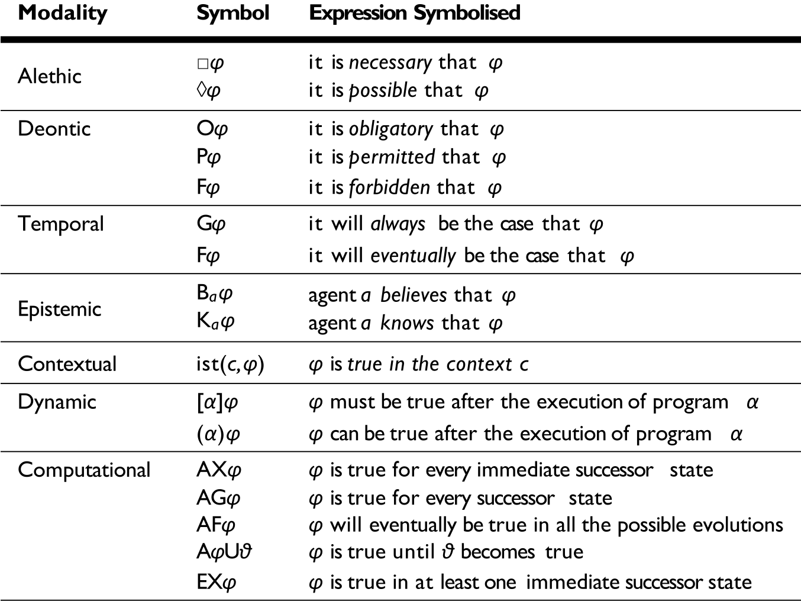

# Mathematical logic – Full

|       |          |                                                              |
| ----- | :------: | -----------------------------------------------------------: |
| Logic | 2 - Full | [🗀][root]    [🗍](http://www.datascientia.education/cl-2020/calendar.html)    [🗪](https://github.com/avillafiorita/cl-2020/issues) |

[TOC]

# [1.][root] Modal logic - Introduction

## [1.1.][pdf-11] Intuition

### Definition

> <u>Definition</u>  (**Modality**)
>
> - Expression that is used to qualify the truth of a judgement
> - An operator that
>   - Expresses a 'mode' in which a proposition is true
>   - Takes a proposition and returns a more complex proposition

A possible modality is expressed in **natural language** through **modal verbs**

- Can/could, may/might, must, will/would, shall/should

### Operators

Modalities are formalized using **operators** $□$ and its dual $◊$

- They can be applied to a formula $φ$ to obtain another **formula** $□φ$ or $◊φ$
- The **truth value** of $□φ$ is a **relation** of the truth value of $φ$
  - **Not a function**, even if the truth values are related
- $¬$ is not a modal operator
  - The truth value of $¬φ$ is a function of the truth value of $φ$

### Modalities

**Alethic modalities** ~~(historically the first modalities formalized with modal logic)~~

- It is **possible** that a certain proposition holds, usually denoted with $◊φ$
- It is **necessary** that a certain proposition holds, usually denoted with $□φ$

## [1.2.][pdf-12] Language

### Formulas

> <u>Definition</u>  (**Well formed formulas**)
>
> Given a set of primitive proposition $P$, the set of formulas of the basic modal logic is defined as follows
>
> - **Atomic formula**
>   - $\forall\, p ∈ P$
> - **Formula**
>   - Every atomic formula
>   - $A,B\,\ {\sf formulas}\ \Rarr\ ¬ A\,,\ A ∧ B\,,\ A ∨ B \,,\ A → B\,,\ A ≡ B\ \ \sf formulas$
>   - 
>     $A\,\ {\sf formula}\ \Rarr\ □A,\ ◊A \ \ \sf formulas$

- ~~There are also first order modal logics~~

### Intuitive interpretation

- The formula $□φ$ can be **intuitively interpreted in many ways**
  - $φ$ is necessarily true (classical modal logic)
  - $φ$ is known/believed to be true (epistemic logic)
  - $φ$ is provable in a theory (provability logic)
  - $φ$ will be always true (temporal logic)
  - · · ·
- In all these cases, $◊φ$ is **interpreted** as $¬ □¬φ$ and it means that
  - $¬φ$ is not necessarily true
  - $φ$ is possibly true

## [1.3.][pdf-13] Relational structures and satisfiability

### Relational structures

> <u>Definition</u>  (**Relational structure**)
>
> A relational structure is a tuple
> $$
> \lang W, R_a \rang_{a∈A}\ :=\ \lang W , R_{a_1} , . . . , R_{a_n} \rang
> \ \ |\ \ R_{a_i} ⊆ W × ··· × W
> $$
>
> - Each $w ∈ W$ is called **point**
>   - World, state, time instant, situation, ...
> - Each $R_{a_i}$ is called **(accessibility) relation**

- A **world** is similar to a **model**

### Examples of RSs

- **Strict partial order** (SPO)
  - $\lang W , < \rang$
  - $<$ is transitive and irreflexive
- **Strict linear order**
  - $\lang W , < \rang $
  - $({\rm SPO}) + \forall\, v ≠ w ∈ W ,\ v < w \or w < v$
- **Partial order** (PO)
  - $\lang W , ≤ \rang$
  - $≤$ is transitive, reflexive, and antisymmetric
- **Linear order**
  - $\lang W , ≤ \rang$
  - $({\rm PO}) + \forall v , w ∈ W ,\ v ≤ w \or w ≤ v$
- **Labeled transition system** (LTS)
  - $\lang W , R_a \rang_{a∈A} \and R_a ⊆ W × W$
- **XML document**
  - $\lang W , R_l \rang_{l∈L}$
  - $W$ contains the components of an XML document and $L$ is the set of labels that appear in the document

### Semantics

> <u>Definition</u>  (**Basic frame**)
>
> A (basic) frame $F$ is an algebraic structure 
> $$
> F = \lang W , R\rang\ \ |\ \ R ⊆ W × W
> $$

> <u>Definition</u>  (**Interpretation**)
>
> An interpretation $I$ of a modal language in a frame $F$ is a function
> $$
> I : P → 2^W
> $$

- Intuitively $w ∈ I(p)$ means that $p$ is true in $w$, or that $w$ is of type $p$

> <u>Definition</u>  (**Model**)
>
> A model $M$ is a pair ‹frame, interpretation›
> $$
> M = \lang F, I\rang
> $$

### Satisfiability of modal formulas

**Truth is relative to a world**

Thus, the relation $⊨$ is defines between a **world in a model** and a **formula**

[See slides 7-12][pdf-13]

## [1.4.][pdf-14] Val, Sat, LC, LE

---

# 🗍

[root]: ../Logica
[pdf-11]: ../Logica/L13.T111.ML.Intuition.pdf
[pdf-12]: ../Logica/L13.T112.ML.language.pdf
[pdf-13]: ../Logica/L13.T113.ML.SAT.pdf
[pdf-14]: ../Logica/L13.T114.ML.VAL2LE.pdf
[pdf-21]: ../Logica/L14.T121.ML-K.More.ModalK.pdf
[pdf-22]: ../Logica/L14.T122.ML-K.More.Acces.relation.pdf
[pdf-23]: ../Logica/L14.T123.ML-K.More.ModalKT.pdf
[pdf-24]: ../Logica/L14.T124.ML-K.More.ModalKB.pdf
[pdf-25]: ../Logica/L14.T125.ML-K.More.ModalKD.pdf
[pdf-26]: ../Logica/L14.T126.ML-K.More.ModalKT4.pdf
[pdf-27]: ../Logica/L14.T127.ML-K.More.ModalKT5.pdf
[pdf-28]: ../Logica/L15.T128.ML-K.More.MML.pdf
[pdf-29]: ../Logica/L15.T129.ML-K.More.MMLKB.pdf
[pdf-31]: ../Logica/L15.T131.ML-K.Reasoning.Tableau.pdf

[pdf-41]: ../Logica/L17.T141.DL.Introduction.Intuition.pdf

[pdf-43]: ../Logica/L17.T143.DL.Introduction.DL.pdf

[pdf-42]: ../Logica/L17.T142.DL.Introduction.2KG.pdf
[pdf-51]: ../Logica/L18.T151.DL.TBox-ABox.TBox.synt.sem.pdf
[pdf-53]: ../Logica/L18.T153.DL.TBox-ABox.Terminology.pdf
[pdf-54]: ../Logica/L18.T154.DL.TBox-ABox.TBox.reasoning.pdf
[pdf-55]: ../Logica/L18.T155.DL.TBox-ABox.ABox.synt.sem.pdf
[pdf-56]: ../Logica/L18.T156.DL.TBox-ABox.ABox.reasoning.pdf
[pdf-57]: ../Logica/L18.T157.DL.TBox-ABox.CWA.pdf
[pdf-61]: ../Logica/L19.T161.DL.Tableaux.Reasoning.Intuition.pdf
[pdf-63]: ../Logica/L19.T163.DL.Tableaux.Reasoning.pdf
[pdf-64]: ../Logica/L19.T164.X.DL.Tableaux.Reasoning.TBox-examples.pdf
[pdf-65]: ../Logica/L19.T165.X.DL.Tableaux.Reasoning.ABox-examples.pdf
[pdf-71]: ../Logica/L20.T171.X.DL.Applications.DB.pdf
[pdf-72]: ../Logica/L20.T172.X.DL.Applications.ERModels.pdf
[pdf-73]: ../Logica/L20.T173.X.DL.Applications.KG.pdf