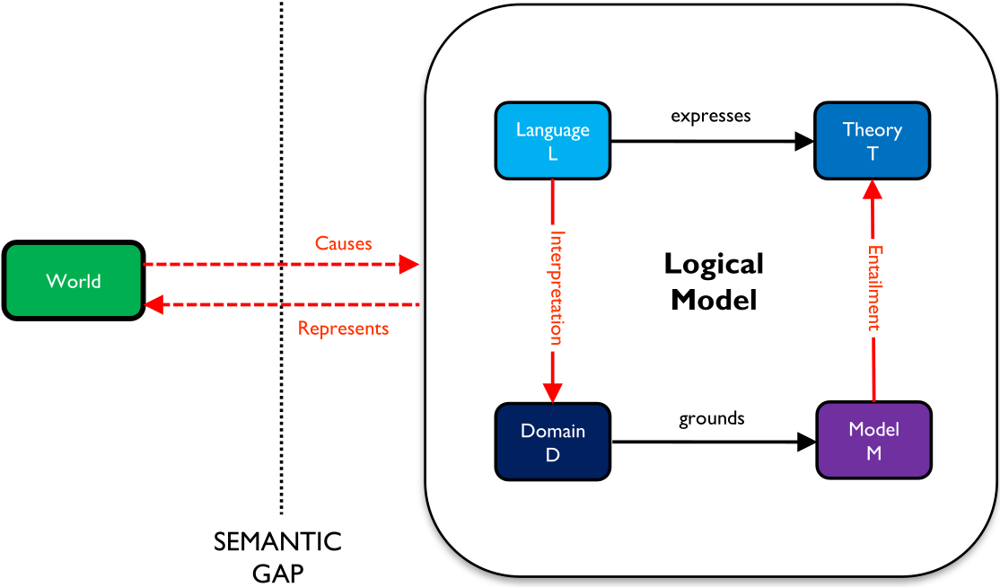

# Mathematical logic – Full

|       |      |                                                              |
| ----- | :--: | -----------------------------------------------------------: |
| Logic | Full | [🗀][root]    [🗍](http://www.datascientia.education/cl-2020/calendar.html)    [🗪](https://github.com/avillafiorita/cl-2020/issues) |

[TOC]


# [1.][root] Introduction

## [1.1.][pdf-11] Models

### Conceptual models

> **Conceptual model**: *meaningful representation of a portion of the world, described in a certain language*

> **Conceptual modeling**: *activity which leads to the construction of models*


### ==Mental model==

> **==Mental model==**: *human representation of the world*


- ==**World**: what we perceive==
- ==**Mental model**: mental representation of world, decomposed in 4 constituents==
  - ==**Language**: alphabet + syntax used to describe the world==
  - ==**Theory** (**fact**): sentences describing what is true in the world==
  - ==**Domain**: images representing atomic elements used to describe what we see==
  - ==**Model**: images representing the sets of facts (scenes) that we see==
- ==**Semantic gap**: difference between world and mental model==

~~The **link** from language to the images is **in the mind of the person** looking at the world, but not in the mind of the others~~


### ~~Computational model~~

> ~~**Computational model**: *implementation of programs*~~

~~~~

- ~~**Language**: abstraction of the language of the table~~
- ~~**Theory**: actual table~~
- ~~**Domain**: possible memory locations~~
- ~~**Model**: actually used memory locations~~

~~No computer mental model: **mental model** is only in the mind of **developer**~~


### ==Logical model==

> **==Logical model==**: *meaning of language made explicit*



- ==**Interpretation**: function which associates each element of the language to one and only one element of the domain==
- ==**Truth-relation / *entailment***==[^1]==**/ satisfiability / ⊨**: relation which associates what is true in the model with a subset of the sentence of the language==
  - ==A **sentence** can be an element in a **theory** if and only if its interpretation is true in the model==

~~Logical model can be used to **describe** both **mental** and **computational** ones~~

| ~~Mental~~        | ~~Computational~~    | ~~Logical~~          |
| ----------------- | -------------------- | -------------------- |
| ~~Images~~        | ~~Memory locations~~ | ~~Sets of elements~~ |
| ~~Always finite~~ | ~~Always finite~~    | ~~Often infinite~~   |

[^1]: implicazione


#### ~~Usefulness~~

~~Logical models make **precise** what we mean when we describe something~~

- ~~**Interaction** developer-customer~~
  - ~~Implementation of requirements, change safe~~
- ~~**Integration** between two **developers/programs**~~
  - ~~Input/output *compliance* [^2]~~
    - ~~Syntactic compliance (standards)~~
    - ~~Semantic/meaning compliance~~
- ~~**High value applications** because of its cost~~
  - ~~Largely solved, lots of solutions in the market~~
- ~~**System interoperability** (web)~~

[^2]: conformità


## ==[1.2.][pdf-12] Language==

### ==Definitions==

> **==Symbol==**: *atomic token* 

> **==Alphabet==**: *set of symbols*

> **==Language==**: *set of symbols and formation rules to compose them to build correct sentences*

- ~~**Sentences** are usually unbound in length, but still **finite**~~


### ==Syntax and semantics==

$$
\rm language\ =\ syntax\ +\ semantics \;
$$

> **==Syntax==**: *the way a language is written*

- ==Determined by a **set of rules** saying how to construct the expressions of the language from the alphabet==

> **==Semantics==**: *the way a language is interpreted*

- ==Determines the **meaning of expressions**==

> **==Expression==**: *syntactic construct*

> **==Meaning==**: *relationship between expressions and elements of some universe of meanings*

- **Universe** may or may not be **formalized**


## ==[1.3.][pdf-13] Logical modeling==

### ==Formal language==

$$
\rm formal\ language\ =\ formal\ syntax\ +\ formal\ semantics
$$

> <u>Definition</u>  (**==Formal syntax==**)
>
> - Infinite/finite (always recognizable) **alphabet**
> - Finite set of formal constructors and building **rules for phrase construction**
> - Algorithm for **correctness checking** (a phrase in a language)

> <u>Definition</u>  (**==Formal semantics==**)
>
> - **Interpretation function** (relationship) $I$ between syntactic **constructs** in a language $L$ and the **elements** of an universe of meanings $D$
>   $$
>   I : L → D
>   $$
>
> - **Domain** $D$ is always as a **set of elements**
>
> - Requires **formal syntax**

> <u>Definition</u>  (**Informal syntax/semantics**)
>
> The **opposite** of formal (absence of the elements above)

[Examples slides 4-6][pdf-13]


### ==Logic==

A logic has three **fundamental components**

- **Formal language** ($L$): defines what can be correctly said
- **Interpretation function** ($I$): defines how symbols are to be interpreted in the intended domain and model
- **Entailment relation** ($\vDash$): defines/computes two relations (in the model)
  - **Validity/satisfiability**: truth of a formula
  - **Logical consequence**: the truth of a set of formulas implies the truth of another formula


#### ==Theory and model==

Given $\{L,\, I,\, ⊨\}$, a logic allows to define two **components**

> **==Theory==**: *set of sentences (usually infinite) in $L$ which are assumed true in the intended model, as computed via entailment starting from finite set (called itself theory, or finite presentation of theory)*

> **==Model==**: *set of facts (usually infinite) expressed in the language describing the mental model (the part of the world observed), in agreement with the theory and the interpretation function*


### ~~Logic in practice~~

1. ~~**Define a logic**~~
   - ~~Most often by researchers~~
   - ~~Done once for all~~
2. ~~**Choose the right logic** for the problem ($L$, $I$, $\vDash$)~~
3. ~~**Write the theory**~~
4. ~~**Different uses**~~
   - ~~Basis for agreement developer/customer (theory)~~
   - ~~Guarantee semantic interoperability (theory)~~
   - ~~Ascertain that programs does what it is supposed to do (entailment)~~
   - ~~Implement AI (entailment)~~


### ~~Trade off~~

~~There is a **trade-off** between~~

- ~~**Expressive power** (expressiveness)~~
- ~~**Computational efficiency** provided by a logical language~~

~~This trade-off is a measure of the **tension** between~~

- ~~**Specification** expressiveness~~
- ~~**Automation** efficiency~~

~~To use logic for **modeling**, the modeler must find the right trade off between expressiveness in the language for more tractable forms of reasoning~~


### ~~Example of expressiveness~~

| ~~Language~~                  | ~~NL sentence~~                                              | ~~Formula~~                                                  |
| ----------------------------- | ------------------------------------------------------------ | ------------------------------------------------------------ |
| ~~**Propositional logic  **~~ | ~~Fausto likes skiing<br />I like skiing~~                   | ~~Fausto-likes-skiing<br />I-like-skiing~~                   |
| ~~**First-order logic**~~     | ~~Every person likes skiing<br/>I like skiing<br/>Fausto likes skiing~~ | ~~∀ person.like-skiing(person)<br/>like-skiing(I)<br/>like-skiing(Fausto)~~ |
| ~~**Modal logic**~~           | ~~I believe I like skiing~~                                  | ~~Believe(I-like-skiing)~~                                   |
| ~~**Description Logic**~~     | ~~Every person likes cars~~                                  | ~~person ⊑ ∃ likes.Car~~                                     |


### Decidability and complexity

> **==Reasoning==**: *deriving consequences of what is known*

**Decidability** of reasoning

- A **logic is decidable** if there is an **effective method** for determining whether a **formula is included in a theory**
- A **decision procedure** is an algorithm that, given a decision **problem**, terminates with the **correct yes/no answer**
- All logic in this course but first-order logic are decidable

 ~~**Computational complexity** of reasoning (given decidability)~~

- ~~The **difficulty to compute** a reasoning task in a given logic~~
- ~~The logical languages are classified according to varying **degrees of complexity** (P, NP, Pspace, ...)~~


## [~~1.4.~~][pdf-14] ~~Formal and informal languages/models~~

### ~~Conceptual modeling~~

~~**Specification models** depends on the language~~

| ~~Model~~          | ~~Language~~              | ~~Description~~                                              |
| ------------------ | ------------------------- | ------------------------------------------------------------ |
| ~~**Informal**~~   | ~~Natural~~               | ~~Informal syntax and informal semantics~~                   |
| ~~**Semiformal**~~ | ~~Diagrams, programming~~ | ~~Structured semi-formal languages with semi-formal syntax and informal semantics~~ |
| ~~**Logic**~~      | ~~Logical~~               | ~~Specific type of formal models~~                           |


### ~~Levels of formalization~~


### ~~Uses of the languages~~

| ~~Language~~     | ~~Used for~~                                                 | ~~Pros~~                                                     | ~~Cons~~                                                     |
| :--------------- | :----------------------------------------------------------- | :----------------------------------------------------------- | :----------------------------------------------------------- |
| ~~**Natural**~~  | ~~Informal specification<br /><br />Beginning of problem<br/>solving~~ | ~~Cheaper to use, direct, flexible, well-understood<br /><br />Interact with users~~ | ~~Semantics is informal, ambiguous<br /><br />Pragmatically inefficient for automation~~ |
| ~~**Diagrams**~~ | ~~Semi-formal specification<br /><br />Representation with unified languages, more precision~~ | ~~Cheap to use<br /><br />Structured and organized<br /><br />Interact with users~~ | ~~Semantics is informal, ambiguous<br /><br />Pragmatically inefficient for automation~~ |
| ~~**Logic**~~    | ~~Formal specification<br /><br />Automation<br />Reasoning services~~ | ~~Well-understood, formal syntax and semantics<br /><br />Better to specify and prove correctness/completeness<br /><br />Pragmatically efficient for automation exploiting the explicitly codified semantics~~ | ~~Hardly usable to interact with users<br /><br />Costly<br /><br />Effectiveness to be compared with Machine learning~~ |


# [2.][root] Set theory

## [2.1.][pdf-21] Introduction

### Extensional semantics

> **Intended interpretation of $L$**: *the meanings which are intended to be attached to the symbols and propositions*

> **Extension of a proposition**: *totality, or class, or set of all objects $D$ to which the proposition applies*

- ~~**Extensional semantics of $L$** is based on the notion of “extension” of a formula (proposition) in $L$~~


## [~~2.2.~~][pdf-22] ~~Sets~~

[~~Review pdf T22~~][pdf-22]


## [2.3.][pdf-23] Relations

### Basic concepts

> **Relation**: *a relation $R$ from the set $A$ to the set $B$ is a subset of the Cartesian product of $A$ and $B$*
> $$
> R ⊆ A × B
> $$
>
> $$
> (x,y) ∈ R\ \Rarr \ xRy\ \ (x \text{ is }R\text{-related to }y)
> $$

- A **binary relation** on a set $A$ is a subset $R ⊆ A × A$

Given a relation $R$ from $A$ to $B$

- **Domain of $R$**
  $$
  {\rm Dom}(R)=\{a ∈ A\ |\ \exist\ b ∈ B : aRb \}
  $$

- **Co-domain of $R$**
  $$
  {\rm Cod}(R)=\{b ∈ B\ |\ \exist\ a ∈ A : aRb \}
  $$

- **Inverse relation of $R$**
  $$
  R^{-1}\subseteq B×A\,,\ \ \ R^{-1}=\{(b,a)\ |\ (a,b)\in R\}
  $$


### Properties

Let $R$ be a binary relation on $A$, $R$ is

- **Reflexive**            $\iff\ aRa\,, \ \ \forall a\in A$
- **Symmetric**         $\iff\ aRb\Rarr bRa\,,\ \ \forall a,b\in A$
- **Anti-symmetric** $\iff\ aRb\and bRa\Rarr a=b\,,\ \ \forall a,b\in A$
- **Transitive**           $\iff\ aRb\and bRc\Rarr aRc\,,\ \ \forall a,b,c\in A$


### Equivalence

Let $R$ be a binary relation on $A$, $R$ is an **equivalence relation** ($\sim,\,\equiv$) iff $R$ is

- Reflexive
- Symmetric
- Transitive


### Set partition

Let $A$ be a set, a **partition** of $A$ is a **family** $F$ of non-empty subsets of $A$ s.t.

- The subsets are ***pairwise*[^3] disjoint**
- The **union** of all the subsets is the **set $A$**

Each element of $A$ belongs to **exactly one** subset in $F$

[^3]: a coppie


### Order relation

Let $A$ be a set and $R$ be a binary relation on $A$, $R$ is a (partial) **order** $≤$ if it is

- Reflexive             $\ a ≤ a$
- Anti-symmetric   $\,a ≤ b \and b ≤ a\ \Rarr\ a = b$
- Transitive             $a ≤ b \and b ≤ c\ \Rarr\ a ≤ c$

If the relation holds for all $a, b ∈ A$ then it is a **total order**

A relation is a **strict order** $<$ if it is

- Transitive     $a < b \and b < c\ \Rarr\ a < c$
- $\forall a, b ∈ A,\,\ \ \ a < b \or b < a \or a = b$


## [2.4.][pdf-24] Functions

### Basic concepts

> **Function**: *given two sets $A$ and $B$, a function $f$ from $A$ to $B$ is a relation that associates to each element $a$ in $A$ exactly one element $b$ in $B$*
> $$
> f:A→B
> $$

- **Domain of $f$**
  $$
  {\sf whole\ set}\,\ A
  $$

- **Image of $a$ in $A$**
  $$
  b\in B\ |\ f(a)=b
  $$

- **Co-domain of $f$**
  $$
  {\rm Im}_f\subseteq B\ \ |\ \ {\rm Im}_f = \{b ∈ B\ |\ \exist\ a ∈ A : b = f (a)\}
  $$


### Classes of functions

A function $f : A → B$ is

- **Surjective** $\iff\ \exist\ a\in A\ |\ f(a)=b \,, \ \ \forall b\in B$
  - Each element in $B$ is image of some elements in $A$
- **Injective**   $\iff\ \exist!\ a\in A\ |\ f(a)=b \,, \ \ \forall b\in {\rm Im}_f$
  - Distinct elements in $A$ have distinct images in $B$
- **Bijective**   $\iff\ \exist!\ a\in A\ |\ f(a)=b \,, \ \ \forall b\in B$
  - Injective and surjective


### Inverse function

If $f : A → B$ is **bijective** we can define its **inverse function**
$$
f^{−1} : B→A
$$
**For each** function $f$ we can define its **inverse relation**

- Such a relation is a **function** iff $f$ is **bijective**


### Composed function

Let $f : A → B$ and $g : B → C$ be functions, the **composition** of $f$ and $g$ is the function $g \circ f : A → C$ obtained by applying $f$ and then $g$
$$
(g \circ f )(a) = g (f (a))\ \ \ \forall a ∈A
$$

$$
g \circ f = \{(a,\, g(f (a)))\ |\ a ∈A\}
$$


# [3.][root] Propositional logic

## ==[3.1.][pdf-31] Intuition==

### ==Proposition==

> **==Proposition==**: *statement about what is the case in the world*

- ==A proposition can be **true** or **false**==
- The same proposition can be expressed in **different ways**
- The **language** of PL allows us to express propositions
- ==Propositions are the **atomic language element** of PL==
- PL is the **logic of propositions**


## ==[3.2.][pdf-32] Language==

### ==PL language==

> <u>Definitions</u>  (**==Propositional alphabet==**)
>
> - **Logical symbols and priority**:  $¬ \,\ \ {\tt >}\ \ ∧ \ \ {\tt >}\ \ ∨ \ \ {\tt >}\ \ → \ \ {\tt >}\ \ ≡$
> - **Non logical symbols**:  propositional variables $P$ of set $\tt PROP$
> - **Separator symbols**:  $(\ \ )$

> <u>Definitions</u>  (**==Well formed formulas==**)
>
> - **Atomic formula**
>   - ${\sf Every}\ P\in\tt PROP$
> - **Formula**
>   - Every atomic formula
>   - $A,B\,\ {\sf formulas}\ \Rarr\ ¬ A\,,\ A ∧ B\,,\ A ∨ B \,,\ A → B\,,\ A ≡ B\ \ \sf formulas$

> <u>Definitions</u>  (**==Constants and variables==**)
>
> - **Constant**: simple proposition
> - **Variable**: proposition where a variable can be substituted with a constant, a variable or in general any formula
>


### ~~Formulas as trees~~

~~A formula can be seen as a **tree**~~

- ~~Leaves  →  **variables**~~
- ~~Nodes  →  **connectives**~~

$$
(A ∧¬ B) ≡ (B → C)
$$


### ~~Subformulas~~

> ~~<u>Definition</u>  (**Subformulas**)~~
>
> - ~~$A\,\ {\sf SFof}\,\ A$~~
> - ~~$A\,\ {\sf SFof}\,\ ¬ A$~~
> - ~~$A, B\,\ {\sf SFof}\,\ \{A∧B \,,\ A∨B \,,\ A→B \,,\ A≡B\,\}$~~
> - ~~$A\,\ {\sf SFof}\,\ B\ \and\ B\,\ {\sf SFof}\,\ C\ \Rarr\ A\,\ {\sf SFof}\,\ C$~~
>
> ~~$A$ is a **proper subformula** of $B$ if $A$ is a subformula of $B$ and $A\ne B$~~

~~The **subformulas** of a formula represented as a tree correspond to all the different **subtrees** of the tree associated to the formula, one for each node~~

- ~~Every formula has a **finite** number of subformulas~~


## ==[3.3.][pdf-33] Satisfiability==

### ==Interpretation of PL==

> **==Propositional interpretation==**: *function that specify the truth value of a proposition*
> $$
> I :\ {\tt PROP} → \{⊤,⊥\}
> $$

- A PI is a **subset** $S$ of $\tt PROP$ such that $I$ is the **characteristic function** of $S$

  $$
  A\in S \iff I(A)=⊤
  $$

- ~~Given the **cardinality** $|{\tt PROP}|$, then there are $2^{|{\tt PROP}|}$ different interpretations~~

  - ~~All the different subsets (**power set**) of $\tt P R O P$~~
  - ~~If $|{\tt PROP}|$ is finite then there is a **finite** number of interpretations~~

> <u>Examples</u>
>
> 1. $$
>    P=\{P,\,Q\} \ \ \ |\ \ \
>    I(P) =⊤\ \and \ I(Q) =\, ⊥
>    \ \ \ \Rarr\ \ \ I=\{P\}
>    $$
>
> | 2. |  | $\boldsymbol p$ | $\boldsymbol q$ | $\boldsymbol r$ | $\bold {Set}$ |
> | :----------------------- | :-------------- | :-------------: | :-----------: | :-----------: | :-----------: |
> |                     |          $I_1$           |     $⊤$     |     $⊤$     |     $⊤$     |  $\{p,q,r\}$  |
> |                     |          $I_2$           |     $⊤$     |     $⊤$     |     $⊥$     |   $\{p,q\}$   |
> |                     |          $I_3$           |     $⊤$     |     $⊥$     |     $⊤$     |   $\{p,r\}$   |
> |                     |          $I_4$           |     $⊤$     |     $⊥$     |     $⊥$     |    $\{p\}$    |
> |                     |          $I_5$           |     $⊥$     |     $⊤$     |     $⊤$     |   $\{q,r\}$   |
> |                     |          $I_6$           |     $⊥$     |     $⊤$     |     $⊥$     |    $\{q\}$    |
> |                     |          $I_7$           |     $⊥$     |     $⊥$     |     $⊤$     |    $\{r\}$    |
> |                     |          $I_8$           |     $⊥$     |     $⊥$     |     $⊥$     |    $\{\}$     |


### ==Satisfiability of a formula==

> <u>Definition</u>  (**==Satisfiability==**) 
>
> A formula $A$ is satisfied by (true in) an interpretation $I$ (in symbols $I\vDash A$) according to the following inductive definition
>
> - $I(P)=⊤\ \ \ \ \Rarr\ \ \ I\vDash P\,,\ \ \ P\in\tt PROP$
>   - $¬(I\vDash A)\ \ \ \ \ \ \ \ \ \ \ \ \ \ \ \ \ \ \ \ \ \Rarr\ \ \ \ I\vDash ¬A$
>   - $I\vDash A\ \ \ \, \and\ \ \ \ I\vDash B\ \ \ \ \Rarr\ \ \ \ I\vDash A\and B$
>   - $I\vDash A\ \ \ \, \or\ \ \ \ I\vDash B\ \ \ \ \Rarr\ \ \ \ I\vDash A\or B$
>   - $I\vDash A\ \ \, →\ \ \ I\vDash B\ \ \ \ \Rarr\ \ \ \ I\vDash A→ B$
>   - $I\vDash A \iff I\vDash B\ \ \ \ \Rarr\ \ \ \ I\vDash A\equiv B$

- $\forall\ P\in A,\ \ I(P)=I'(P)\ \ \Rarr\ \ I\vDash A \iff I'\vDash A$


### ==Checking satisfiability==

> <u>Procedure</u>  (**==Checking satisfiability==**)
>
> Given a formula $A$, of primitive propositions $P_i$, and an interpretation $I$
>
> 1. **Replace** each occurrence of $P_I$ in $A$ with the truth value assigned by $I$
> 2. **Apply** the definitions for connectives

[Example slide 6][pdf-33]

> <u>Algorithm</u>  (**==Lazy evaluation==**) ~~(~~[~~Go to MCDP~~](###Model checking)~~)~~
>
> - $A=p$
>
>   ```c
>   bool check(I ⊨ p)
>   	if I(p) == true
>   		return true
>   	else
>           return false
>   ```
>
> - $A=B\and C$
>
>   ```c
>   bool check(I ⊨ B ∧ C)
>       if check(I ⊨ B)
>           return check(I ⊨ C)
>       else
>           return false
>   ```
>
> - $A=B\or C$
>
>   ```c
>   bool check(I ⊨ B ∨ C)
>   	if check(I ⊨ B)
>   		return true
>       else
>           return check(I ⊨ C)
>   ```
>
> - $A=B→ C$
>
>   ```c
>   bool check(I ⊨ B → C)
>       if check(I ⊨ B)
>           return check(I ⊨ C)
>   	else
>           return true
>   ```
>
> - $A=B\equiv C$
>
>   ```c
>   bool check(I ⊨ B ≡ C )
>       if check(I ⊨ B)
>           return check(I ⊨ C)
>       else
>           return ¬(check(I ⊨ C))
>   ```
>


## ==[3.4.][pdf-34] Validity and unsatisfiability==

### ==Formulas classification== ~~(~~[~~Go to Properties~~](# Properties - Open and closed formulas)~~)~~

> <u>Definitions</u>  (**==Formulas classification==**)
>
> A **formula** $A$ is
>
> - **Valid**             $\ \iff\ \forall I\,,\ \ \ I\vDash A$
> - **Satisfiable**     $\,\iff\ \exist I\ \ |\ \ I\vDash A$
> - **Unsatisfiable** $\iff\ \nexists I\ \ |\ \ I\vDash A$
>

> <u>Propositions</u>  (**==Implications==**)
>
> - ${\rm VAL}(A)\ \Rarr\ {\rm SAT}(A)\iff ¬{\rm UNSAT}(A)$
> - ${\rm UNSAT}(A)\iff ¬{\rm SAT}(A)\ \Rarr\ ¬{\rm VAL}(A)$
>
> $$
> \begin{array}{l}
> \begin{array}{c}
> A && ¬A \\ \hline
> \rm VAL &→& \rm UNSAT \\
> \rm SAT &→& \rm ¬VAL \\
> \rm ¬VAL &→& \rm SAT \\
> \rm UNSAT &→& \rm VAL 
> \end{array}
> &&
> {{\rm VAL}(A)\iff {\rm UNSAT}(¬A) \\
> {\rm SAT}(A)\iff {\rm ¬VAL}(¬A)}
> \end{array}
> $$

><u>Theorem</u>  (==**Refutation principle - validity**==)  [~~(Please tell me if it is correct)~~](mailto:davide.vecchi@studenti.unitn.it)
>$$
>⊨ A \iff \{¬ A\}\ \sf unsatisfiable
>$$
><u>Proof</u>
>
>- Suppose that  $⊨A$
>   - $\Rarr \ \ \forall I,\ I\vDash A\ \ \Rarr\ \ I ⊭ ¬A$
>   - $\Rarr \ \ \nexists I\ \ |\ \ I\vDash ¬A\ \ \Rarr\ \ \{¬A\}\ {\sf unsatisfiable}$
>- Suppose that $\{¬A\}\ {\sf unsatisfiable}$
>  - $\Rarr\ \ ⊭ ¬A\ \ \Rarr\ \ ⊨A$

> <u>Examples</u>
>
> 


### ==Sets of formulas==

> <u>Definition</u>  (**==Set of formulas==**)
>
> A **set of formulas** $Γ$ is
>
> - **Valid**             $\ \iff\ \forall A\inΓ\,,\ \ \forall I\,,\ \ \ I\vDash A$
> - **Satisfiable**     $\,\iff\ \forall A\inΓ\,,\ \ \exist I\ \ |\ \ I\vDash A$
> - **Unsatisfiable** $\iff\ \forall A\inΓ\,,\ \ \nexists I\ \ |\ \ I\vDash A$
>

> <u>Proposition</u>  (**Finite set**)
> $$
> \forall_{< \infin}\,Γ = \{A_1 , ..., A_n \},\ \ \ Γ\ {\sf valid}\iff A_1\and ··· \and A_n\ {\sf valid} \\
> \sf (resp.\ satisfiable\ and\ unsatisfiable)
> $$
>


### Truth Table

**Checking** (un)**satisfiability** and **validity** of a formula $A$ can be done by **enumerating** all the **interpretations** which are relevant for $S$, and for each interpretation $I$ check if $I \vDash A$

[Examples slides 5, 8-11][pdf-34]


## ==[3.5.][pdf-35] Logical consequence and equivalence==

### ==Definitions==

> ==**Logical consequence**==: *a formula $A$ is a LC of a set of formulas $Γ$ iff*
> $$
> Γ\vDash A\ \iff\ \forall F\in Γ,\ \ \forall I:I\vDash F\,,\ \ \ I\vDash A
> $$

> ==**Logical equivalence**==: *two formulas $F$ and $G$ are logically equivalent iff* 
> $$
> F ≡ G\ \iff\ \forall I\,,\ \ \ I(F) = I(G)
> $$

[Example slide 3-4, 6][pdf-35]


### ==Properties of LC==

$Γ$ and $Σ$ are two sets of formulas and $A$ and $B$ two formulas

- **Reflexivity**                   $\{ A \} ⊨ A$
- **Monotonicity**              $\,Γ ⊨A \ \Rarr\ Γ ∪ Σ ⊨ A$
- **Cut**                               $\,Γ ⊨A \and Σ ∪ \{ A \} ⊨B \ \Rarr\ Γ∪ Σ ⊨ B$
- **Compactness**              $\,Γ ⊨A\ \Rarr\ \exist_{<\infin}\ Γ_0 ⊆ Γ\ |\ Γ_0 ⊨ A$
- ==**Deduction theorem**    $\,Γ,\, A ⊨B \iff Γ ⊨A → B$==
- ==**Refutation principle**   $\,Γ ⊨A \iff Γ∪ \{¬A\}\ \sf unsatisfiable$==

> <u>Theorem</u>  (**==Refutation principle - LC==**)
> $$
> Γ ⊨φ\ \iff\ Γ ∪\{¬φ\}\ {\sf unsatisfiable}
> $$
> <u>Proof</u>
>
> - Suppose that  $Γ ⊨φ$
>   - $\Rarr \ \ \forall I\ |\ I\vDash Γ\,,\ I\vDash φ\ \ \Rarr\ \ I ⊭ ¬φ$
>   - $\Rarr \ \ \nexists I\ \ |\ \ I\vDash Γ\and I \vDash ¬φ$
> - Suppose that  $I ⊨Γ$
>   - $Γ ∪\{¬φ\}\ {\sf unsatisfiable}\ \ \Rarr\ \ I ⊭ ¬φ\ \ \Rarr\ \ I ⊨φ$


## [3.6.][pdf-36] Axioms and theories

### ==Propositional theory==

> **==Propositional theory==**: *set of formulas closed under the LC relation*
> $$
> T\ {\sf theory}\ \iff\ T ⊨A\ \Rarr\ A \in T
> $$

- A propositional theory always contains an **infinite set of formulas**
  - Any theory $T$ contains at least **all the valid formulas**, which are infinite

> **==Logical closure==**: *for any set of formulas $Γ$*
> $$
> {\rm cl}(Γ)=\{A\ |\ Γ\vDash A \}
> $$

- For any set $Γ$, the closure ${\rm cl}(Γ)$ is a **theory**

[Examples slides 3-4][pdf-36]


### Axiomatization

> **Set of axioms**: *a set of formulas $Ω$ is a set of axioms for a theory $T$ if*
> $$
> \forall A\in T\,,\ \ Ω ⊨A
> $$

- $Γ$ is a set of axioms for ${\rm cl}(Γ)$

> **Finitely axiomatizable theory**: *a theory $T$ is finitely axiomatizable if it has a finite set of axioms*


### ~~Hilbert axioms for PL~~

~~<u>Axioms</u>~~

1. ~~$φ → (ψ → φ)$~~
2. ~~$(φ → (ψ → θ)) → ((φ → ψ) → (φ → θ))$~~
3. ~~$(¬ψ → ¬φ) → ((¬ψ → φ) → φ)$~~

~~<u>Notes</u> (~~[~~Go to Hilbert calculus~~](#Hilbert calculus)~~)~~

1. ~~**Minimal language** (logical connectives defined in terms of the basic ones)~~
2. ~~It allows to compute all **tautologies**~~
3. ~~Useful to prove **properties** of logical theories~~
4. ~~**Never** used **in practice** in CS~~
5. ~~**In practice** in CS, people add **more axioms** (facts) which define what is true in the intended (mental) model~~


### ~~Compactness and minimality~~

~~The **axiomatization of a theory** is a **compact** way to represent~~

- ~~A set of **interpretations**~~
- ~~A set of possible (acceptable) **world states**~~
- ~~All the **knowledge** we have of the real world~~

~~**Sets of axioms** are **minimal**~~

- ~~**No** axioms can be **derived** from the others~~
- ~~The **axioms** of a theory constitute the **basic knowledge**~~
- ~~All the **knowledge** can be obtained by **logical consequence**~~


### ~~Logic based systems~~

- ~~Used for **representing** and **reasoning** about **knowledge**~~
- ~~Composed by~~
  - ~~**Reasoning system**~~
  - ~~**Knowledge base**~~
    - ~~Consists of a finite **collection of formulas** in a logical language~~
    - ~~**Answers queries** submitted to it *by means of*[^4] a **reasoning system**~~


~~~~

- ~~**Tell** action~~
  - ~~Incorporates the **new knowledge** encoded in an **axiom** (formula)~~
  - ~~Allows to build a **knowledge base**~~
- ~~**Ask** action~~
  - ~~Allows to **query what is known**~~
    - ~~If a formula $φ$ is a LC of the axioms contained in the KB ($KB ⊨ φ$)~~

[^4]: per mezzo di


# [4.][root] Reasoning via truth tables

## [~~4.1.~~][pdf-41] ~~Summary~~

[~~Examples slides 3-8~~][pdf-41]


## [4.2. ][pdf-42]Decision problems

### ==Reasoning / Decision problems==

Four types of **questions**

- **Model checking**

  What is the truth value of $φ$ in $I\,$?
  $$
  {\rm MC}(I, φ)\ :\ I \stackrel{?}{⊨} φ
  $$

- (Un)**Satisfiability**

  Is there a model $I$ that satisfies $φ\,$?
  $$
  {\rm SAT/ UNSAT}(φ)\ :\ ∃I\ |\ I\stackrel{?}{⊨}φ
  $$

- **Validity**

  Is $φ$ satisfied by all the models $I\,$?
  $$
  {\rm VAL}(φ)\ :\ \forall I,\ I\stackrel{?}{⊨}φ
  $$

- **Logical consequence**

  Is $φ$ satisfied by all the models $I$ that satisfy all the formulas in $Γ\,$?
  $$
  {\rm LC}(Γ, φ)\ :\ Γ \stackrel{?}{⊨}φ
  $$


### ==Model checking==

> <u>Definition</u>  (**==MC decision procedure==**)
>
> Algorithm that checks if a **formula** $φ$ is satisfied by an **interpretation** $I$
> $$
> \begin{array}{c}
> {\rm MCDP}(φ,I) & = & ⊤ & \iff & I ⊨ φ \\
> {\rm MCDP}(φ,I) & = & ⊥ & \iff & I ⊭ φ
> \end{array}
> $$

- Returns for all inputs **either true or false**

> <u>Algorithm</u>  (**==MCDP naive==**)
>
> 1. **Replace** each occurrence of a variable $P$ in $φ$ with the truth value $I(P)$
> 2. Recursively apply the following **reduction rules** for connectives
>
> 

[Example slide 6][pdf-42]

> <u>Algorithm</u>  (**==MCDP lazy evaluation==**)
>
> Use lazy evaluation rules to skip **superfluous evaluations**
>
> - $A=p$
>
>   ```c
>   bool MCDP(I, p)
>   	if I(p) == true
>   		return YES
>   	else
>           return NO
>   ```
>
> - [… see satisfiability rules](###Checking satisfiability)


### ==Satisfiability==

> <u>Definition</u>  (**==Satisfiability decision procedure==**)
>
> Algorithm that takes in input a **formula** $φ$ and checks if $φ$ is (un)satisfiable
> $$
> \begin{array}{cclcl}
> {\rm SDP}(φ) & = & {\sf satisfiable} & \iff & \exist I\ \ |\ \ I ⊨φ\\
> {\rm SDP}(φ) & = & {\sf unsatisfiable} & \iff & \nexists I\ \ |\ \ I\vDash A
> \end{array}
> $$

- If ${\rm SDP}(φ) = {\sf satisfiable}$, it can **return at least a model** $I$ that satisfies $φ$


### ==Validity==

> <u>Definition</u>  (==**Validity decision procedure**==)
>
> Algorithm that checks if a **formula** is valid
>
> $\rm VDP$ can be based on $\rm SDP$ by exploiting[^5] the **refutation principle (VAL)**
> $$
> \begin{array}{cclccl}
> {\rm VDP}(φ) & = & ⊤ & \iff & {\rm SDP}(¬φ) & = & {\sf unsatisfiable}\\
> {\rm VDP}(φ) & = & ⊥ & \iff & {\rm SDP}(¬φ) & = & {\sf satisfiable}
> \end{array}
> $$
>

- Interpretation $I$ returned by ${\rm SDP}(¬φ)$ is a **counter-model** for $φ$

[^5]: sfruttando


### ==Logical consequence==

> <u>Definition</u>  (**==LC procedure==**)
>
> Algorithm that checks whether a **formula** $φ$ is a LC of a **finite set of formulas** $Γ = \{γ_1,..., γ_n \}$
>
> $\rm LDCP$ can be based on $\rm SDP$ by exploiting the **refutation principle (LC)**
> $$
> \begin{array}{cclcl}
> {\rm LCDP}(Γ,φ) & = & ⊤ & \iff & {\rm SDP}(γ_1 ∧···∧ γ_n∧¬φ)\  =\  {\sf unsatisfiable}\\
> {\rm LCDP}(Γ,φ) & = & ⊥ & \iff & {\rm SDP}(γ_1 ∧···∧ γ_n∧¬φ)\  =\  {\sf satisfiable}
> \end{array}
> $$
>

- Interpretation $I$ returned by ${\rm SDP}(γ_1 ∧···∧ γ_n∧¬φ)$ is a **model** for $Γ$ and a **counter-model** for $φ$


## [4.3.][pdf-43] Conjunctive normal form

### ==Definitions==

> **==Literal==**: *either a variable or the negation of a variable*

> **==Clause==**: *disjunction of literals.*

> **==Conjunctive normal form==**: *conjunction of clauses, in the shape*
> $$
> (I_{11}∨···∨I_{1n_1})∧···∧(I_{m1}∨···∨I_{mn_m}) \ \ \equiv \ \ \bigwedge_{i=1}^m\bigg(\bigvee_{j=1}^{n_j}I_{ij}\bigg)
> $$

- $I_{ij}$ is the $j$-th literal of the $i$-th clause composing $φ$


### Properties

#### Properties of $∧$ and $∨$

- **Commutativity**   $φ*ψ ≡ ψ* φ$
- **Absorption**         $\,φ*φ ≡ φ$


#### Properties of clauses

- **Order** of literals does not matter
  - Clauses with **different order** of literals are **equivalent**
- Multiple literals can be **merged**
  - Clauses with **different number** ($≥ 1$) of the same literal are **equivalent**
- Clauses as **set of literals**
  - A clause could be **represented** by a set of literals
  - Disjunctions and replications left **implicit**


#### Properties of formulas in CNF

Same as **clauses** ~~(with the right substitution of terms)~~

<u>In addition</u>

- **Existence**: every formula can be reduced into CNF
- **Equivalence**:  $⊨{\rm CNF}(φ) ≡ φ$


### ==Reduction in CNF==

> **==CNF function==**: *recursive function that transforms a formula in its CNF*
> $$
> \begin{align}
>    &{\rm CNF}(p)        &&=\ \ \ \ \ \ p
> \\ &{\rm CNF}(¬p)       &&=\ \ \ \ \ \ ¬p
> \\ &{\rm CNF}(φ → ψ)    &&=\ \ \ \ \ \ {\rm CNF}(¬φ) ⊗ {\rm CNF}(ψ)
> \\ &{\rm CNF}(φ ∧ψ)     &&=\ \ \ \ \ \ {\rm CNF}(φ) ∧{\rm CNF}(ψ)
> \\ &{\rm CNF}(φ ∨ψ)     &&=\ \ \ \ \ \ {\rm CNF}(φ) ⊗ {\rm CNF}(ψ)
> \\ &{\rm CNF}(φ ≡ ψ)    &&=\ \ \ \ \ \ {\rm CNF}(φ → ψ) ∧ {\rm CNF}(ψ → φ)
> \\ &{\rm CNF}(¬¬φ)      &&=\ \ \ \ \ \ {\rm CNF}(φ)
> \\ &{\rm CNF}(¬(φ → ψ)) &&=\ \ \ \ \ \ {\rm CNF}(φ) ∧{\rm CNF}(¬ψ)
> \\ &{\rm CNF}(¬(φ ∧ψ))  &&=\ \ \ \ \ \ {\rm CNF}(¬φ) ⊗ {\rm CNF}(¬ψ)
> \\ &{\rm CNF}(¬(φ ∨ψ))  &&=\ \ \ \ \ \ {\rm CNF}(¬φ) ∧{\rm CNF}(¬ψ)
> \\ &{\rm CNF}(¬(φ ≡ ψ)) &&=\ \ \ \ \ \ {\rm CNF}(φ ∧ ¬ψ) ⊗ {\rm CNF}(ψ ∧ ¬φ)
> \end{align}
> $$
>

- $p ∈ {\tt PROP}$
- $(C_1∧···∧C_n)⊗(D_1∧···∧D_m)\ :=\\
  :=\ (C_1∨D_1)∧···∧(C_1∨D_m)∧···∧(C_n∨D_1)∧···∧(C_n∨D_m)$

[Examples slides 10-12][pdf-43]


### ~~Pros and cons~~

~~<u>Pros</u>~~

- ~~Simpler since it uses only **3 connective** in a very specific form~~
- ~~**Checking satisfiability/validity** of a formula in CNF is easier~~

~~<u>Cons</u>~~

- ~~CNF reduction could **grow exponentially**~~


## ==[4.4.][pdf-44] DPLL SAT decision procedure==

### Satisfiability of a set of clauses

> **Partial evaluation**: *partial function that associates to some variables of the alphabet $\, \tt PROP$ a truth value and can be undefined for the other elements*

- Allows to **construct models** for a set of clauses **incrementally**

To check if a model $I$ satisfies $N$ we do **not** need to know the **truth values** that $I$ assigns to **all the literals** appearing in $N$

$N = \{C_0,..., C_n\} = {\rm CNF}(φ)$

- $I ⊨φ\ \, \iff \forall i =0,...,n\,,\ I ⊨C_i $
- $I ⊨C_i \iff \exist\, l \in C_i\ |\ I ⊨ l$


### ==Partial valuation==

> <u>Procedure</u>  (**==DPLL==**)
>
> 1. Starts with an **empty valuation** (undefined for all letters)
> 2. **Extends** it step by step to letters in $N$

==Under a **partial valuation** $I$, literals and clauses can be==

- ==**True**==
  $$
  C=⊤\iff \exist\,l\in C\ |\ l=⊤\ \
  $$

- ==**False** (conflicting)==
  $$
  C=\,\,⊥\iff \forall l\in C,\ l=\,\,⊥\ \ \
  $$

- ==**Undefined** (unresolved)==
  $$
  C=\ ?\iff C\ne⊤ \and C\ne⊥
  $$


### ==DPLL==

> <u>Procedure</u>  (**==Simplification of a formula==** by an evaluated literal)
>
> For any CNF formula $φ$ and atom $p$, the notation $φ|_p$ stands for the formula obtained from $φ$ by
>
> 1. **Replacing** all occurrences of $p$ by $⊤$
> 2. **Simplifying** the result by removing
>    - **Clauses** containing the disjunctive term $⊤$
>    - **Literals** $¬⊤ =\,\,⊥$ in all remaining clauses
>
> Similarly $φ|_{¬p}$ is the result of
>
> 1. Replacing $p$ in $φ$ by $⊥$
> 2. Simplifying the result, according to the process dual to above

> **==Unit clause==**: *CNF formula $φ$ that contains a single-literal clause $\,C = \{l\}$*

- $\vDash φ=\big\{\{l\}\big\}\iff l=\top$

> <u>Procedure</u>  (**==Unit propagation==**)
>
> **Simplification** of $φ$
>
> ```c++
> void UnitPropagation(φ, I)  // I(φ) initially empty
> 	while φ ⊇ {l}
> 		φ = φ|l
>        	if l == p
>            	I(p) = true
>        	if l == ¬p
>            	I(p) = false
> ```

- **UP is enough** to decide the satisfiability when it terminates with this results
  - $\big\{\big\}\ \Rarr\ \sf satisfiable$
  - $\big\{\{\},\,···\big\}\ \Rarr\ \sf unsatisfiable$
- **UP does not terminate** (we have to guess) when the CNF
  - Isn't in the **previous forms**
  - Does not contain **unit clauses**


### ==DPLL definition==

> <u>Procedure</u>  (**==DPLL==**)
>
> **Extension of the UP** method that can solve the satisfiability
>
> ```c
> bool DPLL(φ, I)  // I(φ) initially empty
> 	UnitPropagation(φ, I)
> 	if φ ⊃ {}
> 		return false
> 	if φ = {}
> 		return true  // exit with I
>  
> 	// heuristic choice of l in order to achieve efficiency
> 	l = selectLiteralIn(C ∈ φ)
>  
> 	// l == p  → ln = ¬p
> 	// l == ¬p → ln = p
>  	return (DPLL(φ|l , I ∪ (I(l) = true)) || 
>  			DPLL(φ|ln, I ∪ (I(l) = false)))
> ```


# [5.][root] PL - reasoning as deduction

## [5.1.][pdf-51] Reasoning as deduction

### ~~Reasoning / Decision problems~~

~~**Model Checking**~~ [~~(<u>see above</u>)~~](###Reasoning / Decision problems) ~~not via deduction~~


### Deduction / Proof

> <u>Definition</u>  (**Deduction / Proof**)
>
> Given
>
> 1. **Premises** $\,Γ$
> 2. **Conclusion** $\,A$
>
> A deduction is a **sequence** or a **tree/Direct Acyclic Graph** of nodes, where
>
> - Each **node** of the deduction is labeled with a **formula**
> - **Links** are labeled with **motivation** (inference rules)
> - **Root** nodes are **premises**
> - **Leaf** node(s) is **conclusion**
>
> $Γ \vdash A$ means that (equivalently)
>
> - There is at least a **deduction** which connects $Γ$ and $A$
> - $A$ can be **deduced**/**derived** from $Γ$

**Key properties** that have to be satisfied

- **Correctness theorem** ($⇒$)
- **Completeness theorem** ($⇐$)

$$
Γ \vdash φ \iff Γ ⊨ φ
$$

[Examples slide 7-8][pdf-51]


### ~~Types of deductions~~

~~Two **types** of deductions as defined by **different logic**~~
|                     |                    ~~Forward deductions~~                    |                   ~~Backward deductions~~                    |
| :-----------------: | :----------------------------------------------------------: | :----------------------------------------------------------: |
| ~~**Defined by**~~  |               ~~Logic with forward calculus~~                |               ~~Logic with backward calculus~~               |
|  ~~**Generate**~~   |                  ~~Theorems from theorems~~                  |                   ~~Sub-goals from goals~~                   |
|  ~~**Good for**~~   |               ~~Proving properties of logic~~                |                        ~~Reasoning~~                         |
|   ~~**Used in**~~   |                    ~~Mathematical logic~~                    |                         ~~CS / AI~~                          |
|  ~~**Premises**~~   |  ~~What is known or assumed<br />(axioms or assumptions)~~   |                  ~~The goal to be proved~~                   |
| ~~**Conclusions**~~ |      ~~What we want to discover<br />(theorems/goals)~~      | ~~Termination condition which<br />guarantees that the goal derives<br />from what is known~~ |
|    ~~**Shape**~~    |                  ~~Forward path/tree/DAG~~                   |                       ~~Backward DAG~~                       |
|   ~~**Problem**~~   | ~~How do you know where to go?<br />Search motivated by goal~~ | ~~In which direction to expand the<br />proof, given exponential blow up<br />Need very complex heuristics~~ |


## [~~5.2.~~][pdf-52] ~~Hilbert systems (VAL - forward chaining)~~

### ~~Hilbert calculus~~

~~$Γ \vdash A$~~

- ~~<u>Axioms</u>~~
  1. ~~$φ → (ψ → φ)$~~
  2. ~~$(φ → (ψ → θ)) → ((φ → ψ) → (φ → θ))$~~
  3. ~~$(¬ψ → ¬φ) → ((¬ψ → φ) → φ)$~~
  
- ~~<u>Inference rule</u>:  MP (modus ponens)~~
  ~~$\begin{array}{c}φ \\ φ→ ψ\\ \hline ψ \end{array}$~~
  
- ~~<u>Assumptions</u>:    $Γ$~~

- ~~<u>Theorems</u>:        $\,A$~~

- ~~<u>Deduction</u>:        as sequence~~

- ~~<u>Correctness and completeness theorems</u>:  $Γ \vdash φ \iff Γ ⊨ φ$~~

[~~Notes~~](###Hilbert axioms for PL)


### ~~Example of deduction~~

- ~~Let $L$ be a **PL** with ${\tt PROP} = \{A, B, C\}$~~
- ~~Let $T = \{A, (A → B), (B → C)\}$ **theory** (set of axioms)~~
  - ~~Represents intended **mental model**~~
- ~~Let $C$ be the **theorem** that we want **to prove**~~
  - ~~Namely we want to **prove** $T\vdash C$~~

~~<u>Proof / deduction</u>~~

1. ~~$A$               (hypothesis)~~
2. ~~$(A → B)$   (hypothesis)~~
3. ~~$B$                (2 applied to 1, via MP)~~
4. ~~$(B → C)$   (hypothesis)~~
5. ~~$C$                (4 applied to 3, via MP)~~

~~Linear representation of deduction~~


### ~~Automatic reasoning based on Hilbert Style~~

- ~~HS proof system was invented with the main purpose of describing the **minimal rational assumptions** behind mathematical reasoning~~
- ~~HS proofs are supposed to be provided by **humans**, who can use their intuition to apply smart heuristics to generate them~~
- ~~Writing an algorithm that decides on the **validity of a formula** by searching a HS proof, is not a good idea~~
  - ~~We look at **alternative ways** to write algorithms for deciding the validity of a FOL formula~~


## ==[5.3.][pdf-53] Tableaux systems (SAT - backward)==

### Tableaux calculus and method

> ~~**Tableaux calculus**: *algorithm solving the problem of satisfiability*~~

- Tableaux **rooted in** $\bf φ$ is a method to search **interpretations that satisfies** $\bf φ$
- Tableaux exhaustively builds a branch for **any possible truth assignment**
  - **Interpretation** corresponding to a **branch** should **satisfy all the formulas** that appear in the branch
- ~~Sometimes it is **not possible** to construct the tableaux since the **model** of the formula is **infinite**~~
- ~~The basic idea is to **incrementally build the model** by~~
  - ~~**Looking** at the formula~~
  - ~~**Decomposing** it in a top/down fashion~~

> ~~**Tableau method**: *method for proving, in a mechanical manner, that a given set of formulas is not satisfiable*~~

In particular, this allows to perform **automated deduction**

- <u>Given</u>:  set of premises $Γ$ and conclusion $φ$
- <u>Task</u>:    prove $Γ ⊨φ$
- <u>How</u>:    show $Γ ∪\{¬φ\}$ is not satisfiable via **refutation procedure**

> **==Refutation procedure==**: *add the complement of the conclusion to the premises and derive a contradiction*


### ==Constructing proofs==

- **Data structure**: a proof/deduction is represented as a tableau
  - Binary tree which nodes are labeled with formulas
- **Start**: put premises and negated conclusion into root of empty tableau
- **Expansion**: apply expansion rules to the formulas on the tree
  - Add new formulas and split branches
- **Closure**: close branches that are obviously contradictory
- **Success**: a proof is successful iff we can close all branches


### ==Expansion rules==  ~~(~~[~~Go to FO tableaux~~](# First order tableaux)~~)~~

> <u>Definition</u>  (**==Standard / Smullyan-style tableau rules==**)
> $$
> \begin{array}{c}
>   \begin{array}{c}
>     α\ {\sf rules} \\
>     \begin{array}{c}
>       \begin{array}{c}
>         φ∧ψ \\ \hline
>     	φ \\
>         ψ
>       \end{array} \ \
>       \begin{array}{c}
>         ¬(φ∨ψ) \\ \hline
>         ¬φ \\
>         ¬ψ
>       \end{array} \ \
>       \begin{array}{c}
>         ¬(φ→ψ) \\ \hline
>         φ \\
>         ¬ψ
>       \end{array}
>     \end{array}
>   \end{array}
> \ \ & \ \
>   \begin{array}{c}
>     ¬¬\ {\sf elimination} \\
>     \begin{array}{c}
>       ¬¬φ \\ \hline
>       φ \\
>       \
>     \end{array}
>   \end{array}
> \end{array}
> \\
> $$
>
> $$
> \begin{array}{c}
>   \begin{array}{c}
>     β\ {\sf rules} \\
>     \begin{array}{c}
>       \begin{array}{c}
>         φ∨ψ \\ \hline
>     	φ\ \vline\ ψ \\ \
>       \end{array} \ \
>       \begin{array}{c}
>         ¬(φ∧ψ) \\ \hline
>         ¬φ\ \vline\ ¬ψ \\ \
>       \end{array} \ \
>       \begin{array}{c}
>         φ→ψ \\ \hline
>         ¬φ\ \vline\ ψ \\ \
>       \end{array}
>     \end{array}
>   \end{array}
> \ \ & \ \
>   \begin{array}{c}
>     {\sf Branch\ closure} \\
>     \begin{array}{c}
>       φ \\
>       ¬φ \\ \hline
>       \sf X
>     \end{array}
>   \end{array}
> \end{array}
> $$
>
> $$
> φ\ \lang\,≡\,,\iff\rang\ ψ\ \ \ \ :=\ \ \ \ (φ → ψ) ∧ (ψ → φ)
> $$
>


### ==Smullyan's uniform notation==

Two **types of formulas**

- **Conjunctive** ($α$)
  - Deterministic rules
  - If a model satisfies a conjunction, then it satisfies each of them
- **Disjunctive** ($β$)
  - Splitting rules
  - If a model satisfies a disjunction, then it satisfies one of them

$$
\begin{array}{c}
  \begin{array}{c|cc}
    α      & α_1 & α_2 \\
    \hline
    φ∧ψ    & φ   & ψ   \\
    ¬(φ∨ψ) & ¬φ  & ¬ψ  \\
    ¬(φ→ψ) & φ   & ¬ψ
  \end{array}
\ \ \ & \ \ \
  \begin{array}{c|cc}
    β      & β_1 & β_2 \\
    \hline
    φ∨ψ    & φ   & ψ   \\
    ¬(φ∧ψ) & ¬φ  & ¬ψ  \\
    φ→ψ    & ¬φ  & ψ
  \end{array}
\end{array}
$$

$α$ and $β$ rules can be **stated** as follows
$$
\begin{array}{c}
  \begin{array}{c}
    α \\ \hline α_1 \\ α_2
  \end{array}
\ \ \ & \ \ \
  \begin{array}{c}
    β \\ \hline β_1 \ \vline\ β_2 \\ \
  \end{array}
\end{array}
$$


### ==Definitions==

> **Closed branch**: *branch which contains a formula and its negation* ($\sf X$)

> **Open branch**: *branch which isn't closed* ($\sf O$)

> **==Closed tableaux==**: *tableaux with all branches closed*

> **==Derivation / LC==**: *given a formula $φ$ and a finite set of formulas $\,Γ$,*
> *$\,Γ \vdash φ$ means that there exists a closed tableau for $\,Γ ∪ \{¬φ\}$*

> **Fairness**: *a tableaux is fair if every non-literal of a branch gets eventually analyzed on this branch*


### ==Test validity and satisfiability==

A tableaux for $Γ$ builds an **interpretation** for $Γ$

**Construct tableaux** to test

- **Satisfiability of a set $Γ$**
  - <u>Root</u>:  **all formulas** in $Γ$
    - <u>Close off</u>         $\,→$   $Γ$ **not satisfiable**
    - <u>Not close off</u>   $→$   $Γ$ **satisfiable**
- **Validity of a formula** $φ$
  - <u>Root</u>:  $\bf ¬φ$
    - <u>Close off</u>   $→$   $φ$ logically **valid**
- $φ$ is a **logical consequence** of $Γ$
  - <u>Root</u>:  **all formulas** in $Γ$ and $\bf ¬φ$
    - <u>Close off</u>   $→$   $φ$ **LC** of $Γ$
- **Logical equivalence of two formulas**
  - If **LC** holds in **both direction**

$$
\begin{array}{c|c}
\ φ \ &  ¬φ \ & \ φ \ &  ¬φ \ & \ φ \ &  ¬φ\ \\
⟋\ ⟍ & ⟋\ ⟍ & ⟋\ ⟍ & ⟋\ ⟍ & ⟋\ ⟍ & ⟋\ ⟍ \\
\sf X\ \ \ \ \ X & \sf X\ \ \ \ \ X & \sf O\ \ \ \ \ X & \sf O\ \ \ \ \ X & \sf O\ \ \ \ \ O & \sf O\ \ \ \ \ O \\
\hline
\rm ¬SAT &\rm VAL &\rm SAT &\rm¬VAL   \\
\rm   ↓  &\rm  ↓  &\rm\and &\rm\and &\rm SAT &\rm ¬VAL    \\
\rm ¬VAL &\rm SAT &\rm¬VAL &\rm SAT
\end{array}
$$


### ==Build interpretations==

For each **open branch** and for each **atom** $p$ in the formula, $I(p)$ is defined as
$$
I(p)=
\begin{cases}
\top & {\sf if}\ p\ {\sf belongs\ to\ the\ branch} \\
\bot & {\sf if}\ ¬p\ {\sf belongs\ to\ the\ branch}
\end{cases}
$$
If neither $p$ nor $¬ p$ belong to the branch, $I(p)$ is defined in **arbitrary way**

[Example slides 15-17][pdf-53]


### ~~Termination~~

> ~~<u>Theorem</u>  (**Termination**)~~
>
> ~~For any propositional tableau, after a **finite number of steps** no more expansion rules will be applicable~~
>
> ~~<u>Hint for proof</u>~~
>
> ~~Each rule results in ever shorter formulas~~

- ~~Termination will not hold in the **first-order** case~~


### Soundness and completeness

> <u>Theorem</u>  (**Soundness**[^6])
> $$
> Γ ⊢ φ \ \ \Rarr\ \ Γ ⊨ φ
> $$

> <u>Theorem</u>  (**Completeness**)
> $$
> Γ ⊨ φ \ \ \Rarr\ \ Γ ⊢ φ
> $$

- $Γ ⊢ φ$ means that there exists a closed tableau for $Γ ∪\{¬ φ\}$

[^6]: solidità (correctness)


### ==Decidability==

> <u>Theorem</u>  (**==Decidability==**)
>
> Tableau method is a **decision procedure** for classical propositional logic
>
> <u>Proof</u>
>
> To **check validity** of $φ$, develop a tableau for $¬ φ$
>
> Because of **termination**, we will eventually get a tableau that is either closed (1) or that has a branch that cannot be closed (2)
>
> 1. The formula $φ$ must be valid (**soundness**)
> 2. The branch that cannot be closed shows that $¬ φ$ is satisfiable, so $φ$ cannot be valid (**completeness**)


### ==Strategies of expansion==

==Using the wrong policy (expanding disjunctions first) leads to an **increase of size** of the tableau, which leads to an increase of time==

- ==**Unsatisfiability** is still proved if set is unsatisfiable==
- This is not the case for **other logic**, where applying the wrong policy may inhibit proving unsatisfiability of some unsatisfiable sets


### ==Finding short proofs==

**Open problem**: find an efficient algorithm to decide in all cases which rule to use next in order to derive the shortest possible proof

==**Guideline**: always apply any applicable non-branching rules first==

- In some cases, these may turn out to be **redundant**, but they will never cause an exponential blow-up of the proof


### ~~Efficiency~~

- ~~**Truth-tables**: exponential in number of atoms~~
  - ~~To check a formula involving $n$ atoms requires filling in $2^n$ rows~~
- ~~**Tableaux**: in the worst case exponential~~
  - ~~Might skip some of the $2^n$ rows~~


# [7.][root] First order logic

## [7.1.][pdf-71] Intuition

### ~~Expressiveness of propositional logic~~

~~Try to express **statements in PL** through **atomic propositions**~~

- ~~**Generalization patterns** are difficult to express~~
  - ~~Universality~~
  - ~~Independence~~

~~**First order logic** (like natural language) provides a way~~

- ~~Of **directly representing facts**~~
- ~~To **infer** the statements~~

[~~Example slides 3-8~~][pdf-71]


### ==First order logic==

> <u>Definitions</u>  (**==FOL constructs==**)
>
> **FOL** assumes world contains
>
> - **Constants**
> - **Predicates**
> - **Functions**
>
> In FOL it is possible to **build**
>
> - **Atomic propositions**
>   
>   - Applying **predicate to constants**
>   
> $$
> \rm Predicate(Constants)
> $$
> 
> - **Propositions**
>   
>   - Applying **function to a constant**
>     Then **predicate to the resulting** object
>
>   $$
>   \rm Predicate(Function(Constant))
>   $$
>   
>   - Applying universal (existential) **quantifiers to variables**
>     This allows to **quantify to arbitrary objects** of the universe
>   
>   $$
>   {\rm [Qt]}\ x.{\rm Proposition}(x)
>   $$
>

- ~~**Propositional logic** assumes world contains **facts**~~

[Examples slides 9-12][pdf-71]


## ==[7.2.][pdf-72] Language==

### ==Syntax==

> <u>Definition</u>  (**Alphabet**)
>
> - **Logical symbols**
>   - **Constant**  $⊥$
>   - **PL connectives**  $¬,\, ∧,\, ∨,\, →,\, ≡$
>   - **Quantifiers**  $∀,\, ∃$
>   - Infinite set of **variable symbols**  $x_1 ,\, x_2 ,\,...$
>   - **Equality symbol**  $=$  ~~(optional)~~
> - **Non logical symbols**
>   - a set $c_1 ,\, c_2 ,\, . . .$ of **constants symbols[^\**]**
>   - a set $f_1 ,\, f_2 ,\, . . .$ of **functional symbols[^\*]**
>   - a set $P_1 ,\, P_2 ,\, . . .$ of **relational symbols[^\*]**
>
> [^\*]: Each of which is associated with its **arity** (number of arguments)
> [^\**]: Functions with **arity equal to 0**


- **Non logical symbols**

  - Depends from the **domain** we want to model
  - Must have an **intuitive interpretation** on such a domain

[Examples slides 4-6][pdf-72]


### ==Terms and formulas==

> <u>Definition</u>  (**==Language==**)
>
> - **Terms**
>   - Every **constant** $c_i$ and every **variable** $x_i$
>   - $t_1 ,\, . . . ,\, t_n {\sf\ terms},\, f_i {\sf\ functional} \ |\ \#f_i=n \ \ \Rarr\ \ f (t_1 ,\, . . . ,\, t_n ) \sf\ term$
> - (Well formed) **Formulas**
>   - $t_1,\,t_2 {\sf\ terms}\ \ \Rarr\ \ t_1 = t_2 \sf\ formula$
>   - $t_1 , ... , t_n {\sf\ terms}\,,\ P_i {\sf\ relational}\ |\ \#P_i=n \ \ \Rarr\ \ P_i (t_1 , ... , t_n) \sf\ formula$
>   - $A,\, B {\sf\ formulas} \ \Rarr \ \lang⊥, A ∧B, A → B, A ∨B, ¬A, A ≡ B\rang\sf\ formulas$
>   - $A {\sf\ formula},\, x {\sf\ variable} \ \ \Rarr\ \ \lang ∀x.A,\,  ∃x.A\rang \sf\ formulas$

[Examples slide 8][pdf-72]


### Representation

[Examples slides 9-10][pdf-72]


### ==Common mistakes==

- **==Use of $∧$ with $∀$==**

  - $∀x\, \big({\rm WorksAt(FBK},\, x) ∧{\rm Smart}(x)\big)$  :x:

    “Everyone works at FBK and everyone is smart”

  - $∀x\, \big({\rm WorksAt(FBK},\, x) →{\rm Smart}(x)\big)$  :heavy_check_mark:

    “Everyone working at FBK is smart”

- **==Use of $→$ with $∃$​==**

  - $\exist x\, \big({\rm WorksAt(FBK},\, x) →{\rm Smart}(x)\big)$  :x:

    “There is a person so that if (s)he works at FBK then (s)he is smart”

    This is true as soon as there is at least an $x$ who does not work at FBK

  - $\exist x\, \big({\rm WorksAt(FBK},\, x) \and{\rm Smart}(x)\big)$  :heavy_check_mark:

    “There is an FBK-working smart person”


### ==Representing variations quantifiers==

> <u>Definition</u>  (**==At least $n$==**)
> $$
> ∃x_1···∃x_n \bigg(\bigwedge_{i=1}^n φ(x_i)\ ∧\ \bigwedge_{i\ne j=1}^n x_i ≠ x_j\bigg)
> $$

> <u>Definition</u>  (**==At most $n$==**)
> $$
> ∀x_1···∀x_{n+1} \bigg(\bigwedge_{i=1}^{n+1} φ(x_i)\ →\ \bigvee_{i\ne j=1}^{n+1} x_i = x_j\bigg)
> $$

[Examples slides 12-13][pdf-72]


## [7.3.][pdf-73] Interpretation function

### ==Interpretation function==

> <u>Definition</u>  (**==Interpretation for a language $L$==**)
>
> A FO interpretation for the language
> $$
> L = (c 1 ,\, c 2 ,\, . . . ,\, f 1 ,\, f 2 ,\, . . . ,\, P 1 ,\, P 2 ,\, . . . )
> $$
> is a **pair** $(∆,\, I )$ where
>
> - $∆$ is a non empty set called **interpretation domain**
>
> - $I$ is is a function, called **interpretation function**
>   $$
>   I:L→D
>   $$
>   Let $n$ the **arity** of $f_i$ and $P_i$
>
>   - $I(c_i )∈∆\,$              ~~(elements of the domain)~~
>   - $I(f_i ) : ∆^n → ∆$    ~~($n$-ary function on the domain)~~
>   - $I(P_i ) ⊆ ∆^n$           ~~($n$-ary relation on the domain)~~

[Example slides 4-5][pdf-73]


## [7.4.][pdf-74] Satisfiability w.r.t an assignment

### ==Interpretation of terms==

> <u>Definition</u>  (**==Assignment==**)
>
> Function $a$ from set of variables to domain of interpretation $∆$
> $$
> a[x/d ]
> $$
> Denotes the **assignment that coincides** with $a$ on all the variables but $x$, which is associated to $d$

> <u>Definition</u>  (**==Interpretation of terms==**)
>
> The **interpretation** $I$ of a term $t$ *w.r.t.*[^7] the assignment $a$, in symbols $I(t)[a]$, is **recursively defined** as follows
> $$
> \begin{align}
> I(x_i )[a] &\ \ =\ \ a(x_i ) \\
> I(c_i )[a] &\ \ =\ \ I(c_i ) \\
> I \big( f (t_1 , . . . , t_n )\big)[a] &\ \ =\ \ I ( f )\big(I(t_1 )[a],\, . . . ,\, I(t_n )[a]\big)
> \end{align}
> $$

[^7]: with respect to

[Example slide 3][pdf-74]


### Satisfiability of formulas

> <u>Definition</u>  (**Satisfiability of a formula w.r.t. $a$**)
>
> An interpretation $I$ satisfies a formula $φ$ **w.r.t. the assignment** $a$ according to the following **rules**
> $$
> \begin{array}{l}
> I ⊨ t_1 = t_2 &[a] &\ \ \iff\ \ & I(t_1 )[a] = I(t_2 )[a]\\
> I ⊨ P (t_1 , . . . , t_n )&[a] &\ \ \iff\ \ & \lang I(t_1 )[a], . . . , I(t_n )[a]\rang ∈ I(P )\\
> I ⊨ φ ∧ ψ&[a] &\ \ \iff\ \ & I ⊨ φ[a] \and I ⊨ ψ[a]\\
> I ⊨ φ ∨ ψ&[a] &\ \ \iff\ \ & I ⊨ φ[a] \or I ⊨ ψ[a]\\
> I ⊨ φ → ψ&[a] &\ \ \iff\ \ & I ⊭ φ[a] \or I ⊨ ψ[a]\\
> I ⊨ ¬ φ&[a] &\ \ \iff\ \ & I ⊭ φ[a]\\
> I ⊨ φ ≡ ψ&[a] &\ \ \iff\ \ & I ⊨ φ[a] \iff I ⊨ ψ[a]\\
> I ⊨ ∃x.φ&[a] &\ \ \iff\ \ & \exist\, d ∈ ∆ \ |\ I ⊨ φ[a[x/d ]]\\
> I ⊨∀x.φ&[a] &\ \ \iff\ \ & \forall d ∈ ∆,\ I ⊨ φ[a[x/d ]]
> \end{array}
> $$

[Example slides 6-7][pdf-74]


## ==[7.5.][pdf-75] SAT, VAL, LC, LE==

### ==Free variables and terms==

> <u>Definition</u>  (**==Free occurrence==**)
>
> A free occurrence of a variable $x$ is an occurrence of $x$ which is **not bounded by** a (universal or existential) **quantifier**
>
> - Any occurrence of $x$ in $t_k$ is free in $P (t_1 ,\, . . . ,\, t_k ,\, . . . ,\, t_n )$
> - Any f.o. of $x$ in $φ$ or in $ψ$ is also free in $φ ∧ ψ,\, ψ ∨ φ,\, ψ → φ,\, ¬φ$
> - Any f.o. of $x$ in $φ$ is free in $∀y.φ$ and $∃y.φ$ if $y$ is distinct from $x$

> **==Ground formula==**: *formula that doesn't contain any variable*

> **==Closed formula==**: *formula that doesn't contain f.o. of variables*

> **==Free variable==**: *variable $x$ is free in $φ$ (denote by $φ(x)$) if there is at least a free occurrence of $x$ in $φ$*

- Free variables represent **individuals** which must be **instantiated** to make the formula a meaningful proposition

> **==Free term==**: *term $t$ is free for variable $x$ in formula $φ$ iff all the occurrences of $x$ in $φ$ don't occur in the scope of a quantifier of some variables in $t$*

[Examples slides 4-6][pdf-75]


### ==Satisfiability and validity==

> <u>Definition</u>  (==**Model, satisfiability and validity**==)
>
> - An interpretation $I$ is a **model** of $φ$ under the assignment $a$ if
>
> $$
> I ⊨ φ[a]
> $$
>
> - A formula $φ$ is **satisfiable** if
>
> $$
> \exist\, I,\,\exist\, a \ \ |\ \ I ⊨ φ[a]
> $$
>
> - A formula $φ$ is **unsatisfiable** if it is not satisfiable
>
> $$
> ¬\big(\exists\, I,\,\exists\, a \ \ |\ \ I ⊨ φ[a]\big)
> $$
>
> - A formula $φ$ is **valid** if 
>
> $$
> \forall\, I,\,\forall\, a \,, \ \ I ⊨ φ[a]
> $$

><u>Definition</u>  (**==Logical consequence==**)
>
>A formula $φ$ is a LC of a set of formulas $Γ$, in symbols $Γ ⊨ φ$, if
>$$
>\forall\, I,\,\forall\, a \,, \ \ I ⊨ Γ[a]\ ⇒\ I ⊨ φ[a]
>$$

- ~~$I ⊨ Γ[a]$ means that $I$ satisfies all the formulas in $Γ$ under $a$~~

~~**Logical equivalence** defined as **bidirectional LC**~~


### Open and closed formulas

For **closed formulas**

- SAT, VAL, LC, LE **don't depend on the assignment** of variables

- We can **omit the assignment** and write $I ⊨ φ$

<u>In general</u>
$$
I ⊨ φ[a] \iff I ⊨ φ[a'] \\
{\sf when}\ [a]\ {\sf and}\ [a']\ {\sf coincide\ on\ the\ variables\ free\ in}\ φ
$$

- $[a]$ and $[a']$ can **differ** on all the other variables
- This equivalence with **closed formulas** holds for **all assignments**


### ~~Properties of quantifiers~~

~~The following formulas are **valid**~~

- ~~$∀x (φ(x) ∧ ψ(x)) ≡ ∀xφ(x) ∧ ∀xψ(x)$~~
- ~~$∃x (φ(x) ∨ ψ(x)) ≡ ∃xφ(x) ∨ ∃xψ(x)$~~
- ~~$∀xφ(x) ≡ ¬∃x ¬φ(x)$~~
- ~~$∀x ∃xφ(x) ≡ ∃xφ(x)$~~
- ~~$∃x ∀xφ(x) ≡ ∀xφ(x)$~~

~~The following formulas are **not valid**~~

- ~~$∀x (φ(x) ∨ ψ(x)) ≡ ∀xφ(x) ∨ ∀xψ(x)$~~
- ~~$∃x (φ(x) ∧ ψ(x )) ≡ ∃xφ(x ) ∧ ∃xψ(x)$~~
- ~~$∀xφ(x ) ≡ ∃xφ(x)$~~
- ~~$∀x ∃yφ(x, y) ≡ ∃y ∀xφ(x, y)$~~


## [~~7.6.~~][pdf-76] ~~Exercises~~

[~~See pdf 76~~][pdf-76]


## [7.7.][pdf-77] Finite domains

### ==FD with names for every element==

> **==Unique name assumption==**: *assumption under which the language contains a name for each element of the domain*
> $$
> {\rm UNA}\ :=\ φ_{∆=\{c_1 ,...,c_n\}}\ =\ \bigg(\bigwedge^n_{i≠j=1} c_i ≠ c_j\ ∧\ ∀x \Big(\bigvee^n_{i=1} x=c_i\Big)\bigg)
> $$

- The language contains the constants $c_1 ,\, . . . ,\, c_n$ , and each constant is the name of **one and only** one domain element
- Finite domain with a **constant name** for every elements
- Constants are also elements of the **domains**


### ==Finite predicate extension==

The **assumption** that states that a **predicate $P$ is true** only for a finite set of objects for which the language contains a name, can be formalized as
$$
∀x \big(P (x) ≡ ( x = c_1 ∨··· ∨ x = c_n ) \big)
$$
[Example slide 4][pdf-77]


### Grounding

Under the hypothesis of FD with the UNA, **FO formulas** can be **propositionalized** (**grounded**) as
$$
φ_{∆=\{ c_1 ,...,c_n \}} ⊨ ∀x.φ(x ) ≡ φ(c_1 ) ∧ ··· ∧ φ(c_n)
$$

$$
φ_{∆=\{ c_1 ,...,c_n \}} ⊨ \exist x .φ(x ) ≡ φ(c_1 ) \or ··· \or φ(c_n )
$$

Generalizing
$$
φ_{∆=\{ c_1 ,...,c_n \}} ⊨ ∀x_1···∀x_k.φ(x_1,...,x_k ) ≡ \bigwedge_{c_{i_1},..,c_{i_k}\in\\\in\{c_1,..,c_n\}} φ(c_{i_1},...,c_{i_k})
$$

$$
φ_{∆=\{ c_1 ,...,c_n \}} ⊨ \exist x_1···\exist x_k. φ(x_1,...,x_k ) ≡ \bigvee_{c_{i_1},..,c_{i_k}\in\\\in\{c_1,..,c_n\}} φ(c_{i_1},...,c_{i_k})
$$

Grounding allows to **reduce FOL reasoning to PL reasoning**


## [7.8.][pdf-78] Analogies with databases

### Query answering in FOL

- <u>Purpose</u>: knowing the **set of objects** which share a **given property**
- <u>General purpose</u>: knowing the set of **$n$-tuples of objects** which are in a certain **$n$-ary relation**
- A **property in FOL** can be expressed by a **formula** $φ(x_1 , . . . , x_n )$ with free variables $x_1 , ... , x_n$

> <u>Definition</u>  (**==Query answering==**)
>
> Given
>
> - **Interpretation** $I$ (a database instance) of a FOL language
> - **Formula** $φ(x_1 , . . . , x_n )$ with $n$ free variables
>
> Find all the **$n$-tuples** of elements of domain $(d_1 , . . . , d_n ) ∈( ∆^I)^n$ such that
> $$
> I ⊨φ\big[a[x_1 /d_1 ··· x_n /d_n ]\big]
> $$

**Analogy** with relational DBs

1. $φ(x_1 , . . . , x_n )$ represents one DB **relation**
2. Relational **DB** as a **set of formulas**

[Examples slides 3, 5-6][pdf-78]


### Requirements

**FOL** can be used to **formalize relational databases** iff

- **Domain** of interpretation $∆$ is **finite**
- There is the **UNA**
- $L$ contains **no functional symbols** (relational language)
- **Unknown facts** (not stated in tables) are assumed to be **false**
  (Closed World Assumption)


#### ~~Correspondences~~

| ~~FOL~~                                     | ~~Relational DB~~                             |
| ------------------------------------------- | --------------------------------------------- |
| ~~Non logical symbols of $L$~~              | ~~Database schema [^n1]~~                     |
| ~~Domain $∆$ [^n2]~~                        | ~~Set of values which appears in the tables~~ |
| ~~Interpretation $I$ of a relation~~        | ~~Tuples that belong to each relation~~       |
| ~~“Certain” formulas on $L$~~               | ~~Queries over the database~~                 |
| ~~Interpretation of formulas of $L$ [^n3]~~ | ~~Answers~~                                   |

[^n1]: (tables)
[^n2]: Elements of the language and of the domain have the same name
[^n3]: (queries)


# [8.][root] FOL - reasoning as deduction

## [~~8.1.~~][pdf-81] ~~Reasoning problems~~

[~~See PDF 81 for recap~~][pdf-81]


## [~~8.2.~~][pdf-81] ~~Hilbert systems (VAL - forward chaining)~~

### ~~Hilbert style axiomatization~~

- ~~Axioms for **propositional connectives**~~

  1. ~~$φ → (ψ → φ)$~~
  2. ~~$(φ → (ψ → θ)) → ((φ → ψ) → (φ → θ))$~~
  3. ~~$(¬ψ → ¬φ) → ((¬ψ → φ) → φ)$~~

  -  ~~**MP** (modus ponens)    $\begin{array}{c}φ \\ φ→ ψ\\ \hline ψ \end{array}$~~

- ~~Axioms and rules for **quantifiers**~~

  4. ~~$∀x.(φ(x ))→ φ(t)\ \ \ \ \ \ \ \ \ \ \ \ \ \ \ \ \ \ \ {\sf\ if}\ t {\sf\ is\ free\ for}\ x {\sf\ in}\ φ(x )$~~
  5. ~~$∀x.(φ → ψ) → (φ → ∀x.ψ)\ \ {\sf\ if}\ x {\sf\ does\ not\ occur\ free\ in}\ φ$~~

  -  ~~**Gen**    $\begin{array}{c} φ \\ \hline \forall x.φ \end{array}$~~

~~Hilbert FOL is correct and complete with respect of **first order semantics**~~


## ==[8.3.][pdf-82] Tableaux systems (SAT - backward)==

### ==First order tableaux==

> <u>Definition</u>  (**==First order tableaux==**)
>
> A tableau is a **rooted tree**, where each **node** carries a **FO sentence** (closed formula), and the **children** of a node $n$ are generated by applying a set of **expansion rules** to $n$ or to one of the ancestors of $n$

> <u>Definition</u>  (**==Expansion rules==**)
>
> The expansion rules for a **FO semantic tableaux** are
>
> - $\bf α$ and $\bf β$ **rules** ~~(~~[~~See propositional semantic tableaux~~](# Expansion rules  ~~(~~[~~Go to first order tableaux~~](# First order tableaux)~~)~~)~~
>   $$
>   \\ \begin{array}{c}
>     \begin{array}{c}
>       α\ {\sf rules} \\
>       \begin{array}{c}
>         \begin{array}{c}
>           φ∧ψ \\ \hline
>       	φ \\
>           ψ
>         \end{array} \
>         \begin{array}{c}
>           ¬(φ∨ψ) \\ \hline
>           ¬φ \\
>           ¬ψ
>         \end{array} \
>         \begin{array}{c}
>           ¬(φ→ψ) \\ \hline
>           φ \\
>           ¬ψ
>         \end{array}
>       \end{array}
>     \end{array}
>   &
>     \begin{array}{c}
>       β\ {\sf rules} \\
>       \begin{array}{c}
>         \begin{array}{c}
>           φ∨ψ \\ \hline
>       	φ\ \vline\ ψ \\ \
>         \end{array} \
>         \begin{array}{c}
>           ¬(φ∧ψ) \\ \hline
>           ¬φ\ \vline\ ¬ψ \\ \
>         \end{array} \
>         \begin{array}{c}
>           φ→ψ \\ \hline
>           ¬φ\ \vline\ ψ \\ \
>         \end{array}
>       \end{array}
>     \end{array}
>   \end{array} \\
>   $$
>
> - Extended with rules that deal with the **quantifiers**
>   $$
>   \ \\ \begin{array}{c}
>     \begin{array}{c}
>       γ\ {\sf rules} \\
>       \begin{array}{c}
>         \begin{array}{c}
>           \forall x.φ(x) \\ \hline
>       	φ(t)
>         \end{array} \ \
>         \begin{array}{c}
>           ¬\exist x.φ(x) \\ \hline
>           ¬φ(t)
>         \end{array}
>       \end{array}
>     \end{array}
>     \ \ & \ \
>     \begin{array}{c}
>       δ\ {\sf rules} \\
>       \begin{array}{c}
>         \begin{array}{c}
>           ¬\forall x.φ(x) \\ \hline
>       	¬φ(c)
>         \end{array} \ \
>         \begin{array}{c}
>           \exist x.φ(x) \\ \hline
>           φ(c)
>         \end{array}
>       \end{array}
>     \end{array}
>   \end{array} \\ \
>   $$
>
>   - $t$ is a **term free** for $x$ in $φ$
>   - $c$ is a **new fresh constant** not previously appearing in the tableaux

> **Fresh constant/variable**: *term that denote an unconditioned object for denoting an unknown object*


### Substitution

> **==Substitution==**: *$φ[x/t]$ denotes the formula we get by replacing each free occurrence of the variable $x$ in the formula $φ$ by the term $t$*

- This is admitted if $t$ does **not contain any variable** $y$ such that $x$ occurs in the scope of a quantifier for $y$
- If $φ(x )$ is a **free variable** and $t$ is a **term**, we use the notation $φ(t)$ (instead of the more precise $φ[x/t]$) to represent the **substitution** of $x$ for $t$ in $φ$

[Example slide 7][pdf-82]


### ~~Universal quantification rule~~

$$
\begin{array}{c}
\forall x.φ(x) \\ \hline
φ(t)
\end{array}
$$

- ~~$∀x.φ(x )$ means that **for every object** of the domain, the **property** $φ(x )$ should be **true**~~
- ~~A **term** $t$ that occurs in the tableaux denotes an **object of the domain**~~
- ~~Therefore, $φ(t)$ must be **true for all the terms** $t$ that occurs in the tableaux~~
  - ~~The $∀$ rule can be applied as **many times** as one want to **any term** that appears in the tableaux~~


### ~~Existential quantification rule~~

$$
\begin{array}{c}
\exist x.φ(x) \\ \hline
φ(c)
\end{array}
$$

- ~~$∃x.φ(x )$ means that **for some object** of the domain, $φ(x )$ should be **true**~~
- ~~But we **don’t know which object** of the domain has the property $φ$~~
- ~~Therefore, this rule cannot be applied to the **terms that already occur** in the tableaux, since otherwise we would introduce an **unjustified property**~~
- ~~The trick is to introduce **fresh constant**~~
- ~~Therefore, we allow only to **infer** $φ(c)$ form $∃x.φ(x)$, where $c$ is **fresh**~~


## [~~8.4.~~][pdf-84] ~~Examples~~

[~~Examples PDF 82 slides 13-16~~][pdf-82]

[~~Examples PDF 84~~][pdf-84]


## [8.5.][pdf-85] Termination

### ~~Problem of non termination~~

~~For certain formulas there is the possibility of **infinite branches**~~

~~Key role of **function symbols** as **generators of** an unbound number of **terms**~~

[~~Example slide 3~~][pdf-85]


### ~~Infinite domains~~

~~In FOL **models** can be **infinite**~~

~~There are formulas which are **satisfied** only by **infinite models**~~

[~~Examples slides 4-5~~][pdf-85]


### ==Termination of a FOL tableaux==

In contrast to PL, FOL tableaux construction is **not guaranteed to terminate**

If the **formula** $φ$ that labels the **root** is

- **Unsatisfiable**, then construction
  - Is **guaranteed to terminate** and tableau can be **closed**
- **Satisfiable**, then construction either
  -  Is **guaranteed to terminate** and tableau is **open**
  - Does **not terminate**

> <u>Problem</u>  (==**Search dilemma**==)
>
> If you have **not** yet been able to **close** the tableaux, is it either
>
> - because the formula is **satisfiable**?
> - because you have **not found the way** to construct the tableaux?
>
> You cannot know!


## [8.6.][pdf-86] Counter models

### Saturated branches

> **$\bf γ$-formulas**: *formulas in the form*
> $$
> ∀xφ \ \ \ \ \ \ \ ¬∃xφ
> $$

> <u>Definition</u>  (**Saturated open branch**)
>
> **Open branch** where
>
> - Every **non-literal** has been **analyzed** at least once
> - Every $\bf γ$**-formula** has been **instantiated with every term** we can construct using the function symbols on the branch

**Failing proof**: tableau with a SOB can never be closed

- We can **stop** an declare the proof a failure
- ~~Only for **special cases**~~
  - ~~A single **1-place function symbol** together with a **constant** is already enough to construct **infinitely many terms**~~


### Counter models

- If the construction of a tableaux ends in a **saturated open branch**, the
  tableaux can be used to **define the interpretation** which is also a model
  $M$ for all the formulas on that branch
- $M$ is **finite by construction**, it is a subset of other possibly infinite models
- A **model** $M$, being an interpretation, must tell how to **interpret constants** (the elements of the domain), function symbols, and predicate symbols
- **Domain**: set of all terms we can construct using the function symbols appearing on the branch (Herbrand universe)
  - You can optionally introduce a **fake constant** for the value of the **term**
- **Function symbols**: interpreted as themselves (or using the fake constants)
- **Predicate symbols**: interpreted in terms of their occurrences in the branch

[Example slide 5][pdf-86]


---


# 🗍

[root]: ../Logica
[pdf-11]: ../Logica/L1.T11.Introduction.Modeling.pdf
[pdf-12]: ../Logica/L2.T12.Introduction.Language.pdf
[pdf-13]: ../Logica/L2.T13.Introduction.LogicalModeling.pdf
[pdf-14]: ../Logica/L2.T14.Introduction.WhyLogic.pdf
[pdf-21]: ../Logica/L3.T21.SetTheory.Introduction.pdf
[pdf-22]: ../Logica/L3.T22.SetTheory.BasicNotions.pdf
[pdf-23]: ../Logica/L3.T23.SetTheory.Relations.pdf
[pdf-24]: ../Logica/L3.T24.SetTheory.Functions.pdf
[pdf-31]: ../Logica/L3.T31.PL.Intuition.pdf
[pdf-32]: ../Logica/L3.T32.PL.Language.pdf
[pdf-33]: ../Logica/L4.T33.PL.Satisfiability.pdf
[pdf-34]: ../Logica/L4.T34.PL.Validity.Unsat.pdf
[pdf-35]: ../Logica/L5.T35.PL.LogCE.pdf
[pdf-36]: ../Logica/L5.T36.PL.theories.pdf
[pdf-41]: ../Logica/L5.T41.PL.Reasoning.TruthTables.Summary.pdf
[pdf-42]: ../Logica/L6.T42.PL.Reasoning.TruthTables.DecisionProblems.pdf
[pdf-43]: ../Logica/L6.T43.PL.Reasoning.TruthTables.SATCNF.pdf
[pdf-44]: ../Logica/L6.T44.PL.Reasoning.TruthTables.SATDPLL.pdf
[pdf-51]: ../Logica/L7.T51.PL.Reasoning.Deduction.pdf
[pdf-52]: ../Logica/L7.T52.PL.Reasoning.Hilbert.calculus.pdf
[pdf-53]: ../Logica/L7.T53.PL.Reasoning.Tableau.pdf
[pdf-71]: ../Logica/L9.T71.FOL.Intuition.pdf
[pdf-72]: ../Logica/L9.T72.FOL.Language.pdf
[pdf-73]: ../Logica/L10.T73.FOL.Interpretation.function.pdf
[pdf-74]: ../Logica/L10.T74.FOL.SAT.wrt.assignment.pdf
[pdf-75]: ../Logica/L10.T75.FOL.SAT2LE.pdf
[pdf-76]: ../Logica/L10.T76.FOL.exercises.pdf
[pdf-77]: ../Logica/L10.T77.FOL.Finite.Domains.pdf
[pdf-78]: ../Logica/L10.T78.FOL.FOL.wrt.DB.pdf
[pdf-81]: ../Logica/L11.T81.FOL.Reasoning.Hilbert.calculus.pdf
[pdf-82]: ../Logica/L11.T82.FOL.Reasoning.Tableau.pdf
[pdf-83]: ../Logica/L11.T83.FOL.Reasoning.Tableau.corr.compl.pdf
[pdf-84]: ../Logica/L11.T84.FOL.Reasoning.Tableau.examples.pdf
[pdf-85]: ../Logica/L11.T85.FOL.Reasoning.Tableau.termination.pdf
[pdf-86]: ../Logica/L11.T86.FOL.Reasoning.Tableau.countermodels.pdf

