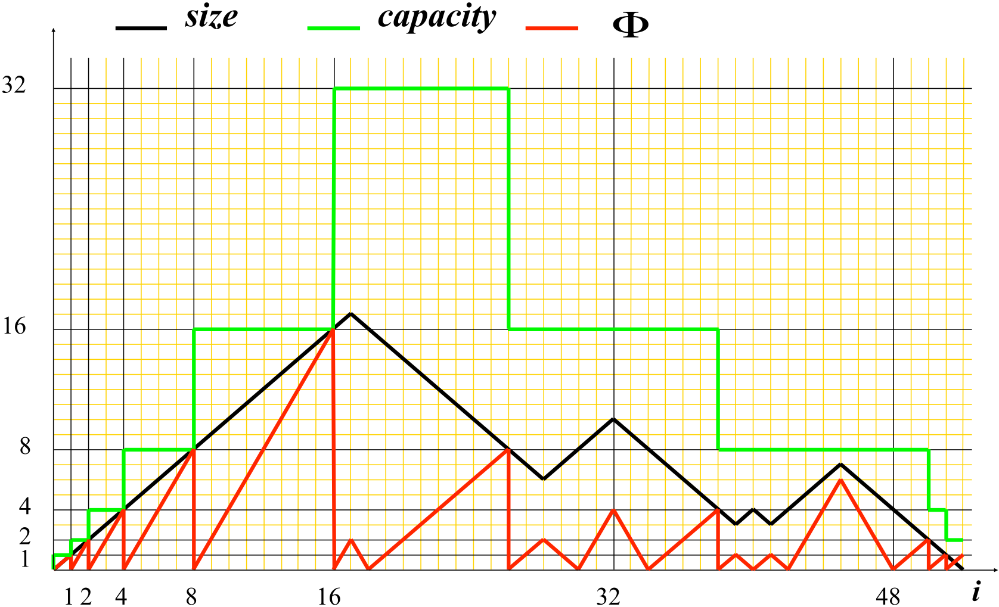
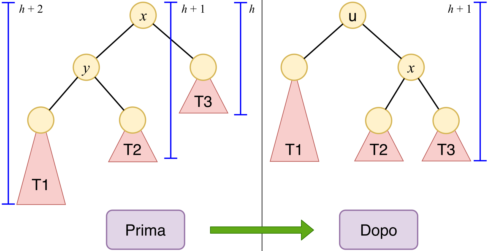
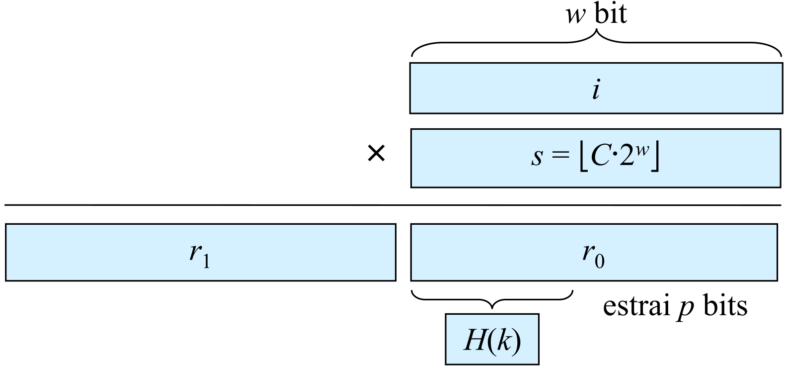

# Algoritmi

|      |                           |                                                              |
| ---- | ------------------------- | -----------------------------------------------------------: |
| ASD  | —    Analisi di algoritmi | [🗀][root]    [🗍](http://cricca.disi.unitn.it/montresor/teaching/asd/materiale/lucidi/)    [🖭](http://cricca.disi.unitn.it/montresor/teaching/asd/materiale/video/) |

[TOC]


# [1.][pdf-011] Introduzione

## Definizioni

> <u>Definizione</u>  (**Problema computazionale**)
>
> ~~Dati un dominio di input e un dominio di output~~
> ~~Un problema computazionale è rappresentato dalla~~
> *Relazione matematica che associa un elemento del dominio di output ad ogni elemento del dominio di input*

> <u>Definizione</u>  (**Algoritmo**)
>
> ~~Dato un problema computazionale~~
> ~~Un algoritmo è un~~
> *Procedimento effettivo, espresso tramite un insieme di passi elementari ben specificati in un sistema formale di calcolo, che risolve il problema in tempo finito*


## Descrivere un algoritmo

~~La descrizione deve essere~~

- ~~Il più possibile **formale**~~
- ~~**Indipendente** dal linguaggio (pseudo-codice)~~
- ~~**Dettagliata**~~


### Pseudo-codice


## Valutare un algoritmo

- ~~**Efficienza**~~
  - ~~Stabilire come valutare se un programma è efficiente~~
  - ~~Alcuni problemi non possono essere risolti in modo efficiente~~
  - ~~Esistono soluzioni “ottime”: non è possibile essere più efficienti~~
- ~~**Correttezza**~~
  - ~~Dimostrazione matematica, descrizione “informale”~~
  - ~~Alcuni problemi non possono essere risolti~~
  - ~~Alcuni problemi vengono risolti in modo approssimato~~


### Efficienza

> **Complessità**: *analisi delle risorse impiegate da un algoritmo per risolvere un problema, in funzione della dimensione e dalla tipologia dell’input*

> <u>Definizione</u>  (**Risorse**)
>
> - **Tempo**: tempo impiegato per completare l’algoritmo
> - **Spazio**: quantità di memoria utilizzata
> - **Banda**: quantità di bit spediti (algoritmi distribuiti)


#### Definizioni di tempo

- **Wall-clock time**: tempo effettivamente impiegato per eseguire un algoritmo
- **Numero di operazioni rilevanti**: che caratterizzano lo scopo dell’algoritmo
- **Numero di operazioni elementari**: eseguibili in tempo costante dalla CPU


### Correttezza

> **Invariante**: *condizione sempre vera in un certo punto del programma*

> **Invariante di ciclo**: *condizione sempre vera all’inizio dell’iterazione di ciclo*

> **Invariante di classe**: *condizione sempre vera al termine dell’esecuzione di un metodo della classe*

[Esempi slide 25-26][pdf-011]


#### Algoritmi iterativi

Il concetto di **invariante di ciclo** ci aiuta a dimostrare la correttezza di un algoritmo iterativo

- **Inizializzazione** (caso base)
  La condizione è vera alla prima iterazione di un ciclo
- **Conservazione** (passo induttivo)
  Se la condizione è vera prima di un’iterazione del ciclo, allora
  rimane vera al termine (prima della successiva iterazione)
- **Conclusione**
  Quando il ciclo termina, l’invariante deve rappresentare la
  “correttezza” dell’algoritmo


### Complessità

$$
\text{Complessità}\ :\ \text{Dimensione dell’input}\ →\ \text{Tempo}
$$


#### Dimensione dell’input

La taglia dell’input è il **numero** di

- **Bit** necessari per rappresentarlo (**criterio di costo logaritmico**)
- **Elementi** di cui è costituito (**criterio di costo uniforme**)

In molti casi

- Si assume che gli elementi sono rappresentati da **numero costante di bit**
- Le due misure coincidono a meno di una **costante moltiplicativa**


#### Tempo

Definito come numero di **istruzioni elementari**

- Eseguibili in **tempo costante**


# [2.1.][pdf-021] Introduzione – Analisi

~~<u>Obiettivo</u>: stimare la complessità in tempo~~

- ~~Definizioni~~
- ~~Modelli di calcolo~~
- ~~Esempi di valutazioni~~
- ~~Ordini di complessità~~

~~<u>Motivazioni</u>~~

- ~~Per stimare il tempo impiegato per un dato input~~
- ~~Per stimare il più grande input gestibile in tempi ragionevoli~~
- ~~Per confrontare l’efficienza di algoritmi diversi~~
- ~~Per ottimizzare le parti più importanti~~


## Modelli di calcolo

### Definizioni

> **Modello di calcolo**: *rappresentazione astratta di un calcolatore*

- **Astrazione**: permette di nascondere i dettagli
- **Realismo**: riflette la situazione reale
- **Potenza matematica**: permette di trarre conclusioni formali sul costo


#### Macchina di Turing

> <u>Definizione</u>  (**Macchina di Turing**)
>
> *Macchina ideale che manipola i dati contenuti su un nastro di lunghezza infinita secondo un insieme prefissato di regole*
>
> Ad ogni **passo**
>
> - **Legge** il simbolo sotto la testina
> - **Modifica** il proprio stato interno
> - **Scrive** un nuovo simbolo nella cella
> - **Muove** la testina a destra o a sinistra

- Fondamentale nello studio della **calcolabilità**
- Di **basso livello** (troppo per i nostri scopi)


#### Random Access Machine

> <u>Definizione</u>  (**RAM**)
>
> - **Memoria**
>   - Quantità infinita di celle di dimensione finita
>   - Accesso in tempo costante ~~(indipendente dalla posizione)~~
> - **Processore** ~~(singolo)~~
>   - Set di istruzioni elementari simile a quelli reali
>     - Operazioni aritmetiche e logiche
>     - Istruzioni di controllo ~~(salti, salti condizionati)~~
> - **Costo delle istruzioni elementari**
>   - Uniforme, ininfluente ai fini della valutazione


### *Funzione di complessità*

L'**analisi** di un algoritmo permette di ricavare la sua **funzione di complessità**
$$
T(n)\,=\,k_1f_1(n)\,+\,...\,+\,k_mf_m(n)\,+\,k_{m+1}
$$
La funzione **dipende** da

- Taglia dell'**input** ($n$)
- Esecuzione delle **istruzioni**

Per ogni **istruzione** sono specificati

- **Costo**: tempo costante richiesto per l'esecuzione
  - Potenzialmente diverso per ogni istruzione
- **# Volte**: numero di volte che viene eseguita
  - Dipende dalla taglia dell'input ($n$)


#### *Tipi di algoritmi*

La **complessità** si calcola diversamente per

- **Algoritmi iterativi**: sommatoria dei costi moltiplicati per i rispettivi # volte
  $$
  T(n)=\sum_{i=1}^{\rm \#\,istr} c_i\,v_i
  $$

-  **Algoritmi ricorsivi**: espansione dell'[equazione di ricorrenza](#Ricorrenze)
  $$
  T(n)=
  \begin{cases}
  c & n\le n_0 \\
  f(T(g(n))) & n>n_0
  \end{cases}
  $$


### Esempi di analisi

[Vedi slide 9-12][pdf-021]


### Classi di complessità

$$
\begin{array}{c}
& f(n) && \rm Tipo & \\ \hline
& \log n && \rm logaritmico \\
& \sqrt n && \rm sublineare \\
& n && \rm lineare \\
& n\log n && \rm loglineare \\
& n^2 && \rm quadratico \\
& n^3 && \rm cubico \\
& 2^n && \rm esponenziale
\end{array}
$$


## Notazione asintotica

### Definizioni

> <u>Definizione</u>  (**Notazione $O\,$**)
>
> Sia $g(n)$ una funzione di costo
>
> Si indica con $O(g(n))$ l'insieme delle funzioni $f(n)$ tali per cui
> $$
> \exist\, c > 0,\ \exist\,m\ge 0\ : \ f(n)\le cg(n),\ \ \forall\, n\ge m
> $$

- $f(n)=O(g(n))$  ~~($f (n)\ \text{ è “O grande” di }\ g(n)$)~~
- $g(n)$ è un **limite asintotico superiore** di $f(n)$
- $f(n)$ cresce al più come $g(n)$

> <u>Definizione</u>  (**Notazione $Ω\,$**)
>
> Sia $g(n)$ una funzione di costo
>
> Si indica con $Ω(g(n))$ l'insieme delle funzioni $f(n)$ tali per cui
> $$
> \exist\, c > 0,\ \exist\,m\ge 0\ : \ f(n)\ge cg(n),\ \ \forall\, n\ge m
> $$

- $f(n)=Ω(g(n))$  ~~($f (n)\ \text{ è “Omega grande” di }\ g(n)$)~~
- $g(n)$ è un **limite asintotico inferiore** di $f(n)$
- $f(n)$ cresce almeno quanto come $g(n)$

> <u>Definizione</u>  (**Notazione $Θ\,$**)
>
> Sia $g(n)$ una funzione di costo
>
> Si indica con $Θ(g(n))$ l'insieme delle funzioni $f(n)$ tali per cui
> $$
> \exist\, c_1, c_2 > 0,\ \exist\,m\ge 0\ : \ c_1g(n)\le f(n)\le c_1g(n),\ \ \forall\, n\ge m
> $$

- $f(n)=Θ(g(n))$  ~~($f (n)\ \text{ è “Theta” di }\ g(n)$)~~
- $f(n)$ cresce **esattamente** come $g(n)$
- $f(n)=Θ(g(n))\iff f(n)=O(g(n))\ \and\ f(n)=Ω(g(n))$


### Esercizi

[Esercizi slide 18-27][pdf-021]


## Complessità di problemi e algoritmi

~~<u>Obiettivo</u>: riflettere su complessità di problemi e algoritmi~~

- ~~Ottimizzazioni~~
- ~~Efficienza massima~~
- ~~Rapporto fra problema computazionale e algoritmo~~


### Limiti alla complessità di un problema

> **Superiore - $O(f(n))$**: Un problema ha complessità $O(f (n))$ se esiste almeno un algoritmo che ha complessità $O(f (n))$

> **Inferiore - $Ω(f(n))$**: Un problema ha complessità $Ω(f (n))$ se esiste almeno un algoritmo che ha complessità $Ω(f (n))$


### Algoritmi aritmetici

[Vedi slide 29-44][pdf-021]


### Algoritmi e problemi

Complessità in **tempo** di

- **Algoritmo**: quantità di tempo richiesta per input di dimensione $n$
  - $O(f (n))$: per tutti gli input, l’algoritmo **costa al più** $f (n)$
  - $Ω(f (n))$: per tutti gli input, l’algoritmo **costa almeno** $f (n)$
  - $Θ(f (n))$: l’algoritmo richiede $Θ(f (n))$ **per tutti gli input**
- **Problema**: complessità in tempo relative a tutte le possibili soluzioni
  - $O(f (n))$: complessità del **miglior algoritmo** che risolve il problema
  - $Ω(f (n))$: **tempo minimo dimostrabile** che un algoritmo può impiegare
  - $Θ(f (n))$: **algoritmo ottimo**


## Tipologia dell’input

~~<u>Obiettivo</u>: valutare gli algoritmi in base all’input~~

- ~~In alcuni casi, gli algoritmi si comportano diversamente a seconda delle caratteristiche dell’input~~
- ~~Conoscere in anticipo tali caratteristiche permette di scegliere il miglior algoritmo in quella situazione~~
- ~~Il problema dell’ordinamento è caratterizzato da questi concetti~~


### Tipologia di analisi

- **Caso pessimo**
  - La più importante
  - Il tempo di esecuzione nel caso peggiore è un **limite superiore** al tempo di esecuzione per qualsiasi input
  - Per alcuni algoritmi, il caso peggiore si verifica molto spesso
- **Caso medio**
  - Difficile da definire in alcuni casi
  - **Distribuzione uniforme**
- **Caso ottimo**
  - Utile se si hanno informazioni particolari sull’input


### Algoritmi di ordinamento

> <u>Problema</u>  (**Ordinamento**)
>
> - <u>Input</u>:     sequenza $A = a_1, . . . , a_n$ di $n$ valori
> - <u>Output</u>:  sequenza $B = b_1, . . . , b_n$ che sia una permutazione di $A$ tale per cui $b_1 ≤\,. . . ≤ b_n$

[Esempi slide 49-64][pdf-021]


#### Selection sort

> <u>Algoritmo</u>  (**Selection sort**)
>
> Cerca il minimo e lo mette in posizione corretta, riducendo il problema agli $n − 1$ restanti valori

- ~~Approccio naif~~

```c++
void selectionSort(Item[] A, int n)
	for i = 1 to i = n-1 do
		int min = min(A, i, n)
		A[i] <=> A[min]
```

```c++
int min(Item[] A, int i, int n) 
	int min = i
	for j = i+1 to n do
		if A[j] < A[min] then
            min = j
	return min
```

- **Complessità totale** (caso medio, pessimo e ottimo)
  $$
  \sum_{i=1}^{n-1}(n-1)\ =\ \sum_{i=1}^{n-1}i\ =\ \frac{n(n-1)}{2}\ =\ n^2-\frac n2\ =\ O(n^2)
  $$


#### Insertion sort

> <u>Algoritmo</u>  (**Insertion sort**)
>
> Inserisce ogni elemento nella posizione corretta del sottovettore precedentemente ordinato, shiftando gli elementi già presenti

- ~~Simile all'ordinamento di un mazzo di carte~~

```c++
void insertionSort(Item[] A, int n)
    for i = 2 to n do
    	Item tmp = A[i]
        int j = i
        while j > 1 and A[j-1] > tmp do
            A[j] = A[j-1]
            j = j-1
        A[j] = tmp
```

- Efficiente per ordinare **piccoli insiemi** di elementi
- Il **costo dipende** da
  - **Dimensione** dell'input
  - **Distribuzione** dei dati dell'input


#### Merge sort

> <u>Algoritmo</u>  (**Merge sort**)
>
> Si basa sulla tecnica del **divide-et-impera**
>
> - <u>Divide</u>: divide il vettore di $n$ elementi in due sottovettori di $n/2$ elementi
> - <u>Impera</u>: chiama ricorsivamente se stesso sui due sottovettori
> - <u>Combina</u>: unisce e ordina i due sottovettori ordinati tramite merge
>
> <u>Idea</u>: due sottovettori ordinati si ordinano più velocemente in unico vettore

```c++
void mergeSort(Item[] A, int first, int last)
    if first < last
        int mid = floor((first + last) / 2)
        mergeSort(A, first, mid)
        mergeSort(A, mid+1, last)
        merge(A, first, last, mid)
```

```c++
void merge(Item[] A, int first, int last, int mid)
    int i, j, k, h
    i = first
    j = mid+1
    k = first 
    
    while i <= mid and j <= last do
        if A[i] <= A[j] then
            B[k] = A[i]
            i = i+1
        else
            B[k] = A[j]
            j = j+1
		k = k+1
    
	j = last
    for h = mid downto i do
        A[j] = A[h]
        j = j-1
    for j = first to k-1 do
        A[j] = B[j]
```

- **Complessità di `merge`**
  $$
  O(n)
  $$

- **Costo computazionale di `mergeSort`**  (si assuma $n=2^k$)
  $$
  T(n)=
  \begin{cases}
  c & n=1 \\
  2\,T(n/2)+dn & n>1
  \end{cases}
  $$

  $$
  O\Bigg(\sum_{i=0}^k 2^i·\frac{n}{2^i}\Bigg)\ =\ O\Bigg(\sum_{i=0}^k n\Bigg)\ =\ O(k·n)\ \iff\ O(n\log n)
  $$


# [2.2.][pdf-022] Funzioni di costo

## Notazione asintotica - Proprietà

### Espressioni polinomiali

> <u>Definizione</u>  (**Espressione polinomiale**)
> $$
> f(n) = \sum_{i=0}^k a_in^i\,,\ \ a_k\ne0 \ \ \Rarr\ \ f(n)=Θ(n^k)
> $$

- **Limite inferiore**
  $$
  \exist\,d>0,\ \exist\,m\ge0\ :\ f(n)\ge dn^k,\ \ \forall\,n\ge m
  $$

  $$
  d\,\le\, a_k-\sum_{i=0}^{k-1}\frac{|a_i|}{n}\,>\,0\ \iff\ n\,>\,\frac{\sum_{i=0}^{k-1}|a_i|}{a_k}\,=\,m
  $$


#### *Casi particolari*

Funzioni **limitate** superiormente e inferiormente
$$
\exist\,c_1,c_2\in\R,\ \exist\,m\ge0\ :\ c_1\le f(n)\le c_2,\ \forall\, n\ge m\ \ \Rarr\ \ f(n)=Θ(1)
$$


### Proprietà delle notazioni

- **Dualità**
  $$
  f (n) = O(g(n)) \iff g(n) = Ω(f (n))
  $$

- **Eliminazione delle costanti**
  $$
  f (n) = 〈O,Ω〉(g(n)) \iff af (n) =〈O,Ω〉(g(n))\,,\ \ ∀a > 0
  $$

- **Sommatoria** (sequenza di algoritmi)
  $$
  f_1 (n) =〈O,Ω〉(g_1 (n))\,,\, \ f_2 (n) =〈O,Ω〉(g_2 (n))\ \ \Rarr \\ \Rarr \ \ f_1 (n) + f_2 (n) =〈O,Ω〉(\max(g_1 (n), g_2 (n)))
  $$

- **Prodotto** (cicli annidati)
  $$
  f_1 (n) =〈O,Ω〉(g_1 (n))\,,\, \ f_2 (n) =〈O,Ω〉(g_2 (n))\ \ \Rarr \\  \Rarr \ \ f_1 (n) · f_2 (n) =〈O,Ω〉(g_1 (n) · g_2 (n))
  $$

- **Simmetria**
  $$
  f (n) = Θ(g(n)) \iff g(n) = Θ(f (n))
  $$

- **Transitività**
  $$
  f (n) = O(g(n))\,,\,\ g(n) = O(H(n))\,\ \Rarr\,\ f (n) = O(H(n))
  $$

[Dimostrazioni slide 7-12][pdf-022]


### Proprietà delle funzioni

**Logaritmi**

- $\log n = O(n)$
- $\log_a n = Θ(\log n)$
- $\log n^a = Θ(\log n)\,,\ \forall\,a>0$

**Esponenziali**

- $2^n=O((2+a)^n)\,,\ \forall\,a\ge0$
- $2^{n+a}=Θ(2^n )\,,\, \, \ \ \ \ \ \  \forall\,a\ge0$


### Notazioni $o$, $ω$

> <u>Definizione</u>  (**Notazione $o$**)
>
> Sia $g(n)$ una funzione di costo
>
> Si indica con $o(g(n))$ l’insieme delle funzioni $f (n)$ tali per cui
> $$
> ∀\,c,\ ∃\,m\ :\ f (n) < cg(n),\ ∀\,n ≥ m
> $$

> <u>Definizione</u>  (**Notazione $ω$**)
>
> Sia $g(n)$ una funzione di costo
>
> Si indica con $ω(g(n))$ l’insieme delle funzioni $f (n)$ tali per cui
> $$
> ∀\,c,\ ∃\,m\ :\ f (n) > cg(n),\ ∀\,n ≥ m.
> $$

- $f (n) = 〈o,ω〉(g(n))$  ~~($f (n) \text{ è 〈“o piccolo”, “omega piccolo”〉 di } g(n)$)~~

$$
\begin{array}{l}f(n) =〈o,ω〉(g(n))\ \Rarr\ f (n) =〈O,Ω〉(g(n))\end{array}
$$

$$
\lim_{n→∞}\frac{f(n)}{g(n)}\ =\
\begin{cases}
\begin{array}{l}
0 &\Rarr\ \ f(n) = o(g(n))
\\
c \ne 0 &\Rarr\ \ f(n) = Θ(g(n))
\\
+∞ &\Rarr\ \ f(n) = ω(g(n))
\end{array}
\end{cases}
$$


### Classificazione delle funzioni

**Ordinamento** delle principali espressioni
$$
\forall\ \ r < s,\ h < k,\ a < b
$$

$$
\begin{array}{l}
 & O(1) &⊂& O(\log^r n) &⊂& O(\log^s n) &⊂& \\
⊂& O(n^h) &⊂& O(n^h \log^r n) &⊂& O(n^h \log^s n) &⊂& \\
⊂& O(n^k) &⊂& O(a^n) &⊂& O(b^n)
\end{array}
$$


## Ricorrenze

### Definizioni

> **Equazione di ricorrenza**: *esprime la complessità di un algoritmo ricorsivo*

- ~~Formula matematica definita in maniera ricorsiva~~
- ~~Utilizzata per risolvere problemi~~

> **Formula chiusa**: *rappresenta la classe di complessità della funzione*

- ~~Obiettivo dell'analisi (quando possibile)~~
- ~~Diversi metodi di risoluzione~~


### Analisi per livelli

> <u>Metodo</u>  (**Albero di ricorsione / Per livelli**)
>
> **Espandere** l'equazione di ricorrenza in un albero, i cui nodi rappresentano i costi ai vari livelli della ricorsione

[Esempi slide 22-25][pdf-022]


### Metodo della sostituzione

> <u>Metodo</u>  (**Sostituzione / Tentativi**)
>
> **Dimostrare per induzione** la correttezza di una soluzione, **dedotta** sulla base della propria esperienza

$$
T(n)=
\begin{cases}
c & n\le n_0 \\
f_1(T(f_2(n))) & n>n_0
\end{cases}
$$

1. **Dedurre** una possibile soluzione
   $$
   T(n) = Θ(\boldsymbol g(n))
   $$

2. Formulare una **ipotesi induttiva**
   $$
   \boldsymbol H(n)=Θ(g(n))\ \ \Rarr\ \ \forall\,k<n,\ \ T(k)\ \lang \le,\ge\rang\ \boldsymbol {d\,h}(k)
   $$

3. **Sostituire** nella ricorrenza le espressioni $T (f_2(n))$ con l'ipotesi induttiva
   $$
   T(n)=\lang O,Ω\rang(f(n))\ \iff\ T(n)\ \lang \le,\ge\rang\ f_1(\boldsymbol {d\,h}(f_2(n)))
   $$

4. Dimostrare che la soluzione è valida anche per il **caso base**

[Esempi e tecniche slide 27-37][pdf-022]


### Metodo dell’esperto

> **Ricorrenze comuni**: *ricorrenze facilmente risolubili ricorrendo a teoremi specifici per ogni classe particolare di equazioni di ricorrenza*

[Vedi slide 39-55][pdf-022]


### Analisi degli algoritmi

[Esempi slide 56-65][pdf-022]


# [2.3.][pdf-023] Analisi ammortizzata

## Introduzione

> <u>Definizione</u>  (**Analisi ammortizzata**)
>
> Tecnica di analisi di complessità che valuta il **tempo richiesto** per eseguire, nel caso pessimo, una sequenza di operazioni su una **struttura dati**

- Esistono operazioni più o meno costose
- Se le operazioni più costose sono poco frequenti, allora il loro costo può essere ammortizzato dalle operazioni meno costose

<u>Differenze</u>

- **Analisi caso medio**:      probabilistica, su singola operazione
- **Analisi ammortizzata**:  deterministica, su operazioni multiple, caso pessimo


### Metodi per l’analisi

> <u>Metodo</u>  (**Aggregazione**)
>
> Complessità $T(n)$ per eseguire $n$ operazioni in sequenza nel caso pessimo
>
> - **Sequenza**: evoluzione della struttura data una sequenza di operazioni
> - **Caso pessimo**: peggior sequenza di operazioni
> - **Aggregazione**: sommatoria di tutte le complessità individuali

- ~~Tecnica derivata dalla matematica~~
  - ~~*Si calcola il costo complessivo (aggregato) e si divide per $n$*~~

###### -

> <u>Metodo</u>  (**Ammortamento / Accantonamenti**)
>
> Alle operazioni vengono assegnati **costi ammortizzati** che possono essere maggiori/minori del loro costo effettivo
>
> - Si assegna un costo ammortizzato potenzialmente distinto ad ognuna delle operazioni possibili
>
> - Il costo ammortizzato può essere diverso dal costo effettivo
>
>   - Operazioni meno costose caricate di un costo aggiuntivo (**credito**)
>
>   $$
>   \text{costo ammortizzato = costo effettivo + credito prodotto}
>   $$
>
> - I crediti accumulati sono usati per pagare le operazioni più costose
>   $$
>   \text{costo ammortizzato = costo effettivo − credito consumato}
>   $$

- ~~Tecnica derivata dall’economia~~

<u>Obiettivi</u>: dimostrare che

- La somma dei costi ammortizzati $a_i$ è un limite superiore ai costi effettivi $c_i$
  $$
  \sum_{i=1}^n c_i\ \le\ \sum_{i=1}^n a_i
  $$

- Il valore così ottenuto è poco costoso

<u>Note</u>

- La dimostrazione deve valere per tutte le sequenze (caso pessimo)

- Il credito dopo l'operazione $t$-esima è sempre positivo
  $$
  \sum_{i=1}^t a_i -\sum_{i=1}^t c_i\ \ge\ 0
  $$

###### -

> <u>Metodo</u>  (**Potenziale**)
>
> Lo stato del sistema viene descritto tramite **differenze di potenziale**
>
> - Si associa alla struttura dati $D$ una **funzione di potenziale** $Φ(D)$
>
>   - Le operazioni meno costose incrementano $Φ(D)$
>   - Le operazioni più costose decrementano $Φ(D)$
>
> - Costo ammortizzato
>   $$
>   \text{costo ammortizzato = costo effettivo + variazione di potenziale}
>   $$
>
>   $$
>   a_i = c_i + Φ(D_i) - Φ(D_{i-1})
>   $$
>
>   $D_i$ è il potenziale associato alla $i$-esima operazione
>
> - Costo ammortizzato, sequenza di $n$ operazioni
>   $$
>   \begin{align}
>   A\ =\ \sum_{i=1}^n a_i  
>   \ =\ \sum_{i=1}^n(c_i + Φ(D_i) - Φ(D_{i−1})) 
>   \ =\ C+Φ(D_n) - Φ(D_0)
>   \end{align}
>   $$
>   Se la variazione di potenziale $Φ(D_n ) − Φ(D_0 )$ è non negativa, il costo ammortizzato $A$ è un limite superiore al costo reale

- ~~Tecnica derivata dalla fisica~~


## Contatore binario

> <u>Esempio</u>  (**Contatore binario**)
>
> Contatore binario di $k$ bit con un vettore $A$ di booleani $0/1$
>
> - Bit meno significativo in $A[0]$, bit più significativo in $A[k − 1]$
>
> - Valore del contatore
>   $$
>   x=\sum_{i=0}^{k-1}A[i]·2^i
>   $$
>
> - Operazione $\tt increment()$ che incrementa il contatore di $1$
>
>   ```c++
>   void increment(bool[] A, int k)
>       int i = 0
>       while i < k and A[i] == 1 do
>           A[i] = 0
>           i = i+1
>       if i < k then
>   		A[i] = 1
>   ```


### Aggregazione

<u>Analisi grossolana</u>

- Una chiamata $\tt increment()$ richiede tempo $O(k)$ nel caso pessimo
- Essendoci una sola operazione, esiste un’unica sequenza possibile
- Limite superiore $T (n) = O(nk)$ per una sequenza di n incrementi

<u>Costo delle operazioni</u>

- $n=2^k$ operazioni nel caso pessimo
- Costo di $n$ operazioni:  $\,T(n)=O(nk)=O(n\log n)$
- Costo di $1$ operazione: $\,T(n)/n=O(k)=O(\log n)$

<u>Analisi più stretta</u>

- Il tempo necessario ad eseguire l’intera sequenza è proporzionale al numero di bit che vengono modificati
- $A[i]$ viene modificato ogni $2^i$ incrementi

<u>Analisi ammortizzata</u>

- Costo totale
  $$
  T(n)\ =\ \sum_{i=0}^{k-1}\bigg\lfloor\frac{n}{2^i}\bigg\rfloor\ \le\ n\sum_{i=0}^{k-1}\frac{1}{2^i}\ \le\ n\sum_{i=0}^{+\infin}\bigg(\frac{1}{2}\bigg)^i\ =\ 2n\ =\ O(n)
  $$

- Costo ammortizzato
  $$
  T (n)/n\ =\ 2n/n\ =\ 2\ =\ O(1)
  $$


### Ammortamento

<u>Costo delle operazioni</u>

- **Costo effettivo** dell’operazione $\tt increment()$: $\,d$

  $d$ è il numero di bit che cambiano valore

- **Costo ammortizzato** dell’operazione $\tt increment()$: $\,2$

  - $1$ per cambio di un bit da $0$ a $1$ (costo effettivo)
  - $1$ per il futuro cambio dello stesso bit da $1$ a $0$  ~~(dimostrazione)~~

<u>Conseguenze</u>

- In ogni istante, il credito è pari al numero di bit $1$ presenti
- **Costo totale**: $\,O(n)$
- **Costo ammortizzato**: $\,O(1)$

<u>Dimostrazione</u>
$$
T (n)\ =\ \sum_{i=1}^n c_i\ \le\ \sum_{i=1}^n 2\ =\ 2n\ =\ O(n)
$$

$$
T (n)/n\ =\ 2n/n\ =\ 2\ =\ O(1)
$$


### Potenziale

Sia $Φ(D)$ il numero bit $1$ presenti nel contatore

- Operazione $\tt increment()$

  - **Costo effettivo**:                 $\,1+ t$  ~~($1$ bit $0→1$ e $t$ bit $1→0$)~~
  - **Variazione di potenziale**: $\,1 − t$  ~~($t$ bit sono diventati $0$)~~
  - **Costo ammortizzato**:        $\,(1+ t) +(1 − t) =2$

  $t$ è il numero di bit $1$ dal meno significativo al primo bit $0$

- **All’inizio**:  zero bit accesi $\,\Rarr\ Φ(D_0) = 0$

- **Alla fine**:  $\,Φ(D_n ) ≥ 0\ \ \ \ \ \,\Rarr$  la differenza di potenziale è non negativa


## Vettori dinamici

### Inserimento

Per implementare una **sequenza** tramite vettori dinamici

- Si alloca un vettore di una certa dimensione $m$ detta **capacità**

L’**inserimento** di un elemento

- In mezzo ha costo $O(n)$  ~~(shift)~~
- In fondo ha costo $O(1)$ (append)

<u>Problema</u>

- Non è noto a priori il numero di elementi da inserire nella sequenza
- La capacità selezionata può rivelarsi insufficiente

<u>Soluzione</u>

1. Si alloca un vettore di capacità maggiore
   - Incremento fisso  (`java.util.Vector`)
   - Raddoppiamento (`java.util.ArrayList`)
2. Si copia il contenuto del vecchio vettore nel nuovo e si rilascia il vecchio

<u>Domanda</u>

- Qual è la migliore politica di incremento?


#### Incremento

<u>Assunzioni</u>

- Incremento: $\,d$
- Dimensione iniziale: $\,d$
- Costo di scrittura di un elemento: $\,1$

<u>Analisi ammortizzata</u>

- **Costo effettivo** di un'operazione $\tt add()$
  $$
  c_i=
  \begin{cases}
  i & (i\ {\rm mod}\ d)=1 \\
  1 & \rm altrimenti
  \end{cases}
  $$

- **Costo effettivo** di $n$ operazioni $\tt add()$
  $$
  \begin{align}
  T(n)\ &=\ \sum_{i=1}^n c_i\ =\ n+\sum_{j=1}^{\lfloor n/d\rfloor} d·j\ =\ n + d\ \frac{(\lfloor n/d\rfloor+1)\lfloor n/d\rfloor}{2} \\
  & \le\ \ n + \frac{(n/d+1)\, n}{2}\ =\ O(n^2)
  \end{align}
  $$

- **Costo ammortizzato** di un'operazione $\tt add()$
  $$
  T (n)/n\ =\ \frac{O(n^2)}n\ =\ O(n)
  $$


#### Raddoppiamento

<u>Assunzioni</u>

- Dimensione iniziale: $\,1$
- Costo di scrittura di un elemento: $\,1$

<u>Analisi ammortizzata</u>

- **Costo effettivo** di un'operazione $\tt add()$
  $$
  c_i=
  \begin{cases}
  i & i =2^k +1 \\
  1 & \rm altrimenti
  \end{cases}
  $$

- **Costo effettivo** di $n$ operazioni $\tt add()$
  $$
  \begin{align}
  T(n)\ &=\ \sum_{i=1}^n c_i\ =\ n+\sum_{j=0}^{\lfloor\log n\rfloor} 2^j\ =\ n + 2^{\lfloor\log n\rfloor+1} − 1 \\
  & \le\ n + 2^{\log n+1} − 1\ =\ n + 2n − 1\ =\ O(n)
  \end{align}
  $$

- **Costo ammortizzato** di un'operazione $\tt add()$
  $$
  T (n)/n\ =\ \frac{O(n)}n\ =\ O(1)
  $$


### Reality check

[Vedi slide 27-31][pdf-023]


### Cancellazione

La **rimozione** di un elemento ha costo

- $O(n)$ se il vettore è ordinato
- $O(1)$ se il vettore non è ordinato

<u>Problema</u>

- La cancellazione porta a sprechi di memoria quando $n\ll m$
  - $n$: numero di elementi attualmente presenti
  - $m$: capacità

<u>Soluzione</u>

- **Contrazione** quando il fattore di carico $α=n/m$ diventa troppo piccolo
  - Allocazione, copia, deallocazione

<u>Domanda</u>

- Quale soglia per il fattore di carico?


#### Strategie - naif e ottimizzata

**Dimezzare** la memoria quando il fattore di carico $α$ diventa $\frac12$ (naif)

<u>Problema</u>

- Numero di inserimenti/rimozioni insufficiente per ripagare le espansioni/contrazioni

<u>Soluzione</u>

- Lasciar decrescere il sistema ad un fattore inferiore a $α=\frac14$
  - Dopo un’espansione, il fattore di carico diventa $\frac12$
  - Dopo una contrazione, il fattore di carico diventa $\frac12$

<u>Analisi ammortizzata</u>

- Si utilizzi una **funzione di potenziale** che

  - Vale $0$ all'inizio e subito dopo una espansione o contrazione
  - Cresce fino a $n$ quando $α$ aumenta fino ad $1$ o diminuisce fino ad $\frac14$

  $$
  Φ=
  \begin{cases}
  2\,n − m & α ≥ \frac12 \\
  m/2 − n & α ≤\frac12
  \end{cases}
  $$

  - Casi esplicativi

    - $α=\frac12\ \text{(dopo espansione/contrazione)}\  \ \ \ \ \ \ \, \, \Rarr\ Φ = 0$
    - $α = 1\ \ \text{(prima di espansione)}\, \ \ \Rarr\ n = m\ \ \ \Rarr\ Φ = n$
    - $α =\frac14\ \text{(prima di contrazione)}\ \Rarr\ m = 4\,n\ \Rarr\ Φ = n$

    Immediatamente prima di espansioni/contrazioni, il potenziale è sufficiente per pagare il loro costo

- **Costo ammortizzato**: $\,a_i\ =\ c_i + Φ_i − Φ_{i−1}\ =\ 3$   ([vedi slide 37][pdf-023])




# [3.][pdf-031] Strutture di dati

## Strutture dati astratte

### Definizioni

#### Dati

> **Dato**: *valore che una variabile può assumere*

> **Tipo di dato primitivo**: *fornito direttamente dal linguaggio*

> **Tipo di dato astratto**: *modello matematico, definito da una collezione di valori e un insieme di operazioni ammesse su questi valori*

> **Specifica di un TDA**: *interfaccia che nasconde i dettagli implementativi*

> **Implementazione di un TDA**: *realizzazione vera e propria*


#### Strutture

> **Strutture di dati**: *collezioni di dati, caratterizzate dall’organizzazione della stessa (piuttosto che dal tipo dei dati contenuti)*

**Caratterizzare** le strutture dati

- Insieme di **operatori** che permettono di **manipolare la struttura**
- **Modo** sistematico di **organizzare** l’insieme dei dati

**Tipologie** di strutture di dati

- Lineari / Non lineari (presenza di una sequenza)
- Statiche / Dinamiche (variazione di dimensione, contenuto)
- Omogenee / Disomogenee (dati contenuti)

|   Struttura    | Lineare | Dinamica | Omogenea |
| :------------: | :-----: | :------: | :------: |
|  **Sequenza**  |    ✔    |    ✗     |    ✘     |
|  **Insieme**   |         |          |          |
| **Dizionario** |         |          |          |
|   **Albero**   |         |          |          |
|   **Grafo**    |         |          |          |


### Sequenze

> <u>Definizione</u>  (**Sequenza**)
>
> Struttura dati **dinamica**, **lineare** che rappresenta una sequenza **ordinata** di valori che possono essere **ripetuti**
>
> <u>Operazioni ammesse</u>
>
> - Aggiungere/Togliere elementi (data la posizione)
> - Accedere direttamente alla testa/coda
> - Accedere sequenzialmente a tutti gli altri elementi

- L’**ordine** all’interno della sequenza è importante
- È definito il concetto di **posizione** ${\rm pos}_i$
  - Posizioni **fittizie** ${\rm pos}_0$ e ${\rm pos}_{n+1}$
  - Nozioni di **precedente** e **successivo**


#### Specifica

```c++
// Restituisce true se la sequenza è vuota
bool isEmpty()
// Restituisce true se p è uguale a pos_0 oppure a pos_n+1
bool finished(Pos p)
// Restituisce la posizione del primo elemento
Pos head()
// Restituisce la posizione dell’ultimo elemento
Pos tail()
// Restituisce la posizione dell’elemento che segue p
Pos next(Pos p)
// Restituisce la posizione dell’elemento che precede p
Pos prev(Pos p)
// Inserisce l’elemento v di tipo Item nella posizione p.
// Restituisce la posizione del nuovo elemento, che diviene il
// predecessore di p
Pos insert(Pos p, Item v)
// Rimuove l’elemento contenuto nella posizione p.
// Restituisce la posizione del successore di p che diviene
// successore del predecessore di p
Pos remove(Pos p)
// Legge l’elemento di tipo Item contenuto nella posizione p
Item read(Pos p)
// Scrive l’elemento v di tipo Item nella posizione p
void write(Pos p, Item v)
```


### Insiemi

> <u>Definizione</u>  (**Insieme**)
>
> Struttura dati **dinamica**, **non lineare** che memorizza una collezione **non ordinata** di elementi **senza valori ripetuti**
>
> <u>Operazioni ammesse</u>
>
> - Operazioni base
>   - Inserimento
>   - Cancellazione
>   - Verifica contenimento
> - Operazioni insiemistiche
>   - Unione
>   - Interesezione
>   - Differenza
> - Operazioni di ordinamento
>   - Massimo
>   - Minimo
> - Iteratori
>   - ${\tt foreach}\ x ∈ S\ {\tt do}$

- L’**ordinamento** fra elementi è dato dall’eventuale **relazione d’ordine** definita sul tipo degli elementi stessi


#### Specifica

```c++
// Restituisce la cardinalità dell’insieme
int size()
// Restituisce true se x è contenuto nell’insieme
bool contains(Item x)
// Inserisce x nell’insieme, se non già presente
void insert(Item x)
// Rimuove x dall’insieme, se presente
void remove(Item x)
// Restituisce un nuovo insieme che è l’unione di A e B
Set union_(Set A, Set B)
// Restituisce un nuovo insieme che è l’intersezione di A e B
Set intersection(Set A, Set B)
// Restituisce un nuovo insieme che è la differenza di A e B
Set difference(Set A, Set B)
```


### Dizionari

[~~Go back - Hashing~~](#7. Hashing)

> <u>Definizione</u>  (**Dizionario**)
>
> Struttura dati che rappresenta il concetto matematico di **relazione univoca** o **associazione chiave-valore**
> $$
> R\ :\ D → C
> $$
>
> - $D\,$: **chiavi**
> - $C\,$: **valori**
>
> <u>Operazioni ammesse</u>
>
> - Ottenere il valore associato ad una particolare chiave o $\tt nil$ se assente
> - Inserire una nuova associazione chiave-valore, cancellando eventuali associazioni precedenti per la stessa chiave
> - Rimuovere un’associazione chiave-valore esistente

- Chiamati anche **array associativi** o **mappe**


#### Specifica

```c++
// Restituisce il valore associato alla chiave k se presente,
// nil altrimenti
Item lookup(Item k)
// Associa il valore v alla chiave k
void insert(Item k, Item v)
// Rimuove l’associazione della chiave k
void remove(Item k)
```


#### Implementazioni

| Struttura dati     | `insert`    | `lookup`    | `remove`    | `foreach` |
| ------------------ | :---------- | :---------- | :---------- | :-------- |
| Array ordinato     | $O(n)$      | $O(\log n)$ | $O(n)$      | $O(n)$    |
| Array non ordinato | $O(1)$[^*]  | $O(n)$      | $O(n)$      | $O(n)$    |
| Lista non ordinata | $O(1)$[^*]  | $O(n)$      | $O(n)$      | $O(n)$    |
| Albero RB          | $O(\log n)$ | $O(\log n)$ | $O(\log n)$ | $O(n)$    |
| Ideale (hash)      | $O(1)$      | $O(1)$      | $O(1)$      | $O(n)$    |

[^*]: Assumendo che l’elemento sia già stato trovato, altrimenti $O(n)$


### Alberi e grafi

> <u>Definizione</u>  (**Albero ordinato**)
>
> Insieme finito di elementi detti **nodi**
>
> - Uno di essi è designato come **radice**
> - Gli eventuali nodi rimanenti sono partizionati in insiemi **ordinati** e **disgiunti**, anch’essi alberi ordinati
>
> <u>Definizione</u>  (**Grafo**)
>
> Struttura dati composta da
>
> - Insieme di elementi detti **nodi** o **vertici**
> - Insieme di coppie (ordinate oppure no) di nodi detti **archi**
>
> <u>Operazioni ammesse</u>
>
> - Effettuare visite su di essi


### Commenti

- Concetti di sequenza, insieme, dizionario sono collegati
  - Insieme delle chiavi / dei valori
  - Scorrere la sequenza di tutte le chiavi
- Alcune realizzazioni sono naturali
  - Sequenza ↔ Lista
  - Albero astratto ↔ Albero basato su puntatori
- Esistono realizzazioni alternative
  - Insieme come vettore boolo
  - Albero come vettore dei padri
- La scelta della struttura di dati influisce su efficienza e operazioni ammesse
  - Dizionario come hash table:  ${\tt lookup}\ O(1)\,$,        ${\tt findMin}\ O(n)$
  - Dizionario come albero:        $\,{\tt lookup}\ O(\log n)\,$,  ${\tt findMin}\ O(1)$


## Strutture dati elementari

### Liste

> <u>Definizione</u>  (**Lista / Linked List**)
>
> **Sequenza di nodi**, contenenti dati arbitrari e 1-2 **puntatori** all’elemento successivo e/o precedente

- **Contiguità** nella lista $\not\Rarr$ contiguità nella memoria
- Tutte le operazioni hanno **costo** $O(1)$


#### Implementazioni

- Bidirezionale / Monodirezionale
- Con sentinella / Senza sentinella ~~(oggetto vuoto fittizio)~~
- Circolare / Non circolare


[Vedi slide 20-24][pdf-031]


### Pile

> <u>Definizione</u>  (**Pila / Stack**)
>
> Struttura dati **dinamica**, **lineare** in cui l’elemento rimosso dall’operazione di cancellazione è predeterminato secondo il sistema **LIFO** (last-in first-out)


#### Specifica

```c++
// Restituisce true se la pila è vuota
bool isEmpty()
// Inserisce v in cima alla pila
bool pusH(Item v)
// Estrae l’elemento in cima e lo restituisce al chiamante
Item pop()
// Legge l’elemento in cima alla pila
Item top()
```


#### Implementazioni

- Tramite **liste bidirezionali**
  - Puntatore all’elemento top
- Tramite **vettori**
  - Dimensione limitata
  - Overhead più basso

[Vedi slide 27-29][pdf-031]


### Code

> <u>Definizione</u>  (**Coda / Queue**)
>
> Struttura dati **dinamica**, **lineare** in cui l’elemento rimosso dall’operazione di cancellazione è predeterminato secondo il sistema **FIFO** (first-in first-out)


#### Specifica

```c++
// Restituisce true se la coda è vuota
bool isEmpty ()
// Inserisce v in fondo alla coda
bool enqueue (Item v)
// Estrae l’elemento in testa e lo restituisce al chiamante
Item dequeue ()
// Legge l’elemento in testa alla coda
Item top ()
```


#### Implementazioni

- Tramite **liste monodirezionali**
  - Puntatore head, per estrazione
  - Puntatore tail, per inserimento
- Tramite **array circolari**
  - Dimensione limitata
  - Overhead più basso

[Vedi slide 32-35][pdf-031]


# [5.][pdf-051] Alberi

## Introduzione

### Definizioni

> <u>Definizione</u>  (**Albero radicato / Rooted tree**)
>
> Insieme di **nodi** e insieme di **archi orientati** che connettono coppie di nodi, con le seguenti proprietà
>
> - Un nodo dell’albero è designato come **nodo radice**
> - Ogni nodo $n$, a parte la radice, ha esattamente **un arco entrante**
> - Esiste un **cammino unico** dalla radice ad ogni nodo
> - L’albero è **connesso**
>
> <u>Definizione ricorsiva</u>
>
> Un albero è dato da ~~(uno o l'altro)~~
>
> - Un **insieme vuoto**
> - Un **nodo radice** e zero o più **sottoalberi**, ognuno dei quali è un albero
>   - La radice è connessa a radici di ogni sottoalbero con **archi orientati**


#### Terminologia

[Vedi slide 7-8][pdf-051]

> **Profondità nodi / Depth**: *lunghezza del cammino semplice dalla radice al nodo (misurato in numero di archi)*

> **Livello / Level**: *insieme di nodi alla stessa profondità*

> **Altezza / Height**: *profondità massima della sue foglie*


## Alberi binari

### Introduzione

> <u>Definizione</u>  (**Albero binario / Binary tree**)
>
> **Albero radicato** in cui ogni nodo ha **al massimo due figli**, identificati come figlio sinistro e figlio destro

- Due alberi $T$ e $U$ che hanno stessi nodi, figli per ogni nodo e radice, sono **distinti** qualora un nodo $u$ sia designato come figlio sinistro di $v$ in $T$ e come figlio destro di $v$ in $U$


#### Specifica

```c++
// Costruisce un nuovo nodo contenente v senza figli o genitori
void Tree(Item v)
// Legge il valore memorizzato nel nodo
Item read()
// Modifica il valore memorizzato nel nodo
void write(Item v)
// Restituisce il padre, oppure nil se questo nodo è radice
Tree parent()
// Restituisce il figlio sx/dx di questo nodo;
// restituisce nil se assente
Tree left()
Tree right()
// Inserisce il sottoalbero radicato in t come figlio sx/dx
// di questo nodo
void insertLeft(Tree t)
void insertRight(Tree t)
// Distrugge (ricorsivamente) il figlio sx/dx di questo nodo
void deleteLeft()
void deleteRight()
```


#### Implementazione

**Campi memorizzati** nei nodi

- **Parent**: reference al nodo padre
- **Left**: reference al figlio sinistro
- **Right**: reference al figlio destro


[Vedi slide 14-15][pdf-051]


### Visite

> **Visita di un albero / Ricerca**: *strategia per analizzare (visitare) tutti i nodi*

**Modalità** di visita

- **Visità in profondità / Depth-First Search (DFS)**
  - Visita ricorsiva di ogni **sottoalbero**
  - Richiede uno **stack**
  - Varianti: **pre/in/post order**
- **Visita in ampiezza / Breadth First Search (BFS)**
  - Visita sequenziale di ogni **livello**
  - Richiede una **queue**
  - Si parte dalla **radice**

Il **costo computazionale** di una visita di un albero contenente $n$ nodi è $Θ(n)$

- Ogni nodo viene visitato al **massimo una volta**


#### Implementazione - DFS

```c++
void dfs(Tree t)
    if t != nil then
        print t        // pre-order
        dfs(t.left())
        print t        // in-order
        dfs(t.right())
        print t        // post-order
```

[Esempi slide 21-22][pdf-051]


## Alberi generici

### Introduzione

#### Specifica

```c++
// Costruisce un nuovo nodo contenente v senza figli o genitori
void Tree(Item v)
// Legge il valore memorizzato nel nodo
Item read()
// Modifica il valore memorizzato nel nodo
void write(Item v)
// Restituisce il padre, oppure nil se questo nodo è radice
Tree parent()
// Restituisce il primo figlio, oppure nil se è una foglia
Tree leftmostChild()
// Restituisce il prossimo fratello, oppure nil se assente
Tree rightSibling()
// Inserisce il sottoalbero t come primo nodo di questo nodo
void insertChild(Tree t)
// Inserisce il sottoalbero t come prossimo fratello
void insertSibling(Tree t)
// Distrugge albero radicato identificato dal primo figlio
void deleteChild()
// Distrugge albero radicato identificato dal prossimo fratello
void deleteSibling()
```


#### Implementazione

- **Vettore dei figli**
  - Campi memorizzati nei nodi
    - **Parent**: reference al nodo padre
    - **Vettore dei figli**: a seconda del numero di figli, può comportare una discreta quantità di spazio sprecato
- **Primo figlio, prossimo fratello**
  - Implementato come una **lista di fratelli**
    - **Parent**: reference al nodo padre
    - **Child**: reference al primo figlio
    - **Sibiling**: reference al prossimo fratello
- **Vettore dei padri**
  - Vettore i cui elementi contengono
    - **Valore** associato al nodo
    - **Indice** della posizione del padre nel vettore


### Visite

#### Implementazione - DFS

```c++
void dfs(Tree t)
    if t != nil then
        print t  // pre-order
        dfs(t.left())
        Tree u = t.leftmostChild()
		while u != nil do
			dfs(u)
			u = u.rightSibling()
        print t  // post-order
```


#### Implementazione - BFS

```c++
void bfs(Tree t)
    Queue Q = Queue()
    Q.enqueue(t)
    while not Q.isEmpty() do
        Tree u = Q.dequeue())
        print u
        u = u.leftmostChild()
        while u != nil do
            Q.enqueue(u)
            u = u.rightSibling()
```


# [6.][pdf-061] Alberi binari di ricerca

## Introduzione

<u>Obiettivo</u>: implementare un **dizionario**, usando gli alberi per la ricerca binaria


#### Memorizzazione

- Le **associazioni chiave-valore** vengono memorizzate in un albero binario
- Ogni nodo $u$ contiene una **coppia** ($u.\rm key$, $u.\rm value$)
- Le chiavi devono appartenere ad un **insieme totalmente ordinato**


#### Proprietà

Le due proprietà permettono di realizzare un **algoritmo di ricerca dicotomica**

- Le chiavi nei nodi del **sottoalbero sinistro** di $u$ sono **minori** di $u.\rm key$
- Le chiavi nei nodi del **sottoalbero destro** di $u$ sono **maggiori** di $u.\rm key$


#### Specifica

```c++
// Dizionario
Item lookup(Item k)
void insert(Item k, Item v)
void remove(Item k)
 
// Getters (nodi)
Tree parent()
Tree left()
Tree right()
Item key()
Item value()
       
// Ordinamento
Tree successorNode(Tree T)
Tree predecessorNode(Tree T)
Tree min()
Tree max()
    
// Funzioni interne (non propriamente della specifica)
Tree lookupNode(Tree T, Item k)
Tree insertNode(Tree T, Item k, Item v)
Tree removeNode(Tree T, Item k)
```


#### Definizione

```c++
class Dictionary:
    Tree tree
    Dictionary()
        tree = nil
```


## Operazioni ABR

### Ricerca

> <u>Procedura</u>  (**`Item lookupNode(Tree T, Item k)`**)
>
> Restituisce
>
> - Il **valore del nodo** dell’albero $T$ che contiene la **chiave** $k$, se presente
> - $\tt nil$ altrimenti


#### Implementazioni

```c++
// Dictionary
Item lookup(Item k)
    Tree T = lookupNode(tree, k)
    if T != nil then
    	return T.value()
    else
    	return nil
```

```c++
// ricerca iterativa
Tree lookupNode(Tree T, Item k)
    Tree u = T
    while u != nil and u.key != k do
        if k < u.key then
        	u = u.left
        else
        	u = u.right
    return u
```

```c++
// ricerca ricorsiva
Tree lookupNode(Tree T, Item k)
    if T == nil or T.key == k then
    	return T
    else
    	return lookupNode(iif(k < T.key, T.left, T.right), k)
```


### Minimo-massimo

> <u>Procedura</u>  (**`Tree min/max(Tree T)`**)
>
> Restituisce il **nodo minimo/massimo** dell’albero $T$


#### Implementazioni

```c++
// minimo
Tree min(Tree T)
    if T.left != nil then
        return min(T.left)
    else
        return T
```

```c++
// massimo
Tree max(Tree T)
    if T.right != nil then
        return max(T.right)
    else
        return T
```


### Successore / Predecessore

> <u>Definizione</u>  (**Successore**)
>
> Il successore di un nodo $u$ è il **più piccolo nodo maggiore** di $u$
>
> Restituisce
>
> - Il **minimo** del **sottoalbero destro** di $u$, se presente
> - Il **primo avo** $v$ tale per cui $u$ sta nel **sottoalbero sinistro** di $v$, altrimenti

- Il successore non ha **figlio sinistro**
- ***Predecessore*** *“simmetrico”*


#### Implementazioni

```c++
// successore
Tree successorNode(Tree T)
    if T == nil then
        return T
    if T.right != nil then
        return min(T.right)
    else
        Tree t = T
        Tree p = t.parent
        while p != nil and t == p.right do
            t = p
            p = p.parent
        return p
```

- **Predecessore**: `right→left`, `min→max`


### Inserimento

> <u>Procedura</u>  (**`Tree insertNode(Tree T, Item k, Item v)`**)
>
> Inserisce un’**associazione chiave-valore** $(k, v)$ nell’albero $T$
>
> - Se $T \tt == nil$, restituisce il **primo nodo** dell’albero
> - Altrimenti, restituisce la **radice** di $T$ inalterata
>   - Se la chiave è già presente, **sostituisce il valore** associato
>   - Altrimenti, viene inserita una **nuova associazione**


#### Implementazioni

```c++
// Dictionary
void insert(Item k, Item v)
    tree = insertNode(tree, k, v)
```

```c++
// inserimento
Tree insertNode(Tree T, Item k, Item v)
    Tree p = nil  // padre
    Tree u = T
    while u != nil and u.key != k do  // cerca posizione
        p = u
        u = iif(k < u.key, u.left, u.right)
    if u != nil and u.key == k then
    	u.value = v                   // sostituisci valore
    else
    	Tree new = Tree(k, v)         // crea nodo coppia (k,v)
        link(p, new, k)
        if p == nil then
        	T = new            // primo nodo ad essere inserito
    return T                   // T non modificato o nuovo nodo
```

```c++
// collegamento
void link(Tree p, Tree u, Item k)
    if u != nil then
    	u.parent = p      // collega padre
    if p != nil then
    	if k < p.key then
            p.left = u    // attacca come figlio sinistro
    	else
            p.right = u   // attacca come figlio destro
```


### Cancellazione

> <u>Procedura</u>  (**`Tree removeNode(Tree T, Item k)`**)
>
> - **Rimuove il nodo** contenente la chiave $k$ dall’albero $T$
> - **Restituisce la radice** dell’albero (potenzialmente cambiata)


#### Implementazioni

```c++
// Dictionary
void remove(Item k, Item v)
    tree = removeNode(tree, k)
```

<u>Casi possibili</u>

1. Il nodo da eliminare $u$ **non ha figli**
   - Si elimina $u$ semplicemente
2. Il nodo da eliminare $u$ ha **un solo figlio** $f$
   - Si elimina $u$
   - Si attacca $f$ all’ex-padre $p$ di $u$ in sostituzione di $u$ (short-cut)
3. Il nodo da eliminare $u$ ha **due figli**
   - Si individua il successore $s$ di $u$ ~~(il successore non ha figlio sinistro)~~
   - Si scollega il successore
   - Si attacca l’eventuale figlio destro di $s$ al padre di $s$ (short-cut)
   - Si copia $s$ su $u$
   - Si rimuove il nodo $s$

```c++
// inserimento
Tree removeNode(Tree T, Item k)
    Tree u = lookupNode(T, k)
    if u != nil then	
        if u.left == nil and u.right == nil then	// caso 1
            link(u.parent, nil, k)
            delete u	
        else if u.left == nil then					// caso 2
            link(u.parent, u.right, k)
            if u.parent = nil then
				T = u.right     	
        else if u.right == nil then	
            link(u.parent, u.left, k)
            if u.parent = nil then
				T = u.left    	 
        else										// caso 3
            Tree s = successorNode(u)
            link(s.parent, s.right, s.key)
            u.key = s.key
        	u.value = s.value
            delete s
    return T
```


#### Dimostrazione

1. **Nessun figlio**
   - Eliminare foglie non cambia l’ordine dei nodi rimanenti
2. **Solo un figlio**
   - Se $u$ è il figlio destro (sinistro) di $p$, tutti i valori nel sottoalbero di $f$ sono maggiori (minori) di $p$
   - $f$ può essere attaccato come figlio destro (sinistro) di $p$ al posto di $u$
3. **Due figli**
   - Il successore $s$ è sicuramente
     - $≥$ dei nodi nel sottoalbero sinistro di $u$
     - $≤$ dei nodi nel sottoalbero destro di $u$
   - Quindi può essere sostituito a $u$
   - A quel punto, si ricade nel caso 2


### Costo computazionale

Tutte le operazioni sono confinate ai nodi posizionati lungo un **cammino semplice** dalla radice ad una foglia

- $h = \rm Altezza\ dell’albero$
- $n=\rm Numero\ di\ nodi$
- $\text{Tempo di ricerca}:\ O(h)$
  - $\text{Caso pessimo}:\ \  h =O(n)$
  - $\text{Caso ottimo}:\ \ \ \ h =O(\log n)$


## ABR bilanciati

### Definizioni

> <u>Definizione</u>  (**Fattore di bilanciamento**)
>
> Il fattore di bilanciamento $β(v)$ di un nodo $v$ è la **massima differenza** di altezza fra i sottoalberi di $v$

- **Alberi AVL** ~~(Adelson-Velskii e Landis, 1962)~~
  - $β(v) ≤ 1\,,\ \ \forall\, v$
  - Bilanciamento ottenuto tramite **rotazioni**
- **B-Alberi** ~~(Bayer, McCreight, 1972)~~
  - $β(v) = 0\,,\ \ \forall\, v$
  - Specializzati per strutture in **memoria secondaria**
- **Alberi 2-3** ~~(Hopcroft, 1983)~~
  - $β(v) = 0\,,\ \ \forall\, v$
  - Bilanciamento ottenuto tramite **merge/split**, grado variabile


### Alberi Red-Black

> <u>Definizione</u>  (**Albero Red-Black** ~~(Guibas and Sedgewick, 1978)~~)
>
> Albero binario di ricerca in cui:
>
> - Ogni nodo è colorato di **rosso** o di **nero**
> - Le **chiavi** vengono mantenute solo nei **nodi interni** dell’albero
> - Le **foglie** sono costituite da nodi speciali $\tt Nil$
> - Vengono rispettati i seguenti **vincoli**
>   1. La **radice** è nera
>   2. Tutte le **foglie** sono nere
>   3. Entrambi i **figli** di un nodo rosso sono neri
>   4. Ogni **cammino** semplice da un nodo $u$ ad una delle foglie contenute nel suo sottoalbero ha lo stesso numero di nodi neri

> <u>Definizione</u>  (**Altezza nera di un nodo $v$**)
>
> L’altezza nera $bH(v)$ di un nodo $v$ è il numero di nodi neri lungo ogni cammino da $v$ (escluso) ad ogni foglia (inclusa) del suo sottoalbero

> <u>Definizione</u>  (**Altezza nera di un albero Red-Black**)
>
> Altezza nera della sua radice

- Entrambe **ben definite** (vincolo 4-cammino)
- **Cambiare colorazione** può cambiare l'altezza nera


#### Memorizzazione

```c++
// Getters (nodi)
Tree parent()
Tree left()
Tree right()
Item key()
Item value()
int  color()
```

**Nodi $\tt Nil$**

- Nodo **sentinella** il cui scopo è avere accesso al colore di entrambi i figli, evitare di dover gestire casi particolari quando uno dei due è $\tt nil$
- Puntatore ad un nodo $\tt Nil$ con colore **nero**, al posto di un puntatore $\tt nil$
- Ne esiste **solo uno**, per risparmiare memoria


### Rotazioni

- **Durante la modifica** di un albero Red-Black
  - È possibile che le **condizioni** di bilanciamento risultino **violate**
- Quando i **vincoli** Red-Black vengono **violati** si può agire
  - **Modificando i colori** nella zona della violazione
  - Operando dei **ribilanciamenti** dell’albero tramite rotazioni
    - **Rotazione destra**
    - **Rotazione sinistra**



```c++
Tree rotateLeft(Tree x)
    Tree y = x.right
    Tree p = x.parent
// 1. Il sottoalbero y.left diventa figlio destro di x
    x.right = y.left
    if y.left != nil then
        y.left.parent = x
// 2. x diventa figlio sinistro di y
    y.left = x
    x.parent = y
// 3. y diventa figlio di p
    y.parent = p
    if p != nil then
    	if p.left == x then
            p.left = y
        else
            p.right = y
    return y
```

- **Destra**: `right←→left`


### Inserimento

> <u>Procedura</u>  (**Inserimento**)
>
> - Si cerca la **posizione** usando la stessa procedura usata per gli ABR
> - Si colora il nuovo nodo di **rosso**
>
> Se due nodi consecutivi sono rossi (vincolo 3-figli)
>
> - Procedere verso l’alto lungo il percorso di inserimento
> - Ripristinare il vincolo 3-figli
> - Spostare le violazioni verso l’alto rispettando il vincolo 4-cammino
> - Al termine, colorare la radice di nero (vincolo 1-radice)


#### Implementazione

```c++
// inserimento (ABR + balanceInsert)
Tree insertNode(Tree T, Item k, Item v)
    Tree p = nil  // padre
    Tree u = T
    while u != nil and u.key != k do
        p = u
        u = iif(k < u.key, u.left, u.right)
    if u != nil and u.key == k then
    	u.value = v
    else
    	Tree new = Tree(k, v)
        link(p, new, k)
        balanceInsert(new)   // <==
        if p == nil then
        	T = new
    return T
```

<u>Nodi coinvolti</u>

- $t$: nodo inserito
- $p$: padre
- $n$: nonno
- $z$: zio

<u>7 casi possibili</u>

1. $p = \tt nil$
   - Primo nodo ad essere inserito o radice
   - Si colora $t$ di nero
2. $p$ nero
   - Nessun vincolo violato
3. $t,p,z$ rossi
   - $z$ è rosso, quindi è possibile colorare di nero $p$ e $z$, e di rosso $n$
     - Vincolo 4-cammino rispettato: tutti i cammini che passano per $z$ e $p$ passano per $n$
   - Possibile problema sul nonno
     - Vincolo 1-radice violato
     - Vincolo 3-figli violato
   - Porre $t = n$ e continuare il ciclo
4. $t,p$ rossi, $z$ nero;  $t=p.{\rm right/left} \ \and\ p=n.\rm left/right$
   - Rotazione a sinistra/destra del nodo $p$
     - Scambia i ruoli di $t$ e $p$, ottenendo il caso 5
     - Vincolo 4-cammino rispettato: i nodi coinvolti sono entrambi rossi
   - Porre $t = p$ e continuare il ciclo
5. $t,p$ rossi, $z$ nero;  $t=p.{\rm left/right} \ \and\ p=n.\rm left/right$
   - Rotazione a destra/sinistra del nodo $n$
     - $t$ e $n$ diventano figli di $p$
   - Colorare $n$ di rosso e $p$ di nero (tutti i vincoli rispettati)

```c++
void balanceInsert(Tree t)
    t.color = RED
    while t != nil do
        Tree p = t.parent
        Tree n = iif(p != nil, p.parent, nil)
        Tree z = iif(n == nil, nil,
                     iif(n.left == p, n.right, n.left))	
        // caso 1
        if p == nil then
            t.color = BLACK
            t = nil	
        // caso 2
        else if p.color == BLACK then
            t = nil	
        // caso 3
        else if z.color == RED then
            p.color = z.color = BLACK
            n.color = RED
            t = n	
        // caso 4a-4b
        else
            if t == p.right and p == n.left then
                n.left = rotateLeft(p)
                t = p
        	else if t == p.left and p == n.right then
                n.right = rotateRight(p)
                t = p	
        // caso 5a-5b
        else
            if t == p.left and p == n.left then
            	n.left = rotateRight(n)
            else if (t = p.right) and (p = n.right) then
                n.right = rotateLeft(n)
            p.color = BLACK
			n.color = RED
			t = nil
```


#### Complessità

<u>Complessità totale</u>:  $O(\log n)$

- $O(\log n)$  per scendere fino al punto di inserimento
- $O(1)$        per effettuare l’inserimento
- $O(\log n)$  per risalire e soddisfare i vincoli

È possibile effettuare una **top-down insertion**

- Si scende fino al punto di inserimento, aggiustando l’albero mano a mano
- Si effettua l’inserimento in una foglia


### Cancellazione

- L’algoritmo è costruito su quello di cancellazione per **ABR**
- Dopo la cancellazione si deve decidere se è necessario **ribilanciare** o meno
- Le **operazioni di ripristino** del bilanciamento sono necessarie solo quando il nodo cancellato è **nero**
  - Nodo cancellato **rosso**
    - Altezza nera invariata
    - Non sono stati creati nodi rossi consecutivi
    - La radice resta nera
  - Se il nodo cancellato è **nero**
    - Violazione di almeno uno dei vincoli (1-radice, 3-figli, 4-cammino)
    - L’algoritmo `balanceDelete(T, t)` ripristina la proprietà RB con rotazioni e cambiamenti di colore (4 casi possibili e 4 simmetrici)


#### ~~Implementazione~~

[~~Vedi slide 85-86~~][pdf-061]


### Teoremi

> <u>Teorema</u>  (**Nodi interni**)
>
> Ogni un sottoalbero di radice $u$ contiene $n≥2^{bH(u)}-1$ nodi interni
>
> <u>Dimostrazione</u>
>
> 1. Caso base: $h = 0$
>
>    - $u$ è una foglia $\tt Nil$
>    - Il sottoalbero con radice $u$ contiene $n≥2^0 − 1 = 0$ nodi interni
>
> 2. Passo induttivo: $h \ge 1$
>
>    - $u$ è un nodo interno con due figli
>
>    - Ogni figlio $v$ di $u$ ha un’altezza nera $bH(v)$ pari a
>
>      - Se rosso: $bH(u)$
>      - Se nero: $bH(u) − 1$
>
>    - Per ipotesi induttiva, ogni figlio ha $n_0≥ 2^{bH(u)-1}-1$ nodi interni
>
>    - Quindi il numero $n$ di nodi interni del sottoalbero con radice $u$ è
>      $$
>      n\,\ge\,2\big(2^{bH(u)-1}-1\big)+1=2^{bH(u)}-2+1=2^{bH(u)}-1
>      $$

> <u>Teorema</u>  (**Nodi neri**)
>
> Almeno la metà dei nodi dalla radice ad una foglia deve essere nera
>
> <u>Dimostrazione</u>
>
> - Per il vincolo 3-foglie, se un nodo è rosso, i suoi figli devono essere neri
> - La situazione in cui sono presenti il minor numero di nodi neri è il caso in cui rossi e neri sono alternati
> - Quindi, almeno la metà dei nodi deve essere nera

> <u>Teorema</u>  (**Lunghezza di due cammini**)
>
> Dati due cammini dalla radice a due foglie, non è possibile che uno sia più lungo del doppio dell’altro
>
> <u>Dimostrazione</u>
>
> - Per il vincolo 4-cammino, ogni cammino da un nodo ad una qualsiasi
>   foglia contiene lo stesso numero di nodi neri
> - Per il lemma precedente, almeno metà dei nodi in ognuno di questi cammini sono neri
> - Quindi, al limite, uno dei due cammini è costituito da solo nodi neri, mentre l’altro è costituito da nodi neri e rossi alternati

> <u>Teorema</u>  (**Altezza massima**)
>
> L’altezza massima di un albero RB con $n$ nodi interni è al più $2\log(n+1)$
>
> <u>Dimostrazione</u>
> $$
> \begin{align}
> n ≥ 2^{bH(r)}-1 \
> &\iff\ n ≥ 2^{h/2} − 1 \\
> &\iff\ n + 1 ≥ 2^{h/2} \\
> &\iff\ \log(n + 1) ≥ h/2 \\
> &\iff\ h ≤ 2 \log(n + 1) \\
> \end{align}
> $$


# [7.][pdf-071] Hashing

## Introduzione

### Motivazioni

Implementazione **ideale** di un [dizionario](# Dizionari) con costo **costante**

- La coppia $(k,v)$ viene memorizzata in un **vettore** nella posizione $H(k)$
  - $H$ è una **funzione hash**
  - Questo vettore viene detto **tabella hash**
- ~~Origine del termine~~
  - ~~Dal francese “*hacher*” (tagliare)~~
  - ~~Dal francese antico “*hache*” (ascia)~~


### Definizioni

> **Insieme universo $\cal U$**: *insieme delle possibili chiavi, di dimensione $\,\#\cal U=u$*

> **Funzione hash**: *funzione $H$ che mappa ogni chiave $k ∈ \cal U$ in un intero $H(k)$*

> <u>Definizione</u>  (**Tabella hash**)
>
> Vettore $T\,[0, . . ., m − 1]$ di dimensione $m$, in cui
>
> -  Gli elementi di $T$ appartengono all'insieme $\,\cal U$
>
> - La posizione degli elementi è determinata da una funzione hash
>   $$
>   H\ :\ {\cal U} → \{0, 1, . . . , m − 1\}
>   $$

> **Collisione**: *due o più chiavi nel dizionario mappate nello stesso valore hash*


### Tabelle ad accesso diretto

> <u>Definizione</u>  (**Tabelle ad accesso diretto**)
>
> Caso particolare in cui $\,\cal U$ è un **sottoinsieme** (piccolo) di $\Z^+$
>
> - Si utilizza la funzione hash identità $H(k) = k$
> - Si sceglie un valore $m = u$

<u>Problemi</u>

- Se $u$ è molto grande, l’approccio non è praticabile
- Se il numero di chiavi registrate è $\ll u = m$, si spreca memoria


## Funzioni hash

### Funzioni hash perfette

> <u>Definizione</u>  (**Funzione hash perfetta**)
>
> Funzione hash **iniettiva**
> $$
> ∀\,k_1,k_2 ∈ {\cal U}\ :\ k_1 \neq k_2\ \Rarr\ H(k_1) \neq H(k_2)
> $$

<u>Problemi</u>

- Spazio delle chiavi spesso grande, sparso, non conosciuto
- Spesso impraticabile ottenere funzioni hash perfette (collisioni inevitabili)

<u>Nella realtà</u>

- Minimizzare il numero di collisioni
- Funzioni che distribuiscano uniformemente le chiavi nell'insieme di indici


### Uniformità semplice

> <u>Definizione</u>  (**Uniformità semplice**)
>
> - Sia $P (k)$ la probabilità che una chiave $k$ sia inserita in tabella
>   $$
>   \boxed{P(k) = \frac{\#\{k\in{\cal U}\, :\, H(k)\in [0,m)\}}u}\ \ \ ???
>   $$
>
> - Sia $Q(i)$ la probabilità che una chiave finisca nella cella $i$
>   $$
>   Q(i)=\sum_{k\in{\cal U}\, :\, H(k)=i} P(k)
>   $$
>
> Una funzione hash $H$ gode di uniformità semplice se
> $$
> ∀\,i ∈ [0, . . . , m − 1]\,,\ \ Q(i) = \frac1 m
> $$

<u>Problemi</u>

-  La **distribuzione** delle probabilità $P$ deve essere **nota**

<u>Nella realtà</u>

- La distribuzione esatta può non essere (completamente) nota
- Si utilizzano **tecniche euristiche**


### Funzioni hash semplici

<u>Assunzione</u>: le chiavi possono essere tradotte in **valori numerici** non negativi, anche interpretando la loro **rappresentazione in memoria** come un numero

> <u>Esempio</u>  (**Realizzare una funzione hash**)
>
> Trasformazione di **stringhe**
>
> - ${\rm ord}(c)$: valore ordinale binario del carattere $c$ in qualche codifica
> - ${\rm bin}(k)$: rappresentazione binaria della chiave $k$
>   - Concatenazione dei valori binari dei caratteri che lo compongono
> - ${\rm int}(b)$: valore numerico associato al numero binario $b$
> - ${\rm int}(k)={\rm int}({\rm bin}(k))$
>
> $$
> \begin{array}{c}
> {\rm bin}({\tt "DOG"}) &=& {\rm ord}({\tt "D"}) & {\rm ord}({\tt "O"}) & {\rm ord}({\tt "G"}) \\
> &=& 01000100 & 01001111 & 01000111 {\,\\} \\
> {\rm int}({\tt "DOG"}) &=& 68·256^2 & +\ 79·256 & +\ 71 \\
> &=& 4\,476\,743
> \end{array}
> $$

<u>Problemi</u>

- Trasformare ${\rm int}(k)$ in un valore compreso in $[0,m-1]$

<u>Soluzioni</u>

- Diversi metodi per mappare ${\rm int}(k)$, più o meno efficienti


#### Mappare valori numerici

> <u>Metodo</u>  (**Estrazione**)
>
> - $m = 2^p$
> - $H(k) = {\rm int}(b)$
>
> $b$ è un sottoinsieme di $p$ bit presi da ${\rm bin}(k)$

<u>Problemi</u>

- Alta probabilità di collisioni (parti delle stringhe comuni)

###### -

> <u>Metodo</u>  (**XOR**)
>
> - $m = 2^p$
> - $H(k) = {\rm int}(b)$
>
> $b$ è dato dalla somma modulo 2, bit a bit, di sottoinsiemi di $p$ bit di ${\rm bin}(k)$

<u>Problemi</u>

- Permutazioni della stessa stringa possono generare lo stesso valore hash

###### -

> <u>Metodo</u>  (**Divisione**)
>
> - $m$ dispari (meglio se primo)
> - $H(k) = {\rm int}(k)\ {\rm mod}\ m$

<u>Non vanno bene</u>

- $m=2^p$          solo i $p$ bit meno significativi vengono considerati
- $m = 2^p-1$   permutazione di stringhe con set di caratteri di dimensione $2^p$
                         hanno lo stesso valore hash

<u>Vanno bene</u>

- Numeri primi, distanti da potenze di $2$ e di $10$

###### -

> <u>Metodo</u>  (**Moltiplicazione - Knuth**)
>
> - $m$ qualsiasi (meglio se potenza di 2)
> - $C\in(0,1)$ costante reale
> - $i={\rm int}(k)$
> - $H(k) = ⌊m(C·i − ⌊C·i⌋)⌋$

<u>Problemi</u>

- Non fornisce hashing uniforme

<u>Implementazione</u>

- Si scelga un valore $m = 2^p$
- Sia $w$ la dimensione in bit della parola di memoria: $i, m ≤ 2^w$
- Sia $s = ⌊C·2^w⌋$
- $i · s\,:=\,r_1 · 2^w + r_0$
  - $r_1$ contiene la parte intera di $C·i$
  - $r_0$ contiene la parte frazionaria di $C·i$
- Si restituiscano i $p$-bit più significativi di $r_0$




### Reality check

- **Test moderni** per valutare la bontà delle funzioni hash
  - **Avalanche effect**: se si cambia un bit nella chiave, deve cambiare almeno la metà dei bit del valore hash
  - Test statistici (**Chi-quadro**)
- **Funzioni crittografiche** (SHA-1)
  - Deve essere molto **difficile** o quasi impossibile **risalire** al testo che ha portato ad un dato hash

[Funzioni hash moderne][pdf-071]


## Gestione delle collisioni

### Introduzione

- Trovare **posizioni alternative** per le chiavi
- **Ricerca** nelle posizioni alternative
  - $O(1)$ nel caso medio
  - $O(n)$ nel caso pessimo
- Due possibili **tecniche**
  - **Liste di trabocco** (memorizzazione esterna)
  - **Indirizzamento aperto** (memorizzazione interna)


### Liste/vettori di trabocco

<u>Idea</u>: memorizzare chiavi con lo **stesso valore hash** $h$

- In una **lista monodirezionale** / **vettore dinamico**
- Accessibile tramite un **puntatore** memorizzato nello slot $H(k)$-esimo di $T$

<u>Operazioni</u>

- $\tt insert()$: inserimento in testa
- $\tt lookup()$, $\tt remove()$: scansione della lista per cercare la chiave

<u>Problemi</u>

- Struttura dati complessa


#### Analisi della complessità

- $n\,$                numero di chiavi memorizzate nella tabella hash
- $m\ \,$              capacità della tabella hash
- $α = n/m$   fattore di carico[^α]
- $I(α)\ $          ricerca con insuccesso[^I(α)]
- $S(α)\,$          ricerca con successo[^S(α)]

[^α]: Influenza il costo computazionale delle operazioni sulle tabelle hash
[^I(α)]: Numero medio di accessi alla tabella per ricercare una chiave non presente
[^S(α)]: Numero medio di accessi alla tabella per ricercare una chiave presente

###### -

<u>Caso pessimo</u>: tutte le chiavi sono collocate in unica lista

- $\tt insert()$: $\,Θ(1)$
- $\tt lookup()$, $\tt remove()$: $\,Θ(n)$

###### -

<u>Caso medio</u>

- **Assunzioni**
  - Dipende da come vengono distribuite le chiavi
  - Assumiamo hashing uniforme semplice
  - Il valore atteso della lunghezza di una lista è pari a $α = n/m$
- **Hashing**: $\,Θ(1)$
  - Una chiave presente o non presente in tabella può essere collocata in uno qualsiasi degli $m$ slot
- **Ricerca senza successo**: $\,Θ(1) + α$
  - Tocca tutte le chiavi nella lista corrispondente
- **Ricerca con successo**: $\,Θ(1) + α/2$
  - Tocca in media metà delle chiavi nella lista corrispondente

###### -

<u>Caso ottimo</u>: $\,n = O(m)\ \Rarr\ α = O(1)$

- Tutte le operazioni sono $O(1)$


### Indirizzamento aperto

<u>Idea</u>

- Memorizzare tutte le chiavi nella **tabella stessa**
- Ogni **slot** contiene una chiave oppure $\tt nil$

<u>Operazioni</u>

- $\tt insert()$: se lo slot prescelto è utilizzato si cerca uno slot alternativo
- $\tt lookup()$: si cerca nello slot prescelto, e poi negli slot alternativi fino a quando non si trova la chiave oppure $\tt nil$


#### Definizioni

> **Ispezione**: *esame di uno slot durante la ricerca*

> <u>Definizione</u>  (**Estensione della funzione hash**)
> $$
> H\ :\ {\cal U} × \underbrace{[0,...,m-1]}_\text{Numero ispezione}\ →\ \underbrace{[0,...,m-1]}_\text{Indice vettore}
> $$

- $H$ prende in input anche l'indice dello slot da ispezionare

> <u>Definizione</u>  (**Sequenza di ispezione**)
>
> Una sequenza di ispezione
> $$
> [H(k, 0), H(k, 1), . . . , H(k, m − 1)]
> $$
> è una **permutazione degli indici** $[0, . . . , m − 1]$ corrispondente all’ordine in cui vengono esaminati gli slot

- Si evita di esaminare ogni slot più di una volta
- Potrebbe essere necessario esaminare tutti gli slot nella tabella
- **Fattore di carico** $α$
  - Compreso in $[0,1]$
  - La tabella può andare in overflow ($α→1$)


#### Tecniche di ispezione

> <u>Definizione</u>  (**Hashing uniforme**)
>
> Situazione ideale in cui ogni chiave ha la stessa probabilità di avere come sequenza di ispezione una qualsiasi delle $m!$ permutazioni di $[0, . . . , m − 1]$

- ~~Generalizzazione dell’hashing uniforme semplice~~

<u>Nella realtà</u>

- Difficile da implementare
- Ci si accontenta di ottenere almeno una permutazione

###### -

> <u>Metodo</u>  (**Ispezione lineare**)
> $$
> H(k,i) = (H_1(k)+h·i)\ {\rm mod}\ m
> $$
> 
> - $h$ è una costante che indica l'**offset** di ogni step $i$
>- La sequenza è determinata dal **primo elemento** $H_1(k,0)$
> - Al massimo $\boldsymbol m$ **sequenze** di ispezione distinte sono possibili

<u>Problema</u>  (**Agglomerazione primaria**)

- Lunghe sotto-sequenze occupate che tendono a diventare più lunghe
  - Agglomerazione spontanea di sotto-sequenze
  - Uno slot vuoto preceduto da $i$ pieni è riempito con probabilità $(i + 1)/m$
- I tempi medi di inserimento e cancellazione crescono

###### -

> <u>Metodo</u>  (**Ispezione quadratica**)
> $$
> H(k,i) = (H_1(k)+h·i^2)\ {\rm mod}\ m
> $$
>
> - $h·i^2$ **aumenta l'offset** di ogni step
>   - Dopo il primo elemento $H_1(k,0)$, le ispezioni hanno un offset che dipende da una **funzione quadratica** nel numero di ispezione $i$
> - La sequenza risultante **non è una permutazione**
> - Al massimo $\boldsymbol m$ **sequenze** di ispezione distinte sono possibili

<u>Problema</u>  (**Agglomerazione secondaria**)

- Due chiavi con la stessa ispezione iniziale hanno sequenze identiche

###### -

> <u>Metodo</u>  (**Hashing doppio**)
> $$
> H(k,i) = (H_1(k)+i·H_2(k))\ {\rm mod}\ m
> $$
>
> - Due **funzioni ausiliarie**
>   - $H_1$ fornisce la **prima ispezione**
>   - $H_2$ fornisce l’offset delle **successive ispezioni**
> - Per garantire una **permutazione completa**, $H_2(k)$ deve essere relativamente primo con $m$
>   - $m = 2^p\ \ \iff H_2 (k)\ \rm dispari$
>   - $m\ {\rm primo} \iff H_2(k)<m$
> - Al massimo $\boldsymbol m^2$ **sequenze** di ispezione distinte sono possibili


### Cancellazione

<u>Problema</u>

- Non è possibile sostituire la chiave da cancellare con un $\tt nil$
  - Romperebbe la sequenza di ispezione

<u>Approccio</u>

- Utilizzare un speciale valore $\tt deleted$ per marcare uno slot come vuoto
  - Ricerca:          $\tt deleted$ trattati come slot pieni
  - Inserimento:  $\tt deleted$ trattati come slot vuoti
- <u>Svantaggio</u>: il tempo di ricerca non dipende più da $α$
- Concatenamento (liste di trabocco) comune se si ammettono cancellazioni


### Implementazione

```c++
// Hashing doppio
class Hash:
    Item[] K  // tabella delle chiavi
    Item[] V  // tabella dei valori
	int m     // dimensione della tabella
	
    Hash(int dim)  // inizializza le tabelle
        Hash t = new Hash
        t.m = dim
        t.K = new Item[0 ... dim-1]
        t.V = new Item[0 ... dim-1]
        for i = 0 to dim-1 do
        	t.K[i] = nil
        return t
	
	int scan(Item k, bool insert)  // funzione interna
        int d = m     // prima posizione deleted (sentinella)
        int i = 0     // numero di ispezione
        int j = H(k)  // posizione attuale
        while K[j] != k and K[j] != nil and i < m do
            if K[j] == deleted and d == m then
            	d = j
            j = (j + H1(k)) mod m  // hashing doppio
            i = i+1
        if insert and K[j] != k and d < m then
        	j = d  // prima posizione libera per l'inserimento
        return j   // posizione di k o valore fittizio

	Item lookup(Item k)  // API
        int i = scan(k, false)
        if K[i] == k then
        	return V[i]
        else
        	return nil

    void insert(Item k, Item v)  // API
        int i = scan(k, true)
        if K[i] == nil or K[i] == deleted or K[i] == k then
            K[i] = k
            V[i] = v
        else
        	// Errore: tabella hash piena
	
	void remove(Item k)
        int i = scan(k, false)
        if K[i] == k then
        	K[i] = deleted
```


### Complessità

| Metodo            |    $α$    |            $I(α)$             |        $S(α)$         |
| :---------------- | :-------: | :---------------------------: | :-------------------: |
| Lineare           | $0\leα<1$ | $\dfrac{(1-α)^2+1}{2(1-α)^2}$ | $\dfrac{1-α/2}{1-α}$  |
| Hashing doppio    | $0\leα<1$ |       $\dfrac{1}{1-α}$        | $-\dfrac1α \log(1-α)$ |
| Liste di trabocco |  $α\ge0$  |             $1+α$             |        $1+α/2$        |


### Ristrutturazione

- Non è conveniente che $α$ cresca troppo
- Sopra un soglia $t_α$ prefissata (tipicamente $0.5-0.75$)
  - Si alloca una nuova tabella di dimensione $2m$
  - Si reinseriscono tutte le chiavi presenti nella nuova tabella
- Risultato
  - Fattore di carico dimezzato (tipicamente $0.25$)
  - Nessun elemento $\tt deleted$
- Costi
  - Costo $O(m)$ per la ristrutturazione nel caso pessimo
  - Costo ammortizzato costante


### Reality check

[Vedi slide 47-51][pdf-071]


## Conclusioni

[Vedi slide 52][pdf-071]


# [8.][pdf-081] Insiemi e dizionari

## Insiemi

### Vettori booleani - BitSet

<u>Insieme</u>

- Interi $1\, . . .\, m$
- Collezione di $m$ oggetti memorizzati in un vettore

<u>Rappresentazione</u>

- Vettore booleano $V$ di $m$ elementi
  - Se $V[i]=0$ l'elemento è assente
  - Se $V[i]=1$ l'elemento è presente

<u>Vantaggi</u>

- Notevolmente semplice
- Efficiente verificare se un elemento appartiene all’insieme

<u>Svantaggi</u>

- Memoria occupata $O(m)$, indipendente dalle dimensioni effettive
- Alcune operazioni inefficienti, costo $O(m)$

###### -

#### Implementazione

```c++
// BitSet - Insiemi realizzati con vettori booleani
class Set:
	bool[] V
    int size
    int dim
        
    Set(int m)
        Set t  = new Set
        t.size = 0
        t.dim  = m
        t.V    = [false] * m
        return t

	int size()
		return size

    bool contains(int x)
        if 1 <= x <= dim then
        	return V[x]
        else
        	return false

	void insert(int x)
        if 1 <= x <= dim then
            if not V[x] then
                size = size+1
                V[x] = true

    void remove(int x)
        if 1 <= x <= dim then
            if V[x] then
                size = size-1
                V[x] = false

	Set union_(Set A, Set B)
        Set C = Set(max(A.dim, B.dim))
        for i = 1 to A.dim do
            if A.contains(i) then
            	C.insert(i)
        for i = 1 to B.dim do
            if B.contains(i) then
            	C.insert(i)
        return C

	Set intersection(Set A, Set B)
        Set C = Set(min(A.dim, B.dim))
        for i = 1 to min .dim, B.dim) do
            if A.contains(i) and B.contains(i) then
            	C.insert(i)
        return C

	Set difference(Set A, Set B)
        Set C = Set (A.dim)
        for i = 1 to A.dim do
            if A.contains(i) and not B.contains(i) then
            	C.insert(i)
        return C
```


### Liste / Vettori

#### Liste / Vettori non ordinati

- Ricerca, inserimento e cancellazione: $O(n)$
- Inserimento (assumendo assenza): $O(1)$
- Unione, intersezione e differenza: $O(nm)$

###### -

#### Liste / Vettori ordinati

- Ricerca: $O(n)$ liste, $O(\log n)$ vettori
- Inserimento/cancellazione: $O(n)$
- Unione, intersezione e differenza: $O(n)$


### Strutture dati complesse

#### Alberi bilanciati

- Ricerca, inserimento, cancellazione: $O(\log n)$
- Iterazione: $O(n)$
- Con ordinamento

###### -

#### Hash table

- Ricerca, inserimento, cancellazione: $O(1)$
- Iterazione: $O(m)$
- Senza ordinamento


### Riassunto dei costi

|                    | `contains`<br/>`lookup` |  `insert`   |  `remove`   |    `min`    | `foreach`<br>(Memoria) | `Ordine` |
| :----------------: | :---------------------: | :---------: | :---------: | :---------: | :--------------------: | :------: |
|  Vettore booleano  |         $O(1)$          |   $O(1)$    |   $O(1)$    |   $O(m)$    |         $O(m)$         | $\rm Si$ |
| Lista non ordinata |         $O(n)$          |   $O(n)$    |   $O(n)$    |   $O(n)$    |         $O(n)$         | $\rm No$ |
| Lista    ordinata  |         $O(n)$          |   $O(n)$    |   $O(n)$    |   $O(1)$    |         $O(n)$         | $\rm Si$ |
|  Vettore ordinato  |       $O(\log n)$       |   $O(n)$    |   $O(n)$    |   $O(1)$    |         $O(n)$         | $\rm Si$ |
| Alberi bilanciati  |       $O(\log n)$       | $O(\log n)$ | $O(\log n)$ | $O(\log n)$ |         $O(n)$         | $\rm Si$ |
| Hash<br/>(interna) |         $O(1)$          |   $O(1)$    |   $O(1)$    |   $O(m)$    |         $O(m)$         | $\rm No$ |
| Hash<br/>(esterna) |         $O(1)$          |   $O(1)$    |   $O(1)$    |  $O(m+n)$   |        $O(m+n)$        | $\rm No$ |

- $m$ è la dimensione del vettore o della tabella hash

[Vedi slide 6-7, 10-11][pdf-081]


## Bloom filters

### Introduzione

Ottenuti combinando **BitSet** e **tabelle hash**

- **BitSet**
  - <u>Vantaggi</u>:    1 bit/oggetto
  - <u>Svantaggi</u>:  elenco prefissato di oggetti
- **Tabelle hash**
  - <u>Vantaggi</u>:    struttura dati dinamica
  - <u>Svantaggi</u>:  alta occupazione di memoria
- **Bloom filters**
  - <u>Vantaggi</u>
    - Struttura dati dinamica
    - Bassa occupazione di memoria ($m$ bit/oggetto, [~~vedi formule~~](# Formule))
  - <u>Svantaggi</u>
    - Niente cancellazioni
    - Risposta probabilistica
    - Nessuna memorizzazione


### Specifica

```c++
// Inserisce l’elemento k nel bloom filter
void insert(k)
// Verifica se l’elemento k è contenuto nel bloom filter
bool contains(k)
```

Se $\tt contains(k)$ restituisce

- $\tt false$, l’elemento $k$ è sicuramente non presente nell'insieme
- $\tt true$, l’elemento $k$ può essere presente oppure no (**falsi positivi**)


### Trade off

Trade-off fra occupazione di **memoria** e probabilità di **falso positivo**

- Sia $ε$ la **probabilità** di falso positivo
- Sono richiesti $1.44\,\log_2(1/ε)$ **bit per elemento** inserito

[Applicazioni slide 15-17][pdf-081]


### Implementazione

Sono necessari

- Un **vettore booleano** $A$ di $m$ bit, inizializzato a $\tt false$
- $h$ **funzioni hash** $H_1, H_2, ..., H_h\, :\ {\cal U} → [0, m − 1]$

```c++
void insert(k)
    for i = 1 to h do
    	A[H_i(k)] = true
```

```c++
bool contains(k)
    for i = 1 to h do
    	if A[H_i(k)] == false then
            return false
    return true
```


### Formule

Siano $n$ oggetti, $m$ bit, $h$ funzioni hash e $ε$ probabilità di falsi positivi

- Probabilità di un **falso positivo**
  $$
  ε=\big(1-e^{-hn/m}\big)^h
  $$

- **Valore ottimale** per $h$
  $$
  h=\frac mn\, \ln2
  $$

- Numero di **bit** richiesti
  $$
  m=-\frac{n\ln ε}{(\ln 2)^2}
  $$


# [9.][pdf-091] Grafi

## Introduzione

### ~~Esempi - Problemi~~

~~Moltissimi problemi possono essere visti come problemi su grafi. Sebbene i problemi abbiano forma astratta, le loro applicazioni si trovano poi negli ambiti più disparati~~

- ~~Problemi in **grafi non pesati**~~
  - ~~Ricerca del cammino più breve (numero di archi)~~
  - ~~Componenti (fortemente) connesse, ciclicità, ordinamento topologico~~
- ~~Problemi in **grafi pesati**~~
  - ~~Cammini di peso minimo~~
  - ~~Alberi di copertura di peso minimo~~
  - ~~Flusso massimo~~


### Definizioni

> <u>Definizione</u>  (**Grafo orientato / Directed**)
>
> Coppia $G = (V, E)$ dove
>
> - $V$ è un insieme di **nodi** / **vertici**
> - $E$ è un insieme di **coppie ordinate** $(u, v)$ di nodi dette **archi**
>
> ###### -
>
> <u>Definizione</u>  (**Grafo non orientato / Undirected**)
>
> Coppia $G = (V, E)$ dove
>
> - $V$ è un insieme di **nodi** / **vertici**
> - $E$ è un insieme di **coppie non ordinate** $(u, v)$ di nodi dette **archi**

> <u>Definizione</u>  (**Grafo pesato**)
>
> - Gli archi possono avere un **peso**
>
> - Il peso $w(u,v)$ di un arco è dato da una **funzione di peso**
>   $$
>   w\ :\ V × V → \R
>   $$
>
> - Se non esiste l'arco, il peso ha un valore $ω$ che dipende dal problema

> <u>Definizione</u>  (**Grado di un nodo**)
>
> - **Grafi non orientati**
>   - Numero di archi incidenti su di esso
> - **Grafi orientati**
>   - **Entrante**: numero di archi incidenti su di esso
>   - **Uscente**: numero di archi incidenti da esso

> <u>Definizione</u>  (**Cammino**)
>
> Un cammino $C$ di lunghezza $k$ è una **sequenza di nodi**
> $$
> u_0 , u_1 , . . . , u_k\in V\ :\ (u_i , u_{i+1}) ∈ E,\ \ \forall\, i\in[0,k − 1]
> $$
>
> ###### -
>
> <u>Definizione</u>  (**Cammino semplice**)
>
> Cammino in cui tutti i suoi nodi sono distinti

> <u>Definizione</u>  (**Ciclo**)
>
> Un ciclo $C$ di lunghezza $k > 2$ è una **sequenza di nodi**
> $$
> u_0 , u_1 , . . . , u_k\in V\ :\ (u_i , u_{i+1}) ∈ E\ \and\ u_0=u_k,\ \ \forall\, i\in[0,k − 1]
> $$
>
> ###### -
>
> <u>Definizione</u>  (**Ciclo semplice**)
>
> Ciclo in cui tutti i suoi nodi sono distinti, ad eccezione di primo e ultimo


#### Terminologia

- Un vertice $v$ è detto **adiacente** a $u$ se esiste un arco $(u, v)$
  - In un grafo non ordinato, la relazione di adiacenza è **simmetrica**
- Un arco $(u, v)$ è detto **incidente** da $u$ a $v$


#### Dimensioni

<u>Definizioni</u>

- $n\ = |V |$: numero di nodi
- $m = |E|$: numero di archi

<u>Relazioni</u>

- Non orientato:  $m ≤ \dfrac{n(n−1)}{2} = O(n^2)$
- Orientato:         $\,m ≤\ \  n^2 − n\, \ \ = O(n^2)$

<u>Complessità degli algoritmi</u>

- Espressa in termini sia di $n$ che di $m$


#### Casi speciali

> <u>Definizione</u>  (**Grafo completo**)
>
> Grafo con un arco fra tutte le coppie di nodi

> <u>Definizione informale</u>  (**Grafo sparso**)
>
> Grafo con pochi archi (e.g. $m = O(n)$, $m = O(n \log n)$)
>
> ###### -
>
> <u>Definizione informale</u>  (**Grafo denso**)
>
> Grafo con tanti archi (e.g. $m = Ω(n^2)$)

> <u>Definizione</u>  (**Grafo clico**)
>
> Grafo che contiene almeno un ciclo
>
> ###### -
>
> <u>Definizione</u>  (**Grafo aciclico**)
>
> Grafo non orientato che non contiene cicli
>
> ###### -
>
> <u>Definizione</u>  (**Grafo orientato aciclico / DAG**)
>
> Grafo orientato che non contiene cicli

> <u>Definizione</u>  (**Albero libero**)
>
> Grafo connesso con $m = n − 1$
>
> ###### -
>
> <u>Definizione</u>  (**Albero radicato**)
>
> Albero libero nel quale uno dei nodi è designato come **radice / sorgente**

> <u>Definizione</u>  (**Foresta**)
>
> Grafo formato da un insieme di alberi

> <u>Definizione</u>  (**Grafo trasposto**)
>
> Dato un grafo orientato $G = (V, E)$, il grafo trasposto $G^T=(V,E_T)$ ha gli stessi nodi e gli archi orientati in senso opposto
> $$
> E_T = \{(u, v)\ |\ (v, u) ∈ E\}
> $$


#### Componenti connesse

> <u>Definizione</u>  (**Raggiungibilità**)
>
> Un nodo $v$ è raggiungibile da $u$ se esiste almeno un **cammino** da $u$ a $v$

> <u>Definizione</u>  (**Grafo connesso**)
>
> Un grafo non orientato $G = (V, E)$ è connesso se e solo se ogni suo nodo è **raggiungibile** da ogni altro suo nodo
>
> ###### -
>
> <u>Definizione</u>  (**Grafo fortemente connesso**)
>
> Come sopra ma con un grafo orientato

> <u>Definizione</u>  (**Componente connessa**)
>
> Un grafo non orientato $G' = (V' , E' )$ è una componente connessa di $G$ se e solo se $G'$ è un sottografo connesso e massimale di $G$
>
> ###### -
>
> <u>Definizione</u>  (**Componente fortemente connessa**)
>
> Come sopra ma con un grafo orientato

> <u>Definizione</u>  (**Sottografo**)
>
> $G'$ è un sottografo di $G$ se e solo se
> $$
> G' ⊆ G\ \iff\ V'⊆V\ \and\ E'⊆E
> $$

> <u>Definizione</u>  (**Massimale**)
>
> $G'$ è massimale se e solo se
> $$
> G'_{\max}\ \iff\ \nexists\,G''⊆G\ :\ G''_{\sf connesso}\ \and\ G' \sub G''
> $$


### Specifica

> <u>Definizione</u>  (**Grafo dinamico**)
>
> Struttura dati dinamica che permette aggiunta (rimozione) di nodi e archi

```c++
class Graph:
	// Crea un nuovo grafo
    Graph()
    // Restituisce l’insieme di tutti i nodi
    Set V()
    // Restituisce il numero di nodi
    int size()
    // Restituisce l’insieme dei nodi adiacenti a u
    Set adj(Node u)
    // Aggiunge il nodo u al grafo
    void insertNode(Node u)
    // Aggiunge l’arco (u, v) al grafo
    void insertEdge(Node u, Node v)

    // Assennti nella versione ridotta
    // Rimuove il nodo u dal grafo
    void deleteNode(Node u)
    // Rimuove l’arco (u, v) dal grafo
    void deleteEdge(Node u, Node v)
```


### Memorizzazione

Due possibili approcci

- **Matrici** di adiacenza
- **Liste / Vettori** di adiacenza

$$
\begin{array}{l}
\bold {Matrice\ di\ adiacenza} \\[4pt]
\begin{array}{l}
m_{uv}=\begin{cases}
1 & (u,v)\in E \\
0 & (u,v)\notin E
\end{cases}
\\[2pt]
m_{uv}=\begin{cases}
w(u,v) & (u,v)\in E \\
ω & (u,v)\notin E
\end{cases}
\end{array}
&
{\rm Mem}=\begin{cases}
n^2\ \rm bit & \rm indiretto \\
n(n − 1)/2\ \rm bit & \rm diretto
\end{cases}

\\[10pt]

\bold {Lista/Vettore\ di\ adiacenza} \\[4pt]
\begin{array}{l}
G.{\rm adj} (u) = \{v\ |\ (u, v) ∈ E\}
\\[4pt]
G.{\rm adj} (u) = \{(v,w(u,v)) | (u, v) ∈ E\}
\end{array}
&
{{\rm Mem}=\begin{cases}
an+bm\ \ \,\ \rm bit & \rm indiretto \\
an+2\,bm\ \rm bit & \rm diretto
\end{cases}}
\end{array}
$$

|                     | Matrici     | Liste / Vettori |
| ------------------- | ----------- | --------------- |
| Spazio richiesto    | $O(n^2)$    | $O(n + m)$      |
| Verifica adiacenza  | $O(1)$      | $O(n)$          |
| Iterare sugli archi | $O(n^2)$    | $O(n + m)$      |
| Ideale per          | Grafi densi | Grafi sparsi    |

[Esempi slide 17-24][pdf-091]


#### Assunzioni

Se non diversamente specificato, in seguito si assuma che

- L’implementazione sia basata su **vettori di adiacenza**, statici o dinamici
- Dopo l’inizializzazione, il grafo sia **statico**
- La classe $\tt Node$ sia equivalente a $\tt int$
  - Accesso alle informazioni con costo $O(1)$
- Le operazioni per aggiungere nodi e archi abbiano costo $O(1)$


#### Implementazione

[Vedi slide 26-28][pdf-091]


## Visite dei grafi

> <u>Problema</u>  (**Visita del grafo**)
>
> Dato un grafo $G = (V, E)$ e un vertice radice $r ∈ V$, **visitare una e una volta sola** tutti i nodi del grafo che possono essere raggiunti da $r$
>
> ###### -
>
> <u>Soluzione</u>  (**Visita in ampiezza / Breadth-First Search / BFS**)
>
> **Visita per livelli**: prima la radice, poi i nodi a distanza $i$ da essa
>
> ###### -
>
> <u>Soluzione</u>  (**Visita in profondità / Depth-First Search / DFS**)
>
> **Visita ricorsiva**: per ogni nodo si visitano tale nodo e i suoi nodi adiacenti

<u>Applicazioni</u>

- **BFS**
  - Calcolare i cammini più brevi da una singola sorgente
- **DFS**
  - Ordinamento topologico
  - Componenti (fortemente) connesse


#### Implementazione

**Algoritmo generico di attraversamento**

```c++
void graphTraversal(Graph G, Node r)
    Set S = Set()  // insieme generico (modificabile ad hoc)
    S.insert(r)
    { /* marca il nodo r */ }
    while S.size () > 0 do
        Node u = S.remove()  // politica dipende dal problema
        { /* visita il nodo u */ }
        foreach v ∈ G.adj(u) do
            { /* visita l’arco (u, v) */ }
            if not marked(v) then
                { /* marca il nodo v */ }
                S.insert(v)
```


## BFS

<u>Obiettivi</u>

- Visitare i nodi a **distanze crescenti** dalla sorgente
  - ~~Visitare i nodi a distanza $k$ prima di visitare i nodi a distanza $k + 1$~~
- Calcolare il **cammino più breve** da $r$ a tutti gli altri nodi
  - ~~Le distanze sono misurate come il numero di archi attraversati~~
- Generare un **albero breadth-first**
  - Albero contenente tutti i nodi raggiungibili da $r$, tale per cui il cammino dalla radice $r$ al nodo $u$ nell’albero corrisponde al cammino più breve da $r$ a $u$ nel grafo


### Implementazione

```c++
void bfs(Graph G, Node r)  // basato su graphTraversal
    Queue Q = Queue()
    S.enqueue(r)
    bool[] visited = new bool[G.size()]
    foreach u ∈ G.V() - {r} do
    	visited[u] = false
    visited[r] = true
    while not Q.isEmpty() do
        Node u = Q.dequeue()
        { /* visita il nodo u */ }
        foreach v ∈ G.adj(u) do
            { /* visita l’arco (u, v) */ }
            if not visited[v] then
                visited[v] = true
                Q.enqueue(v)
```


### Cammini più brevi

```c++
void distance(Graph G, Node r, int[] distance)
    Queue Q = Queue()
    Q.enqueue(r)
    foreach u ∈ G.V() - {r} do
    	distance[u] = ∞
    distance[r] = 0
    while not Q.isEmpty() do
        Node u = Q.dequeue()
        foreach v ∈ G.adj(u) do
            if distance[v] == ∞ then
                distance[v] = distance[u] + 1
                Q. enqueue (v)
```


### Albero BFS

- **Albero di copertura** con radice $r$
- Memorizzato in un **vettore dei padri** $\tt parent$

```c++
void distance([...], Node[] parent)
    [...]
    parent[r] = nil
    while not S.isEmpty() do
        Node u = S.dequeue()
        foreach v ∈ G.adj(u) do
            if distance[v] == ∞ then
                distance[v] =
                distance[u] + 1
                parent[v] = u   // memorizza il padre
                S.enqueue(v)
```

```c++
void printPath(Node r, Node s, Node[] parent)
    if r == s then
    	print s
    else if parent[s] == nil then
    	print "error"
    else
    	printPath(r, parent[s], parent)
    	print s
```


### Complessità

**Complessità BFS**: $O(m + n)$

- Ognuno degli $n$ nodi viene inserito nella coda al massimo una volta

- Per ogni nodo estratto, tutti i suoi archi vengono analizzati una volta sola

- Il numero di archi analizzati è quindi
  $$
  m=\sum_{u\in V}d_{\rm out}(u)
  $$


## DFS

<u>Obiettivi</u>

- Spesso una **subroutine** della soluzione di altri problemi
- Esplorare un **intero grafo**
  - ~~Non solo i nodi raggiungibili da una singola sorgente~~

<u>Output</u>

- Una **foresta depth-first** $G_f = (V, E_f)$
  - Collezione di alberi depth-first

<u>Struttura dati</u>

- Stack implicito (ricorsiva)
- Stack esplicito (iterativa)


### Implementazione

#### Ricorsiva, stack implicito

```c++
void dfs(Graph G, Node u, boolean[] visited)
    visited[u] = true
    { /* visita il nodo u (pre-order) */ }
    foreach v ∈ G.adj(u) do
        if not visited[v] then
            { /* visita l’arco (u, v) */ }
            dfs(G, v, visited)
    { /* visita il nodo u (post-order) */ }
```

- **Complessità**: $O(m + n)$

###### -

#### Iterativa, stack esplicito, pre-order

```c++
void dfs(Graph G, Node r)
    Stack S = Stack()
    S.push(r)
    boolean[] visited = new boolean[G.size()]
    foreach u ∈ G.V() do
    	visited[u] = false
    while not S.isEmpty() do
        Node u = S.pop()
        if not visited[u] then
            { /* visita il nodo u (pre-order) */ }
            visited[v] = true
            foreach v ∈ G.adj(u) do
                { /* visita l’arco (u, v) */ }
                S.push(v)
```

- **Complessità**: $O(m + n)$
  - $O(m)$ visite degli archi
  - $O(m)$ inserimenti, estrazioni
  - $O(n)$ visite dei nodi
- Un nodo può essere inserito nella pila più volte
- Il controllo se un nodo è già stato visitato viene fatto all’estrazione

###### -

#### Iterativa, stack esplicito, post-order

- Quando un nodo viene **scoperto**
  - Viene inserito nello stack con il tag $\tt discovery$
- Quando un nodo viene **estratto** dallo stack con tag $\tt discovery$
  - Viene reinserito con il tag $\tt finish$
  - Tutti i suoi vicini vengono inseriti
- Quando un nodo viene **estratto** dallo stack con tag $\tt finish$:
  - Viene effettuata la post-visita


### Componenti connesse

<u>Motivazioni</u>

- Molti algoritmi decompongono il grafo nelle sue componenti connesse
- Tali algoritmi sono eseguiti su ognuna delle componenti
- I risultati sono ricomposti assieme

<u>Problemi</u>

- Verificare se un grafo è connesso
- Identificare le sue componenti connesse

<u>Soluzione</u>

- Un grafo è connesso se, al termine della DFS, tutti i nodi sono marcati
- Altrimenti, la visita deve ricominciare da capo da un nodo non marcato
  - Viene identificata una nuova componente del grafo

<u>Struttura dati</u>

- Un vettore $\rm id$, che contiene gli identificatori delle componenti
- ${\rm id}[u]$ è l’identificatore della c.c. a cui appartiene $u$


#### Implementazione

```c++
int[] cc(Graph G)
    int[] id = new int[G.size()]
    foreach u ∈ G.V() do
    	id[u] = 0
    int counter = 0
    foreach u ∈ G.V() do
        if id[u] == 0 then
            counter = counter + 1
            dfsCC(G, counter, u, id)
	return id

void dfsCC(Graph G, int counter, Node u, int[] id)
    id[u] = counter
    foreach v ∈ G.adj(u) do
        if id[v] == 0 then
        	dfsCC(G, counter, v, id)
```


### Grafi aciclici non orientati

<u>Problema</u>

- Dato un grafo non orientato $G$, scrivere un algoritmo che restituisca
  - $\tt true$ se $G$ contiene un ciclo
  - $\tt false$ altrimenti

###### -

#### Implementazione

```c++
bool hasCycle(Graph G)
    bool[] visited = new bool[G.size()]
    foreach u ∈ G.V() do
    	visited [u] = false
    foreach u ∈ G.V() do
        if not visited[u] then
            if hasCycleRec(G, u, null, visited ) then
            	return true
    return false

bool hasCycleRec(Graph G, Node u, Node p, boolean[] visited)
    visited[u] = true
    foreach v ∈ G.adj(u) - {p} do
        if visited[v] then
        	return true
        else if hasCycleRec(G, v, u, visited) then
        	return true
    return false
```


### Classificazione degli archi

> <u>Definizione</u>  (**Arco dell'albero (di copertura DFS)**)
>
> Arco esaminato da un nodo marcato ad un nodo non marcato

Gli archi $(u, v)$ **non inclusi** nell’albero possono essere divisi in tre categorie

- Se $u$ è un **antenato** di $v$ in $T$
  - $(u, v)$ è detto arco **in avanti**
- Se $u$ è un **discendente** di $v$ in $T$
  - $(u, v)$ è detto arco **all’indietro**
- Altrimenti
  - $(u, v)$ è detto arco di **attraversamento**

<u>Vantaggi</u>

- Dimostrare proprietà sul tipo degli archi
- Usare queste proprietà per costruire algoritmi migliori


#### DFS schema

```c++
// Schema generale
// time: memorizza la successione delle visite
// dt: discovery time
// ft: finish time
void dfsSchema(Graph G, Node u, int &time, int[] dt, int[] ft)
    { /* visita il nodo u (pre-order) */ }
    time = time + 1
    dt[u] = time
    foreach v ∈ G.adj(u) do
        { /* visita l’arco (u, v) (qualsiasi) */ }
        if dt[v] == 0 then
            { /* visita l’arco (u, v) (albero) */ }
            dfsSchema(G, v, time, dt, ft)
        else if dt[u] > dt[v] and ft[v] == 0 then
            { /* visita l’arco (u, v) (indietro) */ }
        else if dt[u] < dt[v] and ft[v] != 0 then
            { /* visita l’arco (u, v) (avanti) */ }
        else
        	{ /* visita l’arco (u, v) (attraversamento) */ }
    { /* visita il nodo u (post-order) */ }
    time = time + 1
    ft[u] = time
```


#### Teoria

> <u>Teorema</u>  (**Condizioni DFS**)
>
> Data una visita DFS di un grafo $G = (V, E)$, per ogni coppia di nodi $u, v ∈ V $, solo una delle condizioni seguenti è vera
>
> - Gli intervalli $[{\rm dt}[u], {\rm ft}[u]]$ e $[{\rm dt}[v], {\rm ft}[v]]$ sono non-sovrapposti
>   - $u, v$ non sono discendenti l’uno dell’altro nella foresta DF
> - L’intervallo $[{\rm dt}[u], {\rm ft}[u]]$ è contenuto in $[{\rm dt}[v], {\rm ft}[v]]$
>   - $u$ è un discendente di $v$ in un albero DF​
> - L’intervallo $[{\rm dt}[v], {\rm ft}[v]]$ è contenuto in $[{\rm dt}[u], {\rm ft}[u]]$
>   - $v$ è un discendente di $u$ in un albero DF

> <u>Teorema</u>  (**Grafo orientato aciclico**)
>
> Un grafo orientato è aciclico se e solo se non presenta archi all’indietro
>
> <u>Dimostrazione</u>
>
> - $\bf se$: se esiste un ciclo, sia $u$ il suo primo nodo visitato e $(v, u)$ un suo arco
>   - Allora il cammino che connette $u$ a $v$ verrà prima o poi visitato, e da $v$ verrà scoperto l’arco all’indietro $(v, u)$
> - $\bf solo\ se$: se esiste un arco all’indietro $(u, v)$, dove $v$ è un antenato di $u$
>   -  Allora esiste un cammino da $v$ a $u$ e un arco $u,v$, ovvero un ciclo


### Grafi aciclici orientati

<u>Problema</u>

- Dato un grafo orientato $G$, scrivere un algoritmo che restituisca
  - $\tt true$ se $G$ contiene un ciclo
  - $\tt false$ altrimenti

###### -

#### Implementazione

```c++
bool hasCycle(Graph G, Node u, int &time, int[] dt, int[] ft)
    time = time + 1
    dt[u] = time
    foreach v ∈ G.adj(u) do
        if dt[v] == 0 then
            if hasCycle(G, v, time, dt, ft) then
                return true
            else if dt[u] > dt[v] and ft[v] == 0 then
                return true  // arco all'indietro
    time = time + 1
    ft[u] = time
    return false
```


### Ordinamento topologico

> <u>Definizione</u>  (**Ordinamento topologico**)
>
> Ordinamento **lineare** dei nodi di un DAG $G$, tale che
> $$
> (u,v)\in E\ \Rarr\ u<v
> $$

- Esistono più ordinamenti topologici
- Se il grafo contiene un ciclo, non esiste un ordinamento topologico

###### -

<u>Problema</u>

- Scrivere un algoritmo che prenda in input un DAG e ritorni un ordinamento topologico per esso

~~<u>Soluzione naif</u>~~

- ~~Trovare un nodo senza archi entranti~~
- ~~Aggiungere il nodo nell’ordinamento e rimuoverlo insieme ai suoi archi~~
- ~~Ripetere questa procedura fino a quando tutti i nodi sono stati rimossi~~

~~<u>Utilizzi</u>~~

- ~~Ordine di valutazione o compilazione~~
- ~~Risoluzione delle dipendenze~~

> <u>Algoritmo</u>  (**TopSort basato su DFS**)
>
> 1. DFS in cui la visita aggiunge, post-ordine, il nodo in testa ad una lista
> 2. Restituzione della lista così ottenuta
>
> <u>Output</u>
>
> - Sequenza dei nodi, ordinati per tempo decrescente di fine
>
> <u>Funzionamento</u>
>
> - Quando un nodo è finito
>   - Tutti i suoi discendenti sono stati scoperti e aggiunti alla lista
>   - Aggiungendolo in testa alla lista, il nodo è in ordine corretto

###### -

#### Implementazione

```c++
Stack topSort(Graph G)
    Stack S = Stack()
    bool[] visited = bool[G.size()]
    foreach u ∈ G.V() do
        visited[u] = false
    foreach u ∈ G.V() do
        if not visited[u] then
            dfsTS(G, u, visited, S)
    return S

void dfsTS(Graph G, Node u, boolean[] visited, Stack S)
    visited[u] = true
    foreach v ∈ G.adj(u) do
        if not visited[v] then
            dfsTS(G, v, visited, S)
    S.push(u)
```


#### Ordinamento topologico su grafi generali

<u>Idea generale</u>

- Applicando l’algoritmo $\tt topSort$ su un grafo generale si ha che
  - Se un arco $(u, v)$ non appartiene ad un ciclo, allora $u$ viene listato prima di $v$ nella sequenza ordinata
  - Gli archi di un ciclo vengono listati in qualche ordine ininfluente
- $\tt topSort$ restituisce i nodi in ordine decrescente di tempo di fine


### Componenti fortemente connesse

<u>Problema</u>

- Scrivere un algoritmo che prenda in input un grafo orientato e ritorni le componenti fortemente connesse di esso

> <u>Algoritmo</u>  (**Kosaraju**)
>
> 1. Visita DFS del grafo $G$
> 2. Calcolo del grafo trasposto $G^T$
> 3. Visita DFS sul grafo $G^T$ utilizzando $\tt cc()$
>    - Esaminare i nodi in ordine inverso di tempo di fine di prima visita
> 4. Le componenti connesse (e i relativi alberi DF) rappresentano le componenti fortemente connesse di $G$
>
> **Costo computazionale**: $O(m+n)$

> ~~<u>Algoritmo</u>  (**Tarjan**)~~
>
> ~~È preferito a Kosaraju in quanto~~
>
> - ~~Necessita di una sola visita~~
> - ~~Non richiede il grafo trasposto~~
>
> ~~**Costo computazionale**: $O(m+n)$~~

###### -

#### Implementazione

```c++
// Grafo trasposto
Graph transpose(Graph G)
    Graph G_T = Graph()
    foreach u ∈ G.V() do
        G_T.insertNode(u)
    foreach u ∈ G.V() do
        foreach v ∈ G.adj(u) do
            G_T.insertEdge(v, u)
    return G_T
```

- **Costo computazionale**: $O(m+n)$
  - $O(n)$ nodi aggiunti
  - $O(m)$ archi aggiunti
  - Ogni operazione costa $O(1)$

```c++
// cc versione LIFO
void cc(Graph G, Stack S)
    int[] id = new int[G.size()]
    foreach u ∈ G.V() do
        id[u] = 0
    int counter = 0
    while not S.isEmpty() do
        u = S.pop()
        if id[u] == 0 then
            counter = counter + 1
            ccdfs(G, counter, u, id)
    return id

void ccdfs(Graph G, int counter, Node u, int[] id)
    id[u] = counter
    foreach v ∈ G.adj(u) do
        if id[v] == 0 then
            ccdfs(G, counter, v, id)
```

- Versione di $\tt cc()$ che esamina i nodi nell’ordine LIFO nello stack

```c++
int[] scc(Graph G)
    Stack S = topSort(G)  // First visit
    G_T = transpose(G)    // Graph transposal
    return cc(G_T, S)     // Second visit
```

- **Costo computazionale**: $O(m + n)$
  - Ogni fase richiede $O(m + n)$


#### Grafo delle componenti

> <u>Definizione</u>  (**Grafo delle componenti**)
> $$
> C(G) = (V_c , E_c )
> $$
>
> - $V_c = \{C_1 , C_2 , . . . , C_k \}$
>   - $C_i$ è la $i$-esima SCC di $G$
> - $E_c = \{(C_i , C_j )\ |\ ∃\,(u_i , u_j ) ∈ E\ :\ u_i ∈ C_i\ ∧\ u_j ∈ C_j \}$

<u>Proprietà</u>

- $C$ è **aciclico**
- $C(G^T) = [C(G)]^T$
- $\rm dt$ e $\rm ft$ di $C$ corrispondono a quelli del primo nodo visitato in $C$
  - ${\rm dt}(C) = \min\,\{{\rm dt}(u)\ |\ u ∈ C\}$
  - ${\rm ft}\,(C) = \max\{{\rm ft}(u)\,\ |\ u ∈ C\}$


#### Dimostrazione di correttezza

Siano $C/C_x$ e $C'/Cy$ due SCC distinte nel grafo orientato $G = (V, E)$

> <u>Teorema</u>  (**Finish time di SCC**)
> $$
> (C, C') ∈ E_c\ \ \Rarr\ \ {\rm ft}(C) > {\rm ft}(C')
> $$

> <u>Corollario</u>  (**Finish time trasposto**)
> $$
> (x, y) ∈ E^T :\ x ∈ C_x\ \and\ y ∈ C_y\ \ \Rarr\ \ {\rm ft}(C_x) < {\rm ft}(C_y)
> $$

- Se le componenti $C_x$ e $C_y$ sono connesse da un arco $(x, y) ∈ E^T$, allora
  - Dal corollario, $\,{\rm ft}(C_x) < {\rm ft}(C_y)$
  - Dall’algoritmo, la visita di $C_y$ inizierà prima della visita di $C_x$
- Non esistono cammini tra $C_y$ e $C_x$ in $G^T$ (altrimenti il grafo sarebbe ciclico)
  - Dall’algoritmo, la visita di $C_y$ non raggiungerà $C_x$


---

###### -

# Appendice

> <u>Tecnica</u>  (**Divide-et-impera**)
>
> - **Divide**: dividere il problema in sottoproblemi di dimensioni inferiori
> - **Impera**: risolvere i sottoproblemi in maniera ricorsiva
> - **Combina**: unire le soluzioni dei sottoproblemi in modo da ottenere la risposta del problema principale

> **Padding**: *estensione dell'input*
>
> [Vedi slide 41][pdf-022]


# 🗍

[root]: ../Algoritmi
[pdf-001]: ../Algoritmi/001-introcorso.pdf
[pdf-011X]: ../Algoritmi/011X-introduzione-es.pdf
[pdf-011]: ../Algoritmi/011-introduzione.pdf
[pdf-021X]: ../Algoritmi/021X-analisi-es.pdf
[pdf-021]: ../Algoritmi/021-analisi.pdf
[pdf-022X]: ../Algoritmi/022X-funzioni-add.pdf
[pdf-022]: ../Algoritmi/022-funzioni.pdf
[pdf-023]: ../Algoritmi/023-analisi-ammortizzata.pdf
[pdf-031]: ../Algoritmi/031-strutture.pdf
[pdf-051]: ../Algoritmi/051-alberi.pdf
[pdf-061]: ../Algoritmi/061-abr.pdf
[pdf-071]: ../Algoritmi/071-hashing.pdf

[pdf-081]: ../Algoritmi/081-insiemi-dizionari.pdf
[pdf-091]: ../Algoritmi/091-grafi.pdf
[pdf-101]: ../Algoritmi/101-strutture-speciali.pdf
[pdf-111]: ../Algoritmi/111-scelta.pdf
[pdf-121]: ../Algoritmi/121-divide.pdf
[pdf-131]: ../Algoritmi/131-dinamica-1-2.pdf
[pdf-132]: ../Algoritmi/132-dinamica-3.pdf
[pdf-141]: ../Algoritmi/141-greedy.pdf
[pdf-151]: ../Algoritmi/151-local.pdf
[pdf-161]: ../Algoritmi/161-backtrack.pdf
[pdf-171]: ../Algoritmi/171-prob.pdf
[pdf-181]: ../Algoritmi/181-pnp.pdf
[pdf-191]: ../Algoritmi/191-approx.pdf


