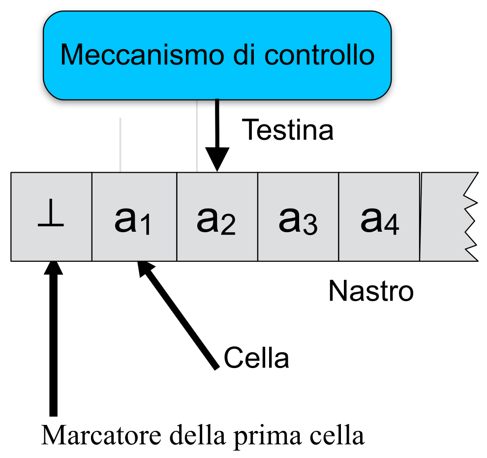
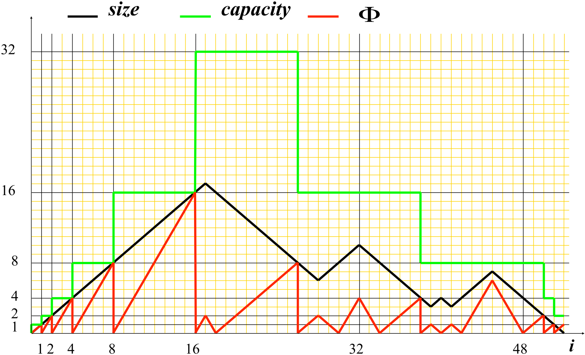

# ASD – Analisi di algoritmi

|      |           |                                                              |
| ---- | :-------: | -----------------------------------------------------------: |
| ASD  | Analisi di algoritmi | [🗀][root] [🗍](http://cricca.disi.unitn.it/montresor/teaching/asd/materiale/lucidi/) [🖭](http://cricca.disi.unitn.it/montresor/teaching/asd/materiale/video/) |

[TOC]


# [1.][pdf-1] Introduzione

## Concetti di base

### Definizioni

> **Problema computazionale**: *relazione matematica che associa un elemento del dominio di output ad ogni elemento del dominio di input*

- Dati un **dominio** di input e uno di output

> **Algoritmo**: *procedimento effettivo, espresso tramite un insieme di passi elementari ben specificati in un sistema formale di calcolo, che risolve il problema in tempo finito*

- Dato un **problema** computazionale


### ~~Descrivere un algoritmo~~

~~La descrizione deve essere~~

- ~~Il più possibile **formale**~~
- ~~**Indipendente** dal linguaggio (pseudo-codice)~~
- ~~**Dettagliata**~~


### ~~Pseudo-codice~~

[~~Vedi slide 9-10~~][pdf-1]


## Valutare un algoritmo

### ~~Introduzione~~

- **Efficienza**
  - Stabilire come valutare se un programma è efficiente
  - Alcuni problemi non possono essere risolti in modo efficiente
  - Esistono soluzioni ottime: non è possibile essere più efficienti
- **Correttezza**
  - Dimostrazione matematica, descrizione informale
  - Alcuni problemi non possono essere risolti
  - Alcuni problemi vengono risolti in modo approssimato


### Efficienza

> **Complessità**: *analisi delle risorse impiegate da un algoritmo per risolvere un problema, in funzione della dimensione e dalla tipologia dell’input*

> <u>Definizione</u>  (**Risorse**)
>
> - **Tempo**: tempo impiegato per completare l’algoritmo
> - **Spazio**: quantità di memoria utilizzata
> - **Banda**: quantità di bit spediti (algoritmi distribuiti)

> <u>Definizione</u>  (**Tempo**)
>
> - **Wall-clock time**: tempo effettivamente impiegato per eseguire un algoritmo
> - **Numero di operazioni rilevanti**: che caratterizzano lo scopo dell’algoritmo
> - **Numero di operazioni elementari**: eseguibili in tempo costante dalla CPU


### Correttezza

> **Invariante**: *condizione sempre vera in un certo punto del programma*

> **Invariante di ciclo**: *condizione sempre vera all’inizio dell’iterazione di ciclo*

> **Invariante di classe**: *condizione sempre vera al termine dell’esecuzione di un metodo della classe*

[Esempi slide 25-26][pdf-1]


#### Algoritmi iterativi

Il concetto di **invariante di ciclo** aiuta a dimostrare la correttezza di un **algoritmo iterativo**

- **Inizializzazione** (caso base)
  
  La condizione è vera alla prima iterazione di un ciclo
  
- **Conservazione** (passo induttivo)
  
  Se la condizione è vera prima di un’iterazione del ciclo, allora rimane vera al termine (prima della successiva iterazione)
  
- **Conclusione**
  
  Al termine del ciclo, l’invariante rappresenta la correttezza dell’algoritmo


### ==Complessità==

$$
\text{Complessità}\; :\; \text{Dimensione dell’input}\ →\ \text{Tempo}
$$

<p></p>

#### ==Dimensione dell’input==

> <u>Definizione</u>  (**Taglia dell’input**)
>
> Numero di
>
> - **Bit** necessari per rappresentarlo (**criterio di costo logaritmico**)
> - **Elementi** di cui è costituito (**criterio di costo uniforme**)

In molti casi

- Si assume che gli **elementi** sono rappresentati da **numero costante di bit**
- ==Le due misure **coincidono** a meno di una **costante moltiplicativa**==

<p></p>

#### Tempo

> **Tempo**: *numero di istruzioni elementari eseguibili in tempo costante*


# [2.][pdf-2] Analisi di algoritmi

~~<u>Obiettivo</u>~~

- ~~Stimare la complessità in tempo degli algoritmi~~

~~<u>Motivazioni</u>~~

- ~~Stimare il tempo impiegato per un dato input~~
- ~~Stimare il più grande input gestibile in tempi ragionevoli~~
- ~~Confrontare l’efficienza di algoritmi diversi~~
- ~~Ottimizzare le parti più importanti~~


## Modelli di calcolo

### Definizioni

> **Modello di calcolo**: *rappresentazione astratta di un calcolatore*

- ~~**Astrazione**: permette di nascondere i dettagli~~
- ~~**Realismo**: riflette la situazione reale~~
- ~~**Potenza matematica**: permette di trarre conclusioni formali sul costo~~


#### ~~Macchina di Turing~~

> <u>Definizione</u>  (**Macchina di Turing**)
>
> Macchina ideale che manipola i dati contenuti su un nastro di lunghezza infinita secondo un insieme prefissato di regole

Ad **ogni passo**

- **Legge** il simbolo sotto la testina
- **Modifica** il proprio stato interno
- **Scrive** un nuovo simbolo nella cella
- **Muove** la testina a destra o a sinistra

<u>Caratteristiche</u>

- Fondamentale nello studio della **calcolabilità**
- Di **basso livello**




#### Random Access Machine

> <u>Definizione</u>  (**Random Access Machine**)
>
> - **Memoria**
>   - Quantità infinita di celle di dimensione finita
>   - Accesso in tempo costante
>     - Indipendente dalla posizione
> - **Processore**
>   - Uno solo
>   - Set di istruzioni elementari simile a quelle reali
>     - Operazioni aritmetiche e logiche
>     - Istruzioni di controllo
> - **Costo delle istruzioni elementari**
>   - Uniforme
>   - Ininfluente ai fini della valutazione


### ==Funzione di complessità==

L'**analisi** di un algoritmo permette di ricavare la sua **funzione di complessità $T(n)$**

La funzione **dipende** da

- Taglia dell'**input $n$**
- Esecuzione delle **istruzioni**

Per ognuna delle $m$ **istruzioni** sono specificati

- **Costo $c_i$**: tempo costante richiesto per l'esecuzione
  - Potenzialmente diverso per ogni istruzione
- **#volte $k_i$**: numero di volte che viene eseguita
  - Dipende dalla taglia dell'input $n$


#### ==Tipi di algoritmi==

La **complessità** si calcola diversamente per

- **Algoritmi iterativi**: sommatoria dei costi moltiplicati per i rispettivi #volte
  $$
  T(n)=\sum_{i=1}^{\rm \#istr}\ k_ic_i
  $$

-  **Algoritmi ricorsivi**: espansione dell'[equazione di ricorrenza](#Ricorrenze)
  $$
  T(n)=
  \begin{cases}
  c & n\le n_0 \\
  f(T(g(n))) & n>n_0
  \end{cases}
  $$


### Esempi di analisi

[Vedi slide 9-12][pdf-2]


### ==Classi di complessità==

> <u>Definizione</u>  (**Classi di complessità**)
> $$
> \begin{array}{c}
> & f(n) && \rm Tipo & \\ \hline
> & \log n && \rm logaritmico \\
> & \sqrt n && \rm sublineare \\
> & n && \rm lineare \\
> & n\log n && \rm loglineare \\
> & n^k && \rm polinomiale \\
> & k^n && \rm esponenziale
> \end{array}
> $$


## Notazione asintotica

### ==Definizioni==

> <u>Definizione</u>  (**Notazione $O\,$**)
>
> Sia $g(n)$ una funzione di costo
>
> Si indica con $O(g(n))$ l'insieme delle funzioni $f(n)$ tali per cui
> $$
> f(n)=O(g(n))\iff \exist\, c > 0,\ \exist\,m\ge 0\ : \ f(n)\le cg(n),\ \ \forall\, n\ge m
> $$

- ==$g(n)$ è un **limite asintotico superiore** di $f(n)$==
- $f(n)$ cresce al più come $g(n)$

> <u>Definizione</u>  (**Notazione $Ω\,$**)
>
> Sia $g(n)$ una funzione di costo
>
> Si indica con $Ω(g(n))$ l'insieme delle funzioni $f(n)$ tali per cui
> $$
> f(n)=Ω(g(n))\iff \exist\, c > 0,\ \exist\,m\ge 0\ : \ f(n)\ge cg(n),\ \ \forall\, n\ge m
> $$

- ==$g(n)$ è un **limite asintotico inferiore** di $f(n)$==
- $f(n)$ cresce almeno come $g(n)$

> <u>Definizione</u>  (**Notazione $Θ\,$**)
>
> Sia $g(n)$ una funzione di costo
>
> Si indica con $Θ(g(n))$ l'insieme delle funzioni $f(n)$ tali per cui
> $$
> f(n)=Θ(g(n))\iff\\ \exist\, c_1, c_2 > 0,\ \exist\,m\ge 0\ : \ c_1g(n)\le f(n)\le c_1g(n),\ \ \forall\, n\ge m
> $$

- ==$f(n)=Θ(g(n))\iff f(n)=O(g(n))\ \and\ f(n)=Ω(g(n))$==
- ==$f(n)$ cresce **esattamente** come $g(n)$==


### Esercizi

[Vedi slide 18-27][pdf-2]


## Complessità di problemi e algoritmi

~~<u>Obiettivo</u>: riflettere su complessità di problemi e algoritmi~~

- ~~Ottimizzazioni~~
- ~~Efficienza massima~~
- ~~Rapporto fra problema computazionale e algoritmo~~


### Algoritmi aritmetici

[Esempi (slide 29-44)][pdf-2]


### ==Algoritmi e problemi==

Complessità in **tempo** di un

- ==**Algoritmo**: quantità di tempo richiesta per input di dimensione $n$==
  
  Per tutti gli input, l'algoritmo
  
  - $O(f (n))$: costa **al più** $f (n)$
  - $Ω(f (n))$: costa **almeno** $f (n)$
  - $Θ(f (n))$: richiede **esattamente** $Θ(f (n))$
  
- ==**Problema**: complessità in tempo relative a tutte le possibili soluzioni==
  
  - $O(f (n))$: complessità del **miglior algoritmo** che risolve il problema
  - $Ω(f (n))$: **tempo minimo dimostrabile** che un algoritmo può impiegare
  - $Θ(f (n))$: **algoritmo ottimo**


#### ==Limiti alla complessità di un problema==

> <u>Definizione</u>  (**Limiti superiore e inferiore di un problema**)
>
> Un problema ha complessità $\lang O,Ω\rang (f (n))$ se esiste almeno un algoritmo avente complessità $\lang O,Ω\rang (f (n))$ che lo risolve


## Tipologia dell’input

~~<u>Obiettivo</u>: valutare gli algoritmi in base all’input~~

- ~~In alcuni casi, gli algoritmi si comportano diversamente a seconda delle caratteristiche dell’input~~
- ~~Conoscere in anticipo tali caratteristiche permette di scegliere il miglior algoritmo in quella situazione~~
- ~~Il problema dell’ordinamento è caratterizzato da questi concetti~~


### Tipologia di analisi

- **Caso pessimo**
  - Il tempo di esecuzione è un **limite superiore** al tempo per qualsiasi input
  - ~~La più importante e spesso frequente~~
- **Caso medio**
  - **Distribuzione uniforme**
  - ~~Difficile da definire in alcuni casi~~
- **Caso ottimo**
  - Utile se si hanno **informazioni particolari** sull’input


### ==Algoritmi di ordinamento==

> <u>Problema</u>  (**Ordinamento**)
>
> - <u>Input</u>: sequenza $A = a_1, . . . , a_n$ di $n$ valori
> - <u>Output</u>: sequenza $B = b_1, . . . , b_n$ che sia una permutazione di $A$ tale per cui
>
> $$
> b_1 ≤\,. . . ≤ b_n
> $$

[Esempi (slide 49-64)][pdf-2]


#### ==Selection sort==

> <u>Algoritmo</u>  (**Selection sort**)
>
> Cerca il minimo e lo mette in posizione corretta, riducendo il problema agli $n − 1$ restanti valori

- Approccio naif

```c++
void selectionSort(Item[] A, int n)
	for i = 1 to i = n-1 do
		int min = min(A, i, n)
		A[i] ↔ A[min]
```

```c++
int min(Item[] A, int i, int n) 
	int min = i
	for j = i+1 to n do
		if A[j] < A[min] then
            min = j
	return min
```

<u>Complessità totale</u> (caso medio, pessimo e ottimo)
$$
\sum_{i=1}^{n-1}(n-i)\ =\ \sum_{i=1}^{n-1}i\ =\ \frac{n(n-1)}{2}\ =\ n^2-\frac n2\ =\ O(n^2)
$$


#### ==Insertion sort==

> <u>Algoritmo</u>  (**Insertion sort**)
>
> Inserisce ogni elemento nella posizione corretta del sottovettore precedentemente ordinato, shiftando gli elementi già presenti

- Simile all'ordinamento di un mazzo di carte

```c++
void insertionSort(Item[] A, int n)
    for i = 2 to n do
    	Item tmp = A[i]
        int j = i
        while j > 1 and A[j - 1] > tmp do
            A[j] = A[j - 1]
            j--
        A[j] = tmp
```

- **Efficiente** per
  - **Piccoli insiemi** di elementi
  - Insiemi parzialmente **ordinati**
- Il **costo dipende** da
  - **Dimensione** dell'input
  - **Distribuzione** dei dati dell'input

<u>Complessità</u>

- <u>Caso pessimo</u>:  $O(n^2)$
  - Input ordinato in senso inverso
- <u>Caso ottimo</u>:  $O(n)$
  - Input ordinato


#### ==Merge sort==

> <u>Algoritmo</u>  (**Merge sort**)
>
> Basato sulla tecnica divide-et-impera
>
> - <u>Divide</u>: divide il vettore di $n$ elementi in due sottovettori di $n/2$ elementi
> - <u>Impera</u>: chiama ricorsivamente se stesso sui due sottovettori
> - <u>Combina</u>: unisce e ordina i due sottovettori ordinati tramite merge
>
> <u>Idea</u>: due sottovettori ordinati si ordinano più velocemente in unico vettore

```c++
void mergeSort(Item[] A, int first, int last)
    if first < last
        int mid = floor((first + last) / 2)
        mergeSort(A, first, mid)
        mergeSort(A, mid + 1, last)
        merge(A, first, last, mid)
```

```c++
void merge(Item[] A, int first, int last, int mid)
    int i, j, k, h
    i = first
    j = mid + 1
    k = first 
    
    while i <= mid and j <= last do
        if A[i] <= A[j] then
            B[k] = A[i]
            i++
        else
            B[k] = A[j]
            j++
		k++
    
	j = last
    for h = mid downto i do
        A[j] = A[h]
        j--
    for j = first to k - 1 do
        A[j] = B[j]
```

- <u>Complessità</u> di `merge`

$$
O(n)
$$

- <u>Costo computazionale</u> di `mergeSort` (si assuma $n=2^k$)

$$
T(n)=
\begin{cases}
c & n=1 \\
2\,T(n/2)+dn & n>1
\end{cases}\\[40px]
O\Bigg(\sum_{i=0}^k 2^i·\frac{n}{2^i}\Bigg)\ =\ O\Bigg(\sum_{i=0}^k n\Bigg)\ =\ O(k·n)\ \iff\ O(n\log n)
$$


# [3.][pdf-3] Funzioni di costo

## Notazione asintotica

### Espressioni polinomiali

> <u>Definizione</u>  (**Espressione polinomiale**)
> $$
> f(n) = \sum_{i=0}^k a_in^i,\ \ a_k\ne0 \ \ \Rarr\ \ f(n)=Θ(n^k)
> $$

- **Limite superiore**

$$
\exist\,c>0,\ \exist\,m\ge0\ :\ f(n)\le cn^k,\ \ \forall\,n\ge m
\\[16px]
c\,\ge\, a_k+\sum_{i=0}^{k-1}|a_i|\,>\,0\,,\ \ \ m=1
$$

- **Limite inferiore**

$$
\exist\,d>0,\ \exist\,m\ge0\ :\ f(n)\ge dn^k,\ \ \forall\,n\ge m
\\[16px]
d\,\le\, a_k-\sum_{i=0}^{k-1}\frac{|a_i|}{n}\,>\,0\ \iff\ n\,>\,\frac{\sum_{i=0}^{k-1}|a_i|}{a_k}
$$


#### Casi particolari

Funzioni **limitate** superiormente e inferiormente
$$
\exist\,c_1,c_2>0,\ \exist\,m\ge0\ :\ c_1\le f(n)\le c_2,\ \forall\, n\ge m\ \ \Rarr\ \ f(n)=Θ(1)
$$


### Proprietà delle notazioni

- **Dualità**
$$
f (n) = O(g(n)) \iff g(n) = Ω(f (n))
$$

- **Eliminazione delle costanti**
$$
f (n) = 〈O,Ω〉(g(n)) \iff af (n) =〈O,Ω〉(g(n))\,,\ \ ∀a > 0
$$

- **Sommatoria** (sequenza di algoritmi)
$$
f_1 (n) =〈O,Ω〉(g_1 (n))\,,\, \ f_2 (n) =〈O,Ω〉(g_2 (n))\ \ \Rarr \\ \Rarr \ \ f_1 (n) + f_2 (n) =〈O,Ω〉(\max(g_1 (n),\, g_2 (n)))
$$

- **Prodotto** (cicli annidati)
$$
f_1 (n) =〈O,Ω〉(g_1 (n))\,,\, \ f_2 (n) =〈O,Ω〉(g_2 (n))\ \ \Rarr \\  \Rarr \ \ f_1 (n) · f_2 (n) =〈O,Ω〉(g_1 (n) · g_2 (n))
$$

- **Simmetria**
$$
f (n) = Θ(g(n)) \iff g(n) = Θ(f (n))
$$

- **Transitività**
$$
f (n) = O(g(n))\,,\,\ g(n) = O(h(n))\,\ \Rarr\,\ f (n) = O(h(n))
$$

[Dimostrazioni (slide 7-12)][pdf-3]


### Proprietà delle funzioni

**Logaritmi**

- $\log_a n = Θ(\log n)$
- $\log n^a = Θ(\log n)\,,\ \forall\,a>0$

**Esponenziali**

- $2^n=O((2+a)^n)\,,\ \forall\,a\ge0$
- $2^{n+a}=Θ(2^n )\,,\, \, \ \ \ \ \ \  \forall\,a\ge0$


### ==Notazioni $o$, $ω$==

> <u>Definizione</u>  (**Notazione $o$**)
>
> Sia $g(n)$ una funzione di costo
>
> Si indica con $o(g(n))$ l’insieme delle funzioni $f (n)$ tali per cui
> $$
> f(n) = o(g(n)) \iff ∀\,c,\ ∃\,m\ :\ f (n) < cg(n),\ ∀\,n ≥ m
> $$

> <u>Definizione</u>  (**Notazione $ω$**)
>
> Sia $g(n)$ una funzione di costo
>
> Si indica con $ω(g(n))$ l’insieme delle funzioni $f (n)$ tali per cui
> $$
> f(n) = ω(g(n)) \iff ∀\,c,\ ∃\,m\ :\ f (n) > cg(n),\ ∀\,n ≥ m.
> $$

$$
\begin{array}{l}f(n) =〈o,ω〉(g(n))\ \Rarr\ f (n) =〈O,Ω〉(g(n))\end{array}
\\[16px]
\lim_{n→∞}\frac{f(n)}{g(n)}\ =\
\begin{cases}
\begin{array}{l}
0 &\Rarr\ \ f(n) = o(g(n))
\\
c \ne 0 &\Rarr\ \ f(n) = Θ(g(n))
\\
+∞ &\Rarr\ \ f(n) = ω(g(n))
\end{array}
\end{cases}
$$


### Classificazione delle funzioni

**Ordinamento** delle principali espressioni
$$
\forall\ \ r < s,\ h < k,\ a < b
\\
\begin{array}{l}
 & O(1) &⊂& O(\log^r n) &⊂& O(\log^s n) &⊂ \\
⊂& O(n^h) &⊂& O(n^h \log^r n) &⊂& O(n^h \log^s n) &⊂ \\
⊂& O(n^k) &⊂& O(a^n) &⊂& O(b^n)
\end{array}
$$


## Ricorrenze

~~(~~[~~Torna a Tipi di algoritmi~~](#*Tipi di algoritmi*)~~)~~

### ==Definizioni==

> **Equazione di ricorrenza**: *formula matematica definita in maniera ricorsiva che esprime la complessità di un algoritmo ricorsivo*

- Utilizzata per risolvere i problemi

> **Formula chiusa**: *rappresenta la classe di complessità della funzione*

- Obiettivo dell'analisi (quando possibile)


### Analisi per livelli

> <u>Metodo</u>  (**Albero di ricorsione / Per livelli**)
>
> Espandere l'equazione di ricorrenza in un albero, i cui nodi rappresentano i costi ai vari livelli della ricorsione

[Esempi (slide 22-25)][pdf-3]


### Metodo della sostituzione

> <u>Metodo</u>  (**Sostituzione / Tentativi**)
>
> Dimostrare per induzione la correttezza di una soluzione, dedotta sulla base della propria esperienza

$$
T(n)=
\begin{cases}
c & n\le n_0 \\
f_1(T(f_2(n))) & n>n_0
\end{cases}
$$

1. **Dedurre** una possibile soluzione
   $$
   T(n) = Θ(\boldsymbol g(n))
   $$

2. Formulare una **ipotesi induttiva**
   $$
   \boldsymbol h(n)=Θ(g(n))\ \ \Rarr\ \ \forall\,k<n,\ \ T(k)\ \lang \le,\ge\rang\ \boldsymbol {d\,h}(k)
   $$

3. **Sostituire** nella ricorrenza le espressioni $T (f_2(n))$ con l'ipotesi induttiva
   $$
   T(n)=\lang O,Ω\rang(f_2(n))\ \iff\ T(n)\ \lang \le,\ge\rang\ f_1(\boldsymbol {d\,h}(f_2(n)))
   $$

4. Dimostrare che la soluzione è valida anche per il **caso base**

[Esempi e tecniche (slide 27-37)][pdf-3]


### ==Metodo dell’esperto==

> **Ricorrenze comuni**: *ricorrenze facilmente risolubili ricorrendo a teoremi specifici per ogni classe particolare di equazioni di ricorrenza*

[Vedi slide 39-55][pdf-3]


### Analisi degli algoritmi

[Esempi (slide 56-65)][pdf-3]


# [4.][pdf-4] Analisi ammortizzata

## Introduzione

### ==Definizione==

> <u>Definizione</u>  (**Analisi ammortizzata**)
>
> Tecnica di analisi di complessità che valuta il tempo richiesto per eseguire, nel caso pessimo, una **sequenza di operazioni** su una **struttura dati**

- Se le **operazioni più costose** sono poco frequenti, allora il loro costo può essere **ammortizzato** dalle operazioni **meno costose**

<u>Differenze</u>

- **Analisi caso medio**: probabilistica, su singola operazione
- **Analisi ammortizzata**: deterministica, su operazioni multiple, caso pessimo


### ==Metodi per l’analisi==

#### ==Aggregazione==

> <u>Definizioni</u>  (**Aggregazione**)
>
> - **Sequenza**: evoluzione della struttura data una sequenza di operazioni
> - **Caso pessimo**: peggior sequenza di operazioni
> - **Aggregazione**: sommatoria delle complessità individuali

> <u>Metodo</u>  (**Aggregazione**)
>
> - Si calcola la complessità $T (n)$ per eseguire $n$ operazioni in sequenza nel caso pessimo
> - Si calcola il **costo ammortizzato** $T (n)/n$ come **media** su $n$ operazioni

- ~~Tecnica derivata dalla matematica~~
- ==Si calcola il **costo complessivo** (**aggregato**) e si divide per $n$==

$$
T(n) = \frac1n \sum_{i=1}^nc_i
$$


#### ==Ammortamento==

> <u>Metodo</u>  (**Ammortamento / Accantonamenti**)
>
> - Si assegna un **costo ammortizzato** potenzialmente distinto ad ognuna delle operazioni possibili
>
> - Il costo ammortizzato può essere diverso dal **costo effettivo**
>
>   - Operazioni meno costose caricate di un costo aggiuntivo (**credito**)
>
>   $$
>    \text{costo ammortizzato = costo effettivo + credito prodotto}
>   $$
> 
>   - I crediti accumulati sono usati per pagare le operazioni più costose
>
>   $$
>   \text{costo ammortizzato = costo effettivo − credito consumato}
>   $$

- ~~Tecnica derivata dall’economia~~

<u>Obiettivi</u>: dimostrare che

- ==La somma dei costi ammortizzati $a_i$ è un **limite superiore** ai costi effettivi $c_i$==
  $$
  \sum_{i=1}^n c_i\ \le\ \sum_{i=1}^n a_i
  $$

- Il valore così ottenuto è poco costoso

<u>Note</u>

- La dimostrazione deve valere per tutte le sequenze (caso pessimo)

- ==Il **credito** dopo l'operazione $t$-esima è sempre **positivo**==
  $$
  \sum_{i=1}^t a_i -\sum_{i=1}^t c_i\ \ge\ 0
  $$


#### ==Potenziale==

> <u>Definizione</u>  (**Funzione di potenziale**)
>
> Una funzione di potenziale $Φ$ associa ad uno **stato** $S$ della struttura dati la "**quantità di lavoro**" $Φ(S)$ che è stato contabilizzato nell’analisi ammortizzata, ma non ancora eseguito

- ==$Φ(S)$ rappresenta la **quantità di energia potenziale** dello stato $S$==

> <u>Metodo</u>  (**Potenziale**)
>
> Lo stato del sistema viene descritto tramite **differenze di potenziale**, con una **funzione di potenziale**
>
> - Si associa alla struttura dati una **funzione di potenziale** $Φ(S)$
>
>   - Le operazioni meno costose incrementano $Φ(S)$
>   - Le operazioni più costose decrementano $Φ(S)$
>
> - <u>Costo ammortizzato</u>
>   $$
>   \text{costo ammortizzato = costo effettivo + variazione di potenziale}\\[16px]
>   a_i = c_i + Φ(S_i ) − Φ(S_{i−1} )
>   $$
>   - $S_i$ è lo stato associato alla $i$-esima operazione
> 
> - <u>Costo ammortizzato, sequenza di $n$ operazioni</u>
>   $$
>   \begin{align}
>   A\ =\ \sum_{i=1}^n a_i  
>   \ =\ \sum_{i=1}^n(c_i + Φ(S_i) - Φ(S_{i−1})) 
>   \ =\ C+Φ(S_n) - Φ(S_0)
>   \end{align}
>   $$
>   - Se la variazione di potenziale $Φ(S_n ) − Φ(S_0 )$ è non negativa, il costo ammortizzato $A$ è un **limite superiore** al costo reale

- ~~Tecnica derivata dalla fisica~~


## Contatore binario

### Operazione

> <u>Esempio</u>  (**Contatore binario**)
>
> Contatore binario di $k$ bit con un vettore $A$ di booleani $0/1$
>
> - Bit meno significativo in $A[0]$, bit più significativo in $A[k − 1]$
>
> - Valore del contatore
>   $$
>   x=\sum_{i=0}^{k-1}A[i]·2^i
>   $$
>
> - Operazione $\tt increment()$ che incrementa il contatore di $1$

```pseudocode
void increment(bool[] A, int k)
    int i = 0
    while i < k and A[i] == 1 do
        A[i] = 0
        i++
    if i < k then
		A[i] = 1
```


### Aggregazione

<u>Analisi grossolana</u>

- Sono necessari $k = \lceil \log(n + 1)\rceil$ bit per rappresentare $n$
- Una chiamata $\tt increment()$ richiede tempo $O(k)$ nel caso pessimo
- Essendoci una sola operazione, esiste un’unica sequenza possibile
- Nel caso pessimo si effettuano $n=2^k$ operazioni di incremento
  - Incrementare il contatore da $0$ a $n=2^k$

<u>Costo delle operazioni</u>

- Costo di $n$ operazioni:  $\,T(n)=O(nk)=O(n\log n)$ (limite superiore)
- Costo di $1$ operazione: $\,T(n)/n=O(k)=O(\log n)$

<u>Analisi più stretta</u>

- ==Il tempo necessario ad eseguire l’intera sequenza è **proporzionale al numero di bit** che vengono modificati==
- ==$A[i]$ viene modificato ogni $2^i$ incrementi==

<u>Analisi ammortizzata</u>

- <u>Costo totale</u>
  $$
  T(n)\ =\ \sum_{i=0}^{k-1}\bigg\lfloor\frac{n}{2^i}\bigg\rfloor\ \le\ n\sum_{i=0}^{k-1}\frac{1}{2^i}\ \le\ n\sum_{i=0}^{+\infin}\bigg(\frac{1}{2}\bigg)^i\ =\ 2n\ =\ O(n)
  $$

- <u>Costo ammortizzato</u>
  $$
  T (n)/n\ =\ 2n/n\ =\ 2\ =\ O(1)
  $$


### Ammortamento

<u>Costo delle operazioni</u> ($\tt increment()$)

- <u>Costo effettivo</u>: $\,d$
  - ==Numero di **bit che cambiano** valore==

- <u>Costo ammortizzato</u>: $\,2$
  - ==$1$ per **cambio di un bit** da $0$ a $1$ (costo effettivo)==
  - ==$1$ per il **futuro cambio** dello stesso bit da $1$ a $0$==  ~~(dimostrazione)~~

<u>Conseguenze</u>

- <u>Credito</u>: ==numero di **bit $1$** presenti== (in ogni istante)
- <u>Costo totale</u>: $\,O(n)$
- <u>Costo ammortizzato</u>: $\,O(1)$

<u>Dimostrazione</u>
$$
T (n)\ =\ \sum_{i=1}^n c_i\ \le\ \sum_{i=1}^n 2\ =\ 2n\ =\ O(n)
$$

$$
T (n)/n\ =\ 2n/n\ =\ 2\ =\ O(1)
$$


### Potenziale

<u>Siano</u>

- ==**$Φ(S)$ il numero bit $1$** presenti nel contatore==
- ==**$t$ il numero di bit $1$** dal meno significativo al primo bit $0$==

<u>Analisi</u>

- <u>Costo effettivo</u>:                 $\,1+ t$  ~~($1$ bit $0→1$ e $t$ bit $1→0$)~~
- <u>Variazione di potenziale</u>: $\,1 − t$  ~~($t$ bit sono diventati $0$)~~
- <u>Costo ammortizzato</u>:       $\,(1+ t) +(1 − t) =2$
- <u>All’inizio</u>:  zero bit accesi $\,\Rarr\ Φ(S_0) = 0$
- <u>Alla fine</u>:  $\,Φ(S_n ) ≥ 0\ \ \ \ \ \,\Rarr\ Φ(S_n)-Φ(S_0)\ge0$


## Vettori dinamici

### Inserimento

==<u>Implementazione</u>: **sequenza** tramite vettori dinamici==

- ==Si alloca un vettore di una certa dimensione $m$ detta **capacità**==

- L’**inserimento** di un elemento ha costo
  - $O(n)$ in mezzo (shift)
  - $O(1)$ in fondo (append)

<u>Problema</u>

- Non è noto a priori il **numero di elementi** da inserire nella sequenza
- La **capacità** selezionata può rivelarsi **insufficiente**

<u>Soluzione</u>

1. ==Si **alloca** un vettore di **capacità maggiore**==
   - **Incremento fisso**
   - **Raddoppiamento**
2. ==Si **copia** il contenuto== del vecchio vettore nel nuovo e si rilascia il vecchio

<u>Domanda</u>

- Qual è la migliore politica di incremento?


### Espansione

#### Incremento

<u>Assunzioni</u>

- Incremento: $\,d$
- Dimensione iniziale: $\,d$
- Costo di scrittura di un elemento: $\,1$

<u>Analisi ammortizzata</u>

- <u>Costo effettivo</u> di $1$ operazione $\tt add()$
  $$
  c_i=
  \begin{cases}
  i & (i\ {\rm mod}\ d) = 1 \\
  1 & \rm altrimenti
  \end{cases}
  $$

- <u>Costo effettivo</u> di $n$ operazioni $\tt add()$
  $$
  \begin{align}
  T(n)\ &=\ \sum_{i=1}^n c_i\\
  &=\ n+\sum_{j=1}^{\lfloor n/d\rfloor} d·j\\
  &=\ n + d\ \frac{(\lfloor n/d\rfloor+1)\lfloor n/d\rfloor}{2} \\
  & \le\ \ n + \frac{(n/d+1)\, n}{2}\\
  &=\ O(n^2)
  \end{align}
  $$
  
- <u>Costo ammortizzato</u> di $1$ operazione $\tt add()$
  $$
  T (n)/n\ =\ \frac{O(n^2)}n\ =\ O(n)
  $$


#### Raddoppiamento

<u>Assunzioni</u>

- Dimensione iniziale: $\,1$
- Costo di scrittura di un elemento: $\,1$

<u>Analisi ammortizzata</u>

- <u>Costo effettivo</u> di $1$ operazione $\tt add()$
  $$
  c_i=
  \begin{cases}
  i & i =2^k +1 \\
  1 & \rm altrimenti
  \end{cases}
  $$

- <u>Costo effettivo</u> di $n$ operazioni $\tt add()$
  $$
  \begin{align}
  T(n)\ &=\ \sum_{i=1}^n c_i\\& =\ n+\sum_{j=0}^{\lfloor\log n\rfloor} 2^j\\& =\ n + 2^{\lfloor\log n\rfloor+1} − 1 \\
  & \le\ n + 2^{\log n+1} − 1\\& =\ n + 2n − 1\\& =\ O(n)
  \end{align}
  $$

- <u>Costo ammortizzato</u> di $1$ operazione $\tt add()$
  $$
  T (n)/n\ =\ \frac{O(n)}n\ =\ O(1)
  $$


### Reality check

[Vedi slide 27-31][pdf-4]


### Cancellazione

La **rimozione** di un elemento ha costo

- $O(n)$ se il vettore è ordinato
- $O(1)$ se il vettore non è ordinato

<u>Problema</u>

- ==La cancellazione porta a **sprechi di memoria** quando $n\ll m$==
  - $n$: numero di elementi attualmente presenti
  - $m$: capacità

<u>Soluzione</u>

- ==**Contrazione** quando il fattore di carico $α=n/m$ diventa troppo piccolo==
  - Allocazione, copia, deallocazione

<u>Domanda</u>

- Quale soglia per il fattore di carico?


#### Strategie

<u>Problema</u>

- Numero di inserimenti/rimozioni insufficiente per ripagare le espansioni/contrazioni

<u>Soluzione</u>

- ==Lasciar **decrescere** il sistema ad un fattore inferiore a $α=\frac14$==
  - Dopo un’espansione, il fattore di carico diventa $\frac12$
  - Dopo una contrazione, il fattore di carico diventa $\frac12$

<u>Analisi ammortizzata</u>

- ==Si utilizzi una **funzione di potenziale** che==

  - ==Vale $0$ all'inizio e subito dopo una espansione o contrazione==
  - ==Cresce fino a $n$ quando $α$ aumenta fino ad $1$ o diminuisce fino ad $\frac14$==

  $$
  Φ=
  \begin{cases}
  2n − m & α ≥ \frac12 \\
  m/2 − n & α ≤\frac12
  \end{cases}
  $$

  - Casi esplicativi

    - $α=\frac12\ \text{(dopo espansione/contrazione)}\  \ \ \ \ \ \ \, \, \Rarr\ Φ = 0$
    - $α = 1\ \ \text{(prima di espansione)}\, \ \ \Rarr\ n = m\ \ \ \Rarr\ Φ = n$
    - $α =\frac14\ \text{(prima di contrazione)}\ \Rarr\ m = 4n\,\ \Rarr\ Φ = n$

    Immediatamente prima di espansioni/contrazioni, il potenziale è sufficiente per pagare il loro costo

- <u>Costo ammortizzato</u>: $\,a_i\ =\ c_i + Φ_i − Φ_{i−1}\ =\ 3$   ([vedi slide 37][pdf-4])




## Reality check

### Applicazioni

- Espansione/contrazione di **tabelle hash**
- **Insiemi disgiunti** con euristica sul rango e compressione dei cammini
- **Heap** di Fibonacci


### Ristrutturazione in tabelle Hash

- Costo $O(m)$ per la ristrutturazione nel caso pessimo
- Costo ammortizzato costante (vedi dimostrazione per vettori)


<p></p>

---


# 🗍

[root]: ../ASD/1-Analisi
[pdf-0]: ../ASD/1-Analisi/0-introcorso.pdf
[pdf-1]: ../ASD/1-Analisi/1-introduzione.pdf
[pdf-1X]: ../ASD/1-Analisi/1X-introduzione.pdf
[pdf-2]: ../ASD/1-Analisi/2-analisi.pdf
[pdf-2X]: ../ASD/1-Analisi/2X-analisi.pdf
[pdf-3]: ../ASD/1-Analisi/3-funzioni.pdf
[pdf-3X]: ../ASD/1-Analisi/3X-funzioni.pdf
[pdf-4]: ../ASD/1-Analisi/4-analisi-ammortizzata.pdf