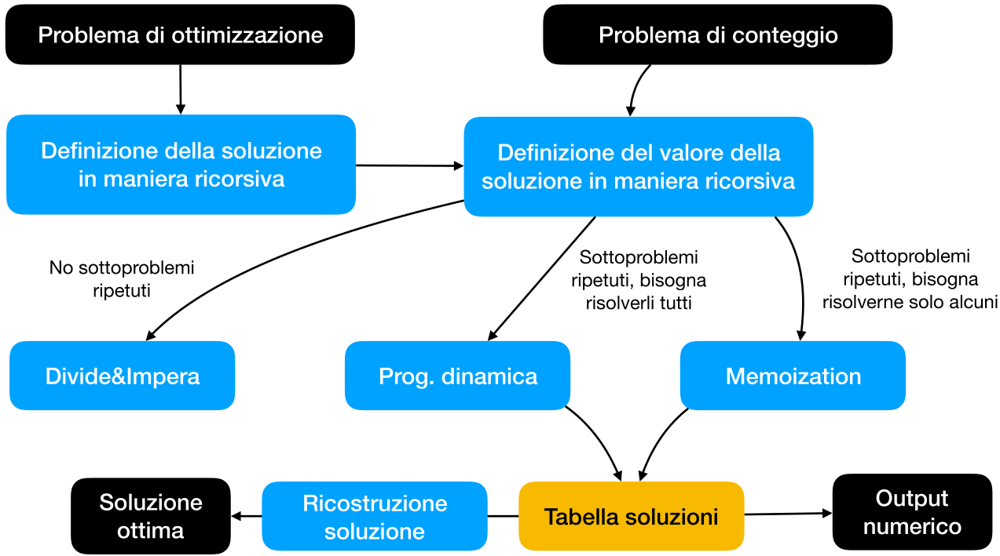
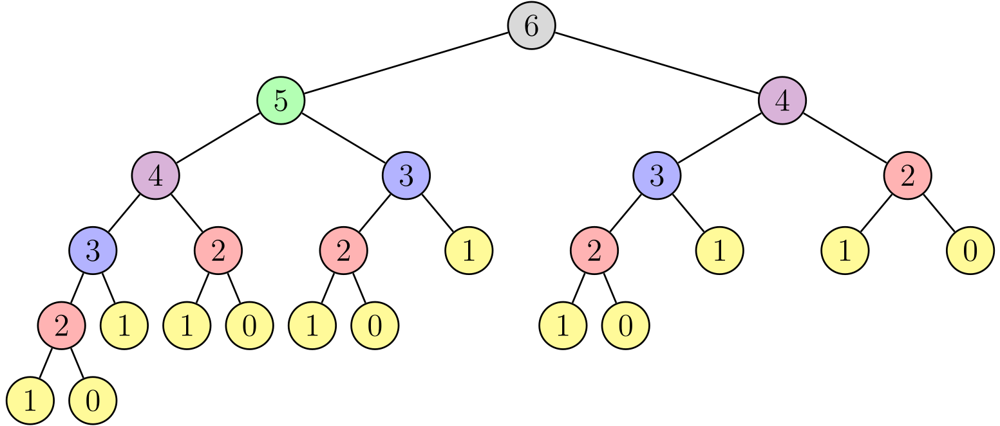
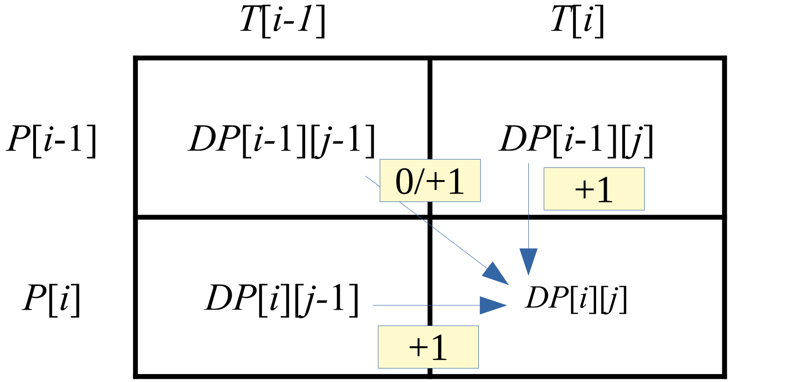
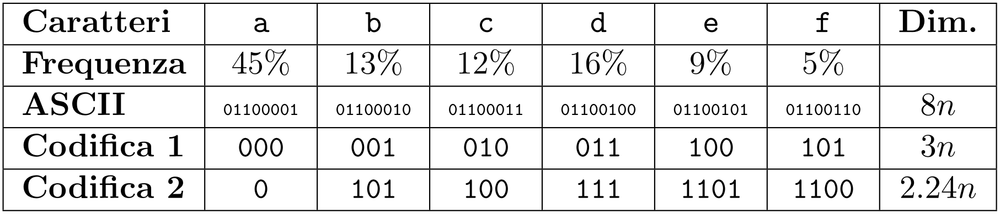

# <u>ASD</u> – Problemi - 1

|      |                   |                                                              |
| ---- | :---------------: | -----------------------------------------------------------: |
| ASD  | Problemi - 1 | [ ][root][](http://cricca.disi.unitn.it/montresor/teaching/asd/materiale/) |

[TOC]


# [1.][pdf-1] Introduzione

## Risoluzione dei problemi

### Fasi di risoluzione

Dato un **problema** è possibile evidenziare **quattro fasi** (non sequenziali)

- **Classificazione** del problema
- **Caratterizzazione** della soluzione
- **Tecnica** di progetto
- Utilizzo di **strutture dati**


### Classificazione

- **Problemi decisionali**
  - <u>Obiettivo</u>: verificare che il dato di ingresso soddisfa una certa proprietà
  - <u>Soluzione</u>: risposta sì/no
  - <u>Esempio</u>: stabilire se un grafo è connesso
- **Problemi di ricerca**
  - <u>Spazio di ricerca</u>: insieme di 'soluzioni' possibili
  - <u>Soluzione</u>: soluzione che rispetta certi vincoli
  - <u>Esempio</u>: posizione di una sottostringa in una stringa
- **Problemi di ottimizzazione**
  - <u>Soluzione</u>: ogni soluzione è associata ad una funzione di costo
  - <u>Obiettivo</u>: trovare la soluzione di costo minimo
  - <u>Esempio</u>: cammino più breve fra due nodi
- **Problemi di approssimazione**
  - <u>Soluzione</u>: computazionalmente impossibile da trovare
  - <u>Obiettivo</u>: trovare una soluzione approssimata
    - Costo basso
    - Non si può sapere se ottima
  - <u>Esempio</u>: problema del commesso viaggiatore


### Definizione matematica

È fondamentale fornire una **definizione formale** del problema

- Spesso la formulazione è banale
- Può suggerire una prima idea di soluzione

La definizione matematica può suggerire una possibile **tecnica**

- Sottostruttura **ottima** → Programmazione **dinamica**
- Proprietà **greedy** → Tecnica **greedy**


### Tecniche di risoluzione

- **Divide et impera**
  - Un problema viene suddiviso in **sotto-problemi indipendenti**, che vengono **risolti ricorsivamente** (**top-down**)
  - <u>Ambito</u>: problemi di **decisione**, **ricerca**
- **Programmazione dinamica**
  - La soluzione viene **costruita** a partire da un insieme di **sotto-problemi** potenzialmente ripetuti (**bottom-up**)
  - <u>Ambito</u>: problemi di **ottimizzazione**
- **Memoization** (annotazione)
  - Versione **top-down** della programmazione **dinamica**
- **Greedy**
  - Si fa sempre la scelta **localmente ottima**
- **Backtrack**
  - Procede per **tentativi**, ritornando talvolta sui propri passi
- **Ricerca locale**
  - Soluzione ottima trovata **migliorando** progressivamente **soluzioni** esistenti
- **Algoritmi probabilistici**
  - Scegliere **a caso** (gratuitamente) o **con giudizio** (costoso)


# [2.][pdf-2] Divide et impera

## Teoria

### Fasi di risoluzione

1. **Divide**: dividere il problema in sotto-problemi più piccoli e indipendenti
2. **Impera**: risolvere i sotto-problemi ricorsivamente
3. **Combina**: unire le soluzioni dei sottoproblemi

[Esempio (slide 8)][pdf-2]


### Utilizzo

<u>Applicazione</u>

- I passi 'divide' e 'combina' devono essere **semplici**
- I **costi** devono essere **migliori** del corrispondente algoritmo **iterativo**

<u>Vantaggi</u>

- Facile **parallelizzazione**
- Utilizzo ottimale della **cache** (cache oblivious)


## Pratica

### Torri di Hanoi

[Slide 9-11][pdf-2]


### ==Quicksort==

> <u>Algoritmo</u>  (**Quicksort**)
>
> Algoritmo di ordinamento basato su divide-et-impera
>
> <p>
>
> <u>Input</u>
>
> - Vettore $A[1 . . . n]$
> - Indici $start$, $end$
>   - $1 ≤ start ≤ end ≤ n$
>
> <p>
>
> <u>Divide</u>
>
> - Sceglie un valore $p=A[j]\,:\, j∈ [start . . . end ]$ detto **perno** (**pivot**)
> - Sposta gli elementi del vettore $A[start . . . end ]$ in modo che
>   - $\forall i \in [start,\,j-1],\ A[i]<p$
>   - $\forall i \in [j+1,\,end],\,\ \ \ A[i]>p$
> - L’indice $j$ del perno va calcolato opportunamente
>
> <p>
>
> <u>Impera</u>
>
> - Ordina i due sottovettori $A[start . . . j − 1$] e $A[j + 1 . . . end ]$
>   richiamando ricorsivamente Quicksort
>
> <p>
>
> <u>Combina</u>
>
> - Assente
>   - $A[start...j-1] +A[j] + A[j+1...end] $ è già un vettore ordinato

<u>Vantaggi</u>

- **Fattore costante migliore** di Merge Sort
- **In-memory**: non utilizza memoria addizionale
- Tecniche **euristiche** per evitare il **caso pessimo**
- Preferito ad altri algoritmi

<p>

#### ==Implementazione==

```pseudocode
int pivot(Item[] A, int start, int enⅾ)
    Item pivot = A[start]
    int j = start
    for i = start + 1 to enⅾ do
        if A[i] < pivot then
            j++
            A[i] ↔ A[j]
    A[start] = A[j]
    A[j] = pivot
    return j

void quicksort(Item[] A, int start, int enⅾ)
    if start < enⅾ then
        int j = pivot(A, start, enⅾ)
        quicksort(A, start, j − 1)
        quicksort(A, j + 1, enⅾ)
```

<p>

#### ==Complessità==

- **$\tt pivot()$**: $Θ(n)$
- **$\tt quicksort()$**
  - <u>Caso pessimo</u>
    - Il vettore di dimensione $n$ viene diviso in vettori di dimensioni $0$ e $n − 1$
    - $T (n) = T (n − 1) + T (0) + Θ(n) = T (n − 1) + Θ(n) = Θ(n^2 )$
  - <u>Caso ottimo</u>
    - Il vettore di dimensione $n$ viene sempre diviso in dimensioni $n/2$
    - $T (n) = 2T (n/2) + Θ(n) = Θ(n \log n)$
  - <u>Caso medio</u>
    - Il costo dipende dall’**ordine** degli elementi, non dai loro valori
    - Bisogna considerare tutte le possibili **permutazioni**
      - Alcuni partizionamenti saranno parzialmente bilanciati
      - Altri saranno pessimi
      - In media si alterneranno nella sequenza di partizionamenti
    - I partizionamenti **parzialmente bilanciati** dominano quelli pessimi
- **Partizionamenti parzialmente bilanciati**
  - Il partizionamento nel caso medio è più vicino al **caso ottimo** che al peggiore
  - Partizionamento $k$-a-$1$
    - $T (n) = T (n/(k+1)) + T (kn/(k+1)) + cn = Θ(n \log n)$

[Slides 12-22][pdf-2]


### ==Algoritmo di Karatsuba==

> <u>Problema</u>  (**Moltiplicazione di numeri binari**)
>
> Approccio ottimale tramite divide-et-impera
>
> <u>Divide</u>
>
> - $X=a·2^{n/2}+b$
> - $Y=c·2^{n/2}+d$
>
> <u>Impera</u>
>
> - $A_1=a×c$
> - $A_3=b×d$
> - $m\ =(a×b)+(c×d)$
> - $A_2=m-A_1-A_3$
>
> <u>Combina</u>
> $$
> XY=A_1·2^n+A_2·2^{n/2}+A_3
> $$

```pseudocode
boolean[] karatsuba(boolean[] X, boolean[] Y , int n)
    if n == 1 then
        return X[1] · Y [1]
    else
        { /* spezza X in a, b e Y in c, d */ }
        boolean[] A1 = karatsuba(a, c, n/2)
        boolean[] A3 = karatsuba(b, d, n/2)
        boolean[] m = karatsuba(a + b, c + d, n/2)
        boolean[] A2 = m − A1 − A3
        return A1 · 2^n + A2 · 2^(n/2) + A3
```

<u>Complessità</u>:  $O(n^{\log 3})=O(n^{1.58})$
$$
T(n)=\begin{cases}
c_1&n=1\\
3T(n/2)+c_2n&n>1
\end{cases}
$$

- Ad ogni livello $i$
  - $3^i$ istanze
  - Di dimensione $n/2^i$


### ==Algoritmo di Strassen==

#### ==Moltiplicazione di matrici==

$$
C=A×B \qquad \quad c_{i,j} =\sum_{k=1}^{n_k} a_{i,k} · b_{k,j}
$$

```pseudocode
void matrixProduct(float[][] A, B, C, int ni, nk, nj)
    for i = 1 to ni do        /* righe   */
        for j = 1 to nj do    /* colonne */
            C[i,j] = 0
            for k = 1 to nk do
                C[i,j] += A[i,k] · B[k,j]
```

<u>Complessità</u>
$$
T (n) = Θ(n_i · n_k · n_j )= Θ(n^3 )
$$


#### ==Approccio divide-et-impera==

> <u>Problema</u>  (**Moltiplicazione si matrici**)
>
> Algoritmo di Strassen divide-et-impera
>
> - Fare padding di $0$ alle matrici $A'$, $B'$ per ottenere due matrici $A$, $B$ di dimensioni $n×n$, dove $n=m+(m\text{ mod }2)$,  $m=\max(n_i, n_k, n_j)$
>   $$
>   A=\begin{bmatrix}
>   A' & \cdots & 0 \\
>   \vdots & \ddots & \vdots \\
>   0 & \cdots & 0
>   \end{bmatrix}
>   \qquad \quad
>   B=\begin{bmatrix}
>   B' & \cdots & 0 \\
>   \vdots & \ddots & \vdots \\
>   0 & \cdots & 0
>   \end{bmatrix}
>   $$
>
> - Suddividere le matrici $n × n$ in quattro matrici $n/2 × n/2$
>   $$
>   A=\begin{bmatrix}
>   A_{11} & A_{12} \\
>   A_{21} & A_{22}
>   \end{bmatrix}
>   \qquad \quad
>   B=\begin{bmatrix}
>   B_{11} & B_{12} \\
>   B_{21} & B_{22}
>   \end{bmatrix}
>   $$
>
> - ~~Calcolo del prodotto delle matrici~~
>   $$
>   C=\begin{bmatrix}
>   A_{11}×B_{11} + A_{12}×B_{21} &&
>   A_{11}×B_{12} + A_{12}×B_{22} \\ \\
>   A_{21}×B_{11} + A_{22}×B_{21} &&
>   A_{21}×B_{12} + A_{22}×B_{22}
>   \end{bmatrix}
>   $$
>   - ~~<u>Equazione di ricorrenza</u>~~
>     $$
>     T(n)=\begin{cases}
>     1&n=1\\[4px]
>     8T(n/2)+n^2&n>1
>     \end{cases}
>     $$
>
> - Calcolo degli elementi intermedi
>   $$
>   \begin{align}
>   & X_1 = (A_{11} + A_{22} ) × (B_{11} + B_{22} )\\
>   & X_3 = A_{11} × (B_{12} − B_{22} )\\
>   & X_2 = (A_{21} + A_{22} ) × B_{11}\\
>   & X_4 = A_{22} × (B_{21} − B_{11} )\\
>   & X_5 = (A_{11} + A_{12} ) × B_{22}\\
>   & X_6 = (A_{21} − A_{11} ) × (B_{11} + B_{12} )\\
>   & X_7 = (A_{12} − A_{22} ) × (B_{21} + B_{22} )
>   \end{align}
>   $$
>
>   - <u>Equazione di ricorrenza</u>
>
>   $$
>   \begin{align}
>   &T(n)=\begin{cases}
>   1&n=1\\[4px]
>   7T(n/2)+n^2&n>1
>   \end{cases}
>   \end{align}
>   $$
>
> - Calcolo matrice finale
>   $$
>   C=\begin{bmatrix}
>   X_{1}+X_{4}-X_{5}+X_{7} &&
>   X_{3}+X_{5} \\ \\
>   X_{2}+X_{4} &&
>   X_{1}+X_{3}-X_{2}+X_{6}
>   \end{bmatrix}
>   $$
>
> <p>
><u>Complessità finale</u>
> $$
> T(n)=Θ(n^{\log7} ) ≈ Θ(n^{2.81} )<O(N^3)
> $$

- Sfrutta il principio di Karatsuba per ridurre il numero di moltiplicazioni fra matrici di dimensione $n/2$, da $8$ a $7$

[Slide 23-26][pdf-2]


### Gap

[Slide 28-33][pdf-2]


# [3.][pdf-3] Dinamica

## Introduzione

### Caratteristiche

- Un metodo per spezzare un problema **ricorsivamente in sottoproblemi**
- Ogni sottoproblema viene risolto **una volta sola**
- La sua soluzione viene memorizzata in una **tabella**
- Nel caso un sottoproblema debba essere **risolto nuovamente**, si ottiene la sua soluzione dalla tabella
- La tabella è facilmente indirizzabile (**lookup in $O(1)$**)


### Approccio generale




### Dinamica – Evitare ripetizioni

- **Tabella DP**
  - Si memorizza il **risultato** di un particolare problema in una tabella DP
    - Vettore, matrice, dizionario
  - La tabella deve contenere **un elemento per ogni sottoproblema** da risolvere
- **Casi base**
  - Si memorizzano i casi base direttamente nelle **relative posizioni**
- **Iterazione bottom-up**
  1. Si parte dai problemi risolubili come **casi base**
  2. Si sale verso problemi via via **più grandi**
  3. Si procede fino a raggiungere il **problema originale**


### Memoization -- Evitare soluzioni superflue

> <u>Definizione</u>  (**Memoization / annotazione**)
>
> Tecnica che fonde l’approccio di memorizzazione della programmazione dinamica con l’approccio top-down di divide-et-impera

- Si crea una **tabella DP**, inizializzata con un **valore speciale** ad indicare che un certo sottoproblema è ancora **non risolto**
- Ogni volta che si deve risolvere un **sottoproblema**, si controlla nella tabella se è già stato **risolto precedentemente**
  - **Sì**: si usa il risultato della **tabella**
  - **No**: si calcola il risultato **ricorsivamente** e lo si memorizza
- In tal modo, ogni sottoproblema viene calcolato **una sola volta** e memorizzato come nella versione **bottom-up**


### ==Fasi==

1. Caratterizzare la **struttura** di una soluzione ottima
2. Dimostrare che la soluzione gode di **sottostruttura ottima**
3. **Definire** ricorsivamente il **valore** di una soluzione ottima
4. **Calcolare** il **valore** di una soluzione ottima
   - **Dinamica**: bottom-up
   - **Memoization**: top-down
5. **Ricostruzione** di una soluzione ottima


### Osservazioni

- Talvolta è necessario memorizzare **informazioni aggiuntive** per ricostruire la soluzione
- Non sempre la **soluzione finale** si trova nella casella in basso a destra
  - È possibile che la soluzione debba essere **ricercata** essa stessa nella tabella
- A volte bisogna fare attenzione a come **riempire la tabella**
  - Non è sempre possibile riempire una riga dopo l’altra
- Talvolta può essere necessario **pre-processare l’input** per poter applicare nella maniera più efficiente possibile la programmazione dinamica


## Domino

### Problema

> <u>Problema</u>  (**Domino lineare**)
>
> Scrivere un algoritmo che prenda in input un intero $n$ e restituisca il numero di possibili disposizioni di $n$ tessere di dimensione $2 × 1$ in un rettangolo $2 × n$
>
> <p>
>
> <u>Definizione ricorsiva</u>
>
> Definiamo una **formula ricorsiva** $DP[n]$ che permetta di calcolare il numero di disposizioni possibili quando si hanno $n$ tessere
>
> - Si definiscono i <u>casi base</u> con $0$ e $1$ tessere
>   - **Una sola** disposizione possibile
> - Si analizza cosa succedere quando si aggiunge l'<u>ultima tessera</u>
>   - Ultima tessera in **verticale**
>     - La dimensione del problema si riduce a $n − 1$
>   - Ultima tessera in **orizzontale**
>     - Se ne devono mettere $2$ orizzontali
>     - La dimensione del problema si riduce a $n − 2$
>   - Queste due possibilità si sommano insieme (**conteggio**)
>
> $$
> DP[n]=
> \begin{cases}
> 1 & n\le1 \\
> DP[n-1]+DP[n-2] & n>1
> \end{cases}
> $$

- La serie generata è la successione di **Fibonacci**


### Algoritmo ricorsivo

```pseudocode
int domino1(int n)
    if n ≤ 1 then
        return 1
    else
        return domino1(n − 1) + domino1(n − 2)
```

- <u>Equazione di ricorrenza</u>
  $$
  T(n)=
  \begin{cases}
  1 & n\le1 \\
  T(n-1)+T(n-2) & n>1
  \end{cases}
  $$

- <u>Complessità</u>

  - Ricorrenza lineare di ordine costante
    - $a_1=1,\ \ a_2=1,\ \ a=a_1+a_2=2,\ \ β=0$
    - Complessità: $Θ=(a^n·n^β)$

  $$
  T(n)=Θ(n^2)
  $$

- <u>Albero di ricorsione</u>

  

  - Molti sottobroblemi ripetuti


### Algoritmo iterativo

#### Tabella DP

```pseudocode
int domino2(int n)
    DP = new int[0...n]
    DP[0] = DP[1] = 1
    for i = 2 to n do
        DP[i] = DP[i - 1] + DP[i - 2]
    return DP[n]
```

- <u>Complessità in tempo</u>: $\qquad T (n) = Θ(n)$
- <u>Complessità in spazio</u>: $\qquad S(n)\, = Θ(n)$


#### Riduzione dello spazio

```pseudocode
int domino3(int n)
    int DP0 = DP1 = DP2 = 1
    for i = 2 to n do
        DP0 = DP1
        DP1 = DP2
        DP2 = DP0 + DP1
    return DP2
```

- <u>Complessità in tempo</u>: $\qquad T (n) = Θ(n)$
- <u>Complessità in spazio</u>: $\qquad S(n)\, = Θ(1)$


### ~~Modello di costo logaritmico~~

**Formula di Binet** per i numeri di Fibonacci
$$
DP[n−1]=F(n)=\frac{ϕ^n}{\sqrt5}-\frac{(1-ϕ)^n}{\sqrt5}
\\[36px]
ϕ=\frac{1+\sqrt5}{2}
$$
**Bit** richiesti per memorizzare $F(n)$: $\quad \log F (n) = Θ(n)$

Sotto il modello di **costo logaritmico**, le tre versioni hanno **complessità**

|  Funzione   | Complessità (Tempo) | Complessità (Spazio) |
| :---------: | :-----------------: | :------------------: |
| `domino1()` |      $O(n2^n)$      |       $O(n^2)$       |
| `domino2()` |      $O(n^2)$       |       $O(n^2)$       |
| `domino3()` |      $O(n^2)$       |        $O(n)$        |

- ~~Si può migliorare utilizzando l’esponenziazione di matrici basata su quadrati~~


## Hateville

### Problema

> <u>Problema</u>  (**Hateville**)
>
> - <u>Descrizione</u>
>   - Hateville è un villaggio particolare, composto da $n$ case, numerate da $1$ a $n$ lungo una singola strada
>   - Ad Hateville ognuno odia i propri vicini, da entrambi i lati
>   - Quindi, il vicino $i$ odia i vicini $i-1$ e $i+1$ (se esistenti)
>   - Hateville vuole organizzare una sagra e vi ha affidato il compito di raccogliere i fondi
>   - Ogni abitante i ha intenzione di donare una quantità $D[i]$, ma non intende partecipare ad una raccolta a cui partecipa almeno uno dei propri vicini
> - <u>Problemi</u>: scrivere un algoritmo che restituisca
>   - La quantità massima di fondi che può essere raccolta
>   - Il sottoinsieme di indici $S\sube\{1,...,n\}$ tale per cui la donazione totale $T=\sum_{i\in S}D[i]$ è massimale
>
> <p>
>
> <u>Ri-definizione del problema</u>
>
> - Sia $HV (i)$ uno dei possibili **insiemi di indici** da selezionare per ottenere una donazione ottimale dalle prime $i$ case di Hateville
> - $HV (n)$ è la **soluzione** del problema originale
>
> <p>
>
> <u>Definizione ricorsiva</u>
>
> - <u>Casi base</u>
>
>   - $HV(0) = \{\}$
>   - $HV(1)=\{1\}$
>
> - Considerato il <u>vicino $i$-esimo</u>
>
>   - Se **non si accetta** la sua donazione
>     $$
>     HV (i) = HV (i − 1)
>     $$
>
>   - Se **si accetta** la sua donazione
>     $$
>     HV (i) = \{i\} ∪ HV (i − 2)
>     $$
>
>   - **Decisione** per accettare
>     $$
>     HV (i) = {\rm highest}(HV (i − 1),\; \{i\} ∪ HV (i − 2))
>     $$
>
> - <u>Formula completa</u>
>
> $$
> HV(i)=
> \begin{cases}
> \{ \} & i=0 \\
> \{1\} & i=1 \\
> {\rm highest}(HV (i − 1),\; \{i\} ∪ HV (i − 2)) & i>1
> \end{cases}
> $$
>
> <p>
> 
> <u>Sottostruttura ottima - Teorema</u>
>
> - Sia $HV_p (i)$ il **problema** dato dalle prime $i$ case
> - Sia $HV_s (i)$ una **soluzione** ottima per il problema $HV_p(i)$
> - Sia $|HV_s (i)|$ il **totale** di donazioni di $HV_s (i)$
> - Ne consegue
>   - $i\notin HV_s (i)\ \Rarr\ HV_s(i) = HV_s(i − 1)$
>   - $i ∈ HV_s(i)\ \Rarr\ HV_s(i) = HV_s(i − 2) ∪ \{i\}$
>
> <p>
> 
> <u>Sottostruttura ottima - Dimostrazione</u>
>
> - <u>Caso 1</u>: $\; i \notin HV_s (i)$
>   - $HV_s (i)$ è una soluzione ottima anche per $HV_p (i − 1)$
>   - Se così non fosse, esisterebbe una soluzione $HV_s' (i − 1)$ per il problema $HV_p (i − 1)$ tale che $|HV_s'(i − 1)| > |HV_s (i)|$
>   - Ma allora $HV_s' (i − 1)$ sarebbe una soluzione per $HV_p (i)$ tale che $|HV_s'(i − 1)| > |HV_s(i)|$, assurdo
> - <u>Caso 2</u>: $\; i \in HV_s (i)$
>   - $i − 1 \notin HV_s (i)$, altrimenti non sarebbe una soluzione ammissibile
>   - Quindi $HV_s (i) − \{i\}$ è una soluzione ottima per $HV_p (i − 2)$
>   - Se così non fosse, esisterebbe una soluzione $HV_s' (i − 2)$ per il problema $HV_p (i − 2)$ tale che $|HV_s' (i − 2)| > |HV_s (i) − \{i\}|$
>   - Ma allora $HV_s' (i − 2) ∪ \{i\}$ sarebbe una soluzione per $HV_p (i)$ tale che $|HV_s' (i − 2) ∪ {i}| > |HV_s (i)|$, assurdo
>
> <p>
>
> <u>Valore della soluzione ottima</u>
>
> - Sia $DP[i]$ il **valore** della massima quantità di **donazioni** che possiamo ottenere dalle prime $i$ case di Hateville
> - $DP[n]$ è il **valore** della soluzione **ottima**
>
> $$
> DP[i]=
> \begin{cases}
> 0 & i=0 \\
> D[1] & i=1 \\
> \max(DP[i − 1],\; DP[i − 2] + D[i]) & i>1
> \end{cases}
> $$


### Algoritmo iterativo

```pseudocode
int hateville(int[] D, int n)
    int[] DP = new int[0...n]
    DP[0] = 0
    DP[1] = D[1]
    for i = 2 to n do
        DP[i] = max(DP[i − 1], D[i] + DP[i − 2])
    return DP[n]
```


### Ricostruire la soluzione originale

- Si guarda da cosa deriva il **valore dell’elemento $DP[i]$**
  - Se $DP[i] = DP[i − 1]$, la casa $i$ **non** è stata **selezionata**
  - Se $DP[i] = DP[i − 2] + D[i]$, la casa $i$ è stata **selezionata**
  - Se entrambe le equazioni sono vere, si **equivalgono**
- Si **ricostruisce** la soluzione in modo **ricorsivo** fino ad $i$
  - Si ricostruisce fino ad $i − 2$ e si aggiunge $i$
  - Oppure, si ricostruisce fino ad $i − 1$ senza aggiungere nulla

```pseudocode
Set solution(int[] DP , int[] D, int i)
    if i == 0 then
        return {}
    else if i == 1 then
        return {1}
    else if DP[i] == DP[i − 1] then
        return solution(DP, D, i − 1)
    else
        Set sol = solution(DP, D, i − 2)
        sol.insert(i)
        return sol
```

```pseudocode
Set hateville(int[] D, int n)
    ···
    return solution(DP, D, n)
```

<u>Complessità</u>

- `hateville()`: $\quad\ \ T(n) = Θ(n) \qquad S(n) = Θ(n)$
- `solution()`: $\qquad T (n) = Θ(n)$
  - Non è possibile migliorare lo spazio se si vuole ricostruire la soluzione


## Zaino

### ==Problema==

> <u>Problema</u>  (**Zaino**)
>
> Dato un insieme di oggetti, ognuno caratterizzato da un peso e un profitto, e uno zaino con un limite di capacità, individuare un sottoinsieme di oggetti
>
> - Il cui peso sia inferiore alla capacità dello zaino
> - Il cui valore totale sia massimale
>
> <p>
>
> <u>I/O</u>
>
>
> - <u>Input</u>
>
>   - Vettore $w$, dove $w[i]$ è il **peso** dell’oggetto $i$-esimo
>   - Vettore $p$, dove $p[i]$ è il **profitto** dell’oggetto $i$-esimo
>   - La **capacità** $C$ dello zaino
>
> - <u>Output</u>
>   - Un insieme $S ⊆ \{1, . . . , n\}$ tale che
>     - Il **peso totale** deve essere minore o uguale alla capacità
>       $$
>       w(S) = \sum_{i\in S}w[i]\le C
>       $$
>
>     - Il **profitto totale** deve essere massimizzato
>       $$
>       p(S)=\sum_{i\in S}p[i]
>       $$
>
> <p>
>
> <u>Valore della soluzione</u>
>
> Definiamo $DP[i][c]$ come il massimo profitto che può essere ottenuto dai **primi $i ≤ n$ oggetti** contenuti in uno zaino di **capacità** $c ≤ C$
>
> Il massimo profitto del **problema originale** è rappresentato da $DP[n][C]$
>
> <p></p>
>
> <u>Definizione ricorsiva</u>
>
> - <u>Casi base</u>
>
>   - **Non** si hanno più **oggetti** o **capacità**
>     $$
>     i = 0 \or c = 0 \ \Rarr\ DP[i][c] = 0
>     $$
>
>   - Capacità **negativa**
>     $$
>     c < 0\ \Rarr\ DP[i][c] =-∞
>     $$
>
> - Considerato l’<u>ultimo oggetto</u>
>
>   - Se **non** viene **preso**: la capacità non cambia, non c’è profitto
>     $$
>     DP[i][c] = DP[i-1][c]
>     $$
>
>   - Se viene **preso**: sottrarre il peso dalla capacità e aggiungere il profitto
>     $$
>     DP[i][c] = DP[i-1][c-w[i]]+p[i]
>     $$
>
>   - **Decisione** per prendere
>     $$
>     DP[i][c] = \max(DP[i − 1][c − w[i]] + p[i],\; DP[i − 1][c])
>     $$
>
> - <u>Formula completa</u>
>
> $$
> DP[i][c] =
> \begin{cases}
> 0 & i=0\or c=0 \\
> -∞ & c<0 \\
> \max(DP[i − 1][c − w[i]] + p[i], & {\rm altrimenti}\\
> \qquad\ DP[i − 1][c])
> \end{cases}
> $$


### ==Algoritmo iterativo==

```pseudocode
int knapsack(int[] w, int[] p, int n, int C)
    DP = new int[0...n][0...C]
    for i = 0 to n do
        DP[i][0] = 0
    for c = 0 to C do
        DP[0][c] = 0
    for i = 1 to n do
        for c = 1 to C do
            if w[i] <= c then
                DP[i][c] = max(DP[i − 1][c − w[i]] + p[i],
                               DP[i − 1][c])
            else
                DP[i][c] = DP[i − 1][c]
    return DP[n][C]
```

<u>Complessità</u> (costo logaritmico)

- È un algoritmo **pseudo-polinomiale**
- Sono necessari **$k = \log C$ bit** per rappresentare $C$

$$
T (n) = O(nC) = O(n2^k )
$$

[Esempio (slide 82)][pdf-3]


### ==Algoritmo ricorsivo==

```pseudocode
int knapsack(int[] w, int[] p, int n, int C)
    return knapsackRec(w, p, n, C)

int knapsackRec(int[] w, int[] p, int i, int c)
    if c < 0 then
        return −∞
    else if i == 0 or c == 0 then
        return 0
    else
        int nottaken = knapsackRec(w, p, i − 1, c)
        int taken = knapsackRec(w, p, i − 1, c − w[i]) + p[i]
        return max(nottaken, taken)
```

<u>Complessità</u>
$$
\begin{align}
& T(n)=
\begin{cases}
1 & n\le1 \\
2T(n-1)+1 & n>1
\end{cases}
\\[8px]
& T(n) = O(2^n)
\end{align}
$$


### ZainMemoization

<u>Osservazione</u>: non tutti gli elementi della matrice sono necessari alla risoluzione

- La **tabella** viene **inizializzata esternamente**, nella funzione wrapper
- Il valore $-1$ è scelto per indicare una cella **non ancora calcolata**
- Si calcolano solo gli elementi
  - **necessari** nel momento in cui sono richiesti
  - **senza** calcoli **ridondanti**

```pseudocode
int knapsack(int[] w, int[] p, int n, int C)
    DP = new int[1...n][1...C]
    for i = 1 to n do
        for c = 1 to C do
            DP[i][c] = −1
    return knapsackRec(w, p, n, C, DP)

int knapsackRec(int[] w, int[] p, int i, int c, int[][] DP)
    if c < 0 then
        return −∞
    else if i == 0 or c == 0 then
        return 0
    else
        if DP[i][c] < 0 then  /* ottimizzazione */
            int nottaken = knapsackRec(w, p, i−1, c, DP)
            int taken = knapsackRec(w, p, i−1, c−w[i], DP) + p[i]
            DP[i][c] = max(nottaken, taken)
        return DP[i][c]
```

<u>Complessità</u>
$$
T(n) = O(nC)
$$
[Esempio (slide 93)][pdf-3]


### Dizionario vs tabella

- **Tabella**
  - Il costo di **inizializzazione** è pari a $O(nC)$
    - Non c’è alcun vantaggio nell’utilizzare la tecnica di memoization
  - **Memoization** permette di tradurre in fretta le espressioni ricorsive
- **Dizionario**
  - **Non** è necessario fare **inizializzazione**
  - Il costo di **esecuzione** è pari a $O(\min(2^n , nC))$


## Zaino senza limiti

### ==Problema==

> <u>Problema</u>  (**Zaino senza limiti di scelta**)
>
> Dato uno zaino di capacità $C$ e $n$ oggetti caratterizzati da peso $w$ e profitto $p$, definiamo $DP[i][c]$ come il massimo profitto che può essere ottenuto dai primi $i ≤ n$ oggetti contenuti in uno zaino di capacità $c ≤ C$, senza porre limiti al **numero di volte** che un oggetto può essere selezionato
>
> <p></p>
>
> <u>Definizione ricorsiva</u>
> $$
> DP[i][c] =
> \begin{cases}
> 0 & i=0\or c=0 \\
> -∞ & c<0 \\
> \max(DP[i\, \xcancel{− 1}][c − w[i]] + p[i], & {\rm altrimenti}\\
> \qquad\ DP[i − 1][c])
> \end{cases}
> $$
> È possibile **semplificare la formula** riducendo lo spazio occupato
> $$
> DP[c] =
> \begin{cases}
> 0 & c=0 \\
> \max_{w[i]\le c}\{DP[c-w[i]]+p[i]\} & c>0
> \end{cases}
> $$


### ==Implementazione con memoization==

```pseudocode
int knapsack(int[] w, int[] p, int n, int C)
    int[] DP = new int[0...C]
    for i = 0 to C do
        DP[i] = −1
    knapRec(w, p, n, C, DP)
    return DP[C]

int knapRec(int[] w, int[] p, int n, int c, int[] DP)
    if c == 0 then
        return 0
    if DP[c] < 0 then
        DP[c] = 0
        for i = 1 to n do
            if w[i] <= c then
                int val = knapRec(w, p, n, c − w[i], DP) + p[i]
                DP[c] = max(DP[c], val)
    return DP[c]
```

- <u>Complessità in tempo</u>: $\qquad T (n) = O(nC)$
  - Nel caso **pessimo**, è necessario riempire **ognuno** dei $C$ elementi di $DP$
  - Riempire **un elemento** costa $O(n)$
- <u>Complessità in spazio</u>: $\qquad S(n) = Θ(C)$


### Ricostruire la soluzione

- <u>Vantaggi</u>
  - **Non** è detto che **tutti gli elementi** debbano essere riempiti
  - La complessità in **spazio** è pari a $Θ(C)$
- <u>Svantaggi</u>
  - Questo approccio rende più difficile **ricostruire la soluzione**
  - Possiamo ispezionare tutti gli elementi per capire da dove deriva il massimo
  - Conviene **memorizzare l’indice** da cui deriva il massimo

<p>

#### Implementazione con memoization

```pseudocode
int knapsack(int[] w, int[] p, int n, int C)
    int[] DP = new int[0...C]
    int[] pos = new int[0...C]
    for i = 0 to C do
        DP[i] = −1
        pos[i] = −1
    knapsackRec(w, p, n, C, DP, pos)
    return solution(w, C, pos)

int knapsakRec(int[] w, int[] p, int n, int c, int[] DP, int[] pos)
    if c == 0 then
        return 0
    if DP[c] < 0 then
        DP[c] = 0
        for i = 1 to n do
            if w[i] ≤ c then
                int val = knapsackRec(w, p, n, c − w[i], DP, pos)
                val += p[i]
                if val >= DP[c] then
                    DP[c] = val
                    pos[c] = i
    return DP[c]
```

```pseudocode
List solution(int[] w, int c, int[] pos)
    if c == 0 or pos[c] < 0 then
        return List()
    else
        List L = solution(w, c − w[pos[c]], pos)
        L.insert(L.head(), pos[c])
        return L
```

- Restituisce una **lista** di indici selezionati
  - **Multinsieme**, gli indici possono comparire più volte
- Se $c = 0$, lo zaino è stato riempito perfettamente
- Se $pos[c] < 0$, lo zaino non può essere riempito interamente
  - e.g. pesi pari con capacità dispari


## Sottosequenza comune massimale

### Problema generale

> <u>Problema</u>  (**Similitudini fra sequenze**)
>
> Date due sequenze di DNA, trovare quanto siano "simili"
>
> - Una **sottostringa** dell’altra
> - **Distanza di edit**


### ==Definzioni==

> <u>Definizione</u>  (**Sottosequenza**)
>
> - Una sequenza $P$ è una sottosequenza di $T$ se $P$ è ottenuto da $T$ rimuovendo uno o più dei suoi elementi
> - Alternativamente: $P$ è definito come il sottoinsieme degli indici $\{1, . . . , n\}$ degli elementi di $T$ che compaiono anche in $P$
> - I rimanenti elementi sono elencati nello stesso ordine, senza essere necessariamente contigui

- La **sequenza vuota** è sottosequenza di ogni altra sequenza

> <u>Definizione</u>  (**Sottosequenza comune**)
>
> Una sequenza $X$ è una sottosequenza comune di due sequenze $T$, $U$, se è sottosequenza sia di $T$ che di $U$
> $$
> X ∈ {\cal CS}(T, U )
> $$

> <u>Definizione</u>  (**Sottosequenza comune massimale**)
>
> Una sequenza $X ∈ {\cal CS}(T, U )$ è una sottosequenza comune massimale di due sequenze $T$, $U$, se non esiste altra sottosequenza comune $Y ∈ {\cal CS}(T, U )$ tale che $Y$ sia più lunga di $X$  ($\forall Y,\, |X| > |Y|$)
> $$
> X ∈ {\cal LCS}(T, U )
> $$

> <u>Definizione</u>  (**Prefisso**)
>
> Data una sequenza $T$ composta dai caratteri $t_1 t_2...t_n$,  $T(i)$ denota il prefisso di $T$ dato dai primi $i$ caratteri


### ==Problema==

> <u>Problema</u>  (**LCS**)
>
> Date due sequenze $T$ e $U$, trovare la più lunga sottosequenza comune di $T$ e $U$
>
> <p/>
>
> <u>Soluzione ottima - Descrizione matematica</u>
>
> Date due sequenze $T$ e $U$ di lunghezza $n$ e $m$, si scriva una formula ricorsiva $ LCS(T (i), U (j))$ che restituisca la **LCS dei prefissi** $T(i)$ e $U(j)$
>
> <p/>
>
> <u>Definizione ricorsiva</u>
> $$
> LCS(T (i), U (j))  
>  = \begin{cases}
> \{\} & i=0\or j=0 \\
> LCS(T (i-1), U (j-1))⊕t_i & i,j>0\and t_i=u_j \\
> {\rm longest}(LCS(T(i-1), U(j)), & i,j>0\and t_i\ne u_j \\
> \qquad\quad\ \: LCS(T (i), U (j-1))
> \end{cases}
> $$
>
> 
>
> <p/>
>
> <u>Sottostruttura ottima - Teorema</u>
>
> Date le due sequenze $T = (t_1 , . . . , t_n )$ e $U = (u_1 , . . . , u_m )$, sia $X = (x_1 , . . . , x_k )$ una LCS di $T$ e $U$
> $$
> \begin{array}{l}
> 1. & t_n = u_m & ⇒ &
> \begin{array}{}
> x_k = t_n = u_m\ \and
> \\ X(k − 1) ∈ {\cal LCS}(T (n − 1), U (m - 1))
> \end{array} \\[4px]
> 2. & t_n \ne u_m ∧ x_k \ne t_n & ⇒ & X ∈ {\cal LCS}(T (n − 1), U(m)) \\[4px]
> 3. & t_n \ne u_m ∧ x_k \ne u_m & ⇒ & X ∈ {\cal LCS}(T(n), U(m-1))
> \end{array}
> $$
>
> <p>
>
> <u>Sottostruttura ottima - Dimostrazione</u>
>
> [Vedi slides 134-136][pdf-3]


### ==Valore della soluzione ottimale==

> <u>Problema</u>  (**Lunghezza della LCS**)
>
> Date due sequenze $T$ e $U$ di lunghezza $n$ e $m$, scrivere una formula ricorsiva $DP[i][j]$ che restituisca la lunghezza della ${\cal LCS}$ dei prefissi $T (i)$ e $U (j)$
>
> <p/>
> 
> <u>Definizione ricorsiva</u>
> $$
> DP[i][j]=
> \begin{cases}
> 0 & i=0 \or j=0 \\[4px]
> DP[i-1][j-1]+1 & i>0 \and j>0 \and t_i=u_j \\[4px]
> \max(DP[i-1][j], & i>0 \and j>0 \and t_i\ne u_j \\
> \qquad\ DP[i][j-1])
> \end{cases}
> $$
> 
>- $DP[n][m]$ contiene la lunghezza della LCS del problema originale

```pseudocode
int lcs(Item[] T, Item[] U, int n, int m)
    int[][] DP = new int[0...n][0...m]
    for i = 0 to n do
        DP[i][0] = DP[0][i] = 0
    for i = 1 to n do
        for j = 1 to m do
            if T[i] == U[j] then
                DP[i][j] = DP[i − 1][j − 1] + 1
            else
                DP[i][j] = max(DP[i − 1][j], DP[i][j − 1])
    return DP[n][m]
```

<u>Complessità</u>:  $T(n) = O(mn)$

[Esempi (slides 144-145)][pdf-3]


### ==Ricostruire la sottosequenza comune==

```pseudocode
List lcs(Item[] T, Item[] U, int n, int m)
    ···
    return subsequence(DP, T, U, n, m)

List subsequence(int[][] DP, Item[] T, Item[] U, int i, int j)
    if i == 0 or j == 0 then
        return List()
    if T[i] == U[j] then
        S = subsequence(DP, T, U, i − 1, j − 1)
        S.insert(S.head(), T[i])
        return S
    else
        if DP [i − 1][j] > DP[i][j − 1] then
            return subsequence(DP, T, U, i − 1, j)
        else
            return subsequence(DP, T, U, i, j − 1)
```

<u>Complessità</u>:  $T (n) = O(m+n)$


### ~~Algoritmo forza bruta~~

```pseudocode
int LCS(Item[] T, Item[] U)
    Item[] maxsofar = nil
    foreach subsequence X of T do
        if X is subsequence of U then
            if len(X) > len(maxsofar) then
                maxsofar = X
    return maxsofar
```

- <u>Complessità computazionale</u>: $\ \ T (n) = Θ(2^n(m + n))$
  - Data una sequenza $T$ lunga $n$, ci sono $2^n$ sottosequenze di $T$
  - Verificare se una sequenza è sottosequenza di un’altra costa $O(m + n)$


### Diff

[Vedi slides 151-152][pdf-3]


## String matching approssimato

### ==Occorrenza $k$-approssimata==

> <u>Definizione</u>  (**Occorrenza $k$-approssimata**)
>
> Un’occorrenza $k$-approssimata di $P$ in $T$, dove
>
> - $P = p_1...p_m$ è una stringa detta **pattern**
> - $T = t_1...t_n$ è una stringa detta **testo**
> - con $m ≤ n$
>
> è una copia di $P$ in $T$ in cui sono ammesse $k$ differenze tra caratteri di $P$ e caratteri di $T$, del seguente tipo:
>
> 1. Corrispondenti caratteri in $P$, $T$ sono diversi (**sostituzione**)
> 2. Un carattere in $P$ non è incluso in $T$ (**inserimento**)
> 3. Un carattere in $T$ non è incluso in $P$ (**cancellazione**)


### ==Problema==

> <u>Problema</u>  (**String matching approssimato**)
>
> Trovare un’occorrenza $k$-approssimata di $P$ in $T$ con $k$ minimo ($0 ≤ k ≤ m$)
>
> <p>
>
> <u>Sottostruttura ottima</u>
>
> Sia $DP [0 . . . m][0 . . . n]$ tale che $DP [i][j]$ sia il minimo valore $k$ per cui esiste un’occorrenza $k$-approssimata di $P (i)$ in $T (j)$ che **termina** nella posizione $j$
>
> Quattro possibilità per $DP[i][j]$, con diverso **avanzamento**
> $$
> \begin{array}{l}
> 1. & DP [i − 1][j − 1],\; {\rm se}\ P [i] = T [j]
> & \text{entrambi (uguali)} \\[4px]
> 2. & DP [i − 1][j − 1] + 1, \; {\rm se}\ P [i] \ne T [j]
> & \text{entrambi (sostituzione)}\qquad\quad \\[4px]
> 3. & DP [i − 1][j] + 1
> & \text{pattern (inserimento)} \\[4px]
> 4. & DP [i][j − 1] + 1
> & \text{testo (cancellazione)}
> \end{array}
> $$
>
> - $(1)$ e $(2)$ si escludono a vicenda
>
> 
>
> <p>
>
> <u>Definizione ricorsiva</u>
> $$
> DP[i][j]=
> \begin{cases}
> 0 & i=0 \\[4px]
> i & j=0 \\[4px]
> \min\{DP [i − 1][j − 1] + δ, & \rm altrimenti \\
> \qquad\, DP [i − 1][j] + 1,\\
> \qquad\, DP [i][j − 1] + 1\}
> \end{cases}\\[104px]
> δ = {\rm iif}(P [i] = T [j], 0, 1)
> $$
>
> <p>
>
> <u>Ricostruzione della soluzione</u>
>
> $DP [m][j] = k$ se e solo se esiste un’occorrenza $k$-approssimata di $P$ in $T (j)$ che termina nella posizione $j$.
>
> La soluzione è data dal più piccolo valore $DP [m][j]$, per $0 ≤ j ≤ n$

[Esempio (slide 159)][pdf-3]


### ==Algoritmo==

```pseudocode
int stringMatching(Item[] P, Item[] T, int m, int n)
    int[][] DP = new int[0...m][0...n]
    for j = 0 to n do DP[0][j] = 0  /* Caso base: i = 0 */
    for i = 1 to m do DP[i][0] = i  /* Caso base: j = 0 */
    for i = 1 to m do               /* Caso generale    */
        for j = 1 to n do
        DP [i][j] = min(DP[i−1][j−1] + iif(P[i] == T[j], 0, 1),
                        DP[i−1][j] + 1,
                        DP[i][j−1] + 1)
    int pos = 0  /* Calcola minimo ultima riga */
    for j = 1 to n do
        if DP[m][j] < DP[m][pos] then
            pos = j
    return pos
```


## Prodotto di catena di matrici

### ==Parentesizzazione==

> <u>Definizione</u>  (**Parentesizzazione**)
>
> Una parentesizzazione $P_{i,j}$ del prodotto $A_i · A_{i+1} · · · A_j$ consiste
>
> - Nell'elemento $A_i$, se $i = j$
> - Nel prodotto di due parentesizzazioni $P_{i,k}·P_{k+1,j}$, altrimenti

- Sia $P (n)$ il numero di **parentesizzazioni possibili** per $n$ matrici $A_1 ··· A_n$
- L’**ultimo prodotto** può occorrere in $n − 1$ posizioni diverse
- **Fissato l’indice $k$** dell’ultimo prodotto si hanno
  - $P (k)$ parentesizzazioni per $A_1 ··· A_k$
  - $P (n − k)$ parentesizzazioni per $A_{k+1} ··· A_n$

$$
P(n)=
\begin{cases}
1 & n=1 \\
\sum_{k=1}^{n-1}P(k)P(n-k) & n>1
\end{cases}
$$

<p>

> <u>Definizione</u>  (**Numero di Catalan**)
> $$
> P (n + 1) = C(n) = \frac{1}{n+1}{2n \choose n} = \frac{(2n)!}{(n+1)!n!}=Θ\bigg(\frac{4^n}{n^{3/2}} \bigg)=Ω(2^n)
> $$

- ~~<u>In matematica</u>: $C(n)$ è il numero di modi in cui un poligono convesso con $n + 2$ lati può essere suddiviso in triangoli~~


### ==Definizioni matematiche==

| Formula             | Significato                               |
| ------------------- | ----------------------------------------- |
| $A_1 · A_2 ··· A_n$ | Il prodotto di $n$ matrici da ottimizzare |
| $c_{i−1}$           | Il numero di righe della matrice $A_i$    |
| $c_i$               | Il numero di colonne della matrice $A_i$  |
| $A[i . . . j]$      | Il sottoprodotto $A_i · A_{i+1} ··· A_j$  |
| $P [i . . . j]$     | Una parentesizzazione per $A[i . . . j]$  |

**Costo per moltiplicare**:  $c_{i−1} · c_k · c_j$

- Matrice $A_i···A_k$: $\quad c_{i−1}$ righe, $c_k$ colonne
- Matrice $A_{k+1}···A_j$: $\quad c_k$ righe, $c_j$ colonne

~~<u>Note</u>~~

~~Il **prodotto di matrici**~~

- ~~Si basa sulla **moltiplicazione scalare** come operazione elementare~~
- ~~È **associativo**: $(A_1 · A_2 ) · A_3 = A_1 · (A_2 · A_3)$~~
- ~~Non è commutativo~~

> <u>Definizione</u>  (**Parentesizzazione ottima**)
>
> La parentesizzazione che richiede il minor numero di moltiplicazioni scalari per essere completata, fra tutte le parentesizzazioni possibili

<u>Osservazioni</u>

- Sia $A[i . . . j]$ una sottosequenza del prodotto di matrici
- Si consideri una parentesizzazione ottima $P [i . . . j]$ di $A[i . . . j]$
- Esiste un **ultimo prodotto**

$$
\exist k\ :\ P[i...j] = P[i...k] · P[k\!+\!1...j]
$$


### ==Problema==

> <u>Problema</u>  (**Prodotto di catena di matrici**)
>
> Data una sequenza di n matrici $A_1 , A_2 , . . . , A_n$, compatibili due a due al prodotto, si calcoli il prodotto delle $n$ matrici impiegando il più basso numero possibile di moltiplicazioni scalari
>
> <p>
><p>
> 
><p>
> 
><p>
> 
><u>Sottotruttura ottima - Teorema</u>
> 
>Se $P [i . . . j] = P [i . . . k]·P [k +1 . . . j]$ è una parentesizzazione ottima del prodotto $A[i . . . j]$, allora:
> 
>- $P [i . . . k]$ è parentesizzazione ottima del prodotto $A[i . . . k]$
> - $P [k + 1 . . . j]$ è parentesizzazione ottima del prodotto $A[k + 1 . . . j]$
>
> <p>
>
> <u>Sottotruttura ottima - Dimostrazione</u>
>
> - Si supponga per assurdo che esista un parentesizzazione ottima $P'[i...k]$ di $A[i . . . k]$ con costo inferiore a $P [i . . . k]$
> - Allora, $P'[i . . . k] · P [k + 1 . . . j]$ sarebbe una parentesizzazione di $A[i . . . j]$ con costo inferiore a $P [i . . . j]$, assurdo

[Esempi (slides 165-166)][pdf-3]


### ==Valore della soluzione ottima==

> <u>Problema</u>  (**Numero di moltiplicazioni**)
>
> Dato un vettore contenente le dimensioni delle matrici, scrivere una formula ricorsiva $DP[i][j]$ che restituisca il minimo numero di moltiplicazioni scalari necessarie per calcolare il prodotto $A[i.\!.\!. j]$
>
> <p>
>
> <u>I/O</u>
>
> - <u>Input</u>
>   - Un vettore $c[0 . . . n]$ contenente le **dimensioni** delle matrici
>     - $c[0]$ è il numero di righe della prima matrice
>     - $c[i − 1]$ è il numero di righe della matrice $A_i$
>     - $c[i]$ è il numero di colonne della matrice $A_i$
>   - Due indici $i$, $j$ che rappresentano l’**intervallo** di matrici da moltiplicare
> - <u>Output</u>
>   - Il **numero di moltiplicazioni** scalari per calcolare il prodotto delle matrici comprese fra gli indici $i$ e $j$
>
> <p>
>
> <u>Definizione ricorsiva</u>
>
> - <u>Caso base</u>:  $i = j$
>
>   - $DP [i][j] = 0$
>
> - <u>Passo ricorsivo</u>:  $i < j$
>
>   - Esiste una parentesizzazione ottima
>
>   $$
>   P [i . . . j] = P [i . . . k] · P [k + 1 . . . j]
>   $$
>
>   - Sfruttando la ricorsione
>
>   $$
>   DP [i][j] = DP [i][k] + DP [k + 1][j] + c_{i−1} · c_k · c_j
>   $$
>
>   - $c_{i−1} · c_k · c_j$ è il costo per moltiplicare
>     - $A_i···A_k$ ha $c_{i−1}$ righe e $c_k$ colonne
>     - $A_{k+1} ··· A_j$ ha $c_k$ righe e $c_j$ colonne
>
> - <u>Valore di $k$</u>
>
>   - Non si conosce
>   - Può assumere valori fra $i$ e $j − 1$
>   - È necessario **provarli tutti**
>
> - <u>Formula finale</u>
>
> $$
> DP [i][j] =
> \begin{cases}
> 0 & i=j \\[4px]
> \min_{i≤k<j} \{DP[i][k] + DP[k + 1][j]\, + & i < j\\
> \qquad\qquad\; +\ c_{i−1} · c_k · c_j\}
> \end{cases}
> $$

[Esempi (slides 175, 177-181)][pdf-3]


### ==Algoritmo ricorsivo top-down==

```pseudocode
int recPar(int[] c, int i, int j)
    if i == j then
        return 0
    else
        min = +∞
        for int k = i to j − 1 do
            int q = recPar(c, i, k) +
                    recPar(c, k + 1, j) +
                    c[i−1] · c[k] · c[j]
            if q < min then
                min = q
        return min
```

- <u>Costo computazionale</u>:  $Ω(2^n)$
  - Non è migliore dell’approccio basato su forza bruta
- Il problema è che molti sottoproblemi vengono **risolti più volte**
  - Il numero di **sottoproblemi** è $\frac{n(n+1)}2$


### ==Algoritmo iterativo bottom-up==

**Due matrici**, $DP$ e $last$, di dimensione $n × n$ tali che

- $DP [i][j]$ contiene il **numero di moltiplicazioni** scalari necessarie per moltiplicare le matrici $A[i . . . j]$
- $last[i][j]$ contiene il **valore $k$** dell’ultimo prodotto che minimizza il costo per il sottoproblema

```pseudocode
int computePar(int[] c, int n)
    int[][] DP = new int[1...n][1...n]
    int[][] last = new int[1...n][1...n]
    for i = 1 to n do                     /* Fill main diagonal */
        DP[i][i] = 0
    /* Si riempiono per diagonali successive */
    for h = 2 to n do                     /* h: diagonal index  */
        for i = 1 to n − h + 1 do         /* i: row             */
            int j = i + h − 1             /* j: column          */
            DP[i][j] = +∞
            for k = i to j − 1 do         /* k: last product    */
                int temp = DP[i][k] +
                           DP[k+1][j] +
                           c[i−1] · c[k] · c[j]
                if temp < DP[i][j] then
                    DP[i][j] = temp
                    last[i][j] = k
    return DP[1][n]
```

- <u>Costo computazionale</u>:  $O(n^3)$
  - Ogni cella richiede tempo $O(n)$ per essere riempita
  - Il **costo della funzione** si trova nella posizione $DP [1][n]$
- È necessario **mostrare la soluzione** trovata
  - Per questo si sono registrate informazioni sulla soluzione nella matrice **$last$**

[Esempio (slide 187)][pdf-3]


### ==Ricostruzione della soluzione==

#### ==Stampa==

```pseudocode
void computePar(int[] c, int n)
    ···
    printPar(last, 1, n)

void printPar(int[][] last, int i, int j)
    if i == j then
        print "A[" + i + "]"
    else
        print "("
        stampaPar(last, i, last[i][j])
        print "·"
        stampaPar(last, last[i][j] + 1, j)
        print ")"
```

<p>

#### ==Calcolo effettivo==


```pseudocode
int[][] multiply(matrix[] A, int[][] last, int i, int j)
    if i == j then
        return A[i]
    else
        int[][] X = multiply(A, last, i, last[i][j])
        int[][] Y = multiply(A, last, last[i][j] + 1, j)
        return matrixMultiplication(X, Y)
```

[Esempio (slide 192)][pdf-3]


## Insieme indipendente di intervalli pesati

### ==Problema==

> <u>Problema</u>  (**Insieme indipendente di peso massimo**)
>
> Trovare un insieme indipendente di peso massimo, ovvero un sottoinsieme di intervalli disgiunti tra loro tale che la somma dei loro profitti sia massimale
>
> <p>
>
> <u>Pre-elaborazione</u>
>
> Per usare la programmazione dinamica, è necessario ordinare gli intervalli per estremi finali non decrescenti ($b_1 ≤ b_2 ≤ . . . ≤ b_n$)
>
> - <u>Costo computazionale</u>:  $T(n)=O(n\log n)$
>
> <p>
>
> <u>Soluzione 1</u>
>
> $DP [i]$ contiene il profitto massimo ottenibile con i primi $i$ intervalli
> $$
> DP[i]=
> \begin{cases}
> 0 & i=0 \\[4px]
> \max(DP [i − 1], & i > 0 \\
> \qquad\ \max\{DP[j]  : j < i ∧ b_j ≤ a_i \}+ w_i)
> \end{cases}
> $$
> - <u>Costo computazionale</u>:  $T(n)=O(n^2)$
>
> <p>
>
> <u>Soluzione 2</u>
>
> - <u>Pre-elaborazione 2</u>: pre-calcolare il predecessore $pred_i = j$ di $i$, dove
>   - $j < i$ è il massimo indice tale che $b_j ≤ a_i$
>   - Se non esiste tale indice, $pred_i = 0$
>
>
> $$
> DP[i]=
> \begin{cases}
> 0 & i=0 \\[4px]
> \max(DP [i − 1], DP[pred_i]+w_i) & i > 0
> \end{cases}
> $$

[Esempi (slidea 196-197)][pdf-3]


### ==Soluzione 2 -- Pre-elaborazione==

```pseudocode
int[] computePredecessor(int[] a, int[] b, int n)
    int[] pred = new int[0...n]
    pred[0] = 0
    for i = 1 to n do
        j = i - 1
        while j > 0 and b[j] > a[i] do
            j--
        pred[i] = j
    return pred
```

- <u>Costo computazionale</u>: $\ O(n^2)$
- <u>Soluzione ottimale</u>: $\quad\;\; O(n\log n)$


### ==Note==

Gli intervalli vanno ordinati per **tempo non decrescente di fine**

- Eventuali intervalli con lo **stesso tempo** di fine possono essere ordinati in qualunque modo
- Questo perché ogni valore $DP [i]$ rappresenta il massimo profitto ottenibile con i **primi $i$ intervalli**
- È quindi possibile **escludere l’intervallo** $i$-esimo se scegliere uno precedente $j$, con lo stesso tempo di fine $b[i] = b[j]$, porta a un valore $DP [j]$ più alto


### Algoritmo completo

```pseudocode
Set maxinterval(int[] a, int[] b, int[]w, int n)
    { /* ordina gli intervalli per estremi di fine crescenti */ }
    int[] pred = computePredecessor(a, b, n)
    int[] DP = new int[0...n]
    DP[0] = 0
    for i = 1 to n do
        DP[i] = max(DP[i-1], w[i] + DP[pred[i]])
    i = n
    Set S = Set()
    while i > 0 do
        if DP[i - 1] > w[i] + DP[pred[i]] then
            i--
        else
            S.insert(i)
            i = pred[i]
    return S
```

<u>Complessità</u>

- Ordinamento intervalli: $\quad\ \ O(n \log n)$
- Calcolo predecessori: $\quad\quad\ O(n \log n)$
- Riempimento tabella $DP$: $\,\ O(n)$
- Ricostruzione soluzione: $\quad \ O(n)$
- **Algoritmo completo: $\qquad\ \,\ O(n \log n)$**


# [4.][pdf-4] Greedy

## Introduzione

### Decisioni

- **Problemi di ottimizzazione**
  - Gli algoritmi eseguono una sequenza di decisioni
- **Programmazione dinamica**
  - In maniera bottom-up, valuta tutte le decisioni possibili
  - Evitando però di ripetere sotto-problemi (decisioni) già percorse
- **Algoritmi greedy**
  - Seleziona una sola delle possibile decisioni
  - Quella localmente ottima
  - È necessario dimostare che si ottiene un ottimo globale


### Applicazioni

- Se è possibile **dimostrare** che esiste una scelta ingorda
  - Fra le molte scelte possibili, ne può essere facilmente individuata una che porta sicuramente alla soluzione ottima
- Se il problema ha **sottostruttura ottima**
  - Fatta tale scelta, resta un sottoproblema con la stessa struttura del problema principale

~~<u>Note</u>~~

- ~~Non tutti i problemi hanno una scelta ingorda~~
- ~~In alcuni casi, soluzioni non ottime possono essere comunque interessanti~~


### ==Approcci a confronto==

- Programmazione **dinamica**
  1. Individuare una **sottostruttura ottima**
  2. Scrivere la **definizione ricorsiva** per la dimensione della soluzione ottima
  3. Scrivere una versione **iterativa bottom-up** dell’algoritmo
- Tecnica **greedy**
  1. Cercare una possibile **scelta ingorda**
  2. ==**Dimostrare** che la scelta ingorda porta alla **soluzione ottima**==
     - ==Per ogni **sottoproblema**, esiste almeno una soluzione ottima che **contiene la scelta greedy**==
  3. Scrivere un algoritmo **ricorsivo o iterativo** che fa sempre la scelta ingorda


### ==Approccio greedy==

- Evidenziare i **passi di decisione**
  - Trasformare il problema di ottimizzazione in uno di **scelte successive**
- Evidenziare una possibile **scelta ingorda**
  - Dimostrare che tale scelta **rispetti il principio** della scelta ingorda
- ==Evidenziare la **sottostruttura ottima**==
  - ==Dimostrare che la soluzione ottima del **problema residuo** dopo la scelta ingorda può essere unito a tale scelta==
- Scrivere il codice **top-down**
  - Anche in maniera **iterativa**
  - Può essere necessario **pre-processare** l’input


### Osservazioni

- <u>Vantaggi</u>
  - Semplici da programmare
  - Molto efficienti
  - Quando è possibile dimostrare la proprietà di scelta ingorda, danno la soluzione ottima
  - La soluzione sub-ottima può essere accettabile
- <u>Svantaggi</u>
  - Non sempre applicabili se si vuole la soluzione ottima


## Insieme indipendente di intervalli

### ==Problema==

> <u>Definizione</u>  (**Insieme indipendente massimale**)
>
> Sottoinsieme di massima cardinalità formato da intervalli tutti disgiunti tra loro

> <u>Problema</u>  (**Insieme indipendente massimale di intervalli**)
>
> Trovare il numero massimo di intervalli disgiunti di un insieme $S$
>
> <p>
>
> <u>Input</u>
>
> - Sia $S = \{1, 2, ..., n\}$ un insieme di intervalli della retta reale
> - Ogni intervallo $[a_i , b_i [$ con $i ∈ S$ è chiuso a sinistra e aperto a destra
>   - $a_i$: tempo di inizio
>   - $b_i$: tempo di fine

[Esempio (slide 4)][pdf-4]


### ==Programmazione dinamica==

> <u>Approccio</u>  (**Programmazione dinamica**)
>
> <u>Sottostruttura ottima</u>
>
> - Si assuma che gli intervalli siano **ordinati per tempo di fine**
>   $$
>   b_1 ≤ b_2 ≤ ... ≤ b_n
>   $$
>
> - Definire il **sottoproblema $S[i ...j]$** come l’insieme di intervalli che iniziano dopo la fine di $i$ e finiscono prima dell'inizio di $j$
>   $$
>   S[i...j] =\{k\ |\ b_i ≤ a_k < b_k ≤ a_j \}
>   $$
>
> - Aggiungere **due intervalli fittizi**
>
>   - Intervallo $0$: $\qquad\ b_0=-\infin$
>   - Intervallo $n+1$: $\,\ a_{n+1}=+\infin$
>
> - Il **problema iniziale** corrisponde al problema $S[0, n + 1]$
>
> <u>Sottostruttura ottima - Teorema</u>
>
> Supponiamo che $A[i ...j]$ sia una soluzione ottimale di $S[i ...j]$ e sia $k$ un intervallo che appartiene a $A[i ...j]$, allora
>
> - Il problema $S[i ...j]$ viene suddiviso in **due sottoproblemi**
>   - $S[i ...k]$: gli intervalli di $S[i ...j]$ che finiscono prima di $k$
>   - $S[k ...j]$: gli intervalli di $S[i ...j]$ che iniziano dopo di $k$
> - $A[i ...j]$ contiene le **soluzioni ottimali** di $S[i ...k]$ e $S[k ...j]$
>   - $A[i ...j] ∩ S[i ...k]$ è la soluzione ottimale di $S[i ...k]$
>   - $A[i ...j] ∩ S[k ...j]$ è la soluzione ottimale di $S[k ...j]$
>
> <u>Sottostruttura ottima - Dimostrazione</u>
>
> Si utilizza il metodo cut-and-paste
>
> <p>
>
> <u>Definizione ricorsiva</u>
>
> - <u>Soluzione</u>
>   $$
>   A[i ...j] = A[i ...k] ∪ {k} ∪ A[k ...j]
>   $$
>
> - <u>Costo</u>
>
>   - Per determinare $k$ si analizzano tutte le possibilità
>   - Sia $DP [i][j]$ la dimensione del più grande sottoinsieme $A[i ...j] ⊆ S[i ...j]$ di intervalli indipendenti
>
> $$
> DP[i][j] =
> \begin{cases}
> 0 & S[i ...j] = Ø \\[4px]
> {\max_{k∈S[i ...j]}\{DP[i][k] + DP[k][j] + 1\}} & \rm altrimenti
> \end{cases}
> $$

- <u>Complessità</u>:  $O(n^3 )$
  - Bisogna risolvere tutti gli $O(n^2)$ sottoproblemi con $i < j$
  - Con costo $O(n)$ per sottoproblema nel caso peggiore
- <u>Ottimizzazione</u>
  - È possibile utilizzare la soluzione $O(n \log n)$ con pesi pari a $1$
  - Non è necessario analizzare tutti i possibili **valori $k$**


### ==Scelta greedy==

> <u>Approccio</u>  (**Tecnica greedy**)
>
> <u>Teorema</u>
>
> Sia $S[i ...j]$ un sottoproblema non vuoto, e $m$ l’intervallo di $S[i ...j]$ con il **minor tempo di fine**, allora
>
> 1. Il sottoproblema $S[i ...m]$ è vuoto
> 2. $m$ è compreso in qualche soluzione ottima di $S[i ...j]$
>
> <u>Dimostrazione</u>
>
> - <u>Punto 1</u>
>   - $a_m < b_m\qquad\qquad\qquad\quad\!$  (Definizione di intervallo)
>   - $∀k ∈ S[i ...j],\; b_m ≤ b_k\quad$ ($m$ ha minor tempo di fine)
>   - $∀k ∈ S[i ...j],\; a_m < b_k\quad$ (Conseguenza -- Transitività)
>   - Se nessun intervallo in $S[i .\!.\!.j]$ termina prima di $a_m$ allora $S[i .\!.\!.m]\! =\! Ø$
> - <u>Punto 2</u>
>   - Sia $A'[i ...j]$ una soluzione ottima di $S[i ...j]$
>   - Sia $m'$ l’intervallo con minor tempo di fine in $A'[i ...j]$
>   - Sia $A[i ...j] = A'[i ...j] − \{m'\} ∪ \{m\}$ una nuova soluzione
>   - $A[i ...j]$ è una soluzione ottima che contiene $m$, in quanto ha la stessa dimensione di $A'[i ...j]$ e gli intervalli sono indipendenti

Non è più necessario analizzare

- **Tutti i possibili valori di $k$**
  - Scelta ingorda ma sicura: si sceglie l’attività $m$ con il minor tempo di fine
- **Due sottoproblemi**
  - Si eliminano tutte le attività che non sono compatibili con la scelta ingorda
  - Resta solo un sottoproblema da risolvere $S[m . . . j]$


### ==Algoritmo greedy==

```pseudocode
Set independentSet(int[] a, int[] b)
    { /* ordina a e b in modo che b[1] ≤ b[2] ≤...≤ b[n] */ }
    Set S = Set()
    S.insert(1)
    int last = 1                 /* Ultimo intervallo inserito */
    for i = 2 to n do
        if a[i] >= b[last] then  /* Controllo indipendenza */
            S.insert(i)
            last = i
    return S
```

<u>Complessità</u>

- $O(n \log n)$ se l'input non è ordinato
- $O(n)$ se l’input è già ordinato

[Esempio (slide 14)][pdf-4]


## Resto

### Problema

> <u>Problema</u>  (**Resto**)
>
> Trovare il più piccolo numero intero di pezzi necessari per dare un resto di $R$ centesimi utilizzando i tagli disponibili, assumendo di avere un numero illimitato di monete per ogni taglio
>
> Formalmente, trovare un vettore $x$ di interi non negativi tale che
> $$
> R=\sum_{i=1}^nx[i]·t[i]\quad |\quad m = \sum^n_{i=1} x[i]\ \ \text{ha valore minimo}
> $$
>
> <p>
>
> <u>Input</u>
>
> - Un insieme di tagli di monete, memorizzati in un vettore di interi positivi $t[1 ...n]$
> - Un intero $R$ rappresentante il resto che dobbiamo restituire


### Programmazione dinamica

> <u>Approccio</u>  (**Programmazione dinamica**)
>
> <u>Sottostruttura ottima</u>
>
> - Sia $S(i)$ il problema di dare un resto pari ad $i$
> - Sia $A(i)$ una soluzione ottima del problema $S(i)$, rappresentata da un multi-insieme; sia $j ∈ A(i)$
> - Allora, $S(i − t[j])$ è un sottoproblema di $S(i)$, la cui soluzione ottima è data da $A(i) − \{j\}$
>
> <p>
>
> <u>Definizione ricorsiva</u>
>
> - Tabella di programmazione dinamica:  $DP [0 ...R]$
> - $DP [i]$: minimo numero di monete per risolvere il problema $S[i]$
>
> $$
> DP[i]=
> \begin{cases}
> 0 & i=0\\[4px]
> \min_{1≤j≤n} \{DP [i − t[j]]\ :\ t[j] ≤ i\} + 1 & i > 0
> \end{cases}
> $$


### Algoritmo dinamico

```pseudocode
int[] resto(int[] t, int n, int R)
    int[] DP = new int[0...R]    /* Value of the solution       */
    int[] coin = new int[0...R]  /* Coin to be used for a value */
    DP[0] = 0
    for i = 1 to R do
        DP[i] = +∞
        for j = 1 to n do
            if i >= t[j] and DP[i - t[j]] + 1 < DP[i] then
                DP[i] = DP[i - t[j]] + 1
                coin[i] = j
    /* Solution reconstruction */
    int[] x = new int[1...n] = {0}  /* Output vector */
    while R > 0 do
        x[coin[R]]++
        R -= t[coin[R]]
    return x
```

<u>Complessità</u>:  $O(nR)$


### Scelta greedy

> <u>Approccio</u>  (**Tecnica greedy**)
>
> Selezionare la moneta $j$ **più grande** tale per cui $t[j] ≤ R$, e poi risolvere il problema $S(R − t[j])$
>
> Si assuma $t[1...n]$ ordinato in senso decrescente
>
> <p>
>
> <u>Applicabilità</u>
>
> Funziona solo con **alcuni** insiemi di tagli
>
> - e.g.:  $c^k , c^{k−1} , ..., c, 1$
>
> <p>
>
> <u>Dimostrazione</u>
>
> - Sia $x$ una qualunque soluzione ottima, quindi vale l'ipotesi
>   $$
>   R=\sum_{i=1}^nx[i]·t[i]\quad |\quad m = \sum^n_{i=1} x[i]\ \ \text{ha valore minimo}
>   $$
>   Si ha che $x[k]·t[k]<t[k-1]$, altrimenti basterebbe sostituire un certo numero di monete di taglia $t[k]$ con quelle del taglio $t[k − 1]$
>
> - Sia $m_k$ la somma delle monete di taglio inferiore a $t[k]$
>   $$
>   m_k = \sum_{i=k+1}^n x[i]·t[i]
>   $$
>   Se si dimostra che $∀k, m_k < t[k]$, allora la soluzione è ottima


### Algoritmo greedy

```pseudocode
int[] resto(int[] t, int n, int R)
    int[] x = new int[1...n]
    { /* Ordina le monete in senso decrescente */ }
    for i = 1 to n do
        x[i] = floor(R / t[i])
        R -= x[i] * t[i]
    return x
```

<u>Complessità</u>

- $O(n \log n)$ se l'input non è ordinato
- $O(n)$ se l’input è già ordinato


## Scheduling

### Problema

> <u>Problema</u>  (**Scheduling**)
>
> Supponiamo di avere un processore e $n$ job da eseguire su di esso, ognuno caratterizzato da un tempo di esecuzione $t[i]$ noto a priori
>
> Trovare una sequenza di esecuzione (permutazione) che minimizzi il tempo di completamento medio
>
> <p>
>
> <u>Input</u>
>
> - Intero $n$ rappresentante il numero di job da eseguire
> - Vettore di interi positivi $t[1 ...n]$ contenente i tempi di esecuzione dei job
>
> <p>
>
> <u>Tempo di completamento</u>
>
> Dato un vettore $A[1...n]$ contenente una permutazione di $\{1, ...,n\}$, il tempo di completamento dell’$h$-esimo job nella permutazione è
> $$
> T_A(h)=\sum_{i=1}^ht[A[i]]
> $$
>
> <p>
>
> <u>Dimostrazione di correttezza</u>
>
> - <u>Scelta greedy - Teorema</u>
>
>   Esiste una soluzione ottima $A$ in cui il job con minor tempo di fine $m$ si trova in prima posizione ($A[1] = m$)
>
>   [Dimostrazione slides 28-29][pdf-4]
>
> - <u>Sottostruttura ottima - Teorema</u>
>
>   Sia A una soluzione ottima di un problema con $n$ job, in cui il job con minor tempo di fine $m$ si trova in prima posizione
>
>   La permutazione dei seguenti $n − 1$ job in $A$ è una soluzione ottima al sottoproblema in cui il job $m$ non viene considerato

<u>Complessità</u>

- $O(n \log n)$ se l'input non è ordinato
- $O(n)$ se l’input è già ordinato

[Esempi (slide 26)][pdf-4]


## Zaino frazionario

### ==Problema==

> <u>Problema</u>  (**Zaino reale**)
>
> Trovare un sottoinsieme $S$ di $\{1, ..., n\}$ di oggetti tale che il loro peso totale non superi la capacità massima e il loro profitto totale sia massimo
>
> È possibile prendere frazioni di oggetti
>
> <p>
>
> <u>Input</u>
>
> - Un intero positivo $C$ rappresentante la capacità dello zaino
> - $n$ oggetti, tali che l’oggetto $i$-esimo è caratterizzato da
>   - Un **profitto** $p_i ∈ Z^+$
>   - Un **peso** $w_i ∈ Z^+$
>
> <p>
>
> <u>Approcci</u>
>
> **Ordinare** gli oggetti per
>
> - Profitto decrescente
> - Peso crescente
> - **Profitto specifico** $p_i /w_i$ decrescente
>   - Soluzione ottimale
>
> <p>
>
> <u>Correttezza</u>
>
> - Si assuma che gli oggetti siano ordinati per profitto specifico decrescente
> - Sia $x$ una soluzione ottima
> - Si supponga che $x[1] < \min(C/w[i],\, 1) < 1$
> - Allora esiste una nuova soluzione in cui $x'[1] = \min(C/w[i],\, 1)$
>   - La proporzione di uno o più oggetti è ridotta di conseguenza
> - Si ottiene così una soluzione $x'$ di profitto uguale o superiore, visto che il profitto specifico dell’oggetto $1$ è massimo

[Esempi (slide 31)][pdf-4]


### ==Algoritmo==

```pseudocode
float[] zaino(float[] p, float[] v, float C, int n)
    float[] x = new float[1...n]  /* proporzioni degli oggetti */
    { /* ordina p e v in modo che p[i]/w[i] ≥ p[i+1]/w[i+1] */ }
    for i = 1 to n do
        x[i] = min(C / w[i], 1)
        C -= x[i] * w[i]
    return x
```

<u>Complessità</u>

- $O(n \log n)$ se l'input non è ordinato
- $O(n)$ se l’input è già ordinato


## Compressione di Huffman

### ==Problema della compressione==

~~Rappresentare i dati in modo **efficiente**~~

- ~~Impiegare il **numero minore di bit** per la rappresentazione~~
- ~~**Risparmiare** spazio su disco e tempo di trasferimento~~

Una possibile tecnica di compressione: **codifica di caratteri**

- Tramite **funzione di codifica** $f : f (c) = x$
  - $c$ è un possibile carattere preso da un alfabeto $Σ$
  - $x$ è una rappresentazione binaria
  - $c$ è rappresentato da $x$


### Possibili codifiche

> <u>Esempio</u>
>
> Supponiamo di avere un file di $n$ caratteri
>
> - Composto da caratteri nell’alfabeto $\tt abcdef$
> - Di cui conosciamo la frequenza relativa
>
> 
>
> **Costo totale**
> $$
> (.45·1+.13·3+.12·3+.16·3+.09·4+.05·4)·n = 2.24n
> $$


### ==Codifica a prefissi==

> <u>Definizione</u>  (**Codice a prefisso**)
>
> In un codice a prefisso, nessun codice è prefisso di un altro codice

- Condizione necessaria per la decodifica

<p>

#### ==Rappresentazione ad albero==

**Alberi binari di decodifica**

- **Figlio** sinistro/destro:  $0$ / $1$
- Caratteri dell’alfabeto sulle **foglie**

<p>

#### ==Algoritmo di decodifica==


```pseudocode
decodifica:
    parti dalla radice
    while file non è finito do
        leggi un bit
        if bit è zero then
            vai a sinistra
        else
            vai a destra
        if nodo foglia then
            stampa il carattere
            torna alla radice
```

[Esempio (slide 40)][pdf-4]


### ==Problema==

> <u>Problema</u>  (**Compressione di Huffman**)
>
> - Minimizzare la lunghezza dei caratteri che compaiono più frequentemente
> - Assegnare ai caratteri con la frequenza minore i codici corrispondenti ai percorsi più lunghi all’interno dell’albero
>
> <p>
>
> <u>Input</u>
>
> Un file $F$ composto da caratteri $c$ nell’alfabeto $Σ$
>
> <p>
>
> <u>Bit richiesti</u>
>
> - Sia $T$ un albero che rappresenta la codifica
> - Per ogni $c ∈ Σ$ sia $d_T (c)$ la profondità della foglia che rappresenta $c$
> - Il codice per $c$ richiederà allora $d_T (c)$ bit
> - Sia $f [c]$ è il numero di occorrenze di $c$ in $F$, la dimensione della codifica è
>
> $$
> C(F,T) = \sum_{c\inΣ}f[c]·d_T(c)
> $$
>
> <p>
>
> <u>Progettazione</u>
>
> Ogni codice è progettato per un file specifico
>
> 1. Si ottiene la **frequenza** di tutti i caratteri
> 2. Si costruisce il **codice**
> 3. Si **rappresenta** il file tramite il codice
> 4. Si aggiunge al file una **rappresentazione del codice**, per la decodifica
>
> <p>
>
> <u>Funzionamento</u>
>
> 1. Costruire una **lista** di nodi foglia
>
>    - Uno per ogni **carattere**
>
>    - **Ordinata** in senso crescente di frequenza
>    - Ogni nodo è **etichettato** con la propria frequenza
>
> 2. **Rimuovere** i due nodi con frequenze minori $f_x$, $f_y$
>
> 3. Creare un nodo **padre** con etichetta "$-$" e frequenza $f_x + f_y$
>
> 4. **Collegare** i due nodi rimossi con il nuovo nodo
>
> 5. **Aggiungere** il nodo così creato alla lista, mantenendo l’ordine
>
> 6. **Ripetere** finché non resta **un solo nodo** nella lista
>
> 7. Al termine si etichettano gli archi dell’albero con bit $0$, $1$
>
> [Esempio (slides 43-49)][pdf-4]
>
> <p>
>
> <u>Correttezza</u>
>
> - <u>Teorema</u>
>
>   L’output per un dato file è un codice a prefisso **ottimo**
>
> - <u>Scelta greedy</u>
>
>   Scegliere i due elementi con la **frequenza più bassa** conduce sempre ad una soluzione ottimale
>
> - <u>Sottostruttura ottima</u>
>
>   Dato un problema sull’alfabeto $Σ$, è possibile costruire un sottoproblema con un **alfabeto più piccolo**
>
> <p>
>
> <u>Scelta greedy</u>
>
> - <u>Ipotesi</u>
>
>   - Siano $Σ$ un alfabeto, $f$ un vettore di frequenze
>   - Siano $x$, $y$ i due caratteri con **frequenza più bassa**
>
> - <u>Tesi</u>
>
>   Esiste un codice prefisso ottimo per $Σ$ in cui $x$, $y$ hanno la **stessa profondità massima** e i loro codici differiscono solo per l’**ultimo bit** (sono foglie sorelle)
>
> - <u>Dimostrazione</u>
>
>   - Basata sulla **trasformazione** di una soluzione ottima
>   - [Vedi slides 53-54][pdf-4]


### ==Algoritmo==

```pseudocode
Tree huffman(int[] c, int[] f, int n)
/*  n   : numero caratteri    */
/*  c[] : caratteri alfabeto  */
/*  f[] : frequenze           */
    PriorityQueue Q = MinPriorityQueue()
    for i = 1 to n do
        Q.insert(f[i], Tree(f[i], c[i]))
    for i = 1 to n - 1 do
        z1 = Q.deleteMin()
        z2 = Q.deleteMin()
        z = Tree(z1.f + z2.f, nil)
        z.left = z1
        z.right = z2
        Q.insert(z.f, z)
    return Q.deleteMin()

class Tree
    c      /* Carattere       */
    f      /* Frequenza       */
    left   /* Figlio sinistro */
    right  /* Figlio destro   */
```

<u>Complessità</u>: $O(n \log n)$


## Alberi di copertura di peso minimo

### ==Definizioni==

> <u>Definizione</u>  (**Arco sicuro**)
>
> Un arco $(u, v)$ è detto sicuro per un sottoinsieme di qualche albero di connessione minimo $A$ se $A ∪ \{(u, v)\}$ è ancora un sottoinsieme di qualche albero di connessione minimo

> <u>Definizioni</u>  (**Taglio**)
>
> Un taglio $(S, V − S)$ di un grafo non orientato $G = (V, E)$ è una partizione di $V$ in due sottoinsiemi disgiunti
>
> - Un arco $(u, v)$ **attraversa** il taglio se $u ∈ S$ e $v ∈ V − S$
> - Un taglio **rispetta** un insieme di archi $A$ se nessun arco di $A$ lo attraversa 
> - Un arco che attraversa un taglio è **leggero** nel taglio se il suo peso è minimo fra i pesi degli archi che attraversano un taglio


### ==Problema==

> <u>Problema</u>  (**Minimum spanning tree**)
>
> Dato un grafo pesato, determinare come interconnettere tutti i suoi nodi minimizzando il costo del peso associato ai suoi archi
>
> <u>Formalmente</u>
>
> - Trovare un sottoinsieme di archi tali per cui la somma dei pesi ad essi associati è minima e il grafo rimane connesso
> - Trovare l’albero di copertura il cui **peso totale** sia minimo rispetto a ogni altro albero di copertura
>
> $$
> w(T) = \sum_{(u, v)∈E_T}w(u, v)
> $$
>
>
> <u>Input</u>
>
> - $G = (V, E)$: un grafo non orientato e connesso
> - $w : V × V → \R$: una funzione di peso (costo di connessione)
>   - $(u, v) ∈ E\ \Rarr\ w(u, v)$ è il peso dell’arco $(u, v)$
>   - $(u, v) \notin E \ \Rarr\ w(u, v) = +∞$
>   - $w(u, v) = w(v, u)$
>
> <p>
>
> <u>Approccio</u>
>
> Accrescere un sottoinsieme $A$ di archi, rispettando sempre l'**invariante**
>
> - $A$ è un **sottoinsieme** di qualche albero di connessione minimo

[Esempi (slides 56-59)][pdf-4]


### ==Algoritmo generico==

```pseudocode
Set mstGenerico(Graph G, int[] w)
    Set A = {}
    while A non forma un albero di copertura do
        trova un arco sicuro (u, v)
        A = A ∪ {(u, v)}
    return A
```


### ==Archi sicuri==

> <u>Teorema</u>  (**Arco sicuro**)
>
> - Sia $G = (V, E)$ un grafo non orientato e connesso
> - Sia $w : V × V → \R$
> - Sia $A ⊆ E$ un sottoinsieme contenuto in un qualche albero di copertura minimo per $G$
> - Sia $(S, V − S)$ un qualunque taglio che rispetta $A$
> - Sia $(u, v)$ un **arco leggero** che attraversa il taglio
>
> Allora l’arco $(u, v)$ è sicuro per $A$
>
> <p>
>
> <u>Dimostrazione</u>
>
> [Vedi slides 66-67][pdf-4]


> <u>Corollario</u>  (**Arco sicuro - Componenti**)
>
> - ~~Sia $G = (V, E)$ un grafo non orientato e connesso~~
> - ~~Sia $w : V × V → \R$~~
> - ~~Sia $A ⊆ E$ un sottoinsieme contenuto in un qualche albero di copertura minimo per $G$~~
> - Sia $C$ una componente connessa (un albero) nella foresta $G_A = (V, A)$
> - Sia $(u, v)$ un arco leggero che connette $C$ a qualche componente in $G_A$
>
> Allora l’arco $(u, v)$ è sicuro per $A$

[Esempi (slides 64-65)][pdf-4]


### ==Algoritmo di Kruskal==

- <u>Idea</u>
  - **Ingrandire sottoinsiemi disgiunti** di un albero di copertura minimo connettendoli fra di loro fino ad avere l’albero complessivo
  - Si individua un **arco leggero** $(u, v)$ che connette due distinti alberi (**componenti connesse**) della foresta
  - L’algoritmo è greedy perché ad ogni passo si aggiunge alla foresta un arco con il **peso minore**
- <u>Implementazione</u>
  - Si utilizza una struttura dati **Merge-Find Set**
    - Utile per verificare le **componenti connesse**

```pseudocode
Set kruskal(edge[] A, int n, int m)
    Set T = Set()
    Mfset M = Mfset(n)
    { /* ordina A[1...m] in modo che A[i].w ≤ A[i+1].w */ }
    int count = 0
    int i = 1
    /* Termina quando l’albero ha n − 1 archi *
     * o non ci sono più archi                */
    while count < n - 1 and i <= m do
        if M.find(A[i].u) != M.find(A[i].v) then
            M.merge(A[i].u, A[i].v)
            T.insert(A[i])
            count++
        i++
    return T
```

[Esempio (slides 71-73)][pdf-4]

<p>

#### ==Complessità==


- Il tempo dipende dalla realizzazione della struttura dati per **Merge-Find Set**
- Utilizziamo la versione con **euristica sul rango + compressione**
  - Le cui operazioni hanno costo ammortizzato costante

| Fase                 | Volte  | Costo        |
| -------------------- | ------ | ------------ |
| Inizializzazione     | $1$    | $O(n)$       |
| Ordinamento          | $1$    | $O(m\log m)$ |
| `find()`,  `merge()` | $O(m)$ | $O(1)^*$     |

- <u>Tempo totale</u>

  $O(n + m \log m + m) = O(m \log m) = O(m \log n^2 ) = O(m \log n)$


### ==Algoritmo di Prim==

- <u>Idea</u>
  - Procedere mantenendo in $A$ un **singolo albero**
  - L’albero $A$ parte da un vertice **arbitrario** $r$ (la **radice**) e cresce fino a quando non ricopre tutti i vertici
  - Ad ogni passo viene aggiunto un **arco leggero** che collega un vertice in $V_A$ con un vertice in $V\! −\! V_A$, dove $V_A$ è l’insieme di nodi raggiunti da archi in $A$
- <u>Correttezza</u>
  - $(V_A , V\! −\! V_A )$ è un taglio che rispetta $A$ (per definizione)
  - Per il corollario, gli archi leggeri che attraversano il taglio sono sicuri
- <u>Implementazione</u>
  - **Struttura dati** per i nodi non ancora nell’albero
    - I vertici non ancora nell’albero si trovano in una **coda con min-priorità** $Q$
    - La **priorità** del nodo $v$ è il peso minimo di un arco che collega $v$ ad un vertice nell’albero, o $+∞$ se tale arco non esiste
  - Albero registrato come **vettore dei padri**
    - Ogni nodo $v$ mantiene un puntatore al padre $p[v]$
    - $A$ è mantenuto implicitamente: $A = \{(v, p[v])\ :\ v ∈ V − Q − \{r\}\}$

```pseudocode
void prim(Graph G, Node r, int[] p)
    PriorityQueue Q = MinPriorityQueue()
    PriorityItem[] pos = new PriorityItem[1...G.n]
    foreach u ∈ G.V() − {r} do
        pos[u] = Q.insert(u, +∞)
    pos[r] = Q.insert(r, 0)
    p[r] = 0
    while !Q.isEmpty() do
        Node u = Q.deleteMin()
        pos[u] = nil
        foreach v ∈ G.adj(u) do
            if pos[v] != nil and w(u, v) < pos[v].priority then
                Q.decrease(pos[v], w(u, v))
                p[v] = u
```

[Esempio (slides 78-80)][pdf-4]

<p>

#### ==Complessità==


- L’efficienza dipende dalla **coda con priorità**
  - Utilizziamo uno **heap binario**

| Fase                 | Volte  | Costo        |
| -------------------- | ------ | ------------ |
| Inizializzazione     | $1$    | $O(n\log n)$ |
| `deleteMin()`        | $O(n)$ | $O(\log n)$  |
| `decreasePriority()` | $O(m)$ | $O(\log n)$  |

- <u>Tempo totale</u>:  $O(n + n \log n + m \log n) = O(m \log n)$
  - Asintoticamente **uguale** a quello di Kruskal


### Approfondimenti

[Slides 82-84][pdf-4]


# [5.][pdf-5] Ricerca locale

## Introduzione

### Idea

Se si conosce una soluzione **ammissibile** (non necessariamente ottima) ad un problema di **ottimizzazione**, si può cercare di trovare una soluzione migliore nelle "vicinanze" di quella precedente

- Si continua in questo modo fino a quando non si è più in grado di migliorare

```pseudocode
ricercaLocale()
    Sol = soluzione ammissibile
    while ∃S ∈ I(Sol) migliore di Sol do
        Sol = S
    return Sol
```


## Flusso massimo

### ==Rete di flusso==

> <u>Definizione</u>  (**Rete di flusso**)
>
> Una rete di flusso $G = (V, E, s, t, c)$ è data da
>
> - **Grafo orientato** $G = (V, E)$
> - Nodo $s ∈ V$ detto **sorgente**
> - Nodo $t ∈ V$ **detto** pozzo
> - Funzione di **capacità**  $c : V × V → \R^+_0\ \ |\ \ (u, v) \notin E ⇒ c(u, v) = 0$

<u>Assunzioni</u>
$$
\forall v ∈ V,\ \ \exist\, s\rightsquigarrow v\rightsquigarrow t
$$

- Per ogni nodo $v ∈ V$, esiste un cammino $s\rightsquigarrow	v\rightsquigarrow	t$ da $s$ a $t$ che passa per $v$
- Possiamo ignorare i nodi che non godono di questa proprietà


### ==Flusso==

> <u>Definizione</u>  (**Flusso**)
>
> Un flusso in $G$ è una funzione $f : V ×V → \R$ che soddisfa le proprietà
>
> - Vincolo sulla capacità: $\quad\:\ \ ∀u, v ∈ V ,\ \ f (u, v) ≤ c(u, v)$
> - Antisimmetria: $\qquad\qquad\ \ \,\ ∀u, v ∈ V ,\ \ f (u, v) = −f (v, u)$,
> - Conservazione del flusso: $\;\ ∀u ∈ V − \{s, t\},\ \ \sum_{v∈V} f (u, v) = 0$

<u>Proprietà</u>

- **Vincolo sulla capacità**: il flusso non deve eccedere la capacità sull’arco
- **Simmetria opposta**: il flusso che attraversa un arco in direzione $(x, y)$ è l’opposto del flusso che attraversa l’arco in direzione $(y, x)$
- **Conservazione del flusso**: per ogni nodo diverso da sorgente e pozzo, la somma dei flussi entranti deve essere uguale alla somma dei flussi uscenti


### ==Definizioni==

Dati una rete di flusso $G = (V, E, s, t, c)$ e un flusso $f$ su $G$

> <u>Definizione</u>  (**Valore del flusso**)
>
> Quantità di flusso uscente da $s$
> $$
> |f|=\sum_{(s,x)\in E}f(s,x)
> $$

> <u>Definizione</u>  (**Flusso nullo**)
> $$
> f_0 : V × V → \R_0^+ \ \ | \ \ ∀x, y ∈ V,\ f (x, y) = 0
> $$

> <u>Definizione</u>  (**Capacità residua**)
> $$
> c_f : V × V → \R_0^+ \ \ | \ \ ∀x, y ∈ V,\ c_f (x, y) = c(x, y) − f (x, y)
> $$

- Per la definizione di capacità residua, si creano degli **archi all’indietro**

> <u>Definizione</u>  (**Rete residua**)
> $$
> G_f = (V, E_f , s, t, c_f)\ \ |\ \ ∀x, y ∈ V,\ (x, y) ∈ E_f ⇔ c_f (x, y) > 0
> $$

> <u>Definizione</u>  (**Flusso massimo**)
> $$
> |f^*| = \max\{|f |\}
> $$

> <u>Definizione</u>  (**Arco critico**)
>
> Un arco $(x,y)$ è detto critico (collo di bottiglia) in un cammino $C$ se
> $$
> c_f (x, y) = \min_{(u,v)∈C} \{c_f (u, v)\}
> $$

- In ogni cammino **esiste** almeno un arco critico


### ==Problema==

><u>Problema</u>  (**Flusso massimo**)
>
>Data una rete $G = (V, E, s, t, c)$, trovare un flusso che abbia valore massimo fra tutti i flussi associabili alla rete


### ==Algoritmo -- Schema generale==

> <u>Lemma</u>  (**Somma di flussi**)
>
> Se $f$ è un flusso in $G$ e $g$ è un flusso in $G_f$, allora $f + g$ è un flusso in $G$

> <u>Algoritmo</u>  (**Metodo delle reti residue**)
>
> 1. Si memorizza un flusso corrente $f$, inizialmente nullo
> 2. Si ripetono le operazioni seguenti fino a quando non è più possibile trovare un flusso positivo $g$
>    1. Si sottrae il flusso attuale dalla rete iniziale, ottenendo una rete residua
>    2. Si cerca un flusso $g$ all’interno della rete residua
>    3. Si somma $g$ ad $f$
>
> <u>Dimostrazione di correttezza</u>
>
> - Lemma della somma
> - [Vedi slides 19-21][pdf-5]

```pseudocode
int[][] maxFlow(Graph G, Node s, Node t, int[][] c)
    f = f0  /* Inizializza un flusso nullo */
    r = c   /* Capacità iniziale */
    loop
        g = trova un flusso in r tale che |g| > 0, altrimenti f0
        f += g
        r = rete di flusso residua del flusso f in G
    until g == f0
    return f
```


### ==Algoritmo -- Cammino aumentante==

> <u>Algoritmo</u>  (**Ford-Fulkerson**)
>
> 1. Si trova un **cammino** $C = v_0 , v_1 , . . . , v_n $, con $v_0=s$ e $v_n=t$ nella rete residua $G_f$
>
> 2. Si identifica la capacità del cammino, corrispondente alla **minore capacità** degli archi incontrati (collo di bottiglia)
>    $$
>    c_f(C) = \min_{i=1…n} \{c_f (v_{i−1} , v_i )\}
>    $$
>
> 3. Si crea un **flusso addizionale** $g$ tale che
>
>    - $g(v_{i−1} , v_i ) = c_f (C)$
>    - $g(v_i , v_{i−1} ) = −c_f (C)$  (antisimmetria)
>    - $\forall(x,y)\ |\ x\notin C\or y\notin C,\ \ g(x, y) = 0$

- Edmonds e Karp suggerirono una **visita in ampiezza** per trovare un cammino
  - <u>Costo della visita</u>:  $O(V + E)$

```pseudocode
int[][] maxFlow(Graph G, Node s, Node t, int[][] c)
    int[][] f = new int[][]  /* Flusso parziale */
    int[][] g = new int[][]  /* Flusso da cammino aumentante */
    int[][] r = new int[][]  /* Rete residua */
    foreach x, y ∈ G.V() do
        f[x][y] = 0        /* Inizializza un flusso nullo */
        r[x][y] = c[x][y]  /* Copia c in r */
    loop
        g = flusso di un cammino aumentante in r, oppure f0
        foreach x, y ∈ G.V() do
            f[x][y] += g[x][y]  /* Sommm */
            r[x][y] -= g[x][y]  /* Calcola cf */
    until g = f0
    return f
```

[Esempio (slides 22-25)][pdf-5]


#### ==Complessità==

Con **capacità intere**

- ==**Ford-Fulkerson**:  $O((V + E)|f^∗|)$ (liste)  o  $O(V^2 |f^∗|)$ (matrice)==
  - L’algoritmo parte dal flusso nullo e termina quando il valore totale del flusso raggiunge $|f^∗|$
  - ==Ogni ricerca di un cammino richiede una visita del grafo, con costo $O(V + E)$ o $O(V^2)$==
  - La somma dei flussi e il calcolo della rete residua può essere effettuato in tempo $O(V + E)$ o $O(V^2)$
  - ==Ogni incremento del flusso aumenta il flusso di almeno un’unità==
  - ==L'algoritmo effettua al più $|f^*|$ visite del grafo==
- ==**Edmonds e Karp**:  $O(V E^2)$ (caso pessimo)==
  - ==Vengono eseguiti $O(V E)$ aumenti di flusso, ognuno dei quali richiede una visita in ampiezza $O(V + E)$==
  - La complessità è quindi $O(V E(V + E))$
  - Poiché $E = Ω(V )$, si semplifica con $O(V E^2 )$
    - Ogni nodo diverso da $s$ e $t$ ha almeno un arco entrante e uno uscente

Conciliare i **limiti superiori** $ O((V + E)|f^∗|)$ e $O(V E^2 )$

- Sono entrambi limiti superiori validi
- Si deve prendere il **più basso** fra i due


#### ==Dimostrazione complessità==

> <u>Lemma</u>  (**Monotonia**)
>
> - Sia $δ_f (s, x)$ la distanza minima da $s$ a $x$ in una rete residua $G_f$
> - Sia $f' = f + g$ un flusso nella rete iniziale
>   - Con $g$ flusso non nullo derivante da un cammino aumentante
>
> Allora $δ_{f'} (s, x) ≥ δ_f (s, x)$
>
> <p>
>
> <u>Dimostrazione</u>
>
> - Quando viene aumentato il flusso, alcuni archi si **saturano**
>   - Capacità residua $0$
> - Questi archi erano utilizzati nei cammini minimi (BFS)
> - I cammini minimi non possono diventare più corti

<p>

> <u>Lemma</u>  (**Aumenti di flusso**)
>
> Il numero totale di aumenti di flusso con Edmonds-Karp è $O(VE)$
>
> <p>
>
> <u>Dimostrazione</u>
>
>
> - Siano
>
>  -  $G_f$ una **rete residua**
>
>   - $C$ un **cammino aumentante** di $G_f$
>
>   - $(x, y)$ un arco **critico** in $C$
>
> - Aggiungendo il flusso associato a $C$, $(x,y)$ **scompare** dalla rete residua
>
> - Poiché i cammini aumentanti sono **cammini minimi**, si ha che
>   $$
>   δ_f (s, y) = δ_f (s, x) + 1
>   $$
>
> - L’arco $(x, y)$ potrà **ricomparire** se e solo se il flusso lungo l’arco diminuirà
>
>  - Ovvero se $(y, x)$ appare in un cammino aumentante $C'$
>
> - Sia $g$ il flusso associato a $C'\!$, si ha che
>   $$
>   δ_g (s, x) = δ_g (s, y) + 1
>   $$
>
> - Per il lemma di monotonia, si ha che
>   $$
>   δ_g (s, y) ≥ δ_f (s, y)
>   $$
>
> - Quindi
>   $$
>   \begin{align}
>   δ_g (s, x) &\ =\ δ_g (s, y) + 1 \\
>   &\ ≥\ δ_f (s, y) + 1 \\
>   &\ =\ δ_f (s, x) + 2
>   \end{align}
>   $$
>
>  - Dal momento in cui un nodo è critico al momento in cui può tornare ad essere critico, il cammino minimo si è allungato di almeno due passi.
>
> - La lunghezza massima del cammino fino a $x$ è $V − 2$
>
>  - Tenuto conto che poi si deve ancora seguire l’arco $(x, y)$,
>
> - Quindi un arco può diventare critico al massimo
>   $$
>   (V − 2)/2 = V /2 − 1\ \ \rm volte
>   $$
>
> - Poiché ci sono $O(E)$ archi che possono diventare critici $O(V )$ volte, abbiamo che il numero massimo di flussi aumentanti è $O(V E)$


### ==Dimostrazione di correttezza==

> <u>Definizione</u>  (**Taglio di flusso**)
>
> Un taglio $(S, T )$ della rete di flusso $G = (V, E, s, t, c)$ è una partizione di $V$ in due sottoinsiemi disgiunti $S$, $T$ tali che
> $$
> S =V −T\ \and\ s∈S\ ∧\ t∈T
> $$

> <u>Definizione</u>  (**Capacità di un taglio**)
> $$
> C(S,T)=\sum_{x\in S, y\in T}c(x,y)
> $$
>
> <u>Definizione</u>  (**Flusso di un taglio**)
> $$
> F(S,T)=\sum_{x\in S,y\in T}f(x,y)
> $$

> <u>Lemma</u>  (**Valore del flusso di un taglio**)
>
> Dato un flusso $f$ e un taglio $(S, T )$, la quantità di flusso $F (S, T )$ che attraversa il taglio è uguale a $|f |$
>
> <u>Dimostrazione</u>: [vedi slide 40][pdf-5]

> <u>Lemma</u>  (**Capacità taglio**)
>
> Il flusso massimo è limitato superiormente dalla capacità del taglio minimo
>
> <u>Dimostrazione</u>: [vedi slide 41][pdf-5]

> <u>Teorema</u>  (**Taglio minimo / flusso massimo**)
>
> Le seguenti affermazioni sono equivalenti
>
> 1. $f$ è un flusso massimo
> 2. Non esiste nessun cammino aumentante per $G$
> 3. Esiste un taglio minimo $(S, T )$ tale che $C(S, T ) = |f |$
>
> <u>Dimostrazione</u>: [vedi slides 42-47][pdf-5]


## Applicazioni

### Problemi

- **Maximum Flows with Edge Demands**
  - Flusso massimo con limiti inferiori e superiori per la capacità
- **Node Supplies and Demands**
  - Il flusso può essere generato o consumato in ogni nodo
- **Min-Cost Max Flows**
  - Al flusso è associato un costo, fra due flussi massimali scegliamo quello con costo minimo


### ==Abbinamento massimo grafi bipartiti==

> <u>Problema</u>  (**Job assignment**)
>
> - <u>Input</u>
>   - Insieme $J$ contenente $n$ job
>   - Insieme $W$ contenente $m$ worker
>   - Relazione $R ⊆ J × W : (j, w)∈ R \iff j$ può essere eseguito da $w$
> - <u>Output</u>
>   - Il più grande sottoinsieme $O ⊆ R$, tale che
>     - Ogni job venga assegnato al più ad un worker
>     - Ad ogni worker venga assegnato al più un job

[Esempio (slide 51)][pdf-5]


---


# <span style='color:#b90513'></span>

[root]: ../ASD/3-Problemi
[pdf-1]: ../ASD/3-Problemi/1-intro.pdf
[pdf-2]: ../ASD/3-Problemi/2-divide.pdf
[pdf-3]: ../ASD/3-Problemi/3-dinamica.pdf
[pdf-4]: ../ASD/3-Problemi/4-greedy.pdf
[pdf-5]: ../ASD/3-Problemi/5-local.pdf
[pdf-6]: ../ASD/3-Problemi/6-backtrack.pdf
[pdf-7]: ../ASD/3-Problemi/7-prob.pdf
[pdf-8]: ../ASD/3-Problemi/8-scelta.pdf
[pdf-9]: ../ASD/3-Problemi/9-pnp.pdf

[pdf-10]: ../ASD/3-Problemi/10-approx.pdf

