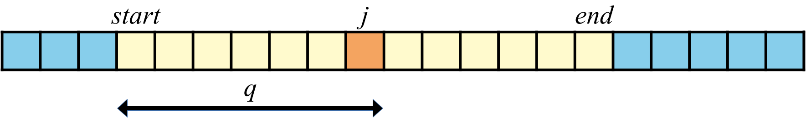
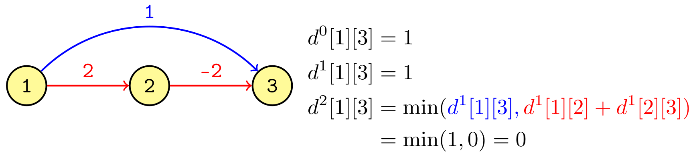
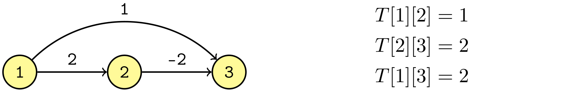
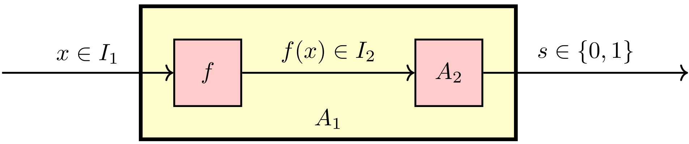
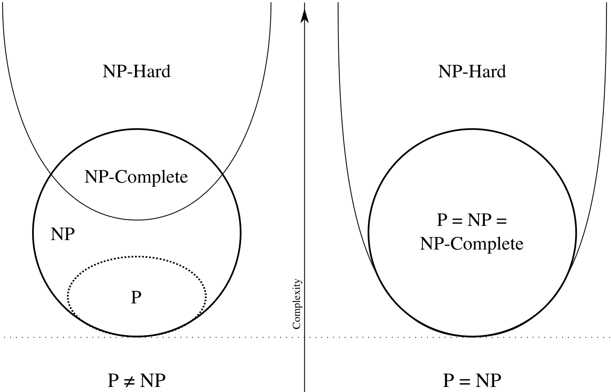
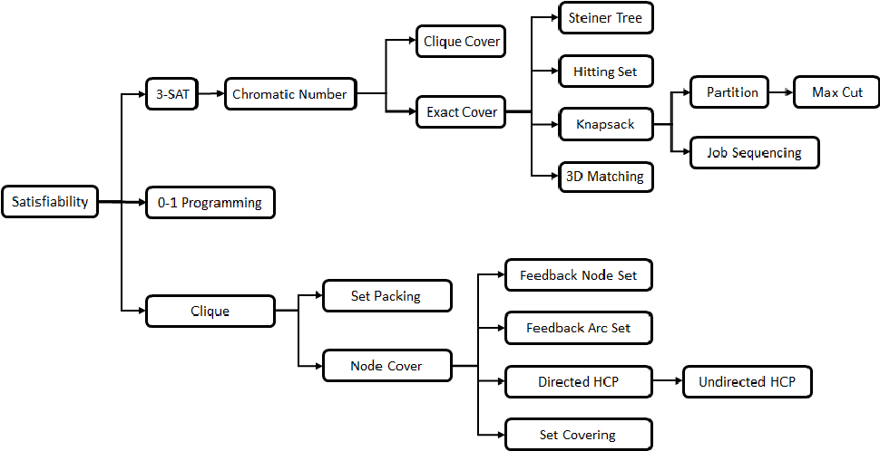

# <u>ASD</u> – Problemi - 2

|      |                   |                                                              |
| ---- | :---------------: | -----------------------------------------------------------: |
| ASD  | Problemi - 2 | [ ][root][](http://cricca.disi.unitn.it/montresor/teaching/asd/materiale/) |

[TOC]


# [6.][pdf-6] Backtracking

## Introduzione

### Soluzioni ammissibili

> <u>Definizione</u>  (**Soluzione ammissibile**)
>
> Dato un problema, una soluzione ammissibile è una soluzione che soddisfa un insieme di criteri

- Nei problemi di **ottimizzazione**, viene definita una **funzione di costo/guadagno** definita sull’insieme delle soluzioni ammissibili per **valutarle**


### Brute force -- Esplorazione

In alcuni **problemi** è richiesto o necessario **esplorare l’intero spazio** delle soluzioni ammissibili

- **Enumerazione**
  - Elencare tutte le soluzioni ammissibili
  - <u>Soluzione</u>: algoritmi di enumerazione
- **Ricerca**
  - Trovare una soluzione ammissibile in uno spazio molto grande
  - <u>Soluzione</u>: prima soluzione trovata da algoritmi di enumerazione
- **Conteggio**
  - Contare tutte le soluzioni ammissibili
  - <u>Soluzione</u>: enumerare tutte le soluzioni ammissibili e contarle
- **Ottimizzazione**
  - Trovare una delle soluzioni ammissibili migliori rispetto ad un certo criterio di valutazione
  - <u>Soluzione</u>: enumerare tutte le soluzioni ammissibili e restituire quella ottima

<p/>

Lo **spazio** delle possibili soluzioni può avere dimensione **superpolinomiale**

- A volte è l’unica strada possibile
- A volte non deve essere analizzato interamente


### Backtracking

- **Ricorsione**

  Un metodo **sistematico** per esplorare uno spazio di ricerca, utilizzando la ricorsione per memorizzare le scelte fatte finora

- **Iterazione**

  Utilizza un approccio **greedy**, eventualmente tornando sui propri passi

  - Inviluppo convesso
  - String matching


## Enumerazione

### Organizzazione generale

- Una **soluzione** viene rappresentata come un **vettore di scelte** $S[1 . . . n]$
- Il **contenuto** degli elementi $S[i]$ è preso da un **insieme di scelte** $C$ dipendente dal problema

~~<u>Esempi</u>~~

| ~~Insieme di scelte $C$~~  | ~~Possibili soluzioni~~ |
| -------------------------- | ----------------------- |
| ~~Elementi di un insieme~~ | ~~Sottoinsiemi di $C$~~ |
| ~~Elementi di un insieme~~ | ~~Permutazioni di $C$~~ |
| ~~Mosse di gioco~~         | ~~Sequenze di mosse~~   |
| ~~Archi di un grafo~~      | ~~Percorsi sul grafo~~  |


### ==Schema==

```pseudocode
bool enumeration(⟨dati problema⟩, Item[] S, int i, ⟨dati parziali⟩)

    /* Verifica se S[i...i-1] contiene una soluzione ammissibile */
    if accept(⟨dati problema⟩, S, i, ⟨dati parziali⟩) then
        /* Processa la soluzione (stampa, conta, etc.) */
        processSolution(⟨dati problema⟩, S, i, ⟨dati parziali⟩)
        return true  /* Soluzione trovata */
    
    /* Impossibile trovare soluzioni */
    else if reject(⟨dati problema⟩, S, i, ⟨dati parziali⟩) then
        return false
        
    else
        /* Calcola il set delle scelte in funzione di S[1...i-1] */
        Set C = choices(⟨dati problema⟩, S, i, ⟨dati parziali⟩)
        /* Itera sull’insieme delle scelte */
        foreach c ∈ C do
            S[i] = c
            /* Chiamata ricorsiva */
            if enumeration(⟨d. prob⟩, S, i + 1, ⟨d. parz⟩) then
                return true  /* Soluzione trovata */
        return false  /* Nessuna soluzione */
```


#### ==Soluzioni parziali==

- Il parametro $i$ rappresenta l’indice della **prossima decisione** da prendere
- La **soluzione parziale** $S[1 . . . i − 1]$ contiene le decisioni prese finora
- <u>Caso base</u>
  - Se $S[1 . . . i − 1]$ è una **soluzione ammissibile**, questa viene processata
  - Assumendo che le soluzioni ammissibili non possano essere estese, la ricorsione termina
- <u>Passo ricorsivo</u>
  - Altrimenti, calcoliamo l’insieme $C$ delle **scelte possibili**
  - Per ogni elemento $c ∈ C$
    - Scriviamo $c$ sulla scelta $S[i]$
    - Chiamiamo ricorsivamente la funzione con indice $i + 1$


### Albero delle decisioni

| Struttura           |      |      | Problema                 |
| ------------------- | ---- | ---- | ------------------------ |
| Albero di decisione | ≡    |      | Spazio di ricerca        |
| Radice              | ≡    |      | Soluzione parziale vuota |
| Nodi interni        | ≡    |      | Soluzioni parziali       |
| Foglie              | ≡    |      | Soluzioni ammissibili    |


### Sottoinsiemi

> <u>Problema</u>  (**Sottoinsiemi**)
>
> Elencare tutti i sottoinsiemi dell’insieme $\{1, . . . , n\}$

<p>

#### Ricorsiva

```pseudocode
void subsetsRec(int n, int[] S, int i)
    /* S ammissibile dopo n scelte */
    if i > n then
        processSolution(S, n)
    else
        /* Non presente / presente */
        foreach c ∈ {0, 1} do
            S[i] = c
            subsetsRec(n, S, i + 1)

void subsets(int n)
    /* Vettore delle scelte */
    int[] S = new int[1 ... n]
    subsetsRec(n, S, 1)

void processSolution(int[] S, int n)
    print("{ ")
    for i = 1 to n do
        if S[i] then
            print(i + ", ")
    println("}")
```

<u>Complessità</u>:  $Θ(n ·2^n)$

- Come richiesto dal problema, **tutto lo spazio** possibile viene esplorato

[Esempio (slide 11)][pdf-6]

<p/>


#### Iterativa

```pseudocode
void subsets(int n)
    for j = 0 to 2^n - 1 do
        print("{")
        for i = 0 to n - 1 do
            if (j & 2^i) != 0 then  /* bitwise and */
                print(i + ", ")
        println("}")
```

<u>Complessità</u>:  $Θ(n ·2^n)$


### Permutazioni

> <u>Problema</u>  (**Permutazioni -- Insieme**)
>
> Stampare di tutte le permutazioni di un insieme $A$

```pseudocode
void permRec(Set A, Item[] S, int i)
    /* Se A è vuoto, S è ammissibile */
    if A.isEmpty() then
        println S
    else
        /* Copia A per il ciclo foreach */
        Set C = copy(A)
        foreach c ∈ C do
            S[i] = c
            A.remove(c)
            permRec(A, S, i + 1)
            A.insert(c)

void permutations(Set A)
    int n = size(A)
    int[] S = new int[1 ... n]
    permRec(A, S, 1)
```

<u>Complessità</u>

- Costo della stampa:  $Θ(n)$
- Costo delle copie del vettore:  $\sum_{i=1}^nO(i)=O(n^2)$
  - Lungo un cammino radice-foglia
- Numero di foglie:  $n!$
- **Costo totale**:  $O(n^2 n!)$

[Esempio (slide 14)][pdf-6]

<p/>

#### Vettore


> <u>Problema</u>  (**Permutazioni – Vettore**)
>
> Stampare di tutte le permutazioni di un vettore $S$

```pseudocode
void permRec(Item[] S, int i)
    /* Caso base, un carattere */
    if i == 1 then
        println S
    else
        for j = 1 to i do
            swap(S, i, j)
            permRec(S, i - 1)
            swap(S, i, j)

void permutations(Item[] S, int n)
    permRec(S, n)
```

<u>Complessità</u>

- $n!$ permutazioni
- $Θ(n)$ per stamparle tutte
- $2n$ swap per ogni permutazione
- Costo totale:  $Θ(n · n!)$


### $k$-sottoinsiemi

> <u>Problema</u>  (**$k$-sottoinsiemi**)
>
> Elencare tutti i sottoinsiemi di $k$ elementi di un insieme $\{1, . . . , n\}$

```pseudocode
void kssRec(int n, int missing, int[] S, int i)
    if missing == 0 then
        processSolution(S, i - 1)
    else if i <= n and 0 < missing <= n - (i - 1) then
        foreach c ∈ {0, 1} do
            S[i] = c
            kssRec(n, missing - c, S, i + 1)

void kSubsets(int n, int k)
    int[] S = new int[1...n]
    return kssRec(n, k, S, 1)

/*int count(int[] S, int n)  // ???
    int count = 0
    for j = 1 to n do
        count += S[j]
    return count*/
```

<u>Complessità</u>:  $T(n)=O(2^n)$

<u>Pruning</u>: evitare di

- Ricontare i **bit $1$**
- Proseguire quando si incontra una soluzione **ammissibile**
  - Nodi in cui $missing=0$ per la prima volta
- Proseguire in rami che **non** possono dare origine alla **soluzione**
  - La **valutazione** viene fatta nelle **soluzioni parziali** radici del sottoalbero

[Esempio (slide 25)][pdf-6]
[Pruning (slides 19-27)][pdf-6]


### Somma di sottoinsieme

> <u>Problema</u>  (**Somma di sottoinsieme**)
>
> Verificare che, dati un vettore $A$ con $n$ interi positivi ed un intero positivo $k$
> $$
> \exist S ⊆ \{1 . . . n\}\ : \ \sum_{i\in S}A[i]=k
> $$

- Non siamo interessati a tutte le soluzioni, ne basta una
  - Si interrompe l’esecuzione alla **prima soluzione** trovata

```pseudocode
bool ssRec(int[] A, int n, int missing, int[] S, int i)
    if missing == 0 then
        processSolution(S, i - 1)  /* Stampa indici soluzione */
        return true
    else if i > n or missing < 0 then
        return false  /* Terminati i valori o somma eccessiva */
    else
        foreach c ∈ {0, 1} do
            S[i] = c
            if ssRec(A, n, missing - A[i] * c, S, i + 1) then
                return true
        return false

void subsetSum(int[] A, int n, int k)
    int[] S = new int[1 ... n]
    ssRec(A, n, k, S, 1)
```

<u>Complessità</u>:  $T(n)=O(2^n)$

- Avendo informazioni sulle **somme cumulative** è possibile potare ulteriormente


### $n$ regine

> <u>Problema</u>  (**Delle $n$ regine**)
>
> Posizionare $n$ regine in una scacchiera $n × n$, in modo tale che nessuna si minacci a vicenda
>
> <p/>
>
> <u>Idee</u>
>
> - **Non** mettere regine in **caselle precedenti** a quelle già scelte
>   - Matrice $n×n$ rappresentata come **array** di dimensione $n^2$
> - Ogni **riga e colonna** della scacchiera deve contenere esattamente una regina
>
> |                                            |                                                              |
> | ------------------------------------------ | ------------------------------------------------------------ |
> | $S[1 . . . n]$ coordinate in $\{1 ... n\}$ | $S[i]$ colonna della regina $i$, dove ${\rm riga} = i$<br>Permutazione di $\{1 . . . n\}$ |
> | Controllo soluzione                        | Se  $i = n$                                                  |
> | ${\tt choices}(S, n, i)$                   | $\{1 ... n\}$                                                |
> | Pruning                                    | Restituisce le colonne legali<br>Elimina le diagonali        |
> | # soluzioni                                | $n!$                                                         |
>
> - Numero minore di soluzioni **effettivamente visitate**
>
> [Pruning (slides 35-39)][pdf-6]

```pseudocode
void queens(int n, int[] S, int i)
    if i > n then
        print S
    else
        for j = 1 to n do  /* Prova la regina nella colonna j */
            bool legal = true
            for k = 1 to i - 1 do /* Verifica regine precedenti */
                if S[k] == j or
                   S[k] == j + i - k or
                   S[k] == j - i + k then
                    legal = false
            if legal then
                S[i] = j
                queens(n, S, i + 1)
```

<p/>

#### Euristica

> <u>Algoritmo</u>  (**Minimum-conflicts heuristic**)
>
> 1. Si parte da una soluzione iniziale “ragionevolmente buona”
> 2. Si muove il pezzo con il più grande numero di conflitti nella casella della stessa colonna che genera il numero minimo di conflitti
> 3. Si ripete fino a quando non ci sono più pezzi da muovere

- Algoritmo in **tempo lineare**
- Non garantisce che il risultato sia corretto


### Sudoku

```pseudocode
bool sudoku(int[][] S, int i)
    if i == 81 then
        processSolution(S, n)
        return true
    int x = i mod 9
    int y = floor(i / 9)
    Set C = moves(S, x, y)
    int old = S[x][y]
    foreach c ∈ C do
        S[x][y] = c
        if sudoku(S, i + 1) then
            return true
    S[x][y] = old
    return false

Set moves(int[][] S, int x, int y)
    Set C = Set()
    if S[x][y] != 0 then
        /* Numero pre-inserito */
        C.insert(S[x][y])
    else
        /* Verifica conflitti */
        for c = 1 to 9 do
            if check(S, x, y, c) then
                C.insert(c)
    return C

bool check(int[][] S, int x, int y, int c)
    for j = 0 to 8 do
        if S[x][j] == c then  /* Controllo sulla colonna */
            return false
        if S[j][y] == c then  /* Controllo sulla riga    */
            return false
    int bx = floor(x / 3)
    int by = floor(y / 3)
    for ix = 0 to 2 do
        for iy = 0 to 2 do  /* Controllo sulla sottotabella */
            if S[bx * 3 + ix][by * 3 + iy] = c then
                return false
    return true
```

- È possibile **generalizzare** per $n = k^2$
- Esistono **tecniche euristiche** per fissare ulteriori numeri
  - Possono **risolvere completamente** il problema
  - Possono essere usate come **pre-processamento**


### Triomini

> <u>Problema</u>  (**Triomini**)
>
> - Si consideri una scacchiera $n × n$, con $n = 2^k$
> - Qualsiasi scacchiera di questo tipo con una cella rimossa può essere ricoperta da triomini a forma di L
> - Trovare un algoritmo che trovi una possibile ricopertura della scacchiera


### Knight tour

> <u>Problema</u>  (**Knight tour**)
>
> - Si consideri una scacchiera $n× n$
> - Trovare un un percorso di mosse valide del cavallo in modo che ogni casella venga visitata al più una volta
>
> <p/>
>
> <u>Soluzione</u>
>
> Matrice $n × n$ le cui celle contengono
>
> - $0$  se la cella non è mai stata visitata
> - $i$  se la cella è stata visitata al passo $i$-esimo

```pseudocode
bool knightTour(int[][] S, int i, int x, int y)
    /* i = 64 --> 63 mosse, completato un tour (aperto) */
    if i == 64 then
        processSolution(S)
        return true
    Set C = moves(S, x, y)
    foreach c ∈ C do
        S[x][y] = i
        if knightTour(S, i + 1, x + mx[c], y + my[c]) then
            return true
        S[x][y] = 0
    return false

Set moves(int[][] S, int x, int y)
    Set C = Set()
    for int i = 1 to 8 do
        nx = x + mx[i]
        ny = y + my[i]
        if 1 <= nx <= 8 and 1 <= ny <= 8 and S[nx][ny] == 0 then
            C.insert(i)
    return C
```

$$
m_x = \{−1, +1, +2, +2, +1, −1, −2, −2\}\\
m_y = \{−2, −2, −1, +1, +2, +2, +1, −1\}
$$

- Ad ogni passo ci sono al massimo **$8$ caselle possibili**
  - Ne vengono visitate al più $8^{63} ≈ 7.84·10^{56}$
- Il **pruning** riduce le visite
  - Resta comunque un problema non affrontabile per valori grandi di $n$
- È un esempio del più generale "**problema del cammino hamiltoniano**"
  - Non esistono soluzioni polinomiali
- Per questo particolare problema esistono algoritmi di **costo lineare** nel numero di caselle, basati su **divide-impera**


### Labirinti

> <u>Problemi</u>  (**Labirinti**)
>
> - Generare un labirinto in una griglia $n × n$
> - Uscire da un labirinto


## Backtracking iterativo

### ==Inviluppo convesso==

> <u>Definizione</u>  (**Poligono convesso**)
>
> Un poligono nel piano è convesso se ogni segmento di retta che congiunge due punti del poligono sta interamente nel poligono stesso (bordo incluso)

> <u>Definizione</u>  (**Inviluppo convesso / Convex hull**)
>
> Dati $n$ punti $p_1 , . . . , p_n$ nel piano, con $n ≥ 3$, l’inviluppo convesso è il poligono convesso di superficie minima che li contiene tutti

> <u>Problema</u>  (**Stesso semipiano**)
>
> Data una retta definita dai punti $p_1$ e $p_2$, determinare se due punti $p$ e $q$ stanno nello stesso semipiano definito dalla retta
>
> ```pseudocode
> bool sameSide(point p1 , point p2 , point p, point q)
>        float dx  = p2.x - p1.x
>        float dy  = p2.y - p1.y
>        float dx1 = p.x  - p1.x
>        float dy1 = p.y  - p1.y
>        float dx2 = q.x  - p2.x
>        float dy2 = q.y  - p2.y
>        return (dx * dy1 - dy * dx1) * (dx * dy2 - dy * dx2) >= 0
> ```

<p/>

> <u>Algoritmo</u>  (**Inefficiente**)
>
> - Un poligono può essere rappresentato per mezzo dei suoi **spigoli**
> - Si consideri la retta che passa per una coppia di punti $p_i, p_j$, che divide il piano in due semipiani chiusi
>   - $O(n^2)$ coppie
> - Se tutti i rimanenti $n − 2$ punti si trovano nello stesso semipiano, allora lo spigolo $S_{ij}$ fa parte dell’inviluppo convesso
>
> <u>Complessità</u>:  $O(n^3)$

<p/>

> <u>Algoritmo</u>  (**Jarvis -- Gift Packing**)
>
> - <u>Punti</u> $0$, $1$
>   - Si assegna a $p_0$ il punto più a **sinistra**, appartenente all’inviluppo ($O(n)$)
>   - Si calcola l’**angolo** della retta passante per $p_0$ e **ogni altro punto** $p_j$ rispetto alla retta verticale ($O(n)$)
>   - Si seleziona come punto $p_1$ il punto con **angolo minore** ($O(n)$)
> - <u>Punto</u> $i$
>   - Si considera la **retta** $r$ passante per i punti $p_{i−1}$, $p_{i−2}$
>   - Si calcola l’**angolo** passante per $p_{i−1}$ e ogni altro punto e la retta $r$
>   - Si seleziona come punto $p_i$ il punto con **angolo minore**
> - <u>Terminazione</u>
>   - Si termina quando si torna al punto $p_0$
>
> <p/>
>
> <u>Complessità</u>:  $O(nh)$  dove $h$ è il numero di spigoli
>
> - $0$, $1$: $\: O(n)$  per ogni fase
> - $i$: $\quad\ O(n)$  per ogni spigolo

<p/>

> <u>Algoritmo</u>  (**Graham**)
>
> - <u>Fase 1</u>
>   - Il punto con **ordinata minima** fa parte dell’inviluppo convesso
>   - Si **ordinano** i punti in base all’**angolo** formato dalla retta passante per essi e il punto con ordinata minima e la retta orizzontale
> - <u>Fase 2</u>
>   - Si inseriscono $p_1$ e $p_2$ nell’inviluppo corrente
>   - Per tutti i punti $p_i = 3, . . . , n$
>     - Siano $p_{j−1}$ e $p_j$ il penultimo e ultimo vertice dell’inviluppo corrente
>     - Se ${\tt sameSide}(p_{j−1} , p_j , p_1 , p_i ) = {\tt false}$ allora elimina $p_j$ dall’inviluppo
>     - Si ripetono i due punti sopra finché $p_j$ non deve essere più eliminato
>     - Si aggiunge $p_i$ all’inviluppo corrente
>
> <p/>
>
> <u>Complessità</u>:  $O(n\log n)$
>
> - Calcolo degli angoli:  $O(n)$
> - Ordinamento:  $O(n \log n)$
> - Rimozione punti allineati:  $O(n)$
> - Ogni punto viene aggiunto/rimosso al massimo una volta:  $O(n)$

```pseudocode
Stack graham(point[] p, int n)
    int min = 1
    for i = 2 to n do
        if p[i].y < p[min].y then
            min = i
    p[1] ↔ p[min]
    { /* riordina p[2...n] in base all’angolo formato rispetto 
      all’asse orizzontale quando sono connessi con p[1] */ }
    { /* elimina eventuali punti allineati,
      tranne i più lontani da p1, aggiornando n */ }
    Stack S = Stack()
    S.push(p1)
    S.push(p2)
    for i = 3 to n do
        while !sameSide(S.top(), S.top2(), p1, pi) do
            S.pop()
        S.push(pi)
    return S
```

[Esempi (slides 54-65)][pdf-6]


# [7.][pdf-7] Algoritmi probabilistici

## Introduzione

### Casualità negli algoritmi

- **Analisi del caso medio**
  - Si calcola la media su tutti i possibili dati di ingresso in base ad una **distribuzione di probabilità**
  - e.g.: quicksort assume che tutte le permutazioni siano equiprobabili
- **Hashing**
  - Le funzioni hash equivalgono a **randomizzare le chiavi**
  - **Distribuzione uniforme**


### Algoritmi probabilistici

Il calcolo delle probabilità è applicato ai dati di **output**

- **Montecarlo**: correttezza probabilistica
- **Las Vegas**: corretti, tempo di funzionamento probabilistico


## Algoritmi Montecarlo

### Test di primalità

> <u>Problema</u>  (**Test di primalità**)
>
> Determinare se un numero in input $n$ è primo

> <u>Problema</u>  (**Fattorizzazione**)
>
>
> Elencare i fattori che compongono un numero composto

```pseudocode
bool isPrimeNaif(int n)
    for i = 2 to floor(sqrt(n)) do
        if n / i == floor(n / i) then
            return false
    return true
```


#### Fermat

> <u>Teorema</u>  (**Piccolo teorema di Fermat**)
> $$
> n\; {\sf primo}\ \Rarr\ ∀b\in[2,n),\ \ b^{n−1}\ {\rm mod}\ n = 1
> $$

```pseudocode
bool isPrimeFermat(int n)
    for i = 1 to k do  /* k numero arbitrariamente grande */
        b = random(2, n - 1)
        if b^(n - 1) mod n != 1 then
            return false
    return true
```

<u>Correttezza</u>

| Output      | $n$                  |
| ----------- | -------------------- |
| $\tt false$ | Sicuramente composto |
| $\tt true$  | Possibilmente primo  |

Esistono **numeri composti** tali che

- **Pseudo-primi in base $b$**: $\ \ \: ∃b\in[2,n-1)\ : \ b^{n−1}\ {\rm mod}\ n = 1$
- **Numeri di Carmichael**: $\quad\, ∀b\in[2,n-1)\ : \ b^{n−1}\ {\rm mod}\ n = 1$


#### Miller-Rabin

> <u>Teorema</u>  (**Miller-Rabin**)
>
> Se $n$ è **primo** allora $∀b\in[2,n-1]$ valgono **entrambe** le seguenti condizioni
>
> - ${\rm mcd}(n, b) = 1$
> - $b^m\ {\rm mod}\ n = 1\ ∨\ ∃i\in[0,v-1]\ :\ b^{m·2^i} \ {\rm mod}\ n = n − 1$
>
> Con $n − 1 = m · 2^v$, $m$ dispari
>
> <p/>
>
>
> <u>Contrapposizione</u>
>
> Se $\exist b\in[2,n)$ tale che **almeno una** delle seguenti condizioni è vera
>
> - ${\rm mcd}(n, b) \ne 1$
> - $b^m\ {\rm mod}\ n \ne 1\ ∧\ ∀i\in[0,v-1]\ :\ b^{m·2^i} \ {\rm mod}\ n \ne n − 1$
>
> Allora $n$ è **composto**

> <u>Procedura</u>  (**Verifica primalità $n$**)
>
> - Sia $n$ un numero dispari
> - Sia $n − 1 = m · 2^v$, con $m$ dispari
> - Allora $n − 1$ in binario è pari a $m$ in binario seguito da $v$ zeri
> - Se esiste $b$ che rispetta la contrapposizione sopra, allora $n$ è **composto**
> - $b$ è chiamato
>   - **Witness** (testimone) se rispetta la contrapposizione
>   - **Strong liar **se non la rispetta, ma $n$ è composto
>     - Esiste un altro valore di $b$ che la rispetti

```pseudocode
bool isPrime(int n)
    for i = 1 to k do
        b = random(2, n - 1)
        if isComposite(n, b) then
            return false
    return true
```

- <u>Complessità</u>:  $O(k \log^2 n· (\log \log n)· (\log \log \log n))$
- <u>Probabilità di errore</u>:  $(1/4)^k$
  - Rabin ha dimostrato che se $n$ è composto, allora esistono **almeno $3/4 (n− 1)$ testimoni** in $[2, . . . , n − 1]$


### Espressione polinomiale nulla

> <u>Problema</u>  (**Espressione polinomiale nulla**)
>
> Data un’espressione algebrica polinomiale $p(x_1 , . . . , x_n )$ in $n$ variabili, determinare se $p$ è identicamente nulla oppure no
>
> <p/>
>
>
> <u>Discussione</u>
>
> - Assumiamo che non sia in forma di monomi, altrimenti è banale
> - Gli algoritmi basati su semplificazioni sono molto complessi
>
> <p/>
>
>
> <u>Algoritmo</u>
>
> - Si genera una $n$-pla di valori $v_1 , . . . , v_n$
> - Si calcola $x = p(v_1 , . . . , v_n)$
>   - Se $x \ne 0$, $p$ non è identicamente nulla
>   - Se $x = 0$, $p$ potrebbe essere identicamente nulla
> - Se ogni $v_i$ è un valore intero compreso casuale fra $1$ e $2d$, dove $d$ è il grado del polinomio, allora la probabilità di errore non supera $1/2$
> - Si ripete $k$ volte, riducendo la probabilità di errore a $(1/2)^k$


## Algoritmi Las Vegas

### Statistica

**Algoritmi statistici su vettori** estraggono alcune caratteristiche statisticamente rilevanti da un vettore numerico

- **Media**: $\quad\:\ \ µ = \frac1n \sum_{i=1}^nA[i]$
- **Varianza**:  $\ σ^2 =\frac1n \sum_{i=1}^n (A[i] − µ)^2$
- **Moda**:        il valore/i più frequente/i


### ==Statistiche d’ordine==

> <u>Problema</u>  (**Selezione**)
>
> Dato un array $A$ contenente $n$ valori e un valore $k\in [1,n]$, trovare l’elemento che occuperebbe la posizione $k$ se il vettore fosse ordinato

> <u>Problema</u>  (**Mediana**)
>
> Sottoproblema del problema della selezione con $k = \lceil n/2\rceil$


### ==Selezione per piccoli valori di $k$==

<u>Intuizione</u>

- Utilizzare uno **heap**
- L’algoritmo può essere generalizzato a **valori generici di $k > 2$**

```pseudocode
int heapSelect(Item[] A, int n, int k)
    buildHeap(A)
    for i = 1 to k - 1 do
        deleteMin(A, n)
    return deleteMin(A, n)
```

<u>Complessità</u>

- $O(n + k \log n)$
- Se $k = O(n/ \log n)$, il costo è $O(n)$
- Se $k = n/2$ non va bene


### ==Selezione==

<u>Idea</u>

- Approccio **divide-et-impera**
  - Simile al quicksort
- Essendo un **problema di ricerca**, è sufficiente cercare in una sola di esse
- Bisogna fare attenzione agli **indici**

```pseudocode
Item selection(Item[] A, int first, int last , int k)
    if first == last then
        return A[first]
    else
        int j = pivot(A, first, last)
        int q = j - first + 1
        if k == q then
            return A[j]
        else if k < q then
            return selection(A, first, j - 1, k)
        else
            return selection(A, j + 1, last , k - q)
```



<u>Complessità</u>

- Caso pessimo

$$
\begin{align}
& T(n)=
\begin{cases}
1 & n\le 1 \\
T(n-1)+n & n>1
\end{cases}\\[4px]
& T(n)=O(n^2)
\end{align}
$$

- Caso ottimo

$$
\begin{align}
& T(n)=
\begin{cases}
1 & n\le 1 \\
T(n/2)+n & n>1
\end{cases}\\[4px]
& T(n)=O(n)
\end{align}
$$

- Caso medio

$$
\begin{align}
T(n)\; &=\; n+\frac1n\sum_{q=1}^nT(\max(q-1, n-q)) && \text{media su }n\text{ casi}\\[2px]
&\le\; n+\frac1n\sum_{q=\lfloor n/2\rfloor}^{n-1}2T(q) && \text{per }n>1\\
&=\;O(n)
\end{align}
$$

<u>Osservazioni</u>

- Se non vale l'assunzione $j$ assume **equiprobabilisticamente** tutti i valori in $[1,n]$, essa viene **forzata**
  - $A[{\tt random}(start, end )] ↔ A[start]$
  - Questo accorgimento vale anche per quicksort
- <u>Complessità nel caso medio</u>
  - **Selezione**: $\quad\ \,\ O(n)$
  - **Ordinamento**: $\ O(n \log n)$


### Selezione deterministica

<u>Idea</u>

Supponendo di avere un **algoritmo black-box** che ritorni un valore che dista al più $\frac3{10}n$ dal mediano (nell’ordinamento) in tempo $O(n)$

- **Suddividere** i valori in gruppi di $5$
- Sia $S_i$ l’$i$-esimo gruppo $S_i$, con $i ∈ [1, \lceil n/5\rceil]$
- Trovare il **mediano** $M_i$ di ogni gruppo $S_i$
- Tramite una **chiamata ricorsiva**, trovare il mediano $m$ delle mediane $[M_1, M_2 , . . . , M_{\lceil n/5\rceil}]$
- Richiamare l’algoritmo ricorsivamente sull’array opportuno, con $m$ come pivot
  - Come nella `selection()` randomizzata
- Quando la dimensione scende sotto una certa dimensione, possiamo utilizzare un algoritmo di ordinamento per trovare il mediano

```pseudocode
Item select(Item[] A, int first, int last, int k)
    /* Se la dimensione è inferiore ad una soglia (10),
     * ordina il vettore e 
     * restituisci il k-esimo elemento di A[first...last] */
    if last - first + 1 <= 10 then
        insertionSort(A, first, last)
        return A[first + k - 1]
    /* Divide A in ⌈n/5⌉ sottovettori di dimensione 5
     * e ne calcola la mediana */
    M = new int[1...⌈n/5⌉]
    for i = 1 to ⌈n/5⌉ do
        M[i] = median5(A, first + (i - 1) * 5, last)
    /* Individua la mediana delle mediane e usala come perno */
    Item m = select(M, 1, ⌈n/5⌉, ⌈⌈n/5⌉ / 2⌉)
    int j = pivot(A, first, last, m)  /* versione con m in input */
    /* Calcola l’indice q di m in[first...last] */
    /* Confronta q con l’indice cercato e ritorna il valore */
    int q = j - first + 1
    if q == k then
        return m
    else if q < k then
        return select(A, first, q - 1, k)
    else
        return select(A, q + 1, last, k - q)
```

<u>Osservazioni</u>

- Il calcolo dei mediani $M [\,]$ richiede al più $6⌈n/5⌉$ confronti
- La prima chiamata ricorsiva viene effettuata su $⌈n/5⌉$ elementi
- La seconda chiamata ricorsiva viene effettuata al massimo su $7n/10$ elementi
  - Esattamente $n − 3⌈⌈n/5⌉/2⌉$
- <u>Caso pessimo</u>:  $O(n)$ confronti

$$
T (n) = T (n/5) + T (7n/10) + 11/5n
$$


# [8.][pdf-8] Scelta struttura -- Cammini minimi

## Introduzione

### ==Problema==

> <u>Problema</u>  (**Cammini minimi**)
>
> - <u>Input</u>
>
>   - Grafo orientato $G = (V, E)$
>   - Un nodo sorgente $s$
>   - Una funzione di peso $w : E → \R$
>
> - <u>Definizione</u>
>
>   Dato un cammino $p = \lang v_1 , v_2 , . . . , v_k\rang$ con $k > 1$, il costo del cammino è
>   $$
>   w(p)=\sum_{i=2}^k w(v_{i-1},v_i)
>   $$
>
>
> - <u>Output</u>
>   
>   Trovare un cammino da $s$ ad $u$, per ogni nodo $u ∈ V$, il cui costo sia minimo, ovvero più piccolo o uguale del costo di qualunque altro cammino da $s$ a $u$


### ==Panoramica==

> <u>Problema</u>  (**Cammini minimi da sorgente unica**)
>
> - <u>Input</u>: grafo pesato, nodo radice $s$
> - <u>Output</u>: i cammini minimi che vanno da $s$ a tutti gli altri nodi

> <u>Problema</u>  (**Cammino minimo tra una coppia di vertici**)
>
> - <u>Input</u>: grafo pesato, una coppia di vertici $s$, $d$
> - <u>Output</u>: un cammino minimo fra $s$ e $d$
> - <u>Soluzione</u>: si risolve il primo problema e si estrae il cammino richiesto

> <u>Problema</u>  (**Cammini minimi tra tutte le coppie di vertici**)
>
> - <u>Input</u>: grafo pesato
> - <u>Output</u>: un cammino minimo fra ogni coppia $s$ e $d$
> - <u>Soluzione</u>: basata su programmazione dinamica


### Tipologie di pesi

Algoritmi diversi possono funzionare oppure no in caso di alcune categorie speciali di pesi

- **Positivi** / **Positivi+negativi**
- **Reali** / **Interi**


## Sorgente singola

### ==Sottostruttura ottima==

Due cammini minimi

- Possono avere un **tratto in comune**
- **Non** possono **convergere** in un nodo comune dopo un tratto distinto


### ==Soluzione ammissibile==

Una soluzione **ammissibile** può essere descritta da

- **Albero di copertura $T$** radicato in $s$
- **Vettore di distanza $d$**
  - I cui valori $d[u]$ rappresentano il costo del cammino da $s$ a $u$ in $T$


### Rappresentazione albero

Si utilizza la rappresentazione basata su **vettore dei padri**

```pseudocode
void printPath(Node s, Node d, Node[] T)
    if s == d then
        print s
    else if p[d] == nil then
        print "error"
    else
        printPath(s, T[d], T)
        print d
```


### ==Teorema di Bellman==

> <u>Teorema</u>  (**di Bellman**)
>
> Una soluzione ammissibile $T$ è ottima se e solo se
>
> - $d[v] = d[u] + w(u, v)\ \ \ \forall (u, v) ∈ T$
> - $d[v] ≤ d[u] + w(u, v) \ \ \ \forall (u, v) ∈ E$
>
> <u>Dimostrazione</u> - Parte 1
>
> Se $T$ è una soluzione ottima, allora valgono le condizioni di Bellman
>
> Sia $T$ una soluzione ottima e sia $(u, v) ∈ E$
>
> - $(u, v) ∈ T\ \Rarr\ d[v] = d[u] + w(u, v)$
> - $(u, v) \notin T\ \Rarr\ d[v] ≤ d[u] + w(u, v)$
>   - Altrimenti esisterebbe nel grafo $G$ un cammino da $s$ a $v$ più corto di quello in $T$, assurdo
>
> <u>Dimostrazione</u> - Parte 2
>
> Se valgono le condizioni di Bellman allora $T$ è una soluzione ottima
>
> - Supponiamo per assurdo che il cammino $C$ da $s$ a $u$ in $T$ non sia ottimo
>
> - Allora esiste un albero ottimo $T'$ in cui il cammino $C'$ da $s$ a $u$ ha
>   distanza $d'[u] < d[u]$
>
> - Sia $d'[\,]$ il vettore delle distanze associato a $T'$
>
> - Si analizzi il primo punto in cui si osserva la differenza
>
>   - $d'[s] = d[s] = 0\ \and\ d'[u] < d[u]\ \Rarr\ \exist(h, k) \in C'\ \ |$
>     - $d'[h] ≥ d[h]$
>     - $d'[k] < d[k]$
>
> - Relazioni
>
>   - Per costruzione:  $d'[h] ≥ d[h]$
>   - Per costruzione:  $d'[k] = d'[h] + w(h, k)$
>   - Per ipotesi:           $d[k] ≤ d[h] + w(h, k)$
>
> - Combinando queste due relazioni, si ottiene
>   $$
>   d'[k] = d'[h] + w(h, k) ≥ d[h] + w(h, k) ≥ d[k]
>   $$
>
> - Quindi $d'[k] ≥ d[k]$, il che contraddice $d'[k] < d[k]$


### ==Algoritmo prototipo==

```pseudocode
(int[], int[]) prototipoCamminiMinimi(Graph G, Node s)
    int[] d = /* sovrastima della distanza (d[s] = 0, d[x] = +∞) */
    int[] T = /* foresta di copertura composta da nodi isolati   */
    while ∃(u, v) : d[u] + G.w(u, v) < d[v] do
        d[v] = d[u] + w(u, v)
        /* Sostituisci il padre di v in T con u */
    return (T, d)
```

- Se al termine dell’esecuzione qualche nodo mantiene una distanza **infinita**, esso **non è raggiungibile**
- Come implementare la condizione $∃$?


### ==Algoritmo generico==

```pseudocode
(int[], int[]) shortestPath(Graph G, Node s)
    int[] d = new int[1...G.n]    /* d[u] è la distanza da s a u */
    int[] T = new int[1...G.n]    /* T[u] è il padre di u in T   */
    bool[] b = new bool[1...G.n]  /* b[u] == true se u ∈ S       */
    foreach u ∈ G.V() − {s} do
        T[u] = nil
        d[u] = +∞
        b[u] = false
    T[s] = nil
    d[s] = 0
    b[s] = true
    
(1) DataStructure S = DataStructure()
(1) S.add(s)
    while !S.isEmpty() do
(2)     int u = S.extract()
        b[u] = false
        foreach v ∈ G.adj(u) do
            if d[u] + G.w(u, v) < d[v] then
                if !b[v] then
(3)                 S.add(v)
                    b[v] = true
                else
(4)                 /* Azione da svolgere nel caso */
(4)                 /* v sia già presente in S     */
                T[v] = u
                d[v] = d[u] + G.w(u, v)
    return (T, d)
```


### ==Dijkstra==

Nella versione originale

- Veniva utilizzata per trovare la distanza minima fra **due nodi**
- Utilizzava il concetto di **coda con priorità** (basata su vettore)

<u>Note</u>

- Funziona (bene) solo con **pesi positivi**
- ~~Utilizzato in protocolli di rete come IS-IS e OSPF~~


#### Coda con priorità basata su vettore

<u>Algoritmo generico</u>

1. **Inizializzazione**

   ```pseudocode
   PriorityQueue Q = PriorityQueue()
   Q.insert(s, 0)
   ```

   - Viene creato un vettore di dimensione $n$
   - L’indice $u$ rappresenta il nodo $u$-esimo
   - Le priorità vengono inizializzate ad $+∞$
   - La priorità di $s$ è posta uguale a $0$
   - Costo computazionale: $O(n)$

2. **Estrazione minimo**

   ```pseudocode
   int u = Q.deleteMin()
   ```

   - Si ricerca il minimo all’interno del vettore
   - Una volta trovato, si "cancella" la sua priorità
   - Costo computazionale: $O(n)$

3. **Inserimento in coda**

   ```pseudocode
   Q.insert(v, d[u] + G.w(u, v))
   ```

   - Si registra la priorità nella posizione $v$-esima
   - Costo computazionale: $O(1)$

4. **Aggiornamento priorità**

   ```pseudocode
   Q.decrease(v, d[u] + G.w(u, v))
   ```

   - Si aggiorna la priorità nella posizione $v$-esima
   - Costo computazionale: $O(1)$

[Esempio (slide 20)][pdf-6]


#### ==Correttezza==

> <u>Correttezza</u>  (**Dijkstra per pesi positivi**)
>
> - Ogni nodo viene **estratto una e una sola volta**
> - Al momento dell’estrazione la sua **distanza è minima**
>
> <u>Induzione</u> sul numero $k$ di nodi estratti
>
> - <u>Caso base</u>: vero perchè $d[s] = 0$ e non ci sono lunghezze negative
> - <u>Ipotesi induttiva</u>: vero per i primi $k − 1$ nodi
> - <u>Passo induttivo</u>: quando viene estratto il $k$-esimo nodo $u$
>   - La sua distanza $d[u]$ dipende dai $k − 1$ nodi già estratti
>   - Non può dipendere dai nodi ancora da estrarre, con distanza $≥ d[u]$
>   - Quindi $d[u]$ è minimo e $u$ non verrà più re-inserito, perchè non ci sono distanze negative


#### ==Costo computazionale==

- **Dijkstra**, 1959 – Coda con priorità basata su **vettore**

- **Johnson**, 1977 – Coda con priorità basata su **heap binario**

- **Fredman-Tarjan**, 1987 – **Heap di Fibonacci**

| Riga | Ripetizioni      | Dijkstra |      | Johnson      | Fredman-Tarjan |
| :--- | ---------------- | -------- | ---- | ------------ | -------------- |
| (1)  | $1$              | $O(n)$   |      | $O(n)$       | $O(n)$         |
| (2)  | $O(n)$           | $O(n)$   |      | $O(\log n)$  | $O(\log n)$    |
| (3)  | $O(n)$           | $O(1)$   |      | $O(\log n)$  | $O(\log n)$    |
| (4)  | $O(m)$           | $O(1)$   |      | $O(\log n)$  | $O(1)^*$       |
|      | **Costo totale** | $O(n^2)$ |      | $O(m\log n)$ | $O(m+n\log n)$ |


### ==Bellman-Ford-Moore==

- Computazionalmente più **pesante** di Dikstra
- Funziona anche con archi di **peso negativo**


#### ==Coda==

<u>Algoritmo generico</u>

1. **Inizializzazione**

   ```pseudocode
   Queue Q = Queue()
   Q.enqueue(s)
   ```

   - Viene creato una coda di dimensione $n$
   - Costo computazionale: $O(n)$

2. **Estrazione**

   ```pseudocode
   int u = Q.dequeue()
   ```

   - Viene estratto il prossimo elemento della coda
   - Costo computazionale: $O(1)$

3. **Inserimento in coda**

   ```pseudocode
   Q.enqueue(v)
   ```

   - Si inserisce l’indice v in coda
   - Costo computazionale: $O(1)$

4. **Azione nel caso $v$ sia già presente in $S$**

   - Sezione non necessaria

[Esempio (slide 30)][pdf-6]  ==DA VEDERE==


#### ==Passata==

> <u>Definizione</u>  (**Passata**)
>
> - Per $k = 0$, la $0$-esima passata consiste nell’estrazione del nodo $s$ da $S$
> - Per $k > 0$, la $k$-esima passata consiste nell’estrazione di tutti i nodi presenti in $S$ al termine della passata $k\! -\! 1$-esima.


#### ==Correttezza==

> <u>Correttezza</u>  (**BFM - intuizione**)
>
> - Al termine della passata $k$, i vettori $T$ e $d$ descrivono i cammini minimi
>   - Di lunghezza al più $k$
> - Al termine della passata $n − 1$, i vettori $T$ e $d$ descrivono i cammini minimi
>   - Di lunghezza al più $n − 1$


#### ==Costo computazionale==

| Riga |      | Ripetizioni      | Bellman-Ford-Moore |
| :--: | ---- | ---------------- | ------------------ |
| (1)  |      | $1$              | $O(1)$             |
| (2)  |      | $O(n^2)$         | $O(1)$             |
| (3)  |      | $O(nm)$          | $O(1)$             |
|      |      | **Costo totale** | $O(nm)$            |

- Ogni nodo può essere **inserito ed estratto** al massimo **$n − 1$ volte**


### ==Casi speciali – DAG==

<u>Osservazione</u>

- I cammini minimi in un DAG sono sempre **ben definiti**
  - Anche in presenza di **pesi negativi**, non esistono cicli negativi
- È possibile rilasciare gli archi in **ordine topologico**, **una volta sola**
  - Non essendoci cicli, non c’è modo di tornare su un nodo già visitato e abbassare il valore del suo campo $d$

<u>Algoritmo</u>

- Si utilizza l’**ordinamento topologico**

```pseudocode
(int[], int[]) shortestPath(Graph G, Node s)
    int[] d = new int[1...G.n]  /* d[u] è la distanza da s a u */
    int[] T = new int[1...G.n]  /* T[u] è il padre di u in T   */
    foreach u ∈ G.V() − {s} do
        d[u] = +∞
        T[u] = nil
    d[s] = 0
    T[s] = nil
    Stack S = topsort(G)
    while not S.isEmpty() do
        u = S.pop()
        foreach v ∈ G.adj(u) do
            if d[u] + G.w(u, v) < d[v] then
                d[v] = d[u] + G.w(u, v)
                T[v] = u
    return (T, d)
```


### ==Riassunto==

| Algoritmo      | Complessità    | Applicazioni                                        |
| -------------- | -------------- | --------------------------------------------------- |
| Dijkstra       | $O(n^2)$       | Pesi positivi, grafi densi                          |
| Johnson        | $O(m\log n)$   | Pesi positivi, grafi sparsi                         |
| Fredman-Tarjan | $O(m+n\log n)$ | Pesi positivi, grafi densi, dimensioni molto grandi |
| Bellman-Ford   | $O(mn)$        | Pesi negativi                                       |
| Topsort        | $O(m+n)$       | DAG                                                 |
| BFS            | $O(m+n)$       | Senza pesi                                          |


## Sorgente multipla

### ==Possibili soluzioni==

| Input                       | Complessità      | Approccio                                               |
| --------------------------- | ---------------- | ------------------------------------------------------- |
| Pesi positivi, grafo denso  | $O(n·n^2)$       | Applicazione ripetuta dell’algoritmo di Dijkstra        |
| Pesi positivi, grafo sparso | $O(n·(m\log n))$ | Applicazione ripetuta dell’algoritmo di Johnson         |
| Pesi negativi               | $O(n·nm)$        | Applicazione ripetuta di Bellman-Ford, **sconsigliata** |
| Pesi negativi, grafo denso  | $O(n^3)$         | Algoritmo di Floyd e Warshall                           |
| Pesi negativi, grafo sparso | $O(nm\log n)$    | Algoritmo di Johnson per sorgente multipla              |


### ==Floyd-Warshall==

#### ==Definizioni==

Assumiamo che esista un **ordinamento** fra i nodi del grafo $v_1 , v_2 , . . . , v_n$

> <u>Definizione</u>  (**Cammini minimi $k$-vincolati**)
>
> Sia $k$ un valore in $\{0, . . . , n\}$. Diciamo che un cammino $p^k_{xy}$ è un cammino minimo $k$-vincolato fra $x$ e $y$ se esso ha il costo minimo fra tutti i cammini fra $x$ e $y$ che non passano per nessun vertice in $v_{k+1} , . . . , v_n$ ($x$ e $y$ sono esclusi dal vincolo)

> <u>Definizione</u>  (**Distanza $k$-vincolata**)
>
> Denotiamo con $d^k[x][y]$ il costo totale del cammino minimo $k$-vincolato fra $x$ e $y$, se esiste
> $$
> d^k[x][y]=
> \begin{cases}
> w(p^k_{xy}) & \text{se esiste } p^k_{xy} \\
> +\infin & \rm altrimenti
> \end{cases}
> $$


#### ==Formulazione ricorsiva==

$$
d^k[x][y]=
\begin{cases}
w(x,y) & k=0 \\
\min(d^{k-1}[x][y],\; d^{k-1}[x][k]+d^{k-1}[k][y]) & k>0
\end{cases}
$$



- Minimo fra
  - Cammino $k\! -\! 1$-vincolato
  - Cammino $k$-vincolato passante per $k$


#### ==Matrice dei padri==

Oltre a definire la matrice $d$, calcoliamo una matrice $T$ dove $T[x][y]$ rappresenta il predecessore di $y$ nel cammino più breve da $x$ a $y$




#### ==Programmazione dinamica==

```pseudocode
(int[][], int[][]) floydWarshall(Graph G)
    int[][] d = new int[1...n][1...n]
    int[][] T = new int[1...n][1...n]
    foreach u, v ∈ G.V() do
        d[u][v] = +∞
        T[u][v] = nil
    foreach u ∈ G.V() do
        foreach v ∈ G.adj(u) do
            d[u][v] = G.w(u, v)
            T[u][v] = u
            
    for k = 1 to G.n do
        foreach u ∈ G.V() do
            foreach v ∈ G.V() do
                if d[u][k] + d[k][v] < d[u][v] then
                    d[u][v] = d[u][k] + d[k][v]
                    T[u][v] = T[k][v]
    return (d, T)
```


### Chiusura transitiva -- Warshall

> <u>Definizione</u>  (**Chiusura transitiva**)
>
> La chiusura transitiva $G^∗ = (V, E^∗)$ di un grafo $G = (V, E)$ è il grafo orientato tale che $(u, v) ∈ E^∗$ se e solo esiste un cammino da $u$ a $v$ in $G$

Supponendo di avere il grafo $G$ rappresentato da una matrice di adiacenza $M$, la matrice $M^n$ rappresenta la matrice di adiacenza di $G^∗$
$$
M^k[x][y]=
\begin{cases}
M[x][y] & k=0 \\
M^{k-1}[x][y]\ \or\ (M^{k-1}[x][k]\ \and\ M^{k-1}[k][y]) & k>0
\end{cases}
$$


#  [9.][pdf-9] Problemi intrattabili

## Introduzione

### Classi di problemi

- Finora sono stai considerato solo problemi con soluzioni in tempo **polinomoniale**
  - Il tempo di esecuzione è $O(n^k)$ per qualche $k$
  - Ad eccezione di **backtrack**
- Esistono problemi che per essere risolti hanno bisogno di un tempo almeno **esponenziale** ($\mathbb {EXPTIME}$)
- Esistono problemi per i quali **non** (è chiaro se) esiste alcuna **soluzione**
  - **Halting problem**
  - **Classe** di problemi che possono essere **tutti** risolti in tempo polinomiale, oppure nessuno


### Tipologie di problemi

> <u>Definizione</u>  (**Problema astratto**)
>
> Una problema astratto è una relazione binaria $R ⊆ I × S$ tra un insieme $I$ di istanze del problema e un insieme $S$ di soluzioni

- Possono esistere **più soluzioni** associate alla stessa istanza

> <u>Definizione</u>  (**Problema di ricerca**)
>
> Data un’istanza, trovare una possibile soluzione fra quelle esistenti
>
> <u>Esempio</u>:  $\tt path(G, u, v)$

> <u>Definizione</u>  (**Problema di ottimizzazione**)
>
> Data un’istanza, trovare la "migliore" soluzione secondo criteri specifici
>
> <u>Esempio</u>:  $\tt shortestPath(G, u, v)$

> <u>Definizione</u>  (**Problema di decisione**)
>
> Data un’istanza, verificare se soddisfa o meno una data proprietà
>
> La relazione $R$ è una funzione $R : I → \{0, 1\}$
>
> <u>Esempio</u>:  $\tt shortestPath(G, u, v, k)$

<p/>


> <u>Definizione</u>  (**Packing problem**)
>
> Problema in cui si cerca di selezionare il maggior numero di oggetti, la cui scelta è soggetta a vincoli di esclusione
>
> <u>Esempio</u>:  $\tt independentSet()$

> <u>Definizione</u>  (**Covering problem**)
>
> Problema in cui si cerca di ottenere il più piccolo insieme in grado di coprire un insieme arbitrario di oggetti con il più piccolo sottoinsieme di questi oggetti
>
> <u>Esempio</u>:  $\tt vertexCover()$


### Equivalenza ottimizzazione / decisione

Ragionare in termini di problemi di decisione

- La versione decisionale è più **semplice** da trattare **matematicamente**
- Ottimizzazione risolvibile efficientemente $⇒$ Decisione risolvibile effic.
- Decisione non risolvibile efficientemente $⇒$ Ottimizzazione non risolvibile effic.


## Riduzioni

### Riduzione polinomiale

> <u>Definizione</u>  (**Riduzione polinomiale**)
>
> Dati due problemi decisionali $R_1 ⊆ I_1 ×\{0, 1\}$ e $R_2 ⊆ I_2 ×\{0, 1\}$
> $R_1$ è riducibile polinomialmente a $R_2$ ($R_1 ≤_p R_2$) se esiste una funzione $f : I_1 → I_2$ con le seguenti proprietà:
>
> - $f$ è calcolabile in tempo polinomiale
> - Per ogni istanza $x$ del problema $R_1$ e ogni soluzione $s ∈ \{0, 1\}$, $(x, s) ∈ R_1 \iff (f(x), s) ∈ R_2$




### Colorazione di grafi

> <u>Problema</u>  ($\tt graphColoring$)
>
> Dati un grafo non orientato $G = (V, E)$ e un insieme di colori $C$, una colorazione dei vertici è un assegnamento $f : V → C$ che assegna ad ogni nodo uno dei valori in $C$, tale per cui nessuna coppia di nodi adiacenti ha lo stesso colore
>
> <p/>
>
>
> <u>Varianti</u>
>
> - <u>Ottimizzazione</u>: colorazione che necessita del numero minimo di colori
> - <u>Decisionale</u>: dato $k$, determinare se esiste una colorazione con $k$ colori


### Sudoku

> <u>Problema</u>  ($\tt sudoku$)
>
> Il problema generale del Sudoku richiede di inserire dei numeri fra $1$ e $n^2$
>
> - In una matrice di $n^2 ×n^2$ elementi
> - Suddivisa in $n×n$ sottomatrici di dimensione $n × n$
>
> In modo tale che nessun numero compaia più di una volta in ogni riga, colonna e sottomatrice
>
> <p/>
>
>
> <u>Varianti</u>
>
> - <u>Decisionale</u>, $\tt sudoku$
>   - Determinare se esiste un modo per assegnare i numeri in modo da rispettare le regole del Sudoku
> - <u>Decisionale</u>, $\tt sudokuPrecolored$
>   - Data una matrice con alcuni numeri già presenti, determinare se esiste un modo per assegnare i numeri in modo da rispettare le regole del Sudoku
>
> <p/>
>
>
> <u>Riduzione da particolare a generale</u>
>
> - <u>Riduzione</u>
>   - ${\tt sudoku} ≤_p \tt graphColoring$
>   - Soluzione per la colorazione $\Rarr$ soluzione algoritmica per il Sudoku
>
> - <u>Riduzione in tempo polinomiale</u>
>   - $V = \{(x, y)\ :\ x,y\in [1,n^2] \}$
>   - $[(x, y), (x', y' )] ∈ E \iff \bigvee$
>     - $x=x'$
>     - $y=y'$
>     - $(⌈x/n⌉ = ⌈x'/n⌉) ∧ (⌈y/n⌉ = ⌈y'/n⌉)$
>   - $C = \{1, . . . , n\}$

- <u>Applicazioni</u>
  - Assegnamento radio frequenze in un insieme di torri cellulari
  - Allocazione degli esami universitari


### Problemi duali

#### Insieme indipendente

> <u>Definizione</u>  (**Insieme indipendente**)
>
> Dato un grafo non orientato $G = (V, E)$, un insieme $S ⊆ V$ è un insieme indipendente se e solo se nessun arco unisce due nodi in $S$
> $$
> ∀(x, y) ∈ E,\ \ x \notin S\ ∨\ y \notin S
> $$

> <u>Problema</u>  ($\tt independentSet$)
>
> - <u>Ottimizzazione</u>: restituire il più grande insieme indipendente nel grafo
> - <u>Decisionale</u>: dato $k$, dire se esiste un insieme di dimensione almeno $k$

- **Packing problem**


#### Copertura di vertici

> <u>Definizione</u>  (**Copertura di vertici**)
>
> Dato un grafo non orientato $G = (V, E)$, un insieme $S ⊆ V$ è una copertura di vertici se e solo se ogni arco ha almeno un estremo in $S$
> $$
> ∀(x, y) ∈ E\ :\ x ∈ S\ ∨\ y ∈ S
> $$

> <u>Problema</u>  ($\tt vertexCover$)
>
> - <u>Ottimizzazione</u>: restituire la copertura dei vertici di dimensione minima
> - <u>Decisionale</u>: dato $k$, dire se esiste una copertura di dimensione al massimo $k$

- **Covering problem**


#### Riduzione per problemi duali

- $S ⊆ V$ è un independent set  $⇒$  $V − S$ è un vertex cover
  - Se $S$ è un insieme indipendente
    - Ogni arco $(x, y)$ non può avere entrambi gli estremi in $S$
    - Quindi almeno uno dei due deve essere in $V − S$, cvd

- $V − S$ è un vertex cover  $⇒$  $S ⊆ V$ è un independent set
  - Per assurdo $S$ non è un independent set
    - Allora esiste un arco $(x, y)$ che unisce due nodi in $S$
    - Nessuno dei due estremi sta in $V − S$
    - Questo implica che $V − S$ non è un vertex cover, assurdo

- I due problemi sono **equivalenti**
  - ${\tt vertexCover} ≤_p \tt independentSet$
  - ${\tt independentSet} ≤_p \tt vertexCover$


### SAT

> <u>Definizione</u>  (**Formule booleane in forma normale congiuntiva**)
>
> Dato un insieme $V$ contenente $n$ variabili
>
> - **Letterale**: variabile $v$ oppure la negazione $\overline v$
> - **Clausola**: disgiunzione di letterali (letterali separati da $\or$)
> - **Formula in CNF**: congiunzione di clausole (clausole separate da $\and$)

> <u>Problema</u>  (**SAT -- Soddisfattibilità di formule booleane**)
>
> Data un’espressione in CNF, decidere se esiste una assegnazione di valori di verità alle variabili che rende l’espressione vera
>
> <p/>
>
>
> <u>Riduzione da generale a particolare</u>:  ${\tt SAT} ≤_p \tt 3\text-SAT$
>
> **Trasformare** una formula SAT in una formula 3-SAT
>
> - Se la clausola è più **lunga** di tre elementi, si introduce una **nuova variabile** e si **divide** la clausola in due
>   $$
>   (a ∨ b ∨ c ∨ d) ≡ (a ∨ b ∨ z) ∧ (\overline z ∨ c ∨ d)
>   $$
>
> - Se la clausola è più **corta** di tre elementi, si fa **padding**
>   $$
>   (a ∨ b) ≡ (a ∨ a ∨ b)
>   $$

> <u>Problema</u>  (**3-SAT**)
>
> Data un'espressione in CNF in cui le ($k$) clausole hanno esattamente $3$ letterali, decidere se esiste una assegnazione di valori di verità alle variabili che rende l’espressione vera
>
> <p>
> <u>Riduzione tramite gadget</u>:  ${\tt 3\text-SAT} ≤_p \tt independentSet$
>
> Data una formula 3-SAT, costruire un **grafo** tale che
>
> - Per ogni clausola, aggiungere un **terzetto** di nodi collegati fra di loro da archi
> - Per ogni letterale che compare in modo normale e in modo negato, aggiungere un arco fra di essi (**arco di conflitto**)
>
> La formula 3-SAT è soddisfacibile se e solo è possibile trovare un independent set di dimensione esattamente $k$

<p/>


#### Transitività delle riduzioni

La nozione di riducibilità polinomiale gode della **proprietà transitiva**
$$
{\tt SAT} ≤_p {\tt 3\text-SAT} ≤_p {\tt independentSet} ≤_p \tt vertexCover
$$


## Classi $\mathbb P$,  $\mathbb {PSPACE}$

### ==Classi di complessità==

> <u>Definizione</u>  (**Algoritmo**)
>
> Dati un problema di decisione $R$ e un algoritmo $A$ (scritto in un modello di calcolo Turing-equivalente) che lavora in tempo $f_t (n)$ e spazio $f_s (n)$, diciamo che $A$ risolve $R$ se $A$ restituisce $s$ su un’istanza $x$ se e solo se $(x, s) ∈ R$

> <u>Definizione</u>  (**Classi di complessità**)
>
> Data una qualunque funzione $f (n)$, si chiami l’insieme dei problemi decisionali risolvibili da un algoritmo che lavora in
>
> - Tempo $O(f (n))$:  $\mathbb{TIME}(f (n))$
> - Spazio $O(f (n))$:  $\,\mathbb {SPACE}(f (n))$


### ==Definizioni==

> <u>Definizione</u>  (**Classe $\mathbb P$**)
>
> Classe dei problemi decisionali risolvibili in tempo polinomiale nella dimensione $n$ dell’istanza di ingresso
> $$
> \mathbb P = ∪^∞_{c=0} \mathbb {TIME}(n^c)
> $$

> <u>Definizione</u>  (**Classe $\mathbb {PSPACE}$**)
>
> Classe dei problemi decisionali risolvibili in spazio polinomiale nella dimensione $n$ dell’istanza di ingresso
> $$
> \mathbb {PSPACE} = ∪^∞_{c=0} \mathbb {SPACE}(n^c)
> $$

- $\mathbb {P \sube PSPACE}$


## Classe $\mathbb {NP}$

### ==Certificati==

> <u>Definizione</u>  (**Certificato**)
>
>
> Dato un problema decisionale $R$ e un’istanza $x$ tale che $(x, {\tt true})\! ∈\! R$, un certificato è un insieme di informazioni che permette di provare $(x, {\tt true})\! ∈\! R$

> <u>Esempi</u>  (**Certificati**)
>
> - $\tt SAT$: un assegnamento di verità alle variabili della formula
> - $\tt graphColoring$: un’associazione nodo-colore $f : V → \{1, . . . , k\}$
> - $\tt independentSet$: un sottoinsieme di $V$ di $k$ elementi
>
> I certificati suddetti
>
> - Hanno **dimensione polinomiale** nella dimensione dell’input
> - Possono essere **verificati in tempo polinomiale**
>   - $\tt sat$: si calcola il valore di verità della formula a partire dall’assegnamento di verità delle variabili in tempo $O(n)$
>   - $\tt graphColoring$: si verifica che nodi adiacenti non abbiano lo stesso colore in tempo $O(m + n)$
>   - $\tt independentSet$: si verifica che nodi in $V$ non abbiano nodi adiacenti in $V$ in tempo $O(m + n)$

> <u>Problema</u>  (**QBF -- Quantified Boolean Formula**)
>
> Generalizzazione del problema SAT nel quale ad ogni variabile possono essere applicati quantificatori universali e esistenziali

- Si ritiene che non esista un certificato che possa essere verificato in tempo polinomiale


### ==Definizioni==

> <u>Definizione</u>  (**Classe $\mathbb {NP}$**)
>
> L’insieme di tutti i problemi che ammettono un certificato verificabile in tempo polinomiale (tempo polinomiale non deterministico)

> <u>Definizione</u>  (**Classe $\mathbb {NP}$ -- Non determinismo**)
>
> L'insieme di problemi decisionali che possono essere risolti da una Macchina di Turing non deterministica in tempo polinomiale

- ~~<u>Informalmente</u>~~
  - ~~Dato uno stato ed un elemento di input, una macchina non deterministica può andare in un insieme finito di altri stati~~
  - ~~Due interpretazioni per la macchina non deterministica~~
    - ~~Macchina non deterministica che azzecca sempre la scelta giusta~~
    - ~~Macchina non deterministica che si divide in un insieme finito di copie, una per scelta possibile~~


## Problemi $\mathbb {NP}$-Completi

### Relazioni fra problemi

> <u>Lemma</u>
>
> Se $R_1 ≤_p R_2$ e $R_2 ∈ \mathbb P$, allora anche $R_1$ è contenuto in $\mathbb P$
>
> <p/>
>
> <u>Dimostrazione</u>
>
> - Sia $T_f (n) = O(n^{k_f})$ il tempo necessario per trasformare un input di $R_1$ in input di $R_2$ tramite una funzione $f$
> - Sia $T_2 (n) = O(n^{k_2})$ il tempo necessario per risolvere $R_2$
> - Il tempo per risolvere $R_1$ sarà quindi $T_1 (n) = O(n^{k_fk_2})$
> - $T_1 (n)$ è polinomiale


### ==Definizioni==

> <u>Definizione</u>  (**Problema $\mathbb {NP}$-arduo**)
>
> Problema decisionale $R$ tale per cui ogni problema $Q ∈
> \mathbb {NP}$ è riducibile polinomialmente a $R$  ($Q ≤_p R$)

> <u>Definizione</u>  (**Problema $\mathbb {NP}$-completo**)
>
> Problema decisionale $R$ che appartiene alla classe $\mathbb {NP}$ ed è $\mathbb {NP}$-arduo


### ==$\mathbb P$ vs $\mathbb {NP}$==

Se un qualunque problema decisionale $\mathbb {NP}$-completo appartenesse a $\mathbb P$, allora risulterebbe $\mathbb {P=NP}$

- **Problema irrisolto**




### Problemi $\mathbb {NP}$-completi

> <u>Problemi</u>  (**Dimostrazioni $\mathbb {NP}$**)
>
> - Dimostrare che un problema è contenuto in $\mathbb {NP}$ è semplice
> - Dimostrare che un problema è $\mathbb {NP}$-completo richiede una dimostrazione difficile, apparantemente impossibile

- Tutti i problemi in $\N\mathbb P$ sono **riducibili** polinomialmente a tale problema
  - Anche quelli che non si conoscono


### Teorema di Cook-Levin

> <u>Teorema</u>  (**Cook-Levin**)
>
> $\tt SAT$ è $\mathbb {NP}$-completo

$$
{\tt SAT} ≤_p {\tt 3\text-SAT} ≤_p {\tt independentSet} ≤_p {\tt vertexCover} ≤_p {\tt SAT}\\[16px]
\{{\tt SAT}, {\tt 3\text-SAT}, {\tt independentSet}, {\tt vertexCover}\} \sub \mathbb {NP}\text{-complete}
$$


### 21 problemi $\mathbb {NP}$-completi di Karp




### ==Problemi $\mathbb {NP}$-completi classici==

> <u>Problema</u>  (**$\tt clique$ -- Cricca**)
>
> Dati un grafo non orientato ed un intero $k$, decidere se esiste un sottoinsieme di almeno $k$ nodi tutti mutuamente adiacenti

> <u>Problema</u>  (**$\tt TSP$ -- Commesso viaggiatore -- Traveling salesperson**)
>
> Date $n$ città, le distanze tra esse, ed un intero $k$, decidere se è possibile partire
> da una città, attraversare ogni città esattamente una volta e tornare alla città di partenza, percorrendo una distanza non superiore a $k$

> <u>Problema</u>  (**$\tt 01\text-programming$ -- Programmazione lineare $0/1$**)
>
> Data una matrice $A$ di interi e di dimensione $m × n$, ed un vettore $b$ di $m$ interi, decidere se esiste un vettore $x$ di $n$ elementi $0/1$ tale che $Ax ≤ b$

> <u>Problema</u>  (**$\tt exactCover$ -- Copertura esatta di insiemi**)
>
> Dato un insieme $X$ e una collezione ${\cal Y} = \{Y_1 , . . . , Y_n \}$ di sottoinsiemi di $X$, decidere se esiste una sottocollezione $\cal Z ⊆ Y$ che partizioni $X$

> <u>Problema</u>  (**$\tt subsetSum$ -- Somma di sottoinsieme**)
>
> Dati un vettore $A$ contenente $n$ interi positivi ed un intero positivo $k$, decidere se esiste un sottoinsieme $S ⊆ \{1 ... n\}$ tale che $\sum_{i∈S} A[i] = k$

> <u>Problema</u>  (**$\tt partition$ -- Partizione**)
>
> Dato un vettore $A$ contenente $n$ interi positivi, decidere se esiste un sottoinsieme $S ⊆ \{1 . . . n\}$ tale che $\sum_{i∈S} A[i] = \sum_{i\notin S} A[i]$

> <u>Problema</u>  (**$\tt knapsack$ -- Zaino**)
>
> Dati un intero positivo $C$ (la capacità dello zaino) e un insieme di $n$ oggetti, tali che l’oggetto $i$ è caratterizzato da un profitto $p[i] ∈ \Z^+$ e un peso $w[i] ∈ \Z^+\!$, decidere se esiste un sottoinsieme $S ⊆ \{1, . . . , n\}$ tale che il peso totale
> $$
> w(S)=\sum_{i\in S}w[i]\le C \ \ \and\ \ p(S)=\sum_{i\in S}p[i]\ge k
> $$

> <u>Problema</u>  (**$\tt hamiltonianCircuit$ -- Circuito hamiltoniano**)
>
> Dato un grafo non orientato $G$, decidere se esiste un circuito che attraversi ogni nodo una e una sola volta


### Complessità a confronto

> <u>Problemi</u>  (**Circuiti**)
>
> Dato un grafo non orientato $G$, decidere se esiste un circuito che attraversi ogni nodo/arco una e una sola volta
>
> - **Circuito hamiltoniano** (nodo):  $\mathbb {NP}$-completo
> - **Circuito euleriano** (arco):          in $\mathbb {P}$

> <u>Problemi</u>  (**Cammini**)
>
> Dato un grafo $G = (V, E)$ e una funzione di peso $w$ sugli archi, trovare il cammino con peso massimo/minimo
>
> - **Cammino massimo**:  $\mathbb {NP}$-completo
> - **Cammino minimo**:    in $\mathbb {P}$


### Problemi aperti

> <u>Problema</u>  (**Isomorfismo fra grafi**)
>
> Determinare se due grafi finiti sono isomorfi
>
> - $\mathbb {NP}$-completo o in $\mathbb {P}$ ?

> <u>Problema</u>  (**Primalità**)
>
> Dato un numero $n$, determinare se $n$ è primo
>
> - In $\mathbb P$

> <u>Problema</u>  (**Fattorizzazione**)
>
> Dato un numero n, individuare i fattori primi che lo compongono
>
> - Sicuramente in $\mathbb {NP}$
> - Si presume nè in $\mathbb {P}$, nè $\mathbb {NP}$-completo


# [10.][pdf-10] Approssimazione

## Introduzione

### Trade off

Talvolta è necessario rinunciare a delle proprietà

- **Generalità**
  - Algoritmi **pseudo-polinomiali** che funzionano per solo alcuni casi particolari dell’input
- **Ottimalità**
  - Algoritmi di **approssimazione**, che garantiscono di ottenere soluzioni vicine alla soluzione ottimale
- **Formalità**
  - Algoritmi **euristici** che forniscano sperimentalmente risultati buoni
  - Di solito basati su tecniche greedy o di ricerca locale
- **Efficienza**
  - Algoritmi **esponenziali branch-&-bound**, che limitano lo spazio di ricerca con un’accurata potatura


## Algoritmi pseudo-polinomiali

### Somma di sottoinsieme

> <u>Problema</u>  (**$\tt subsetSum$ -- Somma di sottoinsieme**)
>
> Dati un vettore $A$ contenente $n$ interi positivi ed un intero positivo $k$, decidere se esiste un sottoinsieme $S ⊆ \{1 ... n\}$ tale che $\sum_{i∈S} A[i] = k$

- Problema **decisionale**
- Versione di **ricerca** risolubile con **backtracking**

<p/>

#### Programmazione Dinamica

> <u>Approccio</u>  (**Programmazione Dinamica**)
>
> Si definisca una tabella booleana $DP [0 . . . n][0 . . . k]$
>
> $DP [i][r]$ è uguale a
>
> - $\tt true$ se esiste un sottoinsieme dei primi $i$ valori memorizzati in $A$ la cui somma è pari a $r$
> - $\tt false$ altrimenti
>
> $$
> DP[i][r]=
> \begin{cases}
> \tt true  & r=0 \\[4px]
> \tt false & r > 0\ ∧\ i = 0 \\[4px]
> DP[i-1][r] & r > 0\ ∧\ i > 0\ ∧\ A[i] > r \\[4px]
> {DP[i-1][r]\ \or\\ DP[i-1][r-A[i]]}  & r > 0\ ∧\ i > 0\ ∧\ A[i] ≤ r
> \end{cases}
> $$

```pseudocode
bool subsetSum(int[] A, int n, int k)
    bool[][] DP = new bool[0...n][0...k] = {false}
    for i = 0 to n do
        DP[i][0] = true                 /* r = 0 */
    for r = 1 to k do
        DP[0][r] = false                /* r > 0 ∧ i = 0 */
    for i = 1 to n do
        for r = 1 to A[i] - 1 do
            DP[i][r] = DP[i - 1][r]     /* A[i] > r */
        for r = A[i] to k do
            DP[i][r] = DP[i - 1][r] or  /* A[i] <= r */
            DP[i - 1][r - A[i]]
    return DP[n][k]
```

<u>Complessità</u>:  $Θ(nk)$

<p/>

#### Backtracking

```pseudocode
bool ssRec(int[] A, int i, int r)
    if r == 0 then
        return true
    else if i == 0 then
        return false
    else if A[i] > r then
        return ssRec(A, i - 1, r)
    else
        return ssRec(A, i - 1, r) or ssRec(A, i - 1, r - A[i])
```

<u>Complessità</u>:  $Θ(2^n)$

<p/>

#### Memoization

```pseudocode
bool ssRec(int[] A, int i, int r, Dictionary DP)
    if r == 0 then
        return true
    else if r < 0 or i == 0 then
        return false
    else
        bool res = DP.lookup((i, r))
        if res == nil then
            res = ssRec(A, i - 1, r, DP)
            if A[i] < r then
                res = res or ssRec(A, i - 1, r - A[i], DP)
            DP.insert((i, r), res)
        return res
```

<u>Complessità</u>:  $Θ(nk)$

<p/>

#### Complessità

**$O(nk)$** non è una complessità polinomiale

- $k$ è parte dell’**input**, non una dimensione dell’input
- $k$ viene rappresentato da **$t = \lceil \log k\rceil$ cifre binarie**
- Quindi la complessità è $O(nk) = O(n·2^t)$, **esponenziale**


### Problemi fortemente, debolmente $\mathbb {NP}$-completi

> <u>Definizione</u>  (**Dimensioni di un problema**)
>
> Dato un problema decisionale $R$ e una sua istanza $I$
>
> - **Dimensione** $d$ di $I$: lunghezza della stringa che codifica $I$
> - **Valore** $\#$: il più grande numero intero che appare in $I$

<u>Esempi</u>

| Problema        | $I$           | $\#$                  | $d$             |
| --------------- | ------------- | --------------------- | --------------- |
| $\tt subsetSum$ | $\{n,k,A\}$   | $\max\{n,k,\max(A)\}$ | $O(n\log\#)$    |
| $\tt clique$    | $\{n,m,k,G\}$ | $\max\{n,m,k\}$       | $O(n+m+\log\#)$ |
| $\tt TSP$       | $\{n,k,d\}$   | $\max\{n,k,\max(d)\}$ | $O(n^2\log\#)$  |

<p/>

#### Fortemente

> <u>Definizione</u>  (**Fortemente $\mathbb {NP}$-completo**)
>
> Sia $R_{pol}$ il problema $R$ ristretto a quei dati d’ingresso per i quali $\#$ è limitato superiormente da $p(d)$, con $p$ funzione polinomiale in $d$
>
> $R$ è fortemente $\mathbb {NP}$-completo se $R_{pol}$ è $\mathbb {NP}$-completo

> <u>Esempi</u>
>
> - $\tt 3\text-partition$
>   - Non esiste un algoritmo pseudo-polinomiale per risolvere il problema
> - $\tt clique$
>   - Per $k ≤ n$ (altrimenti è $\tt false$)
>   - $\# = \max\{n, m, k\} = \max\{n, m\}$
>   - $d = O(n + m + \log \#) = O(n + m)$
>   - Quindi $\# = \max\{n, m\}$ è limitato superiormente da $O(n + m)$
>   - Il problema ristretto è identico a $\tt clique$, che è $\mathbb {NP}$-completo
> - $\tt TSP$
>   - Per assurdo, si supponga $\tt TSP$ debolmente $\mathbb {NP}$-completo
>   - Allora esiste una soluzione pseudo-polinomiale
>   - Si usi questa soluzione per risolvere un problema $\mathbb {NP}$-completo in tempo polinomiale
>   - Assurdo, a meno che $\mathbb {P = NP}$

> <u>Dimostrazione</u>  (**$\tt TSP$ è fortemente $\mathbb {NP}$-completo**)
>
> - Sia $G = (V, E)$ un grafo non orientato
>
> - Si definisca una matrice di distanze a partire da $G$
>   $$
>   d[i][j]=
>   \begin{cases}
>   1 & (i,j)\in E \\
>   2 & (i,j)\notin E
>   \end{cases}
>   $$
>
> - Il grafo $G$ ha un circuito hamiltoniano se e solo se è possibile trovare un percorso da commesso viaggiatore di costo $n$
>   $$
>   {\tt hamiltonianCircuit} \stackrel{?}{\le}_p \tt TSP
>   $$
>
> - Se esistesse un algoritmo pseudo-polinomiale $A$ per $\tt TSP$, $\tt hamiltonianCircuit$ potrebbe essere risolto da $A$ in tempo polinomiale

<p/>

#### Debolmente

> <u>Definizione</u>  (**Debolmente $\mathbb {NP}$-completo**)
>
> Se un problema $\mathbb {NP}$-completo non è fortemente $\mathbb {NP}$-completo, allora è debolmente $\mathbb {NP}$-completo

> <u>Esempi</u>
>
> - $\tt subsetSum$
>   - $∀A[i] ≤ k$
>   - Se $k = O(n^c)$, allora $\# = \max\{n, k, a_1 , . . . , a_n\} = O(n^c)$
>   - La soluzione dinamica ha complessità $O(nk) = O(n^{c+1} )$, quindi in $\mathbb P$
>   - Quindi $\tt subsetSum$ non è fortemente $\mathbb {NP}$-completo
> - $\tt partition$
>   - È possibile ridurre il problema a $\tt subsetSum$ scegliendo come valore $k$ la metà della somma di tutti i valori presenti


## Algoritmi di approssimazione

### ==Approssimazione==

> <u>Definizione</u>  (**Algoritmi di approssimazione**)
>
> Algoritmi per i quali è possibile dimostrare un limite superiore/inferiore al rapporto fra la soluzione trovata e la soluzione ottima

> <u>Definizione</u>  (**Approssimazione**)
>
> Dato un problema di ottimizzazione con funzione costo non negativa $c$, un algoritmo si dice di $α(n)$-approssimazione se fornisce una soluzione ammissibile $x$ il cui costo $c(x)$ non si discosta dal costo $c(x^∗)$ della soluzione ottima $x^∗$ per più di un fattore $α(n)$, per qualunque input di dimensione $n$
> $$
> \begin{align}
> & c(x) \in [c(x^∗),\ α(n)c(x^∗)] & α(n) > 1 \\[2px]
> & c(x) \in [α(n)c(x^∗),\ c(x^∗)] & α(n) < 1
> \end{align}
> $$

- $α(n)$ può essere una **costante**, valida per tutti gli $n$
- **Identificare** un valore $α(n)$ e **dimostrare** che l’algoritmo lo rispetta è ciò che rende un buon algoritmo un algoritmo di approssimazione
- Per casi particolari l’approssimazione di $α(n)$ può essere migliore di quanto ricavato dalle dimostrazioni dei limiti superiori


### ==Bin packing==

> <u>Problema</u>  (**Bin packing**)
>
> Dati
>
> - Un vettore $A$ contenente n interi positivi (i volumi degli oggetti)
> - Un intero positivo $k$ (la capacità di una scatola, tale che $∀i : A[i] ≤ k$)
>
> trovare una partizione $C$ di $\{1, . . . , n\}$ nel minimo numero di sottoinsiemi $S$ disgiunti (scatole) tali che 
> $$
> \forall S\in C,\ \sum_{i∈S} A[i] ≤ k
> $$

> <u>Algoritmo</u>  (**First-fit -- Greedy**)
>
> Gli oggetti sono considerati in un ordine qualsiasi e ciascun oggetto è assegnato alla prima scatola che lo può contenere, tenuto conto di quanto spazio è stato occupato della stessa
>
> <p/>
>
> <u>Approssimazione</u>
>
> - Sia $N > 1$ il numero di scatole usate da first-fit
>
>   - Se $N = 1$, first-fit è ottimale
>
> - Limite inferiore di $N^∗$
>
>   - Numero minimo di scatole
>
>   $$
>   N^*\ge \frac{\sum_{i=1}^nA[i]}{k}=N_\inf
>   $$
>
> - Limite superiore di $N$
>
>   - Non possono esserci due scatole riempite meno della metà
>
>   $$
>   N\le \frac{\sum_{i=1}^nA[i]}{k/2}=N_\sup
>   $$
>
> - Segue che
>   $$
>   N<N_\sup=2N_\inf\le2N^*= α(n)N^*
>   $$
>
> - Che implica
>   $$
>   α(n)=2
>   $$
>
> <p/>
>
> <u>Variante</u>  (**FFD -- First-fit decreasing**)
>
> Gli oggetti sono considerati in ordine non decrescente


### ==TSP -- disuguaglianze particolari==

#### ==Distanze triangolari==

> <u>Problema</u>  (**$\tt Δ\text-TSP$ -- TSP con distanze triangolari**)
>
> Siano date $n$ città e le distanze (positive) $d[i][j]$ tra esse, tali per cui vale la regola delle diseguaglianze triangolari
> $$
> d[i][j] ≤ d[i][k] + d[k][j]\quad\ ∀i, j, k\in[1, n]
> $$
> Trovare un percorso che, partendo da una qualsiasi città, attraversi ogni città esattamente una volta e ritorni alla città di partenza, in modo che la distanza complessiva percorsa sia minima


#### ==TSP vs hamiltoniano pesato==

> <u>Dimostrazione</u>  (${\tt hamiltonianCircuit} ≤_p \tt∆\text-TSP$)
>
> - Sia $G = (V, E)$ un grafo non orientato
>
> - Definiamo una matrice di distanze a partire da $G$
>   $$
>   d[i][j]=\begin{cases}
>   1 & (i,j)\in E \\[2px]
>   2 & (i,j)\notin E
>   \end{cases}
>   $$
>
> - Il grafo $G$ ha un circuito hamiltoniano se e solo se è possibile trovare un percorso da commesso viaggiatore lungo $n$
>
> - Valgono le diseguaglianze triangolari
>   $$
>   d[i][j] ≤ 2 ≤ d[i][k] + d[k][j]
>   $$


#### ==Algoritmo di approssimazione per $\tt Δ\text-TSP$==

$\tt (Δ)\text-TSP$ può essere interpretato come il problema di trovare un circuito hamiltoniano di peso minimo su un **grafo completo**

- Si consideri un circuito hamiltoniano e **si cancelli un suo arco**
- Si ottiene un **albero di copertura**

> <u>Teorema</u>  (**Circuito hamiltoniano**)
>
> Qualunque circuito hamiltoniano $π$ ha costo $c(π)$ superiore al costo $mst$ di un albero di copertura di peso minimo, ovvero $mst < c(π)$
>
> <p/>
>
> <u>Dimostrazione</u>
>
> Per assurdo
>
> - Si supponga che esista un circuito hamiltoniano $π$ di costo $c(π) ≤ mst$
>
> - Togliendo un arco si ottiene un albero di copertura con peso inferiore
>   $$
>   mst' < c(π) ≤ mst
>   $$
>
> - Contraddizione: $mst$ è il costo minimo fra tutti gli alberi di copertura


#### ==Algoritmo per $\tt Δ\text-TSP$==

> <u>Algoritmo</u>  (**$\tt Δ\text-TSP$**)
>
> - Individuare un minimo albero di copertura di peso $mst$
>
> - Percorrerne gli archi due volte, una per senso
>
>   - In questo modo si visita ogni città almeno una volta
>   - La distanza complessiva di tale circuito è uguale a $2 · mst$
>   - Ma non è un circuito hamiltoniano
>
> - Si saltano le città già visitate
>
> - Il costo $c(π)$ del circuito così ottenuto è inferiore o uguale a $2 · mst$
>
>   - Per la disuguaglianza triangolare
>
> - Da ciò consegue
>   $$
>   c(π) ≤ 2 · mst < 2 · c(π^∗)\ \Rarr\ α(n) = 2
>   $$
>
> <p/>
>
> <u>Complessità</u>:  $O(n^2 \log n)$
>
> - $O(n^2 \log n)$ per algoritmo di Kruskal
> - $O(n)$ per visita in profondità del MST raddoppiato con $2n$ archi

- Esistono grafi "perversi" per cui il fattore di approssimazione tende a $2$
- L’algoritmo di Christofides ha un fattore di approssimazione di $3/2$
  - Il migliore risultato al momento


#### ==Non approssimabilità di tsp==

> <u>Teorema</u>  (**Non approssimabilità di $\tt TSP$**)
>
> Non esiste alcun algoritmo di $α(n)$-approssimazione per $\tt TSP$ tale per cui $c(x0 ) ≤ sc(x^∗)$, con $s ≥ 2$ intero positivo, a meno che non sia $\mathbb {P = NP}$


## Algoritmi euristici

### Euristiche

In caso di eccessiva difficoltà di un problema di ottimizzazione $\mathbb {NP}$-hard si può ricorrere ad algoritmi euristici che forniscono una **soluzione ammissibile**

- Non necessariamente ottima
- Non necessariamente approssimata

<u>Tecniche</u>

- **Greedy**
- **Ricerca locale**


### ==TSP – Greedy==

> <u>Algoritmo</u> (**$\tt TSP$ -- Shortest edges first**)
>
> - Ordinare gli archi per pesi **non decrescenti**
> - **Aggiungere archi** alla soluzione seguendo questo ordine finché non sono stati aggiunti $n − 1$ archi, dove $n$ è il numero di nodi
>   - Per poter aggiungere un arco, occorre **verificare** che
>     - Per ciascuno dei suoi nodi **non** siano stati già scelti **due archi**
>     - Non si formino **circuiti** ($\tt Mfset$)
> - A questo punto, si è trovata una **catena Hamiltoniana**
> - Si chiude il circuito aggiungendo l’arco tra i due nodi **estremi della catena**
>
> <p/>
>
> <u>Complessità</u>:  $O(n^2 \log n)$

```pseudocode
Set greedyTsp(Graph G)
    Set result = Set()
    Mfset M = Mfset(G.n)
    int[] edges = new int[1...n] = {0}
    /* N.archi nella catena */
    A = {ordina gli archi per peso non decrescente}
    foreach (u, v) ∈ A do
        if edges[u] < 2 and edges[v] < 2 and
           M.find(u) != M.find(v) then
            result.insert((u, v))
            edges[u] = edges[u] + 1
            edges[v] = edges[v] + 1
            M.merge(u, v)
    int u = 1;      while edges[u] != 1 do u++
    int v = u + 1;  while edges[v] != 1 do v++
    result.insert((u, v))
    return result
```

<p/>

> <u>Algoritmo</u>  (**$\tt TSP$ -- Nearest neighbor**)
>
> - Si parte da **una città**
> - Si seleziona come prossima città quella **più vicina**
> - Si va avanti così, evitando città già **visitate**
> - Quando si sono visitate tutte le città, si torna alla città di **partenza**
> - Si può lavorare direttamente sulla **matrice**
>
> <p/>
>
> <u>Complessità</u>:  $O(n^2)$


La **soluzione** così ottenuta

- Si può utilizzare come base di partenza per un algoritmo **branch-&-bound**
- Può essere migliorata ancora tramite **ricerca locale**


### ==TSP – Locale==

> <u>Algoritmo</u>  (**$\tt TSP$ -- Ricerca locale**)
>
> - Sia $π$ un **circuito hamiltoniano** del grafo completo derivante da $\tt TSP$
>
> - Si consideri il seguente **intorno**
>   $$
>   \begin{align}
>   I_2(π) = \{π' :\  & π' \text{ è ottenuto da π cancellando due archi}\\
>   &\text{non consecutivi del circuito e sostituendoli}\\
>   &\text{con due archi esterni al circuito}\}
>   \end{align}
>   $$
>
> <p/>
>
> <u>Note</u>
>
> - $|I_2 (π)| = n(n − 1)/2 − n$
>   - Ci sono $n(n − 1)/2$ coppie di archi del circuito
>   - $n$ di esse sono consecutive
>   - Una volta spezzato un circuito, esiste un solo modo per riconnetterlo
> - <u>Costo</u> per esaminare $I_2 (π)$:  $O(n^2)$


## Algoritmi branch-&-bound

### Branch-&-bound

Per risolvere un problema di **ottimizzazione $\mathbb {NP}$-arduo**

- Si può modificare la procedura **$\tt enumeration()$** ([backtrack](#Enumerazione))
- In modo da **potare** certe sequenze di scelte che si rivelino incapaci di generare la soluzione ottima

<p/>

<u>Assunzioni</u>

- Problema di **minimizzazione**
- Ogni sequenza di scelte abbia costo **non negativo**
- Ogni scelta, aggiunta alle scelte già effettuate, **non faccia diminuire** il costo della  soluzione parziale così costruita


### Bounds

- **Upper bound**

  - Durante l’enumerazione, si mantengono informazioni
    - Sulla miglior soluzione ammissibile $minSol$
    - Sul suo costo $minCost$
  - $minCost$ costituisce un **limite superiore** al costo della **soluzione minima**

- **Lower bound**

  - Si supponga di avere a disposizione una opportuna funzione lower bound
    $$
    {\tt lb}(\lang \text{dati problema}\rang, S, i, \lang \text{dati parziali}\rang)
    $$

    - Che dipenda dalla sequenza di scelte fatte $S[1 . . . i]$
    - Che garantisca che tutte le soluzioni ammissibili generabili
      - Facendo nuove scelte abbiano costo $≥ \tt lb()$


### Potatura

Se ${\tt lb()} \ge minCost$, allora si può **evitare** di generare ed esplorare il **sottoalbero** delle scelte radicato in tal nodo

- Non migliora la complessità **superpolinomiale** di $\tt enumeration()$
- Ne abbassa drasticamente il tempo di esecuzione in **pratica**
- Tutto dipende dalla funzione $\tt lb$
  - Deve approssimare il più possibile il costo della soluzione ottima


### Schema generale

```pseudocode
void branchBound(⟨dati problema⟩, Item[] S, int i, ⟨dati parziali⟩)
    Set C = choices(⟨dati problema⟩, S, i, ⟨dati parziali⟩)
    foreach c ∈ C do
        S[i] = c
        int lb = lb(⟨dati problema⟩, S, i, ⟨dati parziali⟩)
        if lb < minCost then
            if i < n then
                branchBound(⟨d. problema⟩, S, i+1, ⟨d. parziali⟩)
            else if cost(S, i) < minCost then
                minSol = S            /* Variabile globale */
                minCost = cost(S, i)  /* Variabile globale */
```


### TSP

> <u>Algoritmo</u>  (**$\tt TSP$**)
>
> Siano $n$ il numero di città e $d[h][k]$ la distanza intera positiva fra le città $h$ e $k$
>
> - Al passo $i$-esimo sono state fatte le **scelte** $S[1 . . . i]$ prese da $\{1, . . . , n\}$
> - Un **percorso ammissibile** che espande $S[1 . . . i]$ deve
>   - **Attraversare** le città $S[1 . . . i]$
>   - Passare da $S[i]$ ad una qualsiasi delle **rimanenti** $n − i$ città
>   - Attraversare queste ultime città in un **ordine qualsiasi**
>   - Da una di queste **ritornare** ad $S[1]$
>
> <p/>
>
> <u>Analisi</u>
>
> - **Distanza** percorsa finora
>
> $$
> cost[i]=\begin{cases}
> 0 & i=1 \\[4px]
> cost[i-1]+d[S[i-1]][S[i]] & i>1
> \end{cases}
> $$
>
> - **Lower bound** della distanza percorsa
>
>   - Per **uscire** da $S[i]$ ($O(n)$)
>     $$
>     out = \min_{h\notin S}\{d[S[i]][h]\}
>     $$
>
>   - Per **tornare** a $S[1]$ ($O(n)$)
>     $$
>     back = \min_{h\notin S}\{d[h][S[1]]\}
>     $$
>
>   - Per **attraversare** una qualsiasi città $h$ delle $n − i$ città ancora da attraversare, provenendo da (e dirigendosi verso) una città non compresa in $S[2 . . . n]$ ($O(n^3)$)
>     $$
>     ∀h \notin S,\ \ transfer[h]=\min_{p,q \notin S[2...i−1]}\{d[p][h] + d[h][q] : h\!\ne\!p\!\ne\!q\}
>     $$
>
> <p/>
>
> <u>Lower bound</u>
>
> Se $i < n$, un possibile lower bound ${\tt lb}(d, S, i)$ calcola la somma
>
> - Del costo $cost[i]$ per arrivare al nodo $S[i]$, già speso
> - Metà del costo ottenuto sommando i lower bounds
>   - $out$ del costo per andare dal nodo $S[i]$ ad un qualunque altro nodo
>   - $transfer$ per attraversare i nodi non contenuti in $S$
>   - $back$ del costo per tornare al nodo $S[1]$ da un qualunque altro nodo
>
> $$
> {\tt lb}(d, S, i) = cost[i] + \bigg\lceil\frac{out + \sum_{
> h∈S} transfer[h] + back}{2}\bigg\rceil
> $$

```pseudocode
void bbTsp(Item[] S, int cost, Set R, int n, int i)
    Set choices = copy(R)
    foreach c ∈ choices do
        S[i] = c
        R.remove(c)
        if i < n then
            {calcola out, back, e transfer[h] per ogni h ∈ R}
            int lb = cost[i] +
                     ⌈(out + Σ_{h∈S}transfer[h] + back) / 2⌉
            if lb < minCost then
                bbTsp(S, cost + d[S[i - 1]][S[i]], R, n, i + 1)
        else
            cost = cost + d[S[i]][S[1]]
            if cos < minCost then
                minSol = S
                minCost = lb
        R.insert(c)
```

- $minCost$ è una variabile **globale**
- Invece di inizializzarla a $+∞$, si sceglie una **permutazione** a caso
- Per evitare che lo stesso circuito sia duplicato, si parte da un **nodo fissato**


### Possibili miglioramenti

- Variare l’**ordine** di visita dell’albero delle scelte
  - DFS vs Best-first
- Variare il meccanismo di **branching**
  - Sui nodi, sugli archi, etc.
- Cercare dei lower bound **più stretti**
  - Limiti bassi tagliano più rami


---


# <span style='color:#b90513'></span>

[root]: ../ASD/3-Problemi
[pdf-1]: ../ASD/3-Problemi/1-intro.pdf
[pdf-2]: ../ASD/3-Problemi/2-divide.pdf
[pdf-3]: ../ASD/3-Problemi/3-dinamica.pdf
[pdf-4]: ../ASD/3-Problemi/4-greedy.pdf
[pdf-5]: ../ASD/3-Problemi/5-local.pdf
[pdf-6]: ../ASD/3-Problemi/6-backtrack.pdf
[pdf-7]: ../ASD/3-Problemi/7-prob.pdf
[pdf-8]: ../ASD/3-Problemi/8-scelta.pdf
[pdf-9]: ../ASD/3-Problemi/9-pnp.pdf

[pdf-10]: ../ASD/3-Problemi/10-approx.pdf

em
