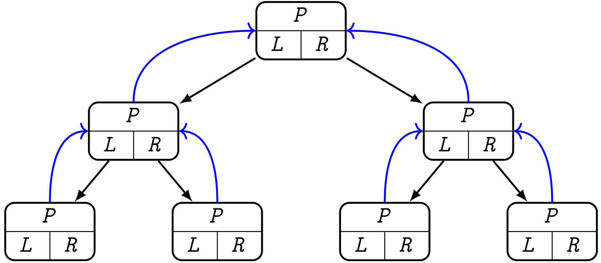

# ASD – Strutture di dati

|      |                   |                                                              |
| ---- | :---------------: | -----------------------------------------------------------: |
| ASD  | Strutture di dati | [🗀][root]    [🗍](http://cricca.disi.unitn.it/montresor/teaching/asd/materiale/lucidi/)    [🖭](http://cricca.disi.unitn.it/montresor/teaching/asd/materiale/video/) |

[TOC]


# [1.][pdf-1] Strutture di dati

## Strutture dati astratte

### Definizioni

#### Dati

> **Dato**: *valore che una variabile può assumere*

> **Tipo di dato primitivo**: *fornito direttamente dal linguaggio*

> **Tipo di dato astratto**: *modello matematico, definito da una collezione di valori e un insieme di operazioni ammesse su questi valori*

> **Specifica di un TDA**: *interfaccia che nasconde i dettagli implementativi*

> **Implementazione di un TDA**: *realizzazione vera e propria*


#### Strutture

> **Struttura di dati**: *collezione di dati, caratterizzata dall’organizzazione della stessa (piuttosto che dal tipo dei dati contenuti)*

<u>Caratteristiche</u>

- Insieme di **operatori** che permettono di **manipolare la struttura**
- **Modo** sistematico di **organizzare** l’insieme dei dati

<u>Tipologie</u>

- **Lineari / Non lineari** (presenza di una sequenza)
- **Statiche / Dinamiche** (variazione di dimensione, contenuto)
- **Omogenee / Disomogenee** (dati contenuti)


### Sequenze

> <u>Definizione</u>  (**Sequenza**)
>
> Struttura dati **dinamica**, **lineare** che rappresenta una sequenza **ordinata** di valori che possono essere **ripetuti**
>
> <u>Operazioni</u>
>
> - Aggiungere/Togliere elementi (data la posizione)
> - Accedere direttamente alla testa/coda
> - Accedere sequenzialmente a tutti gli altri elementi

- L’**ordine** all’interno della sequenza è importante
- È definito il concetto di **posizione** ${\rm pos}_i$
  - Posizioni **fittizie** ${\rm pos}_0$ e ${\rm pos}_{n+1}$
  - Nozioni di **precedente** e **successivo**

<p>

#### Specifica

```c++
// Restituisce true se la sequenza è vuota
bool isEmpty()
// Restituisce true se p è uguale a pos_0 oppure a pos_n+1
bool finished(Pos p)
// Restituisce la posizione del primo elemento
Pos head()
// Restituisce la posizione dell’ultimo elemento
Pos tail()
// Restituisce la posizione dell’elemento che segue p
Pos next(Pos p)
// Restituisce la posizione dell’elemento che precede p
Pos prev(Pos p)
// Inserisce l’elemento v di tipo Item nella posizione p.
// Restituisce la posizione del nuovo elemento, che diviene il
// predecessore di p
Pos insert(Pos p, Item v)
// Rimuove l’elemento contenuto nella posizione p.
// Restituisce la posizione del successore di p che diviene
// successore del predecessore di p
Pos remove(Pos p)
// Legge l’elemento di tipo Item contenuto nella posizione p
Item read(Pos p)
// Scrive l’elemento v di tipo Item nella posizione p
void write(Pos p, Item v)
```


### Insiemi

> <u>Definizione</u>  (**Insieme**)
>
> Struttura dati **dinamica**, **non lineare** che memorizza una collezione **non ordinata** di elementi **senza valori ripetuti**
>
> <u>Operazioni</u>
>
> - Operazioni base
>   - Inserimento
>   - Cancellazione
>   - Verifica contenimento
> - Operazioni insiemistiche
>   - Unione
>   - Interesezione
>   - Differenza
> - Operazioni di ordinamento
>   - Massimo
>   - Minimo
> - Iteratori
>   - ${\tt foreach}\ x ∈ S\ {\tt do}$

- L’**ordinamento** fra elementi è dato dall’eventuale **relazione d’ordine** definita sul tipo degli elementi stessi

<p>

#### Specifica

```c++
// Restituisce la cardinalità dell’insieme
int size()
// Restituisce true se x è contenuto nell’insieme
bool contains(Item x)
// Inserisce x nell’insieme, se non già presente
void insert(Item x)
// Rimuove x dall’insieme, se presente
void remove(Item x)
// Restituisce un nuovo insieme che è l’unione di A e B
Set uniοn(Set A, Set B)
// Restituisce un nuovo insieme che è l’intersezione di A e B
Set intersection(Set A, Set B)
// Restituisce un nuovo insieme che è la differenza di A e B
Set difference(Set A, Set B)
```


### Dizionari

~~(~~[~~Torna a Hashing~~](#7. Hashing)~~)~~

> <u>Definizione</u>  (**Dizionario**)
>
> Struttura dati che rappresenta il concetto matematico di **relazione univoca** o **associazione chiave-valore**
> $$
> R\ :\ D → C
> $$
>
> - $D\,$: **chiavi**
> - $C\,$: **valori**
>
> <u>Operazioni</u>
>
> - Ottenere il valore associato ad una particolare chiave o $\tt nil$ se assente
> - Inserire una nuova associazione chiave-valore, cancellando eventuali associazioni precedenti per la stessa chiave
> - Rimuovere un’associazione chiave-valore esistente

- Chiamati anche **array associativi** o **mappe**

<p>

#### Specifica

```c++
// Restituisce il valore associato alla chiave k se presente,
// nil altrimenti
Item lookup(Item k)
// Associa il valore v alla chiave k
void insert(Item k, Item v)
// Rimuove l’associazione della chiave k
void remove(Item k)
```

<p>

#### Implementazioni

| Struttura dati     | `insert`    | `lookup`    | `remove`    | `foreach` |
| ------------------ | :---------- | :---------- | :---------- | :-------- |
| Array ordinato     | $O(n)$      | $O(\log n)$ | $O(n)$      | $O(n)$    |
| Array non ordinato | $O(1)$[^*]  | $O(n)$      | $O(n)$      | $O(n)$    |
| Lista non ordinata | $O(1)$[^*]  | $O(n)$      | $O(n)$      | $O(n)$    |
| Albero RB          | $O(\log n)$ | $O(\log n)$ | $O(\log n)$ | $O(n)$    |
| Ideale (hash)      | $O(1)$      | $O(1)$      | $O(1)$      | $O(n)$    |

[^*]: Assumendo che l’elemento sia già stato trovato, altrimenti $O(n)$


### Alberi e grafi

> <u>Definizione</u>  (**Albero ordinato**)
>
> Insieme finito di elementi detti **nodi**
>
> - Uno di essi è designato come **radice**
> - I nodi rimanenti sono partizionati in insiemi **ordinati** e **disgiunti**, anch’essi alberi ordinati

> <u>Definizione</u>  (**Grafo**)
>
> Struttura dati composta da
>
> - Insieme di elementi detti **nodi** o **vertici**
> - Insieme di coppie (ordinate o no) di nodi detti **archi**

<u>Operazioni</u>

- Visite


### Commenti

- Concetti di sequenza, insieme, dizionario sono collegati
  - Insieme delle chiavi / dei valori
  - Scorrere la sequenza di tutte le chiavi
- Alcune realizzazioni sono naturali
  - Sequenza ↔ Lista
  - Albero astratto ↔ Albero basato su puntatori
- Esistono realizzazioni alternative
  - Insieme come vettore booleano
  - Albero come vettore dei padri
- La scelta della struttura di dati influisce su efficienza e operazioni ammesse
  - Dizionario come hash table:  ${\tt lookup}\ O(1)\,$,        ${\tt findMin}\ O(n)$
  - Dizionario come albero:        $\,{\tt lookup}\ O(\log n)\,$,  ${\tt findMin}\ O(1)$


## Strutture dati elementari

### Liste

> <u>Definizione</u>  (**Lista concatenata**)
>
> **Sequenza di nodi**, contenenti dati arbitrari e 1 o 2 **puntatori** all’elemento successivo e/o precedente

- **Contiguità** nella lista $\not\Rarr$ contiguità nella memoria
- Tutte le operazioni hanno **costo** $O(1)$

<p>

#### Implementazioni

- **Bidirezionale / Monodirezionale**
- **Con sentinella / Senza sentinella** ~~(oggetto vuoto fittizio)~~
- **Circolare / Non circolare**


[Vedi slide 20-24][pdf-1]


### Pile

> <u>Definizione</u>  (**Pila**)
>
> Struttura dati **dinamica**, **lineare** in cui l’elemento rimosso dall’operazione di cancellazione è predeterminato secondo il sistema **LIFO** (last-in first-out)

<p>

#### Specifica

```c++
struct Stack
    // Costruisce una pila vuota
    Stack()
    // Restituisce true se la pila è vuota
    bool isEmpty()
    // Inserisce v in cima alla pila
    bool push(Item v)
    // Estrae l'elemento in cima e lo restituisce al chiamante
    Item pop()
    // Legge l'elemento in cima alla pila
    Item top()
```

<p>

#### Implementazioni

- Tramite **liste bidirezionali**
  - Puntatore all’elemento top
- Tramite **vettori**
  - Dimensione limitata
  - Overhead più basso

[Vedi slide 27-29][pdf-1]


### Code

> <u>Definizione</u>  (**Coda**)
>
> Struttura dati **dinamica**, **lineare** in cui l’elemento rimosso dall’operazione di cancellazione è predeterminato secondo il sistema **FIFO** (first-in first-out)

<p>

#### Specifica

```c++
struct Queue
    // Costruisce una coda vuota
    Queue()
    // Restituisce true se la coda è vuota
    bool isEmpty()
    // Inserisce v in fondo alla coda
    bool enqueue(Item v)
    // Estrae l'elemento in testa e lo restituisce al chiamante
    Item dequeue()
    // Legge l'elemento in testa alla coda
    Item top()
```

<p>

#### Implementazioni

- Tramite **liste monodirezionali**
  - Puntatore `head`, per estrazione
  - Puntatore `tail`, per inserimento
- Tramite **array circolari**
  - Dimensione limitata
  - Overhead più basso

[Vedi slide 32-35][pdf-1]


## ~~Strutture dati speciali~~

### ~~Utilizzo~~

~~Le **operazioni di base** possono essere~~

- ~~**Non necessarie**~~
  - ~~Strutture dati più efficienti~~
  - ~~Specializzate per particolare compiti~~
- ~~**Non sufficienti**~~
  - ~~Strutture dati con operazioni speciali~~


### ~~Esempi~~

- ~~Code con priorità~~
- ~~Insiemi disgiunti~~
- ~~Interval/**segment** tree~~
- ~~K-D tree~~
- ~~Trie~~
- ~~Fenvick Tree~~
- ~~Merkle tree~~


# [2.][pdf-2] Alberi

## Introduzione

### ==Definizioni==

> <u>Definizione</u>  (**Albero radicato**)
>
> Insieme di **nodi** e insieme di **archi orientati** che connettono coppie di nodi, con le seguenti proprietà
>
> - Un nodo dell’albero è designato come **nodo radice**
> - Ogni nodo, radice esclusa, ha esattamente **un arco entrante**
> - Esiste un **cammino unico** dalla radice ad ogni nodo
> - L’albero è **connesso**
>
> <u>Definizione ricorsiva</u>
>
> Un albero è dato da ~~(xor)~~
>
> - Un **insieme vuoto**
> - Un **nodo radice** e zero o più **sottoalberi**, ognuno dei quali è un albero
>   - La radice è connessa a radici di ogni sottoalbero con **archi orientati**


#### ==Terminologia==

[Vedi slide 7-8][pdf-2]

> **Profondità**: *lunghezza del cammino semplice dalla radice a un nodo*

- Misurato in numero di archi

> **Livello**: *insieme di nodi alla stessa profondità*

> **Altezza**: *profondità massima della sue foglie*


## Alberi binari

### ==Introduzione==

> <u>Definizione</u>  (**Albero binario**)
>
> **Albero radicato** in cui ogni nodo ha **al massimo due figli**, identificati come figlio sinistro e figlio destro

- Due alberi $T$ e $U$ che hanno stessi nodi, figli per ogni nodo e radice, sono **distinti** qualora un nodo $u$ sia designato come figlio sinistro di $v$ in $T$ e come figlio destro di $v$ in $U$


#### Specifica

```c++
struct Tree:
    // Padre del nodo (nil se radice)
    Tree parent
    // Figlio sx/dx del nodo (nil se assente)
    Tree left
    Tree right
        
    // Costruisce un nuovo nodo contenente v senza figli o genitori
    Tree(Item v)
    // Legge il valore memorizzato nel nodo
    Item read()
    // Modifica il valore memorizzato nel nodo
    void write(Item v)
    // Inserisce il sottoalbero radicato in t come figlio sx/dx
    void insertLeft(Tree t)
    void insertRight(Tree t)
    // Distrugge (ricorsivamente) il figlio sx/dx di questo nodo
    void deleteLeft()
    void deleteRight()
```


#### Implementazione

**Campi memorizzati** nei nodi

- **Parent**: riferimento al nodo padre
- **Left**: riferimento al figlio sinistro
- **Right**: riferimento al figlio destro



[Vedi slide 14-15][pdf-2]


### Visite

Modalità di visita

- **Visità in profondità (DFS)**
  - Visita ricorsiva di ogni **sottoalbero**
  - Richiede uno **stack**
  - Varianti
    - **Pre order**: ordine di visita
    - **In order**: utile per stampare ABR e espressioni
    - **Post order**: utile per contare i nodi
- **Visita in ampiezza (BFS)**
  - Visita sequenziale di ogni **livello**
  - Richiede una **queue**
  - Si parte dalla **radice**

Il **costo computazionale** di una visita di un albero contenente $n$ nodi è **$Θ(n)$**

- Ogni nodo viene visitato al **massimo una volta**


#### Implementazione - DFS

```c++
void dfs(Tree t) {
    if (t != null) {
        { print(t) }     // pre-order
        dfs(t.left())
        { print(t) }     // in-order
        dfs(t.right())
        { print(t) }     // post-order
    }
}
```

[Esempi (slide 21-22)][pdf-2]


### ==Alberi strutturalmente diversi==

> <u>Definizione</u>  (**Alberi binari strutturalmente diversi**)
>
> Due alberi binari si dicono strutturalmente diversi se disegnando i figli destri e sinistri si ottengono figure diverse

Il **numero** di alberi strutturalmente diversi aventi $n$ nodi è dato dalla funzione
$$
P(n)=
\begin{cases}
1 & n\le 1 \\
\sum_{k=0}^{n-1}P(k)·P(n-k-1) & n>1
\end{cases}
$$


## Alberi generici

### Introduzione

#### Specifica

```c++
struct Tree
    // Costruisce un nuovo nodo contenente v senza figli o genitori
    Tree(Item v)
    // Legge il valore memorizzato nel nodo
    Item read()
    // Modifica il valore memorizzato nel nodo
    void write(Item v)
    // Restituisce il padre, oppure nil se questo nodo è radice
    Tree parent()
    // Restituisce il primo figlio, oppure nil se è una foglia
    Tree leftmostChild()
    // Restituisce il prossimo fratello, oppure nil se assente
    Tree rightSibling()
    // Inserisce il sottoalbero t come primo nodo di questo nodo
    void insertChild(Tree t)
    // Inserisce il sottoalbero t come prossimo fratello
    void insertSibling(Tree t)
    // Distrugge albero radicato identificato dal primo figlio
    void deleteChild()
    // Distrugge albero radicato identificato dal prossimo fratello
    void deleteSibling()
```


#### Implementazione

- **Vettore dei figli**
  - **Campi** memorizzati nei nodi
    - **Parent**: riferimento al nodo padre
    - **Vettore dei figli**: a seconda del numero di figli, può comportare una discreta quantità di spazio sprecato
- **Primo figlio, prossimo fratello**
  - Implementato come una **lista di fratelli**
    - **Parent**: riferimento al nodo padre
    - **Child**: riferimento al primo figlio
    - **Sibiling**: riferimento al prossimo fratello
- **Vettore dei padri**
  - Vettore i cui elementi contengono
    - **Valore** associato al nodo
    - **Indice** della posizione del padre nel vettore

[Vedi slide 29-34][pdf-2]


### Visite

#### Implementazione - DFS

```c++
void dfs(Tree t) {
    if (t != null) {
        { print(t) }    // pre-order
        Tree u = t.leftmostChild()
		while (u != null) {
			dfs(u)
			u = u.rightSibling()
        }
        { print(t) }    // post-order
    }
}
```

<p></p>

#### Implementazione - BFS

```c++
void bfs(Tree t) {
    Queue Q = Queue()
    Q.enqueue(t)
    while (!Q.isEmpty()) {
        Tree u = Q.dequeue()
        print(u)
        u = u.leftmostChild()
        while (u != null) {
            Q.enqueue(u)
            u = u.rightSibling()
        }
    }    
}
```


# [3.][pdf-3] Alberi binari di ricerca

## Dizionario tramite ABR

### Memorizzazione

- Le **associazioni chiave-valore** vengono memorizzate in un albero binario
- Ogni nodo $u$ contiene una **coppia** $(u.\rm key,\, u.\rm value)$
- Le chiavi devono appartenere ad un **insieme totalmente ordinato**


### ==Proprietà==

> <u>Definizione</u>  (**Albero di ricerca binario**)
>
> Albero binario che soddisfa le seguenti proprietà
>
> - Le chiavi nei nodi del **sottoalbero sinistro** di $u$ sono **minori** di $u.\rm key$
> - Le chiavi nei nodi del **sottoalbero destro** di $u$ sono **maggiori** di $u.\rm key$

- Le due proprietà permettono di realizzare un **algoritmo di ricerca dicotomica**


### Specifica

```c++
struct Tree:
    // Nodi
    Tree parent
    Tree left
    Tree right
    // Contenuto
    Item key
    Item value
```

```c++
struct Dictionary:
    Tree tree
    Dictionary() { tree = null }
    // Operazioni dizionario
    Item lookup(Item k)
    void insert(Item k, Item v)
    void remove(Item k)
    // Ordinamento
    Tree successorNode(Tree T)
    Tree predecessorNode(Tree T)
    Tree min(Tree T)
    Tree max(Tree T)
private:
    Tree lookupNode(Tree T, Item k)
    Tree insertNode(Tree T, Item k, Item v)
    Tree removeNode(Tree T, Item k)
    void link(Tree p, Tree u, Item k)
```


## Operazioni ABR

### Ricerca

> <u>Procedura</u>  ($\tt Item\ lookupNode(Tree\ T,\ Item\ k)$)
>
> Restituisce
>
> - Il **valore del nodo** dell’albero $T$ che contiene la **chiave** $k$, se presente
> - $\tt nil$ altrimenti

<p></p>

#### Implementazione

```c++
// Dictionary
Item lookup(Item k) {
    Tree T = lookupNode(tree, k)
    if (T != null)
    	return T.value()
    else
    	return null
}
```

```c++
// Ricerca iterativa
Tree lookupNode(Tree T, Item k) {
    Tree u = T
    while (u != null && u.key != k) {
        if (k < u.key)
        	u = u.left
        else
        	u = u.right
    }
    return u
}
```

```c++
// Ricerca ricorsiva
Tree lookupNode(Tree T, Item k) {
    if (T == null || T.key == k)
    	return T
    else
    	return lookupNode((k < T.key ? T.left : T.right), k)
}
```


### Minimo-massimo

> <u>Procedura</u>  ($\tt Tree\ min/max(Tree\ T)$)
>
> Restituisce il **nodo minimo/massimo** dell’albero $T$

<p></p>

#### Implementazione

```c++
// Minimo
Tree min(Tree T) {
    if (T.left != null)
        return min(T.left)
    else
        return T
}
```

```c++
// Massimo
Tree max(Tree T) {
    if (T.right != null)
        return max(T.right)
    else
        return T
}
```


### ==Successore / Predecessore==

> <u>Procedura</u>  ($\tt Tree\ successorNode(Tree\ T)$)
>
> Il **successore** di un nodo $u$ è il **più piccolo nodo maggiore** di $u$
>
> Restituisce
>
> - Il **minimo** del sottoalbero **destro** di $u$, se presente
> - Il **primo avo** $v$ tale per cui $u$ sta nel sottoalbero **sinistro** di $v$, altrimenti

- Nel primo caso, il successore non ha **figlio sinistro**
- **Predecessore** simmetrico

<p></p>

#### Implementazione

```c++
// Successore
Tree successorNode(Tree T) {
    if (T == null)
        return T
    if (T.right != null)
        return min(T.right)
    Tree t = T
    Tree p = t.parent
    while (p != null && t == p.right) {
        t = p
        p = p.parent
    }
    return p
}
```

- **Predecessore**: `right→left`, `min→max`


### ==Inserimento==

> <u>Procedura</u>  (**$\tt Tree\ insertNode(Tree\ T,\ Item\ k,\ Item\ v)$**)
>
> Inserisce un’**associazione chiave-valore** $(k, v)$ nell’albero $T$
>
> - Se $T \tt == nil$, restituisce il **primo nodo** dell’albero
> - Altrimenti, restituisce la **radice** di $T$ inalterata
>   - Se la chiave è già presente, **sostituisce il valore** associato
>   - Altrimenti, viene inserita una **nuova associazione**

<p></p>

#### Implementazione

```c++
// Dictionary
void insert(Item k, Item v) {
    tree = insertNode(tree, k, v)
}
```

```c++
// Inserimento
Tree insertNode(Tree T, Item k, Item v) {
    Tree p = null  // padre
    Tree u = T
    while (u != null && u.key != k) {  // cerca posizione
        p = u
        u = (k < u.key ? u.left : u.right)
    }
    if (u != nil && u.key == k) {
    	u.value = v                   // sostituisci valore
    } else {
    	Tree newT = Tree(k, v)        // crea nodo coppia (k,v)
        link(p, newT, k)
        if (p == null)
        	T = newT           // primo nodo ad essere inserito
    }
    return T                   // T non modificato o nuovo nodo
}
```

```c++
// Collegamento
void link(Tree p, Tree u, Item k) {
    if (u != null) then
    	u.parent = p      // collega padre
    if (p != null) {
    	if (k < p.key)
            p.left = u    // attacca come figlio sinistro
    	else
            p.right = u   // attacca come figlio destro
    }
}
```


### ==Cancellazione==

> <u>Procedura</u>  (**$\tt Tree\ removeNode(Tree\ T,\ Item\ k)$**)
>
> - **Rimuove il nodo** contenente la chiave $k$ dall’albero $T$
> - **Restituisce la radice** dell’albero (potenzialmente cambiata)

<p></p>

#### Implementazione

```c++
// Dictionary
void remove(Item k, Item v) {
    tree = removeNode(tree, k)
}
```

```c++
// Rimozione
Tree removeNode(Tree T, Item k) {
    Tree u = lookupNode(T, k)
    if (u != null) {	
    	if (u.left == null && u.right == null) {  // caso 1
            link(u.parent, nil, k)
            delete u	
        } else if (u.left == null) {			  // caso 2a
            link(u.parent, u.right, k)
            if (u.parent = null)
				T = u.right     	
        } else if (u.right == null) {	          // caso 2b
            link(u.parent, u.left, k)
            if (u.parent = null)
				T = u.left
        } else {	     						  // caso 3
            Tree s = successorNode(u)
            link(s.parent, s.right, s.key)
            u.key = s.key
        	u.value = s.value
            delete s
        }
    }
    return T
}
```

<p></p>

#### ==Casi possibili==

1. Il nodo da eliminare $u$ **non ha figli**
   - Si elimina $u$ semplicemente
2. Il nodo da eliminare $u$ ha **un solo figlio** $f$
   - Si elimina $u$
   - Si attacca $f$ all’ex-padre $p$ di $u$ in sostituzione di $u$ (short-cut)
3. Il nodo da eliminare $u$ ha **due figli**
   - Si individua il successore $s$ di $u$
     - ~~(`←` Il successore non ha figlio sinistro)~~
   - Si scollega $s$
   - Si attacca l’eventuale figlio destro di $s$ al padre di $s$ (short-cut)
   - Si copia $s$ su $u$
   - Si rimuove il nodo $s$

<p></p>

#### ==Dimostrazione==

1. **Nessun figlio**
   - Eliminare foglie non cambia l’ordine dei nodi rimanenti
2. **Solo un figlio**
   - Se $u$ è il figlio destro (sinistro) di $p$, tutti i valori nel sottoalbero di $f$ sono maggiori (minori) di $p$
   - $f$ può essere attaccato come figlio destro (sinistro) di $p$ al posto di $u$
3. **Due figli**
   - Il successore $s$ è sicuramente
     - $≥$ dei nodi nel sottoalbero sinistro di $u$
     - $≤$ dei nodi nel sottoalbero destro di $u$
   - Quindi può essere sostituito a $u$
   - A quel punto, si ricade nel caso 2


### ==Costo computazionale==

Tutte le operazioni sono confinate ai nodi posizionati lungo un **cammino semplice** dalla **radice** ad una **foglia**

- $h\, :=\, \rm altezza\ dell’albero$
- $n\, :=\, \rm numero\ di\ nodi$
- $\text{Tempo di ricerca: }\ O(h)=O(n)$
  - $\text{Caso pessimo:}\ \  h =O(n)$
  - $\text{Caso ottimo:}\ \ \ \ h =O(\log n)$


## ABR bilanciati (RB)

### ==Definizioni==

> <u>Definizione</u>  (**Fattore di bilanciamento**)
>
> Il fattore di bilanciamento $β(v)$ di un nodo $v$ è la differenza di altezza fra i sottoalberi di $v$

- ~~**Alberi AVL** (Adelson-Velskii e Landis, 1962)~~
  - ~~$β(v) ≤ 1\,,\ \ \forall\, v$~~
  - ~~Bilanciamento ottenuto tramite **rotazioni**~~
- ~~**B-Alberi** (Bayer, McCreight, 1972)~~
  - ~~$β(v) = 0\,,\ \ \forall\, v$~~
  - ~~Specializzati per strutture in **memoria secondaria**~~
- ~~**Alberi 2-3** (Hopcroft, 1983)~~
  - ~~$β(v) = 0\,,\ \ \forall\, v$~~
  - ~~Bilanciamento ottenuto tramite **merge/split**, grado variabile~~


### ==Alberi Red-Black==

> <u>Definizione</u>  (**Albero Red-Black**)
>
> ABR in cui
>
> - Ogni nodo è colorato di **rosso** o di **nero**
> - Le **chiavi** vengono mantenute solo nei **nodi interni** dell’albero
> - Le **foglie** sono costituite da nodi speciali $\tt Nil$
> - Vengono rispettati i seguenti **vincoli**
>   1. La **radice** è nera
>   2. Tutte le **foglie** sono nere
>   3. Entrambi i **figli** di un nodo rosso sono neri
>   4. Ogni **cammino** semplice da un nodo $u$ ad una delle foglie contenute nel suo sottoalbero ha lo stesso numero di nodi neri

> <u>Definizione</u>  (**Altezza nera di un nodo $v$**)
>
> L’altezza nera ${\rm bh}(v)$ di un nodo $v$ è il numero di nodi neri lungo ogni cammino da $v$ (escluso) ad ogni foglia (inclusa) del suo sottoalbero

> <u>Definizione</u>  (**Altezza nera di un albero RB**)
>
> Altezza nera della sua radice

- Entrambe **ben definite** (vincolo 4-cammino)
- **Cambiare colorazione** può cambiare l'altezza nera


#### Memorizzazione

```c++
// Getters (nodi)
Tree parent()
Tree left()
Tree right()
Item key()
Item value()
int  color()
```

==**Nodi $\tt Nil$**==

- ==Nodo **sentinella** il cui scopo è avere accesso al colore di entrambi i figli==, evitare di dover gestire casi particolari quando uno dei due è $\tt nil$
- Puntatore ad un nodo $\tt Nil$ con colore **nero**, al posto di un puntatore $\tt nil$
- Ne esiste **solo uno**, per risparmiare memoria


### ==Rotazioni==

- **Durante la modifica** di un albero RB è possibile che le **condizioni** di bilanciamento risultino **violate**
- ==Quando i **vincoli** RB vengono **violati**==
  - ==**Si modificano i colori** nella zona della violazione==
  - ==Si operano **ribilanciamenti** tramite **rotazioni** a destra o sinistra==


```c++
Tree rotateLeft(Tree x)
    Tree y = x.right
    Tree p = x.parent
// 1. Il sottoalbero y.left diventa figlio destro di x
    x.right = y.left
    if y.left != nil then
        y.left.parent = x
// 2. x diventa figlio sinistro di y
    y.left = x
    x.parent = y
// 3. y diventa figlio di p
    y.parent = p
    if p != nil then
    	if p.left == x then
            p.left = y
        else
            p.right = y
    return y
```

- **Destra**: `right←→left`


### ==Inserimento RB==

> <u>Procedura</u>  (**Inserimento**)
>
> - Si cerca la **posizione** usando la stessa procedura usata per gli ABR
> - Si colora il nuovo nodo di **rosso**
>
> Se due nodi consecutivi sono rossi (vincolo 3-figli)
>
> - Procedere verso l’alto lungo il percorso di inserimento
> - Ripristinare il vincolo 3-figli
> - Spostare le violazioni verso l’alto rispettando il vincolo 4-cammino
> - Al termine, colorare la radice di nero (vincolo 1-radice)

<p>

#### Implementazione

```pseudocode
/* inserimento (ABR + balanceInsert) */
Tree insertNode(Tree T, Item k, Item v)
    Tree p = nil  /* padre */
    Tree u = T
    while u != nil and u.key != k do
        p = u
        u = iif(k < u.key, u.left, u.right)
    if u != nil and u.key == k then
    	u.value = v
    else
    	Tree newT = Tree(k, v)
        link(p, newT, k)
        balanceInsert(newT)   /* <== */
        if p == nil then
        	T = newT
    return T

void balanceInsert(Tree t)
    t.color = RED
    while t != nil do
        Tree p = t.parent
        Tree n = iif(p != nil, p.parent, nil)
        Tree z = iif(n == nil, nil,
                     iif(n.left == p, n.right, n.left))	
        /* caso 1 */
        if p == nil then
            t.color = BLACK
            t = nil	
        /* caso 2 */
        else if p.color == BLACK then
            t = nil	
        /* caso 3 */
        else if z.color == RED then
            p.color = z.color = BLACK
            n.color = RED
            t = n	
        /* casi 4a-4b */
        else
            if t == p.right and p == n.left then
                n.left = rotateLeft(p)
                t = p
        	else if t == p.left and p == n.right then
                n.right = rotateRight(p)
                t = p	
        /* casi 5a-5b */
        else
            if t == p.left and p == n.left then
            	n.left = rotateRight(n)
            else if (t = p.right) and (p = n.right) then
                n.right = rotateLeft(n)
            p.color = BLACK
			n.color = RED
			t = nil
```

<p></p>

#### ==Analisi==

<u>Nodi coinvolti</u>

- $t$: nodo inserito
- $p$: padre di $t$
- $n$: nonno di $t$
- $z$: zio di $t$

<u>7 casi possibili</u>

- Si colora inizialmente **$t$ di rosso**

1. **$p = \tt nil$**
   - Primo nodo ad essere inserito o radice
   - Si colora $t$ di nero
2. **$p$ nero**
   - Nessun vincolo violato
3. **$p,z$ rossi** ($n$ nero)
   - $z$ è rosso, quindi è possibile colorare di nero $p$ e $z$, e di rosso $n$
     - Vincolo 4-cammino rispettato: tutti i cammini che passano per $z$ e $p$ passano per $n$
   - Possibile problema sul nonno
     - Vincolo 1-radice violato
     - Vincolo 3-figli violato
   - Porre $t = n$ e continuare il ciclo
4. **$p$ rosso, $z$ nero;  $t=p.{\rm right/left} \ \and\ p=n.\rm left/right$**
   - Rotazione a sinistra/destra del nodo $p$
     - Scambia i ruoli di $t$ e $p$, ottenendo il caso 5
     - Vincolo 4-cammino rispettato: i nodi coinvolti sono entrambi rossi
   - Porre $t = p$ e continuare il ciclo
5. **$p$ rosso, $z$ nero;  $t=p.{\rm left/right} \ \and\ p=n.\rm left/right$**
   - Rotazione a destra/sinistra del nodo $n$
     - $t$ e $n$ diventano figli di $p$
   - Colorare $n$ di rosso e $p$ di nero (tutti i vincoli rispettati)

<p>

#### ==Complessità==

<u>Complessità totale</u>:  **$O(\log n)$**

- $O(\log n)$  per scendere fino al punto di inserimento
- $O(1)$        per effettuare l’inserimento
- $O(\log n)$  per risalire e soddisfare i vincoli

<p>

#### Alternativa

È possibile effettuare una **top-down insertion**

- Si scende fino al punto di inserimento, aggiustando l’albero mano a mano
- Si effettua l’inserimento in una foglia


### Cancellazione

- L’algoritmo è costruito su quello di cancellazione per **ABR**
- Dopo la cancellazione si deve decidere se è necessario **ribilanciare** o meno
- Le **operazioni di ripristino** del bilanciamento sono necessarie solo quando il nodo cancellato è **nero**
  - Nodo cancellato **rosso**
    - Altezza nera invariata
    - Non sono stati creati nodi rossi consecutivi
    - La radice resta nera
  - Se il nodo cancellato è **nero**
    - Violazione di almeno uno dei vincoli (1-radice, 3-figli, 4-cammino)
    - L’algoritmo `balanceDelete(T, t)` ripristina la proprietà RB con rotazioni e cambiamenti di colore (4 casi possibili e 4 simmetrici)


#### ~~Implementazione~~

[~~Vedi slide 85-86~~][pdf-3]


### ==Teoremi==

> <u>Teorema</u>  (**Nodi interni RB**)
>
> Ogni sottoalbero di radice $u$ contiene $n≥2^{{\rm bh}(u)}-1$ nodi interni
>
> <u>Dimostrazione</u>
>
> 1. <u>Caso base</u>: $h = 0$
>
>    - $u$ è una foglia $\tt Nil$
>    - Il sottoalbero con radice $u$ contiene $n≥2^0 − 1 = 0$ nodi interni
>
> 2. <u>Passo induttivo</u>: $h \ge 1$
>
>    - $u$ è un nodo interno con due figli
>
>    - Ogni figlio $v$ di $u$ ha un’altezza nera ${\rm bh}(v)$ pari a
>
>      - ${\rm bh}(u)$, se rosso
>      - ${\rm bh}(u) − 1$, se nero
>
>    - Per ipotesi induttiva, ogni figlio ha $n'≥ 2^{{\rm bh}(u)-1}-1$ nodi interni
>
>    - Quindi il numero $n$ di nodi interni del sottoalbero con radice $u$ è
>      $$
>      n\,\ge\,2\big(2^{{\rm bh}(u)-1}-1\big)+1=2^{{\rm bh}(u)}-1
>      $$

> <u>Teorema</u>  (**Nodi neri RB**)
>
> Almeno la metà dei nodi dalla radice ad una foglia deve essere nera
>
> <u>Dimostrazione</u>
>
> - Per il vincolo 3-figli, se un nodo è rosso, i suoi figli devono essere neri
> - La situazione in cui sono presenti il minor numero di nodi neri è il caso in cui rossi e neri sono alternati
> - Quindi, almeno la metà dei nodi deve essere nera

> <u>Teorema</u>  (**Lunghezza di due cammini RB**)
>
> Dati due cammini da un nodo $u$ a due sue foglie, non è possibile che uno sia più lungo del doppio dell’altro
>
> <u>Dimostrazione</u>
>
> - Per il vincolo 4-cammino, ogni cammino da un nodo ad una qualsiasi
>   foglia contiene lo stesso numero di nodi neri
> - Per il lemma precedente, almeno metà dei nodi in ognuno di questi cammini sono neri
> - Quindi, al limite, uno dei due cammini è costituito da solo nodi neri, mentre l’altro è costituito da nodi neri e rossi alternati

> <u>Teorema</u>  (**Altezza massima RB**)
>
> L’altezza massima di un albero RB con $n$ nodi interni è al più $2\log(n+1)$
>
> <u>Dimostrazione</u>
> $$
> \begin{align}
> n ≥ 2^{{\rm bh}(r)}-1 \
> &\iff\ n ≥ 2^{h/2} − 1 \\
> &\iff\ n + 1 ≥ 2^{h/2} \\
> &\iff\ \log(n + 1) ≥ h/2 \\
> &\iff\ h ≤ 2 \log(n + 1) \\
> \end{align}
> $$


# [4.][pdf-4] Grafi

## Introduzione

### ==Definizioni==

> <u>Definizione</u>  (**Grafo (non) orientato**)
>
> Coppia $G = (V, E)$ dove
>
> - $V$ è un insieme di **nodi** / **vertici**
> - $E$ è un insieme di **coppie (non) ordinate** $(u, v)$ di nodi dette **archi**

> <u>Definizione</u>  (**Grafo pesato**)
>
> - Grafo i cui archi hanno un **peso**
>
> - Il peso $w(u,v)$ di un arco è dato da una **funzione di peso**
>   $$
>   w\ :\ V × V → \R
>   $$
>
> - Se non esiste l'arco, il peso ha un valore $ω$ arbitrario
>
>   - Dipende dal problema

> <u>Definizione</u>  (**Grado di un nodo**)
>
> - **Grafi non orientati**
>   - Numero di archi incidenti su di esso
> - **Grafi orientati**
>   - **Entrante**: numero di archi incidenti su di esso
>   - **Uscente**: numero di archi incidenti da esso

> <u>Definizione</u>  (**Cammino**)
>
> Un cammino $C$ di lunghezza $k$ è una **sequenza di nodi**
> $$
> u_0 , u_1 , . . . , u_k\in V\ :\ (u_i , u_{i+1}) ∈ E,\ \ \forall\, i\in[0,k)
> $$
>
> <p></p>
>
> <u>Definizione</u>  (**Cammino semplice**)
>
> Cammino in cui tutti i suoi nodi sono distinti

> <u>Definizione</u>  (**Ciclo**)
>
> Un ciclo $C$ di lunghezza $k > 2$ è una **sequenza di nodi**
> $$
> u_0 , u_1 , . . . , u_k\in V\ :\ (u_i , u_{i+1}) ∈ E\ \and\ u_0=u_k,\ \ \forall\, i\in[0,k)
> $$
>
> <p></p>
>
> <u>Definizione</u>  (**Ciclo semplice**)
>
> Ciclo in cui tutti i suoi nodi sono distinti, ad eccezione di primo e ultimo


#### ==Terminologia==

- Un vertice $v$ è detto **adiacente** a $u$ se esiste un arco $(u, v)$
  - In un grafo **non ordinato**, la relazione di adiacenza è **simmetrica**
- Un arco $(u, v)$ è detto **incidente** da $u$ a $v$


#### ==Dimensioni==

<u>Definizioni</u>

- $n\ \, :=\, |V |$    numero di nodi
- $m\, :=\, |E|$    numero di archi

<u>Relazioni</u>

- Non orientato:  $m ≤ \dfrac{n^2-n}{2} = O(n^2)$
- Orientato:         $\,m ≤\,  n^2 − n\: = O(n^2)$

<u>Complessità degli algoritmi</u>

- Espressa in termini sia di $n$ che di $m$


#### ==Casi speciali==

> <u>Definizione</u>  (**Grafo completo**)
>
> Grafo con un arco fra tutte le coppie di nodi

> <u>Definizione informale</u>  (**Grafo sparso**)
>
> Grafo con pochi archi (e.g.  $m = O(n)$,  $m = O(n \log n)$)
>
> <p></p>
>
> <u>Definizione informale</u>  (**Grafo denso**)
>
> Grafo con tanti archi (e.g.  $m = Ω(n^2)$)

> <u>Definizione</u>  (**Grafo ciclico**)
>
> Grafo che contiene almeno un ciclo
>
> <p></p>
>
> <u>Definizione</u>  (**Grafo aciclico**)
>
> Grafo non orientato che non contiene cicli
>
> <p></p>
>
> <u>Definizione</u>  (**Grafo orientato aciclico / DAG**)
>
> Grafo orientato che non contiene cicli

> <u>Definizione</u>  (**Albero libero**)
>
> Grafo connesso con $m = n − 1$
>
> <p></p>
>
> <u>Definizione</u>  (**Albero radicato**)
>
> Albero libero nel quale uno dei nodi è designato come radice/sorgente

> <u>Definizione</u>  (**Foresta**)
>
> Grafo formato da un insieme di alberi

> <u>Definizione</u>  (**Grafo trasposto**)
>
> Dato un grafo orientato $G = (V, E)$, il grafo trasposto $G^T=(V,E_T)$ ha gli stessi nodi di $G$ e gli archi orientati in senso opposto
> $$
> E_T = \{(u, v)\ |\ (v, u) ∈ E\}
> $$


#### ==Componenti connesse==

> <u>Definizione</u>  (**Sottografo**)
>
> $G'$ è un sottografo di $G$ se e solo se
> $$
> G' ⊆ G\ \iff\ V'⊆V\ \and\ E'⊆E
> $$
>
> <p></p>
>
> <u>Definizione</u>  (**Sottografo massimale**)
>
> $G'$ è un sottografo massimale di $G$ se e solo se
>
> $$
> G'_{\max}\sube G \ \iff\ \nexists\,G''⊆G\ :\ G''_{\sf connesso}\ \and\ G' \sub G''
> $$

> <u>Definizione</u>  (**Raggiungibilità**)
>
> Un nodo $v$ è raggiungibile da $u$ se esiste almeno un cammino da $u$ a $v$

> <u>Definizione</u>  (**Grafo connesso**)
>
> Un grafo non orientato $G = (V, E)$ è connesso se e solo se ogni suo nodo è raggiungibile da ogni altro suo nodo
>
> <p></p>
>
> <u>Definizione</u>  (**Grafo fortemente connesso**)
>
> Come sopra, con un grafo orientato

> <u>Definizione</u>  (**Componente connessa**)
>
> Un grafo non orientato $G' = (V' , E' )$ è una componente connessa di $G$ se e solo se $G'$ è un sottografo connesso e massimale di $G$
>
> <p></p>
>
> <u>Definizione</u>  (**Componente  connessa**)
>
> Come sopra, con un grafo orientato


#### ==Alberi di copertura==

> <u>Definizione</u>  (**Albero di copertura**)
>
> Dato un grafo $G = (V, E)$ non orientato e connesso, un albero di copertura di $G$ è un sottografo $T = (V, E_T)$ tale che
>
> - $T$ è un albero
> - $E_T ⊆ E$
> - $T$ contiene tutti i vertici di $G$

> <u>Definizione</u>  (**Albero dei cammini minimi**)
>
> Albero di copertura di $G$ radicato in $s$ i cui vertici sono tutti quelli raggiungibili da $s$ in $G$ e gli archi sono tali per cui l'unico cammino presente tra $s$ e un qualsiasi altro nodo del grafo sia il cammino minimo


### Specifica

```c++
struct Graph
	// Crea un nuovo grafo
    Graph()
    // Restituisce l'insieme di tutti i nodi
    Set V()
    // Restituisce il numero di nodi
    int size()
    // Restituisce l'insieme dei nodi adiacenti a u
    Set adj(Node u)
    // Aggiunge il nodo u al grafo
    void insertNode(Node u)
    // Aggiunge l'arco (u, v) al grafo
    void insertEdge(Node u, Node v)
    // Rimuove il nodo u dal grafo
    void deleteNode(Node u)
    // Rimuove l'arco (u, v) dal grafo
    void deleteEdge(Node u, Node v)
```


### Memorizzazione

<u>Approcci</u>

- **Matrici** di adiacenza
- **Liste / Vettori** di adiacenza

$$
\begin{array}{l}
\bold {Matrice\ di\ adiacenza} \\[4pt]
\begin{array}{l}
m_{uv}=\begin{cases}
1 & (u,v)\in E \\
0 & (u,v)\notin E
\end{cases}
\\[2pt]
m_{uv}=\begin{cases}
w(u,v) & (u,v)\in E \\
ω & (u,v)\notin E
\end{cases}
\end{array}
&
{\rm Mem}=\begin{cases}
n^2\ \rm bit & \rm diretto \\
n(n − 1)/2\ \rm bit & \rm indiretto
\end{cases}

\\[10pt]

\bold {Lista/Vettore\ di\ adiacenza} \\[4pt]
\begin{array}{l}
G.{\rm adj} (u) = \{v\ |\ (u, v) ∈ E\}
\\[4pt]
G.{\rm adj} (u) = \{(v,w(u,v)) | (u, v) ∈ E\}
\end{array}
&
{{\rm Mem}=\begin{cases}
an+bm\ \ \,\ \rm bit & \rm diretto \\
an+2\,bm\ \rm bit & \rm indiretto
\end{cases}}
\end{array}
$$

|                     |   Matrici   |      | Liste / Vettori |      |
| ------------------- | :---------: | ---- | :-------------: | ---- |
| Spazio richiesto    |  $O(n^2)$   |      |   $O(n + m)$    |      |
| Verifica adiacenza  |   $O(1)$    |      |     $O(n)$      |      |
| Iterare sugli archi |  $O(n^2)$   |      |   $O(n + m)$    |      |
| Ideale per          | Grafi densi |      |  Grafi sparsi   |      |

[Esempi (slide 17-24)][pdf-4]


#### ~~Assunzioni~~

~~Se non diversamente specificato, si assuma che~~

- ~~L’implementazione sia basata su **vettori di adiacenza**, statici o dinamici~~
- ~~Dopo l’inizializzazione, il grafo sia **statico**~~
- ~~La classe $\tt Node$ sia **equivalente** a $\tt int$~~
  - ~~Accesso alle informazioni con **costo $O(1)$**~~
- ~~Le operazioni per **aggiungere** nodi e archi abbiano **costo $O(1)$**~~


#### Implementazione

[Vedi slide 26-28][pdf-4]


## Visite dei grafi

### Problema della visita

> <u>Problema</u>  (**Visita del grafo**)
>
> Dato un grafo $G = (V, E)$ e un vertice radice $r ∈ V$, visitare una e una volta sola tutti i nodi del grafo che possono essere raggiunti da $r$
>
> <p></p>
>
> <u>Soluzione</u>  (**Visita in ampiezza / BFS**)
>
> **Visita per livelli**: prima la radice, poi i nodi a distanza crescente da essa
>
> <p></p>
>
> <u>Soluzione</u>  (**Visita in profondità / DFS**)
>
> **Visita ricorsiva**: per ogni nodo si visitano tale nodo e i suoi nodi adiacenti

<u>Applicazioni</u>

- **BFS**
  - Calcolare i cammini più brevi da una singola sorgente
- **DFS**
  - Ordinamento topologico
  - Componenti (fortemente) connesse


#### Algoritmo generico di attraversamento

```pseudocode
void graphTraversal(Graph G, Node r)
    Set S = Set()  /* insieme generico (modificabile ad hoc) */
    S.insert(r)
    { /* marca il nodo r */ }
    while S.size() > 0 do
        Node u = S.remove()  /* politica dipende dal problema */
        { /* visita il nodo u */ }
        foreach v ∈ G.adj(u) do
            { /* visita l'arco (u, v) */ }
            if not marked(v) then
                { /* marca il nodo v */ }
                S.insert(v)
```


## BFS

### Idea

<u>Obiettivi</u>

- Visitare i nodi a **distanze crescenti** dalla sorgente
- Calcolare il **cammino più breve** da $r$ a tutti gli altri nodi
- Generare un **albero breadth-first**
  - Albero contenente tutti i nodi raggiungibili da $r$
  - Tale per cui il cammino dalla radice $r$ al nodo $u$ nell’albero corrisponde al cammino più breve da $r$ a $u$ nel grafo


### Implementazione

```pseudocode
void bfs(Graph G, Node r)  /* basato su graphTraversal */
    Queue Q = Queue()
    S.enqueue(r)
    bool[] visited = new bool[G.size()]
    foreach u ∈ G.V() - {r} do
    	visited[u] = false
    visited[r] = true
    while not Q.isEmpty() do
        Node u = Q.dequeue()
        { /* visita il nodo u */ }
        foreach v ∈ G.adj(u) do
            { /* visita l'arco (u, v) */ }
            if not visited[v] then
                visited[v] = true
                Q.enqueue(v)
```


### Cammini più brevi

```pseudocode
void distance(Graph G, Node r, int[] distance)  /* erdos */
    Queue Q = Queue()
    Q.enqueue(r)
    foreach u ∈ G.V() - {r} do
    	distance[u] = ∞
    distance[r] = 0
    while not Q.isEmpty() do
        Node u = Q.dequeue()
        foreach v ∈ G.adj(u) do
            if distance[v] == ∞ then
                distance[v] = distance[u] + 1
                Q. enqueue(v)
```


### Albero BFS

- Calcola il **cammino più breve** fra due nodi
- **Albero di copertura** con radice $r$
- Memorizzato in un **vettore dei padri** $\tt parent$

```pseudocode
void distance([...], Node[] parent)
    [...]
    parent[r] = nil
/*  while not Q.isEmpty() do
        Node u = Q.dequeue()
        foreach v ∈ G.adj(u) do
            if distance[v] == ∞ then
                distance[v] = distance[u] + 1
                Q.enqueue(v)
*/              parent[v] = u   /* <== memorizza il padre */
```

```pseudocode
void printPath(Node r, Node s, Node[] parent)
    if r == s then
    	print(s)
    else if parent[s] == nil then
    	print("error")
    else
    	printPath(r, parent[s], parent)
    	print(s)
```


### Complessità

<u>Complessità</u>:  $O(m + n)$

- Ognuno degli $n$ nodi viene inserito nella coda al massimo una volta

- Per ogni nodo estratto, tutti i suoi archi vengono analizzati una volta sola

- Il numero di archi analizzati è quindi
  $$
  m=\sum_{u\in V}d_{\rm out}(u)
  $$


## DFS

### Idea

<u>Obiettivi</u>

- Spesso una **subroutine** della soluzione di altri problemi
- Esplorare un **intero grafo**
  - Non solo i nodi raggiungibili da una singola sorgente

<u>Output</u>

- Una **foresta depth-first** $G_f = (V, E_f)$
  - Collezione di alberi depth-first

<u>Struttura dati</u>

- Stack implicito (ricorsiva)
- Stack esplicito (iterativa)


### Implementazione

#### Ricorsiva, stack implicito

```pseudocode
void dfs(Graph G, Node u, boolean[] visited)
    visited[u] = true
    { /* visita il nodo u (pre-order) */ }
    foreach v ∈ G.adj(u) do
        if not visited[v] then
            { /* visita l'arco (u, v) */ }
            dfs(G, v, visited)
    { /* visita il nodo u (post-order) */ }
```

- <u>Complessità</u>:  $O(m + n)$

<p></p>

#### Iterativa, stack esplicito, pre-order

```pseudocode
void dfs(Graph G, Node r)
    Stack S = Stack()
    S.push(r)
    boolean[] visited = new boolean[G.size()]
    foreach u ∈ G.V() do
    	visited[u] = false
    while not S.isEmpty() do
        Node u = S.pop()
        if not visited[u] then
            { /* visita il nodo u (pre-order) */ }
            visited[u] = true
            foreach v ∈ G.adj(u) do
                { /* visita l'arco (u, v) */ }
                S.push(v)
```

- <u>Complessità</u>:  $O(m + n)$
  - $O(m)$ visite degli archi
  - $O(m)$ inserimenti, estrazioni
  - $O(n)$  visite dei nodi
- Un nodo può essere inserito nella pila più volte
- Il controllo se un nodo è già stato visitato viene fatto all’estrazione

<p></p>

#### Iterativa, stack esplicito, post-order

- Quando un nodo viene **scoperto**
  - Viene inserito nello stack con il tag $\tt discovery$
- Quando un nodo viene **estratto** dallo stack con tag $\tt discovery$
  - Viene reinserito con il tag $\tt finish$
  - Tutti i suoi vicini vengono inseriti
- Quando un nodo viene **estratto** dallo stack con tag $\tt finish$
  - Viene effettuata la post-visita


### ==Componenti connesse==

~~<u>Motivazioni</u>~~

- ~~Molti algoritmi decompongono il grafo nelle sue componenti connesse~~
- ~~Tali algoritmi sono eseguiti su ognuna delle componenti~~
- ~~I risultati sono ricomposti assieme~~

<u>Problemi</u>

- Verificare se un grafo è connesso
- Identificare le sue componenti connesse

<u>Soluzione</u>

- Un grafo è connesso se, al termine della DFS, tutti i nodi sono marcati
- Altrimenti, la visita deve ricominciare da capo da un nodo non marcato
  - Viene identificata una nuova componente del grafo

<u>Struttura dati</u>

- Un vettore $\rm id$, che contiene gli identificatori delle componenti
- ${\rm id}[u]$ è l’identificatore della c.c. a cui appartiene $u$

<p></p>

#### ==Implementazione==

```pseudocode
int[] cc(Graph G)
    int[] id = new int[G.size()]
    foreach u ∈ G.V() do
    	id[u] = 0
    int counter = 0
    foreach u ∈ G.V() do
        if id[u] == 0 then
            counter++
            dfsCC(G, counter, u, id)
	return id

void dfsCC(Graph G, int counter, Node u, int[] id)
    id[u] = counter
    foreach v ∈ G.adj(u) do
        if id[v] == 0 then
        	dfsCC(G, counter, v, id)
```


### ==Classificazione degli archi==

> **Arco dell'albero di copertura DFS**: *arco esaminato da un nodo marcato ad un nodo non marcato*

Gli archi $(u, v)$ **non inclusi** nell’albero possono essere divisi in tre categorie

- Se $u$ è un **antenato** di $v$ in $T$
  - $(u, v)$ è detto arco **in avanti**
- Se $u$ è un **discendente** di $v$ in $T$
  - $(u, v)$ è detto arco **all’indietro**
- Altrimenti
  - $(u, v)$ è detto arco di **attraversamento**

<u>Vantaggi</u>

- Dimostrare proprietà sul tipo degli archi
- Usare queste proprietà per costruire algoritmi migliori


#### ==DFS schema==

```pseudocode
/* Schema generale
 * time: memorizza la successione delle visite
 * dt:   discovery time
 * ft:   finish time
 */
void dfsSchema(Graph G, Node u, int &time, int[] dt, int[] ft)
    { /* visita il nodo u (pre-order) */ }
    dt[u] = ++time
    foreach v ∈ G.adj(u) do
        { /* visita l'arco (u, v) (qualsiasi) */ }
        if dt[v] == 0 then
            { /* visita l'arco (u, v) (albero) */ }
            dfsSchema(G, v, time, dt, ft)
        else if dt[u] > dt[v] and ft[v] == 0 then
            { /* visita l'arco (u, v) (indietro) */ }
        else if dt[u] < dt[v] and ft[v] != 0 then
            { /* visita l'arco (u, v) (avanti) */ }
        else
        	{ /* visita l'arco (u, v) (attraversamento) */ }
    { /* visita il nodo u (post-order) */ }
    ft[u] = ++time
```


#### ==Teoremi==

> <u>Teorema</u>  (**Condizioni DFS**)
>
> Data una visita DFS di un grafo $G = (V, E)$, per ogni coppia di nodi $u, v ∈ V $, solo una delle condizioni seguenti è vera
>
> - Gli intervalli $[{\rm dt}[u], {\rm ft}[u]]$ e $[{\rm dt}[v], {\rm ft}[v]]$ sono non-sovrapposti
>   - $u, v$ non sono discendenti l’uno dell’altro nella foresta DF
> - L’intervallo $[{\rm dt}[u], {\rm ft}[u]]$ è contenuto in $[{\rm dt}[v], {\rm ft}[v]]$
>   - $u$ è un discendente di $v$ in un albero DF​
> - L’intervallo $[{\rm dt}[v], {\rm ft}[v]]$ è contenuto in $[{\rm dt}[u], {\rm ft}[u]]$
>   - $v$ è un discendente di $u$ in un albero DF

> <u>Teorema</u>  (**Grafo orientato aciclico**)
>
> Un grafo orientato è aciclico se e solo se non presenta archi all’indietro
>
> <u>Dimostrazione</u>
>
> - <u>Se</u>: se esiste un ciclo, sia $u$ il suo primo nodo visitato e $(v, u)$ un suo arco
>   - Allora il cammino che connette $u$ a $v$ verrà prima o poi visitato, e da $v$ verrà scoperto l’arco all’indietro $(v, u)$
> - <u>Solo se</u>: se esiste un arco all’indietro $(u, v)$, dove $v$ è un antenato di $u$
>   -  Allora esiste un cammino da $v$ a $u$ e un arco $(u,v)$, ovvero un ciclo


### ==Ricerca dei cicli==

<u>Problema</u>

- Dato un grafo $G$, scrivere un algoritmo che restituisca
  - $\tt true$ se $G$ contiene un ciclo
  - $\tt false$ altrimenti

<p></p>

#### ==Implementazione - non orientato==

```pseudocode
bool hasCycle(Graph G)
    bool[] visited = new bool[G.size()]
    foreach u ∈ G.V() do
    	visited[u] = false
    foreach u ∈ G.V() do
        if !visited[u] then
            if hasCycleRec(G, u, nil, visited) then
            	return true
    return false

bool hasCycleRec(Graph G, Node u, Node p, bool[] visited)
    visited[u] = true
    foreach v ∈ G.adj(u) - {p} do
        if visited[v] then
        	return true
        else if hasCycleRec(G, v, u, visited) then
        	return true
    return false
```

<p></p>

#### ==Implementazione - orientato==

```pseudocode
bool hasCycle(Graph G, Node u, int &time, int[] dt, int[] ft)
    dt[u] = ++time
    foreach v ∈ G.adj(u) do
        if dt[v] == 0 then
            if hasCycle(G, v, time, dt, ft) then
                return true
            else if dt[u] > dt[v] and ft[v] == 0 then
                return true  /* arco all'indietro */
    ft[u] = ++time
    return false
```


### ==Ordinamento topologico==

> <u>Definizione</u>  (**Ordinamento topologico**)
>
> Ordinamento lineare dei nodi di un DAG $G$, tale per cui
> $$
> (u,v)\in E\ \Rarr\ u<v
> $$

- Esistono più ordinamenti topologici
- Se il grafo contiene un **ciclo**, **non esiste** un ordinamento topologico

<p></p>

<u>Problema</u>

- Scrivere un algoritmo che prenda in input un DAG e ritorni un ordinamento topologico per esso

~~<u>Soluzione naif</u>~~

- ~~Trovare un nodo senza archi entranti~~
- ~~Aggiungerlo nell’ordinamento e rimuoverlo del grafo, insieme ai suoi archi~~
- ~~Ripetere questa procedura fino a quando tutti i nodi sono stati rimossi~~

~~<u>Utilizzi</u>~~

- ~~Ordine di valutazione o compilazione~~
- ~~Risoluzione delle dipendenze~~

> <u>Algoritmo</u>  (**$\tt topSort()$ basato su DFS**)
>
> 1. DFS in cui la visita aggiunge, post-ordine, il nodo in testa ad una lista
> 2. Si restituisce la lista così ottenuta
>
> <u>Output</u>
>
> - Sequenza dei nodi, ordinati per tempo decrescente di fine
>
> <u>Funzionamento</u>
>
> - Quando un nodo è finito
>   - Tutti i suoi discendenti sono stati scoperti e aggiunti alla lista
>   - Aggiungendolo in testa alla lista, il nodo è in ordine corretto

<p>

#### ==Implementazione==

```pseudocode
Stack topSort(Graph G)
    Stack S = Stack()
    bool[] visited = bool[G.size()]
    foreach u ∈ G.V() do
        visited[u] = false
    foreach u ∈ G.V() do
        if !visited[u] then
            dfsTS(G, u, visited, S)
    return S

void dfsTS(Graph G, Node u, boolean[] visited, Stack S)
    visited[u] = true
    foreach v ∈ G.adj(u) do
        if !visited[v] then
            dfsTS(G, v, visited, S)
    S.push(u)
```

<p>

#### ==Ordinamento topologico su grafi generali==

- Se un arco $(u, v)$ non appartiene ad un ciclo, allora $u$ viene listato prima di $v$
- Gli archi di un **ciclo** vengono listati in qualche **ordine ininfluente**


## Componenti fortemente connesse

### ==Algoritmo==

> <u>Problema</u>  (**Componenti fortemente connesse**)
>
> Scrivere un algoritmo che prenda in input un grafo orientato e ritorni le componenti fortemente connesse di esso

> <u>Algoritmo</u>  (**Kosaraju**)
>
> 1. Visita DFS del grafo $G$ usando $\tt topsort()$
> 2. Calcolo del grafo trasposto $G^T$
> 3. Visita DFS sul grafo $G^T$ utilizzando $\tt cc()$
>    - Esamina i nodi in ordine inverso di tempo di fine di prima visita
> 4. Le componenti connesse (e i relativi alberi DF) rappresentano le componenti fortemente connesse di $G$
>
> <u>Costo computazionale</u>:  $O(m+n)$

> ~~<u>Algoritmo</u>  (**Tarjan**)~~
>
> ~~È preferito a Kosaraju in quanto~~
>
> - ~~Necessita di una sola visita~~
> - ~~Non richiede il grafo trasposto~~
>
> ~~<u>Costo computazionale</u>:  $O(m+n)$~~

<p>

#### ==Implementazione==

```pseudocode
int[] scc(Graph G)
    Stack S = topSort(G)  /* First visit      */
    GT = transpose(G)     /* Graph transposal */
    return cc(GT, S)      /* Second visit     */

Graph transpose(Graph G)
    Graph GT = Graph()
    foreach u ∈ G.V() do
        GT.insertNode(u)
    foreach u ∈ G.V() do
        foreach v ∈ G.adj(u) do
            GT.insertEdge(v, u)
    return GT

/* cc che esamina i nodi nell’ordine LIFO nello stack */
void cc(Graph G, Stack S)
    int[] id = new int[G.size()]
    foreach u ∈ G.V() do
        id[u] = 0
    int counter = 0
    while !S.isEmpty() do
        u = S.pop()
        if id[u] == 0 then
            counter++
            ccdfs(G, counter, u, id)
    return id

void ccdfs(Graph G, int counter, Node u, int[] id)
    id[u] = counter
    foreach v ∈ G.adj(u) do
        if id[v] == 0 then
            ccdfs(G, counter, v, id)
```

<u>Costo computazionale</u>:  $O(m + n)$

- Ogni fase richiede $O(m + n)$


### ==Grafo delle componenti==

> <u>Definizione</u>  (**Grafo delle componenti**)
> $$
> C(G) = (V_c , E_c )
> $$
>
> - $V_c = \{C_1 , C_2 , . . . , C_k \}$
>   - $C_i$ è la $i$-esima SCC di $G$
> - $E_c = \{(C_i , C_j )\ |\ ∃\,(u_i , u_j ) ∈ E\, :\, u_i ∈ C_i\ ∧\ u_j ∈ C_j \}$
>
> <u>Proprietà</u>
>
> - $C$ è aciclico
> - $C(G^T) = [C(G)]^T$
> - $\rm dt$ e $\rm ft$ di $C$ corrispondono a quelli del primo nodo visitato in $C$
>   - ${\rm dt}(C) = \min\,\{{\rm dt}(u)\ |\ u ∈ C\}$
>   - ${\rm ft}\,(C) = \max\{{\rm ft}(u)\,\ |\ u ∈ C\}$


### ==Dimostrazione di correttezza==

Siano $C_x$ e $C_y$ due SCC distinte nel grafo orientato $G = (V, E)$

> <u>Teorema</u>  (**Finish time di SCC**)
> $$
> (C_x, C_y) ∈ E_c\ \ \Rarr\ \ {\rm ft}(C_x) > {\rm ft}(C_y)
> $$

> <u>Corollario</u>  (**Finish time trasposto**)
> $$
> (x, y) ∈ E^T :\ x ∈ C_x\ \and\ y ∈ C_y\ \ \Rarr\ \ {\rm ft}(C_x) < {\rm ft}(C_y)
> $$

- Se le componenti $C_x$ e $C_y$ sono connesse da un arco $(x, y) ∈ E^T$, allora
  - Dal corollario, $\,{\rm ft}(C_x) < {\rm ft}(C_y)$
  - Dall’algoritmo, la visita di $C_y$ inizierà prima della visita di $C_x$
- Non esistono cammini tra $C_y$ e $C_x$ in $G^T$ (altrimenti il grafo sarebbe ciclico)
  - Dall’algoritmo, la visita di $C_y$ non raggiungerà $C_x$


# [5.][pdf-5] Hashing

## Introduzione

### Motivazioni

Implementazione **ideale** di un [dizionario](# Dizionari) con costo **costante**

- La coppia $(k,v)$ viene memorizzata in un **vettore** nella posizione $H(k)$
  - $H$ è una **funzione hash**
  - Questo vettore viene detto **tabella hash**


### ==Definizioni==

> <u>Definizione</u>  (**Insieme universo $\cal U$**)
>
> Insieme delle possibili chiavi, di dimensione $\,\#\cal U=u$

> <u>Definizione</u>  (**Funzione hash**)
>
> Funzione $H$ che mappa chiavi $k ∈ \cal U$ in interi $H(k)$
> $$
> H\ :\ \cal U → \Z
> $$

> <u>Definizione</u>  (**Tabella hash**)
>
> Vettore $T\,[0\, ... \,m − 1]$ di dimensione $m$, in cui
>
> -  Gli elementi di $T$ appartengono all'insieme $\,\cal U$
>
> - La posizione degli elementi è determinata da una funzione hash
>   $$
>   H\ :\ {\cal U} → \{0, 1, . . . , m − 1\}
>   $$

> <u>Definizione</u>  (**Collisione**)
>
> Due o più chiavi nel dizionario mappate nello stesso valore hash


### ==Tabelle ad accesso diretto==

> <u>Definizione</u>  (**Tabelle ad accesso diretto**)
>
> Caso particolare in cui $\,\cal U$ è un **sottoinsieme** (piccolo) di $\Z^+$
>
> - Si utilizza la funzione hash identità $H(k) = k$
> - Si sceglie un valore $m = u$

<u>Problemi</u>

- Se $u$ è molto grande, l’approccio non è praticabile
- Se il numero di chiavi registrate è $\ll u = m$, si spreca memoria


## Funzioni hash

### ==Funzioni hash perfette==

> <u>Definizione</u>  (**Funzione hash perfetta**)
>
> Funzione hash iniettiva
> $$
> ∀\,k_1,k_2 ∈ {\cal U}\ :\ k_1 \neq k_2\ \Rarr\ H(k_1) \neq H(k_2)
> $$

<u>Problemi</u>

- Spazio delle chiavi spesso grande, sparso, non conosciuto
- Spesso impraticabile ottenere funzioni hash perfette (collisioni inevitabili)

<u>Nella realtà</u>

- Minimizzare il numero di collisioni
- Funzioni che distribuiscano uniformemente le chiavi nell'insieme di indici


### ==Uniformità semplice==

> <u>Definizione</u>  (**Uniformità semplice**)
>
> - Sia $P (k)$ la probabilità che una chiave $k$ possa apparire nella tabella
>   
> - Sia $Q(i)$ la probabilità che una chiave finisca nella cella $i$
>   $$
>   Q(i)=\sum_{k\in{\cal U}\, :\, H(k)=i} P(k)
>   $$
> 
> Una funzione hash $H$ gode di uniformità semplice se
> $$
>∀\,i ∈ \{0, . . . , m − 1\}\,,\ \ Q(i) = \frac1 m
> $$

<u>Problemi</u>

-  La **distribuzione** delle probabilità $P$ deve essere **nota**

<u>Nella realtà</u>

- La distribuzione esatta può non essere (completamente) nota
- Si utilizzano **tecniche euristiche**


### ==Funzioni hash semplici==

<u>Assunzione</u>: le chiavi possono essere tradotte in **valori numerici** non negativi

- Anche interpretando la loro **rappresentazione in memoria** come un numero

> <u>Esempio</u>  (**Realizzare una funzione hash**)
>
> Trasformazione di **stringhe**
>
> - ${\rm ord}(c)$: valore ordinale binario del carattere $c$ in qualche codifica
> - ${\rm bin}(k)$: rappresentazione binaria della chiave $k$
>   - Concatenazione dei valori binari dei caratteri che lo compongono
> - ${\rm int}(b)$: valore numerico associato al numero binario $b$
> - ${\rm int}(k)={\rm int}({\rm bin}(k))$
>
> $$
> \begin{array}{c}
> {\rm bin}({\tt "DOG"}) &=& {\rm ord}({\tt "D"}) & {\rm ord}({\tt "O"}) & {\rm ord}({\tt "G"}) \\
> &=& 01000100 & 01001111 & 01000111 {\,\\} \\
> {\rm int}({\tt "DOG"}) &=& 68·256^2 & +\ 79·256 & +\ 71 \\
> &=& 4\,476\,743
> \end{array}
> $$

<u>Problemi</u>

- Trasformare ${\rm int}(k)$ in un valore compreso in $[0,m-1]$

<u>Soluzioni</u>

- Diversi metodi per mappare ${\rm int}(k)$, più o meno efficienti


### ==Mappare valori numerici==

> <u>Metodo</u>  (**Estrazione**)
>
> - $m = 2^p$
> - $H(k) = {\rm int}(b)$
>
> $b$ è un sottoinsieme di $p$ bit presi da ${\rm bin}(k)$

<u>Problemi</u>

- Alta probabilità di collisioni (parti delle stringhe comuni)

<p></p>

> <u>Metodo</u>  (**XOR**)
>
> - $m = 2^p$
> - $H(k) = {\rm int}(b)$
>
> $b$ è dato dalla somma modulo 2, bit a bit, di sottoinsiemi di $p$ bit di ${\rm bin}(k)$

<u>Problemi</u>

- Permutazioni della stessa stringa possono generare lo stesso valore hash

<p></p>

> <u>Metodo</u>  (**Divisione**)
>
> - $m$ dispari (meglio se primo)
> - $H(k) = {\rm int}(k)\ {\rm mod}\ m$

<u>Non vanno bene</u>

- $m=2^p$
     - Solo i $p$ bit meno significativi vengono considerati
- $m = 2^p-1$
         - Permutazione di stringhe con set di caratteri di dimensione $2^p$ hanno lo stesso valore hash

<u>Vanno bene</u>

- Numeri primi, distanti da potenze di $2$ e di $10$

<p></p>

> <u>Metodo</u>  (**Moltiplicazione - Knuth**)
>
> - $m$ qualsiasi (meglio se potenza di 2)
> - $C\in(0,1)$ costante reale
> - $i={\rm int}(k)$
> - $H(k) = ⌊m(C·i − ⌊C·i⌋)⌋$

<u>Problemi</u>

- Non fornisce hashing uniforme

<u>Implementazione</u>

- Si scelga un valore $m = 2^p$
- Sia $w$ la dimensione in bit della parola di memoria: $i, m ≤ 2^w$
- Sia $s = ⌊C·2^w⌋$
- $i · s\,:=\,r_1 · 2^w + r_0$
  - $r_1$ contiene la parte intera di $C·i$
  - $r_0$ contiene la parte frazionaria di $C·i$
- Si restituiscano i $p$-bit più significativi di $r_0$


### ~~Reality check~~

- ~~**Test moderni** per valutare la bontà delle funzioni hash~~
  - ~~**Avalanche effect**: se si cambia un bit nella chiave, deve cambiare almeno la metà dei bit del valore hash~~
  - ~~Test statistici (**Chi-quadro**)~~
- ~~**Funzioni crittografiche** (SHA-1)~~
  - ~~Deve essere molto **difficile** o quasi impossibile **risalire** al testo che ha portato ad un dato hash~~


## Gestione delle collisioni

### ==Introduzione==

- Trovare **posizioni alternative** per le chiavi
- **Ricerca** nelle posizioni alternative
  - $O(1)$ nel caso medio
  - $O(n)$ nel caso pessimo
- Due possibili **tecniche**
  - **Liste di trabocco** (memorizzazione esterna)
  - **Indirizzamento aperto** (memorizzazione interna)


### ==Liste/vettori di trabocco==

==<u>Idea</u>: memorizzare chiavi con lo **stesso valore hash** $h$==

- ==In una **lista monodirezionale** / **vettore dinamico**==
- ==Accessibile tramite un **puntatore** memorizzato nello slot $H(k)$-esimo di $T$==

<u>Operazioni</u>

- $\tt insert()$: inserimento in testa
- $\tt lookup()$, $\tt remove()$: scansione della lista per cercare la chiave

<u>Problemi</u>

- Struttura dati complessa


#### ==Analisi della complessità==

- $n\,$                numero di chiavi memorizzate nella tabella hash
- $m\ \,$              capacità della tabella hash
- $α = n/m$   fattore di carico[^α]
- $I(α)\ $          ricerca con insuccesso[^I(α)]
- $S(α)\,$          ricerca con successo[^S(α)]

[^α]: Influenza il costo computazionale delle operazioni sulle tabelle hash
[^I(α)]: Numero medio di accessi alla tabella per ricercare una chiave non presente
[^S(α)]: Numero medio di accessi alla tabella per ricercare una chiave presente

<p></p>

<u>Caso pessimo</u>: tutte le chiavi sono collocate in unica lista

- $\tt insert()$: $\,Θ(1)$
- $\tt lookup()$, $\tt remove()$: $\,Θ(n)$

<p></p>

<u>Caso medio</u>

- <u>Assunzioni</u>
  - Dipende dalla **distribuzione** delle chiavi
  - Assumiamo **hashing uniforme semplice**
  - ==Il **valore atteso** della lunghezza di ogni lista è pari a $α = n/m$==
- <u>Hashing</u>: $\,Θ(1)$
  - Una chiave presente o non presente in tabella può essere collocata in uno qualsiasi degli $m$ slot
- ==<u>Ricerca senza successo</u>: $\,Θ(1) + α$==
  - Tocca tutte le chiavi nella lista corrispondente
- ==<u>Ricerca con successo</u>: $\,Θ(1) + α/2$==
  - Tocca in media metà delle chiavi nella lista corrispondente

<p></p>

==<u>Caso ottimo</u>: $\,n = O(m)\ \Rarr\ α = O(1)$==

- ==Tutte le operazioni sono $O(1)$==


### ==Indirizzamento aperto==

<u>Idea</u>

- ==Memorizzare tutte le chiavi nella **tabella stessa**==
- ==Ogni **slot** contiene una chiave oppure $\tt nil$==

<u>Operazioni</u>

- $\tt insert()$: se lo slot prescelto è utilizzato si cerca uno slot alternativo
- $\tt lookup()$: si cerca nello slot prescelto, e poi negli slot alternativi fino a quando non si trova la chiave oppure $\tt nil$


#### ==Definizioni==

> <u>Definizione</u>  (**Ispezione**)
>
> Esame di uno slot durante la ricerca

> <u>Definizione</u>  (**Estensione della funzione hash**)
> $$
> H\ :\ {\cal U} × \underbrace{\{0,...,m-1\}}_\text{Numero ispezione}\ →\ \underbrace{\{0,...,m-1\}}_\text{Indice vettore}
> $$

> <u>Definizione</u>  (**Sequenza di ispezione**)
>
> Una sequenza di ispezione
> $$
> [H(k, 0), H(k, 1), . . . , H(k, m − 1)]
> $$
> è una permutazione degli indici $[0, . . . , m − 1]$ corrispondente all’ordine in cui vengono esaminati gli slot

- Si **evita** di esaminare ogni slot **più di una volta**
- Potrebbe essere necessario esaminare **tutti gli slot** nella tabella
- **Fattore di carico** $α$
  - Compreso in $[0,1]$
  - La tabella può andare in overflow ($α→1$)


#### ==Tecniche di ispezione==

> <u>Definizione</u>  (**Hashing uniforme**)
>
> Situazione ideale in cui ogni chiave ha la stessa probabilità di avere come sequenza di ispezione una qualsiasi delle $m!$ permutazioni di $[0, . . . , m − 1]$

- Generalizzazione dell’hashing uniforme semplice

~~<u>Nella realtà</u>~~

- ~~Difficile da implementare~~
- ~~Ci si accontenta di ottenere almeno una permutazione~~

<p></p>

> <u>Metodo</u>  (**Ispezione lineare**)
> $$
> H(k,i) = (H_1(k)+h·i)\ {\rm mod}\ m
> $$
>
> - $h$ è una costante che indica l'**offset** di ogni step $i$
> - La sequenza è determinata dal **primo elemento** $H_1(k,0)$
> - Al massimo $\boldsymbol m$ **sequenze** di ispezione distinte sono possibili
>
> <p>
>
> <u>Problema</u>  (**Agglomerazione primaria**)
>
> - Lunghe sotto-sequenze occupate che tendono a diventare più lunghe
>   - Agglomerazione spontanea di sotto-sequenze
>   - Uno slot vuoto preceduto da $i$ pieni è riempito con probabilità $(i + 1)/m$
> - I tempi medi di inserimento e cancellazione crescono

> <u>Metodo</u>  (**Ispezione quadratica**)
> $$
> H(k,i) = (H_1(k)+h·i^2)\ {\rm mod}\ m
> $$
>
> - $h·i^2$ **aumenta l'offset** di ogni step
>   - Dopo il primo elemento $H_1(k,0)$, le ispezioni hanno un offset che dipende da una **funzione quadratica** nel numero di ispezione $i$
> - La sequenza risultante **non è una permutazione**
> - Al massimo $\boldsymbol m$ **sequenze** di ispezione distinte sono possibili
>
> <p>
>
> <u>Problema</u>  (**Agglomerazione secondaria**)
>
> - Due chiavi con la stessa ispezione iniziale hanno sequenze identiche

> <u>Metodo</u>  (**Hashing doppio**)
> $$
> H(k,i) = (H_1(k)+H_2(k)·i)\ {\rm mod}\ m
> $$
>
> - Due **funzioni ausiliarie**
>   - $H_1$ fornisce la **prima ispezione**
>   - $H_2$ fornisce l’offset delle **successive ispezioni**
> - Per garantire una **permutazione completa**, $H_2(k)$ deve essere relativamente primo con $m$
>   - $m = 2^p\ \ \iff H_2 (k)\ \rm dispari$
>   - $m\ {\rm primo} \iff H_2(k)<m$
> - Al massimo $\boldsymbol m^2$ **sequenze** di ispezione distinte sono possibili


### ==Cancellazione==

<u>Problema</u>

- **Non** è possibile sostituire la chiave da cancellare con un **$\tt nil$**
  - Romperebbe la sequenza di ispezione

<u>Approccio</u>

- ==Utilizzare un **speciale valore $\tt deleted$** per marcare uno slot come vuoto==
  - Ricerca:          $\tt deleted$ trattati come slot pieni
  - Inserimento:  $\tt deleted$ trattati come slot vuoti
- <u>Svantaggio</u>: il tempo di ricerca non dipende più da $α$
- Concatenamento (liste di trabocco) comune se si ammettono cancellazioni


### Implementazione

```c++
// Hashing doppio
class Hash:
    Item[] K  // tabella delle chiavi
    Item[] V  // tabella dei valori
	int m     // dimensione della tabella
	
    Hash(int dim)  // inizializza le tabelle
        Hash t = new Hash
        t.m = dim
        t.K = new Item[0 ... dim-1]
        t.V = new Item[0 ... dim-1]
        for i = 0 to dim-1 do
        	t.K[i] = nil
        return t
	
	int scan(Item k, bool insert)  // funzione interna
        int d = m     // prima posizione deleted (sentinella)
        int i = 0     // numero di ispezione
        int j = H(k)  // posizione attuale
        while K[j] != k and K[j] != nil and i < m do
            if K[j] == deleted and d == m then
            	d = j
            j = (j + H1(k)) mod m  // hashing doppio
            i = i+1
        if insert and K[j] != k and d < m then
        	j = d  // prima posizione libera per l'inserimento
        return j   // posizione di k o valore fittizio

	Item lookup(Item k)  // API
        int i = scan(k, false)
        if K[i] == k then
        	return V[i]
        else
        	return nil

    void insert(Item k, Item v)  // API
        int i = scan(k, true)
        if K[i] == nil or K[i] == deleted or K[i] == k then
            K[i] = k
            V[i] = v
        else
        	// Errore: tabella hash piena
	
	void remove(Item k)
        int i = scan(k, false)
        if K[i] == k then
        	K[i] = deleted
```


### Complessità

| Metodo            |    $α$    |            $I(α)$             |        $S(α)$         |
| :---------------- | :-------: | :---------------------------: | :-------------------: |
| Lineare           | $0\leα<1$ | $\dfrac{(1-α)^2+1}{2(1-α)^2}$ | $\dfrac{1-α/2}{1-α}$  |
| Hashing doppio    | $0\leα<1$ |       $\dfrac{1}{1-α}$        | $-\dfrac1α \log(1-α)$ |
| Liste di trabocco |  $α\ge0$  |             $1+α$             |        $1+α/2$        |


### ==Ristrutturazione==

- Non è conveniente che $α$ cresca troppo
- Sopra una soglia $t_α$ prefissata (tipicamente $0.5-0.75$)
  - Si alloca una nuova tabella di dimensione $2m$
  - Si reinseriscono tutte le chiavi presenti nella nuova tabella
- <u>Risultato</u>
  - Fattore di carico dimezzato (tipicamente $0.25$)
  - Nessun elemento $\tt deleted$
- <u>Costi</u>
  - Costo $O(m)$ per la ristrutturazione nel caso pessimo
  - Costo ammortizzato costante


### Reality check

[Vedi slide 47-52][pdf-5]


# [6.][pdf-6] Insiemi e dizionari

## Insiemi

### Vettori booleani - BitSet

<u>Insieme</u>

- Interi $1\, . . .\, m$
- Collezione di $m$ oggetti memorizzati in un vettore

<u>Rappresentazione</u>

- Vettore booleano $V$ di $m$ elementi
  - Se $V[i]=0$ l'elemento è assente
  - Se $V[i]=1$ l'elemento è presente

<u>Vantaggi</u>

- Notevolmente semplice
- Efficiente verificare se un elemento appartiene all’insieme

<u>Svantaggi</u>

- Memoria occupata $O(m)$, indipendente dalle dimensioni effettive
- Alcune operazioni inefficienti, costo $O(m)$

<p></p>

#### Implementazione

```c++
// BitSet - Insiemi realizzati con vettori booleani
class Set:
	bool[] V
    int size
    int dim
        
    Set(int m)
        Set t  = new Set
        t.size = 0
        t.dim  = m
        t.V    = [false] * m
        return t

	int size()
		return size

    bool contains(int x)
        if 1 <= x <= dim then
        	return V[x]
        else
        	return false

	void insert(int x)
        if 1 <= x <= dim then
            if not V[x] then
                size = size+1
                V[x] = true

    void remove(int x)
        if 1 <= x <= dim then
            if V[x] then
                size = size-1
                V[x] = false

	Set union_(Set A, Set B)
        Set C = Set(max(A.dim, B.dim))
        for i = 1 to A.dim do
            if A.contains(i) then
            	C.insert(i)
        for i = 1 to B.dim do
            if B.contains(i) then
            	C.insert(i)
        return C

	Set intersection(Set A, Set B)
        Set C = Set(min(A.dim, B.dim))
        for i = 1 to min .dim, B.dim) do
            if A.contains(i) and B.contains(i) then
            	C.insert(i)
        return C

	Set difference(Set A, Set B)
        Set C = Set (A.dim)
        for i = 1 to A.dim do
            if A.contains(i) and not B.contains(i) then
            	C.insert(i)
        return C
```


### Liste / Vettori

**Ordinati**

- **Non ordinati**
  - Ricerca, inserimento e cancellazione: $O(n)$
  - Inserimento (assumendo assenza): $O(1)$
  - Unione, intersezione e differenza: $O(nm)$
- **Ordinati**
  - Ricerca: $O(n)$ liste, $O(\log n)$ vettori
  - Inserimento/cancellazione: $O(n)$
  - Unione, intersezione e differenza: $O(n)$


### Strutture dati complesse

- **Alberi bilanciati**
  - Ricerca, inserimento, cancellazione: $O(\log n)$
  - Iterazione: $O(n)$
  - Con ordinamento
- **Hash table**
  - Ricerca, inserimento, cancellazione: $O(1)$
  - Iterazione: $O(m)$
  - Senza ordinamento


### Riassunto dei costi

|                    | `contain`<br/>`lookup` |  `insert`   |  `remove`   |    `min`    | `foreach`<br>(memoria) | `Ordine` |
| :----------------: | :--------------------: | :---------: | :---------: | :---------: | :--------------------: | :------: |
|  Vettore booleano  |         $O(1)$         |   $O(1)$    |   $O(1)$    |   $O(m)$    |         $O(m)$         | $\rm Si$ |
| Lista non ordinata |         $O(n)$         |   $O(n)$    |   $O(n)$    |   $O(n)$    |         $O(n)$         | $\rm No$ |
|   Lista ordinata   |         $O(n)$         |   $O(n)$    |   $O(n)$    |   $O(1)$    |         $O(n)$         | $\rm Si$ |
|  Vettore ordinato  |      $O(\log n)$       |   $O(n)$    |   $O(n)$    |   $O(1)$    |         $O(n)$         | $\rm Si$ |
| Alberi bilanciati  |      $O(\log n)$       | $O(\log n)$ | $O(\log n)$ | $O(\log n)$ |         $O(n)$         | $\rm Si$ |
|   Hash (interna)   |         $O(1)$         |   $O(1)$    |   $O(1)$    |   $O(m)$    |         $O(m)$         | $\rm No$ |
|   Hash (esterna)   |         $O(1)$         |   $O(1)$    |   $O(1)$    |  $O(m+n)$   |        $O(m+n)$        | $\rm No$ |

- $m$ è la dimensione del vettore o della tabella hash

[Vedi slide 6-7, 10-11][pdf-6]


## Bloom filters

### Introduzione

Ottenuti combinando **BitSet** e **tabelle hash**

- **BitSet**
  - <u>Vantaggi</u>:    1 bit/oggetto
  - <u>Svantaggi</u>:  elenco prefissato di oggetti
- **Tabelle hash**
  - <u>Vantaggi</u>:    struttura dati dinamica
  - <u>Svantaggi</u>:  alta occupazione di memoria
- **Bloom filters**
  - <u>Vantaggi</u>
    - Struttura dati dinamica
    - Bassa occupazione di memoria ($m$ bit/oggetto, [~~vedi formule~~](# Formule))
  - <u>Svantaggi</u>
    - Niente cancellazioni
    - Risposta probabilistica
    - Nessuna memorizzazione


### Specifica

```c++
// Inserisce l’elemento k nel bloom filter
void insert(k)
// Verifica se l’elemento k è contenuto nel bloom filter
bool contains(k)
```

Se **$\tt contains(k)$** restituisce

- $\tt false$, l’elemento $k$ è sicuramente non presente nell'insieme
- $\tt true$, l’elemento $k$ può essere presente oppure no (**falsi positivi**)


### Trade off

Trade-off fra occupazione di **memoria** e probabilità di **falso positivo**

- Sia $ε$ la **probabilità** di falso positivo
- Sono richiesti $1.44\,\log_2(1/ε)$ **bit per elemento** inserito

[Applicazioni slide 15-17][pdf-6]


### Implementazione

Sono necessari

- Un **vettore booleano** $A$ di $m$ bit, inizializzato a $\tt false$
- $h$ **funzioni hash** $H_1, H_2, ..., H_h\, :\ {\cal U} → [0, m − 1]$

```c++
void insert(k)
    for i = 1 to h do
    	A[H(i, k)] = true
```

```c++
bool contains(k)
    for i = 1 to h do
    	if A[H(i, k)] == false then
            return false
    return true
```


### Formule

Siano $n$ oggetti, $m$ bit, $h$ funzioni hash e $ε$ probabilità di falsi positivi

- Probabilità di un **falso positivo**
  $$
  ε=\big(1-e^{-hn/m}\big)^h
  $$

- **Valore ottimale** per $h$
  $$
  h=\frac mn\, \ln2
  $$

- Numero di **bit** richiesti
  $$
  m=-\frac{n\ln ε}{(\ln 2)^2}
  $$


# [7.][pdf-7] Code con priorità

## Introduzione

### ==Definizione==

> <u>Definizione</u>  (**Priority queue**)
>
> Struttura dati astratta, simile ad una coda, in cui ogni elemento inserito possiede una sua priorità
>
> - **Min-priority queue**: estrazione per valori crescenti di priorità
> - **Max-priority queue**: estrazione per valori decrescenti di priorità
>
> <u>Operazioni</u>
>
> - Inserimento in coda
> - Estrazione dell’elemento con priorità di valore min/max
> - Modifica priorità (decremento/incremento) di un elemento inserito


#### Specifica

```c++
// Crea una coda con priorità vuota
MinPriorityQueue()
// Restituisce true se la coda con priorità è vuota
bool isEmpty()
// Restituisce l'elemento minimo di una coda non vuota
Item min()
// Rimuove e restituisce il minimo da una coda non vuota
Item deleteMin()
// Inserisce l’elemento x con priorità p nella coda
// Restituisce un oggetto che identifica x nella coda
PriorityItem insert(Item x, int p)
// Diminuisce a p la priorità dell'oggetto identificato da y
void decrease(PriorityItem y, int p)
```


#### Implementazioni

|                              |    `min`    | `deleteMin` |  `insert`   | `decrease`  |
| :--------------------------- | :---------: | :---------: | :---------: | :---------: |
| Lista / vettore non ordinato |   $O(n)$    |   $O(n)$    |   $O(n)$    |   $O(n)$    |
| Lista ordinata               |   $O(1)$    |   $O(1)$    |   $O(n)$    |   $O(n)$    |
| Vettore ordinato             |   $O(1)$    |   $O(n)$    |   $O(n)$    | $O(\log n)$ |
| Albero RB                    | $O(\log n)$ | $O(\log n)$ | $O(\log n)$ | $O(\log n)$ |


#### Applicazioni

- Algoritmo di Dijkstra
- Codifica di Huffmann
- Algoritmo di Prim per gli alberi di copertura di peso minimo


## Vettore heap

### ==Heap==

> <u>Definizione</u>  (**Heap**)
>
> Struttura dati speciale che associa i vantaggi di
>
> - **Alberi**: esecuzione in tempo $O(\log n)$
> - **Vettori**: memorizzazione efficiente


### ==Alberi binari==

> <u>Definizione</u>  (**Albero binario perfetto**)
>
> - Tutte le foglie hanno la stessa profondità $h$
> - Tutti i nodi interni hanno tutti grado $2$
> - Dato il numero di nodi $n$, ha altezza $h = \lfloor \log n \rfloor$
> - Data l’altezza $h$, possiede $n = 2^{h+1} − 1$ nodi

> <u>Definizione</u>  (**Albero binario completo**)
>
> - Tutte le foglie hanno la stessa profondità $h$ o $h-1$
> - Tutti i nodi a livello $h$ sono accatastati a sinistra
> - Tutti i nodi interni hanno grado $2$, eccetto al più uno
> - Dato il numero di nodi $n$, ha altezza $h = \lfloor \log n \rfloor$

- Per ogni $n$ esiste **un unico** albero completo
- Se $n=2^{h+1}-1$ allora tale albero è perfetto


### ==Alberi binari heap==

> <u>Definizione</u>  (**Albero binario max-heap (min-heap)**)
>
> Albero binario completo tale che il valore memorizzato in ogni nodo è maggiore (minore) dei valori memorizzati nei suoi figli
>
> <u>Proprietà</u>
>
> - Non impone una relazione di ordinamento totale fra i figli di un nodo
> - È un **ordinamento parziale**
>   - Riflessivo:  $n\ge n$
>   - Antisimmetrico:  $n ≥ m\ \and\ m ≥ n\ \Rarr\ n = m$
>   - Transitivo:  $n ≥ m \ \and\ m ≥ r \ \Rarr\ n ≥ r$

- ~~Definizioni e algoritmi per alberi min-heap e max-heap sono **simmetrici**~~


#### ==Memorizzazione==

Un albero heap può essere rappresentato tramite un **vettore heap**

- Radice           ${\rm root}() = 1$
- Padre di $i$      ${\rm p}(i) = \lfloor i/2\rfloor$
- Figlio sx $i$      $\, {\rm l}(i)=2i$
- Figlio dx $i$     $\, {\rm r}(i) = 2i + 1$

<u>Proprietà</u>

- Max:  $A[i]\ \ge\ A[{\rm l}(i)],\, A[{\rm r}(i)]$
- Min:  $\, A[i]\ \le\ A[{\rm l}(i)],\, A[{\rm r}(i)]$


## HeapSort

### ==Ordinamento==

> <u>Algoritmo</u>  (**$\tt heapsort()$**)
>
> Ordina un max-heap in-place
>
> 1. Costruisce un max-heap da un vettore non ordinato ($\tt heapBuild()$)
> 2. Sposta l’elemento massimo in ultima posizione
> 3. Ripristina la proprietà max-heap ($\tt maxHeapRestore()$)


### ==maxHeapRestore()==

#### ==Preliminari==

<u>Input</u>

- Un **vettore** $A$
- Un **indice** $i$
  - Tale per cui gli alberi binari con radici $\text l(i)$ e $\text r(i)$ sono max-heap

<u>Osservazione</u>

- È possibile che $A[i]$ sia **minore** di $A[\text l(i)]$ o $A[\text r(i)]$
  - Non è detto che il sottoalbero con radice $i$ sia un max-heap

<u>Obiettivo</u>

- **Modificare $A$ in-place**, in modo che l’albero con radice $i$ sia un max-heap

<p></p>

#### ==Implementazione==

```pseudocode
void maxHeapRestore(Item[] A, int i, int dim)
    int max = i
    if l(i) <= dim and A[l(i)] > A[max] then
    	max = l(i)
    if r(i) <= dim and A[r(i)] > A[max] then
        max = r(i)
    if i != max then
        A[i] ↔ A[max]
        maxHeapRestore(A, max, dim)
```

- [Esempio (slide 18)][pdf-7]

<p></p>

#### ==Correttezza==

> <u>Teorema</u>  (**Ripristino proprietà max-heap**)
>
> Al termine dell’esecuzione di $\tt maxHeapRestore()$, l’albero radicato in $A[i]$ rispetta la proprietà max-heap
>
> <u>Dimostrazione</u>  (per induzione sull’altezza)
>
> - <u>Caso base</u>: altezza $h = 0$
>
>   L’albero è dato da un solo nodo che rispetta la proprietà heap
>
> - <u>Ipotesi induttiva</u>
>
>   L’algoritmo funziona correttamente su tutti gli alberi di altezza $h'<h$
>   
> - [<u>Dimostrazione di correttezza</u> (slide 22-23)][pdf-7]

<p></p>

#### ==Complessità==

- Ad ogni chiamata, vengono eseguiti **$O(1)$ confronti**
- Se il nodo $i$ non è massimo, si richiama **ricorsivamente** su uno dei figli
- L’esecuzione termina quando si raggiunge una **foglia**
- L’**altezza** dell’albero è pari a $\lfloor \log n\rfloor$

$$
T(n) = O(\log n)
$$


### ==heapBuild()==

#### ==Principio di funzionamento==

Sia $A[1,\, . . .,\, n]$ un vettore da ordinare

- Tutti i nodi $A[\lfloor n/2\rfloor + 1,\, . . .,\, n]$ sono **foglie** dell’albero
  - Quindi **heap** contenenti un **singolo elemento**
- La procedura $\tt heapBuild()$
  - Attraversa i **restanti nodi** dell’albero a partire da $\lfloor n/2\rfloor$ fino a $1$
  - Esegue **$\tt maxHeapRestore()$** su ognuno di essi

<p></p>

#### ==Implementazione==

```pseudocode
void heapBuild(Item[] A, int n)
    for i = ⌊n/2⌋ downto 1 do
        maxHeapRestore(A, i, n)
```

- [Esempio (slide 25)][pdf-7]

<p></p>

#### ==Correttezza==

> <u>Invariante di ciclo</u>
>
> All’inizio di ogni iterazione, i nodi $[i + 1,\, . . . ,\, n]$ sono radice di uno heap
>
> <u>Dimostrazione</u>  (**Inizializzazione**)
>
> - All’inizio, $i = ⌊n/2⌋$
> - Supponiamo che $i = ⌊n/2⌋+1$ non sia una foglia
> - Ha almeno il figlio sinistro $2⌊n/2⌋+2$ di indice $n + 1$ oppure $n + 2$
> - Assurdo, perché $n$ è la dimensione massima
> - La dimostrazione vale per tutti gli indici successivi
>
> <u>Dimostrazione</u>  (**Conservazione**)
>
> - È possibile applicare $\tt maxHeapRestore()$ al nodo $i$
>   - Perché $2i < 2i + 1 ≤ n$ sono entrambi radici di heap
> - Al termine dell’iterazione, tutti i nodi $[i,\, . . .,\, n]$ sono radici di heap
>
> <u>Dimostrazione</u>  (**Conclusione**)
>
> - Al termine, $i = 0$
> - Quindi il nodo $1$ è radice di uno heap

<p></p>

#### ==Complessità==

- <u>Limite superiore</u>: $O(n\log n)$
- ==<u>Costo ammortizzato</u>: $O(n)$==
  - ==Le operazioni $\tt maxHeapRestore()$ vengono eseguite un **numero decrescente $\lfloor n/2^{h_i} \rfloor$ di volte** su heap di altezza crescente==


### ==heapSort()==

#### ==Principio di funzionamento==

1. L’elemento in prima posizione contiene il **massimo**
2. Viene collocato **in fondo**
3. L’elemento in fondo viene spostato **in testa**
4. Si chiama $\tt maxHeapRestore()$ per **ripristinare** la proprietà heap
5. La **dimensione** dello heap viene **progressivamente** ridotta (indice $i$)

<p></p>

#### ==Implementazione==

```pseudocode
void heapSort(Item[] A, int n)
    heapBuild(A, n)
    for i = n downto 2 do
        A[1] ↔ A[i]
        maxHeapRestore(A, 1, i - 1)
```

- [Esempio (slide 31)][pdf-7]

<p></p>

#### ==Correttezza==

> <u>Invariante di ciclo</u>
>
> Al passo $i$
>
> - Il sottovettore $A[i + 1,\, . . .,\, n]$ è ordinato
> - $A[1,\, . . .,\, i] ≤ A[i + 1,\, . . .,\, n]$
> - $A[1]$ è la radice di un vettore heap di dimensione $i$
>
> <u>Dimostrazione</u>
>
> [Per esercizio][]

<p></p>

#### ==Complessità==

- $\tt heapBuild()$ costa $Θ(n)$
- $\tt maxHeapRestore()$ costa $Θ(\log i)$ in un heap con $i$ elementi
- Viene eseguita con $i$ che varia da $2$ a $n$

$$
T (n) = \sum_{i=2}^n \log i + Θ(n) = Θ(n \log n)
$$


## Implementazione priority queues

### ==Dettagli==

- Min-priority queue
- Vettore heap che memorizza coppie $\rm \lang valore,\, priorità\rang$


### ==Memorizzazione==

```c++
struct PriorityItem {
    int priority  // Priorità
    Item value    // Elemento
    int pos       // Posizione nel vettore heap
}
```

```c++
void swap(PriorityItem[] H, int i, int j) {
    H[i] ↔ H[j]
    H[i].pos = i
    H[j].pos = j
}
```


### ==Inizializzazione e specifica==

```c++
struct PriorityQueue {
    int capacity      // Numero massimo di elementi nella coda
    int dim           // Numero attuale di elementi nella coda
    PriorityItem[] H  // Vettore heap
    
    PriorityQueue(int n) {
        PriorityQueue t = new PriorityQueue()
        t.capacity = n
        t.dim = 0
        t.H = new PriorityItem[1...n]
        return t
    }
    
    PriorityItem insert(Item x, int p)
    void minHeapRestore(PriorityItem[] A, int i, int dim)
    Item min()
    Item deleteMin()
    void decrease(PriorityItem x, int p)
}
```


### ==Metodi==

#### ==Inserimento==

```c++
PriorityItem insert(Item x, int p) {
    // precondition: dim < capacity
    dim++
    H[dim] = new PriorityItem()
    H[dim].value = x
    H[dim].priority = p
    H[dim].pos = dim
    int i = dim
    while (i > 1 && H[i].priority < H[p(i)].priority) {
        swap(H, i, p(i))
        i = p(i)
    }
    return H[i]
}
```


#### ==Ripristino==

```c++
void minHeapRestore(PriorityItem[] A, int i, int dim) {
    int min = i
    if (l(i) <= dim && A[l(i)].priority < A[min].priority)
        min = l(i)
    if (r(i) <= dim && A[r(i)].priority < A[min].priority)
        min = r(i)
    if (i != min) {
        swap(A, i, min)
        minHeapRestore(A, min, dim)
    }
}
```


#### ==Lettura minimo / Cancellazione==

```c++
Item min() {
    // precondition: dim > 0
    return H[1].value
}
```

```c++
Item deleteMin() {
    // precondition: dim > 0
    swap(H, 1, dim)
    dim--
    minHeapRestore(H, 1, dim)
    return H[dim + 1].value
}
```


#### ==Decremento priorità==

```c++
void decrease(PriorityItem x, int p) {
    // precondition: p < x.priority
    x.priority = p
    int i = x.pos
    while (i > 1 && H[i].priority < H[p(i)].priority) {
        swap (H, i, p(i))
        i = p(i)
    }
}
```


### ==Complessità==

- Tutte le operazioni che modificano gli heap sistemano la **proprietà heap**
  - Lungo un cammino **radice-foglia** (`deleteMin()`)
  - Lungo un cammino **nodo-radice** (`insert()`, `decrease()`)
- Poichè l’**altezza** è $\lfloor \log n\rfloor$, il costo di tali operazioni è $O(\log n)$

Costi delle **operazini**

- `insert()     ­ `$\,O(\log n)$
- `min()       ­`  $Θ(1)$
- `deleteMin()  ­` $O(\log n)$
- `decrease()   ­` $O(\log n)$


# [8.][pdf-7] Insiemi disgiunti

## Introduzione

### ==Definizione==

> <u>Definizione</u>  (**Collezione di insiemi dinamici disgiunti**)
>
> Collezione $S = \{S_1 , S_2 , . . . , S_k \}$ tale per cui
>
> - $∀i, j : i \ne j\ ⇒\ S_i ∩ S_j = Ø$
> - $\bigcup^{|S|}_{i=1} S_i = S$


### ==Rappresentante==

> <u>Definizione</u>  (**Rappresentante**)
>
> Il rappresentante dell’insieme $S_i$ è un suo qualunque membro che lo identifica univocamente

- Operazioni di **ricerca** del rappresentante su uno stesso insieme devono restituire sempre lo **stesso oggetto**
- Solo in caso di **unione** con altro insieme il rappresentante può **cambiare**


### Memorizzazione

Invece di memorizzare oggetti, utilizziamo gli **interi** $1\, ...\, n$ e assumiamo che l’**associazione** intero-oggetto sia **memorizzata esternamente**


### ==Specifica==

```c++
// Crea n componenti {1}, ..., {n}
Mfset Mfset(int n)
// Unisce le componenti che contengono x e y
void merge(int x, int y)
// Restituisce il rappresentante della componente contenente x
int find(int x)
```

- Crea $n$ insiemi disgiunti, ognuno composto da un **unico elemento**
- $\tt merge()$: unire più insiemi
- $\tt find()$: identificare l’insieme a cui appartiene un elemento


### ==Componenti connesse dinamiche==

> <u>Problema</u>  (**cc di un grafo dinamico**)
>
> Trovare le componenti connesse di un grafo non orientato dinamico
>
> <u>Algoritmo</u>
>
> - Si inizia con componenti connesse costituite da un unico vertice
> - Per ogni $(u, v) ∈ E$, si esegue $\tt merge(u, v)$
> - Ogni insieme disgiunto rappresenta una componente connessa
>
> <u>Complessità</u>
>
> $O(n + m)$ operazioni $\tt merge()$
>
> <u>Motivazione</u>
>
> Gestsce grafi dinamici, in cui si aggiungono archi

```pseudocode
Mfset cc(Graph G)
    Mfset M = Mfset(G.n)
    foreach u ∈ G.V() do
        foreach v ∈ G.adj(u) do
            M.merge(u, v)
    return M
```


## Realizzazione basata su liste

### ==Rappresentazione==

Ogni **insieme** viene rappresentato da una **lista concatenata**

- Il **primo oggetto** di una lista è il **rappresentante** dell’insieme
- Ogni **elemento** nella lista contiene
  - Un **oggetto**
  - Un puntatore all’elemento **successivo**
  - Un puntatore al **rappresentante**


### ==Operazioni==

- $\tt find(x)$
  - Restituisce il **rappresentante $x$**
  - Costo: $O(1)$
- $\tt merge(x, y)$
  - **Appende la lista** che contiene $y$ alla lista che contiene $x$
  - **Modifica i puntatori** ai rappresentanti nella lista appesa
  - Costo nel caso pessimo per $n$ operazioni: $O(n^2)$
  - Costo ammortizzato: $O(n)$


## Realizzazione basata su alberi

### ==Rappresentazione==

Ogni **insieme** viene rappresentato da un **albero**

- Ogni **nodo** dell’albero contiene
  - Un **oggetto**
  - Un puntatore al **padre**
- La **radice**
  - È il **rappresentante** dell’insieme
  - Ha un puntatore a **se stessa**


### ==Operazioni==

- $\tt find(x)$
  - **Risale la lista dei padri** di $x$ fino a trovare la radice
  - Restituisce la **radice** come rappresentante
  - Costo: $O(n)$ nel caso pessimo
- $\tt merge(x, y)$
  -  Si aggancia l’albero radicato in $y$ ad $x$
  - Modificando il puntatore al padre di $y$
  - Costo: $O(1)$


## Euristiche

### ==Tecniche euristiche==

> <u>Definizione</u>  (**Algoritmo euristico**)
>
> Algoritmo progettato per
>
> - Risolvere un problema più **velocemente**
>   - Qualora i metodi classici siano troppo lenti
> - Trovare una soluzione **approssimata**
>   - Qualora i metodi classici falliscano nel trovare una soluzione esatta

Euristiche applicate agli insiemi disgiunti

- Euristica del **peso** (liste)
- Euristica del **rango** (alberi)
- Euristica della **compressione dei cammini** (alberi)


### ==Liste: euristica sul peso==

> <u>Euristica</u>  (**Peso -- Diminuire il costo di $\tt merge()$**)
>
> - Ogni lista memorizza l’informazione sulla sua lunghezza
> - Agganciare la lista più corta a quella più lunga
> - La lunghezza della lista può essere mantenuta in tempo $O(1)$
>
> <u>Limite superiore</u>: $O(\log n)$


### ==Alberi: euristica sul rango==

> <u>Definizione</u>  (**Rango**)
>
> Il rango ${\rm rank}[x]$ di un nodo $x$ è il numero di archi del cammino più lungo fra $x$ e una foglia sua discendente
>
> - Rango $≡$ altezza del sottoalbero associato al nodo


> <u>Euristica</u>  (**Rango -- Diminuire il costo di $\tt find()$**)
>
> - Ogni nodo memorizza l'informazione sul proprio rango
> - L'obiettivo è mantenere bassa l’altezza degli alberi
>   - Alberi di rango uguale
>     - Si aggancia un albero alla radice dell’altro (indifferente)
>     - L’altezza cresce di $1$
>   - Alberi di rango diverso
>     - Si aggancia l’albero con rango più basso all’albero con rango più alto
>     - L’altezza resta inalterata
>
> <u>Complessità</u>: $O(\log n)$


> <u>Teorema</u>  (**Limite ai nodi**)
>
> Un albero $\tt Mfset$ con radice $r$ ottenuto tramite euristica sul rango ha almeno $2^{{\rm rank}[r]}$ nodi
>
> <u>Dimostrazione</u>
>
> - <u>Induzione caso base</u>
>
>   - All’inizio tutti gli alberi sono costituiti da un nodo singolo, con rango $0$
>   - Ogni albero ha almeno $2^0 = 1$ nodi, corretto
>
> - <u>Induzione caso 1</u>
>
>   - Facendo merge di due alberi con radici $x$, $y$ con rango ${\rm rank} [x] > {\rm rank} [y]$
>
>     - Il rango finale è pari a ${\rm rank} [x]$
>
>     - Per induzione, il numero di nodi è $≥$
>       $$
>       2^{{\rm rank}[x]} + 2^{{\rm rank} [y]}\ \ge\ 2^{{\rm rank}[x]}
>       $$
>
> - <u>Induzione caso 2</u>
>
>   - Facendo merge di due alberi con radici $x$, $y$ con rango ${\rm rank} [x] = {\rm rank} [y]$
>
>     - Il rango finale è pari a ${\rm rank} [x]+1$
>
>     - Per induzione, il numero di nodi è $≥$
>       $$
>       2^{{\rm rank}[x]} + 2^{{\rm rank} [y]}\ =\ 2^{{\rm rank}[x]+1}\ \ge\ 2^{{\rm rank}[x]}
>       $$


> <u>Corollario</u>  (**Limite all'altezza**)
>
> Un albero $\tt Mfset$ con radice $r$ ed $n$ nodi ha altezza inferiore a $\log n$
>
> <u>Dimostrazione</u>
> $$
> n ≥ 2^{{\rm rank}[r]} \iff {\rm rank}[r] ≤ \log n
> $$

<p>

```pseudocode
class Mfset:
    int[] parent
    int[] rank
    
    Mfset Mfset(int n)
        Mfset t = new Mfset
        t.parent = int [1...n]
        t.rank = int [1...n]
        for i = 1 to n do
            t.parent[i] = i
            t.rank[i] = 0
        return t
        
    void merge(int x, int y)
        rx = find(x)
        ry = find(y)
        if rx != ry then
            if rank[rx] > rank[ry] then
                parent[ry] = rx
            else if rank[ry] > rank[rx] then
                parent[rx] = ry
            else
                parent[rx] = ry
                rank[ry]+
```


### ==Alberi: euristica sulla compressione dei cammini==

> <u>Euristica</u>  (**Cammini -- Diminuire il costo di $\tt find()$**)
>
> L’albero viene appiattito in modo che ricerche successive di $x$ siano svolte in $O(1)$

```pseudocode
int find(int x)
    if parent[x] != x then
        parent[x] = find(parent[x])
    return parent[x]
```


### ==Alberi: Euristiche rango + cammini==

- Il **rango** è il **limite superiore all’altezza** del nodo
- **Non** viene calcolato il rango **corretto**
  - Troppo difficile mantenere le informazioni di rango corretto
  - In ogni caso non è necessario

<u>Complessità</u>

- **Costo ammortizzato** di $m$ operazioni merge-find in un insieme
  di $n$ elementi è **$O(m · α(n))$**
- La **funzione inversa di Ackermann $α(n)$** crescente lentamente


### ==Complessità==

| Algoritmo                    | $\tt find()$ | $\tt merge()$ |
| ---------------------------- | ------------ | ------------- |
| Liste                        | $O(1)$       | $O(n)$        |
| Alberi                       | $O(n)$       | $O(1)$        |
| Liste + Euristica sul peso   | $O(1)$       | $O(\log n)^*$ |
| Alberi + Euristica sul rango | $O(\log n)$  | $O(1)$        |
| Alberi + rango + cammini     | $O(1)^*$     | $O(1)$        |


<p></p>

---


# 🗍

[root]: ../ASD/2-Strutture

[pdf-1]: ../ASD/2-Strutture/1-strutture.pdf
[pdf-2]: ../ASD/2-Strutture/2-alberi.pdf
[pdf-3]: ../ASD/2-Strutture/3-abr.pdf
[pdf-3X]: ../ASD/2-Strutture/3X-abr.pdf
[pdf-4]: ../ASD/2-Strutture/4-grafi.pdf
[pdf-4X]: ../ASD/2-Strutture/4X-grafi.pdf
[pdf-5]: ../ASD/2-Strutture/5-hashing.pdf
[pdf-5X]: ../ASD/2-Strutture/5X-hashing.pdf
[pdf-6]: ../ASD/2-Strutture/6-insiemi.pdf
[pdf-7]: ../ASD/2-Strutture/7-strutture-speciali.pdf
[pdf-7X]: ../ASD/2-Strutture/7X-strutture-speciali.pdf


----


