# SO - Laboratorio

|      |          |                                                              |
| ---- | :------: | -----------------------------------------------------------: |
| SO  | Laboratorio | [][root][](https://didatticaonline.unitn.it/dol/enrol/index.php?id=31325) |

[TOC]


# [1.][pdf-01] Terminal e Bash

## ~~Componenti~~

### ~~Terminale~~

> ~~**Terminale**: *ambiente testuale di interazione con il sistema operativo*~~

- ~~Usato come **applicazione**~~
- ~~Possibili più istanze~~


### ~~Shell~~

> ~~**Shell**: *applicazione specifica in esecuzione all'interno del terminale che permette l'interazione*~~

~~Una shell può essere o meno di **login** e **interattiva**~~


### ~~Bash~~

> ~~**Bash**: *shell di riferimento per l’interazione con il sistema*~~

- ~~**Prompt** per l’immissione diretta di comandi da **tastiera**~~
- ~~Fornisce un **feedback** testuale~~


### ~~Script~~

> ~~**Script / batch**: *file testuali che permettono l'esecuzione di sequenze di comandi preorganizzate contenute in essi*~~

~~L’insieme dei comandi e delle regole di composizione costituisce un **linguaggio di programmazione orientato allo scripting**~~


### ~~POSIX~~

> ~~**POSIX** (Portable Operating System Interface for Unix): *famiglia di standard IEEE*~~

- ~~Nel caso delle shell definisce una serie di regole e di comportamenti che possono favorire la **portabilità**~~
- ~~Bash soddisfa molti requisiti, ma presenta alcune differenze ed estensioni per agevolare la programmazione~~


## Comandi

### Comandi interattivi

~~La shell attende un input dall’utente e al completamento (<kbd>Enter</kbd>) lo elabora~~

~~Per indicare l’attesa mostra all’utente un **prompt**~~

Tipi di comandi

- **Built-in**: funzionalità intrinseche dell’applicazione shell utilizzata
- **Esterni**: applicazioni eseguibili che risiedono su disco


### Struttura generale

Un **comando**

- È identificato da una **parola chiave** 
- A cui possono seguire uno o più **argomenti**
  - Opzionali o obbligatori
  - Solo **flag** o accompagnati da un **valore** di riferimento
  - Di tipo **posizionale** o **nominale**
    - I nominali sono indicati con un **trattino** cui segue una **voce**
    - Talvolta presentano una **doppia modalità di riferimento** (breve e lunga)
  - A volte **ripetibili**


### Termini

> **Termine**: *stringa alfanumerica senza spazi*

- **Apici** singoli o doppi forzano una sequenza come **termine singolo**
- **Spaziature**
  - Iniziali e finali di una riga collassano
  - Multiple sono valide come singole e non sono significative
  - Righe vuote sono ignorate
- Da terminale l'**esecuzione** dei comandi avviene **per riga**


### ~~Commenti~~

~~È possibile utilizzare dei commenti da passare alla shell~~

- ~~L’unico modo formale è l’utilizzo del carattere `#`~~
- ~~`#` e tutto ciò che segue fino al termine della riga è un commento ed è ignorato~~


### ==Comandi fondamentali==

==`clear   pwd     ls      cd`==
==`wc      date    cat     echo`==
==`alias   test    read    file`==
==`chown   chmod   cp      truncate`==
==`type    grep    mv      function`==


## Canali I/O

### Canali

Si individuano tre **canali**

0. **`stdin`**: input da tastiera
1. **`stdout`**: standard output a video
2. **`stderr`**: output d'errore a video

Ogni **comando** lavora su un **insieme di canali**


### ==Redirezionamento di base==

==I canali possono essere **redirezionati** (anche in cascata)==

- ==**`command < file`**  invia l’input al comando (file read-only) (anziché interattivo)==
  - ==**`<>`**  apre il file in read-write==
  - ==**`<< <<<`**  permettono di utilizzare testi come here-doc==
- ==**`command source>target`**  redireziona `source` su `target`==
  - ==`source`  può essere sottinteso (vale `1`)==
  - ==`target`  può essere un canale (`&n`)==
  - ==**`>|`**  forza la sovrascrittura anche se bloccata nelle configurazioni==
  - ==**`>>`**  opera un append se la destinazione esiste==

==Un caso molto utilizzato è la **soppressione** dell’output==

- ==Utile per gestire solo **side-effects**, come il codice di ritorno==


> <u>Esempi</u>
>
> - `ls 1>/tmp/out.txt 2>/tmp/err.txt`
> - `ls not-existent-item 1>/tmp/all.txt 2>&1`
> - `type command 1>/dev/null 2>&1`  (specifica se `command` esiste)


## Variabili

### ==Variabili generiche==

- ==Trattate come **stringhe** o **interi**==
- Set e get al **valore** di una variabile
  - ==**Set**:  `[export] variabile=valore`==
    - ==Lo **scope** è quello del **processo attuale**==
    - ==Con `export` si rende disponibile anche agli eventuali **processi figli**==
  - ==**Get**:  `$variabile` o ​`${variabile}`==
    - ==Sostituzione letterale==


> ==<u>Nota</u>: i doppi apici permettono di mantenere spazi e caratteri speciali (`"$var"`)==


### Variabili d'ambiente

La **shell** opera in un ambiente in cui ci sono alcuni **riferimenti** impostabili e utilizzabili attraverso l’uso delle **variabili d’ambiente**

- Variabili con un **significato particolare** per la shell stessa 
- Variabili d’ambiente più comuni: `SHELL, PATH, TERM, PWD, PS1, HOME`
- Essendo variabili a tutti gli effetti si impostano ed usano come le altre


### Variabili di sistema

Variabili **impostate e/o utilizzate dal sistema** in casi particolari

- `SHELL`: riferimento alla shell corrente (path completo)
- `PATH`: percorsi in ordine di priorità in cui sono cercati i comandi, separati da `:`
- `TERM`: tipo di terminale corrente
- ==`PWD`: cartella corrente==
- `PS1`: prompt (si possono usare marcatori speciali)
- ==`HOME`: cartella principale dell’utente corrente==


### ==Variabili $$ e $?==

==Le variabili `$$` e `$?` **non** possono essere impostate **manualmente**==

- ==**`$$`**:  **PID** del processo attuale==
- ==**`$?`**:  **codice di ritorno** dell’ultimo comando eseguito==


### ==Array==

```sh
Definizione:	 lista=("a" 1 "b" 2 "c" 3)
Output completo: ${lista[@]}	
Accesso singolo: ${lista[i]}	
Lista indici:	 ${!lista[@]}
Dimensione:		 ${#lista[@]}
Set elemento:	 lista[i]=value
Append:			 lista+=(value)
Sottolista:		 ${lista[@]:s:n}  # (from index s, length n)
Looping:		 for i in ${!lista[@]} ; do
                     echo ${lista[$i]}
                 done
```


## Ambiente

### ~~Esecuzione dei comandi~~

~~Quando si immette un **comando** (o una sequenza di comandi), la **shell**~~

1. ~~Analizza quanto inserito (**parsing**)~~
   1. ~~**Elabora la riga** con una serie di azioni svolte con un **ordine di priorità**~~
      - ~~Sostituzioni speciali della shell~~
      - ~~Sostituzione variabili~~
      - ~~Elaborazione subshell~~
   2. ~~**Rielabora** l'intera riga~~
2. ~~Individua le parti che hanno la posizione di **comandi da eseguire**~~
   - ~~Se sono **interni** ne esegue le funzionalità direttamente~~
   - ~~Altrimenti cerca di individuare un corrispondente **file eseguibile**~~
     - ~~Cercato nel file-system soltanto nei percorsi definiti da **`PATH`**~~
     - ~~Se specificato un **percorso**, viene utilizzato esso direttamente~~


### ==Concatenazione dei comandi==

Concatenare più comandi in un’unica riga

- ==**`cmd1 ; cmd2 `**  semplice==
- ==**`cmd1 && cmd2`**  logica and==
  - L'esecuzione procede solo se il comando precedente non fallisce (ret. zero)
- ==**`cmd1 || cmd2`**  logica or==
  - L'esecuzione procede solo se il comando precedente fallisce (ret. non zero)
- ==**`cmd1 | cmd2 `**  con piping==
  - ==Cattura l’output di un comando e lo passa in input al successivo==
  - ==`|` solo stdout, `|&` anche stderr==

> <u>Esempio</u>:  `ls | wc -l`    ;    `ls |& wc -l`
>
> <u>Nota</u>: il comando `ls` ha un comportamento atipico, il suo output di base è differente a seconda che il comando sia diretto al terminale o a un piping


### ==Espansione aritmetica==

==All’interno delle **doppie parentesi tonde** si possono rappresentare==

- ==`(( 1+2 ))`  espressioni matematiche==
- ==`(( a=3 ))`  assegnamenti==
- ==`(( a==4 ))`  confronti==


### ==Subshell==

==È possibile avviare una subshell (**sotto-ambiente**)==

- ==**`( comandi )`**  raggruppamento semplice==
- ==**`$( comandi )`** / **`` `comandi` ``**  con **cattura dell'output** standard==
  - ==Viene sostituito letteralmente e rielaborato==

> <u>Esempio</u>:  `echo "/tmp" > /tmp/x.txt ; ls $(cat /tmp/x.txt)`


### Built-in e shell-keyword

- **Built-in**: comandi il cui corpo d’esecuzione è incluso nell’applicazione shell (non sono eseguibili esterni) e seguono le regole generali dei comandi
- **Shell-keyword**: gestite come marcatori che attivano regole particolari di parsing

> <u>Esempio</u>: operatori `<` e `>`
>
> - Normalmente valgono come redirezionamento
> - All’interno di `[[ ... ]]` valgono come operatori relazionali


## Confronti logici

### ==Costrutti==

I **costrutti fondamentali** per i confronti logici sono

- ==**`[ ... ]`** / **`[[ ... ]]`**==
- ==Comando **`test`**==
  - ==`[ ... ]` e `test ...`  sono built-in equivalenti==

==Il blocco di confronto genera il **codice di uscita**==

- ==`0` in caso di successo==
- ==`1` (o altro valore) altrimenti==


### Tipologia di operatori

Le **parentesi quadre**

- **Singole** sono **built-in** POSIX-compliant
  - Gli operatori relazionali minore e maggiore non possono usare i termini `<` e `>`
    - Se ne usano di specifici
    - Salvo se usati in doppie parentesi tonde per le espansioni aritmetiche
- **Doppie** sono **shell-keywords**, estensione bash
  - Ammettono i termini `<` e `>`


### ==Interi e stringhe==

==Gli **operatori** e la **sintassi** variano a seconda del **tipo di informazioni** utilizzate==

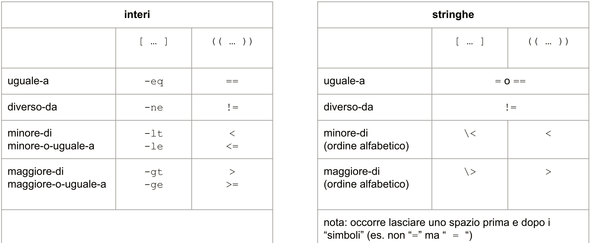


### ==Operatori unari==

- ==Il carattere **`!`** può essere usato per **negare** il confronto seguente==
- ==Verificare se una **stringa è vuota** o meno==
- ==Controllare l’**esistenza** di un file o di una cartella (`-f`, `-d`, `-e`)==


## Script / Batch

### ~~Esecuzione~~

~~Raccolgono **sequenze di comandi** in un file di testo che può poi essere eseguito~~

- ~~Richiamando il **tool bash** passando il file come argomento~~
- ~~Impostando il **bit `x`**~~
  - ~~Specificando il **path completo**~~
  - ~~Indicando il solo nome se il percorso è presente in **`$PATH`**~~


### ==Elementi particolari==

- ~~Le righe vuote e i **commenti** sono ignorati~~
- ~~La prima riga può essere un **meta-commento**~~
  - ~~Detto hash-bang, she-bang e altri nomi~~
  - ~~`#!application [opts]` identifica un’applicazione cui passare il file~~
    ~~stesso come argomento~~
    - ~~Tipicamente usato per identificare l’interprete da utilizzare~~
- ==Sono disponibili **variabili speciali** per gli argomenti==
  - ==**`$@`, `$#`, ​`$0`, ​`$1`, ...**==


### Esempi

- Subshell e PID

  ```sh
  ### bashpid.sh
  echo $BASHPID
  echo $(echo $BASHPID)
  
  ### CLI
  chmod +x ./bashpid.sh ; echo $BASHPID ; ./bashpid.sh
  ```

- Argomenti

  ```sh
  ### args.sh
  #!/usr/bin/env bash
  nargs=$#
  while [[ $1 != "" ]]; do
      echo "ARG=$1"
      shift
  done
  
  ### CLI
  chmod +x ./args.sh ; ./args.sh uno ; ./args.sh uno due tre
  ```


## Esercizi

> **<u>Es 1</u>** ([slide 38][pdf-01])
>
> 1. ```sh
>    [ -e "$DATA" ] && echo 'T' || echo 'F'
>    ```
>
> 2. ```sh
>    [ -f "$DATA" ] && echo 'file' ||
>    ( [ -d "$DATA" ] && echo 'cartella' || echo '?' )
>    ```
>
> 3. ```sh
>    [ -f "$DATA" ] && echo $(( $(cat "$DATA") )) || echo '?'
>    ```
>
> <p>
>
> **<u>Es 2</u>** ([slide 43][pdf-01])
>
>
> 1. ```sh
>    #!/bin/bash
>    arg=("$@")  # array of arguments
>    for i in "${!arg[@]}"; do
>        echo ${arg[${#arg[@]} - $i - 1]}
>    done
>                                                         
>    #!/bin/bash
>    arg=()  # empty array
>    while [[ "$1" != '' ]]; do
>        arg=("$1" "${arg[@]}")
>        shift
>    done
>    echo ${arg[@]}
>    ```
>
> 2. ```sh
>    #!/bin/bash
>    ls=($(ls))  # array of `ls` stdout
>    for i in ${!ls[@]}; do
>        echo ${ls[${#ls[@]} - $i - 1]}
>    done
>    ```


# [2.][pdf-02] Docker

## Introduzione

### Definizioni

> **Docker**: *tecnologia di virtualizzazione a livello del SO che consente la creazione, la gestione e l’esecuzione di applicazioni attraverso containers*

> **Container**: *ambiente virtualizzato gestito da docker*

- Sono leggeri, **dinamici** ed **isolati**
- Vengono eseguiti **sopra il kernel** di Linux
- Sono basati su **immagini**
- Possono essere creati, avviati, fermati ed eliminati

> **Immagine**: *insieme di istruzioni per la creazione di un container*

- Consente di raggruppare varie **applicazioni** ed eseguirle, con una certa **configurazione**, in maniera rapida attraverso un container


### ~~Docker Container vs. VM~~

| ~~Docker Container~~               | ~~Virtual Machine~~                |
| ---------------------------------- | ---------------------------------- |
| ~~Virtualizzazione a livello OS~~  | ~~Virtualizzazione a livello HW~~  |
| ~~Condividono il kernel~~          | ~~Ogni VM ha il suo OS~~           |
| ~~Avvio e creazione in secondi~~   | ~~Avvio e creazione in minuti~~    |
| ~~Leggere (KB/MB)~~                | ~~Pesanti (GB)~~                   |
| ~~Utilizzo leggero di risorse~~    | ~~Utilizzo intenso di risorse~~    |
| ~~Si distruggono e si rieseguono~~ | ~~Si trasferiscono~~               |
| ~~Minore sicurezza~~               | ~~Maggiore sicurezza e controllo~~ |

~~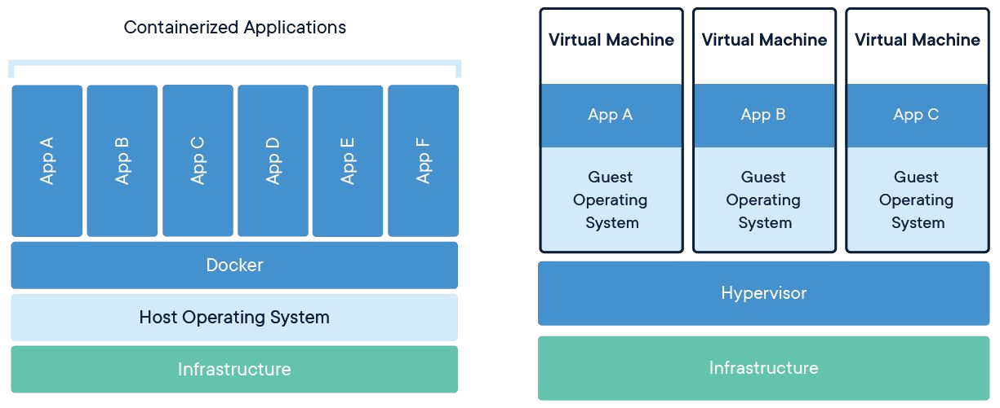~~


### ~~Compatibilità sui vari OS~~

~~Docker gestisce i containers usando il **kernel Linux**~~

- ~~**Linux**: nativo~~
- ~~**Windows**: virtualizzato tramite Hyper-V, gestito da un’applicazione~~
- ~~**Mac**: virtualizzato tramite xhyve, gestito da un’applicazione~~


## Utilizzo

### Gestione dei containers

`docker ...`

- `run [options] <image>`:  crea un nuovo container da un'immagine
- `container ls [options]`:  mostra i containers attivi
- `start/stop <container>`:  avvia/ferma l’esecuzione del container
- `exec [options] <container> <cmd>`:  esegue il comando nel container
- `stats`:  mostra le statistiche di utilizzo dei containers


### Parametri `run` opzionali

- `--name <nome>`:  assegna un nome specifico al container
- `-d`:  (detach mode) scollega il container (ed il suo input/output) dalla console[^*]
- `-ti`:  esegue container in modalità interattiva[^*]
- `--rm`:  elimina container all’uscita
- `--hostname <nome>`:  imposta l’hostname nel container
- `--workdir <path>`:  imposta la cartella di lavoro nel container
- `--network host`:  collega il container alla rete locale[^**]
- `--privileged`:  esegue il container con i privilegi dell’host

[^*]: Per collegarsi `docker attach <container>`<br>Per scollegarsi <kbd>Ctrl</kbd>+<kbd>P</kbd>, <kbd>Ctrl</kbd>+<kbd>Q</kbd>
[^**]: La modalità host non funziona su W10 e MacOS a causa della VM sottostante


### Gestione delle immagini

La **community** di docker offre migliaia di immagini pronte all’uso ma è possibile crearne di nuove

- `docker images`: mostra le immagini salvate
- `docker search <keyword>`: cerca un’immagine nella repository di docker
- `docker commit <container> <repository/imageName>`: crea una nuova immagine dai cambiamenti nel container

Altrimenti si possono creare **nuove immagini** con dei **dockerfile**


### Dockerfile

> **Dockerfile**: *documenti testuali che raccolgono comandi necessari alla creazione di una nuova immagine*

Ogni nuova immagine sarà generata a partire da un’**immagine di base**

- es.: Ubuntu, immagine minimale ‘scratch’

La creazione a partire da un docker file viene gestita attraverso del **caching** che ne permette la **ricompilazione rapida** in caso di piccoli cambiamenti

```haxe
FROM ubuntu:20.04
RUN apt-get update && apt-get install build-essential nano -y
RUN mkdir /home/labOS
CMD cd /home/labOS && bash
```

```sh
docker build -t ubuntu/custom - < dockerfile
```


### Gestione dei volumi

Docker salva i **file persistenti** su

- **Bind mount**
  - Strettamente collegati con il filesystem dell'host OS
  - Consentono una facile comunicazione con il containers
- **Volumi**
  - Sono lo standard in quanto indipendenti, facili da gestire e più in linea con la filosofia di docker

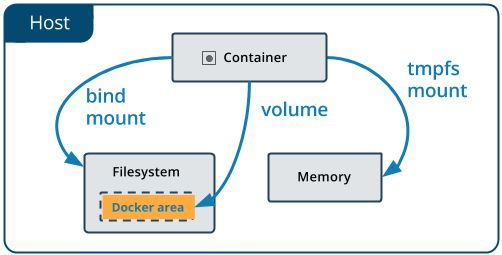

#### Sintassi dei comandi

- `docker volume create <volumeName>`: crea un nuovo volume
- `docker volume ls`: mostra i volumi esistenti
- `docker volume inspect <volumeName>`: esamina volume
- `docker volume rm <volumeName>`: rimuovi volume
- `docker run -v <volume>:</path/in/container> <image>`: crea un nuovo container con il volume specificato, montato nel percorso specificato
- `docker run -v <pathHost>:<path/in/container> <image>` : crea un nuovo container con il bind mount specificato, montato nel percorso specificato


### Il nostro ambiente

```sh
docker run -ti --rm --name="labOS" --privileged  \
-v /:/host -v "$(pwd):/home/labOS"               \
--hostname "labOS" --workdir /home/labOS         \
ubuntu:20.04 /bin/bash
```

- Quando il container è pronto si può fare il **commit** per salvare le modifiche in una nuova immagine
  - es.:  `docker commit ... localhost.ext/unitn:labso2021`
- NB: se non si aggiunge il flag `-rm`, ogni volta che si esce il container verrà fermato e potrà essere riavviato con  `docker start labOS`

#### Alternativa

Usare il **dockerfile** per creare un’immagine del laboratorio

```sh
docker build -t labOS/ubuntu - < dockerfile
```

E poi è possibile usare il comando

```sh
docker run -ti --rm --name="labOS" --privileged  \
-v /:/host -v "$(pwd):/home/labOS"               \
--hostname "labOS" --workdir /home/labOS         \
labOS/ubuntu
```


# [3.][pdf-03] GCC e errori in C

## Gnu Compiler Collection

### Introduzione

> **GCC**: *insieme di strumenti open-source che costituisce lo standard per la creazione di eseguibili su Linux*

Supporta **diversi linguaggi** e consente la modifica dei vari passaggi intermedi per una completa personalizzazione dell’eseguibile


### ==Compilazione==

Gli strumenti GCC possono essere chiamati **singolarmente**

```sh
gcc -E <sorgente.c>			[ -o <preProcessed.ii|.i> ]
gcc -S <preProcessed.ii|.i>	[ -o <assembly.asm|.s>    ]
gcc -c <assembly.asm|.s>	[ -o <objectFile.obj|.o>  ]
gcc    <objectFile.obj|.o>	[ -o <executable.out>     ]
```

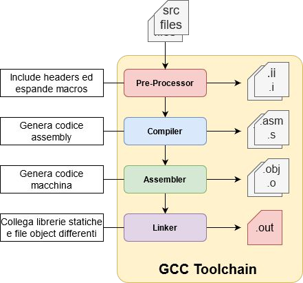

> <u>Note</u>
>
> - L’input di ogni comando può essere il **file sorgente**
> - L’ultimo comando è grado di creare direttamente l’**eseguibile**
> - Assembly e codice macchina generati dipendono dall’**architettura**

> <u>Esempio</u>: [slide 4][pdf-03]


## Gestione errori in C

### Errori

Durante l’**esecuzione** di un programma possono verificarsi diversi tipi di errori

- e.g.: system calls che falliscono, divisioni per zero, problemi di memoria...

Alcuni di questi **errori non fatali** possono essere **indagati** con la **variabile `errno`**

- Variabile globale contiene l’ultimo codice di errore generato dal sistema


### Decodifica

**Decodificare** un **codice di errore**

- `char *strerror(int errnum)`:  in una stringa comprensibile
- `void perror(const char *str)`:  stampa su stderr la stringa passatagli come argomento concatenata con `strerror(errno)` tramite `:`

La gestione degli errori è fondamentale

- Occorre coprire tutti i **casi logici**
- In particolare verificare che ogni chiamata alle **syscall** non fallisca

[Esempi (slides 5-6)][pdf-09]


# [4.][pdf-04] Make

## Introduzione

### Make tool

> **Make tool**: *strumento della collezione GNU, usato per gestire la compilazione automatica e selettiva di progetti*

Consente di

- Specificare delle **dipendenze** tra i vari file
  - Compilare le sole **librerie** i cui sorgenti sono modifcati
- Gestire il **deployment** di un’applicazione
  - Assume alcune delle capacità di uno **script bash**
- Eseguire i **makefiles**


### ==Makefile==

> **Makefile**: *file contenente le direttive utili allo svolgimento di un task* 

- Solitamente la **compilazione** di un’applicazione
- Makefiles **secondari** possono essere inclusi nel principale
  - ~~Consente una gestione più articolata di grandi progetti~~

```sh
make -f <makefile>
```

==Il comando `make` senza argomenti processa il file `makefile` presente nella cartella di lavoro==

- ==Nell’ordine cerca: `GNUmakefile`, `makefile` e `Makefile`==


## Makefile

### ==Elementi==

> ==**Ricetta**: *lista di comandi bash che vengono eseguiti indipendentemente dal resto del makefile*==

> ==**Target**: *file generati da uno specifico insieme di regole*==

- ==Ogni target può specificare dei **prerequisiti**==

> ==**Prerequisiti**: *file necessari affinchè le regole di un target vengano eseguite*==

- ==Un prerequisito può essere esso stesso un **target**==


### ==Struttura==

```makefile
target: prerequisite
 →  recipe	
 →  recipe	
 →  ...	
```

```makefile
target1: target2 target3
	rule (3)
	rule (4)
	...
target2: target3
	rule (1)
target3:
	rule (2)
```


### ==Esecuzione==

==L’**esecuzione** di un file make==

1. ==Inizia specificando zero o più **target**==

   ```makefile
   make -f makefile [target1] [target2] [...]
   ```

   - ==Di default il primo del makefile se non specificato==

2. ==Prosegue a seconda dei vari **prerequisiti**==


### ==Sintassi==

==Un makefile è un **plain text file** in cui le **ricette**==

- ==Devono partire con un **carattere <kbd>TAB</kbd>** (non <kbd>SPACE</kbd>)==
- ==Che iniziano con `@` (<kbd>TAB</kbd> escluso) sono **eseguiti senza visualizzazione**==
  - ==Altrimenti i comandi sono **visualizzati e poi eseguiti**==
- ==Una riga con un singolo <kbd>TAB</kbd> è una **ricetta vuota**==


### ==Target speciali==

- ==**Default**: si esegue il **primo target disponibile** se non ne viene passato alcuno==
- ==**`.INTERMEDIATE`** e **`.SECONDARY`**: hanno come **prerequisiti i target intermedi**==
  - ==Nel primo caso sono poi **rimossi**==
  - ==Nel secondo sono **mantenuti** a fine esecuzione==
- ==**`.PHONY`**: ha come prerequisiti i **target che non corrispondono a dei file** o comunque da eseguire sempre senza verificare l’eventuale file omonimo==

==Il carattere **`%`**==

- ==In un **target** sostituisce qualunque stringa==
- ==In un **prerequisito** corrisponde alla stringa sostituita nel target==

> <u>Esempio</u>
>
> ```makefile
> all: ...	
> 	rule
> .SECONDARY: target1 ...	
> .PHONY: target1 ...	
> %.s: %.c	
>   # prova.s: prova.c
>   # src/h.s: src/h.c
> ```


### ==Variabili utente e automatiche==

- ==Variabili **utente**==
  - ==**Definizione**:  `nome:=valore` o `nome=valore`==
  - ==**Accesso**:  `$(nome)`==
  - ==**Sovrascrittura** da riga di comando:  `make nome=value`==
- ==Variabili **automatiche**==
  - ==Possono essere usate all’interno delle regole per riferirsi ad elementi specifici relativi al **target corrente**==
  - ==`$@`  target==
  - ==`$^`  lista prerequisiti==
  - ==`$<`  primo prerequisito==

> <u>Esempi</u>
>
> - Utente
>
>   ```makefile
>   ONCE:=hello $(LATER)
>   EVERY=hello $(LATER)
>   LATER=world
>   target1:
>   	echo $(ONCE)  # 'hello'
>   	echo $(EVERY) # 'hello world'
>   ```
>
> - Automatiche
>
>   ```makefile
>   target: pre1 pre2 pre3
>   	echo $@  # 'target'
>   	echo $^  # 'pre1 pre2 pre3'
>   	echo $<  # 'pre1'
>   ```


### ==Funzioni speciali==

- ==`$(eval ...)`: consente di creare nuove regole make dinamiche==
- ==`$(shell ...)`: cattura l’output di un commando shell==
- ==`$(wildcard *...)`: restituisce un elenco di file corrispondenti alla stringa==

> <u>Esempio</u>
>
> ```makefile
> LATER=hello
> PWD=$(shell pwd)
> OBJ_FILES:=$(wildcard *.o)
> target1:
> 	echo $(LATER)  # 'hello'
> 	$(eval LATER += world)
> 	echo $(LATER)  # 'hello world'
> ```


### ==Esempio==

```makefile
all: main.out
	@echo "Application compiled"
%.s: %.c
	gcc -S $< -o $@
%.out: %.s
	mkdir -p build
	gcc $< -o build/$@
clean:
	rm -rf build *.out *.s
.PHONY: clean
.SECONDARY: make.s
```

```makefile
OUT = master.out slave.out

all: $(OUT)
	@echo "Compilazione completata: $^"

$(OUT): %.out: %.c
	@echo "Compilando $<"
	gcc $< -o $@
	@echo "$< compilato"
	@echo "----"
```


## Esercizi

> [Slide 10][pdf-04]
>
> ```makefile
> help:
> 	echo 'Usage:'
> 	echo '  make -f mf-backup FOLDER=<folder_name>'
> 	echo '  make -f mf-restore FOLDER=<folder_name>'
> mf-backup:
> 	cp $(FOLDER) "$(FOLDER).bak"
> ```


# [5.][pdf-05] Linguaggio C

## Fondamenti

### ~~Vantaggi~~

- ~~Struttura minimale~~
- ~~Poche parole chiave (anche svantaggi)~~
- ~~Unix compliant~~
  - ~~Alla base di Unix, nato per scrivere Unix~~
- ~~Organizzato a passi~~
  - ~~Sorgente, file intermedi ed eseguibile finale~~
- ~~Disponibilità di librerie conosciute e standard~~
- ~~Nessuna struttura di alto livello (classi)~~
- ~~Efficiente perché di basso livello~~
- ~~Pieno controllo del programma e delle sue risorse~~


### ==Direttive==

Il compilatore, in fase di **preprocessing**, elabora le direttive presenti nel sorgente

Ogni direttiva viene **introdotta con `#`**

- `#include <lib>`: **copia** il contenuto del file lib, cercanto nelle **cartelle delle librerie**, nel file corrente
- `#include "lib"`: come sopra ma cerca prima anche nella **cartella corrente**
- `#define VAR VAL`: crea una **costante** `VAR` con il contenuto `VAL`, e sostituisce ogni occorrenza di `VAR` con `VAL`
- `#define MUL(A,B) A*B`: dichiara una **funzione** con parametri `A` e `B`
- `#ifdef`, `#ifndef`, `#if`, `#else`, `#endif`: rende l’inclusione di parte di codice dipendente da una condizione

==**Macros** possono essere passate a GCC con `-D NAME=VALUE`==


### ~~Tipi e casting~~

~~C è un linguaggio **debolmente tipizzato** che utilizza 8 **tipi fondamentali**~~

- ~~`void` (0 byte)~~
- ~~`char` (1 byte)~~
- ~~`short` (2 bytes)~~
- ~~`int` (4 bytes)~~
- ~~`long` (8 bytes)~~
- ~~`float` (4 bytes)~~
- ~~`double` (8 bytes)~~
- ~~`long double` (8 bytes)~~

<p>

- ~~È possibile fare il **casting** tra tipi differenti con `(type)var`~~
- ~~La **grandezza** delle variabili è dipendente dall’**architettura** di riferimento~~
- ~~I valori massimi cambiano a seconda se la variabile è **signed** o **unsigned**~~
- ~~Non esiste il tipo **boolean**, ma viene spesso emulato con un **char**~~


## Costrutti

### Array e stringhe

C supporta l’uso di stringhe, corrispondenti ad **array di caratteri**

```c
int nome[DIM];
long nome[] = {1, 2, 3, 4};
char string[] = "ciao";
char string2[] = {'c', 'i', 'a', 'o', '\0'};
nome[0] = 22;
```

Gli array sono di **dimensione statica**

- Non possono essere ingranditi durante l’esecuzione del programma
- Per array dinamici dovranno essere usati costrutti particolari (come `malloc`)

Le **stringhe** acquisite in input o dichiarate con la sintassi `"string"`

- Terminano con il **carattere `'\0'`**
- Sono di grandezza `str_len + 1`


### ==Puntatori di variabili==

> ==**Puntatore**: *alias per zone di memorie condivise tra diverse variabili/funzioni*==

==L’uso di puntatori è abilitato dagli **operatori `*` e `&`**==

- ==**`*`** ha significati diversi se usato in una dichiarazione o in un’assegnazione==
  - ==`type *punt;`  **crea un puntatore** a `type`==
  - ==`type valore = *(punt);`  **ottiene valore** puntato==
- ==**`&` ottiene l’indirizzo di memoria** in cui è collocata una certa variabile==
  - ==`long whereIsValore = &valore;`==

> <u>Esempi</u>: [slides 7-8][pdf-05]


### ==Puntatori di funzioni==

```c
#include <stdio.h>
float xdiv(float a, float b) {
    return a / b;
}
float xmul(float a, float b) {
    return a * b;
}
void main() {
    float (*punt)(float, float);
    punt = xdiv;
    float res = punt(10, 10);
    printf("%f\n", res);
    punt = &xmul;
    res = (*punt)(10, 10);
    printf("%f\n", res);
}
```


### Main

```c
/* main.c */
#include <stdlib.h>
#include <stdio.h>
#define DIVIDENDO 3
int division(int var1, int var2, int *result) {
    *result = var1 / var2;
    return 0;
}
void main(int argc, char *argv[]) {
    float var1 = atof(argv[1]);
    float result = 0;
    division((int)var1, DIVIDENDO, (int *)&result);
    printf("%f \n", result);
}
```


## ~~Struttura~~

### ~~Main~~

- ~~A parte casi particolari l’applicazione deve avere una **funzione `main`** che è utilizzata come **punto di ingresso**~~
- ~~Il tipo della funzione è `void` o `int` se è indicato un **valore di ritorno**~~
  - ~~Un intero che rappresenta il **codice di uscita** dell’applicazione~~
  - ~~**0 di default** se omesso~~
  - ~~Variabile `$?` in bash~~
- ~~Quando la funzione è invocata riceve normalmente in input~~
  - ~~`argc`: il numero di argomenti, incluso l’eseguibile~~
  - ~~`**argv`: la lista degli argomenti, come vettore di stringhe~~


### ~~Direttive e istruzioni fondamentali~~

- ~~`#include ... / #define ...`~~
- ~~`char / int / ... / enum`~~
- ~~`for ( initialization ; test; increment ) { ... ; }`~~
- ~~`break / continue`~~
- ~~`switch (expr) { case val: ... [break;] [default: ...] }`~~
- ~~`while (expression) { ... } / do { ... } while (expression)`~~
- ~~`if (expression) { ... } [else { ... }]`~~
- ~~`struct / union`~~

~~[Esempi][pdf-05]~~


### ~~Librerie standard~~

~~Le librerie possono essere usate attraverso la direttiva `#include`~~

- ~~`stdio.h: FILE, EOF, stderr, stdin, stdout, fclose(), ...`~~
- ~~`stdlib.h: atof(), atoi(), malloc(), calloc(), free(), exit(), system(), rand(), ...`~~
- ~~`string.h: memset(), memcpy(), strncat(), strcmp(), strlen(), ...`~~
- ~~`math.h: sin(), cos(), sqrt(), floor(), ...`~~
- ~~`unistd.h: STDOUT_FILENO, read, write, fork, pipe, ...`~~
- ~~`fcntl.h: creat, open, ...`~~


### ~~Dati~~

- ~~`struct`: aggrega diverse variabili~~
- ~~`union`: crea dei tipi generici che possono ospitare uno di vari tipi specificati~~
- ~~`typedef`: definisce nuovi tipi di variabili o funzioni~~
- ~~`enum`~~ 


## Files

### ==Interazione con i file==

==In UNIX ci sono due **modi per interagire** con i files==

- ==**Stream**: fornisce strumenti come formattazione dei dati, bufferizzazione ecc.==
- ==**File descriptor**: interfaccia di basso livello costituita dalle system calls==


### ==Streams==

- ==Un <u>file</u> è descritto da un **puntatore a una struttura di tipo `FILE`**==
  - ==Definita in `stdio.h`==
- ==I <u>dati</u> possono essere letti, scritti e interpretati in **vari modi**==
  - ==Un carattere alla volta, una linea alla volta...==

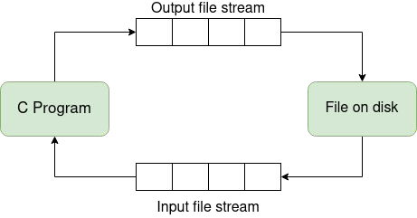

[Esempi][pdf-05]


### ==File descriptors==

- ==Un <u>file</u> è descritto da un **intero (file descriptor) che punta alla rispettiva entry nella file table del SO**==
- ==I <u>dati</u> possono essere letti e scritti soltanto **un buffer alla volta**==
  - ==**Dimensione** stabilita dal programmatore==
- ==Un insieme di **system calls** permette di effettuare le operazioni di I/O==
  - **Controllo maggiore**
  - Interfaccia meno amichevole


#### ==Accesso==

==Per **accedere** al contenuto di un file==

- ==Creare un **canale di comunicazione con il kernel**==
- ==Aprendo il file con la **system call `open`**==
  - ==**Localizza l’i-node** del file==
  - ==**Aggiorna la file table** del processo==


#### ==File table==

==A ogni **processo** è associata una **tabella dei file aperti**==

- ==Dimensione **limitata**==
  - ~~Circa 100 elementi~~
- ==Ogni elemento rappresenta un **file aperto dal processo**==
  - ==Individuato da un **indice intero (file descriptor)**==

==I file descriptor **0, 1 e 2** individuano **standard** input, output ed error==

- ==Aperti **automaticamente**==

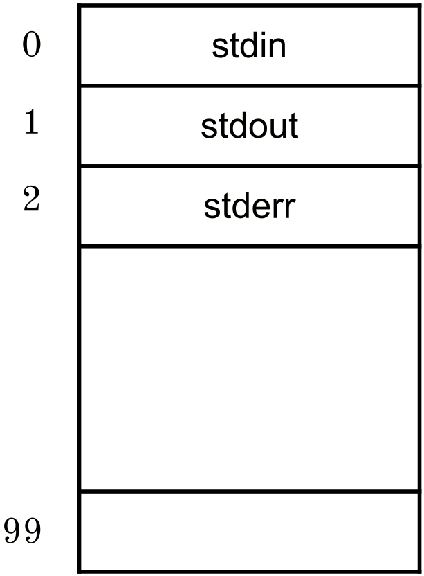


#### ==Tabelle dei files==

==Il **kernel** gestisce l’accesso ai files attraverso due **strutture dati**==

- ==**Tabella dei files attivi**==
  - ==Contiene una copia dell’**i-node** di ogni **file aperto** (per efficienza)==
- ==**Tabella dei files aperti**==
  - ==Contiene un elemento **per ogni file aperto** e non ancora chiuso, contenente==
    - ==**I/O pointer**: posizione corrente nel file==
    - ==**i-node pointer**: puntatore a i-node corrispondente==
  - ==Può avere **più elementi** corrispondenti allo **stesso file**==

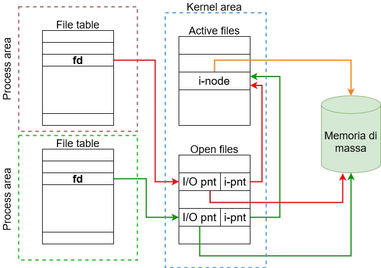

<p>

#### ==Unix I/O==

==L’I/O Unix è basato essenzialmente su cinque funzioni==

- ==`open`,  `read`,  `write`,  `lseek`,  `close`==

~~[Esempi][pdf-05]~~


### ==Canali standard==

- ==**Rappresentazione** dei canali standard (in 0, out 1, err 2)==
  - ==**Strutture stream**  `std*`  (streams)==
  - ==**Macro**  `STD*_FILENO`  (file descriptors)==
- ==La funzione **`fileno`** restituisce l’**indice** di uno stream==
  - ==`fileno(std*) == STD*_FILENO == [ 0 | 1 | 2 ]`==
- ==`isatty(stdin) ==`==
  - ==`1`  se l’esecuzione è interattiva==
  - ==`0`  altrimenti==
- ==`printf("ciao");` e `fprintf(stdout, "ciao");` sono equivalenti==

~~[Esempi][pdf-06]~~


## Funzioni e operatori

### `printf` / `fprintf`

```c
int printf(const char *format, [placeholder args])
int fprintf(FILE *stream, const char *format, [placeholder args])
```

**Inviano dati**

- Sul **canale**
  - `printf`: stdout
  - `fprintf`: su quello specificato
- Secondo il **formato** indicato, ovvero una **stringa** contenente
  - **Caratteri stampabili**
  - Eventuali **segnaposto**
    - Identificabili dal formato generale
      `%[flags][width][.precision][length]specifier`
    - Ad ogni segnaposto deve corrispondere un argomento del tipo corretto


### `sizeof`

```c
sizeof (type)
sizeof expression
```

Restituisce il numero di **bytes** occupati in memoria dal tipo

- Passato **come argomento** (tra parentesi)
- **Dell’espressione**


### `exit`

```c
void exit(int status)
```

**Termina il processo** restituendo il valore `status` come **codice di uscita**

- Equivale a `return status;` all'interno di `main`

La funzione **non ha un valore di ritorno**

- Peché non sono eseguite ulteriori istruzioni dopo di essa
- Il **processo chiamante** è informato della terminazione da un **segnale apposito**


## Vettori e stringhe

### ==Vettori==

> **Vettore**: *sequenza di elementi omogenei*

- Liste di dati dello **stesso tipo**
- ==Si realizzano con un **puntatore al primo elemento** della lista==
  - ==`arr[n] == *(arr + n)`==
  - ==`str[0] == *(str + 0) == *(str) == *str`==

La dichiarazione con inizializzazione riserva **aree di memoria consecutive**

- Di **dimensione** pari a quella richiesta per ogni singolo tipo specificato
- In **numero** pari a quello specificato dal programmatore


### Stringhe

> **Stringa**: *vettori di caratteri*

- Puntatore a **sequenza di bytes**
  - La cui **terminazione** è definita dal valore convenzionale **`0`**
  - Un **carattere** tra apici singoli equivale all’**intero** del codice corrispondente


### ~~Argomenti da CLI~~

~~Il **parsing** degli argomenti da CLI si effettua~~

- ~~Con `getopt` e `getopt_long` della libreria **`getopt.h`**~~
- ~~**Manualmente** scorrendo gli argomenti~~
  - ~~[Esempio][pdf-05]~~


### Funzioni stringhe

Dato che le stringhe sono riferite con un puntatore al primo carattere non ha senso fare assegnamenti e confronti diretti

La libreria standard ==**`string.h`**== definisce

- ==`char * strcat(char *dest, const char *src)`==
  Append di `src` in coda a `dest`
- ==`char * strchr(const char *str, int c)`==
  Cerca la prima occorrenza di c in str
- ==`int strcmp(const char *str1, const char *str2)`==
  Confronta `str1` con `str2`
- ==`size_t strlen(const char *str)`==
  Calcola la lunghezza di `str`
  - `size_t` è un intero senza segno definito dalla stessa libreria


## Piping via bash

### ==Canali==

- Normalmente l’applicazione richiamata da bash ha accesso ai **canali standard**
- ==Se l’applicazione è inserita via bash in un **piping**==
  - ==Accede all’output del comando a **sinistra** da **stdin**==
  - ==Invia il suo output al comando di **destra** su **stdout**==


## Esercizi

> [Slide ][pdf-05]
>
> ```c
> #include <stdio.h>
> int main(int argc, char **argv) {
>     if (argc != 2) {
>         fprintf(stderr, "Usage: %s <string>\n", argv[0]);
>         return 1;
>     }
>     char *p = argv[1];
>     int count = 0;
>     while (*(p++) != 0) count++;
>     printf("%d\n", count);
>     return 0;
> }
> ```
>
> ```c
> #include <stdio.h> 
> #include <string.h>
> #define ARGS 3
> const char VALID[ARGS][256] = {"aa", "bb", "cc"};
> int main(int argc, char **argv) {
>  int a, v;
>  for (a = 1; a < argc; a++) {
>      int valid = 0;
>      for (v = 0; v < ARGS; v++) {
>          if (strcmp(argv[a], VALID[v]) == 0) {
>              valid = 1;
>              break;
>          }
>      }
>      if (!valid)
>          fprintf(stderr, "Opzione errata: %s\n", argv[a]);
>  }
>  return 0;
> }
> ```
>
> ```c
> #include <stdio.h> 
> #include <stdlib.h> 
> #include <string.h>
> char *stringrev(char *str);
> int stringpos(char *str, char chr);
> int main(int argc, char **argv) {
>      printf("%s\n", stringrev(argv[1]));
>      printf("%d\n", stringpos(argv[1], argv[2][0]));
>      return 0;
> }
> char *stringrev(char *str) {
>      const int L = strlen(str);
>      char *ret = malloc(L + 1);
>      int i;
>      for (i = 0; i < L; i++)
>          ret[i] = *(str + L - i - 1);
>      ret[L] = 0;
>      return ret; 
> }
> int stringpos(char *str, char chr) {
>      for (int i = 0; i < strlen(str); i++) {
>          if (str[i] == chr)
>              return i;
>      }
>      return -1;
> }
> ```


# [6.][pdf-06] System calls

## Architettura

### ~~Kernel Unix~~

> ~~**Kernel**: *nucleo del SO, elemento di base di un sistema \*nix, incaricato della gestione delle risorse essenziali*~~

~~Ad ogni **boot**~~

1. ~~Verifica lo stato delle **periferiche**~~
2. ~~Monta la prima **partizione** in read-only~~
3. ~~Lancia il primo **programma** (`/sbin/init`)~~
4. ~~Il resto delle operazioni vengono gestite con i **programmi eseguiti dal kernel**~~


### ~~Kernel e memoria virtuale~~

~~I **programmi** utilizzati dall’utente~~

- ~~Accedono alle **periferiche attraverso il kernel**~~
- ~~L’**interazione** tra programmi ed il resto del SO viene **mascherata** da alcune caratteristiche intrinseche ai processori~~
  - ~~Gestione hardware della **memoria virtuale**~~
  - ~~**Modalità protetta**~~
- ~~Ogni programma vede se stesso come **unico possessore della CPU**~~
  - ~~Non gli è possibile **disturbare** l’azione degli altri programmi~~
  - ~~**Stabilità** dei sistemi \*nix~~


### ==Privilegi==

==Nei sistemi \*nix ci sono **due livelli** di privilegi==

- ==**User space**: ambiente in cui vengono eseguiti i programmi==
- ==**Kernel space**: ambiente in cui viene eseguito il kernel==

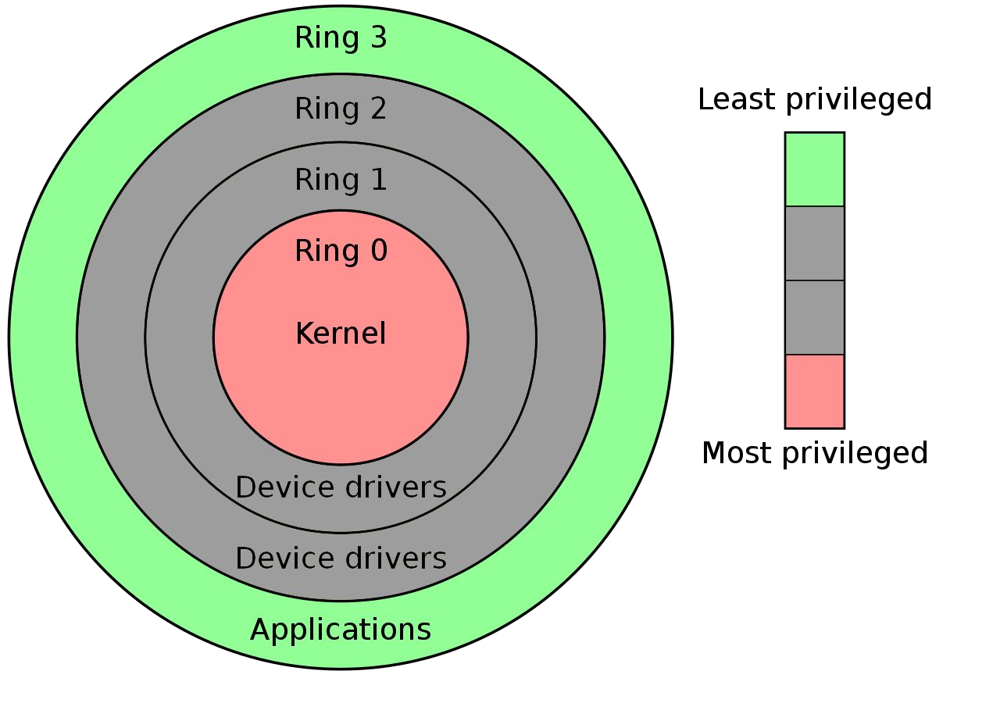

<p>


## Syscalls

### ==Definizione==

> ==**System calls**: *interfacce con cui i programmi accedono all’hardware*==

==Chiamate al sistema che il **kernel esegue nel kernel space**, restituendo i **risultati** al programma chiamante **nello user space**==

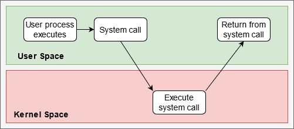


### Errori

In caso di **errore** la chiamata

- **Restituisce `-1`**
- Setta la **variabile globale `errno`**
- **Errori validi** sono numeri positivi e seguono lo standard POSIX
  - Il quale definisce degli **alias**


### ~~Librerie di sistema~~

~~Il comando shell `ldd` su un eseguibile restituisce le **librerie condivise caricate**~~

~~Fra queste vi sono tipicamente~~

- ~~**`ld-linux.so`**: quando un programma è caricato il SO passa il controllo a `ld-linux.so` anzichè al normale punto di ingresso dell’applicazione, così da **caricare le librerie non ancora risolte** e poi passarle il controllo~~
- ~~**`libc.so`** (`glibc`): libreria GNU C contenente le **funzioni basilari** più comuni~~

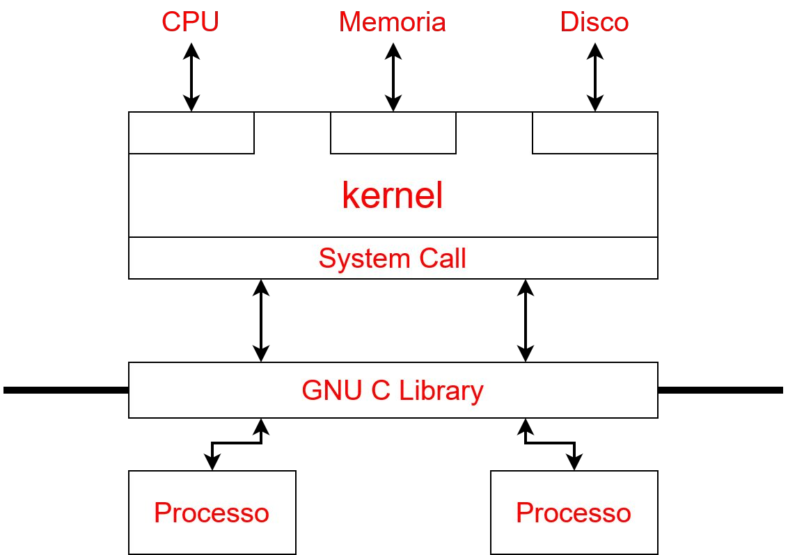


## Syscalls in C

### Get time

```c
time_t time  (time_t *second)
char  *ctime (const time_t *timeSeconds)
```

```c
#include <time.h>
#include <stdio.h>
void main() {
    time_t whatTime = time(NULL);  // seconds since 1/1/1970
    // Print date in Www Mmm dd hh:mm:ss yyyy
    printf("Current time = %s", ctime(&whatTime));
}
```


### Working directory

```c
int   chdir  (const char *path)
char *getcwd (char *buf, size_t sizeBuf)
```

```c
#include <unistd.h>
#include <stdio.h>
void main() {
    char s[100];
    chdir("..");                    // Change working dir
    printf("%s\n", getcwd(s,100));  // Print current working dir
}
```


### ==Operazioni con i file==

```c
int     open   (const char *pathname, int flags, mode_t mode)
int     close  (int fd)
ssize_t read   (int fd, void *buf, size_t count)
ssize_t write  (int fd, const void *buf, size_t count)
off_t   lseek  (int fd, off_t offset, int whence)
FILE   *fopen  (const char *filename, const char *mode)
int     fclose (FILE *stream)
```


### ==Duplicazione file descriptors==

```c
int dup  (int oldfd)
int dup2 (int oldfd, int newfd)
```

```c
#include <unistd.h>
#include <stdio.h>
#include <fcntl.h>
void main() {
    char buf[50];
    int fd = open("file.txt", O_RDWR);  // file exists
    read(fd, buf, 50);
    printf("Content: %s\n", buf);
    int cpy = dup(fd);  // Create copy of file descriptor
    dup2(cpy, 22);  // Copy cpy to fd 22 (close 22 if opened)
    lseek(cpy, 0, SEEK_SET);  // move I/O on all 3 fds
    write(22, "This is a fine ", 15);  // Write starting from 0
}
```

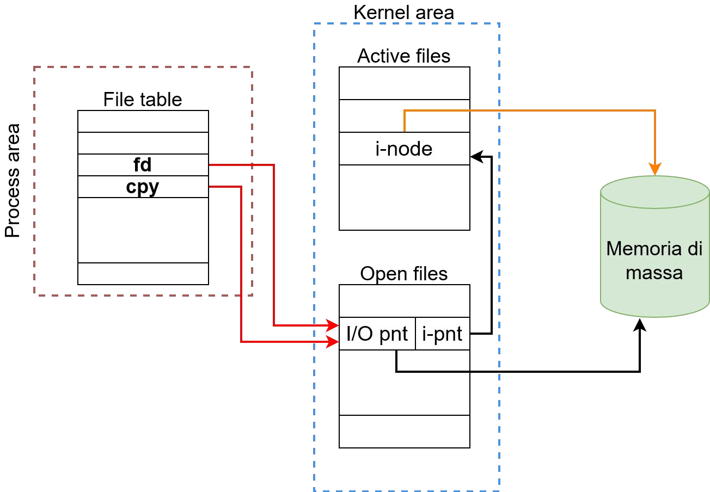


### Permessi

```c
int chown  (const char *pathname, uid_t owner, gid_t group)
int chmod  (const char *pathname, mode_t mode)
int fchown (int fd, uid_t owner, gid_t group)
int fchmod (int fd, mode_t mode)
```

```c
#include <fcntl.h>  // execute with sudo
#include <unistd.h>
#include <sys/stat.h>
void main() {
    int fd = open("file", O_RDONLY);
    fchown(fd, 0, 0);  // Change owner to root:root
    chmod("file", S_IRUSR|S_IRGRP|S_IROTH);  // Permission to r/r/r
}
```


### ==Eseguire programmi==

```c
int execv   (const char *path, char *const argv[])
int execvp  (const char *file, char *const argv[])
int execvpe (const char *file, char *const argv[],
             char *const envp[])
int execl   (const char *path, const char *arg0, ..., argn, NULL)
int execlp  (const char *file, const char *arg0, ..., argn, NULL)
int execle  (const char *file, const char *arg0, ..., argn, NULL,
             char *const envp[])
int execve  (const char *file, char *const argv[],
             char *const envp[])
```

| Funzione | Caratteristica                                               |
| :------: | :----------------------------------------------------------- |
|   `p`    | Non serve specificare il path                                |
|   `v`    | Gli argomenti saranno passati alla funzione tramite un array di puntatori |
|   `e`    | L'insieme dei puntatori dell'env è passato esplicitamente al processo figlio |
|   `l`    | Gli argomenti a riga di comando sono passati individualmente alla funzione |

<p>

#### `execv()`


```c
#include <unistd.h>                                  // execv1.out
#include <stdio.h>
void main() {
    char *argv[] = {"par1", "par2", NULL};
    execv("./execv2.out", argv);  // Replace current process
    printf("This is execv1\n");
}
```

```c
#include <stdio.h>                                   // execv2.out
void main(int argc, char **argv) {
    printf("This is execv2 with %s and %s\n", argv[0], argv[1]);
}
```

<p>

#### `execle()`

```c
#include <unistd.h>
#include <stdio.h>
void main() {
    char * env[] = {"CIAO = hello world", NULL};
    // Replace process
    execle("./execle2.out", "par1", "par2", NULL, env);
    printf("This is execle1\n");
}
```

<p>

#### `dup2(), exec()`

```c
#include <stdio.h>
#include <fcntl.h>
#include <unistd.h>
void main() {
    int outfile = open("/tmp/out.txt", 
                       O_RDWR | O_CREAT, S_IRUSR | S_IWUSR);
    dup2(outfile, 1);  // Copy outfile to FD 1
    char *argv[] = {"./time.out", NULL};  // es precedente
    execvp(argv[0], argv);  // Replace current process
}
```


### ==Chiamare la shell==

```c
int system(const char *string)
```

```c
#include <stdlib.h>
#include <stdio.h>
void main() {
    // '/bin/sh -c string'
    int outcome = system("echo ciao");  // execute in shell
    printf("%d\n", outcome);
    outcome = system(
        "if [[ $PWD < \"ciao\" ]]; then echo min; fi"
    );
    printf("%d\n", outcome);
}
```


## Forking

### ==Syscall fork==

> ==**Forking**: *generazione di nuovi processi a partire da uno esistente*==

- ==Uno alla volta==

==La **syscall** principale per il forking è **`fork`**==

1. ==Un **processo** attivo **invoca la syscall**==
2. ==Il **kernel lo clona** modificando alcune informazioni==
   - ==In particolare quelle che riguardano la sua collocazione nella **gerarchia complessiva dei processi**==

I **processi** si definiscono

- **Padre**: quello che effettua la chiamata
- **Figlio**: quello generato


### ==Elementi clonati e nuovi==

- ==Sono **clonati** gli **elementi principali**==
  - ==PC (Program Counter)==
  - ==Registri==
  - ==Tabella dei file (file descriptors)==
  - ==Dati di processo (variabili)==
- ==Sono **aggiornate** le **meta-informazioni**==
  - ==PID==
  - ==PPID==

==L’**esecuzione** procede per entrambi (quando saranno schedulati) da **PC+1**==

- ==Istruzione seguente il fork==
- ==Valutazione dell’espressione in cui essa è utilizzata==


### Identificativi dei processi

- Ad ogni **processo** è associato un **identificativo univoco per istante temporale**
  - Organizzati **gerarchicamente** (padre-figlio)
  - Suddivisi in insiemi principali (**sessioni**) e secondari (**gruppi**)
- Gli **utenti** hanno un identificativo e ad ogni processo ne sono abbinati due
  - Reale
  - Effettivo (di esecuzione)

Codici

- **PID** - Process
- **PPID** - Parent Process
- **SID** - Session
- **PGID** - Process Group
- **(R)UID** - (Real) User
- **EUID** - Effective User


### ==Valore di ritorno==

==**`fork()`** restituisce un **valore**==

- ==**`-1` in caso di errore**==
  - ==Non ci sarà un nuovo processo==
  - ==Solo quello che ha invocato la chiamata==
- ==Se ha **successo**, entrambi i processi ricevono un valore, **diverso nei due casi**==
  - ==Il **padre** riceve come valore il **nuovo PID del figlio**==
  - ==Il **figlio** riceve come valore **`0`**==


### ==Relazione tra i processi==

==I processi **padre-figlio**==

- ==**Conoscono reciprocamente il loro PID**==
  - ==Ciascuno conosce il proprio tramite **`getpid()`**==
  - ==Il figlio conosce quello del padre con **`getppid()`**==
  - ==Il padre conosce quello del figlio come **valore di ritorno di `fork()`**==
- ==**Variabili** definite prima del fork sono valorizzate allo **stesso modo** in entrambi==
  - ==Se riferiscono risorse fanno riferimento esattamente alla stessa risorsa==
    - ==Es.: file descriptor per un file su disco==
- ==Si possono usare **altre syscall** per semplici interazioni==
  - ==Come `wait()` e `waitpid()`==

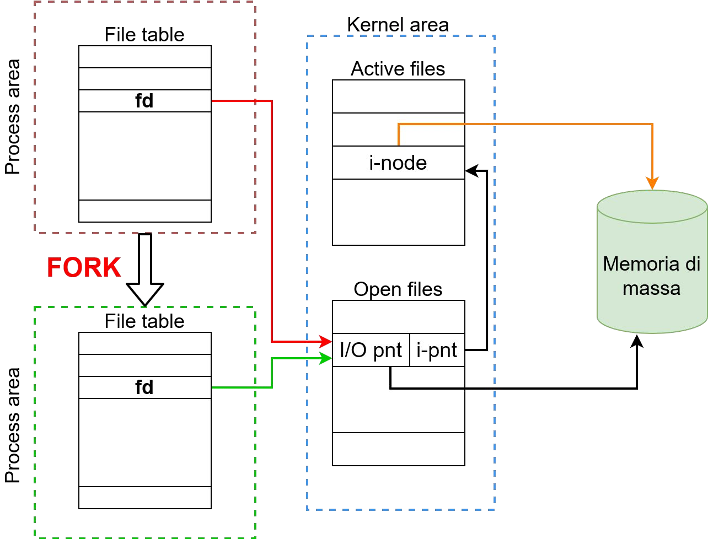


### ==Processi zombie e orfani==

==Quando un processo **termina**, il suo stato di uscita è **catturato dal padre**==

==Alla terminazione il sistema tiene traccia di questo insieme di informazioni fino a che il padre non le utilizza (con `wait` o `waitpid`)==

- ==Se il padre **non cattura** lo stato d’uscita, i processi figli sono definiti **zombie**==
  - ==Non ci sono più, ma esiste un **riferimento** nel sistema in sospeso==
- ==Se un **padre termina prima** del figlio, quest’ultimo è definito **orfano**==
  - ==Viene adottato dal **processo principale** (tipicamente `init` con pid pari a `1`)==
- ==Un processo **zombie** che diventa **orfano** è gestito dal **processo che lo adotta**==
  - ==Effettua periodicamente dei `wait` / `waitpid` appositamente==


## Forking in C

### ==ID getters==

```c
pid_t getpid  ()  // restituisce il PID del processo attivo
pid_t getppid ()  // restituisce il PID del processo padre
```

```c
#include <stdio.h>
#include <unistd.h>
#include <stdlib.h>
void main() {
    printf("$$ = "); fflush(stdout);
    system("echo $$");  // subshell
    printf("PID: %d PPID: %d\n", getpid(), getppid());
}
```

- `pid_t` è un intero che rappresenta un id di processo


### ==Waiting==

```c
pid_t wait    (int *status)
pid_t waitpid (pid_t pid, int *status, int options)
```

- ==`wait`==
  1. ==**Attende la conclusione di UN figlio**==
  2. ==Ne **restituisce il PID**==
  3. ==Riporta lo **status nel puntatore** passato come argomento (se non `NULL`)==
- ==`waitpid`: analogo a `wait`, in più consente di==
  - ==Specificare come **`pid`**==
    - ==`-pid`  (`-pid < -1` per attendere tutti i figli il cui gruppo è `|pid|`)==
    - ==`-1`  (attende un figlio qualunque)==
    - ==`0`  (attende tutti i figli con lo stesso gruppo del padre)==
    - ==`pid`  (`pid > 0`: attende il figlio il cui pid è esattamente `pid`)==
  - ==Passare delle **opzioni**==

> <u>Note</u>
>
> - `wait(st) === waitpid(-1, st, 0)`
> - ==`while (wait(NULL) > 0);`  attende tutti i figli==


#### ==Interpretazione dello stato==

==Lo stato di ritorno è un **numero** che comprende **più valori composti**==

- ==Interpretabili con apposite **macro**==
- ==Utilizzabili come funzione o come valore, passando lo stato ricevuto in risposta==

<u>Esempi</u>

- `WEXITSTATUS(sts)`: restituisce lo stato vero e proprio
  - Es.: il valore usato in `exit`
- `WIFCONTINUED(sts)`: `true` se il figlio ha ricevuto un segnale `SIGCONT`
- `WIFEXITED(sts)`: `true` se il figlio è terminato normalmente
- `WIFSIGNALED(sts)`: `true` se il figlio è terminato per un segnale non gestito
- `WIFSTOPPED(sts)`: `true` se il figlio è attualmente in stato di stop
- `WSTOPSIG(sts)`: numero del segnale che ha causato lo stop del figlio
- `WTERMSIG(sts)`: numero del segnale che ha causato la terminazione del figlio


### ==Fork multiplo==

==La successione di $n$ fork genera $2^n$ processi==

```c
#include <stdio.h>
#include <unistd.h>
int main() {
    fork();
    fork();
    fork();
    printf("hello\n");  // Stampa 8 righe
    return 0;
}
```


### Fork e wait

```c
#include <stdio.h>
#include <stdlib.h>
#include <unistd.h>
#include <time.h>
#include <sys/wait.h>
int main() {
    int fid = fork(), wid, st, r;  // Generate child
    srand(time(NULL));             // Initialise random
    r = rand() % 256;              // Get random
    if (fid == 0) {                // If it is child
        printf("Child... (%d)", r);
        fflush(stdout);
        sleep(3);                  // Pause execution for 3s
        printf(" done!\n");
        exit(r);                   // Terminate with random signal
    } else {                       // If it is parent
        printf("Parent...\n");
        wid = wait(&st);           // wait for ONE child terminate
        printf("...child’s id: %d==%d (st=%d)\n",
               fid, wid, WEXITSTATUS(st));
    }
}
```


# [7.][pdf-07] Segnali

## Segnali in Unix

### Eventi

- Alcuni ==**eventi**== avvengono in modo ==**asincrono** al normale flusso== del programma
  - Alcuni dei quali in maniera inaspettata e **non predicibile**
- **Unix** prevede la ==gestione== di questi eventi ==attraverso i **segnali**==
  - Strumento di ==**comunicazione** multipiattaforma==
  - ==Quando il **SO** cattura un evento, genera un **segnale** da mandare al **processo**== interessato che deciderà come comportarsi


### Identificazione

- Il **numero** dei segnali disponibili cambia a seconda del sistema operativo
  - Linux che ne definisce 32
- Ad ==ogni segnale== corrispondono
  - ==**Valore numerico**==
  - ==**Etichetta mnemonica**==
    - Definita nella libraria `signal.h`
    - Nel formato ==`SIG*`==


### ==Esempi==

| `SIG*`      | Descrizione                                      | Default        |
| ----------- | ------------------------------------------------ | -------------- |
| `SIGALRM`   | alarm clock                                      | quit           |
| `SIGCHLD`   | child terminated                                 | ignore         |
| `SIGCONT`   | continue, if stopped                             | ignore         |
| `SIGINT`    | terminal interrupt, <kbd>CTRL</kbd>+<kbd>C</kbd> | quit           |
| `SIGTSTP`   | terminal stop, <kbd>CTRL</kbd>+<kbd>Z</kbd>      | quit           |
| `SIGKILL`   | kill process                                     | quit           |
| `SIGSTOP`   | stopped                                          | quit           |
| `SIGSYS`    | bad argument to syscall                          | quit with dump |
| `SIGTERM`   | software termination                             | quit           |
| `SIGUSR1/2` | user signal 1/2                                  | quit           |


### Liste

==Per ogni processo==, all’interno della ==**process table**==, vengono mantenute ==due liste==

- ==**Pending signals**: segnali emessi che il processo dovrà gestire==
- ==**Blocked signals**: segnali non comunicati al processo==
  - ==Ricevuti== dal processo ma volutamente ==non gestiti==

==Ad ogni **schedulazione**== del processo le due liste ==vengono **controllate**== per consentire al ==processo di **reagire**== nella maniera più adeguata


### Segnali bloccati

==Segnali volutamente **non gestiti**==

- ==**Ignorati**: non saranno mai gestiti==
- ==**Bloccati**: temporaneamente non gestiti==

==Un segnale bloccato rimane nello **stato pending** fino a quando==

- ==Non viene **gestito**==
- ==Il suo **handler** viene tramutato in **ignore**==

> **Signal mask**: *insieme dei segnali bloccati*

- Modificabile attraverso la syscall `sigprocmask()`


### Gestione dei segnali

> **SW interrupt**: *interruzione del normale flusso del processo generata dal SO*

- ==Un **segnale** è un **software interrupt**==

==Il **programma** può decidere come **gestire l’arrivo di un segnale**== (presente nella lista **pending**) ~~(~ interrupt)~~

- Esegue ==l’azione **default**==
- ==Lo **ignora**== (non sempre possibile)   → programma ==prosegue== normalmente
- Esegue un ==**handler** personalizzato== → programma si ==interrompe==


## Handlers

### Default handler

==Ogni segnale ha un suo **handler di default**== che tipicamente può

- ==**Ignorare** il segnale==
- ==**Terminare** il processo==
- ==**Stoppare** il processo==
- ==**Continuare** l’esecuzione==
  - Se il processo era in stop


### ==Custom handler==

==**Funzione** di tipo **`void`** che accetta come argomento un **intero**==

- ==Rappresentante il **segnale catturato**==
- Consente l’utilizzo di uno **stesso handler** per **segnali differenti**

Ogni processo può **sostituire** il gestore di default con una **funzione custom** e comportarsi di conseguenza

- A parte per `SIGKILL` e `SIGSTOP`
- ==La **sostituzione** avviene tramite la **syscall `signal()`**==
  - Definita in **`signal.h`**


### ==`signal()`==

```c
sighandler_t signal(int signum, sighandler_t handler);
typedef void (*sighandler_t) (int);
```

==Effettua la **sostituzione** l'handler di default all'interno del programma==

==<u>Return</u>: **riferimento all’handler** che era **precedentemente assegnato** al segnale==

- `SIG_DEF → NULL`
- `SIG_IGN → 1`
- `*(address) → address`

```c
#include <signal.h> <stdio.h> <stdlib.h>
void myHandler(int sigNum){
    if (sigNum == SIGINT)  printf("CTRL+C\n");
    else
    if (sigNum == SIGTSTP) printf("CTRL+Z\n");
}
void main() {
    signal(SIGINT, SIG_IGN);     // Ignore signal
    signal(SIGCHLD, SIG_DFL);    // Use default handler
    signal(SIGTSTP, myHandler);  // Use myHandler
}
```

[Esempi (slide 10)][pdf-07]


## Segnali in C

### ==`kill()` --  Inviare i segnali==

```c
int kill(pid_t pid, int sig);
```

==**Invia un segnale** ad uno o più processi a secondo dell’argomento **`pid`**==

- ==`pid > 0`:  al processo con `PID == pid`==
- ==`pid = 0`:  ad ogni processo dello stesso gruppo==
- ==`pid = -1`:  ad ogni processo possibile (stesso UID/RUID)==
- ==`pid < -1`:  ad ogni processo del gruppo `|pid|`==

==<u>Return</u>: `0` se il segnale viene inviato, `-1` in caso di errore==

Può essere inviato **ogni tipo** di segnale

- Non necessariamente corrispondente ad un **evento** effettivamente avvenuto

#### `kill` -- Bash

**Programma in bash** che accetta come argomenti

1. Il **tipo di segnale**
   - `kill -l`  per la lista
2. Il **PID** del processo

[Esempi (slides 16-17)][pdf-07]


### `alarm()` --  Programmare un alarm

```c
unsigned int alarm(unsigned int seconds);
```

[Esempio (slide 18)][pdf-07]


### `pause()` --  Mettere in pausa

```c
int pause();
```

[Esempio (slide 19)][pdf-07]


### `sigset_t`  --  Gestire una signal mask

> **`sigset_t`**: *lista di segnali che permette di gestire una signal mask*

- ==**Lista modificabile** con alcune funzioni==
  - Modificano il `sigset_t`, non la signal mask

```c
int sigemptyset(sigset_t *set);
int sigfillset(sigset_t *set);
int sigaddset(sigset_t *set, int signo);
int sigdelset(sigset_t *set, int signo);
int sigismember(const sigset_t *set, int signo);
```


### `sigprocmask()` -- Modificare la signal mask

```c
int sigprocmask(int how, const sigset_t *restrict set,
                sigset_t *restrict oldset);
```

==**Cambia la signal mask** del processo in base ai valori di `how` e di `set`==

- `how = SIG_BLOCK`:  i segnali in `set` sono aggiunti alla maschera
- `how = SIG_UNBLOCK`:  i segnali in `set` sono rimossi dalla maschera
- `how = SIG_SETMASK`:  `set` diventa la maschera

Se **`oldset`** non è nullo, in esso verrà salvata la vecchia maschera

- `oldset` viene riempito anche se `set` è nullo

[Esempi (slides 23-24)][pdf-07]


### `sigpending()` --  Verificare pending signals

```c
int sigpending(sigset_t *set);
```

[Esempio (slide 25)][pdf-07]


### `sigaction()` --  System call

```c
int sigaction(int signum, const struct sigaction *restrict act,
              struct sigaction *restrict oldact);
```

```c
struct sigaction {
    void (*sa_handler) (int);
    void (*sa_sigaction) (int, siginfo_t *, void *);
    sigset_t sa_mask;            // signal blocked during handler
    int sa_flags;                // modify behaviour of signal
    void (*sa_restorer) (void);  // deprecated
};
```

[Esempio (slide 27)][pdf-07]


# [8.][pdf-08] Process groups

## Raggruppamenti

### Gestione dei processi in Unix

In Unix i ==processi== vengono ==**raggruppati** secondi vari **criteri**==

- ==**Sessioni**==
  - ==Generalmente collegata ad un **terminale**==
- ==**Gruppi**==
- ==**Threads**==

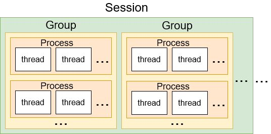


### Process groups

Consentono una migliore ==gestione di **segnali** e della **comunicazione** tra i processi==

==Un processo può interagire con tutti i processi di un **determinato gruppo**==

- ==Mandare un **segnale** ad essi==
- ==Aspettare che **terminino** tutti i figli in esso==

```c
kill(-33, SIGTERM);    // send SIGTERM to all children in group 33
waitpid(-33, NULL, 0); // wait for a children in group 33
```


### ==Gruppi in Unix==

==Raggruppamenti dei **processi**==

- ==In **bash**, processi concatenati tramite **pipes** appartengono allo **stesso gruppo**==
- ==I **figli** di un processo **ereditano il gruppo** del padre== alla loro creazione
- ==**Inizialmente**, tutti i processi appartengono al **gruppo di `init`**==
  - Ogni processo può cambiare il suo gruppo in qualunque momento

> **Process group leader**: *processo il cui PID è uguale al proprio GID*


### ==Group syscalls==

```c
int setpgid(pid_t pid, pid_t pgid); // set GID of process (0=self)
pid_t getpgid(pid_t pid);           // get GID of process (0=self)
```


## Esempi

### Mandare segnali ai gruppi

[Esempio (slides 8-10)][pdf-08]


### Wait figli in un gruppo

[Esempio (slides 11-13)][pdf-08]


# [9.][pdf-09] Pipe

## Pipe anonime

### Piping

==Connette l’**output** (stdout e stderr) di un **comando** all’**input** (stdin) di un altro==

- Consente la **comunicazione** tra i due

==I processi sono eseguiti **in concorrenza** utilizzando un **buffer**==

- ==Se **pieno**, lo **scrittore** (left) si sospende fino ad avere **spazio libero**==
- ==Se **vuoto**, il **lettore** (right) si sospende fino ad avere i **dati**==

> **PIPE / FIFO**: *sistemi di comunicazione tra processi che consentono scambi di informazioni (messaggi) e sincronizzazione (blocchi)*

[Esempi (slide 9)][pdf-09]


### ==Pipe anonime==

==Mettono in **comunicazione** due processi aventi un **antenato comune**==

- ==Oppure tra **padre-figlio**==

==Il **collegamento**==

- ==È **unidirezionale**==
- ==Avviene utilizzando un **buffer**==
  - ==**Creato** con la syscall **`pipe()`**==
  - ==Altre operazioni: `write()`, `read()`, `close()`==

==Il tutto avviene tramite **file descriptors**==

- Motivo per il quale serve l’**antenato** comune

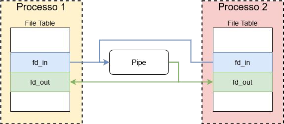


### Gestire la comunicazione

Per gestire comunicazioni complesse c’è bisogno di ==definire un **protocollo**==

<u>Esempi</u>

- ==Messaggi di **lunghezza fissa**==
  - Eventualmente inviata prima del messaggio
- ==**Marcatore** di fine messaggio==
  - Carattere `\0` o `\n`

<u>Generalmente</u>: ==occorre **definire la sequenza di messaggi** attesi==

[Esempio (slide 21)][pdf-09]


## Operazioni

### ==Creazione==

```c
int pipe(int pipefd[2])  // fd[0] lettura, fd[1] scrittura
```

[Esempio (sotto)][]


### ==Lettura==

```c
int read(int fd[0], char *data, int num)
```

==<u>Return</u>==: differente a seconda della situazione

- ==**Successo**: # bytes letti==
- ==**Buffer vuoto**, lato **scrittura chiuso** (da ogni processo): `0`==
- ==**Buffer vuoto**, lato **scrittura aperto** (in qualche processo): processo si sospende==
  - Fino alla disponibilità dei dati o alla chiusura
- **Bytes** (`num`) **maggiori** di quelli disponibili: recuperati solo quelli presenti

```c
#include <stdio.h>
#include <unistd.h>
void main() {
    int fd[2];
    char buf[50];
    int esito = pipe(fd);               // Create unnamed pipe
    if (esito == 0) {
        write(fd[1], "writing", 8);     // Writes to pipe
        int r = read(fd[0], &buf, 50);  // Read from pipe
        printf("Last read %d. Received: '%s'\n", r, buf);
        // close(fd[1]);                // Hangs when commented
        r = read(fd[0], &buf, 50);      // Read from pipe
        printf("Last read %d. Received: '%s'\n", r, buf);
    }
}
```


### ==Scrittura==

```c
int write(int fd[0], char *data, int num)
```

==<u>Return</u>: # bytes scritti==

- Lato **lettura chiuso**: invia `SIGPIPE` allo scrittore
  - Default handler `quit`

Se il numero di bytes scritti rispetto a quelli che ci possono stare è

- **Minore**: la scrittura è **atomica** (tutto assieme)
- **Maggiore**: non c’è garanzia di atomicità e la scrittura sarà **bloccata**
  - Fallirà se viene usato il flag `O_NONBLOCK`
  - `int fcntl(int fd, F_SETFL, O_NONBLOCK)`


## Esempi di comunicazione

### ==Unidirezionale==

==<u>Esempio tipico</u>: processo scrittore $P_1$ e lettore $P_2$==

- ==$P_1$ crea una `pipe()`==
- ==$P_1$ esegue un `fork()` e crea $P_2$==
- ==$P_1$ chiude il lato lettura: `close(fd[0])`==
- ==$P_2$ chiude il lato scrittura: `close(fd[1])`==
- ==$P_1$ e $P_2$ chiudono l’altro fd appena finiscono==

[Esempio (slide 16)][pdf-09]


### ==Bidirezionale==

==<u>Esempio tipico</u>: processo scrittore $P_1$ e lettore $P_2$==

- ==$P_1$ crea due `pipe()`: $p_1$ e $p_2$==
- ==$P_1$ esegue un `fork()` e crea $P_2$==
- ==$P_1$ chiude il lato lettura di $p_1$ e il lato scrittura di $p_2$==
- ==$P_2$ chiude il lato scrittura di $p_1$ e il lato lettura di $p_2$==
- ==$P_1$ e $P_2$ chiudono gli altri fd appena finiscono di comunicare==

[Esempio (slide 18)][pdf-09]


## Pipe con nome

### ==FIFO==

- Corrispondono a ==**file speciali** nel **file system**==
  - Si possono usare le ==**funzioni** di scrittura/lettura dei file==
- Grazie ai quali i ==processi possono **comunicare senza vincoli di gerarchia**==

Un processo

- Può ==**accedere**== ad una FIFO ==se ha i **permessi sul file**== corrispondente
- È ==vincolato all’**esistenza** del file== stesso


### ==Creazione==

```c
int mkfifo(const char *pathname, mode_t mode);
```

- Una volta creata la FIFO, ==il **file associato** è **persistente**==
- ==Deve essere **aperta da entrambi i lati**== per potervi interagire ragionevolmente ~~(!~ file normale)~~


### Esempi

[Vedi slides 24-26][pdf-09]


## Esercizi

[Vedi slides 19, 27][pdf-09]


# [10.][pdf-10] Queues

## Message queues

### Coda di messaggi

~~**Metodo di comunicazione** per inviare e ricevere informazioni anche tra processi~~

==È una **lista concatenata**==

- ==Memorizzata all’interno del **kernel**==
- ==Identificata con una **chiave**==
  - ==**Queue identifier**==
  - Intero positivo univoco

==La **chiave** viene **condivisa tra i processi** interessati==

- Generano degli ulteriori **identificativi** da usare durante l’**interazione** con la coda


### ==Comportamento==

- Una coda deve essere ==**generata** impostando dei **permessi**== ~~(~ FIFO)~~
- Ad una ==coda esistente== si possono ==**aggiungere/recuperare messaggi**==
  - Tipicamente ==in modalità **autosincrona**==
    - **Lettura**: attende la presenza di un messaggio
    - **Scrittura**: attende che vi sia spazio disponibile
  - Questi comportamenti possono essere **configurati**
- Le code sono delle ==**strutture persistenti**==
  - ==**Continuano a esistere** alla **terminazione**== del processo che le ha create
    - ==**Assieme ai messaggi**== in esse salvati
  - ==L’**eliminazione** deve essere **esplicita**==


### ==Comunicazione==

==Ogni **messaggio** inserito nella coda ha **tre campi**==

- ==**Tipo**== (intero `long`)
- ==**Lunghezza**== (non negativa)
- ==**Insieme di dati**== (bytes) di lunghezza corretta

```c
struct msg_buffer{
    long mtype;
    char mtext[100];
} message;
```

I ==**messaggi**== in una coda possono essere ==**recuperati** sulla base di==

- ==**Ordine** assoluto di arrivo==
- ==**Tipo**== ~~(!~ FIFO)~~


## Operazioni

### ==Creazione==

```c
int msgget(key_t key, int msgflg)
```

==<u>Return</u>: **identificativo** di una coda, basandosi su==

- ==**Chiave** `key`==
- ==**Flags** `msgflg`==
  - ==`IPC_CREAT`==
    - ==Crea una coda se non esiste già==
    - Altrimenti restituisce l’identificativo di quella già esistente
  - ==`IPC_EXCL`==
    - ==Fallisce se coda già esistente==
    - Da usare assieme al precedente
  - `0###`: numero ottale di permessi
    - Analogo a quello che si può usare nel file system

[Esempio (slide 6)][pdf-10]


### ==Ottenere chiave univoca==

```c
key_t ftok(const char *path, int id)
```

==<u>Return</u>: **chiave**, basandosi su==

- ==**Path**== (cartella o file esistente ed accessibile nel file system)
- ==**Id numerico**==

==In **ogni istante** la **chiave**== sullo stesso sistema dovrebbe essere

- ==**Univoca**==
- Sempre ==la **stessa** per ogni coppia **`<path,id>`**== 

<u>Metodo d’uso</u>: per ==**evitare conflitti**==

1. ==Generare un **path temporaneo univoco** (file)==
2. Usarlo e eventualmente rimuoverlo
3. ==Usare l’**id** per per rappresentare diverse **categorie** di code==
   - ==A mo’ di **indice**==

```c
#include <sys/ipc.h>
key_t queue1Key = ftok("/tmp/unique", 1);
key_t queue2Key = ftok("/tmp/unique", 2);
```


### ==Inviare messaggi==

```c
int msgsnd(int msqid, const void *msgp, size_t msgsz, int msgflg)
```

==**Aggiunge un messaggio**==

- ==Alla coda identificata da `msquid`==
- ==Puntata dal buffer `msgp`==
- Di dimensione `msgsz`

<u>Comportamento</u>: a seconda dello **spazio disponibile**

- Il messaggio viene **inserito immediatamente** se lo spazio è sufficiente
- La chiamata **si blocca** fino a che abbastanza spazio diventa disponibile
- ==Se `msgflg` è `IPC_NOWAIT` allora la chiamata **fallisce** in assenza di spazio==


### ==Ricevere messaggi==

```c
ssize_t msgrcv(int msqid, void *msgp, size_t msgsz,
               long msgtyp, int msgflg)
```

==**Rimuove un messaggio**==

- ==Dalla coda `msqid`==
- ==Lo salva nel buffer `msgp`==
- `msgsz` specifica la lunghezza massima del testo del messaggio
  - `mtext` della struttura `msgp`

<u>Comportamento</u>

- Se il messaggio ha **lunghezza maggiore** di `msgsz`
  - Se `msgflg` è `MSG_NOERROR` allora il messaggio viene troncato
  - Se `MSG_NOERROR` non è specificato allora il messaggio non viene eliminato e la chiamata **fallisce**
- A seconda di `msgtyp` viene **recuperato il messaggio**
  - `msgtyp = 0` :  primo messaggio della coda
  - `msgtyp > 0` :  primo messaggio di tipo `msgtyp`
    - O primo messaggio di tipo diverso da `msgtyp` se `msgflg` è `MSG_EXCEPT`
  - `msgtyp < 0` :  primo messaggio il cui tipo `T` è `min(T<=|msgtyp|)`
- ==Il flag `IPC_NOWAIT` fa **fallire** la syscall se non sono presenti messaggi== 
  - ==Altrimenti **hang**==


### Modificare la coda

```c
int msgctl(int msqid, int cmd, struct msqid_ds *buf)
```

==**Modifica la coda**==

- ==Identificata da `msqid`==
- ==Secondo i comandi `cmd`==
  - `IPC_STAT`: recupera informazioni da kernel
  - `IPC_SET`: imposta alcuni parametri a seconda di `buf`
  - `IPC_RMID`: rimuove immediatamente la coda
  - `IPC_INFO`: recupera informazioni generali sui limiti delle code nel sistema
  - `MSG_INFO`: come `IPC_INFO` ma con informazioni differenti
  - `MSG_STAT`: come `IPC_STAT` ma con informazioni differenti
- ==Riempiendo `buf` con informazioni sulla coda==
  - ~~Tempo di ultima scrittura, di ultima lettura, # messaggi nella coda...~~


## Strutture

### `msqid_ds`

```c
struct msqid_ds {
    struct ipc_perm msg_perm;  // Ownership and permissions
    time_t msg_stime;          // last msgsnd(2)
    time_t msg_rtime;          // last msgrcv(2)
    time_t msg_ctime;          // creat. or last modif. by msgctl
    unsigned long msg_cbytes;  // # of bytes in queue
    msgqnum_t msg_qnum;        // # of messages in queue
    msglen_t msg_qbytes;       // Maximum # of bytes in queue
    pid_t msg_lspid;           // PID of last msgsnd(2)
    pid_t msg_lrpid;           // PID of last msgrcv(2)
}
```


### `ipc_perm`

```c
struct ipc_perm {
    key_t __key;           // Key supplied to msgget(2)
    uid_t uid;             // Effective UID of owner
    gid_t gid;             // Effective GID of owner
    uid_t cuid;            // Effective UID of creator
    gid_t cgid;            // Effective GID of creator
    unsigned short mode;   // Permissions
    unsigned short __seq;  // Sequence number
}
```


## Esempi

### Comunicazione

[Vedi slide 10][pdf-10]


### Modifica

[Vedi slides 13-17][pdf-09]


# [11.][pdf-11] Threads

## Introduzione

### Definizione

> **Thread**: *singola sequenza di esecuzione all’interno di un processo*

- ==Processi **leggeri** che permettono di eseguire funzioni in **concorrenza** in modo più **semplice** rispetto alla generazioni di processi veri e propri ~~(forking)~~==
-  ==**Flussi di esecuzione concorrente** entro uno **stesso processo**==
  - ==Con **meno esigenze** in termini di risorse e maggior **semplicità di interazione**==

Hanno alcune delle **proprietà dei processi**

- ==**Non sono indipendenti** tra loro==

- ==**Condividono** codice, dati e risorse assegnate al **processo di appartenenza**==
- ==Hanno alcuni **elementi indipendenti**==
  - Stack, PC e registri del sistema


### Comportamento

- ==Consentono un **parallelismo** delle operazioni==
- Creazione, terminazione, comunicazoine e context switch ==**rapidi e semplificati**==
- Per la **compilazione** è necessario aggiungere il flag **`-pthread`**


## Operazioni

### ==Creazione==

==In C i thread corrispondono a **funzioni eseguite in parallelo** al codice principale==

Ogni thread

- È identificato da un ==**ID**==
- Può essere gestito come un ==**processo figlio**==
  - Con funzioni che attendono la sua **terminazione**

```c
int pthread_create(
    pthread_t restrict thread,                        // Thread ID
    const pthread_attr_t restrict attr,              // Attributes
    void (start_routine)(void),         // Function to be executed
    void restrict arg              // Parameters to above function
)
```

[Esempio (slide 4)][pdf-11]


### ==Terminazione==

```c
noreturn void pthread_exit(void *retval)
```

Un nuovo thread termina in uno dei seguenti modi

- ==Chiamando la **funzione** sopra==, specificando un **puntatore di ritorno**
- ==**Ritorna** dalla funziona associata== al thread specificando un **valore di ritorno**
- ==Viene **cancellato**==
- Qualche thread ==chiama **`exit()`**== o il thread che esegue ==**`main()` ritorna**== dallo stesso, terminando ==tutti i threads==


### ==Cancellazione di un thread==

```c
int pthread_cancel(pthread_t thread)
```

==Invia una **richiesta di cancellazione** al thread specificato==

- Il quale **reagirà** (come e quando) a seconda di due suoi **attributi `state` e `type`**
  - `state` può essere
    - `enabled`: la cancellazione avverrà a seconda di `type` (default)
    - `disabled`: la richiesta rimane in attesa fino a `enabled`
  - `type` può essere
    - `deferred`: attende la chiamata di un **cancellation point** (default)
      - Funzioni definite nella libreria `pthread.h` (lista)
    - `asynchronous`: termina in qualsiasi momento
  - `state` e `type` possono essere modificati

```c
int pthread_setcancelstate(int state, int *oldstate);
// state == PTHREAD_CANCEL_DISABLE || PTHREAD_CANCEL_ENABLE
int pthread_setcanceltype(int type, int *oldtype);
// type == PTHREAD_CANCEL_DEFERRED || PTHREAD_CANCEL_ASYNCHRONOUS
```

[Esempio (slide 7)][pdf-11]


### ==Attendere la terminazione==

```c
int pthread_join(pthread_t thread, void **retval);
```

Permette ad un processo (thread) di ==**attendere la terminazione** di un nuovo thread da esso avviato==

- <u>Return</u>: quando
  - Il thread identificato da **`thread` termina**
  - **Subito** se il thread è già terminato
- **`retval`** assume
  - Il **valore di ritorno** del thread, se non nullo
    - Parametro di `pthread_exit` o di `return`
  - `PTHREAD_CANCELED`, se il thread era stato cancellato
- ==Un thread può essere aspettato==
  - ==Solo se è **joinable**==
  - ==Da al **massimo un thread**==

[Esempi (slides 9-11)][pdf-11]


## Attributi

### Struttura  `pthread_attr_t`

==Ogni thread viene creato con **attributi** specificati nella **struttura `pthread_attr_t`**==

- Oggetto ==usato solo alla **creazione**==, poi **indipendente** dal thread 

  - Se cambia, gli attributi del thread non cambiano
  - ~~(~ signal mask)~~

- Va **inizializzata** impostando tutti gli attributi al loro valore di **default**

  ```c
  int pthread_attr_init(pthread_attr_t *attr)
  ```

- Va **distrutta** una volta usata e non più necessaria

  ```c
  int pthread_attr_destroy(pthread_attr_t *attr)
  ```

- I vari attributi possono essere **modificati solo singolarmente**

  ```c
  int pthread_attr_setxxx(pthread_attr_t *attr, params)
  int pthread_attr_getxxx(const pthread_attr_t *attr, params)
  ```


### Attributi  `pthread`

```c
int pthread_attr_set...
```

- `detachstate(pthread_attr_t *attr, int detachstate)`
  - `PTHREAD_CREATE_JOINABLE` → può essere aspettato (default)
  - `PTHREAD_CREATE_DETACHED` → non può essere aspettato
  - Può essere cambiato durante l’esecuzione con
    `int pthread_detach(pthread_t thread)`
- `sigmask_np(pthread_attr_t *attr, const sigset_t *sigmask)`
- `affinity_np(...)`
- `setguardsize(...)`
- `inheritsched(...)`
- `schedparam(...)`
- `schedpolicy(...)`


### Joinable e detached

- I threads vengono ==creati di **default** nello **stato `joinable`**==, che consente
  - Ad un altro thread di ==**attendere la terminazione**==
    - Con il comando `pthread_join`
  - Di ==rilasciare le proprie **risorse**==
    - Quando un thread fa il **join** con loro
      - Salvando lo stato di uscita ~~(\~ sottoprocessi)~~
    - Alla **terminazione** del processo
- I thread in ==**stato `detached`**==
  - ==Liberano le loro **risorse immediatamente** una volta **terminati**==
  - ==**Non** consentono ad altri processi di fare il **join**==

==Un thread `detached` non può diventare `joinable`== durante la sua esecuzione, ma è possibile il contrario


## Mutex

### Problema della sincronizzazione

==Quando si esegue un programma con più **thread**, essi **condividono alcune risorse**==

- ==Tra le quali le **variabili globali**==

==Se **due thread**==

- ==**Accedono** ad una **sezione di codice condivisa**==
- ==E hanno la necessità di accedervi in **maniera esclusiva**==
- ==Allora bisogna instaurare una **sincronizzazione**==
- Altrimenti i risultati potrebbero essere **inaspettati**


### ==Thread: creazione e sincronizzazione==

- **Creazione**

  ```c
  int pthread_create(pthread_t *thread,
                     const pthread_attr_t *attr,
                     void *(*start_routine)(void *),
                     void *arg);
  ```

- **Sincronizzazione**

  ```c
  int pthread_join(pthread_t thread, void **retval);
  ```

[Esempio (slides 19-20)][pdf-11]


### ==Soluzione: mutex==

> **Mutex**: *semafori imposti ai thread*

==Possono **proteggere** una determinata **sezione di codice**==

- ==Consentono l'**accesso esclusivo** ad un thread fino allo sblocco del semaforo==
- Gli ==**altri thread**== che devono accedere alla sezione
  - ==Devono **aspettare** che il **semaforo sia sbloccato**==
  - ==Vanno in **sleep** fino alla loro prossima **schedulazione**==
- ==I mutex vanno **inizializzati** e poi **assegnati** alla sezione di codice==


### ==Mutex: creazione e distruzione==

- **Creazione**

  ```c
  int pthread_mutex_lock(pthread_mutex_t *mutex);
  ```

- **Distruzione**

  ```c
  int pthread_mutex_unlock(pthread_mutex_t *mutex);
  ```

```c
#include <pthread.h>
pthread_mutex_t lock;
void *thread(void *) {
    // Waits for mutex to be unlocked then locks it becoming owner
    pthread_mutex_lock(&lock);
    // Unlock mutex allowing others to lock it
    pthread_mutex_unlock(&lock);
}
```

[Esempi (slides 24-25)][pdf-11]


### ==Tipi di mutex==

- `PTHREAD_MUTEX_NORMAL`: **deadlock detection**
  1. Deadlock
  2. Undefined
  3. Undefined
- `PTHREAD_MUTEX_ERRORCHECK`: **error checking**
  1. Error
  2. Error
  3. Error
- `PTHREAD_MUTEX_RECURSIVE`: **multiple locks**
  1. Increase lock count → richiede equal numero di sbloccaggi
  2. Error
  3. Error
- `PTHREAD_MUTEX_DEFAULT`: **default**
  1. Undefined
  2. Undefined
  3. Undefined

<u>Legenda</u>

1. **Ribloccare quando bloccato**
2. **Sbloccare quando bloccato da altri**
3. **Sbloccare quando sbloccato**

[Esempi (slides 27-28)][pdf-11]


### ==Sezione critica==

==I mutex sono un metodo per **eseguire sezioni critiche** in **processi multithread**==

<u>Importante</u>

- ==**Limitare** al massimo la sezione critica==
- ==Utilizzando **lock/unlock** per la **porzione di codice più piccola possibile**==
- ==Solo se **assolutamente necessario** in caso di possibili accessi concorrenti==


# Appendice

### Librerie

```c
#include <stdio.h>
#include <string.h>
#include <unistd.h>
#include <stdlib.h>
#include <signal.h>
#include <pthread.h>
#include <fcntl.h>
#include <wait.h>
#include <errno.h>
#include <>

// FIFO
#include <sys/stat.h>
#include <sys/types.h>

// QUEUES
#include <sys/types.h>
#include <sys/ipc.h>
#include <sys/msg.h>

```


### `isint()`

```c
int isint(char *s) {
    for (int i = 0; s[i] != '\0'; i++) {
        if (s[i] < '0' || s[i] > '9') {
            return 0;
        }
    }
    return 1;
}
```


### I/O

```c
int scanf(const char *format, [type &varible [, ...]]);
char *itoa(int value, char *str, int base);
```


### `open()`

La funzione open() apre il pathname predisponendolo per le operazioni di I/O come indicato dai flags.

L'argomento flags deve essere uno dei valori:

- O_RDONLY	Apre un file per la lettura.
  - La posizione e' all'inizio del file.
- O_WRONLY	Apre un file per la scrittura. La posizione e' all'inizio del file.
- O_RDWR	Apre un file la lettura e scrittura.
- La posizione e' all'inizio del file.

Inoltre flags puo' essere in or bit a bit con nessuno, uno o piu' dei seguenti valori:

- O_CREAT	Se pathname non esiste viene creato.
  - In mancanza di questo flag, viene tornato un errore.
- O_EXCL	Quando usato con O_CREAT, se il file e' esistente viene tornato un errore a la open fallisce.
- O_TRUNC	Un file esistente verra' troncato.
- O_APPEND	Apre il pathname in append. Le successive operazioni di scrittura verranno accodate alle informazioni gia' presenti nel pathname.
- O_NOFOLLOW	Se il pathname e' un link simbolico, allora la open fallisce.
- O_DIRECTORY	Se il pathname non e' una directory, allora la open fallisce.
- O_NONBLOCK
- O_NDELAY	Il pathname e' aperto in modalita' "non-blocking".
  - Ne' la open() e ne le successive operazioni di I/O sul file descriptor tornato, non causano il processo ad attese.
- O_SYNC	Il pathname e' aparto per I/O sincrono.
  - Le scritture sul file, causano l'attesa del processo fino al completamento delle operazioni fisiche sull'hardware sottostante.


### `mkdir()`

```c
#include <sys/types.h>
#include <sys/stat.h>
#include <unistd.h>

struct stat st = {0};

if (stat("/some/directory", &st) == -1) {
    mkdir("/some/directory", 0700);
    int fd = open(filename, O_WRONLY | O_CREAT, 0777);
}
```


---


# 

[root]: ../SO/
[pdf-01]: ../SO/L01-terminale_bash.pdf
[pdf-02]: ../SO/L02-docker.pdf
[pdf-03]: ../SO/L03-gcc.pdf
[pdf-04]: ../SO/L04-make.pdf
[pdf-05]: ../SO/L05-C_language.pdf
[pdf-06]: ../SO/L06-syscalls.pdf
[pdf-07]: ../SO/L07-segnali.pdf
[pdf-08]: ../SO/L08-process_groups.pdf
[pdf-09]: ../SO/L09-pipe.pdf
[pdf-10]: ../SO/L10-queues.pdf
[pdf-11]: ../SO/L11-threads.pdf

