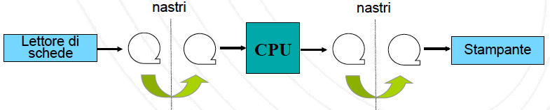
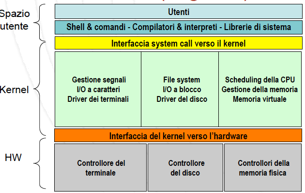
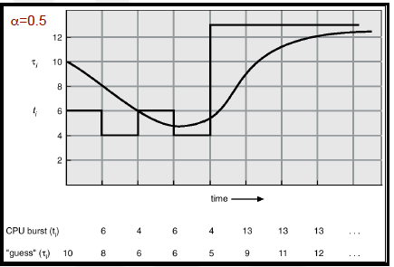
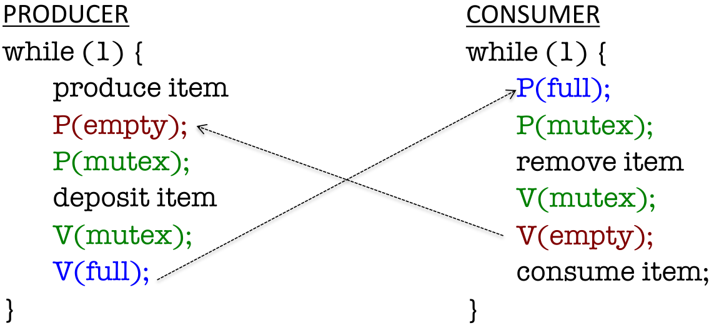

# <u>Sistemi Operativi</u> - Teoria

|      |          |                                                              |
| ---- | :------: | -----------------------------------------------------------: |
| SO  | Teoria | [ ][root][](https://didatticaonline.unitn.it/dol/course/view.php?id=31325) |

[TOC]


# [1.][pdf-01] Definizione e Storia

## Definizione

### Sistema Operativo

**Insieme di programmi**

- Agisce come **intermediario** tra HW e uomo
  - Facilita l’uso del computer
  - Rende **efficiente** l’uso dell’**HW**
  - Evita conflitti nella **allocazione delle risorse HW/SW**
- Offre un ambiente per **controllare** e **coordinare** l’utilizzo dell’HW da parte dei **programmi applicativi**


### Viste di un SO

- **Gestore di risorse**
  - **HW**
    - CPU, Dischi, memoria, I/O, …
  - **SW**
    - File, programmi, ...
- **Programma di controllo**
  - Controllo dell’**esecuzione dei programmi** e del corretto utilizzo del sistema


### Computer


### Obiettivi

- **Astrazione**
  - **Semplificazione** dell’uso del sistema
- **Efficienza**
  - **Livello** di astrazione
- Tipicamente in **contrasto**
  - Unix: meno astratto, più efficiente
  - Windows: molto astratto, meno efficiente


## Storia

### Introduzione

- **5 generazioni** legate ai calcolatori
- <u>Principio ispiratore</u>: aumento dell’utilizzo della **CPU**


### Esempi

[Vedi slides 41-42][pdf-01]


### Spazio dei SO

**Domini**

- **Complessità** del sistema che lo ospita
- **Generalità** del sistema che lo ospita


## 1ª Generazione

### Caratteristiche

- Enormi calcolatori a **valvole**
- **Non esiste SO**
- **Operatore = Programmatore**
- Accesso alla macchina tramite **prenotazione**
- Esecuzione da **console**
  - Programma caricato in RAM un’istruzione alla volta agendo su **interruttori**
  - Controllo errori su **spie** della console
- **Processing seriale**


### Evoluzione

- Diffusione di **periferiche**
  - Lettore/perforatore di schede, nastri, stampanti
  - ***Device driver***: programmi di interazione con periferiche
- Sviluppo di **software**
  - **Librerie** di funzioni comuni
  - **Compilatori, linker, loader**
- **Scarsa efficienza**
  - Programmazione facilitata, ma operazioni complesse
  - Tempi di setup elevati a basso utilizzo


## 2ª Generazione

### Caratteristiche

- Introduzione dei **transistor** nei calcolatori
- **Separazione** di operatore e programmatore
  - Eliminazione dello schema a prenotazione
  - Operatore elimina parte dei tempi morti
- **Batching** ~~(= lotto)~~
  - Raggruppamento di **job simili** ~~(= programmi)~~ nell’esecuzione
  - **Problemi** in caso di errori/malfunzionamenti


### 1ª Evoluzione

- **Automatic job sequencing**
  - Il SO si occupa di **passare da un job all’altro**
  - Il SO fa il **lavoro dell’operatore** e rimuove tempi morti
- **Job Control Language**
  - **Sequenzializzazione** realizzata tramite un **linguaggio di controllo**
  - **Schede** di controllo
  - **Record** di controllo ~~(= nastri)~~
  
  [Esempio (slide 17)][pdf-01]
- **Monitor residente** ~~(= gestore)~~
  
  - **Gestore perennemente caricato** in memoria
  - Primo vero **esempio di SO**
  - <u>Componenti</u>
    - **Driver** per dispositivi di I/O
    - **Sequenzializzatore** dei job
    - **Interprete** di schede di controllo
      - Lettura ed esecuzione


### Limitazioni

- <u>Problema</u>
  - **Utilizzo** del sistema ancora **basso**
  - **Velocità** I/O $\ll$ Velocità CPU
- <u>Osservazione</u>: **CPU mai attiva durante I/O**

> <u>Esempio</u>
>
> - Compilatore può processare 300 schede/sec
> - Velocità lettore di schede: 20 schede/sec
> - Lettura di un programma di 1200 schede
>   - 4 sec CPU
>   - 60 sec I/O
>   - Utilizzo CPU = 4/64 → 6.25%


### 2ª Evoluzione

- <u>Soluzione</u>: **sovrapposizione** delle operazioni di **I/O** ed elaborazione (**CPU**)
- **Elaborazione off-line**
  - Diffusione dei **nastri magnetici** più capienti e più veloci
  - **Sovrapposizione** di I/O e CPU su **macchine indipendenti**
    - **Scheda → nastro** su una macchina
    - **Nastro → CPU** su un’altra macchina
- **CPU** ora limitata dalla **velocità dei nastri**
  - Vero **vantaggio** nel caso di **più lettori** di nastro


### Batch vs. operazioni off-line


<p>
#### Batch tradizionale


<p>
#### Operazioni off-line

- 1 lettore




- Più lettori


## Input / Output

### Sovrapposizione di CPU e I/O

- Operazioni **off-line**
  - Sovrapposizione di I/O e CPU su **macchine indipendenti**
- Sovrapposizione sulla **stessa macchina**
  - Necessario un opportuno **supporto architetturale**
- ***Polling***: meccanismo di **interazione** tradizionale tra CPU e I/O
  - **Interrogazione** continua del dispositivo tramite esplicite **istruzioni bloccanti**
- Per sovrapporre serve un **meccanismo asincrono** (**richiesta I/O non bloccante**)
  - **Interrupt**
  - **DMA** ~~(= Direct Memory Access)~~


### Interrupt

Schema concettuale

1. La **CPU** (driver) **programma il dispositivo** (cosa deve fare)
2. Contemporaneamente
   - Il **dispositivo** (controllore) **esegue**
   - La **CPU prosegue** l'elaborazione (se possibile)
3. Il **dispositivo segnala la fine** dell’elaborazione alla CPU
4. **CPU riceve** segnale di **interrupt** (tramite segnale esplicito)
   1. **Interrompe** l’istruzione corrente (salvando lo stato)
   2. **Salta** a una locazione predefinita (X)
   3. **Serve** l’interruzione (trasferisce dati)
   4. **Riprende** l’istruzione interrotta


### DMA

- Con **dispositivi veloci**
  - Interrupt molto **frequenti**
  - Inefficienza
- <u>Soluzione</u>: **DMA** (Direct Memory Access)
  - Uno specifico controllore HW (**DMA controller**) si occupa del **trasferimento di blocchi di dati** tra I/O e memoria **senza** interessare la **CPU**
  - **Un solo interrupt** per blocco di dati


### Buffering e Spooling

> **Buffering**: *sovrapposizione di CPU e I/O dello stesso job*

- Dispositivo di I/O legge/scrive **più dati** di quanti richiesti
- Utile quando la **velocità** dell’I/O e della CPU sono **simili**
- Nella realtà i dispositivi di **I/O** sono molto **più lenti** della CPU
  - Miglioramento marginale

> **Spooling**: *sovrapposizione di CPU e I/O di job diversi*

- <u>Problema</u>
  - I **nastri** magnetici sono **sequenziali**
    - Il lettore di schede non può scrivere su un’estremità del nastro mentre la CPU legge dall’altra
- <u>Soluzione</u>
  - Introduzione dei dischi magnetici ad **accesso casuale**


### Spooling

~~(= Simultaneous Peripheral Operations On-line)~~

- Possibile grazie ad **accesso casuale** dei dischi
  - Utilizzo del **disco** come un **grande buffer**
  - **Buffer unico** per tutti i job
- <u>Concetto</u>: **pool di job**
  - <u>Paradigma</u> (moderno): **programma su disco**
    - Viene caricato in **memoria**
  - <u>Concetto</u>: **job scheduling**
    - Chi deve/può essere caricato sul disco?


## 3ª Generazione

### Caratteristiche

- Introduzione della **multiprogrammazione** e dei **circuiti integrati**
  - Un **singolo job** non potrà mai tener sufficientemente **occupata la CPU**
  - Necessaria la **competizione** di più job
    - Presenza di **più job in memoria**
    - Sfruttamento delle **fasi di attesa** (I/O) per l’**esecuzione** di un nuovo job


### Batch vs Multiprogrammazione
Con la presenza di più job nel sistema è possibile **modificare la natura dei SO**
- Sistemi **tradizionali** (batch)
  - Tendenza alla **non interattività**
  - Importante il **tempo di completamento** di un job
    - Quanto ci vuole per **eseguirlo** tutto
- Sistemi **multiprogrammati**
  - Tendenza a soddisfare **molti utenti** che operano **interattivamente**
  - Importante il **tempo di risposta** di un job
    - Quanto ci vuole per **iniziare** l’esecuzione


### Time sharing  (Multitasking)

- Time sharing
  - **Estensione logica** della multiprogrammazione
  - L’utente ha l’impressione di avere la macchina solo per sé
  - Migliora la **interattività**
    - Gestione errori, analisi risultati, …
- Nascita dei **sistemi moderni**
  - **Tastiera**
    - Decisioni sull’evoluzione del sistema basate su comandi utente
      - Comandi brevi vs. job lunghi
  - **Monitor**
    - Output immediato durante l’esecuzione
  - **File system**
    - Astrazione del sistema operativo per accedere a dati e programmi


## Protezione

### Motivazioni

- L’esecuzione di un programma può influenzare l’esecuzione degli altri
  - e.g.: **ciclo infinito**
    - Previene l’uso della CPU di altri programmi
    - Il programma legge più dati di quanti dovrebbe
- Tre tipi fondamentali di **protezione**
  - **I/O**: programmi diversi non devono usare I/O contemporaneamente
  - **Memoria**: un programma non può leggere/scrivere in una zona di memoria che non gli appartiene
  - **CPU**: prima o poi il controllo della CPU deve tornare al SO


### Protezione dell’ I/O

- Realizzata tramite il meccanismo del **dual mode** ~~(= modo duale di esecuzione)~~
  - Modo **USER**
    - I **job non** possono **accedere** direttamente alle risorse di I/O
  - Modo **SUPERVISOR** (o **KERNEL**)
    - Il **SO** può **accedere** alle risorse di I/O
- Tutte le operazioni di **I/O** sono **privilegiate**
  - **Sequenza** di operazioni (per **accesso** ad I/O)
    - Istruzioni per accesso ad I/O invocano delle **system call**
    - Al termine della system call il SO ripristina la modalità **USER**

>**System call**: *interrupt software che cambia la modalità di esecuzione da USER a SUPERVISOR*


### Protezione della memoria
- Protezione di

  - **Spazio dei vari processi**
  - **Monitor**

- Realizzata associando dei **registri limite** ad ogni processo
  - **Modificabili solo dal SO** con istruzioni privilegiate
  
    

### Protezione della CPU
- Garanzia che il S.O. mantenga il controllo del sistema
- Realizzata tramite timer
  - Associato ad ogni job
  - Alla scadenza, il controllo ritorna al monitor


### Protezione della CPU
- Garanzia che il SO mantenga il **controllo del sistema**
- Realizzata tramite **timer**
  - Associato ad **ogni job**
  - Alla **scadenza**, il controllo ritorna al **monitor**


## 4a Generazione

### Caratteristiche

- SO per **PC** e **workstation**
  - Uso **personale** dell’elaboratore
  - Interfacce grafiche (**GUI**)
- SO di **rete**
  - **Separazione** logica delle risorse remote
  - Accesso risorse remote $≠$ accesso risorse locali
- SO **distribuiti**
  - **Non-separazione** logica delle risorse remote
    - Share memory
    - Clock logico unico
  - Accesso risorse remote $=$ accesso risorse locali


## 5a Generazione

### Caratteristiche

- SO **real-time**
  - Vincoli sui tempi di risposta del sistema
- SO **embedded**
  - Per sistemi per applicazioni specifiche
- SO per **piattaforme mobili**
  - IOS, Android, Window Mobile, piattaforme HW eterogenee
- SO per **Internet of Things**
  - Embedded, real-time, networking, protection, mobility


# [2.][pdf-02] Componenti, interfacce, servizi

## Componenti

### Gestione dei Processi

- Necessità di **risorse**
- Eseguito in modo **sequenziale** un’istruzione alla volta
- Processi del **SO** vs. processi **utente**

<u>Responsabilità</u>

- **Creazione/distruzione** di processi
- **Sospensione/riesumazione** di processi
- Fornitura di meccanismi per la **sincronizzazione/comunicazione** tra processi


### Gestione della Memoria Primaria

Conserva **dati condivisi** dalla **CPU** e dai dispositivi di **I/O**
- Un **programma** deve essere caricato in **memoria** per poter essere **eseguito**

<u>Responsabilità</u>

- **Gestione dello spazio** di memoria
  - Quali parti e da chi sono usate
- **Decisione** su quale **processo caricare** in memoria
  - Quando esiste spazio disponibile
- **Allocazione/rilascio** dello spazio di memoria


### Gestione della Memoria Secondaria
Mantiene grandi quantità di **dati** in modo **permanente**

- Tipicamente uno o più dischi (magnetici)

<u>Responsabilità</u>

- **Gestione** dello **spazio libero** su disco
- **Allocazione** dello spazio su disco
- **Scheduling degli accessi** su disco


### Gestione dell’I/O
- Il **SO nasconde** all’utente le specifiche caratteristiche dei dispositivi di **I/O**
- Il **sistema di I/O** consiste di
  - ***Buffering***: sistema per **accumulare gli accessi** ai dispositivi
  - **Interfaccia generica** verso i **device driver**
  - **Device driver specifici** per alcuni dispositivi


### Gestione dei File
- Le informazioni
  - Sono **memorizzate su supporti fisici** diversi
    - **Controllati da driver** con caratteristiche diverse

> **File**: *astrazione logica per rendere conveniente l’uso di memoria non volatile*

- Raccolta di informazioni correlate (dati o programmi)

<u>Responsabilità</u>

- **Creazione/cancellazione** di file e directory
- Supporto di **primitive per la gestione** di file e directory
  - Copia, sposta, modifica, …
- **Corrispondenza** tra **file** e **spazio fisico** su disco
- **Salvataggio** delle informazioni a scopo di **backup**


### Protezione

Meccanismo per **controllare l’accesso alle risorse** da parte di utenti e processi

<u>Responsabilità</u>

- Definizione di **accessi** autorizzati e non
- Definizione dei **controlli** da imporre
- Fornitura di strumenti per **verificare le politica di accesso**


### Sistemi Distribuiti (Rete)

> **Sistema distribuito**: *collezione di elementi di calcolo che non condividono né la memoria né un clock*

- **Risorse di calcolo** connesse tramite una **rete**

<u>Responsabilità</u>

- **Gestione in rete** delle varie **componenti**
  - **Processi** distribuiti
  - **Memoria** distribuita
  - **File system** distribuito


### Interprete dei comandi (Shell)

- La maggior parte dei **comandi** vengono forniti **dall’utente al SO** tramite **istruzioni di controllo** che permettono di gestire
  - **Processi** (e crearli)
  - **I/O**
  - **Disco, memoria, file system**
  - **Protezioni**
  - **Rete**

> **Interprete dei comandi**: *programma che legge ed interpreta questi comandi*

- <u>Funzione</u>: leggere ed eseguire la successiva **istruzione di controllo**
  - **Comando** specificato dall’**utente**
- **Codice comandi**
  - **Nell’interprete**
  - **In programmi predefiniti**
    - Da riferire semplicemente con il **nome** del programma
    - Se sono predefiniti, non è necessario modificare la shell per aggiungere nuovi comandi


## Interfacce

### Interfaccia utente
- L’**interprete** può fornire diversi tipo di **interfaccia utente**
  - **CLI** ~~(= Command-Line)~~
  - **GUI** ~~(= Graphics User Interface)~~
  - **Batch**
- **CLI** permette di digitare direttamente **comandi testo**
  - Spesso **implementata nel kernel**, alcune volte come **programma di sistema**
  - Spesso è implementata in **diverse varianti/shells**


### System Calls

Forniscono l’**interfaccia** dei servizi offerti dal **SO** ai **processi**

[Esempi (slide 16-17)][pdf-02]

<p>

<p>

#### Implementazione

- Tipicamente scritte in **linguaggio di alto livello** (C o C++)
  - Qualcuna anche in **assembler**
- Tipicamente un **numero** è associato ad ogni syscall
  - L’**interfaccia** alle chiamate di sistema mantiene una **tabella indicizzata** secondo questi numeri
- L’**interfaccia**
  1. **Invoca la syscall** usata nel kernel
  2. **Ritorna** lo **stato** della syscall e gli eventuali **valori di ritorno**

<p>

#### Information hiding 

**Dettagli implementativi** delle syscalls nascosti al chiamante

- Il SO fornisce un **livello intermedio** per mascherarli
- Syscalls per lo più **chiamate da programmi** attraverso **API di alto livello** 
  - Piuttosto che usate direttamente


### Syscalls -- Comunicazione dei parametri

Opzioni per la **comunicazione** tra il SO e un processo

- Passare i parametri tramite **registri**
- Passare i parametri tramite lo **stack del programma**
- Memorizzare i parametri in una **tabella in memoria**
  - L’**indirizzo** della tabella è passato in un **registro** o nello **stack**

<p>

#### Stack


1. --   3.   **Salvataggio** dei parametri sullo stack

4. **Chiamata della funzione** di libreria `read`
5. **Caricamento del numero** della syscall in un registro fissato `Rx`
6. Esecuzione **TRAP**
   - Passaggio in **kernel mode**
   - Salto al codice del **dispatcher**
7. **Selezione della syscall** secondo il codice in `Rx`
8. **Invocazione del  gestore** appropriato
9. **Ritorno alla funzione** di libreria
   - Ripristino **user mode**
   - **Caricamento del `PC`**
10. **Ritorno al codice** utente
    - Nel modo usuale
11. **Incremento dello stack pointer `SP`**
    - Per rimuovere i parametri della chiamata

<p>

#### Tabella


**`X`**:  **parametro** della syscall

- Rappresenta l’**indirizzo della tabella** in memoria
  - Contenente i parametri per l’esecuzione della syscall


### API

~~(= Application Program Interface)~~
~~(= Interfaccia per la programmazione di applicazioni)~~

APIs più comuni

- **POSIX API** per OS POSIX-based ~~(= Portable Operating-System Interface for Unix)~~
- **Win32 API** per Windows

Dovrebbero garantire **portabilità delle applicazioni**

- Almeno sulle stesso tipo di API

[Esempi (slides 20-22, 24-25)][pdf-02]


### Programmi di sistema
La **vista utente** delle operazioni di un SO avviene tramite **programmi di sistema**
- Gestione/manipolazione dei file
  - Crea, copia, cancella, …
- Informazioni sullo stato del sistema
  - Data, memoria libera, …
- Strumenti di supporto alla programmazione
  - Compilatori, assemblatori, …
- Formattazione documenti
- Mail
- Programmi di gestione della rete
  - Login remoto, …
- Interprete dei comandi
- Utility varie


## Servizi

### Riassunto

- Esecuzione di **programmi**
- Operazioni di **I/O**
- Manipolazione del **file system**
- **Comunicazione**
  - **Memoria** condivisa
  - Scambio di **messaggi**
- Rilevamento di **errori**
  - Logici e fisici
- **Allocazione** delle risorse
- **Contabilizzazione** delle risorse
- **Protezione e sicurezza**


# [3.][pdf-03] Architettura

## Principi  di progettazione

### Principi

- **Separazione tra policy e meccanismi**
  - Definizioni
    - **Policy**: cosa deve essere fatto
    - **Meccanismi**: come farlo
  - Permette la **maggior flessibilità** se le policy devono essere modificate in un secondo tempo
    - e.g.: tutti i processi devono poter accedere alla CPU in un **tempo finito**
- **KISS** ~~(= Keep It Small and Simple)~~
- **POLA** ~~(= Principle of the Least Privileges)~~
  - Ogni componente deve avere solo i **privilegi** che sono **necessari** ad eseguire la sua funzione e nulla più
  - Fondamentale per garantire l’**affidabilita** e la **sicurezza** di un SO


## Struttura

### Tipologie

Sistemi

- **Monolitici**
- **A struttura semplice**
- **A livelli**
- **Basati su kernel**
- **Micro-kernel**
- **Virtual machine**
- **Client-server**


### Sistemi monolitici
- **No gerarchia**
  - **Unico strato SW** tra utente e HW
  - Componenti tutti allo **stesso livello**
  - Insieme di **procedure** che possono chiamarsi **vicendevolmente**
- <u>Svantaggi</u>
  - **Codice dipendente** dall’architettura **HW** era distribuito su tutto il SO
  - Test e debug difficile


### Sistemi a struttura semplice
- **Minima organizzazione gerarchica**
  - Definizione dei **livelli** della gerarchia molto **flessibile**
  - Strutturazione mira a **ridurre costi** di sviluppo e manutenzione
- e.g.: MS-DOS, UNIX originale


#### MS-DOS

- Pensato per fornire il **maggior** numero di **funzionalità** nel **minimo spazio**
  - **Non** suddiviso in **moduli**
  - Possiede un **minimo di struttura**
    - Le interfacce e i livelli di funzionalità non sono ben definiti
  - **Non** prevede **dual mode** 
    - Perché Intel 8088 non lo forniva


#### UNIX (originale)

- **Struttura base limitata** a causa delle limitate funzionalità **HW**
  - **Programmi di sistema**
  - **Kernel**
    - Tutto ciò che sta tra il livello dell’interfaccia delle **syscall** e l’**HW**
    - Fornisce
      - File system
      - Scheduling della CPU
      - Gestione della memoria
      - Altre funzioni




### Sistema a livelli
- **Servizi** organizzati per **livelli gerarchici**
  - Interfaccia utente  `→`  …  `→`  HW
  - Ogni **livello**
    - Può usare solo **funzioni** fornite dai livelli **inferiori**
    - Definisce il tipo di **servizio** e l’**interfaccia** verso il livello **superiore** 
      - **Nascondendone l’implementazione**
- <u>Vantaggi</u>
    - **Modularità**: facilita messa a punto e manutenzione del sistema
- <u>Svantaggi</u>
  - Difficile definire appropriatamente gli **strati**
  - **Minor efficienza**: ogni strato aggiunge **overhead** alle syscall
  - **Minor portabilità**: funzionalità dipendenti dall’**architettura** sparse sui livelli


#### THE

- Sistema operativo **accademico** per sistemi **batch**
- **Primo esempio** di sistema a livelli
  - Insieme di **processi cooperanti** sincronizzati tramite **semafori**


### Sistemi basati su kernel

- **Due soli livelli**: servizi **kernel** e servizi **non-kernel**
  - Alcune funzionalità fuori dal kernel
    - e.g.: file system
  - e.g.: Implementazioni moderne di **UNIX**
- <u>Vantaggi</u>
  - Vantaggi dei sistemi a **livelli**, ma senza averne troppi
- <u>Svantaggi</u>
  - **Non** così **generale** come un sistema a livelli
  - **Nessuna regola** organizzativa per parti del SO **fuori dal kernel**
  - **Kernel complesso** tende a diventare monolitico


### Micro-kernel

- Mettere nel **kernel** solo cio che è **strettamente necessario**


### Sistemi client-server
- <u>Idea</u>: portare il **codice** ai **livelli superiori**, lasciando un **kernel più piccolo**
- <u>Approccio</u>: implementare maggior parte delle funzioni del SO in **processi utente**
- Il **kernel** si occupa solo della **gestione della comunicazione** tra client e server
- Il modello si presta bene per **SO distribuiti**


### Virtual Machine

- **Estremizzazione** dell’approccio a **livelli**
  - Pensato per offrire un sistema **timesharing multiplo**
- **HW** e **VM** trattati come **hardware**
  - Il **SO** esegue **sopra la VM**
  - La VM dà l’illusione di **processi multipli**
    - Ciascuno in esecuzione sul **proprio HW**
- Possibilità di presenza di **più SO**
- <u>Concetto chiave</u>: **separazione** di
  - **Multiprogrammazione (VM)**
  - **Presentazione (SO)**
- <u>Vantaggi</u>
  - **Protezione completa** del sistema:
    - Ogni VM è **isolata** dalle altre
  - **Più di un SO** sulla stessa macchina host
  - **Ottimizzazione delle risorse**
    - La **stessa macchina** può ospitare quello che senza VM doveva essere eseguito su macchine separate
  - Ottime per lo **sviluppo di SO**
  - Buona **portabilità**
- <u>Svantaggi</u>
  - Problemi di **prestazioni**
  - Necessità di gestire **dual mode virtuale**
    - Il sistema di gestione delle VM esegue in kernel mode, ma la VM esegue in user mode
  - **No condivisione**: ogni VM è isolata dalle altre
    - <u>Soluzione</u>
      - Condivisione un **volume del file system**
      - Definire una **rete virtuale** tra VM via SW


#### Type 1 and Type 2 hypervisor

VM = VM monitor (hypervisor) + VM runtime environment


- **Type 1**
  - VM isolate
  - Più efficiente perché si siede direttamente sull'HW ed è più scalabile
- **Type 2**
  - Meno costoso, adatto per prototipazione


#### Monolithic vs Microkernel VM


## Implementazione

### Linguaggi

- Tradizionalmente scritti in **linguaggio assembler**
- SO moderni scritti in linguaggi ad **alto livello** (C/C++)
  - <u>Vantaggi</u>
    - Implementazione più **rapida**
    - Più **compatto**
    - Più **facile** da capire e da mantenere
    - **Portabilità**


# [4.][pdf-0] Processi e threads

## Concetto di processo

### Programma e processo
> **Processo**: *istanza di programma in esecuzione*

- **Programma**: concetto statico
  - Codice e dati su **disco**
  - Unico
- **Processo**: concetto dinamico
  - Programma in **memoria**
  - Diversi processi per programma
  - Cambia lo stato nel tempo

In base al sistema i **processi**

- Sono eseguiti in modo **sequenziale**, un’istruzione alla volta
- Evolvono in modo **concorrente**, in sistemi **multiprogrammati**
  - Risorse limitate (fisiche e logiche)
  - Il SO stesso consiste di più processi


### Immagine in memoria

**Processo** consiste di

- **Istruzioni/Codice/Testo**
  - Parte statica del codice
- **Dati**
  - Variabili globali
- **Stack**
  - Chiamate a procedura e parametri
  - Variabili locali
- **Heap**
  - Memoria allocata dinamica
- **Attributi**
  - ID, stato, controllo


### Attributi (Process Control Block)
- All’interno del SO ogni processo è rappresentato dal process control block (PCB) 
  - **Puntatore**
    - Riferimento (identificativo) all'immagine del processo
  - **Stato** del processo
  - **Program counter**
  - Valori dei **registri**
  - Informazioni su
    - **Memoria** (e.g:. registri limite, tabella pagine)
    - Stato dell’**I/O** (e.g:. richieste pendenti, file)
    - **Utilizzo** del sistema (CPU)
    - **Scheduling** (e.g.: priorità)


### Stati di un processo

Durante la sua **esecuzione**, un processo **evolve** attraverso diversi stati
- **Diagramma** degli stati **diverso per SO diversi**

> **Dispatch**: *selezione di un processo per essere eseguito*

<p>

#### Schema base


<p>

#### Schema con stato di attesa


- **Pronto**
  - Nella **coda** dei processi pronti
  - **Diversi** processi **in memoria**
    - In **attesa** di CPU
- **Esecuzione**
  - **Un solo** processo **nella CPU**


## Scheduling

### Obiettivi

**Selezione** del processo da **eseguire** nella CPU al fine di garantire

- **Multiprogrammazione**
  - <u>Obiettivo</u>: **massimizzare** uso della **CPU**  `→`  **più** di un processo **in memoria**
- **Time-sharing**
  - <u>Obiettivo</u>: **commutare frequentemente** la CPU tra processi  `→`  ognuno crede di averla tutta per sè


### Schedulers

- **Short-term scheduler** (o **CPU** scheduler)
  - Seleziona i **prossimi** processi da **eseguire**
  - **Alloca la CPU** di conseguenza
  - **Invocato** molto di **frequente**
    - Millisecondi, deve essere **veloce**
- **Long-term scheduler** (o **job** scheduler)
  - Seleziona i processi da trasferire nella **coda dei processi pronti**
  - Controlla il **grado di multiprogrammazione**
  - Invocato meno frequentemente
    - Secondi-minuti, può essere **lento**


### Code di scheduling
Ogni processo è inserito in una serie di **code**
- Coda dei processi **pronti** (ready queue)
  - Coda dei processi pronti **per l’esecuzione**
- Coda di un **dispositivo**
  - Coda dei processi in **attesa** che il dispositivo si liberi

Il processo

- All’inizio è nella **ready queue**, fino al **dispatch**
- **Durante l’esecuzione** può succedere che
  - Necessita di **I/O** e viene inserito in una **coda di un dispositivo**
  - **Termina** il quanto di **tempo**
    - Viene **rimosso forzatamente** dalla CPU
    - Viene re-inserito nella ready queue
  - Crea un **figlio** e ne attende la terminazione
  - Si mette in attesa di un **evento**


### Diagramma di accodamento


### Operazione di dispatch

1. **Cambio di contesto**
   - **Salvataggio PCB** del processo che esce
   - **Caricamento del PCB** del processo che entra
2. Passaggio alla **modalità utente**
   - **All’inizio** della fase di dispatch il SO è in **modalità kernel**
3. **Salto** all’istruzione da eseguire del processo appena arrivato nella CPU


### Cambio di contesto

> **Context switch**: *passaggio della CPU a un nuovo processo*

- **Registrazione** dello stato del processo **vecchio**
- **Caricamento** dello stato (precedentemente registrato) del **nuovo** processo

Il **tempo** necessario al cambio di contesto è puro **sovraccarico**

- Il sistema non compie alcun lavoro utile durante la commutazione
- La durata del cambio di contesto dipende molto dall’architettura


## Operazioni sui processi

### Creazione

Un processo può creare un **figlio**
- Ottiene **risorse da SO o padre**
  - Spartizione, condivisione
- Tipi di **esecuzione**
  - **Sincrona**: padre **attende** la terminazione dei figli
  - **Asincrona**: evoluzione **concorrente** ~~(= parallela)~~ di padre e figli


#### UNIX

**System calls**

- `fork`: crea un figlio che è un **duplicato esatto** del padre
- `exec`: carica sul figlio un **programma diverso** da quello del padre
- `wait`: per **esecuzione sincrona** tra padre e figlio


### Terminazione

Possibili teminazioni del processo

- **Finisce** la sua esecuzione
- Terminato forzatamente dal **padre**
  - Per **eccesso** nell’uso delle **risorse**
  - Il compito richiesto al figlio **non** è più **necessario**
  - Il **padre termina** e il SO non permette ai figli di sopravvivere al padre
- Terminato forzatamente dal **SO**
  - Utente **chiude** applicazione
  - **Errori**


## Threads

### Risorse e CPU

Un **processo** unisce due concetti
- **Possesso delle risorse**
  - e.g.: spazio di memoria, file, I/O…
- **Utilizzo della CPU** (esecuzione)
  - e.g.: priorità, stato, registri…

Caratteristiche **indipendenti** e considerabili separatamente
- **Thread**: unità minima di utilizzo della **CPU**
- **Processo**: unità minima di possesso delle **risorse**


### Processo e thread

- Sono associati a un **processo**
  - ==**Spazio** di indirizzamento ????????==
  - **Risorse** del sistema
- Sono associati a un **singolo thread**
  - **Stato** di esecuzione
  - **Program counter**
  - Insieme di **registri**
  - **Stack**
- **Threads condividono**
  - **Spazio** di indirizzamento
  - **Risorse** del processo
  - **Stato** del processo


### Multi-threading

> **Multithreading**: *possibilità di supportare più thread per un singolo processo*

- **SO classico**: 1 processo = 1 thread

<u>Conseguenza</u>

- **Separazione** tra **flusso** di esecuzione (thread) e **spazio** di indirizzamento
  - Processo con **thread singola**
    - **Un flusso** associato ad uno spazio di indirizzamento
  - Processo con **thread multiple**
    - **Più flussi** associati ad un singolo spazio di indirizzamento


### Vantaggi

- **Riduzione tempo di risposta**
  - Mentre un thread è **bloccato**, un altro può **interagire** con l’utente
    - e.g.: I/O, elaborazione lunga
- **Condivisione delle risorse**
  - I threads di uno **stesso processo** condividono la **memoria**
    - Senza dover introdurre tecniche esplicite di condivisione ~~(~ processi)~~
    - Sincronizzazione e comunicazione agevolate
- **Economia**
  - **Creazione/terminazione** e **contex switch** più **veloci** rispetto ai processi
    - e.g. Solaris: rispettivamente 30 e 5 volte più veloci
- **Scalabilità**
  - Il **multithreading** aumenta il **parallelismo** se con **multiprocessore**
    - **Un thread** in esecuzione su **ogni processore**


### Utilizzo

`CreateThread()` inizia **threads indipendenti** che eseguono la procedura indicata

- Il programma si comporta come se ci fossero **$n$ CPU**
- In realtà **$1$ CPU** è utilizzata in **concorrenza** tra gli **$n$ thread**

[Esempio (slides 32-33)][pdf-04]


### Stati di un thread

- Tre stati ~~(~ processo)~~
  - **Pronto**
  - In **esecuzione**
  - In **attesa**
- Lo stato del processo può **non coincidere** con lo stato del thread
- <u>Problema</u>: un **thread in attesa** deve **bloccare** l’intero **processo**?
  - Dipende dall’**implementazione**


### Implementazione

<u>Approcci</u>

1. **User-level** thread
   - Gestione affidata alle **applicazioni**
   - Il **kernel ignora l’esistenza** deli threads
   - Funzionalità disponibili tramite una **libreria** di programmazione
2. **Kernel-level** thread
   - Gestione affidata al **kernel**
   - **Applicazioni** usano i threads tramite **syscalls**

- Possibili **approcci combinati** (es.: Solaris)


#### User-level thread

- <u>Vantaggi</u>
  - **Non** è necessario passare in modalità **kernel** per utilizzare thread
    - Previene due mode switch  `→`  **efficienza**
  - Meccanismo di **scheduling variabile** a seconda della **applicazione**
  - **Portabilità**
    - Girano su **qualunque SO** senza bisogno di modificare il kernel
- <u>Svantaggi</u>
  - Il blocco di un thread **blocca** l’intero **processo**
    - Superabile con accorgimenti specifici
      - e.g.: I/O non bloccante
  - **Non** è possibile sfruttare **multiprocessore**
    - **Scheduling** di un thread sempre sullo **stesso processore**
    - **Un solo thread** in esecuzione per ogni processo


#### Kernel-level thread

- <u>Vantaggi</u>
  - **Scheduling** a livello di **thread**
    - Blocco di un thread **non blocca il processo**
  - **Più thread** dello **stesso processo** in contemporanea su **CPU diverse**
  - Le funzioni del **SO** stesso possono essere **multithreaded**
- <u>Svantaggi</u>
  - **Scarsa efficienza**
    - Passaggio tra thread implica un **passaggio attraverso il kernel**


## Libreria `pthread`

### Pthreads

- Per usare i **pthreads in C** è necessario includere la libreria POSIX `<pthread.h>`

- Per la **compilazione** occorre linkare la libreria **`libpthread`** con `-lpthread`

  ```sh
  gcc prog.c -o prog -lpthread
  ```


### Attributi

Un thread ha vari **attributi** (modificabili)
- **Contenuti in** un oggetto di **tipo `pthread_attr_t`**
- <u>Esempi</u>
  - **Priorità**
    - Influenza la **frequenza di scheduling**
  - **Dimensione dello stack**
    - Specifica la quantità massima di **argomenti** che gli si possono passare, la profondità delle **chiamate ricorsive**, ...

```c
int pthread_attr_init(pthread_attr_t *attr)
```

Syscall per **inizializzare** il contenitore di attributi **`*attr`** con i valori di default

- Che potrà poi essere **passato alla syscall** che crea un **nuovo thread**


### Creazione

```c
int pthread_create(pthread_t thread, pthread_attr_t *attr,
                   void *(*start_routine)(void *), void *arg)
```

Syscall per **creare nuovi threads**

<u>Argomenti</u>

- `thread`: identificativo del thread che viene creato
- `attr`: contiene gli attributi da passare al thread creato
  - Per attributi di default si può usare `NULL`
- `start_routine`: puntatore alla routine contenente il codice da eseguire
- `arg`: puntatore all’eventuale argomento da passare alla routine stessa


### Terminazione

```c
void pthread_exit(void *value_ptr)
```

**Condizioni** di terminazione

1. **Finisce** il codice della **routine** specificata
2. Chiamata alla **syscall di terminazione** nel codice della routine ~~(sopra)~~

<u>Return</u>

1. Valore di ritorno specificato nella **routine**
2. Valore passato a `pthread_exit` come **argomento**


### Sincronizzazione

```c
int pthread_join(pthread_t thread, void **value_ptr)
```

Syscall per **sospendere** il thread stesso, in attesa della terminazione di un altro

<u>Argomenti</u>

- `thread`: identificativo del thread di cui si attende la terminazione
  - Deve essere un thread appartenente allo **stesso processo**
- `value_ptr`: valore restituito dal thread che termina

Diversi **strumenti** di sincronizzazione fra thread di un processo

- **Semafori**
  - **Non** fanno parte dell’ultima versione di **POSIX**, ma della precedente
  - Sono normalmente **disponibili** in tutte le versioni correnti dei pthread
- I **pthread** mettono a disposizione **meccanismi** di sincronizzazione **strutturati**
  - Tra cui le **variabili condizionali**

[Esempio (slides 49-51)][pdf-04]


### Condivisione dello spazio logico
I due thread **condividono** lo stesso **spazio di indirizzamento**

- Agiscono sulle **stesse variabili**
- Condivisione di variabili semplice con **variabili globali**
- Un thread può avere **variabili proprie** viste solo da esso, usando la classe di variabili `thread_specific_data`
- Nel caso dei **processi** una cosa simile è ottenibile solo usando esplicitamente un **segmento di memoria condivisa**


## Gestione dei processi del SO

### Esecuzione del kernel

- Il SO è un **programma** a tutti gli effetti
- Il SO in esecuzione può essere considerato un **processo**?
  - <u>Opzioni</u>: kernels eseguito
    - **Separatamente**
    - All’interno di un **processo utente**
    - Come **processo**


### Kernel separato

- Kernel esegue **al di fuori di ogni processo**
  - SO possiede uno **spazio riservato** in memoria
  - SO prende il **controllo del sistema**
  - SO sempre in esecuzione in modo **privilegiato**
- Concetto di processo applicato solo a **processi utente**
- Tipico dei primi SO


### Kernel in processi utente

> **Servizi del SO**: *procedure chiamabili da programmi utente*

- Accessibili in modalità protetta (**kernel mode**)
- L'**immagine** dei processi prevede
  - **Kernel stack** per gestire il funzionamento di un processo in **kernel mode**
    - Chiamate a **funzione**
  - **Codice/dati** del SO condiviso tra processi

<u>Vantaggi</u>

- In occasione di **interrupt** o **trap** durante l’esecuzione di un **processo utente** serve solo **mode switch**
  - Il sistema passa **da user mode a kernel mode**
  - Viene eseguita la parte di codice relativa al SO **senza context switch**
  - Più **leggero** rispetto al context switch
- Dopo il completamento del suo lavoro, il SO può decidere di **riattivare** lo stesso **processo** utente (mode switch) o un altro (context switch)


### Kernel come processo
- I **servizi** del SO sono **processi individuali**
  - Eseguiti in **modalità protetta**
  - Una minima parte del SO deve comunque eseguire **al di fuori** di tutti i processi (**scheduler**)
  - Vantaggioso per sistemi **multiprocessore** dove processi del SO possono essere eseguiti su **processore ad hoc**


# [5.][pdf-05] Inter Process Communication

## Relazioni tra processi

### Indipendenza e cooperazione

- Processi **indipendenti**
  - Esecuzione **deterministica** e **riproducibile**
    - Dipende solo dal proprio input
  - **Non influenza**, né viene influenzato da altri processi
  - **Nessuna condivisione** dei dati con altri processi
- Processi **cooperanti**
  - **Influenza** e può essere influenzato da altri processi
  - Esecuzione **non deterministica** e **non riproducibile**
  - <u>Motivi</u>
    - **Condivisione** informazioni
    - **Accelerazione** del calcolo
      - Esecuzione **parallela** di subtask su **multiprocessore**
    - **Modularità**
      - **Funzioni** distinte su vari processi
    - **Convenienza**


### Modelli di comunicazione


(a)  **Scambio di messaggi**

(b)  **Condivisione della memoria**


## IPC -- Message passing

### Scambio di messaggi

- Meccanismi utilizzati dai processi per **comunicare** e **sincronizzare** le loro **azioni**
- I processi comunicano **senza condividere variabili**
- Le **IPC** forniscono due <u>operazioni</u>
  - `send(message)`
    - La lunghezza del messaggio può essere fissa o variabile
  - `receive(message)`
- Se $P$ e $Q$ desiderano comunicare, devono
  - Stabilire un **canale di comunicazione**
  - Scambiarsi messaggi via **`send`/`receive`**
- **Implementazione del canale** di comunicazione
  - **Fisico** (e.g., shared memory, hardware bus)
  - **Logico** (e.g., proprietà logiche)


### Decisioni implementative

- **Come** vengono stabiliti i canali?
- Può un canale essere associato a **più processi**?
- **Quanti canali** ci possono essere per ogni coppia di processi comunicanti?
- Qual è la capacità di un canale?
- La **lunghezza** dei messaggi che è fissa o variabile?
- Il canale è uni- o bi- **direzionale**?


### Comunicazioni dirette

I processi devono **nominarsi esplicitamente**

- **Simmetrica**
  - `send(P1, msg)`
    - Invia `msg` a `P1`
  - `receive(P2, msg)`
    - Riceve in `msg` un messaggio da `P2`
- **Asimmetrica**
  - `send(P1, msg)`
  - `receive(id, msg)`
    - Riceve messaggi da tutti
    - In `id` si trova il nome del processo che ha eseguito `send()`
    - <u>Svantaggio</u>: se un processo cambia nome bisogna ricodificare gli altri


### Comunicazioni indirette

I messaggi sono spediti e ricevuti da **mailboxes** (o porte)
- Ogni mailbox ha un unico **identificativo**
- I processi possono comunicare solo se **condividono una** mailbox

<p>

- <u>Operazioni</u>
  - **Creare** una **mailbox** nuova
  - **`send`/`receive`** messaggi tramite mailbox
  - **Eliminare** una mailbox
- <u>Primitive</u>
  - `send(A, msg)`
  - `receive(A, msg)`
- <u>Proprietà</u> di un **canale** di comunicazione
  - Canale stabilito solo se i processi condividono una **mailbox comune**
  - **Un canale** può essere associato con **molti processi**
  - **Ogni coppia** di processi può condividere **molti canali**
  - I canali possono essere **uni- o bi- direzionali**
- <u>Condivisione</u> di **mailbox**
  - $P_1$, $P_2$, $P_3$ condividono la mailbox $A$
  - $P_1$, spedisce
  - $P_2$ e $P_3$ ricevono
  - Chi ottiene il messaggio?
- <u>Soluzioni</u>
  - Permettere ad **un canale** che sia associato con **al più due processi**
  - Permettere a solo **un processo alla volta** di eseguire l’operazione **`receive`**
  - Permettere al SO di selezionare in **modo arbitrario** il ricevente
    - Il **mittente** è **notificato** di chi ha ricevuto il messaggio


### Sincronizzazione
Lo **scambio di messaggi** può essere

- **Bloccante** (**sincrono**)
  - `send`: il mittente si blocca finche i messaggio è ricevuto
  - `receive`: il ricevente è bloccato finchè il messaggio è disponibile
- **Non-bloccante** (**asincrono**)
  - `send`: il mittente spedisce il messaggio e continua
  - `receive`: il ricevente riceve un messaggio valido o nulla


## IPC – Memoria condivisa

### Condivisione della memoria

<u>Esempio</u>: **POSIX**

1. Il processo prima **crea il segmento** di memoria condivisa

   ```c
   int segment_id = shmget(IPC_PRIVATE, size, S_IRUSR | S_IWUSR);
   ```

2. Il processo che vuole accedere alla memoria deve **attacare il segmento al proprio spazio di indirizzi**

   ```c
   char* shared_memory = (char*) shmat(segment_id, NULL, 0);
   ```

3. Ora il processo puo **scrivere** nel segmento condiviso

   ```c
   sprintf(shared_memory, "Writing to shared memory");
   ```

4. Quando finito, il processo **stacca il segmento** dal proprio spazio di indirizzi

   ```c
   shmdt(shared_memory);
   ```

5. Per **rimuovere il segmento**

   ```c
   shmctl(shm_id, IPC_RMID, NULL);
   ```


## Pipe

### Pipe

Agiscono come **condotte** che permettono a **due processi** di comunicare

<u>Problemi</u>

- La comunicazione è uni- o bi- **direzionale**?
- Nel caso di **comunicazioni a due vie**, si ha ==half o full duplex==?
- Deve esistere una **relazione** tra i processi che comunicano (i.e. parent-child)?
- Possono essere usate attraverso una **rete**?


### Pipe ordinarie

- Permettono la comunicazione in un stile standard **produttore-consumatore**
  - **Produttore**: scrive ad un estremità (**write-end** della pipe)
  - **Consumatore**: legge all’altra estremità (**read-end** della pipe)
- Sono **unidirezionali**
- Richiedono una relazione **parent-child** tra i processi comunicanti


### Pipe con nome

- Le pipe con nome sono **più potenti** delle pipe ordinarie
- Le comunicazioni sono **bidirezionali**
- **Non** è richiesta la relazione **parent-child** tra i processi comunicanti
- **Più processi** possono usare la stessa pipe per comunicare


# [6.][pdf-06] Scheduling CPU

## Concetto di scheduling

### Scheduling dei processi
> **Scheduling**: *assegnazione di attività nel tempo*

L’utilizzo della **multiprogrammazione** impone l’esistenza di una strategia per regolamentare l'ammissione dei processi

1. Nel **"sistema"** (**memoria**)
2. All’**esecuzione** (**CPU**)


### Diagramma di accodamento


### Implementazione delle code


## Tipi di scheduling

### Lungo e breve termine

- **Long-term / job** scheduler
  - Seleziona i processi da trasferire dalla **memoria** alla **ready queue**
- **Short-term / CPU** scheduler
  - Seleziona quale processo deve essere **eseguito dalla CPU**


### Caratterisctiche degli scheduler

- **Long-term** scheduler è invocato più **raramente**
  - $O(s)$  `→`  può essere **lento**
  - Controlla il **grado di multiprogrammazione** e il **mix di processi**
    - **I/O-bound**
      - Molto **I/O**, molti brevi *burst* di CPU ~~(= sequenza)~~
    - **CPU-bound**
      - Molti **calcoli**, pochi lunghi burst di CPU
  - Può essere **assente**
    - Usato principalmente in sistemi con **risorse limitate**
- **Short-term** scheduler **invocato spesso**
  - $O(\rm ms)$  `→`  deve essere **veloce**
    - e.g.: $100 \rm ms$ per processo, $10\rm ms$ per scheduling
    - $10/(110) = 9\%$ del tempo di CPU sprecato per scheduling


### Mid-term scheduling

SO con **memoria virtuale** prevedono un livello intermedio di scheduling
- Utile per lo **swapping**

> **Swapping**: *momentanea rimozione forzata di un processo dalla CPU*

- Serve per **ridurre** il grado di **multiprogrammazione**


## Modello e definizioni

### CPU scheduler

> **CPU scheduler**: *modulo del SO che seleziona un processo tra quelli in memoria pronti per l’esecuzione, e alloca la CPU ad esso*

- Data la **frequenza** di invocazione, è una **parte critica** del SO
  - Necessità di **algoritmi** di scheduling


### Dispatcher

> **Dispatcher**: *modulo del SO che passa il controllo della CPU al processo scelto dallo scheduler*

- **Context switch**
- Passaggio alla **modalità user**
- **Salto** alla opportuna locazione nel programma per farlo ripartire

**Latenza** di dispatch

- Tempo necessario per **fermare** un processo e farne **ripartire** un altro
- Deve essere la più **bassa** possibile


### Modello astratto del sistema
- **Alternanza di burst di CPU e di I/O**
- Modello a **cicli di burst CPU -- I/O**
  - L’esecuzione di un processo consiste dell’**alternanza ciclica di** un **burst** di CPU e di uno di I/O


### Distribuzione dei CPU burst
Distribuzione **esponenziale**
- Numerosi burst brevi
- Pochi burst lunghi


### Prelazione

> **Preemption**: *rilascio forzato della CPU*

Il **processo** che **detiene la CPU** la rilascia a seconda del tipo di **scheduling**

- **Non-preemptive** scheduling
  - Non la **rilascia** fino al **termine del burst**
- **Preemptive** scheduling
  - Può essere **forzato a rilasciarla** prima del termine del burst


### Stati di un processo


### Metriche di scheduling
- **Utilizzo della CPU**
  - <u>Obiettivo</u>: tenere la CPU occupata il **più possibile**
- **Throughput**
  - Numero di **processi completati** per unità di tempo
- **Tempo di attesa** (waiting time, $t_w$)
  - Quantità totale di tempo speso dal **processo nella coda di attesa**
    - È influenzato dall’**algoritmo** di scheduling
- **Tempo di completamento** (turnaround, $t_t$)
  - Tempo necessario ad **eseguire il processo**
    - Dal momento della sottomissione
    - Al momento del completamento
- **Tempo di risposta** (response time, $t_r$)
  - Tempo trascorso
    - **Da** quando una **richiesta** è stata sottoposta al sistema
    - Fino **alla prima risposta** del sistema stesso


### Criteri di ottimizzazione
- **Massimizzare**
  - **Utilizzo** della CPU
  - **Throughput**
- **Minimizzare**
  - **Tempi**
    - Turnaround
    - Attesa
    - Risposta


## Algoritmi di scheduling

### First-Come, First-Served (FCFS)

- <u>Concetto</u>
  - **Coda dei processi FIFO**
  - Il primo processo arrivato è il primo ad essere servito
- <u>Vantaggi</u>
  - Implementazione **semplice**
-  <u>Svantaggi</u>
    - **Effetto convoglio**
  - **Processi brevi si accodano** ai processi lunghi precedentemente arrivati
  - Problemi in **contesti interattivi**

[Esempi (slides 24-25)][pdf-06]


### Shortest-Job-First (SJF)

- <u>Concetto</u>
  - Associa ad ogni processo la **lunghezza del prossimo burst** di CPU
  - Il processo con il **burst** di CPU **più breve** viene selezionato per l’**esecuzione**
- <u>Schemi</u>
  - **Non preemptive**
  - **Preemptive**
    1. Quando arriva un nuovo processo con un burst di CPU più breve del tempo che rimane da eseguire al processo in esecuzione
    2. Quest’ultimo viene rimosso dalla CPU per fare spazio a quello nuovo
       - In questo si chiama **Shortest-Remaining-Time-First (SRTF)**
- <u>Vantaggi</u>
  - **SJF è ottimo**: minimo tempo medio di attesa

[Esempi (slides 29-30)][pdf-06]


#### Stima del prossimo burst di CPU

È possibile solo una stima
- Si utilizzano le lunghezze dei **burst precedenti come proiezione** di quelli futuri
- Utilizzo della **media esponenziale**

  - $t_n =$ lunghezza reale $n$-esimo burst
  - $τ_{n+1} =$ valore stimato per il prossimo burst
  - $α\in(0,1) =$ coefficiente
  - $τ_{n+1} = α·t_n + (1 – α)·τ_n$

  [Esempio (slide 32)][pdf-06]




### Scheduling a priorità
- Viene associata una **priorità $R$** a ogni processo
- **CPU** allocata al processo con **priorità più alta**
- Sia preemptive che non
- Linux: comando **`nice`** per cambiare la priorità
- **SJF** è a priorità:  $R = \frac{1}{\text{lunghezza del burst successivo}}$


#### Politiche di priorità

**Politiche di assegnamento** della priorità

- **Interne al SO**
  - Limiti di **tempo**
  - Requisiti di **memoria**
  - Numero **file aperti**
- **Esterne al SO**
  - Importanza del processo
  - Soldi pagati per l’utilizzo del computer
  - Motivi politici


#### Problema -- Starvation

> **Starvation**: *impossibilità perpetua, da parte di un processo pronto, di ottenere risorse HW e SW di cui necessita per essere eseguito*

- <u>Problema</u>: **starvation**
  - Processi a **bassa priorità** possono non essere **mai eseguiti**
- <u>Soluzione</u>: **aging**
  - **Aumento della priorità** col passare del **tempo**


### Higher Response Ratio Next (HRRN)

- Algoritmo a **priorità non-preemptive**

$$
R= \frac{t_{\rm attesa} + t_{\rm burst}}{t_{\rm burst}} = 1 + \frac{t_{\rm attesa}}{t_{\rm burst}}
$$

- La **priorità**
  - Dipende anche dal **tempo di attesa** (dinamica)
  - Va **ricalcolata al termine di un processo**
- Sono **favoriti** i processi che
  - Completano in **poco tempo** ~~(~ SJF)~~
  - Hanno **atteso molto**


### Round Robin (RR)

- Scheduling basato su **time-out**
  - A ogni processo viene assegnata un **quanto di tempo di CPU**
  - **Al termine del quanto**, il processo è **prelazionato** e messo nella ready queue
    - La **ready queue** è coda **circolare**
- Intrinsecamente **preemptive**
  - In pratica è un **FCFS con prelazione**


#### Quanto

- $n$ processi nella coda, quanto $q$
  - Ogni processo ottiene
    - **$1/n$ del tempo** di CPU
    - In **blocchi di $q$** unità di tempo alla volta
  - Ogni processo attende **al più $(n-1)q$** unità di tempo
- <u>Scelta</u> del quanto
  - $q$ **grande** ⇒ **FCFS**
  - $q$ **piccolo** ⇒ attenzione al **context switch**
    - $q$ troppo piccolo ⇒ troppo overhead per context switch
    - Meglio avere $q \gg t_\text{context switch}$
  - <u>Valore ragionevole</u>
    - Fare in modo che **80% dei burst** di CPU siano **$< q$**
- <u>Prestazioni</u>
  - Tempo di **turnaround $\ge$** di SJF
  - Tempo di **risposta $\le$** di SJF


### Code multilivello
- Classe di algoritmi in cui la **ready queue** è partizionata in **più code**
  - <u>Esempio</u>: una coda per job
    - In **foreground** (**interattivi**)
    - In **background** (**batch**)
- **Ogni coda** ha il suo **algoritmo** di scheduling
  - <u>Esempio</u>
    - Job in **foreground** gestiti con **RR**
    - Job in **background** gestiti con **FCFS**
- È un meccanismo più **generale** e **complesso**


#### Scheduling tra le code

Necessario **scheduling tra le code**

  - Scheduling a **priorità fissa**
    - <u>Esempio</u>: servire in ordine i job
      1. Di sistema
      2. In foreground
      3. In background
    - Possibilità di **starvation** per **code a priorità bassa**
- Scheduling basato su **time slice**
  - Ogni coda ottiene un **quanto del tempo** di CPU che può usare per schedulare i suoi processi
  - <u>Esempio</u>
    - 80% per job di foreground con RR
    - 20% per job di background con FCFS


### Code multi-livello con feedback

Code multilivello

- **Classiche**
  - Un processo viene **allocato definitivamente** ad una coda
-  **Con feedback** / **Adattative**
  - Un processo può **spostarsi da una coda all’altra** a seconda delle sue caratteristiche
  - Usato anche per implementare l’**aging**
- <u>Parametri</u> dello scheduler
  - **Numero** delle code
  - **Algoritmi** per ogni coda
  - Criteri per la **promozione/degradazione** di un processo
  - Criteri per definire la **coda di ingresso** di un processo

[Esempio (slide 50)][pdf-06]


### Scheduling fair share
Fornisce **equità alle applicazioni** ~~(~ utenti)~~ ~~(!~ singoli processi)~~

- Le politiche di scheduling **precedenti** sono **orientate al processo**
- Un’**applicazione** può essere composta da **più processi**
- Le **risorse** vengono suddivise tra **gruppi di processi** ~~(!~ totalità dei processi)~~


### Contesto reale

<u>Obiettivo</u>: **minimizzare la complessità**

- Gli **algoritmi reali**

  - Usano la **prelazione**
  - Sono spesso basati su **RR**

- <u>Esempio</u>: CPU scheduling
  
  - Basato su **priorità** con **aging**
  - <u>Concetto</u>: scheduler dimentica il 90% dell’utilizzo di CPU degli ultimi secondi
  
  - <u>Idea</u>: favorire processi che hanno usato poco la CPU

[Esempio (slide 54)][pdf-06]


## Valutazione degli algoritmi

### Modello deterministico (analitico)

- Basata sull’**algoritmo** e su un preciso **carico di lavoro**
  - ~~Ciò che abbiamo fatto negli esempi precedenti~~
- Definisce le **prestazioni** di ogni algoritmo per **carichi specifici**
  - ~~Risposte applicabili solo al caso considerato~~
- Di solito usato per **illustrate** gli algoritmi
- ~~Richiede conoscenze troppo specifiche sulla natura dei processi~~


### Modello a reti di code
- Non esiste un preciso gruppo di processi sempre uguali per utilizzare il modello deterministico
- È possibile **determinare** le distribuzioni di CPU e I/O **burst**
- Sistema di calcolo come una **rete di server** ognuno con la propria **coda**
- Si usano **formule matematiche**
  - Che indicano
    - La **probabilità** che si verifichi un determinato CPU **burst**
    - La **distribuzione** dei **tempi di arrivo** nel sistema dei processi
  - Da cui è possibile ricavare utilizzo, throughput medio, tempi


### Simulazione

- Necessario programmare un **modello del sistema**
- Si utilizzano **dati statistici o reali**
- Abbastanza **precisa** ma **costosa**


### Implementazione
- Unico modo **assolutamente sicuro** per valutare un algoritmo di scheduling
  - **Codificarlo**
  - **Inserirlo** nel SO
  - **Osservare** il funzionamento


# [7.][pdf-07] Sincronizzazione

## Introduzione

### Sincronizzazione tra processi

- **Modello astratto** (produttore-consumatore)
  - **Produttore**: produce un messaggio
  - **Consumatore**: consuma un messaggio
- **Esecuzione concorrente**
  - **Produttore aggiunge** al buffer
  - **Consumatore toglie** dal buffer
- <u>Vincoli</u> (**buffer limitato**)
  - Non si possono aggiungere in buffer pieni
  - Non si può consumare da buffer vuoti

 La **concorrenza** dei programmi non può dipendere da come il SO (**CPU scheduler**) seleziona i processi


## Buffer P/C

### Modello SW

- **Buffer circolare di `N` posizioni**
  - `in`: prima posizione libera
  - `out`: prima posizione occupata
- Buffer **vuoto**
  - `in = out`
- Buffer **pieno**
  - `out = (in + 1) % N`
- Numero di **elementi** nel buffer (`counter`)
  - `counter = 0`   buffer vuoto
  - `counter = N`   buffer pieno

```c
// PRODUTTORE                     // CONSUMATORE
void deposit(item p) {            item remove() {
    while (counter == N) {            while (counter == 0) {
        no_op;                            no_op;
    }                                 }
    buffer[in] = p;                   next = buffer[out];
    in = (in + 1) % n;                out = (out + 1) % n;
    counter++;                        counter--;
}                                     return next;
                                  }
```


### Problema

**Implementazione Assembly** di `counter++` e `counter--`

```assembly
@ PRODUTTORE
reg1 = counter
reg1 = reg1 + 1
counter = reg1

@ CONSUMATORE
reg2 = counter
reg2 = reg2 - 1
counter = reg2
```

- Le istruzioni Assembly sono eseguite **seqeunzialmente**, ma non è noto l'**ordine di interleaving**

<u>Problema</u>

- `P` e `C` possono modificare `counter` **contemporaneamente**
- È importante **proteggere l’accesso alla sezione critica**


#### Esempio

L'esecuzione **alternata** in questo modo genera **inconsistenza**


## Sezione critica

### Consistenza dei dati

> **Sezione critica**: *porzione di codice in cui si accede ad una risorsa condivisa*

<u>Soluzione</u>: rispettare **3 criteri**

- **Mutua esclusione**
  - **Un processo alla volta** può accedere alla SC
- **Progresso**
  - Solo i processi che stanno per **entrare** nella SC possono **decidere** chi entra
  - ~~La decisione non può essere rimandata all’infinito~~
- **Attesa limitata** (bounded waiting)
  - Deve esistere un **massimo numero** di volte consecutive per cui un processo può **aspettare**


### Struttura

Struttura di un generico processo che **accede ad una risorsa condivisa**


### Soluzioni

- <u>Assunzione</u>
  - Sincronizzazione in **ambiente globale**
    - Condivisione di **celle di memoria** (variabili “condivise”)
- **Soluzioni SW**
  - Aggiunta di codice alle applicazioni
  - Nessun supporto HW o del SO
- **Soluzioni HW**
  - Aggiunta di codice alle applicazioni
  - Necessario supporto HW


## Soluzioni SW

### Algoritmo 1

```c
// PROCESS i
// 2 soli processi: i = 0|1 ; j = 1 - i
int turn;
while (1) {
    while (turn != i);  // sezione di entrata
    /* { sezione critica } */
    turn = j;  // sezione di uscita
    /* { sezione non critica } */
}
```

<u>Problema</u>

- Richiede **stretta alternanza** tra i processi
  - Se `i` oppure `j` non sono interessati ad entrare in SC, anche l’altro processo non può più entrare in SC
- **Non** rispetta il criterio del **progresso**
  - **Non** c’è nessuna **nozione di stato**


1. $P_0$ esce dalla SC e cede il turno a $P_1$
2. $P_1$ entra nella SC e all'uscita cede il turno a $P_0$
3. $P_0$ non necessita di entrare nella SC
4. $P_1$ non può più entrare nella SC


### Algoritmo 2

```c
// PROCESS i
// 2 soli processi: i = 0|1 ; j = 1 - i
bool flag[2] = {false};
while (1) {
    flag[i] = true;   // Pi necessita di entrare nella SC
    while (flag[j]);  // sezione di entrata
    /* { sezione critica } */
    falg[i] = false;  // sezione di uscita
    /* { sezione non critica } */
}
```

<u>Problema</u>

- L'esecuzione in sequenza dell'istruzione **`flag[x]=true`** da parte di due processi porta a **deadlock**
- **Sequenza** di operazioni critica
  1. $P_0$:  `flag[0]=true;`
  2. $P_1$:  `flag[1]=true;`
  3. $P_0$:  `while(flag[1]);`
  4. $P_1$:  `while(flag[0]);`
  5. Deadlock: $P_0$ e $P_1$ bloccati sulla condizione del `while`


#### Variante

**Invertire** le istruzioni della sezione di entrata

```c
// PROCESS i
// 2 soli processi: i = 0|1 ; j = 1 - i
bool flag[2] = {false};
while (1) {
    while (flag[j]);  // sezione di entrata                 ↑↓
    flag[i] = true;   // Pi necessita di entrare nella SC   ↓↑
    /* { sezione critica } */
    falg[i] = false;  // sezione di uscita
    /* { sezione non critica } */
}
```

<u>Problema</u>

- **Violazione** della **mutua esclusione**
  -  Entrambi i progetti possono trovarsi in SC se eseguono in sequenza il `while` prima di impostare `flag` a `true`


### Algoritmo 3

```c
// PROCESS i
// 2 soli processi: i = 0|1 ; j = 1 - i
int turn;
bool flag[2] = {false};
while (1) {
    flag[i] = true;   // Pi necessita di entrare nella SC
    turn = j;         // Pi cede il posto a Pj
    while (flag[j] && turn == j);  // sezione di entrata
    /* { sezione critica } */
    flag[i] = false;  // sezione di uscita
    /* { sezione non critica } */
}
```

<u>Dimostrazione</u>: **soluzione corretta**

-  **Mutua esclusione**
    - $P_i$ entra nella SC sse `flag[j]=false || turn=i`
    - Se $P_i$ e $P_j$ sono entrambi in SC allora `flag[i]=flag[j]=true`
    - Ma $P_i$ e $P_j$ non possono aver superato entrambi il `while`, perché `turn` vale `i` oppure `j`
    - Quindi solo uno dei due $P$ è entrato
  - **Progresso** e **attesa limitata**
      - Se $P_j$ non è pronto per entrare nella SC allora
          - `flag[j]=false`
          - $P_i$ può entrare
      - Se $P_j$ ha impostato `flag[j]=true` e si trova nel `while` allora
          - `turn=i` oppure `turn=j`
      - Entra nella SC il processo $P$ specificato da `turn`
      - Quando $P_j$ esce dalla SC imposta `flag[j]=false`
          - Quindi $P_i$ può entrare nella SC
      - Quindi $P_i$ entra nella SC al massimo dopo un’entrata di $P_j$


### Algoritmo del fornaio
- Risolve il problema con **$N$ processi**
- <u>Idea</u>
  - Ogni **processo** sceglie un **numero**
  - Il numero **più basso** verrà servito **per primo**
  - In caso di **numero identici**, si sceglie quello con **`i` minore**
- **Algoritmo corretto**: soddisfa le tre proprietà

```c
// PROCESS i
// N processi
int number[N] = {0};         // numero scelto da Pi
bool choosing[N] = {false};  // Pi sta scegliendo
while (1) {
    choosing[i] = true;           // inizio scelta
    number[i] = max(number) + 1;  // scelta numero
    choosing[i] = false;          // fine scelta
    for (int j = 0; j < N; j++) {
        // Pj sta scegliendo
        while (choosing[j]);
        // Pj è in SC e ha un numero inferiore
        while (number[j] != 0 && 
               (number[j] < number[i] ||
                (number[j] == number[i] && j < i)));
    }
    /* { sezione critica } */
    number[i] = 0;  // sezione di uscita
    /* { sezione non critica } */
}
```


## Soluzioni HW

### Soluzione -- Interrupt

- <u>Soluzione</u>
  - **Disabilitare gli interrupt** mentre una variabile condivisa viene modificata
- <u>Problema</u>
  - Se il test per l’accesso è lungo, gli interrupt devono essere disabilitati per **troppo tempo**


### Soluzione -- Funzioni atomiche

- <u>Alternativa</u>
  - L’operazione per l’**accesso** alla risorsa deve occupare **un unico ciclo** di istruzione non interrompibile
  - **Istruzioni atomiche**
- <u>Soluzione</u>: **funzioni atomiche**
  - **Test-and-set**
  - **Swap**
- <u>Problema</u>: test-and-set e swap di base **non** rispettano **attesa limitata**
  - **Manca** l’equivalente della variabile **`turn`**
  - Necessarie **variabili addizionali**


### Vantaggi e svantaggi

- <u>Vantaggi</u>
  - **Scalabili**
    - **Indipendenti dal numero** di processi coinvolti
  - **Estensione** a $N$ sezioni critiche **immediata**
- <u>Svantaggi</u>
  - **Maggiore complessità** per il programmatore rispetto alle soluzioni SW
    - E.g.: imporre l’attesa limitata
  - Necessario **busy waiting**  `→`  spreco CPU


### Test and set

```c
bool testAndSet (bool &var) {  // funzione atomica
    bool tmp = var;
    var = true;
    return tmp;
}
```

```c
// NO ATTESA LIMITATA
bool lock = false;  // globale
while (1) {
    // passa solo il primo processo che trova lock==false
    while (testAndSet(lock));
    // lock = true;
    /* { sezione critica } */
    lock = false;
    /* { sezione non critica } */
}
```

```c
// ATTESA LIMITATA
bool lock = false;
bool waiting[N] = {false};
while (1) {
    waiting[i] = true;
    bool key = true;
    while (waiting[i] && key) {
        key = testAndSet(lock);
    }
    // lock = true;
    waiting[i] = false;
    /* { sezione critica } */
    int j = (i + 1) % N;
    while (j != i && !waiting[j]) {  // cerca Pj in attesa
        j = (i + 1) % N;
    }
    if (j == i) {
        lock = false;  // Pi si abilita se nessuno in attesa
    } else {
        waiting[j] = false;  // Pi abilita Pj in attesa
    }
    /* { sezione non critica } */
}
```


### Swap

```c
void swap(bool &a, bool &b) {  // funzione atomica
    bool tmp;
    tmp = a;
    a = b;
    b = tmp;
}
```

```c
// NO ATTESA LIMITATA
bool lock = false;  // globale
while (1) {
    bool dummy = true;  // locale
    do {
        /* Gli altri processi continuano a scambiare
         * true con true e finché Pi non pone lock=false
         */
        swap(dummy, lock);
    } while (dummy);
    // lock = true;
    /* { sezione critica } */
    lock = false;
    /* { sezione non critica } */
}
```


# [7a.][pdf-07] Semafori

### Soluzioni a confronto

- **Soluzioni precedenti**: <u>svantaggi</u>
  - **Non banali** da aggiungere a programmi
  - Basate su **busy waiting** (attesa attiva)
- **Semafori**: <u>vantaggi</u>
  - Soluzione **generica** che funziona **sempre**


### Definizione

**Variabile intera $S$** a cui si accede attraverso due <u>primitive</u> (**atomiche**)

- **Signal** (increment): $V(S)$
  - **Incrementa** il valore di $S$ di $1$
- **Wait** (test): $P(s)$
  - Tenta di **decrementare** il valore di $S$ di $1$
  - Se il valore di $S$ è $0$
    - Non si può decrementare
    - Necessario attendere

<u>Varianti</u>

- Semafori **binari**:      $S\in\{0,1\}$
- Semafori **generici**:  $S\in\N^+$


## Implementazioni

### Modalità

>**Mutex**: *semaforo binario di mutua esclusione*

  - **Busy waiting** (spinlock)

    **Controllo attivo** del verificarsi della condizione di accesso alla SC

    - Scalabile, veloce
    - CPU-intensive
    - Adatto per attese brevi (accesso a memoria)

- **Sleep** (mutex, delay)

  Il processo viene messo in **attesa** finché non si verifica la condizione di accesso alla sezione critica

  - Più lento
  - Adatto per attese lunghe (I/O)


### Concettuale

#### Binari

```pseudocode
P(S):
    while (!S);  /* attesa */
    S = false;
V(S):
    S = true;
```

- I semafori binari hanno lo stesso **potere espressivo** di quelli a valori interi

<p/>

#### Interi

```pseudocode
P(S):
    while (S == 0);  /* attesa */
    S--;
V(S):
    S++;
```

- <u>Problema</u>: garantire l'atomicità


### Con busy-waiting

#### Binari

```c
void P(bool &S) {
    key = false;
    do {
        swap(S, key);
    } while (!key);
}

void V(bool &S) {
    S = true;
}
```

<p/>

#### Interi

```c
// semafori binari
bool mutex = true;
bool delay = false;

void P(int &S) {
    P(mutex);      // protegge S da un'altra modifica
    S--;
    // Se un processo occupa il semaforo
    if (S < 0) {   // attendi
        V(mutex);
        P(delay);
    } else {       // passa il semaforo
        V(mutex);
    }
}

void V(int &S) {
    P(mutex);      // protegge S da un'altra modifica
    S++;
    if (S <= 0) {
        V(delay);  // libera processi in attesa
    }
    V(mutex);  // ??? missing else ???
}
```


### Senza busy-waiting

#### Interi

```c
typedef struct {
    int value;
    PCB *list;
} Sem;

bool mutex = true;  // semaforo binario

void P(Sem &S) {
    P(mutex);      // protegge S da un'altra modifica
    S.value--;
    // Se un processo occupa il semaforo
    if (S < 0) {   // attendi
        V(mutex);
        append(Process i, S.list);
        sleep();
    } else {       // passa il semaforo
        V(mutex);
    }
}

void V(Sem &S) {
    P(mutex);      // protegge S da un'altra modifica
    S.value++;
    // Se un processo occupa il semaforo
    if (S <= 0) {   // risveglia processo
        V(mutex);
        PCB *p = remove(S.list);
        wakeup(p);
    } else {       // passa il semaforo
        V(mutex);
    }
}
```


### Reale

  - Il valore di **$S$** può diventare **$< 0$** per semafori interi
      - **Numero di processi in attesa**
- La **lista** dei PCB può essere **FIFO** (strong semaphore)
  - Garantisce **attesa limitata**


###  Semafori senza busy-waiting

**Busy waiting**

- **Eliminato** dalla **entry section**
  - Entry section può essere **lunga**  `→`  **risparmio**
- **Rimane** nella **$P$** e nella **$V$** del mutex
  - Modifica del mutex è **veloce**  `→`  **poco spreco**

<u>Alternativa</u>

- **Disabilitare interrupt** durante $P$ e $V$
  - Istruzioni di **processi diversi non** possono eseguire in modo **alternato**


## Utilizzo

### Applicazioni

  - Semaforo binario con **valore iniziale $1$** (mutex)
    - <u>Utilizzo</u>: **protezione** di sezione critica per $n$ processi
- Semaforo (binario) con **valore iniziale $0$**
  - <u>Utilizzo</u>: **sincronizzazione** (del tipo attesa di evento) tra processi


### Sezione critica

```c
// S = 1;  (mutex condiviso da N processi)
while (1) {
    P(S);
    /* { sezione critica } */
    V(S);
    /* { sezione non critica } */
}
```


### Semafori per attesa evento

**Sincronizzazione generica**

- <u>Problema 1</u>: i processi $P_1$ e $P_2$ devono sincronizzarsi rispetto all’esecuzione di **due operazioni** $A$ e $B$

  -  $P_2$ può eseguire $B$ soltanto dopo che $P_1$ ha eseguito $A$
  - <u>Soluzione</u>: uso di **un semaforo** binario $S=0$

  ```c
  void P1() {                void P2() {
      ...;                       ...;
      A();                       P(S);
      V(S);                      B();
      ...;                       ...;
  }                          }
  ```

- <u>Problema 2</u>: i processi $P_1$ e $P_2$ devono sincronizzarsi rispetto all’esecuzione di **un'operazione** $A$ 

  - Utilizzo di $A$:  $P_1 → P_2 → P_1 → P_2 → ···$
  - <u>Soluzione</u>: uso di **due semafori** binari $S_1=1$ e $S_2=0$

  ```c
  void P1() {                void P2() {
      while (1) {                while (1) {
          ...;                       ...;
          P(S1);                     P(S2);
          A();                       A();
          V(S2);                     V(S1);
          ...;                       ...;
      }                          }
  }                          }
  ```


### Limitazioni

- <u>Problemi</u>
  - **Deadlock**: processo bloccato in attesa di un evento che solo lui può generare
  - **Starvation**: attesa indefinita all’interno di semaforo
- <u>Difficoltà</u>
  - **Scrittura** dei programmi
  - Scarsa visibilità della **correttezza** delle soluzioni
- <u>Alternativa</u>: costrutti forniti da linguaggi di programmazione ad alto livello
  - Monitor
  - Classi `synchronized` di Java
  - CCR

==MISSING [slides 80-93][pdf-07]==


## Problemi classici

### Produttore - Consumatore

> <u>Problema</u> (**Producer - Consumer**)
>
> - <u>Descrizione</u>: $2$ processi condividono $1$ buffer di dimensione fissata
>
>   - Il produttore genera dati e li deposita nel buffer di continuo
>   - Il consumatore consuma i dati prodotti, rimuovendoli di volta in volta dal buffer, in contemporanea
>
> - <u>Problema</u>: assicurare che
>
>   - Il produttore non elabori nuovi dati se il buffer è pieno
>   - Il consumatore non cerchi dati se il buffer è vuoto
>
> - <u>Soluzione</u>: 3 semafori
>
>   | Semaforo | Init   | Tipo    | Azione                     |
>   | -------- | ------ | ------- | -------------------------- |
>   | `mutex`  | `true` | Binario | Mutua esclusione           |
>   | `empty`  | `N`    | Intero  | Blocca `P` se buffer pieno |
>   | `full`   | `0`    | Intero  | Blocca `C` se buffer vuoto |




### Dining philosophers

> <u>Problema</u> (**Dining philosophers**)
>
> - <u>Descrizione</u>
>   - $N$ filosofi passano la vita mangiando e pensando
>   - $1$ tavola con $N$ bacchette e $N$ ciotole di riso
>   - Se un filosofo pensa non interagisce con gli altri
>   - Se un filosofo ha fame prende $2$ bacchette e inizia a mangiare
>     - Il filosofo può prendere solo le bacchette che sono alla sua destra e alla sua sinistra
>     - Il filosofo può prendere $1$ bacchetta alla volta
>     - Se non ci sono $2$ bacchette libere il filosofo non può mangiare
>   - Quando un filosofo termina di mangiare rilascia le bacchette
>   - Ogni filosofo continua ad alternare fra pensare e mangiare
>   - Nessun filosofo sa quando gli altri vogliono pensare o mangiare
> - <u>Problema</u>: definire un protocollo che eviti starvation ai filosofi

```c
enum States {THINKING, HUNGRY, EATING};

BinSem mutex = 0;
BinSem f[N] = {false};
int state[N] = {THINKING};

void philosopher(int i) {
    while (1) {
        think();
        take_sticks(i);
        eat();
        drop_sticks(i);
    }
}

Void take_sticks(int i) {
    P(mutex);
    state[i] = HUNGRY;
    test(i);
    V(mutex);
    P(f[i]);  // <--
}

Void drop_stick(int i) {
    P(mutex);
    state[i] = THINKING:
    test((i - 1) % N);
    test((i + 1) % N);
    V(mutex);
}

Void test(int i) {
    if (stato[i] == HUNGRY;
        && stato[i - 1] != EATING
        && stato[i + 1] != EATING) {
        stato[i] = EATING;
        V(f[i]);  // -->
    }
}
```


### Sleepy barber

> <u>Problema</u> (**Sleepy barber**)
>
> - <u>Descrizione</u>
>   - Un negozio ha
>     - $1$ sala d’attesa con $N$ sedie
>     - $1$ stanza con $1$ sedia del barbiere
>   - In assenza di clienti, il barbiere si addormenta
>   - Quando entra un cliente
>     - Se le sedie sono occupate, il cliente se ne va
>     - Se il barbiere è occupato il cliente si siede
>     - Se il barbiere è addormentato, il cliente lo sveglia
> - <u>Problema</u>: far funzionare il negozio senza intoppi


### Scrittori - Lettori

>  Il problema ha la seguente definizione: c’è un’area di dati condivisa (questa può essere un file, un blocco di memoria, o un banco di registri del processore) ed esistono dei lettori che possono solo leggere i dati e scrittori che possono solo scrivere I dati.
>
> 1. più lettori possono leggere il file contemporaneamente
> 2. solo uno scrittore alla volta può scrivere nel file
> 3. se uno scrittore sta scrivendo nel file, nessun lettore può leggerlo
> 4. gli scrittori non possono leggere
> 5. i lettori non possono essere anche scrittori

```c
BinSem mutex = 1;
BinSem writing = 0;
int readers = 0;

void writer() {
    while (1) {
        P(writing);
        write();
        V(writing);
    }
}

void reader() {
    while (1) {
        P(mutex);        // protegge readers
        readers++;
        if (readers == 1) {
            P(writing);  // acquisisce lettura
        }
        V(mutex);
        read();
        P(mutex);        // protegge readers
        readers--;
        if (readers == 0) {
            V(writing);  // rilascia scrittura
        }
        V(mutex);
    }
}
```


---

# [8.][pdf-08] Deadlock ~~(51)~~

---

# [9.][pdf-09] Memoria ~~(81)~~

---

# [10.][pdf-10] Memoria Virtuale ~~(53)~~

# [11.][pdf-11] Memoria Secondaria ~~(41)~~


----


# <span style='color:#b90513'></span>

[root]: ../SO
[pdf-00]: ../SO/00-presentazione.pdf
[pdf-01]: ../SO/01-Definizione_Storia.pdf
[pdf-02]: ../SO/02-Componenti.pdf
[pdf-03]: ../SO/03-Architettura.pdf
[pdf-04]: ../SO/04-Processi_Threads.pdf
[pdf-05]: ../SO/05-IPC.pdf
[pdf-06]: ../SO/06-Scheduling_CPU.pdf
[pdf-07]: ../SO/07-Sincronizzazione.pdf
[pdf-08]: ../SO/08-Deadlock.pdf
[pdf-09]: ../SO/09-Memoria.pdf
[pdf-10]: ../SO/10-Memoria_Virtuale.pdf
[pdf-11]: ../SO/11-Memoria_Secondaria.pdf


