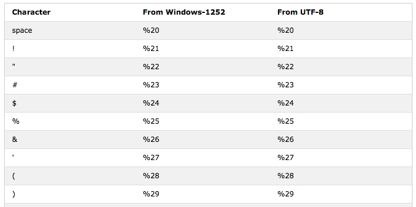

# Programmazione per il web -- 1

|      |                                                              |
| ---- | -----------------------------------------------------------: |
| WEB -- 1 | [ ][root] [](https://didatticaonline.unitn.it/dol/course/view.php?id=31325) |

[TOC]


# ~~[0.][pdf-00] Introduction~~

## Preliminaries

### Difference between Web and Internet

### What is the web

### History of the web

### Important references


## Basic concepts

### Protocol

> **Communications protocol**: *set of rules and regulations that determine how data is transmitted in telecommunications and computer networking*

Defines

1. **Format**
2. **Order**

  - Of messages exchanged between two or more communicating entities

3. **Actions**

  - Taken on the transmission and/or receipt of a message or other event


### Port

> **Port**: *endpoint of communication in an operating system*

> **Binding**: *process associates its I/O channels via an Internet socket*

- With a transport protocol, a port number, and an IP address

**Sockets** have 

- Protocol
- Local address
- Local port
- Remote address
- Remote port


### RFC (Request for comment)


### URI, URL, URN

> **Web resource**: *any identifiable thing, whether digital, physical, or abstract*

**Uniform Resource**

- **Identifier**: compact sequence of characters that identifies an abstract or physical resource
- **Locator**: subset of URI that identify resources via a representation of their primary access mechanism
  - e.g.: their network location
- **Name**: subset of URI that are required to remain globally unique and persistent even when the resource ceases to exist or becomes unavailable
  - Serves as persistent, location-independent, resource identifier

<p>

- Both URL and URN are **URI**
- **URN** identifies a **resource**
- **URL** provides a method for **finding** it
- **URN** can be associated to **many URLs**


#### URI Schemes

- `http:`
- `https:`
- `ftp:`
- `mailto:<address>[?<header1>=<value1>[&<header2>=<value2>]]`
- `geo:<lat>,<lon>`
- `fax:<phone number>`
- `file:[//host]/path`
- `bitcoin:<address>[?[amount=<size>]…`
- `skype:<username|phonenumber>…`


#### URI structure

```latex
URI = scheme:[//authority]path[?query][#fragment]
authority = [userinfo@]host[:port]
```


#### URL structure


### MIME types

Multipurpose Internet Mail Extensions

MEDIA_TYPE/SUBTYPE

- text -> text/plain, text/html, text/richtext …
- image -> image/jpeg, image/png, image/svg+xml…
- audio -> audio/basic, audio/ogg, audio/x-wav…
- video -> video/mp4, video/ogg…
- application -> application/x-apple-diskimage…


## Web architecture

###  Client and Server

> **Server**: *a machine that opens a SocketServer connection, and waits for incoming calls (in order to provide a service)*

> **Client**: *a machine the starts a connection (opening a Socket to the server) and requests a service*

Server and client are **software** roles, not hardware concept


### Static pages


<u>Initial idea</u>

- Get (static) interlinked documents
- The web programmer writes collections of HTML pages

<u>Model</u>

- **Mapping 1:1** between URLs and (static) resources
- The Web server is nothing but a **retriever of the content** associated to an URL


### Dynamic pages


<u>Evolution</u>

- **Dynamically create (interlinked) documents**
- The web programmer also writes **programs**, using the programming languages

<u>Model</u>

- Certain **URLs** are associated with **actions** and carry **parameters** for the action
- **Web server**
  - Understands that certain **URLs** are **dynamic**
  - Parses the **parameters**
  - Starts a **process** (or thread) corresponding to the desired action
  - Obtains from the process some **data** (**for human consumption**)
  - Passed the data to the **client**


### Dynamic pages with DB


<u>Evolution</u>

- Dynamically create (interlinked) **documents** interacting with **persistent data storage**
- The programs also need to interact with a (legacy) database


### Smart browsers


<u>Evolution</u>

- **Execute code also on client**
- The web programmer also writes **programs** which **run on the browser**


### Plugins


<u>Evolution</u>

- Augment browser with an **ad-hoc engine** to be able to execute a (proprietary) language


### Web services

>**Web service**: *software system designed to support interoperable machine-to-machine interaction over a network*


 <u>Model</u>

- Same as dynamic, but **for machine consumption**


### Ajax processing and single page applications

Same as web services, but with a **smart browser** with **data injection**, instead of client-side process


### Logical Web Architecture


# ~~[1.][pdf-01] XML~~

## ~~Markup~~

### Markup languages

- System for annotating a document (metadata)
- When the document is processed for display, the markup language is not shown, and is only used to format the text


### Example of Markup Language


### Types of Markup languages

- Presentational markup
- Procedural markup
- Descriptive markup


### ==SGML==

> **SGML**: *ISO standard, metalanguage that is used to define other languages*

An SGML document is the combination of three parts

- **Content** of the document
  - The part that the author wants to expose to the client
- **Grammar** (DTD -- Data Type Definition)
  - Defines the accepted syntax
- **Stylesheet**
  - Establishes how the content that conforms to the grammar is to be rendered on the output device


### HTML vs. SGML

- **HTML** implements some of the concepts derived from **SGML**
- Some parts are **hard-coded** into the **browser** software
  - **DTD**
  - Basic **Style Sheet**
    - Can be redefined via **CSS – cascading style sheet**


## Basic XML elements

### ==Definition==

> **eXtensible Markup Language**: *WWW consortium standard that permits to create custom tags*

- **Group of related technologies** that continually adds new members
- Used for **data formatting**


### Applications

- **Semantic Web**
  - RDF (Resource Description Framework), OWL, Topic Maps
- **Web Services**
  - SOAP, UDDI, WSDL, XML-RPC
- **Configuration files**


### Element, tag, content, attribute

```xml
<tag attr="value">content</tag>
```

> **Tag**: *case sensitive sequence of characters that begins with `<` and ends with `>`*

- The **start tag** may contain optional **attributes**
- Every tag must be **closed** with an **end tag**, which begins with `</`

> **Element**: *sequence of characters that begins with a start tag and ends with an end tag and includes everything in between*

> **Content**: *characters in between the tags*


### ==Well-formed documents==

- **XML documents**
  - Must be **well-formed**
  - Are **not** required to be **valid**
- **HTML documents**
  - Are **not** required to be **well-formed**


### ==Requirements for well-formed XML==

- XML is **case sensitive**
- **Start and end tags** are required
  - Elements that can contain **character data** must have both **start and end tags**
- Elements must **nested properly**
  - **Overlapping** is **not** admitted
  - Must **close** the **most inner** tag first
- **Empty elements**
  - Two syntaxes
    - `<book></book>`
    - `<book/>` (preferable)
  - Can contain **attributes**
- **No markup characters** are allowed
  - Text data must not have these characters (entities):  `< > " ' &`
  - Must be **escaped**
- All **attribute values** must be **in quotes**
  - Single quotes can contains a double quotes
  - Double quotes can contain single quotes


### ==Tree structure==

XML document

- ==Must have a **root tag**==
- Is an information unit that can be seen in two ways
  - **Linear sequence of characters** that contain **characters data** and **markup**
  - **Abstract data structure** that is a **tree** of nodes


### ==Tag definition==

- XML provide a **grammar** to
  - Define **tags**
  - Define **rules** for the tags
    - Allowed **attributes**
    - **Containment** rules
- The grammar **definition** is in a file
  - **DTD** file
  - **XML-Schema** file
  - Or is **not defined** at all


### ==Additional elements==

- XML document can contain
  - **Processing Instructions** (PI):  `<? ... ?>`
  - **Comments**:  `<!-- ... -->`
- When the document is analyzed
  - **Character data**
    - Within comments or PIs are **ignored**
  - **Content**
    - Of **comments** is **ignored**
    - Of **PIs** is passed on to **applications**


### ==CDATA sections==

> **CDATA section**: *section used to escape character strings*

- Used with strings that may contain elements not intended to be examined by the XML engine
  - e.g.: special chars or tags

> **PCDATA**: *element content that are going to be parsed*

When a XML document is analyzed, character data within a `CDATA` section are **not parsed**, by they remain as part of the **element content**

```xml
<java>
<![CDATA[
    if (arr[indexArr[4]] > 3) System.out.println("<HTML>");
]]> <!-- Avoid having `]]>` in CDATA section -->
</java>
```


###  ==Logical structure of a document==

- <u>Optional</u>

  - **XML declaration** (**prolog**)

    - If present must be the **first element**

    - ```xml
      <?xml version='1.0' encoding='utf-8'>
      ```

  - **DTD** declaration

  - **Comments** and **Processing Instructions**

- <u>Mandatory</u>

  1. **Root element’s start tag**
  2. All other **elements**, **comments** and **PIs**
  3. **Root element's closing tag**


### ==Namespaces==

**Avoid tag conflicts** by declaring a namespace as an **attribute of the root** element

```xml
<xsl:stylesheet version="1.0"
xmlns:xsl="http://www.w3.org/1999/XSL/Transform">
```


### Parser

> **Parser**: *software tool that preprocesses an XML document in some fashion, handing the results over to an application program*

<u>Primary purpose</u>: do most of the hard work up front and to provide the application program with the XML information in a form that is easier to work with.

- <u>Input</u>: **XML file**
- <u>Output</u>:
  - **Data structure**
  - **Error** (if not well-formed)


### Tree-based vs Event-based API

- **Tree-based API**
  - **Compiles** an XML document into an **internal tree structure**
  - **Application** programs can **navigate** the tree to achieve its objective
  - The **Document Object Model (DOM)** working group at the W3C developed a **standard tree-based API** for XML
- **Event-based API**
  - **Reports parsing events** to the application using **callbacks**
    - e.g.: start and end of elements
  - **Applications** implement and register **event handlers** for the different events
  - Code in event handlers is designed to achieve the **objective** of application


## DTD

### Definition

> **DTD**: *one or more files (used together) which contain a formal definition of a particular type of document*

- This sets out
  - **What names** can be used for **elements**
  - **Where** they may occur
  - **How** they all fit together
- It's a **formal language** which lets processors automatically
  - **Parse** a **document**
  - **Identify** where every **element** comes
  - **How** they **relate** to each other
- DTD contains **metadata** relative to a **collection of XML docs**


### ==Valid documents==

- ==An XML document is **valid** if it conforms to an existing grammar in every respect==
  - e.g.: unless the DTD allows an element with the name "color", an XML document containing an element with that name is not valid according to that DTD (but it might be valid according to some other DTD)
- ==An **invalid** XML document can be a perfectly good and useful XML document==
- ==A **non well-formed** document cannot be valid, and is not an XML document==

~~**Validation** against a DTD can often be very **useful**, but is **not required**~~

- ~~Because XML does **not require a DTD**, in general, an XML processor cannot require validation of the document~~


### Constraing & validating XML: DTD file


### DTDs locations

DTD can be **external** or **internal** to a document


### DTD Markup

#### `ELEMENT`

```xml-dtd
<!ELEMENT name contentModel>
```

```xml-dtd
<!ELEMENT book (preface?,chapter+,index)>
<!ELEMENT preface (paragraph+)>
<!ELEMENT paragraph (#PCDATA)>

<!ELEMENT chapter (title,paragraph+,reference*)>
<!ELEMENT title (#PCDATA)>
<!ELEMENT reference (#PCDATA|URL)>
<!ELEMENT URL (#PCDATA)>

<!ELEMENT index (number,title,page_number)>
<!ELEMENT number (#PCDATA)>
<!ELEMENT page_number (#PCDATA)>
```

- Cardinality
  - `nd`  1-1
  - `? `    0-1
  - `+ `    1-n
  - `*`    0-n
- `,`  Sequence
- `|`  OR


#### `ATTLIST`

```xml-dtd
<!ATTLIST elementName attributeName type default>
```

```xml-dtd
<!ELEMENT Product (#PCDATA)>
<!ATTLIST Product
    Name CDATA #IMPLIED
    Rev CDATA #FIXED "1.0"
    Code CDATA #REQUIRED
    Pid ID #REQUIRED
    Series IDREF
    Status (InProduction|Obsolete) "InProduction"
>
```

- TYPES
  - `CDATA`  Character data
  - `ID`  Unique key
  - `IDREF`  Foreign Key
  - `(...|...)`  Enumeration
- DEFAULT
  - `#IMPLIED`  Optional, no default
  - `#FIXED`  Optional, default supplied
    - If present must match default
  - `#REQUIRED`  Must be provided


### Problem

- <u>Problem</u>: DTDs are **not written in XML**
- <u>Solution</u>: another XML-based standard (**XML Schema**)


### Constraing & validating XML: XML Schema


### XML Schema

```xml
<?xml version="1.0"?>
<schema>
  <element name="complete_name" type="complete_name_type"/>
  <complexType name="complete_name_type">
    <sequence>
      <element name="nome" type="string"/>
      <element name="cognome" type="string"/>
    </sequence>
  </complexType>
</schema>
```

Defines **validity rules** for tags

```xml
<complete_name>
  <nome>Marta</nome>
  <cognome>Bassino</cognome>
</complete_name>
```


## Applications

### ==In practice==

- **Navigate** its data structure
  - DOM, JDOM
  - JAXP
  - XPath
  - SAX
- **Query** XML data
  - XQuery
- **Transform** XML data
  - XSLT
- Use XML for **Single Page Web Applications**
  - AJAX
- Use XML in **configuration files**


### SAX: architecture

```java
SAXParserFactory factory = SAXParserFactory.newInstance();
factory.setValidating(true); //optional - default is non-validating
SAXParser saxParser = factory.newSAXParser();
saxParser.parse(File f, DefaultHandler-subclass h)
```


### SAX: callbacks

```java
// ContentHandler methods
void characters(char[] ch, int start, int length)
void startDocument()
void startElement(String name, AttributeList attrs)
void endElement(String name)
void endDocument()
void processingInstruction(String target, String data)
```


### JAXP: DOM

```java
DocumentBuilderFactory dbf = DocumentBuilderFactory.newInstance();
dbf.setValidating(true); // optional – default is non-validating
DocumentBuilder db = dbf.newDocumentBuilder();
Document doc = db.parse(file);
```


### Node hierarchy


<u>Example</u>

```xml
<!-- Demo -->
<A id="3">hello</A>
```


### JAXP: example

```java
public int getElementCount(Node node) {
    if (null == node) return 0;
    int sum = 0;
    boolean isElement = (node.getNodeType() == Node.ELEMENT_NODE);
    if (isElement) sum = 1;
    NodeList children = node.getChildNodes();
    if (null == children) return sum;
    for (int i = 0; i < children.getLength(); i++) {
        sum += getElementCount(children.item(i));  // recursive
    }
    return sum;
}
```

Use **DOM methods** to count elements

- For each subtree
- If the root is an Element, set sum to 1, else to 0
- Add element count of all children of the root to sum


### XPath

**Syntax for defining parts** of an XML document

- Uses **path expressions to navigate** in XML documents
- Contains a library of **standard functions**
- Major element in XSLT
- W3C Standard

```java
// prepare the XPath expression
XPathFactory factory = XPathFactory.newInstance();
XPath xpath = factory.newXPath();
XPathExpression expr = xpath.compile("//book[author='Dante Alighieri']/title/text()");
// evaluate the expression on a Node
Object result = expr.evaluate(doc, XPathConstants.NODESET);
// examine the results
NodeList nodes = (NodeList) result;
for (int i = 0; i < nodes.getLength(); i++) {
    System.out.println(nodes.item(i).getNodeValue());
}
```


# [2.][pdf-02] HTML

## ~~Basics~~

### What to know


### Introduction

### Readings

### What is HTML

### Hypertext

### Media

### Versions

### The web


## ~~Structure~~

### Content/Aspect separation


### Structure of an HTML doc

```html
<!DOCTYPE html>
<html>
  <head>
    <meta charset="utf-8">
    <title>My test page</title>
  </head>
  <body>
    <p>This is my page</p>
  </body>
</html>
```

- **`head`**: contains information about the document (metadata)
  - **Title of the page** (which appears at the top of the browser window)
  - **Meta tags**: used to describe the content (used by Search engines)
  - **Statements or references** to JS and CSS
- **`body`**: contains the actual content of the document
  - This is the part that will be displayed in the browser window


### DocType declaration

```html
<!-- Complete -->
<!DOCTYPE html PUBLIC "-//W3C//DTD XHTML 1.0 Transitional//EN" "http://www.w3.org/TR/xhtml1/DTD/xhtml1-transitional.dtd">

<!-- HTML 5.0 -->
<!DOCTYPE html>
```


### HTML Tags

- All HTML tags are made up of a **tag name**
  - Sometimes followed by an optional **list of attributes**
- Nothing within the brackets will be displayed by the browser
  - Unless HTML is incorrect and browser interprets tags as part of the content

> **Tag**: *keyword enclosed by angle brackets*

- Opening and closing tags use the **same command**
- Except the **closing tag** contains an additional forward slash `/`


#### ==Void elements==

**Ending slash**

- **HTML5**: the slash is **optional**
- **HTML4**: the slash is technically **invalid**
  - It's accepted by W3C's HTML validator
- **XHTML**: the slash is **required**


#### Attributes

> **Attributes**: *name-value pair which refine or extend tag’s functions*

- You can add multiple attributes within a single tag
- Some attributes only have name (no associated value)
- Values are limited to 1024 characters in length
- Attributes values are within single or double quotes


## Formatting

### ~~HTML content model~~

Two basic **content models**

- **Inline**: character level elements and text strings
- **Block**: block-like elements


### ~~Basic formatting~~

#### Tags

- Headings: `<h1>` … `<h6>`
- Emphasis: `<em> <strong> <b> <i>`
- Subscript, superscript: `<sub> <sup>`
- Lists: `<ol> <ul> <li>`


#### Blocks

- Line breaks: `<br/>`
- Paragraphs and blocks: `<p>` `<div>` `<span>`
  - **`<div>`**: container of data (with graphic separation)
    - **Line-break** before and after it
  - **`<span>`**: logical, in-line grouping without graphic evidence
    - Mostly used for a **small chunk of HTML** inside a line
  - **`<p>`**: paragraph of content (with graphic separation)
    - It **cannot contain block**-level elements but can contain `<span>`

> *Don't mark up your document based on how it should look,*
> *mark it up based on what it is*


### Advanced formatting

- Quotation: `<blockquotes> <q>`
- Description lists: `<dl> <dt>`
- Details / Summary: `<detail> <summary>`
- Abbreviation: `<abbr>`
- Address: `<address>`
- Computer code: `<code> <pre> <var> <kbd> <samp>`
- Time: `<time>`


### Tables

- `<table>` defines the table
- `<th>`, `<tr>` define the rows
- `<td>` defines every single cell
- `<caption>` defines the caption

The following attributes define the cell span over columns and rows

- `colspan="n"`
- `rowspan="n"`


### Images

```html

```

```html
<figure>
    
    <figcaption>Cool Ninja Guy</figcaption>
</figure>
```


### File paths

|                                       |                                                              |
| ------------------------------------- | ------------------------------------------------------------ |
| `` | Absolute Path                                                |
| ``                 | `pic.jpg` is located in the same server, same folder as the current page |
| ``             | `pic.jpg` is located in the images folder in the current folder |
| ``          | `pic.jpg` is located in the folder one level up from the current folder |


### Hyperlinks

```html
<a href="url">link text</a>
```

- URLs with **other protocols**

  ```html
  <a href="mailto:marco.ronchetti@unitn.it">write to me!</a>
  ```

  ```html
  <base href="https://www.mydomain.com/" target="_blank">
  ```

- **Inner** target

  ```html
  <a href="#pippo" >GO TO PIPPO!</a>
  ···
  <a name="pippo"/>
  ```


### ~~Iframes~~

```html
<iframe src="demo_iframe.htm"></iframe>

<iframe height="300px" width="100%"
        src="demo_iframe.htm" name="iframe_a">
</iframe>

<p><a href="https://www.w3schools.com" target="iframe_a">
W3Schools.com
</a></p>
```


## Encoding and metadata

### ~~Character Encoding~~

#### Entities


#### URL Encoding




### Metadata (head)

```html
<meta charset="UTF-8">
<meta name="description" content="Free Web tutorials">
<meta name="keywords" content="HTML,CSS,XML,JavaScript">
<meta name="author" content="John Doe">
<meta http-equiv="refresh" content="30">
<meta charset="utf-8">
<meta name="viewport" content="width=device-width,
                               initial-scale=1.0">
```


# [3.][pdf-03] HTTP

## ~~Basics and connections~~

### Overview

> **HTTP**: hypertext transfer protocol

- Web’s application **layer protocol**: **client/server model**
  - **Client**: browser that requests, receives and displays Web objects
  - **Server**: sends (using HTTP protocol) objects in response to requests
- Uses **TCP**
  1. **Client initiates TCP** connection (creates socket) to server, port 80
  2. **Server accepts TCP** connection from client
  3. **HTTP messages** (application-layer protocol messages) exchanged between browser (HTTP client) and Web server (HTTP server)
  4. **TCP connection closed**


### States

- HTTP is **stateless**
  - Server maintains no information about past client requests
  - Protocols that maintain state are complex
    - Past history (state) must be maintained
    - If server/client crashes, their views of state may be inconsistent, must be reconciled
- FTP is **stateful**
  -  Server maintains information about past client requests
    - You can issue a `cd` command to move into a (remote) directory
    - The next commands will be executed with reference to that directory


### Making a simple HTTP request using Telnet

- Open a **TCP connection** to a host
  - Can borrow telnet protocol, by pointing it at the default HTTP port (80)
  - `$> telnet www.google.com 80`
- Ask for a resource using a minimal **request** syntax
  - `$> GET / HTTP/1.1` <CRLF>
  - `Host: www.google.com` <CRLF>
  - <CRLF>
- A Host header is required for HTTP 1.1 connections


### Web and HTTP

- Web page consists of objects
  - Text file, JPEG image, Flash objects, audio file, …
- A web page contains base HTML-file which includes several **referenced objects**
- Each object is addressable by a URL
  - www.somecompany.com/someDept/pic.gif
  - www.somecompany.com is the host name
  - [someDept/pic.gif][] is the path to the object


### HTTP connections

- **Non-persistent HTTP**
  - At most one object sent over TCP connection
  - Connection then closed
  - Downloading multiple objects required multiple connections
- **Persistent HTTP**
  - Multiple objects can be sent over single client-server TCP connection


### Non-persistent HTTP

> **Round Trip Time (RTT)**: *time for a small packet to travel from client to server and back*

- HTTP **response time**
  - **One RTT to initiate TCP** connection
  - **One RTT for HTTP request** and first few bytes of HTTP response to return
  - **File transmission** time
- **= 2 RTT + file transmission time**


### Connections comparison

- **Non-persistent** HTTP <u>issues</u>
  - Requires **2 RTTs per object**
  - **OS overhead** for each TCP connection
  - Browsers often open **parallel TCP connections** to fetch referenced objects
- **Persistent** HTTP <u>advantages</u>
  - Server leaves **connection open** after sending response
  - **Subsequent HTTP messages** between same client/server sent over open connection
  - Client sends **requests as soon as** it encounters a referenced **object**
  - As little as **one RTT** for all the referenced objects


## Request

### ~~Request-response cycle~~

HTTP servers turn **URLs into resources** through a request-response cycle

- Two types of **HTTP messages**
  - **Request**
  - **Response**


### ~~Request/response messages: general format~~

- **Start Line**
  - **Request** line for requests
  - **Status** line for responses
  - Followed by a <CRLF>
- **Message headers** (zero or more)
  - `field-name: [field-value]` <CRLF>
- **Empty line**
  - Two <CRLF> marks the end of the headers
- **Message body** (optional)
  - If there is a **payload**
  - All or part of the **entity body** or **entity**


### ~~Request messages: general format~~

**ASCII**, human-readable format


```http
GET / HTTP/1.1
Host: www.iugaza.edu.ps
Connection: close
User-Agent: Mozilla/4.0 (compatible; MSIE 7.0; Windows NT 5.1)
Accept-Encoding: gzip
Accept-Charset: ISO-8859-1,UTF-8;q=0.7,*;q=0.7
Cache-Control: no-cache
Accept-Language: de,en;q=0.7,en-us;q=0.3
Referer: http://web-sniffer.net/
<CRLF>
```


### ==Method types==

- HTTP/1.0
  - **`GET`, `POST`**
    - Asks server to **obtain an object**
  - **`HEAD`**
    - Asks server to **leave requested object out of response**
- HTTP/1.1
  - **`GET`, `POST`, `HEAD`**
  - **`PUT`**
    - **Uploads file** in entity body to path specified in URL field
  - **`DELETE`**
    - **Deletes file** specified in the URL field


### ==Uploading form input==

- ==**`POST` method**==
  - ==Web page often includes **form input**==
  - ==Input is **uploaded** to server **in entity body**==
- ==**URL method**==
  - ==Uses **`GET`** method==
  - ==Input is **uploaded in URL field** of request line==


### ==Request Methods==

- ==**`GET`**==
  - ==By far **most common** method==
  - ==**Retrieves a resource** from the server==
  - ==Supports passing of **query string arguments**==
- **`HEAD`**
  - **Retrieves only the headers** associated with a resource
    - Not the entity itself
  - Highly useful for **protocol analysis**, **diagnostics**
- ==**`POST`**==
  - ==Allows **passing of data in entity** rather than URL==
  - ==Can transmit of far **larger arguments** than GET==
  - ==Arguments **not displayed on the URL**==
- **`OPTIONS`**
  - Shows **methods available** for use
    - On the **resource** (if given a path)
    - On the **host** (if given a `*`)
- **`TRACE`**
  - **Diagnostic method** for assessing the impact of **proxies** along the request-response chain
- **`CONNECT`**
  - A common extension method for **Tunneling other protocols** through HTTP
- **`PUT`**, **`DELETE`**
  - Used in **HTTP publishing**
    - e.g.: WebDav


### ==Idempotent methods==

> **Idempotent methods**: *an HTTP method is idempotent if an identical request can be made once or several times in a row with the same effect while leaving the server in the same state*

- Should **not** have any **side-effects**
  - Except for keeping statistics
- Implemented correctly, the **`GET`**, **`HEAD`**, **`PUT`** and **`DELETE`** method are idempotent, but not the `POST` method


### ==Safe methods==

> **Safe method**: *an HTTP method is safe if it doesn't alter the state of the server*

- i.e.: it leads to a **read-only** operation
- **`GET`**, **`HEAD`**, **`OPTIONS`**
- All safe methods are also **idempotent**
  - Not all idempotent methods are safe


## Response

### ~~Response messages: general format~~


https://websniffer.cc/?url=https://www.unitn.it/


### Status Line

Three major parts
- **HTTP version** ~~(~ third part of Request Line)~~
- **Status code**
  - 5 groups of 3 digit indicating the result of the attempt to satisfy the request
    1. Informational
    2. Success
    3. Redirection
    4. Client error
    5. Server error
- **Reason phrase**, followed by <CRLF>
  - Short textual description of the status code


## ~~Headers~~

### HTTP headers

Headers come in four major types, for **requests**, for **responses** or for **both**

-  **General headers**
  - Provide info about messages of both kinds
- **Request headers**
  - Provide request-specific info
- **Response headers**
  - Provide response-specific info
- **Entity headers**
  - Provide info about request and response entities
- **Extension** headers are also possible


### General headers

- **`Connection`**: lets clients and servers manage connection state
  - `Connection: Keep-Alive`
  - `Connection: close`
- **`Date`**: when the message was created
  - `Date: Sat, 31-May-03 15:00:00 GMT`
- **`Via`**: shows proxies that handled message
  - `Via: 1.1 www.myproxy.com (Squid/1.4)`
- **`Cache-Control`**: enables caching directives
  - `Cache-Control: no-cache`


### Request headers

- **`Host`**: hostname (and optionally port) of server to which request is being sent
  - `Host: www.host.com`
- **`Referer`**: URL of the resource from which the current request URI came
  - `Referer: http://www.host.com/login.asp`
- **`User-Agent`**: name of the requesting application, used in browser sensing
  - `User-Agent: Mozilla/4.0 (Compatible; MSIE 6.0)`
- **`Accept`** and its variants: inform servers of client’s capabilities and preferences
  - Enables content negotiation
  - `Accept: image/gif, image/jpeg;q=0.5`
  - `Accept[-Language|-Encoding|-Charset]: ...`
- **`Cookie`**: how clients pass cookies back to the servers that set them
  - `Cookie: id=23432;level=3`


### Response headers

- **`Server`**: server’s name and version
  - `Server: Microsoft-IIS/5.0`
  - Can be problematic for security reasons
- **`Set-Cookie`**: how a server sets a cookie on a client
  - `Set-Cookie: id=234; path=/shop; expires=Sat, 31-May-03 15:00:00 GMT; secure`


### Entity headers

- **`Allow`**: lists the request methods that can be used on the entity
  - `Allow: GET, HEAD, POST`
- **`Location`**: gives the alternate or new location of the entity
  - Used with `3xx` response codes (redirects)
  - `Location: http://www.iugaza.edu.ps/ar/`
- **`Content-Encoding`**: specifies encoding performed on body of response
  - Used with HTTP compression
  - `Content-Encoding: gzip`
  - ~~(~ `Accept-Encoding` request header)~~
- **`Content-Length`**: size of the entity body in bytes
- **`Content-Location`**: the actual if different than its request URL
- **`Content-Type`**: MIME type of the entity body


## ~~HTTPS~~

### HTTP + SSL

> **HTTPS**: Hypertext Transfer Protocol over Secure Socket Layer (SSL)

**SSL protocol** inserts itself **between HTTP** application **and TCP** transport layer

- TCP sees SSL as just another application
- HTTP communicates with SSL much the same as it does with TCP

**HTTPS** is

- Only **slightly slower** than HTTP
- A bit more complex to set up (due to the need of a **certificate**)


### Cryptography

#### Symmetric


----


#### Asymmetric


Asymmetric key decryption is **slower** than symmetric key decryption


### SSL session

- **Asymmetric encryption** to privately share the **session key**
  - Lot of **overhead**
- **Symmetric encryption** to encrypt **data**
  - **Quicker** and uses less resource


### Handshake process


<u>Security issues</u>

- The certificate is guaranteed authentic by a "**chain of trust**"


# ~~[4.][pdf-03] Traffic optimization~~

## HTTP proxy

### Web caches (proxy server)

<u>Goal</u>: satisfy client request without involving origin server

- **User** sets browser: web accesses via cache
- **Browser** sends all HTTP requests to cache
  - **Object in cache**: cache returns object
  - Otherwise cache requests object from **origin server**, then returns it to client


### Web caching

- Cache acts as both **client and server**
  - Server for original requesting client
  - Client to origin server
- Typically cache is **installed by ISP** (university, company, residential ISP)

<u>Advantages</u>

- Reduce **response time** for client request
- Reduce **traffic** on an institution’s access link
- Internet **dense** with caches
  - Enables **poor content providers** to effectively deliver content
    - So too does **P2P** file sharing


### Conditional GET

- <u>Goal</u>: don’t send object if cache has up-to-date cached version
  - No object transmission delay
  - Lower link utilization
- **Cache**: specify date of cached copy in HTTP request
  - `If-modified-since: <date>`
- **Server**: response contains no object if cached copy is up-to-date
  - `HTTP/1.0 304 Not Modified`


## Video streaming and CDNs

### Context

**Video traffic**: major consumer of Internet bandwidth

- <u>Challenge</u>: **scale**
  - Reach large amount of users
- <u>Challenge</u>: **heterogeneity**
  - Different users have different capabilities
- <u>Solution</u>: **distributed, application-level infrastructure**


### Streaming multimedia: DASH

> **DASH**: Dynamic Adaptive Streaming over HTTP

- **Server**
  - Divides video file into multiple chunks
  - Each chunk stored, encoded at different rates
  - Manifest file: provides URLs for different chunks
- **Client**
  - Periodically measures server-to-client bandwidth
  - Consulting manifest, requests one chunk at a time
    - Chooses maximum coding rate sustainable given current bandwidth
    - Can choose different coding rates at different points in time
      - Depending on available bandwidth at time
- **Intelligence at client**
  - When to request chunk
    - So that buffer starvation, or overflow does not occur
  - What encoding rate to request
    - Higher quality when more bandwidth available
  - Where to request chunk
    - Can request from URL server that
      - Is close to client
      - Has high available bandwidth


### Challenge

> **CDN**: Content Distribution Networks

- Geographically distributed sites

<u>Challenge</u>: stream content to several simultaneous users

- <u>Option 1</u>: **single**, large mega-**server**
  - Single point of failure
  - Point of network congestion
  - Long path to distant clients
  - Multiple copies of video sent over outgoing link
  - <u>Problem</u>: this solution doesn’t scale
- <u>Option 2</u>: store/serve **multiple copies** of videos at **multiple CDNs**
  - **Enter deep**: push CDN servers deep into many access networks
    - Close to users
  - **Bring home**: smaller number (10's) of larger clusters in POPs near (but not within) access networks


### Content Distribution Networks

- CDN stores **copies** of content at CDN **nodes**
- **Subscriber requests** content from CDN
  - Directed to **nearby copy**, retrieves content
  - May choose **different copy** if network path **congested**


# [5.][pdf-04] Web server

## ~~Dynamic pages~~

### Main idea

Obtain **non static** information from the server

- This implies **executing some code** on it, and **send the results** to the user


### Common Gatway Interface

> **CGI**: *a way to tell the server to spawn a process, get its results and send them as HTTP response*


### Creating dynamic pages

```sh
$> cd /Applications/XAMPP/xamppfiles/cgi-bin
$> touch getTime.sh
$> echo '
#!/bin/sh
echo "Content-type: text/plain; charset=iso-8859-1"
echo
echo `date`
' > getTime.sh
$> chmod 755 getTime.sh
$> ./getTime.sh

# Content-type: text/plain; charset=iso-8859-1
#
# sab 22 mag 2021, 20:40:46, CEST
```

```perl
localhost:8080/cgi-bin/getTime.sh
# sab 22 mag 2021, 20:40:46, CEST
```


### Getting info about the request


## ~~HTML and code~~

### Embedding HTML into code

```sh
# readPost.sh - Read the POST DATA (full page) and print out HTML
#!/bin/sh
read MYDATA
echo "Content-type: text/plain; charset=iso-8859-1"
echo
echo "<HTML>"
echo "<HEAD><TITLE>Showing Post Data </TITLE>”
echo "<BODY>"
echo "here are the post data:<br>"
echo $MYDATA
echo "</BODY></HTML>"
```


### Embedding code into HTML

Augment the **web server** with an **engine** capable of **parsing a web page**, and **executing code in it**


### PHP Hypertext Processor

```php+HTML
<!-- whatsTheTime.php -->
<!DOCTYPE html>
<html>
<body>
  <i>Sir, the current time is
  <?php echo date("h:i:sa"); ?>
  </i><br/>
  (as far as I know!)
</body>
</html>
```


## ~~PHP language~~

### Language

- Interpreted
- Non-typed
- Case insensitive

https://www.jdoodle.com/php-online-editor/
https://www.w3schools.com/php/default.asp


### Elements

- **Variables**:  `$<name>`

- **Data types**

  - Implicitly assigned by interpreter

  - Can be enforced

    ```php+HTML
    <?php declare(strict_types=1); ... ?>
    ```

- **Comments**:  `//`, `#`

- **Output**:  `print ...` ,  `echo ...` ,  `var_dump()`

  - `echo` and `print` are similar
    - Output data to the screen
    - `echo` has no return value
    - `print` has a return value of `1`
    - `echo` can take multiple parameters
  - `var_dump` prints type and value of the parameter


### Language constructs

### Arrays

### Functions

### Operators

### Predefined functions

### OOP


### Variable scope

A variable **declared**

- **Outside a function**
  - Has a **global scope**
  - Can only be **accessed outside** a function
- **Within a function**
  - Has a **local scope**
  - Can only be **accessed within** that function


### Superglobal variables

Variables visible **everywhere**

- `$GLOBALS['var']`: marks `var` as **global**
- `$_SERVER`: info mostly extracted from http request headers
- `$_POST`
- `$_GET`: associative arrays, with `key=name`


### Getting info about the request


## ==HTML forms==

### ==Forms==

Give to the user the possibility to **send information to the Web server**

==The **`<form>`** tag defines a form==

- ==<u>Attributes</u>==
  - ==**`action`** identifies the **processing engine**==
  - ==**`encrypte`** specificies the **MIME type** used to pass data to the server==
  - ==**`method="get|post"`**==
- ==<u>Sub-tags</u> (inner tags)==
  - ==Tags for collecting data==
  - ==An `<input>` tag must be of type **`submit`** for **sending** the data==
  - ==An `<input>` tag can be of type **`reset`** to **cancel** all the gathered data==


### Examples


# [6.][pdf-06] Java servlets

## ~~Programming the web servers~~

### Getting info about the request


### Apache Tomcat

- **Java servlet container**
- Run on **JVM**
- Utilizes Java servlet specification to **execute servlets generated by requests**
  - Often with the help of **JSP pages**
  - Allows dynamic content to be generated **more efficiently** than CGI scripts


### Servlet life-cycle


## ==Parameters passing in request==

### HTML form

```html
<form action="http://localhost:8084/app/ReadPost" method="post">
    <label for="fname">First name:</label>
    <input type="text" name="fname"><br><br>
    <input type="submit" value="Submit">
    <input type="reset" value="Reset">
</form>
```

```java
protected void processRequest(
        HttpServletRequest request,
        HttpServletResponse response)
        throws ServletException, IOException {
    String name = request.getParameter("fname");            /* ← */
    response.setContentType("text/html;charset=UTF-8");
    try (PrintWriter out = response.getWriter()) {
        /* TODO output your page here */
        out.println("<!DOCTYPE html>");
        out.println("<html><head>");
        out.println("<title>Servlet ReadPost</title>");
        out.println("</head><body>");
        out.println("<h1> fname=" + name + "</h1>");        /* ← */
        out.println("</body>");
        out.println("</html>");
    }
}
```


### [`httpServletRequest`  &  `Response`][pdf-06]


## [Advanced uses][pdf-06]

### Factoring HTML

### Netbeans Services


## [Hit counter][pdf-07]

### Implementation


### Persist the counter

In a file `counterData`

1. In `init` **check** if file exists
   - If yes, **resume** the counter
   - If no, **create** a new one
2. In `destroy`, let us **save** counter in `conterData`


### Java serialization


# [7.][pdf-07] Cookies

## Basics

### Keeping state

HTTP is **stateless**

- There is no way of keeping track **server-side** of
  - Who is who
  - Which state of the process it is at

<u>Problems</u>


<p>

<u>Solutions</u>


### ==Definition==

> **Cookie**: *small amount of information sent by a servlet to a Web browser, saved by the browser, and later sent back to the server*

- A cookie's **value** can **uniquely identify a client**
  - Are commonly used for **session management**
- A cookie has a **name**, a single **value**, and optional **attributes**
  - e.g.: comment, path and domain qualifiers, maximum age, version number


### ==Features==

Cookies **maintain**

- **Status** across a **user session**
- **Info** across multiple **interactions**
  - Customer **identification**
  - Targeted **advertisement**
  - Elimination of **username e password**


### ==Communication==

- **Servlet sends** cookies to browser by using the method

  ```java
  HttpServletResponse.addCookie(javax.servlet.http.Cookie);
  ```

  - **Adds fields** to HTTP response **headers** to send cookies to browser
    - **One at a time**
  - The **browser** is expected to **support**
    - 20 cookies for each Web server
    - 300 cookies total
    - May limit cookie size to 4KB each

- **Browser returns** cookies to servlet by **adding fields to** HTTP request **headers**

  ```java
  HttpServletRequest.getCookies();
  ```


### ~~Caching~~

- Cookies affect the **caching** of the **web pages** that use them
- **Java class `Cookie`** supports both Version 0 and Version 1 cookie **specifications**
  - By default, cookies are created using **Version 0**
    - Ensure the best **interoperability**
  - **HTTP 1.0** does **not** cache pages that use cookies created with this class


### ==Attribute summary==

```java
String getComment()
void   setComment(String s)
```

- Gets/Sets a **comment associated** with this cookie

```java
String getDomain()
void   setDomain(String s)
```

- Gets/Sets the **domain** to which cookie **applies**
  - Normally, cookies are returned only to the **exact hostname** that sent them
  - You can use this method to instruct the browser to **return** them **to other hosts** within the **same domain**
    - The domain should contain different numbers of **dots** depending on itself

```java
int  getMaxAge()
void setMaxAge(int i)
```

-  Gets/Sets how much **time** (in seconds) should elapse before the cookie **expires**
  - <u>Default</u>: it will last only for current session and will not be stored on disk
    - i.e. until the user quits the browser
  - `LongLivedCookie` class defines a subclass of `Cookie` with a maximum age automatically set one year in the future

```java
String getName()
void   setName(String s)
```

- Gets/Sets the **name** of the cookie
  - **Name** and **value** are the two most **important** parts of a cookie 
  - Since the `getCookies` method of `HttpServletRequest` returns an **array of Cookie** objects, it is common to search a **particular name**, then check the value with **`getValue`** ~~(~ `getCookieValue`)~~

```java
String getValue()
void   setValue(String s)
```

- Gets/Sets the **value associated** with the cookie
  - In a few cases a **name** is used as a **boolean flag**, and its value is ignored
    - i.e. the existence of the name means true

```java
String getPath()
void   setPath(String s)
```

- Gets/Sets the **path** to which this cookie **applies**
  - <u>Default</u>: the cookie is returned for **all URLs** in the same directory as the current page, as well as all sub-directories
  - This method can be used to **specify something** more general
    - e.g.: `cookie.setPath("/")` specifies that all pages on the server should receive the cookie
  - The path specified must include the **current directory**

```java
boolean getSecure()
void    setSecure(boolean b)
```

- Gets/Sets the boolean value indicating whether the cookie should only be sent over **encrypted connections**  (i.e. SSL)

```java
int  getVersion()
void setVersion(int i)
```

- Gets/Sets the cookie **protocol version** this cookie complies with


### ==Cookies in response headers==

The cookie is added to the **`Set-Cookie` response header**

- By means of the **`addCookie`** method of `HttpServletResponse`

```java
Cookie userCookie = new Cookie("user", "uid1234");
userCookie.setMaxAge(60*60*24*365);
response.addCookie(userCookie);
// before opening the body of response!
// i.e. before any out.print
```


### ==Reading from client==

1. To **read** the cookies that come back from the client, call **`getCookies`** on the `HttpServletRequest`
   - <u>Return</u>: array of `Cookie` objects
     - Corresponding to values that came in on Cookie HTTP request header
2. Once this array is available, loop down it calling **`getName`** on each cookie to **search a specific name**
3. Then call **`getValue`** on the matching cookie
   - Do some processing specific to the resultant value


## ==[Cookies in action][pdf-07]==

### `SetCookies`

### `ShowCookies`

### Cookies in action


## ==Session==

### Session tracking using cookies


### Implementation

```pseudocode
Hashtable globalTable = getGlobalTable();
String sessionID = makeUniqueString();
Hashtable stateTable = new Hashtable();
globalTable.put(sessionID,stateTable);
Cookie sessionCookie = new Cookie("SessionID", sessionID);
response.addCookie(sessionCookie);
stateTable.put("key", infoObject);
```


### Concept

- To **support applications** that need to maintain state, **Java Servlet** technology 
  - Provides an **API** for **managing sessions**
  - Allows several mechanisms for **implementing sessions**
- ==Sessions are represented by an **`HttpSession` object**==


### ==Session tracking==

- To **associate a session with a user**, a web container can use several methods
- All of which involve **passing an identifier** between the client and the server
  - Maintained on the **client as a cookie** ~~or~~
  - The **web component** can include the **identifier in every URL** that is returned to the client


### ==Accessing session==

Access `HttpSession` object by calling **`getSession`** method of request object

- <u>Return</u>
  - **Current session** associated with this request ~~or~~
  - **Creates a session** if the request does not have it


### ==Associating objects with session==

Associate **object-valued attributes** with an `HttpSession` by **name**

- Such attributes are accessible by **any web component** that
  - Belongs to the **same web context** ~~and~~
  - Is handling a request that is part of the **same session**


### ==`HttpSession` methods==

#### Attributes

```java
public Enumeration getAttributeNames()
```

- <u>Return</u>: **`Enumeration` of `String`** objects containing the **names** of all the **objects bound** to this session

```java
public Object getAttribute(String name)
```

- <u>Return</u>: the **object bound** with the specified name in this session, or `null` if no object is bound under the name

```java
public void setAttribute(String name, Object value)
```

- **Binds an object** to this session, using the name specified
- If an object of the same name is already bound, the object is **replaced**

```java
public void removeAttribute(String name)
```

- **Removes the object bound** with the specified name from this session
- **Nothing** if the session does not have an object bound with the specified name

<p>
#### Others

```java
public String getId()
```

- <u>Return</u>: string containing the **unique identifier** assigned to this session
  - **Assigned by the servlet container**
  - Is **implementation dependent**

```java
public boolean isNew()
```

- <u>Return</u>: `true` if the client
  - Does **not yet know** about the session ~~or~~
  - Chooses **not to join** the session
    - e.g.: if client had **disabled** the use of **cookies**

```java
public void invalidate()
```

- **Invalidates** this session then **unbinds** any objects bound to it


### ==Session life-cycle==

A session consumes **resources** (**memory**), hence it has to be managed

- <u>Problem</u>: http is **stateless**, so there is **no** notion of **log out**
- <u>Solution</u>: set an expiry time for sessions (**timeout**)


### ==Setting session global timeout==

**Set the timeout** period in the deployment descriptor using **NetBeans**

1. **Expand the node** of your project in the 'Projects' tab

2. **Expand the Web Pages and `WEB-INF` nodes** that are under the project node

3. If **`WebInf` is empty**, select it and right-click

4. `new → other → Standard Deployment Descriptor`

5. Double-click **`web.xml`**

6. If not present, add

   ```html
   <session-config>
     <session-timeout>30</session-timeout>
   </session-config>
   ```

   - 30 is the number of **minuts** after which the session will expire


### `web.xml`

**Deployment descriptor file** used by Java web applications to determine

- How URLs map to servlets
- Which URLs require authentication
- etc...

`web.xml` resides in the app's WAR under the `WEB-INF/` directory

Some info expected in `web.xml` can be provided via **annotation** in Java code

- Whatever is defined in `web.xml` overwrites annotations


### ==Session tracking==

- If the **application** uses **session objects**
  - Ensure that **session tracking is enabled**
    - By having the application **rewrite URLs**
      - Whenever the client turns off cookies
- ==Can be done by calling the **response's `encodeURL(URL)`** method on all URLs returned by a servlet==
  - If **cookies** are
    - <u>Disabled</u>: includes the **session ID in the URL**
    - <u>Enabled</u>: returns the **URL unchanged**


### [Session in action][pdf-08]


### Associating events with session objects

The **application** can **notify**

- Web context and session listener objects of **servlet lifecycle events**
- Objects of events related to their **association with a session**
  - When the object is **added/removed** to/from a session
    - The object must implement the **interface** `javax.servlet.http.HttpSessionBindingListener`
  - When session to which the object is attached will be **passivated/activated**
    - It is **moved** between virtual machines ~~or~~
    - **Saved** to and **restored** from persistent storage
    - The object must implement the **interface** `javax.servlet.http.HttpSessionActivationListener`


---


# <span style='color:#b90513'></span>

[root]: ../WEB
[pdf-00]: ../WEB/00-IntroductionToCourse.pdf
[pdf-01]: ../WEB/01-XML.pdf
[pdf-02]: ../WEB/02-HTML.pdf
[pdf-03]: ../WEB/03-HTTP.pdf
[pdf-04]: ../WEB/04-WebServers.pdf
[pdf-05]: ../WEB/05-WebServers-PHP.pdf
[pdf-06]: ../WEB/06-JavaServlets.pdf
[pdf-07]: ../WEB/07-JavaServlets.pdf
[pdf-08]: ../WEB/08-Cookies.pdf
[pdf-09]: ../WEB/09-JS-DOM.pdf
[pdf-10]: ../WEB/10-JS-DOM.pdf
[pdf-11]: ../WEB/11-JS-DOM.pdf
[pdf-12]: ../WEB/12-DOM-JS.pdf
[pdf-13]: ../WEB/13-CSS.pdf
[pdf-14]: ../WEB/14-Typescript.pdf

[pdf-15]: ../WEB/15-JSP.pdf

[pdf-16]: ../WEB/16-JSP-patterns.pdf

[pdf-17]: ../WEB/17-filters.pdf

[pdf-18]: ../WEB/18-AccessToDB.pdf
[pdf-19]: ../WEB/19-TheResponsivenessProblem.pdf

