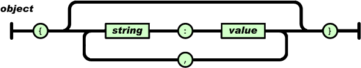

# Programmazione per il web

|      |                                                              |
| ---- | -----------------------------------------------------------: |
| Programmazione web | [ ][root] [](https://didatticaonline.unitn.it/dol/course/view.php?id=31325) |

[TOC]


# [8.][pdf-09] JavaScript

## ~~HTML: dynamic behaviour~~

### Web architecture with smart browser

<u>Evolution</u>: **execute** code also on **client**

- The web programmer writes **programs in Javascript** which run on the **browser**
- The **dynamic** behaviour is on the **client side**
  - The file can be loaded **locally**


### `onmouseover`, `onmouseout`

```html
<div onmouseover="this.style.color = 'red'"
     onmouseout="this.style.color = 'blue'">
I can change my colour!
</div>
```


### JS event-based:  `UiEvents`

**Event objects** that iherits the properties of the **`UiEvent`**

- `FocusEvent`
- `InputEvent`
- `KeyboardEvent`
- `MouseEvent`
- `TouchEvent`
- `WheelEvent`

https://www.jdoodle.com/html-css-javascript-online-editor/


## ~~Language~~

### Features


### ECMAScript Engine

> **ECMAScript engine**: *program that executes source code written in a version of the ECMAScript language standard*


### JS vs Java

|      |                 | Java |      | JavaScript |      |      |
| ---- | --------------- | :--: | ---- | :--------: | ---- | ---- |
|      | Browser control |  NO  |      |    YES     |      |      |
|      | Networking      | YES  |      |  Partial   |      |      |
|      | Graphics        | YES  |      |  Partial   |      |      |


### JS and HTML

- ```html
  <script> JS code </script>
  <script src="url"> JS code </script>
  ```

- ```html
  <server> JS code </server>
  ```

- ```html
  <!-- In event handlers -->
  <input type="button" value="Click me" onClick="JS code">
  <div onmouseover="this.style.color = 'red'"
       onmouseout="this.style.color = 'blue'">
  ```


### Data types

- <u>Primitive</u> data types

  - `number`, `string`, `boolean`, `undefined`

- <u>Complex</u> data types

  - `object`, `function`

- **Loosely**, **dynamic** typed variables

  ```js
  t0 == typeof(x);     // t0: undefined
  var x = 3;
  var t1 = typeof(x);  // t1: number
  x = "pippo";
  var t2 = typeof(x);  // t2: string
  ```

- ==`===` equal **value** and equal **type**==

- ==Type **operators**==

  - ==`typeof()` returns the type of a variable==
  - ==`instanceof` returns `true` if an object is an instance of an object type==


### Strings

Strings are both

- **Primitive** data type

  - Values created from **literals**

  ```js
  var strPrimitive = "str";
  ```

- **Object**

  - Defined with the keyword **`new`**

  ```js
  var strObject = new String("str");
  ```


### Objects and DOM

**Objects**

- Have **variables** and **methods**
- Can be **printed**
  - They use their **customized `toString()`** method ~~or~~
  - They give a **generic indication**
- Some of them represent **fragments of an HTML** document
  - The collection of these objects represent the **whole page** (**DOM**)

> **Document Object Model (DOM)**: *interface that treats HTML document as a tree structure wherein each node is an object representing a part of the page*

- Represents a document with a **logical tree**


## ~~User I/O~~

### Core

```js
n = window.prompt("Give me the value of n", 3);
for (i = 1; i < n; i++) {
    document.write(i);
    document.write("<br>");
}
```

Using `document.write()` after document is loaded, will delete all existing HTML


### JS output

Writing into

- `document.write() → `    **HTML output**
- `window.alert()   →`    **alert box**
- `console.log()    →`    **browser console**

Writing into **HTML element**  (`[object HTML*Element].xxx`)

- `innerHTML`:      full HTML content
- `innerText`:      text only, CSS aware
- `textContent`:  text only, CSS unaware


## ==Functions==

### Function hoisting

> **Hoisting**: *JS mechanism where variables and function declarations are moved to the top of their scope before code execution*

- Only **moves declaration**
- **Assignments** are left **in place**


### Function statements

The function statement **declares a function**

```js
hoisted();            // OUTPUT: "This function has been hoisted"
function hoisted() {  // Declaration hoisted
    console.log('This function has been hoisted');
};
```

- Function **declarations** are **hoisted**


### Function expressions

Functions can also be **defined** using an **expression**

1. Function expression is **stored in a variable**

   ```js
   var f = function (a, b) { return a * b; };
   ```

   - Function do not need name, as it are always invoked (called) using the variable name

2. The **variable** can be used **as function**

   ```js
   var product = f(2, 3);
   ```

Functions stored in variables do **not need function names**

- They are always invoked using the **variable name**


### Expressions and hoisting

Function expressions **load** only when the **interpreter** reaches that **line of code**

```js
fundef();  // OUTPUT: "TypeError: expression is not a function"
var fundef = function() {
    console.log('This will not work');
};
```

- Function **expressions** are **not hoisted**


### Arrow functions

<u>Function</u>

```js
function multiplyByTwo(num) { return num * 2; };
```

<u>Redefinitions</u>

```js
const multiplyByTwo = function (num)    {return num * 2;};
const multiplyByTwo =          (num) => {return num * 2;};
const multiplyByTwo =           num  => {return num * 2;};
const multiplyByTwo =           num  =>         num * 2;
```

<u>Usage</u>:  `multiplyByTwo(n);`


### Mapping and filtering

**`map`**

```js
var A = [1,2,3,4];
document.write(A.map(num => num * 2));  // 2,4,6,8
```

**`filter`**

```js
var A = [1,2,3,4];
document.write(A.filter(num => num % 2 == 0));  // 2,4
```


## ==Variables==

### Undeclared variables

An **undeclared variable** is

- Assigned the **value `undefined`** at execution
- Of **type `undefined`**

**`ReferenceError`** is thrown when trying to access previously undeclared variable


### Variable scope

| Type of declaration | Scope          | Notes                              |
| ------------------- | -------------- | ---------------------------------- |
| `x = 10;`           | Always global  |                                    |
| `var x = 10;`       | Function scope | Global if external to any function |
| `let x = 10;`       | Block scope    | ES 6                               |

```js
{ var x = 2; }
// x CAN be used here
{ let y = 2; }
// y can NOT be used here
```


### Variable hoisting

Variable and function **declarations** are

- Moved to the **top** of their **scope** before code execution
- Processed **before any code** is executed

**Assignments** are left **in place**


### Variable redefinition

**`let` variables** can **not** be redefined with a **larger scope** in an inner block

```js
  var x = 1;  /* x=1 */
{ x = 2;      /* x=2 */ }
              /* x=2 */
```

```js
  var x = 1;  /* x=1 */
{ var x = 2;  /* x=2 */ }
              /* x=2 */
```

```js
  var x = 1;  /* x=1 */
{ let x = 2;  /* x=2 */ }
              /* x=1 */
```


## ==Objects==

### JS objects

JS is all **dynamic**, all **runtime**, and it has **no classes** at all

- It's all just **instances** (**objects**)
- Simulated "classes" are **function objects**


### JS vs Java

|               | JS                    | Java                           |
| ------------- | --------------------- | ------------------------------ |
| **Structure** | Can change            | Cannot change                  |
| **Class**     | Objects without class | Objects must belong to a class |


### Objects as data structures

JS objects

- Are **collections of named values** (**properties**)

  ```js
  var person = {
      first: "Dorothea",
      last: "Wierer",
      birth: 1990
  };
  ```

- Can contain also **methods**

  ```js
  var person = {
      first: "Dorothea",
      last: "Wierer",
      year: 1990,
      full: function() { return this.first + " " + this.last }
  };
  ```
  
- Accessing **properties**

  ```js
  person.firstName == person['firstName']
  ```


### Dynamic management

- **Add new properties** to an existing object by giving it a value

  ```js
  person.place = "Brunico";
  ```

- **Delete** existing **properties**

  ```js
  delete person.first;
  ```


### Creating objects

- Objects can also be created **empty and populated** later

  ```js
  var person = {};
  person.first = "Dorothea";
  person.last = "Wierer";
  person.year = 1990;
  person.full = function() {return this.first + " " + this.last;};
  ```
  
- Using **`Object` constructor**

  ```js
  var object1 = new Object();
  Object.defineProperty(
      object1, 'name', {
          value: "AA",
          writable: false
      }
  );
  object1.name = 77;
  document.write(object1.name);
  // OUTPUT: AA (no error)
  // if `writable: true` → OUTPUT: 77
  ```


### Objects constructors

> **Object constructor**: *template for creating objects of a certain type* ~~(~ class)~~

- Constructor **function** is JavaScript’s version of a **class**

```js
function Rectangle(w, h) {
    this.width = w;
    this.height = h;
    this.area = function () { return this.width * this.height; }
}
r = new Rectangle(3,4);
// r.area() => 12
// r.width => 3
```


## ==Prototype==

### `prototype` feature

Allows to **add** new properties and methods **to object constructors**

```js
Rectangle.prototype.area = function () {
    return this.width * this.height;
}
```


### Prototype name space

Prototype is a **separate naming space**

- **Shared** by all instances of the **same constructor**
- Prototype properties can be **redefined** for **single instances**


### Prototype inheritance

Prototype is used for providing a sort of **inheritance**


### `for ... in`   cycle

Iterates over **all object properties**

- Including the ones in the **prototype**
- `enumerable:false`  in  `Object.defineProperty()` **skip** the property

```js
···
let person1 = new Person('Dorothea', 'Wierer');
···
for (x in person1) {
    document.write(x + " - ");  // first - last - year - full
}
```


### Prototype-based inheritance

**Definitions**

- **Instance variables** in constructor
- **Methods** and **shared variables** in prototype

**Inheritance**

- **Instance variables**, by invoking the superclass constructor
- **Prototype**, by associating prototype to the superclass


### Predefined objects

```js
var x1 = new Object();
var x2 = new Date();
// DO NOT USE ↓
var x3 = new String();
var x4 = new Number();
var x5 = new Boolean();
var x6 = new Array();     // Use []
var x7 = new RegExpr();   // Use /( )/
var x8 = new Function();
```

- **Native prototypes** should never be extended
  - Unless it is for the sake of **compatibility** with newer JavaScript features
- **`Math`** is an object to **never instantiate**
  - It's a **container** for math **functions**


## ==Classes==

### JS classes

**Syntactic sugar** over JS's existing prototype-based inheritance

- Class syntax does **not** introduce a new **object-oriented inheritance** model to JS
- Unlike function declarations, class **declarations** are **not hoisted**

```js
class B [extends A] {
    constructor(a, b, c) {
        super(a, b);
        this c = c;
    }
}
B.prototype.d = 'd';
```


### Variables and methods

- **Instance variables** can only be **defined within methods**
- **Class variables/methods** can be **defined** and they can **not be called** on instances ~~(~ Java)~~


## ==Arrays==

### Features

Arrays are

- **Sparse**
- **Inhomogeneous**
- **Associative**

```js
a = [];
a = new Array();  // discouraged
a[0] = 3;
a[1] = "hello";
a[10] = new Rectangle(2,2);
a.length() == 11;
a["name"] == a.name;
```


### Functions

- **Add/Remove** an element
  - At the **end**
  - At the **front**
  - By **index**
- **Remove** a **number of elements** starting from an index
- **Find the index** of an element
- **Make a copy** of an array


## ==Plus operator==

### Rules

1. **Conversion**: any `Object` operand is converted to a **primitive value**
   1. If an operand is `String`, the others are converted to **`String`**
   2. Any remaining operand is converted to **`Number`**
      - `Boolean → 0|1`
      - `null → 0`
      - `Undefined → NaN`
2. **Execution**: if both operands are
   - `String →`   **concatenation**
   - `Number →`   **sum**


### Unary operator

Used to **convert `String` to `Number`**

```js
var s = "1";  // string
var n = + s;  // number (1)
var s = "s";  // string
var n = + s;  // number (NaN)
```


### Objects

<u>Rules</u> to execute the conversion

1. **Check** if the object verifies all the following
   - Is **not** a **`Date`** ~~and~~
   - Has a **`valueOf()`** method ~~and~~
   - Its `valueOf()` method returns a **primitive value**
2. If yes, use the **`valueOf()`** method
3. If no, use the **`toString()`** method

<u>Notes</u>

- **Array** `[1,"a",2]` would be converted to `"1,a,2"`
- **Empty object** `{}` is converted to `"[object Object]"`


## Exam

- ```js
  var x = 1;
  var x = 2;
  console.log(x);  //→ 2
  ```

- ```js
  document.write(typeof(x));
  //→ Cannot access 'x' before initialization
  document.write(x);
  //→ Cannot access 'x' before initialization
  let x = 1;
  ```

  ```js
  document.write(typeof(x));  //→ undefined
  document.write(x);          //→ undefined
  var x = 2;
  ```

  ```js
  document.write(typeof(x));  //→ undefined
  document.write(x);          //→ x is not defined
  x = 3;

- ```js
  function A(x) {
      this.x = x;
  }
  p = new A(3);
  document.write(p);    //→ [object Object]
  document.write(p.x);  //→ 3
  ```


# [9.][pdf-12] ~~DOM~~

## Introduction

### JS and DOM

When a web **page is loaded**, the browser creates a **Document Object Model** of it

- **Tree of objects**
- **Every element** in a document is part of its DOM
  - They can be accessed/manipulated using **DOM** and a **scripting language**

With DOM, **JS** can

- **Change all the HTML** elements, attributes, styles in the page
- **Add/Remove** existing HTML elements and attributes
- React to and create new **HTML events** in the page


### Languages

Implementations of DOM can be built for **any language**

- **JS** is the only one that can work **client-side**


### Object hierarchy


## Datatypes

### Fundamental datatypes

- **`Document`** (is-a `Node`)
  - The **root** document object itself
- **`Node`**
  - **Every object** located within a document is a node
  - In an HTML document, an **object** can be
    - Element node
    - Text node
    - Attribute node
- **`Element`** (is-a `Node`)
  - The most **general base class** from which all element objects (i.e. objects that represent elements) in a `Document` **inherit**
- **`Attr`** (is-a `Node`)
  - **Object reference** that exposes a special **interface** for attributes
  - Attributes are nodes in the DOM just like elements are
- **`NodeList`**
  - **Array of elements**, where items are accessed by **index**
    - `list.item(1)` or `list[1]`
- **`NamedNodeMap`**
  - **Associative array**, where items are accessed by **name**
  - They can also be accessed by index using the `item()` method
  - It's possible to add and remove items


### Node: hierarchy


<p>


<u>Warning</u>

- The implied semantic of this model is **wrong**
- A comment **can't contain** any other **node**
- The **integrity** is delegated to a series of **`Node`’s attributes**
  - That the **programmer** should check


### Node: inheritance

The following types **inherit the `Node` interface**'s methods and properties

- `Document`, `Element`, `Attr`, `CharacterData`, `ProcessingInstruction`, `DocumentFragment`, `DocumentType`, `Notation`
  - `Text`, `Comment`, `CDATASection` inherit **`CharacterData`**


### Node: properties

**`Node.*`**

- `nodeType` (read only)
- `nodeName` (read only)
  - `HTMLElement →`  name of the corresponding tag
  - `Text → "#text"`
  - `Document → '#document'`
- `baseURI` (read only)
- `textContent` (read/write)


### Node: types

**`Node.nodeType`**

1. `ELEMENT_NODE`
2. `ATTRIBUTE_NODE`
3. `TEXT_NODE`
4. `CDATA_SECTION_NODE`
5. `ENTITY_REFERENCE_NODE`
6. `ENTITY_NODE`
7. `PROCESSING_INSTRUCTION_NODE`
8. `COMMENT_NODE`
9. `DOCUMENT_NODE`
10. `DOCUMENT_TYPE_NODE`
11. `DOCUMENT_FRAGMENT_NODE`
12. `NOTATION_NODE`


### Node: read only navigation properties

**`Node.*`**

- `childNodes`
- `firstChild`
- `lastChild`
- `nextSibling`
- `previousSibling`
- `parentNode`
- `parentElement`
- `ownerDocument`


### Element: inheritance

The **most general base class** inherited by all element objects in a `Document`

- It only has **methods and properties common** to all kinds of elements
- More specific **classes inherit** from `Element`
  - e.g.: `HTMLElement` and `SVGElement` interfaces are the base interface for HTML and SVG elements


### Element: properties

**`Element.*`**

- `id`
- `attributes`
- `className`
- `innerHTML`
- `outerHTML`
- `clientHeight`  (inner height)
- `clientLeft`  (width of the left border)
- `clientTop`  (width of the top border)
- `clientWidth`  (inner width)


### Element: main properties

**`Element.*`**

- `innerHTML`
- `style.left`
- `setAttribute()`
- `getAttribute()`
- `addEventListener()`


### Element: `name` property

**`name` gets/sets the name** property of an element in the DOM

- It only applies to: `<a> <applet> <button> <form> <frame> <iframe>  <input> <map> <meta> <object> <param> <select> <textarea>`
- The `name` property **doesn't exist** for other elements
- It is **not a property of `Node`, `Element` or `HTMLElement`** interfaces
  ~~(!~ `tagName`, `nodeName`)~~
- Can be used in **`document.getElementsByName()`**, a **form** and with the form elements collection
  - <u>Return</u>: single element or collection


### JS output

Writing into an **HTML element**

- `Element.innerHTML`

  ```html
  <div onmouseover="this.innerHTML='How are you?';">Hello</div>
  ```

- `HTMLElement.innerText`

  ```html
  <div onmouseover="this.innerText='How are you?';">Hello</div>
  ```

- `Node.textContent`

  ```html
  <div onmouseover="this.textContent='How are you?';">Hello</div>
  ```


## BOM subset


<p>


### Window

Web **browser** window or **frame**

- <u>Properties</u>: objects
  - `history`
  - `frames[]`
  - `document`
  - `location`
  - `navigator`
  - `screen`
  - `parent`, `top`
- <u>Properties</u>: others
  - `status`, `defaultStatus`
  - `name`
- <u>Methods</u>
  - `alert()`, `prompt()`, `confirm()`
  - `focus()`, `blur()`
  - `moveBy()`, `moveTo()`
  - `resizeBy()`, `resizeTo()`
  - `scroll()`, `scrollBy()`, `scrollTo()`
  - `setInterval()`, `clearInterval()`
  - `setTimeout()`, `clearTimeout()`


### Screen

Information about the **display**

- <u>Properties</u>
  - `availHeight`, `availWidth`
  - `height`, `width`
  - `colorDepth`, `pixelDepth`
  - `hash`


### Navigator

Information about the **browser** in use

- <u>Properties</u>
  - `appName`
  - `appVersion`
  - `Platform`
- <u>Methods</u>
  - `javaEnabled()`


### History

The **URL history** of the browser

- <u>Properties</u>
  - `lenght`
- <u>Methods</u>
  - `back()`
  - `forward()`
  - `go(+/-n)`
  - `go(target_substring)`


### Location

The specification of the **current URL**

- <u>Properties</u>
  - `href`
  - `protocol`, `hostname`, `port`
  - `search`
  - `hash`
- <u>Methods</u>
  - `reload()`
  - `replace()`


## Document and its components


### Document

**HTML document**

- <u>Properties</u>: arrays of component objects
  - `anchors[]`
  - `applets[]`
  - `embeds[]`
  - `forms[]`
  - `links[]`
  - `plugins[]`
- <u>Properties</u>: others
  - `bgColor`, `fgColor`, `linkColor`, `vlinkColor`
  - `lastModified`
  - `title`, `URL`, `referrer`, `cookie`
- <u>Main methods</u>
  - `open()`
  - `close()`
  - `clear()`
  - `write()`

<p>

#### Element selection

```css
document.getElementById(id);
document.getElementsByName(name);
document.getElementsByTagName(name);
document.getElementsByClassName(name);
```

<p>

#### DOM structure modification

```css
document.createElement(element);
document.removeChild(element);
document.appendChild(element);
document.replaceChild(newElement, oldElement)
```


### Image

**Image embedded** in an HTML document

- <u>Properties</u>
  - `border`
  - `height`
  - `width`
  - `src`


### Applet

**Applet embedded** in a Web page

- <u>Properties</u>
  - Same as the public **fields** of the **Java applet**
- <u>Methods</u>
  - Same as the public **methods** of the **Java applet**


### Form

HTML **input form**

- <u>Properties</u>
  - `action`  (destination URL)
  - `method`  (get/post)
  - `name`  (name of Form)
  - `name`  (destination Window)
  - `Elements[]`  (list of contained elements)
- <u>Methods</u>
  - `reset()`
  - `submit()`


## Events

  ### Event

The **`Event` interface** represents an event which takes place in the DOM

- An event can be
  - Triggered by **user action**
  - **Generated by APIs** to represent the progress of an **asynchronous task**
  - **Triggered programmatically**
    - Calling the `HTMLElement.click()` method of an element
    - Defining the event, then sending it to a specified target using `EventTarget.dispatchEvent()`
- `Event` contains the **properties and methods** which are **common** to all events
  - Some types of events use **other interfaces** based on main `Event` interface


### Types

- **UI events**
  - Input
  - Keyboard
  - Focus
  - Mouse
  - Drag and drop
- **Generic events**
  - Events
  - Animation
  - Clipboard


### Handlers

Events can be managed by **`EventHandlers`**

```js
on<event> = "JS code"
```


## [Examples][pdf-12]


## Server side execution

### Server-Side JS

**Server-dependent** technology to **process** web page **before** passing it to client

- Substitute for **CGI**


### Node.js

- Open-source, cross-platform **JS run-time environment** for executing **JS code server-side**
- Has an **event-driven architecture** capable of **asynchronous I/O**
- Optimize **throughput** and **scalability**
  - In web applications with many **I/O operations**
  - For **real-time** web applications


# [10.][pdf-13] ~~CSS~~

## Types of cascading style sheets

### Main idea

- **Separation** between content and presentation
- **Customize** the behaviour of **tags**


### Inline

- **Local** definition
- HTML **tags**

```html
<tag style="formatting-element: value;"></tag>
```


### Internal

- Definition of a **page style**
- **All instances** of a type of HTML tag

```html
<head>
<style>
  tag {
    color: blue;
    text-align: center;
  }
</style>
</head>
```


### External

- Definition of a **shared style**
- All instances of a type of HTML tag for **many files**

```html
<head>
<style type="text/css"> @import url("myStyle.css"); </style>
<!-- OR -->
<link rel="stylesheet" type="text/css" href="myStyle.css">
</head>
```

```css
/* myStyle.css */
tag {
  color: blue;
  text-align: center;
}
```


## Formatting elements

### Length units

- **Absolute length**
  - **International System**
    - `cm` centimetrs
    - `mm` millimetrs
  - **Anglosaxon units**
    - `in` inch
    - `pt` point (`1/72 in`)
    - `pc` pica (`12 pt = 1/6 in`)
  - **System dependent**
    - `px` pixel
- **Relative length**
  - `em` height of element font
  - `ex` extended height of element font


### Box model


### Formatting elements

```css
text {
color:            color
font-family:      name
font-size:        xx-small|x-smallsmall|medium|large|x-large|
                  xx-large|larger|smaller|absoluteSize|
                  relativeSize|percentage|lenght
font-style:       normal|italic
font-weight:      bold|bolder|lighter|normal|100|200|...|900
line-height:      normal|length|percentage
text-align:       left|center|right|justify
text-decoration:  blink|line=through|overline|underline
text-indent:      lenght|percentage
text-transform:   none|capitalize|uppercase|lowercase
}

background {
background-color: color
background-image: uri
}

box-model {
border-width:     thin|medium|thick|n
border-color:     color
border-style:     double|groove|none|inset|outset|ridge|solid
border-width:     thin|medium|thick|length
margin|padding:   thickness
}

ol { list-style:  decimal | [lower|upper]-[alpha|roman] }
ul { list-style:  circle|disc|square }
ul { list-style-image: url('img.gif') }
```


## Selectors

### Basic selectors

- **Simple**

  ```css
  tag { ... }
  ```

  ```html
  <tag>
  ```

- **Class**

  ```css
  .class { ... }
  ```

  ```html
  <tag class="class">
  ```

- **Universal**

  ```css
  * { ... }
  ```

  ```html
  <tag>
  ```

- **ID**

  ```css
  #id { ... }
  ```

  ```html
  <tag id="id">
  ```


### Combinator selectors

- **Simple + class**

  ```css
  tag.class { ... }
  ```

  ```html
  <tag class="class">this</tag>
  ```

- **Grouping**

  ```css
  tag1, tag2 { ... }
  ```

  ```html
  <tag1>this</tag1> <tag2>and that</tag2>
  ```

- **Descendant**

  ```css
  tag1 tag2 { ... }
  ```

  ```html
  <tag1>
    <···>
      <tag2>this</tag2>
    </···>
  </tag1>
  ```

- **Child**

  ```css
  tag1 > tag2 { ... }
  ```

  ```html
  <tag1>
    <tag2>this</tag2>
  </tag1>
  ```

- **Adjacent sibling**

  ```css
  tag1 + tag2 { ... }
  ```

  ```html
  <tag1></tag1> <tag2>this</tag2>
  ```

- **General sibling**

  ```css
  tag1 ~ tag2 { ... }
  ```

  ```html
  <tag1></tag1> <···></···> <tag2>this</tag2>
  ```


### Advanced selectors

- **Pseudo-class**: defines a special state of an element
  - Mouse over, get focus, link visited, n-th child, current language
- **Pseudo-element**: styles specified parts of an element
  - First letter, first line, before/after the content, selection


### Attribute selectors

```css
input[type="button"] { ... }
```

| Selector             | Example            | Example description                                          |
| -------------------- | ------------------ | ------------------------------------------------------------ |
| `[attribute]`        | `[target]`         | Selects all elements with a `target` attribute               |
| `[attribute=value]`  | `[target=_blank]`  | Selects all elements with `target="_blank"`                  |
| `[attribute~=value]` | `[title~=flow]`    | Selects all elements with a `title` attribute containing the word `"flow"` |
| `[attribute|=value]` | `[lang|=en]`       | Selects all elements with a `lang` attribute value starting with `"en"` |
| `[attribute^=value]` | `a[href^="https"]` | Selects every `<a>` element whose `href` attribute value begins with `"https"` |
| `[attribute$=value]` | `a[href$=".pdf"]`  | Selects every `<a>` element whose `href` attribute value ends with `".pdf"` |
| `[attribute*=value]` | `a[href*="w3s"]`   | Selects every `<a>` element whose `href` attribute value contains the substring `"w3s"` |


## Cascading and positioning

### `!important`  clause

**`!important` has precedence** over the other clauses


### Positionable elements

Specifications

- **Type of position**
  - `position: absolute|relative`
- **Position**
  - `top: size`
  - `left: size`
- **Dimension**
  - `width: size`
  - `height: size`
- **Visibility**
  - `visibility: hidden|inherit|show`
- **Clip**
  - `Clip: rect(top|right|bottom|left)`
  - Clip an element (leaving it in place)
- **Superposition**
  - `z-index: n`
  - Decides the superposition ranking


## More stuff

### Fonts

- **Multiple declaration**

  ```css
  p { font-family: Gotham, 'RM Neue', sans-serif; }
  ```

- **Import fonts**

  ```css
  @font-face {
    font-family: 'Museo';
    src: url('/fonts/museo.otf') format ('opentype');
  }
  ```


### Misc

```css
div {
  box-shadow:  10px 10px 25px #ccc;
  text-shadow: 10px 10px 25px #ccc;
  border-radius: 20px;
  border-image: url('border.png') 30 round 5 repeat;
}
```


### Advanced

- Pagination
- Multiple column
- Tooltips
- Graphic transformations
- Animation


## [Libraries][pdf-13]

### Popper

### Bootstrap

### Inclusion, CDN, starter template


# [11.][pdf-14] Typescript

## Language

### Polyfilling and transpiling

- **Polyfilling**: methodology used as a backward compatibility measurement
  - **Polyfill / Polyfiller**: piece of code (or plugin) that provides the technology that the developer expect the browser to provide natively
- **Transpiler**: tool that transforms code with newer syntax into older code equivalents (transpiling)


### Programming language

TypeScript

- Is compiled into **JS** (**transpiled**)
- Gives the **capabilities** required to develop **large scale applications** using JS
- Is a **superset** of JS
  - It includes the entire JS programming language together with additional capabilities
- Allows to use JS as if it was a **strictly type** programming language
  - Allows to specify the **type of the variables**
  - Allows to define **classes** and **interfaces**
  - Variables can **not** be treated as **dynamic type** variable
- In general, nearly every code in **JS can be included** in code **in TS**
- Compiling TS into JS leads to a clean simple ES3 compliant code runnable in **any web browser**
- Compiler will still try to **execute** the code when **errors** occures


### Variable typing

```typescript
var id:number = 221255;
var aname:string = "Dorothea";
var tall:boolean = true;
var names:string[] = ['pippo', 'pluto', 'minnie'];
var temp:any = <number|string|bool|Obj>;  // dynamic type
```


### JS  `"use strict"`

- It is **forbidden** to use **undeclared variables**
  - `x=3;  // must become var x=3;`
- Any assignment to the following will throw an **error**
  - Non-writable property
  - Getter-only property
  - Non-existing property
  - Non-existing variable
  - Non-existing object
- **Deleting** variables, objects, functions is **not allowed**
- **Function parameter names be unique**
  - In normal code the last duplicated argument hides previous identically named arguments
    - Those previous arguments remain available through `arguments[i]`


## ==Functions==

### Function typing

Define the type of the variables

```typescript
function name():type {}
```


### Number of params

When calling a **function** passing over **arguments** ~~(!~ JS)~~

- The **number of arguments** must match the number of the **parameters**
- Otherwise **compilation error**


### Optional params

- Adding the **question mark** to the name of a parameter will turn that parameter into an optional one
- The optional parameters should be **after any required** one
  - They should be the **last ones**

```typescript
function sum(a:number, b:number, c?:number):number {
    var total:number = 0;
    if (c !== undefined) { total += c; }
    return total + a + b;
}
```


### Default params

- Function definition can specify **default values** for any of its parameters
- If an argument is **not passed** over to the parameter then the default value we specified will be set instead

```typescript
// TS
function sum(a:number, b:number, c:number=0):number {
    return a + b + c;
}
```

```js
// JS
"use strict";
function sum(a, b, c) {
    if (c === void 0) { c = 0; }
    return a + b + c;
}
```


### Rest params

- Function can have an **arbitrary number of params** ~~(~ `main` in Java)~~

```typescript
// TS
function sum(...numbers:number[]):number {
    var total:number = 0;
    for (var i = 0; i < numbers.lenght; i++) {
        total += numbers[i];
    }
    return total;
}
```

```js
// JS
function sum() {
    var numbers = [];
    var total = 0;
    for (var _i = 0; _i < arguments.lenght; _i++) {
        numbers[_i] = arguments[_i];
    }
    for (var i = 0; i < numbers.lenght; i++) {
        total += numbers[i];
    }
    return total;
}
```


## ==Classes==

### Scheme

```typescript
class Car {
    // field
    engine:string;
    // constructor
    constructor(engine:string) {
        this.engine = engine;
    }
    // method
    disp():void {
        console.log("Engine is: " + this.engine);
    }
}
```


### Constructor

- All classes have a **default constructor**
- Defining a **new constructor**, the default one will be **deleted**
- There is **no polymorfism**
- New definition can specify each one of its **parameters** with an **access modifier**
  - This indirectly define those parameters as **instance variables**


### Access modifiers

The available access modifiers are **`private`**, **`public`** and **`protected`**

- **`public`** is the default one
- **Not specified** access modifier are **`public`**


### Instance variables and methods

- **Variables** are usually **declared before constructor**
  - **Definition** includes **three parts**
    - **Access modifier** (optional)
    - **Identifier**
    - **Type** annotation
- **Methods** are declared **without** using the **`function`** keyword
  - Declaration is the same as variables, but type is optional


### Static variables and methods

- Static variables and methods are **defined** with the **`static`** keyword
- **Accessing** static variables and methods is done using the **name of the class**


### Class inheritance

```typescript
class Shape {
    Area:number;
    constructor(a:number) {
        this.Area = a;
    }
}
class Circle extends Shape {
    disp():void {
        console.log("Area of the circle:" + this.Area);
    }
}  
var obj = new Circle(223);
obj.disp();
```


### Type assertion

Type assertion

- Is like a **type cast** in other languages
  - But performs **no** special **checking**
- Is used purely by the **compiler**
  - It has **no runtime impact**


### [Generics][pdf-14]


### Class related issues

- TS does **not** support **multiple inheritance**
  - **`super`**
- Classes implement **interfaces**
  - `class Student implements Iprintable {...}`


### Interfaces

- Interfaces can be used as **data type definition**
- They fully **disappear in JS**

```typescript
interface IPerson {
    firstName: string,
    lastName: string,
    sayHi: () => string
}
var customer:IPerson = {
    firstName: "Tom",
    lastName: "Hanks",
    sayHi: ():string => { return "Hi there!"; }
}
```


### Interfaces multiple inheritance

```typescript
interface IParent1 { v1:number; }
interface IParent2 { v2:number; }
interface Child extends IParent1, IParent2 { }
var Iobj:Child = { v1:12, v2:23 };
console.log("value 1: " + this.v1 + " value 2: " + this.v2);
```


### Duck typing

> **Duck test**:
> "*If it walks like a duck and it quacks like a duck, then it must be a duck*"

- Duck typing is an application of the duck test to **determine if an object is suitable for a particular purpose**
  - With **normal typing**, suitability is determined by **object's type**


### Duck inheritance

```typescript
class Vehicle {
    public run():void { console.log('Vehicle.run'); }
}
class Task {
    public run():void { console.log('Task.run'); }
}
function runTask(t:Task) {
    t.run();
}
runTask(new Task());     // → Task.run
runTask(new Vehicle());  //→ Vehicle.run
```


### [Avoiding duck inheritance][pdf-14]


# [12.][pdf-15] JSP

## Basics

### JSP Technology

- A technology similar to PHP, ASP and ASP.net
- Java-based
- Dual to **servlets**


### Simple.jsp

```jsp
<%@ page import=java.util.* %>
<html>
<body>
  <% out.println(Calendar.get(Calendar.HOUR_OF_DAY)); %>
</body>
</html>
```


### Lifecycle


### Nuts and bolts

- **Syntactic elements**

  ```jsp
  <%@ directives %>    →  Interaction with the CONTAINER
  <%! declarations %>  →  In the initialization of the JSP
  <% scriptlets %>     →  In the service method
  <%= expressions %>   →  Eq. to <% out.println(expression %)>
  <jsp:actions/>
  <%-- Comment --%>
  ```

-  **Implicit Objects**

   - `request`
   - `response`
   - `session`
   - `application`
   - `out`
   - `config`
   - `page`
   - `pageContext`


### Scriptlets

Block of **Java code** executed during the **request-processing** time

- In **Tomcat** all the scriptlets gets put into the **`service()`** method of the **servlet**
  - They are therefore **processed for every request** that the servlet receives

```jsp
<% z = z + 1; %>
<%
  // Get the Employee's Name from the request
  out.println("<b>Employee: </b>" +
  request.getParameter("employee"));
  // Get the Employee's Title from the request
  out.println("<br><b>Title: </b>" +
  request.getParameter("title"));
%>
```


### Declarations

Block of **Java code** used to

- **Define** class-wide **variables** and **methods** in the generated servlet
- They are initialized when the **JSP page is initialized**

```jsp
<%! DECLARATION %>
```

```jsp
<%! String nome = "pippo"; %>
<%! public String getName() { return nome; } %>
```


### Directives

Used as a **message mechanism** to pass information **from JSP** code **to container**

```jsp
<%@ DIRECTIVE {attribute=value} %>
```

- <u>Main directives</u>

  - `page`
  - `include`
    - For including other `STATIC` resources at compilation time

- <u>Main attributes</u>

  ```jsp
  <%@ page language=java session=true %>
  <%@ page import=java.awt.*,java.util.* %>
  <%@ page errorPage=URL %>
  <%@ page isErrorPage=true %>
  ```


### Standard actions

**Tags** that affect

- **Runtime behavior** of JSP
- **Response** sent back to client

```jsp
<jsp:include page="URL" />
<jsp:forward page="URL" />
```

- `include` for including `STATIC` or `DYNAMIC` resources at request time


### Predefined objects

| Object        | Context                     | Note                         |
| ------------- | --------------------------- | ---------------------------- |
| `out`         | `Writer`                    |                              |
| `request`     | `HttpServletRequest`        |                              |
| `response`    | `HttpServletResponse`       |                              |
| `session`     | `HttpSession`               |                              |
| `page`        | `this`                      | Nel Servlet                  |
| `application` | `servlet.getServletContext` | Area condivisa tra i servlet |
| `config`      | `ServletConfig`             |                              |
| `exception`   |                             | Solo nella `errorPage`       |
| `pageContext` |                             | Sorgente degli oggetti       |


### `request`

```jsp
<%@ page errorPage="errorpage.jsp" %>
<html>
<head>
  <title>UseRequest</title>
</head>
<body>
  <%
    // Get the User's Name from the request
    out.println("<b>Hello: "
                + request.getParameter("user")
                + "</b>");
  %>
</body>
</html>
```


### `include`

- **`<%@include@%>` directive**
  - Includes **literal text** as is in the JSP page
  - Is **not** intended for use with content that **changes at runtime**
  - Occurs only when the servlet implementing JSP page is **built** and **compiled**
  - e.g.: `<%@ include file="myfile.jsp" @%>`
-  **`<jsp:include>` action**
  - Allows to include either **static or dynamic content** in the JSP page
  - **Static** pages are included as if the `<%@include@%>` **directive** had been used
  - **Dynamic** included files, though, act on the given **request** and return results that are included in the JSP page
  - Occurs **each time** the JSP page is **served**


## WebApps: Tomcat configuration

### Static pages

`web.xml` file must be provided

```xml-dtd
<?xml version="1.0" encoding="ISO-8859-1"?>
<!DOCTYPE web-app 
  PUBLIC "-//Sun Microsystems, Inc.//DTD WebApplication 2.3//EN"
  "http://java.sun.com/dtd/web-app_2_3.dtd">
<web-app>
</web-app>
```


### JSP pages

Same **procedure** used for **static pages**

- In **`myApp` folder** it's deposited the **JSP files**
- On **Tomcat server**, the **URL for `hello.jsp`** file becomes
  `WEB-INF http://machine/port/myApp/hello.jsp`
- The `WEB-INF` directory can be empty


### [JSP in action][pdf-15]

### [Generated code][pdf-15]


## Usage: MVC pattern

### Wrong simple approach

Control, data management and presentation in the **same page**


### Better solution

**Control logic** is delegated to **Java classes**


### Java bean

**Java class** that

- Provides a public no-argument **constructor**
- Implements **`java.io.Serializable`**
- Follows JavaBeans **design patterns**
  - Has **set/get** methods for **properties**
  - Has **add/remove** methods for **events**
- Is **thread safe/security conscious**
  - Can **run** in an applet, application, servlet

```java
public class SimpleBean implements Serializable {
    private int counter;
    SimpleBean()           { counter = 0; }
    int getCounter()       { return counter; }
    void setCounter(int c) { counter = c; }
}
```


### Standard actions involving beans

```jsp
<jsp:useBean id="name" class="fully_qualified_pathname"
             scope="{page|request|session|application}" />
<jsp:setProperty name="nome" property="value" />
<jsp:getProperty name="nome" property="value" />
```

[Example][pdf-15]
[Examples][pdf-16]


### Scoping

```jsp
<jsp:useBean id="myBean"
             class="beans.BeanA"
             scope="{session|application|request}"/>  <!--
```

| JSP           | Servlet                                                      |
| ------------- | ------------------------------------------------------------ |
| `session`     | `Session session=request.getSession();`<br />`BeanA x=(BeanA)session.getAttribute("myBean");` |
| `application` | `ServletContext c=request.getServletContext();`<br />`BeanA x=(BeanA)context.getAttribute("myBean");` |
| `request`     | `BeanA x=(BeanA)request.getAttribute("myBean");`             |


### JSP models

#### Model 2


<p/>

#### Only for presentation


<p/>

#### Separate post and get


<p/>

#### Front controller pattern


### ==Best practices==

- **Don't overuse Java** code in HTML pages
- Choose the right **include mechanism**
  - **Static data** such as headers, footers, and navigation bar content is best kept in **separate files** and not regenerated dynamically
  - Once such content is in separate files, they can be **included in all pages** using one of the following mechanisms
    - Include **directive**:  `<%@ include file="filename" %>`
    - Include **action**:  `<jsp:include page="page.jsp" />`
- **Don't mix** business **logic** with **presentation**
  - **JSP** code should be limited to **front-end presentation**
- Use **filters** if necessary
- Use a **database** for persistent information
  - Use **connection pooling**


### [Examples][pdf-15]

### [Exercise][pdf-15]


## Filters

### AOP

**Aspect-Oriented Programming** attempts to aid the **separation of concerns**

- Specifically **cross-cutting** concerns, as an advance in **modularization**
- **Logging** and **authorization** offer two examples of crosscutting concerns
  - Logging strategy necessarily affects every single **logged part** of the system
  - Logging thereby **crosscuts all logged classes and methods**
  - Same is true for **authorization**


### Filters

> **Filter**: *class that preprocess/postprocess request/response*

**Object** that performs **filtering tasks** on either

- **Request to a resource**
  - Servlet or static content
- **Response from a resource**

<u>Implementation</u>: **`javax.servlet.filter`**

- Filters perform **filtering** in the **`doFilter`** method
- Every **`Filter`** has access to a **`FilterConfig`** object from which it can obtain its **initialization parameters**
  - Reference to **`ServletContext`** which it can use to **load resources** needed for filtering tasks
- They provide the ability to **encapsulate recurring tasks in reusable units**

Filters are **configured**

- In the **deployment descriptor** of a web application
- Via **annotation**


### Applications

- **Authentication**: blocking requests based on user identity
- **Logging and auditing**: tracking users of a web application
- **Image conversion**: scaling maps, and so on
- **Data compression** making downloads smaller
- **Localization**: targeting the request and response to a particular locale
- **XSL/T**: transformations of XML content-Targeting web application responses to more that one type of client
- Encryption, tokenizing, triggering resource access events, mime-type chaining, caching


### Filtering API

- Defined by `Filter`, `FilterChain`, `FilterConfig` **interfaces** 
  - In **`javax.servlet` package**
- **Definition** means implementing the **`Filter` interface**

The most important **method** is **`doFilter`**

- Is passed **request**, **response**, and **filter chain** objects
- <u>Actions</u>
  1. **Examine** the request headers
  2. **Customize** the request/response objects
  3. **Invoke** the next entity in the filter chain
     - Configured in the WAR
     - By calling `doFilter` on the chain object
       - Passing in the request and response it was called with, or the wrapped versions it may have created


### Filter methods

```java
public void doFilter(ServletRequest, ServletResponse, FilterChain)
```

- Called by the container each time a request-response pair is passed through the chain due to a **client request for a resource** at the end of the chain

```java
public void init(FilterConfig filterConfig)
```

- Called by web container to indicate to a filter that it is being **placed into service**

```java
public void destroy()
```

- Called by web container to indicate to a filter that it is **taken out of service**


### [Example][pdf-17]

### [Configuration][pdf-17]


### Filters Application Order

The **order** of filter-mapping elements **in `web.xml`** determines the order in which the **web container applies the filter to the servlet**

[Example][pdf-17]


### [Sessions and parameters][pdf-17]


# [13.][pdf-18] Access to DB

## JDBC in servlets

### Installation and usage

0. **Install a driver** on the machine
1. **Load the driver**
2. **Open a connection**
3. **Create Statement**
4. **Retrieve Values**

Always **catch exceptions**

- JDBC tracks warnings and exceptions generated by DBMS and Java compiler
- To show them, **print** them out from a **catch block**


### Access database from Java

`java.sql` Object Model


### Get the driver

```java
Class.forName("org.apache.derby.jdbc.ClientDriver");
```

> <u>Reminder</u>:  **`Class.forName`**
>
> ```java
> static Class forName(String className);
> ```
>
> <u>Return</u>
>
> `Class` object associated with the class or interface with the given string name
>
> ```java
> Object o = Class.forName("java.lang.String").newInstance();
> Object o = new String();  // equivalent
> ```


### Load the driver

```java
Connection con = DriverManager.getConnection(url, "user", "psw");
```

The last part of the JDBC url supplies information for identifying the **data source**

[Third party JDBC driver][pdf-18]


### Create statement

`Statement` object **sends SQL statement to DBMS**

- **`executeQuery`** for a **`SELECT`** statement
- **`executeUpdate`** for statements that create/modify **tables**

```java
Statement stmt = con.createStatement();
stmt.executeUpdate(query);
```

```sql
CREATE TABLE COFFEES (
    COF_NAME VARCHAR(32),
    SUP_ID INTEGER,
    PRICE FLOAT,
    SALES INTEGER,
    TOTAL INTEGER
)
```


### Retrieving values

JDBC returns results in a **`ResultSet` object**

```java
String query = "SELECT COF_NAME, PRICE FROM COFFEES";
ResultSet rs = stmt.executeQuery(query);
```

To **access values**, go to each row and retrieve the values according to their types

The method **`next`**

- Moves a **cursor** to the **next row**
- Makes that line the one to **operate** on

**Cursor**

- **Initially** it is positioned just **above the first row** of a `ResultSet` object
- The **first call** to `next` moves the cursor to the **first row** and makes it the current
- **Successive** invocations move the cursor down **one row at a time** to bottom
- JDBC 2.0 API can move the cursor backwards and to absolute/relative positions


### Prepared statements

**`PreparedStatement`** object will reduce execution time of the **multiple repetition** of the same `Statement` object

<u>Main feature</u>: it is given an **SQL** statement when it is **created**

- <u>Advantage</u>: the statement will be sent to the **DBMS when** it will be **compiled**
- <u>Result</u>: the object contains an SQL statement that has been **precompiled**
  - When the `PreparedStatement` is **executed**, the DBMS can just **run** the SQL statement without having to compile it first

```java
PreparedStatement updateSales = con.prepareStatement(query);
updateSales.setInt(1, 75);
```

```sql
UPDATE COFFEES
SET SALES = ? WHERE COF_NAME LIKE ?
```


### Callable statements

> **Stored procedure**: *group of SQL statements that form a logical unit and perform a particular task*

- Used to **encapsulate a set of operations/queries** to execute on database server
- To call them use **`CallableStatement`** (is-a `PreparedStatement`)
- <u>WARNING</u>: stored procedures move the business logic **within the DB**


## Netbeans configuration

### Create DB

1. Create **WebApp**
2. In Project Properties add Library "**Java DB**"
3. In Services create **Database**
   1. Right cllck on JavaDB
   2. Choose "create"
   3. Add requested info
   4. Click on properties
   5. Make the DB Location within your project
4. Rename the created connection (if needed), right-click it and "**connect**"
5. Create **table**
6. **Populate** DB

[Images][pdf-18]


### Create servlet

1. Go to the **project**
2. Create a **servlet** called "TheServlet"
3. Edit it as shown in the [slides][pdf-18]


## Manage DB connections

### Connection management

- **`perServlet`**

  - <u>Methods</u>
    - **Create** connection in **`init`**
    - **Close** it in **`destroy`**
  - Many connections **simultaneously open**

  - **Concurrency bottleneck**
    - Connection's methods are **synchronozed**

- **`perRequest`**

  - <u>Methods</u>
    - Create connection in **`doXXX`**
    - Or `processRequest`
  -  **Lots of open/close** (slow)

-  **`perSession`**

  - Every user has **one connection**, and reuses it
  - Potentially **many** connections, with **low usage** each
  - **Sessions** remain alive as long as the **connection** lives
  - `HttpSessionBinding` interface to **monitor closing of sessions** due to timeout

- **Connection pooling**

  - **Servlets share** a set of existing **connection**
  - More complex
  - Infrastructures exist to allow it

- **One connection per Web App**


### Data Access Object


# [14.][pdf-19] Responsiveness

## Definitions

### Reactive Web Design

> **Reactive Web Design**: *set of techniques used to build sites that always feel fast and responsive to user input regardless of the network speed or latency*

> **Reactive programming**: *programming with asynchronous data streams*


### Responsive Web Design

> **Responsive design**: *approach to web page creation that makes use of flexible layouts, flexible images and CSS media queries*

<u>Goal</u>: build web pages that detect the visitor's screen size and orientation and change the layout accordingly


## Ajax

### Asynchronous JS + XML

- New **development technique**
  - Not a technology in itself
  - Load on Demand, Asynchronous Requests, Callbacks, Out-of-band Calls
- Blur the line between **web-based and desktop** applications
- Rich, highly **responsive** and **interactive** interfaces

Born as

- Dynamic **presentation** based on **XHTML + CSS**
- Dynamic **display and interaction** using **DOM**
- **Data** exchange and manipulation using **XML** and **XSLT**
- Asynchrounous **data** fetching using **`XMLHttpRequest`**
- **JS as glue**


### Functioning

- <u>Core idea</u>: make the **communication** with the server **asynchronous**
  - **Data** is transferred and processed in the **background**

- <u>Result</u>: user can work on other parts of the page with **no interruption**
  - Only the **relevant** page **elements** are **updated**, only when this is necessary


### Paradigms


### Models


### Code

```js
if (window.XMLHttpRequest) {
    http_request = new XMLHttpRequest();
} else if (window.ActiveXObject) {  // Internet Explorer
    http_request = new ActiveXObject("Microsoft.XMLHTTP");
}
```


### Advantages

- **Rich applications** in browsers
- **No** issues with **installation**
- Built on **existing infrastructure**
  - TCP/IP, SSL, HTTP, XML
- Better **performance** and **efficiency**
  - **Small** amount of **data** transferred from the server
    - Data-intensive applications
    - Low-bandwidth networks
- More **responsive interfaces**
  - Feeling that **updates** are happening **instantly**
  - **Applications** appear to behave much like their **desktop** counterparts
- Reduced or eliminated **waiting time**
  - Only the **relevant** page **elements** are **updates**
  - The rest of the page remain **unchanged**
  - Decreases the **idle waiting time**
- Increased **usability**
  - Users can work with the **rest of the page**
  - While **data** is being transferred in the **background**


## `XMLHttpRequest`

### Get static resources

```js
function loadDoc() {
    var xhttp = new XMLHttpRequest();
    xhttp.onreadystatechange = function() {
        if (this.readyState == 4 && this.status == 200) {
            document.getElementById("demo").innerHTML = 
                this.responseText;
        }
    };
    xhttp.open("GET", "ajax_info.txt", true);  // asynchronous
    xhttp.send();
}
```


### Get dynamic resources -- `GET`

```js
function loadDoc() {
    var xhttp = new XMLHttpRequest();
    xhttp.onreadystatechange = function() {
        if (this.readyState == 4 && this.status == 200) {
            document.getElementById("demo").innerHTML = 
                this.responseText;
        }
    };
    xhttp.open("GET", "myservlet?param1=27", true);  // <--
    xhttp.send();
}
```

To **avoid** getting **cashed results**, add a **fake parameter** with the current time

```js
xhttp.open("GET", url + ((/\?/).test(url) ? "&" : "?")
           + (new Date()).getTime());
```


### Get dynamic resources -- `POST`

```js
function loadDoc() {
    var xhttp = new XMLHttpRequest();
    xhttp.onreadystatechange = function() {
        if (this.readyState == 4 && this.status == 200) {
            document.getElementById("demo").innerHTML = 
                this.responseText;
        }
    };
    xhttp.open("POST", "ajax_info.txt", true);
    xhttp.setRequestHeader("Content-type",
                           "application/x-www-form-urlencoded");
    xhttp.send("nome=Dorothea&lname=Wierer");
}
```

1. Add an **HTTP header** with `setRequestHeader()`
2. Specify the **data** you want to send in the `send()` method


### Methods


### Properties


### Precautions

- **Preserve the normal page lifecycle**
  - As much as possible
- **Reflect control state on the server**
  - In real-life scenarios there is no use of simply rendering controls on the page
- **Support cross-browser usage**
  - There are different implementation of the `XmlHttpRequest` object
  - Components must operate properly on various browsers and platforms
- **Ensure proper operation when cookies are disabled**
  - Support cookieless sessions
- **Give visual feedback**
  - Immediate visual feedback when a user clicks on something
- **Keep the back button**
  - Back button must function on every page of the site
- **Use links for navigation**
  - Avoid the use of links as an interface to change the state of the application
- **Use human-readable links**
  - Use URLs that people can share easily, so not too long or complex
- **Don’t bloat the code**
  - Use as little client-side scripting as possible
  - This reduces
    - Download time for the page
    - Processor requirements on the client browser
  - This results in a faster browser experience
- **Follow UI conventions**
  - Replicate an existing successful interface and look at what clients expect
  - Few people may realize that the interface relies on drag-and-drop
- **Don’t scroll**
  - Users like to feel in control, so if they have moved the scrollbar to a specific place, don’t move the page somewhere else
- **Reduce page loads**
  - Reduce the number of page loads the user has to do to achieve their goal


## CORS

### Cross-Origin Resource Sharing

For **security** reasons, **browsers restrict** cross-origin HTTP **requests** initiated **from scripts**


### Cross-site `XMLHttpRequest`

- Browsers support **cross-site requests** by implementing the **CORS standard**
  - As long as the **server** is configured to **allow requests** from your web **application's origin**, `XMLHttpRequest` will work
  - Otherwise, an **`INVALID_ACCESS_ERR` exception** is thrown
- **CORS failures** result in **errors**
  - For security reasons, **specifics** about the error are **not available to JS**


### Browser request

```js
const xhr = new XMLHttpRequest();
const url = 'https://bar.other/resources/public-data/';
xhr.open('GET', url);
xhr.onreadystatechange = someHandler;
xhr.send();
```

```http
GET /resources/public-data/ HTTP/1.1
Host: bar.other
User-Agent: Mozilla/5.0 (Macintosh; Intel Mac OS X 10.14; rv:71.0) Gecko/20100101 Firefox/71.0
Accept: text/html,application/xhtml+xml,application/xml;
Accept-Language: en-us,en;q=0.5
Accept-Encoding: gzip,deflate
Connection: keep-alive
Origin: https://foo.example
```


### Server response

```http
HTTP/1.1 200 OK
Date: Mon, 01 Dec 2008 00:23:53 GMT
Server: Apache/2
Access-Control-Allow-Origin: *
Keep-Alive: timeout=2, max=100
Connection: Keep-Alive
Transfer-Encoding: chunked
Content-Type: application/xml
[...XML Data...]
```

```http
Alternative
Access-Control-Allow-Origin: https://foo.example
```


### Adding CORS to Apache

To add the **CORS authorization** to the **header** using **Apache**, add the following line

```apl
Header set Access-Control-Allow-Origin "*"
```

- Inside either the `<Directory>`, `<Location>`, `<Files>` or `<VirtualHost>` sections of your **server config**
  - Usually located in a `*.conf` file, such as `httpd.conf` or `apache.conf`
- Or within a `.htaccess` file


# [15.][pdf-20] JSON

## JavaScript Object Notation

### XML and JSON

- Are **self describing** (human readable)
- Are **hierarchical** (values within values)
- Can be **parsed** and used by lots of **programming languages**
- Can be **fetched** with an **`XMLHttpRequest`**

For AJAX applications, **JSON** is **faster and easier** than XML

- **XML**
  1. **Fetch** an XML **document**
  2. Use the XML **DOM** to loop through the document
  3. Extract **values** and store in **variables**
- **JSON**
  1. **Fetch** a JSON **string**
  2. **Parse** the JSON **string**


### Datatypes

- `int`, `float`
- `Boolean`
- `String`
- `Arrays []`
- `Associative Arrays {}`
- `null`


### Structure




## Parsing and computing

### Parsing JSON in JS

```js
var text = '{ "name": "John", "birth": "1986", "city": "NY"}';
var obj = JSON.parse(text);
obj.birth = new Date(obj.birth);
document.getElementById("demo").innerHTML =
    obj.name + ", " + obj.birth;
```


### Parsing JSON in Java -- Argo

```json
{
    "name": "Black Lace",
    "sales": 110921,
    "totalRoyalties": 10223.82,
    "singles": ["Superman", "Agadoo"]
}
```

```java
String secondSingle =
    new JdomParser().parse(jsonText).getStringValue("singles", 1);
```


### AJAJ

```js
var my_JSON_object;
var url = "https://mdn.github.io/js/json/superheroes.json"
var xhttp = new XMLHttpRequest();
xhttp.open("GET", url, true);
xhttp.responseType = "json";
xhttp.onreadystatechange = function () {
    var done = 4, ok = 200;
    if (this.readyState === done && this.status === ok) {
        my_JSON_object = this.response;
    }
};
xhttp.send();
```


### Asynchronous computing

```html
<!DOCTYPE html>
<html>
<head>
  <title>AJAJ Demo</title>
  <script>
  
    function setJson(id, selector, url) {
        getJson(url, function (JSON_object) {
            for (var field of selector) {
                JSON_object = JSON_object[field];
            }
            document.getElementById(id).innerHTML = JSON_object;
        })
    }
    
    function getJson(url, setJsonToElement) {
        var my_JSON_object;
        var xhttp = new XMLHttpRequest();
        xhttp.open("GET", url, true);
        xhttp.responseType = "json";
        xhttp.onreadystatechange = function () {
            var done = 4, ok = 200;
            if (this.readyState === done && this.status === ok) {
                my_JSON_object = this.response;
                setJsonToElement(my_JSON_object);
            }
        };
        xhttp.send();
        return my_JSON_object;
    }
    
    const url = "https://mdn.github.io/learning-area"
              + "/javascript/oojs/json/superheroes.json"
    
  </script>
</head>
<body>
  <form>
    <input type="BUTTON"
           onClick='setJson("myPar",["members",0,"name"],url);'>
  </form>
  <p id="myPar">Here the json will appear</p>
</body>
</html>
```


## JS  `JSON`  object

The `JSON` object can **not** be **called** or **constructed** and has two main methods


### `JSON.parse`

**Parse** the string text as JSON

```js
JSON.parse(text[, reviver])
// JSON string → JS data
```

- <u>Optionally</u>
  - **Transform** the produced value and its properties, and **return** the value
- <u>Exception</u>
  - Any violations of the **JSON syntax** cause a **`SyntaxError`** to be thrown
- <u>Option</u>
  - **`reviver`** allows for interpreting what the replacer has used to stand in for other datatypes

```js
const json = '{"result":true, "count":42}';
const obj = JSON.parse(json);
console.log(obj.count);   // output: 42
console.log(obj.result);  // output: true
```

```js
var text = '{                 \
    "name":"Dorothea Wierer", \
    "birthDate":"1990-04-03", \
    "city":"Brunico"          \
}';
var obj = JSON.parse(text, function (key, value) {  // reviver
    if (key == "birthDate") {
        return new Date(value);
    } else {
        return value;
    }
});
```


### `JSON.stringify`

**Convert** values to JSON

```js
JSON.stringify(value[, replacer[, space]])
// JS data → JSON string
```

- <u>Return</u>
  - **JSON string** corresponding to the specified value
- <u>Optionally</u>
  - Include only **certain properties**
  - Replace property values in a **user-defined** manner
- <u>Default</u>
  - All instances of **`undefined`** are replaced with **`null`**
  - Other **unsupported** native data types are **censored**
- <u>Option</u>
  - **`replacer`** allows for specifying other behavior
- **Remove** any **functions from** a JS **object**, both the key and the value

```js
console.log(JSON.stringify(
    { x: 5, y: 6 }  // JS_Object
)); // output: '{"x":5,"y":6}'

console.log(JSON.stringify(
    [3, 'false', false]  // JS_Array
));  // output: '[3,"false",false]'

console.log(JSON.stringify(
    { x: [10, undefined, function () {}, Symbol('')] }  // special
));  // output: '{"x":[10,null,null,null]}'

console.log(JSON.stringify(
    new Date(2006, 0, 2, 15, 4, 5)  // JS_date
));  // output: '"2006-01-02T15:04:05.000Z"'
```


# [16.][pdf-21] Node.js

## Server-side JS

### Server processing

**Server-dependent technology**

- **Process** the **Web page** before passing it to the client

- Substitute for **CGI**


### Node.js

> **Node.js**: r*un-time environment for executing JS code server-side*

- Open-source, cross-platform **JS engine**
  - Not a framework or a library
- **Event-driven** architecture

- **Asynchronous I/O**

Optimizes **throughput** and **scalability**

- In Web applications with **many I/O** operations
- For **real-time** Web applications


### Example

```js
var http = require('http');
http.createServer(
    function (req, res) {
        res.writeHead(200, {'Content-Type': 'text/plain'});
        res.end('Hello World!');
    }
).listen(8080);
```

```sh
$> node hello.js
```


### Built-in modules

| Module        | Description                                                |
| ------------- | ---------------------------------------------------------- |
| `cluster`     | To split a single Node process into multiple processes     |
| `crypto`      | To handle OpenSSL cryptographic functions                  |
| `events`      | To handle events                                           |
| `fs`          | To handle the file system                                  |
| `http`        | To make Node.js act as an HTTP server                      |
| `https`       | To make Node.js act as an HTTPS server.                    |
| `os`          | Provides information about the operation system            |
| `path`        | To handle file paths                                       |
| `querystring` | To handle URL query strings                                |
| `timers`      | To execute a function after a given number of milliseconds |
| `url`         | To parse URL strings                                       |
| `util`        | To access utility functions                                |
| `zlib`        | To compress or decompress files                            |


### Custom modules

- **Create** module

  ```js
  // myModule.js
  exports.myDateTime = function () {
      return Date();
  };
  ```

- **Use** module

  ```js
  var dt = require('./myModule');
  ···
  ```

- **Obtain** modules from the **cloud**

  ```sh
  npm install upper-case
  ```

- **Use obained** modules

  ```js
  var dt = require('upper-case');
  ···
  ```


### Express.js

> **Express.js**: *minimal and flexible Node.js web application framework that provides a robust set of features for web and mobile applications*

```js
const express = require('express')
const app = express()
const port = 3000
app.get('/', (req, res) => {
    res.send('Hello World!')
})
app.listen(port, () => {
    console.log(`App listening at http://localhost:${port}`)
})
```


### Cookie-session

```js
var cookieSession = require('cookie-session')
var express = require('express')
var app = express()
app.use(
    cookieSession({
        name: 'session',
        keys: [/* secret keys */],
        // Cookie Options
        maxAge: 24 * 60 * 60 * 1000
    })
)
```


### Main frameworks


## jQuery

### Design

Designed to **simplify**

- HTML **DOM tree** traversal and manipulation
- **Event** handling
- **CSS** manipulation, effects and animation
- **Ajax**


### Include

```html
<head>
  <script src="jquery-3.4.1.min.js"></script>
</head>
```

```html
<!-- CDN -->
<script src="https://ajax.googleapis.com/ajax/libs/
             jquery/3.4.1/jquery.min.js"></script>
<script src="https://ajax.aspnetcdn.com/ajax/
             jquery/jquery-3.4.1.min.js"></script>
```

-  Most **CDNs** will serve the request from the **closest server**
  - **Faster** loading time
- Many users **already** have **downloaded** jQuery when visiting another site
  - They already have it **in cache**


### Syntax

**Basic syntax**: `$(selector).action()`

- **`$` sign** to define/access jQuery
- **`(selector)`** to query/find HTML elements
  - Similar to **CSS**
- **jQuery `action()`** to be performed on the element(s)
  - Or **event** performed on the element(s)

```js
$(this).hide()     // hides the current element
$("p").hide()      // hides all <p> elements
$(".test").hide()  // hides all elements with class="test"
$("#test").hide()  // hides the element with id="test"
```


### `document.ready`

In general, all jQuery methods are **inside a document ready event**

```js
$(document).ready(function(){
    /* jQuery methods */
});
```

- Prevents any jQuery code from running before the document is finished loading


### DOM traversing

- **Selection, iterations** and related operations
  - `find() each() map() slice() filter() end() add()`
- **Tree relations**
  - `parent() parents() parentsUntil() children() siblings()`
- **Set relations**
  - `first() last() closest()`
  - `next() nextAll() nextUntil()`
  - `prev() prevAll() prevUntil()`
- **Conditions**
  - `has() is() not() eq()`


### Events/actions

```tiki wiki
mouse{down|enter|leave|move|out|over|up}()
key{down|press|up}()
[dbl]click()
focus[in|out](), blur(), hover()
change()
```

```js
$("p").on("click", function(){
    alert("The paragraph was clicked");
});
$("button").click(function(){
    $("p").off("click");
});
```

**Info** about the event and event management

- `event.target`
- `event.timeStamp`
- `event.type`
- `event.which`
- `event.stopPropagation()`


### Effects

```tiki wiki
animate()fade{In|Out|To|Toggle}()
hide(), show(), toggle()
slide{Down|Toggle|Up}()
delay(), stop(), finish()
[de]queue(), clearQueue()
```


### DOM/CSS manipulation

- Get/Set **text, html**
- Get/Set **attributes**
- Add/Remove **elements**
- Add/Remove/Inspect **CSS classes**
- Read/Set **dimension** of elements


### jQuery and Ajax

```js
$(selector).load(URL, data, callback);
$.get(URL, callback);
$.post(URL, data, callback);
```

```js
$("button").click(function(){
    $.get("demo_test.asp", function(data, status){
        alert("Data: " + data + "\n" + "Status: " + status);
    });
});
```

**Callback** has two **arguments**

- **`data`**: data returned from the URL
- **`status`**: status code of the response


### `noConflict`

**Releases the hold on `$`** shortcut identifier so that **other scripts** can use it

- **Full name**

  ```js
  $.noConflict();
  jQuery(document).ready(function(){
      jQuery("button").click(function(){
          jQuery("p").text("jQuery is still working!");
      });
  });
  ```

- **Custom variable**

  ```js
  var jq = $.noConflict();
  jq(document).ready(function(){
      jq("button").click(function(){
          jq("p").text("jQuery is still working!");
      });
  });
  ```


## Reactive programming

### Reactive and streams

> **Reactive programming**: *programming with asynchronous data streams*

> **Stream**: *sequence of ongoing events ordered in time*

- It can **emit** three different things
  - **Value** (of some type)
  - **Error**
  - **Completed signal**


### Capturing events

Emitted events are captured **asynchronously**

- By defining **functions**
- That will execute when an **event** of the three above is **emitted**

According to the **Observer Design Pattern**

- The **stream observable** being observed
- The **listening** to the stream is called **subscribing**
- The **functions** we are defining are **observers**


### Functions

A **toolbox of functions** is given to combine, create and filter any of those streams


### RxJS

> **RxJS**: *library for composing asynchronous and event-based programs by using observable sequences*

It provides

- **One core type**:  `Observable`
- **Satellite types**:  `Observer, Schedulers, Subjects`
- **Operators**:  `map, filter, reduce, every, ...`
  - Allow handling asynchronous **events as collections**


### RxJS -- Operators


### RxJS -- `Observable` and `Observer`


- **`Observable` invokes callbacks**
  - **`next()`** whenever a **value** arrives in the stream
    - It passes the value as the **argument** to the next callback
  - **`error()`** when an **error** occurs
  - **`complete()`** when the stream **completes**
- **`Observer` subscribe to `Observable`**
  - Observer **registers three** (optional) **callbacks** with the observable at the time of subscribing, that allows to **receive informations**
    - `next()`
    - `error()`
    - `complete()`


## Angular

### Structure


# [17.][pdf-22] Features

## Updates

### Pull vs Push

 HTTP has **no** natural way to support **push**


### Refreshing pages

- **Fully reload** a page using a **HTTP header**, without JS

  ```html
  <meta http-equiv="refresh" content="30">
  ```

- Use **JS** in two ways

  - **`setInterval`**: continues indefinitely
  - **`setTimeout`**: inherently triggers only once

[Examples][pdf-22]


### Web Server Sent Events


- **Client** initiates **SSE connection**
- **Server** uses the event source protocol to **send updates** to the client
- **Client** will **receive updates** from the server
- **Client can’t send any data** to the server after the initial handshake


### Notifications API

- Allows web pages to control the display of **system notifications** to the end user
- These are **outside** the top-level browsing context **viewport**
- The **API** is designed to be **compatible** with existing notification systems, across different platforms


### Push API

Gives web apps the ability to **receive messages** pushed to them **from server**

- Whether or not the app is in foreground, or currently loaded, on a **user agent**
- Deliver **asynchronous notifications and updates** to users that opt in
- Better engagement with **timely new content**


## [Other themes][pdf-22]


---


# <span style='color:#b90513'></span>

[root]: ../WEB
[pdf-00]: ../WEB/00-IntroductionToCourse.pdf
[pdf-01]: ../WEB/01-XML.pdf
[pdf-02]: ../WEB/02-HTMLpdf
[pdf-03]: ../WEB/03-HTTP.pdf
[pdf-04]: ../WEB/04-WebServers.pdf
[pdf-05]: ../WEB/05-WebServers-PHP.pdf
[pdf-06]: ../WEB/06-JavaServlets.pdf
[pdf-07]: ../WEB/07-JavaServlets.pdf
[pdf-08]: ../WEB/08-Cookies.pdf
[pdf-09]: ../WEB/09-JS-DOM.pdf
[pdf-10]: ../WEB/10-JS-DOM.pdf

[pdf-11]: ../WEB/11-JS-DOM.pdf

[pdf-12]: ../WEB/12-DOM-JS.pdf
[pdf-13]: ../WEB/13-CSS.pdf
[pdf-14]: ../WEB/14-Typescript.pdf

[pdf-15]: ../WEB/15-JSP.pdf

[pdf-16]: ../WEB/16-JSP-patterns.pdf

[pdf-17]: ../WEB/17-filters.pdf

[pdf-18]: ../WEB/18-AccessToDB.pdf

[pdf-19]: ../WEB/19-TheResponsivenessProblem.pdf

