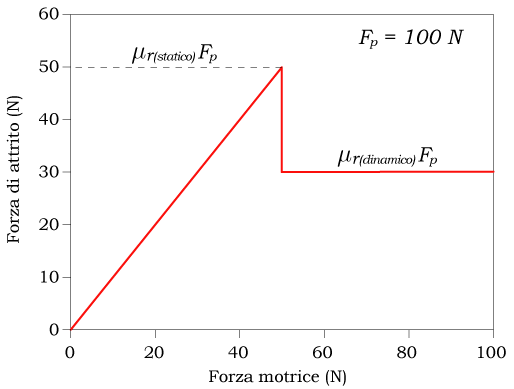
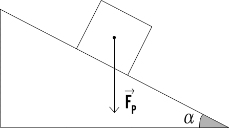
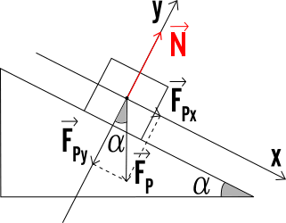
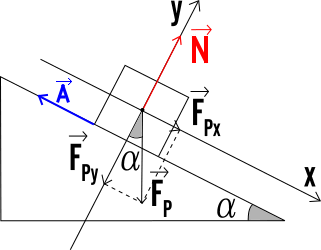
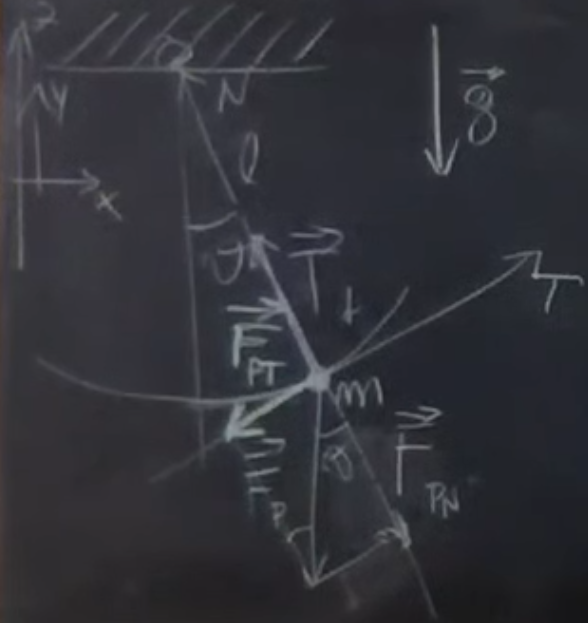

# Fisica

### Introduzione

- [ ] Unità del sistema internazionale
- [ ] Grandezze fisiche e fondamentali
- [ ] Cifre significative e arrotondamenti

### Cinematica

- [ ] Legge oraria del moto
- [x] Velocità media
- [x] Velocità istantanea
- [x] Accelerazione
- [x] Accelerazione Gravitazionale
- [ ] Integrale della velocità
- [ ] Grandezze vettoriali
- [x] Velocità istantanea in più dimensioni
- [x] Accelerazione in più dimensioni
- [ ] Moto circolare uniforme
- [x] Inerzia
- [x] Leggi della dinamica
- [x] Forza di gravità
- [x] Forza Peso
- [ ] Piano inclinato
- [ ] Forza di attrito
- [ ] Attrito statico
- [ ] Attrito dinamico
- [ ] Carrucole e funi
- [ ] Lavoro di una forza
- [ ] Forza non costante
- [ ] Potenza
  - [ ] Potenza istantanea
  - [ ] Potenza media
- [ ] Forze conservative
- [ ] Energia
  - [ ] Energia Potenziale
  - [ ] Energia Cinetica
  - [ ] Bilancio energetico
  - [ ] Energia Meccanica
- [ ] Sistemi di riferimento inerziali
- [ ] Cambi di sistema di riferimento
  - [ ] Accelerazione di trascinamento
  - [ ] Accelerazione di Coriolis
- [ ] Moto armonico
  - [ ] Equazione differenziale armonica
- [ ] Forza Elastica
  - [ ] Calcolo molla con piccole contrazioni
- [ ] Forze interne e forze esterne
- [ ] Centro di massa
- [ ] Esempio Sole Terra
- [ ] Conservazione della quantità di moto in un sistema isolato
- [ ] Urti anelastici
- [ ] Dissipazione dell’energia
- [ ] Urti elastici

### Termodinamica

- [ ] Gradi di libertà
- [ ] Sistema termodinamico
- [ ] Isolato, chiuso, aperto
- [ ] Variabili termodinamiche
- [ ] Equilibrio meccanico, chimico, termico, termodinamico
- [ ] Equazione di stato
- [ ] Caldo e freddo
- [ ] Temperatura
- [ ] Termometro
- [ ] Principio zero della termodinamica
- [ ] Temperatura e calore
- [ ] Temperatura assoluta
- [ ] Energia interna
- [ ] Esperimento di Joule
- [ ] Prima legge della termodinamica
- [ ] Casi particolari
- [ ] Convenzione dei segni per il trasferimento di energia
- [ ] Rappresentazione sul piano delle trasformazioni termodinamiche
- [ ] Trasformazioni quasistatiche, reversibili e irreversibili
- [ ] Capacità termica
- [ ] Calore specifico
- [ ] Le fasi della materia
- [ ] Cambi di fase
- [ ] Calore latente
- [ ] Punto triplo
- [ ] Modi di trasmissione del calore: conduzione, convezione, irraggiamento
- [ ] Vaso Dewar
- [ ] Gas Ideale
- [ ] La Pressione
- [ ] La Costante di Boltzmann
- [ ] Leggi di Gay-Lussac, legge di Boyle, legge di Avogadro
- [ ] Equazione di stato di gas perfetti
- [ ] Espansione libera di un gas
- [ ] Teoria cinetica dei gas
- [ ] Energia interna media in un gas perfetto monoatomico
- [ ] Equipartizione dell'energia cinetica
- [ ] Idealità di un gas
- [ ] Studio e rappresentazione delle trasformazioni notevoli dei gas ideali
- [ ] Isocora
- [ ] Isobara
- [ ] Adiabatica
- [ ] Isoterma
- [ ] Relazione di Mayer
- [ ] Cicli Termodinamici
- [ ] Ciclo termico/Macchina termica
- [ ] Ciclo frigorifero/Macchina frigorifera
- [ ] Calore ceduto e calore assorbito
- [ ] Lavoro subito e lavoro effettuato
- [ ] Rendimento di una macchina termica
- [ ] Cicli reversibili ed irreversibili
- [ ] Ciclo di Carnot
- [ ] Rappresentazione macchina termica
- [ ] Rappresentazione macchina frigorifera
- [ ] Ciclo di Otto
- [ ] Secondo principio della termodinamica
- [ ] Equivalenza degli enunciati di Kelvin-Planck e di Clausius
- [ ] Teorema di Carnot, dimostrazione ed implicazioni
- [ ] Teorema di Clausius, dimostrazione ed implicazioni
- [ ] L’entropia
- [ ] Variazioni di entropia per le trasformazioni notevoli dei gas ideali
- [ ] Teorema dell’entropia
- [ ] Senso del tempo
- [ ] Esercizi di termodinamica

### 
- [ ] Introduzione all’elettricità
- [ ] Conduttori e isolanti
- [ ] Plastiche e vetri
- [ ] Forza di Coulomb
- [ ] Costante dielettrica del vuoto
- [ ] Energia potenziale elettrica
- [ ] Modello atomico di Rutherford
- [ ] Confronto dell'intensità delle forze fondamentali elettrica e gravitazionale su scala atomica
- [ ] Principio di sovrapposizione
- [ ] Il campo elettrico
- [ ] Il potenziale elettrico
- [ ] Circuitazione del campo elettrico
- [ ] La forza elettromotrice
- [ ] Il potenziale elettrostatico
- [ ] Linee di forza come metodo di rappresentazione di un campo
- [ ] Il flusso di un campo vettoriale
- [ ] Angolo piano ed angolo solido
- [ ] Superfici orientate
- [ ] Il flusso del campo elettrico attraverso una superficie chiusa: il teorema di Gauss
- [ ] Applicazioni del teorema di Gauss: campo generato da un filo indefinito, da una piana infinita di carica
- [ ] Discontinuità del campo elettrico nell’attraversamento di una superficie piana
- [ ] I conduttori
- [ ] Potenziale di un conduttore in equilibrio
- [ ] Induzione elettrostatica, caso parziale e caso completo
- [ ] Schermo elettrostatico
- [ ] Potere delle punte
- [ ] Capacità di un singolo conduttore
- [ ] Caso della sfera conduttrice
- [ ] Condensatori
- [ ] Capacità di un condensatore sferico
- [ ] Capacità di un condensatore ad armature piane e parallele
- [ ] Casi limite
- [ ] Capacità equivalente di un sistema di condensatori in parallelo e di un un sistema in serie
- [ ] Capacità equivalenti complesse
- [ ] Carica di un condensatore
- [ ] Densità di energia elettrica
- [ ] Pressione elettrostatica
- [ ] Forza tra le armature di un condensatore
- [ ] Il caso di un condensatore isolato e quello in cui è attaccato un generatore
- [ ] Conduzione elettrica nei metalli
- [ ] Velocità di deriva
- [ ] Densità di corrente elettrica
- [ ] Intensità di corrente elettrica
- [ ] Principio di conservazione della carica elettrica
- [ ] Legge di Ohm
- [ ] Forma intensiva e forma estensiva
- [ ] Resistività
- [ ] Seconda legge di Ohm e dipendenza della resistenza dalla temperatura
- [ ] Potenza dissipata
- [ ] Effetto Joule
- [ ] Resistenza equivalente di un sistema in parallelo e di un un sistema in serie
- [ ] Resistenze equivalenti complesse
- [ ] Resistenza interna di un generatore
- [ ] Schematizzazione di un generatore reale

### 
- [ ] Cenni di magnetismo
- [ ] Cariche magnetiche
- [ ] Monopoli
- [ ] Dipoli magnetici e dipoli elettrici
- [ ] Induzione del campo magnetico
- [ ] Teorema di Gauss per il campo magnetico
- [ ] Solenoidalità del campo magnetico

# Statica e dinamica

## [L04.1](<../Fisica/Video/L04.1 - Leggi della dinamica. Quantità di moto. Forze impulsive-1TSq6jXggGA.mkv>) - Leggi della dinamica. Quantità di moto. Forze impulsive

Le leggi della dinamica sono leggi fondamentali, alla base della descrizione del **movimento dei corpi** e delle **cause** che determinano questo movimento

### ==Definizioni==

> <u>Grandezza</u>  (**Velocità media**)
>
> Variazione della posizione di un corpo nel tempo
> $$
> \vec v = \frac{Δ\vec x}{Δt}
> $$
> <u>Grandezza</u>  (**Velocità istantanea**)
>
> Variazione infinitesima della posizione di un corpo nel tempo
> $$
> \vec v = \frac{d\vec x}{dt}
> $$

> **Stato di moto di un corpo**: cambiamento di posizione di un corpo in funzione del tempo

- **Velocità** nel senso vettorialmente inteso

> **Sistema di riferimento inerziale**: sistema di riferimento in cui è valido il primo principio della dinamica

> **Fattore correttivo**: forza agente in sistemi di riferimento non inerziali

### Principi della dinamica

> <u>Legge</u>  (**I principio -- Legge di inerzia**)
>
> Ciascun corpo persevera nel suo stato di quiete o di moto rettilineo uniforme, salvo che sia costretto a mutare quello stato da forze applicate ad esso

- La **variazione** dello stato di moto di un corpo è possibile solo se interviene un **agente esterno** (**forza**)

> <u>Legge</u>  (**II principio -- Legge di Newton**)
>
> Il cambiamento di moto è proporzionale alla forza motrice applicata, ed avviene lungo la linea retta secondo la quale la forza stessa è esercitata
> $$
> \frac{d\vec v}{dt}=\frac{\vec F}m\quad\Rarr \quad \vec F = m\vec a
> $$

- > $$
  > \vec F=m\dfrac{d\vec v}{dt}=\dfrac{d(m\vec v)}{dt}=\dfrac{d\vec p}{dt}\quad\
  > $$

- Il **verso** della variazione di $\vec v$ **coincide** con il verso della forza $\vec F$

- **Campi di validità**
  - Sistemi di riferimento **inerziali**
  - $\vec v \ll c$

> <u>Legge</u>  (**III principio -- Azione e reazione**)
>
> A un'azione è sempre opposta un'uguale reazione: ovvero, le azioni vicendevoli di due corpi l'uno sull'altro sono sempre uguali e dirette verso parti opposte
> $$
> \vec F_{A→B} = -\vec F_{B→A}
> $$

- L'**accelerazione** è l'**effetto visibile** della dinamica del corpo
- La **forza** è la **causa** di questo effetto 

### ==Quantità di moto==

> <u>Grandezza</u>  (**Quantità di moto**)
> $$
> \vec p=m\vec v
> $$
>
> 

>
> <u>Unità di misura</u>
> $$
> [W]=[E]=[F·L]=[ML^2/T^2]\\[10px]
> {\rm udm}[W]=1\,J=1\,N·m=1\,kg\,m^2s^{-2}
> $$

- > $$
  > \begin{align}
  > \vec F = m\frac{d\vec v}{dt}=\frac{d\vec p}{dt}\quad&\Rarr\quad \vec Fdt = md\vec v=d\vec p\\[6px]
  > \int_{t_0}^{t_1}\!\!\vec Fdt=m\int_{t_0}^{t_1}\!\!d\vec v=\int_{t_0}^{t_1}\!\!d\vec p\quad&\Rarr\quad \int_{t_0}^{t_1}\!\!\vec F(t)dt=m(\vec v_1\! -\! \vec v_0)=\vec p_1\!-\!\vec p_0
  > \end{align}
  > $$

> <u>Grandezza</u>  (**Impulso**)
> $$
> \vec P = Δ\vec p\quad = \overline{\vec F\ }(t_1-t_0)=\overline{\vec F\ }Δt
> $$

> **Forza impulsiva**: forza che agisce per un lasso di tempo molto breve

- Forze **costanti**, o ben rappresentate da un **valore medio**, che caratterizzano fenomeni molto localizzati nel tempo

## [L04.4](<../Fisica/Video/L04.4 - Risultante delle forze. Statica-x3vACiNxvY4.mkv>) - Risultante delle forze. Statica

### Risultante

> <u>Definizione</u>  (**Risultante delle forze**)
>
> Vettore che descrive l'effetto combinato delle forze in questione
> $$
> \vec R = \vec F_{tot}= \sum_{i=1}^n \vec F_i
> $$

- Le azioni simultanee delle forze sono **indipendenti** fra di loro
- Concettualmente ogni forza $i$ concorre all'**accelerazione** $i$-esima

### Statica

> **Statica**: sotto-campo della dinamica in cui vengono trattati i corpi in equilibrio statico

> <u>Definizione</u>  (**Corpo fermo**)
>
> Corpo in equilibrio statico, la cui velocità è nulla in ogni istante di tempo
> $$
> \left. \begin{align}
> \vec v_0\ \; \, &= \vec0\\
> \vec v(t)&=\vec0 \quad \forall t\in D_t
> \end{align}
> \right\}\
> \equiv\ \ \vec R = \vec 0
> $$
>
> - $D_t$: dominio temporale in considerazione

- > $$
  > \frac{d\vec v}{dt}=\vec a=\vec 0\quad\Rarr \quad \vec R=m\vec a = \vec 0\quad\
  > $$

# Forze

## [L05.1](<../Fisica/Video/L05.1 - Moti e forze. Forze fondamentali-2BP_5vrfy9U.mkv>) - Moti e forze. Forze fondamentali

### Traiettoria

> **Traiettoria**: sequenza di punti occupati dal corpo all'evolvere del tempo

- Data un'**origine $O$** del sistema di riferimento, la traiettoria **$\vec r(t)$** è il succedersi dei **punti $\vec r$** in funzione del tempo
- **Relazione reciproca** fra traiettoria e velocità
  - La **velocità** è **tangente** al punto in considerazione della traiettoria
  - La successione delle velocità individua la traiettoria e viceversa
- La **velocità** può variare
  - In **modulo** → accelerazione **tangenziale**
    - Determina il **modulo** della **velocità**
  - In **verso** → accelerazione **normale**
    - Determina la **curvatura** della **traiettoria**

### Moti

- Moti **unidimensionali**

  - Moto **rettilineo uniforme**
  $$
  \vec v=\vec k\quad\Rarr \quad \frac{d\vec v}{dt}=\vec a =\vec0\quad\Rarr \quad \vec F =\vec0
  $$

  - Moto **rettilineo uniformemente accelerato**
  $$
  \vec a=\vec k\quad\Rarr \quad \vec F =\vec k
  $$

- Moti **pluridimensionali**

  - Moto **vario**
  $$
  \vec a = \vec a_T + \vec a_N\quad\Rarr \quad \vec F = m\vec a_T + m\vec a_N = \vec F_T + \vec F_N
  $$

### Forze fondamentali

- **Gravitazionale**: attrazione di corpi dotati di **massa**
- **Elettromagnetica**: interazione fra corpi dotati di **cariche elettriche**
- **Debole**: interazione fra particelle nucleari e subnucleari dotati **carica debole**
- **Forte**: interazione fra particelle nucleari e subnucleari dotati **carica forte**

<u>Osservazioni</u>

- Ciascuna delle forze coinvolge dei **corpi inclini** a subire o esercitare tali forze
- In misura proporzionale a **quantità fisiche possedute** da tali corpi

## [L05.2](<../Fisica/Video/L05.2 - Forza peso. Reazioni vincolari-gYD4vObhg70.mkv>) - Forza peso. Reazioni vincolari

### Forza peso

> <u>Forza</u>  (**Forza peso**)
> $$
> \vec F_P=m_g\vec g=-m_gg\hat z
> $$
>
> - $m_g$: massa gravitazionale
> - $\hat z$: versore perpendicolare al suolo e diretto verso l'alto

- La forza peso è la **formalizzazione matematica** di una **legge sperimentale**
  - Non deriva dalla legge di Newton
- **Approssimazione** della forza dovuta all'**interazione gravitazionale** fra il corpo in caduta e il pianeta Terra

### Massa gravitazionale e inerziale

> **Inerzia**: capacità di un corpo ad opporsi alla variazione di moto

> **Massa inerziale**: grandezza che esprime l'inerzia di un corpo

- Nel linguaggio delle **leggi della dinamica**

> **Massa gravitazionale**: grandezza che esprime la capacità di un corpo di interagire gravitazionalmente

- Capacità di perturbare e farsi perturbare dallo **spaziotempo**
- Costante della forza peso, su base **sperimentale**

> <u>Equazione</u>  (**Massa gravitazionale e inerziale**)
> $$
> m_g\vec g=m_i\vec a
> $$

- L'equazione si può **semplificare** qualora si assumesse che le due masse rappresentino la stessa grandezza

### Reazione vincolare

> **Reazione vincolare**: forza esercitata da un vincolo al moto di un corpo sotto l'effetto di un'altra forza

## [L05.3](<../Fisica/Video/L05.3 - La 'sensazione' del peso--camdjxMbU0.mkv>) - La 'sensazione' del peso

### Ascensore

- <u>Caso 1</u>: **fermo**
  $$
  \begin{align}
  \vec a &= \vec 0\\
  \vec R &= \vec 0\\
  \vec F_P + \vec N_0 &= \vec0
  \end{align}
  $$

- <u>Caso 2</u>: **accelerato**
  $$
  \begin{align}
  \vec a &= a\hat z\\
  \vec g &= -g\hat z\\
  \vec R &\ne\vec0\\
  \vec F_P +\vec N &= m\vec a\\
  -mg\hat z+N\hat z&=\pm ma\hat z
  \end{align}
  $$

  - <u>Caso A</u>: da fermo **verso l'alto**
    $$
    {\begin{align}
    a &> 0\\
    -mg+N&=ma
    \end{align}}\\
    $$

    $$
    \left.
    {\begin{align}
    N\; &=m(g+a)\ \\
    N_0 &= m g
    \end{align}}
    \right\}\ \ N>N_0
    $$

  - <u>Caso B</u>: da fermo **verso il basso**
    $$
    {\begin{align}
    a &<0\\
    -mg+N&=-ma
    \end{align}}\\
    N=mg-ma=N_0-ma \quad\Rarr \quad  N<N_0
    $$

- <u>Caso 3</u>: **caduta libera**
  $$
  \vec a = \vec g\\
  N=mg-ma=0
  $$

## [L05.4](<../Fisica/Video/L05.4 - Attrito radente-fb8ANHT1g4k.mkv>) - Attrito radente

### Esperimento

> <u>Esperimento</u>  (**Attrito**)
>
> - Un corpo di massa $m$ giace su un piano orizzontale
> - Al corpo viene applicata una forza esterna $\vec F_{ex}$ parallela al piano
> - Si osservi il comportamento del corpo al variare di
>   - Forza esterna
>   - Massa

### Variare la forza esterna

- Esiste una **forza $\vec F_{AS}^{\max}$ massima** che il piano riesce ad **opporre** alla forza esterna, tale per cui con forze esterne
  - **Inferiori** ad essa, il corpo rimane **fermo**

  $$
  \begin{align}
  &\vec F_{ex}\ne\vec0\,,\ \ \vec R =\vec0\\
  \Rarr \quad &\vec R = \vec F_{ex}+\vec F_{AS}=\vec0\\
  \Rarr \quad &\vec F_{AS}=-\vec F_{ex}
  \end{align}
  $$

  - **Superiori** ad essa, il corpo si **muove**
    $$
    F_{ex}>F_{AS}^{\max}\quad\Rarr \quad R \ne 0
    $$

- Il valore di $F_{AS}^{\max}$ è ottienuto cercando l'esatto valore **$F_{ex}^{\lim}$** della forza applicata tale per cui si ha il **distacco** del corpo dalla posizione in cui si trova

### Variare la massa del corpo

- I valori di $\vec F_{AS}^{\max}$ variano **linearmente** al variare della massa del corpo
  $$
  \vec F_{AS}^{\max} = k·m
  $$

- Più precisamente la proporzionalità è legata alla **reazione vincolare**
  $$
  \vec F_{AS}^{\max} = μ_s \vec N
  $$

> <u>Forza</u>  (**Forza d'attrito statico**)
>
> Forza che si oppone alle forze esercitate su un corpo fermo
> $$
> \vec F_{AS}^{\max} = -μ_s N\hat F_{ex}
> $$

### Accelerazione

Quando avviene il distacco il corpo subisce un'**accelerazione** che non è proporzionale alla forza applicata
$$
F_{ex}>F_{ex}^{\lim}\quad\Rarr \quad ma=R<F_{ex}\quad\Rarr\\[8px]
\Rarr \quad R=F_{ex}-F_{AD}>0\quad\Rarr \quad F_{AD}<F_{ex}
$$

> <u>Forza</u>  (**Forza d'attrito dinamico**)
>
> Forza che si oppone al moto di un corpo in movimento
> $$
> \vec F_{AD} = -μ_d N\hat v
> $$

- <u>Modulo</u>: **costante**
  - Non dipende dal valore della velocità del corpo
- <u>Direzione e verso</u>: uguale a opposto alla **velocità**
  - Non dipende dalla forza applicata
- È **minore** della forza applicata

# Forze e moti

## [L06.1](<../Fisica/Video/L06.1 - Piano inclinato-uXxQjkZcJJI.mkv>) - Piano inclinato

### Sistema fisico

- **Verticale**
- **Suolo**
  - Definito dalla verticale, mediante una relazione di ortogonalità
- **Piano inclinato**
  - Definito dall'**angolo di alzo $α$**
  - Assunto infinitamente lungo
- **Corpo**
  - Di **massa $m$**

<u>Sistema di riferimento</u>

- Asse $z'$ verso l'alto
- Asse $x$ lungo il piano
- Asse $y$ normale al piano

### Scomposizione delle forze

- **Asse $y$**

  - $\vec R_y=\vec F_{Py}+\vec N=\vec 0$
  - $R_y=F_{Py}-N=0$

- **Asse $x$**

  - $\vec F_{Px}=m\vec a_x$
  - $F_{Px}=ma_x$

- **Angolo $α$**

  - $F_{Px}=F_P\sin α=ma_x$
  - $mg\sinα=ma_x$
  - $a_x=g\sinα$

  

### Forza d'attrito

- **Statico**
  - $\vec R_x=\vec A_S+\vec F_{Px}=\vec 0$
  - $-A_S+mg\sinα=0$
  - $A_S=mg\sinα\leμ_sN=μ_smg\cosα$
  - $\sinα\leμ_s\cosα\quad\Rarr \quad \tanα\le\tanα_\max=μ_s$
  - L'angolo di alzo massimo $α_\max$ dipende esclusivamente dal **coefficiente $μ_s$**
- **Dinamico**
  - $R_x=F_{Px}-A_D=mg(\sinα-μ_d\cosα)$
  - $a_x=\dfrac{R_x}{m}=g(\sinα-μ_d\cosα)$

### Legge oraria

Il moto della massa lungo il piano inclinato è **uniformemente accelerato**
$$
x(t)=v_{0x}t+\frac12a_xt^2\\
v_{0x}=0\quad\Rarr \quad x(t)=\frac12g\sinαt^2
$$

## [L06.2](<../Fisica/Video/L06.2 - Forza elastica-tebYf2hQzec.mkv>) - Forza elastica

### Modello

Modello in cui la **forza** dipende **linearmente dalla posizione**

- Approccio che permette di descrivere qualsiasi movimento di un sistema fisico attorno ad una **posizione di equilibrio**

### Sistema fisico

- **Molla**
  - **Lunghzza $l_0$** nella **posizione di riposo/equilibrio**
  - Massa trascurabile
- I cui **capi** sono **ancorati** a
  - **Corpo immobile** (assunto di massa infinita)
  - **Corpo mobile di massa $m$**

<u>Fenomeni</u>

- **Estensione**:  $l_1>l_0$
- **Compressione**:  $l_2<l_0$

<u>Sistema di riferimento</u>

- Asse $x$ diretto dalla massa immobile a quella mobile

### Forza elastica

> <u>Forza</u>  (**Forza elastica**)
>
> Forza di richiamo verso la posizione di riposo della molla
> $$
> \vec F=-kΔ\vec l\quad =-k|Δl|\hat x
> $$

- <u>Direzione</u>: lungo l'**asse della molla**
- <u>Verso</u>: dalla posizione attuale alla **posizione di riposo**
- $k$ dipende solamente dalle **caratteristiche geometriche** della molla

### Moto armonico

La massa rilasciata da una posizione non di equilibrio, in assenza di attriti, si muoverà di **moto armonico** attorno alla posizione di riposo

- La forza di richiamo è una **sorgente dinamica** del moto armonico
- Il **periodo** dipende unicamente dal rapporto **$m/k$**

$$
F=ma=-k(x-x_0)\quad\Rarr \quad a=\frac{d^2x}{dt^2}=-\frac{k}{m}(x-x_0) \\
x_0=0\quad\Rarr \quad \frac{d^2x}{dt^2}+\frac{k}{m}x=0\quad\Rarr \quad 
x(t)=x_i\cos(ωt)\\
ω^2=\frac{k}{m}\quad\Rarr \quad ω=\sqrt\frac{k}{m}=\frac{2π}{T}\quad\Rarr \quad T=2π\sqrt\frac mk
$$

## [L06.3](<../Fisica/Video/L06.3 - Pendolo semplice-4SPangau41M.mkv>) - Pendolo semplice

### Sistema fisico

- **Sostegno immobile**
- **Filo inestensibile**
  - **Lunghezza $l$**
  - Forma un **angolo $θ$** con la verticale
  - Massa trascurabile
- **Corpo appeso**
  - **Massa $m$**

<u>Sistema di riferimento</u>

- Asse $z$ veso l'alto
- Asse **$N$ ortogonale** alla traiettoria
- Asse **$T$ tangente** alla traiettoria
  - Il sistema $NT$ varia nel tempo

### Scomposizione delle forze

$$
\vec R=\vec F_P+\vec T_f
$$

Forze scomposte lungo gli assi del **sistema $NT$**

- **Asse $T$**
  - $F_{PT}\,=F_P\sinθ\,=mg\sinθ$
  - $R_T=-F_{PT}=ma_T$
  - $-mg\sinθ=ma_t=m\dfrac{dv}{dt}=ml\dfrac{dω}{dt}=ml\dfrac{d^2θ}{dt^2}$
  - $\dfrac{d^2θ}{dt^2}+\dfrac gl\sinθ=0$
- **Asse $N$**
  - $F_{PN}=F_P\cosθ=mg\cosθ$
  - $R_N=-F_{PN}+T_f=ma_N=m\overlineω^2l=m\dfrac{\overline v^2}l$
  - $T_f=m\dfrac{\overline v^2}l+mg\cosθ\quad\Rarr \quad T_f(t)=m\dfrac{\overline v(t)^2}l+mg\cosθ(t)$

### Isocronismo delle piccole oscillazioni

Per angoli $θ$ piccoli, il **periodo** dipende esclusivamente dal **rapporto $l/g$** e non dall'angolo di partenza
$$
\quad\quad\ \ \ θ-\sinθ=\frac{θ^3}{3!}\qquad{\stackrel{θ<10°}\Rarr} \qquad θ-\sinθ\ll10^{-2}\\[8px]
\dfrac{d^2θ}{dt^2}+\dfrac gl\sinθ=0\qquad {\stackrel{\ θ\ll1}\approx}\qquad \dfrac{d^2θ}{dt^2}+\dfrac glθ=0
$$

### Legge oraria

Moto armonico generato dalla **forza di richiamo** verso la posizione di equilibrio
$$
θ(t)=θ_i\cos(ωt)\\
\overlineω=\frac{dθ(t)}{dt}=-θ_iω\sin(ωt)\quad\Rarr \quad 
\overline v=\overlineωl=-θ_ilω\sin(ωt)
$$

$$
\dfrac{d^2θ}{dt^2}+\dfrac glθ=0 \qquad\qquad
ω=\sqrt{\dfrac{g}{l}}\quad\Rarr \quad T=2π\sqrt{\dfrac{l}{g}}
$$

# Lavoro e energia

## [L08.1](<../Fisica/Video/L08.1 - Lavoro-xlztVSiV1tw.mkv>) - Lavoro

### Lavoro

**Strumento matematico** che semplifica i calcoli della **variazione** del modulo della **velocità** da parte della forza tangenziale ad una traiettoria

> <u>Grandezza</u>  (**Lavoro infinitesimo**)
>
> Scalare risultante dal prodotto scalare di una forza per lo spostamento infinitesimo su cui è applicata
> $$
> dW=\vec F·d\vec r\quad = |\vec F_T|·|d\vec r|=F\;dr\,\cosα
> $$
>
> 

>
> <u>Grandezza</u>  (**Lavoro su traiettoria finita**)
>
> Sommatoria dei singoli lavori su ogni tratto infinitesimo che compone la traiettoria, da una posizione iniziale ad una finale
> $$
> W_{i,f}=\int_{i}^{f}\!dW_k=\int_{i}^{f}\!\vec F·d\vec s\quad=\sum_{k=1}^N ΔW_k
> $$
>
> 

>
> <u>Unità di misura</u>
> $$
> [W]=[E]=[F·L]=[ML^2/T^2]\\[10px]
> {\rm udm}[W]=1\,J=1\,N·m=1\,kg\,m^2s^{-2}
> $$

## [L08.2](<../Fisica/Video/L08.2 - Lavoro per forze particolari-SwAAllF5a8c.mkv>) - Lavoro per forze particolari

## [L08.3](<../Fisica/Video/L08.3 - Potenza ed energia cinetica-ly4cxizIgBM.mkv>) - Potenza ed energia cinetica

# Conservazione dell'energia

## [L09.1](<../Fisica/Video/L09.1 - Forze conservative-CJoqqGUNV6g.mkv>) - Forze conservative

## [L09.2](<../Fisica/Video/L09.2 - Energia potenziale-nBN4NYIQB20.mkv>) - Energia potenziale
## [L09.3](<../Fisica/Video/L09.3 - Energia meccanica-4afUDI4g-ZI.mkv>) - Energia meccanica
## [L09.4](<../Fisica/Video/L09.4 - Conservazione dell'energia-3eCkaR96rRE.mkv>) - Conservazione dell'energia

## [L09.5](<../Fisica/Video/L09.5 - Forza di gravità-So2wtc6X6No.mkv>) - Forza di gravità

# Sistemi di riferimento

## [L10.1](<../Fisica/Video/L10.1 - Cambi di riferimento-R_eWAfFm3Bg.mkv>) - Cambi di riferimento
## [L10.2](<../Fisica/Video/L10.2 - Sistemi inerziali e non inerziali. Forze apparenti-gfTegwnQnJw.mkv>) - Sistemi inerziali e non inerziali. Forze apparenti

# Urti

## [L11.1](<../Fisica/Video/L11.1 - Sistemi di punti materiali e conservazione della quantità di moto-O2rHj3Htw0s.mkv>) - Sistemi di punti materiali e conservazione della quantità di moto
## [L11.2](<../Fisica/Video/L11.2 - Urti anelastici-Y9NwVBNMbeE.mkv>) - Urti anelastici
## [L11.3](<../Fisica/Video/L11.3 - Urti elastici-rjqj16I5fXI.mkv>) - Urti elastici

## [L12.1](<../Fisica/Video/L12.1 - Sistemi termodinamici e variabili termodinamiche-1wHygcyzJ_0.mkv>) - Sistemi termodinamici e variabili termodinamiche
## [L12.2](<../Fisica/Video/L12.2 - Equilibrio e trasformazioni termodinamiche-d6xFHwT8a5E.mkv>) - Equilibrio e trasformazioni termodinamiche
## [L12.3](<../Fisica/Video/L12.3 - Temperatura e principio zero della termodinamica-QaAbdwyyOkg.mkv>) - Temperatura e principio zero della termodinamica
## [L12.4](<../Fisica/Video/L12.4 - Calore e primo principio della termodinamica-AxHjGsEv6kE.mkv>) - Calore e primo principio della termodinamica

## [L13.1](<../Fisica/Video/L13.1 - Trasformazioni quasistatiche e reversibilità-9lW0uXRdPLk.mkv>) - Trasformazioni quasistatiche e reversibilità

## [L13.2](<../Fisica/Video/L13.2 - Calorimetria. Calore specifico e capacità termica-P450oTkv4SI.mkv>) - Calorimetria. Calore specifico e capacità termica
## [L13.3](<../Fisica/Video/L13.3 - Cambi di fase-vtKCdJqUmEc.mkv>) - Cambi di fase
## [L13.4](<../Fisica/Video/L13.4 - Trasmissione del calore-sEC8KvsaB8Y.mkv>) - Trasmissione del calore

## [L14.1](<../Fisica/Video/L14.1 - Gas ideali. p,V,T-tlt27-q0HDk.mkv>) - Gas ideali. p,V,T
## [L14.2](<../Fisica/Video/L14.2 - Equazione di stato dei gas ideali-OICRyCvvFwY.mkv>) - Equazione di stato dei gas ideali
## [L14.3](<../Fisica/Video/L14.3 - Teoria cinetica ed energia interna dei gas ideali-wgYWiS8g5Y4.mkv>) - Teoria cinetica ed energia interna dei gas ideali
## [L14.4](<../Fisica/Video/L14.4 - Trasformazioni dei gas ideali-Ey4-8e9bAhc.mkv>) - Trasformazioni dei gas ideali

## [L15.1](<../Fisica/Video/L15.1 - Trasformazioni cicliche-rDadAk3FfEw.mkv>) - Trasformazioni cicliche
## [L15.2](<../Fisica/Video/L15.2 - Ciclo di Carnot-Hicc4anjQeQ.mkv>) - Ciclo di Carnot
## [L15.3](<../Fisica/Video/L15.3 - Altri cicli termodinamici-HGM4_dDl_hI.mkv>) - Altri cicli termodinamici
## [L15.4](<../Fisica/Video/L15.4 - Cicli reversibili e irreversibili-dPfhkOeyez0.mkv>) - Cicli reversibili e irreversibili

## [L16.1](<../Fisica/Video/L16.1 - Secondo principio della termodinamica-xd3SJLBBFTg.mkv>) - Secondo principio della termodinamica
## [L16.2](<../Fisica/Video/L16.2 - Teoremi di Carnot e di Clausius-wc96i0YjoH8.mkv>) - Teoremi di Carnot e di Clausius
## [L16.3](<../Fisica/Video/L16.3 - Entropia-2YhnNwm5R7I.mkv>) - Entropia

## [L18.1](<../Fisica/Video/L18.1 - Elettricità e forza di Coulomb-5PdzEfJu9sc.mkv>) - Elettricità e forza di Coulomb
## [L18.2](<../Fisica/Video/L18.2 - Principio di sovrapposizione e campo elettrico-4e9Gbw6ohv8.mkv>) - Principio di sovrapposizione e campo elettrico
