# LFC

|      |          |                                                              |
| ---- | :------: | -----------------------------------------------------------: |
| LFC  | Parte I | [ ][root][][pdf] |

[TOC]


---

# [Parte I][pdf]<br>Teoria dei linguaggi e degli automi a stati finiti


# [Cap 1][pdf]  Introduzione

## [1.1][pdf]  Il compilatore

<aside>da sorgente a eseguibile,<br>machine dependant</aside>

### [1.1.1][pdf]  Cos’è un compilatore

> **Compilatore**: meccanismo che trasforma il codice sorgente in codice eseguibile

- Il codice eseguibile è **machine dependent**

<u>Utilizzo</u>: **trazuzione** di codice C in assembly

- Un codice in **assembly non è eseguibile**, necessita di
  - Conversione in **binario**
  - **Linking**

Due elementi principali

- **Codice sorgente**
- **Grammatica**


<aside>pipeline, front/back end</aside>

### [1.2][pdf]  Fasi della compilazione

**Passaggi necessari** per la compilazione, eseguiti in **pipeline**

1. Analisi **lessicale**
2. Analisi **sintattica**
3. Analisi **semantica**
4. Generazione **intermediate code**
5. Generazione **target code**

Divisibili in **due gruppi**

- **Front-end**  (1. -- 4.)
- **Back-end**  (5. -- ...)


<aside><b>def</b>: la grammatica definisce la struttura legale del linguaggio</aside>

### Grammatica di un linguaggio

> **Grammatica di un linguaggio**: insieme di regole che definiscono la struttura legale delle varie operazioni possibili in quel linguaggio

- Specifica le **forme** che un’**espressione** deve avere per essere **ben formata** rispetto a un dato linguaggio
- Un programma scritto in un certo **linguaggio** deve essere compilato con il **compilatore dedicato** a quel linguaggio
- Un codice scritto per un certo compilatore deve **rispettare la grammatica** del linguaggio per cui il compilatore lavora

---

> <u>Esempio</u>
>
> Forma per un’operazione di assegnamento definita da una grammatica
> $$
> \tt Identifier\ Assign\ Expression\ Semicolon
> $$
>
> - $\tt Identifier$ è un **segnaposto** per un qualsiasi identificatore (stringa) che può essere utilizzato dal programmatore


## [1.1.2][pdf]  Fasi del processo di compilazione

<aside><b>out</b>: flusso di token, ognuno con ruolo</aside>

### Analisi lessicale

> **Analisi lessicale**: traduzione di un flusso di caratteri in un flusso di tokens

- **Risoluzione** di stringhe del sorgente, riconoscendone il **ruolo**
- I **tokens** ottenuti contengono informazioni sul **tipo di dato** o **comando** che la stringa identifica

---

> <u>Esempio</u>
> $$
> \tt pippo = 2*3; \quad\Rarr \quad <\!ID, pippo\!> ASS <\!NUM,2 \!> MUL <\!NUM,3\!> SEMCOL
> $$


<aside>verifica aderenza<br>token-grammatica<br>
    <b>out</b>: PT / AST</aside>

### Analisi sintattica

> **Analisi sintattica**: verifica che la sequenza di token sia aderente alla grammatica del linguaggio utilizzato

Se le regole della grammatica sono **rispettate**, il **flusso di token** è tradotto in (dipendentemente dal **compilatore**)

- **Parse Tree**
  - Derivato dalla **grammatica**
  - Più la struttura è **minimale** più le fasi successive sono **efficienti**
- **Abstract Syntax Tree**
  - Ottenuto dal **PT**
  - **Compatta le parti inutili** nelle fasi della compilazione
  - **Semplifica** ulteriormente lo schema
  - **Risparmio** in termini di **numero di nodi**

Altrimenti **sintax error**

---

> <u>Osservazioni</u>
>
> - Non è facile scrivere una **grammatica** che:
>   - Possa essere **analizzata con efficienza** da un compilatore
>   - Generi **PT** più **semplici** possibili
> - Molti compilatori **sovrappongono le fasi** di creazione di PT e AST
> - L’output può essere un **grafo**
>   - ~~e.g.~~ Side effects

---

> <u>Esempi</u>
>
> - PT  $\tt pippo=2*3$				 				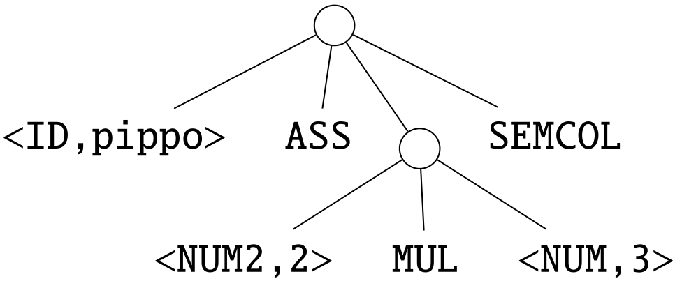
>
> 
>
>
> - AST  $\tt pippo=2*3$											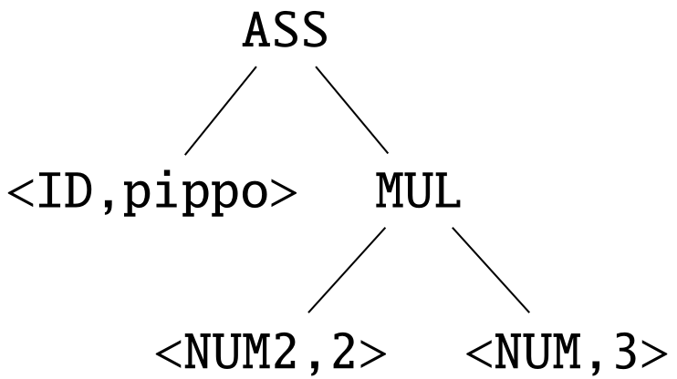
>
> 
>
>
> - Graph  $\tt pippo=pippo*2$		 			 				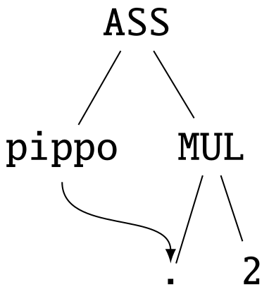


<aside>identifica significato operatori</aside>

### Analisi semantica

> **Analisi semantica**: identificazione del giusto significato di un operatore

- Nei linguaggi in cui esistono **diversi significati** per uno **stesso operatore**
  - ~~e.g.~~ $\tt MUL$ tra interi e tra float


<aside>astrazione<br>human readable,<br>per modularità</aside>

### Generazione del codice intermedio

> **Generazione del codice intermedio**: creazione di un codice testuale tramite traduzione del parse tree

- Istruzioni **leggibili dall’uomo**
- **Né assembly né codice effettivo**

Utile per ragioni di **modularità**

- Livello di **astrazione** che **semplifica** il tutto
- Con $N$ linguaggi $K$ macchine si hanno **$N$ front-end e $K$ back-end**
- Senza codice intermedio servirebbero **$N\! ·\! K$ differenti compilatori**

---

> <u>Esempio</u>
>
> 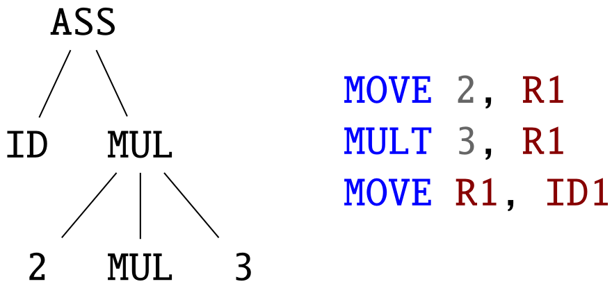


<aside><b>out</b>: assembly</aside>

### Generazione del target code

> **Generazione del target code**: traduzione del codice intermedio nell’assembly della specifica macchina

- Il codice **binario** non è necessariamente il target code della compilazione


# [Cap 2][pdf]  Le grammatiche generative

## [2.1][pdf]  Definizione di grammatica generativa

<aside>grammatica, vocabolario, produzione, linguaggio</aside>

### Definizioni

> **Grammatica generativa** ($\cal G$): grammatica usata per generare linguaggi

> **Vocabolario** ($V$): insieme di simboli

> **Produzione** ($→$): regola di riscrittura di stringhe contenenti non-terminali in altre stringhe

> **Linguaggio** ($\cal L$): insieme di stringhe composte solo da terminali, generate da una grammatica

- Generato a partire dallo **start symbol**
- ==Può essere==
  - ==**Vuoto** ($\rm Ø$)==
    - ==Non può generare stringhe composte solo da terminali==
  - ==Composto solo dalla **parola vuota** ($\{ε\}\ne\rm Ø$)==


<aside>vocabolario, terminali, start-symbol, produzioni</aside>

### Grammatica generativa

<u>Composizione</u>

- **Vocabolario**
  - La sua definizione è il **primo passo** per definire una grammatica
- **Simboli speciali**
  - **Terminali**: hanno il ruolo di token nell’analisi lessicale
  - **Non-terminali**: complementari dei terminali
  - **Start symbol**: permette di iniziare a generare il linguaggio derivato dalla grammatica
- **Insieme di produzioni**

---

> ~~<u>Esempio</u>  (**Regole per una grammatica**)~~
> $$
> \color{#999} {\cal G}=\{S → aSb,\ S → ab\}
> $$
>
> - ~~$S$ è lo **starting point**~~
> - ~~$a$ e $b$ sono caratteri **terminali**~~


<aside><b>uso</b>: applicare tutte le possibili procedure<br><b>out</b>: solo terminali</aside>

<aside></aside>

### [2.1.1][pdf]  Derivare il linguaggio di una grammatica

>**Derivazione** ($\Rarr$): operazione di riscrittura (derivation step)

- ==Produzione → **regola**==
- ==Derivazione → **operazione**==

> <u>Procedura</u>  (**Derivazione del linguaggio**)
>
> Definisce il linguaggio determinato da una grammatica, applicando tutte le posibili produzioni appartenenti ad essa

- **Traduce** stringhe con caratteri **non terminali** in stringhe composte **solo** da **terminali**

---

> <u>Esempio</u>
>
> - Grammatica ${\cal G}$:  $S → aSb\ |\ ab$
> - Derivazione (1 step):  $S\Rarr ab\in\cal L$
>   - La parola $ab$ appartiene al linguaggio perché contiene solo terminali
> - Derivazione (1 step):  $S\Rarr aaSbb\notin\cal L$
>   - La parola $ab$ non appartiene al linguaggio perché contiene $S$
> - Linguaggio $\cal L$:  $\{a^nb^n: n>0\}$
>   - Ogni sequenza di parole formate da $n$ terminali $a$ seguiti da $n$ terminali $b$

---

> ~~<u>Applicazione</u>  (**Verifica delle parenesi**)~~
>
> ~~Questo meccanismo di derivazione del linguaggio può essere visto come un metodo per verificare che tutte le parentesi aperte vengano chiuse, dove~~
> $$
> \color{#999}a := \text{ '(' }\quad \and\quad b := \text{ ')' }
> $$
> ~~Una tale grammatica tramite il mezzo delle produzioni permette di eseguire questo tipo di controlli~~


## [2.2][pdf]  Esercizi di derivazione da una grammatica

- ### [Vedi dispensa][pdf]


## [2.3][pdf]  Grammatiche generative formalmente

<aside>ente astratto,<br>assente nei vocabolari</aside>

### Parola vuota

Rappresentata dal **carattere $ε$**

- **Ente astratto** a sé stante
- Non appartiene a **nessun vocabolario**
- Ha lunghezza nulla
- Non viene scritto nelle parole
- $ε = ε^n$
- $ε = b^0$
- $\{b\}\cup\{ε\}=\{b\}$


<aside><div>*  +<br>A: non-terminale<br>X: generico<br>a: terminale<br>α: stringa generica<br>w: parola</div></aside>

### ==Convenzioni notazionali==

- $∗\,$: zero o più ripetizioni di elementi nella base ($ε\in V^*$)
- $+\,$: una o più ripetizioni di elementi nella base ($ε\notin V^+$)
- **Maiuscole inizio** dell’alfabeto ($A, B,C,...\,$): non-terminale ($∈ (V \setminus T )$)
- **Maiuscole fine** dell’alfabeto ($X, Y , Z,...\,$): simbolo generico ($∈ V $)
- **Minuscole inizio** alfabeto ($a, b, c. . .\,$): terminali ($∈ T $)
- **Minuscole greche** ($α,β,γ,...$): stringhe composte da terminali o non ($∈ V^∗$)
- **Minuscole fine** alfabeto con **pedice** numerico ($w, w_0,w_n, . . .\,$): stringhe di caratteri terminali (words o parole del linguaggio)


<aside><div><b>def</b>
G = (V, T, S, P)<br>P = {δ → β}<br>L = {w : w∈T* ∧ S⇒*w}</div></aside>
### Definizioni formali

> <u>Definizione formale</u>  (**Grammatica generativa**)
>
> Tupla nella forma
> $$
> {\cal G} = (V,T,S,{\cal P})
> $$
>
> - $V\ $ vocabolario
> - $T\ $ insieme dei terminali
> - $S\ $ start symbol
> - $\cal P\ $ insieme delle produzioni

> <u>Definizione formale</u>  (**Produzione**)
>
> Traduzione nella forma
> $$
> δ→β \\[8px]
> {\rm dove}\ \ δ ∈ V^+ \and\ \exist\, X\in δ\ :\ X\in (V\setminus T)
> $$
>
> - $δ\ $ driver della produzione
> - $β\ $ body della produzione

- Il **simbolo $\bold |\,$** descrive diverse produzioni con lo **stesso driver**

> <u>Definizione formale</u>  (**Linguaggio**)
>
> Linguaggio generato da una grammatica ${\cal G} = (V,T,S,{\cal P})$
> $$
> {\cal L(G)} = \{w: w\in T^* \and\ S\Rarr^*w\}
> $$

- $\Rarr^*\,$ **sequenza di derivazioni** successive, compatibili secondo le produzioni
- Insieme di tutti gli elementi (anche vuoti) che si possono derivare con uno o più passi dallo start symbol


<aside>derivazioni rightmost/leftmost deterministiche</aside>

### ==[2.3.1][pdf]  Derivazione canonica==

Le seguenti **operazioni** dipendono dal **metodo di derivazione** dallo starting point

- **Analisi di una stringa**
- **Verifica dell'appartenenza** ad una grammatica

Due tipi di **derivazione canonica**: si rimpiazzano sempre prima i **non-terminali**

- ==**Rightmost**==
- ==**Leftmost**==

==Queste strategie portano a **passi analitici** di una derivazione **deterministici**==


<aside><b>def</b>: derivazioni canoniche distinte portano alla stessa parola</aside>

### ==[2.3.2][pdf]  Ambiguità delle grammatiche==

> <u>Definizione</u>  (**Grammatica ambigua**)
>
> Una grammatica $\cal G$ si dice ambigua se esiste $w ∈ \cal L(G)$ che può essere derivata da due derivazioni canoniche distinte, entrambe rightmost o entrambe leftmost

- **Distinte**: l’ordine di applicazione delle produzioni è differente
- <u>Obiettivo</u>: evitare grammatiche ambigue

---

> <u>Esempio</u>  (**Espressioni aritmetiche**)
>
> - **Grammatica** delle espressioni aritmetiche
>   $$
>   E\ →\ E+E\ |\ E∗E\ |\ n
>   $$
>
> - **Parola** da derivare (leftmost)
>   $$
>   w = n + n ∗ n
>   $$
>
> - **Derivazione** leftmost 1
>
>   1. $E_{(0)}→\,E_{(1)}+E_{(2)}$
>      1. $E_{(1)}→\,n$
>      2. $E_{(2)}→\,E_{(3)}*E_{(4)}$
>         1. $E_{(3)}→\,n$
>         2. $E_{(4)}→\,n$
>
>   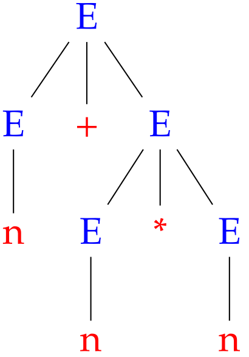
>
> - **Derivazione** leftmost 2
>
>   1. $E_{(0)}→\,E_{(1)}*E_{(2)}$
>      1. $E_{(1)}→\,E_{(3)}+E_{(4)}$
>         1. $E_{(3)}→\,n$
>         2. $E_{(4)}→\,n$
>      2. $E_{(2)}→\,n$
>
>   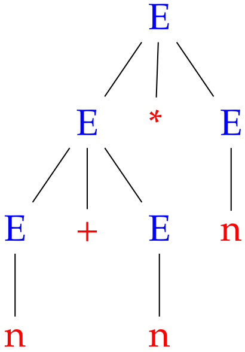
>
> Ciò comporta **due derivazioni differenti**, nella stessa **forma canonica** leftmost
>
> La grammatica di partenza è **ambigua**: nonostante il significato (l’interpretazione matematica dei due alberi) sia diverso si può costruire $w$ con due alberi differenti che usano la stessa strategia canonica di derivazione


<aside><b>def</b>: driver sono singoli non-terminali</aside>

### ==[2.3.1][pdf]  Grammatiche libere==

==Gerarchia delle grammatiche fondata sulla **struttura delle produzioni**==

- Non dipende dal genere di analisi che permettono di fare

> <u>Definizione</u>  (**Grammatica libera / Context-free grammars**)
>
> $$
> \forall (δ→β)\in{\cal P},\ \ δ\in (V\setminus T)
> $$

- ==Ogni **driver** è composto solamente da un **non-terminale**==
- I **linguaggi di programmazione** sono derivati da questo tipo di grammatica

> <u>Definizione</u>  (**Linguaggio libero / Context-free language**)
>
> Linguaggio generato da una grammatica libera
> $$
> {\cal L}\ {\rm libero}\iff \exist\,{\cal G}\ {\rm libera}\ |\ {\cal L=L(G)}
> $$


<aside>intrinsecamente ambiguo</aside>

### Dangling else

> <u>Definizione</u>  (**Dangling else**)
>
> Produzioni in forma
> $$
> S\ →\ {\rm if}\ b\ {\rm then}\ S\ |\ {\rm if}\ b\ {\rm then}\ S\ {\rm else}\ S\ |\ {\rm other}
> $$

- ==$\tt else$ è intrinsecamente **ambiguo**==

---

> <u>Esempio</u>
> $$
> w={\rm if}\ b\ {\rm then}\ {\rm if}\ b\ {\rm then}\ {\rm other} \ {\rm else}\ {\rm other}
> $$
>
> La grammatica è **ambigua**
>
> - **Non è possibile sapere** con quale $\rm then$ è accoppiato $\rm else$
> - Sono possibili **due alberi** di derivazione per $w$
>
> 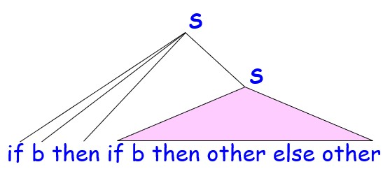 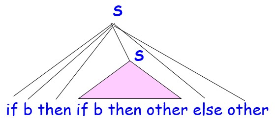

---

> <u>Problema</u>  (**Linguaggi di programmazione**)
>
> - Come gestire il comando $\tt if\ then\ else$ nei **linguaggi di programmazione**
>
> <u>Soluzioni</u>
>
> - **Parentesi**
> - Eliminare $\tt else$ e usare **solo $\tt if$**
> - Impedire $\tt if$ senza $\tt else$
> - Usare la regola del **closest unmatched $\tt then$**
>   - $\tt else$ è valutato come appartenente all’**ultimo $\tt then$ senza $\tt else$**

---

> <u>Osservazione</u>  (**Indecidibilità dell'ambiguità**)
>
> L’**ambiguità** in alcuni casi è **indecidibile**
>
> - Non sempre esiste un **algoritmo** che dice se la grammatica è **ambigua o no**


<aside><div><b>radice</b>: starting point<br><b>nodi</b>: derivazioni<br><b>foglie</b>: terminali | ε</div></aside>

### Alberi di derivazione

> <u>Definizione</u>  (**Albero di derivazione**)
>
> Albero di derivazione di una grammatica libera avente
>
> - **Radice**: starting point
> - **Nodi**: per ogni passo di derivazione secondo una produzione in forma $A → X_1 | X_2 | ··· | X_n$ si generano $n$ figli di $A$ con la sua derivazione
> - **Foglie**: terminali o $ε$

- ==Le **grammatiche libere** si prestano ad essere processate tramite **albero**==
- ==**Preferibile** la derivazione con **albero**== a quella con stringa perché più chiara

---

> <u>Applicazione</u>  (**Controllo di un programma**)
>
> - Un certo **programma** trasformato in una stringa viene **verificato** controllando che la **stringa** sia **derivata dalla grammatica** del linguaggio in cui il programma è scritto
> - Un modo per verificare questo è **trovare l’albero di derivazione** della stringa che rappresenta tale programma

---

> <u>Esempio</u>
> $$
> S\ →\ aSb\ |\ ε
> $$
> 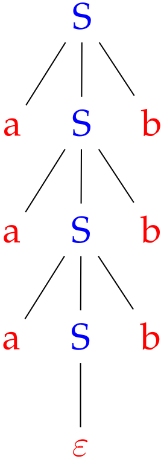


<aside>ambigui,<br>context dependent</aside>

### [~~2.3.3~~][pdf]  ~~Linguaggi naturali~~

- I **linguaggi naturali** nascondono **più ambiguità** delle grammatiche
- Le **grammatiche per linguaggi di programmazione** sono difficili da scrivere perché pensate e studiate per ottenere una **velocità di verifica** dei programmi
  - ==I **parser** per linguaggi di programmazione hanno **complessità lineare**==
- Il **linguaggio naturale** è più **complesso**
  - ==Spesso dipende dal **contesto**==
    - Inesistente nei linguaggi di programmazione


# [Cap 3][pdf]  Proprietà dei linguaggi liberi

## [3.1][pdf]  Proprietà di chiusura

<aside><div>G = (V1' ∪ V2' ∪ {S},<br>&nbsp&nbsp&nbsp&nbsp&nbsp&nbsp&nbsp T1 ∪ T2 , S,<br>&nbsp&nbsp&nbsp&nbsp&nbsp&nbsp&nbsp P1' ∪ P2' ∪<br>&nbsp&nbsp&nbsp&nbsp&nbsp&nbsp&nbsp&nbsp{S → <b>S1' | S2'</b>})</div></aside>

### ==Chiusura rispetto all’unione==

> <u>Lemma</u>  (**Chiusura rispetto all’unione**)
>
> La classe dei linguaggi liberi è chiusa rispetto all’operazione di unione d’insiemi
> $$
> {\cal L}_1\ {\rm libero}\ ∧\ {\cal L}_2\ {\rm libero}\ ⇒\ ({\cal L}_1 ∪ {\cal L}_2)\ {\rm libero}
> $$
> <u>Dimostrazione</u>
>
> Siano ${\cal L}_1$ e ${\cal L}_2$ due linguaggi liberi; ciò implica **esistano due grammatiche libere** ${\cal G}_1$ e ${\cal G}_2$, ciascuna delle quali genera uno dei due linguaggi
> $$
> ∃\ {\cal G}_1 = (V_1 , T_1 , S_1 , {\cal P}_1 ),\ {\cal G}_2 = (V_2 , T_2 , S_2 , {\cal P}_2 )\ \ |\ \ {\cal L}_1 = {\cal L}({\cal G}_1 ) \and {\cal L}_2 = {\cal L}({\cal G}_2 )
> $$
> Si costruisca una **nuova grammatica libera $\cal G$** che possa **generare l’unione** dei due linguaggi generati da ${\cal G}_1$ e ${\cal G}_2$
> $$
> {\cal G} = (V_1' ∪ V_2' ∪ \{S\},\ \ T_1 ∪ T_2 ,\ \ S,\ \ {\cal P}_1' ∪ {\cal P}_2' ∪ \{S → S_1'\ |\ S_2' \})
> $$
>
> - **$V$** :  $V_1'$ e $V_2'$ ottenuti effettuando un’operazione di **refresh sui non-terminali**
>   - In modo da **evitare collisioni** di nomi
>   - Il vocabolario è completato con l’introduzione di un **nuovo start symbol**
> - **$T$** :  **unione** dei due insiemi di terminali di ${\cal G}_1$ e ${\cal G}_2$
> - **$S$** :  **nuovo** start symbol fresh
>   - Non presente in $V_1' ∪ V_2'$
> - **$\cal P$** :  unione tra
>   - I **refresh delle produzioni** delle due grammatiche di partenza ${\cal G}_1$ e ${\cal G}_2$
>   - Una nuova produzione che, dal nuovo start symbol, produce i **resfresh** $S_1'$ e $S_2'$ degli **start symbols** delle due grammatiche di partenza
>
> Questa definizione è sufficiente per asserire
> $$
> \cal L(G)\ {\rm libero}\ \and\ \cal L(G) = L(G_{\rm 1}) ∪ L(G_{\rm 2})
> $$

- ==L'**unione** di due linguaggi liberi è anch'essa un **lingiuaggio libero**==

---

> <u>Osservazione</u>  (**Refreshing di $V$**)
>
> Il **refreshing** di $V$ agisce
>
> - Solo **sui nomi** dei caratteri
> - **Non sulla forma delle produzioni** che li interessano
>   - Rimane immutata ($A → α$)
>   - **Rispettata** anche dalle **nuove produzioni** ($S → S_1'$ e $S → S_2'$)
>     - **Non** sono introdotte produzioni che rendono $\cal G$ **context dependent**
>
> [~~Esempio (pag 24)~~][pdf]

---

> <u>Osservazione</u>  (**Validità**)
>
> Si consideri una stringa $w ∈ \cal L(G)$
>
> - Ciò è **vero** se e solo se può essere **derivata dallo start symbol**
>   $$
>   S ⇒^∗ w
>   $$
>
> - Per definizione di $\cal G$, il **secondo passo della derivazione** dev’essere il **refresh** di uno dei due **start symbol** delle grammatiche di partenza
>   $$
>   S ⇒ S_1'⇒^∗ w\ ∨\ S ⇒ S_2' ⇒^∗ w
>   $$
>
> - Questo è **valido** se e solo se $w$ può essere **derivata** da uno degli **start symbol** delle grammatiche **di partenza**
>   $$
>   S_1 ⇒^∗ w\ ∨\ S_2 ⇒^∗ w
>   $$
>
> - Ciò significa che $w$ **appartiene** a uno dei due **linguaggi** generati dalle grammatiche di **partenza**
>   $$
>   w ∈ {\cal L(G}_1 )\ ∨\ w ∈ {\cal L(G}_2 )
>   $$
>
> - Questo è equivalente ad affermare che $w$ **appartiene all’unione dei due linguaggi**
>   $$
>   w ∈ {\cal L(G}_1 ) ∪ {\cal L(G}_2)
>   $$


<aside><div>G = (V1' ∪ V2' ∪ {S},<br>&nbsp&nbsp&nbsp&nbsp&nbsp&nbsp&nbsp T1 ∪ T2 , S,<br>&nbsp&nbsp&nbsp&nbsp&nbsp&nbsp&nbsp P1' ∪ P2' ∪<br>&nbsp&nbsp&nbsp&nbsp&nbsp&nbsp&nbsp&nbsp{S → <b>S1'S2'</b>})</div></aside>

### ==Chiusura rispetto alla concatenazione==

> <u>Lemma</u>  (**Chiusura rispetto alla concatenazione**)
>
> La classe dei linguaggi liberi è chiusa rispetto all’operazione di concatenazione
> $$
> {\cal L}_1\ {\rm libero}\ ∧\ {\cal L}_2\ {\rm libero}\ ⇒\ \{w_1 w_2:w_1 ∈ {\cal L}_1\ ∧\ w_2 ∈ {\cal L}_2 \}\ {\rm libero}
> $$
> <u>Dimostrazione</u>
>
> Siano ${\cal L}_1$ e ${\cal L}_2$ due linguaggi liberi; ciò implica esistano due grammatiche libere ${\cal G}_1$ e ${\cal G}_2$, ciascuna delle quali genera uno dei due linguaggi
> $$
> ∃\ {\cal G}_1 = (V_1 , T_1 , S_1 , {\cal P}_1 ),\ {\cal G}_2 = (V_2 , T_2 , S_2 , {\cal P}_2 )\ \ |\ \ {\cal L}_1 = {\cal L}({\cal G}_1 ) \and {\cal L}_2 = {\cal L}({\cal G}_2 )
> $$
> Si consideri una nuova grammatica $\cal G$, i cui elementi sono così definiti
> $$
> {\cal G} = (V_1' ∪ V_2' ∪ \{S\},\ \ T_1 ∪ T_2 ,\ \ S,\ \ {\cal P}_1' ∪ {\cal P}_2' ∪ \{S → S_1' S_2' \})
> $$
> La definizione dei vari elementi procede pari passo a quella già vista nel lemma della chiusura rispetto all’unione
>
> L’unica differenza è la **definizione del linguaggio** $\cal L(G)$ che qui è costruito per **concatenazione** e non per unione
> $$
> {\cal L(G)}\ {\rm libero}\ \and\ {\cal L(G)} = 
> \{w_1 w_2: w_1 ∈ {\cal L(G}_1 ) ∧ w_2 ∈ {\cal L(G}_2)\}
> $$


<aside>contraddizione con pumping lemma</aside>

### ==Non chiusura rispetto all'intersezione==

> <u>Lemma</u>  (**Chiusura rispetto all'intersezione**)
>
> La classe dei linguaggi liberi *non* è chiusa rispetto all’operazione di intersezione
> $$
> {\cal L}_1\ {\rm libero}\ ∧\ {\cal L}_2\ {\rm libero}\ ⇒\ ({\cal L}_1 \cap {\cal L}_2)\ {\rm libero}
> $$
> <u>Dimostrazione</u>
>
> Per **contraddizione**, è sufficiente trovare due linguaggi liberi la cui intersezione non è libera
>
> Si considerino due linguaggi ${\cal L}_1$ e ${\cal L}_2$ , definiti come segue
> $$
> {\cal L}_1 = \{a^n b^n c^j\ |\ n, j > 0\} \\
> {\cal L}_2 = \{a^j b^n c^n\ |\ n, j > 0\}
> $$
> Il linguaggio generato dalla loro intersezione è il seguente
> $$
> {\cal L}_1 ∩ {\cal L}_2 = \{a^n b^n c^n\ |\ n > 0\}
> $$
> Questo linguaggio non è libero ([vedi Pumping lemma][# Pumping lemma])


## [3.2][pdf]  Chomsky Normal Form

<aside><div><b>def</b><br>A→ε ∈ P ⟺ A = S<br>A→α ∈ P ⟺ α = a ∨<br> &emsp;&emsp;&emsp;&emsp;&emsp;&ensp; α = BC ∧<br> &emsp;&emsp;&emsp;&emsp;&emsp;&ensp; B, C ≠ S</div></aside>

### ==Definizione ed esistenza==

> <u>Definizione</u>  (**Chomsky Normal Form**)
>
> Una grammatica libera ${\cal G} = (V,T,S,{\cal P})$ è in CNF se e solo se
>
> - Non ha alcuna $ε$-produzione
>   - Produzioni di forma $A → ε$
>   - Al massimo $S → ε$
> - Tutte le sue non $ε$-produzioni hanno una tra le due seguenti forme
>   - $A→a$
>   - $A → BC$
>     - In cui sia $B$ sia $C$ sono diversi da $S$

> <u>Lemma</u>  (**Esistenza CNF**)
> $$
> {\cal G}\ {\rm libera}\ \Rarr \ \exist\,{\cal G}'\ {\rm CNF}\; |\; \cal L(G) = L(G')
> $$


## [3.3][pdf]  Epurare le grammatiche libere

<aside><div>∄ A→ε<br>∄ A→B<br>∄ A : ∄ A→α ∈ P</div></aside>

### ==Grammatiche epurate==

> <u>Teorema</u>  (**Esistenza grammatica epurata**)
>
> Sia $\cal L$ un linguaggio libero, allora esiste una grammatica libera $\cal G$ tale che $\cal L(G) = L\setminus\{{\rm ε}\}$ e tale da *non* avere
>
> - $ε$-produzioni ($A → ε$)
> - Produzioni d’unità ($A → B$) ~~(unit production)~~
> - Non-terminali non utili
>   - Non-terminali che non appaiono mai in alcuna derivazione di qualche stringa di terminale

<u>Proprietà</u>

- Grammatiche più **sintetiche**
- Generano **linguaggi**:
  - **Equivalenti** a livello espressivo
  - Più **puliti**


<aside><b>uso</b>: eliminazione<br>dei nullable</aside>

### ==[3.3.1][pdf]  Eliminare le produzioni di parole vuote==

> **Non-terminale annullabile (nullable)**: simbolo che derivato produce $ε$ ($A : A \Rarr^∗ ε$)

> <u>Procedura</u>  (**Eliminare le $ε$-produzioni**)
>
> 1. Individuare i non-terminali annullabili
> 2. Procedere ricorsivamente
>    - <u>Base</u>:    $A → ε\ \ \Rarr \ \ A\rm\ nullable$
>    - <u>Passo</u>:  $A → Y_1 Y_2 . . . Y_n\ \and\ ∃\,Y_i{\rm\ nullable}\ \ \Rarr \ \ A\rm\ nullable$
> 3. Sostituire ogni produzione della forma $A → Y_1 Y_2 . . . Y_n$ con una famiglia di produzioni dove ogni combinazione di $Y_i$ annullabili è rimossa dal body della produzione
>    - Se tutti gli $Y_i$ sono annullabili, la stessa produzione $A → Y_1 Y_2 . . . Y_n$ diventa di forma $A → ε$ e non viene inclusa nelle produzioni finali
> 4. Eliminare ogni produzione $A → ε$

---

> ~~<u>Esempio</u>~~
>
> - ~~Grammatica iniziale~~
>   $$
>   \begin{array}{l}
>   S\ →\ ABC\ |\ abc\\
>   A\ →\ aB\ |\ ε\\
>   B\ →\ bA\ |\ C\\
>   C\ →\ ε
>   \end{array}
>   $$
>
>   - ~~$C$ è annullabile: ha solo una produzione che conduce a $ε$~~
>   - ~~$B$ è annullabile attraverso $C$~~
>   - ~~$A$ è annullabile: ha una produzione che conduce a $ε$~~
>   - ~~$S$ è annullabile attraverso $A$, $B$ e $C$~~
>   
> - ~~Con le operazioni sopra, la grammatica che che si ottiene è la seguente~~
>   $$
>   \begin{array}{l}
>   S\ →\ ABC\ |\ abc\ |\ AB\ |\ AC\ |\ BC\ |\ A\ |\ B\ |\ C\\
>   A\ →\ aB\\
>   B\ →\ bA\ |\ C
>   \end{array}
>   $$
>
>   - ~~In questa grammatica il non-terminale $C$ è non utile~~


## [3.4][pdf]  Pumping lemma per linguaggi liberi

<aside>proprietà linguaggio libero</aside>

### ==[3.4.1][pdf]  Definizione e formulazione==

> <u>Lemma</u>  (**Pumping lemma**)
>
> Sia $\cal L$ un linguaggio libero, allora
>
> - $∃\,p ∈ \N^+ :\ (∀z ∈ \cal L : |z| > p)\ .\ ∃\, u, v, w,x,y\ :\, \bigwedge$
>   - $z = uvwxy$
>   - $|vwx| ≤ p$
>   - $|vx| > 0$
>   - $∀\,i ∈ \N.uv^i wx^i y ∈ \cal L$
>
> <u>Dimostrazione</u>
>
> - Sia $\cal L$ un **linguaggio libero** che non comprende la parola vuota ($ε \not∈ \cal L$)
> - Allora esiste una **grammatica libera epurata** $\cal G$ che genera $\cal L$ ($\cal L = L(G)$)
> - Per ogni possibile **albero di derivazione**, ogni cammino dalla radice a un terminale attraversa tanti **non-terminali** quanto il valore della **lunghezza** del cammino stesso
>
> - Sia $p$ la lunghezza della **più lunga parola** derivabile con degli alberi di derivazione, tale che i suoi camini, a partire dalla radice, siano lunghi al più come il numero di non-terminali di $\cal G$
> - Sia $z ∈ \cal L$ una **parola più lunga** di $p$ ($|z| > p$)
> - Possiamo quindi essere sicuri che esiste un **albero** di derivazione per $z$ che possiede almeno un **cammino** la cui lunghezza è strettamente **maggiore** del numero di **non-terminali**, poiché $|z| > p$
>
> - Per un qualche albero di derivazione, si consideri la **più profonda coppia di occorrenze dello stesso non-terminale** lungo un qualche cammino
>   - La coppia composta dalla più lontana e dalla seconda più lontana occorrenza dalla radice di uno stesso non-terminale
>
> - Si **visualizzi** la situazione attraverso un albero di derivazione, considerando le due occorrenze di un non-terminale $A$
> - Nelle due occorrenze di $A$ sono radicati **due sottoalberi distinti**
> - La parola $z$ può quindi essere **scomposta** in **cinque sottoparole**
>
> 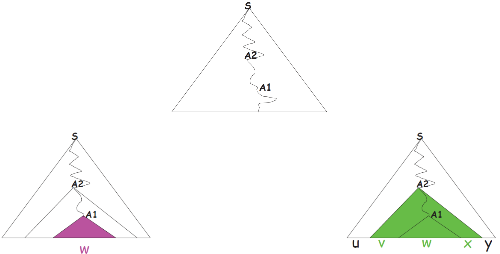
>
> - Dal momento che $A_1$ e $A_2$ sono occorrenze di uno stesso non-terminale, condividono la **medesima famiglia di produzioni**
> - Se a partire da $A_2$ esiste una **sequenza di derivazioni** che porta a $A_1$, allora con la stessa sequenza si può trovare una **nuova occorrenza** di $A$
> - Ciò rende ragionevolmente certo che sia possibile generare un **numero arbitrario di sottostringhe** $v$ e $x$ di $z$
>
> 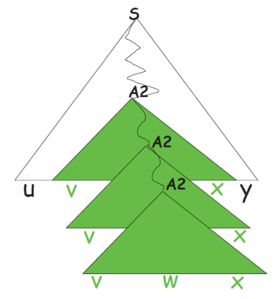
>
> - Allo stesso modo, se a partire da $A_1$ si può ottenere un sottoalbero di derivazioni $w$, esso può essere ottenuto a partire da $A_2$
>
> 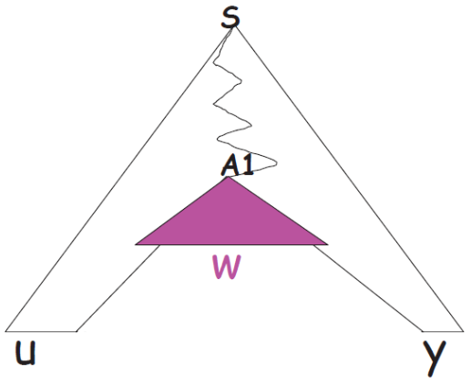
>
> Queste affermazioni possono essere riassunte nella formula
> $$
> ∀\,i ∈ \N.uv^i wx^i y ∈ \cal L
> $$
> <u>Osservazioni</u>
>
> - Per come sono state scelte le occorrenze di $A$, la profondità del sottoalbero radicato in $A_2$ è minore del numero di non-terminali presenti nella grammatica considerata
>   - Da cui $\,|vwx| ≤ p$
>
> - La grammatica $\cal G$ che genera il linguaggio considerato è ripulita, per cui nelle derivazioni di forma $A ⇒^∗ αAβ$, almeno uno dei due simboli $α$, $β$ deve fornire uno ulteriore
>   - Da cui $\,|vx| > 0$
>
> <u>Dimostrazione</u>  ($ε\in \cal L$)
>
> Siano
>
> - $\cal L$ un linguaggio tale che $ε\in\cal L$
> - ${\cal G}= (V, T, S, \cal P)$ una grammatica che generi ${\cal L} \setminus \{ε\}$
>
> Si definisca una nuova grammatica $\cal G'$, ottenuta aggiungendo a $\cal G$
>
> - Un nuovo start symbol
> - Due produzioni
>   - Una che punta verso lo start symbol di $\cal G$
>   - Una che genera $ε$
>
> $$
> {\cal G}' = (V,\, T,\, S' ,\, {\cal P} ∪ \{S' → S,\, S' → ε\})
> $$
>
> Si ha così che $\cal L = L(G')$ e si può procedere analogamente a prima


<aside><b>uso</b>: determinare se un linguaggio non è libero</aside>

### ==[3.4.2][pdf]  Applicazioni==

---

> ==<u>Utilizzo</u>  (**Pumping lemma negato**)==
>
> ==Determinare se un linguaggio $\cal L$ *non* è libero==

> **Parsing**: processo inverso della derivazione

- ~~**Algoritmi di parsing** che verificano se una parola appartiente a un linguaggio generato da una grammatica libera sono molto più **efficienti** di quelli per i linguaggi generati da grammatiche dipendenti da contesto~~

#### ==Negato del pumping lemma==

- Si pensi al lemma come un'**implicazione logica**
  $$
  H→T
  $$

  - **Ipotesi $H$**: il linguaggio $\cal L$ è **libero**
  - **Tesi $T$** (tesi del lemma): $\cal L$ avrà una **certa forma**

- Si utilizzi il **negato** dell'implicazione
  $$
  ¬(H→T)\ \ \ \equiv\ \ \ ¬T→¬H
  $$

  - Verificare il **negato della tesi** del pumping lemma per $\cal L$ implica che **$\cal L$ *non* è libero**

  $$
  ¬\,{\rm ThPL}({\cal L})\ ⇒\ ¬\,{\rm libero}({\cal L}),\,\ ∀L
  $$

- **Tesi** del pumping lemma
  $$
  \exist\,p\in\N^+.\forall z\in{\cal L}: |z|>p.\exist\,u,v,w,x,y.P\\[4px]
  \begin{array}{l}
  P\,\,\equiv P_1\and P_2\and P_3\and P_4\\[4px]
  P_1\equiv z=uvwxy\\
  P_2\equiv |vwx|\le p\\
  P_3\equiv |vx|>0\\
  P_4\equiv \forall\,i\in\N.uv^iwx^iy\in\cal L
  \end{array}
  $$

- ==**Negato della tesi** del pumping lemma==
  $$
  ∀\,p ∈ \N^+.∃\,z ∈ {\cal L}:|z| > p\ \ ⇒\\
  ⇒\ \big(\,∀\,u, v, w, x, y\ :\ (z = uvwxy\ ∧\ |vwx| ≤ p\ ∧\ |vx| > 0) \ \ ⇒\\
  ⇒\ ∃\,i ∈ \N.uv^iwx^iy \notin {\cal L}\,\big)
  $$


---

> <u>Spiegazione</u>
>
> - Siano
>   - $p$ un qualsiasi numero naturale arbitrariamente scelto
>   - $z$ una parola appartenente a $\cal L$, la cui lunghezza è maggiore di $p$
> - Si mostri che per qualsiasi decomposizione di $z$ in sottostringhe
>   - di forma $uvwxy$
>   - tali che la lunghezza
>     - delle sottostringhe $vwx$ è minore di $p$
>     - di $vx$ è non nulla
> - È possibile trovare un indice $i$ per cui la parola $z'=uv^i wx^i y$ non appartiene a $\cal L$


### [3.4.3][pdf]  Esempi di utilizzo

- ##### [Vedi dispensa][pdf]


## [3.5][pdf]  Esercizi di riepilogo

- ### [Vedi dispensa][pdf]


# [Cap 4][pdf]  Linguaggi regolari e automi

## [~~4.1~~][pdf]  ~~Introduzione~~

<aside><b>uso</b>: verificare l'appartenenza di stringhe al linguaggio</aside>

### Analisi lessicale

>**Flusso di token**: lista di stringhe corrispondenti alle parti del linguaggio identificate

> <u>Procedura</u>  (**Analisi lessicale**)
>
> - <u>Input</u>: programma
> - <u>Output</u>: flusso dei token
>
> <u>Obiettivo</u>
>
> Riconoscere se una stringa fa parte o meno del linguaggio generato da una certa grammatica

---

> <u>Esempio</u>
>
> Metodi di analisi naturale per grammatiche che generano
>
> - Parentesi: **stack**
>
> - Parole dell’alfabeto: **automa a stati finiti**
>
>   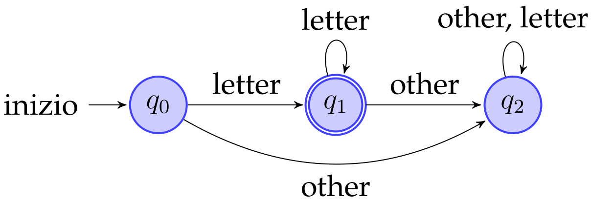


## [4.2][pdf]  Grammatiche regolari

<aside><div><b>def</b><br>libera<br>A → a<br>A → aB<br>A → ε</div></aside>

### ==Definizione==

> <u>Definizione</u>  (**Grammatica regolare**)
>
> Grammatica libera avente produzioni con body composti da
>
> - Un solo terminale ($A → a$)
> - Un terminale seguito da un non-terminale ($A → aB$)
> - Parola vuota ($A → ε$)

- ==Possono generare **espressioni regolari**==
- I **linguaggi** generati sono **riconosciuti da automi a stati finiti**
  - Sia deterministici che non deterministici


<aside><div><b>base</b><br>r = a ∈ A<br>r = ε<br><b>passo</b><br>r = r1 | r2<br>r = r1 · r2<br>r = r1*<br>r = (r1)</div></aside>

### ==[4.2.1][pdf]  Espressioni regolari==

> <u>Definizione</u>  (**Espressione regolare**)
>
> <u>Dati</u>
>
> - Alfabeto $\cal A$
> - Insieme di operatori
>
> Le espressioni regolari sono esprimibili per induzione come
>
> - <u>Base</u>
>   - Simboli dell’alfabeto scelto
>   - $ε$  (indipendentemente dall’alfabeto)
> - <u>Passo</u>: se $r_1$ e $r_2$ sono espressioni regolari allora lo sono anche
>   - $r_1\ |\ r_2$  (alternanza)
>   - $r_1 · r_2$  (concatenazione)
>   - ${r_1}^∗$       (ripetizione / Kleene star)
>   - $(r_1)$      (parentesi)

- ==**Ordine di precedenza**: Kleene Star ≺ Concatenazione ≺ Alternanza==
- ==**Associatività a sinistra**==


<aside>induzione sui linguaggi delle espressioni</aside>

### ==[4.2.2][pdf]  I linguaggi delle espressioni regolari==

> <u>Definizione</u>  (**Denotare**)
>
> Se un linguaggio può essere ricavato da un’espressione regolare, l’espressione regolare denota quel linguaggio

- ~~(Grammatiche generative → generare  ;  Espressioni regolari → denotare)~~

> <u>Definizione</u>  (**Linguaggio denotato**)
>
> Data un’espressione regolare $r$ su $\cal A$, il linguaggio ${\cal L}(r)$ denotato da $r$ è definibile tramite induzione
>
> - <u>Base</u>
>   - ${\cal L}(a) = \{a\}\,,\ \ ∀a ∈ \cal A$
>   - ${\cal L}(ε) = \{ε\}$
> - <u>Passo</u>
>   - $r = r_1\ |\ r_2\quad\Rarr \quad  {\cal L}(r) = {\cal L}(r_1 ) ∪ {\cal L}(r_2 )$
>   - $r = r_1 · r_2\quad\Rarr \quad  {\cal L}(r)= \{w_1 w_2\ |\ w_1 ∈ {\cal L}(r_1 ) ∧ w_2 ∈ {\cal L}(r_2 )\}$
>   - $r = {r_1}^∗\ \ \ \ \ \quad\Rarr\quad {\cal L}(r) =\{w_1...w_k\, |\, k ≥ 1 ∧ ∀i\in[1,k]. w_i ∈ {\cal L}(r_1 )\}\  ∪\ \{ε\}$
>   - $r=(r_1)\ \ \ \ \quad\Rarr \quad {\cal L}(r)={\cal L}(r_1)$

- [<u>Esempi</u>][pdf]


## [~~4.3~~][pdf]  ~~Automi a stati finiti~~

<aside><b>uso</b>: appartenenza di parole a linguaggi regolari</aside>

### Introduzione

---

> <u>Utilizzo</u>  (**Appartenenza a linguaggi regolari**)
>
> Verificare che una parola appartenga al linguaggio denotato da una espressione regolare

<u>Tipologie</u>

- **Deterministico**
  - Deve vagliare solo i **percorsi deterministici**
  - **Sottoinsieme** del totale
- **Non deterministico**
  - Deve vagliare **più percorsi** di derivazione rispetto alla controparte
  - Calcoli più **pesanti**


## [4.4][pdf]  Automi a stati finiti non deterministici

<aside><div><b>def</b>
N = (S, A, move<sub>n</sub>, s<sub>0</sub>, F)
move<sub>n</sub> : S×(A∪{ε})→2<sup>S</sup>
<b>non determinismo</b>
|move<sub>n</sub>(s, x)| > 1
ε-transizioni</div></aside>

### ==Definizione==

> <u>Definizione</u>  (**Automa a stati finiti non deterministico / NFA**)
>
> Automa rappresentabile con una tupla
> $$
> {\cal N}\ :=\ (S,\ {\cal A},\ {\rm move}_n ,\ s_0 ,\ F )\\[8px]
> {\rm move}_n\ :\ S × ({\cal A} ∪ \{ε\}) → 2^S
> $$
>
> - $S$  insieme di stati
> - $\cal A$  alfabeto con $ε\notin\cal A$
> - $s_0\in S$  stato iniziale
> - $F\subseteq S$  insieme degli stati finali o accettati
> - ${\rm move}_n$  funzione di transizione
>   - Da uno stato e un simbolo ($ε$ compreso), muove in un sottoinsieme di stati di $S$

==**Elementi di indeterminismo**==

- ==**$|{\rm move}_n(s, x)| > 1$**==
  - Uno stato porta a diversi stati con la **stessa $x$-transizione**
- ==**$ε$-transizioni**==
  - Passano a uno stato successivo senza produrre un carattere nella stringa
  - Inseriscono incertezza nel percorso di derivazione compiuto


<aside>Grafo diretto o tabella<br><b>def</b>: accetta/riconosce una parola se esiste un tale cammino</aside>

### [4.4.1][pdf]  Rappresentazione grafica

La tupla $\cal N$ può essere rappresentata con

- **Grafo diretto**
  - **Stati**: nodi
  - **Stato iniziale**: freccia entrante
  - **Stati finali**: doppio cerchio
  - **Funzioni di transizione**: archi
- **Descrizione tabellare**
  - Rappresenta la **funzione di transizione**

> <u>Definizione</u>  (**Accettare / Riconoscere**)
>
> Un NFA $\cal N$ accetta (o riconosce) una parola $w$ se e solo se esiste almeno un cammino dallo stato iniziale ad uno finale, che attraversi archi corrispondenti ai caratteri di $w$

---

> <u>Esempio</u>
> $$
> {\rm move}_n (S_1 , a) =\{S_2 , S_3 \}
> $$
> 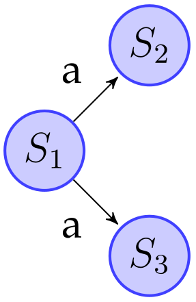

---

> <u>Esempio</u>
>
> 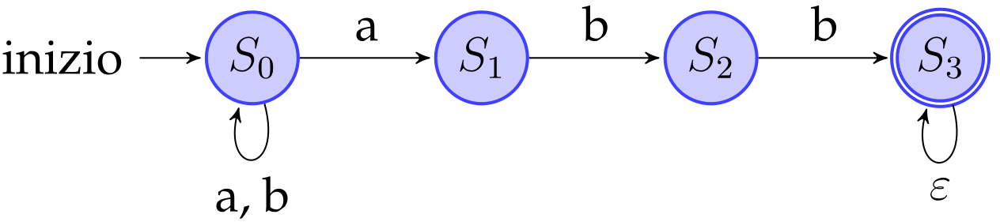
>
> - **Linguaggio accettato**: ${\cal L}((a|b)^*abb)$
> - Rappresentazione **completa**
>   - Da essa si evincono tutti gli elementi che compongono l’NFA
> - **Descrizione tabellare** delle funzioni di transizione appartenenti al NFA
>
> $$
> \begin{array}{c|cc}
> \qquad\qquad&\qquad ε\qquad &\qquad a\qquad &\qquad b\qquad \\\hline
> S_0 & Ø & \{S_0,S_1\} & \{S_0\} \\
> S_1 & Ø & Ø & \{S_2\} \\
> S_2 & Ø & Ø & \{S_2\} \\
> S_3 & \{S_3\} & Ø & Ø
> \end{array}
> $$


## [4.5][pdf]  La costruzione di Thompson

<aside><b>uso</b>: costruire automa da espressione regolare</aside>

### ==[4.5.1][pdf]  Definizione==

> <u>Definizione</u>  (**Costruzione di Thompson**)
>
> Procedura algoritmica che permette di costruire l’automa $\cal N$ che genera lo stesso linguaggio denotato da una certa espressione regolare $r$
> $$
> {\cal L(N)} = {\cal L}(r)
> $$
> <u>Definizione induttiva</u>
>
> L’espressione regolare $r$ è 
> 
> - <u>Base</u>: un simbolo $a ∈ {\cal A}\cup \{ε\}$
>   - Si assuma di avere un NFA che riconosce ${\cal L}(ε)$ e uno che riconosce ${\cal L}(a)\ ∀a ∈ \cal A$
> - <u>Passo</u>
>      - Una tra le seguenti opzioni
>         - $r_1\ |\ r_2$
>        - $r_1 · r_2$
>         - ${r_1}^∗$
>        - $(r_1)$
>       - Dati gli NFA ${\cal N}_1$ e ${\cal N}_2$ tali che ${\cal L(N}_1 ) = {\cal L}(r_1 )$ e ${\cal L(N}_2 ) = {\cal L}(r_2 )$, bisogna definire gli NFA per le quattro operazioni sopra

---

> <u>Osservazioni</u>
>
> - ==Ogni passo della costruzione introduce al **massimo due nuovi stati**==
>   - ==L’NFA generato contiene al **massimo $2^k$ stati**==
>     - $k$ è il numero di simboli e operatori nell’espressione regolare
> -  I **passi intermedi** (NFA) hanno esattamente
>   - Uno **stato iniziale**, senza archi entranti
>   - Uno **stato finale**, senza archi uscenti

- [<u>Complessità</u>](# 4.7.1  Complessità della costruzione di Thompson)

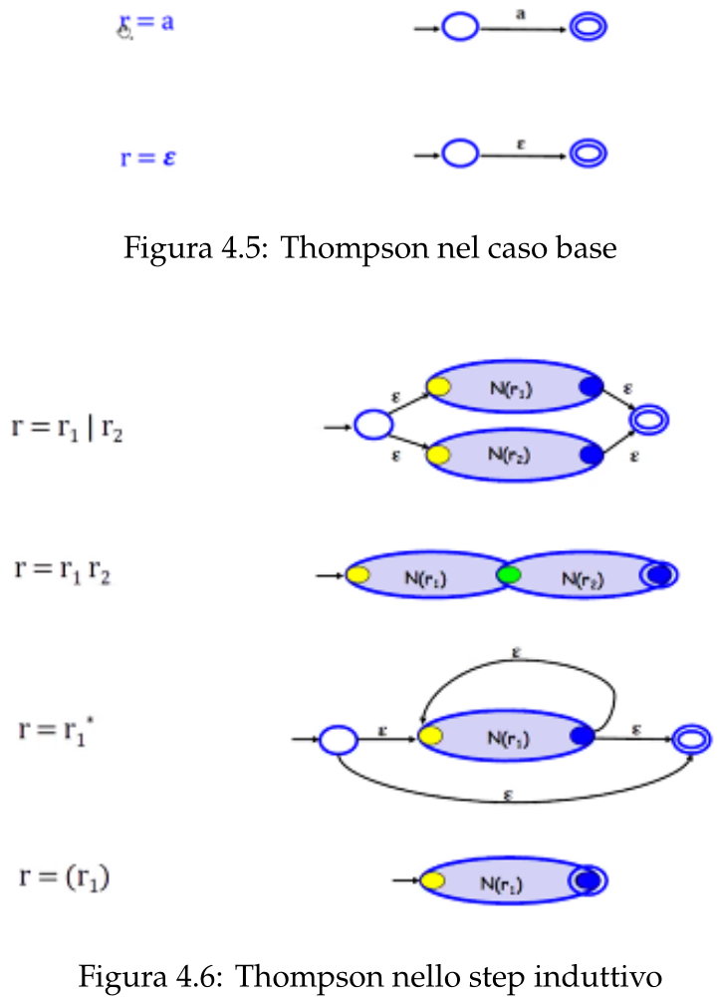


<aside>discussione del<br>passo induttivo</aside>

### [4.5.2][pdf]  Spiegazione in dettaglio

- <u>Ipotesi induttiva</u>: si hanno due NFA ${\cal N} (r_1 )$ e ${\cal N} (r_2 )$
- <u>Passo</u>: da discutere

#### Alternanza

<u>Obiettivo</u>: automa che accetti **parole di entrambi gli $\cal N$**

1. Si hanno i due **$\cal N$**, che rappresentano gli **stati intermedi**
2. Si posizionino uno sopra all’altro
3. Si crei uno **stato vuoto**, usato come **stato iniziale** per entrambi gli $\cal N$, quindi lo si colleghi a questi ultimi tramite una $ε$-transizione
4. Allo stesso modo si crei uno **stato finale** raggiungibile dai due $\cal N$ tramite una 
   $ε$-transizione

#### Concatenazione

<u>Obiettivo</u>: automa che accetti parole di ${\cal N} (r_1 )$ seguite sa parole di ${\cal N} (r_2 )$

2. Si fanno **coincidere lo stato iniziale** di ${\cal N} (r_2)$ con lo stato **finale** di ${\cal N} (r_1 )$
3. <u>Conseguenza</u>: una parola riesce ad arrivare allo **stato terminale** di ${\cal N} (r_2)$ solo se riesce a passare da **entrambi gli $\cal N$**

#### Kleene Star

<u>Obiettivo</u>: automa che accetti

- **Parola vuota $ε$**
- Tutte le parole composte dalla **ripetizione di parole** appartenenti a ${\cal L(N} (r_1))$

1. Si aggiungano a ${\cal N} (r_1 )$ due **nuovi stati, iniziale e finale**
2. Si introduca un **nuovo arco $ε$** che collega il nuovo stato iniziale al finale
3. Si implementi la **ripetizione** con altri **archi $ε$ come in figura**

#### Parentesi

L’automa non subisce **nessuna modifica**


<aside><div>risultato esatto,<br>non il migliore<br><b>limiti</b><br>2(|A| + |op|) nodi<br>4|op| archi</div></aside>

### [4.5.3][pdf]  Applicazione di Thompson

---

> <u>Esempio</u>
>
> Si analizzi la seguente espressione regolare
> $$
> r = (a\ |\ b)^∗ abb
> $$
>
> 0. Ci sono **due espressioni** che compaiono in $r$
>    $$
>    a=r_1\qquad b=r_2
>    $$
>
> 1. **Alternanza**
>
>    - L’automa per $r_3$ si ottiene applicando la costruzione di Thompson per l’alternanza ai due automi per $r_1$ e $r_2$
>
>    $$
>    a\ |\ b = r_1\ |\ r_2 = r_3
>    $$
>
> 2. **Parentesi**
>    $$
>    (a\ |\ b) = (r_3 ) = r_4
>    $$
>
> 3. **Ripetizione**
>    $$
>    (a\ |\ b)^∗ = {r_4}^∗ = r_5
>    $$
>
> 4. **Concatenazione**
>    $$
>    (a\ |\ b)^∗ a\ \ \ \ = r_5 r_1 = r_6 \\
>    (a\ |\ b)^∗ ab\ \ = r_6 r_2 = r_7 \\
>    (a\ |\ b)^∗ abb = r_7 r_2 = r_8
>    $$
>
> <u>Rappresentazione grafica</u>
>
> 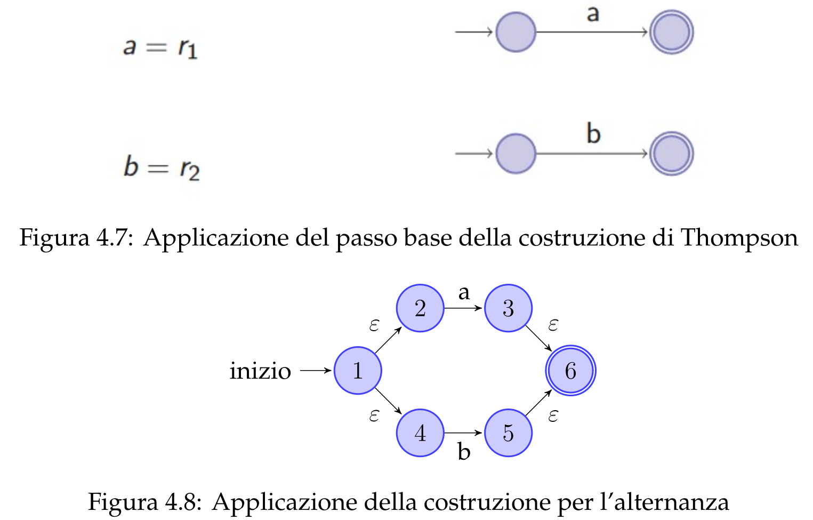
>
> 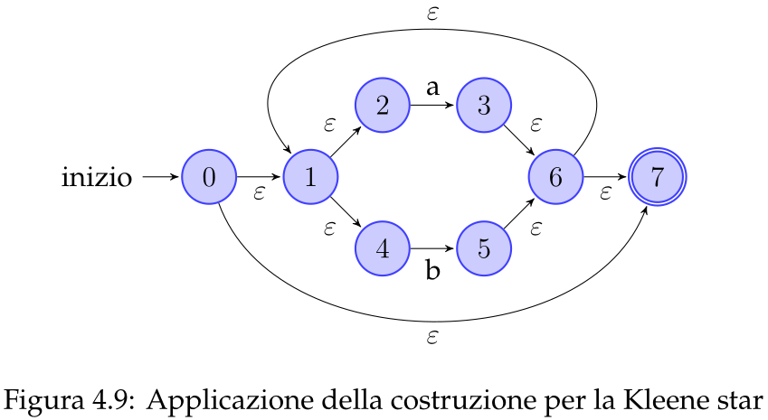
>
> 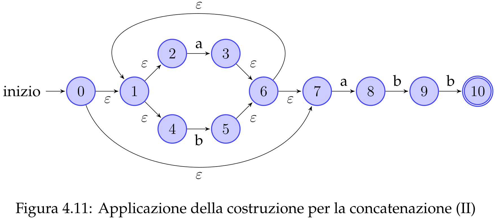

---

> <u>Osservazioni</u>: la costruzione di Thompson
>
> - Restituisce un risultato esatto
>   - *Non* è detto che sia il [risultato migliore](#4.4.1  Rappresentazione grafica)
>     - In termini di semplicità ed eleganza
>     - In questo caso è **pieno di $ε$**
> - Garantisce dei **limiti superiori** sulla complessità dell’automa che genera
>   - **Numero di nodi** limitato da $2n$
>     - **Massimo $2$ nuovi nodi** ad ogni passo
>     - Con $n$ numero di simboli (**alfabeto e operatori**) nell’espressione 
>   - **Numero di archi** limitato da $4m$
>     - **Massimo $4$ archi** ad ogni passo
>     - Con $m$ numero di **operatori** nell’espressione regolare


## [4.6][pdf]  Simulazione dell’automa

<aside>w ∈ L(N) ?</aside>

### Verificare l'appartenenza

- <u>Problema</u>: decidere se una certa **parola** $w$ fa **parte del linguaggio** di un dato $\cal N$
- <u>Soluzione</u>: utilizzare la procedura di **simulazione dell’automa**
- <u>Approccio</u>: **algoritmo formale** che operi **senza backtrack**

---

> <u>Esempio</u>
>
> - Siano $w=bbb$ e $\cal N$ definito come segue
>
>   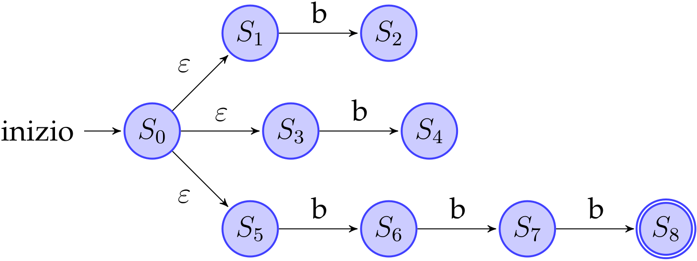
>
> - Verificare se $w\in\cal L(N)$
>
> <u>Osservazioni</u>
>
> - È **equivalente** leggere $bbb$ da qualunque degli **stati** $\{S_0 , S_1 , S_3 , S_5 \}$
>   - Si arriva a questi stati solo tramite **archi $\bold ε$**
> - È possibile semplificare tali stati in **un solo nodo**
>   - Tramite $ε$-chiusura


<aside><div>BFS/DFS<br><b>in</b>: nodo t, simbolo x<br><b>out</b>: set nodi x-ragg. da t</div></aside>

### ==[4.6.1][pdf]  $\boldsymbol ε$-chiusura di un automa==

> <u>Definizione</u>  (**${\boldsymbol x} {\rm\bold{\text{-}chiusura}}\boldsymbol{(\{t\})}$**)
>
> Siano
>
> - ${\cal N}=(S, {\cal A}, {\rm move}_n , s_0 , F )$ un NFA
> - $t$ uno stato in $S$
> - $T$ un sottoinsieme di $S$
>
> Si definisce $ε\text{-chiusura}(\{t\})$ l’insieme di stati in $S$ che sono raggiungibili da $t$ tramite zero o più $x$-transizioni
>
> <u>Definizione</u>  (**${\boldsymbol x} {\rm\bold{\text{-}chiusura}}\boldsymbol{(T)}$**)
> $$
> x\text{-chiusura}(T ) = \bigcup_{t\in T} x\text{-chiusura}(\{t\})
> $$

- <u>Nota</u>:  $t\in x\text{-chiusura}(\{t\})\ \ \forall\, t$

> <u>Algoritmo</u>  (**$\boldsymbol ε$-chiusura di un nodo**)
>
> - <u>Strutture</u>
>   1. Stack di nodi per BFS
>   2. Array booleano $\tt alreadyOn$
>      - Indica se uno stato $t$ è già sulla pila o meno
>      - Di dimensione $|S|$
>   3. Array bidimensionale che memorizza ${\rm move}_n$
>      - Ogni entry $(t, x)$ è una lista concatenata contenente tutti gli stati che sono raggiungibili con una $x$-transizione da $t$
> - <u>Procedimento</u>
>   1. Inizializzazione stack
>      1. Inserire $t$ nello stack vuoto
>      3. Segnare $t$ su $\tt alreadyOn$
>   2. BFS iterativo
>      1. Estrarre il nodo $s$ dalla cima dello stack
>      2. Cercare tutti i nodi raggiungibili da $s$ attraverso un $ε$-arco
>      3. Inserire questi nodi nello stack, se non già presenti
>      4. Segnare l'inserimento settando il flag su $\tt alreadyOn$
>   3. Ripetere il punto (2) fino allo svuotamento dello stack

```pseudocode
class Nfa:
    State s0
    Set<State> S
    Set<State> F
    Set<Symbol> A
    Set<State> move[1 ... |S|][1 ... |A ∪ {ε}|]
    
    Set<State> move_n(State t, Symbol x)
    Set ε_chiusura(Set<State> states)
    void ε_chiusura_ric(State t, Set<State> states)
    ...
```

```pseudocode
Set Nfa::ε_chiusura(Set<State> T)
    foreach t ∈ T do
        ε_chiusura_ric(t, T)
    return T

void Nfa::ε_chiusura_ric(State t, Set<State> T)
    if t ∉ T then
        T.insert(t)
        foreach u ∈ move_n(t, 'ε') do
            ε_chiusura_ric(u, T)
```

- [<u>Complessità</u>](# 4.7.2  Complessità della -chiusura)

> <u>Teorema</u>  (**${\boldsymbol ε} {\rm\bold{\text{-}chiusura}}\boldsymbol{(T)}$**)
>
> Sia ${\cal N} = (S, {\cal A}, {\rm move}_n , s_0 , F )$ un NFA e sia $T ⊆ S$
>
> Allora la $ε\text{-chiusura}(T )$ è il più piccolo insieme $X ⊆ S$ tale che $X$ è una soluzione alla seguente equazione
> $$
> X = T ∪ \{t'\ |\ t ∈ X \and t' ∈ {\rm move}_n (t, ε)\}
> $$

---

> <u>Note</u>
>
> - $X$ è $T$ unito all'insieme degli stati $ε$-raggiungibili da un qualsiasi stato di $X$
> - La formula per definire $X$ dipenda da $X$ stessa
> - Si dice il più piccolo insieme per evitare loop infiniti


<aside>ricerca in ampiezza della parola</aside>

### ==Simulazione NFA==

> <u>Algoritmo</u>  (**Simulazione NFA**)
>
> Dati un NFA $\cal N$ e una parola $w$, verificare se $\cal N$ accetta $w$ ($w\in\cal L(N)$)
>
> <u>Procedimento</u>
>
> 0. Porre inizialmente
>    - Insieme di stati $T=\{s_0\}$
>    - Simbolo $x=w.\texttt{firstsymbol()}$
> 1. Calcolare la $ε$-chiusura di $T$
> 2. Trovare l'insieme $T'$ di stati raggiungibili da ogni stato di $T$ tramite $x$-archi
> 3. Aggiornare $x$ al simbolo successivo di $w$
> 3. Ripetere (1-3) con $T=T'$ finché ~~(or)~~
>    - $T'$ non è vuoto
>      - Simulazione senza successo
>      - Non esiste nessuna $x$-transizione che parte da uno stato di $T$
>    - $w$ non è finita
>      - Simulazione con successo
>      - End-marker $\$$
>
> <u>Conclusione</u>
>
> Dato $T_f$ l'ultimo insieme generato dall'algoritmo, sono possibili due situazioni
>
> - <u>Successo</u>
>   $$
>   x=\$\ ∧\ T_f∩ F \neq {\rmØ} \quad\Rarr \quad \exist\, s_i\in T\ |\ s_i\in F\quad\Rarr \quad w\in\cal L(N)
>   $$
>
>   - La parola $w$ è stata letta interamente
>   - Esiste uno stato in $T$ che è anche uno stato finale dell’automa
>   - Quindi esiste un percorso che inizia da $s_0$, riconosce la parola $w$ e termina in uno stato finale (ammissibile)
>   
> - <u>Insuccesso</u>
>   $$
>   x≠\$\ ∨\ T_f∩ F = {\rmØ}\quad\Rarr \quad w\notin\cal L(N)
>   $$
>
>   - Non esistono percorsi che riconoscono $w$ ~~(or)~~
>   - Non esistono percorsi che riconoscono $w$ e terminano in uno stato finale

```pseudocode
Set<State> unione_move_n(Set<State> T, Symbol x, Nfa N)
    Set<State> union = new Set()
    foreach t ∈ states do
        union.insert(N.move_n(t, x))
    return union
```

 ```pseudocode
 bool simulazioneNFA(Nfa N, Word w)
     Set states = N.ε_chiusura({N.s0})
     Symbol x = w.nextChar()
     while states != ∅ and x != '$' do
         states = N.ε_chiusura(unione_move_n(states, x, N))
         x = w.nextChar()
     return (states ∩ N.F) != ∅
 ```

- [<u>Complessità</u>](# 4.7.3  Complessità della simulazione di NFA)


### [4.6.2][pdf]  Esempi di simulazione

[Vedi dispensa][pdf]


<aside>∃ m ∈ ℕ :<br>(∃! X : X = f(X))<br>∧ X = f<sup>m</sup>(ø)</aside>

### ==[4.6.4][pdf]  Teorema del punto fisso==

L’equazione del teorema sopra è istanza di una **generale equazione su insiemi** in forma **$X = f (X)$**

> <u>Proprietà</u>  (**Funzione monotona tra sottoinsiemi**)
>
> Sia $f$ una funzione monotona definita per qualche insieme finito $D$
> $$
> f\ :\ 2^D →\ 2^D \quad | \quad 
> X ⊆ Y\ ⇒\ f (X) ⊆ f (Y) \ \ \rm \small(monotonia)
> $$
> Allora esiste una tecnica di approssimazioni successive per risolvere l’equazione $X = f (X)$

> <u>Teorema</u>  (**Punto fisso**)
>
> - Sia $S$ un insieme finito e sia $f : 2^S → 2^S$ una funzione monotona
> - Allora $∃\,m ∈ \N$ tale che
>   - Esiste un’unica soluzione minima all’equazione $X = f (X)$
>   - Questa soluzione è $f^m (Ø)$
>
> <u>Dimostrazione</u>
>
> - $∃\,m ∈ \N\ \ |\ \ f^m(Ø)\ \text{ soluzione per }\ X = f (X)$
>
>   - Per definizione di $f (X)\quad\Rarr \quad Ø ⊆ f (Ø)$
>
>   - Per monotonia$\,\, $di $f (X)\quad\Rarr \quad Ø ⊆ f^2(Ø)$
>
>   - Principio di **induzione**
>     $$
>     f^i (Ø) ⊆ f^{i+1} (Ø)\,,\ ∀\,i ∈ \N
>     $$
>
>   - → Si ha così una **catena di relazioni** tra insiemi
>     $$
>     f (Ø) ⊆ f^2(Ø) ⊆ ··· ⊆ f^\infin(Ø)
>     $$
>
>   - Tale successione è infinita, ma $2^S$ è definito come **finito**
>
>   - → Gli insiemi della successione **non** possono essere **tutti diversi**
>
>   - → Esiste un **punto**, detto **di saturazione**, in cui non si osservano cambiamenti a successive applicazioni di $f (X)$
>     $$
>     \exist\,m\ \ |\ \ f^m(Ø) = f^{m+1}(Ø) = f(f^m(Ø))
>     $$
>
>   - Si può così affermare che $f^m(Ø)$ è una soluzione per $X = f (X)$
>
>
> - $f^m(Ø)$ è l’unica soluzione minima
>
>   - **Per assurdo**, si supponga che esista un’**altra soluzione** $A$ per $X = f (X)$ 
>
>   - → Per ipotesi deve valere $A = f (A)$
>
>   - → Bisognerebbe avere
>     $$
>     A = f (A) =f^2 (A) = ··· = f^m (A)
>     $$
>
>   - L’insieme **vuoto** è compreso in qualsiasi insieme ($Ø ⊆ A$) e la funzione $f$ è **monotona**, quindi $f^m (Ø) ⊆ f^m (A)$
>
>   - <u>Conclusione</u>
>     $$
>     f^m (Ø) ⊆ f^m (A)\ \and\ A = f^m(A)\quad\Rarr \quad f^m (Ø) ⊆ A
>     $$
>
>     - → $f^m (Ø)$ è una soluzione unica, ed è anche l’unica minima

- ~~Tutta la teoria che riguarda la **semantica dei linguaggi** di programmazione è basata su questo teorema~~

---

> ~~<u>Applicazione</u>  (**Funzione fattoriale**)~~ ==???==
>
> - ~~La funzione fattoriale è costituita di una sequenza di costrutti `while` tali da produrre il risultato per l’input desiderato~~
> - ~~Ogni iterazione del `while` calcola un’approssimante del risultato, che viene quindi ricostruito passo passo~~
> - ~~Anche se non si stanno aggiungendo insiemi ma valori interi, è utile per avere un’idea intuitiva di come il teorema del punto fisso sia applicato alla teoria della semantica dei linguaggi di programmazione~~


### ==Riassunto==

#### Problemi

1. <u>Problema</u>: riconoscere un **linguaggio regolare** attraverso **automi a stati finiti**
   - L’**analisi lessicale** utilizza **espressioni regolari** per **identificare gli elementi** del programma scritto
2. <u>Problema</u>: dalle **espressioni regolari**, trovare strumenti che permettono di ricevere in **input il testo del programma** e restituire in **output un flusso di tokens**, che saranno i terminali della grammatica che ha generato il linguaggio

> <u>Problema</u>  (**Verificare l'appartenenza di parole a linguaggi regolari**)
>
> - <u>Input</u>
>
>   - Una parola $w$
>
>   - Un’espressione regolare $r$
>     - Che denota il linguaggio ${\cal L}={\cal L}(r)$
>
> - <u>Obiettivo</u>
>   - Verificare **$w∈\cal L$**
> - <u>Procedura</u>
>   1. Applicare la costruzione di **Thompson** per generare un NFA che riconosce ${\cal L}={\cal L}(r)$
>   2. Eseguire l’algoritmo di **simulazione** per l’NFA generato


## [~~4.7~~][pdf]  ~~Efficienza degli algoritmi sugli NFA~~

<aside>O(|r|)</aside>

### [4.7.1][pdf]  Complessità della costruzione di Thompson

[<u>Algoritmo</u>](# 4.5  La costruzione di Thompson)

<u>Complessità</u>: **generazione di un NFA** con $n$ nodi e $m$ archi, da una espressione $r$

- Ad ogni passo si aggiungono al massimo **$2$ nodi e $4$ archi**

  $$
  n ≤ 2|r|\ \ \and\ \ m ≤ 4|r|\quad\Rarr \quad n + m = (\cal O(|r|)
  $$

- In totale **$|r|$ passi**, eseguibili in **tempo costante**
  $$
  {\cal T} ({\rm Thompson}(r)) = \cal O(|r|)
  $$


<aside>O(n + m)</aside>

### [4.7.2][pdf]  Complessità della $\boldsymbol ε$-chiusura

[<u>Algoritmo</u>](# 4.6.1  -chiusura di un automa)

---

> <u>Riassunto</u>  (**Operazioni $\boldsymbol ε$-chiusura**)
>
> 1. Inserimento del nodo $t$ nello stack
> 2. Impostazione $\texttt {alreadyOn[{\it t}\,] = true}$;
> 3. Ricerca nodo successivo $u ∈ {\rm move}_n (t, ε)$
> 4. Verifica se è già stato visitato con $\texttt{ alreadyOn[{\it u}\,]}$

<u>Costi</u>

- Ogni operazione in **tempo costante**

<u>Ripetizioni</u>

- **Operazioni 1--2**
  - Ripetute a ogni chiamata della procedura
  - Non più di una volta per ogni nodo
  - <u>Costo</u>:  $\cal O(n)$
- **Operazioni 3--4**
  - Eseguite per ogni nodo raggiungibile con una $ε$-transizione
  - <u>Caso pessimo</u>: ogni stato possiede almeno una $ε$-transizione
  - <u>Costo</u>:  $\cal O(m)$
- <u>Costo totale</u>:  **$\cal O(n + m)$**


<aside>O(|w||r|)</aside>

### [4.7.3][pdf]  Complessità della simulazione di NFA

[<u>Algoritmo</u>](# Simulazione NFA)

- <u>Iterazione</u> (ciclo $\tt while$)
  
  - **Aggiornamento del set** $\tt states$
    
    1. Iterazione sul set
    2. Aggiunta dei nuovi stati
    3. Copia aggiornata
    
    - <u>Costo</u>:  $\cal O(n)$ limitato dal numero di **nodi dell’NFA**
    
  - <u>Costo iterazione</u>:  **$\cal O(n + m)$**
- <u>Ripetizioni</u>: una per ogni elemento della **parola $w$**
  
  - <u>Costo complessivo</u>:  **$\cal O(|w|(n + m))$**
- L'NFA è stato generato da una **costruzione di Thompson**
  - $n + m = \cal O(|r|)$
  - <u>Costo complessivo</u>:  **$O(|w||r|)$**

---

> <u>Osservazione</u>
>
> Il costo è più **basso** rispetto al **backtrack**
>
> - È un modello **non deterministico**


## [4.8][pdf]  Automa a stati finiti deterministico

<aside><div><b>def</b>
D = (S, A, move<sub>d</sub>, s<sub>0</sub>, F)
move<sub>d</sub> : S × A → S<br>totale: ∀s,a, ∃move<sub>d</sub>(s,a)<br>parziale: ∃(s,a)|∄move<sub>d</sub>(s,a)</div></aside>
### ==Definizione==

> <u>Definizione</u>  (**Automa a stati finiti deterministico / DFA**)
>
> Automa rappresentabile con una tupla
>
> $$
> {\cal D}\ :=\ (S,\ {\cal A},\ {\rm move}_d ,\ s_0 ,\ F )\\[20px]
> {\rm move}_d\ :\ S × {\cal A} → S
> $$

==**Differenza** con NFA: funzione di transizione **${\rm move}_d$**==

- ==Il dominio **esclude** la possibilità di **$\boldsymbol ε$-transizioni**==
- Essa può presentarsi in **due modi**
  - ==**Totale**: per ogni stato c’è **esattamente** una $a$-transizione $∀a ∈ A$==
  - ==**Parziale**: per ogni stato c’è **al più** una $a$-transizione $∀a ∈ A$==
    - Per alcune coppie del dominio ($(s, a) ∈ S × \cal A$) la funzione non è definita
  - Determinano la scelta delle **procedure**


<aside><div>L(D) = {w | ∃move<sub>d</sub>(s<sub>i</sub>,a<sub>i</sub>) :<br>s<sub>1</sub>=s<sub>0</sub> ∧ move<sub>d</sub>(s<sub>k</sub>,a<sub>k</sub>)∈F}<br>∪ {ε ⟺ s<sub>0</sub>∈F}</div></aside>

### ==[4.8.1][pdf]  Linguaggi rionosciuti dai DFA==

> <u>Definizione</u>  (**Linguaggi rionosciuti dai DFA**)
>
> Dato un certo DFA ${\cal D} = (S, {\cal A}, {\rm move}_d, s_0, F)$, il linguaggio $\cal L(D)$ da esso riconosciuto è l’insieme di parole $w$ tale che ~~(xor)~~
>
> - Esiste un cammino $w = a_1 . . . a_k $, con $k ≥ 1$, che vada dallo stato iniziale $s_0$ a un qualche stato finale in $F$
>   $$
>   \begin{align}
>   {\cal L(D)} = \{\ &w=a_1...a_k\ |\ k≥1\ ∧\\&
>   ∀i∈[1,k]\ \ ∃\,{\rm move}_d(t_i,a_i)\ :\\&
>   t_1=s_0∧{\rm move}_d(t_k,a_k)∈F\ \}
>   \end{align}
>   $$
>
> - $s_0 ∈ F \and w = ε$

- ==Il caso in cui lo **stato di partenza è uno stato finale** è l’unico caso in cui un DFA riconosce la **parola vuota**==


<aside>w∈L(D) ⟺<br>∃ s<sub>0</sub>~a<sub>1</sub>~...~a<sub>k</sub>~f, f∈F</aside>

### ==[4.8.2][pdf]  Simulazione DFA==

#### Transizione totale

> <u>Procedura</u>  (**Simulazione DFA totale**)
>
> Determinare l'appartenenza di una parola $w$ al linguaggio $\cal L(D)$
>
> 1. Si parte dallo stato iniziale $s_0$
> 2. Seguire il cammino dato dagli elementi di $w$
> 3. Se esso termina in uno stato finale $F $, $w$ appartiene a $\cal L(D)$, altrimenti no
>
> <u>Complessità</u>:  $\cal O(|w|)$

- ==Per **ogni simbolo** esiste sempre un arco che lo **collega a uno stato** nel grafo==

#### Transizione parziale

> <u>Procedura</u>  (**Simulazione DFA parziale**)
>
> 1. Si parte dallo stato iniziale $s_0$
> 2. Seguire il cammino dato dagli elementi di $w$
> 3. Se si legge
>    - Un simbolo $a$ per cui non c’è una $a$-transizione dallo stato attuale, si ritorna una risposta negativa
>    - Tutta la parola e si raggiunge uno stato finale, $w$ appartiene al linguaggio
>
> <u>Complessità</u>:  $\cal O(|w|)$

- ==C'è la possibilità di arrivare a uno **stato** in cui **non** è più possibile **proseguire**==


<aside>da parziale a totale,<br>sink per transizioni<br>non definite</aside>

### ==[4.8.4][pdf]  Da DFA parziale a DFA totale==

> <u>Problema</u>  (**DFA da parziale a totale -- Sink**)
>
> Dato un DFA $\cal D$ con funzione di transizione parziale, definire un DFA $\cal D'$ che abbia funzione di transizione totale e che riconosca esattamente lo stesso linguaggio $\cal L(D') = L(D)$
>
> <u>Soluzione</u>
>
> Si utilizza un sink (dead state, trappola)
>
> 1. Si crea un nuovo stato $s$ non finale
> 2. Si aggiunge $s$ agli stati di $\cal D$  ($S'=S\cup \{s\}$)
> 3. $s$ diventa la destinazione delle transizioni non definite dalla funzione di transizione
> 4. Si aggiunge al sink un self loop su $a$, per ogni simbolo $a$ dell’alfabeto

---

> <u>Funzionamento</u>  (**Sink**)
>
> 1. Le situazioni nelle quali non si sarebbe potuto proseguire portano nel sink
> 2. La parola è esaurita in uno stato non terminale
> 3. Ritorna un risultato coerente al linguaggio considerato

- In generale si **preferisce** lavorare con
  - DFA con funzione di transizione **parziale**
  - Meglio, con ==automi con il **minor numero di stati** (nodi e archi) possibile==
- ==L’**algoritmo di minimizzazione** funziona solo con DFA **totali**==
  - Utilizza la **funzione di transizione inversa**, non definita se parziale


# [Cap 5][pdf]  Automi a stati finiti

## [5.1][pdf]  Traduzione da NFA a DFA

<aside>aggiunge a-transizioni alle ε-chiusure<br>delle a-chiusure</aside>

<aside></aside>

### ==[5.1.1][pdf]  Algoritmo di Subset Costruction==

> <u>Problema</u>  (**Da NFA a DFA -- Subset Construction**)
>
> Dato un NFA, ricavare un DFA che riconosca lo stesso linguaggio
>
> <u>Soluzione</u>
>
> Eliminare  le $ε$-transizioni per ottenere un insieme ${\rm move}_d$ di transizioni deterministiche
>
> <u>Idea</u>
>
> Utilizzare la $ε$-chiusura per mappare
>
> 1. Sottoinsiemi degli stati del dato NFA (stati non deterministici, snd)
> 2. In stati per il nuovo DFA (stati deterministici, sd)

> <u>Algoritmo</u>  (**Subset construction**)
>
> - <u>Input</u>:     NFA  ${\cal N} := (S, {\cal A}, {\rm move}_n , s_0 , F )$
> - <u>Output</u>:  DFA  ${\cal D}\ := (T, {\cal A}, {\rm move}_d , t_0 , E )$
>
> <u>Procedimento</u>
>
> 1. <u>Preambolo</u>
>    
>    1. Calcolare la $ε$-chiusura $R$ dello stato iniziale $s_0$ di $\cal N$
>    3. Inserire $R$ nell'insieme $T$ e segnarlo $\tt unmarked$
>    3. Assegnare $R$ allo stato iniziale di $\cal D$  ($t_0 = \{R\}$)
>    
> 2. <u>Foreach interno</u>: $∀\, Q\ {\tt unmarked}∈T$, iterare sugli elementi $a$ dell’alfabeto $\cal A$
>
>    1. Inserire nello stato $U$ (sd) gli stati (snd) $a$-raggiungibili dagli stati (snd) che compongono lo stato $Q$ (sd)
>       $$
>       U=\bigcup_{s∈Q} {\rm move}_n (s, a)
>       $$
>
>    2. Calcolare la $ε$-chiusura di $U$ e salvarla in $R'$ ($R'=ε\text{-chiusura}(U)$)
>
>    3. Verificare se $R'$ è vuoto
>
>       - Se sì, iterazione terminata
>       - Se no
>         1. Aggiungere all’insieme delle transizioni (deterministiche) ${\rm move}_d$ la nuova transizione ${\rm move}_d (Q, a) = \{R'\}$ 
>         2. Se $\{R'\}$ non è presente in $T$, aggiungerlo e segnarlo $\tt unmarked$
>         3. Aggiornare $R$  ($R=R'$)
>
> 4. <u>Foreach finale</u>: definire quali stati (sd) $Q∈T$ sono finali per $\cal D$
>
>    - Uno stato (sd) $Q ∈ T$ è uno stato finale per $\cal D$ se $Q ∩ F≠\rm Ø$
>      - $Q$ contiene almeno uno stato (snd) finale di $F$
>
> <u>Complessità</u>: NFA con $n$ stati e $m$ archi, DFA con $n_d$ stati
>
> - $\tt \#while$:                   $n_d$ volte
> - $n_d$:                           $\,{\cal O}(2^n)$
> - $\tt \#foreach$:              $\,|\cal A|$ volte
> - Costo $ε$-chiusura:    $\cal O(n + m)$
>
> <u>Complessità globale</u>:    $\cal O(n_d |A| (n + m))$

- La creazione del DFA viene effettuata **una tantum** solamente in sede di **creazione del compilatore**
- **Spesa iniziale** che garantisce **vantaggi** negli utilizzi successivi
- Per applicazioni con **tempo** di vita **limitato non** ha senso creare il DFA
  - Non si avrebbe il tempo di **compensare la spesa iniziale**

```pseudocode
Dfa subsetConstruction(Nfa N)
    Dfa D = new Dfa()  /* typeof(Dfa::T) == Set<Set<State>> */
    Set<State> R = N.ε_chiusura({N.s0})
    D.t0 = R
    unmark(D.t0)
    while ∃ Q ∈ D.T : is_unmarked(Q) do
        mark(Q)
        foreach a ∈ N.A do
            Set<State> R1 = N.ε_chiusura(∪_{s∈Q}(N.move_n(s, a)))
            if R1 != ∅ then
                D.move_d(Q, a) = R1
                if R1 ∉ D.T then
                    D.T.insert(R1)
                    unmark(R1)
            R = R1
    foreach Q ∈ D.T do
        if Q ∩ N.F != {} then
            D.E.insert(Q)
    return D
```


### [5.1.2][pdf]  Esercizi Subset Construction

- ==[Dispensa][pdf]==


## [5.2][pdf]  Minimizzazione di DFA

<aside>DFA con numero di stati minimo</aside>

### ==DFA minimo==

<u>Obiettivo</u>: trovare il DFA $\cal D'$ minimo

> <u>Definizione</u>  (**DFA minimo**)
>
> Il DFA $\cal D'$ minimo di $\cal D$ è il DFA con il minimo numero di stati tale che $\cal L(D') = L(D)$

---

> <u>Idea</u>  (**Algoritmo di minimizzazione**)
>
> - Alcuni stati sono ridondanti
> - Possono essere rimossi senza perdere informazione
>   - Non modificano il linguaggio riconosciuto dal DFA
> - Per eliminarli si utilizza la procedura di partition refinement


<aside>stessi simboli per raggiungere F</aside>

### ==[5.2.1][pdf]  State equivalence==

> <u>Definizione</u>  (**State equivalence**)
>
> Sia ${\cal D} = (S, {\cal A}, {\rm move}_d, s_0, F)$ un DFA con funzione di transizione totale
>
> Allora due stati $s, t ∈ S$ si dicono equivalenti se e solo
> $$
> {\rm move}_d^∗ (s, x) ∈ F\ ⟺\ {\rm move}_d^∗ (t, x) ∈ F\,,\ \ \ ∀x ∈ \cal A^∗
> $$

- Stati che portano a uno **stato finale** attraverso cammini con **stessi simboli**

> <u>Definizione</u>  (**Funzione multi-passo**)
>
> Funzione ${\rm move}_d^∗$ per induzione sulla lunghezza della stringa considerata
> $$
> {\rm move}_d^*\ :\ S × ({\cal A}^* ∪ \{ε\})\ →\ S
> $$
>
> - <u>Base</u>
>   $$
>   {\rm move}_d^∗ (s, ε) = s
>   $$
>
> - <u>Step</u>
>   $$
>   {\rm move}_d^∗ (s, wa) = {\rm move}_d ({\rm move}_d^∗ (s, w), a)
>   $$


<aside>un blocco per ogni set di stati equivalenti</aside>

### ==[5.2.2][pdf]  Partition refinement==

> **Blocchi**: sottinsiemi disgiunti di stati

> <u>Algoritmo</u>  (**Partition refinement**)
>
> Procedura per partizionare gli stati in blocchi
>
> 1. Si parta con 2 blocchi generici, $B_1 = F$ e $B_2 = S \setminus F$ 
>
>    - Evita che i due blocchi abbiano stati equivalenti
>
>    $$
>    {\rm move}_d^∗ (s, ε) ∈ F \ \and\  {\rm move}_d^∗ (t, ε) \notin F\,,\ \ \ \forall s ∈ B_1,\, t ∈ B_2
>    $$
>
> 2. Controllare se un blocco ha stati *non* equivalenti
>
>    - Se sì, dividere gli stati non equivalenti in blocchi distinti
>
>      - Il blocco $B_i$ può essere partizionato se contiene stati non equivalenti
>
>        $\exist\, s, t ∈ B_i,\ \exist B_j\ \ |\ \ {\rm move}_d (s, a) ∈ B_j\ \and\ {\rm move}_d (t, a) \notin B_j$
>      
>      - Se tutti gli stati del blocco $B_i$ sono equivalenti, allora ciascuna delle loro $a$-transizioni ha target nel blocco $B_j$
>
>         $∀\,s,t∈B_i,\ s\equiv t \ \ \Rarr \ \ ∀u∈ B_i,\,∀a∈ A,\ \ {\rm move}_d(u,a)∈ B_j$
>        
>        - La partizione di un blocco $B_i$ rispetto a $(a, B_j )$ consiste nel sostituire $B_i$ con due nuovi blocchi
>        
>           - $B_i'\, = \{s ∈ B_i\ |\ {\rm move}_d (s, a) ∈ B_j \}$
>            - $B_i'' = \{s ∈ B_i\ |\ {\rm move}_d (s, a) \notin B_j \}$
>      
>    - Se no, proseguire l'analisi di altri blocchi
>
> 3. Ripetere il punto (2) fino a quando non vi sono più blocchi con stati non equivalenti

- Partiziona un insieme di stati in **blocchi** contenenti solo **stati equivalenti**
- Gli stati di **ogni blocco** possono essere condensati in un **singolo stato**

```pseudocode
bool partitionable(Set<States> Bi, Set<States> Bj, Symbol a, Dfa D)
    return ∃ s,t ∈ Bi | D.move_d(s,a) ∈ Bj and  D.move_d(t,a) ∉ Bj

Set<Set<States>>  partitionRefinement(Dfa D)
    Set<States> B1 = F
    Set<States> B2 = S \ F
    Set<Set<States>> P = {B1, B2}
    while ∃ Bi, Bj ∈ P | partitionable(Bi, Bj, a) do
        P.remove(Bi)
        P.insert({s ∈ Bi | D.move_d(s, a) ∈ Bj})
        P.insert({s ∈ Bi | D.move_d(s, a) ∉ Bj})
    return P
```


### [5.2.3][pdf]  Esercizi sulla minimizzazione DFA

==[Dispensa][pdf]==


<aside>∀n∈ℕ<sup>+</sup>, ∃N : |N| = n+1<br>⇒ |D=min(N)| = 2<sup>n</sup></aside>

### [5.2.4][pdf]  Dimensione di un DFA

> <u>Lemma</u>  (**Limite inferiore alla dimensione di un DFA**)
>
> Per ogni $n ∈ \N^+$ esiste un NFA con $n + 1$ stati il cui DFA minimo equivalente ha almeno $2^n$ stati
>
> <u>Dimostrazione</u>
>
> Si prenda ad esempio il linguaggio
> $$
> \cal L = L((a\ |\ b)^∗ a(a\ |\ b)^{n−1} )
> $$
>
> - Dato che è un linguaggio regolare, può essere rappresentato utilizzando un automa a stati finiti
>
> - Esiste un NFA con esattamente $n + 1$ stati che accetta il linguaggio $\cal L$
>
>   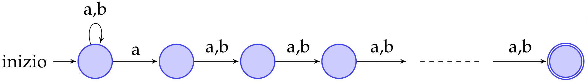
>
> Si supponga per assurdo che esista un DFA minimo $\cal D$ che accetti il linguaggio $\cal L$ e abbia $k < 2^n$ stati
>
> 1. → Esistono $2^n$ parole distinte su $\{a, b\}$ la cui lunghezza è $n$
>
> 2. → Esistono $2$ percorsi in $\cal D$ tali che: 
>
>    - La loro lunghezza è $n$ 
>    - Compongono rispettivamente le parole $w_1$ e $w_2$ , con $w_1 \neq w_2$
>    - Condividono almeno un arco
>
>    Altrimenti i nodi sarebbero come minimo $2^n$
>
> 3. → Per qualche $x_1$, $x_2$ e $x$ vale ~~(xor)~~ 
>
>    1. $w_1 = x_1 ax \ \and\ w_2 = x_2 bx $
>    2. $w_1 = x_1bx \ \and\ w_2 = x_2 ax$
>
>    Altrimenti le due parole sarebbero uguali
>
> Si supponga che sia valida la condizione (1)
>
> 1. → È possibile definire $w_1'$ come
>    $$
>    w_1' = x_1 ab^{n−1} ∈ \cal L(D)
>    $$
>
> 2. → Lo stato nuovamente aggiunto da $w_1'$ in $\cal D$ è uno stato finale
>
> 3. <u>Contraddizione</u>: lo stato non può essere finale, perché può essere raggiunto anche tramite $x_2 bb^{n−1}$, ma $x_2 bb^{n−1} \notin \cal L(D)$

- Un DFA necessita di **tutti i possibili cammini** che siano composti da $n − 1$ alternanze di $a$ e di $b$ per esprimere lo stesso linguaggio espresso dall’NFA
- Offre una **stima per il numero minimo di stati** di un DFA che rappresenta un certo altro NFA


## [5.3][pdf]  Pumping Lemma per linguaggi regolari

<aside>dimostrare linguaggio non regolare</aside>

### ==[5.3.1][pdf]  Formulazione==

> <u>Lemma</u>  (**Pumping lemma per linguaggi regolari**)
>
> Sia $\cal L$ un linguaggio regolare, allora
> - $∃\,p ∈ \N^+ :\ (∀z ∈ \cal L : |z| > p)\ .\ ∃\, u, v, w\ :\, \bigwedge$
>   - $z = uvw$
>   - $|uv| ≤ p$
>   - $|v| > 0$
>   - $∀i ∈ \N . uv^i w ∈\cal L$
>
> <u>Dimostrazione</u>
>
> - $\cal L$ è regolare, quindi esiste ${\cal D} = (S, {\cal A}, {\rm move}_d, s_0, F)$ tale per cui $\cal L = L(D)$
> - Si fissi $p = |S| − 1$
> - Tutti i cammini che partono da $s_0$ ed arrivano ad uno stato finale passando per ogni stato al massimo una volta, hanno lunghezza limitata da $p$
>   - Una parola $z$ con $|z| > p$ può essere scomposta in $z = a_1 . . . a_p z'$ 
>   - Almeno uno stato $s^∗$ è attraversato più di una volta lungo $a_1 . . . a_p$
>   - Esiste un ciclo in $\cal D$ che contiene $s^∗$
>     - Indicato come $a_{i+1} . . . a_j$, con $i < j ≤ p$
> - Si definiscano $u$, $v$ e $w$
>   - $u = a_1 . . . a_i$
>   - $v = a_{i+1} . . . a_j$
>     - $v$ rappresenta il ciclo
>   - $w=\begin{cases}z' & j = p  \\ a_{j+1} . . . a_pz' & j < p\end{cases}$
> - <u>Conclusione</u>
>   - $|uv| ≤ p\ ∧\ |v|≥1$
>     - Per definizione un ciclo ha almeno un nodo
>   - Il ciclo $v$ è ripetibile (pumping) un numero indefinito di volte
>     - Garanzia che $uv^i w$ sia accettato da $\cal D$ per ogni valore $i ∈ \N$

---

> <u>Utilizzo</u>  (**Pumping regolare**)
>
> Dimostrare, per contraddizione, che un linguaggio *non* è regolare
>
> - Si assume che un dato linguaggio $\cal L$ sia regolare
> - Si provi a dimostrare che per quel linguaggio la tesi non è soddisfatta
>   - Il negato della tesi è soddisfatto
> - Se sì, $\cal L$ *non* è un linguaggio regolare
>
> <u>Tesi</u>
> $$
> ∃\,p ∈ \N^+ . ∀z ∈{\cal L} : |z| > p\,. ∃\, u, v, w. P \\[12px]
> \begin{align}
> P\ ≡\ (\ &z = uvw\ \ \and\\& |uv| ≤ p\ \ \and\\& |v| > 0\ \ \and\\& ∀i ∈ N. uv^i w ∈ L\ ) 
> \end{align}
> $$
> <u>Negato</u>
> $$
> ∀p ∈ \N^+ . ∃\,z ∈ {\cal L} : |z| > p\,. ∀ u, v, w. Q\\[12px]
> \begin{align}
> Q ≡\ (\ &z = uvw\ \ \and\\& |uv| ≤ p\ \ \and\\& |v| > 0)\ \ \Rarr
> \end{align}\\[12px]
> \Rarr(∃i ∈ \N. uv^i w \notin L)
> $$


### [5.3.2][pdf]  Esempio

---

> <u>Esempio</u>
> $$
> {\cal L} = \{a^n b^n\ |\ n > 0\}\ \text{ non è regolare}
> $$
> <u>Intuizione</u>
>
> Se $\cal L$ fosse regolare sarebbe rappresentabile con un NFA e con un DFA
>
> Si ipotizzi il DFA che riconosca $\cal L$
>
> - Per bilanciare il numero di $b$ e di $a$ dovrebbe in qualche modo obbligare l’inserimento di una $b$ per ogni $a$ inserita in precedenza
> - Non è fattibile, a meno di inserire infiniti stati
> - Impossibile in un DFA
>
> <u>Dimostrazione</u> tramite pumping lemma
>
> - Si supponga $\cal L$ regolare
>
> - Si prenda $p$ intero positivo arbitrario
>
>   - Il negato della tesi deve valere per ogni $p$
>
> - Si costruisca la parola $z = a^p b^p$  ($|z| > p$)
>
> - Per ogni decomposizione di $z$ in $u$, $v$, $w$ che rispetta i vincoli
>   $$
>   ∀\, u, v, w . (z = uvw\ \and\ |uv| ≤ p\ \and\ |v| > 0)
>   $$
>   La componente $v$
>
>   - Contiene almeno una $a$ ($|v| > 0$)
>   - Deve contenere solamente $a$ ($|uv| ≤ p$)
>
> - Si definisca $j > 0\ |\ uv^2 w = a^p a^j b^p$
>
>   - Allora $uv^2 w \notin\cal L$
>   - <u>Contraddizione</u>


### [5.3.3][pdf]  Esercizi sul riconoscimento di linguaggi regolari

- ==[Dispensa][pdf]==


## [5.4][pdf]  Proprietà di chiusura nei linguaggi regolari

<aside>{w | w ∉ L}</aside>

### ==Complementazione==

> <u>Definizione</u>  (**Complementazione**)
>
> Dato un linguaggio regolare $\cal L$ su un certo alfabeto $\cal A$, la complementazione è data dal linguaggio delle parole su $\cal A^* \setminus L$

><u>Procedura</u>  (**Complementazione**)
>
>Per trasformare un DFA con funzione di transizione totale nel suo complementare è sufficiente rendere finali tutti gli stati che prima non lo erano e, simmetricamente, non finali tutti quelli che prima lo erano


<aside>unione,
concatenazione,
complementazione,
intersezione</aside>
### ==Proprietà di chiusura==

I linguaggi regolari sono chiusi rispetto alle seguenti operazioni

- **Unione**
- **Concatenazione** 
- **Complementazione**
- **Intersezione**


#### Unione

<u>Proprietà</u>: l'unione di due linguaggi regolari è un linguaggio regolare

- È possibile costruire un **DFA per entrambi** i linguaggi
- Si **legano** due automi così costruiti  tramite una **$\boldsymbol ε$-transizione**
- Per l’operazione di **alternanza** si ottiene nuovamente un linguaggio regolare


#### Concatenazione

<u>Proprietà</u>: la concatenazione di due linguaggi regolari è un linguaggio regolare

- Si esegue l’operazione di concatenazione della **costruzione di Thompson** 
- Si ottiene un’automa che denota un linguaggio regolare


#### Complementazione

<u>Proprietà</u>: se un linguaggio è regolare allora anche il suo complemento è regolare

- Funziona solo con DFA con funzione di **transizione totale**
  - Se mancasse una $a$-transizione nel primo DFA, non si avrebbe la possibilità di costruire il set completo delle parole
- Tutte le parole che non appartengono al linguaggio regolare appartengono al linguaggio del DFA complementare

---

> <u>Esempio</u>
>
> - Sia dato l’automa $\cal P$ che riconosce il linguaggio $\cal L$, costituito dalle parole dove $a$ occorre un numero pari di volte
> - Il suo complementare $\cal D$ corrisponde all'automa per cui si hanno parole con un numero dispari di occorrenze


#### Intersezione

Derivabile dall’**unione** utilizzando le regole di **De Morgan**
$$
{\cal L}_1 ∩ {\cal L}_2 = ¬(¬({\cal L}_1 ∩ {\cal L}_2)) = ¬(¬{\cal L}_1 ∪ ¬{\cal L}_2 )
$$
Grazie alla chiusura per unione e complementazione vale anche la chiusura per intersezione


---


# 

[root]: ../LFC/
[pdf]: ../LFC/Dispensa-LFC-v1.0.0.pdf

