# LFC

|      |          |                                                              |
| ---- | :------: | -----------------------------------------------------------: |
| LFC  | Parte II | [ ][root][][pdf] |

[TOC]


---

# [Parte II][pdf] <br>Il processo di compilazione

# [Cap 6][pdf]  Analisi lessicale

## [6.1][pdf]  Rimandi all’analisi lessicale

<aside style='text-align: left; width: auto;'><b>Lessema</b>: unità lessicale<br><b>Token</b>: nome-valore<br>(tipologia-lessema)<br><b>Pattern</b>: forma del lessema</aside>

> <u>Definizione</u>  (**Lessema**)
>
> Sequenza di caratteri nel codice sorgente, che costituisce l'unità lessicale corrispondente al pattern di un token

> <u>Definizione</u>  (**Token**)
>
> Coppia composta da un nome e da un valore opzionale
>
> - **Nome**: simbolo astratto che rappresenta una tipologia di elemento lessicale
> - **Valore**: tipicamente un lessema

- ==**Categoria astratta** di cui un lessema è istanza==
- ==**Terminali** della grammatica che genera il linguaggio di programmazione==
- **Tipi di elementi lessicali**: keyword, identificatori, costanti ecc.

> <u>Definizione</u>  (**Pattern**)
>
> Descrizione della forma che un lessema deve avere

- **Ciascuna categoria** sintattica è denotata da un’**espressione regolare**

---

> <u>Esempi</u>
>
> | Token        | Descrizione                                     | Lessemi                   |
> | ------------ | ----------------------------------------------- | ------------------------- |
> | `if`         | Caratteri `i`, `f`                              | `if`                      |
> | `else`       | Caratteri `e`, `l`, `s`, `e`                    | `else`                    |
> | `comparison` | `<`  |  `>`  |  `<=`  |  `>=`  |  `==`  |  `!=` | `<=`, `!=`                |
> | `id`         | Lettera seguita da lettere o numeri             | `pi`, `score`, `D2`       |
> | `number`     | Qualsiasi costante numerica                     | `3.14159`, `0`, `6.02e23` |
> | `literal`    | Caratteri racchiusi da `"`, tranne `"`          | `"core dumped"`           |


### [~~6.1.2~~][pdf]  ~~Classi di tokens~~

- **Scelte ricorrenti** di tokens fra grammatiche (linguaggi) differenti

  - **Keyword**
    - Nome di base già presente nel linguaggio
    - ~~e.g.~~ `if`, `while`, `for` ecc.
  - **Operatore** (classe di operatori)
    - ~~e.g.~~ `+`, `++` ecc.
  - **Identificatore**
    - Unico tipo valido per tutte le variabili

  - **Simbolo di punteggiatura**

- Ogni **lessema** riceve il suo **proprio ed unico token**


<aside>Da lessemi a tokens mediante patterns</aside>

### Analizzatore lessicale

- <u>Obiettivi</u>
  - ==**Riconoscere i lessemi** mediante i patterns==
  - ==**Determinare i tokens** di cui essi sono istanza==
- ==<u>Input</u>: **flusso di caratteri**==
  - Codice sorgente
- ==<u>Output</u>: **flusso di tokens**==
  - ==**Coppie $\tt <token\_name> :<token\_value>$** per ogni lessema==
    - $\tt <token\text{-}name>$: denota il **tipo** di token
    - $\tt <token\text{-}value>$
      - Numerali: **valore numerico**
      - Identificatori: **puntatore** a una entry della **symbol table**
      - Altro: **elemento** della classe **$\tt<token\_name>$**

> <u>Definizione</u>  (**Symbol table**)
>
> Struttura che memorizza informazioni aggiuntive di ogni terminale

- ~~e.g.~~ ==Nome, valore, tipo, scope== ecc.

---

> <u>Esempio</u>
>
> - **Grammatica**
>
>   - Definisce che la seguente forma denota un'espressione valida
>
>     $$
>     \tt <idenficatore>\ <assegnamento>\ <numero>
>     $$
>
>   - ~~e.g.~~ Espressione ben formata:  $\tt pippo = 2;$
>
> - **Analizzatore lessicale**
>
>   - <u>Input</u>: **lessema** qualsiasi ($\tt pippo$)
>   - <u>Output</u>: **token** corrispondente ($\tt identificatore$ )


### [~~6.1.1~~][pdf]  ~~Esempio: la grammatica di C99~~

Grammatica del linguaggio C99 scritta in Yacc per il parser Bison

- http://www.quut.com/c/ANSI-C-grammar-y-1999.html


#### Notazione

|      | Formale                      | Yacc                                             |
| ---- | :--------------------------- | :----------------------------------------------- |
|      | $→$                          | `:`                                              |
|      | $|$                          | `|`                                              |
|      | $\rm{\tt <}terminale{\tt >}$ | `'<terminale>'`                                  |
|      | Capitalizzazione             | Terminali: maiuscolo<br>Non terminali: minuscolo |


#### Produzioni

```yacas
primary_expression
  : IDENTIFIER
  | CONSTANT
  | STRING_LITERAL
  | '(' expression ')'
  ;
```

- Il **non-letterale `primary_expression`** ha una produzione che può risultare in
  - **Letterali**  `IDENTIFIER`, `CONSTANT` o `STRING_LITERAL`
  - **Forma**  `'(' expression ')'`
    - `expression` è un **non-letterale** che a sua volta avrà altre produzioni


#### Tokens

Il file è usato in tandem con l'**analizzatore sintattico**

```yacas
%token IDENTIFIER CONSTANT STRING_LITERAL SIZEOF_
%token PTR_OP INC_OP DEC_OP LEFT_OP RIGHT_OP LE_OP GE_OP EQ_OP
%token AND_OP OR_OP MUL_ASSIGN DIV_ASSIGN MOD_ASSIGN ADD_ASSIGN
%token SUB_ASSIGN LEFT_ASSIGN RIGHT_ASSIGN AND_ASSIGN
%token XOR_ASSIGN OR_ASSIGN TYPE_NAME
%token TYPEDEF EXTERN STATIC AUTO REGISTER INLINE RESTRICT
%token CHAR SHORT INT LONG UNSIGNED FLOAT DOUBLE CONST VOID
%token BOOL COMPLEX IMAGINARY
%token STRUCT UNION ENUM ELLIPSIS
%token CASE DEFAULT IF ELSE SWITCH WHILE DO FOR BREAK RETURN
```

- Dichiarazione dei **tokens**


#### Start symbol

```yacas
%start translation_unit
```

- La dichiarazione potrebbe **non** essere **presente** su alcuni file di grammatiche
  - In sua assenza viene preso il **non-letterale della prima produzione** listata a seguito come start symbol


#### Analizzatore lessicale

- Analizza il sorgente e decide, di volta in volta, quale **derivazione** può essere applicata a ciascuna delle righe del sorgente analizzato
- Una volta completato l’**albero di derivazione**, quindi arrivato presso un **terminale** (~~e.g.~~ `IDENTIFIER`), gli associa informazioni come **valore** e **tipo**
  - È necessario **distinguere** quell’`IDENTIFIER` da un altro
  - Si conservano le informazioni aggiuntive in una **symbol table**


## [6.2][pdf]  Lessemi e espressioni regolari

<aside>Pattern come<br>espressioni regolari</aside>

### Automi a stati finiti

I pattern lessemi sono descrivibili tramite **espressioni regolari**

- Riconoscibili da **automi a stati finiti**

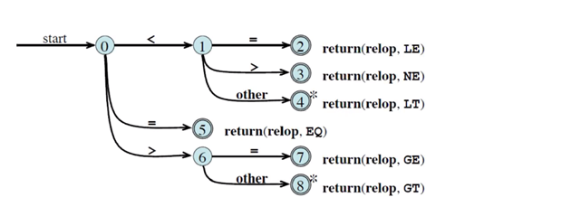

- Ciascun percorso che termina in uno **stato finale** ritorna un **token**
  - <u>Token-name</u>: classe $\tt relop$
  - <u>Token-value</u>: elemento della classe


<aside>Conservazione dei simboli letti, non appartenenti al lessema in analisi</aside>

#### Operazione di retract

- Interessa gli **stati finali** con arco entrante **$\tt other$** e contrassegnati da **asterischi**
- Il simbolo $\tt other$ può essere un elemento di un **token successivo**
- ==Quando si consuma la transizione bisogna tornare **indietro di un simbolo**==


<aside>Automa che riconosce i linguaggi dei lessemi tramite longest match</aside>

### [6.2.1][pdf]  Pattern matching basato su NFA/DFA

- **Ciascuna categoria** sintattica è denotata da un’**espressione regolare**
  - Denota il **linguaggio dei lessemi**
- Per ogni **espressione** regolare può essere costruito un **NFA**
- È possibile costruire un ==**NFA** che riconosca tutti i **linguaggi dei lessemi**==
  1. Si inserisce uno **stato iniziale $s_0$**
  2. Si collega ognuno degli **NFA** sopra a $s_0$ tramite **$ε$-transizioni**

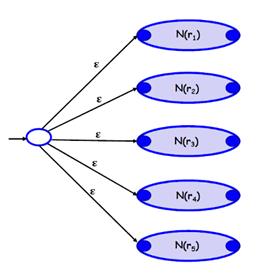

---

> <u>Nota</u>  (**Azioni per stati finali**)
>
> Nel caso d’uso del compilatore ci sono delle azioni associate agli stati finali

> <u>Procedura</u>  (**Analisi lessicale basata su NFA/DFA**)
>
> 1. **Simulare** l’NFA/DFA sopra descritto
> 2. Nel caso di **ambiguità**, **proseguire** finché nessun’altra transizione è possibile
> 3. Se nell’insieme di **stati raggiunti** ci sono delle **azioni disponibili**
>    - Si esegue quella appartenente al **longest match**
>    - In caso di **pari lunghezze**, viene eseguita quella con **priorità più alta**
> 4. Se **nessuna azione è disponibile**
>    1. Si **torna indietro** nella sequenza di stati percorsi
>       - Per ognuno dei passi si **aggiorna** il puntatore all’**input buffer**
>    2. La ricerca si ferma nel **primo insieme di stati** che presenta ~~(and)~~
>       - Almeno uno **stato finale**
>       - Delle **azioni associate**
>    3. Si esegue l'azione **prioritaria**


<aside>Pipeline per generare lexer</aside>

### [~~6.2.2~~][pdf]  ~~Generatori di analizzatori lessicali: Flex~~

- ~~I generatori evitano di dover scrivere analizzatori lessicale e sintattico per ogni programma~~
- ~~Oggigiorno ogni linguaggio possiede un proprio generatore di analizzatori lessiale e sintattico~~

> <u>Funzionamento</u>  (**Flex e generatori di questo tipo**)
>
> 1. Creare un file `file.l`
>    - **Input** del generatore
>    - Contiene le specifiche di
>      - **Patterns** da riconoscere
>      - **Azioni** da compiere in corrispondenza di un match
> 2. Compilare `file.l` utilizzando il comando `Flex`
>    - Restituisce un file `lex.yy.c`
> 3. Compilare `lex.yy.c` con `gcc`
>    - Restituisce il **lexer**
>      - Gestisce l’input buffer, fa le operazioni di retract ecc.

```sh
Flex file.l
gcc lex.yy.c -lfl
./a.out
```

- ~~È raro usare Flex da solo in questo modo: è nato per essere usato in **pipeline** con un **generatore di analizzatore di analisi sintattica** (Bison)~~


<aside>%{ code %}<br>shorthand_for_patterns<br>pattern {action};<br>user_routines</aside>

### [6.2.3][pdf]  Struttura del `file.l`

```c
...
// (Preambolo)
% { code
% }
shorthand_for_patterns
%%
// (Parte centrale)
pattern_1 {action_1};
pattern_2 {action_2};
...
%%
// (Epilogo)
user_routines
```

**Contenuto** delle tre macrosezioni, separate da **`%%`**

1. ==**Preambolo**==
   - ==**Codice C** con inizializzazioni di **variabili** e **definizioni** con `define`==
     - Tra i simboli `%{` e `%}`
   - **Abbreviazioni** per i pattern (==alias per espressioni regolari==)
2. ==**Parte centrale**==
   - ==**Lista di coppie pattern-azione**, in linguaggio **lex**==
     - **Pattern**: **espressione regolare**
     - **Azione**: **cosa eseguire** quando viene **riconosciuto** il pattern corrispondente
       - `ECHO`: stampa la sequenza di caratteri del match (`printf("%s", yytext)`)
       - **Assente**: ignora la sequenza di caratteri che ha causato il match
3. ==**Epilogo**==
   - ==**Routine definite dall’utente**==
     - Copiate e incollate dentro a **`lex.yy.c`**
   - **Facoltativa**, se non inserita, viene invocata in automatico la routine **`yylex()`**

Flex aggiunge i dettagli necessari per la **gestione dell’output** (librerie ecc.)


<aside>longest match,<br>primo della lista</aside>

### [6.3.1][pdf]  Ambiguità

**Ambiguità** dell’analisi lessicale basata sull’utilizzo di NFA o DFA

- ==Match di **diversa lunghezza**: **longest match**==
- ==Longest matches di **uguale lunghezza**: **primo della lista**==
  - L’**ordine** in cui si scrive la sequenza dei **pattern** è importante


<aside>Metacaratteri: caratteri riservati e regole di matching</aside>

### [6.2.4][pdf]  Il linguaggio delle espressioni regolari in Flex

- **Metacaratteri** di Flex (caratteri riservati):  `/ \ − ∗ + > " { } . $ ( ) | % [ ] ^`

- **Regole di matching** dei metacaratteri

  - `.` 		qualsiasi carattere, eccetto newline

  - `\n` 	 newline

  - `*` 		zero o più copie di un elemento

  - `+` 		una o più copie di un elemento

  - `?` 		zero o una copia di un elemento

  - `a|b`   alternanza

  - `^` 		inizio di riga; negazione se usato in una classe di caratteri

  - `$` 		fine riga

  - `"*"`   letterale (character escape)

  - `()` 	 raggruppamenti

  - `[]` 	 classi di caratteri (`[a-z] == a|b|…|z`)

  - `{}` 	 espressioni regolari scritte nel preambolo


<aside style='background:red'>TODO</aside>

### [6.3][pdf]  Esempi di file per Flex

- ##### ==[Vedi pag 103-109][pdf]==


# [Cap 7][pdf]  Analisi sintattica: parsing top-down

## [7.1][pdf]  Il parsing

<aside>Verifica w∈L(G) e ritorna l'albero di derivazione</aside>

### Introduzione

> <u>Definizione</u>  (**Parsing / analisi sintattica**)
>
> Data una grammatica ${\cal G}$ e una parola $w$, verifica se $w ∈ {\cal L} ( {\cal G} )$ e, se vero, fornisce il suo albero di derivazione

~~Approcci al parsing usati nell’ambito dei linguaggi di programmazione~~

- ==**Top-down**: derivazione **leftmost** da uno start symbol, **dalla radice alle foglie**==
- ==**Bottom-up**: derivazione **rightmost** della stringa **dalle foglie alla radice**==
- ~~**Forma generale**: tattiche impiegate nel caso dei **linguaggi naturali**~~

Gli approcci descritti ==considerano solamente delle **sottoclassi dei linguaggi liberi**==

- ~~Si ha un’analisi sintattica estremamente **efficiente** dal punto di vista computazionale~~


<aside>Derivazione leftmost a partire dallo start symbol</aside>

### [7.1.1][pdf]  Top-Down Parsing

> <u>Algoritmo</u>  (**Top-Down Parsing**)
>
> Algoritmo che sviluppa le produzioni per verificare se esiste una derivazione leftmost a partire dallo start symbol che generi $w$; se esiste, allora $w∈{\cal L}({\cal G})$

- È sempre possibile un approccio **backtrack**, che però è **dispendioso**


<aside>Left-to-right Leftmost (deterministic) parsing</aside>

### Grammatiche LL

> <u>Definizione</u>  (**Grammatica LL**)
>
> Grammatica senza contesto che può essere analizzata da un LL parser

> <u>Definizione</u>  (**Parser LL**)
>
> Parser che analizza l'input Left-to-right e costruisce una derivazione Leftmost della parola

> <u>Definizione</u>  (**Grammatica LL(K)**)
>
> Grammatica LL analizzata da un parser che analizza $K$ simboli di input alla volta

Tali grammatiche

- Prevedono una tipologia di **parsing**

  - ==**completamente deterministico**==

  - per la quale ==**non** è necessario **backtrack**==

- ==**Classificate** a seconda del **grado di determinismo**==
- ==Si **differenziano** solo per il **tipo di analizzatore**==


<aside>Parsing guidato da una tabella che indica le produzioni da sviluppare</aside>

### [7.1.2][pdf]  Predictive Top-Down Parsing

> <u>Definizione</u>  (**Grammatica LL(1)**)
>
> Grammatica che può essere analizzata con la seguente procedura:
>
> 1. Si leggono le **parole** da **sinistra a destra**
> 2. Si esegue una **produzione leftmost**
> 3. Si legge **un solo simbolo** (non terminale) alla volta

> <u>Definizione</u>  (**Predictive Top-Down Parsing**)
>
> Algoritmo di parsing deterministico applicato alla classe di grammatiche LL(1)

- Si basa sulla ==costruzione di una **tabella** che guida nell’analisi della parola== in input
  - Permette di ==**verificare l'appartenenza** di parole al linguaggio==
  - In caso di esito positivo, permette di ==**costruire la derivazione** leftmost== richiesta
    - Di conseguenza l'==**albero di derivazione**==
- ==**Non** richiede **backtrack**==

---

> **Struttura della tabella**
>
> - <u>Righe</u>: non-terminali
> - <u>Colonne</u>: terminali, più simbolo $\$$ (terminatore)
>   - Grammatiche LL(K): tuple di $K$ terminali (~~e.g.~~ $aa, ab, bb, ba, a\$, b\$, \$\$$)
> - <u>Celle interne</u>:
>   - Produzioni
>   - Errore


<aside style='text-align: left; width: auto;'>b: terminale attuale<br>X: simbolo attuale<br>---<br>term(X):<br>- X==b: match<br>- X!=b: error()<br>!term(X):<br>- M[X,b]==ERROR: error()<br>- M[X,b]==X→α: out, push</aside>

#### Algoritmo

> <u>Algoritmo</u>  (**Predictive Top-Down Parsing**)
>
> <u>Input</u>
>
> - Stringa $w$
> - Tabella $M$ per la grammatica ${\cal G} = (V, T, S,{\cal P})$
>
> <u>Output</u>
>
> - $w ∈ {\cal L}({\cal G})\,\ ⇒\,\ $derivazione leftmost della stringa
> - $w ∉ {\cal L}({\cal G})\,\ ⇒\,\ \texttt {error()}$
>
> <u>Strutture</u>
>
> - **Input buffer** che conterrà la parola $w$, a cui si appende $\$$
> - **Pila** che andrà a contenere **simboli**, terminali e non
>   - Inizializzata con lo **start symbol** $S$ (in cima) e il terminatore $\$$
>
> <u>Obiettivo</u>
>
> - **Raggiungere $\$$** eseguendo $\texttt {pop()}$ dalla pila, senza che si verifichi $\texttt {error()}$
>
> <u>Preambolo</u>
>
> - Variabile $b$ inizializzata al **primo simbolo** di $w\$$
> - Variabile $X$ inizializzata allo **start symbol** $S$
>
> <u>Procedura</u>
>
> 1. Finché $X≠\$$, si possono verificare 4 casi
>    1. $X\ {\rm terminale}\ ∧\ X = b \ \ ⇒\ \ $nella derivazione della costruzione parziale si ottiene un **match** con il prossimo terminale dell'input buffer
>       1. Si rimuove $X$ dalla cima della pila
>       2. Si imposta $b$ al simbolo successivo nell’input buffer
>    2. $X\ {\rm terminale}\ ∧\ X ≠ b \ \ ⇒\ \ \texttt {error()}$
>    3. $X\ {\rm non\ terminale}\ \ ⇒\ \ $verificare la tabella in posizione $M [X, b\,]$
>       - $M [X, b\,] = {\tt ERROR}\ \ ⇒\ \ \texttt {error()}$
>       - $M [X, b\,] = X → Y_1 ...Y_k \ \ ⇒\ \ $produzione che continua la derivazione
>         1. Si stampa in **output** la produzione
>         2. Si **rimuove** $X$ dalla cima della pila
>         3. Si **inserisce il body** nello stack in ordine inverso ($Y_1$ in cima)
> 2. $X$ viene assegnato all’**elemento in cima** alla pila e si ripete

```pseudocode
void ptdp(Word w, Symbol[][] M, Grammar G)
    Stack S = Stack()
    S.push('$')
    S.push(G.S)
    w += '$'
    Symbol b = w.firstSymbol()
    Symbol X = S.top()
    while X != $ do
        if X == b then
            S.pop()
            b = w.nextSymbol()
        else if isTerminal(X) || M[X, b] == ERROR then
            error()
        else if M[X, b] == X → Y1...Yk then
            output(X → Y1...Yk)
            S.pop()
            for Yi ∈ [Yk...Y1] do
                S.push(Yi)
        X = S.top()
```

[Esempio pagg. 113, 116][pdf]


<aside>M[A,b] = A→α : α⇒*bβ<br>Come espandere A quando si legge b</aside>

### [7.1.3][pdf]  Tabella di parsing

==La cella $M [A, b\;\!]$ viene consultata per **espandere il non-terminale** $A$, quando il prossimo terminale nell’input buffer è $b$==

> <u>Procedura</u>  (**Costruzione della tabella di parsing**)
>
> - $M [A, b\;\!]=A → α\ $ se
>
>   - $α ⇒^∗ bβ$
>     - Partendo da $α$ si riesce a ottenere una stringa che inizia per $b$
>   - $α ⇒^∗ ε\ ∧\ S ⇒^∗ δAγ\ : \  γ ⇒^∗ bβ$
>     - $δAγ$ è ottenuta da una derivazione leftmost
> - $M [A, b\;\!]=\texttt{error()}$ altrimenti

[Esercizi pagg. 117, 118][pdf]


## [7.2][pdf]  $\boldsymbol {{\rm first}(α)}$

<aside>Terminali all'inizio delle parole derivate da α</aside>

### [7.2.1][pdf]  Definizione

> <u>Definizione</u>  ($\boldsymbol{ {\rm first}(α)}$)
>
> Insieme di terminali che sono posti all’inizio delle stringhe derivate da $α$
>
> - <u>Base</u>
>   - ${\rm first}(ε) = \{ε\}$
>   - ${\rm first}(a) = \{a\}$
> - <u>Passo</u>
>   - ${\rm first}(A) = \bigcup_{A→α} {\rm first}(α)$

- ==${\rm first}(A)$ è l’**unione dei ${\rm first}(α)$ dei body** $α$ delle produzioni aventi $A$ come driver==
- Definito per **stringhe generiche** di terminali e non-terminali
- ==$ε ∈ {\rm first}(α)\ \ ⟺\ \ α ⇒^* ε$==
  - $α$ è un non-terminale annullabile (**nullable**)


<aside>Scorrere i simboli del body finché non se ne trova uno che non sia derivabile in ε</aside>

### [7.2.2][pdf]  Algoritmo di calcolo di $\boldsymbol {{\rm first}(α)}$

> <u>Algoritmo</u>  (**$\boldsymbol {{\rm first}(α)}$**)
>
> Data una stringa $α=Y_1 \dots Y_n$,  ${\rm first}(α)$ è ottenuto come segue
>
> 1. Iterare sui simboli $Y_i\ :\ 1 ≤ i ≤ n$ di $α$
>
>    1. Aggiungere ${\rm first}(Y_i) \setminus \{ε\}$ a ${\rm first}(Y_1 . . . Y_n )$
>
>    1. Controllare se $ε ∈ {\rm first}(Y_i)$
>
>       $\tt true$
>
>       - $Y_i$ è derivabile in $ε$
>
>       - Esiste un caso in cui $Y_i$ non inserisce terminali all'inizio di nessuna parola derivabile da $α$
>
>       - (LOOP)
>
>       $\tt false$
>
>       - $Y_i$ non è derivabile in $ε$
>   - $Y_i$ inserisce necessariamente un terminale nella prima posizione di almeno una parola derivabile da $α$
>       - I simboli $Y_j$, con $j>i$, aggiungerebbero terminali dalla seconda posizione
>     - Quindi sono stati trovati tutti i ${\rm first}(Y_1 . . . Y_n)$
>       - (END)
>
> 2. Se $α$ è annullabile, aggiungere $ε$ a ${\rm first}(α)$
>
>    - $∀\, Y_i ∈ (Y_1 . . . Y_n),\, Y_i\ {\rm nullable}\ ⇒\ α\ {\rm nullable}$

```pseudocode
Set first(Word α)
    if α.lenght == 1 then return α[0]
    Set first_α = {}
    i = 1
    foreach Yi ∈ α do
        first_α.add(first(Yi) \ {'ε'})
        if 'ε' ∈ first(Yi) then i++
        else break
    if i == n + 1 then first_α.add('ε')
    return first_α
```

---

> <u>Procedura</u>  (**Calcolo $\bold {first}$ manuale**)
>
> 1. Partire dalle produzioni
>
>    - che necessitano di **meno passaggi** possibili
>      - Quelle che hanno **un terminale**, o $ε$, come body
>
>    - il cui driver può essere utilizzato per **risolvere i $\rm first$ di un’altra produzione**
>
> 2. Utilizzare i $\rm first$ calcolati sopra per **sviluppare gli altri**
>
>    - Se uno dei $\rm first$ richiesti contiene $ε$, procedere con l'analisi del **simbolo successivo**


## [7.3][pdf]  $\boldsymbol {\rm follow}(A)$

<aside>Terminali che seguono il non-terminale A</aside>

### [7.3.1][pdf]  Definizione

> <u>Definizione</u>  ($\boldsymbol {\rm follow}(A)$)
>
> Insieme dei terminali che possono seguire un non-terminale $A$ in qualche derivazione

- Terminali che si trovano **immediatamente a destra** di $A$
- Computato solo per **non-terminali**
- **$\$ ∈ {\rm follow}(S)$**
  - Il terminatore di stringa $\$$ si trova dopo una qualsiasi parola generata dallo start symbol


<aside>Primi terminali che seguono A nei body<br>in cui A compare</aside>

### [7.3.2][pdf]  Algoritmo per il calcolo di $\boldsymbol {\rm follow}(A)$

> <u>Algoritmo</u>  (**$\boldsymbol {\rm follow}(A)$**)
>
> 1. Si cercano le produzioni della grammatica per cui il non terminale $A$ compare nel body
> 2. Per ogni $B → αAβ$, si eseguono entrambe le sequenti operazioni
>    - $β \ne ε\quad⇒\quad $si aggiunge ${\rm first}(β) \setminus \{ε\}$ a ${\rm follow}(A)$
>      - ${\rm first}(β)$ consi
>    - $β = ε\ \or\ ε ∈ {\rm first}(β)\quad⇒\quad $si aggiunge ${\rm follow}(B)$ a ${\rm follow}(A)$
>      - Ciò che segue $B$ potrà seguire anche $A$
>      - Se $β = ε$ allora $A$ è la radice dell’ultimo sottoalbero generato da $B$

```pseudocode
Set follow(Word A)
    follow_A = {}
    if A == G.S then
        follow_A.add('$')
    while ∃ B → αAβ do
        if β != ε then
            follow_A.add(first(β) \ {'ε'})
        if β == ε ∨ ε ∈ first(β) then
            follow_A.add(follow(B))
    return follow_A
```

---

> <u>Procedura</u>  (**Calcolo $\bold {follow}$ manuale**)
>
> 0. Costruire una tabella
>    - <u>Righe</u>: non-terminali
>    - <u>Colonne</u>: $\rm first$, $\rm follow$
> 1. Inizializzare ${\rm follow}(S)=\set{\$}$
> 1. Scorrere le **produzioni in ordine**, a partire dallo **start symbol**
> 2. Per ogni produzione $B → αAβ$, scorrere i **non-terminali** del body
> 3. Per ogni non-terminale $A$, aggiungere nella rispettiva casella:
>    - $β≠ε\quad⇒\quad{\rm first}(β)$
>      - $β=aγ\quad⇒\quad a$
>    - $β=ε∨ε∈{\rm first}(β)\quad⇒\quad {\rm note\lang follow}(B)\rang$
> 4. Al termine, risolvere le annotazioni con i $\rm follow$ calcolati
>    - Eliminare progressivamente le dipendenze


### [7.3.3][pdf]  Esercizi su first/follow

---

> <u>Esempio</u>  ([pagg. 120-121, 123-124][pdf])
> $$
> \begin{align}
> {\cal G}\ :\
> E\ \ &→\ TE' \\
> E' \ &→\ +TE'\ |\ ε \\
> T\ \ &→\ FT' \\
> T' \ &→\ *FT'\ |\ ε \\
> F\ \ &→\ (E)\ |\ id \\ \
> \end{align}
> $$
>
> $$
> \begin{align}
> {\rm first}(E')     &= \set{ε,+} \\
> {\rm first}(T')     &= \set{ε,*} \\
> {\rm first}(F )\,\, &= \set{(, id} \\
> {\rm first}(T )\,\, &= \set{(, id} \\
> {\rm first}(E )\,\, &= \set{(, id} \\ \
> \end{align}
> $$
>
> $$
> \begin{align}
> {\rm follow}(E )\,\, &= \set{\$,)} & {\rm start},\ (5) \\
> {\rm follow}(E')     &= \set{\$,)} & (1)⇒{\rm follow}(E) \\
> {\rm follow}(T )\,\, &= \set{\$,),+} & (1,2)⇒{\rm follow}(E')∪{\rm first}(E')  \\
> {\rm follow}(T')     &= \set{\$,),+} & (3)⇒{\rm follow}(T)∪{\rm first}(E') \\
> {\rm follow}(F )\,\, &= \set{\$,),+,*} & (3,4)⇒{\rm follow}(T')∪{\rm first}(T') \\
> \end{align}
> $$

---

> <u>Esempio</u>  ([pagg. 125-128][pdf])
> $$
> \begin{align}
> {\cal G}\ :\
> S \ &→\ aABb \\
> A \ &→\ Ac\ |\ d \\
> B \ &→\ CD \\
> C \ &→\ e\ |\ ε \\
> D \ &→\ f\ |\ ε \\ \
> \end{align}
> $$
>
> $$
> \begin{array}{|c|c|}\hline
> \text{non-term} & \rm first & \rm follow \\\hline
> S & a     & \$ \\
> A & d     & e,f,b,c \\
> B & ε,e,f & b \\
> C & ε,e   & f,B \\
> D & ε,f   & B \\\hline
> \end{array}
> $$
>
> 
> $$
> \begin{align}
> {\rm follow}(S) &= \set{\$} \\
> {\rm follow}(A) &= \set{e,f,b,c} \\
> {\rm follow}(B) &= \set{b} \\
> {\rm follow}(C) &= \set{f,b} \\
> {\rm follow}(D) &= \set{b} \\ \
> \end{align}
> $$
> ==<u>Nota</u>: in $S→aABb$, quando si calcola ${\rm follow}(A)$ si ha $β=Bb$ e ${\rm first}(Bb)=\set{e,f,b}$==

---

> <u>Esempio</u>  ([pagg. 128-131][pdf])
> $$
> \begin{align}
> {\cal G}\ :\
> S \ &→\ aA\ |\ bBc \\
> A \ &→\ Bd\ |\ Cc \\
> B \ &→\ e\ |\ ε \\
> C \ &→\ f\ |\ ε \\ \
> \end{align}
> $$
>
> $$
> \begin{array}{|c|c|}\hline
> \text{non-term} & \rm first & \rm follow \\\hline
> S & a,b     & \$ \\
> A & e,d,f,c & S \\
> B & ε,e     & c,d \\
> C & ε,f     & c \\\hline
> \end{array}
> $$
>
> 
> $$
> \begin{align}
> {\rm follow}(S) &= \set{\$} \\
> {\rm follow}(A) &= \set{\$} \\
> {\rm follow}(B) &= \set{c,d} \\
> {\rm follow}(C) &= \set{c} \\
> \end{align}
> $$


## [7.4][pdf]  Costruzione una tabella di parsing top-down

<aside>M[A,x] = { A→α :<br>x ∈ first(α)<br>∨ (ε ∈ first(α)<br>∧ x ∈ follow(α)) }</aside>

### [7.4.1][pdf]  Algoritmo di costruzione di una parsing table

> <u>Algoritmo</u>  (**Costruzione della parsing table**)
>
> - <u>Input</u>: grammatica $\cal G$
> - <u>Output</u>: parsing table propria di $\cal G$
>
> 1. Inizializzare la tabella di dimensioni $(|V \setminus T|, |T| + 1)$ al valore $\texttt{error()}$
> 2. Per ogni produzione $A → α$ della grammatica
>
>    1. Aggiungere $A → α$ in $M [A, b\;\!]$ per ogni $b ∈ ({\rm first}(α) \setminus \{ε\})$
> 1. Se $ε ∈ {\rm first}(α)$, aggiungere $A → α$ a $M [A, x\;\!]$ per tutti gli $x ∈ {\rm follow}(A)$

- ==$M[A,x] = \{\text{produzioni con driver }A\text{ che generano stringhe che iniziano con }x\}$==

```pseudocode
Table parsingTable(Grammar G)
    Table PT[|V \ T|, |T| + 1] = {error()}
    foreach A → α ∈ G.P do
        foreach b ∈ (first(α) \ {ε}) do
            M[A, b].add(A → α)
            if ε ∈ first(α) then
                foreach x ∈ follow(A) do
                    M[A, x].add(A → α)
    return PT
```

---

> <u>Note</u>
>
> - ${\rm follow}(A)$ può contenere il simbolo $\$$
>   - Infatti nel punto (2) si usa $x$ (simbolo generico) invece che $b$ (terminale)
> - Celle di errore puntano alla routine $\texttt{error()}$
> - ==È possibile che una cella contenga due o più entry (*entry multiple-defined*)==
>   - ==Grammatiche le cui tabelle assumono questa forma non sono deterministiche e non appartengono alla classe LL(1)==


<aside>LL(1) se non ci sono<br>entry multiple-defined</aside>

### [7.4.2][pdf]  Applicazioni

==La parsing table può essere utilizzata per **verificare** se una grammatica appartiene alla classe **LL(1)**==

- ==Se tutte le celle contengono **al più una entry**, allora **è LL(1)**==
- ==Se esistono una o più **entry multiple-defined**, allora **non è LL(1)**==


## [7.5][pdf]  Grammatiche con ricorsione sinistra

<aside>A ⇒* Aα<br>A → Aα</aside>

### Definizione

> <u>Definizione</u>  (**Ricorsione sinistra**)
>
> Una grammatica presenta ricorsione sinistra se
> $$
> ∃\, A∈V,\, α\ :\ A ⇒^∗ Aα
> $$

---

> <u>Esempio</u>
> $$
> \displaylines{
> \begin{align}
> {\cal G}\ :\ S\ &→\ B \ |\ a\\
> B\ &→\ Sa \ |\ b
> \end{align}\\[8px]
> S ⇒ B ⇒ Sa}
> $$

> <u>Definizione</u>  (**Ricorsione sinistra immediata**)
>
> Una grammatica presenta ricorsione sinistra immediata se
> $$
> ∃\, A∈V,\, α\ :\ A → Aα
> $$

---

> <u>Esempio</u> 
> $$
> \begin{align}
> {\cal G}\ :\ &E\ →\ E+T\ |\ T\\
> &T\ →\ T ∗F\ |\ F\\
> &F\ →\ (E)\ |\ id
> \end{align}
> $$
> È possibile espandere un numero indefinito di volte la produzione $E → E + T$ ed ottenere una sequenza di derivazioni del tipo
> $$
> E\ ⇒\ E + T\ ⇒\ E + T + T\ ⇒\ E + T + T + T\ ⇒\ ...
> $$


<aside>A → Aα | β<br>---><br>A → βA'<br>A' → αA'</aside>

### [7.5.2][pdf]  Eliminazione ricorsione sinistra immediata

> <u>Lemma</u>  (**Ricorsione sinistra e LL(1)**)
>
> Se una grammatica $\cal G$ presenta ricorsione sinistra, allora non appartiene alla classe LL(1)

---

> <u>Esempio</u>  (**Eliminazione ricorsione sinistra immediata**)
>
> Sia data la seguente produzione
> $$
> A\ →\ Aα\ |\ β\ \ :\ \ α ≠ ε\ ∧\ β ≠ Aγ
> $$
> <u>Obbiettivo</u>: ottenere una grammatica che
>
> - Generi lo stesso linguaggio della precedente
> - Non presenti ricorsione sinistra
>
> <u>Intuizione</u>
>
> Modificare la struttura dell'albero di derivazione, aggiungendo un nuovo non-terminale $A'$ che elimini l’elemento ricorsivo della produzione
>
> 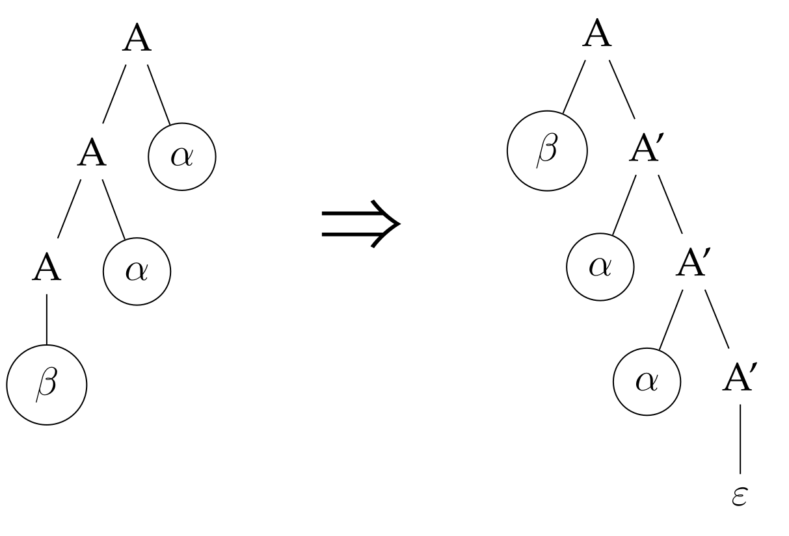
>
> <u>Soluzione formale</u>
>
> - Data una produzione del tipo
>   $$
>   A\ →\ Aα\ |\ β\ \ :\ \ α ≠ ε\ ∧\ β ≠ Aγ
>   $$
>
> - Essa può essere riscritta equivalentemente come segue
>   $$
>   \displaylines{\begin{align}
>   A\ \ &→\ \ βA' \\
>   A' \ &→\ \ αA'\ |\ ε
>   \end{align}\\[8px]
>   A' ∉ V \setminus T\ \ }
>   $$
>
>   - Dove $A'$ è un non-terminale fresh per la grammatica di riferimento

><u>Procedura</u>  (**Eliminazione ricorsione sinistra immediata**)
>
>- Forma generale di una produzione con ricorsione sinistra immediata
> $$
>  A\ →\ Aα_1\ |\ ...\, |\ Aα_n\ |\ β_1\ |\ ...\, |\ β_k\\[8px]
>  α_j ≠ ε\ \ ∀\,1 ≤ j ≤ n\ \ ∧\ \ β_i ≠ Aγ_i\ \ ∀\,1 ≤ i ≤ k
> $$
>
>- Forma della produzione riformulata senza ricorsione sinista, che mantiene inalterate le eventuali derivazioni
> $$
> \displaylines{
>  \begin{align}
>  A\ \ →\ \ β_1 A'\ &|\ · · ·\ |\ β_k A'\\
>  A' \ →\ \ α_1 A'\ &|\ · · ·\ |\ α_n A'\ |\ ε
>  \end{align}\\[8px]
>  A' ∉ V }
> $$


<aside>Ridurre i passi di derivazione per ottenere ricorsione immediata</aside>

### [7.5.3][pdf]  Eliminazione della ricorsione sinistra

- Operazione **non possibile in tutte le grammatiche**
- ==Può causare la **comparsa** della ricorsione sinistra **in un altro non-terminale**==

---

> <u>Idea</u>  (**Eliminazione ricorsione sinistra**)
>
> 1. Ridurre i passi della derivazione $A ⇒^∗ Aα$
> 2. Ottenere una produzione che presenta ricorsione sinistra immediata
> 3. Applicare la tecnica sopra

---

> <u>Esempio</u>  (**Eliminazione ricorsione sinistra**)
>
> Sia data la seguente grammatica
> $$
> \begin{align}
> A\ →\ Ba\ &|\ b \\
> B\ →\ Bc\ &|\ Ad\ |\ b
> \end{align}
> $$
> Essa presenta
>
> - Ricorsione sinistra immediata su $B$
> - Ricorsione sinistra su $A$, attraverso $A ⇒ Ba ⇒ Ada$
>
> Passi per l'eliminazione della ricorsione sinistra
>
> 1. **Riduzione dei passi di derivazione**: sostituire i non-terminali coi body delle loro produzioni
>    $$
>    B → Ad \quad\Longrightarrow\quad   B → Bad\ |\ bd
>    $$
>
> 2. **Riformulazione della grammatica** ottenuta mantenendo inalterate le altre produzioni
>    $$
>    \begin{align}
>    A\ →\ Ba\ &|\ b \\
>    B\ →\ Bc\ &|\ Bad\ |\ bd\ |\ b
>    \end{align}
>    $$
>
> 3. Essa presenta ricorsione sinistra (immediata) solo su $B$, eliminabile con la tecnica sopra
>    $$
>    \begin{align}
>    A\ \ &→\ Ba\ |\ b \\
>    B\ \ &→\ bdB'\ |\ bB' \\
>    B' \ &→\ cB'\ |\ adB'\ |\ ε
>    \end{align}
>    $$


<aside>Non garantisce LL(1)</aside>

#### [7.5.4][pdf]  Efficacia

---

> <u>Fatto</u>  (**Non efficacia eliminazione ricorsione sinistra**)
>
> L'eliminazione della ricorsione sinistra *non* garantisce di ottenere grammatiche **LL(1)**

---

> <u>Esempio</u>  (**Grammatica delle espressioni aritmetiche**)
> $$
> \begin{array}{l}
>     \begin{array}{l}
>     {\cal G}\ :\!\!\!
>         &E\ →\ E+T\ |\ T\\
>         &T\ →\ T ∗F\ |\ F\\
>         &F\ →\ (E)\ |\ id \\ \ \\ \
>     \end{array}
>    	& & & &
>     \begin{array}{l}
>     {\cal G'}\, :\!\!\!
>         &E\ →\ T E' \\
>         &E' →\ +T E'\ |\ ε \\
>         &T\ →\ FT' \\
>         &T' →\ ∗F T'\ |\ ε \\
>         &F\ →\ (E)\ |\ id
>     \end{array}
> \end{array}
> $$
> $\cal G'$ appartiene alla classe LL(1)

---

> <u>Esempio</u>  (**Grammatica ambigua**)
> $$
> \begin{array}{l}
>     \begin{array}{l}
>     {\cal G}\ :\!\!\!
>         &E\ →\ E + E\ |\ E ∗ E\ |\ (E)\ |\ id \\ \
>     \end{array}
>    	& & &
>     \begin{array}{l}
>     {\cal G'}\, :\!\!\!
>         &E\ →\ (E)E'\ |\ idE' \\
>         &E' →\ +EE' \ |\ ∗EE'\ |\ ε
>     \end{array}
> \end{array}
> $$
> $\cal G'$ *non* appartiene alla classe LL(1)
>
> [Vedi pag. 138][pdf]


<aside>Non garantisce<br>non ambiguità</aside>

#### [7.5.5][pdf]  Ambiguità

<u>Ripasso</u>: l'ambiguità è dovuta all'**impossibilità di esprimere**

- **Associatività** degli operatori
- **Precedenza** degli operatori

<u>Fatto</u>: l'eliminazione della ricorsione sinistra **non garantisce** di l'eliminazione dell'**ambiguità**

[Esempio pag. 139-140][pdf]


## [7.6][pdf]  Fattorizzabilità sinistra

<aside>A → αβ | αγ</aside>

### Definizione

> <u>Definizione</u>  (**Fattorizzabilità sinistra**)
>
> Una grammatica è fattorizzabile a sinistra quando almeno due produzioni hanno ~~(and)~~
>
> - Stesso non-terminale come driver
> - Prefisso comune nel body

---

> <u>Esempio</u>
>
> Si consideri la grammatica ${\cal G}\ :\ S\ →\ aSb\ |\ ab$
>
> - Non è LL(1)
>   1. Calcolare ${\rm first}(S) = \set a$
>   2. Osservare che la cella $M[S,a\,]$ conterrebbe entrambe le produzioni di $S$
> - È fattorizzabile a sinistra

> <u>Lemma</u>  (**Fattorizzabilità sinistra e LL(1)**)
>
> Se una grammatica può essere fattorizzata a sinistra, allora non è LL(1)


<aside>A → αβ | αγ<br>---><br>A → αA'<br>A' → β | γ</aside>

### [7.6.1][pdf]  Strategia

---

> <u>Idea</u>  (**Eliminazione fattorizzabilità sinistra**)
>
> **Rimandare** il più possibile la scelta delle produzioni con lo stesso prefisso
>
> - Sia data una grammatica fattorizzabile a sinistra, la cui produzione iniziale è
>   $$
>   A\ →\ αβ_1\ |\ αβ_2
>   $$
>
> - **Sostiruire** la produzione iniziale con **due produzioni** del tipo
>   $$
>   \displaylines{\begin{align}
>   A\ \ &→\ αA'\\
>   A' \ &→\ β_1\ |\ β_2
>   \end{align}\\[8px]
>   A' ∉ V \setminus T\ \ }
>   $$


### [7.6.2][pdf]  Algoritmo di fattorizzazione a sinistra

> <u>Algoritmo</u>  (**Fattorizzazione sinistra**)
>
> - <u>Obiettivo</u>: rimuovere prefissi comuni dalla grammatica e manteniene il linguaggio inalterato
> - <u>Input</u>: grammatica fattorizzabile a sinistra
>
> Per ogni non-terminale della grammatica
>
> 1. Si trova il più lungo prefisso $α$ comune a due o più produzioni aventi lo stesso driver
>
> 2. Se tale prefisso $α$ esiste, allora
>
>    1. Viene scelto un non-terminale fresh $A' : A' ∉ V\setminus T$
>
>    2. Si sostituiscono le produzioni di $A$ nella forma
>
>
> $$
>    A\ →\ αβ_1\ |\ ...\ |\ αβ_n\ |\ γ_1\ |\ ...\ |\ γ_n
> $$
>    Con le seguenti produzioni
> $$
>    \begin{align}
>    A\ \ &→\ αA'\ |\ γ_1\ |\ ...\ |\ γ_n \\
>    A' \ &→\ β_1\ |\ ...\ |\ β_n
>    \end{align}
> $$
>
> 3. Si ripete finché non è più possibile trovare produzioni con un prefisso comune
>

```pseudocode
Grammar leftFactorization(Grammar G)
    Grammar G_ = G.clone()
    loop
        foreach A do
            /* { find the largest prefix α common to 2 or more prods for A } */
            if α != ε then
                Symbol A_ = freshNonTerminal(G_.V \ G_.T)
                G_.P.remove(A → α β_1 | … | α β_0 | γ_1 | … | γ_k)
                G_.P.add(A → α A_1 | γ_1 | … | γ_k)
                G_.P.add(A_ → β_1 | … | β_n)
    until /* { no pair of productions for any A has a common prefix } */
    return G_
```


<aside>Non garantisce LL(1)</aside>

#### Efficacia

---

> <u>Fatto</u>  (**Non efficacia fattorizzazione sinistra**)
>
> La fattorizzazione sinistra *non* garantisce di ottenere grammatiche LL(1)

---

> <u>Esempio</u>  (**Grammatica parentesi annidate**)
> $$
> \begin{array}{l}
>  \begin{array}{l}
>  {\cal G}\ :\!\!\!
>      &S\ →\ aSb\ |\ ab \\ \
>  \end{array}
> 	& & & &
>  \begin{array}{l}
>  {\cal G'}\, :\!\!\!
>      &S\ →\ aS' \\
>      &S' →\ Sb\ |\ b
>  \end{array}
> \end{array}
> $$
> $\cal G'$ appartiene alla classe LL(1)

---

> <u>Esempio</u>  (**Dangling else**)
> $$
> \begin{align}
> &{\cal G}\,\ :\ \
> S\ →\ {\tt if}\ b\ {\tt then}\ S\ |\ {\tt if}\ b\ {\tt then}\ S\ {\tt else}\ S\ |\ c \\ \
> \\
> &{\cal G'}\, :\!\!
> \begin{array}{l}
> &S\ →\ {\tt if}\ b\ {\tt then}\ SS'\ |\ c \\
> &S' →\ {\tt else}\ S\ |\ ε
> \end{array}
> \end{align}
> $$
> $\cal G'$ *non* appartiene alla classe LL(1)
>
> - <u>Problema</u>: impossibilità di identificare in maniera certa a quale $\tt then$ appartenga un determinato $\tt else$
>
> - <u>Soluzioni</u>
>
>   - Proibire il costrutto $\texttt{if-then}$ e sostituirlo con $\texttt{if-then-else}$
>
>     - Usato nei linguaggi funzionali
>
>   - Imporre **innermost binding**
>
>     - Si fa corrispondere $\tt else$ al $\tt then$ più vicino e senza match
>     - Necessario solo se non si utilizzano parentesizzazioni
>     - Esempio di grammatica specializzata
>
>     $$
>     \begin{align}
>     S\ &→\ M\ |\ U \\
>     M\, &→\ {\tt if}\ b\ {\tt then}\ M\ {\tt else}\ M\ |\ c \\
>     U\ &→\ {\tt if}\ b\ {\tt then}\ S\ |\ {\tt if}\ b\ {\tt then}\ M\ {\tt else}\ U \\
>     \end{align}
>     $$

<aside style='background:red'>TODO</aside>

[Vedi pagg. 143-145][pdf]


## [7.7][pdf]  Riepilogo sulle grammatiche LL(1)

<aside>LL(1) tramite first e follow</aside>

### Condizioni per LL(1)

==Una grammatica **non è LL(1)** se è ~~(or)~~==

- ==**Ricorsiva** sinistra==
- ==**Fattorizzabile** sinistra==
- ==**Ambigua**==

> <u>Lemma</u>  (**Grammatica LL(1)**)
>
> $\cal G$ è LL(1) se e solo se, nel caso in cui $\cal G$ avesse delle produzioni del tipo $A → α\ |\ β$, allora:
>
> - ${\rm first}(α)\ ∩\ {\rm first}(β) = \rm Ø\ \ ∧$
> - $ε ∈ {\rm first}(α)\ ⇒\ {\rm first}(β)\ ∩\ {\rm follow}(A) =\rm Ø\ \ ∧$
>   $ε ∈ {\rm first}(β)\ ⇒\ {\rm first}(α)\ ∩\ {\rm follow}(A) =\rm Ø$


### [7.8][pdf]  Esercizi riassuntivi LL(1)

- ##### [Esempi pagg. 146-148][pdf]


# [Cap 8][pdf]  Analisi sintattica: bottom-up, SLR(1)

## [8.1][pdf]  Introduzione

### [8.1.1][pdf]  Schema del processo

---

> <u>Idea</u>  (**Bottom-up parsing**)
>
> - Ricostruire le derivazioni di una parola in ordine inverso, partendo dall’ultima produzione usata per derivare la parola considerata, fino ad arrivare allo start symbol
> - Graficamente, costruire un albero di derivazione partendo dalle foglie e arrivando alla radice

---

> <u>Procedura</u>  (**Schema generale**)
>
> 0. Siano date una **grammatica** $\cal G$ e una **parola** $w$
> 1. **Ampliare $\cal P$** aggiungendo **$S' → ·S$**  ($S'$ non-terminale fresh)
> 2. Costruire un **automa** a stati finiti caratteristico per $\cal G$
> 3. Usare l’automa per calcolare una **tabella** di parsing bottom-up
> 4. Eseguire l'algoritmo **shift/reduce** che, con la tabella, fa il parsing di $w$ rispetto a $\cal G$
>


<aside>diversi dettagli per tipi diversi</aside>

### [8.1.2][pdf]  Tipologie di parsing

- **Tipi di parsing**
  - SLR(1)
  - LR(1)
  - LALR(1)
- ==**Classi di grammatiche**==
  - ==La formulazione della **grammatica** determina la **tecnica** di parsing da applicare==
  - ==Una grammatica $\cal G$ appartiene alla **classe LX(y)** se è possibile costruire una **tabella** di parsing di tipo LX(y) per $\cal G$ **senza conflitti**==
- ==**Differenze tra le classi**==
  - ==Dipendentemente dalla **classe**, diversi **automi** caratteristici hanno diversi livelli di **dettaglio dell'informazione**==
  - Maggiore è il livello di dettaglio:
    - Più diventa grande e **complesso** l’automa caratteristico
    - Più **potente** diventa il parsing
      - Inteso come numero di diverse grammatiche che può analizzare
  - Il meccanismo più potente è LR(1), complementare del LL(1)
    - Si cerca di costruire una tabella di parsing deterministico che rientri nei vincoli di **LR(1)**
    - Se ciò non è possibile si **scala di complessità** con LALR(1) e SRL(1)


## [8.2][pdf]  (1) Automa caratteristico

<aside>Stati come insiemi di items (produzioni +<br>simboli successivi)</aside>

### [8.2.1][pdf]  Gli stati

- ==**Stati** dell'automa caratteristico: **insiemi di items**==
- ==**Items**: **oggetti** aventi **forme diverse**, dipendenti dalla **tecnica** di parsing==
  - ==**LR(0)-items**:  $\ \ A → α · β$==
  - ==**LR(1)-items**:  $[\,A → α · β,\, L\,],\ \ \ L ⊆ T ∪ \set{$}$==
- ==**Marker**: simbolo $\,·$==

---

> <u>Osservazioni</u>  (**LR(0)-items vs LR(1)-items**)
>
> Gli LR(1)-items sono **più ricchi** dei loro corrispondenti LR(0)-items
> 
> - Permettono di **riconoscere grammatiche** in modo più **efficace**
> - ==L'**insieme $L$** contiene informazioni rispetto a ciò che sarà **letto in futuro**==

---

> <u>Esempio</u>  (**Intuizione**)
> $$
> {\cal G}\ :\ S\ →\ aSb\ |\ ab
> $$
>
> 1. Aggiungere $S' → ·S$ alle produzioni
> 3. Si consideri il suo LR(0)-item $S'→·S$: cercare le parole derivabili da $S$
>    - In generale, si cercano le parole derivabili da ciò che segue $\,·$
> 4. Inserire $S' → ·S$ nello stato iniziale $P_0$ dell’automa (per il motivo sopra)
> 5. Si osservi la grammatica: analizzare la parola significa aspettarsi qualcosa che derivi da $aSb$ oppure $ab$, per cui gli LR(0)-items di $S$ saranno:
>    - $S → ·aSb$
>    - $S → ·ab$
> 6. Inserire le produzioni sopra nello stato $P_0$


<aside>closure_0(P) = P ∪ {B→·γ :<br>A → α·Bβ ∈ closure_0(P)}</aside>

### [8.2.2][pdf]  Chiusura di un insieme di LR(0)-items

> <u>Definizione</u>  (**Chiusura di un insieme di LR(0)-items**)
>
> Sia $P$ un insieme di LR(0)-items, ${\rm closure}_0 (P )$ è il più piccolo insieme di derivazioni di un non-terminale $B$, per ogni item di $P$ che ha un marker davanti a $B$, unito a $P$ stesso
> $$
> {\rm closure}_0 (P) = P\ ∪\ \set{\,B → ·\,γ\ \ :\ \ A → α · Bβ ∈ {\rm closure}_0 (P)\ ∧\ B → γ ∈ {\cal P}'\,}
> $$

- **Applicazione ricorsiva** della chiusura fino a che non sono presenti tutte le chiusure delle produizioni con il marker davanti ad un non-terminale

```pseudocode
Set closure_0(Set P)
    foreach item ∈ P do
        unmark(item)
    while ∃ item ∈ P : is_unmarked(item) do
        mark(item)
        if item ~= A → α·Bβ then  /* item ha forma A → α·Bβ */
            foreach B → γ ∈ G.P : B → ·γ ∉ P do
                unmark(B → ·γ)
                P.add(B → ·γ)
    return P
```

---

> <u>Esempio</u>  (**Calcolo della chiusura**)
> $$
> \begin{align}
> {\cal G} \ :\
> E\ &→\ E+T \ |\ T \\
> T\ &→\ T ∗F\ |\ F \\
> F\ &→\ (E) \ |\ id \\
> \end{align}
> $$
>
> 0. Si consideri l'item $E'→·E$ e si calcoli la chiusura di $\set{E' → ·E}$
>
> 1. Inizializzazione
>    $$
>    {\rm closure}_0 (\set{E' → ·E}) = \set{E' → ·E}
>    $$
>
> 2. Verificare se l'insieme ${\rm closure}_0 (\set{E' → ·E})$ contiene items con un marker davanti ad un non-terminale
>
>    - Sì, c’è un marker prima di $E$
>
> 3. Aggiungere le produzioni di $E$ alla chiusura
>    $$
>    \set{\, E → ·E + T,\ \ \ E → ·T\,}\ ⊆\ {\rm closure}_0 (\set{E' → ·E})
>    $$
>
> 4. Verificare ricorsivamente se sono presenti markers prima di non-terminali e aggiungere le relative produzioni
>
>    - $·E\,$:  le produzioni di $E$ sono già state aggiunte, si prosegua
>
>    - $·T\,$:  non è stato ancora analizzato, si aggiungano le produzioni di $T$ alla chiusura
>      $$
>      \set{\, T → ·T ∗ F,\ \ \ T → ·F\,}\ ⊆\ {\rm closure}_0 (\set{E' → ·E})
>      $$
>
>      - $·T\,$: già analizzato, si prosegua
>
>      - $·F\,$:  non analizzato, si aggiungano le produzioni di $F$ alla chiusura
>        $$
>        \set{\, F → ·(E),\ \ \ F → ·id\,}\ ⊆\ {\rm closure}_0 (\set{E' → ·E})
>        $$
>
> 5. Conclusione: $\,{\rm closure}_0 (\set{E' → ·E})$ non presenta più items contenenti markers che precedono non-terminali non analizzati
>
>
> $$
> {\rm closure}_0 (\set{E' → ·E})\ =\,
> \begin{cases}
> \ E'&→\ ·E \\
> \ E &→\ ·E + T \\
> \ E &→\ ·T \\
> \ T &→\ ·T ∗ F \\
> \ T &→\ ·F \\
> \ F &→\ ·(E) \\
> \ F &→\ ·id
> \end{cases}
> $$


<aside>Q = τ(P, x) ≡ P --x-> Q<br>---<br>P = closure(kernel(P))<br>kernel(Q) = {A→αx·β : A→α·xβ ∈ P}<br>Q = closure(kernel(Q))</aside>

### [8.2.3][pdf]  Costruzione di un automa caratteristico LR(0)

Tecnica di **costruzione incrementale**

- Popolare un **set di stati**
- Definendo progressivamente la **funzione di transizione**
- Fino a **saturazione**

> <u>Procedura</u>  (**Costruzione di un automa LR(0)**)
>
> <u>Inizio</u>
>
> Definire il kernel dello stato iniziale come $P_0 = \set{S' → ·S}$
>
> <u>Svolgimento</u>
>
> Finché non si esauriscono gli stati da visitare, analizzarli uno alla volta, partendo da $P_i=P_0$
>
> 1. Calcolare la chiusura del kernel dello stato $P_i$ e inserirla in $P_i$
>
>      - Rappresenta le produzioni che permettono di transitare da uno stato verso altri
>      - Gli items della chiusura hanno forma $A → α · xβ$
>          - Durante la visita, essere in uno stato $P_i$ significa che
>            - $α$ è già stato visto
>            - È possibile fare transizioni tramite $x$ verso altri stati
>      - Per ogni item di $P_i$ esiste una $x$-transizione da $P_i$ ad uno stato $P_j$
> 2. Generare i nuovi stati $P_j$
>      - Uno per ogni $x$-transizione che parte da $P_i$
>      - Inizializzati con kernel contenente gli items $A → αx · β$
> 3. Calcolare la chiusura del kernel di $P_j$ e inserirla in $P_j$
>    - Se $β$ è un non-terminale, allora $P_j$ deve contenere ciò che deriva da $β$
> 4. Se $P_j$ ha kernel corrispondente al kernel di uno stato già vistisato $Q$, collegare $P_i$ a $Q$ tramite una $x$-transizione e non si crei lo stato $P_j$

> <u>Notazione</u>  (**Stato**)
>
> Gli stati possono essere rappresentati con la notazione
> $$
> P_j =\, τ(P_i, x)
> $$
>
> - $P_i$ stato di provenienza
> - $x$ transizione di provenienza
> - $(P_i,x)$ transizione che dallo stato $P_i$ legge $x$ nell'input buffer

```pseudocode
Automa LR0_automaConstruction(Grammar G)
    State S_ = fresh(G.V \ G.T)
    State P0 = closure_0({S_ → G.S})
    unmark(P0)
    Automata LR = {P0}
    while ∃ P ∈ LR : is_unmarked(P) do
        mark(P)
        foreach Y : A → α·Yβ ∈ P do
            K = kernel(τ(P, Y))
            if ∃ Q ∈ LR : kernel(Q) == K then
                τ(P, Y) = Q
            else
                State R = closure_0(K)
                τ(P, Y) = R
                unmark(R)
                LR.add(R)
    return LR
```

---

> <u>Esempio</u>  (**Costruzione di automa LR(0)**)
> $$
> \begin{align}
> {\cal G} \ :\
> S\ &→\ aABe \\
> A\ &→\ Abc\ |\ b \\
> B\ &→\ d
> \end{align}
> $$
> <u>Inizio</u>
>
> Costruire lo stato iniziale $P_0$
> $$
> \begin{align}
> P_0\, &=\, \set{\,S'→·S\,}\ ∪\ {\rm closure}_0(\set{S'→·S})=\\
> &=\,\set{\,S'→·S,\ \ S→·aABe\,}
> \end{align}
> $$
> <u>Svolgimento</u>
>
> Aggiungere allo stato $P_0$ le transizioni derivanti dalle produzioni contenute in esso e analizzare in ampiezza i nuovi stati ottenuti
>
> 1. $τ (P_0, S) = P_1$
>
>    1. Calcolare il kernel di $P_1$, ottenuto spostando il marker di una posizione a destra
>       $$
>       P_1=\set{S'→S·}
>       $$
>
>    2. Il marker è in fondo: $P_1$ non presenta ulteriori possibili sviluppi/transizioni (END)
>
> 2. $τ (P_0, a) = P_2$
>
>    1. Calcolare il kernel di $P_2$
>       $$
>       P_2=\set{S→a·ABe}
>       $$
>
>    2. Il kernel contiene almeno una produzione in cui il marker è seguito da un non-terminale: calcolare la chiusura di $P_2$
>       $$
>       P_2={\rm closure}_0(\set{S→a·ABe})=\set{S→a·ABe, \ A→·Abc, \ A→·\,b}
>       $$
>
>    3. Transizioni:
>
>       1. $τ(P_2, A) = P_3$
>
>          1. Kernel:
>             $$
>             P_3=\set{S→aA·Be,\ A→A·bc}
>             $$
>
>             - Il kernel contiene 2 produzioni perché $P_3$ è raggiungibile con 2 transizioni distinte (da $P_2$)
>
>          2. Chiusura:
>             $$
>             P_3=\set{S→aA·Be,\ A→A·bc,\ B→·\,d}
>             $$
>
>          3. Transizioni (analizzare $P_4$ prima di procededere):
>
>             1. $τ (P_3, B) = P_5$
>
>                1. Kernel:
>                   $$
>                   P_5=\set{S→aAB·e}
>                   $$
>
>                2. È già chiuso (${\rm closure}_0(P_5)≡P_5$)
>
>                3. Transizioni:
>
>                   1. $τ(P_5,e)=P_8$
>
>                      1. Kernel:
>                         $$
>                         P_8=\set{S→aABe\,·}
>                         $$
>
>                      2. (END)
>
>             2. $τ (P_3, b) = P_6$
>
>                1. Kernel:
>                   $$
>                   P_6=\set{A→Ab·c}
>                   $$
>
>                2. Chiuso
>
>                3. Transizioni:
>
>                   1. $τ (P_6, c) = P_9$
>
>                      1. Kernel:
>                         $$
>                         P_9=\set{A→Abc\,·}
>                         $$
>
>                      2. (END)
>
>             3. $τ (P_3, d) = P_7$
>
>                1. Kernel:
>                   $$
>                   P_7=\set{B→d\,·}
>                   $$
>
>                2. (END)
>
>       2. $τ(P_2, b) = P_4$
>
>          1. Kernel:
>             $$
>             P_4 = \set{A→b\,·}
>             $$
>
>          2. (END)
>
> 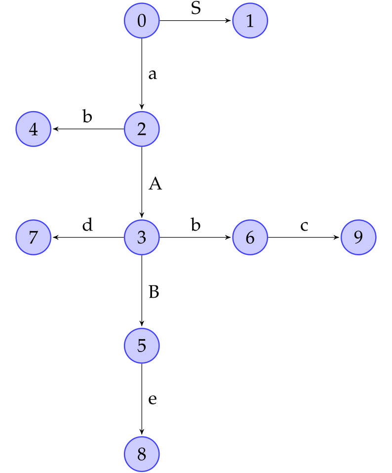


## [8.3][pdf]  (2) Tabella di parsing

<aside style='text-align: left; width: auto;'>#righe = stati automa<br>#colonne = |V ∪ {$}|</aside>

### Introduzione

- ~~**Algoritmo shift/reduce**~~
  - ~~Compie delle **mosse** in base a cosa legge su due **pile ausiliarie**~~
    - ~~$\tt stSt$, **stati**~~
    - ~~$\tt symSt$, **simboli**~~
    - ~~**Valorizzate durante l’esecuzione** a partire dalla parola considerata~~
  - ~~La **mossa** da compiere è **determinata dalla tabella** di parsing~~
- ==**Forma della tabella**==
  - ==<u>Righe</u>: tante quanti gli stati dell’automa caratteristico==
  - ==<u>Colonne</u>: una per ogni simbolo in $V ∪ \set{\$}$==
  - ==**Dipende dall’automa** caratteristico==
    - ==Automi diversi `→` tabelle diverse `→` tipi di parsing diversi==


<aside>Reducing: A → β·<br>Accepting: S → S'·</aside>

### Items speciali

> <u>Definizione</u>  (**Reducing item**)
>
> Item che indica la terminazione dell’analisi di una data produzione
>
> - Il **marker** si trova **in fondo** alla derivazione
> - Segnalati come **stati finali**
>
> Forme diverse per tipi diversi
>
> - LR(0):  $A → β\,·$
> - LR(1):  $[A → β\,·,\, ∆]$

> <u>Definizione</u>  (**Accepting item**)
>
> Stato che se raggiunto implica una **conclusione con successo** dell’algoritmo
>
> - LR(0):  $\set{S' → S·}$
> - LR(1):  $\set{[S' → S·,\, ∆]}$

---

> <u>Note</u>  (**Discriminanti e invarianti**)
>
> ==Per ogni **classe**==
>
> - ==La scelta dell’**automa** e della **lookahead function** distinguono le tecniche di parsing==
> - ==Sono uguali:==
>   - ==La compilazione della **tabella**==
>   - ==L’esecuzione di **shift/reduce**== 


<aside>shift, goto: transizioni<br>reduce: fine produzione</aside>

### Entries

**Operazioni** principali

- ==Mosse **$\tt shift$** e **$\tt goto$**==
  - Dipendono dalla ==**funzione di transizione**== dell’automa
  - ==**$\tt shift$**: consumano un **carattere**==
  - **$\tt goto$**: muovono soltanto
- ==Mosse **$\tt reduce$**==
  - Effettuate quando si raggiungono ==**stati particolari**==
  - Implicano
    - **Estrazione** di elementi **da entrambe le pile**
    - **Inserimento** di elementi nella pila dei **simboli**
  - ==Applicate in base alla **lookahead function ${\cal LA}$**==
    - ==Definita per le **coppie $(P, A → β)$** tali per cui $P$ contiene un **reducing item per $A → β$**==
    - ==Dipende dal **contenuto degli stati** dell’automa==


<aside>Regole per M[P, Y]</aside>

### [8.3.1][pdf]  Costruzione di una tabella di parsing generica

> <u>Procedura</u>  (**Regole di costruzione della tabella di parsing generica**)
>
> Sia $M$ una tabella con delle entries di forma $M [P, Y ]$
>
> - $P$ stato
> - $Y∈V∪\set{\$}$ simbolo
>
> <u>Obiettivo</u>: riempire ciascuna entry $M[P,Y]$ secondo le seguenti regole
>
> |      | Condizione                                                   | $M[P,Y] $             | $\qquad$ |
> | ---- | ------------------------------------------------------------ | --------------------- | -------- |
> | 1.   | $τ (P, Y ) = Q\ ∧\ Y∈T$                                      | ${\tt shift}\ Q$      |          |
> | 2.   | $τ (P, Y ) = Q\ ∧\ Y∈ V\setminus T$                          | ${\tt goto}\ Q$       |          |
> | 3.   | $P\ni \text{acceptingItem}\ ∧\ Y = \$$                       | $\tt accept$          |          |
> | 4.   | $P\ni \text{reducingItem}(A → β)\ ∧\ Y ∈ {\cal LA}(P, A → β)$ | ${\tt reduce}\ A → β$ |          |
> | 5.   | $Y∈T∪\set{\$}$ e nessuna delle precedenti                    | $\texttt{error()}$    |          |

- ==L’informazione contenuta nella **cella $M [P, Y ]$** è utilizzata per stabilire l'**operazione da effettuare** durante il parsing, dipendentemente da==
  - ==stato $P$ attuale==
  - ==simbolo $Y$ letto in cima all’input buffer==
- Le mosse **$\tt reduce$**
  - dipendono dalla **lookahead function**
  - non consumano caratteri
- La **grandezza** della tabella **dipende** dal tipo di algoritmo di **parsing** bottom-up e da **$\cal LA$**
- ==L’**algoritmo di costruzione** della tabella rimane **invariato**==


<aside>shift/reduce<br>reduce/reduce</aside>

### [8.3.2][pdf]  Conflitti

**Entries multiple defined** possono verificarsi in due differenti modalità:

- ==**s/r conflict** (shift/reduce)==: almeno una entry $M [P, Y ]$ contiene ~~(and)~~
  - Un’operazione di ${\tt shift}\ Q$
    - ~~Esiste una $Y$-transizione che va dallo stato attuale $P$ allo stato $Q$~~
  - Un’operazione di ${\tt reduce}\ A → β$
    - ~~$P$ contiene un reducing item per $A → β$ e $Y ∈ {\cal LA}(P, A → β)$~~
- ==**r/r conflict** (reduce/reduce)==: almeno una entry contiene due $\tt reduce$ per produzioni distinte

---

> <u>Nota</u>
>
> Se durante la costruzione della tabella di parsing di tipo LX(y) per la grammatica $\cal G$ si genera un conflitto, allora $\cal G$ non appartiene alla classe LX(y)
>
> - Non si può effettuare un parsing deterministico di $\cal G$ con tale tabella
>


<aside>LA(P, A→β) = follow(A)<br>Riempire la tabella seguendo le 5 regole</aside>

### [8.3.3][pdf]  Costruzione di una tabella di parsing SLR(1)

> <u>Definizione</u>  (**SLR(1) parsing**)
>
> Simple Left Rightmost parsing
>
> - **Simple**:
>   - R(0)-item
>   - ${\cal LA}(P, A → β) = {\rm follow}(A)\qquad ∀ A → β· ∈ P$
> - **Left**: input letto da sinistra
> - **Rightmost**: derivazione rightmost

- Parsing **poco raffinato** le cui tabelle contengono informazioni **grossolane**

---

> <u>Esempio</u>  (**Costruzione di tabella SLR(1)**)
> $$
> \begin{align}
> {\cal G}\ :\ S\ &→\ aABe\\
> A\ &→\ Abc\ |\ b\\
> B\ &→\ d\\
> \end{align}
> $$
> 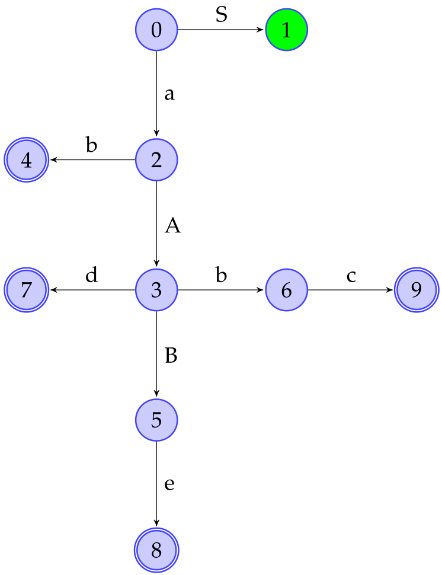
>
> <u>Analisi dell'automa</u>
>
> - L’**accepting item** è contenuto nello stato $1$ (verde)
> - I **reducing item** sono contenuti negli stati finali
>   - Stato $4\,$:  $\set{A → b·}$
>   - Stato $7\,$:  $\set{B → d·}$
>   - Stato $8\,$:  $\set{S → aABe·}$
>   - Stato $9\,$:  $\set{A → Abc·}$
>
> <u>Costruzione della tabella</u>
>
> 0. Inizializzare la tabella con:
>
>     - <u>Righe</u>: stati dell'automa
>     - <u>Colonne</u>: terminali, non-terminali, simbolo $\$$ 
>
> 1. <u>Regole 1, 2, 3</u>: come da definizione
>
> 2. <u>Regola 4</u>:
>
>    1. Calcolare i follow della grammatica, necessari per la funzione di lookahead
>       $$
>       \begin{array}{ccc|cc}
>       & &&& {\rm first} && {\rm follow} & \\\hline
>       & S &&& a && \$ \\\hline
>       & A &&& b && b,d \\\hline
>       & B &&& d && e \\\hline
>       \end{array}\quad\quad
>       $$
>
>    2. Per ogni stato $P$ che contiene un reducing item $A → β$  (~~es.~~ $4,7,8,9$)
>
>       1. Calcolare $Y$ con la lookahead function:  $Y = {\cal LA}(P, A → β)$
>          - In questo caso $Y = {\rm follow}(A)$
>       2. Inserire la mossa $\tt reduce$ nella casella $M [P, Y ]$
>          - ~~es.~~ $M [4, b] = A → b\,·$
>
> 3. <u>Regola 5</u>: valorizzare a $\tt error$ le celle rimanenti
>
> 3. <u>Tabella finale</u>
>
> $$
> \begin{array}{|c|cccccc|cc|}\hline
> \ \ \ \ & \ a\ &\ b\ &\ c\ &\ d\ &\ e\ &\ \$\ &\ S\ &\ A\ &\ B\ \\\hline
> 0&s2&&&&&&1 \\\hline
> 1&&&&&&{\rm Acc} \\\hline
> 2&&s4&&&&&&3 \\\hline
> 3&&s6&&s7&&&&&5 \\\hline
> 4&&r1&&r1 \\\hline
> 5&&&&&s8 \\\hline
> 6&&&s9 \\\hline
> 7&&&&&r2 \\\hline
> 8&&&&&&r3 \\\hline
> 9&&r4&&r4 \\\hline
> \end{array}
> $$
>
> - Valori degli $rK$
>   - $r1 = A → b$
>   - $r2 = B → d$
>   - $r1 = S → aABe$
>   - $r4 = A → Abc$
>
> <u>Osservazioni</u>
>
> - Mosse relative alle colonne
>   - Terminali:  $\tt shift,\ reduce,\ error$ 
>   - Non-terminali:  $\tt goto$
>     - Non possono verificarsi condizioni di $\tt error$
> - $\cal G$ dà origine a una tabella senza conflitti, quindi è SLR(1)

---

> <u>Convenzioni notazionali</u>
>
> - $sQ:={\tt shift}\ Q$
> - $rK:={\tt reduce}\ A → β$
>   - $K$: $K$-esima riduzione
> - ${\rm Acc}:=\tt accept$
> - $Q := {\tt goto}\ Q$


## [8.4][pdf]  (3) Algoritmo Shift/Reduce

<aside>shift: scorre buffer<br>reduce: svuota pile</aside>

### Algoritmo indipendente

> <u>Algoritmo</u>  (**Shift/Reduce**)
>
> <u>Input</u>
>
> - Stringa $w$
> - Tabella di parsing $M$ per $\cal G$
>
> <u>Output</u>
>
> - $w ∈ {\cal L}({\cal G})\ \ ⇒\ $ derivazione di $w$ in ordine inverso
>   - Legge le $\tt reduce$ in ordine inverso per trovare i passi di derivazione che portano a $w$
> - $w \notin {\cal L}({\cal G})\ \ ⇒\ \ \tt error$
>
> <u>Inizializzazione</u>
>
> - Inserire all’interno dell’input buffer la stringa $w\$$
> - Inizializzare due strutture dati
>   - $\tt stSt$ (state stack)
>     - ${\tt stSt.pop}(P_0)$
>   - $\tt symSt$ (symbol stack)
>     - $\tt empty$

- ==**Indipendente** dalla **classe** di parsing considerata==

```pseudocode
void bottomUpParsing(Word w, Table[][] M)
    Buffer bfr = w + '$'
    Symbol b = bfr.firstSymbol()
    Stack stSt, symSt
    stSt.push(P0)
    loop
        State S = stSt.top()
        switch M[S, b]
            case shift(T):
                stSt.push(T)
                symSt.push(b)
                b = bfr.nextSymbol()
            case reduce(A → β):
                for i = 0 to |β| do
                    stSt.pop()
                    symSt.pop()
                State Q = stSt.top()
                symSt.push(A)
                foreach T : M[Q, A] == goto(T) do
                    stSt.push(T)
                output(A → β)
            case accept():
                return
            default:
                error()
```

---

> <u>Esempio</u>  ([pagg. 167-170][pdf])
> $$
> w=abbcde\qquad\qquad
> \begin{align}
> G\ :\
> S\ &→\ aABe\\
> A\ &→\ Abc\\
> A\ &→\ b\\
> B\ &→\ d\\
> \end{align}
> $$
>
> ---
>
> $$
> k_0 = \set{\colorbox{#ffe480}{$S'→·S$}}\quad⇒\quad P_0= \set{S'→·S,\ S→·aABe}\\
> k_1 = \set{S'→S·}\quad⇒\quad P_1= \set{S'→S·}\\
> k_2=\set{S→a·ABe}\quad⇒\quad P_2= \set{S→a·ABe,\ A→·Abc,\ A→·b}\\
> k_3=\set{S→aA·Be,\ A→A·bc}\quad⇒\\
> ⇒\quad P_3= \set{S→aA·Be,\ A→A·bc,\ B→·d}\quad\! \\
> k_4=\set{A→b·}\quad⇒\quad P_4= \set{A→b·}\\
> k_5=\set{S→aAB·e}\quad⇒\quad P_5= \set{S→aAB·e}\\
> k_6=\set{A→Ab·c}\quad⇒\quad P_6= \set{A→Ab·c}\\
> k_7=\set{B→d·}\quad⇒\quad P_7= \set{B→d·}\\
> k_8=\set{S→aABe·}\quad⇒\quad P_8= \set{S→aABe·}\\
> k_9=\set{A→Abc·}\quad⇒\quad P_9= \set{A→Abc·}\\ \
> $$
>
> $$
> P_0→_SP_1\qquad P_0→_aP_2 \\
> P_1→\$ \\
> P_2→_AP_3\qquad P_1→_bP_4 \\
> P_2→_BP_5\qquad P_2→_bP_6 \qquad P_2→_dP_7 \\
> P_4→\$ \\
> P_5→_eP_8 \\
> P_6→_cP_9 \\
> P_7→\$ \\
> P_8→\$ \\
> P_9→\$ \\
> $$
>
> ```mermaid
> graph LR
> 0{0}; 1>1]; 2((2)); 3((3)); 4[[4]]; 5((5)); 6((6)); 7[[7]]; 8[[8]]; 9[[9]]
> 0-->|S|1
> 0-->|a|2
> 2-->|A|3
> 2-->|b|4
> 3-->|B|5
> 3-->|b|6
> 3-->|d|7
> 5-->|e|8
> 6-->|c|9
> ```
>
> ---
>
> $$
> \displaylines{
> \begin{align}
> r1:\ P_4&= \set{A→b·}\\
> r2:\ P_7&= \set{B→d·}\\
> r3:\ P_8&= \set{S→aABe·}\\
> r4:\ P_9&= \set{A→Abc·}\\
> \end{align}
> \\ \ \\
> \begin{array}{c|cc}
> \qquad & \rm first & \rm follow\\\hline
> S & a & \$ \\
> A & b & b,d \\
> B & d & e \\
> \end{array}}
> \qquad
> \begin{array}{|c|cccccc|ccc|}\hline
> \quad &a&b&c&d&e&\$&S&A&B\\\hline
> 0&s2&&&&&&1 \\
> 1&&&&&&A \\
> 2&&s4&&&&&&3 \\
> 3&&s6&&s7&&&&&5 \\
> 4&&r1&&r1 \\
> 5&&&&&s8 \\
> 6&&&s9 \\
> 7&&&&&r2 \\
> 8&&&&&&r3 \\
> 9&&r4&&r4 \\\hline
> \end{array}
> $$
>
> ---
>
> $$
> w=abbcde\$
> $$
>
> $$
> \begin{array}{l|l}
> w & abbcde\$ & \underline{a}bbcde\$ & \underline{ab}bcde\$ & \underline{ab}bcde\$ & \underline{abb}cde\$ & \underline{abbc}de\$ & \underline{abbcd}e\$ &\\
> \tt stSt & 0 & 02 & 024 & 023 & 02369 & 023 & 0237 & \\
> \tt symSt&   & a  & ab  & aA  & aAbc  & aA  & aAd  & \\
> \tt out  &   &    &     & r1  &       & r4  &      &
> \end{array}
> $$
>
> $$
> \begin{array}{l|l}
> w & \underline{abbcd}e\$ & \underline{abbcde}\$ & \underline{abbcde}\$ & \underline{abbcde\$} & \\
> \tt stSt & 0235 & 02358 & 01 & 01 \\
> \tt symSt& aAB  & aABe  & S  & S\$ \\
> \tt out  & r2   &       & r3 & \rm Acc
> \end{array}
> $$
>
> ---
>
> $$
> w∈{\cal G}({\cal L})\qquad\
> \begin{align}
> S&→aABe\\
> B&→d\\
> A&→Abc\\
> A&→b\\
> \end{align}
> $$


## [8.4.1][pdf]  Gestione dei conflitti

<aside>Ambiguità → conflitti</aside>

### Conflitti da ambiguità

> <u>Problema</u>  (**Ambiguità: associatività e priorità**)
>
> Grammatiche ambigue che non esprimono associatività e priorità degli operatori portano a conflitti nella tabella
>
> <u>Soluzione</u>
>
> Per ogni entry multiple defined, si sceglie manualmente le mossa da mantenere


<aside>Sottoalberi risolti prima;<br>reduce come parentesi, assegnano padre a sottoalbero</aside>

### Parse trees

- I parse trees della grammatica, per loro stessa costruzione, veicolano **informazioni sull’annidamento** dei loro elementi in maniera efficace
- L’annidamento può avere corrispondenza diretta con la **parentesizzazione** 
  - ~~e.g.~~ Regole di **precedenza** tra espressioni
- ==<u>Assunzione</u>: i **sottoalberi** vengono risolti **prima** degli alberi padri==
  - ==Ciò stabilisce **regole di precedenza** analoghe a quelle della **parentesizzazione**==
- ==Le mosse **$\tt reduce$** possono essere viste come una **parentesizzazione** (IMP!)==
  - ==Assegnano un **padre a** un determinato **sottoalbero** del tipo $E * E$ o $E + E$ (IMP!)==


---

> <u>Esempio</u>  (**Associatività e precedenza di $*$ e $+$**)
>
> <u>Obiettivo</u>: esprimire
>
> - Associatività sinistra di $*$ e $+$
>   - Albero (a) per espressioni con lo stesso operatore (~~e.g.~~ $E*E*E,\,\ E+E+E$)
> - Precedenza di $∗$ rispetto a $+$
>   - Alberi (c) e (d) per operatori misti, con $*$ nei livelli più bassi
>     - Se $*$ è più in basso viene eseguito prima di $+$, definendone la precedenza
>
> 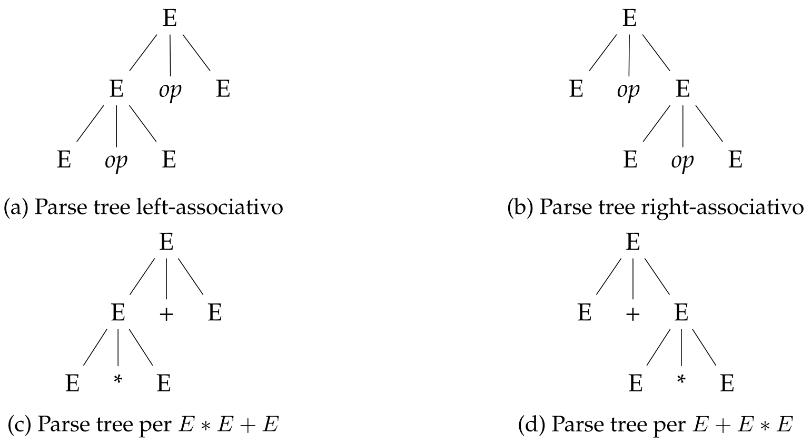


<aside>Specificare l'operazione<br>in caso di conflitti</aside>

### Esempio

---

> <u>Esempio</u>  ([pagg. 170-178][pdf])
> $$
> E\ →\ E+E\ \ |\ \ E*E\ \ |\ \ id
> $$
>
> ---
>
> $$
> \begin{array}{l|l}
> 0=\set{[E'→·E],\ E→·E+E,\ E→·E*E,\ E→·id} & E1,\ id2 \\
> 1=\set{[E'→E·,\ E→E·+E,\ E→E·*E]} & \$,\ +3,\ *4 \\
> 2=\set{[E→id·]} & \$ \\
> 3=\set{[E→E+·E],\ E→·E+E,\ E→·E*E,\ E→·id} & E5,\ id2 \\
> 4=\set{[E→E*·E],\ E→·E+E,\ E→·E*E,\ E→·id} & E6,\ id2 \\
> 5=\set{[E→E+E·,\ E→E·+E,\ E→E·*E]} & \$,\ +3,\ *4 \\
> 6=\set{[E→E*E·,\ E→E·+E,\ E→E·*E]} & \$,\ +3,\ *4 \\
> \end{array}
> $$
>
> ```mermaid
> graph LR
> 0-->|id|2
> 0-->|E|1
> 1-->|+|3
> 1-->|*|4
> 3-->|E|5
> 3-->|id|2
> 4-->|E|6
> 4-->|id|2
> 5-->|+|3
> 5-->|*|4
> 6-->|*|4
> 6-->|+|3
> 
> 0{0}; 1>1]; 2[[2]]; 3((3)); 4((4)); 5[[5]]; 6[[6]]
> ```
>
> ---
>
> $$
> \displaylines{
> \begin{align}
> r2:\ &E→id·\\
> r5:\ &E→E+E·\\
> r6:\ &E→E*E·\\
> \end{align}
> \\ \ \\
> \begin{array}{c|cc}
> \qquad & \rm first & \rm follow\\\hline
> E & id & +\ * \colorbox{#ffe480}{$\$$} \\
> \end{array}}
> \qquad
> \begin{array}{|c|cccc|c|}\hline
> \quad &+&*&id&\$&E\\\hline
> 0&&&s2&&1 \\
> 1&s3&s4&&A \\
> 2&r2&r2&&\colorbox{#ffe480}{$r2$} \\
> 3&&&s2&&5 \\
> 4&&&s2&&6 \\
> 5&r5,s3&s4,r5&&\colorbox{#ffe480}{$r5$} \\
> 6&r6,s3&r6,s4&&\colorbox{#ffe480}{$r6$} \\\hline
> \end{array}
> $$
>
> ---
>
> Stati $5$ e $6$ non deterministici
>
> - $M[5,+]:\ \ \texttt{symSt.top()}=\,...E+E\ ∧\ w\texttt{.next()}=+\quad⇒\quad r5\prec s3$
>   - $+$ è associativo a sinistra
>   - Precedenza a $\tt reduce$: parentesizza $(E+E)$ in cima a $\tt symSt$
> - $M[6,*]:\ \ \texttt{symSt.top()}=\,...E*E\ ∧\ w\texttt{.next()}=*\quad⇒\quad r6\prec s4$
>   - $*$ è associativo a sinistra
>   - Precedenza a $\tt reduce$: parentesizza $(E*E)$ in cima a $\tt symSt$
> - $M[5,*]:\ \ \texttt{symSt.top()}=\,...E+E\ ∧\ w\texttt{.next()}=*\quad⇒\quad s4\prec r5$
>   - $*$ ha priorità su $+$
>   - Precedenza a $\tt shift$: posticipa la parentesizzazione e prosegue la lettura
> - $M[6,+]:\ \ \texttt{symSt.top()}=\,...E*E\ ∧\ w\texttt{.next()}=+\quad⇒\quad r6\prec s3$
>   - $*$ ha priorità su $+$
>   - Precedenza a $\tt reduce$: parentesizza $(E*E)$ in cima a $\tt symSt$


<aside>Precedenza: livelli di produzione inferiori<br>Associatività: ricorsione sinistra ???</aside>

### Riscrivere la grammatica

- ==Una grammatica **$\cal G'$ non ambigua**, tale che ${\cal L}({\cal G}) = {\cal L}({\cal G}')$ genera una tabella senza conflitti==
- ==${\cal G}'$ deve esprimere correttamente le **regole di precedenza e associatività**==
  - ==**Precedenza**: produzioni che generano operatori con **precedenza maggiore** devono stare in **livelli di produzione inferiori**==
    - ==Albero attraversato **bottom-up**==
  - ==**Associatività**: l'associatività sinistra è espressa tramite **ricorsione sinistra**== ==???==
    - ==Derivazione **rightmost**==

---

> <u>Esempio</u>  (**Grammatica $*+$ non ambigua**)
> $$
> \begin{align}
> {\cal G'}\ :\,\ E\ &→\ E + T\ |\ T\\
> T\ &→\ T ∗ id\ |\ id
> \end{align}
> $$
>
> - $*$ è posto in un livello di produzione inferiore per garantirne la precedenza
>
> [Esempio (pag. 179)][pdf]

---

> <u>Note</u>  (**Efficienza**)
>
> - L'aggiunta di un **nuovo non-terminale non impatta** notevolmente l’efficienza degli algoritmi
> - La scrittura di una **grammatica non ambigua** può rivelarsi complicata e **costosa**
> - Spesso si mantengono le **grammatiche ambigue** e si gestiscono i **conflitti manualmente**
>   - Si aggiungono **direttive per il parser**


### [8.4.2][pdf]  Limiti del parsing SLR(1)

---

> <u>Esempio</u>  ([pagg. 180-181][pdf])
> $$
> \begin{align}
> {\cal G}\ :\ S\ &→\ aAd\ |\ bBd\ |\ aBe\ |\ bAe\\
> A\ &→\ c \\
> B\ &→\ c \\
> S'\ &→\ S
> \end{align}
> $$
>
> ---
>
> $$
> \begin{array}{l|l}
> 0=\set{[S'→·S],\ S→·aAd\ |\ ·bBd\ |\ ·aBe\ |\ ·bAe} & S1,\ a2,\ b3 \\
> 1=\set{[S'→S·]} & \$({\rm Acc}) \\
> 2=\set{[S→a·Ad\ |\ a·Be], \ A→·c,\ B→·c} & A4,\ B5,\ c6 \\
> 3=\set{[S→b·Bd\ |\ b·Ae], \ A→·c,\ B→·c} & B7,\ A8,\ c6 \\
> 4=\set{[S→aA·d]} & d9 \\
> 5=\set{[S→aB·e]} & e10 \\
> 6=\set{[A→c·,\ B→c·]} & \$ (r/r) \\
> 7=\set{[S→bB·d]} & d11 \\
> 8=\set{[S→bA·e]} & e12 \\
> 9=\set{[S→aAd·]} & \$ \\
> 10=\set{[S→aBe·]} & \$ \\
> 11=\set{[S→bBd·]} & \$ \\
> 12=\set{[S→bAe·]} & \$ \\
> \end{array}
> $$
>
> ```mermaid
> graph LR
> 0{0}; 1>1]; 2((2)); 3((3)); 4((4)); 5((5)); 6[[6]]; 7((7)); 8((8)); 9[[9]]; 10[[10]]; 11[[11]]; 12[[12]]
> 0-->|S|1
> 0-->|a|2
> 0-->|b|3
> 2-->|A|4
> 2-->|B|5
> 2-->|c|6
> 3-->|B|7
> 3-->|A|8
> 3-->|c|6
> 4-->|d|9
> 5-->|e|10
> 7-->|d|11
> 8-->|e|12
> ```
>
> ---
>
> $$
> \displaylines{
> \begin{align}
> r6_1:\ & A→c·\\
> r6_2:\ & B→c·\\
> r9\,\ :\  & S→aAd·\\
> r10:\ & S→aBe·\\
> r11:\ & S→bBd·\\
> r12:\ & S→bAe·\\
> \end{align}
> \\ \ \\
> \begin{array}{c|cc}
> \qquad & \rm first & \rm follow\\\hline
> S & a,b & \$ \\
> A & c   & d,e \\
> B & c   & d,e \\
> \end{array}}
> \qquad
> \begin{array}{|c|cccccc|ccc|}\hline
> \quad &a&b&c&d&e&\$&S&A&B\\\hline
> 0&s2&s3&&&&&1 \\
> 1&&&&&&A \\
> 2&&&s6&&&&&4&5 \\
> 3&&&s6&&&&&8&7 \\
> 4&&&&s9 \\
> 5&&&&&s10 \\
> 6&&&&r6_1,r6_2&r6_1,r6_2 \\
> 7&&&&s11 \\
> 8&&&&&s12 \\
> 9&&&&&&r9 \\
> 10&&&&&&r10 \\
> 11&&&&&&r11 \\
> 12&&&&&&r12 \\\hline
> \end{array}
> $$
>
> - ==Dallo stato $6=\set{A→c·,\ B→c·}$ e dalla tabella si nota la presenza di un conflitto r/r==


- <u>Osservazione</u>: la presenza di **due reducing items** in uno stato **non** è sempre motivo di **conflitti**

- ==<u>Problema</u>: la presenza di conflitti dipende dalla funzione di **lookahead** grossolana==

  ---

  > - ${\rm follow}(A) = {\rm follow}(B) = \set{d, e}$: conflitti in almeno due celle

- <u>Causa</u>: **tipo di parsing** adoperato troppo grossolano (SLR(1))

  - ==Invece di accorpare tutto all’interno di un singolo stato (~~es.~~ $6$), sarebbe meglio avere due **stati differenti**==

  ---

  > - Gli stati $2$ e $3$ mantengono informazioni differenti
  > - Per poter risolvere l'indecisione è necessario considerare in quale modo si è arrivati all’item di riduzione
  >   - Se è stata letta la parola $ac$ e si è in dubbio su quale operazione $\tt reduce$ effettuare
  >   - Basterebbe poter osservare il prossimo simbolo in lettura
  >     - ${\tt reduce}\ A → c\,$: il prossimo simbolo è $d$
  >       - È possibile derivare da $S$ solo una parola che inizi per $a$ e termini con $d$ ($aAd$)
  >     - ${\tt reduce}\ B → c\,$: il prossimo simbolo è $e$
  >       - È possibile derivare da $S$ solo una parola che inizi per $a$ e termini con $e$ ($aBe$)

- ==<u>Soluzione</u>==

  - ==Usare **LR(1)-items**: mantengono informazioni su quali simboli potrebbero seguire uno stato==
  - Cambiare **tipologia di parsing**


# [Cap 9][pdf]  Parsing bottom-up: LR(1) e LALR(1)

## [9.1][pdf]  (1) Automa caratteristico LR(1)

<aside>[LR(0)-item, LA-set]</aside>

### [9.1.1][pdf]  Stati

> <u>Definizione</u>  (**LR(1)-item**)
> $$
> [A → α · Bβ,\ ∆]
> $$
> Tupla di due elementi
>
> - **LR(0)-item** ($A → α · Bβ$)
> - **Lookahead set** (insieme di caratteri $∆$)


<aside>[closure_0(P), first(βΔ)]</aside>

### [9.1.2][pdf]  Chiusura di un insieme di LR(1)-items

> <u>Definizione</u>  (**Chiusura di un insieme di LR(1)-items**)
>
> Funzione che, dato un set di LR(1)-items $P$
>
> 1. Costruisce il set ${\rm closure}_0$ della parte LR(0) degli items di $P$
> 2. Aggiorna il lookahead set e lo aggiunge alla ${\rm closure}_0$ appena calcolata
>
> $$
> \displaylines{
> \begin{align}
> {\rm closure}_1 (P) = P\ ∪\ \{\ [B → ·γ,\, {\rm Γ}]\ :\ & [A → α · Bβ,\, ∆] ∈ {\rm closure}_1 (P)\ \ ∧\\
> & B → γ ∈ {\cal P}' \ \ ∧\\
> & {\rm first}(β∆) ⊆ {\rm Γ}\ \}
> \end{align}\\[8px]
> {\rm first}(β∆) = \bigcup_{d∈∆}{\rm first}(βd)}
> $$

- ==**Lookahead set**==
  - ==L'informazione che contiene viene **tramandata** agli items che ne derivano==
  - ==È usata solo in caso di **riduzioni**, non incide sulle transizioni==

 ```pseudocode
 Set closure1(Set P)
     foreach item in P do
         unmark(item)
     while ∃ item ∈ P : is_unmarked(item) do
         mark(item)
         if item ~= [A → α·Bβ, ∆] then
             ∆_1 = ∪_{d ∈ ∆} first(βd)
             foreach B → γ ∈ G.P_ do
                 if B → ·γ ∉ prj(P) then
                     unmark([B → ·γ, ∆_1])
                     P.add([B → ·γ, ∆_1])
                 else if [B → ·γ, Γ] ∈ P ∧ ∆_1 ⊈ Γ then
                     P.remove([B → ·γ, Γ])
                     unamrk([B → ·γ, Γ ∪ ∆_1])
                     P.add([B → ·γ, Γ ∪ ∆_1])
     return P
 ```

- $B → ·γ ∉ {\rm prj}(P)$: produzione $B → ·γ$ non è ancora presente in ${\rm closure}_1(P)$
- $\tt foreach$ centrale
  - Se l’elemento è nuovo: si aggiunge con il suo $∆$
  - Se l’elemento è già presente: aggiungere al suo $∆$ eventuali altri elementi


### [9.1.3][pdf]  Costruzione di un automa caratteristico LR(1)

> <u>Algoritmo</u>  (**Costruzione automa LR(1)**)
>
> 1. Costruire lo stato di partenza con l’item $[S' → ·S,\ \set{\$}]$
> 2. Ricorsivamente aggiungere gli stati raggiungibili dagli stati presenti nell’automa
> 3. Aggiungere le transizioni che permettono di passare da uno stato all’altro
>    - Se uno stato $P$ contiene un item nella forma $[A → α · Y β,\ ∆]$ allora esiste una transizione da $P$ ad uno stato $Q$ che contiene l’item $[A → αY · β,\ ∆]$
>    - $Q$ contiene $[A → αY · β,\ ∆]$ quindi contiene gli item di ${\rm closure}_1([A → αY · β,\ ∆])$
>

```pseudocode
void LR1_automaConstruction(Grammar G)
    State P0 = closure_1({[S_ → ·S, {$}]})
    unmark(P0)
    Collection LR = {P0}
    while ∃ P ∈ LR : is_unmarked(P) do
        mark(P)
        foreach Y : (∃ Pj : Pj == [B → α·Yβ, Δ]) do
            k = kernel(target(P, Y)
            if ∃ Q ∈ LR : kernel(Q) == k then
                target(P, Y) = Q
            else
                unmark(closure_1(k))
                LR.add(closure_1(k))
                target(P, Y) = closure_1(k)
    return LR
```

---

> <u>Esempio</u>  ([pagg. 186-189, 191-194][pdf])
> $$
> \begin{align}
> {\cal G}\ :\ S\ &→\ aAd\ |\ bBd\ |\ aBe\ |\ bAe\\
> A\ &→\ c \\
> B\ &→\ c \\
> S'\ &→\ S
> \end{align}
> $$
>
> ---
>
> $$
> \begin{array}{l|l}
> 0=\set{[S'→·S,\ \set{\$}]} ∪ \set{[S→·aAd\ | ·bBd\ | ·aBe\ | ·bAe,\ \set{\$}]} & S1,\ a2,\ b3 \\
> 1=\set{[S'→S·,\ \set{\$}]} ∪ \set{} & \$({\rm Acc}) \\
> 2=\set{[S→a·Ad\ |\ a·Be,\ \set{\$}]} ∪ \set{[A→·c,\ \set{d}],\ [B→·c,\ \set{e}]} & A4,\ B5,\ c6\\
> 3=\set{[S→b·Bd\ |\ b·Ae,\ \set{\$}]} ∪ \set{[A→·c,\ \set{e}],\ [B→·c,\ \set{d}]} & B7, A8, c9\\
> 4=\set{[S→aA·d,\ \set{\$}]} ∪ \set{} & d10 \\
> 5=\set{[S→aB·e,\ \set{\$}]} ∪ \set{} & e11 \\
> 6=\set{[A→c·,\ \set{d}],\ [B→c·,\ \set{e}]} ∪ \set{} & \$ \\
> 7=\set{[S→bB·d,\ \set{\$}]} ∪ \set{} & d12 \\
> 8=\set{[S→bA·e,\ \set{\$}]} ∪ \set{} & e13 \\
> 9=\set{[A→c·,\ \set{e}],\ [B→c·,\ \set{d}]} ∪ \set{} & \$ \\
> 10=\set{[S→aAd·,\ \set{\$}]} ∪ \set{} & \$ \\
> 11=\set{[S→aBe·,\ \set{\$}]} ∪ \set{} & \$ \\
> 12=\set{[S→bBd·,\ \set{\$}]} ∪ \set{} & \$ \\
> 13=\set{[S→bAe·,\ \set{\$}]} ∪ \set{} & \$ \\
> \end{array}
> $$
>
> ```mermaid
> graph TD
> 0-->|a|2
> 0-->|S|1
> 0-->|b|3
> 2-->|A|4
> 2-->|B|5
> 2-->|c|6
> 3-->|B|7
> 3-->|A|8
> 3-->|c|9
> 4-->|d|10
> 5-->|e|11
> 7-->|d|12
> 8-->|e|13
> 0{0}; 1>1]; 2((2)); 3((3)); 4((4)); 5((5)); 6[[6]]; 7((7)); 8((8)); 9[[9]]; 10[[10]]; 11[[11]]; 12[[12]]; 13[[13]]
> ```
>
> - Il conflitto dello stato $6$ è stato risolto grazie ai lookahead-set differenti


## [9.2][pdf]  (2) Tabella di parsing LR(1)

### Introduzione

- La **procedura** di costruzione della tabella è **identica** per tutti i tipi
- Ciò che cambia è la **lookahead function**


### [9.2.1][pdf]  Grammatica dei puntatori

---

> <u>Esempio</u>  ([pagg. 189-190, 195-200][pdf])
> $$
> \begin{align}
> {\cal G}\ :\ S\ &→\ L=R\ |\ R\\
> L\ &→\ *R\ |\ id \\
> R\ &→\ L
> \end{align}
> $$
>
> ---
>
> $$
> \begin{array}{l|l}
> \displaylines{0=\set{[S'→·S,\ \set{\$}]}\ ∪\ \{[S→·L=R\ | ·R,\ \set{\$}],\\
> \quad\ \ [L→·*R\ | ·id,\ \set{\colorbox{#ffe480}{=},\ \$}],\ [R→·L,\ \set{\$}]\}}
> & \displaylines{S1,\ L2,\ R3,\, *4,\ id5\qquad} \\
> 1=\set{[S'→S·,\ \set{\$}]}∪\set{} & \$({\rm Acc}) \\
> 2=\set{[S→L·=R,\ \set{\$}],\ [R→L·,\ \set{\$}]}∪\set{} & \colorbox{#ffe480}{\${\rm(s/r)}},\ =6 \\
> 3=\set{[S→R·,\ \set{\$}]}∪\set{} & \$ \\
> \displaylines{4=\{[L→*·R,\ \set{=,\ \$}]\}∪\{[R→·L,\ \set{=,\ \$}],\\ [L→·*R\ |·id,\ \set{=,\ \$}]\}\qquad\qquad\quad}& \displaylines{R7,\ L8,\, *4,\ id5} \\
> 5=\set{[L→id·,\ \set{=,\ \$}]}∪\set{} & \$ \\
> \displaylines{6=\set{[S→L=·R,\ \set{\$}]}∪\{[R→·L,\ \set{\$}],\\ [L→·*R\ |·id,\ \set{\$}]\}\qquad\qquad\ \ } & R9,\ L10,\, *11,\ id12 \\
> 7=\set{[L→*R·,\ \set{=,\ \$}]}∪\set{} & \$ \\
> 8=\set{[R→L·,\ \set{=,\ \$}]}∪\set{} & \$ \\
> 9=\set{[S→L=R·,\ \set{\$}]}∪\set{} & \$ \\
> 10=\set{[R→L·,\ \set{\$}]}∪\set{} & \$ \\
> \displaylines{11=\set{[L→*·R,\ \set{\$}]}∪\{[R→·L,\ \set{\$}],\\ [L→·*R\ |·id,\ \set{\$}]\}\qquad\quad } & R13,\ L10,\, *11,\ id12 \\
> 12=\set{[L→id·,\ \set{\$}]}∪\set{} & \$ \\
> 13=\set{[L→*R·,\ \set{\$}]}∪\set{} & \$ \\
> \end{array}
> $$
>
> ```mermaid
> graph LR
> 0{0}; 1>1]; 2[[2]]; 3[[3]]; 4((4)); 5[[5]]; 6((6)); 7[[7]]; 8[[8]]; 9[[9]]; 10[[10]]; 11((11)); 12[[12]]; 13[[13]]
> 0-->|S|1
> 0-->|L|2
> 0-->|R|3
> 0-->|*|4
> 0-->|id|5
> 2-->|=|6
> 4-->|R|7
> 4-->|L|8
> 4-->|*|4
> 4-->|id|5
> 6-->|R|9
> 6-->|L|10
> 6-->|*|11
> 6-->|id|12
> 11-->|R|13
> 11-->|L|10
> 11-->|*|11
> 11-->|id|12
> ```
>
> - ==Lo stato $2$ presenta sia $\tt shift$ che $\tt reduce$==
>   - Arco uscente da stato finale
>   - ==Non causa conflitti perché il simbolo in lettura ($=$ o $\$$) discrimina l'operazione==
>     - $M[2,=]=s6$
>     - $M[2,\$]=r2$
>   - Ciò non vale per parsing SLR(1)
> - La grammatica è LR(1) e non è SLR(1)


<aside style='background:red'>TODO</aside>

### [9.2.2][pdf]  Differenze tra SLR(1) e LR(1)

[Esempio (pagg. 200-205)][pdf]

[Esempio (pag. 206)][pdf]


## [9.3][pdf]  (3) Parsing LALR(1)

<aside>Ridondanze tra stati<br>con lo stesso LR(0)</aside>

### Ridondanze

- Il parsing di tipo LR(1) è il più **completo**
- È possibile che l’**automa** caratteristico contenga **ridondanze** (**sottostrutture isomorfe**)
  - <u>Cause</u>
    - ==Le **transizioni** dipendono solo dalla **componente LR(0)**==
    - ==Le **ridondanze** si verificano nel caso in cui gli stati abbiano la **stessa proiezione LR(0)**==
  - ==<u>Soluzione</u>: **parsing LALR(1)**== che utilizza
    - gli **stati** in maniera simile a **SLR(1)** (efficienza e compattezza)
    - una funzione di **lookahead più raffinata** (potenza e precisione)


<aside>Unione di stati<br>con stesso LR(0)</aside>

### [9.3.1][pdf]  Automa caratteristico LRm(1)

L’**automa merged LRm(1) $\cal AM$** costruito a partire dall’automa **LR(1) $\cal A$**

- <u>Stati</u>
  - ==Ottenuti **unendo** all’interno di un **singolo stato di $\cal AM$** gli item negli stati $\lang P_1 , ..., P_n \rang$ di $\cal A$ che hanno le **stesse LR(0)-proiezioni**==
  - ==Nel caso in cui **non** vi sia più di uno stato hanno la **stessa proiezione LR(0)**==
    - Tale stato **non** subisce l’operazione di **unione**
    - ==Viene inserito in $\cal AM$ con il **medesimo lookahead-set**==
- <u>Transizioni</u>
  - Si verificano entrambe le condizioni:
    - Lo stato $P$ di $\cal A$ ha la **stessa $Y$-transizione** a $Q$
    - $P$ è stato **unito** in $\lang P_1 , ..., P_n \rang$ e $Q$ in $\lang Q_1 , ..., Q_m \rang$
  - Allora in $\cal AM$ c’è una **$Y$-transizione da $\lang P_1 , ..., P_n \rang$ a $\lang Q_1 , ..., Q_m \rang$**

[Esempio (pag. 207)][pdf]


<aside>A LR(1) → AM LRm(1)<br>LA() = ∪_[A→β·, Δ_j] Δ_j<br>AM + LA → Tabella LALR(1)</aside>

### [9.3.2][pdf]  Tabella di parsing LALR(1)

> <u>Procedura</u>  (**Tabella LALR(1**)
>
> 1. Costruire l'automa LR(1) $\cal A$
>
> 2. Tradurre $\cal A$ nell'automa LRm(1) $\cal AM$
>
> 3. Definire la lookahead function $\cal LA$
>    $$
>    {\cal LA}(P, A → β) = \bigcup_{[A→β·,\,∆_j ]} ∆_j
>    $$
>
> 4. Costruire la tabella LALR(1) tramite $\cal AM$ e $\cal LA$
>

---

> <u>Esempio</u>  ([pagg. 208-211][pdf])
> $$
> \begin{align}
> {\cal G}\ :\ S\ &→\ AaB\ |\ b\\
> A\ &→\ BcBaA\ |\ ε\\
> B\ &→\ ε
> \end{align}
> $$
>
> ---
>
> $$
> \begin{array}{l|l}
> \displaylines{0=\{[S'→·S,\ \set{\$}]\}∪\{[S→·AaB\ |·b, \set{\$}],\\\quad\,\ [A→·BcBaA\ |\ ·,\ \set{a}],\ [B→·,\ \set{c}]\}} & S1,\ A2,\ b3,\ B4,\ \$(s/r) \\
> 1=\{[S'→S·,\ \set{\$}]\}∪\{\} & \$({\rm Acc}) \\
> 2=\{[S→A·aB,\ \set{\$}]\}∪\{\} & a5 \\
> 3=\{[S→b·, \set{\$}]\}∪\{\} & \$ \\
> 4=\{[A→B·cBaA,\ \set{a}]\}∪\{\} & c6 \\
> 5=\{[S→Aa·B,\ \set{\$}]\}∪\{[B→·,\ \set{\$}]\} & B7,\ \$ \\
> 6=\{[A→Bc·BaA,\ \set{a}]\}∪\{[B→·,\ \set{a}]\} & B8,\ \$ \\
> 7=\{[S→AaB·,\ \set{\$}]\}∪\{\} & \$ \\
> 8=\{[A→BcB·aA,\ \set{a}]\}∪\{\} & a9 \\
> \begin{align}
> 9=\,\, &\{[A→BcBa·A,\ \set{a}]\}\ ∪\\ &\{[A→·BcBaA\ |\ ·,\ \set{a}],\ [B→·,\ \set{c}]\} 
> \end{align} & A10,\ B4,\ \$ \\
> 10=\{[A→BcBaA·,\ \set{a}]\}∪\{\} & \$ \\
> \end{array}
> $$
>
> - ==Le produzioni del tipo $A → ε$ vengono convertite in reducing item $A → ·$==
>
> ```mermaid
> graph LR
> 0{"(0)"}; 1>1];2((2));3[[3]];4((4));5[[5]];6[[6]];7[[7]];8((8));9[[9]];10[[10]]
> 0-->|S|1
> 0-->|A|2
> 0-->|b|3
> 0-->|B|4
> 2-->|a|5
> 4-->|c|6
> 5-->|B|7
> 6-->|B|8
> 8-->|a|9
> 9-->|A|10
> 9-->|B|4
> ```
>
> - Non possono essere uniti stati, quindi è già LRm(1)
>
> ---
>
> $$
> \begin{array}{|r|cccc|cc|}\hline
> &a&b&c&\$&S&A&B\\\hline
> 0&r0_1&s3&r0_2&&1&2&4 \\
> 1&&&&A \\
> 2&s5 \\
> 3&&&&r3 \\
> 4&&&s6 \\
> 5&&&&r5&&&7 \\
> 6&r6&&&&&&8 \\
> 7&&&&r7 \\
> 8&s9 \\
> 9&r9_1&&r9_2&&&10&4 \\
> 10&r10 \\\hline
> \end{array}
> $$
>


<aside>LRm(1) senza LR(1)</aside>

### [9.3.3][pdf]  Automa simbolico

==Metodo che **costruisce un automa LRm(1)** evitando di passare dall’automa LR(1)==

> <u>Definizione</u>  (**Automa simbolico**)
>
> Automa che utilizza simboli al posto dei lookahead-set, i cui items costituiti da:
>
> - Componente LR(0)
> - Lookahead set simbolico
>

> <u>Procedura</u>  (**Costruzione automa simbolico**)
>
> 1. Costruire l’automa come se fosse LR(0)
>    - Stati e transizioni corrispondono all’automa caratteristico LR(0)
> 2. Memorizzare in una tabella le equazioni per tradurre i lookahead-set simbolici in effettivi
> 3. Quando si ha una transizione verso uno stato già visitato
>    1. Considerare solo la componente LR(0) degli items interessati
>       - Non sono rilevanti i loro lookahead-set
>    2. Aggiungere la transizione tra tali stati
>    3.  il lookahead-set dello stato di partenza a quello dello stato target
> 4. Risolvere il sistema di equazioni per valorizzare i simbolici in lookahead-set
>    - Le $\cal LA$ functions corrispondono ai lookahead-set calcolati qui


### [9.3.4][pdf]  Esempi di automi simbolici

---

> <u>Esempio</u>  ([pagg. 212-225][pdf])
> $$
> \begin{align}
> {\cal G}\ :\ S\ &→\ L=R\ |\ R\\
> L\ &→\ *R\ |\ id \\
> R\ &→\ L
> \end{align}
> $$
>
> ---
>
> $$
> \begin{array}{l|l}
> \displaylines{0=\set{[S'→·S,\ \set{x_0}]}\ ∪\ \{[S→·L=R\ | ·R,\ \set{x_0}],\\
> \quad\ \ [L→·*R\ | ·id,\ \set{=,\ x_0}],\ [R→·L,\ \set{x_0}]\}}
> & \displaylines{S1,\ L2,\ R3,\, *4,\ id5\qquad} \\
> 1=\set{[S'→S·,\ \set{x_1}]}∪\set{} & \$({\rm Acc}) \\
> 2=\set{[S→L·=R,\ \set{x_{2.1}}],\ [R→L·,\ \set{x_{2.2}}]}∪\set{} & \${\rm (s/r)},\ =6 \\
> 3=\set{[S→R·,\ \set{x_3}]}∪\set{} & \$ \\
> \displaylines{4=\{[L→*·R,\ \set{x_4}]\}∪\{[R→·L,\ \set{x_4}],\\ [L→·*R\ |·id,\ \set{x_4}]\}\qquad\qquad\quad}& \displaylines{R7,\ L8,\, *4,\ id5} \\
> 5=\set{[L→id·,\ \set{x_5}]}∪\set{} & \$ \\
> \displaylines{6=\set{[S→L=·R,\ \set{x_6}]}∪\{[R→·L,\ \set{x_6}],\\ [L→·*R\ |·id,\ \set{x_6}]\}\qquad\qquad\ \ } & R9,\ L8,\, *4,\ id5 \\
> 7=\set{[L→*R·,\ \set{x_7}]}∪\set{} & \$ \\
> 8=\set{[R→L·,\ \set{x_8}]}∪\set{} & \$ \\
> 9=\set{[S→L=R·,\ \set{x_9}]}∪\set{} & \$ \\
> \end{array}
> $$
>
> $$
> \begin{align}
> x_0&=\set{\$} \\
> x_1 &= x_0 \\
> x_{2.1} &= x_0 \\
> x_{2.2} &= x_0 \\
> x_3 &= x_0 \\
> x_4 &= \set{=,\ \$}∪ x_4 ∪ x_6 \\
> x_5 &= \set{=,\ \$}∪ x_4 ∪ x_6 \\
> x_6 &= x_{2.1} \\
> x_7 &= x_4 \\
> x_8 &= x_4 ∪ x_6 \\
> x_9 &= x_6 \\
> \end{align} \qquad\displaylines{
> x_0=x_1=x_{2.1}=x_{2.2}=x_3=x_6=x_9=\set{\$} \\
> x_4=x_5=x_7=x_8= \set{=,\ \$}}
> $$
>
> - ==Stato $0\,$: $\,β≠ε$ corrisponde ad un carattere ($=$) e non a una variabile==
> - ==Stato $2\,$: ogni item del kernel possiede il proprio lookahead-set simbolico==
> - ==Stato $4\,$: ha transizioni verso stati con kernel già visitati==
>   1. ==Aggiungere la transizione verso tali stati==
>   2. ==Aggiungere il lookahead-set dello stato di partenza a quello dello stato target==
> - ==Stato $5\,$: deriva da $0$, quindi istanzia il $\rm Δ$ dell'item di provenienza ad una nuova variabile==
> - ==Stato $8\,$: gli stati $4$ e $6$ hanno una transizione verso uno stato con lo stesso kernel==
>   1. ==Aggiungere le transizioni $4→8$ e $6→8$==
>   2. ==Porre il lookahead-set di $8$ a $\set{x_4} ∪ \set{x_6}$==
>
> ```mermaid
> graph LR
> 0{0};1>1]; 2[[2]]; 3[[3]]; 4((4)); 5[[5]]; 6((6)); 7[[7]]; 8[[8]]; 9[[9]];
> 0-->|L|2
> 0-->|S|1
> 0-->|R|3
> 0-->|*|4
> 0-->|id|5
> 2-->|=|6
> 4-->|*|4
> 4-->|L|8
> 4-->|R|7
> 4-->|id|5
> 6-->|R|9
> 6-->|L|8
> 6-->|*|4
> 6-->|id|5
> ```
>
> - Dimensione di automa LR(0), precisione di LR(1)

---

> <u>Esempio</u>  ([pagg. 225-228][pdf])
> $$
> S\ →\ aSb\ |\ ab
> $$
>
> ---
>
> $$
> \begin{array}{l|l}
> 0=\set{[S'→·S,\ \set{x_0}]}∪\set{[S→·aSb\ |·ab,\ \set{x_0}]} & S1,\ a2\\
> 1=\set{[S'→S·,\ \set{x_1}]}∪\set{} & \${\rm (Acc)} \\
> \displaylines{
> 2=\set{[S→a·Sb,\ \set{x_{2.1}}],\ [S→a·b,\ \set{x_{2.2}}]}\\
> ∪\set{[S→·aSb\ |·ab,\ \set{\colorbox{#ffe480}{$b$}}]}} & S3,\ b4,\ a2 \\
> 3=\set{[S→aS·b,\ \set{x_3}]}∪\set{} & b5 \\
> 4=\set{[S→ab·,\ \set{x_4}]}∪\set{} & \$ \\
> 3=\set{[S→aSb·,\ \set{x_5}]}∪\set{} & \$ \\
> \end{array}
> $$
>
> $$
> \begin{align}
> x_0 &= \set{\$} \\
> x_1 &= x_0 \\
> x_{2.1} &=  x_0∪\set{b} \\
> x_{2.2} &=  x_0∪\set{b} \\
> x_3 &= \set{\colorbox{#ffe480}{$b$}} \\
> x_4 &= x_{2.2} \\
> x_5 &= x_3
> \end{align} \qquad\displaylines{
> x_0=x_1=\set{\$} \\
> x_{2.1}=x_{2.2}=x_4=\set{\$,\ b} \\
> x_3=x_5\set{b}}
> $$


# [Cap 10][pdf]  Analisi semantica

## [10.1][pdf]  Introduzione all’analisi semantica

<aside>Valorizzazione di parole tramite attributi e regole</aside>

### [10.1.1][pdf]  Grammatiche attribuite

> <u>Definizione</u>  (**Grammatica attribuita, Syntax-Directed Definitions, SDD**)
>
> Tipo di grammatica come le precedenti, con due elementi aggiuntivi:
>
> - **Attributi** associati ai simboli della grammatica
> - **Regole** associate alle produzioni della grammatica

- ==**Attributi**: numeri, tipi, riferimenti alla tabella dei simboli ecc.==
  - ==**Valorizzano i simboli** di una parola==
- ==**Regole**: funzioni degli attributi dei simboli della produzione==

> <u>Definizione</u>  (**Analisi semantica**)
>
> Operazione che, con simboli e regole, valorizza ciò che esprime una parola di una grammatica


<aside style='text-align: left; width: auto;'>- Terminali: lexval<br>- Sintetizzati: driver<br>- Ereditati: non-T nel body</aside>

### [10.1.2][pdf]  Tipi di attributi

Due categorie:

- ==**Attributi sintetizzati**: attributi del **driver** di una produzione==
  - ==Definiti in funzione degli attributi dei simboli del body della produzione==
- ==**Attributi ereditati**: attributi dei **non-terminali del body** della produzione==
  - ==Definiti in funzione degli altri simboli del body della produzione==

==Gli **attributi dei terminali** sono **sempre noti** poiché ottenuti dall’**analisi lessicale**==

- ==**Valore dei terminali**: **valore lessicale** ($\tt lexval$)==
  - **Valore associato all'identificatore** che corrisponde al terminale
  - I terminali rappresentano le **variabili**
    - **Valori ben definiti**, riconosciuti e salvati dall’**analizzatore lessicale**
  - Non serve **nessuna regola** per calcolarli
- ==**Valore dei non-terminali**==: dipende da
  - ==**Funzione** che rappresentano==
  - ==**Terminali** utilizzati==


<aside>Valorizza le parole a partire dai valori lessicali</aside>

### Fasi di analisi

1. ==**Analizzatore lessicale**==
   1. Prende il **codice**
   2. Sostituisce i **terminali** con i loro **identificatori**
   3. ==Per ogni **identificatore** memorizza il **valore lessicale** ($\tt lexval$) nella **tabella dei simboli**==
2. ==**Analizzatore sintattico**==
   1. Riceve la **tabella dei simboli** identificatore-valore dall'analizzatore lessicale
   1. ==**Valorizza** ciò che viene espresso dalle **parole** di una grammatica==


<aside>Valorizzare i nodi del PT dalle foglie alla radice</aside>

### Parse tree annotato

> <u>Definizione</u>  (**Parse tree annotato**)
>
> Parse tree in cui ogni nodo contiene le annotazioni riguardanti gli attributi del simbolo che si trova in quel nodo

Utilizzo di una **grammatica attribuita** per calcolare il **valore di una parola**:

1. ==**Creare il PT annotato** per tale parola==
2. ==Utilizzare il **PT annotato** e le **regole** della grammatica attribuita per **valorizzarne i nodi**==
   - ==Procedere progressivamente **dalle foglie alla radice**==
3. ==Quando viene **valorizzata la radice** del PT annotato si è ricavato il **valore della parola**==


<aside>Topsort per verificare<br>le dipendenze</aside>

### [10.1.4][pdf]  Verificare se un PT annotato può essere valutato

==**Non sempre** un PT annotato può essere **valutato**==

> <u>Procedura</u>  (**Verificare la valutabilità di un PT annotato**)
>
> 1. Costruire un **grafo delle dipendenze**
>    1. Impostare **un nodo** nel grafo **per ogni attributo** associato a qualche nodo del PT
>    2. Per ogni attributo $X.x$ usato per definire l’attributo $Y.y$, aggiungere un **arco** dal nodo di $X.x$ al nodo di $Y.y$ 
>       - Rappresenta la **dipendenza** di $Y.y$ da $X.x$
> 2. Verificare che non vi siano **conflitti tra le dipendenze** con l'**ordinamento topologico**
>    - Se l'ordinamento non esiste, allora il PT non è valutabile
>    - Se si trova un ordinamento topologico, allora l’SDD è valutabile
>      - Si è ottenuto un **ordine** da seguire **per la valutazione**

> <u>Regola</u>  (**Attributi di tipo sintetizzato**)
>
> Quando tutti gli attributi sono di tipo sintetizzato allora una visita in postordine può sostituire l’ordinamento topologico

```pseudocode
void postorder(N)
    Node C = N.leftmost_child()
    while C != NULL do
        postorder(C)
        C = C.right_sibiling()
    evaluate_attributes(N)
```

Esistono due classi di SDD per cui è sempre **garantita** l’esistenza di un **ordinamento topologico**:

- ==**S-attributed SDD**: tutti gli attributi dell’SDD sono **sintetizzati**==
  - ==Sufficiente una **visita in postordine**==
  - ==Ideali per il parsing **bottom-up**==
- ==**L-attributed SDD**==: attributi ereditati che rispettano il seguente **vincolo sulle eredità**:
  - ==Si può ereditare solo dal **padre** o dai **fratelli sinistri**==
  - Per ogni produzione $A → X_1 ...X_n$ la definizione di ogni $X_j .i$ utilizza solamente ~~(or)~~
    - Attributi ereditati di $A$
    - Attributi sintetizzati o ereditati dei fratelli sinistri di $X_j$, ovvero $X_1 ...X_{j−1}$
  - ==Ideali per il parsing **top-down**==

==Permettono creare e valutare il **PT** attribuito in **contemporanea al parsing** della stringa==


### [10.1.3][pdf]  Esempi

---

> <u>Esempio</u>  ([pagg. 230-237][pdf])
> $$
> \begin{align}
> {\cal G}\ :\ V\ &→\ E\\
> E\ &→\ E+T\ |\ T\\
> T\ &→\ T*F\ |\ F\\
> F\ &→\ (E)\ |\ d
> \end{align}
> $$
>
> $$
> w\ =\ 3+4
> $$
>
> ---
>
> $$
> SDD:\qquad
> \begin{array}{l}
> V→E && \set{V.val = E.val}\\
> E→ E_1 + T && \set{E.val = E_1 .val + T.val}\\
> E→T && \set{E.val = T.val}\\
> T→ T_1 ∗ F && \set{T.val = T_1 .val ∗ F.val}\\
> T→F && \set{T.val = F.val}\\
> F→ (E) && \set{F.val = E.val}\\
> F→ d && \set{F.val = d.lexval}\\
> \end{array}
> $$
>
> - ==I pedici numerici differenziano il body dal driver, non hanno valenza semantica==
> - ==La colonna di sinistra rappresenta le regole==
>   - ==Ogni regola contiene attributi ($X.y$) e operatori logici e matematici ($+,*$)==
>
> ```mermaid
> graph TD
> 0V-->0E
> 0E-->0El-->0Tl-->0Fl-->0dl
> 0E-->0+
> 0E-->0Tr-->0Fr-->0dr
> 0V[V]; 0E[E]; 0+[+]
> 0El[E]; 0Tl[T]; 0Fl[F]; 0dl[d];
> 0Tr[T]; 0Fr[F]; 0dr[d]
> 
> 1V-->1E
> 1E-->1El-->1Tl-->1Fl-->1dl
> 1E-->1+
> 1E-->1Tr-->1Fr-->1dr
> 1V[V.val]; 1E[E.val]; 1+[+]
> 1El[E.val]; 1Tl[T.val]; 1Fl[F.val]; 1dl[d.lexval];
> 1Tr[T.val]; 1Fr[F.val]; 1dr[d.lexval]
> 
> 2V-->2E
> 2E-->2El-->2Tl-->2Fl-->2dl
> 2E-->2+
> 2E-->2Tr-->2Fr-->2dr
> 2V[V.val=7]; 2E[E.val=7]; 2+[+]
> 2El[E.val=3]; 2Tl[T.val=3]; 2Fl[F.val=3]; 2dl[d.lexval=3];
> 2Tr[T.val=4]; 2Fr[F.val=4]; 2dr[d.lexval=4]
> ```
>
> 1. ==Costruire il parse tree per la parola data==
> 2. ==Tradurlo in parse tree annotato==
> 3. ==Valorizzarlo, dal basso verso l'alto, seguendo le regole di attribuzione della SDD==
> 4. ==Una volta valorizzata la radice, si è ricavato il valore della parola==
>
> <u>Nota</u>: tutti gli attributi sono sintetizzati

<aside style='background:red'>TODO capiscici!</aside>

---

> <u>Esempio</u>  ([pagg. 239-241][pdf])
> $$
> \begin{align}
> {\cal G}\ :\
> V\ \ &→\ E\\
> E\ \ &→\ TE'\\
> E' \ &→\ +TE'\ |\ ε\\
> T\ \ &→\ FT'\\
> T' \ &→\ *FT'\ |\ ε\\
> F\ \ &→\ (E)\ |\ d\\
> \end{align}
> $$
>
> $$
> w\ =\ 3*5
> $$
>
> ---
>
> 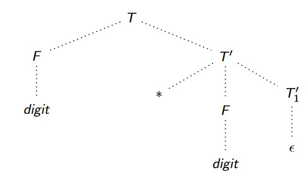
>
> 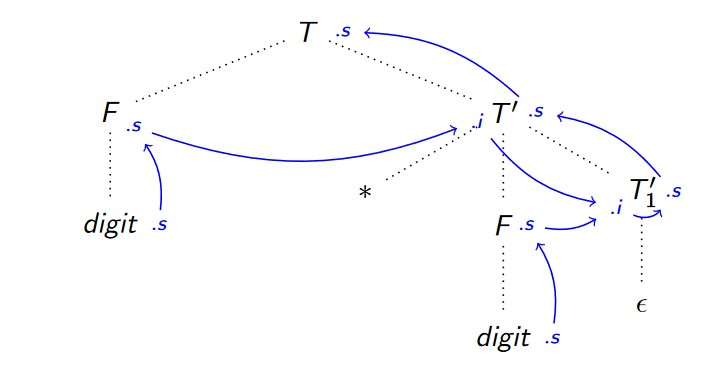
>
> - Albero con le dipendenze ($s$ sintetizzate, $i$ ereditarie)
>
> $$
> SDD:\qquad
> \begin{array}{l}
> V\ \ →\ E      && \set{V.s=E.s} \\
> E\ \ →\ TE'    && \set{E.s = E'.s;\ E'.i = T.s} \\
> E' \ →\ +TE'_1    && \set{E'.s = E'_1.s;\ E'_1.i = E'.i + T.s} \\
> E' \ →\ ε      && \set{E'.s=E'.i} \\
> T\ \ →\ FT'    && \set{T'.i=F.s;\ T.s = T'.s} \\
> T' \ →\ *FT'_1 && \set{T'_1.i = T'.i ∗ F.s;\ T'.s = T'_1.s} \\
> T' \ →\ ε      && \set{T'.s = T'.i} \\
> F\ \ →\ (E)    && \set{F.s = E.s} \\
> F\ \ →\ d      && \set{F.s = d.lexval} \\
> \end{array}
> $$


<aside>Shift/reduce con pila semSt per gli attributi</aside>

### [10.1.6][pdf]  Traduzione durante il parsing

==<u>Obiettivo</u>: **tradurre durante la fase di parsing**==

- **Ottimizzare** le attività della compilazione, **evitando**
  - La prima elaborazione **sintattica**, per ottenere il PT
  - La seconda elaborazione **semantica**, per valutare gli attributi

==<u>Idea</u>: usare una **terza pila $\tt semSt$** per conservare gli **attributi** durante shift/reduce==

==[Esempio (pagg. 242-248)][pdf]==


<aside>È utile tradurre l'SDD<br>in S-attribuito</aside>

### [10.1.7][pdf]  Tradurre stringhe in numeri

---

> <u>Problema</u>  (**Tradurre stringhe in numeri**)
>
> Data una stringa di digit, ottenere il suo valore decimale
>
> <u>Soluzione</u>
>
> 1. Grammatica che genera il linguaggio delle stringhe di digit ($D=Digit$)
> 2. Relativo schema di traduzione
>
> $$
> \begin{array}{l}
> S\,\ →\ D && \set{{\tt print}(D.v)} \\
> D\ →\ D_1\,d && \set{D.v = 10·D_1 .v + d.{\rm lexval}} \\
> D\ →\ d && \set{D.v = d.{\rm lexval}}
> \end{array}
> $$
>
> - Tale grammatica è LALR(1) e l’SDD è S-attribuito
>   - Il valore del padre dei sottolaberi è sempre e solamente dipendente da quello dei figli
>   - Ciò permette di eseguire le due elaborazioni in modo congiunto

---

> <u>Problema</u>  (**Tradurre stringhe in numeri decimali o ottali**)
>
> Data una stringa di digit, ottenere il suo valore interpretato in decimale oppure in ottale
>
> <u>Soluzione</u>
>
> 1. Grammatica che genera il linguaggio delle stringhe di digit ($D=Digit, N=Num$)
>    $$
>    \begin{align}
>    S\ &→\ N \\
>    N\ &→\ oD\ |\ D \\
>    D\ &→\ Dd\ |\ d
>    \end{align}
>    $$
>
>    - Stringhe con il simbolo $o$ specificano che il valore da ottenere è ottale
>    - La grammatica è LALR(1)
>    - L’SDD non è S-attribuito
>      - Il simbolo $o$ si trova nel sottoalbero sinistro dell’albero e i $Digits$ in quello destro
>        - Non è possibile calcolare il valore fino a che non si raggiunge la cima
>      - Il valore del sottoalbero di destra dipende dal valore dei fratelli e non solamente da quello dei figli
>
> 2. ==Modificare la grammatica perché sia LALR(1) e l’SDD sia S-attribuito== ($O=Oct, X=Dec$)
>    $$
>    \begin{align}
>    S\ &→\ N \\
>    N\ &→\ O D\ |\ XD \\
>    O\ &→\ o \\
>    X\ &→\ ε \\
>    D\ &→\ D d\ |\ d
>    \end{align}
>    $$
>
>    - ==Introduce la possibilità di inserire delle regole per valorizzare variabili globali che stabiliscono la base==
>
> 3. Relativo schema di traduzione
>
> $$
> \begin{array}{l}
> S\ →\ N && \set{{\tt print}(N.v)} \\
> N\ →\ OD && \set{N.v = D.v} \\
> N\ →\ XD && \set{N.v = D.v} \\
> O\ →\ o && \set{b = 8} \\
> X\ →\ ε && \set{b = 10} \\
> D\ →\ D_1d && \set{D.v = b·D_1.v + d.{\rm lexval}} \\
> D\ →\ d && \set{D.v = d.{\rm lexval}}
> \end{array}
> $$
>
> - ==Stabilire separatamente la base mediante tali regole permette di poter svolgere i calcoli necessari senza rinunciare all’efficienza==


## [10.2][pdf]  Alberi di Sintassi Astratta

<aside>Foglie: record o valore<br>Nodi: operazioni fra figli</aside>

### [10.2.1][pdf]  Introduzione

**Abstract Syntax Trees**

- ==Rappresentazione **compatta** degli alberi di derivazione==
- Ottenibili tramite passi di **semplificazione** dal rispettivo **albero di derivazione** di una parola
- Ogni **nodo** rappresenta un **passaggio intermedio** del processo descritto dalla parola in analisi
- **Salvato nodo per nodo**
  - ==**Foglie**==
    - ==Salvate come **link a record nella tabella dei simboli**==
    - Una foglia per ogni identificatore ed ogni valore diretto presente nella parola in analisi
  - ==**Nodi intermedi**==
    - **Struttura topologica** dell’albero
    - Rappresentano le **operazioni** compiute tra variabili o valori diretti
      - ==**Operazioni tra altri nodi**==


<aside>newLeaf(label, val)<br>newNode(label, c1, ..., ck)</aside>

### [10.2.2][pdf]  Costruzione di un AST

- L’AST si può costruire tramite operazoni di **compattazione** a partire dall’**albero di derivazione**

- ==<u>Obiettivo</u>: calcolare l’AST direttamente **durante** la fase di **parsing**==
  - Contemporaneamente all’**analisi sintattica**
  
  - Necessarie **due funzioni**
  
    - ==**${\tt newLeaf}(label, val)$**: salva un nodo foglia con i campi etichetta valore==
  
    - ==**${\tt newNode}(label, c_1, ..., c_k)$**: crea un nodo con $k$ figli==
      - ==**$label$**: **operazione** rappresentata dal nodo==
      - ==**$c_1, ...,c_k$**: **operandi**, rappresentati come riferimenti ai nodi **figli**==


<aside>Come istanziare nodi<br>in caso di riduzioni</aside>

#### Funzioni di attribuzione

Per costruire l’AST durante la fase di parsing bisogna definire le **regole semantiche**

- ==Chiamate **funzioni di attribuzione** o **azioni semantiche**==
- ==Indicano **quando e come istanziare un nodo** per l’AST durante il parsing==
  - ==Ogni volta che si incontra una **riduzione**==


#### Costruzione di un AST

Memorizzazzione dell’**AST** mentre si svolge il **parsing** della stringa

- ==Ogni volta che si incontra una **riduzione si aggiunge un nodo** all’AST in costruzione==
- ==La **forma** di tale nodo è definita dalle **funzioni di attribuzione** dei nodi dell’AST==

---

> <u>Osservazioni</u>
>
> - ==Per ottenere la parola in analisi è necessario conoscere l’ordine delle produzioni utilizzate==
>   - È possibile fare la derivazione a mente e evitare di costruire la tabella
> - Non è sempre possibile costruzire l'AST mentre si fa il parsing
>   - ~~e.g.~~ SDD L-attribuiti

---

> <u>Esempio</u>  ([pagg. 252-256][pdf])
> $$
> \begin{align}
> {\cal G}\ :\ E\ &→\ E+T\ |\ E−T\ |\ T\\
> T\ &→\ (E)\ |\ id\ |\ num
> \end{align}
> $$
>
> $$
> w\ =\ a-4+c
> $$
>
> ---
>
> $$
> \begin{array}{l}
> E → E_1+T && \set{E.node={\tt newNode}('+',\ E_1.node,\ T.node)}\\
> E → E_1−T && \set{E.node={\tt newNode}('-',\ E_1.node,\ T.node)}\\
> E → T     && \set{E.node=T.node}\\
> T → (E)   && \set{T.node=E.node}\\
> T → id    && \set{T.node={\tt newLeaf}(id,\ id.entry)}\\
> T → num   && \set{T.node={\tt newLeaf}(num,\ num.lexval)}\\
> \end{array}
> $$
>
> $$
> w:\ id-num+c\qquad
> \begin{align}
> T&→id\\
> E&→T\\
> T&→num\\
> E&→E-T\\
> T&→id\\
> E&→E+T\\
> \end{align}
> $$
>
> 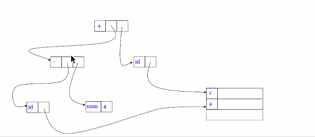

---

> <u>Esempio</u>  ([pagg. 257-263][pdf])
> $$
> \begin{array}{l}
> E→ T E'     && \set{E.s=E'.s;\ E'.i=T.s} \\
> E'→ +T E'_1 && \set{E'.s=T.s;\ E'_1.i=E'.i+T.s} \\
> E'→ −T E'_1 && \set{E'.s=T.s;\ E'_1.i=E'.i-T.s} \\
> E'→ε        && \set{E'.s=E'.i} \\
> T→ (E)      && \set{T.s=E.s} \\
> T→ id       && \set{T.s=id.entry} \\
> T→ num      && \set{T.s=num.lexval} \\
> \end{array}
> $$
>
> $$
> \begin{array}{l}
> E→ T E'     && \set{E.node = E'.node;\ E'.i=T.node} \\
> E'→ +T E'_1 && \set{E'.node =E'_1.node = {\tt newNode}('+',\ E'.i,\ T.node)} \\
> E'→ −T E'_1 && \set{E'.node =E'_1.node = {\tt newNode}('-',\ E'.i,\ T.node)} \\
> E'→ε        && \set{E'.node = E'.i} \\
> T→ (E)      && \set{T.node=E.node} \\
> T→ id       && \set{T.node={\tt newLeaf}(id.entry)} \\
> T→ num      && \set{T.node={\tt newLeaf}(num.lexval)} \\
> \end{array}
> $$
>
> - [Vedi dispensa][pdf]

---

> <u>Esempio</u>  ([pagg. 263-266][pdf])
> $$
> \begin{array}{l}
> D\ →\ TL && \set{L.i=T.type} \\
> T\ →\ int && \set{T.type=int} \\
> T\ →\ float && \set{T.type=float} \\
> L\ →\ L_1 , id && \set{{\tt addType}(id.entry,\ L.i);\ L_1 .i = L.i} \\
> L\ →\ id && \set{{\tt addType}(id.entry,\ L.i)} \\
> \end{array}
> $$


# [III][pdf]  Aftermath

# [Cap 11][pdf]  La generazione del codice intermedio

## [11.2][pdf]  Il codice intermedio

### [11.2.1][pdf]  Rappresentazione del codice intermedio

> <u>Definizione</u>  (**Codice intermedio**)
>
> Rappresentazione del codice di partenza, abbastanza astratta da nascondere specifiche tipiche del codice macchina, ma più specifica del linguaggio originale di partenza

Modalità di **rappresentazione**

- **Strutture a grafo**
  - Grafo a partire dai **parse trees** (PT, AST o DAG)
    - Ordine di **compattezza**: DAG < AST < PT
- **Codice a tre indirizzi**
  - Codice che permette di referenziare **al più tre valori in un singolo statement**
    - $x = y\ {\tt op}\ z$
    - **Limita la complessità** degli statements
  - Rappresentazione **testuale** di un **AST**
    - Semplifica la generazione di linguaggio macchina e la sua ottimizzazione
    - Non è molto frequente perché **machine dependent**
- **Codice in un altro linguaggio**
  - Altro **linguaggio di programmazione** come codice intermedio
  - **Risparmia** l'implementazione di un **backend** per la compilazione
    - È sufficiente utilizzare la **catena di compilazione** del linguaggio intermedio
    - La scelta favorita è il **C**, perché è flessibile e dispone di **gcc**

[Esempi (pagg. 269-270)][pdf]


## [11.3][pdf]  Statement per il controllo di flusso
### [11.3.1][pdf]  Istruzioni condizionali
### [11.3.2][pdf]  Il programma come statement

### [11.3.3][pdf]  Semplice blocco if-then

### [11.3.4][pdf]  Blocco if-then-else
### [11.3.5][pdf]  Traduzione di un ciclo while

### [11.3.6][pdf]  Traduzione di operazioni booleane

- ### [Esempi (pagg. 271-276)][pdf]


# [Cap 12][pdf]  Sintesi e conclusioni

## Riepilogo

### Fasi di compilazione

1. **Analisi lessicale**
   1. Distingue i **lessemi** in un dato input
   2. Restituisce una stringa di **tokens**
      - Elementi che possono essere letti da un analizzatore sintattico
   3. Iniziare a popolare la **tabella dei simboli**
2. **Analisi sintattica**
   - Verifica se la **stringa** ottenuta sopra **appartiene al linguaggio** di una data grammatica
     - Restituisce l’**albero di derivazione**, in caso positivo
   - Può **accorpare** ulteriori **operazioni**
     - ~~e.g.~~ Analisi semantica, codice intermedio
3. **Analisi semantica**
   - **Valorizza** e assegna **attributi** agli elementi riconosciuti nelle fasi precedenti
   - **Controlli statici**
     - ~~e.g.~~ **Compatibilità** di operandi e operatori negli statements, sollevamento di **errori**
4. **Generazione di codice intermedio**
   - **Rappresentazione** intermedia della stringa data in **input**
   - **Ottimizzazioni indipendenti** dal linguaggio finale (target code)
5. **Generazione del codice macchina**
   - Traduzione del codice intermedio in **linguaggio macchina**
   - **Ottimizzazioni** legate all’**architettura**


### [12.1][pdf]  Analisi lessicale

<u>Input</u>: stringa di **lessemi**

<u>Output</u>

1. Stringa **tokens**: $\tt <name, value>$
   - Un token per ogni **terminale**
     - **Identificatori**: $\tt <id, ST\_reference>$
     - **Numeri**: $\tt <num, lexval>$
   - **Longest match**
   - **Automi** a stati finiti
     - Linguaggi **regolari**, derivati da grammatiche regolari
2. **Symbol table**: $\texttt{[reference, name, attributes]}$
3. Stringa di **token names**

---

> <u>Esempio</u>  (**Analisi lessicale**)
>
> 0. $$
>    \tt position = initial + rate ∗ 60
>    $$
>
> $\ $
>
> 1. $$
>     \tt < id, 1 > assign < id, 2 > sumop < id, 3 > mulop < num, 60 >
>    $$
> 
> 
>$\ $
> 
>2. $$
>    \begin{array}{ccllc}
>    & \tt Reference && \tt\ Name && \tt Attributes & \\\hline
>    & \tt 1 && \tt position && \tt ... & \\
>    & \tt 2 && \tt initial  && \tt ... & \\
>    & \tt 3 && \tt rate     && \tt ... & \\
>     \end{array}
>    $$
> 
>$\ $
> 
>3. $$
>    \tt id = id + id ∗ num
>    \\[-10px] \
>   $$
> 


### [12.2][pdf]  Analisi sintattica

1. **Verificare** se la lista di token aderisce alla **grammatica**

   - Se no, errore

2. **Albero di derivazione**
   - PT o AST
   - Grammatiche regolari → complessità **lineare**

3. **Parsing**
   - **Top-down**

     - Grammatica **LL(1)**
        1. **No ricorsive sinistre**
           - Alcune possono essere trasformate in LL(1)
        2. **No fattorizzabili a sinistra**
           - Alcune possono essere trasformate in LL(1)
        3. **No ambigue**
           - Esiste almeno una stringa derivabile in 2 modi diversi, entrambi leftmost

     1. Partire dalla derivazione dello **start symbol**
     2. Costruire il **parse tree** tramite derivazione **leftmost**

   - **Bottom-up**

     - Grammatiche **SLR, LR(1), LALR**
        - **SLR**
          - Automa **semplice**, di **veloce** computazione, povero di informazioni
          - Rischio di **conflitti**
        - **LR(1)**
          - Automi **precisi**
          - Lookahead set ricco di **informazioni** su quando applicare le riduzioni
          - Sovrabbondanza che **affligge tempo e spazio** di computazione
        - **LALR**
          - **Tabella** di parsing delle dimensioni di **SLR**
          - **Complessità** di calcolo leggermente **superiore a SLR**
          - **Lookahead set** e precisione di **LR(1)**
        - Differenti per la **precisione** dell'inserimento di **riduzioni** nelle entry della tabella

     1. **Parsing table**
        - **Dipendente** dal tipo di grammatica
     2. **Shift-reduce**
        - **Indipendente** dal tipo di grammatica
        - **Analizza** la lista di **token** in input
          - **$\tt shift$**: **scorre il buffer** di lettura secondo la **parsing table**
          - **$\tt reduce$**: **stringa derivabile** da una produzione della grammatica
        - **Entry multiple defined**
          - <u>No</u>: successo, **parse tree** (riduzioni in ordine di esecuzione)
          - <u>Sì</u>: **errore**, il parsing usato non è dello stesso tipo della grammatica


### [12.3][pdf]  Analisi semantica

<u>Obiettivo</u>: valorizzare la sequenza di token ricavata dall’analisi lessicale

1. **Tipizzazione degli identificatori**
   - Attribuisce **valore e tipo agli identificatori** che compaiono nelle definizioni nel sorgente
   - Calcola gli **offset** necessari per la **memorizzazione** delle variabili
2. **Analisi semantica**
   - Attribuisce **valore e tipo ai token**
     - Sulla base dell'**analisi lessicale** e della **tipizzazione**
   - Ha effetti nell’**albero** e nella **tabella** dei simboli

- Effettuata a tempo di **esecuzione**
- Il **compilatore** ricava **informazioni** sulla memoria richiesta da una variabile di un certo tipo

---

> <u>Esempio</u>  (**Analisi semantica**)
>
> 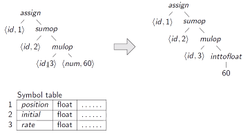
>
> 1. **Tipizzazione degli identificatori**
>    0. $\tt initial$ e $\tt rate$ sono inizializzati a $\tt float$ nel codice sorgente di input
>    1. Viene aggiunto l’attributo $\tt type$ alla symbol table
>    2. Si aggiunge l'attributo $\tt type = float$ per gli identificatori $\tt initial$ e $\tt rate$
> 2. **Analisi semantica**
>    0. $\tt rate$ è di tipo $\tt float$
>    1. Quindi la moltiplicazione $\tt rate*60$ deve essere di tipo $\tt float$
>    2. Quindi $\tt 60$ deve essere di tipo $\tt float$
>    3. $\tt 60$ è trasformato nell'operazione $\tt intToFloat$ con nodo figlio $\tt 60$
>    4. La somma deve essere di tipo $\tt float$
>    5. Quindi $\tt position$ deve essere di tipo $\tt float$
>    6. Si aggiunge $\tt position.type=float$ nella tabella


## [12.4][pdf]  Codice intermedio

### Generazione

1. **Attraversare l’albero** sintattico
2. Associare un **temporaneo** per **ogni nodo** intermedio
   - Gli identificatori sono **riferimenti alle loro istanze locali**
   - Necessitano di un meccanismo di **scope**

---

> <u>Esempio</u>  (**Generazione di codice intermedio**)
> $$
> \begin{align}
> \tt t1  &\tt = intToFloat(60) \\
> \tt t2  &\tt = id3 ∗ t1        \\
> \tt t3  &\tt = id2 + t2        \\
> \tt id1 &\tt = t3              \\
> \end{align}
> $$


### [12.5][pdf]  Ottimizzazione

<u>Obiettivo</u>: **eliminare le operazioni** temporanee **non** strettamente **necessarie**

- Utilizza **algoritmi su grafo** per fare un’**analisi di catene di definition use**
  - ~~e.g.~~ Eliminare o spostare la **dichiarazione** di una variabile
  - ~~e.g.~~ **Subexpression elimination**
    - Istanzia una **variabile temporanea** per memorizzare il risultato di **operazioni ripetute**
- **Ottimizzazioni**
  - A tempo di **compiliazione**
    - Fase statica
  - Di tipo **conservativo**
    - ~~e.g.~~ Assume che **ogni ramo condizionale** possa essere percorso
  - Non analizzano i possibili flussi di esecuzione della logica del programma

---

> <u>Esempio</u>  (**Ottimizzazione codice intermedio**)
> $$
> \begin{align}
> \tt t1\ \  &\tt = id3 ∗ 60.0\\
> \tt id1 &\tt = id2 + t2
> \end{align}
> $$
>
> - Conversione di $\tt 60$ in $\tt float$ per eliminare $\tt intToFloat$


## [12.6][pdf]  Codice target

### Generazione

1. Traduzione in **codice macchina**
2. Meccanismi di **ottimizzazione machine dependent**

---

> <u>Esempio</u>  (**Generazione di codice target**)
>
> 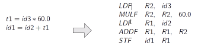
>
> - Il suffisso $\tt F$ indica $\tt float$
>   - Tutte le operazioni coinvolgono $\tt float$
>
> <u>Operazioni</u>
>
> 1. Caricamento del contenuto di $\tt id3$ come $\tt float$ nel registro $\tt R2$
> 2. Moltiplicazione $\tt float$ tra $\tt R2$ e $\tt 60$
> 3. Caricamento di un $\tt float$
> 4. ...


Note sugli esercizi

### Linugaggi regolari

- Un linguaggio è regolare se ~~(or)~~
  - È possibile trovare ~~(or)~~
    - Un **espressione regolare** che lo denoti
    - Un **NFA** che lo riconosca
    - Un **DFA** che lo riconosca
  - Deriva da operazioni con **proprietà di chiusura** rispetto ai linguaggi regolari
    - Complementazione
    - Unione
    - Concatenazione
    - Intersezione
- Un linguaggio non è regolare se verifica il negato del...


---


# 

[root]: ../LFC/
[pdf]: ../LFC/Dispensa-LFC-v1.0.0.pdf

