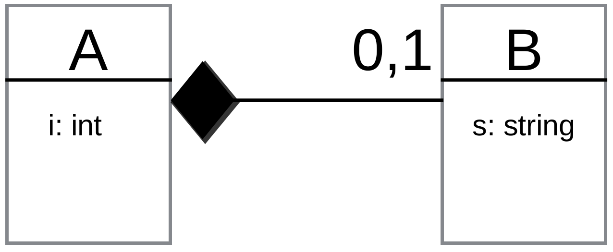

# PRAVA - Teoria

|      |          |                                                              |
| ---- | :------: | -----------------------------------------------------------: |
| PRAVA | Teoria | [][root][](https://didatticaonline.unitn.it/dol/enrol/index.php?id=31325) |

[TOC]


# [1°][ppt-1] Lezione

## Composizione opzionale

### Definizione

- **Composizione**: `A` has-a `B`
- **Opzionale**: `A` could-have-a `B` (0,1)

La singola istanza `B` **connessa** all’istanza `A` è **distrutta** quando l’istanza `A` è distrutta

<u>Soluzione</u>

- **Puntatore a `B`** in `A`
- La classe **`A` gestisce la memoria** in cui si trova l’oggetto `B`




### Classe `B`

#### `B.h`

```c++
#ifndef __CLASS_B__
#define __CLASS_B__

#include <iostream>
#include <string>

using namespace std;

class B {
    string s;
public:
    B(string _s);
    string get_s();
};

#endif  // __CLASS_B__
```

- I file `.h` sono **inclusi** ma **non compilati**
- Le **guardie** evitano inclusioni multiple 

#### `B.cc`

```c++
#include "B.h"

B::B(string _s) {
    s = _s;
}
string B::get_s() {
    return s;
}
```


### Classe `A`

#### `A.h`

```c++
#ifndef __CLASS_A__
#ifndef __CLASS_A__

#include "B.h"
#include <iostream>

using namespace std;

class A {
    int i;
    B *pb;  // puntatore a B, diverso dall'aggregazione
public:
    A();                        // costruttore a zero parametri
    A(int _i, string _s);       // costruttore a due parametri
    A(const A &_a);             // costrutttore di copia
    ~A();                       // distruttore
    A &operator=(const A &_a);  // operatore di assegnazione
    int get_i();
    string get_s();
    void set_s(string _s);
};

#endif  // __CLASS_A__
```

#### `A.cc`

```c++
#include "A.h"

A::A() {
    cout << "Costruttore a zero parametri" << endl;
    i = 0;
    pb = nullptr;
}
A::A(int _i, string _s) {
    cout << "Costruttore a due parametri" << endl;
    i = _i;
    pb = new B(_s);
}
A::A(const A &_a) {
    cout << "Costruttore di copia" << endl;
    i = _a.i;
    if (_a.pb != nullptr) {    // costruttore di copia di default
        pb = new B(*(_a.pb));  // copia superficiale di _a.pb->s
    } else {
        pb = nullptr;
    }
}
A::~A() {
    cout << "Distruttore" << endl;
    if (pb != nullptr) { delete pb; }  // gestione della memoria di B
}
A &A::operator=(const A &_a) {
    cout << "operator=" << endl;
    if (this->pb == nullptr) {  // oggetto chiamante non ha B
        if (_a.pb != nullptr) {
            pb = new B(*(_a.pb));
        }
    } else {  // oggetto chiamante ha B
        if (_a.pb != nullptr) {
            *pb = *(_a.pb);  // <--
        } else {
            delete pb;
            pb = nullptr;
        }
    }
    return *this;  // a = (b = c) 
}
int A::get_i() {
    return i;
}
string A::get_s() {
    if (pb == nullptr) { return ""; }
    return pb->s;
}
void set_s(string _s) {
    if (pb != nullptr) {
        *pb = B(_s);
    } else {
        pb = new B(_s);
    }
}
```


# [2°][ppt-2] Lezione

## Classe vuota

### Metodi e operatori di default

```c++
class A {};
int main() {
    A a1;             // A::A();  instanziazione
    A a2(a1);         // A::A(const A&);  superficiale
    a1 = a2;          // A &A::operator=(const A&);  superficiale
    A *pa = new A();  // instanziazione con new
    delete pa;        // A::~A();
}
```

- **`operator=`** restituisce la reference dell’istanza chiamante


## Copia superficiale e profonda

### Copia superficiale

- Copia gli **attributi** di un oggetto
- Effettuata da costruttore di **copia** e operatore di **assegnazione** di default
- In caso di **puntatori ad oggetti** allocati **dinamicamente**
  - Copiano l'**indirizzo** contenuto nel puntatore `pb`
  - Diverse istanze di A hanno `A::pb` che punta alla **stessa istanza di `B`**

```c++
class B {};
class A { public: B *pb; };

int main() {
    A a;  // A::A()
    a.pb = new B();
    A a2(a);  // A::A(const A &)
    // 1 istanza di B ???
    A a3 = a2;
    // 1 istanza di B ???
    A *pa = new A();
    *pa = a;
    delete pa;
}
```


### Copia profonda

<u>Soluzione</u>: **ridefinire** costruttore di copia e operatore di assegnazione

- In modo che costruiscano **nuove istanze** degli eventuali puntatori ad oggetti
- Sempre necessario con **allocazione dinamica**


## Costruttori con parametri

### Costruttori vuoti e con parametri

Quando si definisce un **costruttore con parametri**

- Il **costruttore vuoto `A::A()` non esiste più** nella versione di default
- Occorre **ridefinirlo** per poterlo usare ~~(! errore di compilazione altrimenti)~~
- <u>Idea</u>: se è necessario inizializzare un parametro, il costruttore vuoto non è adatto a tale scopo


### ==Conversione implicita di tipo==

- ==Costruttori a **un solo parametro** funzionano come **convertitori impliciti di tipo**==
- ==Il **sistema di deduzione dei tipi** del compilatore converte==
  - ==Un **r-value**==
    - ==Di tipo equivalente a quello del costruttore ad un parametro==
  - ==In un'**istanza** della classe richiesta==
    - ==Costruita con il costruttore ad un parametro==

```c++
class A {
    int i; 
public:
    A(int _i) { i = _i }
};

void f(const A &_a) {}

int main() {
    A a;
    a = 3;  // A::operator=(A(3));
    f(3);   // f(A(3));
}
```


#### ==`explicit`==

==La **keyword `explicit` inibisce la conversione** implicita di tipo==

```c++
class A {
    int i; 
public:
    explicit A(int _i) { i = _i }
};

int main() {
    A a;
    a = A(3);  // conversione esplicita OK
    a = 3;     // errore di compilazione
}
```


## Ridefinizione degli operatori

### ==Metodi e funzioni esterne==

Gran parte degli **operatori** definiti per i **tipi base** possono essere **ridefiniti** per tipi definiti **dall’utente** (anche **disomogenei**) come ~~(xor)~~

- ==**Metodi** della classe==
  - ==Il **primo operando** corrisponde all’**istanza chiamante**==
  - ==Gli **altri operandi** corrispondono a **parametri** del metodo==
  - ==**`operator=`** si può ridefinire solo come **metodo**==
    - ==` A &A::operator=(const A &)`==
- ==**Funzioni esterne**==
  - ==Tutti gli **operandi** corrispondono a **parametri** della funzione==


### ==Keyword `friend`==

La keyword **`friend` in una classe**

- ==È utilizzata negli **headers**==
- ==Indica che la riga **non** è una **dichiarazione** di funzione o metodo==
- ==Permette l’**accesso** alle parti **private** a funzioni o classi definite altrove==

<u>Utilizzo</u>

- **Non** è necessaria se gli attributi sono accessibili tramite metodi **getter pubblici** 
- Va usata solo **se necessaria**
  - **Mina l’incapsulamento** della classe


### `operator+`

```c#
A a, a1, a2;
a = a1 + a2;
a.operator=(a1.operator+(a2));      // metodo
a.operator=(A::operator+(a1, a2));  // funzione esterna
```

#### Metodo

```c#
class A {
    int i;
public:
    A(int _i) { i = _i; }
    A operator+(const A &);
};

A A::operator+(const A &_a) {
    return A(i + _a.i);
}

int main() {
    A a1(1), a2(2), a3(3);
    a1 = a2 + a3;  // OK
    a1 = a2 + 3;   // a1.operator=(a2.operator+(A(3)));  cidt OK
    a1 = 2 + a3;   // non compila
}
```

#### Funzione esterna

```c++
class A {
    int i;
public:
    A(int _i) { i = _i; }
    friend A operator+(const A &, const A &);
};

A operator+(const A &_x, const A &_y) {  // scope corretto
    return A(_x.i + _y.i);
}

int main() {
    A a1(1), a2(2), a3(3);
    a1 = a2 + a3;  // OK
    a1 = a2 + 3;   // a1.operator=(operator+(a2, A(3)));  cidt OK
    a1 = 2 + a3;   // a1.operator=(operator+(A(2), a3));  cidt OK
}
```


### ==Incremento e decremento==

Operatori di incremento e decremento

- ==Hanno **un solo operando**==
- ==Possono essere ridefiniti sia come **metodi** che come **funzioni esterne**==
- ==Hanno una versione **prefissa** e una **postfissa**==
  - **Prefissa**: prima si modifica la variabile e poi la si restituisce
  - **Postfissa**: il valore restituito è il valore esistente prima della modifica
- ==Per **distinguere** postfissa da prefissa si utilizza un **parametro dummy**==

```c#
A &A::operator++();     // prefisso
A  A::operator++(int);  // postfisso
```


#### Incremento prefisso

```c#
class A {
    int i;
    A &A::operator++();
};

A &A::operator++() {
    ++i;
    return *this;
}

int main() {
    A a(0);
    ++(++a);  // a == 2
}
```

#### Incremento postfisso

```c#
class A {
    int i;
    A A::operator++(int);
};

A A::operator++(int) {
    A temp(*this);
    i++;
    return temp;
}

int main() {
    A a(0);
    (a++)++;  // a == 1
}
```


### ==Ritorno per valore e rifermimento==

Gli operatori ritornano il **risultato** per **valore** o per **riferimento**

- Nel caso di **side effects**, la distinzione si ha quando il **risultato** è utilizzato successivamente nella **stessa espressione**
- ==Utilizzare **`const`** quando l’operatore **non modifica gli operandi**==
- ==Gli operatori che **modificano l’oggetto** chiamante ritornano un **riferimento**==
  - ~~e.g.~~  **`A &operator+=`** ,  **`A operator+`**


### ==Utilizzo==

- **Quando** ridefinire gli operatori?
  - ==Quando il **significato** degli operatori è **naturale**==
    - ~~e.g.~~ In una classe per supportare l’uso di numeri **complessi**
  - Altrimenti con **parsimonia e cautela**
- **Metodi o funzioni esterne?**
  - ==È **preferibile** ridefinire gli operatori come **metodi**==
    - **Risparmiano** l'utilizzo di **getters** per gli attributi privati
    - **Evitano** funzioni **`friend`**
  - ==**Funzioni esterne** favoriscono la cidt==


# [3°][ppt-3] Lezione

## ~~Numeri complessi~~

#### `complex.h`

```c++
class Complex {
    double re, im;
public:
    Complex(double _re = 0, double _im = 0);
    
    // Metodi
    Complex &operator+=(const Complex &_c);
    Complex &operator*=(const Complex &_c);
    Complex operator-() const;  // meno unario
    
    // Funzioni esterne
    friend ostream &operator<<(ostream &os, const Complex &_c);
    friend Complex operator+(const Complex &_c1, const Complex &_c2);
    friend Complex operator*(const Complex &_c1, const Complex &_c2);
    friend Complex operator-(const Complex &_c1, const Complex &_c2);
};

ostream &operator<<(ostream &os, const Complex &_c);
Complex operator+(const Complex &_c1, const Complex &_c2);
Complex operator*(const Complex &_c1, const Complex &_c2);
Complex operator-(const Complex &_c1, const Complex &_c2);

void test_Complex();
```

#### `complex.cc`

```c++
Complex::Complex(double _re, double _im) {
    re = _re;
    im = _im;
}

// Metodi
Complex &Complex::operator+=(const Complex &_c) {
    re += _c.re;
    im += _c.im;
    return *this;
}
Complex &Complex::operator*=(const Complex &_c) {
    *this = (*this) * _c;  // implementato con operator*
    return *this;          // return (*this) * _c;  non funziona
}
Complex Complex::operator-() const {
    return Complex(-re, -im);
}

// Funzioni esterne
Complex operator+(const Complex &_c1, const Complex &_c2) {
    return Complex(_c1.re + _c2.re, _c1.im + _c2.im);
}
Complex operator-(const Complex &_c1, const Complex &_c2) {
    return _c1 + (-_c2);
}
Complex operator*(const Complex &_c1, const Complex &_c2) {
    return Complex(_c1.re * _c2.re - _c1.im * _c2.im,
                   _c1.re * _c2.im + _c2.re * _c1.im);
}
ostream &operator<<(ostream &os, const Complex &_c) {
    os << _c.re << " + " << _c.im << "i";  // NO endl
    return os;
}
```


## Ereditarietà

<aside>XXX</aside>

### ==Ereditarietà e visibilità==

- **Tipi**: `public`, `private`, `protected`
  - ~~Stesse keywords della visibilità nella classe~~
- Ha consequenze sulla **visibilità**


### Istanza di una classe derivata

- Un'istanza di una **classe derivata `public`** può essere acceduta
  - Come istanza della classe **derivata**
  - Come istanza della classe **base**
    - Implementa la relazione **IS-A**
- I **puntatori** di tipo della classe **base** possono **puntare** a istanze della **derivata**
- Un'istanza di una classe **derivata** può essere **assegnata** ad un'istanza di una classe **base**, ma non il contrario


### ==Keyword  `virtual`==

==I **metodi** possono essere definiti **`virtual`**==

- ==Dichiara il **late binding**==
  - ==**Early binding**: risolto dal compilatore==
  - ==**Late binding**: risolto run-time==
- ==Late binding solo se si accede tramite **puntatore o reference**==
  - ==**`A *x = new B()`**==


```c++
class A {
	int dim;
	int *p;
public:
	A(int _dim) {
		dim = _dim;
		p = new int[dim];
	}
    
    // A *x = new B(7, 3);
    // Quando x viene distrutto, virtual specifica di guardare al late binding,
    // grazie al quale viene chiamato il distruttore di B (altrimenti leaks)
	virtual ~A() {
		if (p != NULL) { delete p; }
	}
	virtual void stampa() const {
        for (int i = 0; p != NULL && i < dim; i++) { printf("[%d]", p[i]); }
	}
};

class B : public A {
	int dim;
	int *q;
public:
	B(int dimB, int dimA) : A(dimA) {
		dim = dimB;
		q = new int[dim];
	}
	~B() {
		if (q != NULL) { delete q; }
	}
	void stampa() const {
        for (int i = 0; q != NULL && i < dim; i++) { printf("[%d]", q[i]); }
		A::stampa();
	}
};

int main() {
    A *x = new B(7, 3);  // x è dichiarato A, ma è B con late binding
    x->stampa();         // B::stampa() che chiama A::stampa()
    x->A::stampa();      // chiamo esplicitamente metodo di A
    delete x;
}
```


### ==Esempio classe base e derivata==

#### `a.h`  (base)

```c++
class A {
    int i;
public:
    A();
    explicit A(int _i);
    A(const A &_a);
    virtual ~A();  // Non necessario                          
                   /* Necessario se si accede alle istanze    *
                    * derivate con puntatori alla classe base */
    int get_i() const;
};

void test_A();
int quadrato(const A &_a);
int raddoppia(A _a);
```

#### `a.cc`  (base)

```c++
A::A() {
    i = 0;
    cout << "A::A()" << this << endl;
}
A::A(int _i) {
    i = _i;
    cout << "A::A(int)" << this << endl;
}
A::A(const A &_a) {
    i = _a.i;
    cout << "A::A(const A&)" << this << endl;
}
A::~A() {
    cout << "A::~A()" << this << endl;
}
int A::get_i() const {
    return i;
}

void test_A() {
    A a;
    cout << a.get_i();
    A a3(3);
    cout << a3.get_i();
    cout << quadrato(a3);
    cout << raddoppia(a3);
}
int quadrato(const A &_a) {
    return _a.get_i() * _a.get_i();
}
int raddoppia(A _a) {
    return 2 * _a.get_i();
}
```

#### `b.h`  (derivata)

```c++
class B : public A {
    string s;
public:
    B();
    B(int _i, string _s);
    ~B();  // non necessario
    string get_s();
};

void test_B();
```

#### `b.cc`  (derivata)

```c++
B::B() {
    s = "";
    cout << "B::B()" << this << endl;
}
B::B(int _i, string _s) : A(_i) {
    s = _s;
    cout << "B::B(int,string)" << this << endl;
}
B::~B() {
    cout << "B::~B()" << this << endl;
}
string B::get_s() {
    return s;
}

void test_B() {
    B b;
    cout << b.get_s() << b.get_i();
    B b2(3, "Moli");
    cout << b2.get_s() << b2.get_i();
    cout << quadrato(b2);  // b è anche A
    cout << raddoppia(b2);
}
```

#### `main.cc`

```c++
int main() {
    test_A();
    cout << endl;
    test_B();
    cout << "main:" << endl;
    B *pb = new B(7, "note");
    cout << quadrato(*pb);
    delete pb;
    cout << "puntatore ad A:" << endl;
    A *pa = new A(11);
    cout << quadrato(*pa);
    delete pa;
    cout << "puntatore ad A che punta ad un B:" << endl;
    pa = new B(13, "giorni");
    cout << quadrato(*pa);
    delete pa;  // importante che sia definito virtual A::~A()
    
    A a;
    B b;
    a = b;     // b = a;  non compila, possibile ridefinendo operator=
    cout << "assegnamento ad a" << endl;
    a = A(3);  // a = 3;  non compila (explicit)
    A a2(b);   // costruttore di copia di A
}
```


### ==Classe puramente virtuale==

> **Metodo puramente virtuale**: metodo non implementato

- ==La sua dichiarazione nella classe è seguita da  **`= 0;`**==

> **Classe puramente virtuale**: classe con almeno un metodo puramente virtuale

- ==**Non è istanziabile**  ~~(~ interfacce Java)~~==

```c++
class A {
    ...
    virtual int virtual_method() = 0;
};
```

==I costruttori possono essere puramente virtuali, i distruttori no==


# [4°][ppt-4] Lezione

## Programmazione generica

### Introduzione

> **Programmazione generica**: possibilità data da un linguaggio di rappresentare tipi e implementare algoritmi che abbiano un tipo come parametro

Il **tipo parametrico** viene specificato a tempo di

- **Compilazione** (~~e.g.~~ templates)
- **Esecuzione** (~~e.g.~~ classi con virtualizzazione)

<u>Scopo</u>

- Implementare **algoritmi indipendenti dal tipo** su cui operano
- Idealmente al **massimo livello di astrazione** possibile


### Swap -- Overloading

Necessita la scrittura di **una funzione per ogni tipo** desiderato

```c++
void my_swap (int &f, int &s) {
    int tmp = f; f = s; s = tmp;
}
void my_swap (string &f, string &s) {
    string tmp = f; f = s; s = tmp;
}
```


### ==Swap -- `void*`==

==**Puntatore `void`**: puntatore che punta a variabili di **qualsiasi tipo**==

- ==Necessitano di **casting** a puntatore del tipo specificato==

#### C-style casting

```c++
*((type *) void_ptr)
```

```c++
#include <utility>

void my_swap(void *&f, void *&s) {
    void *tmp = f;
    f = s;
    s = tmp;
}

int main() {
    void *a;
    void *b;
    a = new string("hello");
    b = new string("world");
    cout << *((string *) a) << *((string *) b) << endl;
    swap(a, b);
    cout << *((string *) a) << *((string *) b) << endl;
    
    void *x;
    void *y;
    x = new int(33);
    y = new int(44);
    cout << *((int *) x) << *((int *) y) << endl;
    my_swap(x, y);
    cout << *((int *) x) << *((int *) y) << endl;
    
    cout << "a = " << *((int *) a) << endl;
    // no compile time error, no runtime error
    // output a = 1919907594
}
```

#### `static_casting`

```c++
*(static_cast<type *>(void_ptr))
```

```c++
#include <utility>

void my_swap(void *&f, void *&s) {
    void *tmp = f;
    f = s;
    s = tmp;
}

int main() {
    void *a;
    void *b;
    a = new string("hello");
    b = new string("world");
    cout << *(static_cast<string *>(a)) << '\t';
    cout << *(static_cast<string *>(b)) << endl;
    swap(a, b);
    cout << *(static_cast<string *>(a)) << '\t';
    cout << *(static_cast<string *>(b)) << endl;
    
    void *x;
    void *y;
    x = new int(33);
    y = new int(44);
    cout << *(static_cast<int *>(x)) << '\t';
    cout << *(static_cast<int *>(y)) << endl;
    my_swap(x, y);
    cout << *(static_cast<int *>(x)) << '\t';
    cout << *(static_cast<int *>(y)) << endl;
    
    cout << "a = " << *(static_cast<int *>(a)) << endl;
    // no compile time error, no runtime error
    // output a = 1919907594
}
```


### ==Swap -- `template`==

> **Tipo parametrico**: tipo generico, istanziato o definito in altre parti del codice

==Il **codice compilato** conterrà una **copia della funzione** per ognuno dei tipi richiesti==

```c++
#include <utility>

template<class T>
void my_swap(T &f, T &s) {
    T tmp = f;
    f = s;
    s = tmp;
}

int main() {
    int a = 3;
    int b = 4;
    cout << "before a = " << a << " b = " << b << endl;
    my_swap<int>(a, b);
    cout << "after a = " << a << " b = " << b << endl;
    
    string s1 = "hello";
    string s2 = "world";
    cout << "before s1 = " << s1 << " s2 = " << s2 << endl;
    my_swap<string>(s1, s2);
    cout << "after s1 = " << s1 << " s2 = " << s2 << endl;
}
```

- ==`template<class E>` permette di scrivere funzioni, classi o strutture con **`E` come parametro**==


<aside>XXX</aside>

### ==Swap -- Classi virtuali==

==**Generalizzazione** tramite **virtualità**, eseguita a **runtime**==

#### `A.h`

```c++
class A {
public:
    virtual A &operator=(const A &_a) = 0;
    virtual A *clone() const = 0;
    virtual ~A() {};
};
```

#### `B.h`

```c++
#include "A.h"
class B : public A {
    int i;
public:
    B(int _i) { i = _i; };
    B &operator=(const A &_b);
    B &operator=(const B &_b);
    B *clone() const;
    friend ostream &operator<<(ostream &os, const B &_b);
};
ostream &operator<<(ostream &os, const B &_b);
```

#### `B.cc`

```c++
#include "B.h"
B &B::operator=(const A &_b) {
    A *temp = _b.clone();
    B b(*((B *) temp));
    *this = b;
    return *this;
}
B &B::operator=(const B &_b) {
    i = _b.i;
    return *this;
}
B *B::clone() const {
    return new B(*this);
}
ostream &operator<<(ostream &os, const B &_b) {
    return os << _b.i;
}
```

#### `main.cc`

```c++
#include "B.h"
void my_swap(A &f, A &s) {
    A *temp = f.clone();
    f = s;
    s = *temp;
    delete temp;
}
int main() {
    B x(33);
    B y(44);
    cout << x << y << endl;
    my_swap(x, y);
    cout << x << y << endl;
}
```

- ==Il metodo **`clone` virtuale** effettua la copia profonda di **qualsiasi tipo**==


### ==`template` -- Diversi tipi==

```c++
template<typename T>
T min(T a, T b) {
    return a < b ? a : b;
}

template<typename T1, typename T2>
T1 min(T1 a, T2 b) {
    return T1(a < b ? a : b);  // cast to T1
}

int main() {
    cout << min<int>(3, 5) << endl;
    cout << min<int, double>(6, 5.5) << endl;  //> 5
}
```


### ==Classe `Pair`==

```c++
template<typename F, typename S>
class Pair {
    F first;
    S second;
public:
    Pair(const F &f, const S &s);
    F get_first() const;
    S get_second() const;
};

template<typename F, typename S>
Pair<F, S>::Pair(const F &f, const S &s) {
    first = f;
    second = s;
}
template<typename F, typename S>
F Pair<F, S>::get_first() const {
    return first;
}
template<typename F, typename S>
S Pair<F, S>::get_second() const {
    return second;
}

int main() {
    Pair<int, string> p(5, "Pippo");
}
```


# [5°][ppt-5] Lezione

## Standard Template Library

### Funzionalità

- [**Containers**](https://www.cplusplus.com/reference/stl/)
  - `list`
  - `vector`
  - `set`
  - `map`
- ==[**Iterators**](https://www.cplusplus.com/reference/iterator/)==
  - ==**Classi `template`** organizzate in **gerarchia**==
  - ==**Gerarchia di classi** utilizzata per **accedere agli elementi dei contenitori**==
  - ==Riproducono in parte il **funzionamento** dei **puntatori**==
  - ==**Overloading** di alcuni operatori==
  - ==**Non sono puntatori**==
- ==[**Algorithms**](https://www.cplusplus.com/reference/algorithm/)==
  - ==Basati sugli **iterators**==
  - ==**Generici** anche rispetto ai **containers**==


### ==Esempio STL -- Aggregazione==

#### `a.h`

```c++
class A {
    int i;
public:
    A(int _i);
    void stampa();
    friend ostream &operator<<(ostream &os, const A &_a);
    bool operator<(const A &_a) const;
};
ostream &operator<<(ostream &os, const A &_a);
```

#### `a.cc`

```c++
#include "a.h"
A::A(int _i) {
    i = _i;
}
void A::stampa() {
    cout << i;
}
ostream &operator<<(ostream &os, const A &_a) {
    return os << _a.i;
}
bool A::operator<(const A &_a) const {
    return i < _a.i;
}
```

#### ==`b.h`==

```c++
#include "a.h"
#include <list>
// La classe B aggrega degli A  (UML losanga vuota)
class B {
// Aggregazione di un solo A:
//  A *pa;  
// Composizione di A di cardinalità (1,*):   
//  list<A> la;
// Aggregazione di A di cardinalità (1,*):
    list<A *> lpa;  // lista di puntatori
public:
    B(A &_a);
    void add(A &_a);
    void stampa() const;
};
void test_B();
```

#### ==`b.cc`==

```c++
#include "b.h"
B::B(A &_a) {
    add(_a);
}
void B::add(A &_a) {
    lpa.push_front(&_a);
}
void B::stampa() const {
    list<A *>::const_iterator it;
    for (it = lpa.begin(); it != lpa.end(); it++) {
        (*it)->stampa();  // (**it).stampa();  (*it) puntatore di tipo A*
    }
}
void test_B() {
    A a1(5);
    A a2(7);
    B b(a1);
    b.add(a1);
    b.add(a2);
    b.stampa();
    // B b1(A(11));  no perche' oggetto temporaneo
}
```

#### `main.cc`

```c++
#include "b.h"
int main(int argc, char *argv[]) {
    cout << min2(3, 2);
    lista<int> la;
    la.accoda(3);
    la.saltacoda(3);
    la.stampa();
    test_B();
    cout << min2(A(13), A(17));  // due errori
    
    set<A> sa;
    sa.insert(A(1));
    sa.insert(A(2));
    sa.insert(A(5));
    sa.insert(A(2));
    set<A>::iterator it;
    for (it = sa.begin(); it != sa.end(); it++) {
        cout << *it;
    }
    A a1(1);
    set<B> sb;
    // sb.insert(a1); cosa fare? esercizio
}
```


### ==Esempio STL -- Template==

```c++
#include <cstdlib>
#include <list>
#include <set>

template<class E>
E min2(E e1, E e2) {
    return (e1 < e2) ? e1 : e2;
}

template<class E>
class lista {
    list<E> le;
public:
    void accoda(E e) { le.push_back(e); };
    void saltacoda(E e) { le.push_front(e); };
    void stampa();
};

template<class E>
void lista<E>::stampa() {
    typename list<E>::iterator it;
    for (it = le.begin(); it != le.end(); it++) cout << *it;
}
```


### Iteratori


La keyword **`auto`** inserisce **codice runtime** per determinare il tipo


### ==Contenitori==

> **Contenitore**: classe template che contiene tipi parametrici

- ==L'**accesso** al contenuto avviene tramite **iteratori**==


<aside>XXX</aside>

#### `list`

```c++
#include <list>

int main(int argc, char *argv[]) {
    list<int> l;
    l.push_back(2); l.push_front(3);
    cout << l.max_size();  //> 384307168202282325
    
    list<int>::iterator it;  // C++ 98
    for (it = l.begin(); it != l.end(); ++it)
        cout << *it;                               //> 32
    for (auto a = l.begin(); a != l.end(); ++a)
        cout << *a;                                //> 32
    for (auto  v : l) cout << v;                   //> 32
    for (auto &e : l) e++;
    for (auto  v : l) cout << v;                   //> 43
    
    cout << l.front() << l.back();                 //> l: 43
    
    l.push_back(2);  l.push_front(5);              //> l: 5432
    l.pop_back();    l.pop_front();                //> l: 43
    
    l.insert(l.begin(), 7);                        //> l: 743
    l.insert(l.begin(), l.begin(), l.end());       //> l: 743743
    
    auto a = l.cbegin();  // const_iterator
    l.push_front(8); l.push_front(9);              //> l: 98743743
    cout << *a;                                    //> 7
    
    list<int> m;
    m.splice(m.cbegin(), l, a, l.cend());          //> l: 98
                                                   //> m: 743743
    m.swap(l);                                     //> l: 743743
                                                   //> m: 98
    
    cout << l.size() << ' ' << l.empty()           //> 6 0
    
    l.reverse();                                   //> l: 347347
    l.sort();                                      //> l: 334477
    l.unique();                                    //> l: 347
    m.sort();                                      //> m: 89
    l.merge(m);                                    //> l: 34789
                                                   //> m: -

    list<int>::reverse_iterator ri;
    for (ri = l.rbegin(); ri != l.rend(); ++ri)
        cout << *ri;                               //> l: 98743
    for (auto a = l.rbegin(); a != l.rend(); ++a)
        cout << *a;                                //> l: 98743
    
    l.resize(4);                                   //> l: 3478
    l.remove(3);                                   //> l: 478
    l.erase(l.begin());                            //> l: 78
    a = l.emplace(l.cbegin(), 2);                  //> l: 278
    l.push_front(1);                               //> l: 1278
    m.assign(a, l.cend());          ????           //> m: 278
    
    list<int> n(l);                                //> n: 1278
    l = m;                                         //> l: 278
                                                   //> m: 278
    l.clear();                                     //> l: -
    
/*  emplace_front
 *  emplace_back
 *  get_allocator
 *  crbegin
 *  crend
 */
}
```


#### ==`set` e `map`==

- Sono **ordinati**
  - ==Usano **`operator<`**== 
- ***Non*** hanno il concetto di **front e back**
  - Usano **`insert`**

```c++
#include <set>
#include <map>

class A { ... };

int main() {
    set<A> s;
    s.insert(A());                     // ridefinito A::operator<
    map<A, int> m;
    m.insert(pair<A, int> (A(), 2));   // ridefinito A::operator<
    map<int, A> ma;
    ma.insert(pair<int, A> (3, A()));  // operator< per int
    ma[3]=A();                         // ridefinito operator[]
}
```


#### `multiset` e `multimap`

- Come `set` e `map` ma permettendo **valori multipli**
- Nel `multimap` *non* c’è `operator[]`


### [Esempi](../PRAVA/TH/Codici/Lezione%205%20Codice)


# [7°][ppt-7] Lezione

## Funzioni

### ==Puntatori a funzione==

> **Puntatore a funzione**: variabile che contiene l'indirizzo a una funzione

```c++
int f(double a, int b) { return a + b; }

int main() {
    int (*pf)(double, int);
    pf = f;
    cout << (*pf)(2.0, 3);  //> 5
    cout << pf(2.0, 3);     //> 5
}
```

```c++
int mul(int i, int j) { return i * j; }
int sum(int i, int j) { return i + j; }
double avg(int i, int j, int (*pf)(int, int)) {
    return (double) pf(i, j) / 2.0;
} 

int main() {
    int (*pf)(int, int);             // puntatore a funzione 
    pf = sum;                        // pf = &sum;
    cout << pf(2, 3) << endl;        //> 6
    cout << avg(2, 3, sum) << endl;  //> 3
    cout << avg(2, 3, mul) << endl;  //> 2.5
}
```


<aside>XXX</aside>

#### ==Tipo puntatore a funzione==

```c++
typedef double (*P)(double);  // ???
double f1(double x) { return x; }
double f2(double x) { return x * x * x; }

int main() {
    map<P, double> m;
    m[f1] = 2;
    m[f2] = 4;
    double sum = 0;
    map<P, double>::iterator it;
    for (it = m.begin(); it != m.end(); it++) {
        sum += (it->first)(2.0) * (it->second);
    }
    cout << sum;  //> 36
}
```


### ==Oggetti funzioni==

> **Oggetto funzione**: istanza di una classe in cui è stato ridefinito `operator()`

- ==Soltanto come **membro**==

```c++
double A::operator()(double _d) const { return _d * 2.0 }

int main() {
    A a;
    cout << a(2.0);
}
```

```c++
class A{
    int i;
public:
    A() { i = 1; }
    A(int _i) { i= _i; }
    double operator()(double _d) const { return pow(_d, i); }
    bool operator<(const A &_a)  const { return i < _a.i; }
};

int main() {
    A a(3), a1;
    cout << a(2.0) << endl;  //> 8
    cout << a1(3) << endl;   //> 3
     
    map<A, double> ma;
    ma[A(1)] = 2;
    ma[A(3)] = 4;
    int sum = 0;
    map<A, double>::const_iterator itma;
    for(itma = ma.begin();itma != ma.end(); itma++) {
        somma += (itma->first)(2.0) * (itma->second);
    }
    cout << sum;  //> 36
}
```


## Eccezioni

### ==Struttura==

==Rimandano la gestione del flusso di controllo normale ad uno eccezionale==

- ==<u>Libreria</u>: `<stdexception>`==
- ==**`try`** crea un bocco in cui le eccezioni possono essere intercettate==
- ==**`throw`** lancia un'eccezione di un certo **tipo**== 
- ==**`catch`** cattura l'eccezione del **tipo lanciato** da `throw`==
  - ==Gestiti nell'**ordine di scrittura**==

---

> <u>Nota</u>
>
> - Quando si lancia un'eccezione è **necessario catturarla**
>   - Si utilizza  **`catch (...) {}`**
> - Bisogna gestire le eccezioni lanciate dalle **funzioni di libreria**


### ==Esempi==

```c++
#include <stdexception>
try {
    try {  // se qualcosa va storto lancio un'eccezione
        throw logic_error("grosso guaio");  // costruttore di `logic_error`
        throw int(3);
        throw double(3.3);
    } catch (int i) {
        cout << "intercettata eccezione " << i;
    } catch (logic_error e) {
        cout << "try interno: " << e.what();
        throw;  // rilancia l'eccezione all'esterno
    } catch (...) {
        cout << "intercettata eccezione sconosciuta";
    }
} catch (logic_error e) {
    cout << "try esterno: " << e.what();
}
```

```c++
#include <stdexception>
try { 
    while (true) { int *p = new int[9e9]; }
} catch (exception &e) {  // eseguito solo se prima di bad_alloc
    cout << e.what();
} catch (bad_alloc a) {   // sempre eseguito
    cout << "memoria finita programma termina" << a.what();
} catch (...) {
    cout << "Qualcosa e' andato storto";
}
```


<aside><u>Problemi</u><br>Atomicità<br>Starvation<br>Deadlock</aside>

## Multithreading

### ==Thread==

> **Thread**: classe che permette di istanziare processi diversi che condividono parti di memoria

- ==**Heap e stack indipendenti**==
- ==**Variabili condivise**==
- ==<u>Librerie</u>: `<thread>`, `<atomic>`, `<mutex>` (tutte SDL)==

```c++
#include <thread>

void f1() { ... }
void f2(int x) { ... }

int main() {
    unsigned int c = std::thread::hardware_concurrency();
    cout << " numero di core: " << c << endl;;
    
    // costruttori di thread
    thread first(f1);      // nuovo thread chiama f1()
    thread second(f2, 0);  // nuovo thread chiama f2(0)
    cout << "main, f1 e f2 lanciati";
    
    // sincronizzazione, attende la terminazione
    first.join();
    second.join();
    cout << "f1 e f2 completati";
}
```


### ==Data race==

==Molte istruzioni **non** sono **atomiche**==

- ==Lo **swap** fra processi può avvenire in **qualsiasi punto** della loro esecuzione==

```c++
static int shared = 0;

void inc_thread() {
    for (int i = 0; i < 10000; i++) {
        shared++;  // istruzione non atomica
    }
}
void dec_thread() {
    for (int i = 0; i < 10000; i++) {
        shared--;  // istruzione non atomica
    }
}
int main() {
    thread inc(inc_thread);
    thread dec(dec_thread);
    inc.join();
    dec.join();
    cout << "shared" << shared;  // -2091
}
```

```assembly
@ esecuzione corretta con alternanza di ++ e --

@ shared++
movl condivisa(%rip), %eax
addl $1, %eax
movl %eax, shared(%rip)

@ shared--
movl condivisa(%rip), %eax
subl $1, %eax
movl %eax, shared(%rip)
```

```assembly
@ esecuzione errata, data race

@ shared++
movl condivisa(%rip), %eax
addl $1, %eax

@ shared--
movl condivisa(%rip), %eax
subl $1, %eax
movl %eax, shared(%rip)

@ shared++
movl %eax, shared(%rip)
```


#### ==Soluzioni==

- ==**`mutex`**: definisce le **sezioni critiche** come **mutualmente esclusive**==

  - ==Di **basso livello**==
  - ==Permette una **gestione precisa** della concorrenza==

  ```c++
  #include <mutex>
  std::mutex myMutex;
  static int shared = 0;
  
  void inc_thread() {
      for (int i = 0; i < 10000; i++) {
          myMutex.lock();
          shared++;
          myMutex.unlock();
      }
  }
  void dec_thread() {
      for (int i = 0; i < 10000; i++) {
          myMutex.lock();
          shared--;
          myMutex.unlock();
      }
  }
  ...
  ```

- ==**`atomic`**: rende **atomiche** le **operazioni** su una certa **variabile**==

  - ==Astrazione di **alto livello** basata sui mutex==

  ```c++
  #include <atomic>
  static std::atomic<int> shared(0);  // static int shared = 0;
  ...
  ```


### ==Altri problemi dei mutex==

> <u>Problema</u>  (**Starvation**)
>
> La politica di accesso impedisce ad un processo di accedere alla risorsa

> <u>Problema</u>  (**Deadlock**)
>
> Situazione in cui uno o più processi/thread si bloccano
>
> - <u>Cause</u>
>
>   - Omettere l’unlock un mutex
>   - Terminazione inattesa di una funzione
>     - Lancio di eccezioni
>
>   <u>Soluzione</u>
>
>   - `lock_guard <mutex>`
>     - Quando è creato cerca di appropriarsi del mutex dato
>     - Quando il controllo lascia lo scope in cui `lock_guard` è stato creato:
>       - Viene distrutto
>       - Il mutex viene rilasciato
>
> - <u>Causa</u>
>
>   - Funzioni annidate che chiamano lo stesso mutex
>
>   <u>Soluzione</u>
>
>   - `recursive_mutex `
>
> - <u>Causa</u>
>
>   - Ordine di locking di diversi mutex
>
>   <u>Soluzione</u>
>
>   - `lock(mutex1, mutex2) `

```c++
// lock_guard

mutex mtx;

void print_block(int n, char c) {
    // sezione critica con accesso esclusivo a cout
    mtx.lock();
    for (int i = 0; i < n; i++) { cout << c; }
    cout << '\n';
    mtx.unlock();
}

void thread_function() {
    lock_guard <mutex> guard(mtx);
    thread::id this_id = this_thread::get_id();
    cout << "thread_id: " << this_id << endl;
}

int main() {
    thread th1(print_block, 50, '*');
    thread th2(print_block, 50, '$');
    thread t1(thread_function);
    thread t2(thread_function);
    t1.join();
    t2.join();
    // ???
}
```


### ~~Semafori e monitor~~

- ~~Altre primitive per la gestione della concorrenza~~
- ~~Non fornite dallo standard C++~~
  - ~~Preferisce primitive di livello più basso~~


# [8°][ppt-8] Lezione

## l-values e r-values

### Oggetti temporanei

```c++
A operator+(const A &_a1, const A &_a2) {
	A temp(_a1);
	temp = sum(_a1, _a2);
	return temp;
}

A a1, a2, a3;
a1 = a2 + a3;  // `a2 + a3` è un oggetto temporaneo
               // a1.operator=(operator+(a2, a3));
a1 = a2;       // `a2` non è un oggetto temporaneo
               // a1.operator=(a2);
```


### Categorie

- ==**l-value**==
  - ==Possono stare a sinistra dell'operatore di assegnazione==
  - ==Scritti da `operator=`==
- ==**r-value**==
  - ==Stanno a destra dell'operatore di assegnazione==
  - ==Letti da `operator=`==

Le **categorie** dei valori sono ortogonali rispetto ai tipo delle variabili

- **prvalues**: puntatori
- **xvalues**: si estinguono
- **glvalues**: generalizzate


### ==r-value references==

- ==**Non** è possibile definire una **variabile come riferimento**==

  - ==Si usano i **puntatori**==

  ```c++
  int &x = 6;        // non compila
  const int &y = 6;  // compila, riferimento a una variabile, sempre 6
  ```
  
- ==**r-value reference**==

  - ==Permette di fare **riferimento** ad un **r-value** e di **modificarlo**==
  - ==Si comporta come una l-value==

- ==**l-value references**==

  - ==Reference usuali (`int &`)==

```c++
list<int> l;
l.push_back(4);
int &&i = 7;
i = 8;
i = l.size();
cout << i;  //> 1
```


## Move

### ==Definizione==

> <u>Funzione</u>  (**`type &&move(T &&arg)`**)
>
> Funzione template che restituisce una r-value reference al suo argomento

- ==**Trasforma** gli **oggetti temporanei** in **variabili modificabili**==
  - ==Restano nella **stessa memoria** in cui sono stati creati come temporanei==
- ==<u>Utilizzo</u>: **evitare** la **copia per valore** di oggetti temporanei pesanti==

```c++
int j = 13;
int&& i = move(j++);  // assegnazione di un riferimento
int k = j++;          // assegnazione con operazione di copia
cout << i;            //> 13
cout << j;            //> 15
```

- ==La **variabile `i`**==
  - ==Fa **riferimento** all'oggetto **temporaneo**==
  - ==**Cattura** l'oggetto **temporaneo** e lo rende **modificabile**==

http://www.cplusplus.com/reference/utility/move/


### ==Move semantics==

- ==<u>Idea</u>: **trasferire** la proprietà di dati allocati nella **memoria dinamica senza copia**==
- ==<u>Scopo</u>: aumentare l’**efficienza** del programma copiando meno dati possibili==
- ==<u>Obiettivo</u>: far sì che **solo una variabile** gestisca i dati==
  - ==La variabile originale deve perdere la proprietà==
- ==<u>Modalità</u>==
  - ==**Costruttore move**      `A(A &&_a);`==
  - ==**Assegnazione move **  `A &operator=(A &&_a);`==

#### `A.h`

```c++
class A {
	int i;
	B *pb;
public:
    // ...
	A(A &&_a);             // costruttore move
	A &operator=(A &&_a);  // assegnazione move
};
```

- ==Nelle operazioni **`move` non** si utilizza **`const`**==
  - ==Gli argomenti devono poter essere **modificati**==
  - ==Altrimenti si usa `const A &`==

#### `A.cc`

```c++
A::A(A &&_a) {
	i = _a.i;
	pb = _a.pb;    // copia il puntatore alla memoria dinamica
	_a.i = 0;
	_a.pb = NULL;  // rimuove il puntatore all'oggetto passato
                   // evita che il distruttore lo elimini
}
A &A::operator=(A &&_a) {
	if (this == &_a) { return *this; }
	if (pb != NULL) { delete pb; }
	i = _a.i;
	pb = _a.pb;
	_a.i = 0;
	_a.pb = NULL;
	return *this;
}
```

#### `main.cc`

```c++
int main() {
	A a1(4, "Pinco");
	A a2(move(a1));
	cout << a1.get_s();
	cout << a2.get_s();
	
	A a3;
	a3 = move(a2);
	cout << a3.get_s();
	cout << a2.get_s();
	
	list <A> l;
	l.push_back(a3);
	A a4(move(l.front()));
	cout << a4.get_s();
}
```


# [9°][ppt-9] Lezione

## Funzioni defaulted / deleted

### ==`default`==

Entrambi sono **specificatori** da apporre alla **fine della dichiarazione** delle funzioni

==Segnala al compilatore di utilizzare l'**implementazione di default** delle funzioni contrassegnate esplicitamente come **`=default`**==

- <u>Vincoli</u>: **special member function**
- <u>Utilizzo</u>: ~~e.g.~~ esplicitare la creazione del **costruttore di default** se sovrascritto

```c++
class A {
public:
    A() = default;     // esplicita la creazione del costruttore di default
    A(int) = default;  // ERRORE
};
```


### ==`delete`==

==Segnala al compilatore di **disabiitare l'utilizzo** per metodi contrassegnati come **`=delete`**==

- <u>Vincoli</u>: **nessuno**
- <u>Utilizzo</u>
  - ==Eliminare **funzioni implicite**==
  - ==Impedire **conversioni di tipo**==
- <u>Sintassi</u>
  - Implicitamente **inline**
  - Nella dichiarazione all'**interno della classe**

```c++
class A {
public:
    A(float) = delete;      // disabilita il costruttore di conversione
    A(int) {};              // A(int) accetta solo interi
    A(const A &) = delete;  // elimina il costruttore di copia
    A(A &&_a);
};

A::A(A &&_a) = delete;  // ERRORE 

int main() {
    A a1(1);
    A a2(3.14);  // ERRORE
    A a3(a1);    // ERRORE
}
```


## Smart pointers

### ==Definizione==

> **Smart pointer**: classe template che realizza dei puntatori che gestiscono la memoria in modo intelligente

- Puntatori a risorse nella **memoria dinamica**

http://www.cplusplus.com/reference/memory/


### ==`unique_ptr`==

==Oggetto che **mantiene la proprietà** di un puntatore ad una risorsa==

- ==<u>Deallocazione</u>: **automatica** quando il puntatore viene deallocato==
- ==<u>Idea</u>: **impedire la copia** del puntatore==
  - ==L'**oggetto** dato è associato in modo univoco ad **un solo puntatore**==
  - ==Possono solo essere **mossi**==
- ==**Non possiede**==
  - ==**Costruttore di copia**==
  - ==Operatore di **assegnazione** di copia==

```c++
#include <memory>
unique_ptr<int> p0, p1;
p0.reset(new int(2));
cout << *p0;           //> 2
p1.reset(new int(4));
cout << *p1;           //> 4
p1 = move(p0);
cout << *p1;           //> 2
cout << *p0;           //> ERRORE
```

```c++
class B {
	string s;
public:
	B(string _s);
	string get_s();
    ...
};

class A {
	int i;
	unique_ptr<B> upb;
public:
    ...
};
```

```c++
A::A(int _i, string _s) {
	i = _i;
	upb.reset(new B(_s));
}
A::A(const A &_a) {
	i = _a.i;
	if (_a.upb) { upb.reset(new B(*(_a.upb))); }
}
A::A(A &&_a) {
	upb = move(_a.upb);
	i = _a.i;
	_a.i = 0;
}
A &A::operator=(const A &_a) {
	i = _a.i;
	if (!upb) {  // oggetto chiamante non ha B
		if (_a.upb) { upb.reset(new B(*(_a.upb))); }
	} else {     // oggetto chiamante ha B
		if (_a.upb) { *upb = *(_a.upb); }
		else { upb.reset(NULL); }
	}
	return *this;
}
A &A::operator=(A &&_a) {
	upb = move(_a.upb);
	i = _a.i;
	_a.i = 0;
	return *this;
}
A::~A() {
	if (upb) { upb.reset(NULL); }
}
string A::get_s() {
	if (upb) { return upb->get_s(); }
	return "";
}
void A::set_s(string _s) {
	if (!upb) { upb.reset(new B(_s)); }
	else { *upb = B(_s); }
}
```


### ==`shared_ptr`==

==Più puntatori **condividono la proprietà** di una risorsa==

- ==<u>Deallocazione</u>: quando l'**ultimo** puntatore è deallocato==

- ==**`use_count()`** restituisce il **numero di owners**==

```c++
class B {
	string s;
	shared_ptr<int> p;
public:
	B(string _s);
	string get_s();
	int get_p();
    ~B();
};

class A {
	int i;
	unique_ptr<B> upb;
public:
	...
};
```

```c++
B::B(string _s) : p(new int(0)) {
	s = _s;
}
string B::get_s() {
	(*p)++;
	return s;
}
int B::get_p() {
	return *p;
}
B::~B() {
    cout << p.use_count() << endl;
}
```


### ==`weak_ptr`==

==Puntatore che **convidide una risorsa senza** averne la **proprietà**==

- ==**Non aumenta** `use_count()`==
- ==<u>Accesso al contenuto</u>: necessario **copiarlo in uno `shared_ptr`**==
  - ==Usando un metodo **`lock()`**==

```c++
class B {
	string s;
	shared_ptr<int> p;
public:
    shared_ptr<int> get_ptr();
    ...
};

class A {
	int i;
	unique_ptr<B> upb;
	weak_ptr<int> wp;
public:
	int get_wp();
	...
};
```

```c++
shared_ptr<int> B::get_ptr() {
	return p;
}
int A::get_wp() {
    shared_ptr<int> sp = wp.lock();
    return *sp;
}
```


# [10°][ppt-10] Lezione

## Metaprogrammazione

### Template specialization

- Un template può essere **specializzato**
  - ~~e.g.~~ `vector<bool>`


### Template argument deduction

- **Deduzione dei tipi** degli argomenti delle funzioni template
  - ~~e.g.~~ `max()`

```c++
template<class T>
T max(T a, T b) {
	if (a > b) { return a; }
	return b;
}

template<class T1, class T2>
T1 max(T1 a, T2 b) {  // ritorna T1, con il dovuto cast
	if (a > b) { return a; }
	return b;
}

int main() {
	cout << max(2, 3);
//  cout << max(3, 2.3);
	cout << max((int) 2, (double) 3.14);
	cout << sizeof(double);
}
```


### ==Punti chiave==

- ==**Espressioni** calcolate a tempo di **compilazione**==
- ==**Laziness**, vengono istanziati solo i tipi che si usano==
- ==**Specializzazione** dei template==
- ==**Deduzione** dei tipi dei template==
- ==**Non** si posso fare **assegnamenti**==
  - ==Un **tipo** è definito **per sempre**==
  - Di fatto un **linguaggio funzionale**


### ==Utilità==

- Computazioni a tempo di **compilazione**
- Generare **tipi** che dipendono dall’**hardware**
- Generare **tipi specializzati** più efficienti


### Linee guida

http://isocpp.github.io/CppCoreGuidelines/CppCoreGuidelines#Rt-metameta

- Use template metaprogramming only when you **really need to**
- Use template metaprogramming primarily to **emulate concepts**
- Use templates (usually template aliases) to **compute types at compile time**
- Use `constexpr` functions to **compute values at compile time**
- Prefer to use **standard-library TMP facilities**
- If you need to go beyond the TMP facilities, use an **existing library**


### Confronto programmazione funzionale


### ==Ricorsione==

==La **computazione** con i template avviene definendo i **tipi in modo ricorsivo**==

```c++
template<unsigned int n>
struct factorial {
	enum { value = n * factorial<n - 1>::value };
};

template<>
struct factorial<0> {
	enum { value = 1 };
};

int main() {
	cout << factorial<10>::value;
}
```

- ==`template<> struct factorial<0>` è una specializzazione completa della classe template `factorial`==
  - ==`0` è un valore speciale a cui corrisponde la propria versione di `factorial`==
- ==Gli `enums` sono lo strumento per computare valori nella metaprogrammazione==
- ==I fattoriali da 0 a 10 sono calcolati a tempo di compilazione==


### Primo metaprogramma

```c++
template<int i>
struct D {
	D(void *);
	operator int();
};

template<int p, int i>
struct is_prime {
	enum {
		prime = (p % i) && is_prime<(i > 2 ? p : 0), i>::prime
	};
};
template<> struct is_prime<0, 0> { enum { prime = 1 }; };
template<> struct is_prime<0, 1> { enum { prime = 1 }; };

template<int i>
struct Prime_print {
	Prime_print<i - 1> a;
	enum { prime = is_prime<i, i - 1>::prime };
	void f() { D<i> d = prime; }
};

template<>
struct Prime_print<2> {
	enum { prime = 1 };
	void f() { D<2> d = prime; }
};

void foo() { Prime_print<10> a; }

// output:
// conversion from enum to D<2> requested in Prime_print
// conversion from enum to D<3> requested in Prime_print
// conversion from enum to D<5> requested in Prime_print
// conversion from enum to D<7> requested in Prime_print
// conversion from enum to D<11> requested in Prime_print
// conversion from enum to D<13> requested in Prime_print
// conversion from enum to D<17> requested in Prime_print
// conversion from enum to D<19> requested in Prime_print
```


### ==Controllo `IF`==

- ==Le **strutture di controllo** necessitano di **definizioni condizionali**==
- ==**Restituisce un tipo** a seconda della condizione==

```c++
template<bool condition, class Then, class Else>
struct IF {
	typedef Then RET;
};

template<class Then, class Else>
struct IF<false, Then, Else> {
	typedef Else RET;
};

int main() {
	IF<sizeof(int) < sizeof(long), long, int>::RET i;
	cout << sizeof(i) << endl;
}
```


### ==`max IF`==

```c++
// Controllo IF
// ...

template<class T1, class T2>
typename IF<sizeof(T1) < sizeof(T2), T2, T1>::RET max(T1 a, T2 b) {
	if (a > b) { return a; }
	return b;
}

int main() {
//  cout << max(2, 3);
//  cout << max(3, 2.3);
	cout << max((int) 2, (double) 3.14);
}
```


### ==Accumulatore==

```c++
// Accumulate(n, f) := f(0) + f(1) + ... + f(n)

template<int n, template<int> class F>
struct Accumulate {
	enum { RET = F<n>::RET + Accumulate<n - 1, F>::RET };
};

template<template<int> class F>
struct Accumulate<0, F> {
	enum { RET = F<0>::RET };
};

template<int n>
struct Square {
	enum { RET = n * n };
};

int main() {
	cout << Accumulate<3, Square>::RET << endl;
}
```


# [11°][ppt-11] Lezione

## Bitset

### `std::bitset`

- Classe template della STL
- Realizza un **array di bit**
- L’implementazione permette di rappresentare i bit come **bit fisici**

http://www.cplusplus.com/reference/bitset/bitset/


### Esempio

```c++
#include <bitset>

int main() {
	bitset<32> b;
	cout << b.size() << endl;
	cout << endl << b << " b";
	string s = "101010101010111010101";
	cout << endl << s << " s";
	b = bitset<32>(s);
	cout << endl << b << " b=bitset<32>(s)";
	b <<= 4;
	cout << endl << b << " b<<=4";
	cout << endl << (b << 3) << " b<<3";
	cout << endl << (b & (b << 3)) << " b&(b<<3) ";
	cout << endl << (b | (b << 3)) << " b|(b<<3)";
    
    cout << endl;

//	istringstream is2(s);
//	is2 >> b;
//	cout << endl << b << " b";

	istringstream(s) >> b;
	cout << endl << b << " s >> b";
	cout << endl << ~b << " ~b";
	cout << endl << (~b << 15) << " ~b << 15)";
	b &= (~b << 15);
	cout << endl << b << " b &= (~b << 15)";

	cout << endl << (b << 32) << " b << 32 ";
	cout << sizeof(long long) << " ";
	cout << (b << 32).to_ullong();
	cout << endl << b << " b " << b.to_ulong();
//	cout << (b << 32).to_ulong();

	b.flip();
	cout << endl << b << " b.flip()";
	b.reset(42);
	cout << endl << b << " b.reset(42)";
	if (!b[42]) { b[41] = 0; }
	cout << endl << b << " (!b[42]) b[41] = 0";
}

//> 00000000000000000000000000000000 b
//> 101010101010111010101 s
//> 00000000000101010101010111010101 b = bitset<64>(s)
//> 00000001010101010101110101010000 b <<= 4
//> 00001010101010101110101010000000 b << 3
//> 00000000000000000100100000000000 b & (b << 3)
//> 00001011111111111111111111010000 b | (b << 3)
//>
//> 00000000000101010101010111010101 s >> b
//> 11111111111010101010101000101010 ~b
//> 01010101000101010000000000000000 ~b << 15)
//> 00000000000101010000000000000000 b &= (~b << 15)
//> 00000000000000000000000000000000 b << 32 8 5910974510923776
//> 00000000000101010000000000000000 b 1376256
//> 11111111111010101111111111111111 b.flip()
//> 11111111111010101111111111111111 b.reset(42)
//> 11111111111010101111111111111111 (!b[42]) b[41] = 0
```


## Espressioni lambda

### ==Punti chiave==

- ==Si possono pensare come **funzioni senza nome**==
- ==Sono **definite dove** vengono **usate**==
- ==<u>Punto chiave</u>: **cattura di variabili** dal contesto in cui appaiono==
  - ==`[ captures ] ( params ) -> ret { body }`==
  - ==Specifica il **modo di cattura** per **riferimento** (`&`) o per **valore/copia** (`=`)==
- ==`#include <functional> `==


### Esempio

```c++
#include <functional>

int main() {
	vector<int> v(16);
	vector <function<float()>> vf(16);
	int j = 0;
	for (unsigned int i = 0; i < v.size(); i++) {
//		v[i] = i;
		auto x = [&, j](int i) { return i * j; };
		v[i] = x(i);
		function<float()> f = [i, &j]() { return i / (1.0 * j); };
		vf[i] = f;
		j += i;
	}
	for (auto x: v) { cout << x << " "; }
    cout << endl << endl;
	for (auto x: vf) { cout << x() << " "; }
}

//> 0 0 2 9 24 50 90 147 224 324 450 605 792 1014 1274 1575
//>
//> 0 0.008 0.017 0.025 0.033 0.042 0.05 0.058 0.067 0.075 0.083
//> 0.092 0.1 0.108 0.117 0.125
```


---


# <span style='color:#b20'></span>

[root]: ../PRAVA/
[ppt-1]: ../PRAVA/TH/Prava%20Teoria%20Lezione%201.pptx

[ppt-2]: ../PRAVA/TH/Prava%20Teoria%20Lezione%202.pptx
[ppt-3]: ../PRAVA/TH/Prava%20Teoria%20Lezione%203.pptx
[ppt-4]: ../PRAVA/TH/Prava%20Teoria%20Lezione%204.pptx
[ppt-5]: ../PRAVA/TH/Prava%20Teoria%20Lezione%205.pptx
[ppt-6]: ../PRAVA/TH/Prava%20Teoria%20Lezione%206.pptx
[ppt-7]: ../PRAVA/TH/Prava%20Teoria%20Lezione%207.ppt
[ppt-8]: ../PRAVA/TH/Prava%20Teoria%20Lezione%208.pptx
[ppt-9]: ../PRAVA/TH/Prava%20Teoria%20Lezione%209.pptx
[ppt-10]: ../PRAVA/TH/Prava%20Teoria%20Lezione%2010.pptx
[ppt-11]: ../PRAVA/TH/Prava%20Teoria%20Lezione%2011.pptx
