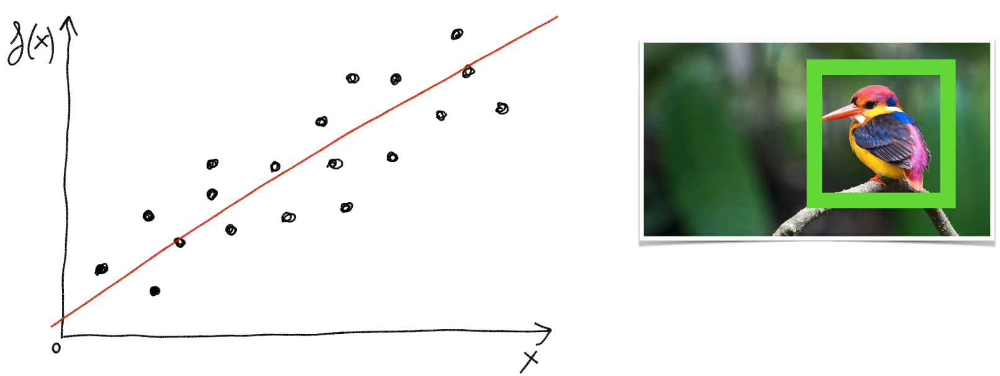
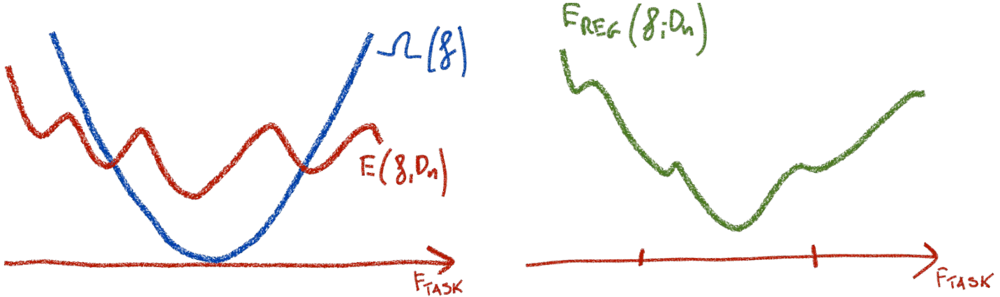

# Introduction to Machine Learning  --  1/3

|      |          |          |
| ---- | ------: | ------- |
| Intro to Machine Learning | prof.  Elisa Ricci<br />UniTN, 2021/22 | 1/3 |

[TOC]


# [1.](.) Introduction

## Overview

### Artificial Intelligence

> Our ultimate objective is to make programs that learn from their experience as effectively as humans do.  *J. McCarthy, 1958*


### Machine Learning

> **<u>Machine learning</u>** is the study of computer algorithms that improve automatically through experience. It is seen as a part of artificial intelligence.  *Wikipedia*

> **<u>Machine learning</u>** is the science of getting computers to act without being explicitly programmed.  *A. Samuel (1959)*

> It is concerned with the **automatic discovery of regularities in data** through the use of computer algorithms and with the use of these regularities to take actions.  *C. Bishop*

> The goal of machine learning is to develop methods that can **automatically detect patterns in data**, and then to use the uncovered patterns to **predict future data** or other outcomes of interest.  *K. Murphy*

> Machine learning is about predicting the future based on the past.  *Hal Daumé III*

ML allows computers to **acquire knowledge**

- Through **algorithms** by **learning and inferring from data**
  - Represented by a **model**
    - Used on **future data**


<aside><div>[T, P, E]<br>T: tasks<br>P: performance<br>E: experience</div></aside>

### Formal definition

> A computer program is said to learn from **experience $\boldsymbol E$** with respect to some class of **tasks $\boldsymbol T$** and **performance measure $\boldsymbol P$**, if its performance at tasks in $T$, as measured by $P$, improves with experience $E$.  *T. Mitchell (1970)*

- ==ML is the **study of algorithms** that==
  - ==Improve their **performance $P$** (error function)==
  - ==At **task $T$**==
  - ==With **experience $E$** dataset==
- ==A well-defined learning **task** is given by a **triplet $\lang T, P, E\rang$**==

---

> <u>Examples</u>
>
> - T: Recognizing handwritten words
>   P: Percentage of words correctly classified
>   E: Database of human-labeled images of handwritten words
> - T: Driving on four-lane highways using vision sensors
>   P: Average distance traveled before a human-judged error
>   E: A sequence of images and steering commands recorded while observing a human driver
> - T: Categorize email messages as spam or legitimate
>   P: Percentage of email messages correctly classified
>   E: Database of emails, some with human-given labels


<aside>multiple processing layers and multiple levels of abstraction</aside>

### Deep learning

> **<u>Deep learning</u>** allows computational models that are composed of **multiple processing layers** to learn representations of data with **multiple levels of abstraction**.  *Nature*

- Deep Learning uses a **neural network** with several layers of nodes between input and output
- Layers compute relevant **features automatically** in a series of stages, just as our brains seem to


### Course contents

- Supervised Learning

  - Nearest Neighbors

  - Decision Trees and Random Forests

  - Kernel Methods

  - Deep Neural Networks
    - Feedforward, convolutional and recurrent networks
  
- Unsupervised Learning

  - Clustering, dimensionality reduction
  - Deep Generative Models

- Reinforcement Learning


## Learning process

<aside><div>1. Collect data<br>2. Define models for task<br>3. Define error function<br>4. Minimize the error</div></aside>

### Stages

1. ==**Collect** (annotated) **data**==
2. ==Define a **family of models** for the classification **task**==
   - Choose models and algorithms
3. ==Define an **error function**==
   - Measures how well a model fits the data
4. ==Find the model that **minimize the error**==
   - **Train** or **learn** a model
   - **Optimization**

---

> 

---

> 


<aside><div>1. Measuring<br>2. Preprocessing<br>3. Dimensionality reduction<br>4. Model learning<br>5. Model testing</div></aside>

### Pipeline


<aside><div>- Training: learn a model
- Validation: tune
   hyper-parameters
- Test: check performance</div>
</aside>

### Datasets


- ==**Datasets**==
  - ==**Training set: learn a model** (60% of data)==
  - ==**Validation set: tune hyper-parameters, avoid overfitting** (20% of data)==
  - ==**Test set: check performance** (20% of data)==

- The **performance** of the training and validation sets is measured with an **error criterion**
- **Hyper parameters** (greedy chosen from a range) and **optimizers** are changed at each loop


# [2.](.) Data

## Data representation

<aside>Generalize training data; data from same distribution</aside>

### Features

- Data and features are stored in **vectors** and **matrices**
- **Examples** are described by the **features**
- **Features** are the only way the **algorithm** can see the **data**
- ==**Learning** is about **generalizing** from the **training data**, under the <u>assumption</u> that==
  - ==Training, validation and test data are drawn from the **same distribution**==
  - Features are **well chosen**
- The **model** can **classify** a new **example** based on the **features**
- Examples with the **same number of features** can be treated in the **same way** by the ML algorithms
- ==Examples are **mapped** into features by **human written algorithms**==


<aside><div><u>issues</u><br>- labelling<br>- information loss (vectors)<br>- choice of information</div></aside>

### Issues with features

<u>Irreducible errors</u>

- ==**Wrong data modeling** (labeling)==
- ==**Loss of information** because of the **vector** representation==

<u>Problems</u>

- ==The **choice** of the information== has an impact on the **generalization** ability of the model


### Structure of data

|      | Examples |          Features          | Labels  |      |
| ---- | :------: | :------------------------: | :-----: | ---- |
|      |  $E_1$   | $f_{11},f_{12},...,f_{1n}$ |  $l_1$  |      |
|      |  $E_2$   | $f_{21},f_{22},...,f_{2n}$ |  $l_2$  |      |
|      | $\dots$  |          $\dots$           | $\dots$ |      |
|      |  $E_m$   | $f_{m1},f_{m2},...,f_{mn}$ |  $l_m$  |      |


## Data processing

### Data `→` Examples


### Examples `→` Features


### Learn: Features + Labels `→` Model


### Predict: Features + Model `→` Label


## Data distribution

<aside><div>- supervised: p_data ∈ Δ(X×Y)
- unsupervised: p_data ∈ Δ(X)
- sample ⊆ p_data
</div></aside>
### Data and sampling

> **<u>Data</u>**: information about the problem to solve, in the form of an unknown distribution $p_{\rm data}$
>
> - <u>Supervised</u>: $\quad\ p_{\rm data}∈ \Delta(\cal X×Y)$
> - <u>Unsupervised</u>: $\ p_{\rm data}∈ \Delta(\cal X)$

- ==**Sampling** leads to an **approximation** of the distribution==

>**<u>Sample</u>**: subset of data generated from the distribution $p_{\rm data}$


### Probability distribution

- ==Describes how probable certain events are==
- Describes probabilities for all possible events
- Probabilities are between 0 and 1 (inclusive)
- Sum of probabilities over all events is 1


<aside>probability distribution over example-label pairs;<br>drawn data from same distribution</aside>

### Data generating distribution

>**<u>Data generating distribution</u>**: probability distribution over example-label pairs

- A **probabilistic model** of learning is used
- ==**Training, validation and test** sets should be drawn from the **same distribution**==
  - ~~e.g.~~ Images under different illumination


# [3.](.) Types of ML and Tasks

## Types of ML

### Comparison

|                  | Input                     | Output              |
| ---------------- | ------------------------- | ------------------- |
| **Supervised**   | Data and annotations      | Model/predictor     |
| **Unsupervised** | Only data, no annotations | Depends on the task |
| **Reinforced**   | Feedback process          | Action predictor    |


<aside><div>given
T={(x1,y1),...,(xm,ym)}
learn f : X→Y  (X⊆ℝ^d)
to predict y∈Y given x∈X</div></aside>

### Supervised learning

==Given a **training set $\cal T$**, learn a **function $f$** to **predict $y∈\cal Y$** given $x∈\cal X$==
$$
{\cal T}=\set{(x_1, y_1), ..., (x_m,y_m)}\\
f\ :\ \cal X\ →\ Y\\
{\cal X} ⊆ \R^d
$$

- $\cal T\,$:  **training set**
- $f\,\;$:  **model/predictor** (mapping function)
- $\cal X\,$:  set of **examples**
  - $x\in \cal X\,$:  **example**, represented by a list of features

- $\cal Y\;$:  set of **labels**
- $d\ \ $:  number of **features**

|      | Classification                                               | Regression                                                   |
| ---- | ------------------------------------------------------------ | ------------------------------------------------------------ |
|      | ${\cal Y}=\set{1,2,...,k}$                                   | ${\cal Y}=\R$                                                |
|      | **Finite** set of labels                                     | Labels are **real-valued**                                   |
|      | $y$ is **categorical**                                       | $y$ is **real-valued**                                       |
|      |  |  |


<aside><div>- clustering
- anomaly detection
- dimensionality reduction
</div></aside>
### Unsupervised learning

- ==**Clustering**==
  - ==<u>Given</u>: ${\cal T} = \set{x_1,...,x_m}$==
  - ==<u>Output</u>: **hidden structure** behind the $x$'s==
- ==**Anomaly detection**==
  - Analyze a set of **events** or **objects** and flags some of them as being **unusual or atypical**
- ==**Dimensionality reduction**==
  - ==Reduce the number of variables by obtaining a set of **principal variables**==
  - It's important to quantify the **loss of information** in this process


<aside>agent learns through feedback from environment</aside>

### Reinforcement learning

==An **agent** learns through **feedback from the environment**==

- ==By **interacting** with it==
- ==Receiving **rewards** for performing actions==

<u>Input</u>

- ==A **sequence of examples/states**==
- ==A **reward** after completing that **sequence**==

<u>Output</u>

- ==**Predictor** that predicts the **action** to take for an **individual example/state**==


## Tasks

<aside><u><b>task</b></u>: type of prediction to solve a problem;<br>set of functions f : X→Y where f∈F_task⊂Y^X</aside>

### Definition

> **<u>Task</u>**: type of prediction being made to solve a problem on some data

- ==**Set of functions** that can potentially solve it==
- ==Functions **assigning** each input $x∈\cal X$ an output $y∈\cal Y$==

$$
f:\cal X→Y \qquad\ f\in F_{\rm task}\sub Y^X
$$

- ==The nature of $\cal X$, $\cal Y$ and $\cal F_{\rm task}$ depends on the type of the task==
  - $\cal Y\,$: discrete labels, continuous labels ($\R$), $\N$, etc.

> <u>Notation</u> $\cal Y^X\,$:  set of all functions from $\cal X$ to $\cal Y$
> $$
> {\cal Y^X}=\set{f\ |\ f:{\cal X→Y}}
> $$


<aside>f∈Y^X : x → discrete label</aside>

### Classification

==<u>Find</u>: function $f∈\cal Y^X$ assigning each input $x∈\cal X$ a **discrete label**==
$$
f(x)∈{\cal Y}=\set{c_1,...,c_k}
$$


<aside>f∈Y^X : x → label ∈ ℝ</aside>

### Regression

==<u>Find</u>: function $f∈\cal Y^X$ assigning each input $x∈\cal X$ a **continuous label**==




<aside>probability distribution f∈Δ(X) fitting x∈X</aside>

### Density estimation

==<u>Find</u>: **probability distribution** $f∈\Delta({\cal X})$ that fits the data $x∈\cal X$==


<aside>f∈ℕ^X : x → cluster index</aside>

### Clustering

==<u>Find</u>: function $f∈\cal \N^X$ assigning each input $x∈\cal X$ a **cluster index** $f(x)∈\N$==


  


<aside>f∈Y^X : x → lower dimension</aside>

### Dimensionality reduction

==<u>Find</u>: function $f∈\cal Y^X$ mapping each input $x∈\cal X$ to a **lower dimensional** embedding $f(x)∈\cal Y$,==

- ==Where $\dim({\cal Y})\ll\dim({\cal X})$==
- <u>Application</u>: inspect classification algorithms


# [4.](.) Formal analysis of the process

## Learning process

<aside><div>- <u><b>model</b></u>: implementation
   of a function
- <u><b>hypotesis space</b></u>:
   set of models H⊂F_task
   restricting the search space
f ∈ H ⊂ F_task ⊂ Y^X
</div></aside>

### Model and Hypothesis space

> **<u>Model</u>**: implementation of a function $f∈\cal F_{\rm task}$ that can be tractably computed

- ==**Output** of the learning process==
- ==**Program** to solve the problem==
- <u>Assumption</u>: $f$ is still **tractably computed regardless of the algorithm** that generates it

> **<u>Hypothesis space</u>**: set of models $\cal H⊂ F_{\rm task}$
>
> - $\cal F_{\rm task}\,$:  all the possible mapping functions, from input space to output space
> - $\cal H\,$:  restriction of the search space $\cal F$ for the specific task

- ==The learning algorithm **seeks** a solution $f$ within the **hypothesis space**==

$$
f∈\cal H\sub F_{\rm task}\sub Y^X
$$


### Objectives

<aside>minimize generalization error function E(f, p_data);<br>search optimal f*∈F_task</aside>

#### Ideal target

<u>Objective</u>

- ==Minimize a **generalization error function $E(f,p_{\rm data})$**==
- ==Search the best function **$f^*\in{\cal F}_{\rm task}$** that obtains the **minimum error**==

<u>Problems</u>

- ==The search space ${\cal F_{\rm task}}$ is **too large**==
- ==$p_{\rm data}$ is **inaccessible**==


$$
f^*∈\arg\min_{f∈\cal F_{\rm task}} E(f,p_{\rm data})
$$

<aside>restrict to only tractable functions in H⊂F_task</aside>

#### Feasible target

<u>Idea</u>

- ==**Restrict**== the focus on finding ==**functions**== that can be ==implemented and evaluated in a **tractable way**==
  - ~~e.g.~~ <u>Assumption</u>: ==**$f$ is polynomial**==, so that the it's possible to calculate the **parameters vector**

<u>Steps</u>

1. ==**Define** a hypothesis space **${\cal H}\sub{\cal F_{\rm task}}$**==
2. ==**Seek** a solution **within that space**==

<u>Problems</u>

- ==**Cannot** be computed **exactly** because $p_{\rm data}$ is still unknown==


$$
f^*_{\cal H}∈\arg\min_{\ f∈{\cal H}\ } E(f,p_{\rm data})
$$

<aside>use data sample D_n (training set);<br>minimize E(f, D_n)</aside>

#### Actual target

<u>Idea</u>

- ==Work on a **data sample ${\cal D}_n$ (training set)**==

$$
{\cal D}_n=\set{\, z\ \ |\ \ z=(x,y)∈\cal X×Y\ \ ∧\ \ z\sim p_{\rm data\,}}
$$

<u>Actual objective</u>

- ==Minimize a **training error function $E(f,{\cal D}_n)$**==


$$
f^*_{\cal H}({\cal D}_n)∈\arg\min_{\ f∈{\cal H}\ }E(f,{\cal D}_n)
$$


<aside>pointwise loss l(f,z)</aside>

### Error function

> <u>Definition</u>  (**Error function**)
>
> Pointwise loss $l(f,z)$ that measures the error incurred by $f$ on the training example $z$, w.r.t. the ground truth
> $$
> \begin{align}
> E(f,p_{\rm data})\ &=\ 𝔼_{z\sim p_{\rm data}}[l(f,z)]\\[8px]
> E(f,{\cal D}_n)\ &=\ \dfrac1n\displaystyle\sum_{i=1}^nl(f,z_i)
> \end{align}
> $$

> <u>Notation</u>  (**Expected value / Mean**)
> $$
> 𝔼[X]= μ_X=\sum_{i}x_iP(x_i)
> $$

---

---

> <u>Note</u>: ==error can be **decompose** at each data point==
>
> - ~~e.g.~~ When training a huge neural network, only a ==**mini batch** of data points is stochastically chosen==, at each training iteration, to ==calculate the discrepancy==


<aside><u>objective</u>: solve the optimization problem targeting f*_H(D_n)</aside>

### Learning algorithm

<u>Objective</u>

- ==Solve the **optimization problem** targeting **$f_{\cal H}^*({\cal D}_n)$**==
  $$
  f^*_{\cal H}({\cal D}_n)∈\arg\min_{\ f∈{\cal H}\ }E(f,{\cal D}_n)
  $$

<u>Problems</u>

- ==Might end up in a **different result $\hat{f}_{\cal H}^*({\cal D}_n)$**==
- ==Depends on the **starting point**==


<aside>F_task → H → D_n → GD</aside>

### Recap


## Problems

<aside><div>- <u><b>underfitting</b></u>:
   big error on training set
- <u><b>overrfitting</b></u>:
   large training-test error gap
   don't generalize on validation</div></aside>
### Underfitting & Overfitting

Factors determining **how well** a machine learning algorithm will perform
- ==**Small training error**==
- ==**Small gap between training and test error**==

> **<u>Underfiting</u>**: the model is not able to obtain a sufficiently low error value on the training set

> **<u>Overfitting</u>**: the gap between the training error and test error is too large

- ==It **fits** extremely **well training** data==
- ==It is **not** able to **generalize** on the **validation** set==
- **Model complexity** has strong implications on overfitting
- **Huge problem** in ML


<aside><div>- <u><b>approximation error</b></u>:
   induced by restriction of H
- <u><b>irreducible error</b></u>:
   due to inherent variability
</div></aside>

### Approximation & Irreducible errors

> **<u>Approximation error</u>**: error induced by the restriction of the hypothesis space ${\cal H}$

> **<u>Irreducible error</u>**: error due to inherent variability

- ==Caused by **randomness** or natural **variability** in a system==
- **Not** reducible by choosing a **better model**
- **Deterministic factors** that can't be observed, but which could be interpreted as **inherent variability**
  - ~~e.g.~~ ==Related to the design of the **features space**==

 


## Strategies

<aside>sample from p_data<br>since it's unknown</aside>

### Estimate generalization error


<aside><div>    <u>model</u>
    - stop before convergence
    - reduce model capacity
    - use regularization
    - ensembling
    <u>data</u>
    - increase the amount
    - add training samples
    - transformations
    - noise</div></aside>
### Improve generalization

==<u>Strategies</u>  (**model**)==

- ==**Avoid** attaining the **minimum on training** error==
  - ==Could cause **overfitting**==
- ==**Stop** the learning algorithm before **convergence**==
- ==**Reduce model capacity**==
  - ==Use **constraints**==
- ==Change the objective with a **regularization term**==
  - ==**Avoid complex** solutions==

- ==**Ensembling**==
  - ==**Combine** predictions from multiple decorrelated **models**==


==<u>Strategies</u>  (**data**)==

- ==**Increase** the amount of **data**==
- ==**Add** more training **samples**==
- ==Augment the training set with synthetic **transformations**==
- ==Inject **noise** in the learning algorithm==


<aside>E_reg(f,Dn)=E(f,Dn)+λΩ(f)</aside>

#### Regularization

> <u>Definition</u>  (**Regularization**)
>
> Modification of the training error function with a term $\Omega(f)$ that penalizes complex solutions
> $$
> E_{\rm reg}(f,{\cal D}_n)=E(f,{\cal D}_n) + \lambda_n\Omega(f)
> $$
>
> - $\Omega(f)\,$:  regularization term
> - $\lambda_n\,$:  trade-off hyper parameter

- ==**Balances** underfitting and overfitting==
- ==$\lambda_n$ must be **searched** in the training loop for the best result==




#### Transformation


#### Ensembling


## Example

### Polynomial curve fitting

#### Data

$$
{\cal D}_n=\set{(x_1,y_1),...,(x_n,y_n)}
$$

- <u>Data</u>: generated from $\sin(2πx)$ + noise
- <u>Training set</u>: $n=10$ points


#### Model

$$
f_w(x) = \sum_{i=0}^Mw_ix^i\\
{\cal H}_M = \set{f_w:w∈\R^M}
$$

- ==<u>Parameters</u>: $w=\set{w_1,...,w_M}$==
- ==<u>Hypothesis space</u>: restricted to the **polynomial functions** with fixed $M∈\N$==


#### Error function

$$
E(f,{\cal D}_n)=\dfrac1n\sum_{i=1}^n (f_w(x_i)-y_i)^2
$$

- ==**Pointwise square loss**: $\ l(f,z)=l(f,(x,y))=(f(x)-y)^2$==


#### Objective

$$
f_{{\cal H}_M}^*({\cal D}_n)∈\arg\min_{f∈{\cal H}_M}E(f,{\cal D}_n)\ ≡\ f_{w^*}\\[4px]
w^*∈\arg\min_{w∈\R^M}\frac1n\sum_{i=1}^n(f_w(x_i)-y_i)^2
$$

- Requires solving a **linear system** of equations


#### Solutions


#### Regularization

$$
E_{\rm reg}(f,{\cal D}_n)=\dfrac1n\sum_{i=1}^n (f_w(x_i)-y_i)^2+\frac\lambda n\lVert w\rVert^2
$$


> <u>Notation</u>  (**Summation**)
> $$
> \lVert w\rVert=\sum_{i=1}^n w_i
> $$


#### Increasing data size

$$
n→\infin\quad⇒\quad  E(f,{\cal D}_n)→E(f,p_{\rm data})
$$


# [5.](.) k-NN

## Classification problem

<aside>features as coordinates that represent examples in an n-dimensional space</aside>

### Data visualization

- ==**Examples** in a **feature space**==

  - ==Turn **features** into **numerical values**==

  - ==**Examples** are **points in an $n$-dimensional space**==
    - ==**$\,n\,$**: number of **features**==


### Classification algorithm

- <u>Task</u>: **classify an example $\boldsymbol d$**
- <u>Solutions</u>
  - Label $d$ with the label of the closest example to $d$ in the training set (1-NN)
  - k-NN algorithm

---

> 
>
> ---
>
> 
>
> ---
>
> 


<aside>d is classified with the majority label of its k-NN</aside>

### k-Nearest Neighbor

> <u>Algorithm</u>  (**k-NN**)
>
> To classify an example $d$
>
> - Find $k$ nearest neighbors of $d$
> - Choose as the label the majority label within them

- ==$k$ is an **hyper-parameter**==
- ==**Non parametric model**==
  - It doesn't learn any model

- **Robust to noisy data**
- <u>Question</u>: how to measure **nearest**

> **<u>Weighted k-NN</u>**: weight the vote of the examples, so that closer examples have more vote/weight

- **Vanilla k-NN**: all examples are treated **equally**
- Often use some sort of ==**exponential decay**==


## Distance computation

<aside>comparable features (same units)</aside>

### Euclidean distance


$$
D(a,b)=\sqrt{(a_1-b_1)^2+\dots+(a_n-b_n)^2}
$$
Makes sense when ==different **features** are **comparable**==

- Each variable is measured in the ==**same units**==
- If the measurements are **different** it is **not clear**
  - ~~e.g.~~ Length and weight


<aside>generalize euclidean,<br>p dimensions, r parameter</aside>

### Minkowski distance

==**Generalization of Euclidean** distance==
$$
D(a,b)=\left(\sum_{k=1}^{p}|a_k-b_k|^r\right)^{1/r}
$$

- ==$p\ $:  **dimensions**==
- ==$r\ $:  **parameter** (could be an **hyper** parameter)==
  - $r = 1:$  **Manhattan** (L1-norm, city block, taxi)
  - $r = 2:$  **Euclidean** (L2-norm)
  - $r →\infin:$  **supremum** (L$∞$-norm) distance
    - **Maximum difference** between any component of the vectors


<aside>S_C(a,b) = cos(θ) =<br>= (a·b) / (||a||·||b||)</aside>

### Cosine similarity


$$
S_C(a,b)=\cos(θ)=\frac{a·b}{\lVert a\rVert·\lVert b\rVert}=\frac{\sum_{k=1}^{p}a_{k}·b_{k}}{\sqrt{\sum_{k=1}^{p}a_{k}^2}·\sqrt{\sum_{k=1}^{p}b_{k}^2}}\\[8px]
D(a,b)=1-S_C(a,b)
$$

- **$\lVert a\rVert\,$:  length** of vector $a$

---

> <u>Example</u>  (**Documents similarity**)
>
> Measure the similartity of two documents
>
> - Represented as vectors $d_1$ and $d_2$
> - Wich map the number of occurrences of the contained words
>
> $$
> d_1=\pmatrix{3\ 2\ 0\ 5\ 0\ 0\ 0\ 2\ 0\ 0}\\
> d_2=\pmatrix{1\ 0\ 0\ 0\ 0\ 0\ 0\ 1\ 0\ 2}\\[10px]
> d_1·d_2=3\!·\!1+2\!·\!0+0\!·\!0+5\!·\!0+0\!·\!0+0\!·\!0+0\!·\!0+2\!·\!1+0\!·\!0+0\!·\!2=5\\[2px]
> \lVert d_1\rVert=\sqrt{3^2+2^2+0^2+5^2+0^2+0^2+0^2+2^2+0^2+0^2}=6.481\\
> \lVert d_2\rVert=\sqrt{1^2+0^2+0^2+0^2+0^2+0^2+0^2+1^2+0^2+2^2}=2.449\\[8px]
> \cos(d_1,d_2)=0.315
> $$


<aside>make features<br>equally important</aside>

### Standardization & Scaling

==When **features** are **not comparable**, these procedures make them all **equally important**==

> <u>Formula</u>  (**Standardization / Z-score normalization**)
>
> Rescale the data so that the mean ($μ$) is $0$ and the standard deviation from the mean (standard score $σ$) is $1$
> $$
> x_{\rm norm}=\frac{x-μ}{σ}
> $$

> <u>Formula</u>  (**Min-Max scaling**)
>
> Scale the data to a fixed range between $0$ and $1$
> $$
> x_{\rm norm}=\frac{x-x_\min}{x_\max-x_\min}
> $$


<aside><div>similarity ∈ [0, 1]
distance ∈ [0, inf)</div></aside>
### Distance & Similarity

==Measuring distance/similarity is a **domain-specific problem** (there are many different **variations**)==

> **<u>Similarity</u>**: numerical measure of how alike two data objects are

- **Higher** when objects are **more alike**
- ==In the **range $[0,1]$**==

> **<u>Distance</u>**: numerical measure of how different are two data objects

- **Lower** when objects are **more alike**
- ==**Minimum** dissimilarity is **$\,0\,$**==
- ==**Upper limit varies**==

---

> <u>Problem</u>  (**Discrete features**)
>
> - Measuring the distance between discrete feature is **not sensible** (~~e.g.~~ colors in fruit)
> - There is the need to use something **more sophisticated**


### Recap


## Decision boundaries

<aside>kNN: subset of Voronoi,<br>not explicitly computed</aside>

### Decision boundaries

> **<u>Decision boundary</u>**: place in the features space where the classification of a point/example changes

- ==**k-NN** does **not explicitly** compute decision boundaries==
- ==**Subset of the Voronoi diagram** for the training data==
- ==The **more examples** that are stored, the **more complex** the decision boundaries can become (overfitting)==


#### Voronoi diagram

> <u>**Voronoi diagram**</u>: areas that are nearest to any given point, given a set of data

- ==Each line **segment** is **equidistant** between two points==


#### k-NN

==k-NN gives **locally defined** decision boundaries between classes==


<aside>k odd ∧ k &#60; sqrt(n)<br>larger → smoother</aside>

### Choosing $k$

- ==<u>Heuristics</u>: **odd number** to avoid ties (often 3, 5, 7)==
- ==<u>Rule of thumb</u>: **$k < \sqrt n$**==
- ==Use **validation set** and **cross validation**==

<u>Effects</u>

- ==**Larger** $k$ produces **smoother** boundary effect==
- ==**$k≥N$**$:$ always predicts the **majority class**==

> **<u>Cross validation</u>**: extrapolation of the validation set from the training set, taking out random samples from it, when the first one is not given

- ==**Multiple repetition** of cross validation leads to the **hold-out set**==

           


## Dimensionality

<aside><div>- <u><b>lazy</b></u>: store training
   data and operates
   on new examples
- <u><b>eager</b></u>: constructs a
   classification model</div></aside>

### Lazy & Eager Learning

> **<u>Lazy learning</u>**: stores training data (or perform limited processing) and operates when it's given a test example

- ==**Less** time in **training**==

- ==**More** time in **predicting**==

- ==~~e.g.~~ k-NN (no training)==

> **<u>Eager learning</u>**: given a training set, constructs a classification model before receiving new test data to classify

- ==~~e.g.~~ DTs, SVMs==


<aside><div><u><b>curse of dimensionality</b></u>:
in high dimensions, points
are distant and sparse
<u>solutions</u>:
- dimensionality reduction
- features selection
</div></aside>

### Curse of dimensionality

> **<u>Curse of dimensionality</u>**: in high dimensions almost all points are far away from each other

<u>Problems</u>

- ==There is **not enough data** available for the number of dimensions==
- As the number of **dimensions increases**
  - ==The size of the **data space grows exponentially** with the number of **dimensions**==
  - ==The size of the **data set must grow exponentially** in order to keep the **same density**==
- Without dramatic increases in the size of the data set, **k-NN loses all predictive power**
- ==**k-NN** is **not** used in **high dimensional** problem==

<u>Solutions</u>

- ==**Dimensionality reduction**==
- ==**Features selection** mechanisms==

|      | Generic ML algorithm                                         | k-NN                                                         |
| ---- | ------------------------------------------------------------ | ------------------------------------------------------------ |
|      | Needs a **dense** data set for **accurate** prediction       | Very **dependent** on having a **dense data set**            |
|      | Could be based on **single dimensions**, and only<br />needs points to be close together along that axis | Requires a point to be close in **every single<br />dimension** (along every axis) in the data space |


<aside><div>- linear
    - no pre-processing
    - O(kNn)
- tree-based
    - faster at query
    - additional space
    - O(N log N)</div></aside>
### Computational cost

- ==**Linear** algorithm==
  - ==**No pre-processing**==
  - ==Compute **distance for all** $N$ datapoints==
  - ==Complexity of distance computation: **$O(kNn)$**==
    - Also depends on the **dimension $n$** of the features space
  - **No additional space** needed
  
- ==**Tree-based** data structures==
  - ==**Pre-processing**==
  - ==**Faster at query** time: **$O(N \log N)$**==
  - ==Requires **additional space**==
  - ==Often used in **applications**: **k-d trees** (k-dimensional trees)==


## k-d trees

<aside>bisecting structure, splitted on median in some dimension</aside>

### k-dimensional tree

- ==Progressive **splitting** of the features space into regions==
- ==Allows to **search** only in **one region** instead of the entire space==
- ==**Bisecting structure**==
- ==Each **branchpoint** is the **median in some dimension**== 
  - One set of descendants are to one side, and one to the other

- ==**Cycle the dimensions**==


<aside>greedy binary search with backtracking</aside>

### NN Search on a k-d tree

- **For each point**
  1. Start at the **root**
  2. **Traverse** the tree to the **section** where the **new point belongs**
  3. Find the **leaf**, store it as the **best**
  4. **Traverse upward**, and for each node
     1. If it’s **closer**, it becomes the **best**
     2. Check if there could be yet **better** points on the **other side**
        1. **Fit a sphere** around the point of the same **radius** as **distance** to current **best**
        2. See if that **sphere goes over the splitting** plane associated with the considered branchpoint
     3. If there could be, **go down** again on the **other side**; otherwise, **go up another level**
- **$O(N \log N)$**


## Summary - k-NN

<u>Applicability</u>

- ==Instance map to **points in $\R^N$**==
- ==**Few features** per instance (~~e.g.~~ less than 20)==
- ==**Lots of training data**==

<u>Advantages</u>

- ==**No training**==
- ==Learn **complex target** functions==
- **Easy** to program
- ==**No optimization or training** required==
- ==Classification **accuracy** can be very **good**==

<u>Disadvantages</u>

- ==**Slow** at **query** time==
- ==Easily **fooled** by **irrelevant attributes**==
- ==**Memory based** technique==
  - Must make a **pass through the data** for each classification
  - This can be **prohibitive** for large data sets

<u>Issues</u>

- ==**Choosing distance measure**==
  - Common: **Euclidean** with normalization/scaling
- ==**Choosing $k$**==
- ==**Curse of dimensionality**==


# [6.](.) Linear models

## ML Models

### Models


- `+++`  **Classification: perceptron**


<aside><u><b>model assumption</b></u>: constraint on the shape of the decision boundaries</aside>

### Assumption

<u>Data assumptions</u>

- <u>Approach 1</u>: ==**strong assumptions** about the data==
  - ==<u>If true</u>: lead to **better performance**==
  - ==<u>If not true</u>: can **fail** miserably==
- <u>Approach 2</u>: ==**not many assumptions** about the data==
  - ==Allows to learn from more **varied data**==
  - ==More **prone to overfitting**==
  - ==Requires **more training data**==

> **<u>Model assumption</u>**: constraint on the shape of the decision boundaries

- ==Come from **knowledge**==
- Hold for **different ML problems**

- If you do **not** have **strong assumptions** about the model, **learning** can take **longer**
- ==**Data generating distribution**: **knowing the model** beforehand can drastically **improve the learning** and the number of **examples required**==


<aside>no model assumptions, any separation permitted</aside>

### k-NN

- ==**No model assumptions**: proximity relates to class kNN can learn **any arbitrary separation between classes**==


<aside><u><b>bias of a model</b></u>:<br>how strong model assumptions are</aside>

### Bias

>**<u>Bias of a model</u>**: how strong the model assumptions are

- **Low-bias classifiers**: **minimal assumptions** about the data
  - ~~e.g.~~ k-NN and DT
- **High-bias classifiers**: **strong assumptions** about the data
  - ~~e.g.~~ perceptron, SVM


<aside><u><b>linear model</b></u>: assumes data is linearly separable</aside>

### Linear models

> **<u>Linear model</u>**: model that assumes the data is linearly separable

- ==**Linear separability is a strong high-bias assumption**==
- ==Data could be separated by **hyperplanes**==


## Linear models

<aside><div>w^T x + b = Σ_n w_i·f_i + b = 0
n: dimensions
w: vector of n weights w_i
b: bias parameter</div></aside>

### Definition

> <u>Definition</u>  (**Hyperplane**)
> $$
> w^Tx+b=\sum_{i=1}^{n}w_if_i+b=0
> $$
> In $n$-dimensional space, an hyperplane is defined by $n+1$ hyper parameters
>
> - **Weight vector** $w$ (set of $n$ weights $w_i$)
> - **Bias parameter** $b$ (opposite of the origin intercept $a$, so that $b=-a$)
>   - $w^Tx\,$:  cross product of
>     - $w^T\,$:  transposed weight vector
>     - $x\,$:  feature vector (example)

- ==<u>Geometrical interpretation</u>: hyperplane **perpendicular** to the **weight vector**==
  
- ~~$n=2\ $:  line~~
  $$
  w_1f_1+w_2f_2+b=0
  $$

- ~~$n=3\ $:  plane~~
  $$
  w_1f_1+w_2f_2+w_3f_3+b=0
  $$

---

> 
>
> ---
>
> 


<aside>sign indicates the<br>side of the plane</aside>

### Classifying

==**Binary classifier**: classify an example with a linear model by **checking the sign**==


<aside>one example at a time, adjusts parameters progressively</aside>

### Online learning

> **<u>Online learning</u>**: learning that sees one example at a time

<u>Advantages</u>

- ==Does **not** require all the **training data beforehand**==
- ==**Adjusts the hyperplane progressively** as new data points arrive==

<u>Used for</u>

- **Data Streams**
- **Large-scale datasets**
- Privacy-preserving applications

                


<aside>online updates the model at each new example,<br>if prediction is wrong</aside>

### Batch VS Online

- **Batch**: **training set** $\set{(x_i , y_i)\ :\ 1 ≤ i ≤ n}$, typically **iid**
- ==**Online**: data points arrive **one by one**==
  1. ==Receives an **unlabeled example $x_i$**==
  2. ==**Predicts a classification** of this example==
  3. ==Is told the **correct answer $y_i$**==
  4. ==**Updates the model if wrong**==

> **<u>iid</u>**: independent and identically distributed random variables


## Learning a linear model

<aside>update w if online prediction is wrong</aside>

### Learning a linear classifier

1. ==A **linear model** $w$ is given==
2. ==A **new sample** arrives==
3. ==Model **prediction** is==
   - ==**Correct**: model is **good** and can **go on**==
   - ==**Wrong**: model is **wrong** and must be **updated**==

---

> 
>
> ---
>
> 
>
> - $w_1$
>   - <u>Problem</u>: $f_1$ contributed in the **wrong direction** (**negative feature**)
>   - <u>Solution</u>: **invert** the direction (~~e.g.~~ $w_1=-1$) or **neutralize** it (~~e.g.~~ $w_1=0$)
> - $w_2$
>   - <u>Problem</u>: $f_2$ could have contributed in the correct direction, but it did not since the weight is $0$
>   - <u>Solution</u>: **increase** the corresponding weight (~~e.g.~~ $w_2=1$)
>
> ---
>
> 
>
> ---
>
> 


<aside>artificial neuron</aside>

### Perceptron


- ==Simplest **activation function** is a **threshold**==


<aside>update w until convergence</aside>

### Perceptron learning algorithm

```pseudocode
loop until convergence or for some_number_of_iterations:
    foreach training_example {[f1, f2, ..., fn], label}:
        prediction = b + Σ wj * fj   /* check if it is correct based on the current model  */
        if prediction * label <= 0:  /* if prediction is incorrect, update all the weights */
            foreach wj: wj += fj * label
            b += label
```

```python
class Example:
    def __init__(self, x: list):  # x: feature vector (float list)
        self.x = x
        self.n = len(x)


class TrainingExample(Example):
    def __init__(self, x: list, label: int):  # label: binary class {1, -1}
        super.__init__(x)
        self.label = label


class TrainingSet:
    def __init__(self, data: list):  # data: training set (TrainingExample list)
        self.data = data
        self.n = data[0].n


class Perceptron:
    def __init__(self, n: int):  # n: number of dimensions
        self.w = [1.0] * n       # w: weight vector (float list)
        self.b = 0.0             # b: bias parameter (float)
    
    def predict(self, x: list) -> float:  # x: example features (float list)
        return sum([wi * fi for wi, fi in zip(self.w, x)]) + self.b
    
    def isCorrect(self, tx: TrainingExample) -> bool:
        return tx.label * self.predict(tx.x) >= 0
    
    def convergence(self, T: TrainingSet) -> bool:  # naive
        for tx in T.data:
            if not self.isCorrect(tx):
                return False
        return True
    
    def learning(self, T: TrainingSet):  # T: training set
        while not self.convergence(T):
# 1     for i in range(M):
            for tx in T.data:
# 2         for tx in [random.choice(T.data)]:
                if not self.isCorrect(tx):  # check correctness based on current model
                    # update all the weights
                    self.w[:] = [wi + fi * tx.label for wi, fi in zip(self.w, tx.x)]
                    self.b += tx.label


if __name__ == "__main__":
    data = [[[1, 1], 1],
            [[2, 1], 1],
            [[4, 2], 1],
            [[3, 3], 1],
            [[1, 4], 1],
            [[2, 6], -1],
            [[3, 6], -1],
            [[4, 5], -1],
            [[5, 5], -1],
            [[5, 8], -1],
            [[6, 3], -1]]
    T = TrainingSet([TrainingExample(tx[0], tx[1]) for tx in data])
    P = Perceptron(T.n)
    P.learning(T)
    print(P.w, P.b)
```

<u>Variations</u>

1. ==Limit the **number of iterations**==
   - ==Avoid **overfitting**==
   - ==Avoid an infinite loop when the data is **not linearly separable**==
2. ==Choose a **single random sample or a mini-batch** for each iteration==
   - ==Increase **generalization**==


### Perceptron in action


[Animation](https://www.youtube.com/watch?v=vGwemZhPlsA)


<aside>no constraints on the line</aside>

### Convergence


---

> <u>Note</u>: other algorithms are used to find a line with certain characteristics 
>
> - ~~e.g.~~ **Support-vector machines** search the line with maximum margin


### Linear separable sets

> **<u>Linear separable set</u>**: the training instances are linearly separable if there exists a hyperplane that will separate the two classes


