# Introduction to Machine Learning  --  2/3

|      |          |          |
| ---- | ------: | ------- |
| Intro to Machine Learning | prof. Elisa Ricci<br />UniTN, 2021/22 | 2/3 |

[TOC]


# [7.](.) Multi-class classification

## Binary VS Multi-class

<aside>D ⊂ X × {-1, 1}</aside>

### Binary classification

> <u>Definition</u>  (**Binary classification**)
>
> - <u>Given</u>
>
>   - Input space $\cal X$
>
>   - Unknown distribution $\cal D$ over ${\cal X}√ó\set{-1,1}$
>
>   - Training set $D$ sampled from $\cal D$
>
> - <u>Compute</u>: a function $f$ minimizing $𝔼_{(x,y)\sim\cal D}\big[1[f(x)≠ y]\big]$


<aside>D ⊂ X × [K]<br>K: number of classes</aside>

### Multi-class classification

> <u>Definition</u>  (**Multi-class classification**)
>
> - <u>Given</u>
>
>   - Input space $\cal X$
>
>   - Number of classes $K$ ~~($K>2$)~~
>
>   - Unknown distribution $\cal D$ over ${\cal X}√ó[K]$
>
>   - Training set $D$ sampled from $\cal D$
>
> - <u>Compute</u>: a function $f$ minimizing $𝔼_{(x,y)\sim\cal D}\big[1[f(x)≠ y]\big]$

- ==<u>Note</u>: **kNN** operates naively for multi-class classification==


<aside>combine perceptrons (given as black boxes)</aside>

### Black box approach

- ==<u>Given</u>: **perceptrons as a black box models**==
- ==<u>Objective</u>: **combine** these different models in order to **learn a multi-class classifier**==


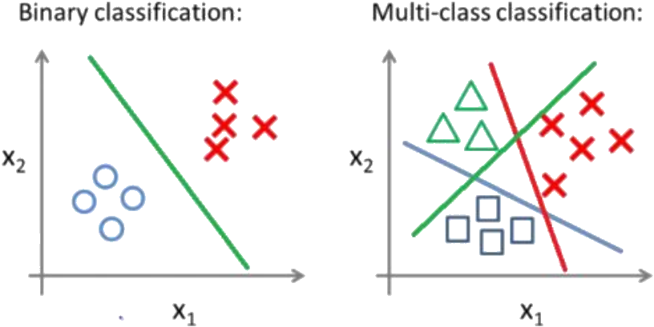


## One vs All

<aside>learn K binary classifiers, pick most confident positive (otherwise least confident negative)</aside>

### Training and classification

- ==<u>Training</u>: for each **label $L$** define a **binary problem**==
  - ==All examples with **label $L$ are positive**==
  - ==All other examples are negative==
- ==<u>In practice</u>: learn **$K$ different linear classifier**==
- ==<u>Classify</u>:==
  - ==Pick the **most confident positive prediction**==
  - ==If none vote positive, pick **least confident negative prediction**==

> **<u>Confidence</u>**: distance from the hyperplane
> $$
> {\rm prediction = distance}=b+\sum_{i=1}^{n}w_if_i
> $$

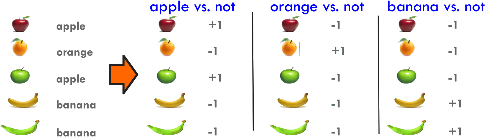


<aside>medians</aside>

### Decision boundaries

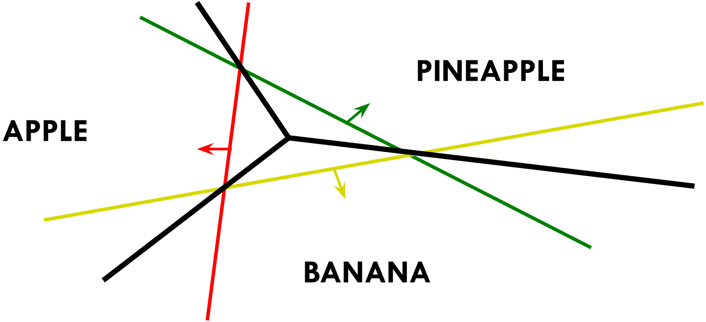


<aside><div><u>train</u>: train and return
K binary classifiers {f_1,...,f_K},
predicting L_k against !L_k
<u>test</u>: return argmax_k f_k(x)</div></aside>

### Algorithm


## All vs All

<aside>learn a classifier for each pair of labels i,j against<br>a reduced training set</aside>

### Training

- ==<u>Idea</u>: **decompose** the multi-class classification problem into **binary** classification problems==
- ==**For each pair of labels** ($K (K ‚àí 1) / 2$), train a **classifier** to distinguish between them==
  1. ==**$F_{ij}$** is the classifier that discriminates **class $i$ against class $j$**, with $1 ≤ i < j ≤ K$==
       - ==Trained against a **reduced training set**, containing only examples from **classes $i$ and $j$**==

  2. The classifier receives examples of class
  
       - **$i$ as positive**
       - **$j$ as negative**
  3. ==When a **test point** arrives, **evaluate** it on **all the $F_{ij}$ classifiers**==
  4. Every time $F_{ij}$ predicts
  
       - ==**Positive: class $i$ gets a vote**==
       - ==**Negative: class $j$ gets a vote**==
  5. ==**Confidence** could be **accumulated**==


<aside>classify x with each F_ij; final class based on votes</aside>

### Classification

1. ==Classify an example $x$ with **each classifier $F_{ij}$**==
2. ==Choose the **final class**==
   - ==**Majority vote**==
   - ==**Weighted vote** based on **confidence**==
     - ==$y = F_{ij}(x)$==
     - ==${\rm score}_i \text{ += }y$==
     - ==${\rm score}_j -\!\text{= }y$==


<aside><div><u>train</u>: train and return
(K·(K-1)/2) binary classifiers f_ij,
predicting L_i against L_j
<u>test</u>: for each (i, j) update score_i
and score_j based on f_ij(x);
return argmax_k score_k</div></aside>

### Algorithm

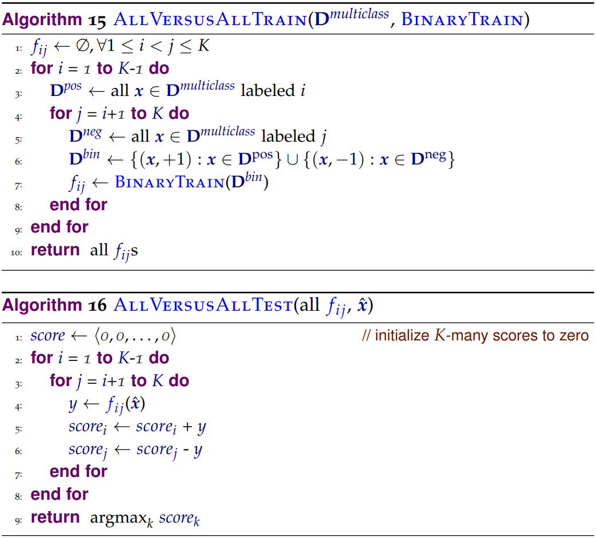


## Summary

<aside><div>- faster at train time
    - smaller data
- slower at test time
    - more classifiers
- more prone to errors</div></aside>

### AVA performance

- <u>Train time</u>
  - ==**AVA** learns **more classifiers**, but they are trained on **smaller data**==
    - ==**Faster** if the **labels** are **equally balanced**==
- <u>Test time</u>
  - ==**AVA** has **more classifiers**==
    - ==Often is **slower**==
- <u>Error</u>
  - ==**AVA** must train on more **balanced data** sets==
  - ==**AVA** tests with **more classifiers** and therefore has **more chances for errors**==


<aside>OVA or multiple labels classifiers (DT, kNN)</aside>

### Best practice

- ==If using **binary classifiers**, the most common is **OVA**==
- ==Otherwise, use a classifier that allows **multiple labels**==
  - ==**DT**, **k-NN** or more sophisticated methods==


## Evaluation

### Multiclass evaluation


- ==<u>Problem</u>: data imbalance==


<aside>macro-avg emphasize rarer labels</aside>

### Averaging

> **<u>Microaveraging</u>**: arithmetic average over examples

> **<u>Macroaveraging</u>**: calculate evaluation score (accuracy) for each label, then average over labels

- ==Puts more **weight**/emphasis on **rarer labels**==


<aside>M(i,j) = # examples x :<br>L(x) = i ‚àß f(x) = j</aside>

### Confusion matrix

==Entry **$(i, j)$** represents the **number/percentage** of examples with **label $i$** that were **predicted** to have **label $j$**==


# [8.](.) Gradient descent

## Model-based machine learning

<aside>learning algorithm<br>minimizing a criteria</aside>

### Procedure

1. ==<u>Define</u>: **model**==
   - ==Defined by a **collection of parameters**==
   - ~~e.g.~~ hyperplane, decision tree, etc.
2. ==<u>Define</u>: **objective function**==
   - ==Criterion to **optimize**==
   - ==Training **error function**==
3. ==<u>Develop</u>: **learning algorithm**==
   - ==<u>Objective</u>: **minimize the criterion**==
   - **Heuristically** or **exactly**


### Notation

> <u>Notations</u>
>
> - **Indicator function**: turns True and False answers into numbers/counts
>   $$
>   1[x]=\begin{cases} 
>         1 & x={\rm True} \\ 
>         0 & x={\rm False}
>      \end{cases}
>   $$
>
> - **Vector notation**: represents an example $f_1, f_2, …, f_m$ as a single vector $x$
>
>   - $x_i$ subscript will indicate **examples** indexing over a dataset
>   - $x_j$ subscript will indicate **feature** indexing
>
> - **Vector dot-product**: between two vectors $a$ and $b$
>   $$
>   a·b=\sum_{j=1}^{m}a_jb_j
>   $$


## Loss functions

<aside><u><b>0/1 loss</b></u>: counts errors made in prediction<br><u>objective</u>: w and b that minimize the 0/1 loss</aside>

### Linear model -- 0/1 loss

> **<u>0/1 loss</u>**: counts how many errors are made in prediction

1. <u>Model</u>
   $$
   0=b+\sum_{i=1}^{n}w_if_i
   $$

   - Parameters to learn are $b$ and $w$

2. <u>Objective function</u>
   $$
   \sum_{i=1}^{n}1[y_i·(w·x_i+b)≤0]
   $$

   - ==**0/1 loss**==

3. <u>Learning algorithm</u>
   $$
   \operatorname{argmin}_{w, b} \sum_{i=1}^{n}1[y_i·(w·x_i+b)≤0]
   $$

   - ==Find $w$ and $b$ that **minimize the 0/1 loss**==


### Minimizing 0/1 in one dimension

- ~~Each time $w$ is changed such that the example is right/wrong the loss will increase/decrease~~
- ~~Each new feature adds another dimension to this space~~
  - ~~NP-hard~~


<aside>continuous, convex</aside>

#### Ideal loss function

- ==**Continuous** (~~i.e.~~ differentiable)==
  - ==Gives an indication of **direction of minimization**==
- ==**Convex**: only **one minima**==


<aside>not continuous,<br>many local minima</aside>

#### Actual loss function

<u>Problems</u>

- ==The **change** is **not continuous**==
  - ==Small changes in any $w$ can have large changes in the loss==
- ==There can be **many local minima**==
- ==At any given point, **little is known** about where to find the minima==


<aside>constrain the function to be convex</aside>

### Convex functions

- ==<u>Idea</u>: put **constraints** on the objective function in order to make it **convex**==


<aside>upper bound to<br>actual loss function</aside>

### Surrogate loss functions

> **<u>Loss function</u>**: measure of the discrepancy between the actual label $y$ and the predicted label $y’$

> **<u>Surrogate loss function</u>**: loss function that provides an upper bound on the actual loss function

- ==The **minimum** of the surrogate loss function **reduces the training error** of the original loss function==
- ==Identify a **set of convex** surrogate loss functions to make them easier to minimize==

> <u>Formulas</u>  (**Loss functions**)
>
> - **0/1 loss**: $\qquad\ l(y,y')=1[yy'≤0]$
> - **Hinge**: $\qquad\quad l(y,y')=\max(0,1-yy')$
>   - SVM
>
> - **Exponential**: $\ \ l(y,y')=\exp(-yy')$
> - **Square loss**:   $\,l(y,y')=(y-y')^2$
>   - Regression, classification
>

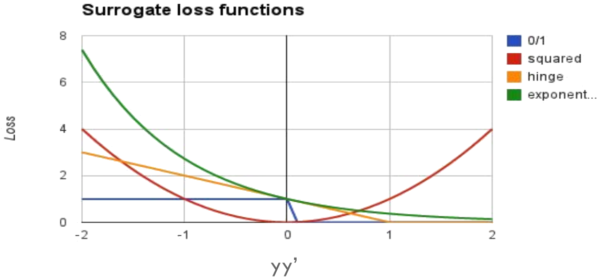


### Linear model -- Exponential loss

1. <u>Model</u>
   $$
   0=b+\sum_{i=1}^{n}w_if_i
   $$

2. <u>Objective function</u>
   $$
   \sum_{i=1}^{n}\exp(-y_i·(w·x_i+b))
   $$

   - ==Use a **convex surrogate** loss function==

3. <u>Learning algorithm</u>
   $$
   {\rm argmin}_{w,b} \sum_{i=1}^{n}\exp(-y_i·(w·x_i+b))
   $$

   - ==Find $w$ and $b$ that minimize the **surrogate loss**==


## Gradient descent

<aside>use derivatives to move in the directions that minimizes the loss</aside>

### Finding the minimum

> <u>Procedure</u>  (**Gradient descent**)
>
> 1. <u>Pick</u>: starting point $w$
>
> 2. <u>Loop until</u>: loss doesn’t decrease in any dimension
>
>    1. <u>Pick</u> a dimension
>
>    2. <u>Move</u> a small amount in that dimension towards decreasing loss
>
>    3. <u>Update</u> the parameters according to the graph
>    
>    $$
>    w_j\ -\!=\eta\,\frac{d}{dw_j}{\rm loss}(w)
>    $$

- ==**Partial derivatives** gives the slope, i.e. **direction to move** in that dimension==

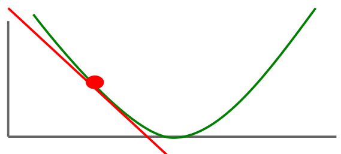      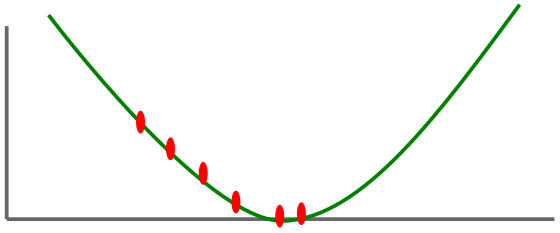       


<aside>specifies the step,<br>changes over time</aside>

### Learning rate

- ==**Learning rate $\eta\,$**: hyper-parameter that specifies the **step**==
  - ==Can **change over time**: higher at the beginning, smaller in proximity of the minimum==
  - Very important hyper-parameter

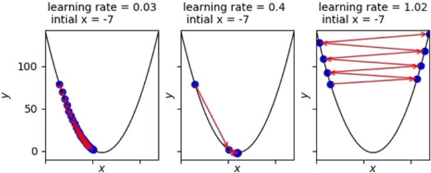


### Maths

$$
\begin{align}
\frac{d}{d w_{j}} \text {loss}(w)\ &=\frac{d}{d w_{j}} \sum_{i=1}^{n} \exp(-y_{i}(w \cdot x_{i}+b))\\
&=\sum_{i=1}^{n} \exp(-y_{i}(w \cdot x_{i}+b)) \frac{d}{d w_{j}}-y_{i}(w \cdot x_{i}+b)
\\[8px]
-\frac{d}{d w_{j}} y_{i}\left(w \cdot x_{i}+b\right)\ &=-\frac{d}{d w_{j}} y_{i}\left(\sum_{j=1}^{m} w_{j} x_{i j}+b\right)\\
&=-\frac{d}{d w_{j}} y_{i}(w_{1} x_{i 1}+w_{2} x_{i 2}+\ldots+w_{m} x_{i m}+b)\\
&=-\frac{d}{d w_{j}} y_{i} (w_{1} x_{i 1}+y_{i} w_{2} x_{i 2}+\ldots+y_{i} w_{m} x_{i m}+y_{i} b)\\
&=-y_{i} x_{i j}
\\[8px]
\frac{d}{d w_{j}} \text {loss}(w)\ &=\frac{d}{d w_{j}} \sum_{i=1}^{n} \exp (-y_{i}(w \cdot x_{i}+b))\\
&=\sum_{i=1}^{n} \exp (-y_{i}(w \cdot x_{i}+b)) \frac{d}{d w_{j}}-y_{i}(w \cdot x_{i}+b)\\
&=\sum_{i=1}^{n}-y_{i} x_{i j} \exp (-y_{i}(w \cdot x_{i}+b))
\end{align}
$$


<aside>loss(w) uses all the points;<br>SGD evaluates only one random sample</aside>

### Exponential update

- ==**Gradient Descent**==
  $$
  w_j\ -\!=\eta\,\frac{d}{dw_j}{\rm loss}(w)\quad \Rarr\quad w_j\ +\!=\eta\sum_{i=1}^{n}y_ix_{ij}\exp(-y_i(w·x_i+b))
  $$

  - ==The term **$\frac{d}{dw_j}{\rm loss}(w)$** contains the contribution of **all the points** in the training set==

- ==**Stochastic Gradient Descent**==
  $$
  w_j\ +\!=\ \eta\ \underbrace{\ y_ix_{ij} \ }_{\substack{\rm direction \\\rm to\ update}} \underbrace{\ \exp(-y_i(w·x_i+b))\ }_{\substack{\rm how\ far \\\rm from\ wrong}}
  $$

  - ==Evaluates **only one sample $x_i$ randomly selected**==
  - Parallel to the **online learning** of the **perceptron**


<aside>always update weights: w_j += y_i · x_ij · c</aside>

### Gradient Descent procedure

```pseudocode
loop until convergence or for some_number_of_iterations:
    foreach training_example = ([f1, f2, ..., fn], label):
        foreach wj: wj += fj * label * c
        b += label
```

- ==**General procedure**: holds for any arbitrary loss==

<u>Differences</u> from the perceptron

- ==**Always updates** the weights==

- ==**Constant $c$** regulates how **aggressive** is the **update**==
  $$
  c=\eta\,\exp(-y_i(w·x_i+b)) \quad⇒\quad  w_j\,+\!=y_ix_{ij}\,c
  $$
  
  - If **label** $y_i$ and **prediction** $w·x_i+b$ are
    - **Same sign**: as the predicted gets larger, $c$ gets smaller, so does the update
    - **Different sign**: the more different they are, the bigger $c$ and the update get

    ~~Because of the exponential~~


<aside><u><b>gradient</b></u>: vector of partial derivatives, used to<br>find the minimum</aside>

### Gradient

> **<u>Gradient</u>**: vector of partial derivatives wrt to all the coordinates of the weights
> $$
> \nabla\!_w L=\left[\frac{\partial L}{\partial w_{1}}\ \frac{\partial L}{\partial w_{2}} \cdots \frac{\partial L}{\partial w_{N}}\right]
> $$

- ==Each **partial derivative** measures how fast the **loss changes in one direction**==
- ==When the **gradient is zero** (~~i.e.~~ all the partials derivatives are zero) the loss is **not changing** in any direction==
- <u>Note</u>: the arrows (gradients) point out from a minimum toward a maximum

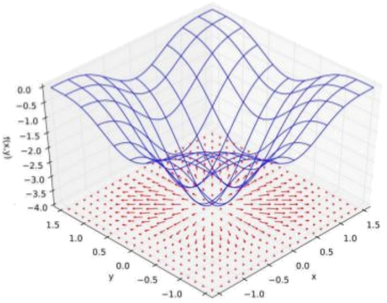


<aside>compute and follow<br>the gradient</aside>

### Algorithm


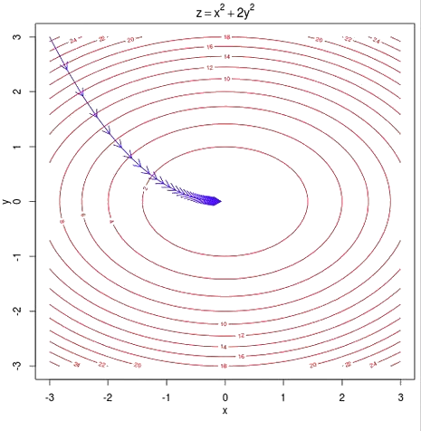       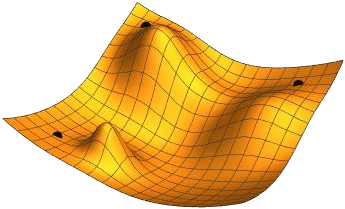


<aside>local minima</aside>

### Non convex functions

- ==**Non-convex** optimization problems probably have **local minima**==


<aside>gradient is 0,<br>but not a minimum</aside>

### Saddle points

> **<u>Saddle point</u>**: point in wich gradient is 0, even if it's not a minimum

- Some directions curve **upwards** and others curve **downwards**
  - **Stuck** if exactly on the **saddle point**
  - **Unstuck** if slightly to the **side**

- Very common in **high dimensions**


# [9.](.) Regularization

## Regularizers

<aside>different min loss for training and test</aside>

### Test set

- ==Calculated on the **training set**==
- Be careful about **overfitting**
- ==The **$\min_{w,b}\rm loss$** on the **training** set is generally **not the minimum for the test set**==


<aside>criterion to avoid overfitting</aside>

### Regularizer

> <u>Definition</u>  (**Regularizer**)
>
> Additional criterion to the loss function to avoid overfitting
> $$
> \operatorname{argmin}_{w, b} \sum_{i=1}^{n} \operatorname{loss}(y y^{\prime})+\lambda\, r(w, b)
> $$
> Bias on the model that forces the learning to prefer certain types of weights over others

- ==Keeps the **parameters** more **normal/regular** and smaller==
- ==The **hyperplane** learned with this model will perform **better** on the **test data**==


<aside>penalize complex solutions of error function</aside>

### Regularized error function

> <u>Definition</u>  (**Regularization**)
>
> Modification of the training error function with a term **$\Omega(f)$** that penalizes complex solutions
> $$
> E_{\mathrm{reg}}\left(f, {\cal D}_{n}\right)=E(f, {\cal D}_{n})+\lambda_{n} \Omega(f)
> $$
>
> - $\Omega(f)\,$:  regularization term
> - $\lambda_n\,$:  trade-off hyper parameter


<aside>constraints to prefer certain weight values</aside>

### Constraints

- ==<u>Idea</u>: push **constraints** on the values that the weights could assume in the model, in order to make it **simpler**==

  - ==**Avoid huge weights**: a small change in a feature can result in a large change in the prediction==

  - ==Prefer **weights of 0** for **features** that are **not useful**==


<aside>r(w,b) = ||w||_p</aside>

### Common regularizers
$$
\operatorname{argmin}_{w, b} \sum_{i=1}^{n} \operatorname{loss}(y y^{\prime})+\lambda \ r(w, b)
$$

- ==**L1-norm**:  $r(w,b)=\sum|w_j|$==
  - ==Sum of weights **penalize small values** more==
- ==**L2-norm**:  $r(w,b)=\sqrt{\sum |w_j|^2}$==
  - ==Squared weights **penalizes large values** more==
- ==**Lp-norm**:    $r(w,b)=\sqrt[p]{\sum |w_j|^p}=\lVert w\rVert_p$==
  - ==$p‚â•1$ leads to **convex functions**==
  - ==$p < 2$ **encourage sparser vectors** (lots of 0 weights)==
  - ==$p > 2$ **discourage large weights** more and tends to like **similar weights**==

> <u>Notation</u>  (**p-norm**)
> $$
> \lVert x\rVert_p\ :=\ \sqrt[p]{\textstyle \sum |x|^p}
> $$


#### L1/L2-norm


- ==**L1**: if the meet-point is a corner, **one coordinate is $0$**==
- ==**L2**: the coordinates are **close to $0$**==


#### Lp-norm


<aside><div>- L1: sparse solutions, lots of 0<br>- L2: solved directly, no GD<br>- Lp: less popular</div></aside>

### Summary

- ==**L1-norm**==
  - ==Popular because it tends to result in **sparse solutions**==
    - ==~~i.e.~~ **Lots of zero** weights==
  - ==**Not differentiable**==
    - ==**Only** works for **gradient descent** solvers==
- ==**L2-norm**==
  - ==Popular because for some loss functions, it can be **solved directly**==
    - ==**No gradient descent** required==
    - ==Often **iterative solvers** still==
- ==**Lp-norm**==
  - ==**Less popular** since they do **not** tend to **shrink the weights** enough==


### Methods

- (Ordinary) **Least squares**: squared loss (no regularization)
- **Ridge regression**: squared loss + L2 regularization
- **Lasso regression**: squared loss + L1 regularization
- **Elastic regression**: squared loss + L1 and L2 regularization
- **Logistic regression**: logistic loss (no regularization)


## Model-based ML with regularization

<aside>argmin_wb Σ loss(yy') +<br>+ λ r(w,b)</aside>

### Model definition

1. <u>Model</u>
   $$
   0=b+\sum_{i=1}^{n}w_if_i
   $$

2. <u>Objective function</u>
   $$
   \sum {\rm loss}(yy')+\lambda\, r(w,b)
   $$

3. <u>Learning algorithm</u>
   $$
   {\rm argmin}_{w,b} \sum {\rm loss}(yy')+\lambda\, r(w,b)
   $$


<aside>penalize wrong predictions and<br>large weights</aside>

### Exponential loss

1. <u>Model</u>
   $$
   0=b+\sum_{i=1}^{n}w_if_i
   $$

2. <u>Objective function</u>
   $$
   \sum_{i=1}^{n}\exp(-y_i·(w·x_i+b))+\frac \lambda 2\lVert w\rVert_2
   $$

3. <u>Learning algorithm</u>
   $$
   {\rm argmin}_{w,b} \sum_{i=1}^{n}\exp(-y_i·(w·x_i+b))+\frac \lambda 2\lVert w\rVert_2
   $$

   - ==**Loss function**: penalizes examples where the prediction is different than the label==
   - ==**Regularizer**: penalizes large weights==
   - ==<u>Keypoint</u>: function is **convex**, allowing to use GD==


### Convexity

---

> <u>Note</u>: the sum of two convex functions is still a convex function

- ==If **loss + regularizer is convex** then it's possible to use **gradient descent**==
- ==Loss + regularizer is convex if **both** are **convex**==
- ==**p-norm** is always **convex** for $p‚â•1$==
- All the **combinations** of losses and regularizers are possible
  - The **same algorithm** can be applied independently of these functions


<aside>add regularizer term<br>in the update</aside>

### Gradient descent with regularization

- ==Same as gradient descent without regularization==
- ==Only the **update** changes==

$$
w_j\ -\!=\eta\,\frac{d}{dw_j}({\rm loss}(w)+\lambda\,r(w,b))
$$


### Maths -- L2-norm

$$
\begin{align}
\frac{d}{dw_j}{\rm objective}(w,b)&=\frac{d}{dw_j}({\rm loss}(w)+\lambda\,r(w,b))\\&=
\frac{d}{dw_j}\sum_{i=1}^{n}\exp(-y_i·(w·x_i+b))+\frac \lambda 2\lVert w\rVert^2\\&\dots\\&=-\sum_{i=1}^{n}y_ix_{ij}\exp(-y_i·(w·x_i+b))+\lambda w_j
\end{align}
$$


<aside>regularization term ηλw_j moves w_j towards 0</aside>

### L2 update

$$
w_j\ -\!=\eta\,\frac{d}{dw_j}({\rm loss}(w)+\lambda\,r(w,b))
$$

- ==<u>Keypoint</u>: generates **smaller values of the weights** that are not 0==

- <u>Gradient descent</u>
  $$
  w_j\ +\!=\eta\sum_{i=1}^{n}y_ix_{ij}\exp(-y_i·(w·x_i+b))-\eta\lambda w_j
  $$

- <u>Stochastic gradient descent</u>
  $$
  w_j\ +\!= \eta\  \underbrace{\ y_ix_{ij}\ }_{\substack{\rm direction \\\rm to\ update}}\ \ \underbrace{\ \exp(-y_i(w·x_i+b))\ }_{\substack{\rm how\ far \\\rm from\ wrong}}\ -\!\!\!\underbrace{\ \eta\lambda w_j\ }_{\rm regularization}
  $$

  - ==$\eta$ and $\lambda$ are **hyper-parameters**==

  - ==High values of $\eta$ influence both terms==

  - ==**High values of $\lambda$** influence only the **regularization term** and **reduce the weight** in a significant way==
    $$
    \begin{rcases*}
    w_j>0\quad‚áí\quad{\rm reduces}\ w_j\\
    w_j<0\quad‚áí\quad{\rm increases}\ w_j\
    \end{rcases*}\ \ {\rm moves}\ w_j\ {\rm towards}\ 0
    $$


<aside>regularization term ηλ·sign(w_j) moves w_j towards 0 regardless of magnitude</aside>

### L1 update

$$
{\rm argmin}_{w,b} \sum_{i=1}^{n}\exp(-y_i·(w·x_i+b))+\lambda\lVert w\rVert\\
\frac{d}{dw_j}\sum_{i=1}^{n}\exp(-y_i·(w·x_i+b))+\lambda\lVert w\rVert=-\sum_{i=1}^{n}y_ix_{ij}\exp(-y_i·(w·x_i+b))+\lambda\, {\rm sign}(w_j)\\[8px]
w_j\ +\!=\eta\, y_ix_{ij}\exp(-y_i·(w·x_i+b))-\eta\,\lambda\, {\rm sign}(w_j)\\[8px]
\begin{rcases}
w_j>0\quad‚áí\quad{\rm reduces}\ w_j\text{ by a constant}\\
w_j<0\quad‚áí\quad{\rm increases}\ w_j\text{ by a constant}\
\end{rcases}\ \ \begin{align}&
{\rm moves}\ w_j\ {\rm towards}\ 0\\[-2px]& \text{regardless of magnitude}
\end{align}
$$


<aside>w_j += η(lossCorrection -<br>- λ c w_j^(p-1))</aside>

### p-norm update

- ==**L1**:   $w_j\ +\!=\eta\,({\rm lossCorrection}-\lambda\, {\rm sign}(w_j))$==
- ==**L2**:   $w_j\ +\!=\eta\,({\rm lossCorrection}-\lambda w_j)$==
- ==**Lp**:   $w_j\ +\!=\eta\,({\rm lossCorrection}-\lambda cw_j^{p-1})$==


# [10.](.) Support Vector Machines

## Margin classification

<aside>find hyperplane that maximizes the margin</aside>

### Which hyperplane

- Two main **variations** in linear classifiers

  - <u>Which</u> **hyperplane** to choose when data is linearly separable

  - <u>How to</u> handle data that is **not linearly separable**
  - Need to know a priori the **number of iterations**

- ==<u>Task</u>: find the hyperplane that **maximizes the margin**==

  - ==In order to achieve **generalization** and have the best results on the test data==


### Perceptron

- **Separable**
  - Finds **some** hyperplane that separates the data
- **Non-separable**
  - **Continue to adjust** as it iterates through the examples
  - Final hyperplane depends on the **examples seen recently**


### Large margin classifiers

> **<u>Margin</u>** (of a classifier): distance to the closest points of either classes

- **Large margin classifiers** attempt to **maximize** it

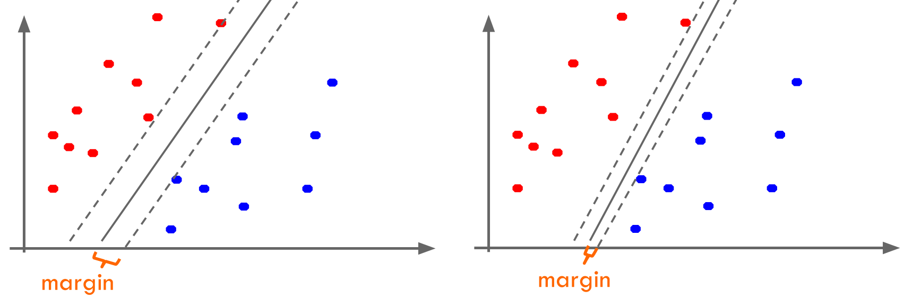


<aside><u><b>support vecrtors</b></u>: set of closest points to hyperplane, at least n+1</aside>

### Support vectors

> **<u>Support vectors</u>**: set of closest points to the hyperplane

- Exist for **any** separating **hyperplane**
- ==For SVMs in **$n$ dimensions**, there will be **at least $n+1$** support vectors==
- **Maximizing** the margin implies that ==**only support vectors matter** in the final decision model==
  - ==**Decision function** take into account only these data points==
  - ==**Efficient** at inference time==


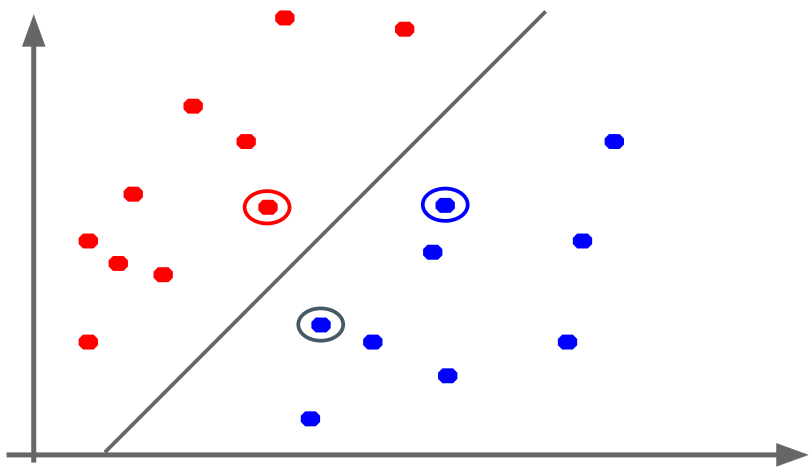


<aside>margin = 1 / ||w||</aside>

### Measuring the margin

> **<u>Margin</u>**: distance to the support vectors on either side of the hyperplane that corresponds to $\cfrac 1 {\Vert w\Vert}$


<aside>minimize ||w|| s.t. points are correctly classified and outside the margin</aside>

### Maximizing the margin

$$
{\rm max}_{w,b}\ {\rm margin}(w,b)\ ≡\ {\rm max}_{w,b}\,\frac1{\Vert w\Vert}\ ≡\ {\rm min}_{w,b}\,\Vert w\Vert \\[4px]
\text{subject to: }\ \ y_i(w·x_i+b)≥1\ \ \ ∀i
$$

- ***Constrained optimization problem***
- ==<u>Idea</u>: select the **hyperplane**==
  - ==with the **largest margin**==
  - ==where the **points** are  $∀\, i$==
    - ==**correctly classified**  $y_i(w·x_i+b)≥0$==
    - ==**outside the margin**  $y_i(w·x_i+b)≥1$==
- ==<u>Objective</u>: maximize the margin, equivalent to **minimize the norm of the weights**==
  - ==Subject to **separating constraints**==
    - In order to make sure that the data is separable
  - ==The minimization criterion wants **$w$** to be **as small as possible**==


<aside><u>exam</u>: primal SVM problem</aside>

### Primal SVM problem

$$
{\rm min}_{w,b}\,\Vert w\Vert_2 \\[4px]
{\rm s.t.}\ \ \ y_i(w·x_i+b)≥1\ \ \ ∀i
$$

- ==***Quadratic constrained optimization problem***==
  - Maximize/minimize a quadratic function subject to a set of linear constraints
- ==Application of **L2-norm** on the inverse of the margin $\Vert w\Vert$==


## Soft margin classification

<aside>penalize distance from correct for each example</aside>

### Slack variables

$$
{\rm min}_{w,b}\,\Vert w\Vert_2+C\textstyle\sum_i\varsigma_i \\[4px]
{\rm s.t.}\ \ \ y_i(w·x_i+b)\, ≥\, 1-\varsigma_i\ ∧\ ς_i≥0\ \ \ ∀i
$$

- ***Quadratic constrained optimization problem***
- ==**Penalization** by the **distance from correct**==
- ==**One slack variable $ς_i$ for each example $x_i$**==
  - ==**$ς_i=0$**  means that $x_i$ is **correctly classified**==

- ==Constraints allow to **make mistakes**==


<aside>trade off between margin maximization and fitting the data</aside>

### Parameter $C$‚Äã

- ==**Controls overfitting**==
- ==**Trades-off** between==
  - ==**Margin maximization**==
  - ==**Penalization** / **Fitting** the training data==

- ==**Regularization** parameter==
  - ==**Small $C$**: soft constraints  `‚Üí`  large margin==
  - ==**Large $C$**: strong constraints  `‚Üí`  narrow margin==
  - ==**$C = ‚àû$**: enforces all constraints  `‚Üí`  hard margin==

---

> <u>In practice</u>  (**SVM tuning**)
>
> ==In order to tune the parameter $C$==
>
> 1. ==Set up a procedure that learn models with different values of $C$==
> 2. ==Check the performance of the validation set with the solver==

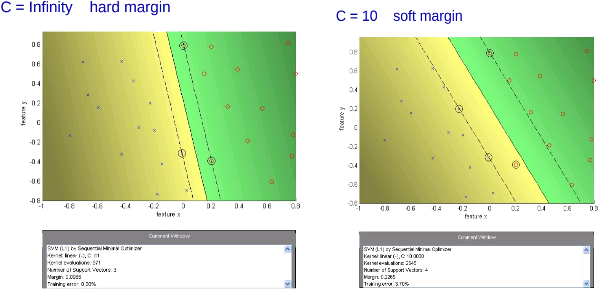


<aside>ςi = max(0, 1-yi(w·xi+b))<br>distance of xi from margin</aside>

### Slack values

$$
y_i(w·x_i+b)\, ≥\, 1-\varsigma_i\quad ∧\quad ς_i≥0\qquad ∀i
$$

|                                 |                    Outside/On the margin                     |               Within the margin                |      |
| :-----------------------------: | :----------------------------------------------------------: | :--------------------------------------------: | ---- |
|  **Correctly<br />classified**  |           $ς_i=0$<br />$y_i(w·x_i+b) ≥ 1$  already           | $ς_i=1-y_i(w·x_i+b)$<br />distance from margin |      |
| **Incorrectly<br />classified** | $ς_i=1-y_i(w·x_i+b)$<br />dist from hyperplane ($-y_i(w·x_i+b)$)<br />+ dist from margin ($1$) |         Same as outside/on the margin          |      |

$$
ς_i=\begin{cases}
0 &\ y_i(w·x_i+b)≥1\\[2px]
1-y_i(w·x_i+b) &\ \rm otherwise
\end{cases}\\[8px]
ς_i=\max(0,\,1-y_i(w·x_i+b))=\max(0,\,1-yy')={\rm loss}_{\rm hinge}(y,y')\\[-10px] \
$$

    


<aside>unconstrained problem</aside>

### Removing constraints

$$
{\rm min}_{w,b}\,\Vert w\Vert_2+C\textstyle\sum_i\varsigma_i \\[4px]
{\rm s.t.}\ \ \ y_i(w·x_i+b)\, ≥\, 1-\varsigma_i\ ∧\ ς_i≥0\ \ \ ∀i\\[4px] \Darr\\[4px] {\rm min}_{w,b}\,\Vert w\Vert_2+C\textstyle\sum_i\max(0,1-y_i(w·x_i+b))=\\[4px]={\rm min}_{w,b}\,\Vert w\Vert_2+C\textstyle\sum_i{\rm loss}_{\rm hinge}(y_i,y_i')
$$

- ==***Quadratic unconstrained problem***==


### Recap -- Loss functions

- ~~**0/1 loss**: $\qquad\ l(y,y')=1[yy'≤0]$~~
- **Hinge**: $\qquad\quad\, l(y,y')=\max(0,1-yy)$

- ~~**Exponential**: $\ \ l(y,y')=\exp(-yy')$~~
- ~~**Square loss**:   $\,l(y,y')=(y-y')^2$~~


## Non linearly separable data

### Classes of optimization problems

- **Linear programming** (**LP**): linear problem, linear constraints
  $$
  {\rm min}_x\ c^Tx \\[4px]
  {\rm s.t.}\ \ \ Ax=b,\ x‚â•0
  $$

- **Quadratic programming** (**QP**): quadratic objective and linear constraints, convex if $Q$ is positive semidefinite
  
  - Well-known class of mathematical programming problems for which several **algorithms** exist
  
  
  $$
  {\rm min}_x\ c^Tx+\frac12x^TQx \\[4px]
  {\rm s.t.}\ \ \ Ax=b,\ Cx‚â•d
  $$
  
- **Nonlinear programming problem** (**NLP**): in general non-convex
  $$
  {\rm min}_x\ f(x) \\[4px]
  {\rm s.t.}\ \ \ g(x)=0,\ h(x)‚â•0
  $$


<aside>find min_w by solving an associated dual problem max_α</aside>

### Dual problem

- ==<u>Idea</u>: construct a **dual problem** where a **Lagrange multiplier $α_i$** is associated with every inequality constraint in the primal problem==

$$
{\rm max}_α\sum_i α_i-\frac12\sum_i\sum_jα_iα_jy_iy_jx^T_ix_j\\[4px]
{\rm s.t.}\quad \sum_iα_iy_i=0\ \and\ α_i≥0\quad ∀i
$$

> **<u>Duality</u>**: instead of solving the original problem for $w$ (${\rm min}_{w}$), solve the problem for a new variable $α$ (${\rm max}_α$) and link the solution $α$ of the dual problem to the solution $w$ of the primal problem

- ==$w$ is found **indirectly** by solving the **associated dual problem**==


#### Soft margin

- ==In the **non separable** case only the **constraints** are different==

$$
{\rm max}_α\sum_i α_i-\frac12\sum_i\sum_jα_iα_jy_iy_jx^T_ix_j\\[4px]
{\rm s.t.}\quad \sum_iα_iy_i=0\ \and\ 0≤α_i≤C\quad ∀i
$$


<aside>f(x) = sum αi yi xi^T x + b<br>need only SVs with αi != 0<br>solution relies only on dot product xi^T x</aside>

### Solution

- ==**Solution to the primal** (given a solution $α_1\dotsα_n$ to the dual problem)==
  $$
  w=\sum_iα_iy_ix_i\qquad\
  b=y_j-\sum_iα_iy_ix_i^Tx_j
  $$

- ==**Classifying function**==
  $$
  f(x)=w^Tx+b=\sum_iα_iy_ix_i^Tx+b
  $$

- <u>In practice</u>

  - ==Only the **decision function** is needed==
  - ==**Doesn’t need $w$ explicitly**==
  - ==**$f$ depends only on $α$**==

- <u>Keypoints</u>

  - ==Each non-zero $α_i$ indicates that the corresponding $x_i$ is a **support vector**==
    - ==Each point that is **not a support vector** can be **ignored** because it has $α_i=0$==
      - Does not contribute to the summation
  - ==The solution relies on an **inner product** between the **test point $x$** and the **support vectors $x_i$**==
    - ==Using only support vectors is extremely **efficient at inference time**==
    - ==Solving the optimization problem involves computing **inner products between all training points $x_i^Tx$**==
    - ==<u>In practice</u>==
      - ==No need for the training data, but only for the **dot product**==
      - ==Fill a **matrix** with the **products** between all the possible pairs==


<aside>classifier is a hyperplane defined by SVs;<br>training points appear only in inner products</aside>

### Summary -- Linear SVM

- **Classifier** is a **separating hyperplane**
- Most important training points are **support vectors**, they define the **hyperplane**
- ==**Quadratic optimization algorithms** can identify which **training points are support vectors** with non-zero $α_i$==
- <u>Keypoint</u>
  - ==Both in the dual problem and in the solution, **training points** appear only inside **inner products $x_i^Tx_j$**==
  - ==Allows mapping to a **higher dimensional space**==


<aside>Φ maps data to an higher dimensional space where they are linearly separable</aside>

### Non linear SVM

- Datasets that are **linearly separable** with some noise work out great

  

- ==If the dataset is too hard, **map data to a higher-dimensional space**==

  re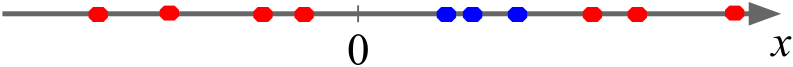

  

- ==<u>General idea</u>: the original feature space can always be **mapped to some higher-dimensional feature space** where the training set is **separable**==

  


<aside>function equivalent to an inner product in a higher dimensional space</aside>

### Kernel trick

- ==The linear classifier relies on **inner product** between vectors==
  $$
  K(x_i,x_j)=x_i^Tx_j
  $$

- ==If every datapoint is **mapped into high-dimensional space** via some **transformation $\Phi: x → φ(x)$**, the inner product becomes==
  $$
  K(x_i,x_j)'= φ(x_i)^Tφ(x_j)
  $$

> **<u>Kernel function</u>**: function that is equivalent to an inner product in some (higher dimensional) feature space

- ==Implicitly maps data to a higher dimensional space with **no need to compute each $φ(x)$** explicitly==

---

> <u>Example</u>  (**Polinomial kernel**)
>
> - <u>Data</u>
>   - 2-dimensional vectors $x=[x_1,\ x_2]$
>   - Let  $K(x_i,x_j)=(1 + x_i^Tx_j)^2$
>     - Polinomial kernel
>- <u>Task</u>: show that  $K(x_i,x_j)= φ(x_i)^Tφ(x_j)$
> 
> $$
> K(x_i,x_j)=(1 + x_i^Tx_j)^2= 1+ x_{i1}^2x_{j1}^2 + 2 x_{i1}x_{j1} x_{i2}x_{j2}+ x_{i2}^2x_{j2}^2 + 2x_{i1}x_{j1} + 2x_{i2}x_{j2}=\\
> = [1 x_{i1}^2 ‚àö2 x_{i1}x_{i2} x_{i2}^2 ‚àö2x_{i1} ‚àö2x_{i2}]^T [1 x_{j1}^2 ‚àö2 x_{j1}x_{j2} x_{j2}^2 ‚àö2x_{j1} ‚àö2x_{j2}] =\\
> = φ(x_i)^Tφ(x_j),\ \ \ {\rm where}\ \ φ(x) = [1,\ x_1^2,\ √2 x_1x_2,\ x_2^2,\ √2x_1,\ √2x_2]
> $$


### Kernels

For some functions $K(x_i,x_j)$ checking that $K(x_i,x_j)= φ(x_i)^Tφ(x_j)$ can be cumbersome

> <u>Theorem</u>  (**Mercer’s theorem**)
>
> - Every positive semidefinite symmetric function is a kernel
>
> - A positive semidefinite symmetric functions correspond to a positive semidefinite symmetric Gram matrix
>
>   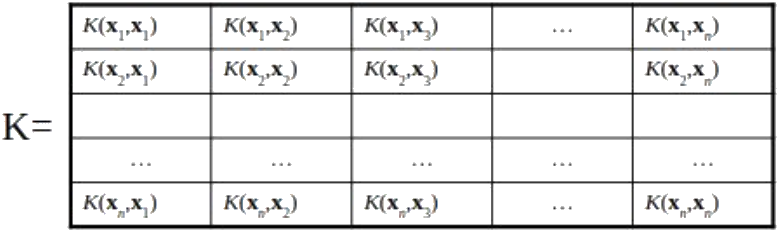
>

> **<u>Positive semidefinite symmetric matrix</u>**: if and only if all of its eigenvalues are non-negative

<u>Types</u> of kernels

- ==**Linear**:== 										 			 $K(x_i,x_j)= x_i^Tx_j$
- ==**Polynomial** of power $p$:== 		  		 $K(x_i,x_j)= (1+ x_i^Tx_j)^p$
- **Gaussian** (radial-basis function):   $\,K(x_i,x_j) =e^{-\frac{\Vert x_i-x_j\Vert^2}{2σ^2}}$
  - Mapping $\,\Phi: x → φ(x)$, where $φ(x)$ is **infinite-dimensional**

---

> <u>In practice</u>  (**Choose the kernel**)
>
> 1. Try the linear, but generally avoid this one
> 2. Try the polynomial with different values of the hyper parameters (~~e.g.~~ $p$ and $C$)
> 3. Try the gaussian (preferable with vectors)
> 4. Compute the (huge) matrix $K$ for all possible pairs of data points $x_i,x_j$


<aside>any kind of data without losing information</aside>

### Non linear SVM problem with kernel trick

- <u>Dual problem formulation</u>
  $$
  {\rm max}_α\sum_i α_i-\frac12\sum_i\sum_jα_iα_jy_iy_jK(x_i,x_j)\\[4px]
  {\rm s.t.}\ \ \ \sum_iα_iy_i=0,\ α_i≥0,\ ∀i
  $$

- <u>Solution</u>
  $$
  f(x)=\sum_iα_iy_iK(x_i,x)+b
  $$

- <u>Optimization techniques</u> for finding $α_i$’s remain the **same**

- ==<u>Advantages</u>: could be used for **any kind of data**, also structured such as graphs, **without losing information**==


# [11.](.) Ranking

## Multiclass VS Multilabel

### Basics

- ==<u>Goal</u>: assign a discrete label to examples, with **$K > 2$ classes**==
- ==<u>How</u>: given a binary classifier, use it to solve a multiclass classification problem==

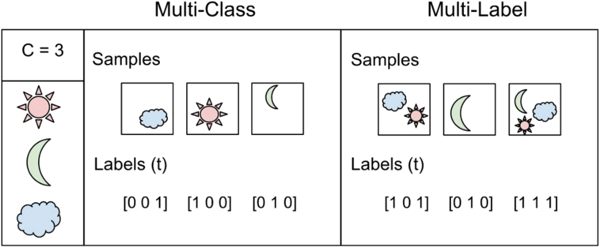


<aside><div>- multiclass: # x.labels = 1<br>- multilabel: # x.labels ‚àà [0, inf)</div></aside>

### Multilabel VS Multiclass classification

> **<u>Multiclass</u>**: each example has one label and exactly one label

> **<u>Multilabel</u>**: each example has zero or more labels


<aside>multiple binary classification problems</aside>

### Naive approach

> **<u>Joint learning</u>**: decompose the task as many independent binary classification problems


## Ranking

### Suggest a simpler word

‚Äã            	   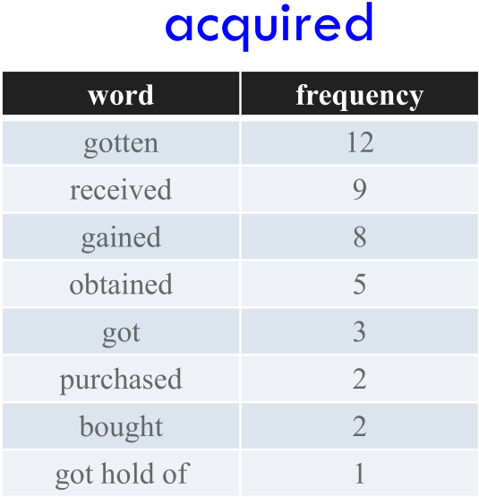

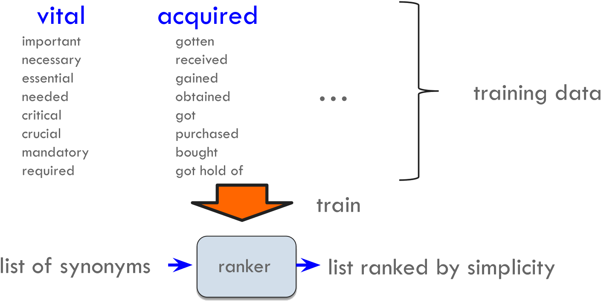


### Ranking problems in general

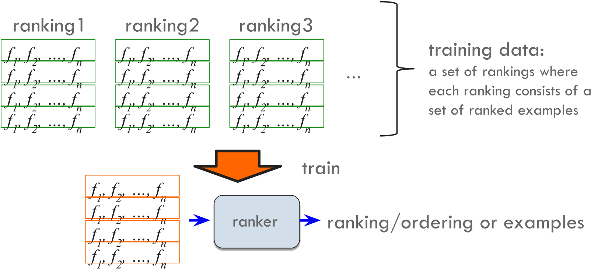


<aside><div>binary classifier:<br>- predicts preferences<br>- turns them into ranking</div></aside>

### Black box approach

- ==Use a **generic binary classifier** to solve ranking problem==
- <u>Objective</u>
  - ==Train a classifier that predicts preferences==
  - ==Turn the predicted preferences into a ranking==


<aside>for each pair of examples, predict if first is better than second;<br>combine features</aside>

### Predict better or worse

- ==<u>Idea</u>: train a classifier to decide if the first input is **better than** second==
  - ==Consider **all possible pairings** of the examples in a ranking==
  
  - ==Create **new examples** by **combining features** of each pair==
  
  - ==Label the new example as **positive** if the **first** example is **higher ranked**, negative otherwise==
  
- ==<u>Problem</u>: the binary classifier only takes **one example as input**==

- ==<u>Solution</u>: use **features** that compare the two examples==


<aside>difference,<br>grater/lower than</aside>

### Combined feature vector

- <u>Approaches</u>: depending on **domain** and **classifier**

  - ==**Difference**==

  $$
  f'_i=a_i-b_i
  $$

  - ==**Greater/Lower than**==
    $$
    f'_i=\begin{cases}
    1&a_i>b_i\\
    0&\rm otherwise
    \end{cases}
    $$


### Training


### Testing


<aside>label score for pairs ij</aside>

### Algorithm to recover the ranking

```pseudocode
foreach BinaryExample e_ij:
    label[i] += F(e_ij)
    label[j] -= F(e_ij)
```

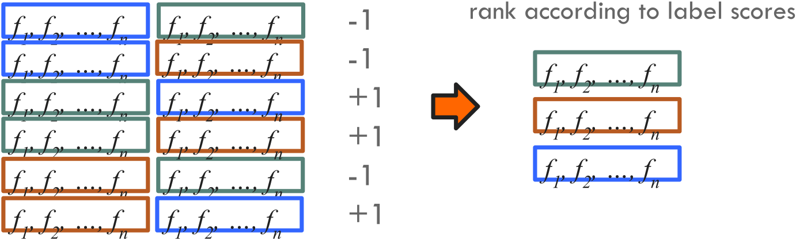


<aside>predict if xi is preferred<br>to xj wrt query q</aside>

### Preference function

- ==<u>Given</u>: **$N$ queries** and **$M$ samples** in the training set==
  - <u>So far</u>: single query

- ==<u>Goal</u>: train a binary classifier to predict a **preference function**==
- <u>Objective</u>
  - <u>Given</u>: a query $q$ and two samples $x_i$ and $x_j$
  - ==Classifier should predict whether $x_i$ should be preferred to $x_j$ w.r.t. query $q$==


<aside><div>    - <u>train</u>: forall q and (i,j), check
       if i is preferred to j on q
    - <u>test</u>: add/sub score f(x_ij)
       to score_i and score_j;
       return argsort(score)
</div></aside>
### Algorithm


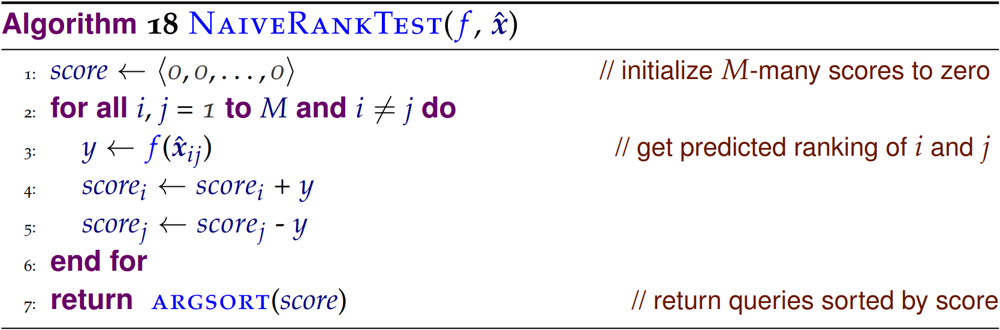


## Bipartite ranking

<aside>predict a binary response</aside>

### Bipartite ranking problem

> **<u>Bipartite ranking problem</u>**: try to predict a binary response

==<u>Example</u>: is this document relevant or not?==

- ==<u>Goal</u>: ensure that all the **relevant** documents are **ahead** of all the irrelevant documents==

- ==**No notion** that one relevant document is **more relevant** than another==


<aside>weight based on distance</aside>

### Weighted binary classification

- ==Weight should reflect the **distance** in ranking==
  - In general we can weight with ==**any consistent distance metric**==


<aside>confidence represents similarity between examples, used for ranking</aside>

### Testing

- ==If the classifier outputs a **confidence**, then we have learned a **distance measure** between examples==
- ==During testing we want to **rank** the examples based on the **learned distance measure**==
- ==**Sort the examples** and use the output of the **binary classifier** as the **similarity** between examples==


## Ranking improved

<aside>preference function<br>for sorting</aside>

### Preference function

1. ==If the preferences are more nuanced[^fine distinct, sfumate] than “relevant or not”, **incorporate these preferences at training time**==
2. ==Give a **higher weight** to binary problems that are **very different in terms of preference** than others==
3. ==Use the **preference function** as the **sorting function**==
   - ==Rather than producing a list of scores and then calling a sorting algorithm==


<aside>learn a function to predict position of new examples</aside>

### Ranking function

4. ==Define a **ranking** as a **function $σ$ that maps** the objects to the desired **position** in the list $1, 2, . . ., M$==
   - ==If **$σ_u < σ_v$** then **$u$ is preferred to $v$**==
   - ==<u>Given</u>: data with observed rankings $σ$==
   - ==<u>Goal</u>: **learn to predict rankings for new objects $σ^*$**==
5. ==Define $\Sigma_M$ as the **set of all ranking functions** over $M$ objects==


<aside>define cost function to weight mistakes</aside>

### Cost function

6. ==<u>Idea</u>: model the fact that **making a mistake** on some pairs is **worse than** making a mistake on others==

7. ==Define a **cost function $ω$**, where $ω(i, j)$ is the cost for accidentally putting something in **position $j$** when it **should** have gone in **position $i$**==

8. <u>Properties</u>: **valid** cost function $ω$

   - **Symmetric**  $\qquad\quad\,\ ω(i, j) = ω(j, i)$
   - **Monotonic**  $\qquad\ \quad\ i < j < k\ ∨\ i > j > k\ \ ⇒\ \ ω(i, j) ≤ ω(i, k)$
   - **Triangle inequality**   $ω(i, j) + ω(j, k) ≥ ω(i, k)$

9. Depending on the problem, the cost function may be defined in different ways

   - ==If **$ω(i, j) = 1$** whenever $i ≠ j$, it simply counts the number of **pairwise misordered items**==

   - ==We can impose only the **top $K$ predictions** correct==
     $$
     w(i,j)=\begin{cases}
     1&\min(i,j)≤K\ ∧\ i≠j\\
     0&\rm otherwise
     \end{cases}
     $$

     - <u>Application</u>: the web search algorithm may only display $K = 10$ results to a user
     


<aside>minimize error calculated as sum of ω(σu, σv) s.t. ranking prediction is different than truth</aside>

### $\boldsymbol ω$-ranking

> <u>Task</u>  (**$ω$-ranking**)
>
> - <u>Given</u>
>
>   - Input space $\cal X$
>
>   - Unknown distribution $\cal D$ over ${\cal X}√ó\Sigma_M$
>   - Training set $D$ sampled from $\cal D$
>
> - <u>Compute</u>
>
>   - Function $f:{\cal X}‚Üí\Sigma_M$ minimizing
>     $$
>     \mathbb{E}_{(x, \sigma) \sim \mathcal{D}}\left[\sum_{u \neq v}\,1[\sigma_{u}<\sigma_{v}]\ 1[\hat{\sigma}_{v}<\hat{\sigma}_{u}]\ \omega(\sigma_{u}, \sigma_{v})\right]
>     $$
>
>     - Where $\hat{\sigma}=f(x)$
>
> - <u>Loss</u>
>
>   - If the true ranking $σ$ prefers $u$ to $v$, but the predicted ranking $\hat{\sigma}$ prefers $v$ to $u$, then the cost is $ω(σ_u, σ_v)$


<aside>generate a training set made of triplets [x_uv, y=sign(σv-σu), w=ω(σu,σv)]</aside>

### Training

10. ==Generate a **training set** made of **triplets $\big(x_uv,\ y={\rm sign}(σ_v-σ_u),\ w=ω(σ_u,σ_v)\big)$**==
    - ==**Weight** each training example by **how bad** it would be to confuse it==
    - ==Take account of the **errors**==


<aside>quicksort with preference function as comparison</aside>

### Testing

11. ==Run the **quicksort** algorithm, using the **learned preference function** as a **(probabilistic) comparison function**==
    - Instead of predicting scores and then sorting the list


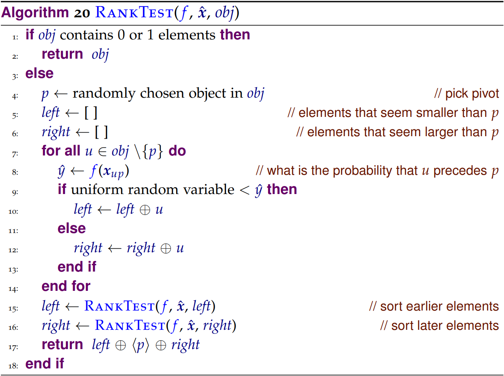


## Summary

### Deterministic VS Probabilistic

- ==A **linear classifier** can be used for the simplest implementation of a **ranking model**==
  - ==This may **suffice for bipartite** ranking problem==
  - ==**Deterministic** approach==

- ==A more **sophisticated** ranking model can be developed by==
  - ==introducing a **cost function**==
  - ==devising[^conceive, draw up] a **testing** model based on a **probabilistic** version of **quicksort**==


# [12.](.) Decision Trees

## Introduction

### Example -- Tennis match

#### Binary classification problem

- <u>Columns</u>: **features**
- <u>Rows</u>: labelled **instances**
- <u>Class labels</u>: a tennis match was **played**

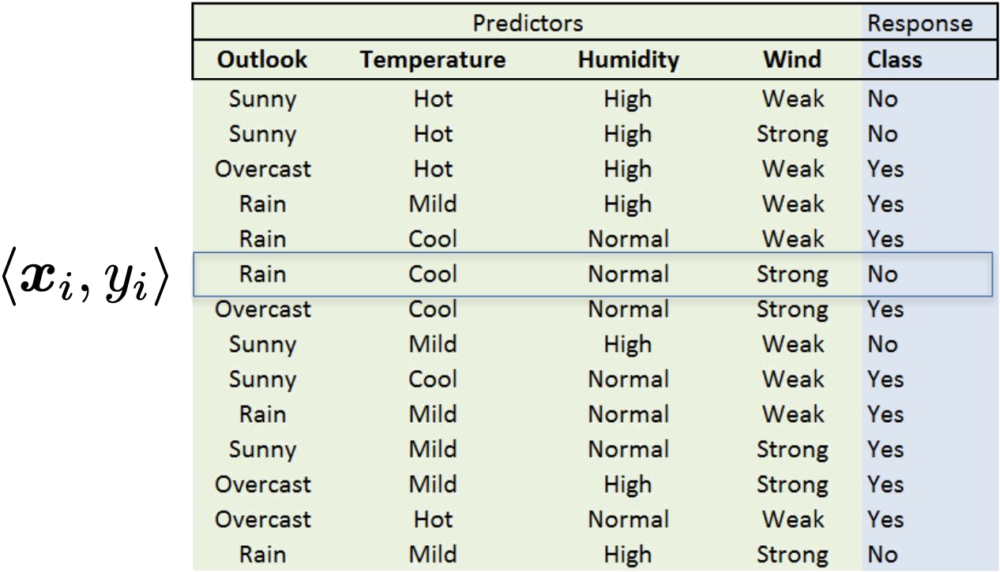


#### Decision tree

- ==<u>Internal nodes</u>:  **test one feature/attribute**==
- ==<u>Branches</u>:           **select one value** for that attribute==
- ==<u>Leaf nodes</u>:        performs a **prediction**==

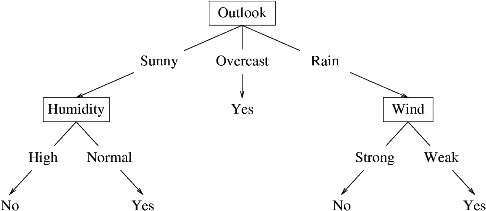


## Decision trees

<aside>routing and prediction functions</aside>

### Definition

> <u>Definition</u>  (**Decision tree**)
>
> Tree-structured prediction model composed of
>
> - Root node
> - Non-terminal nodes
>   - 2+ children
>   - Implement **routing functions**
> - Terminal nodes
>   - No children (leaves)
>   - Implement **prediction functions**


<aside>Node(Φ, tL, tR) routes x,<br>Leaf(h) predicts h(x)</aside>

### Operation

<u>Idea</u>

1. ==Take an **input $x‚àà\cal X$**==
2. ==**Route** it through its nodes until it reaches a leaf node==
3. ==A **prediction** takes place in the leaf==

<u>Theory</u>

- <u>Assumption</u>: **binary trees**
- ==**Non-terminal ${\tt Node}(\phi, t_L, t_R)$** holds==
  - ==**Routing function $\phi‚àà\set{L,R}$**==
    - Move to the **left or right** child depending on the value of **$\phi(x)‚àà\set{L,R}$**
  - ==**Left child $t_L$**==
  - ==**Right child $t_R$**==
- ==**Terminal ${\tt Leaf}(h)$** holds: **prediction function $h‚àà{\cal F}_{\rm task}$**==
  - ==Typically a **constant** (~~i.e.~~ the label)==
  - Depending on the **task** we want to solve it can be
    - $h‚àà\cal Y^X$      (~~e.g.~~ classification or regression)
    - $h‚àà\Delta({\cal X})$  (~~e.g.~~ density estimation)
    - Other
- ==Once $x$ reaches the **leaf**, the **final prediction** is given by **$h(x)$**==

												 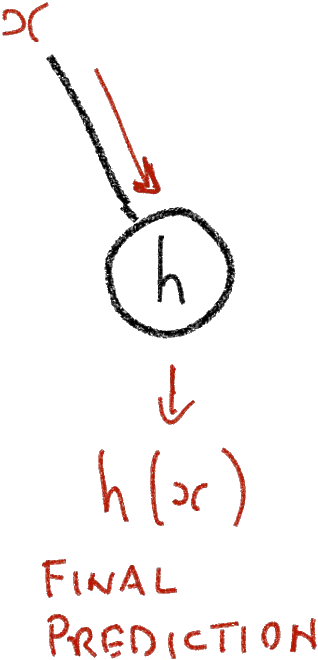


### Notation

```cmake
Node(
    φ1,
    Node(
        φ2,
        Leaf(h1),
        Leaf(h2)
    ),
    Leaf(h3)
)
```

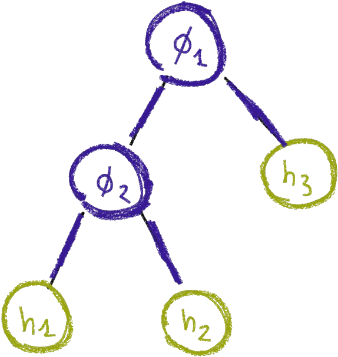


<aside>recursive function<br>f_t = { h(x) | f_{t_{Φ(x)}}(x) }</aside>

### Inference

$$
f_{t}(x)= \begin{cases}h(x) & t={\tt Leaf}(h)
\\ f_{t_{\phi(x)}}(x) & t={\tt Node}\left(\phi, t_{L}, t_{R}\right)\end{cases}
$$

- ==$f_t\,$:  **recursive function returning the prediction** for input $x‚àà\cal X$ according to the decision tree $t$==

---

> 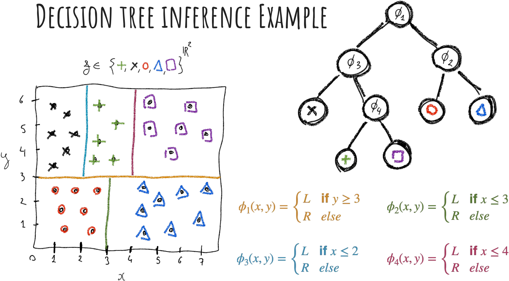 


<aside>hyper-rectangular<br>regions with one label</aside>

### Decision boundaries

- ==DTs divide the feature space into **axis parallel hyper-rectangles**==
- ==Each rectangular **region** is labelled with **one label**==

---

> <u>Example</u>  (**Binary classification problem**)
>
> 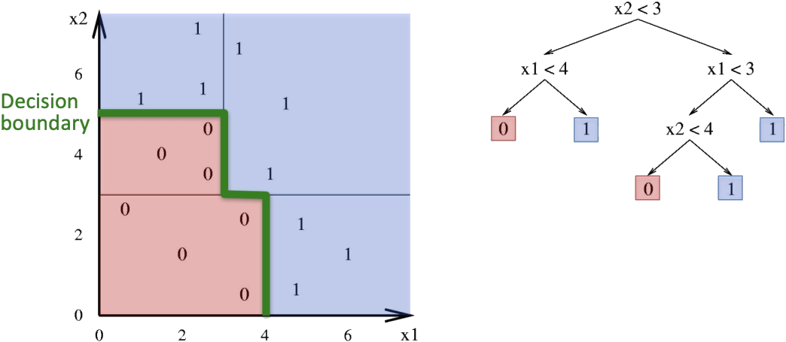


<aside>find function f_t* of tree t* that minimizes E(f_t, D_n);<br>grow tree with recursive partitioning</aside>

### Learning algorithm

- <u>Given</u>: training set ${\cal D}_{n}=\left\{z_{1}, \ldots, z_{n}\right\}$

- ==<u>Objective</u>: **find $f_{t^*}$**, where==
  $$
  t^*‚àà\arg\,\min_{t‚àà\cal T}E(f_t,{\cal D}_n)
  $$

  - $\cal T\,$:  set of decision trees
  
- ~~<u>Optimization problem</u>~~

  - ~~**Easy** (many solutions) if we do **not** impose **constraints** (e.g. most compact tree)~~
  - ~~Otherwise it could be **NP-hard**~~

- ==<u>Solution</u>: simple **greedy strategy**==

- <u>Assumption</u>
  $$
  E\left(f_{t}, {\cal D}\right)=\frac{1}{|{\cal D}|} \sum_{z \in {\cal D}} l(f, z)
  $$

- ==<u>Training</u>: **batch mode**==

- <u>Algorithm</u>

  1. ==<u>Fix</u>: set of **leaf predictions**  $\cal H_{\rm leaf}\sub F_{\rm task}$ (~~e.g.~~ **constant functions**)==
  2. ==<u>Fix</u>: set of possible **routing (split) functions**  $\Phi \sub \set{L,R}^{\cal X}$==
  3. ==**Tree-growing strategy** that recursively **partitions the training set**==
     - ==If the current set satisfies certain **conditions** grow a **leaf**==
     - ==Otherwise grow a **non-terminal** node==

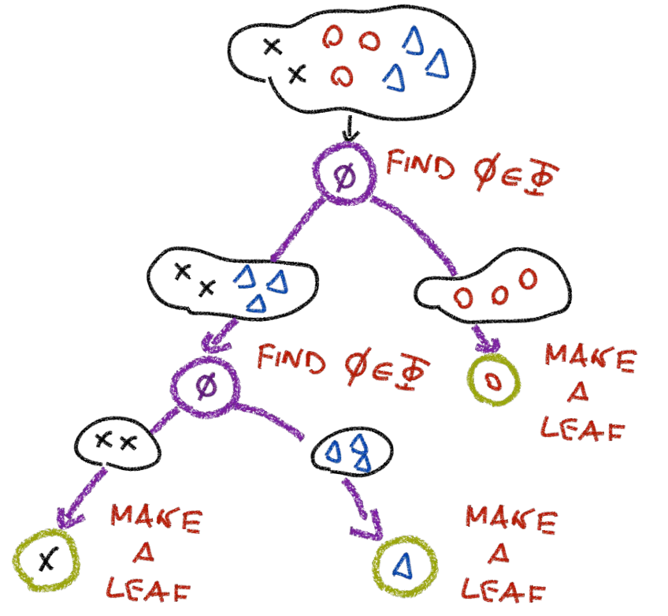


## Growing a DT

<aside>grow a leaf if set is pure<br>or has low cardinality</aside>

### Growing a leaf

> **<u>Optimal leaf predictor</u>**: function that minimizes the error on a set

> <u>**Imputity $I({\cal D})$** of a set ${\cal D}$</u>: measure of the variability of the lables of set of examples ${\cal D}$

- **Training set** reaching the node
  $$
  {\cal D} = \set{z_1,...,z_m}
  $$

- Optimal **leaf predictor**
  $$
  h^*‚àà\arg\,\min_{h‚àà{\cal H}_{\rm leaf}}E(h,{\cal D})
  $$

- Optimal **error value** (impurity measure)
  $$
  I({\cal D})=E(h_{\cal D}^*,{\cal D})
  $$

- ==<u>Conditions</u>: **grow a leaf ${\tt Leaf}(h^*_{\cal D})$** if some criterion is met==

  - ==**Purity**==                              $I({\cal D})<ε$
  - ==**Minimum cardinality**==    $|{\cal D}|<K$
  - Others

- ==<u>In practice</u>: **not all** the criterion should be **satisfied**, so that trees can be more **compact and generalized**==


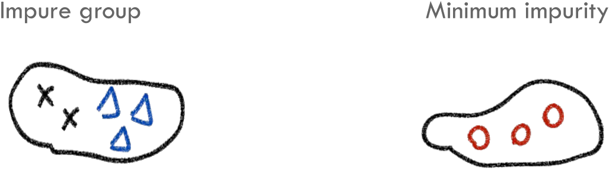

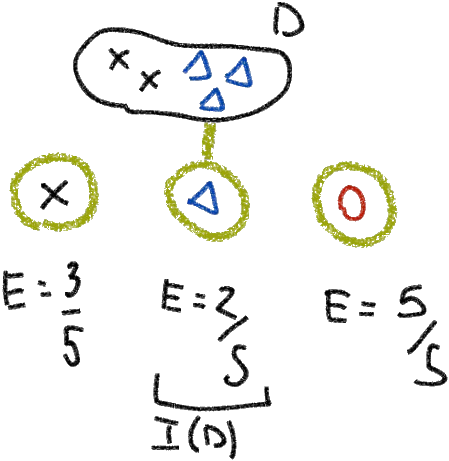


<aside>grow a node with<br>optimal Φ*</aside>

### Growing a node

> <u>Definition</u>  (**Impurity $I_\phi({\cal D})$** of a split function $\phi$)
>
> Lowest training error attainable by a tree consisting of a root and two leaves, computed in terms of the impurity of the split data
> $$
> I_{\phi}({\cal D})=\sum_{d \in\{L, R\}} \frac{\left|{\cal D}_{d}^{\phi}\right|}{|{\cal D}|}\ I({\cal D}_{d}^{\phi})\\
> $$

- ==If **no stopping criterion** in met, find an optimal **split function**==
  $$
  \phi_{\cal D}^*‚àà \arg\,\min_{\phi ‚àà\Phi}I_\phi({\cal D})
  $$

- ==**Grow a ${\tt Node}(\phi^*,t_L,t_R)$**, where==

  - ==**$\phi^*$** is the **optimal split**==
  - ==**$t_L$ and $t_R$** are obtained by **recursively applying the learning algorithm** to the associated training set **splits**==

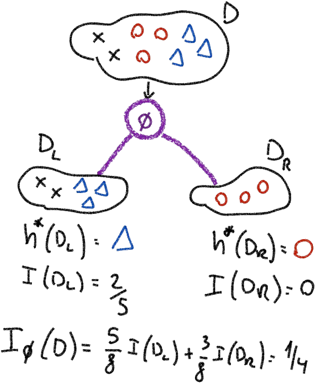


<aside>recursive function</aside>

### Growing in a nutshell

$$
{\tt Grow}({\cal D})= \begin{cases}
{\tt Leaf}\left(h_{{\cal D}}^{*}\right) & \text { if stopping criterion met } \\
{\tt Node}\left(\phi_{{\cal D}}^{*},\ {\tt Grow}\left({\cal D}_L^{*}\right),\ {\tt Grow}\left({\cal D}_{R}^{*}\right) \right) & \text { otherwise }\end{cases}\\[8px]
{\rm where}\quad {\cal D}_{d}^{*}=\left\{(x, y) \in {\cal D},\ \phi_{{\cal D}}^{*}(x)=d\right\}
$$


## Splitting

<aside>maximize information gain</aside>

### Split selection

- ==The selection of the best split function could be given in the equivalent **maximization of information gain**==

  - Instead of in terms of minimizing the impurity of the split

- ==**Reduction of impurity** induced by the split==
  $$
  \Delta_{\phi}({\cal D})=I({\cal D})-I_{\phi}({\cal D})
  $$

- ==**Information gain is non negative**==
  $$
  \Delta_\phi({\cal D})≥0,\ \ ∀\,\phi∈\set{L,R}^\cal X,\ \ {\cal D}\sub\cal X×Y
  $$

- ==With this criterion the **impurity** will **never increase** for any randomly chosen split==


<aside>h predicts only data that reach that leaf and returns a constant</aside>

### Leaf predictions

- ==**Leaf prediction** provides a **solution to a simplified problem** involving only **data reaching the leaf**==

- <u>Solution</u>

  - Arbitrary function $h‚àà \cal F_{\rm task}$
  - ==<u>In practice</u>: restrict $h$ to a **subset $\cal H_{\rm leaf}$ of simple functions**==

- ==The **simplest predictor** is a **function returning a constant** (~~e.g.~~ **prefixed class label**)==

- **Set of all possible constant functions**
  $$
  {\cal H}_{\rm leaf}=\bigcup_{y‚àà\cal Y}\set{y}^\cal X
  $$


<aside>classification error: impurity of the most frequent label</aside>

### Impurity measures for classification

- For **classification** ${\cal Y}=\set{c_1,...,c_k}$ and $\cal D \sub X√óY$

- <u>Let</u>:  ${\cal D}^y=\set{(x,y')‚àà{\cal D}:y'=y}$ denotes the subset of **training samples** in $\cal D$ with class **label $y$**

- <u>Consider</u>: **error function**
  $$
  E(f , {\cal D})=\frac{1}{|{\cal D}|} \sum_{z \in {\cal D}} l(f, z)
  $$

- ==**Impurity measure**== could have different forms with different performance

  - ==**Classification error**==
    $$
    l(f,(x,y))={\rm loss}_{01}(f, z)\ ‚àß\ {\cal H}_{\rm leaf}=\bigcup_{y‚àà \cal Y}\set{y}^{\cal X}\quad‚áí\quad
    I({\cal  D})=1-\frac{\max_{y‚àà \cal Y}|{\cal D}^y|}{|{\cal D}|}
    $$
    
  - ~~**Entropy**~~
    $$
    l(f,(x, y))=-\log f_{y}(x) \ \and\ {\cal H}_{\text {leaf }}=\!\!\bigcup_{\pi \in \Delta(y)}\{\pi\}^{{\cal X}}\quad‚áí\quad I({\cal D})=-\sum_{y \in {\cal Y}} \frac{\left|{\cal D}^{y}\right|}{|{\cal D}|} \log \frac{\left|{\cal D}^{y}\right|}{|{\cal D}|}
    $$
  
    - ~~**Constant label distribution** as leaf prediction~~
  
  - ~~**Gini impurity**~~
    $$
    l(f,(x, y))=\sum_{c‚àà\cal Y}\left[f_{c}(x)-1_{c=y}\right]^{2}\ \and\ {\cal H}_{\text {leaf }}=\!\!\bigcup_{\pi \in \Delta({\cal Y})}\{\pi\}^{{\cal X}}\quad‚áí\quad I({\cal D})=1-\sum_{y \in \cal Y}\left(\frac{\left|{\cal D}^{y}\right|}{|{\cal D}|}\right)^{2}
    $$


#### Example

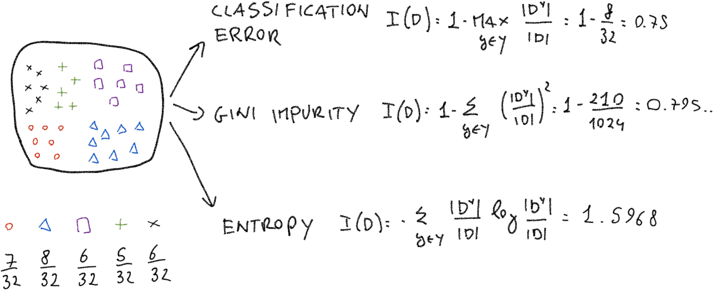


<aside>variance</aside>

### Impurity measures for regression

- For **regression** ${\cal Y}\sub\R^d$ and $\cal D \sub X√óY$

- ==**Impurity measure** is the **variance**==
  $$
  l(f,(x,y))=\Vert f(x)-y \Vert_2 \ ∧\ {\cal H}_{\rm leaf}=\bigcup_{y∈ \cal Y}\set{y}^{\cal X}\quad⇒\quad I({\cal  D})=\frac{1}{|\cal D|}\sum_{(x,y)∈\cal D}\Vert x-μ_{\cal D}\Vert^2\\
  μ_{\cal D}=\frac{1}{|\cal D|}\sum_{(x,y)∈\cal D}\!\!x
  $$


<aside>heterogeneous (discrete/continuous),<br>ordering (ordinal/nominal)</aside>

### Data features/attributes

- Each dimension could have

  - ==**Heterogeneous types of values** (discrete/continuous)==

  - ==**Total ordering or not** (ordinal/nominal)==


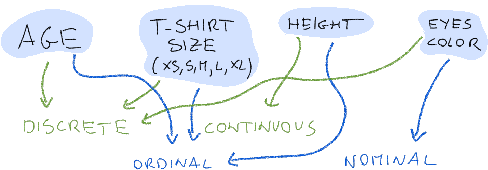


<aside>1-dimensional splitting</aside>

### Split/Routing functions

- The **split/routing $\phi ‚àà\set{L,R}^\cal X$** determines if a **data point $x‚àà\cal X$** should **move left or right**
- The split functions are **restricted** to some **predefined set $\Phi\sub\set{L,R}^\cal X$** depending on the **feature space**
- ==The **prototypical split function for a $d$-dimensional input**==
  1. ==**Selects one dimension**==
  2. ==Applies a **$1$-dimensional splitting criterion**==


<aside>partitions of K<br>in K_L and K_R</aside>

### Discrete nominal features

- <u>Assumption</u>: ==**discrete nominal features taking values in $\cal K$**== (~~e.g.~~ colors, marital status, etc.)

- <u>Idea</u>: ==**test all** the possible **partitions of $\cal K$** and assign to $\phi$ the one that **minimizes the impurity**==

- <u>Split function can be implemented given</u>: ==**partition of $\cal K$ into ${\cal K}_L$ and ${\cal K}_R$**==
  $$
  \phi(x)=\begin{cases}
  L&x‚àà{\cal K}_L \\
  R&x‚àà{\cal K}_R
  \end{cases}
  $$

- <u>Finding the optimal split requires testing</u>: ==**$2^{|{\cal K}|-1}-1$ bi-partitions**==

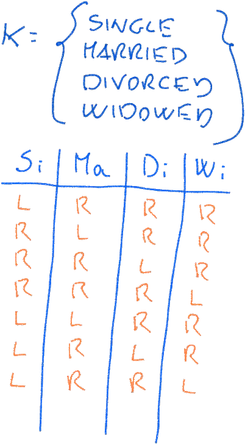


<aside>partitions bases on threshold r‚ààK</aside>

### Ordinal features

- <u>Assumption</u>: ==**ordinal features**== (~~e.g.~~ numbers, t-shirt sizes, etc.), taking values in $\cal K$

- <u>Split function can be implemented given</u>: ==**threshold $r‚àà\cal K$**==
  $$
  \phi(x)=\begin{cases}
  L&x≤r\\
  R&x>r
  \end{cases}
  $$

- <u>Finding the optimal split requires testing</u>

  - ==**$|{\cal K}|-1$ thresholds** if $|{\cal K}|≤|{\cal D}|$==
  - ==Otherwise: **sort the input values in $\cal D$** and test **$|{\cal D}|-1$ thresholds**==
  

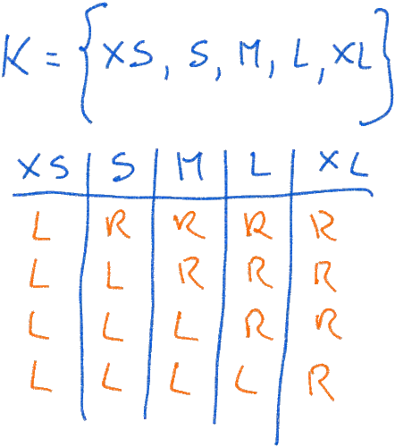


<aside>consider multiple features</aside>

### Oblique

- ==Sometimes it is convenient to split using **multiple features at once**==

- ==Such split functions can generate **oblique decision boundaries**==

- ==Harder to optimize==

- <u>Assumption</u>: ==**continuous features**==

- <u>Split function can be implemented given</u>:  $x‚àà\R^d\ ‚áí\ w‚àà\R^d\ ‚àß\ r‚àà\R$
  $$
  \phi(x)=\begin{cases}
  L&w^Tx≤r\\
  R&\text{otherwise}
  \end{cases}
  $$


## Learning

### Example

---

> 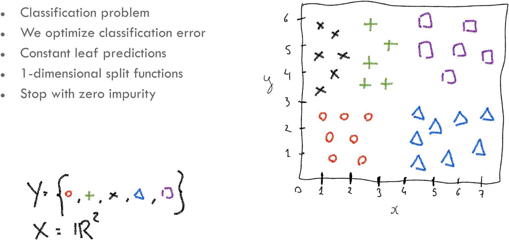

---

> 

---

> 

---

> 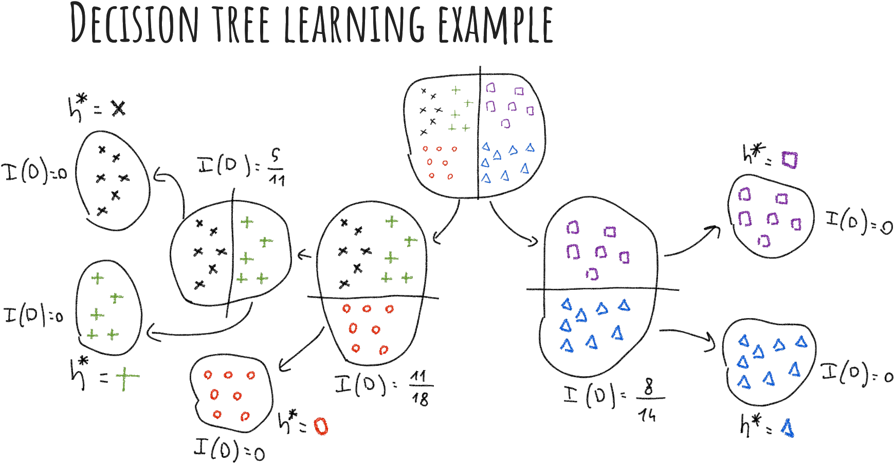

---

> 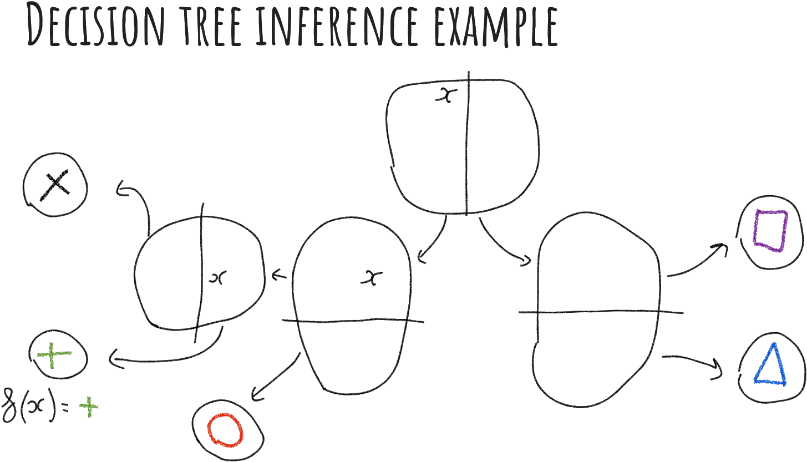


## Final considerations

### Basic algorithm: Top-Down learning

```pseudocode
ID3():  /* Iterative Dichotomiser 3 */
    node = root of DT
    loop:
        1. find the best decision attribute A (e.g. information gain) for the next node
        2. assign A as decision attribute for node
        3. foreach value of A, create a new descendant of node
        4. sort training examples to leaf nodes
        5. if training examples are perfectly classified, exit
           else, recurse over new leaf nodes
```


<aside><u><b>pruning</b></u>: optimization that replace a subtree by a leaf;<br>reduce overfitting removing irrelevant attributes</aside>

### Improving DTs

- ==DTs have a **structure** that is **determined by the data**==
- ==<u>Consequence</u>: they are **flexible** and can easily **fit the training set**, but with high **risk of overfitting**==

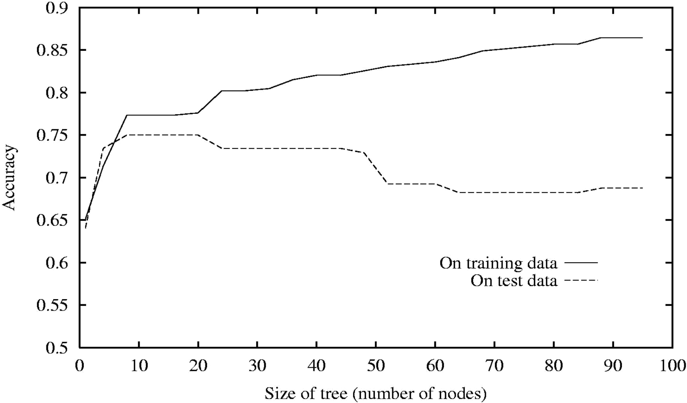


#### Generalization and complexity

- <u>Improving generalization</u>: **standard techniques**
  - Early stopping, regularization, data augmentation, complexity reduction, ensembling
- ==<u>Reduce complexity</u>: **pruning a posteriori**==

> **<u>Pruning</u>**: replacing a whole subtree by a leaf node


#### Overfitting

- ==Many kinds of **noise** can occur in the **training data**==
  - **Incorrect values of attributes** because of **errors in the data acquisition** process
  - Instances **labelled incorrectly**
  - ==**Irrelevant attributes** to the decision making process==
    - ==**Large number of attributes** could infer **meaningless regularity in the data**==
    - ==<u>Problem</u>: **overfitting** the training data==
    - ==<u>Solution</u>: **remove irrelevant attributes**==
      - **Manual process not** always possible


### Summary

- DTs widely used in practice
- <u>Strengths</u>
  - ==**Fast at inference time**==
  - ==**Simple to implement**==
  - ==Can **convert** a prediction to a **set of rules**==
- <u>Weaknesses</u>
  - ==**Univariate feature split**==
  - ==Requires **fixed-length feature vectors**==
  - ==**Non-incremental** (~~i.e.~~ **batch method**)==


### Decision Trees VS k-NN

|                            | k-Nearest Neighbors             | Decision Trees        |
| -------------------------- | ------------------------------- | --------------------- |
| <u>Decision boundaries</u> | Piece-wise linear               | Axis-aligned          |
| <u>Test complexity</u>     | Depend on all training examples | Attributes and splits |


## Random forests

<aside>combine multiple models</aside>

### Ensemble learning

- ==**Combine multiple models**==
- ==Average models to **reduce overfitting**==
- <u>Problems</u>
  - ==Only **one training set**==
  - ==**Generate** multiple **models**==


<aside>draw new datasets from D</aside>

### Bagging: Bootstrap aggregation

>**<u>Bootstrap sampling</u>**: given a set $\cal D$ containing $N$ training examples, create $\cal D'$ by drawing $N$ examples at random with replacement from $\cal D$

- ==$\cal D'$ contains **repetitions** of examples==
- ==Elements of $\cal D'$ are **sampled with replacement** (~~i.e.~~ **independent samples**)==

> <u>Procedure</u>  (**Bagging**)
>
> 1. Create $k$ bootstrap datasets ${\cal D}_i$
> 2. Train distinct classifier on each ${\cal D}_i$
> 3. Classify new instance by majority vote or average


<aside>ensemble of DTs trained using bootstrap</aside>

### Random forests

> **<u>Random forest</u>**: ensembles of decision trees

- ==Each tree is typically **trained on a bootstrapped version of the training set**==

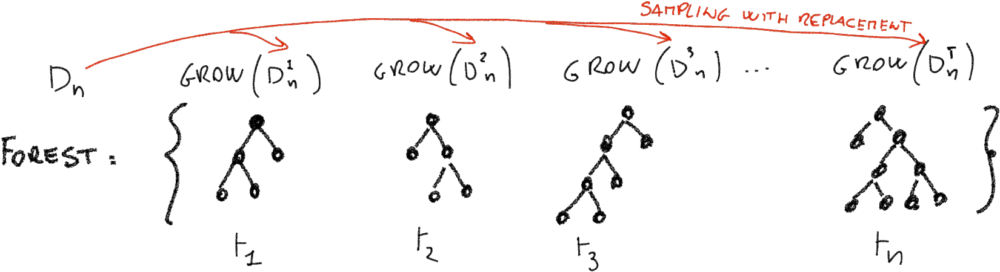


<aside>randomity in splitting,<br>averaging in prediction</aside>

### Split functions

- ==**Split functions** are==
  - ==**Optimized on randomly sampled features** ~~or~~==
  - ==**Sampled completely at random**==
    - ==**Extremely randomized trees**==
- ==This helps obtaining **uncorrelated decision trees**==
- ==**Final prediction** obtained by **averaging the prediction of each tree** in the ensemble ${\cal Q}=\set{t_1,...,t_T}$==

$$
f_{\cal Q}(x)=\frac{1}{T} \sum_{j=1}^{T} f_{t}(x)
$$


<aside>create DTs on<br>bootstrap samples</aside>

### Algorithm


