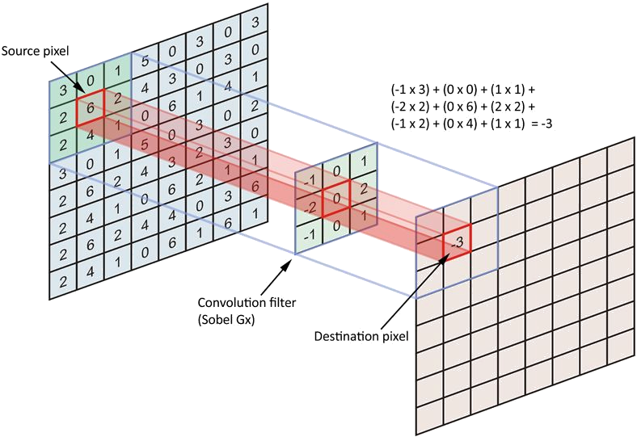
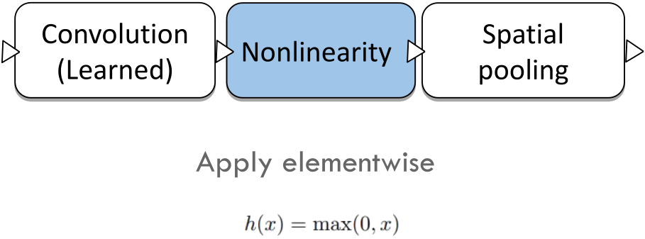
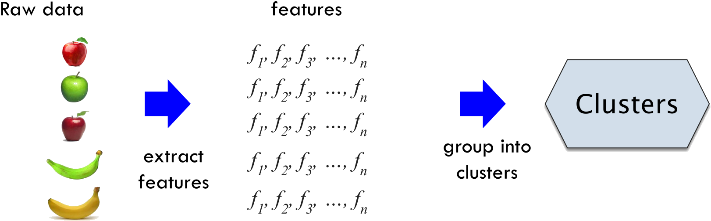

# Introduction to Machine Learning  --  3/3

|      |          |          |
| ---- | ------: | ------- |
| Intro to Machine Learning | prof. Elisa Ricci<br /> UniTN, 2021/22 | 3/3 |

[TOC]


# [13.](.) Neural Networks

## From perceptron to deep networks

### History of Neural Networks


### Perceptron

> **<u>Artificial neuron</u>** (perceptron): non-linear parameterized function with restricted output range


### McCulloch & Pitts (1940)

Implementation of **AND, OR and NOT** with a linear model with **fixed weights**


<aside>perceptron as linear classifier with threshold</aside>

### Rosemblatt (1958)

- ==**Perceptron** as a machine for **linear classification**==
- <u>Idea</u>: **learn weights and bias**
  - One weight per input
  - Multiply weights with respective inputs and add bias
  - ==If result is larger than **threshold** return $1$, otherwise $0$==
- ==The algorithm is similar to the **sign function**==


### Minsky and Papert (1969)

- **XOR cannot be solved with a perceptron**


- **Linearly separable and not separable problems**


<aside>connected neurons realize composition of non linear functions that solves XOR</aside>

### Multi-Layer Perceptron

> <u>**Multi-Layer Perceptron**</u>: densely connected artificial neurons to realize compositions of non-linear functions

- ==<u>Solution</u>: solve **XOR** with a **MLP**==
- ==Can be used to **arbitrary supervised learning tasks**==


<aside>information propagated from input to output</aside>

### Feed-forward Neural Networks

- ==**Information is propagated from the inputs to the outputs**==
- **DAG**: no cycles between outputs and inputs
- Compute **one or more non-linear functions**
  - ==Computation is carried out by **composition of algebraic functions**==
    - ==Implemented by the **connections, weights and biases** of the hidden and output layers==
- **Hidden layers** compute **intermediate representations**


#### Perceptron


$$
\hat{y}=h\left(\sum_{i} w_{i} x_{i}+w_{0}\right)=h\left(w^{T} x+w_{0}\right)
$$


#### Simplified model


$$
z=\sum_{i} w_{i} x_{i}+w_{0}
$$


#### Multiple outputs


$$
z_j=\sum_{i} w_{i,j} x_{i}+w_{0,j}
$$


#### Single layer neural network


$$
z_{j}=\sum_{i} w_{i, j}^{(1)} x_{i}+w_{0, j}^{(1)} \\
\hat{y}_{k}=f\left(\sum_{i} w_{i, k}^{(2)}\ h\left(z_{i}\right)+w_{0, k}^{(2)}\right)
$$

- <u>Generally</u>: **same** activation function **$h$** for the **hidden** layers, **different $f$ for the output**


<aside>unknown target for<br>hidden layers</aside>

### First AI winter

- ==**MLP training**: **perceptron** learning rule is **not applicable**, as it **expects to know the desired target**==
  - ==For **hidden** layers we **cannot know** the desired target==
    - ==Intermediate supervision is missing==
  - ==For **output** layers we have **direct supervision** from **ground truth** labels==


<aside><div>1. forward propagation<br>2. error estimation<br>3. back propagate error<br><br>1. choose loss function<br>2. update weights with GD<br>3. backpropagate error for GD</div></aside>

### Backpropagation (1986)

#### Basics

- Backpropagation revitalized the field
- Learning MLP for **complicated functions** can be solved
- **Efficient algorithm** which processes **large training sets**
- Today backpropagation is still at the **core of neural network training**
- ==<u>Keypoint</u>: solves the problem that **hidden layers** need **ground truth** to update weights==


#### In a nutshell

1. ==**Forward propagation**==
2. ==**Error estimation**==
3. ==**Back propagate the error**==


- ==$θ\,$:  **all the parameters** of all the layers==


<u>Idea</u>

- <u>Given</u>: **training samples** $T=\set{(x_1 ,y_1), ..., (x_N ,y_N)}$

- ==<u>Objective</u>: **adjust all the weights** of the network $θ$ such that a **cost function is minimized**==
  $$
  {\textstyle \min_θ}\sum_{i} L(y_i , f (x_i,θ))
  $$

- ==<u>Problem</u>: **GD** needs to take into account **all the huge parameters $θ$**== 


<u>Procedure</u>

1. ==Choose a **loss function**==
2. ==**Update the weights** of each layer with **gradient descent**==
3. ==Use the **backpropagation** of the error signal **to compute the gradient efficiently**==


### CNN & LSTM (1990)

- Important advances in the field

  - **Backpropagation**

  - Recurrent Long-Short Term Memory Networks (Schmidhuber, 1997)

  - Convolutional Neural Networks: OCR solved before 2000s (LeNet, 1998)


<aside>many layers lead to overfitting and<br>vanishing gradient</aside>

### Second AI Winter

- ==**NNs can't exploit many layers**==
  - ==**Overfitting**==
  - ==**Vanishing gradient**==
    - ==With NN training you need to **multiply several small numbers**  that become **smaller and smaller**==
- Lack of processing power (no GPUs)
- Lack of data (no large annotated datasets)


<aside>few heuristic and parameters, nice generalization</aside>

### SVM & Kernel methods

- **Kernel machines** (~~e.g.~~ SVMs) suddenly become very popular
  - ==**Similar accuracies** than neural networks in the same tasks==
  - ==Much **fewer heuristics and parameters**==
  - ==Nice proofs on **generalization**==


<aside>initialize weights with unsupervised learning</aside>

### Learning deep belief nets (2006)

- <u>Idea</u>
  - <u>Problem</u>: **optimization with GD** of very **non linear** landscapes is striclty **dependent** on the **starting point**
  - <u>Solution</u>: ==clever way of **initializing network weights**==
    - ==**Train each layer** one by one with **unsupervised** training using **contrastive divergence**==
    - Much **better than random values**

- ==**Fine-tune weights** with a round of **supervised** learning==
- State of the art performance on MNIST dataset


### Alexnet

- Hinton’s group implemented a CNN similar to LeNet [LeCun1998] but

  - Trained on ImageNet with two GPUs

  - With some technical improvements (ReLU, dropout, data augmentation)


## Considerations

<aside>no need for features</aside>

### Machine learning VS Deep learning

- ==NNs can work with **raw and structured data** without handcrafted features==
  - ==**Learn fetures and model** at the same time==

- ==**Shallow models** are preferred when==
  - ==We can make **strong assumption** on data (~~e.g.~~ linearly separable)==
  - ==We do **not** have **enough data** (NNs are prone to overfitting)==
  - ==We want **explainable/inspectable models**==
  - ==We want to **inject prior knowledge**==


<aside>NN: composition of modules, hierachically connected functions</aside>

### Modular Learning

- ==A **neural network** is==
  - ==A **composition of modules** (building blocks)==
  - ==A series of **hierarchically connected functions**==
    - ==Each one with its own parameters==


## Feedforward networks

<aside>approximate ideal <br>f* : X→Y with parametric composed f(x,θ)</aside>

### Basics

- ==<u>Goal</u>: **approximate some unknown ideal function $f^*:\cal X→Y$**==

- ==**Feedforward network**==

  - ==<u>Define</u>: **parametric mapping $f (x, θ)$**==
  - ==<u>Learn</u>: **parameters** to get a good **approximation of $f^*$** from available sample==

- **Information flow** in function evaluation begins at input and flows through intermediate computations to produce the output

- ==Function **$f$** is a **composition of multiple functions**==
  $$
  f(x)=f^{(3)}(f^{(2)}(f^{(1)}(x)))
  $$

  - ==Function composition can be described by a **DAG**==
  - Function $f^{(i)}$ corresponds to layer $i$
  - **Depth** is the **maximum $i$** in the function composition chain


<aside>optimize θ with GD to drive f(x,θ) closer to f*(x)</aside>

### Training

- ==<u>Training</u>: **optimize $θ$** to drive **$f (x,θ)$ closer to $f^*(x)$**==
- ==<u>Training data</u>: $f^*(x)$ evaluated at different $x$ instances (~~i.e.~~ expected outputs)==
- ==**Only** specifies the output of the **output layer**==
  - ~~Output of intermediate layers is not specified, hence the nomenclature hidden layers~~
- ==**Designing** and **training**== a neural network is **not** much **different** from training any other model ==with **GD**==
- <u>Problems</u>
  - ==Very **non-linear** function==
  - ==The problem is **non-convex**==
  - ==**No convergence** guaranteed==


<aside><div>- output representation
- cost function
- activation functions
- architecture
- optimizer</div></aside>
### Modeling choices -- Deep network architecture

==To apply **gradient descent** we need to specify==

- ==**Output representation** (output function)==
- ==**Cost function**==
- ==**Activation functions**==
- ==**Architecture** (number of layers, etc.)==
- ==**Optimizer** (for training)==


<aside>regression → linear<br>classification → softmax (normalized probabilities)</aside>

### Output units

#### Linear units -- Regression

- Given features $h$, a **layer of linear output units** gives
  $$
  \hat y=W^Th+b
  $$

- ==Linear units do **not saturate**, little difficulty for gradient-based optimization algorithms==

  - Better for calculating **derivatives** for **backpropagation**
  - ==A **gradient** of the output of the model **close to $0$ is problematic**==

- ==Produces **unnormalized log probabilities**==

- ==Used in **regression** problems==

> **<u>Saturation</u>**: happens when the gradient of the output of the model is close to $0$


#### Softmax units -- Classification

- ==For **classification** is common to convert **outputs into normalized probabilities**==

> <u>Definition</u>  (**Softmax unit**)
>
> Unit that outputs notmalized probabilities
> $$
> S(l_i)=\frac{e^{l_i}}{\sum_{k}e^{l_k}}
> $$
>
> - $l_i\,$:  scores (logits)
> - $k\ $:  number of classes


<aside>choice of loss related<br>to choice of output units</aside>

### Cost function

- Measure of the discrepancy between the predictions of the model and the ground truth labels
- **One-hot encoding**: labels encoded as vectors of zeros, with a single $1$ in the corresponding position
- Apply the **losses** seen so far (~~e.g.~~ square loss for regression)


<aside>loss function<br>for probabilities</aside>

#### Cross entropy loss

$$
{\cal L}_i=-\sum_{k}^{}y_k\log(S(l_k))=-\log(S(l))
$$

- ==<u>Requirement</u>: last layer **outputs** some form **probability** (~~i.e.~~ **softmax**)==
- ==The **choice of the loss** is related to the choice of the **output unit**==
  - ==The **cost function** and the **shape of the output layer** are strongly interconnected==
  - ==~~e.g.~~ Do **not** apply **softmax** with **square loss** for a **regression** problem==


<aside>z = W^T·x + b<br>output h(z)</aside>

### Hidden units

1. ==Accept **input $x$**==
2. ==Compute **affine transformation $z = W^T x + b$**==
3. ==Apply **elementwise non-linear function $h(z)$**==
4. ==Obtain **output $h(z)$**==


<aside>gradient is 0 or 1, large<br>and consistent gradients</aside>

### Rectified Linear Units (ReLU)

- ==**Gradient is $0$ or $1$**==
- <u>Pros</u>
  - ==Similar to linear units, **easy to optimize**==
  - ==Give **large and consistent gradients** when active==

- <u>Cons</u>
  - ==**Not everywhere differentiable**==
    - <u>In practice</u>: not a problem, ==return one **sided derivatives at $z = 0$**==

  - Gradient based optimization is subject to **numerical errors** anyway
  - ==**Dying neurons**: when the **gradient is $0$** there is **no update** of the neurons==
    - ==<u>Solution</u>: **generalized ReLU**==


<aside>solve the problem<br>of dying neurons</aside>

### Generalized ReLU

- Several **variations** to ReLU
- ==**Solve** the problem of **dying units**==
- ==Gradient for $x<0$ is a **small number $a_i>0$**==
- Used in **feed-forward** and **convolutional** networks


<aside>non-linear,<br>h(x)∈[-1|0, 1]<br><u>problems</u>: saturation, sensitive only close to 0</aside>

### Sigmoid and Tanh

- ==Squashing type of **non-linearity**: pushes **outputs to range $[0,1]$ or $[-1,1]$**==
- ==<u>Problems</u>==
  - ==**Saturate** across most of the domain==
  - ==Strongly **sensitive** only when the input is **closer to $0$**==

- ==**Saturation** makes gradient based learning difficult==


<aside>2 layers, linear output, enough non-linear HU → approximate any continuous function</aside>

### Architecture

- `[?]` Decide **depth** and **width** of a neural network
  - Few theoretical results, mostly based on **empirical findings**


> <u>Theoretical result</u>  (**Minimal network**)
>
> - 2-layer net
> - With linear output
> - With squashing non-linearity in (enough) hidden units
>
> Can approximate any continuous function over compact domain to arbitrary accuracy

- ==Also holds for **other non-linear functions**==
- <u>Implication</u>: regardless of function we are trying to learn, we know a **large MLP can represent this function**
- ==It is **not** guaranteed that the **training algorithm** will be able to **learn** that function==
  - ~~e.g.~~ Problems in optimization, overfitting


## Backpropagation

<aside><div>1. forward propagation<br>2. error estimation<br>3. back propagate error</div></aside>

### Steps

1. ==**Feedforward propagation**==
   - <u>Explanation 1</u>
     1. ==**Sum inputs**==
     2. ==Produce **activations**==
     3. ==**Feed-forward**==
   - <u>Explanation 2</u>
     1. ==Accept **input $x$**==
     2. ==Pass through **intermediate stages**==
     3. ==Obtain **output**==
2. ==**Error estimation**==
   - ==**Compare** outputs with ground truth to get **error signal**==
   - ==Use **outputs** to compute a **scalar cost** depending on the **loss function**==
3. ==**Back propagate the error** signal==
   - ==<u>Objective</u>: get **derivatives** for learning and use them to **update weights**==
   - ==Allows information to flow backwards **from cost to compute the gradient**==


<aside>learn weights with GD;<br>compute errors for HU</aside>

### Key ideas

- ==<u>Objective</u>: **learn weights**==

  - ==Use **gradient descent** with **error derivatives** w.r.t. all the weights in the net==

  - ==<u>Example</u>: **first layer**==


$$
  w_{ij}^{(1)}\ -\!=\ \eta\frac{∂L}{∂\,w_{ij}^{(1)}}
$$

- ==**No direct supervision** over **hidden units** from the **training data**==

- ==<u>Keypoint</u>: we can compute **how fast the error changes** as we change a **hidden activity**==

- ==<u>Key idea</u>: **use error derivatives w.r.t. hidden activities**==

  - Each **hidden unit** can
    - **Affect** many **output units**
    - Have **separate effects on error**

  - We **combine** these effects

  - ==We can compute **error derivatives for hidden units** efficiently==
    - ==Once we have error derivatives for **hidden activities**, we can get error derivatives for **weights going in**==


<aside>outputs of a unit are used as weight for the next ones</aside>

### Step 1: Feedforward operation


<aside>calculate gradient<br>for single examples</aside>

### Step 2: Compute error and train (output layer)

- **Error** of the network on a **training set**
  $$
  L(x, w)= \frac{1}{2}\sum_{i=1}^{N}\left(y_{i}-\hat{y}\left(x_{i}, w\right)\right)^{2}
  $$

  - ==**$\hat y$** is a **non-linear** function==
  
- ==**No closed-form solution**: to train resort to **GD**==

- ==Need to evaluate **derivative of $L$ on a single example**==

- ==We can consider a **simple linear model** for output  $\hat{y}_i=\sum_{j} w_{j} x_{i j}$==
  $$
  \frac{\partial L\left(x_{i}\right)}{\partial\, w_{j}}=\underbrace{\left(\hat{y}_{i}-y_{i}\right)}_{\text {error }}\ x_{i j}
  $$

  - ==<u>Convenient form</u>: multiplication of the **local input** with the **local error**==


<aside>local gradient δt is calculated recursively from the δs of the following layer</aside>

### Step 3: Backpropagation (hidden layers)

- ==General **unit activation** in a multilayer network==

  

- ==**Forward propagation**: calculate for **each unit its input $a_t=\sum_{j}w_{jt}z_j$**==

  - ==$a_t\,$:  **hidden activity**==

- ==**Change rule**==
  $$
  \frac{\partial L}{\partial w_{j t}}=\frac{\partial L}{\partial a_{t}} \frac{\partial a_{t}}{\partial w_{j t}}=\underbrace{\frac{\partial L}{\partial a_{t}}}_{δ_t} z_{j}={δ_t} z_{j}\\[-40px] \Darr\\[4px]
  w_{jt}^{(1)}\ -\!=\ \eta\frac{∂L}{∂\,w_{jt}^{(1)}}\ =\ \eta\,\delta_t\, z_j
  $$

  - ==**Loss $L$** depends on **$w_{jt}$ only through $a_t$**==
  - ==Derivative of the loss w.r.t. $a_t$==

- ==<u>Value</u>: **local gradient $\delta_t$**==

  - ==<u>Output units</u> with **linear activation**==
    $$
    δ_t=\hat y-y
    $$

  - ==<u>Hidden units</u>==

    - ==**Unit $t$ sends output to units $S$**==
    - ==$\delta_t$ is computed **recursively** using $\delta_s$ of the **following layer**==

    $$
    δ_t\ =\,\sum_{s\in S}\frac{\partial L}{\partial a_s} \frac{\partial a_s}{\partial a_t}\ =\ h'(a_t)\sum_{s\in S}w_{ts}δ_s\qquad\qquad a_s=\sum_{j\,:\,j→s}w_{js}h(a_j)
    $$

    - ==**If $h'(a_t)=0$, weights are not updated**==

    


### Example

---

> 
>
> 


#### Multidimensional output

---

>


## Training with GD

### Recap -- Modeling choices

- ~~**Output representation**~~
- ~~**Cost function**~~
- ~~**Activation functions**~~
- ~~**Architecture** (number of layers, etc.)~~
- **Optimizer** (for training)


<aside>backpropagation<br>to compute GD</aside>

### Gradient descent

- ~~GD finds the set of **parameters** that makes the **loss as small as possible**~~
- ~~The **change of parameters** depends on the **gradients of the loss** w.r.t. the network **weights**~~
- ==**Backpropagation** is a method for **computing gradients**==
- ==**Feedforward** neural networks can be **trained** with **vanilla GD**==
- The **learning rate** changes at each step, typically is **decayed linearly**

```pseudocode
vanilla_GD_update_rule():
    while !stopping_criteria():
        weights_grad = evaluate_gradient(loss_fun, data, weights)
        weights -= step_size * wheights_grad
```


#### Batch Gradient Descent (BGD)


- ==<u>Pros</u>: gradient estimates are **stable**==
- ==<u>Cons</u>: need to compute gradients over the **entire training set for one update**==


#### Stochastic gradient descent (SGD)


### BGD vs SGD


- ==The **non linearity of SDG** could be good for **escaping local minima**==


<aside>SDG for large datasets</aside>

### MiniBatches (SGD)

- ==<u>Problem</u>: gradient **estimates** can be very **noisy**==
- ==<u>Solution</u>: use **mini-batches** (typically 64 samples)==
- <u>Advantage</u>
  - ==Computation time per update does **not depend on number of training examples $N$**==
  - ==It permits computation on extremely **large datasets**==
  - ==Often **parallel** implementation==
  - Using **GPUs** it is common for **power of 2 batch sizes** to offer better runtime
    - ~~Some kinds of hardware achieve better runtime with specific sizes of arrays~~


<aside>update weights with velocity to go faster<br>on flat directions</aside>

### Momentum (SGD)

- ==<u>Problem</u>: with some error surfaces very **slow progress along flat direction**, jitter along steep one==

  - ==Suppose loss function in steep vertically but **shallow horizontally**==

- ==<u>Solution</u>: keep track of the **history of the gradient** to gain **stability**==

  

> <u>**Velocity** $v\,$</u>: exponentially decaying moving average of the negative gradient


- ==The **velocity accumulates the value of the gradient over time** depending on two hyper parameters $\alpha$ and $\eta_k$==
  - ==$\alpha\,$:  **momentum**==
  - ==**High values of $\alpha$** tend to **follow more the history of the gradient** rather than the current estimation==


<aside>same η to all features has bad performance if features vary in importance and frequency</aside>

### Adaptive learning rate methods

- <u>So far</u>: ==**same learning rate** for **all the features**==
  - ==**Bad** performances if features vary in **importance and frequency**==
- ==The **learning rate** is one of the **hyperparameters most difficult to set** in neural networks==


### Different methods


# [14.](.) Convolutional Neural Networks

## Data & Convolution

<aside>locally structured input space (spatial or temporal)</aside>

### Structured Data

- ==Some applications naturally deal with an **input space** which is **locally structured** (~~i.e.~~ **spatial or temporal**)==
  - Images, language, etc. vs arbitrary input features

- **Neural Networks** are extremely powerful in this case


<aside>hierarchy of features;<br>layer extracts features from previous layer</aside>

### From pixels to labels

- ==Learn a **hierarchy of features**==
  - ==<u>First layer</u>: learns **spatial patterns** that are spatially **coherent** but very **local**==
  - ==<u>Next layers</u>==
    - ==**Aggregate** information from **previous layer**==
    - ==**Generate features** associated to **larger local areas**==

- ==Each layer of hierarchy extracts **features from output of previous layer**==
- ==**Train all layers jointly**==


<aside>application of a kernel matrix to an image</aside>

### Convolution

> **<u>Convolution</u>**: matrix operation that computes the value of a cell by adding the weighted values of its neighbors

- ==**General purpose filter** operation for images==

  - <u>Applications</u>: **smooth, sharpen, enhance**, etc.

- ==Applies a **kernel matrix** to an **input image**==

- ==<u>Output</u>: new modified **filtered image** with **reduced size**==
  $$
  S(i, j)=(I · K)(i, j)=\sum_{m} \sum_{n} I(m, n)\ K(i-m,\ j-n)
  $$

- It is a **commutative operation**


> **<u>Convolutional networks</u>**: neural networks that use convolution in place of general matrix multiplication in at least one of their layers




<aside>receptive field filter images to exploit spatially local correlation</aside>

### Visual cortex

- ==The visual cortex contains a **complex arrangement of cells**, which are sensitive to small **sub-regions** of the visual field, called a **receptive field**==
- ==These cells act as **local filters over the input space** and are well-suited to **exploit the strong spatially local correlation** present in natural images==
- ==Two basic cell types==
  - ==**Simple cells** respond maximally to specific **edge-like patterns** within their receptive field==
  - ==**Complex cells** have **larger receptive fields** and are locally invariant to the exact position of the pattern==


<aside>each filter acts like a receptive field and is learned to activate itself on specific spatially located features</aside>

### Convolutional layers

> **<u>Convolutional layer</u>**: core layer of CNNs, consisting of a set of learned filters

- <u>Keypoints</u>
  - ==The network **learns filters** that activate when they see **specific features at spatial position** in the input==
  - ==The **values inside the kernel** are the **parameters** learned with **backpropagation**==

- ==**Multiple kernel** are implemented==
  - ==CNNs promotes **diversity in the kernels**==
  - ==**Diversity** produces **different feature activation maps** (multidimensional)==
  - ==These maps are **combined** in the **next layer**==
- ==Each **filter** covers a **spatially small portion** of the input data (**receptive field**)==
  - ==Because of the portion is small, also the **number of parameters is small**==
  - ==CNNs operates with a **local connectivity structure**==
- ==**Each filter is convolved** across the dimensions of the input data, producing a **multi-dimensional feature map**==


<aside><div>feedforward NN<br>1. convolution<br>2. non-linearity<br>3. pooling</div></aside>

### Architecture

- ==**Feedforward** neural network with **specialized connectivity structure**==
- ==Typically CNN layers transform the **input matrix** into an **output class prediction**==
- <u>Operations</u>
  1. ==**Convolution**==
  2. ==**Non-linearity**==
  3. ==**Pooling**==


<aside>apply filters and outputs feature activation map</aside>

#### Convolution


<aside>increase non-linearity</aside>

#### Non-linearity



- ==**Increase non-linearity** of the entire architecture **without affecting receptive fields** of convolution layer==
- ==Application of a **ReLU**==


<aside>reduce spatial size</aside>

#### Spatial pooling


- ==Progressive **reduction of the spatial size** of the representation==

  - ==**Reduces** the amount of **parameters and computation** in the network==
  - ==Provides **invariance to translations**==
  - ==**Controls overfitting**==

- ==<u>Example</u>: **max pooling**==

- **Matrix dimensions**:  $\rm width\ ×\ height\ ×\ channels$

  


<aside>FNN with spatial<br>arranged units;<br>layers organized in 2D feature maps, result of convolution;<br>input from previous similar location</aside>

### Summary

- ~~<u>Recap</u>: in a **feedforward** neural network~~
  - ~~**Units** are organized into **layers**~~
  - ~~Units at a given layer only get **input from units in the layer below**~~

- ==**CNNs** are **feedforward** networks in which units have a **spatial arrangement**==
- ==At each **layer**, units are organized into **2D grids**, the **feature maps**==
- ==Each **feature map** is the result of a **convolution**==
  - ==The **same convolutional filters** are applied at **each location**==
  - ==The **weights** are **different** across the feature maps==
- ==A unit at a specific location on the 2D grid can only **receive input** from units at **similar location at layer below**==
- ==Need **labeled data**: **supervised** learning model==
- **Flexible** to many applications


## CNN architectures

### LeNet - 1998


### AlexNet - 2012

- Similar framework to LeNet but
  - Bigger model (7 hidden layers, 650K units, 60M params)
  - More data (106 vs. 103 images)
  - GPU implementation (50x speedup over CPU), trained on two GPUs for a week


### Going Deeper

**Classification**: ImageNet Challenge top-5 error


### VGG - 2014

Similar motif to AlexNet


### GoogLeNet

- Has 12x fewer parameters than AlexNet
- Gets rid of fully connected layers
- Inception Module


<aside>identity mapping: solves degradation improving information propagation</aside>

### ResNet

- ==**Residual Block**: improved performance of very deep nets==
- ==**Solve the degradation problem**==
  - ==Enabling deeper layers to **propagate information** from shallow layers directly with **identity mapping**==
- ==Introduces **batch normalization** to improve training==

​						 


<aside><div>- detection<br>- semantic segmentation<br>- structured regression</div></aside>

### Beyond classification

- ==**Detection**==

  - First approach: R-CNN (Regions with CNN features)
  - Trained on ImageNet classification
  - Fine-tune CNN on PASCAL-VOC
  - Nowadays more sophisticated methods exist

  

- ==**Semantic segmentation**==

  

- ==**Structured regression**==

  


## Other Neural Networks

### Many models for different needs


<aside>I/O as variable-lenght sequence</aside>

### Variable lenght sequences

- <u>So far</u>: **prediction** problems **with fixed-size inputs and outputs**
- Flexibility of **CNN** to address a **wide range of tasks**
- ==Many applications need the **input/output** to be a **variable-length sequence**==


<aside>NN with cycles (recurrences) for dependencies</aside>

### Recurrent Neural Network (RNN)

- ==**Sequence prediction problems**: take into account the **dependencies** between samples==

- ==Introduces **cycles, recurrences**==

- ==$f_W$ is **non-linear** and **learnable**==

  - ==Can be trained by **unrolling** and with **backpropagation**==

  


# [15.](.) Dimensionality reduction

## Introduction -- Unsupervised learning

<aside>distribution p_data∈Δ(X) without target variables; implicit supervision with objective function</aside>

### Implicit supervision

- ==We observe data from the unknown distribution **$p_{\rm data}∈\Delta({\cal X})$**==
- ==We **lack** observations of a **target variable** (~~e.g.~~ class labels)==
- ==**Implicit supervision** is given via the design of the **objective function**==
- <u>Tasks</u>
  - ==**Dimensionality reduction**==
  - ==**Clustering**==
  - ==**Density estimation**==


<aside>compress input reducing feature dimensionality, preserving most information</aside>

### Dimensionality reduction

- <u>Objective</u>
  - ==Compress the input data by **reducing the feature dimensionality**==
  - ==**Preserve** as much **information** as possible==
    - The way information **loss is measured** yields **different algorithms**
- <u>Advantages</u>
  - ==**Reduce** time of subsequent **data elaboration** and/or **storage**==
  - ==Enables **better visualization/inspection** of data==
  - ==Reduces the **curse of dimensionality**==


<aside>group points with regular pattern or similarity under criteria</aside>

### Clustering

- <u>Objective</u>
  - ==**Group** together **data points** that exhibit some **regular pattern or similarity** under **predefined criteria**==
  - ==**Compress data** by reducing the **number of data points**==
- <u>Example applications</u>
  - Cluster users by **preference** (~~e.g.~~ based on movie ratings)
  - Group **genes** families from gene sequences
  - Find **communities** in social networks


<aside>estimate the unknown distribution;<br>generate new data;<br>detect anomalies</aside>

### Density estimation

- <u>Objective</u>
  - ==Get an explicit **estimate of the unknown probability distribution** that generated the training data==
  - ==**Generate new data** by sampling from the estimated distribution==
  - ==**Detect anomalies/novelties** in terms of data points that a exhibit **low probabilities**==


## Autoencoders

<aside>extraction of smaller set of meaningful features</aside>

### Autoencoders

> **<u>Autoencoder</u>**: unsupervised method for learning a lower-dimensional feature representation from unlabeled training data

- ==Used for **dimensionality reduction**==
- Autoencoding: **encoding itself**


### Encoding

- ==**Features** in $z$ should capture meaningful **factors of variation** in data $x$==
- ==$z$ is **smaller** than $x$==


### Decoding

- ==**Decoder mirrors** the behaviour of the **encoder**==
- ==Uses **up-convolutional layers**, reciprocal of the convolutional ones==
- ==**Reconstruction loss**: **Np-loss** between the **original $x$** and the **reconstructed $\hat x$**==
- ==After training **decoder is no more necessary**==


### Classification

- ==**Encoded features** can be used to initialize a **supervised model**==


## Principal components

<aside>drop dimension<br>of least variance</aside>

### Main idea

1. ==**Find orthogonal directions of maximum variance**==
2. ==**Change coordinate system**==
3. ==**Drop dimensions of least variance**==


- <u>Example</u>: reduce from 3D to 2D


<aside>find variance of centered data points along a direction w</aside>

### Variance along unit direction $w$

- <u>Given</u> (in an $n$-dimensional space)

  - **Training set** containing **points $x_i$**
  - **Auxiliary point $c$**
  - ==**Unit direction: vector $w$** starting in $c$ s.t. **$w^Tw=1$**==

- <u>Let</u>

  - ==**Projection $t_i$** of vector $x_i-c$ on vector $w$==
    $$
    t_i=(x_i-c)^Tw
    $$

  - **Set $t$ of projections**
    $$
    t=\set{t_i\ :\ t_i=(x_i-c)^Tw,\ \forall x_i∈{\cal D}}
    $$

  - ==**Vector $\bar X$** of distances of points from mean==
    $$
    \bar X=[\,\bar x_1,\ \bar x_1,\ ...,\ \bar x_n\, ]\qquad {\rm where}\ \ \bar x_i=x_i-\bar x
    $$

    - ==**Centering data points**==

- ==<u>Calculate</u>: **expectation** and **variance** of set of vectors $t$==
  $$
  \begin{aligned}
  E[t]\ &=\ \frac1n\sum_{i=1}^{n}t_i\\& =\ \frac1n\sum_{i=1}^{n}(x_i-c)^Tw\\[4px]& =\ \bar x^Tw-c^Tw\\[44px] \
  \end{aligned}
  \qquad
  \begin{aligned}
  {\rm Var}[t]\ & =\ \frac1n\sum_{i=1}^{n}(t_i-E[t])^2=
  \\& =\ \frac1n\sum_{i=1}^{n}\left((x_i-\bar x)^Tw\right)^2=
  \\& =\ \frac1n\sum_{i=1}^{n}(\,\bar x_i^Tw)^2=
  \\& =\ w^T\left[\frac1n\bar X\,\bar X^{T}\right]w=
  \\[4px]& =\ w^TCw
  \end{aligned}
  $$

  - ==<u>Where</u>:  $C=\left[\frac1n\bar X\,\bar X^{T}\right]$ is the **covariance matrix** of the **centered** data set==
  - ==<u>Note</u>: variance doesn't use $c$==

- ==<u>Objective</u>: find **vector $w$** that **maximize the variance**==
  $$
  w \in \arg\,\max_w\, \set{w^T C w\ :\ w^T w=1}
  $$


<aside><u><b>covariance</b></u>: measure of the joint variability of two random variables</aside>

### Recap -- Covariance

> **<u>Variance and covariance</u>**: measure of the spread of a set of points around their center of mass (mean)

> **<u>Variance</u>**: measure of the deviation from the mean for points in one dimension

> **<u>Covariance</u>**: measure of how much each of the dimensions vary from the mean w.r.t. the other

- ==Measured **between two dimensions**==
- ==Sees if there is a **relation between two dimensions**==
- ==Measure **how spread out** the data are in **any given direction**==

> <u>Definition</u>  (**Covariance matrix $C$** along $n$ dimensions)
>
> Square matrix containing variances and covariances of data points along each pair of the $n$ dimensions
> $$
> C∈ℝ^{n×n} \ :\ C_{ij}=\begin{cases}
> {\rm var}(i) & i=j\\
> {\rm cov}(i,j) & i\ne j
> \end{cases}
> $$
> 


<aside>linked vector x and<br>scalar λ s.t. Ax = λx</aside>

### Eigenvalues & Eigenvectors

> <u>Definition</u>  (**Eigenvalues & Eigenvectors**)
>
> Eigenvalue and eigenvectors of a square matrix $A$ are linked in order to satisfy the condition
> $$
> Ax = λx
> $$
>
> - $A∈ℝ^{m×m}\,$:  square matrix
> - $x∈ℝ^{m}\,$:  eigenvector or characteristic vector
> - $λ∈ℝ\,$:  eigenvalue or characteristic value
> - $I∈ℝ^{m×m}\,$:  identity matrix (below)
> - $Ax = λx\,∈\,ℝ^{m}$
>

---

> 
>
> 


<aside>decompose A in<br>term of its eigs</aside>

### Eigenvalue Decomposition (ED)

> <u>Procedure</u>  (**Eigenvalue Decomposition**)
>
> - <u>Given</u>: symmetric matrix $A∈ℝ^{m×m}$
>
> - <u>Objective</u>: decompose $A$ in $U\Lambda U^T$, so that it's written in terms of its eigs
>   $$
>   \exist\quad U=[u_1,\,...,\,u_m]∈ℝ^{m×m},\ \ \Lambda=(λ_1,\,...,\,λ_m)∈ℝ^m\,:\,\lambda_1\ge\dots\ge\lambda_m\\
>   {\rm s.t.}\quad A=U\Lambda U^T=\sum_{j=1}^{m}λ_ju_ju_j^T\ \ ∧\ \ U^TU=UU^T=I\\
>   $$
>
> - <u>Where</u>
>
>   - $I\,$:  identity matrix
>   - $u_j\,$:  eigenvector
>   - $\lambda_j\,$:  corresponding eigenvalue
>   - $U\,$:  matrix containing eigenvectors in columns
>   - $\Lambda\,$:  diagonal matrix of eigenvalues
>
>   $$
>   U=\begin{bmatrix} 
>      \, u_1 & \cdots & u_n\,
>    \end{bmatrix}\qquad \Lambda=\begin{bmatrix}
>      λ_1 & \cdots & 0 \\ 
>      \vdots& \ddots & \vdots \\[4px]
>      0 & \cdots & λ_n
>    \end{bmatrix}
>   $$


<aside>decomposition for<br>generic matrices</aside>

### Singular Value Decomposition (SVD)

> <u>Procedure</u>  (**Singular Value Decomposition**)
>
> - <u>Given</u>: $A∈\R^{m×n}$
>
> - <u>Objective</u>: decompose generic matrix $A$ in $UsV^T$
>   $$
>   \exist\quad U∈\R^{m×k},\ \ s∈\R^k\,:\,s_1\ge\dots\ge s_k\ge0,\ \ V∈\R^{n×k}\\
>   {\rm s.t.}\quad A=UsV^T\ \and\ U^TU=V^TV=I
>   $$
>
> - <u>Where</u>
>
>   - $I\,$:  identity matrix
>
>   - $U\,$:  matrix containing eigenvectors in columns
>
>   - $s\,$:  diagonal matrix of eigenvalues
>
>   $$
>   U=\begin{bmatrix} 
>      \, u_1 & \cdots & u_n\,
>    \end{bmatrix}\qquad s=\begin{bmatrix}
>      s_1 & \cdots & 0 \\ 
>      \vdots& \ddots & \vdots \\[4px]
>      0 & \cdots & s_n
>    \end{bmatrix}
>   $$


<aside>find the PCs w that maximize the variance by eigenvalue decomposition</aside>

### Principal Components

> <u>Definition</u>  (**First Principal Component**)
> $$
> {w}_{1} \in \arg\,\max_w\, \set{\,\underbrace{\,w^T C w\,}_{\mathclap{\text{variance along }w}}\ :\ w^T w=1\,}
> $$

- ==<u>Solution</u>: **indirectly by eigenvalue decomposition**==
  - ==The **variance along the FPC** is the **largest eigenvalue of $C$**==
  - ==The **FPC $w_1$** is the corresponding **eigenvector**==

> <u>Definition</u>  (**Second Principal Component**)
> $$
> w_2 \in \arg\,\max_w\, \{w^T C w\ :\ w^T w=1\ \and\ w\perp w_1\}
> $$

- ==**Variance** along the SPC: **second largest eigenvalue of $C$**==
- ==**SPC $w_2$**: corresponding **eigenvector**==

> <u>Definition</u>  (**$i$-th Principal Component**)
> $$
> w_i \in \arg\,\max_w \left\{w^T C w\ :\ w^T w=1\ \and\ w \perp w_j,\ ∀\ 1 \leq j<i\right\}
> $$

- Variance along the $i$-PC: $i$-th largest eigenvalue of $C$
- $i$-PC $w_i$: corresponding eigenvector


<aside>lines with minimal<br>square loss</aside>

### Alternative Interpretation

- ==The **PCs** can be interpreted as the **lines** in space with **minimal squared distance from the data points**==


## Principal Component Analysis

<aside><u>output</u>: PCs and variances</aside>

### PCA algorithms

#### Using ED


#### Using SVD


<aside>change coordinate system to first k PC with ED or SVD</aside>

### Dimensionality reduction using PCA

- ==<u>Objective</u>: **extract the first $k$ principal components**==

- ==<u>Let</u>: $\hat W=[w_1,...,w_k]$ holds the **first $k$ PCs** derived from centered data points $\bar X=[\,\bar x_1,..., \bar x_n]$==

- ==Change to **reduced coordinate system** with the **$k$ PCs as axis**==
  $$
  T=\hat W^T\bar X\in\R^{k×n}
  $$

  - ==$T\, $:  **principal component scores**==
  - ==Use **ED or SVD** algorithms== 
    - ==<u>Advantage</u>: since they are **iterative processes**, they avoid computing the full decomposition==

- ==<u>Note</u>: PCA with dimensions dropped can be seen as a **linear encoder preserving maximum variance** in data==


<aside>scale features to have<br>unit standard deviation</aside>

### Scaling of variables

- ==The **scale of the feature dimensions matters**==
- ==If features are expressed in **different units** it is recommended to scale them to have **unit standard deviation**==


<aside><div>1. data centering<br>2. covariance matrix C<br>3. eigenvs of C<br>4. feature vector<br>5. reduce dimensions</div></aside>

### Example

1. ==**Data centering**: origin in the mean==

   

2. ==<u>Compute</u>: **covariance matrix $C$**==
   $$
   C=\begin{bmatrix}
   \ 0.616 & 0.615\ \\\ 0.615& 0.716\ \end{bmatrix}
   $$
   - Since the non-diagonal elements in $C$ are positive, both the $x$ and $y$ variable increase together

3. ==<u>Calculate</u>: **eigs of $C$**==
   $$
   U=\begin{bmatrix}
    -0.735 & -0.677\ \\ \ \ \ 0.677 & -0.735 \ \end{bmatrix}\\[4px]
    [\ λ_1\ \ λ_2\ ] = [\ 0.04\ \ \ 1.28\ ]
   $$
   - **Eigenvectors** are plotted as diagonal dotted lines (they are **perpendicular** to each other)

   

4. In order to ==form a **feature vector**== we can either

   - use **both of the eigenvectors**
   - ==**leave out** the smaller, **less significant component** and only have a **single column in $U$**==

   <u>Derive</u> **new data coordinates** multiplying the matrix with the eigenvectors in the columns transposed and the matrix of the centered data

   

5. ==**Reduce the dimensions (and restore data)**==

   


<aside>cumulative proportion<br>of explained variance</aside>

### Number of principal components

- ==The number of components for dimensionality reduction **depends on goal and application**==

- ==**Information loss** increases in the number of dropped dimensions==

- ==**No means of validating it**, unless we use it in the context of a **supervised** method==
- ~~e.g.~~ Reduce the input dimensionality for a supervised algorithm

> <u>Formula</u>  (**Cumulative proportion of explained variance**)
>
> - <u>Task</u>: reduce dimensions from $n$ to $k$
>
> - <u>Objective</u>: estimate the amount of information loss
>
> - <u>Formula</u>  (**FPC, ED**)
>
>   1. Compute the cumulative variance explained by the first $k$ eigenvalues/variances $\sum_{j=1}^{k}\lambda_j$
>   2. Normalize the cumulative variance dividing it by the sum of all the variances $\sum_{j=1}^{m}C_{jj}\,$
>
>   $$
>   \frac{\sum_{j=1}^{k}\lambda_j}{\sum_{j=1}^{m}C_{jj}}
>   $$
>
> - <u>Formula</u>  (**FPC, SVD**)
>   $$
>   \frac{\sum_{j=1}^{k}s_j^2}{\sum_{ij}\bar X_{ij}^2}
>   $$

- **Higher values** of the cumulative proportion means that the lower dimensional representation **explains well the variation/distribution of the training data**


<aside>combine kernel trick + PCA</aside>

### Kernel PCA (KPCA)

- ==**PCA** reduces the dimensionality via a **linear transformation/mapping**==
  - ==**Autoencoders** instead can perform **non-linear trasformations**==

- ==Use **kernel trick**==
  - ==Apply PCA in a **higher dimensional space**==
  - ==Yield a **non-linear transformation** in the original space==


### Other techniques

- **PCA (Principal Component Analysis)**: find projection that **maximize the variance**
- **Multidimensional Scaling**: find projection that best **preserves inter-point distances**
- **LDA (Linear Discriminant Analysis)**: maximizing the component axes for **class-separation**


## Application -- Face recognition

<aside>image as vector of intensities;<br>use nearest neghbor</aside>

### Main idea


<aside>model the subspace of face images</aside>

### Face images

- ==Viewed as **vectors of pixel values**, face **images** are extremely **high-dimensional**==
  - ~~e.g.~~ 100x100 image = 10,000 dimensions
- ==But **very few** 10,000-dimensional vectors are **valid face images**==
- ==<u>Objective</u>: **model the subspace of face images**==


<aside>PCA to find the best subspace</aside>

### Set of faces

- ==The set of faces is a small **subspace** of the set of images==
- ==We can find the **best subspace using PCA**==


<aside>x = μ + Σ wi·ui</aside>

### Eigenfaces

- A **face $x$** can be represented as the sum of the **mean-face $\mu$** and the **first $k$ weighted eigenfaces $w·u$**
  $$
  x=\mu+w·u=\mu+\sum_{i=1}^{k}w_iu_i
  $$

- This allows to represent a face as a point in a **$k$-dimensional space**

  - Where its coordinates are specified by the **weight vector $w$**


### Face representation and reconstruction


### Reconstruction

Different numbers of eigenvalues/components (ORL dataset)


<aside><div>1. eigenfaces with PCA<br>2. K coefficients<br>3. detect if x is a face<br>4. find who they are</div></aside>

### Algorithm -- Detection & Recognition with eigenfaces

1. ==**Process** the image **database** (set of images with **labels**)==
     - ==<u>Compute</u>: **eigenfaces** running **PCA**==
     - ==<u>Calculate</u>: **$K$ coefficients $w$** for each image==
2. ==<u>Given</u>: **new image $x$** (to be recognized)==
     ==<u>Calculate</u>: **$K$ coefficients**==
3. ==<u>Detect</u>: **if $x$ is a face**==
     - ==**Distance** between $x$ and **reconstructed** image  **$<$  threshold**==
4. ==If it is a face, **find who they are**==
     - ==Find **closest labeled face in database** (**KNN in $K\text{-}D$ space**)==


# [16.](.) Clustering

## k-means clustering

<aside>group similar objects</aside>

### Unsupervised learning setting

- ~~<u>Data</u>: **examples without labels**~~
- ~~**No supervision**: find groupings from the data~~

> **<u>Clustering</u>**: process of grouping a set of objects into classes of similar objects




<aside>partition points in k sets minimizing the variation</aside>

### k-means clustering

- <u>Given</u>: data points $X=[x_1,...,x_n]∈\R^{d×n}$

- ==<u>Fix</u>: **number of clusters $k$**==

- ==<u>Objective</u>: find a **partition** of data points into **$k$ sets minimizing the variation** within each set==
  
  - ==**Minimize the variation** between each **point** and the **centroid** of the cluster==
  

  $$
  \min _{{\cal C}_{1}, ..., {\cal C}_{k}} \sum_{j=1}^{k} V\left({\cal C}_{j}\right)
  $$
  
  - ==**Variation** (sum of squared distances)==
  
  
  $$
  V\left({\cal C}_{j}\right)=\sum_{i \in {\cal C}_{j}}\left\|{x}_{i}-{\mu}_{j}\right\|^{2}
  $$
  
  - ==**Centroid**==
  
  $$
  \mu_{j}=\frac{1}{\left|{\cal C}_{j}\right|} \sum_{i \in {\cal C}_{j}} {x}_{i}
  $$
  
- <u>Tasks</u>

  - ==<u>Find</u>: **coordinates of the centroids**==
  - ==<u>Find</u>: **assignment function**==


<aside><div>1. initialize centroids<br>2. assign examples to centroids<br>3. recalculate centroids<br>4. repeat 2-4 until no changes</div></aside>

### Algorithm


1. ==Start with some **initial cluster centroids**==
2. <u>Iterate</u>
   1. ==Assign each **example** to **closest centroid**==
   2. ==**Recalculate centers** as the mean of the points in a cluster==


### Example


<aside>need normalization; guaranteed to converge; guaranteed local minimum</aside>

### Properties

- ==Sensitive to the **scale of features**==
  - ==**Feature normalization** is required== in case of features with different scales
- ==Algorithm is **guaranteed to converge**==
  - It strictly **improves the objective** if
    - there is at least a **cluster change** and
    - the set of possible **partitions is finite**
  - <u>Question</u>: does ==**each step** moves towards **reducing the loss function**== (or at least not increasing it)?
  - <u>Idea</u>
    1. **Assignment**: any other assignment would end up in a larger loss
    2. **Centroid computation**: the mean of a set of values minimizes the squared error
- ==**Not guaranteed** to find the **global minimum** but a local one==
  - ==**Loss function** is generally **not convex**==
  - For most problems has **many minima**


<aside>random seed selection, heuristics</aside>

### Initial centroid selection

- ==Results can vary drastically based on **random seed selection**==
- Some seeds can result in poor **convergence** rate or convergence to suboptimal clusterings
- <u>Heuristics</u>
  - ==**Random points** (not examples) in the space==
  - ==**Randomly pick examples**==
  - ==**Furthest centers heuristic**==
    - Points **least similar** to any existing data point
  - ==**Multiple starting points**==
    - Try **different points** and measure **coherence**
    - Reccomended in case of poor guidance


<aside>O(kn)</aside>

### Running time

<u>Alternate</u>

1. ==**Assignment**: $O(kn)$ time==
2. ==**Centroid computation**: $O(n)$ time==


### Issue -- Distance

#### Euclidean distance

---

> <u>Example</u>  (**Clustering documents** )
>
> - <u>Data</u>
>   - One **feature** for each **word**
>   - The value is the **number of times that word occurs**
>   - **Documents** are **points or vectors** in this space
>   - Very **sparse vectors**: a lot of zero values when there isn't any occurrence
> - Euclidean distance does **not work** here
> - Which document is **closest** to $q$ using Euclidean distance?
>   - The Euclidean **distance** between $q$ and $d_2$ is **large** but the **distributions** of terms in $q$ and $d_2$ are **similar**
>
> ​            


#### Cosine similarity
$$
\operatorname{sim}(x, y)=\frac{x · y}{|x||y|}=\frac{x}{|x|} · \frac{y}{|y|}=\frac{\sum_{i=1}^{n} x_{i} y_{i}}{\sqrt{\sum_{i=1}^{n} x_{i}^{2}} \sqrt{\sum_{i=1}^{n} y_{i}^{2}}}\\[8px]
d(x,y)=1-\operatorname{sim}(x, y)
$$

- Correlated with the **angle between two vectors**
- Ranges in **$[0,1]$**
- Good for **text data** and other **real world data**
- ==**Computationally friendly**: only needs to consider **features that have non-zero values** for both examples==


## Clustering considerations

### Issues

- ==**Data representation**==
- ==**Similarity/Distance** between examples==
- ==**Flat or hierarchical** clustering==
- ==**FIxed or data driven number** of clusters==


<aside>flat (k-means, spectral)<br>hierarch. (agglom., divis.)</aside>

### Clustering algorithms

- ==**Flat** algorithms==
  - ==**k-means** clustering==
    - Usually start with a random partitioning and refine it iteratively
  - ==**Spectral** clustering==
- ==**Hierarchical** algorithms==
  - ==Bottom-up, **agglomerative**==
  - ==Top-down, **divisive**==


<aside># clusters to wich an example belongs</aside>

### Hard VS Soft clustering

- ==**Hard clustering**: each example belongs to **exactly one cluster**==
  - k-means
- ==**Soft clustering**: an example can belong to **more than one cluster** (probabilistic)==
  - ==<u>Applications</u>: **browsable hierarchies**==
    - ~~e.g.~~ Put a pair of sneakers in two clusters: (i) sports apparel and (ii) shoes


<aside>spherical clusters</aside>

### Problems with k-means

- ==<u>Problem</u>: k-means assumes **spherical clusters**==


## EM clustering

<aside>soft elliptical clustering</aside>

### Elliptical clustering

- ==**Expectation Maximization (EM)**==
  - ==<u>Idea</u>: assign data to some **probability distributions** (gaussians)==
  - ==<u>Keypoint</u>: the **shape** of the gaussian is determined by the the **covariance matrix**==
  - ==<u>Assumption</u>: data come from a mixture of **gaussians** (**elliptical distribution of data**)==
  - ==<u>Objective</u>==
    - ==<u>Define</u>: **mixture of $k$ gausssians**==
    - ==<u>Assign</u>: data to clusters with a certain **probability** (**soft clustering**)==
- <u>Comparison</u> (k-means)
  - <u>Similarity</u>: ==**procedure**==
    - Iterate between **assigning** points and recalculating cluster **centers**

  - <u>Differences</u>
    - ==**Elliptical clusters** (instead of spherical)==
    - ==**Soft** clustering algorithm==


<aside>define gaussian/ellipse with μ, σ and Σ</aside>

### Mixture of gaussians

#### 1 dimension

- ==<u>Parameters</u>: **mean and standard deviation**==

$$
f(x)=\frac{1}{\sigma \sqrt{2 \pi}} e^{-\frac{(x-\mu)^{2}}{2 \sigma^{2}}}
$$


#### 2 dimensions

- ==<u>Parameters</u>: **mean and covariance**==


#### In general

<u>Learn</u>

- ==**Means of each cluster $\mu$**== (~~i.e.~~ center)
- ==**Covariance matrix $\Sigma$**== (~~i.e.~~ how spread out it is in any given direction)

$$
N[x, \mu, \Sigma]=\frac{1}{(2 \pi)^{d / 2} \sqrt{\operatorname{det}(\Sigma)}}\ \exp \left[-\frac{1}{2}(x-\mu)^T\ \Sigma^{-1}\,(x-\mu)\right]
$$


<aside><div>1. soft assign points to clusters<br>    - calculate p(θ_c | x)<br>2. update cluster centers<br>    - weighted contribution<br>       from points<br>    - fit gaussian with MLE</div></aside>

### EM algorithm

1. ==<u>Initially</u>: start with some **initial cluster centers**==
2. ==<u>Iterate</u>==
   1. ==**Soft assign** points to each cluster==
      1. ==<u>Calculate</u>: **probability $p(θ_c\,|\, x)$** of each point to **belong to each cluster**==
        - ==$\theta_c\,$:  **set of parameters** associated to a certain cluster (~~i.e.~~ **mean** vector and **covariance** matrix)==
      2. ==Plug into the probability the **gaussian equation** for each cluster==
        - ==**Normalized** to make a probability==
   2. ==<u>Recalculate</u>: **cluster centers**==
      - ==<u>Calculate</u>: new **cluster parameters $θ_c$**==
      - ==Cluster **centers** get a **weighted contribution from points**==
      - ==**Fit a gaussian**: use Maximum Likelihood Estimation (**MLE**)==


<aside>expected belonging probabilities p(θ_c | x); estimate new model θ_c</aside>

### EM explained

- ==**Expectation**==
  - ==<u>Given</u>: current **model**==
  - ==<u>Objective</u>: calculate the **expected probabilities $p(θ_c\,|\,x)$** of the data points to **belong to each cluster**==
- ==**Maximization**==
  - ==<u>Given</u>: **probabilistic assignment** of all the points==
  - ==<u>Objective</u>: estimate a new **model $θ_c$ (MLE)**==


### Summary

- Similar to **k-means**
- Each iterations **increases the likelihood of the data**
- Is **guaranteed to converge**
  - Though to a **local optimum**
- ==**General purpose** approach for **training a model without labels**==
  - ==**Not just for clustering**==
  - <u>Instead</u>: k-means is just for clustering


## Spectral clustering

### Non-Gaussian data


<aside>groups based on<br>links in a graph</aside>

### Spectral clustering

- ==**Local reasoning**: considers the inter-distances between points==
- ==Group points based on **links in a graph**==


<aside>fully connected or kNN; similarity among nodes (gaussian kernel)</aside>

### Create a graph

- <u>Options</u>
  - ==**Fully connected** graph==
  - ==**kNN** graph==
    - Each node is only connected to its $k$ closest neighbors
- ==Use some notion of **similarity among nodes** for computing the distances==
  - ==It is common to use a **gaussian kernel** to compute a **similarity matrix**==

$$
W(i,j)=\exp\frac{-|x_i-x_j|^2}{σ^2}
$$


<aside>similarity matrix</aside>

### Graph partitioning

- ==<u>Define</u>: **similarity matrix**==
- ==Cut the graph==


<aside>degree of node<br>volume of set</aside>

### Graph terminology

- **Degree of a node**
  $$
  d_i=\sum_{j}w_{i,j}
  $$
  

- **Volume of a set**
  $$
  {\rm vol}(A)=\sum_{i∈A}d_i\quad\quad A⊆V
  $$
  


<aside>minimize the cut</aside>

### Graph cut

- ==<u>Consider</u>: **partition** of the graph into two **parts $A$ and $B$**==
- ==**${\rm Cut}(A, B)$**: **sum of the weights** of the set of edges that connect the **two groups**==
- ==<u>Goal</u>: find the partition that **minimizes the cut**==


<aside>minimize NCut; generalized eigenvalue problem</aside>

### Normalized cut

- ==<u>Objective</u>: **minimize**==
  $$
  {\rm NCut}(A, B) = \frac{{\rm Cut}(A, B)}{V(A)} + \frac{{\rm Cut}(A, B)}{V(B)}
  $$

- ~~This problem can~~

  1. ~~be formalized as a **discrete optimization problem**~~
  2. ~~be relaxed in the **continuous domain**~~
  3. ~~become a **generalized eigenvalue problem**~~


## Hierarchical clustering

<aside>nested cluster as a<br>hier. tree (dendrogram)</aside>

### Dendrogram

- ==<u>Output</u>: **set of nested clusters** organized as a **hierarchical tree (dendrogram)**==
- <u>Application</u>: **gene profiles**


<aside>incrementally merge closest clusters</aside>

### Agglomerative clustering

- <u>Idea</u>
  1. ==**Merge** very **similar instances**==
  2. ==Incrementally **build larger clusters** out of smaller clusters==
- <u>Algorithm</u>
  1. <u>Initially</u>: ==each instance in its **own cluster**==
  2. <u>Repeat</u>
     1. ==Pick the **two closest clusters**==
     2. ==**Merge** them into a new cluster==
     3. ==**Stop** when there is **only one cluster** left==
- ==<u>Output</u>: **family of clusters** represented by a **dendrogram**==


<aside>closest, farest, average</aside>

### Clusters distance

- <u>Define</u>: **distance** for clusters with **multiple elements**
  - ==**Closest** pair==
  - ==**Farthest** pair==
  - ==**Average** among all distances==


# [17.](.) Deep Generative Models

## Introduction

<aside>generative: Y → X<br>discriminative: X → Y</aside>

### Discriminative VS Generative model

> **<u>Discriminative models</u>**: statistical models of the conditional distribution $p_{Y|X}$ of the target given the input

> **<u>Generative models</u>**: statistical models of data distribution $p_X$ or $p_{XY}$ depending on availability of target data

- A **discriminative** model can be **constructed from a generative** model via **Bayes rule** but not viceversa

$$
p_{Y|X}(Y|X)=\frac{p_{XY}(x,y)}{\sum_{y'}p_{XY}(x,y')}=\frac{p_{XY}(x,y)}{P_X(x)}
$$


### Density estimation

<aside>find probability distribution f∈Δ(Z)<br>fitting p_data</aside>

#### Explicit

<u>Objective</u>

- ==<u>Find</u>: **probability distribution $f∈\Delta({\cal Z})$** that fits an **unknown data distribution $p_{\rm data}$**==
  - $\Delta({\cal Z})\,$:  set of all the possible probability distributions

- ==<u>Where</u>: $z∈\cal Z$ is sampled from **$p_{\rm data}∈\Delta({\cal Z})$**==
  - **Supervised** learning: $\cal Z = X×Y$
  - ==**Unupervised** learning: $\cal Z = X$==

- <u>Assumption</u> (for this lecture): $\cal Z = X$

- ==<u>Application</u>: **VAE**==


<aside>find mapping function f∈Z^Ω generating f(ω)∈Z</aside>

#### Implicit

<u>Objective</u>

- ==<u>Find</u>: **mapping function $f ∈ {\cal Z }^\Omega$ that generates data $f(ω) ∈ \cal Z$**==
- ==<u>Such that</u>: the distribution of generated samples **fits the unknown data distribution $p_{\rm data}∈ \Delta({\cal Z})$**==
- ==<u>Input</u>: $ω$ sampled from some **predefined distribution $p_ω ∈ \rm Δ(Ω)$**==
- ==<u>Application</u>: **GAN**==


<aside>q* ∈ arg min_{q∈H} d(p_data, q)</aside>

### Objective

- ==<u>Define</u>: **hypothesis space ${\cal H} ⊂ \Delta({\cal Z})$** of models that can **represent probability distributions**==
  - ==Implicitly or explicitly==
- ==<u>Define</u>: **divergence measure $d ∈ ℝ^{\Delta({\cal Z})×\Delta({\cal Z})}$** between probability distributions in $\Delta({\cal Z})$==
- ==<u>Find</u>: **hypothesis $q^*\!∈ \cal H$** that **best fits** the data distributed according to $p_{\rm data}$==
  - ==The **best fit** is measured using the **divergence $d$**==


$$
q^* ∈ \arg\, \min_{q∈\cal H}\, d(p_{\rm data}, q)
$$


## Variational AutoEncoders (VAE)

<aside>probabilistic spin to AE</aside>

### Variational AutoEncoders

><u>**Variational AutoEncoders**</u>: generative model used for density estimation and for generating data

- ==<u>Idea</u>: add a **probabilistic** spin to traditional **autoencoders**==
- ==<u>Exam</u>: difference and applications of AE and VAE==


<aside>compress high-dimensional data, minimize divergence</aside>

### Recap -- Autoencoders

- <u>Objective</u>: **dimensionality reduction**, compress high-dimensional data to a **lower dimensional representation**
- <u>Objective</u> (**encoder**): **maps** input data to a **compressed representation**
- <u>Output</u>: **compressed representation $ω$ preserving** meaningful factors of **variations in the data**
- <u>Training</u> (**encoder**)
  - Leverage a **decoder mapping the representation back to the input domain**
  - <u>Output</u>:  $\hat x\approx x$ (**reconstruction**)
  - The encoder autoencodes its input
- <u>Objective</u> (**training**): **minimize the divergence** between input and its reconstruction
  - After training the **decoder** is not needed anymore, since it was only functional to **estimating the encoder**


<aside>encoder: initialize features for supervised<br>decoder: generate new data from ω</aside>

### Usage

- <u>Usage</u> (**encoder**): initialize or precompute **features for supervised models**
- ==<u>Usage</u> (**decoder**): **generate new data** from latent space $\Omega$==
  - ==It does **not** generate data according to the data distribution **$p_{\rm data}$**==
  - ==Used in **VAE**==


<aside>p(ω) --decoder-> p_data(x)</aside>

### Decoding data

- <u>Given</u>
  - ==Simple **prior distribution $p_\omega$** (~~e.g.~~ gaussian)==
  - ==**Sample $ω$** from $p_ω$==
- <u>Objectives</u>
  - ==If **$\omega$ is sampled** from an area of **high likelihood w.r.t. $p_\omega$**, the **decoder** should **map** in with **high probability** to an area of **high likelihood w.r.t. $p_{\rm data}$**==
  - Opposite for low probability


<aside>find the best parameters θ to marginalize the distribution q_θ(x)</aside>

### Decoder objective

> **<u>Decoder</u>** $q_\theta(x\,|\,\omega)$: NN that computes a conditional probability distribution given the latent code $\omega$

$$
q_\theta(x)=𝔼_{\omega\sim p_\omega}[\,q_\theta(x\,|\, \omega)\,]\\[4px]
\theta^*\!\in\arg\,\min_{\theta∈\Theta}\,d_{KL}(q_\theta,\, p_{\rm data})
$$

- <u>Objectives</u>
  - ==**Marginalize** a marginal **distribution $q_\theta(x)$** w.r.t. all the possible latent codes $\omega$==
  - ==<u>Find</u>: **optimal $q^*$** through finding the **optimal parameters $\theta∈\Theta$** of the NN==

> <u>Formula</u>  (**Kullback-Leibler divergence**)
> $$
> d_{KL}(p,q)=𝔼_{x\sim p}\left[\log\frac{p(x)}{q(x)}\right]
> $$


<aside>use an encoder<br>q_ψ(ω|x) as a regularizer</aside>

### Intractable objective

$$
\begin{aligned}
d_{{KL}}\left(p_{\text {data }}, q_{\theta}\right)\, &=\,\mathbb{E}_{x \sim p_{\text {data }}}\left[\log \frac{p_{\text {data }}(x)}{q_{\theta}(x)}\right] \\[4px]
&=\,-\mathbb{E}_{x \sim p_{\text {data }}}\left[\,\log q_{\theta}(x)\,\right]+\text {const} \\[8px]
&=\,-\mathbb{E}_{x \sim p_{\text {data }}}\big[\,\underbrace{\log \mathbb{E}_{\omega \sim p_{\omega}}\left[q_{\theta}(x\,|\, \omega)\right]}_\text {intractable}\,\big] + \text {const} \\
\end{aligned}
$$

- ==<u>Problem</u>: **marginalize** over **latent space** is an **intractable optimization problem**==
- ==<u>Solution</u>: introduce an **auxiliary NN $q_ψ$** that is an **encoder**==
- ==<u>Let</u>:  **$q_ψ(ω\, |\, x) ∈ \rm Δ(Ω)$** denotes an **encoding probability distribution**==
  - ==Models a **conditional probability distribution, from given data $x$ to latent code $\omega$**==
  - $ψ$ : other parameters
  - ~~Apply Jensen's inequality~~

$$
\begin{aligned}
\log \mathbb{E}_{\omega \sim p_{\omega}}\left[q_{\theta}(x\, |\, \omega)\right]

\,&=\,\log \mathbb{E}_{\omega \sim q_{\psi}(\, \cdot\, |\, x)}\left[q_{\theta}(x\, |\, \omega) \frac{p_{\omega}(\omega)}{q_{\psi}(\omega\, |\, x)}\right]\\[8px]

&≥\, \mathbb{E}_{\omega \sim q_{\psi}(\, \cdot\, |\, x)}\left[\log \left(q_{\theta}(x\, |\, \omega) \frac{p_{\omega}(\omega)}{q_{\psi}(\omega\, |\, x)}\right)\right]\\[8px]

&=\,\underbrace{\mathbb{E}_{\omega \sim q_{\psi}(\, \cdot\, |\, x)}\left[\,\log q_{\theta}(x\, |\, \omega)\,\right]}_{\rm reconstruction}-\underbrace{d_{\mathrm{KL}}\left(q_{\psi}(\, \cdot\, |\, x),\, p_{\omega}\right)}_{\rm regularizer}
\end{aligned}
$$

- ==**Reconstruction** term==
  - ==Effect of **marginalizing over the latent code**==
  - **Depends** only on the **parameters $\theta$** of the decoder
- ==**Regularizer** term==
  - ==**$q_\psi$** computes a **distribution similar to $p_\omega$** (taken as a gaussian)==
  - **Depends** only on the **parameters $\psi$** of the encoder
- ==<u>Result</u>: given the **latent code** allows to **reconstruct the data**==


<aside>upper bound to<br>KL-divergence</aside>

### Variational bound

- ==<u>Objective</u>: **minimize the expectation** over $x\sim p_{\rm data}$==
  - ==It gives an **upper bound** to the problem==


$$
d_{\mathrm{KL}}\left(p_{\text {data}},\, q_{\theta}\right) \leq \mathbb{E}_{x \sim p_{\text {data}}}\left[-\mathbb{E}_{\omega \sim q_{\psi}(\,\cdot\, |\, x)}\left[\log q_{\theta}(x\, |\,\omega)\right]+d_{\mathrm{KL}}\left(q_{\psi}(\,\cdot\, |\, x),\, p_{\omega}\right)\right]\,+\, \text {const}
$$


<aside><div>1. encode x ∈ X → ω ∈ Ω
2. decode ω ∈ Ω → x' ∈ X</div></aside>

### Training in practice


- <u>Operations</u>
  1. ==Given **original data $x∈X$**, the **encoder $q_\psi$ maps $x$ to $\omega∈\Omega$** in the latent space==
     - ==<u>Returns</u>: **mean** and **covariance** of $ω\, |\, x$==
     - ==**Regularization term** ensures that mapping is **consistent with shape of prior** (gaussian)==
  2. ==The **decoder $q_\theta$** does the opposite operation **from latent space back to data space**==
     - ==<u>Returns</u>: **mean** and **covariance** of $x\, |\, ω$==
- <u>Notes</u>
  - ==NN **parameters** $θ$ and $ψ$ are **jointly trained**==
  - **Sample** from $p_{\rm data}$ is a **minibatch**
  - Training requires **sampling from the gaussian**


<aside>only use the decoder on the generated prior distribution</aside>

### Generating data


<aside><u>objective</u>: continuos well distributed latent space</aside>

### Examples of learned latent space on MNIST

- ==**Only reconstruction loss**==
  - ==Generates **clusters** of latent code==
  - ==Huge **discontinuity**==
  - Similar to regular autoencoders
- ==**Only regularization loss**==
  - ==Generates **good data distribution** in space, but **unstructured**==
- ==**Full variational lower bound loss**==
  - Latent space is **well behaved**
  - ==**Nearby codes** corresponds to **similar images**==
  - ==Latent space is **continuous**==


<aside>q_ψ(ω|x,y) and q_θ(x|ω,y) to generate data conditioned on side information</aside>

### Conditional VAE

- ==<u>Given</u>: **side information $y ∈ \cal Y$**==
  - ~~e.g.~~ ==**Labels, attributes**==, etc.
- ==<u>Objective</u>: **generate new data conditioned** on the side information==
  - ==~~e.g.~~ Generate digit 7, generate a face with glasses, etc.==
- ==<u>Modifications</u>==
  - ==**Encoder and decoder** take the side information in input obtaining $q_ψ(ω\, |\, x, y)$ and $q_θ(x\, |\, ω, y)$==
  - ==<u>Spaces</u>: $X×Y→\Omega×Y→X$==

- ==<u>Define</u>: **prior conditioned on side information $p_ω(ω\, |\, y)$**==


#### Example


<aside>underfitting: strong regularizer<br>blurry samples</aside>

### Issues with VAE

- ==**Underfitting**: at initial stages the **regularizer is too strong** and tends to **annihilate the model capacity**==
- ==**Blurry samples**: the generator tends to **produce blurry data**==


## Generative Adversarial Networks (GAN)

<aside>estimate implicit densities with generator g_θ and q_θ; find θ* s.t. q_θ* minimize divergence from p_data</aside>

### Generative Adversarial Networks

- ==<u>Goal</u>: **estimate implicit densities**==

- <u>Idea</u>

  1. ==**Sample** from a **(simple, gaussian) probability distribution**==

  2. ==**Generate complex data** with a **huge NN**==

- ==<u>Given</u>: **prior density $p_ω∈\rm Δ(Ω)$**==

- <u>Learn</u>

  - ==**Generator/Decoder $\,g_θ∈{\cal X}^\Omega$**==

    - Parametrized NN that **maps codes** from the latent space $\Omega$ **to the complex domain** $\cal X$

  - ==**Distribution $\,q_\theta∈\Delta ({\cal Z})^{\cal X}$**==
    $$
    q_θ(x)=𝔼_{ω∼p_ω}\,δ\,[\,g_θ(ω)−x\,]
    $$

    - ==<u>Returns</u>: **density** induced by the prior $p_ω$ and the generator $g_θ$==

    - $δ\,$:  Dirac delta function

- ==<u>Objective</u>: **find $θ^*$** such that **$q_{θ^*}$ best fits the data distribution $p_{\rm data}$** under the Jensen-Shannon divergence==
  $$
  \theta^{*} \in \arg\, \min _{\theta}\, d_{\mathrm{JS}}\left(p_{\text {data}},\, q_{\theta}\right)
  $$

  - ==<u>Problem</u>:  **intractable** to optimize directly==
  - Same holds for the **gradients**

> <u>Formula</u>  (**Jensen-Shannon divergence**)
> $$
> d_{\mathrm{JS}}(p, q)=\frac{1}{2}\, d_{\mathrm{KL}}\left(p,\, \frac{p+q}{2}\right)+\frac{1}{2}\, d_{\mathrm{KL}}\left(q,\, \frac{p+q}{2}\right)
> $$

- ==**Symmetrize KL** divergence==


<aside>discriminator NN t predicting if x<br>belongs to p or q</aside>

### Equivalent form of the JS divergence

- ==<u>Solution</u>: introduce a **discriminant NN $\,t\,$** to act as a **binary classifier** predicting if **$x$ comes from $p$ or $q$**, s.t.==
  $$
  t(x)=\frac{p(x)}{p(x)+q(x)}\quad \and\quad 1-t(x)=\frac{q(x)}{p(x)+q(x)}\\[-10px] \
  $$

$$
\begin{aligned}
d_{\mathrm{JS}}(p, q) &=\frac{1}{2} d_{\mathrm{KL}}\left(p, \frac{p+q}{2}\right)+\frac{1}{2} d_{\mathrm{KL}}\left(q, \frac{p+q}{2}\right) \\
&=\frac{1}{2} \mathbb{E}_{x \sim p}\left[\log \frac{2 p(x)}{p(x)+q(x)}\right]+\frac{1}{2} \mathbb{E}_{x \sim q}\left[\log \frac{2 q(x)}{p(x)+q(x)}\right] \\
&=\frac{1}{2} \mathbb{E}_{x \sim p}\left[\log \frac{p(x)}{p(x)+q(x)}\right]+\frac{1}{2} \mathbb{E}_{x \sim q}\left[\log \frac{q(x)}{p(x)+q(x)}\right]+\log (2) \\
&=\log (2)+\frac{1}{2} \max _{t}\left\{\mathbb{E}_{x \sim p}\left[\log t(x)\right]+\mathbb{E}_{x \sim q}\left[\log (1-t(x))\right]\right\}
\end{aligned}
$$


<aside>minimize d_JS lower bound to obtain generator's parameters θ</aside>

### GAN objective

- ==<u>Let</u>: **$t_φ(x)$ be a classifier/discriminator** for data points in the training set==

- ==<u>Get</u>: **lower bound** on the objective==
  $$
  \begin{aligned}
  d_{\mathrm{JS}}\left(p_{\text {data}},\ q_{\theta}\right)\ &=\ \log (2)+\frac{1}{2} \max _{t}\left\{\,\mathbb{E}_{x \sim p_{\text {data}}}[\,\log t(x)\,]+\mathbb{E}_{x \sim q_{\theta}}[\,\log (1-t(x))\,]\,\right\}\\
  &\geq\ \log (2)+\frac{1}{2} \max \left\{\,\mathbb{E}_{x \sim p_{\text {data}}}\left[\,\log t_{\varphi}(x)\,\right]+\mathbb{E}_{x \sim q_{\theta}}\left[\,\log \left(1-t_{\varphi}(x)\right)\,\right]\,\right\}\\
  \end{aligned}
  $$

  - ==Which is **minimized** to obtain the **generator’s parameters $\theta$**==
    $$
    \theta^* \in\ \underset{\theta}{\operatorname{argmin}} \max _{\varphi}\left\{\,\mathbb{E}_{x \sim p_{\text {data}}}\left[\,\log t_{\varphi}(x)\,\right]+\mathbb{E}_{x \sim q_{\theta}}\left[\,\log \left(1-t_{\varphi}(x)\right)\,\right]\,\right\}
    $$

  - ==<u>Issue</u>: still **depends** on the **explicit density**, we **cannot sample** $x$ from distribution **$q_{\theta}$**==

  - ==<u>Solution</u>: **sample** $\omega$ from **prior** $p_\omega$ and **get $x$ throught the generator $g_\theta(\omega)$**==
    $$
    \mathbb{E}_{x \sim q_{\theta}}\left[\,\log \left(1-t_{\varphi}(x)\right)\,\right]
    \ =\ \mathbb{E}_{\omega \sim p_{\omega}}\left[\,\log \left(1-t_{\varphi}\left(g_{\theta}(\omega)\right)\right)\,\right]
    \\[4px]
    \theta^* \in\ \underset{\theta}{\operatorname{argmin}} \max _{\varphi}\big\{\underbrace{\mathbb{E}_{x \sim p_{\text {data}}}\left[\,\log t_{\varphi}(x)\,\right]}_\text{minimize classification error}+\ \underbrace{\mathbb{E}_{\omega \sim p_{\omega}}\left[\,\log \left(1-t_{\varphi}\left(g_{\theta}(\omega)\right)\right)\,\right]}_\text{minimize distinguishability}\,\big\}
    $$

    - <u>Solved with</u>
      - **Gradient descent**
      - ==Specialized approaches for handling the **min-max problem**==


<aside>generate non distinguishable data<br>from true data</aside>

### Paragon

- ==**Two-players, zero-sum, non-cooperative game**==
  - ==<u>Player 1</u>  (**generator**): tries to generate data that can **not** be **distinguished** from the **true data**==

  - ==<u>Player 2</u>  (**discriminator**): tries to **guess** whether the input comes from the **true** distribution or it is **fake**==


<aside>train g_θ to generate indistinguishable data<br>and t_φ to minimize the classification error</aside>

### Training in practice

1. ==**Get data**, sampling mini-batches==
   - ==**Real data**:  $x\sim p_{\rm data}$==
   - ==**Synthetic data**:  $\hat x=g_\theta(ω\sim p_ω)$==
2. ==Apply a **random** switch to select **real or synthetic** data==
3. ==Use the **discriminator $t_\varphi$** to recognise is data is **generated** or taken from **training set**==
4. ==<u>Train</u>, using the **loss between $x$ and $\hat x$** and the **classification error** jointly==
   - ==**$g_\theta$** to better generate **indistinguishable** synthetic data==
   - ==**$t_\varphi$** to minimize the **classification error**==


<aside>only generator needed</aside>

### Test time

- ==**Discriminator** is **no** longer **necessary**==


### Examples


<aside>x^ = g_θ(Σ s_i·ω_μi)<br>s_i = {1,-1}</aside>

### Interpolation in the latent space

- ==**Arithmetic in latent space**==


<aside><div>- training stability<br>- mode collapse<br>- vanishing gradient</div></aside>

### Issues with GANs

- ==**Training stability**: parameters might **oscillate and never converge**==
  - ==GANs involve solving an **optimization problem** w.r.t. weights of **two opponent NN**==

- ==**Mode collapse**: generator learn to **perfectly** generate **few examples / specific patterns** from training set==
- ==**Vanishing gradient**: if **discriminator** is very **successful** it leaves the **generator** with **little gradient** to learn from==
- ==**Performance measurement**==


<aside>combinations</aside>

### Several GANs

- More GAN-like models can be constructed by considering **different divergences between probabilities**
- GANs build on **Bergman divergences**
- Wasserstein GANs use the **Wasserstein metric**
- GANs and VAEs can be **combined** (**VAE-GAN**)
- **Conditional GANs** work akin[^similar] to **continual VAEs**


### Generative models today


# [18.](.) Reinforcement learning

## Reinforcement learning idea

<aside><u>idea</u>: agent interacting with environment providing rewards<br><u>goal</u>: learn policy to maximize reward</aside>

### Idea

- Inspired by research on **psychology and animal learning**
- ==<u>Idea</u>: problems involving an **agent interacting with an environment**, which provides numeric **reward signals**==
- ==<u>Goal</u>: learn how to take **actions** in order to **maximize reward**==
- ==**Agent** can==
  - ==Take **actions** that **affect** the state of the **environment**==
  - ==**Observe** occasional **rewards** that depend on the **state**==
- ==<u>Goal</u>: learn a **policy to maximize** expected **reward** over time==


### Examples

- **Atari games**

  - <u>Objective</u>: complete the game with the **highest score**

  - <u>State</u>: raw **pixel** inputs of the game state

  - <u>Action</u>: game **controls** (~~e.g.~~ left, right, up, down)

  - <u>Reward</u>: **score** increase/decrease at each **time step**

- **Go**

  - <u>Objective</u>: **win** the game
  - <u>State</u>: **positions** of all pieces
  - <u>Action</u>: **where** to put the next piece down
  - <u>Reward</u>: **1 if win at the end** of the game, 0 otherwise


## Markov Decision Process (MDP)

<aside>(S,A,R,P,y)<br>transition P(s'|s,a) depends only on s</aside>

### Markov Decision Process

> **<u>Markov Decision process</u>**: mathematical framework that allows to make decisions on a stochastic environment

- ==<u>Goal</u>: find a **policy**==
- ==<u>Solved by</u>: **dynamic programming**==
  - ==Define and maximize an **objective function** through solving **subproblems**==
  - ==**Bellman equation** for DP==
- ==<u>Components</u> (of MDP)==
  - ==**States $s$**==
  - ==**Actions $a$**==
  - ==**Reward function $r(s)$**==
  - ==**Transition model $P(s’\,|\,s,a)$**==
  - ==**Policy $\pi(s)$**==
- ==<u>Defined by</u>:  $({\cal S}, {\cal A}, {\cal R}, \mathbb P, 𝛾)$==
  - ==$\cal S\,\,$:  set of possible **states**==
  - ==$\cal A\,$:  set of possible **actions**==
  - ==$\cal R\,$:  **distribution of reward** given state-action pair==
  - ==$\mathbb P\,$:  **transition probability**==
    - ==**Distribution** over **next states**, given state-action pair==
  - ==$𝛾\,$:  **discount factor**==

> **<u>Policy</u> $π(s)$**: mapping function from $\cal S$ to $\cal A$ that specifies the optimal action to take in each state

> **<u>Optimal policy</u> $\pi^*$**: policy that maximizes the expected cumulative reward over time

> **<u>Transition model</u> $P(s’\,|\,s,a)\,$**:  probability of going from state $s$ at time $t$ to state $s'$ at time $t+1$ with action $a$ 

- ==**Stochasticity**==
- Probability different from $0$

> **<u>Markov assumption</u>**: probability of going to $s’$ depends only on current $s$ and $a$ and not on past actions/states

> <u>**First order dependency**</u>: state at time $t+1$ depends only on time $t$


### Example -- Grid world


<aside><div>1. A: select a_t from π(s_t)<br>2. E: sample r_t~R(.|s_t,a_t)<br>3. E: sample s_{t+1}~P(.|s_t,a_t)<br>4. A: receive (r_t, s_{t+1})<br><u>objective</u>: find π* maximizing<br>cumulative discounted reward</div></aside>

### MDP Loop

1.  <u>Initially</u>: ==at time step $t=0$, environment samples **initial state $s_0 \sim p(s_0)$**==
2.  <u>Loop</u>
    1.  ==**Agent** selects **action at $a_t$** from **policy $\pi(s_t)$**==
    2.  ==**Environment** samples **reward $r_t \sim {\cal R}(\,·\,|\,s_t , a_t )$**==
    3.  ==**Environment** samples **next state $s_{t +1} \sim P(\,·\,|\, s_t , a_t )$**==
    4.  ==**Agent** receives reward **$r_t$** and next state **$s_{t +1}$** from environment==


<aside>discount reward over time</aside>

### Cumulative Discounted Reward

> <u>Definition</u>  (**Cumulative discounted reward of the sequence**)
>
> Suppose that policy $\pi$ starting in state $s_0$ leads to a sequence $s_0, s_1, s_2,...$, the cumulative reward is
> $$
> \sum_{t≥0}r(s_t)
> $$
> Typically the cumulative reward is defined as the sum of rewards discounted by a factor $\gamma$
> $$
> r(s_0)+γ\,r(s_1)+γ^2r(s_2)+γ^3r(s_3)+\dots=\sum_{t≥0}γ^tr(s_t)\qquad\ 0<γ≤1
> $$
> 

- ==The **discount factor** controls the **importance of the future rewards** versus the immediate ones==
  - ==The **lower** the discount factor is the **less important future** rewards are==
  - ==The **agent** will tend to focus on actions which will yield **immediate rewards** only==
- ==The cumulative reward is **bounded**==
  - ==Helps algorithm to **converge**==
- State sequences can vary in length or even be infinite


## Intermission

### Summary -- Supervised VS Reinforcement

- <u>Loop</u>  (**SL**)
  1. Get **input $x_i$** sampled i.i.d. from data distribution
  2. Use **model** with **parameters $w$** to **predict output $y$**
  3. Observe **target output $y_i$** and **loss $l(w, x_i , y_i)$**
  4. **Update $w$ to reduce loss with SGD**
- ==<u>Loop</u>  (**RL**)==
  1. ==From **state $s$ take action $a$** determined by **policy $π(s)$**==
  2. ==Environment selects **next state $s’$** based on **transition model $P(s’|s,a)$**==
  3. ==Observe $s’$ and **reward $r(s)$, update policy**==

- **Supervised learning**
  - **No dependency** between inputs
  - **Supervision signal** at every step
  - **Loss is differentiable** w.r.t. model parameters
- ==**Reinforcement learning**==
  - ==Agent’s actions **affect the environment** and help to determine next observation==
  - ==**Dependency** between next states and previous states/actions==
  - ==Rewards may be **sparse**==
  - ==**Rewards are not differentiable** w.r.t. model parameters==


<aside><div><u>optimize</u><br>- value: value function V(s)<br>- policy: policy directly</div></aside>

### RL methods

<u>Approaches</u>

- ==**Value-based methods**==
  - ==<u>General idea</u>: obtain the **policy after** computing the **Q-matrix**==
  - ==<u>Define</u>: **value function $V(s)$** that specify **how good** a state is==
  - ==<u>Goal</u> (**agent**): **optimize $V(s)$** to maximize the reward==
  
- ==**Policy-based methods**==
  - ==<u>Goal/Idea</u>: learn/parametrize/optimize the **policy directly**==


## Value based methods

<aside>expected reward from s</aside>

### Value function

> **<u>Value of each state</u>**: total amount of reward an agent can expect to collect over the future from given state

> **<u>Value function</u> $V$** (of a state $s$ w.r.t. policy $π$): expected cumulative reward of following $\pi$ starting in $s$
> $$
> \begin{gathered}
> V^{\pi}(s)=\mathbb{E}\left[\,\sum_{t \geq 0} \gamma^{t} r\left(s_{t}\right)\ \mid \ s_{0}=s,\ \pi\,\right] \\[8px]
> \text {where: }\ \ a_{t}=\pi\left(s_{t}\right)\,,\ \ s_{t+1} \sim P\left(\,·\,|\, s_{t}, a_{t}\right)
> \end{gathered}
> $$

- ==Gives the total amount of **reward** the agent can **expect from** a particular **state to all possible states** from that==
- ==With the **value function** you can find a **policy**==

> **<u>Optimal value of a state</u>**: value achievable by following the optimal policy
> $$
> V^{*}(s)=\max _{\pi}\ \mathbb{E}\left[\,\sum_{t \geq 0} \gamma^{t} r\left(s_{t}\right)\, \mid\, s_{0}=s,\ \pi\,\right]
> $$

- ==Tells **how good** a state is==


<aside>value of state-action pair</aside>

### Q-value function

> <u>Definition</u>  (**Q-value function**)
>
> - **Q-value function**: value of a state-action pair
>   $$
>   Q^{\pi}(s, a)=\mathbb{E}\left[\,\sum_{t \geq 0} \gamma^{t} r\left(s_{t}\right) \,\mid\, s_{0}=s,\ a_{0}=a,\ \pi\,\right]
>   $$
>
> - **Optimal Q-value function**: how good a state-action pair is
>   $$
>   Q^{*}(s, a)=\max _{\pi} \mathbb{E}\left[\,\sum_{t \geq 0} \gamma^{t} r\left(s_{t}\right)\, \mid\, s_{0}=s,\ a_{0}=a,\ \pi\,\right]
>   $$
>
> - **Optimal policy**
>   $$
>   \pi^{*}(s)=\arg \,\max_{a}\, Q^{*}(s, a)
>   $$


### Bellman equation

> <u>Definition</u>  (**Bellman equation**)
>
> Recursive relationship between optimal values of successive states $s'$ and actions $a'$
> $$
> \begin{aligned}
> Q^{*}(s, a)\,&=\,r(s)+\gamma \sum_{s^{\prime}} P\left(s^{\prime} \mid s, a\right) \,\max _{a^{\prime}}\, Q^{*}\left(s^{\prime}, a^{\prime}\right)\\
> &=\,\mathbb{E}_{s^{\prime} \sim P(\,·\,|\,s, a)}\left[\,r(s)+\gamma\, \max _{a^{\prime}}\, Q^{*}\left(s^{\prime}, a^{\prime}\right)\, \mid\, s,\ a\,\right]
> \end{aligned}
> $$

- <u>Strategy</u>
  - ==<u>If</u>: optimal state-action values for the next time-step **$Q^*(s’,a’)$ are known**==

  - ==<u>Then</u>: optimal strategy is to **take the action that maximizes the expected value**==

- ==<u>Idea</u>: compute the **Q-table** recursively with **Bellman equation**==


### Example: Q-learning


- <u>Components</u>

  - <u>Actions</u>: 0, 1, 2, 3, 4, 5
  - <u>States</u>: 0, 1, 2, 3, 4, 5
  - <u>Rewards</u>: 0, 100

- <u>Goal state</u>: 5

- <u>Reward table</u>

   

  - The value **$-1$** indicate that some specific **action** is **not available**


<aside>R belongs to environment;<br>agent approx R through zero-init Q encoding {s,a,r}</aside>

### Reward table

- ==<u>Key point</u>==
  - ==**Matrix $R$** is available only to the **environment**==
  - ==**Agent** needs to **learn reward table $R$** by himself through **experience**==
- ==**Agent** has a **matrix $Q$** that==
  - ==Encodes **{state, action, rewards}**==
  - ==Is initialized with **zero**==
  - ==Through **experience tends to the matrix $R$**==
- ==The **policy** can be obtained from the **$Q$ matrix**==


<aside>get Q*(s,a) for each<br>s-a pair of each episode</aside>

### Algorithm

>**<u>Episode</u>**: set of actions that starts on the initial state and ends on the goal state

1. ==<u>Initialize</u>: $Q$ matrix with **zeros**==

2. ==<u>Select</u>: **random initial state**==

3. ==<u>For each</u>: **episode**, while state is not goal state==

   1. ==<u>Select</u>: **random** possible **action** for the current state==
   2. ==Using this action go to the **next state**==
   3. ==<u>Get</u>: **maximum $Q$ value** for this next state==

   $$
   Q^*(s,a)=R(s,a)+𝛾\, \max_{a’}\, [\,Q^*(s’,a’)\,]
   $$


							


<aside>select next state based<br>on highest Q(s_t,a_t)</aside>

### Find optimal policy

1. ==<u>Set</u>: **current state = initial state**==
2. ==<u>Find</u>: **action with the highest $Q$ value**, from current state==
3. ==<u>Set</u>: **current state = next state** (state from action chosen on 2)==
4. ==<u>Repeat</u>: steps 2 and 3 **until current state = goal state**==


<aside>approx Q using parametric function Q*(s,a)≈Q_w(s,a)</aside>

### Deep Q-learning

- <u>Notes</u>
  - ==**Q-learning** can only be applied in case of **small sets** of states and actions==
  
  - **Bellman equation** is a **constraint on Q-values** of successive states
  
- ==<u>Problem</u>: **state spaces** could be **huge** (~~e.g.~~ pixels)==

- ==<u>Solution</u>: **approximate Q-values** using a **parametric function $Q_w$**==

  - ==**Mapping** computed by a **NN** with parameters $w$==


$$
  Q_w(s,a)\,\approx\, Q^*(s,a)\,=\,\mathbb{E}_{s^{\prime} \sim P(\,·\,|\, s, a)}\left[\,r(s)+\gamma\, \max _{a^{\prime}}\, Q^{*}\left(s^{\prime}, a^{\prime}\right)\, \mid\, s, a\,\right]
$$

- ==<u>Train</u>: **deep network** that **approximate $Q$**==

  

- ==<u>Idea/Target</u>: at each iteration of training, update model parameters $w$ to **push $Q$ close to $y$**==
  $$
  y_i(s, a)\,=\,\mathbb{E}_{s^{\prime} \sim P(\,·\,|\, s, a)}\left[\,r(s)+\gamma\, \max _{a^{\prime}}\, Q_{w_{i-1}}\left(s^{\prime}, a^{\prime}\right)\, \mid\, s, a\,\right]
  $$

  - Derived from **Bellman equation**

- <u>Loss function</u>
  $$
  L_i(w_i)=\mathbb{E}_{s,a\sim ρ} \left[(y_i(s,a)-Q_{w_i}(s,a))^2\right]
  $$

  - ==**Changes** at each iteration==
  - ==**Discrepancy** between the **target** and the current **Q-value**==
  - ==**$\,ρ\,$**: probability distribution over states $s$ and actions $a$ that we refer to as the **behaviour distribution**==

- <u>Gradient update</u>
  $$
  \begin{gathered}
  \nabla_{w_{i}} L\left(w_{i}\right)=\mathbb{E}_{s, a \sim \rho}\left[\left(y_{i}(s, a)-Q_{w_{i}}(s, a)\right) \nabla_{w_{i}} Q_{w_{i}}(s, a)\right] \\
  =\mathbb{E}_{s, a \sim \rho, s^{\prime}}\left[\left(r(s)+\gamma \max _{a^{\prime}} Q_{w_{i-1}}\left(s^{\prime}, a^{\prime}\right)-Q_{w_{i}}(s, a)\right) \nabla_{w_{i}} Q_{w_{i}}(s, a)\right]
  \end{gathered}
  $$

- <u>SGD training</u>

  - ==**Replace expectation** by sampling **experiences $(s, a, s’)$**==
  - ==Using **behaviour distribution** and **transition model**==

- ==<u>Problem:</u> training is prone to **instability**==

  - ==Unlike in supervised learning, the **targets themselves are moving**==
    - ==**$y_i$** in the loss function depends on some **parameters**==
  - ==**Successive experiences** are correlated and dependent on the **policy**==
  - ==**Policy may change rapidly** with slight changes to parameters==
    - ==`→`  Drastic **change in data distribution**==

- <u>Solutions</u>

  - ==**Freeze target Q network** ($y_i$) for some iterations==
  - ==Use **experience replay**==

> **<u>Experience replay</u>**: buffer to store experiences and then sample from the buffer


### Deep Q-learning in Atari


## Policy gradient methods

<aside>learn parametrized<br>π_θ directly</aside>

### Policy gradient methods

- ==It can be more **efficient** to **parameterize $π$ and learn it directly**==
  - <u>Instead of</u>: indirectly representing the policy using Q-values
  - ==Especially in **large or continuous action spaces**, where the Q-value function can be very complicated==
- <u>Example</u>: a robot grasping an object has a very high-dimensional state
  - Hard to learn exact value of every (state, action) pair


<aside>π_θ(s,a) ≈ P(a|s) gives probability distribution over actions</aside>

### Stochastic policy representation

> **<u>Stochastic policy</u>**: outputs a distribution of probability over different actions, given a certain state
> $$
> π_θ(s,a)\,\approx\, P(a\,|\,s)
> $$

- ==<u>Objective</u>: **learn function $π_θ$**==


### Example -- Policy gradient methods

<u>Example</u>: policy gradient for pong game

- <u>Idea</u>: use a machine learning model that will learn a good policy from playing the game and receiving rewards


<aside>define trajectory τ of triplets s-a-r and mazimize cumulative reward through</aside>

### Objective function

- ==<u>Find</u>: **parameters $θ$** to **maximize** the expected **reward** using **GD**==

- ==<u>Define</u>: $\tau=(s_0,\,a_0,\,r_0,\ s_1,\,a_1,\,r_1,\, \dots)$ the **entire trajectory** associated to states-actions-rewards over time==

- ==<u>Objective</u>: **maximize** the expected discounted **cumulative reward**==

- <u>Objective function</u>
  $$
  J(\theta)\,=\,\mathbb E\left[\,\sum_{t\ge0}^{}\gamma^t\,r_t\ |\ \pi_\theta\,\right]=\,\mathbb E_\tau[\,r(\tau)\,]\,=\,\int_\tau r(\tau)\,p(\tau,\theta)\,d\tau
  $$

  - Integral, **over** all the possible **trajectories**, of the product of
    - **Reward** associated to $\tau$
    - **Probability** of $\tau$ under policy with parameter $\theta$

  $$
  p(\tau,\theta)=\prod_{t\ge0}\pi_\theta(s_t,a_t)\,P(s_{t+1}\,|\,s_t,a_t)
  $$

  - ==No more a function of $\tau$==


<aside>update parameters and policy to increase climbing tajectories</aside>

### SGA intuition

- ==**Stochastic Gradient Ascent**: going up the hill means higher rewards==
- ==<u>Objective</u>: change model parameters and thus the policy to **increase the likelihood of climbing trajectories**==


<aside>find θ s.t. τ maximize<br>the cumulative reward</aside>

### SGA optimization

- ==<u>Gradient of objective function</u>: expected value over the trajectory in function of the **cumulative reward**==


### Reinforce


