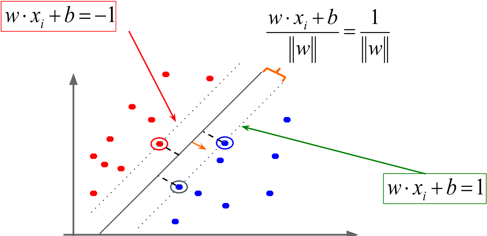
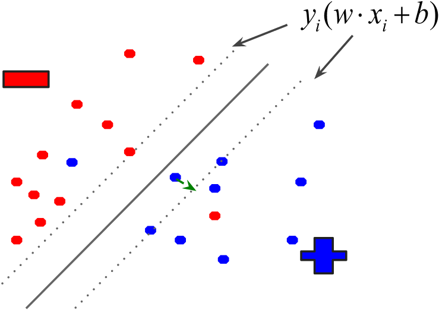
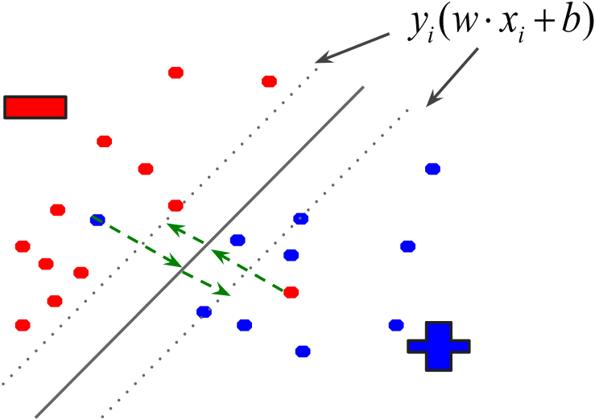
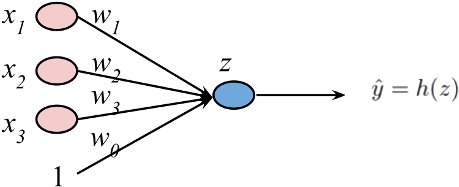
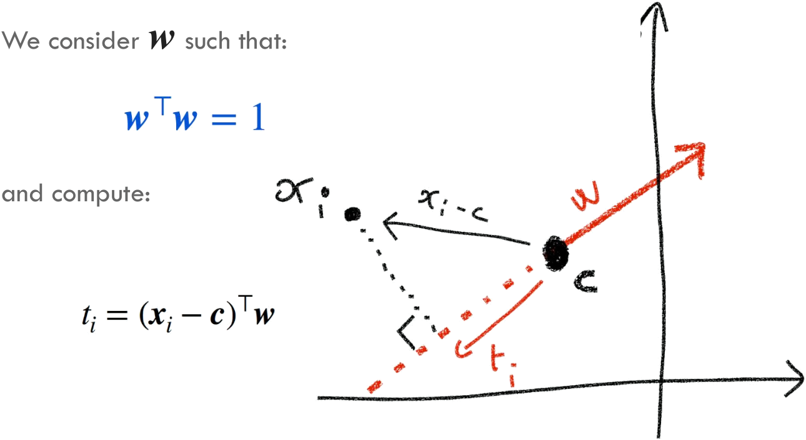

# Introduction to Machine Learning  --  Formulas

|      |          |          |
| ---- | ------: | ------- |
| Machine Learning | prof. Elisa Ricci<br />UniTN, 2021/22 | Formulas |

[TOC]


# All the formulas of the course

## Learning process

### Error function

- **Pointwise loss $\,l(f,z)$**

$$
\begin{align}
E(f,p_{\rm data})\ &=\ 𝔼_{z\sim p_{\rm data}}[l(f,z)]\\[8px]
E(f,{\cal D}_n)\ &=\ \dfrac1n\displaystyle\sum_{i=1}^nl(f,z_i)
\end{align}
$$

> <u>Notation</u>  (**Expected value**)
> $$
> 𝔼[X]= μ=\sum_{i}x_iP(x_i)
> $$


### Regularization

> **<u>Regularization</u>**: modification of the training error function with a term $\Omega(f)$ that penalizes complex solutions
> $$
> E_{\rm reg}(f,{\cal D}_n)=E(f,{\cal D}_n) + \lambda_n\Omega(f)
> $$
>
> - $\Omega(f)\,$:  regularization term
> - $\lambda_n\,$:  trade-off hyper parameter


### Objectives

|                         Ideal target                         |                       Feasible target                        |                        Actual target                         |
| :----------------------------------------------------------: | :----------------------------------------------------------: | :----------------------------------------------------------: |
|  |  |  |
| $\displaystyle f^*∈\arg\min_{f∈\cal F_{\rm task}} E(f,p_{\rm data})$ | $\displaystyle f^*_{\cal H}∈\arg\min_{\ f∈{\cal H}\ } E(f,p_{\rm data})$ | $\displaystyle f^*_{{\cal D}_n}∈\arg\min_{\ f∈{\cal H}\ }E(f,{\cal D}_n)$ |


## Distance measures

### Minkowski distance

Generalization of Euclidean distance
$$
D(a,b)=\left(\sum_{k=1}^{p}|a_k-b_k|^r\right)^{1/r}
$$

- $p\ $:  **dimensions**
- $r\ $:  **parameter** (could be a hyper-parameter)
  - $r = 1:$  **Manhattan** (L1-norm, city block, taxi)
  - $r = 2:$  **Euclidean** (L2-norm)
  - $r →\infin:$  **supremum** (L$∞$-norm) distance
    - **Maximum difference** between any component of the vectors


### Cosine similarity


$$
S_C(a,b)=\cos(θ)=\frac{a·b}{\lVert a\rVert·\lVert b\rVert}=\frac{\sum_{k=1}^{p}a_{k}·b_{k}}{\sqrt{\sum_{k=1}^{p}a_{k}^2}·\sqrt{\sum_{k=1}^{p}b_{k}^2}}\\[8px]
D(a,b)=1-S_C(a,b)
$$

- $\lVert a\rVert\,$:  **length** of vector $a$


### Standardization & Scaling

Make **not comparable** features **equally important**

> <u>Formula</u>  (**Standardization / Z-score normalization**)
>
> Rescale the data so that the mean ($μ$) is $0$ and the standard deviation from the mean (standard score $σ$) is $1$
> $$
> x_{\rm norm}=\frac{x-μ}{σ}
> $$

> <u>Formula</u>  (**Min-Max scaling**)
>
> Scale the data to a fixed range between $0$ and $1$
> $$
> x_{\rm norm}=\frac{x-x_\min}{x_\max-x_\min}
> $$


## Linear model

### Hyperplane

$$
w^Tx+b=\sum_{i=1}^{n}w_if_i+b=0
$$

- $n\,\ $: dimensions
- $w\,$: **weight vector** of $n$ weights $w_i$
- $b\,\ $: **bias** parameter


### Perceptron update

```pseudocode
loop until convergence or for some_number_of_iterations:
    foreach training_example {[f1, f2, ..., fn], label}:
        prediction = b + Σ wj * fj   /* check if it is correct based on the current model  */
        if prediction * label <= 0:  /* if prediction is incorrect, update all the weights */
            foreach wj: wj += fj * label
            b += label
```


## Loss functions

### Notation

> <u>Notations</u>
>
> - **Indicator function**: turns True and False answers into numbers/counts
>   $$
>   1[x]=\begin{cases} 
>         1 & x={\rm True} \\ 
>         0 & x={\rm False}
>      \end{cases}
>   $$
>
> - **Vector notation**: represents an example $f_1, f_2, …, f_m$ as a single vector $x$
>
>   - $x_i$ subscript will indicate **examples** indexing over a dataset
>   - $x_j$ subscript will indicate **feature** indexing
>
> - **Vector dot-product**: between two vectors $a$ and $b$
>   $$
>   a·b=\sum_{j=1}^{m}a_jb_j
>   $$


### Surrogate loss functions

> **<u>Surrogate loss function</u>**: loss function that provides an upper bound on the actual loss function

- **0/1 loss**: $\qquad\ l(y,y')=1[yy'≤0]$
- **Hinge**: $\qquad\quad l(y,y')=\max(0,1-yy')$
  - SVM

- **Exponential**: $\ \ l(y,y')=\exp(-yy')$
- **Squared loss**: $\,l(y,y')=(y-y')^2$
  - Regression, classification


### Linear model definition

1. <u>Model</u>
   $$
   0=b+\sum_{i=1}^{n}w_if_i
   $$

2. <u>Objective function</u>
   $$
   \sum {\rm loss}(yy')+\lambda\, r(w,b)
   $$

3. <u>Learning algorithm</u>
   $$
   {\rm argmin}_{w,b} \sum {\rm loss}(yy')+\lambda\, r(w,b)
   $$

   - Find $w$ and $b$ that **minimize the (surrogate) loss**


## Gradient descent

### Finding the minimum

> <u>Procedure</u>  (**Gradient descent**)
>
> 1. Pick a starting point $w$
>
> 2. Repeat until loss doesn’t decrease in any dimension
>
>    1. Pick a dimension
>
>    2. Move a small amount in that dimension towards decreasing loss
>
>    3. Update the parameters according to the graph
>
>    $$
>    w_j\ -\!=\eta\,\frac{d}{dw_j}{\rm loss}(w)
>    $$

- Partial derivatives gives the **slope** (~~i.e.~~ direction to move) in that dimension


### Maths

$$
\begin{align}
\frac{d}{d w_{j}} \text {loss}(w)\ &=\frac{d}{d w_{j}} \sum_{i=1}^{n} \exp(-y_{i}(w \cdot x_{i}+b))\\
&=\sum_{i=1}^{n} \exp(-y_{i}(w \cdot x_{i}+b)) \frac{d}{d w_{j}}-y_{i}(w \cdot x_{i}+b)
\\[8px]
-\frac{d}{d w_{j}} y_{i}\left(w \cdot x_{i}+b\right)\ &=-\frac{d}{d w_{j}} y_{i}\left(\sum_{j=1}^{m} w_{j} x_{i j}+b\right)\\
&=-\frac{d}{d w_{j}} y_{i}(w_{1} x_{i 1}+w_{2} x_{i 2}+\ldots+w_{m} x_{i m}+b)\\
&=-\frac{d}{d w_{j}} y_{i} (w_{1} x_{i 1}+y_{i} w_{2} x_{i 2}+\ldots+y_{i} w_{m} x_{i m}+y_{i} b)\\
&=-y_{i} x_{i j}
\\[8px]
\frac{d}{d w_{j}} \text {loss}(w)\ &=\frac{d}{d w_{j}} \sum_{i=1}^{n} \exp (-y_{i}(w \cdot x_{i}+b))\\
&=\sum_{i=1}^{n} \exp (-y_{i}(w \cdot x_{i}+b)) \frac{d}{d w_{j}}-y_{i}(w \cdot x_{i}+b)\\
&=\sum_{i=1}^{n}-y_{i} x_{i j} \exp (-y_{i}(w \cdot x_{i}+b))
\end{align}
$$


### Exponential update

- **Gradient descent**

$$
w_j\ -\!=\eta\,\frac{d}{dw_j}{\rm loss}(w)\quad⇒\quad w_j\ +\!=\eta\sum_{i=1}^{n}y_ix_{ij}\exp(-y_i(w·x_i+b))
$$

- **Stochastic gradient descent**: for each example $x_i$ (randomly selected)


$$
w_j\,\ +\!=\ \eta\ \underbrace{\ y_ix_{ij} \ }_{\substack{\rm direction \\\rm to\ update}} \underbrace{\ \exp(-y_i(w·x_i+b))\ }_{\substack{\rm how\ far \\\rm from\ wrong}}\\
c=\eta\,\exp(-y_i(w·x_i+b)) \quad⇒\quad  w_j\,+\!=y_ix_{ij}\,c
$$


### Gradient

> **<u>Gradient</u>**: vector of partial derivatives of the loss w.r.t. to all the coordinates of the weights
> $$
> \nabla\!_w L=\left[\frac{\partial L}{\partial w_{1}}\ \frac{\partial L}{\partial w_{2}} \cdots \frac{\partial L}{\partial w_{N}}\right]
> $$


## Regularizers

### Regularization

> <u>Definition</u>  (**Regularizer**)
>
> Additional criterion to the loss function to avoid overfitting
> $$
> \operatorname{argmin}_{w, b} \sum_{i=1}^{n} \operatorname{loss}(y y^{\prime})+\lambda\, r(w, b)
> $$
> Bias on the model that forces the learning to prefer certain types of weights over others

> <u>Definition</u>  (**Regularization**)
>
> Modification of the training error function with a term **$\Omega(f)$** that penalizes complex solutions
> $$
> E_{\mathrm{reg}}\left(f, {\cal D}_{n}\right)=E(f, {\cal D}_{n})+\lambda_{n} \Omega(f)
> $$
>
> - $\Omega(f)\,$:  regularization term
> - $\lambda_n\,$:  trade-off hyper parameter


### Common regularizers

$$
\operatorname{argmin}_{w, b} \sum_{i=1}^{n} \operatorname{loss}(y y^{\prime})+\lambda \ r(w, b)
$$

- **L1-norm**:  $r(w,b)=\sum|w_j|$
  - Sum of weights **penalize small values** more
- **L2-norm**:  $r(w,b)=\sqrt{\sum |w_j|^2}$
  - Squared weights **penalizes large values** more
- **Lp-norm**:  $r(w,b)=\sqrt[p]{\sum |w_j|^p}=\lVert w\rVert_p$
  - $p≥1$ leads to **convex functions**
  - $p < 2$ **encourage sparser vectors** (lots of 0 weights)
  - $p > 2$ **discourage large weights** more and tends to like **similar weights**

> <u>Notation</u>  (**p-norm**)
> $$
> \lVert x\rVert_p\ :=\ \sqrt[p]{\textstyle \sum |x|^p}
> $$


### Exponential loss + L2-norm

1. <u>Model</u>
   $$
   0=b+\sum_{i=1}^{n}w_if_i
   $$

2. <u>Objective function</u>
   $$
   \sum_{i=1}^{n}\exp(-y_i·(w·x_i+b))+\frac \lambda 2\lVert w\rVert_2
   $$

3. <u>Learning algorithm</u>
   $$
   {\rm argmin}_{w,b} \sum_{i=1}^{n}\exp(-y_i·(w·x_i+b))+\frac \lambda 2\lVert w\rVert_2
   $$


### GD Maths

$$
w_j\ -\!=\eta\,\frac{d}{dw_j}({\rm loss}(w)+\lambda\,r(w,b))
$$

$$
\begin{align}
\frac{d}{dw_j}{\rm objective}(w,b)&=\frac{d}{dw_j}({\rm loss}(w)+\lambda\,r(w,b))\\&=
\frac{d}{dw_j}\sum_{i=1}^{n}\exp(-y_i·(w·x_i+b))+\frac \lambda 2\lVert w\rVert_2\\&\dots\\&=-\sum_{i=1}^{n}y_ix_{ij}\exp(-y_i·(w·x_i+b))+\lambda w_j
\end{align}
$$


### L2 update

$$
w_j\ -\!=\eta\,\frac{d}{dw_j}({\rm loss}(w)+\lambda\,r(w,b))
$$

- <u>Gradient Descent</u>
  $$
  w_j\ +\!=\eta\sum_{i=1}^{n}y_ix_{ij}\exp(-y_i·(w·x_i+b))-\eta\lambda w_j
  $$

- <u>Stochastic Gradient Descent</u>
  $$
  w_j\ +\!= \eta\  \underbrace{\ y_ix_{ij}\ }_{\substack{\rm direction \\\rm to\ update}}\ \ \underbrace{\ \exp(-y_i(w·x_i+b))\ }_{\substack{\rm how\ far \\\rm from\ wrong}}\ -\!\!\!\underbrace{\, \eta\lambda w_j\, }_{\rm regularization}
  $$


### L1 update

$$
{\rm argmin}_{w,b} \sum_{i=1}^{n}\exp(-y_i·(w·x_i+b))+\lambda\lVert w\rVert\\
\frac{d}{dw_j}\sum_{i=1}^{n}\exp(-y_i·(w·x_i+b))+\lambda\lVert w\rVert=-\sum_{i=1}^{n}y_ix_{ij}\exp(-y_i·(w·x_i+b))+\lambda\, {\rm sign}(w_j)\\[8px]
w_j\ +\!=\eta\, y_ix_{ij}\exp(-y_i·(w·x_i+b))-\eta\,\lambda\, {\rm sign}(w_j)\\[8px]
$$


### p-norm update

- **L1**:   $w_j\ +\!=\eta\,({\rm lossCorrection}-\lambda\, {\rm sign}(w_j))$
- **L2**:   $w_j\ +\!=\eta\,({\rm lossCorrection}-\lambda w_j)$
- **Lp**:   $w_j\ +\!=\eta\,({\rm lossCorrection}-\lambda cw_j^{p-1})$


## Support Vectors Machines

### Measuring the margin

> **<u>Margin</u>**: distance to the support vectors on either side of the hyperplane that corresponds to $\cfrac 1 {\Vert w\Vert}$




### Maximizing the margin

$$
{\rm max}_{w,b}\ {\rm margin}(w,b)\ ≡\ {\rm max}_{w,b}\,\frac1{\Vert w\Vert}\ ≡\ {\rm min}_{w,b}\,\Vert w\Vert \\[4px]
\text{subject to: }\ \ y_i(w·x_i+b)≥1\ \ \ ∀i
$$

- ***Constrained optimization problem***


### Primal SVM problem

$$
{\rm min}_{w,b}\,\Vert w\Vert_2 \\[4px]
{\rm s.t.}\ \ \ y_i(w·x_i+b)≥1\ \ \ ∀i
$$

- ***Quadratic optimization problem***


## Soft margin classification

### Slack variables

$$
{\rm min}_{w,b}\,\Vert w\Vert_2+C\textstyle\sum_i\varsigma_i \\[4px]
{\rm s.t.}\ \ \ y_i(w·x_i+b)\, ≥\, 1-\varsigma_i\ ∧\ ς_i≥0\ \ \ ∀i
$$

- ***Quadratic optimization problem***


### Slack values

$$
y_i(w·x_i+b)\, ≥\, 1-\varsigma_i\quad ∧\quad ς_i≥0\qquad ∀i
$$

|                                 |                    Outside/On the margin                     |               Within the margin                |      |
| :-----------------------------: | :----------------------------------------------------------: | :--------------------------------------------: | ---- |
|  **Correctly<br />classified**  |           $ς_i=0$<br />$y_i(w·x_i+b) ≥ 1$  already           | $ς_i=1-y_i(w·x_i+b)$<br />distance from margin |      |
| **Incorrectly<br />classified** | $ς_i=1-y_i(w·x_i+b)$<br />dist from hyperplane ($-y_i(w·x_i+b)$)<br />+ dist from margin ($1$) |         Same as outside/on the margin          |      |

$$
ς_i=\begin{cases}
0 &\ y_i(w·x_i+b)≥1\\[2px]
1-y_i(w·x_i+b) &\ \rm otherwise
\end{cases}\\[8px]
ς_i=\max(0,\,1-y_i(w·x_i+b))=\max(0,\,1-yy')={\rm loss}_{\rm hinge}(y,y')\\[-10px] \
$$

    


### Removing constraints

$$
{\rm min}_{w,b}\,\Vert w\Vert_2+C\textstyle\sum_i\varsigma_i \\[4px]
{\rm s.t.}\ \ \ y_i(w·x_i+b)\, ≥\, 1-\varsigma_i\ ∧\ ς_i≥0\ \ \ ∀i\\[8px] {\rm min}_{w,b}\,\Vert w\Vert_2+C\textstyle\sum_i\max(0,\,1-y_i(w·x_i+b))=\\={\rm min}_{w,b}\,\Vert w\Vert_2+C\textstyle\sum_i{\rm loss}_{\rm hinge}(y,y')
$$

- ***Unconstrained problem***


## Non linearly separable data

### Dual problem

$$
{\rm max}_α\sum_i α_i-\frac12\sum_i\sum_jα_iα_jy_iy_jx^T_ix_j\\[4px]
{\rm s.t.}\ \ \ \sum_iα_iy_i=0,\ α_i≥0,\ ∀i
$$


#### Soft margin

$$
{\rm max}_α\sum_i α_i-\frac12\sum_i\sum_jα_iα_jy_iy_jx^T_ix_j\\[4px]
{\rm s.t.}\ \ \ \sum_iα_iy_i=0,\ 0≤α_i≤C,\ ∀i
$$


### Solution

- **Solution to the primal** (given a solution $α_1\dotsα_n$ to the dual problem)
  $$
  w=\sum_iα_iy_ix_i\qquad\
  b=y_j-\sum_iα_iy_ix_i^Tx_j
  $$

- **Classifying function**
  $$
  f(x_j)=w^Tx_j+b=\sum_iα_iy_ix_i^Tx_j+b
  $$


### Kernel trick

$$
K(x_i,x_j)=x_i^Tx_j \quad⇒\quad  K'(x_i,x_j)= φ(x_i)^Tφ(x_j)
$$

---

> <u>Example</u>  (**Polinomial kernel**)
>
> - <u>Data</u>
>   - 2-dimensional vectors $x=[x_1,\ x_2]$
>   - Let  $K(x_i,x_j)=(1 + x_i^Tx_j)^2$
>     - **Polinomial kernel**
> - <u>Task</u>: show that  $K(x_i,x_j)= φ(x_i)^Tφ(x_j)$
>
> $$
> K(x_i,x_j)=(1 + x_i^Tx_j)^2= 1+ x_{i1}^2x_{j1}^2 + 2 x_{i1}x_{j1} x_{i2}x_{j2}+ x_{i2}^2x_{j2}^2 + 2x_{i1}x_{j1} + 2x_{i2}x_{j2}=\\
> = [1 x_{i1}^2 √2 x_{i1}x_{i2} x_{i2}^2 √2x_{i1} √2x_{i2}]^T [1 x_{j1}^2 √2 x_{j1}x_{j2} x_{j2}^2 √2x_{j1} √2x_{j2}] =\\
> = φ(x_i)^Tφ(x_j),\ \ \ {\rm where}\ \ φ(x) = [1,\ x_1^2,\ √2 x_1x_2,\ x_2^2,\ √2x_1,\ √2x_2]
> $$


### Types of kernels

- **Linear** 										  			 $K(x_i,x_j)= x_i^Tx_j$
- **Polynomial** of power $p$ 		   		 $K(x_i,x_j)= (1+ x_i^Tx_j)^p$
- **Gaussian** (radial-basis function)   $K(x_i,x_j) =e^{-\frac{\Vert x_i-x_j\Vert^2}{2σ^2}}$
  - Mapping $\,\Phi: x → φ(x)$, where $φ(x)$ is **infinite-dimensional**


### Non linear SVM problem

- <u>Dual problem formulation</u>
  $$
  {\rm max}_α\sum_i α_i-\frac12\sum_i\sum_jα_iα_jy_iy_jK(x_i,x_j)\\[4px]
  {\rm s.t.}\ \ \ \sum_iα_iy_i=0,\ α_i≥0,\ ∀i
  $$

- <u>Solution</u>
  $$
  f(x)=\sum_iα_iy_iK(x_i,x)+b
  $$


## Ranking

### $\boldsymbol ω$-ranking

> <u>Task</u>  (**$ω$-ranking**)
>
> - <u>Given</u>
>
>   - Input space $\cal X$
>
>   - Unknown distribution $\cal D$ over ${\cal X}×\Sigma_M$
>   - Training set $D$ sampled from $\cal D$
>
> - <u>Compute</u>
>
>   - Function $f:{\cal X}→\Sigma_M$ minimizing
>     $$
>     \mathbb{E}_{(x, \sigma) \sim \mathcal{D}}\left[\sum_{u \neq v}\left[\sigma_{u}<\sigma_{v}\right]\left[\hat{\sigma}_{v}<\hat{\sigma}_{u}\right]\ \omega(\sigma_{u}, \sigma_{v})\right]
>     $$
>
>     - Where $\hat{\sigma}=f(x)$
>
> - <u>Loss</u>
>
>   - If the true ranking $σ$ prefers $u$ to $v$, but the predicted ranking $\hat{\sigma}$ prefers $v$ to $u$, then the cost is $ω(σ_u, σ_v)$


## Decision Trees

### Learning algorithm

- <u>Given</u>: training set ${\cal D}_{n}=\left\{z_{1}, \ldots, z_{n}\right\}$

- <u>Objective</u>: find $f_{t^*}$, where
  $$
  t^*∈\arg\,\min_{t∈\cal T}E(f_t,{\cal D}_n)
  $$

  - $\cal T$: set of decision trees

- <u>Assumption</u>
  $$
  E\left(f_{t}, {\cal D}\right)=\frac{1}{|{\cal D}|} \sum_{z \in {\cal D}} l(f, z)
  $$


### Growing a leaf

> **<u>Optimal leaf predictor</u>**: function that minimizes the error on a set

> <u>Definition</u>  (**Imputity** $I({\cal D})$ of a set ${\cal D}$ w.r.t. label $y'$)
>
> - <u>Given</u> a set of examples ${\cal D}$ and a label $y'$ to test
>
> - <u>Value</u>: the percentage of examples $(x,y)\in {\cal D}$ that aren't labeled with $y'$
>   $$
>   I({\cal D})=\frac {|\set{(x,y)\in {\cal D}:y\ne y'}|}{|{\cal D}|}
>   $$

- Optimal **leaf predictor**
  $$
  h^*∈\arg\,\min_{h∈{\cal H}_{\rm leaf}}E(h,{\cal D})
  $$

- Optimal **error value** (impurity measure)
  $$
  I({\cal D})=E(h_{\cal D}^*,{\cal D})
  $$


### Growing a node

> <u>Definition</u>  (**Impurity $I_\phi({\cal D})$ of a split function $\phi$**)
>
> Lowest training error attainable by a tree consisting of a root and two leaves, computed in terms of the impurity of the split data
> $$
> I_{\phi}({\cal D})=\sum_{d \in\{L, R\}} \frac{\left|{\cal D}_{d}^{\phi}\right|}{|{\cal D}|}\ I({\cal D}_{d}^{\phi})\\
> $$

- Find an optimal **split function**
  $$
  \phi_{\cal D}^*∈ \arg\,\min_{\phi ∈\Phi}I_\phi({\cal D})
  $$


### Growing in a nutshell

$$
{\tt Grow}({\cal D})= \begin{cases}
{\tt Leaf}\left(h_{{\cal D}}^{*}\right) & \text { if stopping criterion met } \\
{\tt Node}\left(\phi_{{\cal D}}^{*},\ {\tt Grow}\left({\cal D}_L^{*}\right),\ {\tt Grow}\left({\cal D}_{R}^{*}\right) \right) & \text { otherwise }\end{cases}\\[8px]
{\rm where}\quad {\cal D}_{d}^{*}=\left\{(x, y) \in {\cal D},\ \phi_{{\cal D}}^{*}(x)=d\right\}
$$


### Split selection

- **Reduction of impurity**, equivalent to **information gain**, induced by the split


$$
\Delta_{\phi}({\cal D})=I({\cal D})-I_{\phi}({\cal D})
$$


### Impurity measures for classification

- <u>Let</u>:  ${\cal D}^y=\set{(x,y')∈{\cal D}:y'=y}$ denotes the subset of **training samples** in $\cal D$ with class **label $y$**

- <u>Consider</u>: **error function**
  $$
  E(f , {\cal D})=\frac{1}{|{\cal D}|} \sum_{z \in {\cal D}} l(f, z)
  $$

- **Impurity measure** defined as **classification error**
  $$
  l(f,(x,y))={\rm loss}_{01}(f, z)\ ∧\ {\cal H}_{\rm leaf}=\bigcup_{y∈ \cal Y}\set{y}^{\cal X}\quad⇒\quad
  I({\cal  D})=1-\frac{\max_{y∈ \cal Y}|{\cal D}^y|}{|{\cal D}|}
  $$


## Neural Networks

### Feed-forward Neural Networks

#### Perceptron


$$
\hat{y}=h\left(\sum_{i} w_{i} x_{i}+w_{0}\right)=h\left(w^{T} x+w_{0}\right)
$$


#### Simplified model


$$
z=\sum_{i} w_{i} x_{i}+w_{0}
$$


#### Multiple outputs


$$
z_j=\sum_{i} w_{i,j} x_{i}+w_{0,j}
$$


#### Single layer neural network


$$
z_{j}=\sum_{i} w_{i, j}^{(1)} x_{i}+w_{0, j}^{(1)} \\
\hat{y}_{k}=f\left(\sum_{i} w_{i, k}^{(2)}\ h\left(z_{i}\right)+w_{0, k}^{(2)}\right)
$$


### Softmax

- Convert **outputs into normalized probabilities**
  $$
  S(l_i)=\frac{e^{l_i}}{\sum_{k}e^{l_k}}
  $$

  - $l_i\,$:  **scores (logits)**
  - $k\ $:  **number of classes**


### Cross entropy loss

$$
{\cal L}_i=-\sum_{k}^{}y_k\log(S(l_k))=-\log(S(l))
$$


### Backpropagation update

- **First layer**
  $$
  w_{ij}^{(1)}\ -\!=\ \eta\frac{∂L}{∂\,w_{ij}^{(1)}}\ =\ \eta\,\delta_j\, z_i
  $$


### Step 1: Feedforward operation


### Step 2: Compute error and train (output layer)

- **Error** of the network on a **training set**
  $$
  L(x, w)=\frac{1}{2}\sum_{i=1}^{N} \left(y_{i}-\hat{y}\left(x_{i}, w\right)\right)^{2}
  $$

- **Simple linear model** for output  $\hat{y}_i=\sum_{j} w_{j} x_{i j}$
  $$
  \frac{\partial L\left(x_{i}\right)}{\partial\, w_{j}}=\underbrace{\left(\hat{y}_{i}-y_{i}\right)}_{\text {error }}\ x_{i j}
  $$


### Step 3: Backpropagation (hidden layers)

- General **unit activation** in a multilayer network

  

- **Forward propagation**: calculate for **each unit  $a_t=\sum_{j}w_{jt}z_j$**
  $$
  \frac{\partial L}{\partial w_{j t}}=\frac{\partial L}{\partial a_{t}} \frac{\partial a_{t}}{\partial w_{j t}}=\underbrace{\frac{\partial L}{\partial a_{t}}}_{δ_t} z_{j}={δ_t} z_{j}
  $$

- <u>Value</u>: **local gradient $\delta_t$**

  - <u>Output units</u> with **linear activation**
    $$
    δ_t=\hat y-y
    $$

  - <u>Hidden units</u>

    - **Unit $t$ sends output to units $S$**
    - $\delta_t$ is computed **recursively** using $\delta_s$ of the **following layer**

    $$
    δ_t\ =\,\sum_{s\in S}\frac{\partial L}{\partial a_s} \frac{\partial a_s}{\partial a_t}\ =\ h'(a_t)\sum_{s\in S}w_{ts}δ_s\qquad\qquad a_s=\sum_{j:j→s}w_{js}h(a_j)
    $$


### Training with GD

#### Batch Gradient Descent (BGD)


#### Stochastic gradient descent (SGD)


#### Momentum (SGD)


### Convolution

$$
S(i, j)=(I · K)(i, j)=\sum_{m} \sum_{n} I(m, n)\ K(i-m,\ j-n)
$$


### Recurrent Neural Network


## Dimensionality reduction

### Variance along unit direction $w$

- <u>Given</u> (in an $n$-dimensional space)

  - **Training set** containing **points $x_i$**
  - **Auxiliary point $c$**
  - **Unit direction: vector $w$** starting in $c$ s.t. $w^Tw=1$

- <u>Let</u>

  - **Projection $t_i$** of vector $x_i-c$ on vector $w$
    $$
    t_i=(x_i-c)^Tw
    $$

  - **Set $t$ of projections**
    $$
    t=\set{t_i\ :\ t_i=(x_i-c)^Tw,\ \forall x_i∈{\cal D}}
    $$

  - **Vector $\bar X$ of distances from mean**  $\bar x_i=x_i-\bar x$
    $$
    \bar X=[\,\bar x_1,\ \bar x_1,\ ...,\ \bar x_n\, ]
    $$

    - **Centering data points**

- <u>Calculate</u>: **expectation** (mean) and **variance** of set of vectors $t$
  $$
  \begin{aligned}
  E[t]\ &=\ \frac1n\sum_{i=1}^{n}t_i\\& =\ \frac1n\sum_{i=1}^{n}(x_i-c)^Tw\\[4px]& =\ \bar x^Tw-c^Tw\\[44px] \
  \end{aligned}
  \qquad
  \begin{aligned}
  {\rm Var}[t]\ & =\ \frac1n\sum_{i=1}^{n}(t_i-E[t])^2=
  \\& =\ \frac1n\sum_{i=1}^{n}\left((x_i-\bar x)^Tw\right)^2=
  \\& =\ \frac1n\sum_{i=1}^{n}(\,\bar x_i^Tw)^2=
  \\& =\ w^T\left[\frac1n\bar X\,\bar X^{T}\right]w=
  \\[4px]& =\ w^TCw
  \end{aligned}
  $$

  - <u>Where</u>:  $C=\left[\frac1n\bar X\,\bar X^{T}\right]$ is the **covariance matrix**
  - <u>Note</u>: variance do not use $c$

- <u>Objective</u>: find **vector $w$** that **maximize the variance**
  $$
  w \in \arg\max \set{w^T C w\ :\ w^T w=1}
  $$



### Eigenvalue Decomposition

> <u>Procedure</u>  (**Eigenvalue Decomposition**)
>
> - <u>Given</u>: symmetric matrix $A∈ℝ^{m×m}$
>
> - <u>Objective</u>: decompose $A$ in $U\Lambda U^T$, so that it's written in terms of its eigs
>   $$
>   \exist\quad U=[u_1,\,...,\,u_m]∈ℝ^{m×m},\ \ \Lambda=(λ_1,\,...,\,λ_m)∈ℝ^m\,:\,\lambda_1\ge\dots\ge\lambda_m\\
>   {\rm s.t.}\quad A=U\Lambda U^T=\sum_{j=1}^{m}λ_ju_ju_j^T\ \ ∧\ \ U^TU=UU^T=I\\
>   $$
>
> - <u>Where</u>
>
>   - $I\,$:  identity matrix
>   - $u_j\,$:  eigenvector
>   - $\lambda_j\,$:  corresponding eigenvalue
>   - $U\,$:  matrix containing eigenvectors in columns
>   - $\Lambda\,$:  diagonal matrix of eigenvalues
>
>   $$
>   U=\begin{bmatrix} 
>      \, u_1 & \cdots & u_n\,
>    \end{bmatrix}\qquad \Lambda=\begin{bmatrix}
>      λ_1 & \cdots & 0 \\ 
>      \vdots& \ddots & \vdots \\[4px]
>      0 & \cdots & λ_n
>    \end{bmatrix}
>   $$


### Principal Components

- **First Principal Component**

$$
{w}_{1} \in \arg\max \set{\,\underbrace{\,w^T C w\,}_{\mathclap{\text{variance along }w}}\ :\ w^T w=1\,}
$$

- **Second Principal Component**

$$
w_2 \in \arg\max \{w^T C w\ :\ w^T w=1,\ w\perp w_1\}
$$

- **$i$-th Principal Component**

$$
w_i \in \arg \max \left\{w^T C w\ :\ w^T w=1,\ w \perp w_j,\ ∀\ 1 \leq j<i\right\}
$$


### Singular Value Decomposition (SVD)

> <u>Procedure</u>  (**Singular Value Decomposition**)
>
> - <u>Given</u>: $A∈\R^{m×n}$
>
> - <u>Objective</u>: decompose generic matrix $A$ in $UsV^T$
>   $$
>   \exist\quad U∈\R^{m×k},\ \ s∈\R^k\,:\,s_1\ge\dots\ge s_k\ge0,\ \ V∈\R^{n×k}\\
>   {\rm s.t.}\quad A=UsV^T\ \and\ U^TU=V^TV=I
>   $$
>
> - <u>Where</u>
>
>   - $I\,$:  identity matrix
>
>   - $U\,$:  matrix containing eigenvectors in columns
>
>   - $s\,$:  diagonal matrix of eigenvalues
>
>   $$
>   U=\begin{bmatrix} 
>      \, u_1 & \cdots & u_n\,
>    \end{bmatrix}\qquad s=\begin{bmatrix}
>      s_1 & \cdots & 0 \\ 
>      \vdots& \ddots & \vdots \\[4px]
>      0 & \cdots & s_n
>    \end{bmatrix}
>   $$


### Dimensionality reduction using PCA

- <u>Let</u>: $\hat W=[w_1,...,w_k]$ holds the **first $k$ PCs** derived from centered data points $\bar X=[\,\bar x_1,..., \bar x_n]$

- Change to **reduced coordinate system** with the **$k$ PCs as axis**
  $$
  T=\hat W^T\bar X\in\R^{k×n}
  $$


### Number of principal components

> <u>Formula</u>  (**Cumulative proportion of explained variance**)
>
> - <u>Task</u>: reduce dimensions from $n$ to $k$
>
> - <u>Objective</u>: estimate the amount of information loss
>
> - <u>Formula</u>  (**FPC, ED**)
>
>   1. Compute the cumulative variance explained by the first $k$ eigenvalues/variances $\sum_{j=1}^{k}\lambda_j$
>   2. Normalize the cumulative variance dividing it by the sum of all the variances $\sum_{j=1}^{m}C_{jj}\,$
>
>   $$
>   \frac{\sum_{j=1}^{k}\lambda_j}{\sum_{j=1}^{m}C_{jj}}
>   $$
>
> - <u>Formula</u>  (**FPC, SVD**)
>   $$
>   \frac{\sum_{j=1}^{k}s_j^2}{\sum_{ij}\bar X_{ij}^2}
>   $$


## Clustering

### k-means clustering

- **Minimize the variation** between each **point** and the **centroid** of the cluster


$$
\min _{{\cal C}_{1}, ..., {\cal C}_{k}} \sum_{j=1}^{k} V\left({\cal C}_{j}\right)
$$

- **Variation** (squared distances)


$$
V\left({\cal C}_{j}\right)=\sum_{i \in {\cal C}_{j}}\left\|{x}_{i}-{\mu}_{j}\right\|^{2}
$$

- **Centroid**

$$
\mu_{j}=\frac{1}{\left|{\cal C}_{j}\right|} \sum_{i \in {\cal C}_{j}} {x}_{i}
$$


### Create a graph

- **Gaussian kernel** to compute a **similarity matrix**

$$
W(i,j)=\exp\frac{-|x_i-x_j|^2}{σ^2}
$$


### Graph terminology

- **Degree of a node**
  $$
  d_i=\sum_{j}w_{i,j}
  $$

- **Volume of a set**
  $$
  {\rm vol}(A)=\sum_{i∈A}d_i\quad\quad A⊆V
  $$


### Normalized cut

- <u>Objective</u>: **minimize**
  $$
  {\rm NCut}(A, B) = \frac{{\rm Cut}(A, B)}{V(A)} + \frac{{\rm Cut}(A, B)}{V(B)}
  $$


## Variational AutoEncoders

### Deep Generative Models -- Objective


$$
q^* ∈ \arg\, \min_{q∈\cal H}\, d(p_{\rm data}, q)
$$


### Decoder objective

> <u>Objective</u>  (**Decoder**)
> $$
> q_\theta(x)=𝔼_{\omega\sim p_\omega}[\,q_\theta(x\,|\, \omega)\,]\\[4px]
> \theta^*\!\in\arg\,\min_{\theta∈\Theta}\,d_{KL}(q_\theta,\, p_{\rm data})
> $$

> <u>Formula</u>  (**KL--divergence**)
> $$
> d_{KL}(p,q)=𝔼_{x\sim p}\left[\log\frac{p(x)}{q(x)}\right]
> $$


### Intractable objective

$$
\begin{aligned}
d_{{\rm KL}}\left(p_{\text {data }}, q_{\theta}\right)\ &=\ \mathbb{E}_{x \sim p_{\text {data }}}\left[\log \frac{p_{\text {data }}(x)}{q_{\theta}(x)}\right] \\[4px]
&=\ -\mathbb{E}_{x \sim p_{\text {data }}}\big[\,\underbrace{\log \mathbb{E}_{\omega \sim p_{\omega}}\left[q_{\theta}(x\,|\, \omega)\right]}_\text {intractable}\,\big] + \text {const} \\[16px]

\log \mathbb{E}_{\omega \sim p_{\omega}}\left[q_{\theta}(x\, |\, \omega)\right]

\ &≥\ \underbrace{\mathbb{E}_{\omega \sim q_{\psi}(\,\cdot\, |\, x)}\left[\,\log q_{\theta}(x\, |\, \omega)\,\right]}_{\rm reconstruction}-\underbrace{d_{\mathrm{KL}}\left(q_{\psi}(\,\cdot\, |\, x), p_{\omega}\right)}_{\rm regularizer}\\[16px]

d_{\mathrm{KL}}\left(p_{\text {data }}, q_{\theta}\right)\ &\leq\ \mathbb{E}_{x \sim p_{\text {data }}}\left[-\mathbb{E}_{\omega \sim q_{\psi}(\,\cdot\, |\, x)}\left[\log q_{\theta}(x\, |\,\omega)\right]+d_{\mathrm{KL}}\left(q_{\psi}(\,\cdot\, |\, x), p_{\omega}\right)\right]+\text { const }
\end{aligned}
$$


## Generative Adversarial Networks

- **Distribution $\,q_\theta∈\Delta ({\cal Z})^{\cal X}$**
  $$
  q_θ(x)=𝔼_{ω∼p_ω}\,δ\,[\,g_θ(ω)−x\,]
  $$

- <u>Objective</u>
  $$
  \theta^{*} \in \arg\, \min _{\theta}\, d_{\mathrm{JS}}\left(p_{\text {data}},\, q_{\theta}\right)
  $$


> <u>Formula</u>  (**Jensen-Shannon divergence**)
> $$
> d_{\mathrm{JS}}(p, q)=\frac{1}{2}\, d_{\mathrm{KL}}\left(p,\, \frac{p+q}{2}\right)+\frac{1}{2}\, d_{\mathrm{KL}}\left(q,\, \frac{p+q}{2}\right)
> $$


### Equivalent form of the JS divergence

$$
\begin{aligned}
d_{\mathrm{JS}}(p, q) &=\frac{1}{2} d_{\mathrm{KL}}\left(p, \frac{p+q}{2}\right)+\frac{1}{2} d_{\mathrm{KL}}\left(q, \frac{p+q}{2}\right) \\
&=\frac{1}{2} \mathbb{E}_{x \sim p}\left[\log \frac{p(x)}{p(x)+q(x)}\right]+\frac{1}{2} \mathbb{E}_{x \sim q}\left[\log \frac{q(x)}{p(x)+q(x)}\right]+\log (2) \\
&=\log (2)+\frac{1}{2} \max _{t}\left\{\mathbb{E}_{x \sim p}\left[\log t(x)\right]+\mathbb{E}_{x \sim q}\left[\log (1-t(x))\right]\right\}
\end{aligned}
$$

$$
{\rm where}\quad t(x)=\frac{p(x)}{p(x)+q(x)}\quad \and\quad 1-t(x)=\frac{q(x)}{p(x)+q(x)}
$$


### GAN objective

- **Lower bound** on the objective
  $$
  \begin{aligned}
  d_{\mathrm{JS}}\left(p_{\text {data}},\ q_{\theta}\right)\ &=\ \log (2)+\frac{1}{2} \max _{t}\left\{\,\mathbb{E}_{x \sim p_{\text {data}}}[\,\log t(x)\,]+\mathbb{E}_{x \sim q_{\theta}}[\,\log (1-t(x))\,]\,\right\}\\
  &\geq\ \log (2)+\frac{1}{2} \max \left\{\,\mathbb{E}_{x \sim p_{\text {data}}}\left[\,\log t_{\varphi}(x)\,\right]+\mathbb{E}_{x \sim q_{\theta}}\left[\,\log \left(1-t_{\varphi}(x)\right)\,\right]\,\right\}\\
  \end{aligned}
  $$

- <u>Objective</u>
  $$
  \mathbb{E}_{x \sim q_{\theta}}\left[\,\log \left(1-t_{\varphi}(x)\right)\,\right]
  \ =\ \mathbb{E}_{\omega \sim p_{\omega}}\left[\,\log \left(1-t_{\varphi}\left(g_{\theta}(\omega)\right)\right)\,\right]
  \\[4px]
  \theta^* \in\ \underset{\theta}{\operatorname{argmin}} \max _{\varphi}\big\{\underbrace{\mathbb{E}_{x \sim p_{\text {data}}}\left[\,\log t_{\varphi}(x)\,\right]}_\text{minimize classification error}+\ \underbrace{\mathbb{E}_{\omega \sim p_{\omega}}\left[\,\log \left(1-t_{\varphi}\left(g_{\theta}(\omega)\right)\right)\,\right]}_\text{minimize distinguishability}\,\big\}
  $$


