# LPSMT - Teoria

|      |          |                                                              |
| ---- | :------: | -----------------------------------------------------------: |
| LPSMT | Teoria | [][root][](https://didatticaonline.unitn.it/dol/enrol/index.php?id=31325) |

[TOC]


# Lect 1

## Introduzione

### Manifesto

Le applicazioni **dovrebbero** essere

- **Veloci**
  - Anche per dispositivi con risorse hardware limitate
- **Responsive**
  - Risposta all’azione utente entro 5 secondi
- **Sicure**
  - Permessi dichiarati a livello di manifesto
- **Senza soluzione di continuità**
  - Senza interruzioni, resistente agli imprevisti
  - Persistenza dei dati, gestione della sospensione dei servizi
  - Il sistema operativo può terminare processi in background se necessario


### Android 

Android è un **insieme di componenti software**

- **Sistema operativo**
- **Middleware**
  - API che permettono di gestire l'hardware
- **Applicazioni basilari**


### Versioni OS

```xml
<manifest xmlns:android="http://schemas.android.com/apk/res/android" "..." >
    <uses-sdk android:minSdkVersion="4" android:targetSdkVersion="15" />
    ...
</manifest>
```

```java
private void setUpActionBar() {
    // Make sure we're running on Honeycomb or higher to use ActionBar APIs
    if (Build.VERSION.SDK_INT >= Build.VERSION_CODES.HONEYCOMB) {
        ActionBar actionBar = getActionBar();
        actionBar.setDisplayHomeAsUpEnabled(true);
    }
} 
```

È possibile sviluppare versioni diverse della stessa activity per versioni SDK differenti per coprire un pubblico più vasto


### Compilazione

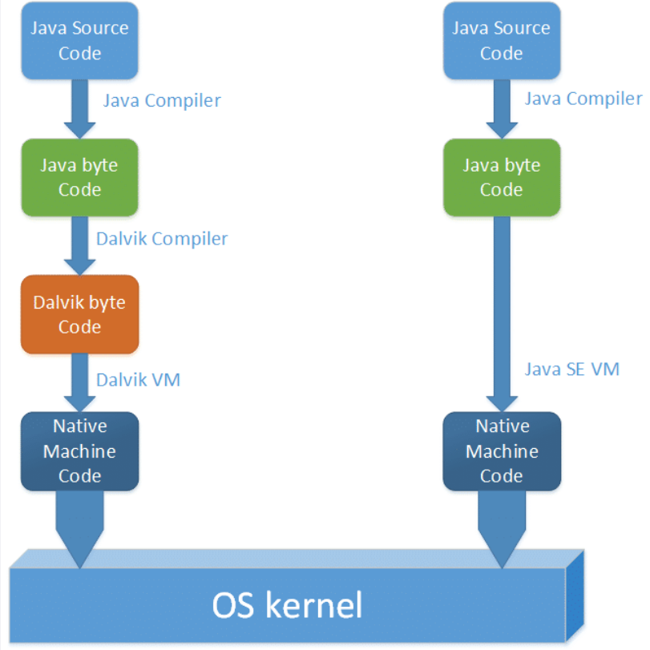

Il codice Java viene tradotto in Dalvik byte code che è eseguito sulla Dalvik Virtual Machine presente in Android


### Macroclassificazione delle app

Macro tipologie di applicazioni

- **Classica**: tutto sviluppato nell'app Android
- **Web-based**: unica interfaccia con WebView, app in un server esterno
- **Integrazione con terze parti**: sfrutta l'architettura di altre app (bot Telegram)


### Tipi di sviluppo

- **Nativo**
  - Gestione totale del dispositivo senza limitazioni
  - Programmazione professionale
  - Concentrato su una sola piattaforma
- **Multi piattaforma**
  - App cross-platform per diversi sistemi operativi


### Processo di build

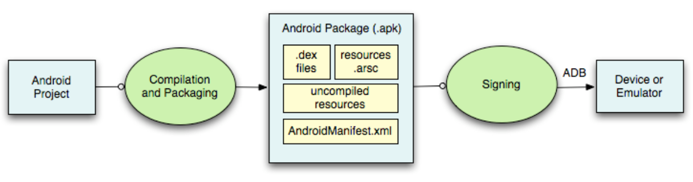

- **.apk**: byte code, risorse, manifesto


### Manifesto

> **Manifesto**: file pubblico contenente tutte le caratteristiche esterne dell'app

- **Funzionalità** di cui si permette l'utilizzo ad **altri utenti**
- **Permessi** richiesti
- **Informazioni** di interesse ad altri utenti


# Lect 2

## Sviluppare una strategia

### SMART

La strategia di sviluppo deve essere **SMART**

- **Specifica**
  - Applicazione ben specifica
  - Obiettivo preciso
  - Linguaggio non ambiguo
  - 5W
    - Chi è coinvolto nello sviluppo?
    - Cosa si vuole raggiungere? (Obiettivo e formalizzazione)
    - Perché? (Obiettivo)
    - Dove sviluppare? (Confrontarsi con un target di utenti specifico)
    - Quali funzionalità e limiti?
- **Misurabile**
  - Stabilire un piano
  - Monitorare i progressi
  - Misurare i risultati
- **Accessibile**
  - L'obiettivo è ragionevolmente raggiungibile?
  - Il target rientra negli standard di prestazione?
- **Rilevante**
  - L'obiettivo è rilevante rispetto alle necessità?
  - L'obiettivo si integra con i piani stabiliti?
- **Tempestiva**
  - Pianificazione e rispetto dei vincoli temporali della data di rilascio


## Linee guida

### Minimizzare il carico cognitivo

> **Carico cognitivo**: quanto sforzo è richiesto all'utente per capire come utilizzare l'applicazione

App veloce e immediata da imparare ed utilizzare

- **Mantenere le informazioni in ordine**
  - Display limitato
  - Non ingombrare l'interfaccia
  - **Minimalismo funzionale**
    - Ridurre il contenuto al minimo
    - Raggruppare gli elementi
    - ==... vedi slides==
- **Scaricare le attività**
  - Cercare alternative più semplici per ciò che si è sviluppato
- **Struttura in subtask**
  - **Chunking**
  - ~~e.g.~~ Processo di pagamento in più passaggi
- **Utilizzare schermate familiari**
- **Minimizzare l'input**
  - Diminuire la richiesta di informazioni
  - Dividere i campi di input in più schermate
  - Fornire campi mascherati
    - ~~e.g.~~ Formattazione di numeri di telefono
  - Completamento automatico
    - Place autocomplete address form by Google
  - Convalida dinamica
  - Personalizzazione della tastiera
    - @ per email
    - Tastierino numerico
- **Anticipare i bisogni dell'utente**
  - Suggerimenti per trovare le informazioni per completare campi specifici
- **Peso visivo dei contenuti**
- **Utilizzare linguaggio standard**
  - Comunicazione chiara e semplice
  - Evitare forme gergali
- **Mantenere coerente il design**
  - Coerenza **visiva**: mantenere gli stessi stili
  - Consistenza **funzionale**: elementi interattivi che funzionano similmente
  - Consistenza **esterna**: con app per altre piattaforme
  - Rispettare le **linee guida** della piattaforma
- ==... slides==
- **Corretto funzionamento del pulsante back**
- **Messaggi di errore significativi**
  - Cause: utente, app, servizi esterni
  - Fornire informazioni e soluzioni


### ==Adattamento a contesti diversi==

- Connessione lenta
- Risorse limitate (batteria)
- Attenzione a culture diverse


- Design per i mercati emergenti
  - Adattamento a risorse fisiche limitate
- Estetica locale


### Navigazione semplice e funzionale

<u>Idea</u>: rendere l'app utilizzabile con facilità e senza manuale

- Utilizzare componenti di navigazione standard
- Dare la priorità alle opzioni di navigazione
- Non mescolare modelli di navigazione
- "Riconoscere qualcosa è più facile che ricordarlo"
- Comunicare posizione attuale e precedente
- Gestire la navigazione in modo funzionale

  - Animazioni per trasmettere transizioni di stato
  - Gestures (standard)
- Focalizzarsi sulla "prima esperienza"

  - Evitare muri di accesso (login se non necessari)
  - Onboarding (tour prima della registrazione)
- Utilizzare uno stato vuoto (funzionalità limitate senza login)
  - Limitare la fase di configurazione (autorizzazioni e impostazioni solo se necessarie)
  - ==Image: schema Google==


### Interfaccia accessibile

- App utilizzabile da tutti

- Focalizzazione sulla **user experience**
  - Controllo
  - Personalizzazione


- **Aspetto cromatico**
  - Attenzione alla distorta percezione dei colori
  - Utilizzare colori standard e contrastanti
  - Accessibilità: associare icone ai colori
- **Animazioni opzionali**
  - Ridurre o eliminare le animazioni per chi soffre di cinetosi


### Ottimizzazione di prestazioni

- Tempi di caricamento inferiori a 2s
- Caricamenti lunghi
  - Concentrarsi sul caricamento dei contenuti dell'area visibile
  - Spinner e barre di caricamento
  - Distrazioni visive e animazioni
  - Skeleton screens e caricamento progressivo
- Ottimizzazione del contenuto
  - Chiaro e leggibile
  - 30-40 caratteri per riga
  - Ottimizzare contenuti video in verticale
- Design touch
  - Area di touch minima di 10×10mm
  - Thumb zone (pulsanti pericolosi in zone poco raggiungibili)
  - Feedback sull'interazione


- Ottimizzare le notifiche push
  - Essenziali e informative
  - Scheduling dell'invio
  - Multicanale (email, push, in-app, news feed)
- Progettazione per interruzione
  - Salvataggio di dati
- Sfruttare le capacità del dispositivo


# Lect 3

## Android Studio

### Strumenti

- **`dx`**: converte i file `.class` di Java in file `.dex` (Dalvik Executable)
- **`aapt`** (Android Asset Packaging Tool): crea i pacchetti delle applicazioni in formato `.apk` (Android Package)
- **`adb`** (Android Debug Bridge): command-line tool per fare debug direttamente sul device
- **`adt`** (Android Development Tools for Eclipse): strumento di sviluppo fornito da Google per eseguire la conversione automatica da file `.class` a file `.dex` e per creare l'apk durante la distribuzione
  - Fornisce inoltre strumenti di debug e un emulatore di dispositivo Android


### Android Virtual Device

> **Android Virtual Device**: emulatore che consente di simulare un dispositivo reale partendo dalla definizione delle caratteristiche hardware e software

- Emulatore che permette l'esecuzione di app come sullo smartphone

Costituito da

- **Profilo hardware** (memoria, fotocamera, ecc.)
- **Mappatura su un'immagine** di sistema
  - Possibilità di definire quale versione della piattaforma Android eseguire
- **Skin** (dimensione dello schermo, aspetto, ecc.)
- **Scheda SD** emulata
- Area di **archiviazione dedicata** sulla macchina di sviluppo
  - Dati utente e schede SD emulate

---

> <u>Suggerimento</u>
>
> Testare direttamente sullo smartphone quando l'app inizia ad ingrandirsi (~~e.g.~~ utilizza risorse hardware)
>
> - I prof testeranno l'app sul loro dispositivo tramite apk


### Instant app

Permettono l’accesso a determinate **funzionalità delle app senza necessità di installarle**

- Le funzionalità sono **associate ad un URL**
- Quando richiamato permette di **visualizzare/utilizzare** la funzionalità stessa

<u>Vantaggi</u>

- **Rimozione delle barriere di accesso** alla vostra applicazione
- Migliora il **raggiungimento di nuovi utenti**
- Aumenta l’**attrattività** dell'applicazione
  - Qualora si implementino funzionalità legate al contesto spazio-temporale di utilizzo dell’applicazione

<u>Limitazioni</u>: non possono

- Accedere all’**identificativo del dispositivo**
- Usare **servizi di background**
- Inviare **notifiche in background**
- **Accedere alla memoria** del dispositivo utente
- Accedere alla **lista delle applicazioni installate** sul dispositivo utente
  - Ad eccezione di quelle che si sono esplicitamente rese disponibili

<u>Requisiti</u>

- L’applicazione deve essere scaricabile **gratuitamente dallo store**
- Utilizzare almeno la **versione 23 delle API** → richiesta autorizzazioni runtime
- Supportare **App Links**

[Tutorial](https://code.tutsplus.com/tutorials/what-are-android-instant-apps--cms-29283)


### Note

- Il tasto Stop rosso in alto a destra chiude l'applicazione senza eseguire il metodo `onPause()`
  - Per evitare questo problema, si chiude l'app dall'emulatore 


## Hello, world!

### Java code

```java
import androidx.appcompat.app.AppCompatActivity;
import android.os.Bundle;
import your_app_package_name.R;

public class MainActivity extends AppCompatActivity {
    @Override
    protected void onCreate(Bundle savedInstanceState) {
        super.onCreate(savedInstanceState);
        setContentView(R.layout.activity_main);
    }
}
```

```java
import androidx.appcompat.app.AppCompatActivity;
import android.os.Bundle;
import android.widget.TextView;

public class MainActivity extends AppCompatActivity {
    @Override
    protected void onCreate(Bundle savedInstanceState) {
        super.onCreate(savedInstanceState);
        TextView tv = new TextView(/*Context:*/ this);
        tv.setText("Hello, world!");
        setContentView(tv);
    }
}
```

>**Context**: wrapper per le informazioni globali relative all’ambiente applicativo

- **Activity** è una **sottoclasse** di Context


### `TextView`

- **Visualizza** il testo all'utente e, facoltativamente, gli consente la **modifica**
- **Editor di testo completo**, ma la classe base è configurata per non consentire l'editing
- Vedere **`EditText`** per una sottoclasse che configura la vista di testo per la modifica


## Risorse

### Gestione delle risorse

- <u>Regola importante</u>: bisognerebbe sempre **esternalizzare le risorse** (~~e.g.~~ immagini ed etichette degli elementi grafici) dal codice dell'applicazione, in modo da

  - Mantenerli in modo **indipendente**

  - Fornire **risorse alternative**
    - **Lingue**
    - Dimensioni dello **schermo**

- Le risorse devono essere organizzate nella **cartella `res/`** con varie **sottocartelle** che raggruppano risorse per **tipo** e **configurazione**

- **Risorse più comuni**

  - **`layout`**: architettura grafica dei componenti dell’interfaccia utente
    - Definiti in XML similmente a HTML
  - **`values`**: stringhe, colori, dimensioni e altri valori che usati in ulteriori risorse o nel codice Java
    - Costituiscono il **contenuto di appositi tag XML** (`<string>`, `<dimen>`, `<color>` etc.) raggruppati in files dal nome solitamente indicativo (`strings.xml`, `dimens.xml`, `colors.xml`, etc.)
  - **`drawable`**: immagini nei formati più comuni o ==configurate in XML==


### Classe `R.java`

- Quando viene **compilata** l'applicazione, **`aapt` genera il file `R.java`** che contiene gli **ID risorsa** per tutto il contenuto nella directory `res/`
- Per ogni tipo di **risorsa** esiste una **sottoclasse `R`** e per ogni risorsa di quel tipo esiste un **identificativo**
  - Numero intero statico che è possibile utilizzare per recuperare la risorsa
  - ~~e.g.~~ `R.layout` per tutte le risorse di `layout`, identificato da **`R.layout.activity_main`**

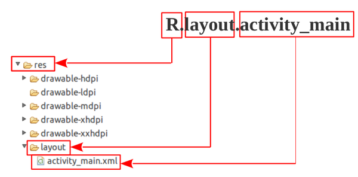


### Accesso risorse

- Nei nomi delle **cartelle delle risorse** si possono utilizzare diversi **suffissi per raggruppare** le varie risorse in base alla **tipologia** (~~e.g.~~ schermo, lingua del dispositivo, etc.) ([providing-resources](https://developer.android.com/guide/topics/resources/providing-resources))
- Le risorse sono **accessibili** sia da **codice Java** che da altre **risorse** definite in **XML**
  - **Java**: `R.tipo_risorsa.nome_risorsa`
  - **XML**: `@tipo_risorsa/nome_risorsa`

```xml
<resources>
    <string name="app_name">MyApp</string>
</resources>

<!--  
    Java: R.string.appname
    XML:  @string/appname
-->
```


## Activity

### Definizione

> **Activity**: ciascuna schermata dell’interfaccia utente

- Componenti con cui l’**utente ha il contatto più diretto**
- La loro realizzazione è il **punto di partenza** di ogni applicazione
- Costituiscono il **flusso** in cui l’**utente** si inoltra per sfruttare le **funzionalità** messe a disposizione
- Richiede
  - La realizzazione delle **interfacce** in sé
  - Una corretta progettazione della **navigazione** tra di esse
    - Offrendo la possibilità di sfogliarne i contenuti e risalirli **gerarchicamente** in maniera **coerente**
- **Non** è prevista la possibilità di avere **più finestre aperte** contemporaneamente
  - Problema parzialmente risolto con i **Fragment**
- Al **passaggio** da una Activity ad un’altra, l’Activity esistente viene messa in **pausa**


### Classe `Activity`

- **`Activity`**: classe base per la creazione di applicazioni mobile

  - Non è raccomandato ereditare direttamente da questa classe, le sue **specializzazioni** sono **migliori**

- **`ActionBarActivity`**: permette di manipolare facilmente le `ActionBar` all’interno delle applicazioni

  - Usata per un certo periodo in passato

- **`AppCompatActivity`**: best practice consigliata

  - Si preferisce l’utilizzo della classe **`Toolbar`**
    - Rimpiazzo della classe `ActionBar`
    - L’utilizzo della classe `ActionBar` non è incoraggiata a prescindere

  - **Eredita** direttamente da **`FragmentActivity`**
    - Qualora sia necessario utilizzare i **Fragments** è possibile farlo (tramite il Fragment Manager)

  - Valida per **tutte le** versioni delle **API**


### Ciclo di vita

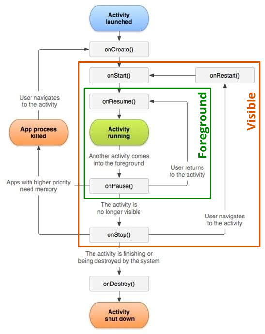

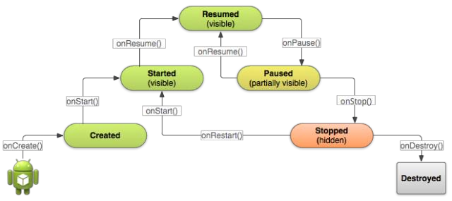

#### Stati

- **Foreground**

  - ==???==

- **Visible**

  - Quando **interrotta**, l’Activity dovrebbe **rilasciare le risorse** costose (~~e.g.~~ rete o connessioni al database)

  - Quando l’Activity **riprende**, si possono **riacquistare tali risorse** ricaricando lo **stato precedente** dell’Activity


### Metodi `Activity`

- **`onCreate(Bundle savedInstanceState)`**
  - Eseguito al **primo avvio** dell’Activity
  - L’Activity viene **creata**
  - Qui vengono assegnate le **configurazioni** di base e definito quale sarà il **layout** dell’interfaccia
  - Rappresenta il punto dove dovrebbe andare la maggior parte delle **inizializzazioni**
  - Se la Activity viene re-inizializzata dopo essere stata chiusa in precedenza, **`Bundle` contiene i dati** forniti dall’ultima chiamata del metodo `onSaveInstanceState(Bundle b)`, altrimenti è `null`
  - <u>Nota</u>: un `Bundle` è una sorta di **contenitore di dati serializzati**
- **`onStart()`**
  - Eseguito quando l’Activity viene **avviata**
  - L’Activity diventa **visibile**
  - È il momento in cui si possono **attivare funzionalità e servizi** che devono offrire **informazioni all’utente**
- **`onResume()`**
  - Eseguito quando l’Activity ritorna in **foreground**
  - L’Activity diventa la **destinataria di tutti gli input dell’utente**
- **`onPause()`**
  - Eseguito quando l’Activity **smette** di essere in **foreground**
  - È **messa in secondo piano** da un’altra Activity
  - **Notifica** la cessata interazione dell’utente con l’Activity
- **`onStop()`**
  - Eseguito quando l’Activity viene **sostituita da un’altra**
  - È ancora instanziata **in memoria**
  - Segna la **fine della visibilità** dell’Activity
- **`onDestroy()`**
  - Eseguito alla **chiusura e deallocazione** dell’Activity
  - Segna la **distruzione** dell’Activity


### Activity stack

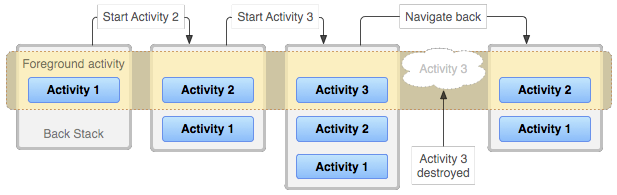


## Task

### Definizione

> **Task**: collezione di Activity della stessa applicazione

- Ciò che gli utenti vedono sotto forma di **applicazione**
- Hanno un **loro stack**
- La **Home** è il **punto di partenza** della maggior parte dei Task
- Quando l’utente tocca un'**icona nel launcher**, il **task** dell’applicazione associata viene **posto in foreground**
  - Se non esiste alcuna Activity per l'applicazione selezionata (~~i.e.~~ non è stata utilizzata di recente) viene creata una **nuova main Activity nello stack** di quell'applicazione
  - Se è stata usata di recente, il suo **task è richiamato dalla memoria** e il suo **stato è ripristinato**
- Un’applicazione definisce **almeno un task**, ma può definirne **di più**
- Le **Activity** presenti **in un task** possono provenire da **applicazioni diverse**
- I **task** possono anch’essi essere spostati in **background**
- <u>Nota</u>: una **stessa Activity** può essere **istanziata più volte**

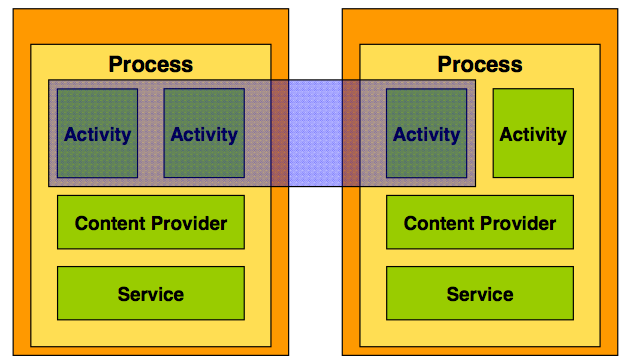   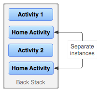


### Istanze multiple

Le modalità con cui **istanziare più volte** una **stessa Activity** sono definite nel **manifesto**

- Utili per specificare il comportamento del **tasto back**

```xml-dtd
<!-- manifest.xml -->
<activity android:launchMode=["standard"|"singleTop"|"singleTask"|"singleInstance"] ... />
```

- **`standard`**: la stessa Activity viene **creata piu volte** nello stack

  ---

  > 1. stack:  `A → B → C`
  > 2. chiamo l’Activity  `B`
  > 3. stack:  `A → B → C → B`

- **`singleTop`**: se un’Activity è **già presente** come top-Activity nello stack, **non viene creata** una nuova istanza

  ---

  > 1) stack:  `A → B → C`
  > 2) chiamo l’Activity  `D`
  > 3) stack:  `A → B → C → D`

  ---

  > 1. stack:  `A → B → C → D`
  > 2. chiamo l’Activity  `D`
  > 3. stack:  `A → B → C → D`

- **`singleTask`**: nuova instanza **creata se e solo se l'Activity non esista già** in un altro Task dell'applicazione

  ---

  > 1) stack:  `A → B → C`
  > 2) chiamo l’Activity  `D`
  > 3) stack:  `A → B → C → D`

  ---

  > 1. stack:  `A → B → C → D`
  > 2. chiamo l’Activity  `B`
  > 3. stack:  `A → B`

  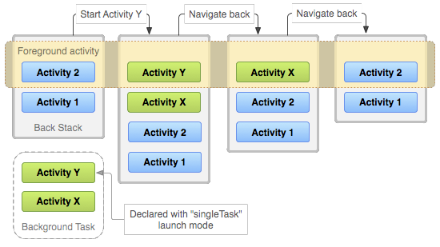

- **`singleInstance`**: come il `singleTask`, ma l’Activity marcata come tale rimane la **sola nel suo Task**

  ---

  > 1) stack:  `A → B → C`
  > 2) chiamo l’Activity  `D`
  > 3) stack task 1:  `A → B → C`
  > stack task 2:  `D`
  > 4) chiamo l’Activity  `E`
  > 5) stack task 1:  `A → B → C → E`
  >     stack task 2:  `D`

  ---

  > 1. stack task 1:  `A → B → C`
  >    stack task 2:  `D`
  > 2. chiamo l’Activity  `D`
  > 3. stack task 1:  `A → B → C`
  >     stack task 2:  `D`


### Links

- https://developer.android.com/guide/components/activities/intro-activities
- https://developer.android.com/guide/components/activities/activity-lifecycle
- https://developer.android.com/guide/components/activities/state-changes
- https://developer.android.com/guide/components/activities/tasks-and-back-stack


## Altri componenti

### Fragment

- Android **non è un ambiente a finestre**
  - Scelta progettuale motivata dalla necessità di poter essere installato con processori poco performanti, scarsa memoria e schermi video molto piccoli
- A partire dalle versione 3.0 sono stati introdotti i **Fragments** come **soluzione parziale**
- Rappresentano un **comportamento** o una parte dell'**interfaccia** in un'attività ~~(~ frame html)~~
- È possibile **combinare più frammenti** in un unica attività per
  - Creare un'**interfaccia utente multi-riquadro**
  - **Riutilizzare un frammento** in più attività
- Si può pensare a un frammento come una **sezione modulare di un’Activity**
  - Ha il suo ciclo di vita
  - Riceve i suoi eventi di input
  - È possibile aggiungerlo o rimuoverlo mentre l'Activity è in esecuzione
    - ~~(sub-Activity che si puo’ riutilizzare in diverse attività)~~


#### Ciclo di vita

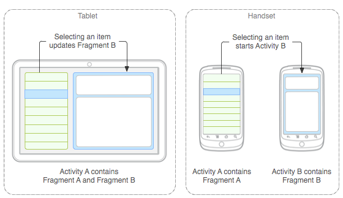                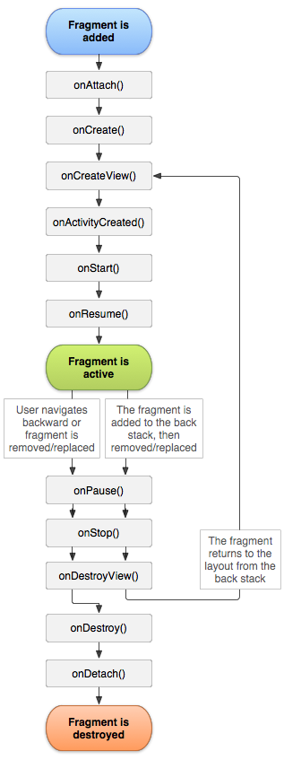


### Service

- Rappresenta un **lavoro**, generalmente **lungo e continuato**, che viene svolto **interamente in background**
  - **Senza** bisogno di interazione diretta con l’**utente**
  - ~~e.g.~~ Audio che non si interrompe alla chiusura dell'interfaccia dell'applicazione
- Svolge un **ruolo opposto all’Activity** ~~(sebbene a livello di ereditarietà di classe siano imparentati)~~
- Da una punto di vista **strutturale** si identificano due tipologie
  - **Started**: un’applicazione ha bisogno di svolgere **attività in background**, mirate ad uno **scopo specifico**, fino al loro **completamento**
  - **Bounded**: viene **attivato** solo nel caso in cui un’**altra applicazione necessiti** di connettersi a loro
    - Permette l’interazione tra processi differenti
    - Risponde ad una logica simile a quella delle API nei servizi web
- I **JobScheduler** permettono lavori in background con un uso **parsimonioso della batteria**


### Content Provider

- <u>Scopo</u>: **condivisione di dati tra applicazioni**
- Permettono di condividere, nell’ambito del sistema, contenuti custoditi in un **database**, su **file** o reperibili mediante accessi in **rete**
- Tali contenuti potranno essere usati da altre applicazioni
  - **Senza invadere lo spazio di memoria**
  - Stabilendo un **dialogo sano e sicuro**


### Broadcast Receiver

- Componente che **reagisce ad un invio di messaggi** a livello di sistema
  - Con cui Android notifica l’avvenimento di un determinato **evento** o sollecita l’esecuzione di **azioni**
- Utili per la **gestione istantanea di circostanze speciali**
- **Non utilizzano interfaccia grafica** sebbene possano **inoltrare notifiche** alla barra di stato
- La loro **esecuzione** dovrebbe essere **istantanea**
  - Delegano a **Service** o **JobScheduler** eventuali **operazioni** da attivare


## Intent

### Definizione

Una Activity **non può indiscriminatamente chiamare altre Activity**

- Ragioni di **sicurezza**
- Favorisce il **riuso di componenti**, mediato dal sistema

> **Intent**: descrizione astratta di un'operazione da eseguire

- Oggetto corrispondente ad un **messaggio** col quale si richiede l’**attivazione di Activity, servizio o receiver**

- Sottintende un potentissimo **strumento di comunicazione** di Android che permette di

  - Avviare una **Activity**

  - Avviare un **Service**

  - **Inviare un messaggio** in broadcast che può essere ricevuto da ogni applicazione


### Metodi

- **`startActivity(Intent x)`**: metodo della classe `Activity`

  - Avvia una **nuova Activity**, che verrà posizionata nella **parte superiore dello stack**

  - Accetta un singolo **argomento** che descrive l’**Activity da eseguire**

- **Explicit intent**: **avviare da programma** un’altra **Activity** specifica 

  ```java
  Intent intent = new Intent(/*Context:*/ this, /*Class:*/ MyActivity.class);
  // Intent intent = new Intent();  intent.setClass(Context c1, Class c2);
  startActivity(intent);
  ```

- **Implicit intent**: far partire un’Activity che svolga un particolare compito **senza conoscere staticamente la classe che la implementa**

  ```java
  Intent intent = new Intent(Intent.ACTION_SEND);
  startActivity(intent);
  ```

  - Si chiede di avviare una Activity che abbia settato il **filtro `ACTION_SEND`**


### Passaggio dati

- **`putExtra(String name, Object value)`**: metodo della classe `Intent` per **passare dati** (per valore) da una Activity ad un’altra
- **`hasExtra(String name)`**: verifica la presenza del dato

---

> - `MainActivity`
>
>   - Contiene un form di login
>   - Dopo aver inserito username e password viene controllata la validità dei dati
>   - In caso positivo viene invocata l’apertura di un’altra Activity
>
>   ```java
>   Intent i = new Intent(this, SecretActivity.class);
>   i.putExtra("username", account_username);
>   startActivity(i);
>   ```
>
> - `SecretActivity`
>
>   - Area accessibile solo mediante login e contiene dati riservati
>
>   ```java
>   Intent i = getIntent();
>   String username;
>   if (i.hasExtra("username")) { username = i.getStringExtra("username"); }
>   ```
>
> 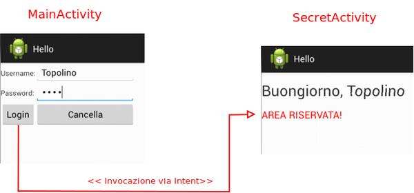


### Ciclo di vita

- Il passaggio da un’Activity ad un’altra coinvolge i cicli di vita di entrambe
- La prima vienemessa a riposo, passa almeno per `onPause` e `onStop`
- La seconda percorre la catena di creazione `onCreate-onStart-onResume`
- La priorità del sistema è il mantenimento della fluidità della user-experience, da ciò l'ordine delle operazioni:
  1) La prima Activity passa per `onPause` e viene fermata in stato Paused
  2) La seconda Activity va in Running e viene attivata completamente
     - In tale maniera l’utente potrà usarla al più presto non subendo tempi di ritardo
  3) Mentre l’utente sta già usando la seconda Activity, il sistema può invocare `onStop` sulla prima


### Gestione stack

È possibile gestire lo stack del task direttamente durante la chiamata degli intenti ~~(~ lunch mode del manifest)~~

- `intent.setFlags(Intent.FLAG_ACTIVITY_CLEAR_TOP);`
  - Se l’Activity **esiste già** nello stack dell’Activity chiamante, tutte quelle davanti ad essa vengono **distrutte**
  - A differenza della modalità `singleTask`, viene controllato solo il **task corrente** e non tutti i task attivi
- `intent.setFlags(Intent.FLAG_ACTIVITY_SINGLE_TOP);`
  - Come **`singleTop`** lunch mode.
- `intent.setFlags(Intent.FLAG_ACTIVITY_CLEAR_TASK);`
  - **Svuota lo stack** del task ed istanzia la nuova Activity
- `intent.setFlags(Intent.FLAG_ACTIVITY_NEW_TASK);`
  - Come **`singleTask`** lunch mode


### Azioni personalizzate

```java
// class Activity
String CUSTOM_ACTION = "com.example.foo.bar.YOUR_ACTION";
Intent i = new Intent();
i.setAction(CUSTOM_ACTION);
startActivity(i);
```

```xml
<!-- manifest -->
<activity android:name=".FeedbackActivity" >
    <intent-filter>
        <action android:name="com.example.foo.bar.YOUR_ACTION" />
        <category android:name="android.intent.category.DEFAULT" />
    </intent-filter>
</activity>
```


# Lect 4

## Layout

### Definizione

> **Layout**: struttura grafica di un'Activity

Descritto in modo

- **Procedurale**: via codice **Java**
- **Dichiarativo**: tramite descrittori **XML**
- **Ibrido**: creare l’interfaccia in modo dichiarativo e poi controllarla e manipolarla in modo procedurale

Google suggerisce di utilizzare il metodo **dichiarativo**

- Il codice XML è più **semplice e corto** rispetto all’equivalente Java
- È più probabile che il codice XML **non cambi nel tempo**
- l’IDE genera in automatico il codice XML dalle operazioni **sanbox**


### `View` e `ViewGroup`

- **`View`**: classe **padre** di una gerarchia di **componenti visuali e di controllo**
  - ~~e.g.~~ Caselle di testo, checkbox, pulsanti, etc.
- **`ViewGroup`**: classe **base** di una gerarchia di **layout**, ed è utilizzata per
  - Gestire collezioni di `View`
  - Definire l’architettura del layout


### Layout

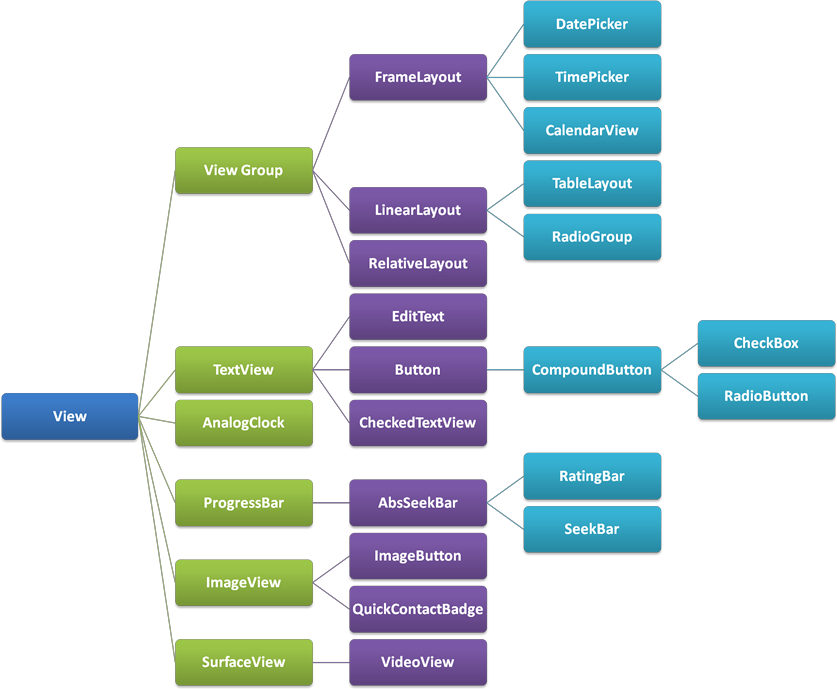

---

> 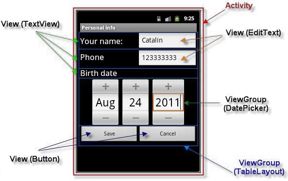
>
> 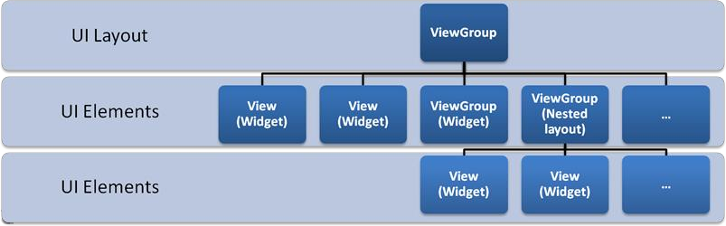


### Tipi di Layout

Diversi modi per **distribuire gli elementi** (è possibile ma sconsigliato annidarli)

- **Linear layout**
  - **Sequenziale** dall’alto verso il basso o da destra verso sinistra, in righe o colonne

  ```xml
  <LinearLayout
      xmlns:android="http://schemas.android.com/apk/res/android"
      android:layout_width="match_parent"
      android:layout_height="match_parent"
      android:orientation="vertical">
      ...
  </LinearLayout>
  ```

- **Table layout**

  - Forma **tabellare**, adatto per interfacce con suddivisioni regolari in righe e colonne

  ```xml
  <TableLayout
      xmlns:android="http://schemas.android.com/apk/res/android"
      android:layout_width="wrap_content"
      android:layout_height="match_parent">
  <TableRow
      android:layout_width="wrap_content"
      android:layout_height="match_parent">
      ...
  </TableRow>
      ...
  </TableLayout>

- **Relative layout**
  - Meno strutturato, **elementi** posizionati in **relazione l’uno all’altro** o rispetto al loro **contenitore**
  - Permette un **layout fluido** che si adatta bene a display diversi
  - Dispone di un numero maggiore di **attributi** XML utili ad **allineare e posizionare** gli elementi tra loro

  <u>Attributi</u>

  - **Allineamento con il contenitore**
    - Attributi che definiscono se l’elemento deve allinearsi ad uno dei **bordi del proprio contenitore**
    - Il valore è **booleano**
    - `layout_alignParentTop, layout_alignParentBottom, layout_alignParentLeft, layout_alignParentRight`
  - **Allineamento con altro elemento**
    - Attributi che definiscono se l’elemento deve allinearsi ad uno dei **bordi di un altro elemento del layout**
    - Il valore è l’**id dell’elemento** con cui allinearsi
    - `layout_alignTop, layout_alignBottom, layout_alignLeft, layout_alignRight`
  - **Posizionamento relativo ad un altro elemento**
    - Indicano se l’elemento si trova, rispettivamente, sopra, sotto, a sinistra o a destra di un componente
    - Il valore è l’**id dell’elemento** con cui posizionarsi
    - `layout_above, layout_below, layout_toLeftOf, layout_toRightOf`
  - **Centramento**
    - L’elemento deve essere centrato orizzontalmente, verticalmente o in entrambe le direzioni
    - Il valore è **booleano**
    - `layout_centerHorizontal, layout_centerVertical, layout_centerInParent`

  ```xml
  <RelativeLayout
      xmlns:android="http://schemas.android.com/apk/res/android"
      android:layout_width="match_parent"
      android:layout_height="match_parent">
  <TextView
      android:layout_width="wrap_content"
      android:layout_height="wrap_content"
      android:layout_alignParentTop="true"
      android:layout_alignParentLeft="true"
      android:text="Esempio di Relative Layout"/>
  <Button
      android:layout_width="90dp"
      android:layout_height="wrap_content"
      android:layout_alignParentBottom="true"
      android:layout_centerHorizontal="true"
      android:text="Clicca qui!"/>
  </RelativeLayout>

- **Constraint layout**

  - Permette di creare delle interfacce complesse tramite un’**organizzazione gerarchica delle View**
  - Il posizionamento di un elemento **dipende da un altro**
  - Deriva da e rimpiazza il **Relative layout**, ma molto più **flessibile** ed utilizzabile facilmente 
    - Grazie all’editor presente in Android studio
  - Si basa sul principio dei **constraints** che fungono da **connettori verso**
    - **Altre View**
    - **Layout padre**
    - **Guidelines o barriers esistenti**
  - È obbligatorio creare almeno **due contraints**: uno **orizzontale** e uno **verticale**
    - **Posizionamento assoluto**: un solo constraint per dimensione
    - **Posizionamento relativo**: due constraint per dimensione

  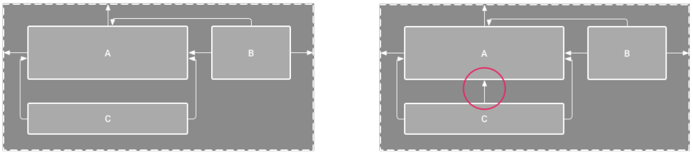

  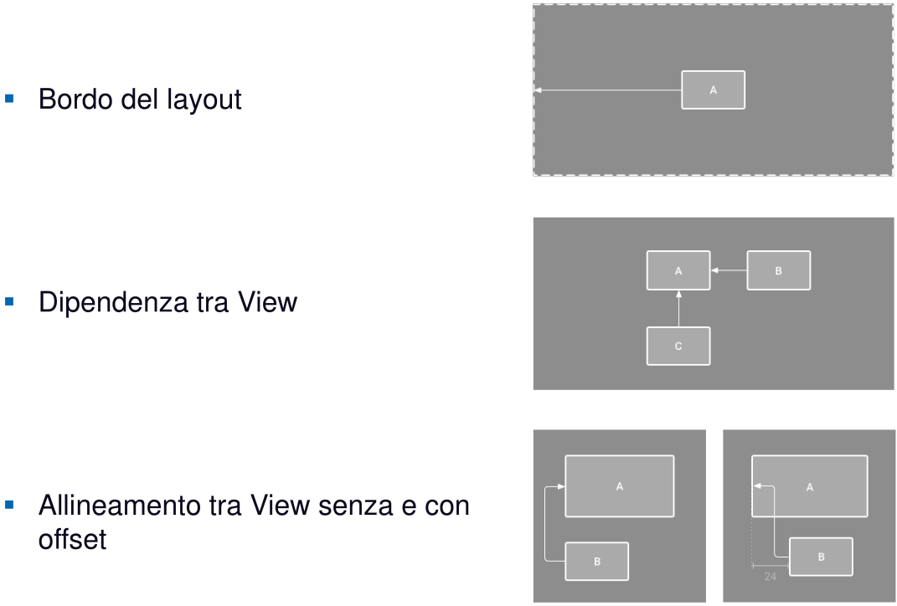

  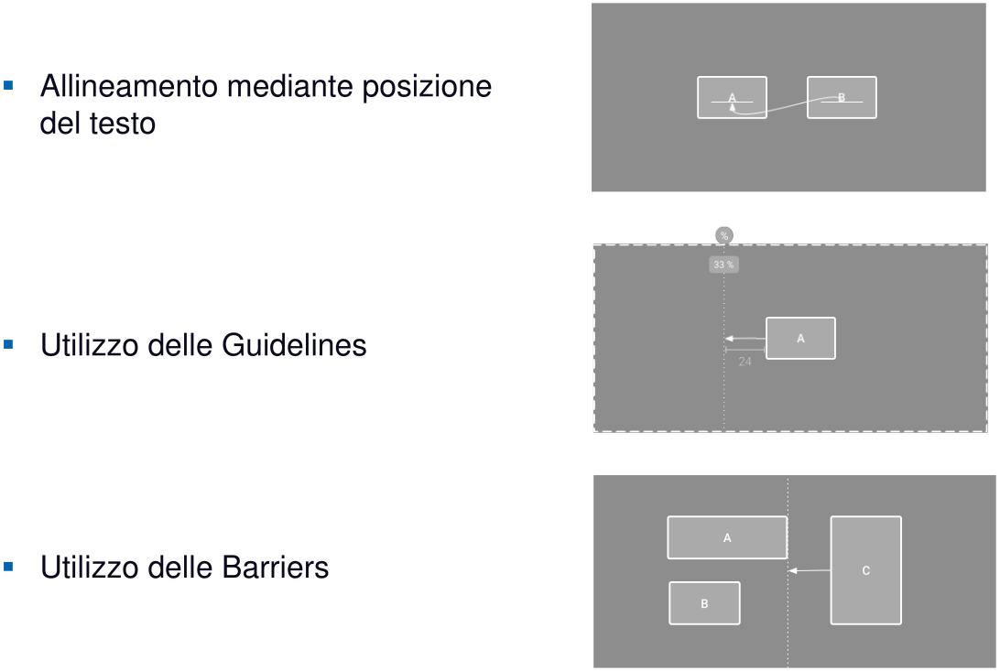


### Links

- [Overview](https://developer.android.com/guide/topics/ui/declaring-layout)
- [Dettagli su Constraint Layout](https://developer.android.com/training/constraint-layout)
- [Esempi](https://github.com/android/views-widgets-samples/tree/master/ConstraintLayoutExamples)


### Elementi comuni

Nel file xml del layout

- **Namespace base**
  - `xmlns:android="http://schemas.android.com/apk/res/android"`
- Due **attributi** obbligatori
  - **`layout_width`** e **`layout_height`**: capacità di un elemento di estendersi all’interno del proprio contenitore
  - Il valore di questi attributi può essere
    - **Dimensione** espressa in `dp`
    - **Costante** da scegliere tra
      - **`wrap_content`**: l’elemento sarà alto o largo a sufficienza per includere il suo contenuto
      - **`match_parent`**: l’elemento si estenderà in altezza o in larghezza fino a toccare il suo contenitore

>**`dp` (Density-Indipendent Pixel)**: pixel virtuale indipendente dalla densità del display che permette di mantenere intatte le proporzioni tra gli elementi del layout al variare delle densità


## Data Storage

### Modalità di gestione dei dati

- Le applicazioni possono **navigare** attraverso la struttura delle **directories**

- Operazioni e strutture dati simili alla libreria [**`java.io`**](https://developer.android.com/sdk/api_diff/24/changes/pkg_java.io.html) su Linux

<u>Modalità</u>

- **Android File System**
- **Internal Storage**
- **External Storage**
- **SQLite Database**


### Dove salvare i dati

- **Dentro Android**

  - [**Shared Preferences**](https://developer.android.com/guide/topics/data/data-storage.html#pref): salvataggio privato di dati (tipi primitivi) in coppie chiave/valore

  - [**Internal Storage**](https://developer.android.com/guide/topics/data/data-storage.html#filesInternal): salvataggio privato di dati sulla memoria del dispositivo

  - [**External Storage**](https://developer.android.com/guide/topics/data/data-storage.html#filesExternal): salvataggio pubblico di dati sul device o su una memoria esterna

  - [**SQLite Databases**](https://developer.android.com/guide/topics/data/data-storage.html#db): salvataggio di dati strutturati in un database privato

  - [**Content Providers**](https://developer.android.com/guide/topics/providers/content-providers.html): salvataggio privato di dati resi poi accessibili pubblicamente

- **Fuori Android**

  - [**Network Connection**](https://developer.android.com/guide/topics/data/data-storage.html#netw): salvataggio sul web tramite il proprio server
  - [**Cloud Backup**](https://developer.android.com/training/backup/index.html): backup dei dati utenti e dei dati dell’applicazione all’interno del cloud
  - [**Firebase Realtime Database**](https://firebase.google.com/docs/database/): salvataggio e sincronizzazione dei dati con database NoSQL sul cloud


### Android File System

- **Internal storage**: directories private per la propria applicazione

  - Sempre disponibile
  - Utilizza il file system del device
  - Solo la propria applicazione può accedere a quei file
    - A meno di essere specificati in modo esplicito come di sola lettura e/o scrittura
  - Alla disintallazione, il sistema rimuove dall’internal storage tutti i files creati dall’applicazione stessa

  <u>Consigliata quando</u>

  - Si vuole essere certi che nessun altro utente o applicazione sia in grado di accedere ai propri files

- **External storage**: directories pubbliche

  - Non sempre disponibile
  - Utilizza il file system del device corrente o memoria esterna fisica (~~e.g.~~ SD card)
  - Qualsiasi altra applicazione può accedere ai dati generati
  - Alla disintallazione, il sistema non rimuove i file generati dall'applicazione

  <u>Consigliata quando i files</u>

  - Non necessitano di restrizioni di accesso
  - Si vogliono condividere con altre applicazioni
  - Si vogliono rendere accessibili tramite altri dispositivi


#### Evitare di cancellare i files utente

- Quando un utente disinstalla l’applicazione, tutto il **contenuto** dell’area **privata** viene **eliminato**
- **Non** utilizzare l’**area privata** per salvare i contenuti che appartengono all’**utente**


### Internal Storage

- Utilizza **directories private dedicate** alla vostra applicazione

- L’applicazione ha sempre i **permessi di lettura e scrittura**

- **Accedere alle cartelle** presenti nella memoria

  - **Permanente**: `getFilesDir()`
  - **Temporanea**: `getCacheDir()`

- **Creare un file**

  ```java
  File file = new File(context.getFilesDir(), filename);
  ```

  - Utilizzo degli operatori standard della libreria **`java.io` o streams** per interagire con i files


### External Storage
- Salvataggio su **device** o **SD card**

- Impostare i **permessi** all’interno del **manifesto**

  ```xml
  <uses-permission android:name="android.permission.WRITE_EXTERNAL_STORAGE" />
  <uses-permission android:name="android.permission.READ_EXTERNAL_STORAGE" />
  ```

  - I permessi di scrittura includono quelli di lettura

- **Controllare** sempre la **disponibilità** della memoria esterna

  ```java
  public boolean isExternalStorageWritable() {
      String state = Environment.getExternalStorageState();
      if (Environment.MEDIA_MOUNTED.equals(state)) { return true; }
      return false;
  }
  ```


### Esempi di directories pubbliche esterne

Costanti per accedere ai file ([Environment](https://developer.android.com/reference/android/os/Environment.html))

- `DIRECTORY_ALARMS` e `DIRECTORY_RINGTONES`: file audio da usare per allarmi o suonerie
- `DIRECTORY_DOCUMENTS`: documenti creati dall’utente
- `DIRECTORY_DOWNLOADS`: file scaricati dall’utente


### Operazioni comuni

#### Accesso a cartelle esterne pubbliche

1. Prelevare il **path** con [`getExternalStoragePublicDirectory()`](https://developer.android.com/reference/android/os/Environment.htmlgetExternalStoragePublicDirectory(java.lang.String))
2. Creare il **file**, con path e nome

```java
File path = Environment.getExternalStoragePublicDirectory(Environment.DIRECTORY_PICTURES);
File file = new File(path, "DemoPicture.jpg");
```


#### Spazio rimanente

Se non ci fosse abbastanza spazio, viene lanciata un’eccezione di tipo **`IOException`**

- Se si conosce la dimensione del file da salvare, **controllare lo spazio rimanente**
  - [`getFreeSpace()`](https://developer.android.com/reference/java/io/File.htmlgetFreeSpace())
  - [`getTotalSpace()`](https://developer.android.com/reference/java/io/File.htmlgetTotalSpace())
- Se non si conosce la dimensione del file utilizzare il blocco **try/catch**


#### Eliminare i files non più necessari

- **Internal storage**: `myContext.deleteFile(fileName)`
- **External storage**: `myFile.delete()`


### SQLite Database

- Ideale per salvare **strutture dati ripetute** (~~e.g.~~ contatti)
- **Android** fornisce un meccanismo di gestione di database SQL-like da poter utilizzare
  1. Creare la **struttura del database**
     - Preparare uno **script SQL** che crei la struttura interna del database
  2. Creare una **classe Java** che estenda **`SQLiteOpenHelper`**
     - Gestisce la nascita e l’aggiornamento del database su **memoria fisica**
     - Recupera un riferimento all’oggetto `SQLiteDatabase`, usato come **accesso ai dati**
  3. Creare una **classe** per l’**interazione** con il database
     - Contiene un riferimento all’**oggetto helper** definito al punto precedente
     - Contiene i metodi con cui **altre componenti** dell’app richiedono **operazioni** e **selezioni** sui dati

```java
public class DBhelper extends SQLiteOpenHelper {
    
    public static final String DBNAME = "BILLBOOK";
    
    public DBhelper(Context context) {
        super(context, DBNAME, null, 1);
    }
    
    @Override
    public void onCreate(SQLiteDatabase db) {
        String q = "CREATE TABLE " + DatabaseStrings.TBL_NAME
                 + " ( _id INTEGER PRIMARY KEY AUTOINCREMENT,"
                 + DatabaseStrings.FIELD_SUBJECT + " TEXT,"
                 + DatabaseStrings.FIELD_TEXT + " TEXT,"
                 + DatabaseStrings.FIELD_DATE + " TEXT)";
        db.execSQL(q);
    }
    
    @Override
    public void onUpgrade(SQLiteDatabase db, int oldVersion, int newVersion) {}
}
```


### Approfondimenti

- **Files**
  - [Saving Files](https://developer.android.com/training/basics/data-storage/files.html)
  - [`getExternalFilesDir()`](https://developer.android.com/reference/android/content/Context.htmlgetExternalFilesDir(java.lang.String))
  - [`getExternalStoragePublicDirectory()`](https://developer.android.com/reference/android/os/Environment.htmlgetExternalStoragePublicDirectory(java.lang.String))
  - [`java.io.File` class](https://developer.android.com/reference/java/io/File.html)
  - [Oracle's Java I/O Tutorial](https://docs.oracle.com/javase/tutorial/essential/io/)
- **Backups**
  - [Configuring Auto Backup for Apps](https://developer.android.com/training/backup/autosyncapi.html)
  - [Using the Backup API](https://developer.android.com/training/backup/backupapi.html)
  - [Data Backup](https://developer.android.com/guide/topics/data/backup.html)


# Lect 5

## Shared preferences

### Definizione

> **Shared preferences**: hashmap salvata nell'area privata dell'applicazione

- <u>Obiettivo</u>: leggere e scrivere **piccole quantità di dati primitivi** come coppie **chiave/valore** in una memoria disponibile persistente
- La classe **`SharedPreference` fornisce APIs** per gestire la lettura, scrittura e gestione di tali dati
- <u>Best practice</u>: **salvare** i dati all’interno del metodo **`onPause()`** e **recuperarli** all’interno di **`onCreate()`**


### `SharedPreferences`  vs  `SavedInstanceState`

Concettualmente simile agli oggetti [**`Bundle`** ](# Metodi `Activity`)(`SavedInstanceState`)

|                    | `SharedPreferences`                                          | `SavedInstanceState`                                         |
| ------------------ | ------------------------------------------------------------ | ------------------------------------------------------------ |
| **Informazioni**   | Dati dell’utente                                             | Informazioni legate al contesto dell’activity                |
| **Struttura**      | Ridotto quantitativo di coppie chiave/valore                 | Dati privati all’interno dell’applicazione                   |
| **Memorizzazione** | Dati persistenti attraverso le sessioni, anche in caso di arresto dell'applicazione o dello smartphone | Preserva i dati attraverso diverse istanze delle Activity, ma all’interno della stessa sessione utente |
| **Utilizzo**       | Gestione dei dati che devono essere ricordati attraverso le sessioni | Gestione dei dati che non devono essere ricordati attraverso le sessioni |
| **Esempi**         | Preferenze, cronologie, passwords                            | Stato corrente dell’activity                                 |


### Creazione delle SharedPreferences

- È sufficiente avere **una sola `SharedPreferences`** per applicazione
- Deve essere denominata con il **nome del package** dell’applicazione
  - Strategia unica e semplice per associarla proprio all’applicazione
- L’argomento `MODE` per il metodo `getSharedPreferences()` è inserito per retrocompatibilità
  - Utilizzare la costante **`MODE_PRIVATE`** per sicurezza
    - Rende le shared preferences private per la sola applicazione
  - Metodo **get-or-create** e **read-only**

```java
private String sharedPrefFile = "com.example.android.hellosharedprefs";
mPreferences = getSharedPreferences(sharedPrefFile, MODE_PRIVATE);
```


==Listener che agisce automaticamente alla modifica di alcune shared preferences==


### Salvataggio delle SharedPreferences

- <u>Interfaccia</u>: **`SharedPreferences.Editor`**
  - Permette di usare i metodi in **scrittura**
- Premurarsi di gestire tutte l’**operazione sul file**
- <u>Metodi</u>
  - **`put<Type>(String key, <Type> value)`** **sovrascrive** il valore qualora la chiave esista già
  - **`apply()`** **salva** l’informazione in modo sicuro ed asincrono

```java
@Override
protected void onPause() {
    super.onPause();
    SharedPreferences.Editor preferencesEditor = mPreferences.edit();
    preferencesEditor.putInt("count", mCount);
    preferencesEditor.putInt("color", mCurrentColor);
    preferencesEditor.apply();
}
```


### Recupero delle SharedPreferences

- Le operazioni vanno inserite all’interno del metodo **`onCreate()`** della Activity richiamante i dati
  - Può essere usato anche in `onResume()`, ma è preferibile utilizzare un listener in questo caso
- <u>Metodo</u>: **`get<Type>(String key, <Type> default)`**
  - I valori di default evitano i test sulla presenza o meno della preferenza all’interno del file

```java
mPreferences = getSharedPreferences(sharedPrefFile, MODE_PRIVATE);
if (savedInstanceState != null) {
    mCount = mPreferences.getInt("count", 1);
    mShowCount.setText(String.format("%s", mCount));
    mCurrentColor = mPreferences.getInt("color", mCurrentColor);
    mShowCount.setBackgroundColor(mCurrentColor);
    mNewText = mPreferences.getString("text", "");
} else { ... }
```


### Pulizia delle SharedPreferences

- Utilizzo del metodo **`clear()`** su `SharedPreferences.Editor` ed applicare la modifica
- Alla chiamata di **`apply()`**, la funzione **`clear()`** è sempre eseguita **prima** di `put()`
  - Indipendentemente dall’ordine con il quale è stata inserita

```java
SharedPreferences.Editor preferencesEditor = mPreferences.edit();
preferencesEditor.clear();
preferencesEditor.apply();
```


### Rilevamento dei cambiamenti

- <u>Interfaccia</u>: **`SharedPreference.OnSharedPreferenceChangeListener`**
- **Registrare il listener** con **`registerOnSharedPreferenceChangeListener()`**
- La **registrazione** (e chiusura) del listener deve essere fatta nei metodi **`onResume()`** e **`onPause()`**
- <u>Callback</u>: **`onSharedPreferenceChanged()`**


#### Creazione e registrazione

```java
SharedPreferences.OnSharedPreferenceChangeListener listener =
        new SharedPreferences.OnSharedPreferenceChangeListener() {
    public void onSharedPreferenceChanged(SharedPreferences prefs, String key) {
        // Implement listener here
    }
};
prefs.registerOnSharedPreferenceChangeListener(listener);
```


#### Interfaccia e callback

```java
public class SettingsActivity extends AppCompatActivity
        implements OnSharedPreferenceChangeListener {
    // ...
    public void onSharedPreferenceChanged(SharedPreferences sharedPreferences, String key) {
        if (key.equals(MY_KEY)) {
            // Do something
        }
    }
}
```


### Riferimento forte al listener

- <u>Problema</u>: quando si registra un listener, il preference manager **non salva una referenza** forte all’oggetto creato
  - La referenza forte è necessaria per evitare che il listener venga eliminato dal garbage collector
- <u>Soluzione</u>: mantenente una **referenza al listener** all’interno dell’**istanza** di un oggetto che sapete esisterà almeno fino a quando avrete bisogno del listener


### Approfondimenti

Sito ufficiale

- [Saving Data](https://developer.android.com/training/basics/data-storage/index.html)
- [Storage Options](https://developer.android.com/guide/topics/data/data-storage.html)
- [Saving Key-Value Sets](https://developer.android.com/training/basics/data-storage/shared-preferences.html)
- [SharedPreferences](https://developer.android.com/reference/android/content/SharedPreferences.html)
- [SharedPreferences.Editor](https://developer.android.com/reference/android/content/SharedPreferences.Editor.html)

Spunti da Stackoverflow

- [How to use SharedPreferences in Android to store, fetch and edit values](http://stackoverflow.com/questions/3624280/how-to-use-sharedpreferences-in-android-to-store-fetch-and-edit-values)
- [onSavedInstanceState vs. SharedPreferences](http://stackoverflow.com/questions/5901482/onsavedinstancestate-vs-sharedpreferences)


# Lect 6

## Thread e Service

### Thread

- Permettono di **sganciare l’Activity** (interfaccia utente) **da operazioni più lente** (lettura/scrittura)
- Migliorano la **user experience**

<u>Problemi</u>

  - L’**utilizzo tradizionale** dei thread non si addice molto alla programmazione Android
  - Un thread secondario non può modificare direttamente l’interfaccia senza opportuni **meccanismi di comunicazione**

```java
new Thread() {
    @Override
    public void run() {
        // Inserire QUI il codice da svolgere nel thread secondario
    }
}.start();
```


### Service

- Utilizzati per l’esecuzione di **lavori di lunga durata** o a tempo **indeterminato**

- <u>Passi</u> principali da effettuare
  
  1. Creare una classe Java che **estenda la classe `Service`** o un suo derivato
  
  2. **Registrare il servizio** all’interno del **manifesto**
  
     ```xml
     <service android:name="LogService"/>
     ```
  
- <u>Tipologie</u> da una punto di vista strutturale
  
  - **Started**: un’applicazione ha bisogno di svolgere attività in background, mirate ad uno scopo specifico, fino al loro completamento
  - **Bounded**: attivato solo nel caso in cui un’altra applicazione abbia bisogno di connettersi ad esso
    - Permette l’interazione tra processi differenti
    - Risponde ad una logica simile a quella delle API nei servizi web

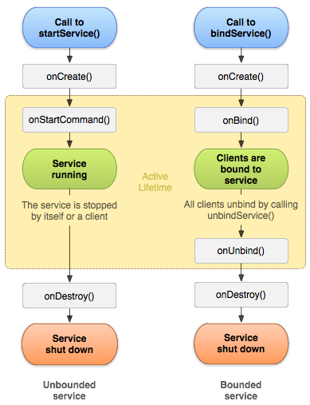


### Sincronicità

- **Service**
  - Il funzionamento di un Service è **sincrono**
  - **Non** ci sono **thread** nell’esecuzione di un servizio
  - Di **default** un service gira nel **main thread** dell’applicazione
- **Thread**
  - Per supportare l’esecuzione dei **servizi** in modalità **asincrona**, si inseriscono in un **thread secondario**
  - Android fornisce come supporto gli **`JobIntentService`** che incorporano già un **thread dedicato**


### `JobScheduler`

- **`JobScheduler`**: meccanismo dedicato alle **operazioni in background** ma con una maggiore attenzione alla gestione della **batteria**
- **`JobInfo`**: **gestore delle attività** da svolgere nel `JobScheduler` e custode delle condizioni per l’**avvio dei task**

Passi per l’**attivazione** di un’**attività asincrona**
1. Definizione di una **classe derivata da `JobService`** in cui verranno specificate le **attività** da svolgere in maniera asincrona
2. Creazione di un **oggetto `JobInfo`** cui sarà collegato il `JobService` del punto precedente
3. **Inserimento** del `JobInfo` nello `JobScheduler` mediante l’invocazione del metodo **`schedule`**
4. **Attivazione del task asincrono** non appena i criteri specificati nel `JobInfo` saranno soddisfatti


#### Preparazione del `JobInfo`

```java
public class MyTask extends JobService {
    @Override
    public boolean onStartJob(JobParameters params) {
        // attività da svolgere all'avvio del service
        return true;
    }
    @Override
    public boolean onStopJob(JobParameters jobParameters) {
        // attività da svolgere al termine del Job
        return true;
    }
}
```

```xml
<service android:name="MyTask" android:permission="android.permission.BIND_JOB_SERVICE">
```


#### Creazione del `JobInfo`

```java
// il Builder richiede la componente relativa al Service
JobInfo.Builder builder = new JobInfo.Builder(1, new ComponentName(getPackageName(),                                                                            MyTask.class.getName()));
// impostazione delle condizioni
builder.setRequiredNetworkType(JobInfo.NETWORK_TYPE_UNMETERED);
// creazione del JobInfo
JobInfo jobinfo = builder.build();
```


#### Creazione del `JobScheduler`

```java
// creazione del JobScheduler
JobScheduler scheduler = (JobScheduler) this.getSystemService(JOB_SCHEDULER_SERVICE);
// schedulazione del JobInfo
int res = scheduler.schedule(jobinfo);
// valutazione del risultato
if (res == JobScheduler.RESULT_SUCCESS) {
    // attività da svolgere in caso di successo
} else {
    // attività da svolgere in caso di errore
}
```


### Thread vs. Service

| Thread                                                       | Service                                                      |
| ------------------------------------------------------------ | ------------------------------------------------------------ |
| L'applicazione deve essere **visibile** quando l’operazione è in esecuzione | L'applicazione può anche essere **non visibile** o in modalità **sleep** durante l’esecuzione dell’operazione |
| L'**utente aspetta** che l'operazione finisca prima di fare altro nell'app\* | L’utente **non deve attendere** che l’operazione termini prima di proseguire con l’utilizzo dell’applicazione |
| L'activity/applicazione è **fortemente accoppiata** con l'operazione in background | L’esecuzione delle operazioni sono **indipendenti dal contest** dell’applicazione |

\*L’operazione eseguita in **background** è relativamente di **corta durata** (meno di 90 secondi)

I thread garantiscono **codice** più **pulito**, leggibile e manutenibile, ma è comunque possibile utilizzare un Service


---


# <span style='color:#b20'></span>

[root]: ../LMT/

